---
params:
 title: "Technical Potential of Demand Response"
 subtitle: "Heat Pump Analysis"
title: 'Technical Potential of Demand Response'
subtitle: 'Heat Pump Analysis'
author: 'Carsten Dortans (xxx@otago.ac.nz)'
date: 'Last run at: 2018-07-03 14:09:44'
output:
  bookdown::html_document2:
    toc: true
    toc_float: TRUE
    toc_depth: 2
    keep_md: TRUE
    self_contained: no
  bookdown::pdf_document2:
    toc: true
    toc_depth: 2
bibliography: '/Users/carsten.dortans/Desktop/R Profiles/git.soton/NZ GREENGrid/nzGREENGrid/bibliography.bib'
---


\newpage

# Citation

If you wish to use any of the material from this report please cite as:

 * Dortans, C. (2018) Technical Potential of Demand Response: Heat Pump Analysis, [Centre for Sustainability](http://www.otago.ac.nz/centre-sustainability/), University of Otago: Dunedin.

This work is (c) 2018 the University of Southampton.

\newpage

# About

## Circulation


Report circulation:

 * Restricted to: [NZ GREEN Grid](https://www.otago.ac.nz/centre-sustainability/research/energy/otago050285.html) project partners and contractors.
 
## Purpose

This report is intended to: 

 * load and test GREEN Grid heat pump and hot water profiles.

## Requirements:

 * test dataset stored at /Users/carsten.dortans/Dropbox/Carsten_MA/ggData/profiles/

## History


Generally tracked via our git.soton [repo](https://git.soton.ac.uk/ba1e12/nzGREENGrid):

 * [history](https://git.soton.ac.uk/ba1e12/nzGREENGrid/commits/master)
 * [issues](https://git.soton.ac.uk/ba1e12/nzGREENGrid/issues)
 
Specific history of this code:

 * https://git.soton.ac.uk/ba1e12/nzGREENGrid/tree/master/analysis/demandResponse

## Support


This work was supported by:

 * The [University of Otago](https://www.otago.ac.nz/);
 * The [University of Southampton](https://www.southampton.ac.uk/);
 * The New Zealand [Ministry of Business, Innovation and Employment (MBIE)](http://www.mbie.govt.nz/) through the [NZ GREEN Grid](https://www.otago.ac.nz/centre-sustainability/research/energy/otago050285.html) project;
 * [SPATIALEC](http://www.energy.soton.ac.uk/tag/spatialec/) - a [Marie Skłodowska-Curie Global Fellowship](http://ec.europa.eu/research/mariecurieactions/about-msca/actions/if/index_en.htm) based at the University of Otago’s [Centre for Sustainability](http://www.otago.ac.nz/centre-sustainability/staff/otago673896.html) (2017-2019) & the University of Southampton's Sustainable Energy Research Group (2019-202).

We do not 'support' the code but if you have a problem check the [issues](https://git.soton.ac.uk/ba1e12/nzGREENGrid/issues) on our [repo](https://git.soton.ac.uk/ba1e12/nzGREENGrid) and if it doesn't already exist, open one. We might be able to fix it :-)
 

# Load data files

## Heat pump profiles

This file is the pre-aggregated data for all heat pump circuits in the GREEN Grid data for April 2015 - March 2016 (check!)


```r
ggParams$profilesFile <- paste0(ggParams$dataLoc, "Heat Pump_2015-04-01_2016-03-31_overallSeasonalProfiles.csv.gz")
```

In this section we load and describe the  data files from /Users/carsten.dortans/Dropbox/Carsten_MA/ggData/profiles/Heat Pump_2015-04-01_2016-03-31_overallSeasonalProfiles.csv.gz.


```r
print(paste0("Trying to load: ", ggParams$profilesFile))
```

```
## [1] "Trying to load: /Users/carsten.dortans/Dropbox/Carsten_MA/ggData/profiles/Heat Pump_2015-04-01_2016-03-31_overallSeasonalProfiles.csv.gz"
```

```r
heatPumpProfileDT <- data.table::as.data.table(readr::read_csv(ggParams$profilesFile))
```

```
## Parsed with column specification:
## cols(
##   obsHourMin = col_time(format = ""),
##   season = col_character(),
##   meanW = col_double(),
##   medianW = col_double(),
##   nObs = col_integer(),
##   sdW = col_double()
## )
```


Describe using skim:


```r
skimr::skim(heatPumpProfileDT)
```

```
## Skim summary statistics
##  n obs: 5760 
##  n variables: 6 
## 
## ── Variable type:character ──────────────────────────────────────────────────────────────────────────────────────────────────────────
##  variable missing complete    n min max empty n_unique
##    season       0     5760 5760   6   6     0        4
## 
## ── Variable type:difftime ───────────────────────────────────────────────────────────────────────────────────────────────────────────
##    variable missing complete    n    min        max     median n_unique
##  obsHourMin       0     5760 5760 0 secs 86340 secs 43170 secs     1440
## 
## ── Variable type:integer ────────────────────────────────────────────────────────────────────────────────────────────────────────────
##  variable missing complete    n    mean     sd   p0    p25    p50     p75
##      nObs       0     5760 5760 2474.38 193.08 2150 2402.5 2517.5 2599.25
##  p100     hist
##  2688 ▅▁▁▁▁▇▁▅
## 
## ── Variable type:numeric ────────────────────────────────────────────────────────────────────────────────────────────────────────────
##  variable missing complete    n   mean     sd     p0    p25    p50    p75
##     meanW       0     5760 5760 143.52 116.99  34.99  71.88 104.76 174.71
##   medianW       0     5760 5760  17.09  67.67   0      0      0      0   
##       sdW       0     5760 5760 329.77 146.05 101.04 234.33 298.61 407.13
##    p100     hist
##  613.89 ▇▃▂▁▁▁▁▁
##  392.55 ▇▁▁▁▁▁▁▁
##  879.07 ▆▇▆▅▂▂▁▁
```

Draw a plot of GreenGrid heat pump profiles.


```r
myPlot <- ggplot2::ggplot(heatPumpProfileDT, aes(x = obsHourMin, colour = season)) +
  geom_point(aes(y = meanW)) +
  facet_grid(season ~ .)

myPlot
```

<div class="figure">

<p class="caption">(\#fig:profilePlot)Heat pump profiles</p>
</div>

# Scaling method 1

Now draw a plot of what woud happen if we scaled this up to all NZ households?

Figure \@ref(fig:scaledUpPlots)


```r
nzHH <- 1549890

heatPumpProfileDT <- heatPumpProfileDT[, scaledMWmethod1 := (meanW * nzHH)/10^6]

myPlot <- ggplot2::ggplot(heatPumpProfileDT, aes(x = obsHourMin, colour = season)) +
  geom_point(aes(y = scaledMWmethod1)) +
  facet_grid(season ~ .)

myPlot
```

<div class="figure">

<p class="caption">(\#fig:scaledUpPlots)Mean Load Heat Pumps by Season</p>
</div>

# Scaling method 2

Alternative calculation method: Assuming EECA data is correct for heat pump value, 1) generating the percentage of total load (peroftotal) while telling data.table to create a new column with the calculation of the percentage. We then multiplied EECA's total GWh with the percentage


```r
totalGWH<-708

summeanW<-heatPumpProfileDT[,sum(meanW)]


heatPumpProfileDT <- heatPumpProfileDT[, EECApmMethod2 := (meanW / summeanW) * totalGWH] 

myPlot <- ggplot2::ggplot(heatPumpProfileDT, aes(x = obsHourMin, colour = season)) +
  geom_point(aes(y = EECApmMethod2)) +
  facet_grid(season ~ .) +
  labs(x='Time of Day', y='GWh')

myPlot
```

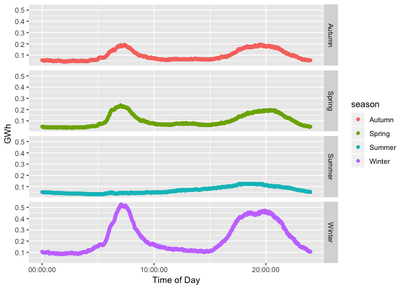<!-- -->

# Aggregation to half-hours

So far we have used data at the 1 minute level. This makes for difficulties in comparison with standared electricity sector half-hourly tariff periods etc. This section takes each scaling method, aggregates to half-hours as appropriate and re-plots.

To do that we need to set a half-hour value from the observed time. We do this using truncate so that:

 * 13:18:00 -> 13:00:00
 * 13:40:00 -> 13:30 etc

> NB: This means any plots will be using the 1/2 hour value at the  _start_  of the period!


```r
# create a 'half hour' variable for aggregation
heatPumpProfileDT <- heatPumpProfileDT[, obsHalfHour := hms::trunc_hms(obsHourMin, 1800)] # <- this truncates the time to the previous half hour (hms works in seconds so 30 mins * 60 secs = 1800 secs). e.g. 13:18:00 -> 13:00:00 but 13:40:00 -> 13:30 etc

# This means any plots will be using the 1/2 hour value at the  -> start <-  of the period!

# check
head(heatPumpProfileDT)
```

```
##    obsHourMin season     meanW medianW nObs      sdW scaledMWmethod1
## 1:   00:00:00 Autumn  72.43808       0 2543 253.7921        112.2711
## 2:   00:00:00 Spring  87.36049       0 2512 289.1072        135.3991
## 3:   00:00:00 Summer  82.63281       0 2160 258.2699        128.0718
## 4:   00:00:00 Winter 150.92446       0 2685 383.6956        233.9163
## 5:   00:01:00 Autumn  70.26538       0 2544 238.4719        108.9036
## 6:   00:01:00 Spring  86.17364       0 2511 286.9992        133.5597
##    EECApmMethod2 obsHalfHour
## 1:    0.06203848    00:00:00
## 2:    0.07481856    00:00:00
## 3:    0.07076961    00:00:00
## 4:    0.12925695    00:00:00
## 5:    0.06017771    00:00:00
## 6:    0.07380210    00:00:00
```

## Method 1


```r
# aggregate the scaled MW to half hours
# as it is MW we need to take the mean - taking the sum would not be meaningfull
method1AggDT <- heatPumpProfileDT[, .(meanMW = mean(scaledMWmethod1)), 
                                  keyby = .(season, obsHalfHour)] # <- takes the mean for each category of half hour & season

myPlot <- ggplot2::ggplot(method1AggDT, aes(x = obsHalfHour, colour = season)) +
  geom_point(aes(y = meanMW)) +
  facet_grid(season ~ .) +
  labs(x='Time of Day', y='Mean MW') +
  scale_x_time(breaks = c(hms::as.hms("06:00:00"), hms::as.hms("09:00:00"), hms::as.hms("12:00:00"), 
                          hms::as.hms("15:00:00"), hms::as.hms("18:00:00"), hms::as.hms("21:00:00")))

myPlot
```

<!-- -->


## Method 2
Used the EECA total NZ number for heat pump energy consumption and converted it into GWh. Converted minute data into half-hour steps. 
To do :-)

> NB: should you aggregate this scaling method using mean or sum? Why? :-) -->Since we take the percentages of GWh we need to sum up


```r
# aggregate the percentage of GWh
method2AggDT <- heatPumpProfileDT[, .(GWh = sum(EECApmMethod2)), 
                                  keyby = .(season, obsHalfHour)] # <- takes the sum for each category of half hour & season

myPlot <- ggplot2::ggplot(method2AggDT, aes(x = obsHalfHour, colour=GWh)) +
  geom_point(aes(y = GWh)) +
  ggtitle("Total New Zealand half hour heat pump energy consumption by season for 2015") +
  facet_grid(season ~ .) +
  labs(x='Time of Day', y='GWh') +
  scale_x_time(breaks = c(hms::as.hms("00:00:00"), hms::as.hms("03:00:00"), hms::as.hms("06:00:00"), hms::as.hms("09:00:00"), hms::as.hms("12:00:00"), 
                          hms::as.hms("15:00:00"), hms::as.hms("18:00:00"), hms::as.hms("21:00:00"))) +
scale_colour_gradient(low= "green", high="red")

myPlot
```

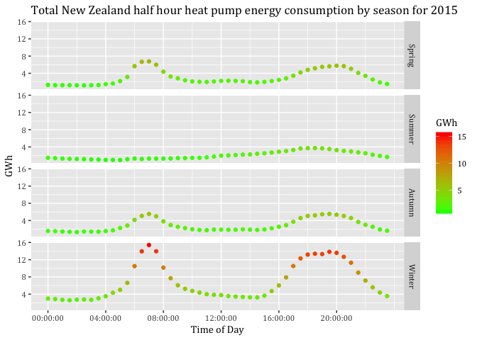<!-- -->

#BRANZ vs. EECA comparison

```r
nzHHheatPumps <- 515015 #This is based on the BRANZ report of household ownership and 2013 census data
wToKw <- 1000
assumeDaysPerSeason <- 90

heatPumpProfileDT <- heatPumpProfileDT[, scaledGWh := (((meanW * nzHHheatPumps)/wToKw)*(1/60)*assumeDaysPerSeason)/1000/1000] # <- convert mean W to kWh for all NZ hhs, then assumes 90 days per season and calculate GWh

sumbranzGWh <- heatPumpProfileDT[, sum(scaledGWh)]


diffbranzeeca <- 1-(sumbranzGWh/totalGWH)
skimr::skim(sumbranzGWh)
```

```
## 
## Skim summary statistics
## 
## ── Variable type:numeric ────────────────────────────────────────────────────────────────────────────────────────────────────────────
##     variable missing complete n   mean sd     p0    p25    p50    p75
##  sumbranzGWh       0        1 1 638.63 NA 638.63 638.63 638.63 638.63
##    p100     hist
##  638.63 ▁▁▁▇▁▁▁▁
```

```r
skimr::skim(totalGWH)
```

```
## 
## Skim summary statistics
## 
## ── Variable type:numeric ────────────────────────────────────────────────────────────────────────────────────────────────────────────
##  variable missing complete n mean sd  p0 p25 p50 p75 p100     hist
##  totalGWH       0        1 1  708 NA 708 708 708 708  708 ▁▁▁▇▁▁▁▁
```

```r
skimr::skim(diffbranzeeca)
```

```
## 
## Skim summary statistics
## 
## ── Variable type:numeric ────────────────────────────────────────────────────────────────────────────────────────────────────────────
##       variable missing complete n  mean sd    p0   p25   p50   p75  p100
##  diffbranzeeca       0        1 1 0.098 NA 0.098 0.098 0.098 0.098 0.098
##      hist
##  ▁▁▁▇▁▁▁▁
```
Wee identify that BRANZ in comination with GREENGrid Grid Spy and 2013 household ownership census data represent a 9% lower total energy consumption for heat pumps than EECA calculates.

EECA total energy consumption by heat pumps for 2015 (totalGWH) <- 708GWh

BRANZ 40% of owner-occupied households and 25% of rentals own heat pumps. Energy consumption based on BRANZ proportion, Census 2013 and GREENGris Grid Spy data (sumbranzGWh) <- 638GWh 


# Yearly consumption
We need the original data for this, currently the data basis is for an average day in each season.

```r
heatPumpProfileDT <- heatPumpProfileDT[, obsHalfHour := hms::trunc_hms(obsHourMin, 1800)]
```

# Technical potential of demand response: Scenarios for heat pump data
We assume that peak time periods are prevalent from 6.00am-10.00am and from 4.00pm-8.00pm.

## Load curtailment to zero
In this first scenario we assume that the laod during peak time periods is cut out of the consumption pattern.

###Defining peak/off-peak periods 
Steps:
1) Extracting peak time-periods from heat pump data
2) Building sum of GWh


```r
sc1data <- heatPumpProfileDT
sc1data[, c("medianW", "obsHourMin", "meanW", "nObs", "sdW",
            "scaledMWmethod1", "EECApmMethod2"):=NULL] #Deleting unnecessary columns

sc1data <- sc1data[, .(GWh = sum(scaledGWh)), 
                    keyby = .(season, obsHalfHour)]

sc1data <- sc1data[, Period := "Not Peak"]

sc1data <- sc1data[obsHalfHour >= hms::as.hms("06:00:00") & 
                     obsHalfHour <= hms::as.hms("10:00:00"),
                   Period := "Morning Peak"]

sc1data <- sc1data[obsHalfHour >= hms::as.hms("16:00:00") & 
                     obsHalfHour <= hms::as.hms("20:00:00"),
                   Period := "Evening Peak"]
```


### Visualising periods

```r
myPlot <- ggplot2::ggplot(sc1data, aes(x = obsHalfHour, color=Period)) +
  geom_point(aes(y=GWh), size=0.5, alpha = 1) +
  theme(text = element_text(family = "Cambria")) +
  ggtitle("Total heat pump energy consumption by time-period") +
  facet_grid(season ~ .) +
  labs(x='Time of Day', y='GWh') +
  scale_y_continuous(breaks = c(3, 6, 9, 12)) +
  scale_x_time(breaks = c(hms::as.hms("00:00:00"), hms::as.hms("03:00:00"), hms::as.hms("06:00:00"),       hms::as.hms("09:00:00"), hms::as.hms("12:00:00"), 
  hms::as.hms("15:00:00"), hms::as.hms("18:00:00"), hms::as.hms("21:00:00"))) 
  #scale_colour_gradient(low= "green", high="red", guide = "colorbar")

myPlot
```

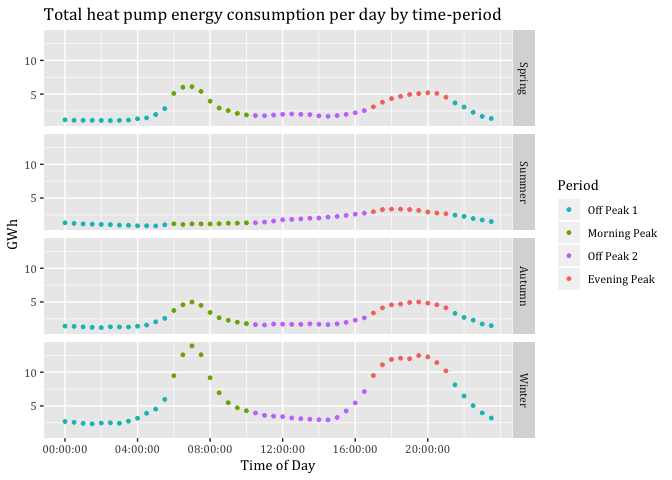<!-- -->

```r
#ggsave("Total heat pump energy consumption by time-period for 2015.jpeg",
       #dpi=600)
```

### Potential load curtailment output by period in GWh


```r
sc1data <- sc1data[, .(PotCur = sum(GWh)),
                   keyby = .(season, Period)]
sc1data
```

```
##     season       Period    PotCur
##  1: Autumn Evening Peak  29.11365
##  2: Autumn Morning Peak  38.35385
##  3: Autumn     Not Peak  56.17032
##  4: Spring Evening Peak  35.80694
##  5: Spring Morning Peak  39.09743
##  6: Spring     Not Peak  56.38630
##  7: Summer Evening Peak  10.12392
##  8: Summer Morning Peak  23.28916
##  9: Summer     Not Peak  53.98303
## 10: Winter Evening Peak  75.27774
## 11: Winter Morning Peak  96.89743
## 12: Winter     Not Peak 124.13141
```

### Visualising curtailed periods


```r
sc1data <- heatPumpProfileDT
sc1data[, c("medianW", "obsHourMin", "meanW", "nObs", "sdW",
            "scaledMWmethod1", "EECApmMethod2"):=NULL] #Deleting unnecessary columns
```

```
## Warning in `[.data.table`(sc1data, , `:=`(c("medianW", "obsHourMin",
## "meanW", : Adding new column 'medianW' then assigning NULL (deleting it).
```

```
## Warning in `[.data.table`(sc1data, , `:=`(c("medianW", "obsHourMin",
## "meanW", : Adding new column 'obsHourMin' then assigning NULL (deleting
## it).
```

```
## Warning in `[.data.table`(sc1data, , `:=`(c("medianW", "obsHourMin",
## "meanW", : Adding new column 'meanW' then assigning NULL (deleting it).
```

```
## Warning in `[.data.table`(sc1data, , `:=`(c("medianW", "obsHourMin",
## "meanW", : Adding new column 'nObs' then assigning NULL (deleting it).
```

```
## Warning in `[.data.table`(sc1data, , `:=`(c("medianW", "obsHourMin",
## "meanW", : Adding new column 'sdW' then assigning NULL (deleting it).
```

```
## Warning in `[.data.table`(sc1data, , `:=`(c("medianW", "obsHourMin",
## "meanW", : Adding new column 'scaledMWmethod1' then assigning NULL
## (deleting it).
```

```
## Warning in `[.data.table`(sc1data, , `:=`(c("medianW", "obsHourMin",
## "meanW", : Adding new column 'EECApmMethod2' then assigning NULL (deleting
## it).
```

```r
sc1data <- sc1data[, .(GWhs1 = sum(scaledGWh)), 
                    keyby = .(season, obsHalfHour)]

sc1data <- sc1data[, Period := "Not Peak"]

sc1data <- sc1data[obsHalfHour >= hms::as.hms("06:00:00") & 
                     obsHalfHour <= hms::as.hms("10:00:00"),
                   Period := "Morning Peak"]

sc1data <- sc1data[obsHalfHour >= hms::as.hms("16:00:00") & 
                     obsHalfHour <= hms::as.hms("20:00:00"),
                   Period := "Evening Peak"]

sc1data <- sc1data[, GWh:=GWhs1] # Creating new column GWh based on GWhs1


#sc1data <- sc1data[Period == "Evening Peak",
                   #GWh := 0]

sc1data <- sc1data[, GWh:= ifelse(Period == "Evening Peak", 0, GWh )] # If Period is Evening peak then make GWh zero
                   
sc1data <- sc1data[, GWh:= ifelse(Period == "Morning Peak", 0, GWh )]


myPlot <- ggplot2::ggplot(sc1data, aes(x = obsHalfHour, y = GWh, color=GWh)) +
  geom_line(size=0.5) +
  theme(text = element_text(family = "Cambria")) +
  ggtitle("Total heat pump load curtailment in peak time-periods by season") +
  facet_grid(season ~ .) +
  labs(x='Time of Day', y='GWh') +
  scale_y_continuous(breaks = c(3, 6, 9, 12)) +
  scale_x_time(breaks = c(hms::as.hms("00:00:00"), hms::as.hms("03:00:00"), hms::as.hms("06:00:00"),       hms::as.hms("09:00:00"), hms::as.hms("12:00:00"), 
  hms::as.hms("15:00:00"), hms::as.hms("18:00:00"), hms::as.hms("21:00:00"))) +
  scale_colour_gradient(low= "green", high="red", guide = "colorbar")

myPlot
```

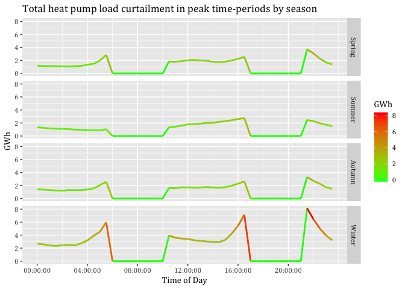<!-- -->

```r
#ggsave("Total heat pump load curtailment in peak time-periods by season.jpeg",
       #dpi=600) 
```
##Load curtailment of particular amount
###Visualising new load profile

```r
sc1data <- heatPumpProfileDT
sc1data[, c("medianW", "obsHourMin", "meanW", "nObs", "sdW",
            "scaledMWmethod1", "EECApmMethod2"):=NULL] #Deleting unnecessary columns
```

```
## Warning in `[.data.table`(sc1data, , `:=`(c("medianW", "obsHourMin",
## "meanW", : Adding new column 'medianW' then assigning NULL (deleting it).
```

```
## Warning in `[.data.table`(sc1data, , `:=`(c("medianW", "obsHourMin",
## "meanW", : Adding new column 'obsHourMin' then assigning NULL (deleting
## it).
```

```
## Warning in `[.data.table`(sc1data, , `:=`(c("medianW", "obsHourMin",
## "meanW", : Adding new column 'meanW' then assigning NULL (deleting it).
```

```
## Warning in `[.data.table`(sc1data, , `:=`(c("medianW", "obsHourMin",
## "meanW", : Adding new column 'nObs' then assigning NULL (deleting it).
```

```
## Warning in `[.data.table`(sc1data, , `:=`(c("medianW", "obsHourMin",
## "meanW", : Adding new column 'sdW' then assigning NULL (deleting it).
```

```
## Warning in `[.data.table`(sc1data, , `:=`(c("medianW", "obsHourMin",
## "meanW", : Adding new column 'scaledMWmethod1' then assigning NULL
## (deleting it).
```

```
## Warning in `[.data.table`(sc1data, , `:=`(c("medianW", "obsHourMin",
## "meanW", : Adding new column 'EECApmMethod2' then assigning NULL (deleting
## it).
```

```r
sc1data <- sc1data[, .(GWhs1 = sum(scaledGWh)), 
                    keyby = .(season, obsHalfHour)]

sc1data <- sc1data[, Period := "Not Peak"]

sc1data <- sc1data[obsHalfHour >= hms::as.hms("06:00:00") & 
                     obsHalfHour <= hms::as.hms("10:00:00"),
                   Period := "Morning Peak"]

sc1data <- sc1data[obsHalfHour >= hms::as.hms("16:00:00") & 
                     obsHalfHour <= hms::as.hms("20:00:00"),
                   Period := "Evening Peak"]

sc1data <- sc1data[, GWh:=GWhs1] # Creating new column GWh based on GWhs1

sc1data <- sc1data[, GWh:= ifelse(Period == "Evening Peak", 0.5*GWh, GWh )] # If Period is Evening peak then change the value of GWh by 50%
                   
sc1data <- sc1data[, GWh:= ifelse(Period == "Morning Peak", GWh*0.5, GWh )]


myPlot <- ggplot2::ggplot(sc1data, aes(x = obsHalfHour, y = GWh, color=GWh)) +
  geom_line(size=0.5) +
  theme(text = element_text(family = "Cambria")) +
  ggtitle("Total heat pump load curtailment in peak time-periods by season 50%") +
  facet_grid(season ~ .) +
  labs(x='Time of Day', y='GWh') +
  scale_y_continuous(breaks = c(3, 6, 9, 12)) +
  scale_x_time(breaks = c(hms::as.hms("00:00:00"), hms::as.hms("03:00:00"), hms::as.hms("06:00:00"),       hms::as.hms("09:00:00"), hms::as.hms("12:00:00"), 
  hms::as.hms("15:00:00"), hms::as.hms("18:00:00"), hms::as.hms("21:00:00"))) +
  scale_colour_gradient(low= "green", high="red", guide = "colorbar")

myPlot
```

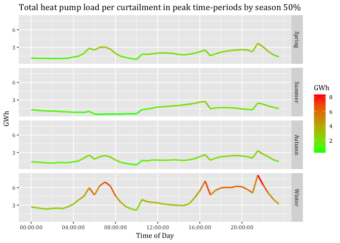<!-- -->

```r
ggsave("Total heat pump load curtailment in peak time-periods by season 50.jpeg",
       dpi=600) 
```

```
## Saving 7 x 5 in image
```
###Potential load curtailment based on percentage curtailed

```r
sc1data <- sc1data[, .(PotCur = sum(GWh)),
                   keyby = .(season, Period)]
sc1data
```

```
##     season       Period     PotCur
##  1: Autumn Evening Peak  14.556826
##  2: Autumn Morning Peak  19.176923
##  3: Autumn     Not Peak  56.170319
##  4: Spring Evening Peak  17.903472
##  5: Spring Morning Peak  19.548717
##  6: Spring     Not Peak  56.386304
##  7: Summer Evening Peak   5.061961
##  8: Summer Morning Peak  11.644582
##  9: Summer     Not Peak  53.983031
## 10: Winter Evening Peak  37.638868
## 11: Winter Morning Peak  48.448717
## 12: Winter     Not Peak 124.131411
```
##Load shifting to prior periods


```r
sc1data <- heatPumpProfileDT
sc1data[, c("medianW", "obsHourMin", "meanW", "nObs", "sdW",
            "scaledMWmethod1", "EECApmMethod2"):=NULL] #Deleting unnecessary columns
```

```
## Warning in `[.data.table`(sc1data, , `:=`(c("medianW", "obsHourMin",
## "meanW", : Adding new column 'medianW' then assigning NULL (deleting it).
```

```
## Warning in `[.data.table`(sc1data, , `:=`(c("medianW", "obsHourMin",
## "meanW", : Adding new column 'obsHourMin' then assigning NULL (deleting
## it).
```

```
## Warning in `[.data.table`(sc1data, , `:=`(c("medianW", "obsHourMin",
## "meanW", : Adding new column 'meanW' then assigning NULL (deleting it).
```

```
## Warning in `[.data.table`(sc1data, , `:=`(c("medianW", "obsHourMin",
## "meanW", : Adding new column 'nObs' then assigning NULL (deleting it).
```

```
## Warning in `[.data.table`(sc1data, , `:=`(c("medianW", "obsHourMin",
## "meanW", : Adding new column 'sdW' then assigning NULL (deleting it).
```

```
## Warning in `[.data.table`(sc1data, , `:=`(c("medianW", "obsHourMin",
## "meanW", : Adding new column 'scaledMWmethod1' then assigning NULL
## (deleting it).
```

```
## Warning in `[.data.table`(sc1data, , `:=`(c("medianW", "obsHourMin",
## "meanW", : Adding new column 'EECApmMethod2' then assigning NULL (deleting
## it).
```

```r
sc1data <- sc1data[, .(GWhs1 = sum(scaledGWh)), 
                    keyby = .(season, obsHalfHour)]


#Defining peak and off-peak periods
sc1data <- sc1data[, Period := "Not Peak"]

sc1data <- sc1data[obsHalfHour >= hms::as.hms("06:00:00") & 
                     obsHalfHour <= hms::as.hms("10:00:00"),
                   Period := "Morning Peak"]

sc1data <- sc1data[obsHalfHour >= hms::as.hms("16:00:00") & 
                     obsHalfHour <= hms::as.hms("20:00:00"),
                   Period := "Evening Peak"]

sc1data <- sc1data[obsHalfHour >= hms::as.hms("20:30:00") & 
                     obsHalfHour <= hms::as.hms("23:30:00"),
                   Period := "Off Peak 1"]

sc1data <- sc1data[obsHalfHour >= hms::as.hms("00:00:00") & 
                     obsHalfHour <= hms::as.hms("05:30:00"),
                   Period := "Off Peak 1"]

sc1data <- sc1data[obsHalfHour >= hms::as.hms("10:30:00") & 
                     obsHalfHour <= hms::as.hms("15:30:00"),
                   Period := "Off Peak 2"]

#Building the sum of each peak period by season
AuMP <- sc1data[season == "Autumn" & Period == "Morning Peak",
                sum(GWhs1)]
WiMP <- sc1data[season == "Winter" & Period == "Morning Peak",
                sum(GWhs1)]
SpMP <- sc1data[season == "Spring" & Period == "Morning Peak",
                sum(GWhs1)]
SuMP <- sc1data[season == "Summer" & Period == "Morning Peak",
                sum(GWhs1)]

AuEP <- sc1data[season == "Autumn" & Period == "Evening Peak",
                sum(GWhs1)]
WiEP <- sc1data[season == "Winter" & Period == "Evening Peak",
                sum(GWhs1)]
SpEP <- sc1data[season == "Spring" & Period == "Evening Peak",
                sum(GWhs1)]
SuEP <- sc1data[season == "Summer" & Period == "Evening Peak",
                sum(GWhs1)]


#Counting number of rows that will be associated to spread the Morning Peak
AuMPHalfHours <- nrow(sc1data[season == "Autumn" &
                              Period == "Off Peak 1"])
WiMPHalfHours <- nrow(sc1data[season == "Winter" &
                              Period == "Off Peak 1"])
SpMPHalfHours <- nrow(sc1data[season == "Spring" &
                              Period == "Off Peak 1"])
SuMPHalfHours <- nrow(sc1data[season == "Summer" &
                              Period == "Off Peak 1"])

#Counting number of rows that will be associated to spread the Evening Peak
AuEPHalfHours <- nrow(sc1data[season == "Autumn" &
                              Period == "Off Peak 2"])
WiEPHalfHours <- nrow(sc1data[season == "Winter" &
                              Period == "Off Peak 2"])
SpEPHalfHours <- nrow(sc1data[season == "Spring" &
                              Period == "Off Peak 2"])
SuEPHalfHours <- nrow(sc1data[season == "Summer" &
                              Period == "Off Peak 2"])

#Calculating the proportion that each row will take on to spread the GWhs
distGWhOP1Au <- AuMP/AuMPHalfHours
distGWhOP1Wi <- WiMP/WiMPHalfHours
distGWhOP1Sp <- SpMP/SpMPHalfHours
distGWhOP1Su <- SuMP/SuMPHalfHours

distGWhOP2Au <- AuEP/AuEPHalfHours
distGWhOP2Wi <- WiEP/WiEPHalfHours
distGWhOP2Sp <- SpEP/SpEPHalfHours
distGWhOP2Su <- SuEP/SuEPHalfHours


#Adding amount of spreaded peak consumption to off-peak periods
sc1data <- sc1data[season == "Autumn" &
                     Period == "Off Peak 1", GWhs3 :=
                     GWhs1 + distGWhOP1Au]
sc1data <- sc1data[season == "Winter" &
                     Period == "Off Peak 1", GWhs3 :=
                     GWhs1 + distGWhOP1Wi]
sc1data <- sc1data[season == "Spring" &
                     Period == "Off Peak 1", GWhs3 :=
                     GWhs1 + distGWhOP1Sp]
sc1data <- sc1data[season == "Summer" &
                     Period == "Off Peak 1", GWhs3 :=
                     GWhs1 + distGWhOP1Su]


sc1data <- sc1data[season == "Autumn" &
                     Period == "Off Peak 2", GWhs3 :=
                     GWhs1 + distGWhOP2Au]
sc1data <- sc1data[season == "Winter" &
                     Period == "Off Peak 2", GWhs3 :=
                     GWhs1 + distGWhOP2Wi]
sc1data <- sc1data[season == "Spring" &
                     Period == "Off Peak 2", GWhs3 :=
                     GWhs1 + distGWhOP2Sp]
sc1data <- sc1data[season == "Summer" &
                     Period == "Off Peak 2", GWhs3 :=
                     GWhs1 + distGWhOP2Su]


#Setting missing values in peak periods to NULL
sc1data <- sc1data[, GWhs3:= ifelse(Period =="Morning Peak",
                                  0, GWhs3)]
sc1data <- sc1data[, GWhs3:= ifelse(Period =="Evening Peak",
                                  0, GWhs3)]


#Renaming GWhs3 into GWh to depict the right text in the colorbar
setnames(sc1data, old=c("GWhs3"), new=c("GWh"))

#Visualising only shifted consumption
#myPlot <- ggplot2::ggplot(sc1data, aes(x = obsHalfHour, color=GWh)) +
  #geom_line(aes(y=GWh), size=0.5) +
  #theme(text = element_text(family = "Cambria")) +
  #ggtitle("Total shifted New Zealand half hour heat pump energy consumption by season for 2015") +
  #facet_grid(season ~ .) +
  #labs(x='Time of Day', y='GWh') +
  #scale_y_continuous(breaks = c(4, 8, 12, 16)) +
  #scale_x_time(breaks = c(hms::as.hms("00:00:00"), hms::as.hms("03:00:00"), hms::as.hms("06:00:00"),       hms::as.hms("09:00:00"), hms::as.hms("12:00:00"), 
  #hms::as.hms("15:00:00"), hms::as.hms("18:00:00"), hms::as.hms("21:00:00"))) +
  #scale_colour_gradient(low= "green", high="red", guide = "colorbar")

#myPlot

#Visualising shifted and original consumption
myPlot <- ggplot2::ggplot(sc1data, aes(x = obsHalfHour)) +
  geom_line(aes(y=GWh, color=GWh), size=0.5) +
  geom_line(aes(y=GWhs1, color=GWhs1), size=0.5) +
  theme(text = element_text(family = "Cambria")) +
  ggtitle("Original and shifted New Zealand half hour heat pump energy consumption by season for 2015") +
  facet_grid(season ~ .) +
  labs(x='Time of Day', y='GWh') +
  scale_y_continuous(breaks = c(4, 8, 12, 16)) +
  scale_x_time(breaks = c(hms::as.hms("00:00:00"), hms::as.hms("03:00:00"), hms::as.hms("06:00:00"),       hms::as.hms("09:00:00"), hms::as.hms("12:00:00"), 
  hms::as.hms("15:00:00"), hms::as.hms("18:00:00"), hms::as.hms("21:00:00"))) +
  scale_color_gradient(low= "green", high="red")

myPlot
```

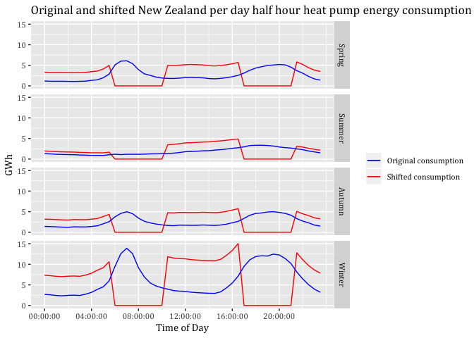<!-- -->

```r
#ggsave("Original and shifted New Zealand half hour heat pump energy consumption by season for 2015.jpeg",
       #dpi=600)
```
#Technical potential of demand response: Scenarios for hot water data

## Loading data

This file is the pre-aggregated data for all hot water  circuits in the GREEN Grid data for April 2015 - March 2016 (check!)


```r
ggParams$profilesFile <- paste0(ggParams$dataLoc, "Hot Water_2015-04-01_2016-03-31_overallSeasonalProfiles.csv.gz")
```

In this section we load and describe the  data files from /Users/carsten.dortans/Dropbox/Carsten_MA/ggData/profiles/Hot Water_2015-04-01_2016-03-31_overallSeasonalProfiles.csv.gz.


```r
print(paste0("Trying to load: ", ggParams$profilesFile))
```

```
## [1] "Trying to load: /Users/carsten.dortans/Dropbox/Carsten_MA/ggData/profiles/Hot Water_2015-04-01_2016-03-31_overallSeasonalProfiles.csv.gz"
```

```r
hotWaterProfileDT <- data.table::as.data.table(readr::read_csv(ggParams$profilesFile))
```

```
## Parsed with column specification:
## cols(
##   obsHourMin = col_time(format = ""),
##   season = col_character(),
##   meanW = col_double(),
##   medianW = col_integer(),
##   nObs = col_integer(),
##   sdW = col_double()
## )
```

##BRANZ vs. EECA comparison

```r
totalGWH <- 12727.99 * 0.2777777778 #Converting TJ (EECA 2015) into GWh
nzHH <- 1549890 #Based on Census 2013
nzHHhotWater <- nzHH * 0.88 #This is based on the BRANZ report HOT WATER OVER TIME– THE NEW ZEALAND EXPERIENCE (2008) No. 132; 88% of Hot Water Systems were electric in 2008

wToKw <- 1000
assumeDaysPerSeason <- 90

hotWaterProfileDT <- hotWaterProfileDT[, scaledGWh := (((meanW * nzHHhotWater)/wToKw)*(1/60)*assumeDaysPerSeason)/1000/1000] # <- convert mean W to kWh for all NZ hhs, then assumes 90 days per season and calculate GWh

sumbranzGWh <- hotWaterProfileDT[, sum(scaledGWh)]


diffbranzeeca <- 1-(sumbranzGWh/totalGWH)
```
I have used the 2015 EECA data because our load profiles data from the year 2015 as well. This given we identify that EECA assumes 3,535 GWh whereas the combination of BRANZ and Census 2013 calculates an amount of 3,313 GWh. EECA estimates therefore a 6% higher energy consumption of hot water systems in New Zealand using electricity fuel. In the following the BRANZ calculation will be used.

## Aggregation to half-hours and initial plot

So far we have used data at the 1 minute level. This makes for difficulties in comparison with standared electricity sector half-hourly tariff periods etc. This section takes each scaling method, aggregates to half-hours as appropriate and re-plots.

To do that we need to set a half-hour value from the observed time. We do this using truncate so that:

 * 13:18:00 -> 13:00:00
 * 13:40:00 -> 13:30 etc

> NB: This means any plots will be using the 1/2 hour value at the  _start_  of the period!


```r
# create a 'half hour' variable for aggregation
hotWaterProfileDT <- hotWaterProfileDT[, obsHalfHour := hms::trunc_hms(obsHourMin, 1800)] # <- this truncates the time to the previous half hour (hms works in seconds so 30 mins * 60 secs = 1800 secs). e.g. 13:18:00 -> 13:00:00 but 13:40:00 -> 13:30 etc

# This means any plots will be using the 1/2 hour value at the  -> start <-  of the period!

method2AggDT <- hotWaterProfileDT[, .(GWh = sum(scaledGWh)), 
                                  keyby = .(season, obsHalfHour)]#Building sum of half hours by season


# check
head(method2AggDT)
```

```
##    season obsHalfHour      GWh
## 1: Autumn    00:00:00 19.30753
## 2: Autumn    00:30:00 17.70041
## 3: Autumn    01:00:00 15.25279
## 4: Autumn    01:30:00 12.64383
## 5: Autumn    02:00:00 12.69732
## 6: Autumn    02:30:00 12.41384
```

```r
myPlot <- ggplot2::ggplot(method2AggDT, aes(x = obsHalfHour, color=GWh)) +
  geom_line(aes(y=GWh), size=0.5) +
  theme(text = element_text(family = "Cambria")) +
  ggtitle("Total New Zealand half hour hot water energy consumption by season for 2015") +
  facet_grid(season ~ .) +
  labs(x='Time of Day', y='GWh') +
  scale_y_continuous(breaks = c(10, 20, 30, 40)) +
  scale_x_time(breaks = c(hms::as.hms("00:00:00"), hms::as.hms("03:00:00"), hms::as.hms("06:00:00"),       hms::as.hms("09:00:00"), hms::as.hms("12:00:00"), 
  hms::as.hms("15:00:00"), hms::as.hms("18:00:00"), hms::as.hms("21:00:00"))) +
  scale_colour_gradient(low= "green", high="red", guide = "colorbar")

myPlot
```

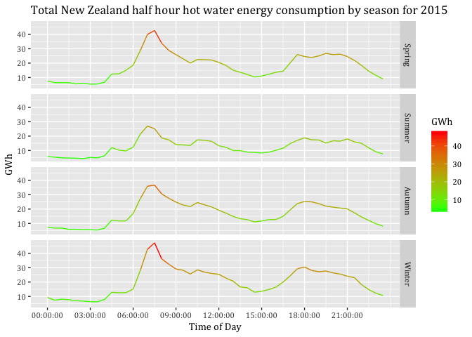<!-- -->
##Load curtailment to zero SC1


```r
#Defining peak and off-peak

sc2data <- method2AggDT

#sc2data <- sc2data[, .(GWh = sum(scaledGWh)), 
 #                   keyby = .(season, obsHalfHour)]

sc2data <- sc2data[, Period := "Not Peak"]

sc2data <- sc2data[obsHalfHour >= hms::as.hms("06:00:00") & 
                     obsHalfHour <= hms::as.hms("10:00:00"),
                   Period := "Morning Peak"]

sc2data <- sc2data[obsHalfHour >= hms::as.hms("16:00:00") & 
                     obsHalfHour <= hms::as.hms("20:00:00"),
                   Period := "Evening Peak"]

#Visualisig peak periods

myPlot <- ggplot2::ggplot(sc2data, aes(x = obsHalfHour, color=Period)) +
  geom_point(aes(y=GWh), size=0.5, alpha = 1) +
  theme(text = element_text(family = "Cambria")) +
  ggtitle("Total New Zealand hot water energy consumption by time-period") +
  facet_grid(season ~ .) +
  labs(x='Time of Day', y='GWh') +
  scale_y_continuous(breaks = c(10, 20, 30, 40)) +
  scale_x_time(breaks = c(hms::as.hms("00:00:00"), hms::as.hms("03:00:00"), hms::as.hms("06:00:00"),       hms::as.hms("09:00:00"), hms::as.hms("12:00:00"), 
  hms::as.hms("15:00:00"), hms::as.hms("18:00:00"), hms::as.hms("21:00:00"))) 
  #scale_colour_gradient(low= "green", high="red", guide = "colorbar")

myPlot
```

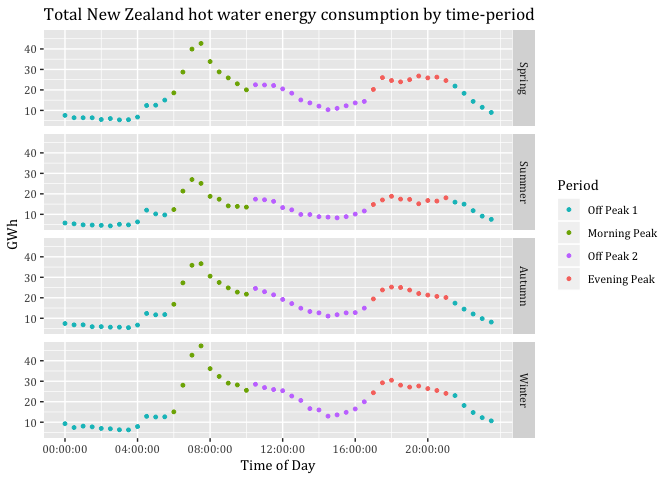<!-- -->

```r
#Potential load curtailment by season

sc2data <- sc2data[, .(PotCur = sum(GWh)),
                   keyby = .(season, Period)]
sc2data
```

```
##     season       Period   PotCur
##  1: Autumn Evening Peak 204.7668
##  2: Autumn Morning Peak 189.7475
##  3: Autumn     Not Peak 447.6241
##  4: Spring Evening Peak 233.8083
##  5: Spring Morning Peak 202.5461
##  6: Spring     Not Peak 428.1597
##  7: Summer Evening Peak 165.9534
##  8: Summer Morning Peak 139.5019
##  9: Summer     Not Peak 329.9155
## 10: Winter Evening Peak 215.1754
## 11: Winter Morning Peak 230.5034
## 12: Winter     Not Peak 525.8131
```
###Visualising curtailed periods


```r
sc2data <- hotWaterProfileDT
sc2data[, c("medianW", "obsHourMin", "meanW", "nObs", "sdW",
            "scaledMWmethod1", "EECApmMethod2"):=NULL] #Deleting unnecessary columns
```

```
## Warning in `[.data.table`(sc2data, , `:=`(c("medianW", "obsHourMin",
## "meanW", : Adding new column 'scaledMWmethod1' then assigning NULL
## (deleting it).
```

```
## Warning in `[.data.table`(sc2data, , `:=`(c("medianW", "obsHourMin",
## "meanW", : Adding new column 'EECApmMethod2' then assigning NULL (deleting
## it).
```

```r
sc2data <- sc2data[, .(GWhs2 = sum(scaledGWh)), 
                    keyby = .(season, obsHalfHour)]

sc2data <- sc2data[, Period := "Not Peak"]

sc2data <- sc2data[obsHalfHour >= hms::as.hms("06:00:00") & 
                     obsHalfHour <= hms::as.hms("10:00:00"),
                   Period := "Morning Peak"]

sc2data <- sc2data[obsHalfHour >= hms::as.hms("16:00:00") & 
                     obsHalfHour <= hms::as.hms("20:00:00"),
                   Period := "Evening Peak"]

sc2data <- sc2data[, GWh:=GWhs2] # Creating new column GWh based on GWhs2


sc2data <- sc2data[, GWh:= ifelse(Period == "Evening Peak", 0, GWh )] # If Period is Evening peak then make GWh zero
                   
sc2data <- sc2data[, GWh:= ifelse(Period == "Morning Peak", 0, GWh )]


myPlot <- ggplot2::ggplot(sc2data, aes(x = obsHalfHour, y = GWh, color=GWh)) +
  geom_line(size=0.5) +
  theme(text = element_text(family = "Cambria")) +
  ggtitle("Total hot water load curtailment in peak time-periods by season") +
  facet_grid(season ~ .) +
  labs(x='Time of Day', y='GWh') +
  scale_y_continuous(breaks = c(10, 20, 30, 40)) +
  scale_x_time(breaks = c(hms::as.hms("00:00:00"), hms::as.hms("03:00:00"), hms::as.hms("06:00:00"),       hms::as.hms("09:00:00"), hms::as.hms("12:00:00"), 
  hms::as.hms("15:00:00"), hms::as.hms("18:00:00"), hms::as.hms("21:00:00"))) +
  scale_colour_gradient(low= "green", high="red", guide = "colorbar")

myPlot
```

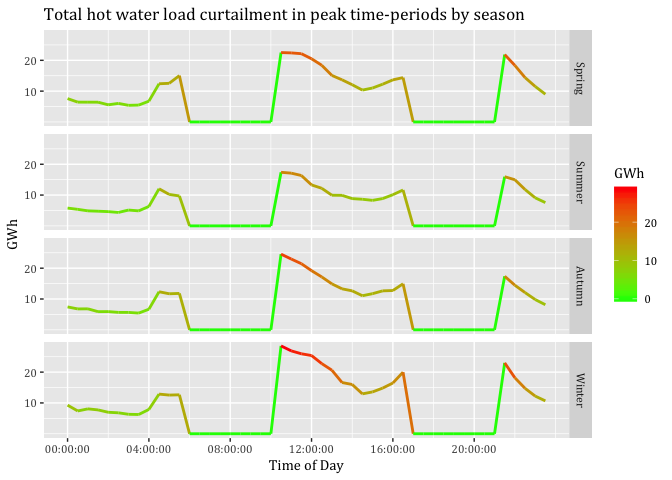<!-- -->
##Load curtailment of particular amount (50%): SC2


```r
sc2data <- hotWaterProfileDT
sc2data[, c("medianW", "obsHourMin", "meanW", "nObs", "sdW",
            "scaledMWmethod1", "EECApmMethod2"):=NULL] #Deleting unnecessary columns
```

```
## Warning in `[.data.table`(sc2data, , `:=`(c("medianW", "obsHourMin",
## "meanW", : Adding new column 'medianW' then assigning NULL (deleting it).
```

```
## Warning in `[.data.table`(sc2data, , `:=`(c("medianW", "obsHourMin",
## "meanW", : Adding new column 'obsHourMin' then assigning NULL (deleting
## it).
```

```
## Warning in `[.data.table`(sc2data, , `:=`(c("medianW", "obsHourMin",
## "meanW", : Adding new column 'meanW' then assigning NULL (deleting it).
```

```
## Warning in `[.data.table`(sc2data, , `:=`(c("medianW", "obsHourMin",
## "meanW", : Adding new column 'nObs' then assigning NULL (deleting it).
```

```
## Warning in `[.data.table`(sc2data, , `:=`(c("medianW", "obsHourMin",
## "meanW", : Adding new column 'sdW' then assigning NULL (deleting it).
```

```
## Warning in `[.data.table`(sc2data, , `:=`(c("medianW", "obsHourMin",
## "meanW", : Adding new column 'scaledMWmethod1' then assigning NULL
## (deleting it).
```

```
## Warning in `[.data.table`(sc2data, , `:=`(c("medianW", "obsHourMin",
## "meanW", : Adding new column 'EECApmMethod2' then assigning NULL (deleting
## it).
```

```r
sc2data <- sc2data[, .(GWhs2 = sum(scaledGWh)), 
                    keyby = .(season, obsHalfHour)]

sc2data <- sc2data[, Period := "Not Peak"]

sc2data <- sc2data[obsHalfHour >= hms::as.hms("06:00:00") & 
                     obsHalfHour <= hms::as.hms("10:00:00"),
                   Period := "Morning Peak"]

sc2data <- sc2data[obsHalfHour >= hms::as.hms("16:00:00") & 
                     obsHalfHour <= hms::as.hms("20:00:00"),
                   Period := "Evening Peak"]

sc2data <- sc2data[, GWh:=GWhs2] # Creating new column GWh based on GWhs2


sc2data <- sc2data[, GWh:= ifelse(Period == "Evening Peak", GWh * 0.5, GWh )] # If Period is Evening peak then make GWh zero
                   
sc2data <- sc2data[, GWh:= ifelse(Period == "Morning Peak", GWh * 0.5, GWh )]


myPlot <- ggplot2::ggplot(sc2data, aes(x = obsHalfHour, y = GWh, color=GWh)) +
  geom_line(size=0.5) +
  theme(text = element_text(family = "Cambria")) +
  ggtitle("Total hot water load curtailment in peak time-periods by season") +
  facet_grid(season ~ .) +
  labs(x='Time of Day', y='GWh') +
  scale_y_continuous(breaks = c(10, 20, 30, 40)) +
  scale_x_time(breaks = c(hms::as.hms("00:00:00"), hms::as.hms("03:00:00"), hms::as.hms("06:00:00"),       hms::as.hms("09:00:00"), hms::as.hms("12:00:00"), 
  hms::as.hms("15:00:00"), hms::as.hms("18:00:00"), hms::as.hms("21:00:00"))) +
  scale_colour_gradient(low= "green", high="red", guide = "colorbar")

myPlot
```

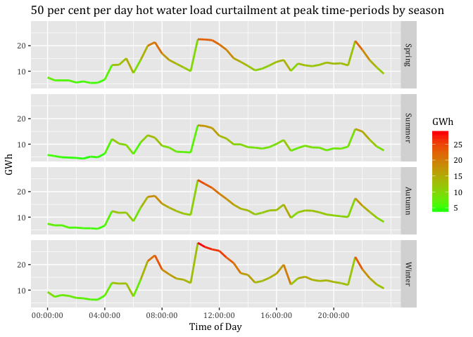<!-- -->
###Potential load curtailment based on percentage


```r
sc2data <- sc2data[, .(PotCur = sum(GWh)),
                   keyby = .(season, Period)]
sc2data
```

```
##     season       Period    PotCur
##  1: Autumn Evening Peak 102.38340
##  2: Autumn Morning Peak  94.87377
##  3: Autumn     Not Peak 447.62408
##  4: Spring Evening Peak 116.90414
##  5: Spring Morning Peak 101.27306
##  6: Spring     Not Peak 428.15975
##  7: Summer Evening Peak  82.97671
##  8: Summer Morning Peak  69.75097
##  9: Summer     Not Peak 329.91547
## 10: Winter Evening Peak 107.58772
## 11: Winter Morning Peak 115.25172
## 12: Winter     Not Peak 525.81307
```
##Load shifting 


```r
sc2data <- hotWaterProfileDT
sc2data[, c("medianW", "obsHourMin", "meanW", "nObs", "sdW",
            "scaledMWmethod1", "EECApmMethod2"):=NULL] #Deleting unnecessary columns
```

```
## Warning in `[.data.table`(sc2data, , `:=`(c("medianW", "obsHourMin",
## "meanW", : Adding new column 'medianW' then assigning NULL (deleting it).
```

```
## Warning in `[.data.table`(sc2data, , `:=`(c("medianW", "obsHourMin",
## "meanW", : Adding new column 'obsHourMin' then assigning NULL (deleting
## it).
```

```
## Warning in `[.data.table`(sc2data, , `:=`(c("medianW", "obsHourMin",
## "meanW", : Adding new column 'meanW' then assigning NULL (deleting it).
```

```
## Warning in `[.data.table`(sc2data, , `:=`(c("medianW", "obsHourMin",
## "meanW", : Adding new column 'nObs' then assigning NULL (deleting it).
```

```
## Warning in `[.data.table`(sc2data, , `:=`(c("medianW", "obsHourMin",
## "meanW", : Adding new column 'sdW' then assigning NULL (deleting it).
```

```
## Warning in `[.data.table`(sc2data, , `:=`(c("medianW", "obsHourMin",
## "meanW", : Adding new column 'scaledMWmethod1' then assigning NULL
## (deleting it).
```

```
## Warning in `[.data.table`(sc2data, , `:=`(c("medianW", "obsHourMin",
## "meanW", : Adding new column 'EECApmMethod2' then assigning NULL (deleting
## it).
```

```r
sc2data <- sc2data[, .(GWhs2 = sum(scaledGWh)), 
                    keyby = .(season, obsHalfHour)]


#Defining peak and off-peak periods
sc2data <- sc2data[, Period := "Not Peak"]

sc2data <- sc2data[obsHalfHour >= hms::as.hms("06:00:00") & 
                     obsHalfHour <= hms::as.hms("10:00:00"),
                   Period := "Morning Peak"]

sc2data <- sc2data[obsHalfHour >= hms::as.hms("16:00:00") & 
                     obsHalfHour <= hms::as.hms("20:00:00"),
                   Period := "Evening Peak"]

sc2data <- sc2data[obsHalfHour >= hms::as.hms("20:30:00") & 
                     obsHalfHour <= hms::as.hms("23:30:00"),
                   Period := "Off Peak 1"]

sc2data <- sc2data[obsHalfHour >= hms::as.hms("00:00:00") & 
                     obsHalfHour <= hms::as.hms("05:30:00"),
                   Period := "Off Peak 1"]

sc2data <- sc2data[obsHalfHour >= hms::as.hms("10:30:00") & 
                     obsHalfHour <= hms::as.hms("15:30:00"),
                   Period := "Off Peak 2"]

#Building the sum of each peak period by season
AuMP2 <- sc2data[season == "Autumn" & Period == "Morning Peak",
                sum(GWhs2)]
WiMP2 <- sc2data[season == "Winter" & Period == "Morning Peak",
                sum(GWhs2)]
SpMP2 <- sc2data[season == "Spring" & Period == "Morning Peak",
                sum(GWhs2)]
SuMP2 <- sc2data[season == "Summer" & Period == "Morning Peak",
                sum(GWhs2)]

AuEP2 <- sc2data[season == "Autumn" & Period == "Evening Peak",
                sum(GWhs2)]
WiEP2 <- sc2data[season == "Winter" & Period == "Evening Peak",
                sum(GWhs2)]
SpEP2 <- sc2data[season == "Spring" & Period == "Evening Peak",
                sum(GWhs2)]
SuEP2 <- sc2data[season == "Summer" & Period == "Evening Peak",
                sum(GWhs2)]


#Counting number of rows that will be associated to spread the Morning Peak
AuMPHalfHours2 <- nrow(sc2data[season == "Autumn" &
                              Period == "Off Peak 1"])
WiMPHalfHours2 <- nrow(sc2data[season == "Winter" &
                              Period == "Off Peak 1"])
SpMPHalfHours2 <- nrow(sc2data[season == "Spring" &
                              Period == "Off Peak 1"])
SuMPHalfHours2 <- nrow(sc2data[season == "Summer" &
                              Period == "Off Peak 1"])

#Counting number of rows that will be associated to spread the Evening Peak
AuEPHalfHours2 <- nrow(sc2data[season == "Autumn" &
                              Period == "Off Peak 2"])
WiEPHalfHours2 <- nrow(sc2data[season == "Winter" &
                              Period == "Off Peak 2"])
SpEPHalfHours2 <- nrow(sc2data[season == "Spring" &
                              Period == "Off Peak 2"])
SuEPHalfHours2 <- nrow(sc2data[season == "Summer" &
                              Period == "Off Peak 2"])

#Calculating the proportion that each row will take on to spread the GWhs
distGWhOP1Au2 <- AuMP2/AuMPHalfHours2
distGWhOP1Wi2 <- WiMP2/WiMPHalfHours2
distGWhOP1Sp2 <- SpMP2/SpMPHalfHours2
distGWhOP1Su2 <- SuMP2/SuMPHalfHours2

distGWhOP2Au2 <- AuEP2/AuEPHalfHours2
distGWhOP2Wi2 <- WiEP2/WiEPHalfHours2
distGWhOP2Sp2 <- SpEP2/SpEPHalfHours2
distGWhOP2Su2 <- SuEP2/SuEPHalfHours2


#Adding amount of spreaded peak consumption to off-peak periods
sc2data <- sc2data[season == "Autumn" &
                     Period == "Off Peak 1", GWhs4 :=
                     GWhs2 + distGWhOP1Au2]
sc2data <- sc2data[season == "Winter" &
                     Period == "Off Peak 1", GWhs4 :=
                     GWhs2 + distGWhOP1Wi2]
sc2data <- sc2data[season == "Spring" &
                     Period == "Off Peak 1", GWhs4 :=
                     GWhs2 + distGWhOP1Sp2]
sc2data <- sc2data[season == "Summer" &
                     Period == "Off Peak 1", GWhs4 :=
                     GWhs2 + distGWhOP1Su2]


sc2data <- sc2data[season == "Autumn" &
                     Period == "Off Peak 2", GWhs4 :=
                     GWhs2 + distGWhOP2Au2]
sc2data <- sc2data[season == "Winter" &
                     Period == "Off Peak 2", GWhs4 :=
                     GWhs2 + distGWhOP2Wi]
sc2data <- sc2data[season == "Spring" &
                     Period == "Off Peak 2", GWhs4 :=
                     GWhs2 + distGWhOP2Sp]
sc2data <- sc2data[season == "Summer" &
                     Period == "Off Peak 2", GWhs4 :=
                     GWhs2 + distGWhOP2Su]


#Setting missing values in peak periods to NULL
sc2data <- sc2data[, GWhs4:= ifelse(Period =="Morning Peak",
                                  0, GWhs4)]
sc2data <- sc2data[, GWhs4:= ifelse(Period =="Evening Peak",
                                  0, GWhs4)]


#Renaming GWhs3 into GWh to depict the right text in the colorbar
setnames(sc2data, old=c("GWhs2"), new=c("GWh"))

#Visualising only shifted consumption
#myPlot <- ggplot2::ggplot(sc2data, aes(x = obsHalfHour, color=GWh)) +
  #geom_line(aes(y=GWh), size=0.5) +
  #theme(text = element_text(family = "Cambria")) +
  #ggtitle("Total shifted New Zealand half hour heat pump energy consumption by season for 2015") +
  #facet_grid(season ~ .) +
  #labs(x='Time of Day', y='GWh') +
  #scale_y_continuous(breaks = c(10, 20, 30, 40)) +
  #scale_x_time(breaks = c(hms::as.hms("00:00:00"), hms::as.hms("03:00:00"), hms::as.hms("06:00:00"),       hms::as.hms("09:00:00"), hms::as.hms("12:00:00"), 
  #hms::as.hms("15:00:00"), hms::as.hms("18:00:00"), hms::as.hms("21:00:00"))) +
  #scale_colour_gradient(low= "green", high="red", guide = "colorbar")

#myPlot

#Visualising shifted and original consumption
myPlot <- ggplot2::ggplot(sc2data, aes(x = obsHalfHour)) +
  geom_line(aes(y=GWh, color=GWh), size=0.5) +
  geom_line(aes(y=GWhs4, color=GWhs4), size=0.5) +
  theme(text = element_text(family = "Cambria")) +
  ggtitle("Original and shifted New Zealand half hour heat pump energy consumption by season for 2015") +
  facet_grid(season ~ .) +
  labs(x='Time of Day', y='GWh') +
  scale_y_continuous(breaks = c(10, 20, 30, 40)) +
  scale_x_time(breaks = c(hms::as.hms("00:00:00"), hms::as.hms("03:00:00"), hms::as.hms("06:00:00"),       hms::as.hms("09:00:00"), hms::as.hms("12:00:00"), 
  hms::as.hms("15:00:00"), hms::as.hms("18:00:00"), hms::as.hms("21:00:00"))) +
  scale_color_gradient(low= "green", high="red")

myPlot
```

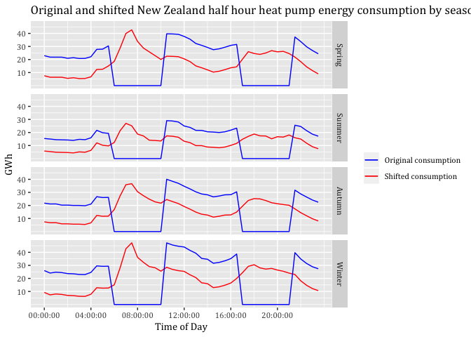<!-- -->

```r
#ggsave("Original and shifted New Zealand half hour heat pump energy consumption by season for 2015.jpeg",
       #dpi=600)
```


#MyPlot example

```r
sc1data <- heatPumpProfileDT
sc1data[, c("medianW", "obsHourMin", "meanW", "nObs", "sdW", "scaledMWmethod1", "EECApmMethod2"):=NULL] #Deleting unnecessary columns
```

```
## Warning in `[.data.table`(sc1data, , `:=`(c("medianW", "obsHourMin",
## "meanW", : Adding new column 'medianW' then assigning NULL (deleting it).
```

```
## Warning in `[.data.table`(sc1data, , `:=`(c("medianW", "obsHourMin",
## "meanW", : Adding new column 'obsHourMin' then assigning NULL (deleting
## it).
```

```
## Warning in `[.data.table`(sc1data, , `:=`(c("medianW", "obsHourMin",
## "meanW", : Adding new column 'meanW' then assigning NULL (deleting it).
```

```
## Warning in `[.data.table`(sc1data, , `:=`(c("medianW", "obsHourMin",
## "meanW", : Adding new column 'nObs' then assigning NULL (deleting it).
```

```
## Warning in `[.data.table`(sc1data, , `:=`(c("medianW", "obsHourMin",
## "meanW", : Adding new column 'sdW' then assigning NULL (deleting it).
```

```
## Warning in `[.data.table`(sc1data, , `:=`(c("medianW", "obsHourMin",
## "meanW", : Adding new column 'scaledMWmethod1' then assigning NULL
## (deleting it).
```

```
## Warning in `[.data.table`(sc1data, , `:=`(c("medianW", "obsHourMin",
## "meanW", : Adding new column 'EECApmMethod2' then assigning NULL (deleting
## it).
```

```r
sc1data <- sc1data[, .(GWh = sum(scaledGWh)), 
                    keyby = .(season, obsHalfHour)]

myPlot <- ggplot2::ggplot(sc1data, aes(x = obsHalfHour, color=GWh)) +
  geom_step(aes(y=GWh), size=0.5) +
  theme(text = element_text(family = "Cambria")) +
  ggtitle("Total New Zealand half hour heat pump energy consumption by season for 2015") +
  facet_grid(season ~ .) +
  labs(x='Time of Day', y='GWh') +
  scale_y_continuous(breaks = c(3, 6, 9, 12)) +
  scale_x_time(breaks = c(hms::as.hms("00:00:00"), hms::as.hms("03:00:00"), hms::as.hms("06:00:00"),       hms::as.hms("09:00:00"), hms::as.hms("12:00:00"), 
  hms::as.hms("15:00:00"), hms::as.hms("18:00:00"), hms::as.hms("21:00:00"))) +
  scale_colour_gradient(low= "green", high="red", guide = "colorbar")

myPlot
```

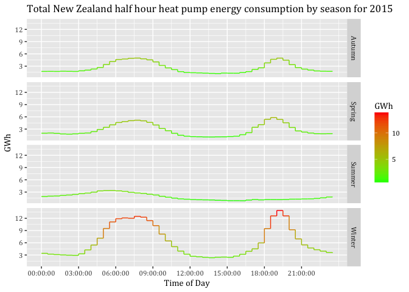<!-- -->

```r
#ggsave("Total New Zealand half hour heat pump energy consumption by season for 2015.jpeg",
      # dpi=600)


#Other examples

#AuMP <- 38.35385
#WiMP <- 96.89743
#SpMP <- 39.09743
#SuMP <- 23.28916
#AuEP <- 29.11365
#WiEP <- 75.27774
#SpEP <- 35.80694
#SuEP <- 10.12392

#AuNP1 <- sc1data[ GWhs1[1:12 42:48]]
#AuNP2 <- sc1data[ c(22:32), "GWhs1"]
#WiNP1 <- sc1data[ c(145:156, 186:192), "GWhs1"]
#WiNP2 <- sc1data[ c(166:176), "GWhs1"]
#SpNP1 <- sc1data[ c(49:60, 90:96), "GWhs1"]
#SpNP2 <- sc1data[ c(70:80), "GWhs1"]
#SuNP1 <- sc1data[ c(97:108, 138:144), "GWhs1"]
#SuNP2 <- sc1data[ c(118:128), "GWhs1"]

#sc1data <- sc1data[, ShiftL := GWhs1] # Creating new column ShiftL based on GWhs1

# Updating ShiftL predefined rows with the percentage of peak-period sum. Spreading Morning Peak load over a longer duration than Evening Peak
#sc1data <- sc1data[, ShiftL := AuNP1 * AuMP * 1/19]
#sc1data <- sc1data[, ShiftL := WiNP1 * WiMP * 1/19]
#sc1data <- sc1data[, ShiftL := SpNP1 * SpMP * 1/19]
#sc1data <- sc1data[, ShiftL := SuNP1 * SuMP * 1/19]

#sc1data <- sc1data[, ShiftL := AuNP2 * AuEP * 1/11]
#sc1data <- sc1data[, ShiftL := WiNP2 * WiEP * 1/11]
#sc1data <- sc1data[, ShiftL := SpNP2 * SpEP * 1/11]
#sc1data <- sc1data[, ShiftL := SuNP2 * SuEP * 1/11]


#sc1data <- sc1data[, ShiftL:= ifelse(Period == "Evening Peak", 0, ShiftL )]
#sc1data <- sc1data[, ShiftL:= ifelse(Period == "Morning Peak", 0, ShiftL )]
```


# Runtime


Analysis completed in 16.45 seconds ( 0.27 minutes) using [knitr](https://cran.r-project.org/package=knitr) in [RStudio](http://www.rstudio.com) with R version 3.4.4 (2018-03-15) running on x86_64-apple-darwin15.6.0.

# R environment

R packages used:

 * base R - for the basics [@baseR]
 * data.table - for fast (big) data handling [@data.table]
 * lubridate - date manipulation [@lubridate]
 * ggplot2 - for slick graphics [@ggplot2]
 * readr - for csv reading/writing [@readr]
 * skimr - for skim [@skimr]
 * knitr - to create this document & neat tables [@knitr]
 * nzGREENGrid - for local NZ GREEN Grid project utilities

Session info:


```
## R version 3.4.4 (2018-03-15)
## Platform: x86_64-apple-darwin15.6.0 (64-bit)
## Running under: macOS High Sierra 10.13.4
## 
## Matrix products: default
## BLAS: /Library/Frameworks/R.framework/Versions/3.4/Resources/lib/libRblas.0.dylib
## LAPACK: /Library/Frameworks/R.framework/Versions/3.4/Resources/lib/libRlapack.dylib
## 
## locale:
## [1] en_NZ.UTF-8/en_NZ.UTF-8/en_NZ.UTF-8/C/en_NZ.UTF-8/en_NZ.UTF-8
## 
## attached base packages:
## [1] stats     graphics  grDevices utils     datasets  methods   base     
## 
## other attached packages:
## [1] bindrcpp_0.2.2      knitr_1.20          skimr_1.0.3        
## [4] hms_0.4.2           readr_1.1.1         lubridate_1.7.4    
## [7] ggplot2_2.2.1       data.table_1.10.4-3 nzGREENGrid_0.1.0  
## 
## loaded via a namespace (and not attached):
##  [1] Rcpp_0.12.16      highr_0.6         pillar_1.2.1     
##  [4] compiler_3.4.4    plyr_1.8.4        bindr_0.1.1      
##  [7] prettyunits_1.0.2 tools_3.4.4       progress_1.2.0   
## [10] digest_0.6.15     gtable_0.2.0      evaluate_0.10.1  
## [13] tibble_1.4.2      pkgconfig_2.0.1   rlang_0.2.0      
## [16] cli_1.0.0         rstudioapi_0.7    yaml_2.1.18      
## [19] xfun_0.2          dplyr_0.7.5       stringr_1.3.0    
## [22] rprojroot_1.3-2   grid_3.4.4        tidyselect_0.2.4 
## [25] glue_1.2.0        R6_2.2.2          rmarkdown_1.9    
## [28] bookdown_0.7      tidyr_0.8.1       purrr_0.2.5      
## [31] reshape2_1.4.3    magrittr_1.5      scales_0.5.0     
## [34] backports_1.1.2   htmltools_0.3.6   assertthat_0.2.0 
## [37] colorspace_1.3-2  labeling_0.3      stringi_1.1.7    
## [40] lazyeval_0.2.1    munsell_0.4.3     crayon_1.3.4
```

# References
