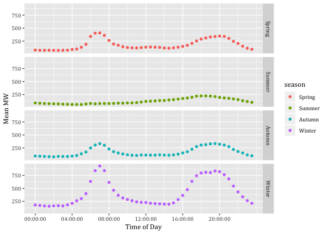

---
params:
 title: "Technical Potential of Demand Response"
 subtitle: "Heat Pump Analysis"
title: 'Technical Potential of Demand Response'
subtitle: 'Heat Pump Analysis'
author: 'Carsten Dortans (xxx@otago.ac.nz)'
date: 'Last run at: 2018-06-26 10:14:26'
output:
  bookdown::html_document2:
    toc: true
    toc_float: TRUE
    toc_depth: 2
    keep_md: TRUE
    self_contained: no
  bookdown::pdf_document2:
    toc: true
    toc_depth: 2
bibliography: '/Users/carsten.dortans/Desktop/R Profiles/git.soton/NZ GREENGrid/nzGREENGrid/bibliography.bib'
---


\newpage

# Citation

If you wish to use any of the material from this report please cite as:

 * Dortans, C. (2018) Technical Potential of Demand Response: Heat Pump Analysis, [Centre for Sustainability](http://www.otago.ac.nz/centre-sustainability/), University of Otago: Dunedin.

This work is (c) 2018 the University of Southampton.

\newpage

# About

## Circulation


Report circulation:

 * Restricted to: [NZ GREEN Grid](https://www.otago.ac.nz/centre-sustainability/research/energy/otago050285.html) project partners and contractors.
 
## Purpose

This report is intended to: 

 * load and test GREEN Grid heat pump and hot water profiles.

## Requirements:

 * test dataset stored at /Users/carsten.dortans/Dropbox/Carsten_MA/ggData/profiles/

## History


Generally tracked via our git.soton [repo](https://git.soton.ac.uk/ba1e12/nzGREENGrid):

 * [history](https://git.soton.ac.uk/ba1e12/nzGREENGrid/commits/master)
 * [issues](https://git.soton.ac.uk/ba1e12/nzGREENGrid/issues)
 
Specific history of this code:

 * https://git.soton.ac.uk/ba1e12/nzGREENGrid/tree/master/analysis/demandResponse

## Support


This work was supported by:

 * The [University of Otago](https://www.otago.ac.nz/);
 * The [University of Southampton](https://www.southampton.ac.uk/);
 * The New Zealand [Ministry of Business, Innovation and Employment (MBIE)](http://www.mbie.govt.nz/) through the [NZ GREEN Grid](https://www.otago.ac.nz/centre-sustainability/research/energy/otago050285.html) project;
 * [SPATIALEC](http://www.energy.soton.ac.uk/tag/spatialec/) - a [Marie Skłodowska-Curie Global Fellowship](http://ec.europa.eu/research/mariecurieactions/about-msca/actions/if/index_en.htm) based at the University of Otago’s [Centre for Sustainability](http://www.otago.ac.nz/centre-sustainability/staff/otago673896.html) (2017-2019) & the University of Southampton's Sustainable Energy Research Group (2019-202).

We do not 'support' the code but if you have a problem check the [issues](https://git.soton.ac.uk/ba1e12/nzGREENGrid/issues) on our [repo](https://git.soton.ac.uk/ba1e12/nzGREENGrid) and if it doesn't already exist, open one. We might be able to fix it :-)
 

# Load data files

## Heat pump profiles

This file is the pre-aggregated data for all heat pump circuits in the GREEN Grid data for April 2015 - March 2016 (check!)


```r
ggParams$profilesFile <- paste0(ggParams$dataLoc, "Heat Pump_2015-04-01_2016-03-31_overallSeasonalProfiles.csv.gz")
```

In this section we load and describe the  data files from /Users/carsten.dortans/Dropbox/Carsten_MA/ggData/profiles/Heat Pump_2015-04-01_2016-03-31_overallSeasonalProfiles.csv.gz.


```r
print(paste0("Trying to load: ", ggParams$profilesFile))
```

```
## [1] "Trying to load: /Users/carsten.dortans/Dropbox/Carsten_MA/ggData/profiles/Heat Pump_2015-04-01_2016-03-31_overallSeasonalProfiles.csv.gz"
```

```r
heatPumpProfileDT <- data.table::as.data.table(readr::read_csv(ggParams$profilesFile))
```

```
## Parsed with column specification:
## cols(
##   obsHourMin = col_time(format = ""),
##   season = col_character(),
##   meanW = col_double(),
##   medianW = col_double(),
##   nObs = col_integer(),
##   sdW = col_double()
## )
```


Describe using skim:


```r
skimr::skim(heatPumpProfileDT)
```

```
## Skim summary statistics
##  n obs: 5760 
##  n variables: 6 
## 
## ── Variable type:character ─────────────────────────────────────────────────────────────────────────────────────────────────────────────────
##  variable missing complete    n min max empty n_unique
##    season       0     5760 5760   6   6     0        4
## 
## ── Variable type:difftime ──────────────────────────────────────────────────────────────────────────────────────────────────────────────────
##    variable missing complete    n    min        max     median n_unique
##  obsHourMin       0     5760 5760 0 secs 86340 secs 43170 secs     1440
## 
## ── Variable type:integer ───────────────────────────────────────────────────────────────────────────────────────────────────────────────────
##  variable missing complete    n    mean     sd   p0    p25    p50     p75
##      nObs       0     5760 5760 2474.38 193.08 2150 2402.5 2517.5 2599.25
##  p100     hist
##  2688 ▅▁▁▁▁▇▁▅
## 
## ── Variable type:numeric ───────────────────────────────────────────────────────────────────────────────────────────────────────────────────
##  variable missing complete    n   mean     sd     p0    p25    p50    p75
##     meanW       0     5760 5760 143.52 116.99  34.99  71.88 104.76 174.71
##   medianW       0     5760 5760  17.09  67.67   0      0      0      0   
##       sdW       0     5760 5760 329.77 146.05 101.04 234.33 298.61 407.13
##    p100     hist
##  613.89 ▇▃▂▁▁▁▁▁
##  392.55 ▇▁▁▁▁▁▁▁
##  879.07 ▆▇▆▅▂▂▁▁
```

Draw a plot of GreenGrid heat pump profiles.


```r
myPlot <- ggplot2::ggplot(heatPumpProfileDT, aes(x = obsHourMin, colour = season)) +
  geom_point(aes(y = meanW)) +
  facet_grid(season ~ .)

myPlot
```

<div class="figure">

<p class="caption">(\#fig:profilePlot)Heat pump profiles</p>
</div>

# Scaling method 1

Now draw a plot of what woud happen if we scaled this up to all NZ households?

Figure \@ref(fig:scaledUpPlots)


```r
nzHH <- 1549890

heatPumpProfileDT <- heatPumpProfileDT[, scaledMWmethod1 := (meanW * nzHH)/10^6]

myPlot <- ggplot2::ggplot(heatPumpProfileDT, aes(x = obsHourMin, colour = season)) +
  geom_point(aes(y = scaledMWmethod1)) +
  facet_grid(season ~ .)

myPlot
```

<div class="figure">

<p class="caption">(\#fig:scaledUpPlots)Mean Load Heat Pumps by Season</p>
</div>

# Scaling method 2

Alternative calculation method: Assuming EECA data is correct for heat pump value, 1) generating the percentage of total load (peroftotal) while telling data.table to create a new column with the calculation of the percentage. We then multiplied EECA's total GWh with the percentage


```r
totalGWH<-708

summeanW<-heatPumpProfileDT[,sum(meanW)]


heatPumpProfileDT <- heatPumpProfileDT[, EECApmMethod2 := (meanW / summeanW) * totalGWH] 

myPlot <- ggplot2::ggplot(heatPumpProfileDT, aes(x = obsHourMin, colour = season)) +
  geom_point(aes(y = EECApmMethod2)) +
  facet_grid(season ~ .) +
  labs(x='Time of Day', y='GWh')

myPlot
```

<!-- -->

# Aggregation to half-hours

So far we have used data at the 1 minute level. This makes for difficulties in comparison with standared electricity sector half-hourly tariff periods etc. This section takes each scaling method, aggregates to half-hours as appropriate and re-plots.

To do that we need to set a half-hour value from the observed time. We do this using truncate so that:

 * 13:18:00 -> 13:00:00
 * 13:40:00 -> 13:30 etc

> NB: This means any plots will be using the 1/2 hour value at the  _start_  of the period!


```r
# create a 'half hour' variable for aggregation
heatPumpProfileDT <- heatPumpProfileDT[, obsHalfHour := hms::trunc_hms(obsHourMin, 1800)] # <- this truncates the time to the previous half hour (hms works in seconds so 30 mins * 60 secs = 1800 secs). e.g. 13:18:00 -> 13:00:00 but 13:40:00 -> 13:30 etc

# This means any plots will be using the 1/2 hour value at the  -> start <-  of the period!

# check
head(heatPumpProfileDT)
```

```
##    obsHourMin season     meanW medianW nObs      sdW scaledMWmethod1
## 1:   00:00:00 Autumn  72.43808       0 2543 253.7921        112.2711
## 2:   00:00:00 Spring  87.36049       0 2512 289.1072        135.3991
## 3:   00:00:00 Summer  82.63281       0 2160 258.2699        128.0718
## 4:   00:00:00 Winter 150.92446       0 2685 383.6956        233.9163
## 5:   00:01:00 Autumn  70.26538       0 2544 238.4719        108.9036
## 6:   00:01:00 Spring  86.17364       0 2511 286.9992        133.5597
##    EECApmMethod2 obsHalfHour
## 1:    0.06203848    00:00:00
## 2:    0.07481856    00:00:00
## 3:    0.07076961    00:00:00
## 4:    0.12925695    00:00:00
## 5:    0.06017771    00:00:00
## 6:    0.07380210    00:00:00
```

## Method 1


```r
# aggregate the scaled MW to half hours
# as it is MW we need to take the mean - taking the sum would not be meaningfull
method1AggDT <- heatPumpProfileDT[, .(meanMW = mean(scaledMWmethod1)), 
                                  keyby = .(season, obsHalfHour)] # <- takes the mean for each category of half hour & season

myPlot <- ggplot2::ggplot(method1AggDT, aes(x = obsHalfHour, colour = season)) +
  geom_point(aes(y = meanMW)) +
  facet_grid(season ~ .) +
  labs(x='Time of Day', y='Mean MW') +
  scale_x_time(breaks = c(hms::as.hms("06:00:00"), hms::as.hms("09:00:00"), hms::as.hms("12:00:00"), 
                          hms::as.hms("15:00:00"), hms::as.hms("18:00:00"), hms::as.hms("21:00:00")))

myPlot
```

<!-- -->


## Method 2

To do :-)

> NB: should you aggregate this scaling method using mean or sum? Why? :-)

# Runtime


Analysis completed in 5.65 seconds ( 0.09 minutes) using [knitr](https://cran.r-project.org/package=knitr) in [RStudio](http://www.rstudio.com) with R version 3.4.4 (2018-03-15) running on x86_64-apple-darwin15.6.0.

# R environment

R packages used:

 * base R - for the basics [@baseR]
 * data.table - for fast (big) data handling [@data.table]
 * lubridate - date manipulation [@lubridate]
 * ggplot2 - for slick graphics [@ggplot2]
 * readr - for csv reading/writing [@readr]
 * skimr - for skim [@skimr]
 * knitr - to create this document & neat tables [@knitr]
 * nzGREENGrid - for local NZ GREEN Grid project utilities

Session info:


```
## R version 3.4.4 (2018-03-15)
## Platform: x86_64-apple-darwin15.6.0 (64-bit)
## Running under: macOS High Sierra 10.13.4
## 
## Matrix products: default
## BLAS: /Library/Frameworks/R.framework/Versions/3.4/Resources/lib/libRblas.0.dylib
## LAPACK: /Library/Frameworks/R.framework/Versions/3.4/Resources/lib/libRlapack.dylib
## 
## locale:
## [1] en_NZ.UTF-8/en_NZ.UTF-8/en_NZ.UTF-8/C/en_NZ.UTF-8/en_NZ.UTF-8
## 
## attached base packages:
## [1] stats     graphics  grDevices utils     datasets  methods   base     
## 
## other attached packages:
## [1] bindrcpp_0.2.2      knitr_1.20          skimr_1.0.3        
## [4] hms_0.4.2           readr_1.1.1         lubridate_1.7.4    
## [7] ggplot2_2.2.1       data.table_1.10.4-3 nzGREENGrid_0.1.0  
## 
## loaded via a namespace (and not attached):
##  [1] Rcpp_0.12.16      highr_0.6         pillar_1.2.1     
##  [4] compiler_3.4.4    plyr_1.8.4        bindr_0.1.1      
##  [7] prettyunits_1.0.2 tools_3.4.4       progress_1.2.0   
## [10] digest_0.6.15     gtable_0.2.0      evaluate_0.10.1  
## [13] tibble_1.4.2      pkgconfig_2.0.1   rlang_0.2.0      
## [16] cli_1.0.0         rstudioapi_0.7    yaml_2.1.18      
## [19] xfun_0.2          dplyr_0.7.5       stringr_1.3.0    
## [22] rprojroot_1.3-2   grid_3.4.4        tidyselect_0.2.4 
## [25] glue_1.2.0        R6_2.2.2          rmarkdown_1.9    
## [28] bookdown_0.7      tidyr_0.8.1       purrr_0.2.5      
## [31] reshape2_1.4.3    magrittr_1.5      scales_0.5.0     
## [34] backports_1.1.2   htmltools_0.3.6   assertthat_0.2.0 
## [37] colorspace_1.3-2  labeling_0.3      stringi_1.1.7    
## [40] lazyeval_0.2.1    munsell_0.4.3     crayon_1.3.4
```

# References
