\newpage

# Citation

If you wish to use any of the material from this report please cite as:

 * Anderson, B. (2018) _NZ Electricity Generation Trends 1998-2017_, [Centre for Sustainability](http://www.otago.ac.nz/centre-sustainability/), University of Otago: Dunedin.

This work is (c) 2018 the University of Southampton.

\newpage

# About

## Circulation


Report circulation:

 * Restricted to: [NZ GREEN Grid](https://www.otago.ac.nz/centre-sustainability/research/energy/otago050285.html) project partners and contractors.
 
## Purpose

This report is intended to: 

 * load and test NZ electricity generation data from https://www.emi.ea.govt.nz/Wholesale/Datasets/Generation/Generation_MD/ from 1998 to 2017.

## Requirements:

 * pre-downloaded NZ wholesale generation datasets

## History


Generally tracked via our git.soton [repo](https://git.soton.ac.uk/ba1e12/nzGREENGrid):

 * [history](https://git.soton.ac.uk/ba1e12/nzGREENGrid/commits/master)
 * [issues](https://git.soton.ac.uk/ba1e12/nzGREENGrid/issues)
 
Specific history of this code: 

 * https://git.soton.ac.uk/ba1e12/nzGREENGrid/commits/master/analysis/generation/nzGenerationHistory.Rmd

## Support


This work was supported by:

 * The [University of Otago](https://www.otago.ac.nz/);
 * The [University of Southampton](https://www.southampton.ac.uk/);
 * The New Zealand [Ministry of Business, Innovation and Employment (MBIE)](http://www.mbie.govt.nz/) through the [NZ GREEN Grid](https://www.otago.ac.nz/centre-sustainability/research/energy/otago050285.html) project;
 * [SPATIALEC](http://www.energy.soton.ac.uk/tag/spatialec/) - a [Marie Skłodowska-Curie Global Fellowship](http://ec.europa.eu/research/mariecurieactions/about-msca/actions/if/index_en.htm) based at the University of Otago’s [Centre for Sustainability](http://www.otago.ac.nz/centre-sustainability/staff/otago673896.html) (2017-2019) & the University of Southampton's Sustainable Energy Research Group (2019-202).

We do not 'support' the code but if you have a problem check the [issues](https://git.soton.ac.uk/ba1e12/nzGREENGrid/issues) on our [repo](https://git.soton.ac.uk/ba1e12/nzGREENGrid) and if it doesn't already exist, open one. We might be able to fix it :-)
 

# Introduction

Inspired by Steffel ([2018](https://www.sciencedirect.com/science/article/pii/S0301421516307017)) which analyses trends in the type and timing of generation in the UK over the same time period. Intended to build on Kahn et al's 2018 CO2 [intensity of peak demand](https://www.sciencedirect.com/science/article/pii/S0959652618306474?via%3Dihub) paper - how have thngs changed over time?

Uses https://www.emi.ea.govt.nz/Wholesale/Datasets/Generation/Generation_MD/ from 1998 to 2017.

Data is kWh - so energy not power.

# Load data

Load the generation data from files stored in:

 * /Volumes/hum-csafe/Research Projects/GREEN Grid/_RAW DATA/EA_Generation_Data/
 
These have been [pre-downloaded and cleaned](https://git.soton.ac.uk/ba1e12/nzGREENGrid/tree/master/dataProcessing/ea) but could be pulled on the fly to be refreshed for other dates...


```
## Warning in `[.data.table`(filesToDateDT, , `:=`(c("year", "month",
## "stub"), : Supplied 3 columns to be assigned a list (length 5) of values (2
## unused)
```

```
## [1] "Files loaded"
```

```
## [1] "Loaded 352,250 rows of data"
```

The following table sumamrises the data.


|   | Site_Code       |  POC_Code       |  Nwk_Code       |  Gen_Code       | Fuel_Code       | Tech_Code       | Trading_date      |Time_Period      |     kWh       |   rTime        |    rDate          |  rDateTime                 |    month      |     year    |
|:--|:----------------|:----------------|:----------------|:----------------|:----------------|:----------------|:------------------|:----------------|:--------------|:---------------|:------------------|:---------------------------|:--------------|:------------|
|   |Length:352250    |Length:352250    |Length:352250    |Length:352250    |Length:352250    |Length:352250    |Min.   :1998-06-01 |Length:352250    |Min.   :     0 |Length:352250   |Min.   :1998-06-01 |Min.   :1998-06-01 00:15:00 |Min.   : 6.000 |Min.   :1998 |
|   |Class :character |Class :character |Class :character |Class :character |Class :character |Class :character |1st Qu.:1998-12-10 |Class :character |1st Qu.:  6563 |Class1:hms      |1st Qu.:1998-12-10 |1st Qu.:1998-12-10 09:15:00 |1st Qu.: 6.000 |1st Qu.:1998 |
|   |Mode  :character |Mode  :character |Mode  :character |Mode  :character |Mode  :character |Mode  :character |Median :2017-06-11 |Mode  :character |Median : 19715 |Class2:difftime |Median :2017-06-11 |Median :2017-06-11 15:45:00 |Median :12.000 |Median :2017 |
|   |NA               |NA               |NA               |NA               |NA               |NA               |Mean   :2010-03-23 |NA               |Mean   : 37186 |Mode  :numeric  |Mean   :2010-03-23 |Mean   :2010-03-23 19:23:45 |Mean   : 9.087 |Mean   :2010 |
|   |NA               |NA               |NA               |NA               |NA               |NA               |3rd Qu.:2017-12-06 |NA               |3rd Qu.: 48640 |NA              |3rd Qu.:2017-12-06 |3rd Qu.:2017-12-06 19:15:00 |3rd Qu.:12.000 |3rd Qu.:2017 |
|   |NA               |NA               |NA               |NA               |NA               |NA               |Max.   :2017-12-31 |NA               |Max.   :493020 |NA              |Max.   :2017-12-31 |Max.   :2017-12-31 23:45:00 |Max.   :12.000 |Max.   :2017 |
|   |NA               |NA               |NA               |NA               |NA               |NA               |NA                 |NA               |NA's   :14090  |NA              |NA                 |NA's   :14090               |NA             |NA           |

Notice that there are missing (NA) values in the kWh column. These are caused by periods 49 and 50 being missing:

> "The data is presented by trading period, TP1, TP2, ... TP48. Trading period 1 starts at midnight, trading period 2 starts at 12:30am, trading period 3 starts at 1:00am, etc. Users of this data should be aware of daylight saving in New Zealand. On the day daylight saving commences there are only 46 trading periods and on the day it ends, there are 50." (https://www.emi.ea.govt.nz/Wholesale/Datasets/Generation/Generation_MD/)

Daylight saving begins/ends in October and March so we carefully avoid this problem by using June and December. However these TP are still present as NA in the data as the following table and plot of NA observations (only) by Fuel Type and month show.


|Time_Period |     mean|
|:-----------|--------:|
|TP1         | 32193.95|
|TP10        | 28197.44|
|TP11        | 29102.29|
|TP12        | 30355.92|
|TP13        | 32589.18|
|TP14        | 35307.47|
|TP15        | 38153.58|
|TP16        | 40611.99|
|TP17        | 41846.03|
|TP18        | 42344.12|
|TP19        | 42572.59|
|TP2         | 31058.35|
|TP20        | 42364.31|
|TP21        | 41953.33|
|TP22        | 41580.21|
|TP23        | 41157.60|
|TP24        | 40811.56|
|TP25        | 40331.06|
|TP26        | 39886.99|
|TP27        | 39653.17|
|TP28        | 39227.72|
|TP29        | 38878.22|
|TP3         | 30111.71|
|TP30        | 38668.61|
|TP31        | 38707.44|
|TP32        | 39144.56|
|TP33        | 39847.08|
|TP34        | 41145.00|
|TP35        | 42903.35|
|TP36        | 44126.06|
|TP37        | 43686.30|
|TP38        | 43162.35|
|TP39        | 42323.73|
|TP4         | 29313.75|
|TP40        | 41477.26|
|TP41        | 40763.28|
|TP42        | 40360.00|
|TP43        | 39752.14|
|TP44        | 38615.70|
|TP45        | 36913.02|
|TP46        | 35083.01|
|TP47        | 34647.09|
|TP48        | 33234.67|
|TP49        |       NA|
|TP5         | 28734.70|
|TP50        |       NA|
|TP6         | 28278.83|
|TP7         | 28020.79|
|TP8         | 27830.14|
|TP9         | 27905.97|

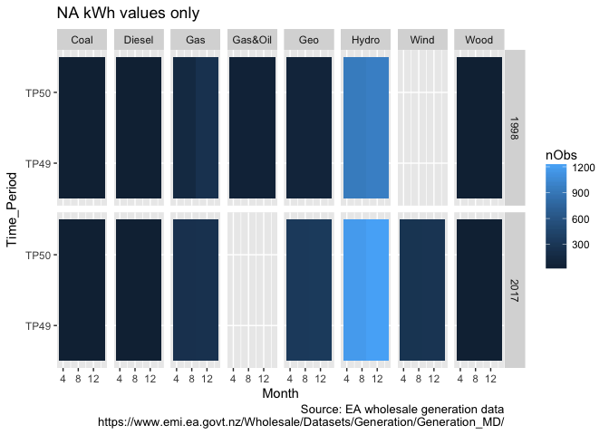

In order to avoid future confusion and to save a lot of error checking we remove NA kWh (i.e. TP49 & TP 50) from the dataset.


```r
# N rows before:
nrow(genDT)
```

```
## [1] 352250
```

```r
# N time periods before:
uniqueN(genDT$Time_Period)
```

```
## [1] 50
```

```r
# remove NA
genDT <- genDT[!is.na(kWh)]
# N rows after
nrow(genDT)
```

```
## [1] 338160
```

```r
# N time periods after:
uniqueN(genDT$Time_Period)
```

```
## [1] 48
```

# Analysis: 1998 & 2017 Comparison

## Distribution tests

The following table shows summary statistics for each fuel source by year. Hydro contributes the majority of energy in each year but coal has the highest half-hourly mean in each year suggesting that is makes large contributions at specific times. Comparing the mean and median for coal shows how skewed this distirbution was in 1998 although far less so in 2017. This is also supported by the maximum values which show coal as the 'peaked' energy producer in 1998 although this has faded by 2017 where it shows similar maxima to gas and hydro. Note that 2 of the 4 the Huntly coal-fired units were [mothballed/retired](https://en.wikipedia.org/wiki/Huntly_Power_Station) during this period.

The boxplot shows the distribution of half-hourly observations by month and year. It clearly shows the use of coal in June 1998, non-use in December 1998 but re-use in December 2017 where there appears little differnece between winter & summer use for most fuels. We also see the emergence of wind by 2017.


| year|Fuel_Code |     sumMWh| meanMWh| medianMWh| minMWh| maxMWh|  sdMWh|
|----:|:---------|----------:|-------:|---------:|------:|------:|------:|
| 1998|Coal      |  379460.72|  129.60|     40.99|      0| 493.02| 159.50|
| 1998|Diesel    |     322.77|    0.11|      0.00|      0|  84.86|   2.97|
| 1998|Gas       |  537031.60|   28.11|     10.27|      0| 267.10|  45.45|
| 1998|Gas&Oil   |  514797.99|   87.91|     91.95|      0| 173.73|  43.46|
| 1998|Geo       |  340786.48|   38.80|     25.60|      0|  81.87|  28.90|
| 1998|Hydro     | 3870532.38|   42.64|     26.49|      0| 294.98|  53.53|
| 1998|Wood      |   29067.50|    9.93|     14.10|      0|  19.50|   7.41|
| 2017|Coal      |  426606.86|  145.70|    140.41|      0| 241.88|  64.98|
| 2017|Diesel    |     941.40|    0.32|      0.00|      0|  45.39|   2.49|
| 2017|Gas       | 1367101.27|   58.36|     22.78|      0| 290.87|  75.67|
| 2017|Geo       | 1222782.96|   37.97|     38.87|      0|  84.75|  23.46|
| 2017|Hydro     | 3586485.42|   31.41|     19.57|      0| 291.82|  39.68|
| 2017|Wind      |  255368.77|    9.73|      6.30|      0|  44.27|   9.90|
| 2017|Wood      |   43571.23|   14.88|     16.64|      0|  19.51|   4.91|

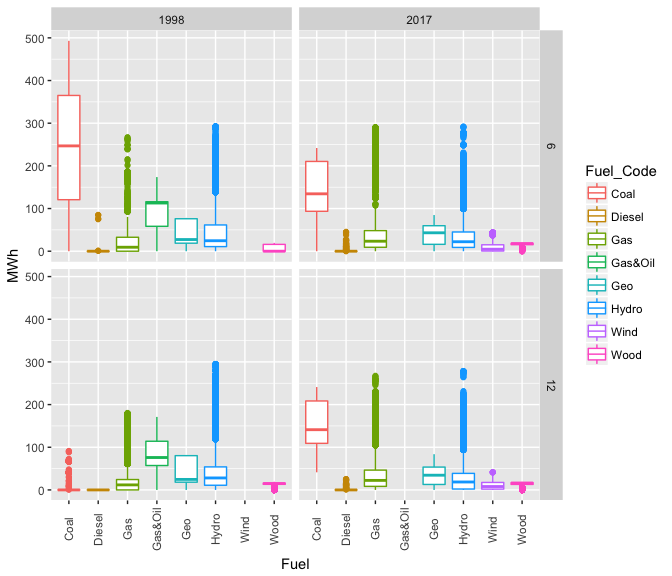<!-- -->

The next series of plots use histograms to visualise the distribution of MWh values within fuel sources. Note that the vertical axis has been allowed to vary by fuel source so that smaller counts are visible. The y axis is constant which enables the higher unit output of coal to be clearly visible. The histogram for coal shows the use of multiple units in June 1998 but not 2017 for example. It also shows that coal was almost constantly generating in 2017 (very few zero values). Hydro on the other hand shows a large number of zero or low values as does wind and back-up diesel which is to be expected.


```
## `stat_bin()` using `bins = 30`. Pick better value with `binwidth`.
```

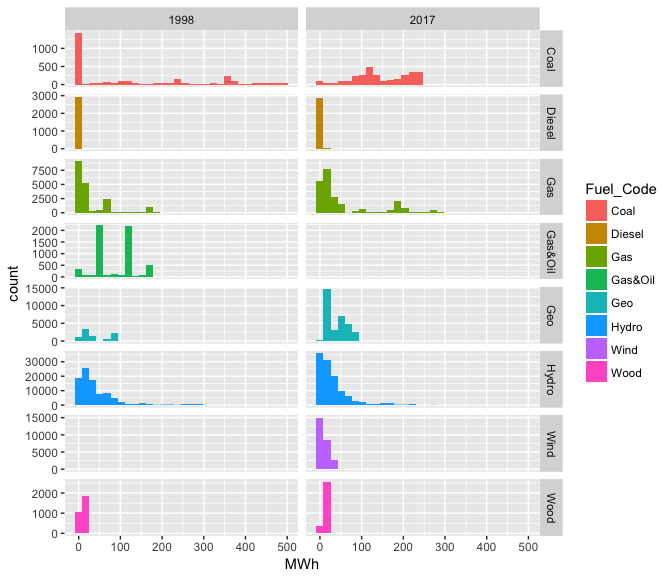<!-- -->


## Monthly generation

The following plot shows the total, mean, s.d. and coefficient of variation plots of half-hourly GWh produced by each fuel source each month and to some extent relfects the previous box plots. 


The total is simply the sum of all half-hourly values and it shows the dominance of hydro followed by coal in June 1998; the non-use of coal in December 1998; the growth of gas & geo by 2017 but the relative stasis in at-capacity hydro (?).

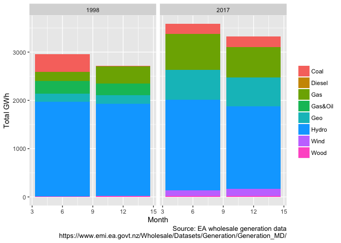<!-- -->

The next plot shows the mean of half-hourly values for each month and indicates that the Coal generation may be skewed, especially for June 1998 by a few very large values (ref the histograms above).
<!-- -->

The next plot shows the standard deviation of the half-hourly generation data and suggests that coal has the highest absolute variation in June 1998 which may correspond to a particular spike and/or a period of very heavy use. Coal is less variable in 2017 perhaps due to the increased use of Gas.

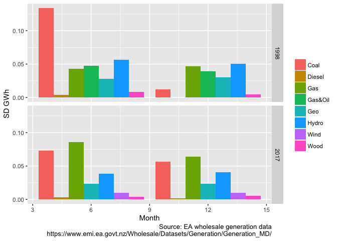<!-- -->

The final plot shows the coefficient of variation across the half-hourly values (mean/s.d). We take the CoV to indicate relative variability in generation load and the plots suggest that coal and wood tend to see greatest relative variability.


```
## Warning: Removed 1 rows containing missing values (geom_col).
```

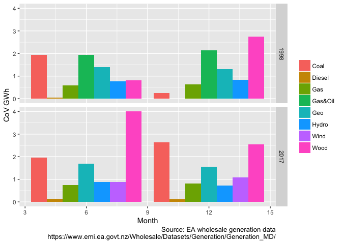<!-- -->

## Half hourly profiles by month

However the monthly plots do not tell us about the use of different generation sources by time of day which has clear implications for how peaks in demand are met.


To do this, the following plot replicates one of those found in [Staffel, 2018](https://www.sciencedirect.com/science/article/pii/S0301421516307017#f0025) for the UK to show how the different components of generation have changed over time. It shows the total half-hourly generation for each month summed over all days. Note that the half-hours are plotted at mid-points (00:15, 00:45, 01:15 etc...).

<!-- -->

The next plot repeats this analysis but shows the mean, again suggesting that the values for coal are skewed by some extremely large values in December 1998 and by high generation values when used in 2017.

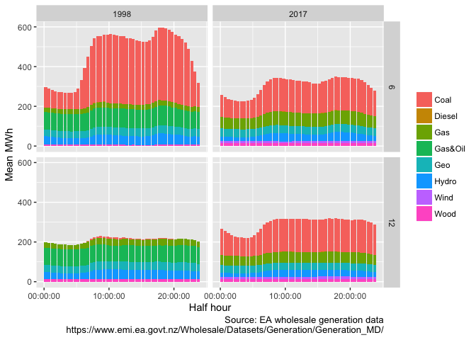<!-- -->


## Half hourly profiles by day of the month

The following plots show the profiles for each day of the month. Unfortunately due to the lack of wind generation in 1998 the colour scheme changes from 1998 to 2017. 

> To be fixed

Nevertheless the differences between the compositions of each half-hour can be seen.

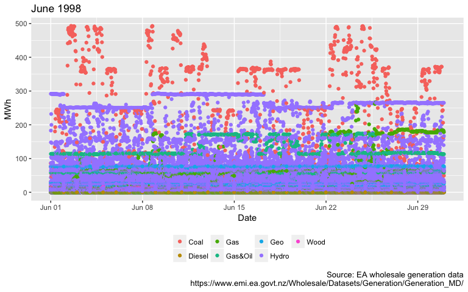<!-- -->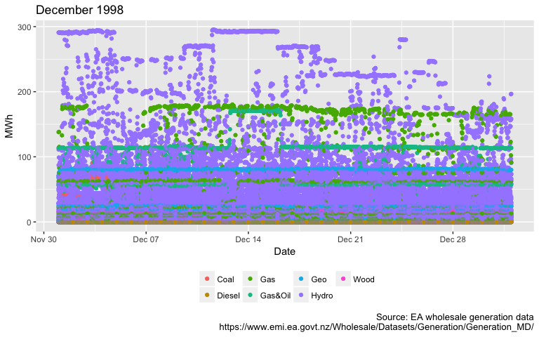<!-- -->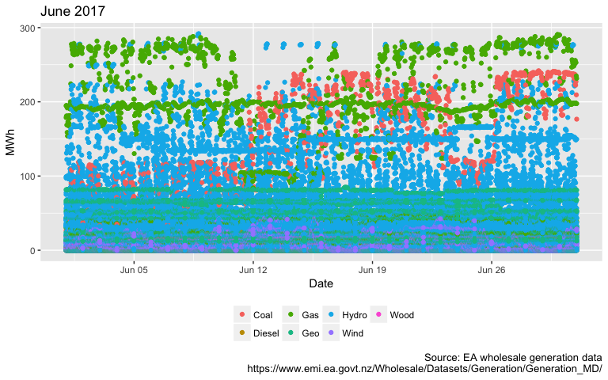<!-- -->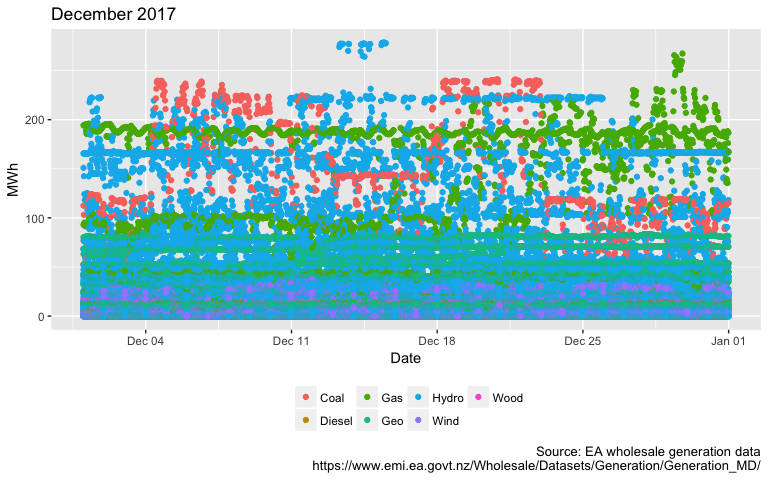<!-- -->

The following plots repeat this but use stacked column plots to show the proportion of energy generation produced by each fuel.

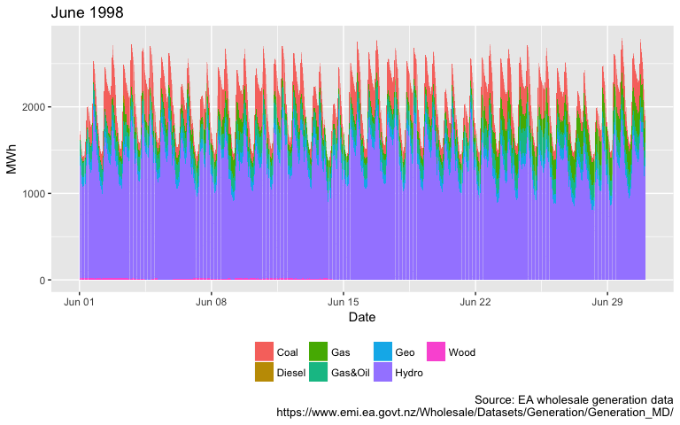<!-- -->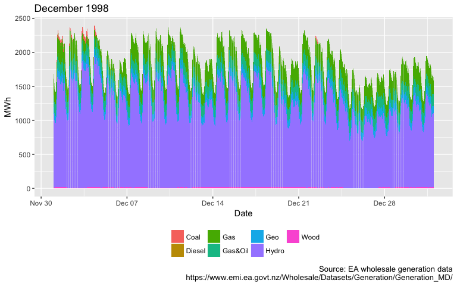<!-- -->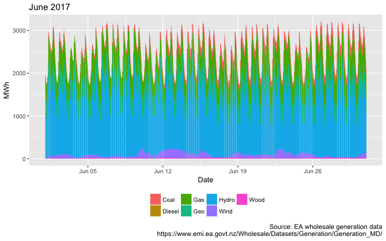<!-- -->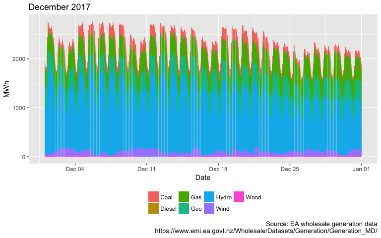<!-- -->


# Analysis: Trends 1998 - 2017

Using full dataset for each month & year. To Do.

# Discussion
here

# Conclusions
go here

# References
