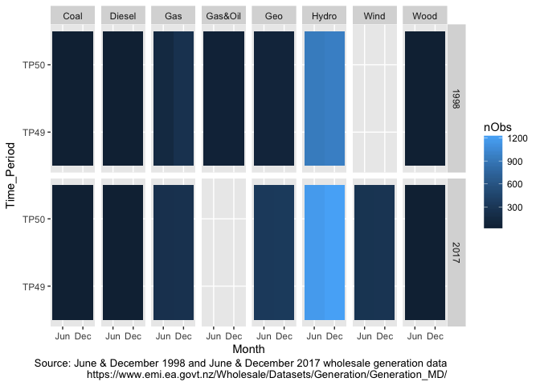
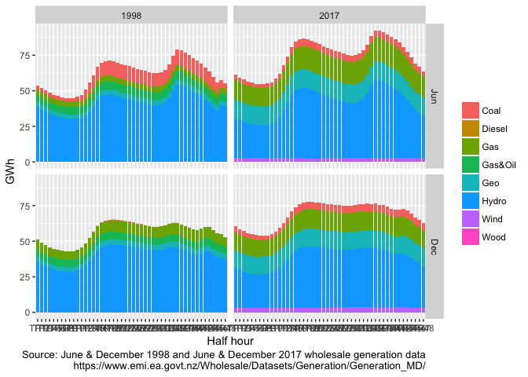

If you wish to use any of the material from this report please cite as:

 * Anderson, B. (2018) _NZ Generation History_, [Centre for Sustainability](http://www.otago.ac.nz/centre-sustainability/), University of Otago: Dunedin.

This work is (c) 2018 the University of Southampton.

\newpage

# About

Report circulation:

 * Restricted to: [NZ GREEN Grid](https://www.otago.ac.nz/centre-sustainability/research/energy/otago050285.html) project partners and contractors.

## Purpose

This report is intended to: 

 * load and test NZ electricity generation data from https://www.emi.ea.govt.nz/Wholesale/Datasets/Generation/Generation_MD/ from 1998 to 2017.

## Requirements:

 * pre-downloaded NZ wholesale generation datasets for
   + June 1998
   + December 1998
   + June 2017
   + December 2017

## History


Generally tracked via our git.soton [repo](https://git.soton.ac.uk/ba1e12/nzGREENGrid):

 * [history](https://git.soton.ac.uk/ba1e12/nzGREENGrid/commits/master)
 * [issues](https://git.soton.ac.uk/ba1e12/nzGREENGrid/issues)
 
## Support


This work was supported by:

 * The [University of Otago](https://www.otago.ac.nz/);
 * The [University of Southampton](https://www.southampton.ac.uk/);
 * The New Zealand [Ministry of Business, Innovation and Employment (MBIE)](http://www.mbie.govt.nz/) through the [NZ GREEN Grid](https://www.otago.ac.nz/centre-sustainability/research/energy/otago050285.html) project;
 * [SPATIALEC](http://www.energy.soton.ac.uk/tag/spatialec/) - a [Marie Skłodowska-Curie Global Fellowship](http://ec.europa.eu/research/mariecurieactions/about-msca/actions/if/index_en.htm) based at the University of Otago’s [Centre for Sustainability](http://www.otago.ac.nz/centre-sustainability/staff/otago673896.html) (2017-2019) & the University of Southampton's Sustainable Energy Research Group (2019-202).

We do not 'support' the code but if you have a problem check the [issues](https://git.soton.ac.uk/ba1e12/nzGREENGrid/issues) on our [repo](https://git.soton.ac.uk/ba1e12/nzGREENGrid) and if it doesn't already exist, open one. We might be able to fix it :-)
 

# Introduction

To build on Kahn et al's 2018 CO2 [intensity of peak demand](https://www.sciencedirect.com/science/article/pii/S0959652618306474?via%3Dihub) paper - how have thngs changed over time?

Uses https://www.emi.ea.govt.nz/Wholesale/Datasets/Generation/Generation_MD/ from 1998 to 2017.

Data is kWh - so energy not power.

# Load data

Load the generation data from file. These have been pre-downloaded but could be pulled on the fly to be refreshed for other dates...


```
## Warning in melt.data.table(dt, id.vars = c("Site_Code", "POC_Code",
## "Nwk_Code", : 'measure.vars' [TP1, TP2, TP3, TP4, ...] are not all of the
## same type. By order of hierarchy, the molten data value column will be of
## type 'double'. All measure variables not of type 'double' will be coerced
## too. Check DETAILS in ?melt.data.table for more on coercion.

## Warning in melt.data.table(dt, id.vars = c("Site_Code", "POC_Code",
## "Nwk_Code", : 'measure.vars' [TP1, TP2, TP3, TP4, ...] are not all of the
## same type. By order of hierarchy, the molten data value column will be of
## type 'double'. All measure variables not of type 'double' will be coerced
## too. Check DETAILS in ?melt.data.table for more on coercion.
```

```
## Warning in melt.data.table(dt, id.vars = c("Site_Code", "POC_Code",
## "Nwk_Code", : 'measure.vars' [TP1, TP2, TP3, TP4, ...] are not all of the
## same type. By order of hierarchy, the molten data value column will be of
## type 'integer'. All measure variables not of type 'integer' will be coerced
## too. Check DETAILS in ?melt.data.table for more on coercion.

## Warning in melt.data.table(dt, id.vars = c("Site_Code", "POC_Code",
## "Nwk_Code", : 'measure.vars' [TP1, TP2, TP3, TP4, ...] are not all of the
## same type. By order of hierarchy, the molten data value column will be of
## type 'integer'. All measure variables not of type 'integer' will be coerced
## too. Check DETAILS in ?melt.data.table for more on coercion.
```

The following table sumamrises the data.


```
## Skim summary statistics  
##  n obs: 352250    
##  n variables: 12    
## 
## Variable type: character
## 
## |   variable   | missing | complete |   n    | min | max | empty | n_unique |
## |--------------|---------|----------|--------|-----|-----|-------|----------|
## |  Fuel_Code   |    0    |  352250  | 352250 |  3  |  7  |   0   |    8     |
## |   Gen_Code   |    0    |  352250  | 352250 |  3  | 15  |   0   |    68    |
## |   Nwk_Code   |    0    |  352250  | 352250 |  4  |  4  |   0   |    27    |
## |   POC_Code   |    0    |  352250  | 352250 |  7  |  7  |   0   |    68    |
## |  Site_Code   |    0    |  352250  | 352250 |  3  |  3  |   0   |    69    |
## |  Tech_Code   |    0    |  352250  | 352250 |  3  |  5  |   0   |    5     |
## | Trading_date |    0    |  352250  | 352250 | 10  | 10  |   0   |   122    |
## 
## Variable type: Date
## 
## | variable | missing | complete |   n    |    min     |    max     |   median   | n_unique |
## |----------|---------|----------|--------|------------|------------|------------|----------|
## |  rDate   |    0    |  352250  | 352250 | 1998-06-01 | 2017-12-31 | 2017-06-11 |   122    |
## 
## Variable type: factor
## 
## |  variable   | missing | complete |   n    | n_unique |                 top_counts                 | ordered |
## |-------------|---------|----------|--------|----------|--------------------------------------------|---------|
## |   r_month   |    0    |  352250  | 352250 |    2     |  Dec: 181250, Jun: 171000, Jan: 0, Feb: 0  |  TRUE   |
## | Time_Period |    0    |  352250  | 352250 |    50    | TP1: 7045, TP2: 7045, TP3: 7045, TP4: 7045 |  FALSE  |
## 
## Variable type: numeric
## 
## | variable | missing | complete |   n    |   mean   |    sd    |  p0  |   p25   |   p50    |  p75  |  p100  |   hist   |
## |----------|---------|----------|--------|----------|----------|------|---------|----------|-------|--------|----------|
## |   kWh    |  14090  |  338160  | 352250 | 37186.12 | 50545.37 |  0   | 6562.75 | 19714.76 | 48640 | 493020 | ▇▁▁▁▁▁▁▁ |
## |  r_year  |    0    |  352250  | 352250 | 2009.51  |   9.28   | 1998 |  1998   |   2017   | 2017  |  2017  | ▅▁▁▁▁▁▁▇ |
```

Notice that there are missing (NA) values in the kWh column. These are caused by periods 49 and 50 being missing:

> "The data is presented by trading period, TP1, TP2, ... TP48. Trading period 1 starts at midnight, trading period 2 starts at 12:30am, trading period 3 starts at 1:00am, etc. Users of this data should be aware of daylight saving in New Zealand. On the day daylight saving commences there are only 46 trading periods and on the day it ends, there are 50." (https://www.emi.ea.govt.nz/Wholesale/Datasets/Generation/Generation_MD/)

Daylight saving begins/ends in October and March so we carefully avoid this problem by using June and December. However these TP are still present as NA in the data as the following plot of NA observations (only) by Fuel Type and month shows.



We therefore remove TP49 & TP50 from the data for the rest of the analysis.


# Analysis: Generation profiles

## Half hourly profiles by month

This plot replicates one of those found in [Staffel, 2018](https://www.sciencedirect.com/science/article/pii/S0301421516307017#f0025) for the UK to show how the different components of generation have changed over time.

<!-- -->


## Half hourly profiles by day of the month

This plot shows the profiles for each day of each month joined end to end.

> requires creation of true dateTime...


# Discuss your results
here

# Conclusions
go here

# References
