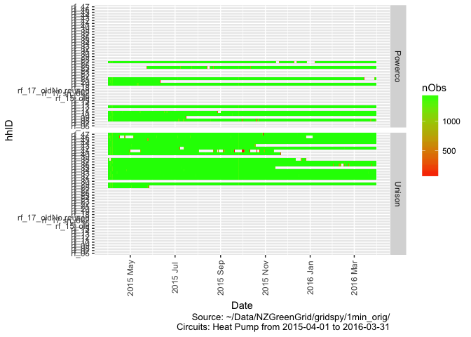
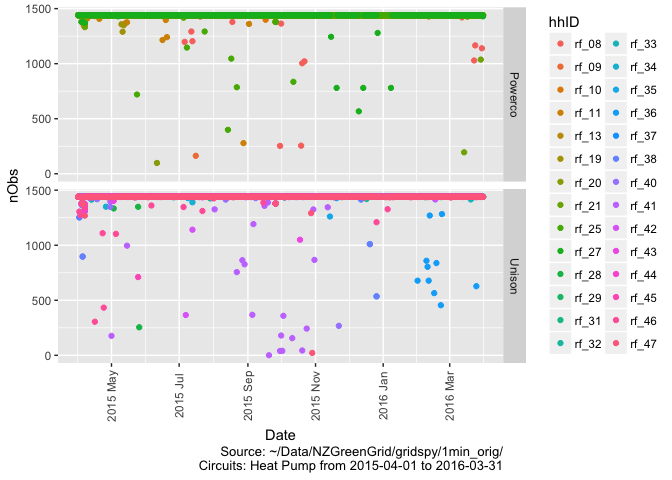
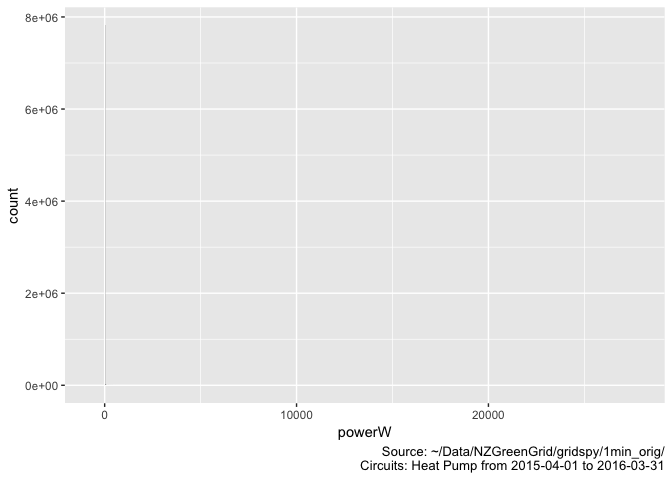
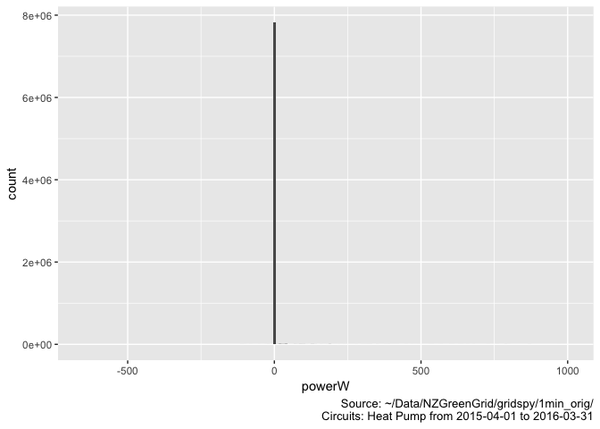
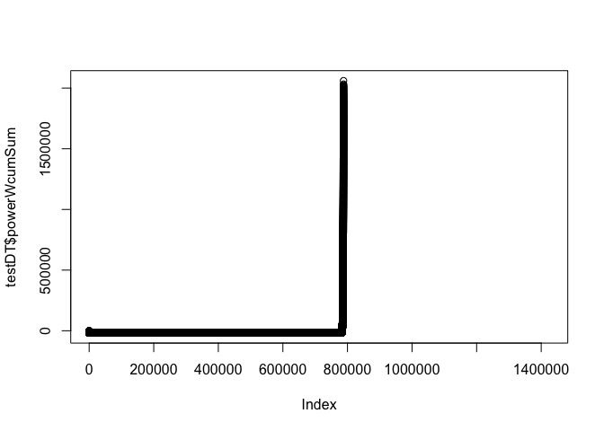
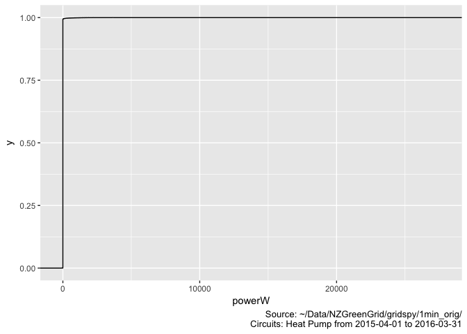
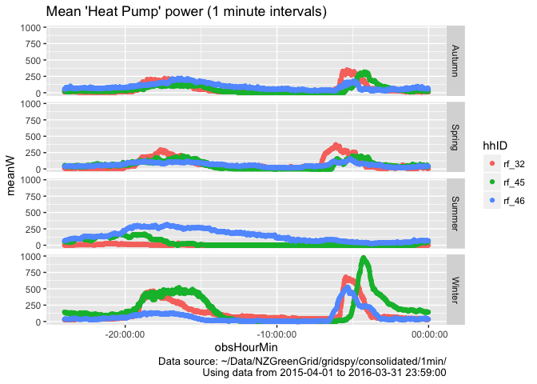

\newpage

# Status


Test run using reduced data from ~/Data/NZGreenGrid/gridspy/1min_orig/

# Citation

If you wish to use any of the material from this report please cite as:

 * Anderson, B. (2018) GREEN Grid Heat Pump Profiles, University of Otago: Dunedin, NZ.

\newpage

# Introduction

Report circulation:

 * Restricted to: [NZ GREEN Grid](https://www.otago.ac.nz/centre-sustainability/research/energy/otago050285.html) project partners and contractors.

## Purpose

This report is intended to: 

 * load and clean the project electricity power data (Grid Spy)
 * select the Heat Pump circuits (via their labels)
 * build exploratory demand profiles

## Requirements:

 * cleaned and safe grid spy 1 minute data processed via https://git.soton.ac.uk/ba1e12/nzGREENGrid/blob/master/dataProcessing/processNZGGElecCons1minData.Rmd

## History

Generally tracked via our git.soton [repo](https://git.soton.ac.uk/ba1e12/nzGREENGrid):

 * [history](https://git.soton.ac.uk/ba1e12/nzGREENGrid/commits/master)
 * [issues](https://git.soton.ac.uk/ba1e12/nzGREENGrid/issues)
 
## Support

This work was supported by:

 * The [University of Otago](https://www.otago.ac.nz/)
 * The New Zealand [Ministry of Business, Innovation and Employment (MBIE)](http://www.mbie.govt.nz/)
 * [SPATIALEC](http://www.energy.soton.ac.uk/tag/spatialec/) - a [Marie Skłodowska-Curie Global Fellowship](http://ec.europa.eu/research/mariecurieactions/about-msca/actions/if/index_en.htm) based at the University of Otago’s [Centre for Sustainability](http://www.otago.ac.nz/centre-sustainability/staff/otago673896.html) (2017-2019) & the University of Southampton's Sustainable Energy Research Group (2019-202).
 
This work is (c) 2018 the University of Southampton.

We do not 'support' the code but if you have a problem check the [issues](https://git.soton.ac.uk/ba1e12/nzGREENGrid/issues) on our [repo](https://git.soton.ac.uk/ba1e12/nzGREENGrid) and if it doesn't already exist, open one. We might be able to fix it :-)


# Load data files

## Grid Spy metadata

In this section we load metadata from /Users/ben/Syncplicity Folders/Green Grid Project Management Folder/Gridspy/Master list of Gridspy units.xlsx to link to the power data.


```
##    sample  hhID          Adults Teenagers             Children removed
## 1: Unison rf_28               2      <NA>            3(12,8,4)    <NA>
## 2: Unison rf_29               2      <NA>     1 (7 months old)    live
## 3: Unison rf_30               2         0                    0    <NA>
## 4: Unison rf_31 2 (Plus cousin)      <NA>                 <NA>    live
## 5: Unison rf_32               2      <NA> 2 (7 and 4years old)    <NA>
## 6: Unison rf_33               2 1(14yold)            1 (6yold)    live
```

```
##     sample  hhID Adults Teenagers Children  removed
## 1: Powerco rf_12      1      <NA>     <NA> 3/6/1015
## 2: Powerco  <NA>      1      <NA>     <NA>     <NA>
## 3: Powerco rf_25      1      <NA>     <NA>     <NA>
## 4: Powerco  <NA>     NA      <NA>     <NA>     <NA>
## 5: Powerco  <NA>      1      <NA>   1(5mo)     <NA>
## 6: Powerco  <NA>     NA      <NA>     <NA>     <NA>
```

<table>
<caption>Meta data for sample</caption>
 <thead>
  <tr>
   <th style="text-align:left;"> sample </th>
   <th style="text-align:left;"> hhID </th>
   <th style="text-align:left;"> Adults </th>
   <th style="text-align:left;"> Teenagers </th>
   <th style="text-align:left;"> Children </th>
   <th style="text-align:left;"> removed </th>
   <th style="text-align:left;"> nAdults </th>
  </tr>
 </thead>
<tbody>
  <tr>
   <td style="text-align:left;"> Powerco </td>
   <td style="text-align:left;"> rf_06 </td>
   <td style="text-align:left;"> 2 </td>
   <td style="text-align:left;"> NA </td>
   <td style="text-align:left;"> NA </td>
   <td style="text-align:left;"> NA </td>
   <td style="text-align:left;"> 2 </td>
  </tr>
  <tr>
   <td style="text-align:left;"> Powerco </td>
   <td style="text-align:left;"> rf_07 </td>
   <td style="text-align:left;"> 2 </td>
   <td style="text-align:left;"> NA </td>
   <td style="text-align:left;"> 2 </td>
   <td style="text-align:left;"> NA </td>
   <td style="text-align:left;"> 2 </td>
  </tr>
  <tr>
   <td style="text-align:left;"> Powerco </td>
   <td style="text-align:left;"> rf_08 </td>
   <td style="text-align:left;"> 2 </td>
   <td style="text-align:left;"> NA </td>
   <td style="text-align:left;"> NA </td>
   <td style="text-align:left;"> NA </td>
   <td style="text-align:left;"> 2 </td>
  </tr>
  <tr>
   <td style="text-align:left;"> Powerco </td>
   <td style="text-align:left;"> rf_09 </td>
   <td style="text-align:left;"> 2 </td>
   <td style="text-align:left;"> NA </td>
   <td style="text-align:left;"> 1 </td>
   <td style="text-align:left;"> 42171 </td>
   <td style="text-align:left;"> 2 </td>
  </tr>
  <tr>
   <td style="text-align:left;"> Powerco </td>
   <td style="text-align:left;"> rf_10 </td>
   <td style="text-align:left;"> 2 </td>
   <td style="text-align:left;"> NA </td>
   <td style="text-align:left;"> 1(3yo) </td>
   <td style="text-align:left;"> NA </td>
   <td style="text-align:left;"> 3 </td>
  </tr>
  <tr>
   <td style="text-align:left;"> Powerco </td>
   <td style="text-align:left;"> rf_11 </td>
   <td style="text-align:left;"> NA </td>
   <td style="text-align:left;"> NA </td>
   <td style="text-align:left;"> NA </td>
   <td style="text-align:left;"> NA </td>
   <td style="text-align:left;"> 1 </td>
  </tr>
  <tr>
   <td style="text-align:left;"> Powerco </td>
   <td style="text-align:left;"> rf_12 </td>
   <td style="text-align:left;"> 1 </td>
   <td style="text-align:left;"> NA </td>
   <td style="text-align:left;"> NA </td>
   <td style="text-align:left;"> 3/6/1015 </td>
   <td style="text-align:left;"> 1 </td>
  </tr>
  <tr>
   <td style="text-align:left;"> Powerco </td>
   <td style="text-align:left;"> rf_13 </td>
   <td style="text-align:left;"> 2 </td>
   <td style="text-align:left;"> 1(16yo) </td>
   <td style="text-align:left;"> 1(11) </td>
   <td style="text-align:left;"> NA </td>
   <td style="text-align:left;"> 2 </td>
  </tr>
  <tr>
   <td style="text-align:left;"> Powerco </td>
   <td style="text-align:left;"> rf_14 </td>
   <td style="text-align:left;"> 1 </td>
   <td style="text-align:left;"> NA </td>
   <td style="text-align:left;"> 1 (11 yo) </td>
   <td style="text-align:left;"> NA </td>
   <td style="text-align:left;"> 1 </td>
  </tr>
  <tr>
   <td style="text-align:left;"> Powerco </td>
   <td style="text-align:left;"> rf_15 </td>
   <td style="text-align:left;"> NA </td>
   <td style="text-align:left;"> NA </td>
   <td style="text-align:left;"> NA </td>
   <td style="text-align:left;"> 42462 </td>
   <td style="text-align:left;"> 1 </td>
  </tr>
  <tr>
   <td style="text-align:left;"> Powerco </td>
   <td style="text-align:left;"> rf_15_old </td>
   <td style="text-align:left;"> 1 </td>
   <td style="text-align:left;"> NA </td>
   <td style="text-align:left;"> NA </td>
   <td style="text-align:left;"> 42019 </td>
   <td style="text-align:left;"> 1 </td>
  </tr>
  <tr>
   <td style="text-align:left;"> Powerco </td>
   <td style="text-align:left;"> rf_16 </td>
   <td style="text-align:left;"> 2 </td>
   <td style="text-align:left;"> NA </td>
   <td style="text-align:left;"> NA </td>
   <td style="text-align:left;"> 42089 </td>
   <td style="text-align:left;"> 2 </td>
  </tr>
  <tr>
   <td style="text-align:left;"> Powerco </td>
   <td style="text-align:left;"> rf_17 sn_662 </td>
   <td style="text-align:left;"> NA </td>
   <td style="text-align:left;"> NA </td>
   <td style="text-align:left;"> NA </td>
   <td style="text-align:left;"> NA </td>
   <td style="text-align:left;"> 1 </td>
  </tr>
  <tr>
   <td style="text-align:left;"> Powerco </td>
   <td style="text-align:left;"> rf_17_oldNo reused </td>
   <td style="text-align:left;"> 2 </td>
   <td style="text-align:left;"> 1(13yo) </td>
   <td style="text-align:left;"> 1(11yo) </td>
   <td style="text-align:left;"> 42457 </td>
   <td style="text-align:left;"> 2 </td>
  </tr>
  <tr>
   <td style="text-align:left;"> Powerco </td>
   <td style="text-align:left;"> rf_18 </td>
   <td style="text-align:left;"> 2 </td>
   <td style="text-align:left;"> NA </td>
   <td style="text-align:left;"> 1(1yo) </td>
   <td style="text-align:left;"> 42532 </td>
   <td style="text-align:left;"> 2 </td>
  </tr>
  <tr>
   <td style="text-align:left;"> Powerco </td>
   <td style="text-align:left;"> rf_19 </td>
   <td style="text-align:left;"> 1 </td>
   <td style="text-align:left;"> NA </td>
   <td style="text-align:left;"> NA </td>
   <td style="text-align:left;"> NA </td>
   <td style="text-align:left;"> 1 </td>
  </tr>
  <tr>
   <td style="text-align:left;"> Powerco </td>
   <td style="text-align:left;"> rf_20 </td>
   <td style="text-align:left;"> 2 </td>
   <td style="text-align:left;"> NA </td>
   <td style="text-align:left;"> 2 </td>
   <td style="text-align:left;"> 42166 </td>
   <td style="text-align:left;"> 2 </td>
  </tr>
  <tr>
   <td style="text-align:left;"> Powerco </td>
   <td style="text-align:left;"> rf_21 </td>
   <td style="text-align:left;"> 2 </td>
   <td style="text-align:left;"> NA </td>
   <td style="text-align:left;"> NA </td>
   <td style="text-align:left;"> 42821 </td>
   <td style="text-align:left;"> 2 </td>
  </tr>
  <tr>
   <td style="text-align:left;"> Powerco </td>
   <td style="text-align:left;"> rf_22 </td>
   <td style="text-align:left;"> 2 </td>
   <td style="text-align:left;"> NA </td>
   <td style="text-align:left;"> NA </td>
   <td style="text-align:left;"> NA </td>
   <td style="text-align:left;"> 2 </td>
  </tr>
  <tr>
   <td style="text-align:left;"> Powerco </td>
   <td style="text-align:left;"> rf_23 </td>
   <td style="text-align:left;"> 1 </td>
   <td style="text-align:left;"> NA </td>
   <td style="text-align:left;"> NA </td>
   <td style="text-align:left;"> NA </td>
   <td style="text-align:left;"> 1 </td>
  </tr>
  <tr>
   <td style="text-align:left;"> Powerco </td>
   <td style="text-align:left;"> rf_24 </td>
   <td style="text-align:left;"> 2 </td>
   <td style="text-align:left;"> NA </td>
   <td style="text-align:left;"> 2 </td>
   <td style="text-align:left;"> NA </td>
   <td style="text-align:left;"> 2 </td>
  </tr>
  <tr>
   <td style="text-align:left;"> Powerco </td>
   <td style="text-align:left;"> rf_25 </td>
   <td style="text-align:left;"> 1 </td>
   <td style="text-align:left;"> NA </td>
   <td style="text-align:left;"> NA </td>
   <td style="text-align:left;"> NA </td>
   <td style="text-align:left;"> 1 </td>
  </tr>
  <tr>
   <td style="text-align:left;"> Powerco </td>
   <td style="text-align:left;"> rf_26 </td>
   <td style="text-align:left;"> 2 </td>
   <td style="text-align:left;"> NA </td>
   <td style="text-align:left;"> NA </td>
   <td style="text-align:left;"> NA </td>
   <td style="text-align:left;"> 2 </td>
  </tr>
  <tr>
   <td style="text-align:left;"> Powerco </td>
   <td style="text-align:left;"> rf_27 </td>
   <td style="text-align:left;"> 2 </td>
   <td style="text-align:left;"> 1 </td>
   <td style="text-align:left;"> 1 </td>
   <td style="text-align:left;"> NA </td>
   <td style="text-align:left;"> 2 </td>
  </tr>
  <tr>
   <td style="text-align:left;"> Unison </td>
   <td style="text-align:left;"> rf_28 </td>
   <td style="text-align:left;"> 2 </td>
   <td style="text-align:left;"> NA </td>
   <td style="text-align:left;"> 3(12,8,4) </td>
   <td style="text-align:left;"> NA </td>
   <td style="text-align:left;"> 3 </td>
  </tr>
  <tr>
   <td style="text-align:left;"> Unison </td>
   <td style="text-align:left;"> rf_29 </td>
   <td style="text-align:left;"> 2 </td>
   <td style="text-align:left;"> NA </td>
   <td style="text-align:left;"> 1 (7 months old) </td>
   <td style="text-align:left;"> live </td>
   <td style="text-align:left;"> 2 </td>
  </tr>
  <tr>
   <td style="text-align:left;"> Unison </td>
   <td style="text-align:left;"> rf_30 </td>
   <td style="text-align:left;"> 2 </td>
   <td style="text-align:left;"> 0 </td>
   <td style="text-align:left;"> 0 </td>
   <td style="text-align:left;"> NA </td>
   <td style="text-align:left;"> 2 </td>
  </tr>
  <tr>
   <td style="text-align:left;"> Unison </td>
   <td style="text-align:left;"> rf_31 </td>
   <td style="text-align:left;"> 2 (Plus cousin) </td>
   <td style="text-align:left;"> NA </td>
   <td style="text-align:left;"> NA </td>
   <td style="text-align:left;"> live </td>
   <td style="text-align:left;"> 2 </td>
  </tr>
  <tr>
   <td style="text-align:left;"> Unison </td>
   <td style="text-align:left;"> rf_32 </td>
   <td style="text-align:left;"> 2 </td>
   <td style="text-align:left;"> NA </td>
   <td style="text-align:left;"> 2 (7 and 4years old) </td>
   <td style="text-align:left;"> NA </td>
   <td style="text-align:left;"> 2 </td>
  </tr>
  <tr>
   <td style="text-align:left;"> Unison </td>
   <td style="text-align:left;"> rf_33 </td>
   <td style="text-align:left;"> 2 </td>
   <td style="text-align:left;"> 1(14yold) </td>
   <td style="text-align:left;"> 1 (6yold) </td>
   <td style="text-align:left;"> live </td>
   <td style="text-align:left;"> 2 </td>
  </tr>
  <tr>
   <td style="text-align:left;"> Unison </td>
   <td style="text-align:left;"> rf_34 </td>
   <td style="text-align:left;"> 3 </td>
   <td style="text-align:left;"> NA </td>
   <td style="text-align:left;"> NA </td>
   <td style="text-align:left;"> NA </td>
   <td style="text-align:left;"> 1 </td>
  </tr>
  <tr>
   <td style="text-align:left;"> Unison </td>
   <td style="text-align:left;"> rf_35 </td>
   <td style="text-align:left;"> 2 </td>
   <td style="text-align:left;"> NA </td>
   <td style="text-align:left;"> NA </td>
   <td style="text-align:left;"> 42322 </td>
   <td style="text-align:left;"> 2 </td>
  </tr>
  <tr>
   <td style="text-align:left;"> Unison </td>
   <td style="text-align:left;"> rf_36 </td>
   <td style="text-align:left;"> 1 </td>
   <td style="text-align:left;"> 2 (14 and 12) </td>
   <td style="text-align:left;"> NA </td>
   <td style="text-align:left;"> live </td>
   <td style="text-align:left;"> 1 </td>
  </tr>
  <tr>
   <td style="text-align:left;"> Unison </td>
   <td style="text-align:left;"> rf_37 </td>
   <td style="text-align:left;"> 2 </td>
   <td style="text-align:left;"> NA </td>
   <td style="text-align:left;"> NA </td>
   <td style="text-align:left;"> live </td>
   <td style="text-align:left;"> 2 </td>
  </tr>
  <tr>
   <td style="text-align:left;"> Unison </td>
   <td style="text-align:left;"> rf_38 </td>
   <td style="text-align:left;"> NA </td>
   <td style="text-align:left;"> NA </td>
   <td style="text-align:left;"> NA </td>
   <td style="text-align:left;"> NA </td>
   <td style="text-align:left;"> 1 </td>
  </tr>
  <tr>
   <td style="text-align:left;"> Unison </td>
   <td style="text-align:left;"> rf_38 </td>
   <td style="text-align:left;"> 2 </td>
   <td style="text-align:left;"> NA </td>
   <td style="text-align:left;"> 2 (&lt;12) </td>
   <td style="text-align:left;"> NA </td>
   <td style="text-align:left;"> 2 </td>
  </tr>
  <tr>
   <td style="text-align:left;"> Unison </td>
   <td style="text-align:left;"> rf_39 </td>
   <td style="text-align:left;"> 2 </td>
   <td style="text-align:left;"> 1 (16 YO) </td>
   <td style="text-align:left;"> NA </td>
   <td style="text-align:left;"> live </td>
   <td style="text-align:left;"> 2 </td>
  </tr>
  <tr>
   <td style="text-align:left;"> Unison </td>
   <td style="text-align:left;"> rf_40 </td>
   <td style="text-align:left;"> 2 </td>
   <td style="text-align:left;"> NA </td>
   <td style="text-align:left;"> NA </td>
   <td style="text-align:left;"> 42330 </td>
   <td style="text-align:left;"> 2 </td>
  </tr>
  <tr>
   <td style="text-align:left;"> Unison </td>
   <td style="text-align:left;"> rf_41 </td>
   <td style="text-align:left;"> 2 </td>
   <td style="text-align:left;"> NA </td>
   <td style="text-align:left;"> 2 (11 and 8) </td>
   <td style="text-align:left;"> live </td>
   <td style="text-align:left;"> 2 </td>
  </tr>
  <tr>
   <td style="text-align:left;"> Unison </td>
   <td style="text-align:left;"> rf_42 </td>
   <td style="text-align:left;"> 2 </td>
   <td style="text-align:left;"> NA </td>
   <td style="text-align:left;"> 3 (&lt;12 yold, 1 10 YO) </td>
   <td style="text-align:left;"> NA </td>
   <td style="text-align:left;"> 3 </td>
  </tr>
  <tr>
   <td style="text-align:left;"> Unison </td>
   <td style="text-align:left;"> rf_43 </td>
   <td style="text-align:left;"> 2 </td>
   <td style="text-align:left;"> NA </td>
   <td style="text-align:left;"> NA </td>
   <td style="text-align:left;"> 42296 </td>
   <td style="text-align:left;"> 2 </td>
  </tr>
  <tr>
   <td style="text-align:left;"> Unison </td>
   <td style="text-align:left;"> rf_44 </td>
   <td style="text-align:left;"> 2 </td>
   <td style="text-align:left;"> NA </td>
   <td style="text-align:left;"> 2 (10 and 7) </td>
   <td style="text-align:left;"> NA </td>
   <td style="text-align:left;"> 2 </td>
  </tr>
  <tr>
   <td style="text-align:left;"> Unison </td>
   <td style="text-align:left;"> rf_45 </td>
   <td style="text-align:left;"> 2 </td>
   <td style="text-align:left;"> NA </td>
   <td style="text-align:left;"> 3 (&lt;12 years old) </td>
   <td style="text-align:left;"> NA </td>
   <td style="text-align:left;"> 3 </td>
  </tr>
  <tr>
   <td style="text-align:left;"> Unison </td>
   <td style="text-align:left;"> rf_46 </td>
   <td style="text-align:left;"> 2 </td>
   <td style="text-align:left;"> NA </td>
   <td style="text-align:left;"> 1 (4yold-50%) </td>
   <td style="text-align:left;"> live </td>
   <td style="text-align:left;"> 2 </td>
  </tr>
  <tr>
   <td style="text-align:left;"> Unison </td>
   <td style="text-align:left;"> rf_47 </td>
   <td style="text-align:left;"> 3 </td>
   <td style="text-align:left;"> 2 </td>
   <td style="text-align:left;"> NA </td>
   <td style="text-align:left;"> NA </td>
   <td style="text-align:left;"> 1 </td>
  </tr>
</tbody>
</table>

## Grid Spy data

In this section we load the cleaned data files from ~/Data/NZGreenGrid/safe/gridSpy/1min/data/. If we loaded all the data at once and then filtered out what we want we might run out of memory so we filter as we load. Set the filters here:


```r
circuitPattern <- "Heat Pump"
dateFrom <- "2015-04-01"
dateTo <- "2016-03-31"

plotCaption <- paste0("Source: ", fpath,
                      "\nCircuits: ", circuitPattern, " from ", dateFrom, " to ", dateTo)
```

So we are looking for Heat Pump circuits between 2015-04-01 and 2016-03-31. We do this by checking to see if the extract file has already been created. If so we load it. If not, we create it.


The file we are looking for is: Heat Pump_2015-04-01_2016-03-31_observations.csv.gz


```
## [1] "~/Data/NZGreenGrid/safe/gridSpy/1min/dataExtracts/Heat Pump_2015-04-01_2016-03-31_observations.csv.gz exists so re-loading..."
```

```
## Parsed with column specification:
## cols(
##   hhID = col_character(),
##   r_dateTime = col_datetime(format = ""),
##   circuit = col_character(),
##   powerW = col_integer(),
##   obsHourMin = col_time(format = "")
## )
```

```
## Warning in rbind(names(probs), probs_f): number of columns of result is not
## a multiple of vector length (arg 1)
```

```
## Warning: 6377480 parsing failures.
## row # A tibble: 5 x 5 col     row col    expected               actual file                          expected   <int> <chr>  <chr>                  <chr>  <chr>                         actual 1 16106 powerW no trailing characters .01    '~/Data/NZGreenGrid/safe/gri… file 2 16107 powerW no trailing characters .34    '~/Data/NZGreenGrid/safe/gri… row 3 16108 powerW no trailing characters .51    '~/Data/NZGreenGrid/safe/gri… col 4 16109 powerW no trailing characters .34    '~/Data/NZGreenGrid/safe/gri… expected 5 16110 powerW no trailing characters .7     '~/Data/NZGreenGrid/safe/gri…
## ... ................. ... .......................................................................... ........ .......................................................................... ...... .......................................................................... .... .......................................................................... ... .......................................................................... ... .......................................................................... ........ ..........................................................................
## See problems(...) for more details.
```

```
## [1] "# Loaded 14,252,439 rows of data"
```

The following table summarises the Heat Pump data we have found.

<table>
<caption>Summary of household grid spy data for: Heat Pump</caption>
 <thead>
  <tr>
   <th style="text-align:left;"> hhID </th>
   <th style="text-align:right;"> nObs </th>
   <th style="text-align:right;"> nHouseholds </th>
   <th style="text-align:right;"> nCircuits </th>
   <th style="text-align:right;"> meanPower </th>
   <th style="text-align:left;"> minDate </th>
   <th style="text-align:left;"> maxDate </th>
  </tr>
 </thead>
<tbody>
  <tr>
   <td style="text-align:left;"> rf_08 </td>
   <td style="text-align:right;"> 521843 </td>
   <td style="text-align:right;"> 1 </td>
   <td style="text-align:right;"> 1 </td>
   <td style="text-align:right;"> NA </td>
   <td style="text-align:left;"> 2015-04-01 </td>
   <td style="text-align:left;"> 2016-03-31 </td>
  </tr>
  <tr>
   <td style="text-align:left;"> rf_09 </td>
   <td style="text-align:right;"> 152669 </td>
   <td style="text-align:right;"> 1 </td>
   <td style="text-align:right;"> 1 </td>
   <td style="text-align:right;"> NA </td>
   <td style="text-align:left;"> 2015-04-01 </td>
   <td style="text-align:left;"> 2015-07-16 </td>
  </tr>
  <tr>
   <td style="text-align:left;"> rf_10 </td>
   <td style="text-align:right;"> 526797 </td>
   <td style="text-align:right;"> 1 </td>
   <td style="text-align:right;"> 1 </td>
   <td style="text-align:right;"> NA </td>
   <td style="text-align:left;"> 2015-04-01 </td>
   <td style="text-align:left;"> 2016-03-31 </td>
  </tr>
  <tr>
   <td style="text-align:left;"> rf_11 </td>
   <td style="text-align:right;"> 519185 </td>
   <td style="text-align:right;"> 1 </td>
   <td style="text-align:right;"> 1 </td>
   <td style="text-align:right;"> NA </td>
   <td style="text-align:left;"> 2015-04-01 </td>
   <td style="text-align:left;"> 2016-03-31 </td>
  </tr>
  <tr>
   <td style="text-align:left;"> rf_13 </td>
   <td style="text-align:right;"> 1053858 </td>
   <td style="text-align:right;"> 1 </td>
   <td style="text-align:right;"> 2 </td>
   <td style="text-align:right;"> NA </td>
   <td style="text-align:left;"> 2015-04-01 </td>
   <td style="text-align:left;"> 2016-03-31 </td>
  </tr>
  <tr>
   <td style="text-align:left;"> rf_17 </td>
   <td style="text-align:right;"> 520028 </td>
   <td style="text-align:right;"> 1 </td>
   <td style="text-align:right;"> 1 </td>
   <td style="text-align:right;"> NA </td>
   <td style="text-align:left;"> 2015-04-01 </td>
   <td style="text-align:left;"> 2016-03-28 </td>
  </tr>
  <tr>
   <td style="text-align:left;"> rf_19 </td>
   <td style="text-align:right;"> 1053136 </td>
   <td style="text-align:right;"> 1 </td>
   <td style="text-align:right;"> 2 </td>
   <td style="text-align:right;"> NA </td>
   <td style="text-align:left;"> 2015-04-01 </td>
   <td style="text-align:left;"> 2016-03-31 </td>
  </tr>
  <tr>
   <td style="text-align:left;"> rf_20 </td>
   <td style="text-align:right;"> 102188 </td>
   <td style="text-align:right;"> 1 </td>
   <td style="text-align:right;"> 1 </td>
   <td style="text-align:right;"> NA </td>
   <td style="text-align:left;"> 2015-04-01 </td>
   <td style="text-align:left;"> 2015-06-11 </td>
  </tr>
  <tr>
   <td style="text-align:left;"> rf_21 </td>
   <td style="text-align:right;"> 505042 </td>
   <td style="text-align:right;"> 1 </td>
   <td style="text-align:right;"> 1 </td>
   <td style="text-align:right;"> NA </td>
   <td style="text-align:left;"> 2015-04-01 </td>
   <td style="text-align:left;"> 2016-03-31 </td>
  </tr>
  <tr>
   <td style="text-align:left;"> rf_25 </td>
   <td style="text-align:right;"> 443936 </td>
   <td style="text-align:right;"> 1 </td>
   <td style="text-align:right;"> 1 </td>
   <td style="text-align:right;"> NA </td>
   <td style="text-align:left;"> 2015-05-24 </td>
   <td style="text-align:left;"> 2016-03-31 </td>
  </tr>
  <tr>
   <td style="text-align:left;"> rf_27 </td>
   <td style="text-align:right;"> 497806 </td>
   <td style="text-align:right;"> 1 </td>
   <td style="text-align:right;"> 1 </td>
   <td style="text-align:right;"> NA </td>
   <td style="text-align:left;"> 2015-04-01 </td>
   <td style="text-align:left;"> 2016-03-31 </td>
  </tr>
  <tr>
   <td style="text-align:left;"> rf_28 </td>
   <td style="text-align:right;"> 79085 </td>
   <td style="text-align:right;"> 1 </td>
   <td style="text-align:right;"> 1 </td>
   <td style="text-align:right;"> NA </td>
   <td style="text-align:left;"> 2015-04-01 </td>
   <td style="text-align:left;"> 2015-05-26 </td>
  </tr>
  <tr>
   <td style="text-align:left;"> rf_29 </td>
   <td style="text-align:right;"> 526780 </td>
   <td style="text-align:right;"> 1 </td>
   <td style="text-align:right;"> 1 </td>
   <td style="text-align:right;"> NA </td>
   <td style="text-align:left;"> 2015-04-01 </td>
   <td style="text-align:left;"> 2016-03-31 </td>
  </tr>
  <tr>
   <td style="text-align:left;"> rf_31 </td>
   <td style="text-align:right;"> 526878 </td>
   <td style="text-align:right;"> 1 </td>
   <td style="text-align:right;"> 1 </td>
   <td style="text-align:right;"> NA </td>
   <td style="text-align:left;"> 2015-04-01 </td>
   <td style="text-align:left;"> 2016-03-31 </td>
  </tr>
  <tr>
   <td style="text-align:left;"> rf_32 </td>
   <td style="text-align:right;"> 526785 </td>
   <td style="text-align:right;"> 1 </td>
   <td style="text-align:right;"> 1 </td>
   <td style="text-align:right;"> NA </td>
   <td style="text-align:left;"> 2015-04-01 </td>
   <td style="text-align:left;"> 2016-03-31 </td>
  </tr>
  <tr>
   <td style="text-align:left;"> rf_33 </td>
   <td style="text-align:right;"> 526863 </td>
   <td style="text-align:right;"> 1 </td>
   <td style="text-align:right;"> 1 </td>
   <td style="text-align:right;"> NA </td>
   <td style="text-align:left;"> 2015-04-01 </td>
   <td style="text-align:left;"> 2016-03-31 </td>
  </tr>
  <tr>
   <td style="text-align:left;"> rf_34 </td>
   <td style="text-align:right;"> 526677 </td>
   <td style="text-align:right;"> 1 </td>
   <td style="text-align:right;"> 1 </td>
   <td style="text-align:right;"> NA </td>
   <td style="text-align:left;"> 2015-04-01 </td>
   <td style="text-align:left;"> 2016-03-31 </td>
  </tr>
  <tr>
   <td style="text-align:left;"> rf_35 </td>
   <td style="text-align:right;"> 327974 </td>
   <td style="text-align:right;"> 1 </td>
   <td style="text-align:right;"> 1 </td>
   <td style="text-align:right;"> NA </td>
   <td style="text-align:left;"> 2015-04-01 </td>
   <td style="text-align:left;"> 2015-11-14 </td>
  </tr>
  <tr>
   <td style="text-align:left;"> rf_36 </td>
   <td style="text-align:right;"> 516242 </td>
   <td style="text-align:right;"> 1 </td>
   <td style="text-align:right;"> 1 </td>
   <td style="text-align:right;"> NA </td>
   <td style="text-align:left;"> 2015-04-01 </td>
   <td style="text-align:left;"> 2016-03-31 </td>
  </tr>
  <tr>
   <td style="text-align:left;"> rf_37 </td>
   <td style="text-align:right;"> 526771 </td>
   <td style="text-align:right;"> 1 </td>
   <td style="text-align:right;"> 1 </td>
   <td style="text-align:right;"> NA </td>
   <td style="text-align:left;"> 2015-04-01 </td>
   <td style="text-align:left;"> 2016-03-31 </td>
  </tr>
  <tr>
   <td style="text-align:left;"> rf_38 </td>
   <td style="text-align:right;"> 373722 </td>
   <td style="text-align:right;"> 1 </td>
   <td style="text-align:right;"> 1 </td>
   <td style="text-align:right;"> NA </td>
   <td style="text-align:left;"> 2015-04-01 </td>
   <td style="text-align:left;"> 2015-12-26 </td>
  </tr>
  <tr>
   <td style="text-align:left;"> rf_40 </td>
   <td style="text-align:right;"> 338289 </td>
   <td style="text-align:right;"> 1 </td>
   <td style="text-align:right;"> 1 </td>
   <td style="text-align:right;"> NA </td>
   <td style="text-align:left;"> 2015-04-01 </td>
   <td style="text-align:left;"> 2015-11-22 </td>
  </tr>
  <tr>
   <td style="text-align:left;"> rf_41 </td>
   <td style="text-align:right;"> 223824 </td>
   <td style="text-align:right;"> 1 </td>
   <td style="text-align:right;"> 1 </td>
   <td style="text-align:right;"> NA </td>
   <td style="text-align:left;"> 2015-04-01 </td>
   <td style="text-align:left;"> 2015-11-12 </td>
  </tr>
  <tr>
   <td style="text-align:left;"> rf_42 </td>
   <td style="text-align:right;"> 518179 </td>
   <td style="text-align:right;"> 1 </td>
   <td style="text-align:right;"> 1 </td>
   <td style="text-align:right;"> NA </td>
   <td style="text-align:left;"> 2015-04-01 </td>
   <td style="text-align:left;"> 2016-03-31 </td>
  </tr>
  <tr>
   <td style="text-align:left;"> rf_43 </td>
   <td style="text-align:right;"> 288838 </td>
   <td style="text-align:right;"> 1 </td>
   <td style="text-align:right;"> 1 </td>
   <td style="text-align:right;"> NA </td>
   <td style="text-align:left;"> 2015-04-01 </td>
   <td style="text-align:left;"> 2015-10-18 </td>
  </tr>
  <tr>
   <td style="text-align:left;"> rf_44 </td>
   <td style="text-align:right;"> 526850 </td>
   <td style="text-align:right;"> 1 </td>
   <td style="text-align:right;"> 1 </td>
   <td style="text-align:right;"> NA </td>
   <td style="text-align:left;"> 2015-04-01 </td>
   <td style="text-align:left;"> 2016-03-31 </td>
  </tr>
  <tr>
   <td style="text-align:left;"> rf_45 </td>
   <td style="text-align:right;"> 526110 </td>
   <td style="text-align:right;"> 1 </td>
   <td style="text-align:right;"> 1 </td>
   <td style="text-align:right;"> NA </td>
   <td style="text-align:left;"> 2015-04-01 </td>
   <td style="text-align:left;"> 2016-03-31 </td>
  </tr>
  <tr>
   <td style="text-align:left;"> rf_46 </td>
   <td style="text-align:right;"> 950976 </td>
   <td style="text-align:right;"> 1 </td>
   <td style="text-align:right;"> 2 </td>
   <td style="text-align:right;"> NA </td>
   <td style="text-align:left;"> 2015-04-01 </td>
   <td style="text-align:left;"> 2016-03-31 </td>
  </tr>
  <tr>
   <td style="text-align:left;"> rf_47 </td>
   <td style="text-align:right;"> 525108 </td>
   <td style="text-align:right;"> 1 </td>
   <td style="text-align:right;"> 1 </td>
   <td style="text-align:right;"> NA </td>
   <td style="text-align:left;"> 2015-04-01 </td>
   <td style="text-align:left;"> 2016-03-31 </td>
  </tr>
</tbody>
</table>

This table will have a large number (14,252,439) of obserations caused by the number of different circuit labels as shown by the following table.

<table>
<caption>Counts of Heat Pump observations by label & household</caption>
 <thead>
  <tr>
   <th style="text-align:left;">   </th>
   <th style="text-align:right;"> rf_08 </th>
   <th style="text-align:right;"> rf_09 </th>
   <th style="text-align:right;"> rf_10 </th>
   <th style="text-align:right;"> rf_11 </th>
   <th style="text-align:right;"> rf_13 </th>
   <th style="text-align:right;"> rf_17 </th>
   <th style="text-align:right;"> rf_19 </th>
   <th style="text-align:right;"> rf_20 </th>
   <th style="text-align:right;"> rf_21 </th>
   <th style="text-align:right;"> rf_25 </th>
   <th style="text-align:right;"> rf_27 </th>
   <th style="text-align:right;"> rf_28 </th>
   <th style="text-align:right;"> rf_29 </th>
   <th style="text-align:right;"> rf_31 </th>
   <th style="text-align:right;"> rf_32 </th>
   <th style="text-align:right;"> rf_33 </th>
   <th style="text-align:right;"> rf_34 </th>
   <th style="text-align:right;"> rf_35 </th>
   <th style="text-align:right;"> rf_36 </th>
   <th style="text-align:right;"> rf_37 </th>
   <th style="text-align:right;"> rf_38 </th>
   <th style="text-align:right;"> rf_40 </th>
   <th style="text-align:right;"> rf_41 </th>
   <th style="text-align:right;"> rf_42 </th>
   <th style="text-align:right;"> rf_43 </th>
   <th style="text-align:right;"> rf_44 </th>
   <th style="text-align:right;"> rf_45 </th>
   <th style="text-align:right;"> rf_46 </th>
   <th style="text-align:right;"> rf_47 </th>
  </tr>
 </thead>
<tbody>
  <tr>
   <td style="text-align:left;"> Bedroom &amp; Lounge Heat Pumps$2741 </td>
   <td style="text-align:right;"> 0 </td>
   <td style="text-align:right;"> 0 </td>
   <td style="text-align:right;"> 0 </td>
   <td style="text-align:right;"> 0 </td>
   <td style="text-align:right;"> 0 </td>
   <td style="text-align:right;"> 0 </td>
   <td style="text-align:right;"> 526568 </td>
   <td style="text-align:right;"> 0 </td>
   <td style="text-align:right;"> 0 </td>
   <td style="text-align:right;"> 0 </td>
   <td style="text-align:right;"> 0 </td>
   <td style="text-align:right;"> 0 </td>
   <td style="text-align:right;"> 0 </td>
   <td style="text-align:right;"> 0 </td>
   <td style="text-align:right;"> 0 </td>
   <td style="text-align:right;"> 0 </td>
   <td style="text-align:right;"> 0 </td>
   <td style="text-align:right;"> 0 </td>
   <td style="text-align:right;"> 0 </td>
   <td style="text-align:right;"> 0 </td>
   <td style="text-align:right;"> 0 </td>
   <td style="text-align:right;"> 0 </td>
   <td style="text-align:right;"> 0 </td>
   <td style="text-align:right;"> 0 </td>
   <td style="text-align:right;"> 0 </td>
   <td style="text-align:right;"> 0 </td>
   <td style="text-align:right;"> 0 </td>
   <td style="text-align:right;"> 0 </td>
   <td style="text-align:right;"> 0 </td>
  </tr>
  <tr>
   <td style="text-align:left;"> Downstairs (inc 1 Heat Pump)$2212 </td>
   <td style="text-align:right;"> 0 </td>
   <td style="text-align:right;"> 0 </td>
   <td style="text-align:right;"> 0 </td>
   <td style="text-align:right;"> 0 </td>
   <td style="text-align:right;"> 526929 </td>
   <td style="text-align:right;"> 0 </td>
   <td style="text-align:right;"> 0 </td>
   <td style="text-align:right;"> 0 </td>
   <td style="text-align:right;"> 0 </td>
   <td style="text-align:right;"> 0 </td>
   <td style="text-align:right;"> 0 </td>
   <td style="text-align:right;"> 0 </td>
   <td style="text-align:right;"> 0 </td>
   <td style="text-align:right;"> 0 </td>
   <td style="text-align:right;"> 0 </td>
   <td style="text-align:right;"> 0 </td>
   <td style="text-align:right;"> 0 </td>
   <td style="text-align:right;"> 0 </td>
   <td style="text-align:right;"> 0 </td>
   <td style="text-align:right;"> 0 </td>
   <td style="text-align:right;"> 0 </td>
   <td style="text-align:right;"> 0 </td>
   <td style="text-align:right;"> 0 </td>
   <td style="text-align:right;"> 0 </td>
   <td style="text-align:right;"> 0 </td>
   <td style="text-align:right;"> 0 </td>
   <td style="text-align:right;"> 0 </td>
   <td style="text-align:right;"> 0 </td>
   <td style="text-align:right;"> 0 </td>
  </tr>
  <tr>
   <td style="text-align:left;"> Heat Pump (x2) &amp; Lounge Power$4166 </td>
   <td style="text-align:right;"> 0 </td>
   <td style="text-align:right;"> 0 </td>
   <td style="text-align:right;"> 0 </td>
   <td style="text-align:right;"> 0 </td>
   <td style="text-align:right;"> 0 </td>
   <td style="text-align:right;"> 0 </td>
   <td style="text-align:right;"> 0 </td>
   <td style="text-align:right;"> 0 </td>
   <td style="text-align:right;"> 0 </td>
   <td style="text-align:right;"> 0 </td>
   <td style="text-align:right;"> 0 </td>
   <td style="text-align:right;"> 0 </td>
   <td style="text-align:right;"> 0 </td>
   <td style="text-align:right;"> 0 </td>
   <td style="text-align:right;"> 0 </td>
   <td style="text-align:right;"> 0 </td>
   <td style="text-align:right;"> 0 </td>
   <td style="text-align:right;"> 0 </td>
   <td style="text-align:right;"> 0 </td>
   <td style="text-align:right;"> 0 </td>
   <td style="text-align:right;"> 0 </td>
   <td style="text-align:right;"> 338289 </td>
   <td style="text-align:right;"> 0 </td>
   <td style="text-align:right;"> 0 </td>
   <td style="text-align:right;"> 0 </td>
   <td style="text-align:right;"> 0 </td>
   <td style="text-align:right;"> 0 </td>
   <td style="text-align:right;"> 0 </td>
   <td style="text-align:right;"> 0 </td>
  </tr>
  <tr>
   <td style="text-align:left;"> Heat Pump &amp; 2 x Bathroom Heat$4171 </td>
   <td style="text-align:right;"> 0 </td>
   <td style="text-align:right;"> 0 </td>
   <td style="text-align:right;"> 0 </td>
   <td style="text-align:right;"> 0 </td>
   <td style="text-align:right;"> 0 </td>
   <td style="text-align:right;"> 0 </td>
   <td style="text-align:right;"> 0 </td>
   <td style="text-align:right;"> 0 </td>
   <td style="text-align:right;"> 0 </td>
   <td style="text-align:right;"> 0 </td>
   <td style="text-align:right;"> 0 </td>
   <td style="text-align:right;"> 0 </td>
   <td style="text-align:right;"> 0 </td>
   <td style="text-align:right;"> 0 </td>
   <td style="text-align:right;"> 0 </td>
   <td style="text-align:right;"> 0 </td>
   <td style="text-align:right;"> 0 </td>
   <td style="text-align:right;"> 0 </td>
   <td style="text-align:right;"> 0 </td>
   <td style="text-align:right;"> 0 </td>
   <td style="text-align:right;"> 0 </td>
   <td style="text-align:right;"> 0 </td>
   <td style="text-align:right;"> 0 </td>
   <td style="text-align:right;"> 0 </td>
   <td style="text-align:right;"> 0 </td>
   <td style="text-align:right;"> 0 </td>
   <td style="text-align:right;"> 0 </td>
   <td style="text-align:right;"> 0 </td>
   <td style="text-align:right;"> 525108 </td>
  </tr>
  <tr>
   <td style="text-align:left;"> Heat Pump &amp; Bedroom 2$2731 </td>
   <td style="text-align:right;"> 0 </td>
   <td style="text-align:right;"> 152669 </td>
   <td style="text-align:right;"> 0 </td>
   <td style="text-align:right;"> 0 </td>
   <td style="text-align:right;"> 0 </td>
   <td style="text-align:right;"> 0 </td>
   <td style="text-align:right;"> 0 </td>
   <td style="text-align:right;"> 0 </td>
   <td style="text-align:right;"> 0 </td>
   <td style="text-align:right;"> 0 </td>
   <td style="text-align:right;"> 0 </td>
   <td style="text-align:right;"> 0 </td>
   <td style="text-align:right;"> 0 </td>
   <td style="text-align:right;"> 0 </td>
   <td style="text-align:right;"> 0 </td>
   <td style="text-align:right;"> 0 </td>
   <td style="text-align:right;"> 0 </td>
   <td style="text-align:right;"> 0 </td>
   <td style="text-align:right;"> 0 </td>
   <td style="text-align:right;"> 0 </td>
   <td style="text-align:right;"> 0 </td>
   <td style="text-align:right;"> 0 </td>
   <td style="text-align:right;"> 0 </td>
   <td style="text-align:right;"> 0 </td>
   <td style="text-align:right;"> 0 </td>
   <td style="text-align:right;"> 0 </td>
   <td style="text-align:right;"> 0 </td>
   <td style="text-align:right;"> 0 </td>
   <td style="text-align:right;"> 0 </td>
  </tr>
  <tr>
   <td style="text-align:left;"> Heat Pump &amp; Kitchen Appliances$4186 </td>
   <td style="text-align:right;"> 0 </td>
   <td style="text-align:right;"> 0 </td>
   <td style="text-align:right;"> 0 </td>
   <td style="text-align:right;"> 0 </td>
   <td style="text-align:right;"> 0 </td>
   <td style="text-align:right;"> 0 </td>
   <td style="text-align:right;"> 0 </td>
   <td style="text-align:right;"> 0 </td>
   <td style="text-align:right;"> 0 </td>
   <td style="text-align:right;"> 0 </td>
   <td style="text-align:right;"> 0 </td>
   <td style="text-align:right;"> 0 </td>
   <td style="text-align:right;"> 526780 </td>
   <td style="text-align:right;"> 0 </td>
   <td style="text-align:right;"> 0 </td>
   <td style="text-align:right;"> 0 </td>
   <td style="text-align:right;"> 0 </td>
   <td style="text-align:right;"> 0 </td>
   <td style="text-align:right;"> 0 </td>
   <td style="text-align:right;"> 0 </td>
   <td style="text-align:right;"> 0 </td>
   <td style="text-align:right;"> 0 </td>
   <td style="text-align:right;"> 0 </td>
   <td style="text-align:right;"> 0 </td>
   <td style="text-align:right;"> 0 </td>
   <td style="text-align:right;"> 0 </td>
   <td style="text-align:right;"> 0 </td>
   <td style="text-align:right;"> 0 </td>
   <td style="text-align:right;"> 0 </td>
  </tr>
  <tr>
   <td style="text-align:left;"> Heat Pump &amp; Lounge$2590 </td>
   <td style="text-align:right;"> 0 </td>
   <td style="text-align:right;"> 0 </td>
   <td style="text-align:right;"> 0 </td>
   <td style="text-align:right;"> 519185 </td>
   <td style="text-align:right;"> 0 </td>
   <td style="text-align:right;"> 0 </td>
   <td style="text-align:right;"> 0 </td>
   <td style="text-align:right;"> 0 </td>
   <td style="text-align:right;"> 0 </td>
   <td style="text-align:right;"> 0 </td>
   <td style="text-align:right;"> 0 </td>
   <td style="text-align:right;"> 0 </td>
   <td style="text-align:right;"> 0 </td>
   <td style="text-align:right;"> 0 </td>
   <td style="text-align:right;"> 0 </td>
   <td style="text-align:right;"> 0 </td>
   <td style="text-align:right;"> 0 </td>
   <td style="text-align:right;"> 0 </td>
   <td style="text-align:right;"> 0 </td>
   <td style="text-align:right;"> 0 </td>
   <td style="text-align:right;"> 0 </td>
   <td style="text-align:right;"> 0 </td>
   <td style="text-align:right;"> 0 </td>
   <td style="text-align:right;"> 0 </td>
   <td style="text-align:right;"> 0 </td>
   <td style="text-align:right;"> 0 </td>
   <td style="text-align:right;"> 0 </td>
   <td style="text-align:right;"> 0 </td>
   <td style="text-align:right;"> 0 </td>
  </tr>
  <tr>
   <td style="text-align:left;"> Heat Pump &amp; Misc$2107 </td>
   <td style="text-align:right;"> 0 </td>
   <td style="text-align:right;"> 0 </td>
   <td style="text-align:right;"> 0 </td>
   <td style="text-align:right;"> 0 </td>
   <td style="text-align:right;"> 0 </td>
   <td style="text-align:right;"> 0 </td>
   <td style="text-align:right;"> 0 </td>
   <td style="text-align:right;"> 102188 </td>
   <td style="text-align:right;"> 0 </td>
   <td style="text-align:right;"> 0 </td>
   <td style="text-align:right;"> 0 </td>
   <td style="text-align:right;"> 0 </td>
   <td style="text-align:right;"> 0 </td>
   <td style="text-align:right;"> 0 </td>
   <td style="text-align:right;"> 0 </td>
   <td style="text-align:right;"> 0 </td>
   <td style="text-align:right;"> 0 </td>
   <td style="text-align:right;"> 0 </td>
   <td style="text-align:right;"> 0 </td>
   <td style="text-align:right;"> 0 </td>
   <td style="text-align:right;"> 0 </td>
   <td style="text-align:right;"> 0 </td>
   <td style="text-align:right;"> 0 </td>
   <td style="text-align:right;"> 0 </td>
   <td style="text-align:right;"> 0 </td>
   <td style="text-align:right;"> 0 </td>
   <td style="text-align:right;"> 0 </td>
   <td style="text-align:right;"> 0 </td>
   <td style="text-align:right;"> 0 </td>
  </tr>
  <tr>
   <td style="text-align:left;"> Heat Pump &amp; Washing Machine$2750 </td>
   <td style="text-align:right;"> 0 </td>
   <td style="text-align:right;"> 0 </td>
   <td style="text-align:right;"> 0 </td>
   <td style="text-align:right;"> 0 </td>
   <td style="text-align:right;"> 0 </td>
   <td style="text-align:right;"> 0 </td>
   <td style="text-align:right;"> 0 </td>
   <td style="text-align:right;"> 0 </td>
   <td style="text-align:right;"> 505042 </td>
   <td style="text-align:right;"> 0 </td>
   <td style="text-align:right;"> 0 </td>
   <td style="text-align:right;"> 0 </td>
   <td style="text-align:right;"> 0 </td>
   <td style="text-align:right;"> 0 </td>
   <td style="text-align:right;"> 0 </td>
   <td style="text-align:right;"> 0 </td>
   <td style="text-align:right;"> 0 </td>
   <td style="text-align:right;"> 0 </td>
   <td style="text-align:right;"> 0 </td>
   <td style="text-align:right;"> 0 </td>
   <td style="text-align:right;"> 0 </td>
   <td style="text-align:right;"> 0 </td>
   <td style="text-align:right;"> 0 </td>
   <td style="text-align:right;"> 0 </td>
   <td style="text-align:right;"> 0 </td>
   <td style="text-align:right;"> 0 </td>
   <td style="text-align:right;"> 0 </td>
   <td style="text-align:right;"> 0 </td>
   <td style="text-align:right;"> 0 </td>
  </tr>
  <tr>
   <td style="text-align:left;"> Heat Pump$2092 </td>
   <td style="text-align:right;"> 521843 </td>
   <td style="text-align:right;"> 0 </td>
   <td style="text-align:right;"> 0 </td>
   <td style="text-align:right;"> 0 </td>
   <td style="text-align:right;"> 0 </td>
   <td style="text-align:right;"> 0 </td>
   <td style="text-align:right;"> 0 </td>
   <td style="text-align:right;"> 0 </td>
   <td style="text-align:right;"> 0 </td>
   <td style="text-align:right;"> 0 </td>
   <td style="text-align:right;"> 0 </td>
   <td style="text-align:right;"> 0 </td>
   <td style="text-align:right;"> 0 </td>
   <td style="text-align:right;"> 0 </td>
   <td style="text-align:right;"> 0 </td>
   <td style="text-align:right;"> 0 </td>
   <td style="text-align:right;"> 0 </td>
   <td style="text-align:right;"> 0 </td>
   <td style="text-align:right;"> 0 </td>
   <td style="text-align:right;"> 0 </td>
   <td style="text-align:right;"> 0 </td>
   <td style="text-align:right;"> 0 </td>
   <td style="text-align:right;"> 0 </td>
   <td style="text-align:right;"> 0 </td>
   <td style="text-align:right;"> 0 </td>
   <td style="text-align:right;"> 0 </td>
   <td style="text-align:right;"> 0 </td>
   <td style="text-align:right;"> 0 </td>
   <td style="text-align:right;"> 0 </td>
  </tr>
  <tr>
   <td style="text-align:left;"> Heat Pump$2148 </td>
   <td style="text-align:right;"> 0 </td>
   <td style="text-align:right;"> 0 </td>
   <td style="text-align:right;"> 0 </td>
   <td style="text-align:right;"> 0 </td>
   <td style="text-align:right;"> 0 </td>
   <td style="text-align:right;"> 520028 </td>
   <td style="text-align:right;"> 0 </td>
   <td style="text-align:right;"> 0 </td>
   <td style="text-align:right;"> 0 </td>
   <td style="text-align:right;"> 0 </td>
   <td style="text-align:right;"> 0 </td>
   <td style="text-align:right;"> 0 </td>
   <td style="text-align:right;"> 0 </td>
   <td style="text-align:right;"> 0 </td>
   <td style="text-align:right;"> 0 </td>
   <td style="text-align:right;"> 0 </td>
   <td style="text-align:right;"> 0 </td>
   <td style="text-align:right;"> 0 </td>
   <td style="text-align:right;"> 0 </td>
   <td style="text-align:right;"> 0 </td>
   <td style="text-align:right;"> 0 </td>
   <td style="text-align:right;"> 0 </td>
   <td style="text-align:right;"> 0 </td>
   <td style="text-align:right;"> 0 </td>
   <td style="text-align:right;"> 0 </td>
   <td style="text-align:right;"> 0 </td>
   <td style="text-align:right;"> 0 </td>
   <td style="text-align:right;"> 0 </td>
   <td style="text-align:right;"> 0 </td>
  </tr>
  <tr>
   <td style="text-align:left;"> Heat Pump$2598 </td>
   <td style="text-align:right;"> 0 </td>
   <td style="text-align:right;"> 0 </td>
   <td style="text-align:right;"> 526797 </td>
   <td style="text-align:right;"> 0 </td>
   <td style="text-align:right;"> 0 </td>
   <td style="text-align:right;"> 0 </td>
   <td style="text-align:right;"> 0 </td>
   <td style="text-align:right;"> 0 </td>
   <td style="text-align:right;"> 0 </td>
   <td style="text-align:right;"> 0 </td>
   <td style="text-align:right;"> 0 </td>
   <td style="text-align:right;"> 0 </td>
   <td style="text-align:right;"> 0 </td>
   <td style="text-align:right;"> 0 </td>
   <td style="text-align:right;"> 0 </td>
   <td style="text-align:right;"> 0 </td>
   <td style="text-align:right;"> 0 </td>
   <td style="text-align:right;"> 0 </td>
   <td style="text-align:right;"> 0 </td>
   <td style="text-align:right;"> 0 </td>
   <td style="text-align:right;"> 0 </td>
   <td style="text-align:right;"> 0 </td>
   <td style="text-align:right;"> 0 </td>
   <td style="text-align:right;"> 0 </td>
   <td style="text-align:right;"> 0 </td>
   <td style="text-align:right;"> 0 </td>
   <td style="text-align:right;"> 0 </td>
   <td style="text-align:right;"> 0 </td>
   <td style="text-align:right;"> 0 </td>
  </tr>
  <tr>
   <td style="text-align:left;"> Heat Pump$2758 </td>
   <td style="text-align:right;"> 0 </td>
   <td style="text-align:right;"> 0 </td>
   <td style="text-align:right;"> 0 </td>
   <td style="text-align:right;"> 0 </td>
   <td style="text-align:right;"> 0 </td>
   <td style="text-align:right;"> 0 </td>
   <td style="text-align:right;"> 0 </td>
   <td style="text-align:right;"> 0 </td>
   <td style="text-align:right;"> 0 </td>
   <td style="text-align:right;"> 443936 </td>
   <td style="text-align:right;"> 0 </td>
   <td style="text-align:right;"> 0 </td>
   <td style="text-align:right;"> 0 </td>
   <td style="text-align:right;"> 0 </td>
   <td style="text-align:right;"> 0 </td>
   <td style="text-align:right;"> 0 </td>
   <td style="text-align:right;"> 0 </td>
   <td style="text-align:right;"> 0 </td>
   <td style="text-align:right;"> 0 </td>
   <td style="text-align:right;"> 0 </td>
   <td style="text-align:right;"> 0 </td>
   <td style="text-align:right;"> 0 </td>
   <td style="text-align:right;"> 0 </td>
   <td style="text-align:right;"> 0 </td>
   <td style="text-align:right;"> 0 </td>
   <td style="text-align:right;"> 0 </td>
   <td style="text-align:right;"> 0 </td>
   <td style="text-align:right;"> 0 </td>
   <td style="text-align:right;"> 0 </td>
  </tr>
  <tr>
   <td style="text-align:left;"> Heat Pump$2826 </td>
   <td style="text-align:right;"> 0 </td>
   <td style="text-align:right;"> 0 </td>
   <td style="text-align:right;"> 0 </td>
   <td style="text-align:right;"> 0 </td>
   <td style="text-align:right;"> 0 </td>
   <td style="text-align:right;"> 0 </td>
   <td style="text-align:right;"> 0 </td>
   <td style="text-align:right;"> 0 </td>
   <td style="text-align:right;"> 0 </td>
   <td style="text-align:right;"> 0 </td>
   <td style="text-align:right;"> 497806 </td>
   <td style="text-align:right;"> 0 </td>
   <td style="text-align:right;"> 0 </td>
   <td style="text-align:right;"> 0 </td>
   <td style="text-align:right;"> 0 </td>
   <td style="text-align:right;"> 0 </td>
   <td style="text-align:right;"> 0 </td>
   <td style="text-align:right;"> 0 </td>
   <td style="text-align:right;"> 0 </td>
   <td style="text-align:right;"> 0 </td>
   <td style="text-align:right;"> 0 </td>
   <td style="text-align:right;"> 0 </td>
   <td style="text-align:right;"> 0 </td>
   <td style="text-align:right;"> 0 </td>
   <td style="text-align:right;"> 0 </td>
   <td style="text-align:right;"> 0 </td>
   <td style="text-align:right;"> 0 </td>
   <td style="text-align:right;"> 0 </td>
   <td style="text-align:right;"> 0 </td>
  </tr>
  <tr>
   <td style="text-align:left;"> Heat Pump$4124 </td>
   <td style="text-align:right;"> 0 </td>
   <td style="text-align:right;"> 0 </td>
   <td style="text-align:right;"> 0 </td>
   <td style="text-align:right;"> 0 </td>
   <td style="text-align:right;"> 0 </td>
   <td style="text-align:right;"> 0 </td>
   <td style="text-align:right;"> 0 </td>
   <td style="text-align:right;"> 0 </td>
   <td style="text-align:right;"> 0 </td>
   <td style="text-align:right;"> 0 </td>
   <td style="text-align:right;"> 0 </td>
   <td style="text-align:right;"> 0 </td>
   <td style="text-align:right;"> 0 </td>
   <td style="text-align:right;"> 0 </td>
   <td style="text-align:right;"> 0 </td>
   <td style="text-align:right;"> 0 </td>
   <td style="text-align:right;"> 0 </td>
   <td style="text-align:right;"> 327974 </td>
   <td style="text-align:right;"> 0 </td>
   <td style="text-align:right;"> 0 </td>
   <td style="text-align:right;"> 0 </td>
   <td style="text-align:right;"> 0 </td>
   <td style="text-align:right;"> 0 </td>
   <td style="text-align:right;"> 0 </td>
   <td style="text-align:right;"> 0 </td>
   <td style="text-align:right;"> 0 </td>
   <td style="text-align:right;"> 0 </td>
   <td style="text-align:right;"> 0 </td>
   <td style="text-align:right;"> 0 </td>
  </tr>
  <tr>
   <td style="text-align:left;"> Heat Pump$4130 </td>
   <td style="text-align:right;"> 0 </td>
   <td style="text-align:right;"> 0 </td>
   <td style="text-align:right;"> 0 </td>
   <td style="text-align:right;"> 0 </td>
   <td style="text-align:right;"> 0 </td>
   <td style="text-align:right;"> 0 </td>
   <td style="text-align:right;"> 0 </td>
   <td style="text-align:right;"> 0 </td>
   <td style="text-align:right;"> 0 </td>
   <td style="text-align:right;"> 0 </td>
   <td style="text-align:right;"> 0 </td>
   <td style="text-align:right;"> 0 </td>
   <td style="text-align:right;"> 0 </td>
   <td style="text-align:right;"> 0 </td>
   <td style="text-align:right;"> 0 </td>
   <td style="text-align:right;"> 0 </td>
   <td style="text-align:right;"> 0 </td>
   <td style="text-align:right;"> 0 </td>
   <td style="text-align:right;"> 0 </td>
   <td style="text-align:right;"> 0 </td>
   <td style="text-align:right;"> 0 </td>
   <td style="text-align:right;"> 0 </td>
   <td style="text-align:right;"> 0 </td>
   <td style="text-align:right;"> 518179 </td>
   <td style="text-align:right;"> 0 </td>
   <td style="text-align:right;"> 0 </td>
   <td style="text-align:right;"> 0 </td>
   <td style="text-align:right;"> 0 </td>
   <td style="text-align:right;"> 0 </td>
  </tr>
  <tr>
   <td style="text-align:left;"> Heat Pump$4134 </td>
   <td style="text-align:right;"> 0 </td>
   <td style="text-align:right;"> 0 </td>
   <td style="text-align:right;"> 0 </td>
   <td style="text-align:right;"> 0 </td>
   <td style="text-align:right;"> 0 </td>
   <td style="text-align:right;"> 0 </td>
   <td style="text-align:right;"> 0 </td>
   <td style="text-align:right;"> 0 </td>
   <td style="text-align:right;"> 0 </td>
   <td style="text-align:right;"> 0 </td>
   <td style="text-align:right;"> 0 </td>
   <td style="text-align:right;"> 0 </td>
   <td style="text-align:right;"> 0 </td>
   <td style="text-align:right;"> 0 </td>
   <td style="text-align:right;"> 0 </td>
   <td style="text-align:right;"> 0 </td>
   <td style="text-align:right;"> 0 </td>
   <td style="text-align:right;"> 0 </td>
   <td style="text-align:right;"> 0 </td>
   <td style="text-align:right;"> 526771 </td>
   <td style="text-align:right;"> 0 </td>
   <td style="text-align:right;"> 0 </td>
   <td style="text-align:right;"> 0 </td>
   <td style="text-align:right;"> 0 </td>
   <td style="text-align:right;"> 0 </td>
   <td style="text-align:right;"> 0 </td>
   <td style="text-align:right;"> 0 </td>
   <td style="text-align:right;"> 0 </td>
   <td style="text-align:right;"> 0 </td>
  </tr>
  <tr>
   <td style="text-align:left;"> Heat Pump$4150 </td>
   <td style="text-align:right;"> 0 </td>
   <td style="text-align:right;"> 0 </td>
   <td style="text-align:right;"> 0 </td>
   <td style="text-align:right;"> 0 </td>
   <td style="text-align:right;"> 0 </td>
   <td style="text-align:right;"> 0 </td>
   <td style="text-align:right;"> 0 </td>
   <td style="text-align:right;"> 0 </td>
   <td style="text-align:right;"> 0 </td>
   <td style="text-align:right;"> 0 </td>
   <td style="text-align:right;"> 0 </td>
   <td style="text-align:right;"> 0 </td>
   <td style="text-align:right;"> 0 </td>
   <td style="text-align:right;"> 0 </td>
   <td style="text-align:right;"> 0 </td>
   <td style="text-align:right;"> 0 </td>
   <td style="text-align:right;"> 0 </td>
   <td style="text-align:right;"> 0 </td>
   <td style="text-align:right;"> 516242 </td>
   <td style="text-align:right;"> 0 </td>
   <td style="text-align:right;"> 0 </td>
   <td style="text-align:right;"> 0 </td>
   <td style="text-align:right;"> 0 </td>
   <td style="text-align:right;"> 0 </td>
   <td style="text-align:right;"> 0 </td>
   <td style="text-align:right;"> 0 </td>
   <td style="text-align:right;"> 0 </td>
   <td style="text-align:right;"> 0 </td>
   <td style="text-align:right;"> 0 </td>
  </tr>
  <tr>
   <td style="text-align:left;"> Heat Pump$4154 </td>
   <td style="text-align:right;"> 0 </td>
   <td style="text-align:right;"> 0 </td>
   <td style="text-align:right;"> 0 </td>
   <td style="text-align:right;"> 0 </td>
   <td style="text-align:right;"> 0 </td>
   <td style="text-align:right;"> 0 </td>
   <td style="text-align:right;"> 0 </td>
   <td style="text-align:right;"> 0 </td>
   <td style="text-align:right;"> 0 </td>
   <td style="text-align:right;"> 0 </td>
   <td style="text-align:right;"> 0 </td>
   <td style="text-align:right;"> 0 </td>
   <td style="text-align:right;"> 0 </td>
   <td style="text-align:right;"> 0 </td>
   <td style="text-align:right;"> 0 </td>
   <td style="text-align:right;"> 0 </td>
   <td style="text-align:right;"> 0 </td>
   <td style="text-align:right;"> 0 </td>
   <td style="text-align:right;"> 0 </td>
   <td style="text-align:right;"> 0 </td>
   <td style="text-align:right;"> 0 </td>
   <td style="text-align:right;"> 0 </td>
   <td style="text-align:right;"> 0 </td>
   <td style="text-align:right;"> 0 </td>
   <td style="text-align:right;"> 0 </td>
   <td style="text-align:right;"> 526850 </td>
   <td style="text-align:right;"> 0 </td>
   <td style="text-align:right;"> 0 </td>
   <td style="text-align:right;"> 0 </td>
  </tr>
  <tr>
   <td style="text-align:left;"> Heat Pump$4160 </td>
   <td style="text-align:right;"> 0 </td>
   <td style="text-align:right;"> 0 </td>
   <td style="text-align:right;"> 0 </td>
   <td style="text-align:right;"> 0 </td>
   <td style="text-align:right;"> 0 </td>
   <td style="text-align:right;"> 0 </td>
   <td style="text-align:right;"> 0 </td>
   <td style="text-align:right;"> 0 </td>
   <td style="text-align:right;"> 0 </td>
   <td style="text-align:right;"> 0 </td>
   <td style="text-align:right;"> 0 </td>
   <td style="text-align:right;"> 0 </td>
   <td style="text-align:right;"> 0 </td>
   <td style="text-align:right;"> 0 </td>
   <td style="text-align:right;"> 0 </td>
   <td style="text-align:right;"> 0 </td>
   <td style="text-align:right;"> 0 </td>
   <td style="text-align:right;"> 0 </td>
   <td style="text-align:right;"> 0 </td>
   <td style="text-align:right;"> 0 </td>
   <td style="text-align:right;"> 0 </td>
   <td style="text-align:right;"> 0 </td>
   <td style="text-align:right;"> 0 </td>
   <td style="text-align:right;"> 0 </td>
   <td style="text-align:right;"> 0 </td>
   <td style="text-align:right;"> 0 </td>
   <td style="text-align:right;"> 526110 </td>
   <td style="text-align:right;"> 0 </td>
   <td style="text-align:right;"> 0 </td>
  </tr>
  <tr>
   <td style="text-align:left;"> Heat Pump$4175 </td>
   <td style="text-align:right;"> 0 </td>
   <td style="text-align:right;"> 0 </td>
   <td style="text-align:right;"> 0 </td>
   <td style="text-align:right;"> 0 </td>
   <td style="text-align:right;"> 0 </td>
   <td style="text-align:right;"> 0 </td>
   <td style="text-align:right;"> 0 </td>
   <td style="text-align:right;"> 0 </td>
   <td style="text-align:right;"> 0 </td>
   <td style="text-align:right;"> 0 </td>
   <td style="text-align:right;"> 0 </td>
   <td style="text-align:right;"> 0 </td>
   <td style="text-align:right;"> 0 </td>
   <td style="text-align:right;"> 0 </td>
   <td style="text-align:right;"> 0 </td>
   <td style="text-align:right;"> 0 </td>
   <td style="text-align:right;"> 0 </td>
   <td style="text-align:right;"> 0 </td>
   <td style="text-align:right;"> 0 </td>
   <td style="text-align:right;"> 0 </td>
   <td style="text-align:right;"> 373722 </td>
   <td style="text-align:right;"> 0 </td>
   <td style="text-align:right;"> 0 </td>
   <td style="text-align:right;"> 0 </td>
   <td style="text-align:right;"> 0 </td>
   <td style="text-align:right;"> 0 </td>
   <td style="text-align:right;"> 0 </td>
   <td style="text-align:right;"> 0 </td>
   <td style="text-align:right;"> 0 </td>
  </tr>
  <tr>
   <td style="text-align:left;"> Heat Pump$4190 </td>
   <td style="text-align:right;"> 0 </td>
   <td style="text-align:right;"> 0 </td>
   <td style="text-align:right;"> 0 </td>
   <td style="text-align:right;"> 0 </td>
   <td style="text-align:right;"> 0 </td>
   <td style="text-align:right;"> 0 </td>
   <td style="text-align:right;"> 0 </td>
   <td style="text-align:right;"> 0 </td>
   <td style="text-align:right;"> 0 </td>
   <td style="text-align:right;"> 0 </td>
   <td style="text-align:right;"> 0 </td>
   <td style="text-align:right;"> 0 </td>
   <td style="text-align:right;"> 0 </td>
   <td style="text-align:right;"> 0 </td>
   <td style="text-align:right;"> 0 </td>
   <td style="text-align:right;"> 0 </td>
   <td style="text-align:right;"> 0 </td>
   <td style="text-align:right;"> 0 </td>
   <td style="text-align:right;"> 0 </td>
   <td style="text-align:right;"> 0 </td>
   <td style="text-align:right;"> 0 </td>
   <td style="text-align:right;"> 0 </td>
   <td style="text-align:right;"> 223824 </td>
   <td style="text-align:right;"> 0 </td>
   <td style="text-align:right;"> 0 </td>
   <td style="text-align:right;"> 0 </td>
   <td style="text-align:right;"> 0 </td>
   <td style="text-align:right;"> 0 </td>
   <td style="text-align:right;"> 0 </td>
  </tr>
  <tr>
   <td style="text-align:left;"> Heat Pump$4196 </td>
   <td style="text-align:right;"> 0 </td>
   <td style="text-align:right;"> 0 </td>
   <td style="text-align:right;"> 0 </td>
   <td style="text-align:right;"> 0 </td>
   <td style="text-align:right;"> 0 </td>
   <td style="text-align:right;"> 0 </td>
   <td style="text-align:right;"> 0 </td>
   <td style="text-align:right;"> 0 </td>
   <td style="text-align:right;"> 0 </td>
   <td style="text-align:right;"> 0 </td>
   <td style="text-align:right;"> 0 </td>
   <td style="text-align:right;"> 0 </td>
   <td style="text-align:right;"> 0 </td>
   <td style="text-align:right;"> 0 </td>
   <td style="text-align:right;"> 526785 </td>
   <td style="text-align:right;"> 0 </td>
   <td style="text-align:right;"> 0 </td>
   <td style="text-align:right;"> 0 </td>
   <td style="text-align:right;"> 0 </td>
   <td style="text-align:right;"> 0 </td>
   <td style="text-align:right;"> 0 </td>
   <td style="text-align:right;"> 0 </td>
   <td style="text-align:right;"> 0 </td>
   <td style="text-align:right;"> 0 </td>
   <td style="text-align:right;"> 0 </td>
   <td style="text-align:right;"> 0 </td>
   <td style="text-align:right;"> 0 </td>
   <td style="text-align:right;"> 0 </td>
   <td style="text-align:right;"> 0 </td>
  </tr>
  <tr>
   <td style="text-align:left;"> Heat Pump$4204 </td>
   <td style="text-align:right;"> 0 </td>
   <td style="text-align:right;"> 0 </td>
   <td style="text-align:right;"> 0 </td>
   <td style="text-align:right;"> 0 </td>
   <td style="text-align:right;"> 0 </td>
   <td style="text-align:right;"> 0 </td>
   <td style="text-align:right;"> 0 </td>
   <td style="text-align:right;"> 0 </td>
   <td style="text-align:right;"> 0 </td>
   <td style="text-align:right;"> 0 </td>
   <td style="text-align:right;"> 0 </td>
   <td style="text-align:right;"> 0 </td>
   <td style="text-align:right;"> 0 </td>
   <td style="text-align:right;"> 526878 </td>
   <td style="text-align:right;"> 0 </td>
   <td style="text-align:right;"> 0 </td>
   <td style="text-align:right;"> 0 </td>
   <td style="text-align:right;"> 0 </td>
   <td style="text-align:right;"> 0 </td>
   <td style="text-align:right;"> 0 </td>
   <td style="text-align:right;"> 0 </td>
   <td style="text-align:right;"> 0 </td>
   <td style="text-align:right;"> 0 </td>
   <td style="text-align:right;"> 0 </td>
   <td style="text-align:right;"> 0 </td>
   <td style="text-align:right;"> 0 </td>
   <td style="text-align:right;"> 0 </td>
   <td style="text-align:right;"> 0 </td>
   <td style="text-align:right;"> 0 </td>
  </tr>
  <tr>
   <td style="text-align:left;"> Heat Pump$4211 </td>
   <td style="text-align:right;"> 0 </td>
   <td style="text-align:right;"> 0 </td>
   <td style="text-align:right;"> 0 </td>
   <td style="text-align:right;"> 0 </td>
   <td style="text-align:right;"> 0 </td>
   <td style="text-align:right;"> 0 </td>
   <td style="text-align:right;"> 0 </td>
   <td style="text-align:right;"> 0 </td>
   <td style="text-align:right;"> 0 </td>
   <td style="text-align:right;"> 0 </td>
   <td style="text-align:right;"> 0 </td>
   <td style="text-align:right;"> 0 </td>
   <td style="text-align:right;"> 0 </td>
   <td style="text-align:right;"> 0 </td>
   <td style="text-align:right;"> 0 </td>
   <td style="text-align:right;"> 0 </td>
   <td style="text-align:right;"> 0 </td>
   <td style="text-align:right;"> 0 </td>
   <td style="text-align:right;"> 0 </td>
   <td style="text-align:right;"> 0 </td>
   <td style="text-align:right;"> 0 </td>
   <td style="text-align:right;"> 0 </td>
   <td style="text-align:right;"> 0 </td>
   <td style="text-align:right;"> 0 </td>
   <td style="text-align:right;"> 288838 </td>
   <td style="text-align:right;"> 0 </td>
   <td style="text-align:right;"> 0 </td>
   <td style="text-align:right;"> 0 </td>
   <td style="text-align:right;"> 0 </td>
  </tr>
  <tr>
   <td style="text-align:left;"> Heat Pump$4219 </td>
   <td style="text-align:right;"> 0 </td>
   <td style="text-align:right;"> 0 </td>
   <td style="text-align:right;"> 0 </td>
   <td style="text-align:right;"> 0 </td>
   <td style="text-align:right;"> 0 </td>
   <td style="text-align:right;"> 0 </td>
   <td style="text-align:right;"> 0 </td>
   <td style="text-align:right;"> 0 </td>
   <td style="text-align:right;"> 0 </td>
   <td style="text-align:right;"> 0 </td>
   <td style="text-align:right;"> 0 </td>
   <td style="text-align:right;"> 79085 </td>
   <td style="text-align:right;"> 0 </td>
   <td style="text-align:right;"> 0 </td>
   <td style="text-align:right;"> 0 </td>
   <td style="text-align:right;"> 0 </td>
   <td style="text-align:right;"> 0 </td>
   <td style="text-align:right;"> 0 </td>
   <td style="text-align:right;"> 0 </td>
   <td style="text-align:right;"> 0 </td>
   <td style="text-align:right;"> 0 </td>
   <td style="text-align:right;"> 0 </td>
   <td style="text-align:right;"> 0 </td>
   <td style="text-align:right;"> 0 </td>
   <td style="text-align:right;"> 0 </td>
   <td style="text-align:right;"> 0 </td>
   <td style="text-align:right;"> 0 </td>
   <td style="text-align:right;"> 0 </td>
   <td style="text-align:right;"> 0 </td>
  </tr>
  <tr>
   <td style="text-align:left;"> Heat Pump$4223 </td>
   <td style="text-align:right;"> 0 </td>
   <td style="text-align:right;"> 0 </td>
   <td style="text-align:right;"> 0 </td>
   <td style="text-align:right;"> 0 </td>
   <td style="text-align:right;"> 0 </td>
   <td style="text-align:right;"> 0 </td>
   <td style="text-align:right;"> 0 </td>
   <td style="text-align:right;"> 0 </td>
   <td style="text-align:right;"> 0 </td>
   <td style="text-align:right;"> 0 </td>
   <td style="text-align:right;"> 0 </td>
   <td style="text-align:right;"> 0 </td>
   <td style="text-align:right;"> 0 </td>
   <td style="text-align:right;"> 0 </td>
   <td style="text-align:right;"> 0 </td>
   <td style="text-align:right;"> 0 </td>
   <td style="text-align:right;"> 526677 </td>
   <td style="text-align:right;"> 0 </td>
   <td style="text-align:right;"> 0 </td>
   <td style="text-align:right;"> 0 </td>
   <td style="text-align:right;"> 0 </td>
   <td style="text-align:right;"> 0 </td>
   <td style="text-align:right;"> 0 </td>
   <td style="text-align:right;"> 0 </td>
   <td style="text-align:right;"> 0 </td>
   <td style="text-align:right;"> 0 </td>
   <td style="text-align:right;"> 0 </td>
   <td style="text-align:right;"> 0 </td>
   <td style="text-align:right;"> 0 </td>
  </tr>
  <tr>
   <td style="text-align:left;"> Heat Pumps (2x) &amp; Power$4232 </td>
   <td style="text-align:right;"> 0 </td>
   <td style="text-align:right;"> 0 </td>
   <td style="text-align:right;"> 0 </td>
   <td style="text-align:right;"> 0 </td>
   <td style="text-align:right;"> 0 </td>
   <td style="text-align:right;"> 0 </td>
   <td style="text-align:right;"> 0 </td>
   <td style="text-align:right;"> 0 </td>
   <td style="text-align:right;"> 0 </td>
   <td style="text-align:right;"> 0 </td>
   <td style="text-align:right;"> 0 </td>
   <td style="text-align:right;"> 0 </td>
   <td style="text-align:right;"> 0 </td>
   <td style="text-align:right;"> 0 </td>
   <td style="text-align:right;"> 0 </td>
   <td style="text-align:right;"> 0 </td>
   <td style="text-align:right;"> 0 </td>
   <td style="text-align:right;"> 0 </td>
   <td style="text-align:right;"> 0 </td>
   <td style="text-align:right;"> 0 </td>
   <td style="text-align:right;"> 0 </td>
   <td style="text-align:right;"> 0 </td>
   <td style="text-align:right;"> 0 </td>
   <td style="text-align:right;"> 0 </td>
   <td style="text-align:right;"> 0 </td>
   <td style="text-align:right;"> 0 </td>
   <td style="text-align:right;"> 0 </td>
   <td style="text-align:right;"> 486982 </td>
   <td style="text-align:right;"> 0 </td>
  </tr>
  <tr>
   <td style="text-align:left;"> Heat Pumps (2x) &amp; Power$4399 </td>
   <td style="text-align:right;"> 0 </td>
   <td style="text-align:right;"> 0 </td>
   <td style="text-align:right;"> 0 </td>
   <td style="text-align:right;"> 0 </td>
   <td style="text-align:right;"> 0 </td>
   <td style="text-align:right;"> 0 </td>
   <td style="text-align:right;"> 0 </td>
   <td style="text-align:right;"> 0 </td>
   <td style="text-align:right;"> 0 </td>
   <td style="text-align:right;"> 0 </td>
   <td style="text-align:right;"> 0 </td>
   <td style="text-align:right;"> 0 </td>
   <td style="text-align:right;"> 0 </td>
   <td style="text-align:right;"> 0 </td>
   <td style="text-align:right;"> 0 </td>
   <td style="text-align:right;"> 0 </td>
   <td style="text-align:right;"> 0 </td>
   <td style="text-align:right;"> 0 </td>
   <td style="text-align:right;"> 0 </td>
   <td style="text-align:right;"> 0 </td>
   <td style="text-align:right;"> 0 </td>
   <td style="text-align:right;"> 0 </td>
   <td style="text-align:right;"> 0 </td>
   <td style="text-align:right;"> 0 </td>
   <td style="text-align:right;"> 0 </td>
   <td style="text-align:right;"> 0 </td>
   <td style="text-align:right;"> 0 </td>
   <td style="text-align:right;"> 463994 </td>
   <td style="text-align:right;"> 0 </td>
  </tr>
  <tr>
   <td style="text-align:left;"> Kitchen Appliances &amp; Heat Pump$4140 </td>
   <td style="text-align:right;"> 0 </td>
   <td style="text-align:right;"> 0 </td>
   <td style="text-align:right;"> 0 </td>
   <td style="text-align:right;"> 0 </td>
   <td style="text-align:right;"> 0 </td>
   <td style="text-align:right;"> 0 </td>
   <td style="text-align:right;"> 0 </td>
   <td style="text-align:right;"> 0 </td>
   <td style="text-align:right;"> 0 </td>
   <td style="text-align:right;"> 0 </td>
   <td style="text-align:right;"> 0 </td>
   <td style="text-align:right;"> 0 </td>
   <td style="text-align:right;"> 0 </td>
   <td style="text-align:right;"> 0 </td>
   <td style="text-align:right;"> 0 </td>
   <td style="text-align:right;"> 526863 </td>
   <td style="text-align:right;"> 0 </td>
   <td style="text-align:right;"> 0 </td>
   <td style="text-align:right;"> 0 </td>
   <td style="text-align:right;"> 0 </td>
   <td style="text-align:right;"> 0 </td>
   <td style="text-align:right;"> 0 </td>
   <td style="text-align:right;"> 0 </td>
   <td style="text-align:right;"> 0 </td>
   <td style="text-align:right;"> 0 </td>
   <td style="text-align:right;"> 0 </td>
   <td style="text-align:right;"> 0 </td>
   <td style="text-align:right;"> 0 </td>
   <td style="text-align:right;"> 0 </td>
  </tr>
  <tr>
   <td style="text-align:left;"> Theatre Heat Pump$2740 </td>
   <td style="text-align:right;"> 0 </td>
   <td style="text-align:right;"> 0 </td>
   <td style="text-align:right;"> 0 </td>
   <td style="text-align:right;"> 0 </td>
   <td style="text-align:right;"> 0 </td>
   <td style="text-align:right;"> 0 </td>
   <td style="text-align:right;"> 526568 </td>
   <td style="text-align:right;"> 0 </td>
   <td style="text-align:right;"> 0 </td>
   <td style="text-align:right;"> 0 </td>
   <td style="text-align:right;"> 0 </td>
   <td style="text-align:right;"> 0 </td>
   <td style="text-align:right;"> 0 </td>
   <td style="text-align:right;"> 0 </td>
   <td style="text-align:right;"> 0 </td>
   <td style="text-align:right;"> 0 </td>
   <td style="text-align:right;"> 0 </td>
   <td style="text-align:right;"> 0 </td>
   <td style="text-align:right;"> 0 </td>
   <td style="text-align:right;"> 0 </td>
   <td style="text-align:right;"> 0 </td>
   <td style="text-align:right;"> 0 </td>
   <td style="text-align:right;"> 0 </td>
   <td style="text-align:right;"> 0 </td>
   <td style="text-align:right;"> 0 </td>
   <td style="text-align:right;"> 0 </td>
   <td style="text-align:right;"> 0 </td>
   <td style="text-align:right;"> 0 </td>
   <td style="text-align:right;"> 0 </td>
  </tr>
  <tr>
   <td style="text-align:left;"> Upstairs Heat Pumps$2211 </td>
   <td style="text-align:right;"> 0 </td>
   <td style="text-align:right;"> 0 </td>
   <td style="text-align:right;"> 0 </td>
   <td style="text-align:right;"> 0 </td>
   <td style="text-align:right;"> 526929 </td>
   <td style="text-align:right;"> 0 </td>
   <td style="text-align:right;"> 0 </td>
   <td style="text-align:right;"> 0 </td>
   <td style="text-align:right;"> 0 </td>
   <td style="text-align:right;"> 0 </td>
   <td style="text-align:right;"> 0 </td>
   <td style="text-align:right;"> 0 </td>
   <td style="text-align:right;"> 0 </td>
   <td style="text-align:right;"> 0 </td>
   <td style="text-align:right;"> 0 </td>
   <td style="text-align:right;"> 0 </td>
   <td style="text-align:right;"> 0 </td>
   <td style="text-align:right;"> 0 </td>
   <td style="text-align:right;"> 0 </td>
   <td style="text-align:right;"> 0 </td>
   <td style="text-align:right;"> 0 </td>
   <td style="text-align:right;"> 0 </td>
   <td style="text-align:right;"> 0 </td>
   <td style="text-align:right;"> 0 </td>
   <td style="text-align:right;"> 0 </td>
   <td style="text-align:right;"> 0 </td>
   <td style="text-align:right;"> 0 </td>
   <td style="text-align:right;"> 0 </td>
   <td style="text-align:right;"> 0 </td>
  </tr>
</tbody>
</table>

Note that some households may have more than one Heat Pump circuit.

## Test Heat Pump data

This section tests the availability of Heat Pump data by replicating the standard data quality checks used for the whole [gridSpy dataset](https://git.soton.ac.uk/ba1e12/nzGREENGrid/tree/master/dataProcessing/gridSpy).

The following plot shows loaded data observation plots - just to confirm what Heat Pump data we have. 


```
## Warning: Removed 16 rows containing missing values (geom_tile).
```

<!-- -->

The next plot shows the same data but as a dot plot to highlight those households and dates where we did not receive 60 * 24 = 1440 observations per day.

<!-- -->

The following table shows the min/max observations per day and min/max dates for each household. As above, we should not see:

 * dates before 2014 or in to the future (indicates date conversion errors)
 * more than 1440 observations per day (indicates potentially duplicate observations)
 * non-integer counts of circuits as it suggests some column errors
 
 We should also not see NA in any row (indicates date conversion errors). 
 
 If we do see any of these then we still have data cleaning work to do!


```
## Warning in gmin(r_dateTime, na.rm = TRUE): No non-missing values found in
## at least one group. Returning 'Inf' for such groups to be consistent with
## base
```

```
## Warning in gmax(r_dateTime, na.rm = TRUE): No non-missing values found in
## at least one group. Returning '-Inf' for such groups to be consistent with
## base
```

<table>
<caption>Summary observation stats by hhID (sorted by date last heard from) for: Heat Pump</caption>
 <thead>
  <tr>
   <th style="text-align:left;"> hhID </th>
   <th style="text-align:left;"> sample </th>
   <th style="text-align:right;"> nObs </th>
   <th style="text-align:left;"> minDate </th>
   <th style="text-align:left;"> maxDate </th>
  </tr>
 </thead>
<tbody>
  <tr>
   <td style="text-align:left;"> rf_06 </td>
   <td style="text-align:left;"> Powerco </td>
   <td style="text-align:right;"> 1 </td>
   <td style="text-align:left;"> NA </td>
   <td style="text-align:left;"> NA </td>
  </tr>
  <tr>
   <td style="text-align:left;"> rf_07 </td>
   <td style="text-align:left;"> Powerco </td>
   <td style="text-align:right;"> 1 </td>
   <td style="text-align:left;"> NA </td>
   <td style="text-align:left;"> NA </td>
  </tr>
  <tr>
   <td style="text-align:left;"> rf_12 </td>
   <td style="text-align:left;"> Powerco </td>
   <td style="text-align:right;"> 1 </td>
   <td style="text-align:left;"> NA </td>
   <td style="text-align:left;"> NA </td>
  </tr>
  <tr>
   <td style="text-align:left;"> rf_14 </td>
   <td style="text-align:left;"> Powerco </td>
   <td style="text-align:right;"> 1 </td>
   <td style="text-align:left;"> NA </td>
   <td style="text-align:left;"> NA </td>
  </tr>
  <tr>
   <td style="text-align:left;"> rf_15 </td>
   <td style="text-align:left;"> Powerco </td>
   <td style="text-align:right;"> 1 </td>
   <td style="text-align:left;"> NA </td>
   <td style="text-align:left;"> NA </td>
  </tr>
  <tr>
   <td style="text-align:left;"> rf_15_old </td>
   <td style="text-align:left;"> Powerco </td>
   <td style="text-align:right;"> 1 </td>
   <td style="text-align:left;"> NA </td>
   <td style="text-align:left;"> NA </td>
  </tr>
  <tr>
   <td style="text-align:left;"> rf_16 </td>
   <td style="text-align:left;"> Powerco </td>
   <td style="text-align:right;"> 1 </td>
   <td style="text-align:left;"> NA </td>
   <td style="text-align:left;"> NA </td>
  </tr>
  <tr>
   <td style="text-align:left;"> rf_17 sn_662 </td>
   <td style="text-align:left;"> Powerco </td>
   <td style="text-align:right;"> 1 </td>
   <td style="text-align:left;"> NA </td>
   <td style="text-align:left;"> NA </td>
  </tr>
  <tr>
   <td style="text-align:left;"> rf_17_oldNo reused </td>
   <td style="text-align:left;"> Powerco </td>
   <td style="text-align:right;"> 1 </td>
   <td style="text-align:left;"> NA </td>
   <td style="text-align:left;"> NA </td>
  </tr>
  <tr>
   <td style="text-align:left;"> rf_18 </td>
   <td style="text-align:left;"> Powerco </td>
   <td style="text-align:right;"> 1 </td>
   <td style="text-align:left;"> NA </td>
   <td style="text-align:left;"> NA </td>
  </tr>
  <tr>
   <td style="text-align:left;"> rf_22 </td>
   <td style="text-align:left;"> Powerco </td>
   <td style="text-align:right;"> 1 </td>
   <td style="text-align:left;"> NA </td>
   <td style="text-align:left;"> NA </td>
  </tr>
  <tr>
   <td style="text-align:left;"> rf_23 </td>
   <td style="text-align:left;"> Powerco </td>
   <td style="text-align:right;"> 1 </td>
   <td style="text-align:left;"> NA </td>
   <td style="text-align:left;"> NA </td>
  </tr>
  <tr>
   <td style="text-align:left;"> rf_24 </td>
   <td style="text-align:left;"> Powerco </td>
   <td style="text-align:right;"> 1 </td>
   <td style="text-align:left;"> NA </td>
   <td style="text-align:left;"> NA </td>
  </tr>
  <tr>
   <td style="text-align:left;"> rf_26 </td>
   <td style="text-align:left;"> Powerco </td>
   <td style="text-align:right;"> 1 </td>
   <td style="text-align:left;"> NA </td>
   <td style="text-align:left;"> NA </td>
  </tr>
  <tr>
   <td style="text-align:left;"> rf_30 </td>
   <td style="text-align:left;"> Unison </td>
   <td style="text-align:right;"> 1 </td>
   <td style="text-align:left;"> NA </td>
   <td style="text-align:left;"> NA </td>
  </tr>
  <tr>
   <td style="text-align:left;"> rf_39 </td>
   <td style="text-align:left;"> Unison </td>
   <td style="text-align:right;"> 1 </td>
   <td style="text-align:left;"> NA </td>
   <td style="text-align:left;"> NA </td>
  </tr>
  <tr>
   <td style="text-align:left;"> rf_28 </td>
   <td style="text-align:left;"> Unison </td>
   <td style="text-align:right;"> 79085 </td>
   <td style="text-align:left;"> 2015-04-01 00:00:00 </td>
   <td style="text-align:left;"> 2015-05-26 04:56:00 </td>
  </tr>
  <tr>
   <td style="text-align:left;"> rf_20 </td>
   <td style="text-align:left;"> Powerco </td>
   <td style="text-align:right;"> 102188 </td>
   <td style="text-align:left;"> 2015-04-01 00:00:00 </td>
   <td style="text-align:left;"> 2015-06-11 01:37:00 </td>
  </tr>
  <tr>
   <td style="text-align:left;"> rf_09 </td>
   <td style="text-align:left;"> Powerco </td>
   <td style="text-align:right;"> 152669 </td>
   <td style="text-align:left;"> 2015-04-01 00:00:00 </td>
   <td style="text-align:left;"> 2015-07-16 02:42:00 </td>
  </tr>
  <tr>
   <td style="text-align:left;"> rf_43 </td>
   <td style="text-align:left;"> Unison </td>
   <td style="text-align:right;"> 288838 </td>
   <td style="text-align:left;"> 2015-04-01 00:00:00 </td>
   <td style="text-align:left;"> 2015-10-18 17:29:00 </td>
  </tr>
  <tr>
   <td style="text-align:left;"> rf_41 </td>
   <td style="text-align:left;"> Unison </td>
   <td style="text-align:right;"> 223824 </td>
   <td style="text-align:left;"> 2015-04-01 00:00:00 </td>
   <td style="text-align:left;"> 2015-11-12 22:24:00 </td>
  </tr>
  <tr>
   <td style="text-align:left;"> rf_35 </td>
   <td style="text-align:left;"> Unison </td>
   <td style="text-align:right;"> 327974 </td>
   <td style="text-align:left;"> 2015-04-01 00:00:00 </td>
   <td style="text-align:left;"> 2015-11-14 21:00:00 </td>
  </tr>
  <tr>
   <td style="text-align:left;"> rf_40 </td>
   <td style="text-align:left;"> Unison </td>
   <td style="text-align:right;"> 338289 </td>
   <td style="text-align:left;"> 2015-04-01 00:00:00 </td>
   <td style="text-align:left;"> 2015-11-22 04:27:00 </td>
  </tr>
  <tr>
   <td style="text-align:left;"> rf_38 </td>
   <td style="text-align:left;"> Unison </td>
   <td style="text-align:right;"> 747444 </td>
   <td style="text-align:left;"> 2015-04-01 00:00:00 </td>
   <td style="text-align:left;"> 2015-12-26 08:55:00 </td>
  </tr>
  <tr>
   <td style="text-align:left;"> rf_08 </td>
   <td style="text-align:left;"> Powerco </td>
   <td style="text-align:right;"> 521843 </td>
   <td style="text-align:left;"> 2015-04-01 00:00:00 </td>
   <td style="text-align:left;"> 2016-03-31 23:59:00 </td>
  </tr>
  <tr>
   <td style="text-align:left;"> rf_10 </td>
   <td style="text-align:left;"> Powerco </td>
   <td style="text-align:right;"> 526797 </td>
   <td style="text-align:left;"> 2015-04-01 00:00:00 </td>
   <td style="text-align:left;"> 2016-03-31 23:59:00 </td>
  </tr>
  <tr>
   <td style="text-align:left;"> rf_11 </td>
   <td style="text-align:left;"> Powerco </td>
   <td style="text-align:right;"> 519185 </td>
   <td style="text-align:left;"> 2015-04-01 00:00:00 </td>
   <td style="text-align:left;"> 2016-03-31 23:59:00 </td>
  </tr>
  <tr>
   <td style="text-align:left;"> rf_13 </td>
   <td style="text-align:left;"> Powerco </td>
   <td style="text-align:right;"> 1053858 </td>
   <td style="text-align:left;"> 2015-04-01 00:00:00 </td>
   <td style="text-align:left;"> 2016-03-31 23:59:00 </td>
  </tr>
  <tr>
   <td style="text-align:left;"> rf_19 </td>
   <td style="text-align:left;"> Powerco </td>
   <td style="text-align:right;"> 1053136 </td>
   <td style="text-align:left;"> 2015-04-01 00:00:00 </td>
   <td style="text-align:left;"> 2016-03-31 23:59:00 </td>
  </tr>
  <tr>
   <td style="text-align:left;"> rf_21 </td>
   <td style="text-align:left;"> Powerco </td>
   <td style="text-align:right;"> 505042 </td>
   <td style="text-align:left;"> 2015-04-01 00:00:00 </td>
   <td style="text-align:left;"> 2016-03-31 23:59:00 </td>
  </tr>
  <tr>
   <td style="text-align:left;"> rf_25 </td>
   <td style="text-align:left;"> Powerco </td>
   <td style="text-align:right;"> 443936 </td>
   <td style="text-align:left;"> 2015-05-24 12:00:00 </td>
   <td style="text-align:left;"> 2016-03-31 23:59:00 </td>
  </tr>
  <tr>
   <td style="text-align:left;"> rf_27 </td>
   <td style="text-align:left;"> Powerco </td>
   <td style="text-align:right;"> 497806 </td>
   <td style="text-align:left;"> 2015-04-01 00:00:00 </td>
   <td style="text-align:left;"> 2016-03-31 23:59:00 </td>
  </tr>
  <tr>
   <td style="text-align:left;"> rf_29 </td>
   <td style="text-align:left;"> Unison </td>
   <td style="text-align:right;"> 526780 </td>
   <td style="text-align:left;"> 2015-04-01 00:00:00 </td>
   <td style="text-align:left;"> 2016-03-31 23:59:00 </td>
  </tr>
  <tr>
   <td style="text-align:left;"> rf_31 </td>
   <td style="text-align:left;"> Unison </td>
   <td style="text-align:right;"> 526878 </td>
   <td style="text-align:left;"> 2015-04-01 00:00:00 </td>
   <td style="text-align:left;"> 2016-03-31 23:59:00 </td>
  </tr>
  <tr>
   <td style="text-align:left;"> rf_32 </td>
   <td style="text-align:left;"> Unison </td>
   <td style="text-align:right;"> 526785 </td>
   <td style="text-align:left;"> 2015-04-01 00:00:00 </td>
   <td style="text-align:left;"> 2016-03-31 23:59:00 </td>
  </tr>
  <tr>
   <td style="text-align:left;"> rf_33 </td>
   <td style="text-align:left;"> Unison </td>
   <td style="text-align:right;"> 526863 </td>
   <td style="text-align:left;"> 2015-04-01 00:00:00 </td>
   <td style="text-align:left;"> 2016-03-31 23:59:00 </td>
  </tr>
  <tr>
   <td style="text-align:left;"> rf_34 </td>
   <td style="text-align:left;"> Unison </td>
   <td style="text-align:right;"> 526677 </td>
   <td style="text-align:left;"> 2015-04-01 00:00:00 </td>
   <td style="text-align:left;"> 2016-03-31 23:59:00 </td>
  </tr>
  <tr>
   <td style="text-align:left;"> rf_36 </td>
   <td style="text-align:left;"> Unison </td>
   <td style="text-align:right;"> 516242 </td>
   <td style="text-align:left;"> 2015-04-01 00:00:00 </td>
   <td style="text-align:left;"> 2016-03-31 23:59:00 </td>
  </tr>
  <tr>
   <td style="text-align:left;"> rf_37 </td>
   <td style="text-align:left;"> Unison </td>
   <td style="text-align:right;"> 526771 </td>
   <td style="text-align:left;"> 2015-04-01 00:00:00 </td>
   <td style="text-align:left;"> 2016-03-31 23:59:00 </td>
  </tr>
  <tr>
   <td style="text-align:left;"> rf_42 </td>
   <td style="text-align:left;"> Unison </td>
   <td style="text-align:right;"> 518179 </td>
   <td style="text-align:left;"> 2015-04-01 00:00:00 </td>
   <td style="text-align:left;"> 2016-03-31 23:59:00 </td>
  </tr>
  <tr>
   <td style="text-align:left;"> rf_44 </td>
   <td style="text-align:left;"> Unison </td>
   <td style="text-align:right;"> 526850 </td>
   <td style="text-align:left;"> 2015-04-01 00:00:00 </td>
   <td style="text-align:left;"> 2016-03-31 23:59:00 </td>
  </tr>
  <tr>
   <td style="text-align:left;"> rf_45 </td>
   <td style="text-align:left;"> Unison </td>
   <td style="text-align:right;"> 526110 </td>
   <td style="text-align:left;"> 2015-04-01 00:00:00 </td>
   <td style="text-align:left;"> 2016-03-31 23:59:00 </td>
  </tr>
  <tr>
   <td style="text-align:left;"> rf_46 </td>
   <td style="text-align:left;"> Unison </td>
   <td style="text-align:right;"> 950976 </td>
   <td style="text-align:left;"> 2015-04-01 00:00:00 </td>
   <td style="text-align:left;"> 2016-03-31 23:59:00 </td>
  </tr>
  <tr>
   <td style="text-align:left;"> rf_47 </td>
   <td style="text-align:left;"> Unison </td>
   <td style="text-align:right;"> 525108 </td>
   <td style="text-align:left;"> 2015-04-01 00:00:00 </td>
   <td style="text-align:left;"> 2016-03-31 23:59:00 </td>
  </tr>
</tbody>
</table>

Finally we show the total number of households which we think we have Heat Pump data for.


```
## Warning: Removed 2 rows containing missing values (position_stack).
```

<!-- -->

The following table summarises the Heat Pump data. Any surprises?


```r
t <- summary(gs1MinDT)
kable(caption = paste0("Summary of ", circuitPattern, " circuits"), t)
```

<table>
<caption>Summary of Heat Pump circuits</caption>
 <thead>
  <tr>
   <th style="text-align:left;">   </th>
   <th style="text-align:left;">     hhID </th>
   <th style="text-align:left;">   r_dateTime </th>
   <th style="text-align:left;">   circuit </th>
   <th style="text-align:left;">     powerW </th>
   <th style="text-align:left;">  obsHourMin </th>
  </tr>
 </thead>
<tbody>
  <tr>
   <td style="text-align:left;">  </td>
   <td style="text-align:left;"> Length:14252439 </td>
   <td style="text-align:left;"> Min.   :2015-04-01 00:00:00 </td>
   <td style="text-align:left;"> Length:14252439 </td>
   <td style="text-align:left;"> Min.   : -655 </td>
   <td style="text-align:left;"> Length:14252439 </td>
  </tr>
  <tr>
   <td style="text-align:left;">  </td>
   <td style="text-align:left;"> Class :character </td>
   <td style="text-align:left;"> 1st Qu.:2015-06-22 12:21:00 </td>
   <td style="text-align:left;"> Class :character </td>
   <td style="text-align:left;"> 1st Qu.:    0 </td>
   <td style="text-align:left;"> Class1:hms </td>
  </tr>
  <tr>
   <td style="text-align:left;">  </td>
   <td style="text-align:left;"> Mode  :character </td>
   <td style="text-align:left;"> Median :2015-09-16 13:12:00 </td>
   <td style="text-align:left;"> Mode  :character </td>
   <td style="text-align:left;"> Median :    0 </td>
   <td style="text-align:left;"> Class2:difftime </td>
  </tr>
  <tr>
   <td style="text-align:left;">  </td>
   <td style="text-align:left;"> NA </td>
   <td style="text-align:left;"> Mean   :2015-09-21 07:42:44 </td>
   <td style="text-align:left;"> NA </td>
   <td style="text-align:left;"> Mean   :    3 </td>
   <td style="text-align:left;"> Mode  :numeric </td>
  </tr>
  <tr>
   <td style="text-align:left;">  </td>
   <td style="text-align:left;"> NA </td>
   <td style="text-align:left;"> 3rd Qu.:2015-12-17 17:30:00 </td>
   <td style="text-align:left;"> NA </td>
   <td style="text-align:left;"> 3rd Qu.:    0 </td>
   <td style="text-align:left;"> NA </td>
  </tr>
  <tr>
   <td style="text-align:left;">  </td>
   <td style="text-align:left;"> NA </td>
   <td style="text-align:left;"> Max.   :2016-03-31 23:59:00 </td>
   <td style="text-align:left;"> NA </td>
   <td style="text-align:left;"> Max.   :27759 </td>
   <td style="text-align:left;"> NA </td>
  </tr>
  <tr>
   <td style="text-align:left;">  </td>
   <td style="text-align:left;"> NA </td>
   <td style="text-align:left;"> NA </td>
   <td style="text-align:left;"> NA </td>
   <td style="text-align:left;"> NA's   :6377480 </td>
   <td style="text-align:left;"> NA </td>
  </tr>
</tbody>
</table>

We seem to have some negative powerW values and at least one very large power value.

Nasty surprises often lurk in histograms... The following histogram shows all observations.


```
## Warning: Removed 6377480 rows containing non-finite values (stat_bin).
```

<!-- -->

The next shows the histogram for powerW < 1000W...

<!-- -->

> There are a lot of zeros (as we'd expect) but why are there negative values?

Finally we plot the empirical cumulative distribution function ([ECDF](http://ggplot2.tidyverse.org/reference/stat_ecdf.html)) to understand the shape.

<!-- -->

```
## Warning: Removed 637430 rows containing non-finite values (stat_ecdf).
```

<!-- -->

# Heat Pump profiles

This section produces the profiles as one for each HH but averaged over each season. Data is kept at 1 minute intervals. Note definition of season below...


```r
# add season
gs1MinDT <- gs1MinDT[, month := lubridate::month(r_dateTime, label = TRUE)]
gs1MinDT <- gs1MinDT[, season := "Summer"]
gs1MinDT <- gs1MinDT[, season := ifelse(month == "Mar" |
                                              month == "Apr" |
                                              month == "May", "Autumn", season)]
gs1MinDT <- gs1MinDT[, season := ifelse(month == "Jun" |
                                              month == "Jul" |
                                              month == "Aug", "Winter", season)]
gs1MinDT <- gs1MinDT[, season := ifelse(month == "Sep" |
                                              month == "Oct" |
                                              month == "Nov", "Spring", season)]
```

Profile plots:


```
## Warning: Removed 133973 rows containing missing values (geom_point).
```

<!-- -->

```
## Warning: Removed 133973 rows containing missing values (geom_point).
```

```
## [1] "Saving profile data used to build this plot to: Heat Pump_2015-04-01_2016-03-31_meanW_hhID_profiles_by_season.csv..."
```

```
## [1] "Gzipped Heat Pump_2015-04-01_2016-03-31_meanW_hhID_profiles_by_season.csv"
```

Note that the code saves a high definition version of the chart (to the repo) and the average profiles out to a .csv file (in ~/Data/NZGreenGrid/safe/gridSpy/1min/) for future re-use.

The plots could be repeats or re-facted e.g. by household size.

# Runtime


Analysis completed in 103.2 seconds ( 1.72 minutes) using [knitr](https://cran.r-project.org/package=knitr) in [RStudio](http://www.rstudio.com) with R version 3.5.0 (2018-04-23) running on x86_64-apple-darwin15.6.0.

# R environment

R packages used:

 * base R - for the basics [@baseR]
 * data.table - for fast (big) data handling [@data.table]
 * lubridate - date manipulation [@lubridate]
 * ggplot2 - for slick graphics [@ggplot2]
 * readr - for csv reading/writing [@readr]
 * dplyr - for select and contains [@dplyr]
 * progress - for progress bars [@progress]
 * knitr - to create this document & neat tables [@knitr]
 * kableExtra - for extra neat tables [@kableExtra]
 * nzGREENGrid - for local NZ GREEN Grid project utilities

Session info:


```
## R version 3.5.0 (2018-04-23)
## Platform: x86_64-apple-darwin15.6.0 (64-bit)
## Running under: macOS High Sierra 10.13.5
## 
## Matrix products: default
## BLAS: /Library/Frameworks/R.framework/Versions/3.5/Resources/lib/libRblas.0.dylib
## LAPACK: /Library/Frameworks/R.framework/Versions/3.5/Resources/lib/libRlapack.dylib
## 
## locale:
## [1] en_GB.UTF-8/en_GB.UTF-8/en_GB.UTF-8/C/en_GB.UTF-8/en_GB.UTF-8
## 
## attached base packages:
## [1] stats     graphics  grDevices utils     datasets  methods   base     
## 
## other attached packages:
## [1] kableExtra_0.9.0  knitr_1.20        readr_1.1.1       ggplot2_2.2.1    
## [5] dplyr_0.7.5       data.table_1.11.2 nzGREENGrid_0.1.0
## 
## loaded via a namespace (and not attached):
##  [1] Rcpp_0.12.17      highr_0.6         cellranger_1.1.0 
##  [4] pillar_1.2.2      compiler_3.5.0    plyr_1.8.4       
##  [7] bindr_0.1.1       prettyunits_1.0.2 tools_3.5.0      
## [10] progress_1.1.2    digest_0.6.15     viridisLite_0.3.0
## [13] lubridate_1.7.4   evaluate_0.10.1   tibble_1.4.2     
## [16] gtable_0.2.0      pkgconfig_2.0.1   rlang_0.2.0      
## [19] cli_1.0.0         rstudioapi_0.7    yaml_2.1.19      
## [22] bindrcpp_0.2.2    xml2_1.2.0        httr_1.3.1       
## [25] stringr_1.3.1     hms_0.4.2         rprojroot_1.3-2  
## [28] grid_3.5.0        tidyselect_0.2.4  glue_1.2.0       
## [31] R6_2.2.2          readxl_1.1.0      rmarkdown_1.9    
## [34] purrr_0.2.4       reshape2_1.4.3    magrittr_1.5     
## [37] backports_1.1.2   scales_0.5.0      htmltools_0.3.6  
## [40] rvest_0.3.2       assertthat_0.2.0  colorspace_1.3-2 
## [43] labeling_0.3      utf8_1.1.3        stringi_1.2.2    
## [46] lazyeval_0.2.1    munsell_0.4.3     crayon_1.3.4
```

# References
