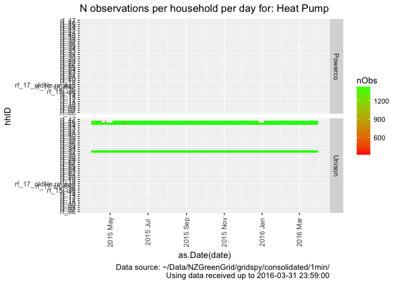
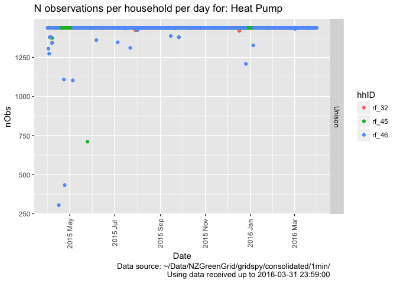

\newpage

# Status


Test run using reduced data from /Users/ben/Data/NZGreenGrid/gridspy/1min_orig/

# Citation

If you wish to use any of the material from this report please cite as:

 * Anderson, B. (2018) GREEN Grid Heat Pump Profiles, University of Otago: Dunedin, NZ.

\newpage

# Introduction

Report circulation:

 * Restricted to: [NZ GREEN Grid](https://www.otago.ac.nz/centre-sustainability/research/energy/otago050285.html) project partners and contractors.

## Purpose

This report is intended to: 

 * load and clean the project electricity power data (Grid Spy)
 * select the Heat Pump circuits (via their labels)
 * build exploratory demand profiles


## Requirements:

 * cleaned and safe grid spy 1 minute data processed via https://git.soton.ac.uk/ba1e12/nzGREENGrid/blob/master/dataProcessing/processNZGGElecCons1minData.Rmd

## History

Generally tracked via our git.soton [repo](https://git.soton.ac.uk/ba1e12/nzGREENGrid):

 * [history](https://git.soton.ac.uk/ba1e12/nzGREENGrid/commits/master)
 * [issues](https://git.soton.ac.uk/ba1e12/nzGREENGrid/issues)
 
## Support

This work was supported by:

 * The [University of Otago](https://www.otago.ac.nz/)
 * The New Zealand [Ministry of Business, Innovation and Employment (MBIE)](http://www.mbie.govt.nz/)
 * [SPATIALEC](http://www.energy.soton.ac.uk/tag/spatialec/) - a [Marie Skłodowska-Curie Global Fellowship](http://ec.europa.eu/research/mariecurieactions/about-msca/actions/if/index_en.htm) based at the University of Otago’s [Centre for Sustainability](http://www.otago.ac.nz/centre-sustainability/staff/otago673896.html) (2017-2019) & the University of Southampton's Sustainable Energy Research Group (2019-202).
 
This work is (c) 2018 the University of Southampton.

We do not 'support' the code but if you have a problem check the [issues](https://git.soton.ac.uk/ba1e12/nzGREENGrid/issues) on our [repo](https://git.soton.ac.uk/ba1e12/nzGREENGrid) and if it doesn't already exist, open one. We might be able to fix it :-)


# Load data files

## Grid Spy metadata

In this section we load metadata from /Users/ben/Syncplicity Folders/Green Grid Project Management Folder/Gridspy/Master list of Gridspy units.xlsx to link to the power data.


```
##    sample  hhID          Adults Teenagers             Children removed
## 1: Unison rf_28               2      <NA>            3(12,8,4)    <NA>
## 2: Unison rf_29               2      <NA>     1 (7 months old)    live
## 3: Unison rf_30               2         0                    0    <NA>
## 4: Unison rf_31 2 (Plus cousin)      <NA>                 <NA>    live
## 5: Unison rf_32               2      <NA> 2 (7 and 4years old)    <NA>
## 6: Unison rf_33               2 1(14yold)            1 (6yold)    live
```

```
##     sample  hhID Adults Teenagers Children  removed
## 1: Powerco rf_12      1      <NA>     <NA> 3/6/1015
## 2: Powerco  <NA>      1      <NA>     <NA>     <NA>
## 3: Powerco rf_25      1      <NA>     <NA>     <NA>
## 4: Powerco  <NA>     NA      <NA>     <NA>     <NA>
## 5: Powerco  <NA>      1      <NA>   1(5mo)     <NA>
## 6: Powerco  <NA>     NA      <NA>     <NA>     <NA>
```

<table>
<caption>Meta data for sample</caption>
 <thead>
  <tr>
   <th style="text-align:left;"> sample </th>
   <th style="text-align:left;"> hhID </th>
   <th style="text-align:left;"> Adults </th>
   <th style="text-align:left;"> Teenagers </th>
   <th style="text-align:left;"> Children </th>
   <th style="text-align:left;"> removed </th>
   <th style="text-align:left;"> nAdults </th>
  </tr>
 </thead>
<tbody>
  <tr>
   <td style="text-align:left;"> Powerco </td>
   <td style="text-align:left;"> rf_06 </td>
   <td style="text-align:left;"> 2 </td>
   <td style="text-align:left;"> NA </td>
   <td style="text-align:left;"> NA </td>
   <td style="text-align:left;"> NA </td>
   <td style="text-align:left;"> 2 </td>
  </tr>
  <tr>
   <td style="text-align:left;"> Powerco </td>
   <td style="text-align:left;"> rf_07 </td>
   <td style="text-align:left;"> 2 </td>
   <td style="text-align:left;"> NA </td>
   <td style="text-align:left;"> 2 </td>
   <td style="text-align:left;"> NA </td>
   <td style="text-align:left;"> 2 </td>
  </tr>
  <tr>
   <td style="text-align:left;"> Powerco </td>
   <td style="text-align:left;"> rf_08 </td>
   <td style="text-align:left;"> 2 </td>
   <td style="text-align:left;"> NA </td>
   <td style="text-align:left;"> NA </td>
   <td style="text-align:left;"> NA </td>
   <td style="text-align:left;"> 2 </td>
  </tr>
  <tr>
   <td style="text-align:left;"> Powerco </td>
   <td style="text-align:left;"> rf_09 </td>
   <td style="text-align:left;"> 2 </td>
   <td style="text-align:left;"> NA </td>
   <td style="text-align:left;"> 1 </td>
   <td style="text-align:left;"> 42171 </td>
   <td style="text-align:left;"> 2 </td>
  </tr>
  <tr>
   <td style="text-align:left;"> Powerco </td>
   <td style="text-align:left;"> rf_10 </td>
   <td style="text-align:left;"> 2 </td>
   <td style="text-align:left;"> NA </td>
   <td style="text-align:left;"> 1(3yo) </td>
   <td style="text-align:left;"> NA </td>
   <td style="text-align:left;"> 3 </td>
  </tr>
  <tr>
   <td style="text-align:left;"> Powerco </td>
   <td style="text-align:left;"> rf_11 </td>
   <td style="text-align:left;"> NA </td>
   <td style="text-align:left;"> NA </td>
   <td style="text-align:left;"> NA </td>
   <td style="text-align:left;"> NA </td>
   <td style="text-align:left;"> 1 </td>
  </tr>
  <tr>
   <td style="text-align:left;"> Powerco </td>
   <td style="text-align:left;"> rf_12 </td>
   <td style="text-align:left;"> 1 </td>
   <td style="text-align:left;"> NA </td>
   <td style="text-align:left;"> NA </td>
   <td style="text-align:left;"> 3/6/1015 </td>
   <td style="text-align:left;"> 1 </td>
  </tr>
  <tr>
   <td style="text-align:left;"> Powerco </td>
   <td style="text-align:left;"> rf_13 </td>
   <td style="text-align:left;"> 2 </td>
   <td style="text-align:left;"> 1(16yo) </td>
   <td style="text-align:left;"> 1(11) </td>
   <td style="text-align:left;"> NA </td>
   <td style="text-align:left;"> 2 </td>
  </tr>
  <tr>
   <td style="text-align:left;"> Powerco </td>
   <td style="text-align:left;"> rf_14 </td>
   <td style="text-align:left;"> 1 </td>
   <td style="text-align:left;"> NA </td>
   <td style="text-align:left;"> 1 (11 yo) </td>
   <td style="text-align:left;"> NA </td>
   <td style="text-align:left;"> 1 </td>
  </tr>
  <tr>
   <td style="text-align:left;"> Powerco </td>
   <td style="text-align:left;"> rf_15 </td>
   <td style="text-align:left;"> NA </td>
   <td style="text-align:left;"> NA </td>
   <td style="text-align:left;"> NA </td>
   <td style="text-align:left;"> 42462 </td>
   <td style="text-align:left;"> 1 </td>
  </tr>
  <tr>
   <td style="text-align:left;"> Powerco </td>
   <td style="text-align:left;"> rf_15_old </td>
   <td style="text-align:left;"> 1 </td>
   <td style="text-align:left;"> NA </td>
   <td style="text-align:left;"> NA </td>
   <td style="text-align:left;"> 42019 </td>
   <td style="text-align:left;"> 1 </td>
  </tr>
  <tr>
   <td style="text-align:left;"> Powerco </td>
   <td style="text-align:left;"> rf_16 </td>
   <td style="text-align:left;"> 2 </td>
   <td style="text-align:left;"> NA </td>
   <td style="text-align:left;"> NA </td>
   <td style="text-align:left;"> 42089 </td>
   <td style="text-align:left;"> 2 </td>
  </tr>
  <tr>
   <td style="text-align:left;"> Powerco </td>
   <td style="text-align:left;"> rf_17 sn_662 </td>
   <td style="text-align:left;"> NA </td>
   <td style="text-align:left;"> NA </td>
   <td style="text-align:left;"> NA </td>
   <td style="text-align:left;"> NA </td>
   <td style="text-align:left;"> 1 </td>
  </tr>
  <tr>
   <td style="text-align:left;"> Powerco </td>
   <td style="text-align:left;"> rf_17_oldNo reused </td>
   <td style="text-align:left;"> 2 </td>
   <td style="text-align:left;"> 1(13yo) </td>
   <td style="text-align:left;"> 1(11yo) </td>
   <td style="text-align:left;"> 42457 </td>
   <td style="text-align:left;"> 2 </td>
  </tr>
  <tr>
   <td style="text-align:left;"> Powerco </td>
   <td style="text-align:left;"> rf_18 </td>
   <td style="text-align:left;"> 2 </td>
   <td style="text-align:left;"> NA </td>
   <td style="text-align:left;"> 1(1yo) </td>
   <td style="text-align:left;"> 42532 </td>
   <td style="text-align:left;"> 2 </td>
  </tr>
  <tr>
   <td style="text-align:left;"> Powerco </td>
   <td style="text-align:left;"> rf_19 </td>
   <td style="text-align:left;"> 1 </td>
   <td style="text-align:left;"> NA </td>
   <td style="text-align:left;"> NA </td>
   <td style="text-align:left;"> NA </td>
   <td style="text-align:left;"> 1 </td>
  </tr>
  <tr>
   <td style="text-align:left;"> Powerco </td>
   <td style="text-align:left;"> rf_20 </td>
   <td style="text-align:left;"> 2 </td>
   <td style="text-align:left;"> NA </td>
   <td style="text-align:left;"> 2 </td>
   <td style="text-align:left;"> 42166 </td>
   <td style="text-align:left;"> 2 </td>
  </tr>
  <tr>
   <td style="text-align:left;"> Powerco </td>
   <td style="text-align:left;"> rf_21 </td>
   <td style="text-align:left;"> 2 </td>
   <td style="text-align:left;"> NA </td>
   <td style="text-align:left;"> NA </td>
   <td style="text-align:left;"> 42821 </td>
   <td style="text-align:left;"> 2 </td>
  </tr>
  <tr>
   <td style="text-align:left;"> Powerco </td>
   <td style="text-align:left;"> rf_22 </td>
   <td style="text-align:left;"> 2 </td>
   <td style="text-align:left;"> NA </td>
   <td style="text-align:left;"> NA </td>
   <td style="text-align:left;"> NA </td>
   <td style="text-align:left;"> 2 </td>
  </tr>
  <tr>
   <td style="text-align:left;"> Powerco </td>
   <td style="text-align:left;"> rf_23 </td>
   <td style="text-align:left;"> 1 </td>
   <td style="text-align:left;"> NA </td>
   <td style="text-align:left;"> NA </td>
   <td style="text-align:left;"> NA </td>
   <td style="text-align:left;"> 1 </td>
  </tr>
  <tr>
   <td style="text-align:left;"> Powerco </td>
   <td style="text-align:left;"> rf_24 </td>
   <td style="text-align:left;"> 2 </td>
   <td style="text-align:left;"> NA </td>
   <td style="text-align:left;"> 2 </td>
   <td style="text-align:left;"> NA </td>
   <td style="text-align:left;"> 2 </td>
  </tr>
  <tr>
   <td style="text-align:left;"> Powerco </td>
   <td style="text-align:left;"> rf_25 </td>
   <td style="text-align:left;"> 1 </td>
   <td style="text-align:left;"> NA </td>
   <td style="text-align:left;"> NA </td>
   <td style="text-align:left;"> NA </td>
   <td style="text-align:left;"> 1 </td>
  </tr>
  <tr>
   <td style="text-align:left;"> Powerco </td>
   <td style="text-align:left;"> rf_26 </td>
   <td style="text-align:left;"> 2 </td>
   <td style="text-align:left;"> NA </td>
   <td style="text-align:left;"> NA </td>
   <td style="text-align:left;"> NA </td>
   <td style="text-align:left;"> 2 </td>
  </tr>
  <tr>
   <td style="text-align:left;"> Powerco </td>
   <td style="text-align:left;"> rf_27 </td>
   <td style="text-align:left;"> 2 </td>
   <td style="text-align:left;"> 1 </td>
   <td style="text-align:left;"> 1 </td>
   <td style="text-align:left;"> NA </td>
   <td style="text-align:left;"> 2 </td>
  </tr>
  <tr>
   <td style="text-align:left;"> Unison </td>
   <td style="text-align:left;"> rf_28 </td>
   <td style="text-align:left;"> 2 </td>
   <td style="text-align:left;"> NA </td>
   <td style="text-align:left;"> 3(12,8,4) </td>
   <td style="text-align:left;"> NA </td>
   <td style="text-align:left;"> 3 </td>
  </tr>
  <tr>
   <td style="text-align:left;"> Unison </td>
   <td style="text-align:left;"> rf_29 </td>
   <td style="text-align:left;"> 2 </td>
   <td style="text-align:left;"> NA </td>
   <td style="text-align:left;"> 1 (7 months old) </td>
   <td style="text-align:left;"> live </td>
   <td style="text-align:left;"> 2 </td>
  </tr>
  <tr>
   <td style="text-align:left;"> Unison </td>
   <td style="text-align:left;"> rf_30 </td>
   <td style="text-align:left;"> 2 </td>
   <td style="text-align:left;"> 0 </td>
   <td style="text-align:left;"> 0 </td>
   <td style="text-align:left;"> NA </td>
   <td style="text-align:left;"> 2 </td>
  </tr>
  <tr>
   <td style="text-align:left;"> Unison </td>
   <td style="text-align:left;"> rf_31 </td>
   <td style="text-align:left;"> 2 (Plus cousin) </td>
   <td style="text-align:left;"> NA </td>
   <td style="text-align:left;"> NA </td>
   <td style="text-align:left;"> live </td>
   <td style="text-align:left;"> 2 </td>
  </tr>
  <tr>
   <td style="text-align:left;"> Unison </td>
   <td style="text-align:left;"> rf_32 </td>
   <td style="text-align:left;"> 2 </td>
   <td style="text-align:left;"> NA </td>
   <td style="text-align:left;"> 2 (7 and 4years old) </td>
   <td style="text-align:left;"> NA </td>
   <td style="text-align:left;"> 2 </td>
  </tr>
  <tr>
   <td style="text-align:left;"> Unison </td>
   <td style="text-align:left;"> rf_33 </td>
   <td style="text-align:left;"> 2 </td>
   <td style="text-align:left;"> 1(14yold) </td>
   <td style="text-align:left;"> 1 (6yold) </td>
   <td style="text-align:left;"> live </td>
   <td style="text-align:left;"> 2 </td>
  </tr>
  <tr>
   <td style="text-align:left;"> Unison </td>
   <td style="text-align:left;"> rf_34 </td>
   <td style="text-align:left;"> 3 </td>
   <td style="text-align:left;"> NA </td>
   <td style="text-align:left;"> NA </td>
   <td style="text-align:left;"> NA </td>
   <td style="text-align:left;"> 1 </td>
  </tr>
  <tr>
   <td style="text-align:left;"> Unison </td>
   <td style="text-align:left;"> rf_35 </td>
   <td style="text-align:left;"> 2 </td>
   <td style="text-align:left;"> NA </td>
   <td style="text-align:left;"> NA </td>
   <td style="text-align:left;"> 42322 </td>
   <td style="text-align:left;"> 2 </td>
  </tr>
  <tr>
   <td style="text-align:left;"> Unison </td>
   <td style="text-align:left;"> rf_36 </td>
   <td style="text-align:left;"> 1 </td>
   <td style="text-align:left;"> 2 (14 and 12) </td>
   <td style="text-align:left;"> NA </td>
   <td style="text-align:left;"> live </td>
   <td style="text-align:left;"> 1 </td>
  </tr>
  <tr>
   <td style="text-align:left;"> Unison </td>
   <td style="text-align:left;"> rf_37 </td>
   <td style="text-align:left;"> 2 </td>
   <td style="text-align:left;"> NA </td>
   <td style="text-align:left;"> NA </td>
   <td style="text-align:left;"> live </td>
   <td style="text-align:left;"> 2 </td>
  </tr>
  <tr>
   <td style="text-align:left;"> Unison </td>
   <td style="text-align:left;"> rf_38 </td>
   <td style="text-align:left;"> NA </td>
   <td style="text-align:left;"> NA </td>
   <td style="text-align:left;"> NA </td>
   <td style="text-align:left;"> NA </td>
   <td style="text-align:left;"> 1 </td>
  </tr>
  <tr>
   <td style="text-align:left;"> Unison </td>
   <td style="text-align:left;"> rf_38 </td>
   <td style="text-align:left;"> 2 </td>
   <td style="text-align:left;"> NA </td>
   <td style="text-align:left;"> 2 (&lt;12) </td>
   <td style="text-align:left;"> NA </td>
   <td style="text-align:left;"> 2 </td>
  </tr>
  <tr>
   <td style="text-align:left;"> Unison </td>
   <td style="text-align:left;"> rf_39 </td>
   <td style="text-align:left;"> 2 </td>
   <td style="text-align:left;"> 1 (16 YO) </td>
   <td style="text-align:left;"> NA </td>
   <td style="text-align:left;"> live </td>
   <td style="text-align:left;"> 2 </td>
  </tr>
  <tr>
   <td style="text-align:left;"> Unison </td>
   <td style="text-align:left;"> rf_40 </td>
   <td style="text-align:left;"> 2 </td>
   <td style="text-align:left;"> NA </td>
   <td style="text-align:left;"> NA </td>
   <td style="text-align:left;"> 42330 </td>
   <td style="text-align:left;"> 2 </td>
  </tr>
  <tr>
   <td style="text-align:left;"> Unison </td>
   <td style="text-align:left;"> rf_41 </td>
   <td style="text-align:left;"> 2 </td>
   <td style="text-align:left;"> NA </td>
   <td style="text-align:left;"> 2 (11 and 8) </td>
   <td style="text-align:left;"> live </td>
   <td style="text-align:left;"> 2 </td>
  </tr>
  <tr>
   <td style="text-align:left;"> Unison </td>
   <td style="text-align:left;"> rf_42 </td>
   <td style="text-align:left;"> 2 </td>
   <td style="text-align:left;"> NA </td>
   <td style="text-align:left;"> 3 (&lt;12 yold, 1 10 YO) </td>
   <td style="text-align:left;"> NA </td>
   <td style="text-align:left;"> 3 </td>
  </tr>
  <tr>
   <td style="text-align:left;"> Unison </td>
   <td style="text-align:left;"> rf_43 </td>
   <td style="text-align:left;"> 2 </td>
   <td style="text-align:left;"> NA </td>
   <td style="text-align:left;"> NA </td>
   <td style="text-align:left;"> 42296 </td>
   <td style="text-align:left;"> 2 </td>
  </tr>
  <tr>
   <td style="text-align:left;"> Unison </td>
   <td style="text-align:left;"> rf_44 </td>
   <td style="text-align:left;"> 2 </td>
   <td style="text-align:left;"> NA </td>
   <td style="text-align:left;"> 2 (10 and 7) </td>
   <td style="text-align:left;"> NA </td>
   <td style="text-align:left;"> 2 </td>
  </tr>
  <tr>
   <td style="text-align:left;"> Unison </td>
   <td style="text-align:left;"> rf_45 </td>
   <td style="text-align:left;"> 2 </td>
   <td style="text-align:left;"> NA </td>
   <td style="text-align:left;"> 3 (&lt;12 years old) </td>
   <td style="text-align:left;"> NA </td>
   <td style="text-align:left;"> 3 </td>
  </tr>
  <tr>
   <td style="text-align:left;"> Unison </td>
   <td style="text-align:left;"> rf_46 </td>
   <td style="text-align:left;"> 2 </td>
   <td style="text-align:left;"> NA </td>
   <td style="text-align:left;"> 1 (4yold-50%) </td>
   <td style="text-align:left;"> live </td>
   <td style="text-align:left;"> 2 </td>
  </tr>
  <tr>
   <td style="text-align:left;"> Unison </td>
   <td style="text-align:left;"> rf_47 </td>
   <td style="text-align:left;"> 3 </td>
   <td style="text-align:left;"> 2 </td>
   <td style="text-align:left;"> NA </td>
   <td style="text-align:left;"> NA </td>
   <td style="text-align:left;"> 1 </td>
  </tr>
</tbody>
</table>

## Grid Spy data

In this section we load the cleaned data files from /Users/ben/Data/NZGreenGrid/gridspy/consolidated/1min/data/.
 
The following table summarises the data.


```
## [1] "Looking for data using pattern = *.gz in /Users/ben/Data/NZGreenGrid/gridspy/consolidated/1min/data/ - could take a while..."
```

```
## [1] "Found 5 files"
```

```
## [1] "# Loading 5 files..."
```

```
## Parsed with column specification:
## cols(
##   `Kitchen power$1632` = col_double(),
##   `Heating$1633` = col_double(),
##   `Mains$1634` = col_double(),
##   `Lights$1635` = col_double(),
##   `Hot water$1636` = col_integer(),
##   `Range$1637` = col_integer(),
##   r_dateTime = col_datetime(format = ""),
##   hhID = col_character()
## )
```

```
## Warning in rbind(names(probs), probs_f): number of columns of result is not
## a multiple of vector length (arg 1)
```

```
## Warning: 134804 parsing failures.
## row # A tibble: 5 x 5 col     row col            expected               actual file                  expected   <int> <chr>          <chr>                  <chr>  <chr>                 actual 1  1942 Range$1637     no trailing characters .95    '/Users/ben/Data/NZG… file 2  2018 Hot water$1636 no trailing characters .31    '/Users/ben/Data/NZG… row 3  2018 Range$1637     no trailing characters .86    '/Users/ben/Data/NZG… col 4  2019 Hot water$1636 no trailing characters .63    '/Users/ben/Data/NZG… expected 5  2019 Range$1637     no trailing characters .38    '/Users/ben/Data/NZG…
## ... ................. ... .......................................................................... ........ .......................................................................... ...... .......................................................................... .... .......................................................................... ... .......................................................................... ... .......................................................................... ........ ..........................................................................
## See problems(...) for more details.
```

```
## Parsed with column specification:
## cols(
##   `Incomer 2 - Uncontrolled$2625` = col_double(),
##   `Incomer 1 - Hot Water - Cont$2626` = col_double(),
##   `Incomer 3 - Uncontrolled$2627` = col_double(),
##   `Laundry, Fridge & Microwave$2628` = col_double(),
##   `Oven$2629` = col_double(),
##   `Kitchen Appliances & Lounge$2630` = col_double(),
##   r_dateTime = col_datetime(format = ""),
##   hhID = col_character()
## )
```

```
## Parsed with column specification:
## cols(
##   `Incomer - All$4193` = col_character(),
##   `Laundry$4194` = col_character(),
##   `Kitchen Appliances$4195` = col_character(),
##   `Heat Pump$4196` = col_character(),
##   `Lighting$4197` = col_character(),
##   `Hot Water - Controlled$4198` = col_character(),
##   r_dateTime = col_datetime(format = ""),
##   hhID = col_character()
## )
```

```
## Parsed with column specification:
## cols(
##   `Incomer - Uncontrolled$4157` = col_double(),
##   `Hot Water - Controlled$4158` = col_double(),
##   `Lighting$4159` = col_double(),
##   `Heat Pump$4160` = col_integer(),
##   `Kitchen Appliances$4161` = col_double(),
##   `Laundry & Garage Fridge$4162` = col_double(),
##   r_dateTime = col_datetime(format = ""),
##   hhID = col_character()
## )
```

```
## Warning in rbind(names(probs), probs_f): number of columns of result is not
## a multiple of vector length (arg 1)
```

```
## Warning: 116217 parsing failures.
## row # A tibble: 5 x 5 col     row col            expected               actual file                  expected   <int> <chr>          <chr>                  <chr>  <chr>                 actual 1  2761 Heat Pump$4160 no trailing characters .66    '/Users/ben/Data/NZG… file 2  2763 Heat Pump$4160 no trailing characters .66    '/Users/ben/Data/NZG… row 3  2764 Heat Pump$4160 no trailing characters .66    '/Users/ben/Data/NZG… col 4  2765 Heat Pump$4160 no trailing characters .66    '/Users/ben/Data/NZG… expected 5  2766 Heat Pump$4160 no trailing characters .66    '/Users/ben/Data/NZG…
## ... ................. ... .......................................................................... ........ .......................................................................... ...... .......................................................................... .... .......................................................................... ... .......................................................................... ... .......................................................................... ........ ..........................................................................
## See problems(...) for more details.
```

```
## Parsed with column specification:
## cols(
##   `Laundry & Bedrooms$4228` = col_double(),
##   `Kitchen & Bedrooms$4229` = col_double(),
##   `Incomer - Uncontrolled$4230` = col_double(),
##   `Hot Water - Controlled$4231` = col_double(),
##   `Heat Pumps (2x) & Power$4232` = col_double(),
##   `Lighting$4233` = col_double(),
##   `Heat Pumps (2x) & Power$4399` = col_double(),
##   `Hot Water - Controlled$4400` = col_double(),
##   `Incomer - Uncontrolled$4401` = col_double(),
##   `Kitchen & Bedrooms$4402` = col_double(),
##   `Laundry & Bedrooms$4403` = col_double(),
##   `Lighting$4404` = col_double(),
##   `Incomer Voltage$4405` = col_double(),
##   r_dateTime = col_datetime(format = ""),
##   hhID = col_character()
## )
```

```
## [1] "Files loaded"
## [1] "Loaded 4,120,565 rows of data"
```

<table>
<caption>Summary of household files loaded</caption>
 <thead>
  <tr>
   <th style="text-align:left;"> hhID </th>
   <th style="text-align:right;"> nObs </th>
   <th style="text-align:right;"> nHouseholds </th>
   <th style="text-align:left;"> minDate </th>
   <th style="text-align:left;"> maxDate </th>
  </tr>
 </thead>
<tbody>
  <tr>
   <td style="text-align:left;"> rf_01 </td>
   <td style="text-align:right;"> 854396 </td>
   <td style="text-align:right;"> 1 </td>
   <td style="text-align:left;"> 2014-01-05 11:00:00 </td>
   <td style="text-align:left;"> 2015-10-20 02:50:00 </td>
  </tr>
  <tr>
   <td style="text-align:left;"> rf_12 </td>
   <td style="text-align:right;"> 410063 </td>
   <td style="text-align:right;"> 1 </td>
   <td style="text-align:left;"> 2014-07-08 12:00:00 </td>
   <td style="text-align:left;"> 2015-06-02 20:07:00 </td>
  </tr>
  <tr>
   <td style="text-align:left;"> rf_32 </td>
   <td style="text-align:right;"> 542484 </td>
   <td style="text-align:right;"> 1 </td>
   <td style="text-align:left;"> 2015-03-25 11:00:00 </td>
   <td style="text-align:left;"> 2016-04-05 05:24:00 </td>
  </tr>
  <tr>
   <td style="text-align:left;"> rf_45 </td>
   <td style="text-align:right;"> 821467 </td>
   <td style="text-align:right;"> 1 </td>
   <td style="text-align:left;"> 2015-03-24 11:00:00 </td>
   <td style="text-align:left;"> 2016-10-15 01:08:00 </td>
  </tr>
  <tr>
   <td style="text-align:left;"> rf_46 </td>
   <td style="text-align:right;"> 1492155 </td>
   <td style="text-align:right;"> 1 </td>
   <td style="text-align:left;"> 2015-03-26 11:00:00 </td>
   <td style="text-align:left;"> 2018-02-19 22:08:00 </td>
  </tr>
</tbody>
</table>

This table will have a large number (40) of columns due to non-matching circuit labels. We process the 'Heat' related ones below.

# Data quality analysis

Loaded data observation plots. Should match the plot in 


```
## Warning: Removed 41 rows containing missing values (geom_tile).
```

<!-- -->


```
## Warning: Removed 41 rows containing missing values (geom_point).
```

<!-- -->

The following table shows the min/max observations per day and min/max dates for each household. As above, we should not see:

 * dates before 2014 or in to the future (indicates date conversion errors)
 * more than 1440 observations per day (indicates potentially duplicate observations)
 * non-integer counts of circuits as it suggests some column errors
 
 We should also not see NA in any row (indicates date conversion errors). 
 
 If we do see any of these then we still have data cleaning work to do!

<table>
<caption>Summary observation stats by hhID (sorted by date last heard from)</caption>
 <thead>
  <tr>
   <th style="text-align:left;"> hhID </th>
   <th style="text-align:left;"> sample </th>
   <th style="text-align:right;"> nObs </th>
   <th style="text-align:left;"> minDate </th>
   <th style="text-align:left;"> maxDate </th>
  </tr>
 </thead>
<tbody>
  <tr>
   <td style="text-align:left;"> rf_12 </td>
   <td style="text-align:left;"> Powerco </td>
   <td style="text-align:right;"> 410063 </td>
   <td style="text-align:left;"> 2014-07-08 12:00:00 </td>
   <td style="text-align:left;"> 2015-06-02 20:07:00 </td>
  </tr>
  <tr>
   <td style="text-align:left;"> rf_32 </td>
   <td style="text-align:left;"> Unison </td>
   <td style="text-align:right;"> 542484 </td>
   <td style="text-align:left;"> 2015-03-25 11:00:00 </td>
   <td style="text-align:left;"> 2016-04-05 05:24:00 </td>
  </tr>
  <tr>
   <td style="text-align:left;"> rf_45 </td>
   <td style="text-align:left;"> Unison </td>
   <td style="text-align:right;"> 821467 </td>
   <td style="text-align:left;"> 2015-03-24 11:00:00 </td>
   <td style="text-align:left;"> 2016-10-15 01:08:00 </td>
  </tr>
  <tr>
   <td style="text-align:left;"> rf_46 </td>
   <td style="text-align:left;"> Unison </td>
   <td style="text-align:right;"> 1492155 </td>
   <td style="text-align:left;"> 2015-03-26 11:00:00 </td>
   <td style="text-align:left;"> 2018-02-19 22:08:00 </td>
  </tr>
  <tr>
   <td style="text-align:left;"> rf_06 </td>
   <td style="text-align:left;"> Powerco </td>
   <td style="text-align:right;"> 1 </td>
   <td style="text-align:left;"> NA </td>
   <td style="text-align:left;"> NA </td>
  </tr>
  <tr>
   <td style="text-align:left;"> rf_07 </td>
   <td style="text-align:left;"> Powerco </td>
   <td style="text-align:right;"> 1 </td>
   <td style="text-align:left;"> NA </td>
   <td style="text-align:left;"> NA </td>
  </tr>
  <tr>
   <td style="text-align:left;"> rf_08 </td>
   <td style="text-align:left;"> Powerco </td>
   <td style="text-align:right;"> 1 </td>
   <td style="text-align:left;"> NA </td>
   <td style="text-align:left;"> NA </td>
  </tr>
  <tr>
   <td style="text-align:left;"> rf_09 </td>
   <td style="text-align:left;"> Powerco </td>
   <td style="text-align:right;"> 1 </td>
   <td style="text-align:left;"> NA </td>
   <td style="text-align:left;"> NA </td>
  </tr>
  <tr>
   <td style="text-align:left;"> rf_10 </td>
   <td style="text-align:left;"> Powerco </td>
   <td style="text-align:right;"> 1 </td>
   <td style="text-align:left;"> NA </td>
   <td style="text-align:left;"> NA </td>
  </tr>
  <tr>
   <td style="text-align:left;"> rf_11 </td>
   <td style="text-align:left;"> Powerco </td>
   <td style="text-align:right;"> 1 </td>
   <td style="text-align:left;"> NA </td>
   <td style="text-align:left;"> NA </td>
  </tr>
  <tr>
   <td style="text-align:left;"> rf_13 </td>
   <td style="text-align:left;"> Powerco </td>
   <td style="text-align:right;"> 1 </td>
   <td style="text-align:left;"> NA </td>
   <td style="text-align:left;"> NA </td>
  </tr>
  <tr>
   <td style="text-align:left;"> rf_14 </td>
   <td style="text-align:left;"> Powerco </td>
   <td style="text-align:right;"> 1 </td>
   <td style="text-align:left;"> NA </td>
   <td style="text-align:left;"> NA </td>
  </tr>
  <tr>
   <td style="text-align:left;"> rf_15 </td>
   <td style="text-align:left;"> Powerco </td>
   <td style="text-align:right;"> 1 </td>
   <td style="text-align:left;"> NA </td>
   <td style="text-align:left;"> NA </td>
  </tr>
  <tr>
   <td style="text-align:left;"> rf_15_old </td>
   <td style="text-align:left;"> Powerco </td>
   <td style="text-align:right;"> 1 </td>
   <td style="text-align:left;"> NA </td>
   <td style="text-align:left;"> NA </td>
  </tr>
  <tr>
   <td style="text-align:left;"> rf_16 </td>
   <td style="text-align:left;"> Powerco </td>
   <td style="text-align:right;"> 1 </td>
   <td style="text-align:left;"> NA </td>
   <td style="text-align:left;"> NA </td>
  </tr>
  <tr>
   <td style="text-align:left;"> rf_17 sn_662 </td>
   <td style="text-align:left;"> Powerco </td>
   <td style="text-align:right;"> 1 </td>
   <td style="text-align:left;"> NA </td>
   <td style="text-align:left;"> NA </td>
  </tr>
  <tr>
   <td style="text-align:left;"> rf_17_oldNo reused </td>
   <td style="text-align:left;"> Powerco </td>
   <td style="text-align:right;"> 1 </td>
   <td style="text-align:left;"> NA </td>
   <td style="text-align:left;"> NA </td>
  </tr>
  <tr>
   <td style="text-align:left;"> rf_18 </td>
   <td style="text-align:left;"> Powerco </td>
   <td style="text-align:right;"> 1 </td>
   <td style="text-align:left;"> NA </td>
   <td style="text-align:left;"> NA </td>
  </tr>
  <tr>
   <td style="text-align:left;"> rf_19 </td>
   <td style="text-align:left;"> Powerco </td>
   <td style="text-align:right;"> 1 </td>
   <td style="text-align:left;"> NA </td>
   <td style="text-align:left;"> NA </td>
  </tr>
  <tr>
   <td style="text-align:left;"> rf_20 </td>
   <td style="text-align:left;"> Powerco </td>
   <td style="text-align:right;"> 1 </td>
   <td style="text-align:left;"> NA </td>
   <td style="text-align:left;"> NA </td>
  </tr>
  <tr>
   <td style="text-align:left;"> rf_21 </td>
   <td style="text-align:left;"> Powerco </td>
   <td style="text-align:right;"> 1 </td>
   <td style="text-align:left;"> NA </td>
   <td style="text-align:left;"> NA </td>
  </tr>
  <tr>
   <td style="text-align:left;"> rf_22 </td>
   <td style="text-align:left;"> Powerco </td>
   <td style="text-align:right;"> 1 </td>
   <td style="text-align:left;"> NA </td>
   <td style="text-align:left;"> NA </td>
  </tr>
  <tr>
   <td style="text-align:left;"> rf_23 </td>
   <td style="text-align:left;"> Powerco </td>
   <td style="text-align:right;"> 1 </td>
   <td style="text-align:left;"> NA </td>
   <td style="text-align:left;"> NA </td>
  </tr>
  <tr>
   <td style="text-align:left;"> rf_24 </td>
   <td style="text-align:left;"> Powerco </td>
   <td style="text-align:right;"> 1 </td>
   <td style="text-align:left;"> NA </td>
   <td style="text-align:left;"> NA </td>
  </tr>
  <tr>
   <td style="text-align:left;"> rf_25 </td>
   <td style="text-align:left;"> Powerco </td>
   <td style="text-align:right;"> 1 </td>
   <td style="text-align:left;"> NA </td>
   <td style="text-align:left;"> NA </td>
  </tr>
  <tr>
   <td style="text-align:left;"> rf_26 </td>
   <td style="text-align:left;"> Powerco </td>
   <td style="text-align:right;"> 1 </td>
   <td style="text-align:left;"> NA </td>
   <td style="text-align:left;"> NA </td>
  </tr>
  <tr>
   <td style="text-align:left;"> rf_27 </td>
   <td style="text-align:left;"> Powerco </td>
   <td style="text-align:right;"> 1 </td>
   <td style="text-align:left;"> NA </td>
   <td style="text-align:left;"> NA </td>
  </tr>
  <tr>
   <td style="text-align:left;"> rf_28 </td>
   <td style="text-align:left;"> Unison </td>
   <td style="text-align:right;"> 1 </td>
   <td style="text-align:left;"> NA </td>
   <td style="text-align:left;"> NA </td>
  </tr>
  <tr>
   <td style="text-align:left;"> rf_29 </td>
   <td style="text-align:left;"> Unison </td>
   <td style="text-align:right;"> 1 </td>
   <td style="text-align:left;"> NA </td>
   <td style="text-align:left;"> NA </td>
  </tr>
  <tr>
   <td style="text-align:left;"> rf_30 </td>
   <td style="text-align:left;"> Unison </td>
   <td style="text-align:right;"> 1 </td>
   <td style="text-align:left;"> NA </td>
   <td style="text-align:left;"> NA </td>
  </tr>
  <tr>
   <td style="text-align:left;"> rf_31 </td>
   <td style="text-align:left;"> Unison </td>
   <td style="text-align:right;"> 1 </td>
   <td style="text-align:left;"> NA </td>
   <td style="text-align:left;"> NA </td>
  </tr>
  <tr>
   <td style="text-align:left;"> rf_33 </td>
   <td style="text-align:left;"> Unison </td>
   <td style="text-align:right;"> 1 </td>
   <td style="text-align:left;"> NA </td>
   <td style="text-align:left;"> NA </td>
  </tr>
  <tr>
   <td style="text-align:left;"> rf_34 </td>
   <td style="text-align:left;"> Unison </td>
   <td style="text-align:right;"> 1 </td>
   <td style="text-align:left;"> NA </td>
   <td style="text-align:left;"> NA </td>
  </tr>
  <tr>
   <td style="text-align:left;"> rf_35 </td>
   <td style="text-align:left;"> Unison </td>
   <td style="text-align:right;"> 1 </td>
   <td style="text-align:left;"> NA </td>
   <td style="text-align:left;"> NA </td>
  </tr>
  <tr>
   <td style="text-align:left;"> rf_36 </td>
   <td style="text-align:left;"> Unison </td>
   <td style="text-align:right;"> 1 </td>
   <td style="text-align:left;"> NA </td>
   <td style="text-align:left;"> NA </td>
  </tr>
  <tr>
   <td style="text-align:left;"> rf_37 </td>
   <td style="text-align:left;"> Unison </td>
   <td style="text-align:right;"> 1 </td>
   <td style="text-align:left;"> NA </td>
   <td style="text-align:left;"> NA </td>
  </tr>
  <tr>
   <td style="text-align:left;"> rf_38 </td>
   <td style="text-align:left;"> Unison </td>
   <td style="text-align:right;"> 2 </td>
   <td style="text-align:left;"> NA </td>
   <td style="text-align:left;"> NA </td>
  </tr>
  <tr>
   <td style="text-align:left;"> rf_39 </td>
   <td style="text-align:left;"> Unison </td>
   <td style="text-align:right;"> 1 </td>
   <td style="text-align:left;"> NA </td>
   <td style="text-align:left;"> NA </td>
  </tr>
  <tr>
   <td style="text-align:left;"> rf_40 </td>
   <td style="text-align:left;"> Unison </td>
   <td style="text-align:right;"> 1 </td>
   <td style="text-align:left;"> NA </td>
   <td style="text-align:left;"> NA </td>
  </tr>
  <tr>
   <td style="text-align:left;"> rf_41 </td>
   <td style="text-align:left;"> Unison </td>
   <td style="text-align:right;"> 1 </td>
   <td style="text-align:left;"> NA </td>
   <td style="text-align:left;"> NA </td>
  </tr>
  <tr>
   <td style="text-align:left;"> rf_42 </td>
   <td style="text-align:left;"> Unison </td>
   <td style="text-align:right;"> 1 </td>
   <td style="text-align:left;"> NA </td>
   <td style="text-align:left;"> NA </td>
  </tr>
  <tr>
   <td style="text-align:left;"> rf_43 </td>
   <td style="text-align:left;"> Unison </td>
   <td style="text-align:right;"> 1 </td>
   <td style="text-align:left;"> NA </td>
   <td style="text-align:left;"> NA </td>
  </tr>
  <tr>
   <td style="text-align:left;"> rf_44 </td>
   <td style="text-align:left;"> Unison </td>
   <td style="text-align:right;"> 1 </td>
   <td style="text-align:left;"> NA </td>
   <td style="text-align:left;"> NA </td>
  </tr>
  <tr>
   <td style="text-align:left;"> rf_47 </td>
   <td style="text-align:left;"> Unison </td>
   <td style="text-align:right;"> 1 </td>
   <td style="text-align:left;"> NA </td>
   <td style="text-align:left;"> NA </td>
  </tr>
</tbody>
</table>


Finally we show the total number of households which we think are still sending data.


```
## Warning: Removed 2 rows containing missing values (position_stack).
```

<!-- -->

# Get Heat Pump data

First we need to select the circuits (columns) which are Heat Pumps. We do this using the string 'Heat Pump' in the column names.


```r
pattern <- "Heat Pump"
heatPumpDT <- getCircuits(gs1MinDT,pattern)

t <- summary(heatPumpDT)
kable(caption = "Summary of heat pump circuits", t)
```

<table>
<caption>Summary of heat pump circuits</caption>
 <thead>
  <tr>
   <th style="text-align:left;">   </th>
   <th style="text-align:left;"> Heat Pump$4196 </th>
   <th style="text-align:left;"> Heat Pump$4160 </th>
   <th style="text-align:left;"> Heat Pumps (2x) &amp; Power$4232 </th>
   <th style="text-align:left;"> Heat Pumps (2x) &amp; Power$4399 </th>
   <th style="text-align:left;">     hhID </th>
   <th style="text-align:left;">   r_dateTime </th>
   <th style="text-align:left;">  obsHourMin </th>
  </tr>
 </thead>
<tbody>
  <tr>
   <td style="text-align:left;">  </td>
   <td style="text-align:left;"> Length:4120565 </td>
   <td style="text-align:left;"> Min.   :   0 </td>
   <td style="text-align:left;"> Min.   :   0.0 </td>
   <td style="text-align:left;"> Min.   :-292.8 </td>
   <td style="text-align:left;"> Length:4120565 </td>
   <td style="text-align:left;"> Min.   :2014-01-05 11:00:00 </td>
   <td style="text-align:left;"> Length:4120565 </td>
  </tr>
  <tr>
   <td style="text-align:left;">  </td>
   <td style="text-align:left;"> Class :character </td>
   <td style="text-align:left;"> 1st Qu.:   0 </td>
   <td style="text-align:left;"> 1st Qu.:  60.2 </td>
   <td style="text-align:left;"> 1st Qu.:-112.1 </td>
   <td style="text-align:left;"> Class :character </td>
   <td style="text-align:left;"> 1st Qu.:2015-04-16 10:07:00 </td>
   <td style="text-align:left;"> Class1:hms </td>
  </tr>
  <tr>
   <td style="text-align:left;">  </td>
   <td style="text-align:left;"> Mode  :character </td>
   <td style="text-align:left;"> Median :   0 </td>
   <td style="text-align:left;"> Median : 133.1 </td>
   <td style="text-align:left;"> Median : -80.8 </td>
   <td style="text-align:left;"> Mode  :character </td>
   <td style="text-align:left;"> Median :2015-10-05 22:34:00 </td>
   <td style="text-align:left;"> Class2:difftime </td>
  </tr>
  <tr>
   <td style="text-align:left;">  </td>
   <td style="text-align:left;"> NA </td>
   <td style="text-align:left;"> Mean   :   1 </td>
   <td style="text-align:left;"> Mean   : 244.5 </td>
   <td style="text-align:left;"> Mean   : -60.6 </td>
   <td style="text-align:left;"> NA </td>
   <td style="text-align:left;"> Mean   :2015-11-30 05:00:18 </td>
   <td style="text-align:left;"> Mode  :numeric </td>
  </tr>
  <tr>
   <td style="text-align:left;">  </td>
   <td style="text-align:left;"> NA </td>
   <td style="text-align:left;"> 3rd Qu.:   0 </td>
   <td style="text-align:left;"> 3rd Qu.: 292.7 </td>
   <td style="text-align:left;"> 3rd Qu.: -26.8 </td>
   <td style="text-align:left;"> NA </td>
   <td style="text-align:left;"> 3rd Qu.:2016-06-25 18:27:00 </td>
   <td style="text-align:left;"> NA </td>
  </tr>
  <tr>
   <td style="text-align:left;">  </td>
   <td style="text-align:left;"> NA </td>
   <td style="text-align:left;"> Max.   :2638 </td>
   <td style="text-align:left;"> Max.   :4082.8 </td>
   <td style="text-align:left;"> Max.   : 519.5 </td>
   <td style="text-align:left;"> NA </td>
   <td style="text-align:left;"> Max.   :2018-02-19 22:08:00 </td>
   <td style="text-align:left;"> NA </td>
  </tr>
  <tr>
   <td style="text-align:left;">  </td>
   <td style="text-align:left;"> NA </td>
   <td style="text-align:left;"> NA's   :3417006 </td>
   <td style="text-align:left;"> NA's   :2634858 </td>
   <td style="text-align:left;"> NA's   :2664905 </td>
   <td style="text-align:left;"> NA </td>
   <td style="text-align:left;"> NA </td>
   <td style="text-align:left;"> NA </td>
  </tr>
</tbody>
</table>

We seem to have some non-numeric columns we should fix.

<table>
<caption>Summary of heat pump circuits (re check)</caption>
 <thead>
  <tr>
   <th style="text-align:left;">   </th>
   <th style="text-align:left;"> Heat Pump$4196 </th>
   <th style="text-align:left;"> Heat Pump$4160 </th>
   <th style="text-align:left;"> Heat Pumps (2x) &amp; Power$4232 </th>
   <th style="text-align:left;"> Heat Pumps (2x) &amp; Power$4399 </th>
   <th style="text-align:left;">     hhID </th>
   <th style="text-align:left;">   r_dateTime </th>
   <th style="text-align:left;">  obsHourMin </th>
  </tr>
 </thead>
<tbody>
  <tr>
   <td style="text-align:left;">  </td>
   <td style="text-align:left;"> Min.   :   0 </td>
   <td style="text-align:left;"> Min.   :   0 </td>
   <td style="text-align:left;"> Min.   :   0.0 </td>
   <td style="text-align:left;"> Min.   :-292.8 </td>
   <td style="text-align:left;"> Length:4120565 </td>
   <td style="text-align:left;"> Min.   :2014-01-05 11:00:00 </td>
   <td style="text-align:left;"> Length:4120565 </td>
  </tr>
  <tr>
   <td style="text-align:left;">  </td>
   <td style="text-align:left;"> 1st Qu.:   0 </td>
   <td style="text-align:left;"> 1st Qu.:   0 </td>
   <td style="text-align:left;"> 1st Qu.:  60.2 </td>
   <td style="text-align:left;"> 1st Qu.:-112.1 </td>
   <td style="text-align:left;"> Class :character </td>
   <td style="text-align:left;"> 1st Qu.:2015-04-16 10:07:00 </td>
   <td style="text-align:left;"> Class1:hms </td>
  </tr>
  <tr>
   <td style="text-align:left;">  </td>
   <td style="text-align:left;"> Median :   0 </td>
   <td style="text-align:left;"> Median :   0 </td>
   <td style="text-align:left;"> Median : 133.1 </td>
   <td style="text-align:left;"> Median : -80.8 </td>
   <td style="text-align:left;"> Mode  :character </td>
   <td style="text-align:left;"> Median :2015-10-05 22:34:00 </td>
   <td style="text-align:left;"> Class2:difftime </td>
  </tr>
  <tr>
   <td style="text-align:left;">  </td>
   <td style="text-align:left;"> Mean   :  68 </td>
   <td style="text-align:left;"> Mean   :   1 </td>
   <td style="text-align:left;"> Mean   : 244.5 </td>
   <td style="text-align:left;"> Mean   : -60.6 </td>
   <td style="text-align:left;"> NA </td>
   <td style="text-align:left;"> Mean   :2015-11-30 05:00:18 </td>
   <td style="text-align:left;"> Mode  :numeric </td>
  </tr>
  <tr>
   <td style="text-align:left;">  </td>
   <td style="text-align:left;"> 3rd Qu.:   0 </td>
   <td style="text-align:left;"> 3rd Qu.:   0 </td>
   <td style="text-align:left;"> 3rd Qu.: 292.7 </td>
   <td style="text-align:left;"> 3rd Qu.: -26.8 </td>
   <td style="text-align:left;"> NA </td>
   <td style="text-align:left;"> 3rd Qu.:2016-06-25 18:27:00 </td>
   <td style="text-align:left;"> NA </td>
  </tr>
  <tr>
   <td style="text-align:left;">  </td>
   <td style="text-align:left;"> Max.   :3036 </td>
   <td style="text-align:left;"> Max.   :2638 </td>
   <td style="text-align:left;"> Max.   :4082.8 </td>
   <td style="text-align:left;"> Max.   : 519.5 </td>
   <td style="text-align:left;"> NA </td>
   <td style="text-align:left;"> Max.   :2018-02-19 22:08:00 </td>
   <td style="text-align:left;"> NA </td>
  </tr>
  <tr>
   <td style="text-align:left;">  </td>
   <td style="text-align:left;"> NA's   :3579336 </td>
   <td style="text-align:left;"> NA's   :3417006 </td>
   <td style="text-align:left;"> NA's   :2634858 </td>
   <td style="text-align:left;"> NA's   :2664905 </td>
   <td style="text-align:left;"> NA </td>
   <td style="text-align:left;"> NA </td>
   <td style="text-align:left;"> NA </td>
  </tr>
</tbody>
</table>


```
## Warning in `[.data.table`(heatPumpDT, , `:=`(heatPumpW, rowSums(.SD, ,
## na.rm = TRUE)), : Invalid .internal.selfref detected and fixed by taking
## a (shallow) copy of the data.table so that := can add this new column by
## reference. At an earlier point, this data.table has been copied by R (or
## been created manually using structure() or similar). Avoid key<-, names<-
## and attr<- which in R currently (and oddly) may copy the whole data.table.
## Use set* syntax instead to avoid copying: ?set, ?setnames and ?setattr.
## Also, in R<=v3.0.2, list(DT1,DT2) copied the entire DT1 and DT2 (R's list()
## used to copy named objects); please upgrade to R>v3.0.2 if that is biting.
## If this message doesn't help, please report to data.table issue tracker so
## the root cause can be fixed.
```

Test charts: one for each HH but averaged over year and select the 'best year' from chart above = April 2015 - March 2016. Keep at 1 minute intervals


```
## Warning: Removed 41 rows containing missing values (geom_point).
```

<!-- -->

```
## Warning: Removed 41 rows containing missing values (geom_point).
```

<!-- -->

```
## Warning: Removed 41 rows containing missing values (geom_point).
```

<!-- -->


# Runtime


Analysis completed in 159.73 seconds ( 2.66 minutes) using [knitr](https://cran.r-project.org/package=knitr) in [RStudio](http://www.rstudio.com) with R version 3.5.0 (2018-04-23) running on x86_64-apple-darwin15.6.0.

# R environment

R packages used:

 * base R - for the basics [@baseR]
 * data.table - for fast (big) data handling [@data.table]
 * lubridate - date manipulation [@lubridate]
 * ggplot2 - for slick graphics [@ggplot2]
 * readr - for csv reading/writing [@readr]
 * dplyr - for select and contains [@dplyr]
 * progress - for progress bars [@progress]
 * knitr - to create this document & neat tables [@knitr]
 * kableExtra - for extra neat tables [@kableExtra]
 * nzGREENGrid - for local NZ GREEN Grid project utilities

Session info:


```
## R version 3.5.0 (2018-04-23)
## Platform: x86_64-apple-darwin15.6.0 (64-bit)
## Running under: macOS High Sierra 10.13.4
## 
## Matrix products: default
## BLAS: /Library/Frameworks/R.framework/Versions/3.5/Resources/lib/libRblas.0.dylib
## LAPACK: /Library/Frameworks/R.framework/Versions/3.5/Resources/lib/libRlapack.dylib
## 
## locale:
## [1] en_GB.UTF-8/en_GB.UTF-8/en_GB.UTF-8/C/en_GB.UTF-8/en_GB.UTF-8
## 
## attached base packages:
## [1] stats     graphics  grDevices utils     datasets  methods   base     
## 
## other attached packages:
## [1] kableExtra_0.9.0  knitr_1.20        ggplot2_2.2.1     dplyr_0.7.5      
## [5] data.table_1.11.2 nzGREENGrid_0.1.0
## 
## loaded via a namespace (and not attached):
##  [1] Rcpp_0.12.17      highr_0.6         cellranger_1.1.0 
##  [4] pillar_1.2.2      compiler_3.5.0    plyr_1.8.4       
##  [7] bindr_0.1.1       tools_3.5.0       digest_0.6.15    
## [10] viridisLite_0.3.0 evaluate_0.10.1   tibble_1.4.2     
## [13] gtable_0.2.0      pkgconfig_2.0.1   rlang_0.2.0      
## [16] cli_1.0.0         rstudioapi_0.7    yaml_2.1.19      
## [19] bindrcpp_0.2.2    xml2_1.2.0        stringr_1.3.1    
## [22] httr_1.3.1        hms_0.4.2         rprojroot_1.3-2  
## [25] grid_3.5.0        tidyselect_0.2.4  glue_1.2.0       
## [28] R6_2.2.2          readxl_1.1.0      rmarkdown_1.9    
## [31] reshape2_1.4.3    purrr_0.2.4       readr_1.1.1      
## [34] magrittr_1.5      backports_1.1.2   scales_0.5.0     
## [37] htmltools_0.3.6   assertthat_0.2.0  rvest_0.3.2      
## [40] colorspace_1.3-2  labeling_0.3      utf8_1.1.3       
## [43] stringi_1.2.2     lazyeval_0.2.1    munsell_0.4.3    
## [46] crayon_1.3.4
```

# References
