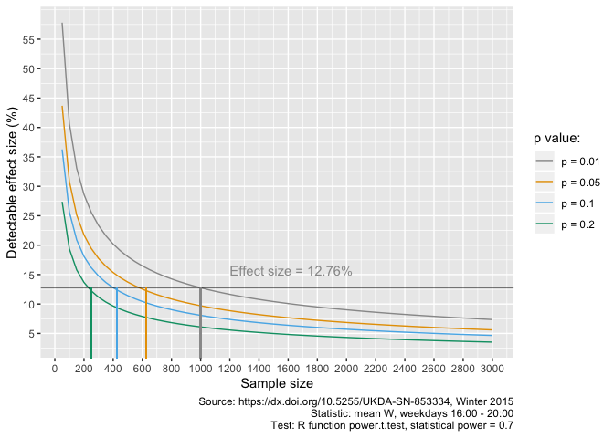
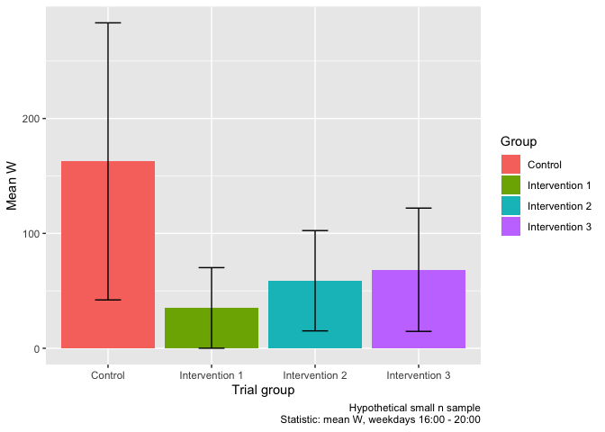
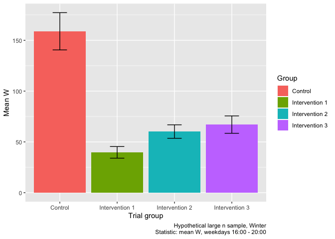

---
params:
  author: 'Ben Anderson and Tom Rushby'
  title: 'Statistical Power, Statistical Significance, Study Design and Decision Making: A Worked Example'
  subtitle: 'Sizing Demand Response Trials in New Zealand'
title: 'Statistical Power, Statistical Significance, Study Design and Decision Making: A Worked Example'
subtitle: 'Sizing Demand Response Trials in New Zealand'
author: 'Ben Anderson and Tom Rushby (Contact: b.anderson@soton.ac.uk, `@dataknut`)'
date: 'Last run at: 2018-09-20 17:34:36'
output:
  bookdown::html_document2:
    code_folding: hide
    fig_caption: yes
    keep_md: yes
    number_sections: yes
    self_contained: no
    toc: yes
    toc_depth: 2
    toc_float: yes
  bookdown::pdf_document2:
    fig_caption: yes
    keep_tex: yes
    number_sections: yes
    toc: yes
    toc_depth: 2
  bookdown::word_document2:
    fig_caption: yes
    toc: yes
    toc_depth: 2
bibliography: '/Users/ben/bibliography.bib'
---


\newpage

# About

## Paper circulation:

 * Public

## License


 
## Citation

If you wish to use any of the material from this report please cite as:

 * Ben Anderson and Tom Rushby. (2018) Statistical Power, Statistical Significance, Study Design and Decision Making: A Worked Example (Sizing Demand Response Trials in New Zealand), [Centre for Sustainability](http://www.otago.ac.nz/centre-sustainability/), University of Otago: Dunedin, New Zealand.

This work is (c) 2018 the authors.

## History

Code history is generally tracked via our [repo](https://github.com/CfSOtago/GREENGrid):

 * [Report history](https://github.com/CfSOtago/GREENGrid/commits/master/analysis/powerAnalysis)
 
## Data:

This paper uses circuit level extracts for 'Heat Pumps', 'Lighting' and 'Hot Water' for the NZ GREEN Grid Household Electricity Demand Data (https://dx.doi.org/10.5255/UKDA-SN-853334 [@anderson_new_2018]). These have been extracted using the code found in 

## Support


This work was supported by:

 * The [University of Otago](https://www.otago.ac.nz/);
 * The [University of Southampton](https://www.southampton.ac.uk/);
 * The New Zealand [Ministry of Business, Innovation and Employment (MBIE)](http://www.mbie.govt.nz/) through the [NZ GREEN Grid](https://www.otago.ac.nz/centre-sustainability/research/energy/otago050285.html) project;
 * [SPATIALEC](http://www.energy.soton.ac.uk/tag/spatialec/) - a [Marie Skłodowska-Curie Global Fellowship](http://ec.europa.eu/research/mariecurieactions/about-msca/actions/if/index_en.htm) based at the University of Otago’s [Centre for Sustainability](http://www.otago.ac.nz/centre-sustainability/staff/otago673896.html) (2017-2019) & the University of Southampton's Sustainable Energy Research Group (2019-2020).

We do not 'support' the code but if you notice a problem please check the [issues](https://github.com/CfSOtago/GREENGrid/issues) on our [repo](https://github.com/CfSOtago/GREENGrid) and if it doesn't already exist, please open a new one.
 
\newpage

# Introduction
In our experiennce of designing and running empirical studies, whether experimental or naturalistic, there is ongoing confusion over the meaning and role of two key statistical terms:
 
  * statistical power
  * statistical significance

We have found this to be the case both in academic research where the objective is to establish 'the most likely explanation' under academic conventions and in applied research where the objective is to 'make a robust decision' based on the balance of evidence and probability.

In this brief paper we respond to these confusions using a worked example: the design of a hypothetical household electricity demand response trial in New Zealand which seeks to shift the use of Heat Pumps out of the evening winter peak demand period. We use this example to explain and demonstrate the role of statistical signficance in testing for differences and of both statistical signficance and statistical power in sample design and decision making.

# Error, power, significance and decision making

Two types of error are of concern in both purely academic research where the efficacy of an intervention is to be tested and also in applied research where a decision may then be taken based on the results:

 * Type I: a false positive - an effect is inferred when in fact there is none. From a commercial or policy perspective this could lead to the implementation of a costly intervention which would be unlikely to have the effect expected;
 * Type II: a false negative - an effect is not inferred when in fact there is one. From a commercial or policy perspective this could lead to inaction when an intervention would have been likely to have the effect expected.
 
_Type I error_: The significance level (p value) of the statistical test to be used to test the efficacy of an intervention represents the extent to which the observed data matches the null model to be tested [@wasserstein2016]. In most trials the null model will be a measure of 'no difference' between control and intervenion groups. By convention, the p value _threshold_ for rejecting the null model (the risk of a Type I error) is generally set to 0.05 (5%) although this choice is entirely subjective. In commercial or policy terms an action taken on a larger p value (e.g. setting the p value threshold to 10%) would increase the risk of making a Type I error and thus implementing a potentially costly intervention that is unlikely to have the effect desired. However, as we discuss in more detail below, this is not necessarily _bad practice_ as it may reflect the potential magnitude of an effect, the decision-maker's tolerance of Type I error risk and the urgency of action.

_Type II error_: Statistical power is normally set to 0.8 (80%) by convention and represents the pre-study risk of making a Type II error [@Greenland2016]. From a commercial or policy perspective reducing power (e.g. to 0.7 or 70%) will therefore increase the risk of taking no action when in fact the intervention would probably have had the effect desired. Statistical power calculations enable the investigator to estimate the sample size that would be needed to robustly detect an experimental effect with a given risk of a false positive (Type I error) or false negative (Type II error) result. This prevents a study from recruiting too few participants to be able to robustly detect the hypothesised intervention effect [@Delmas2013Information] or wasting resources by recruiting a larger sample than needed. 

Previous work has suggested that sample sizes in most energy efficiency studies may be too low to provide adequate power and so statistically robust conclusions cannot be drawn at conventional thresholds [@Frederiks2016Evaluating] while a more recent review focusing on demand response studies reached a similar conclusion [@Srivastava2018Assessing]. It is therefore hardly surprising that a number of studies report effect sizes which are not statistically significant at conventional thresholds [@Srivastava2018Assessing], choose to use lower statistical significance thresholds [@RockyMountainInstitute2006Automated, @AECOM2011Energy, @CER2012Smart, @Schofield2015Experimental] or both lower statistical power values _and_ lower statistical significance thresholds [@energyWiseT1,@energyWiseT2].

However it would be wrong to conclude that this is _necessarily_ bad practice. Recent discussions of the role of p values in inference [@Greenland2016, @wasserstein2016] should remind us that decisions should never be based only on statistical significance thresholds set purely by convention. Rather, inference and thus decision making should be based on:

 * statistic effect size - is it 2% or 22% (i.e. is the result _important_ or _useful_, "What is the estimated _bang for buck_?");
 * statistic confidence intervals - (i.e. is there _uncertainty_ or _variation_ in response, "How uncertain is the estimated bang?");
 * statistic p values - (i.e. what is the risk of a Type I error / _false positive_, “What is the risk the bang observed isn’t real?”);

Only then can a contextually appropriate decision be taken as to whether the effect is large enough, certain enough and has a low enough risk of being a false positive result to warrant action.

In the following sections we apply these principles to the design and analysis of a hypothetical New Zealand household electricity demand response trial and to the use of a simple statistical test of difference between trial groups to demonstrate and clarify these points.

# Sample design: statistical power

To return to the discussion of statistical power, we need to establish the probably size of the control and intervention groups we will require. This is an aid to resource budgeting (_"How many households and thus `$` do I need?"_) and to ensure good study design practice ("_Will I be able to answer my research question?_") [@Frederiks2016Evaluating].

Calculation of the required sample size for a control and intervention group requires the estimation of the probable intervention effect size, agreement on the significance level (p value threshold or Type I error risk) of the statistical test to be used and agreement on the level of statistical power (Type II error risk). Given any three of these values the fourth can be calculated if an estimate of the mean and standard deviation of the outcome to be measured is known. In the case of DSR interventions the effect size comprises a given % reduction in energy demand or consumption in a given time period and estimates of the likely reduction can be derived from previous studies or data. 

As we have noted the choice of significance level (p value threshold) and statistical power are subjective and normative. Most academic researchers will struggle to justify relaxing from the conventional p = 0.05 and power = 0.8. However as we have discussed there may be good reason in applied research to take action on results of studies that use less conservative thresholds. Nevertheless there is a strong argument for designing such studies using the more conservative conventional levels but acknowledging that making inferences from the results may require a more relaxed approach to Type I or Type II error risks than is considered 'normal' in academic research.


```
## Scale for 'y' is already present. Adding another scale for 'y', which
## will replace the existing scale.
```

<!-- -->

```
## Saving 7 x 5 in image
```

As an illustration, \ref(fig:ggHPSampleSizeFig80) shows sample size calculations for power = 0.8 (80%) using 'Heat Pump' electricity demand extracted from the publicly available New Zealand Green Grid household electricity demand data [@anderson_new_2018] for winter 2015 for the peak demand period (16:00 - 20:00) on weekdays.

These results show that a trial comprising a control and intervention sample of 1000 households (each) would be able to detect an effect size of 14.1771905% with p = 0.01 and power = 0.8. Were a study to be less risk averse in it's decision making then p = 0.1 may be acceptable in which case only ~ 450 households would be needed in each group (see \ref(fig:ggHPSampleSizeFig80)) but the risk of a Type I error would increase. 


```
## Scale for 'y' is already present. Adding another scale for 'y', which
## will replace the existing scale.
```

<!-- -->

```
## Saving 7 x 5 in image
```

Were we to reduce the statistical power to 0.7 then we would obtain the results shown in \ref(fig:ggHPSampleSizeFig70). In this case a trial comprising a control and intervention sample of 1000 households (each) would be able to detect an effect size of 12.7575745% with p = 0.01 and power = 0.7. Were a study to be less risk averse in it's decision making then p = 0.1 may be acceptable in which case only ~ 425 households would be needed in each group (see \ref(fig:ggHPSampleSizeFig80)) but again the risk of a Type I error would increase. As we can see, reducing the statistical power used would also reduce the  sample required for a given effect size tested at a given p value. However the risk of a Type II error would increase.

# Testing for differences: effect sizes, confidence intervals and p values

## Getting it 'wrong'

Let us imagine that we have not designed and implemented our sample recruitment according to \ref(fig:ggHPSampleSizeFig80) and instead decided, perhaps for cost reasons to recruit ~ 30 households per group. Now we wish to test for differences between the control and intervention groups.

As a first step we plot the differences using the mean and 95% confidence intervals as shown in \ref(fig:ggMeanDiffs).

<table class="table" style="margin-left: auto; margin-right: auto;">
<caption>(\#tab:smallNTable)Number of households and summary statistics per group</caption>
 <thead>
  <tr>
   <th style="text-align:left;"> group </th>
   <th style="text-align:right;"> mean W </th>
   <th style="text-align:right;"> sd W </th>
   <th style="text-align:right;"> n households </th>
  </tr>
 </thead>
<tbody>
  <tr>
   <td style="text-align:left;"> Control </td>
   <td style="text-align:right;"> 162.66915 </td>
   <td style="text-align:right;"> 325.51171 </td>
   <td style="text-align:right;"> 28 </td>
  </tr>
  <tr>
   <td style="text-align:left;"> Intervention 1 </td>
   <td style="text-align:right;"> 35.13947 </td>
   <td style="text-align:right;"> 83.90258 </td>
   <td style="text-align:right;"> 22 </td>
  </tr>
  <tr>
   <td style="text-align:left;"> Intervention 2 </td>
   <td style="text-align:right;"> 58.80597 </td>
   <td style="text-align:right;"> 113.53102 </td>
   <td style="text-align:right;"> 26 </td>
  </tr>
  <tr>
   <td style="text-align:left;"> Intervention 3 </td>
   <td style="text-align:right;"> 68.37439 </td>
   <td style="text-align:right;"> 147.37279 </td>
   <td style="text-align:right;"> 29 </td>
  </tr>
</tbody>
</table>
<!-- -->

As we can see the interventions appear to have reduced demand quite substantially and the error bars indicate the uncertainty (variation) around the mean within each group. Based on this, we suspect that we are unlikely to see low p values when we use statistical tests of the differences as the error bars overlap substantially.

Suppose a t-test of the difference between the Control and Intervention 1 group produces the result shown below.
 

```
## 
## 	Welch Two Sample t-test
## 
## data:  testDT[group == "Intervention 1"]$meanW and testDT[group == "Control"]$meanW
## t = -1.9907, df = 31.47, p-value = 0.05526
## alternative hypothesis: true difference in means is not equal to 0
## 95 percent confidence interval:
##  -258.110005    3.050644
## sample estimates:
## mean of x mean of y 
##  35.13947 162.66915
```

The data shows that the mean power demand for the control group was 162.67W and for Intervention 1 was 35.14W. This is a (very) large difference in the mean of 127.53. The results of the t test are:

 * effect size = 128W or 78%  representing a _substantial bang for buck_ for whatever caused the difference;
 * 95% confidence interval for the test = -258.11 to 3.05 representing _considerable_ uncertainty/variation;
 * p value of 0.055 representing a _relatively low_ risk of a false positive result but which (just) fails the conventional p < 0.05 threshold.
 
What would we have concluded? We have a large effect size, substantial uncertainty and a slightly raised risk of a false positive or Type I error when compared to conventional p value levels. From a narrow and conventional 'p value testing' perspective we would have concluded that there was no statistically signficant difference between the groups. However this misses the crucial point that an organisation with a higher risk tolerance might conclude that the large effect size justifies implementing the intervention even though the risk of a false positive is slightly higher. If the p value had been 0.25 then this would have still been the case but would have warranted even further caution.

But what about Intervention Group 2? In this case the t.test results are slightly different:


```
## 
## 	Welch Two Sample t-test
## 
## data:  testDT[group == "Intervention 2"]$meanW and testDT[group == "Control"]$meanW
## t = -1.5876, df = 33.909, p-value = 0.1217
## alternative hypothesis: true difference in means is not equal to 0
## 95 percent confidence interval:
##  -236.82848   29.10212
## sample estimates:
## mean of x mean of y 
##  58.80597 162.66915
```

Now:
 
 * effect size = 103.8631823W or 63.85%  representing a still _reasonable bang for buck_ for whatever caused the difference;
 * 95% confidence interval for the test = -236.83 to 29.1 representing _even greater_ uncertainty/variation;
 * p value of 0.122 representing a _higher_ risk of a false positive result which fails the conventional p < 0.05 threshold and also the less conservative p < 0.1.

As before, the subsequent action we take depends on our tolerance of Type I (falso positive) risk. We still have a reasonably large effect size but we are less certain about it and we have a higher risk of it not being real. What do you think we should do?


In both cases our decision-making is rather hampered by the small sample size even though we have extremely large effect sizes. As we can see from \ref(fig:ggHPSampleSizeFig80), to detect Intervention Group 2's effect size of 63.85% would have required control and trial group sizes of 47 respectively.

However, as the recent discussions of the role of the p value in decision making have made clear [@wasserstein2016] statistical analysis needs to report all of the result elements to enable contextually appropriate and defensible evidence-based decisions to be taken. Simply dismissing results on the basis of a failure to meet conventional statistical levels of significance risks levitating babies and bathwater...

## Getting it 'right'

Suppose instead that we had designed and implemented our sample recruitment according to \ref(fig:ggHPSampleSizeFig80) so that we have a reasonable chance of detecting a difference of ~ 14% with power = 0.8 and at a significance level (p) of 0.05. This means we should have a sample of around 3000 households split equally (and randomly) between our trial and two intervention groups.

<table class="table" style="margin-left: auto; margin-right: auto;">
<caption>(\#tab:creatLargeN)Number of households and summary statistics per group</caption>
 <thead>
  <tr>
   <th style="text-align:left;"> group </th>
   <th style="text-align:right;"> mean W </th>
   <th style="text-align:right;"> sd W </th>
   <th style="text-align:right;"> n households </th>
  </tr>
 </thead>
<tbody>
  <tr>
   <td style="text-align:left;"> Control </td>
   <td style="text-align:right;"> 158.87413 </td>
   <td style="text-align:right;"> 316.34278 </td>
   <td style="text-align:right;"> 1142 </td>
  </tr>
  <tr>
   <td style="text-align:left;"> Intervention 1 </td>
   <td style="text-align:right;"> 39.71171 </td>
   <td style="text-align:right;"> 86.20793 </td>
   <td style="text-align:right;"> 874 </td>
  </tr>
  <tr>
   <td style="text-align:left;"> Intervention 2 </td>
   <td style="text-align:right;"> 60.19201 </td>
   <td style="text-align:right;"> 111.35901 </td>
   <td style="text-align:right;"> 1083 </td>
  </tr>
  <tr>
   <td style="text-align:left;"> Intervention 3 </td>
   <td style="text-align:right;"> 67.03022 </td>
   <td style="text-align:right;"> 144.81602 </td>
   <td style="text-align:right;"> 1101 </td>
  </tr>
</tbody>
</table>

<div class="figure">

<p class="caption">(\#fig:largeNmeanDiffs)Mean W demand per group for large sample (Error bars = 95% confidence intervals for the sample mean)</p>
</div>

In comparison to \ref(fig:ggMeanDiffs) we can now see (\ref(fig:largeNmeanDiffs)) that the 95% confidence intervals for the group means are much narrower. This is almost entirely due to the larger sample sizes. Re-running our previous test for differences now produces:


```
## 
## 	Welch Two Sample t-test
## 
## data:  largeTestDT[group == "Intervention 2"]$meanW and largeTestDT[group == "Control"]$meanW
## t = -9.9139, df = 1432.9, p-value < 2.2e-16
## alternative hypothesis: true difference in means is not equal to 0
## 95 percent confidence interval:
##  -118.20786  -79.15637
## sample estimates:
## mean of x mean of y 
##  60.19201 158.87413
```

In this case:
  * effect size = 98.6821156W or 62.11%  representing a still _reasonable bang for buck_ for whatever caused the difference;
 * 95% confidence interval for the test = -118.21 to -79.16 representing _much less_ uncertainty/variation;
 * p value of 0 representing a _very low_ risk of a false positive result as it passes all conventional thresholds.
 
So now we are able to be much more confident in our decision to implement Intervention 2 since the average effect is reasonably large, the expected variation in the effect size is reasonably narrow and the risk of a Type I (false positive) error is extremely small. We have combined good study design, based on statistical power analysis, with a nuanced understanding of what effect sizes, test statistic confidence intervals and p values can tell us. As a result we now have a robust, evidence-based, contextually meaningful and _defensible_ strategy.

# Summary and recomendations

## Statsitical power and sample design

Get it right _first time_ and if you don't have previous data to use _justify_ your choices through power analysis based on defensible assumptions.

## Reporting statistical tests of difference (effects)

Report all three elements _always_.

## Making inferences and taking decisions

Pay attention to all three elements _always_.

# Ackowledgements

We would like to thank collaborators and partners on a number of applied research projects for prodding us into thinking about these issues more deeply and clearly than we othweise would have done. We hope this paper helps to bring some clarity.

# Runtime


Analysis completed in 96.98 seconds ( 1.62 minutes) using [knitr](https://cran.r-project.org/package=knitr) in [RStudio](http://www.rstudio.com) with R version 3.5.1 (2018-07-02) running on x86_64-apple-darwin15.6.0.

# R environment

R packages used:

 * base R - for the basics [@baseR]
 * data.table - for fast (big) data handling [@data.table]
 * lubridate - date manipulation [@lubridate]
 * ggplot2 - for slick graphics [@ggplot2]
 * readr - for csv reading/writing [@readr]
 * dplyr - for select and contains [@dplyr]
 * progress - for progress bars [@progress]
 * kableExtra - to create this document & neat tables [@knitr]
 * GREENGrid - for local NZ GREEN Grid project utilities

Session info:


```
## R version 3.5.1 (2018-07-02)
## Platform: x86_64-apple-darwin15.6.0 (64-bit)
## Running under: macOS High Sierra 10.13.6
## 
## Matrix products: default
## BLAS: /Library/Frameworks/R.framework/Versions/3.5/Resources/lib/libRblas.0.dylib
## LAPACK: /Library/Frameworks/R.framework/Versions/3.5/Resources/lib/libRlapack.dylib
## 
## locale:
## [1] en_GB.UTF-8/en_GB.UTF-8/en_GB.UTF-8/C/en_GB.UTF-8/en_GB.UTF-8
## 
## attached base packages:
## [1] stats     graphics  grDevices utils     datasets  methods   base     
## 
## other attached packages:
## [1] kableExtra_0.9.0  SAVEr_0.0.1.9000  lubridate_1.7.4   readr_1.1.1      
## [5] ggplot2_3.0.0     dplyr_0.7.6       data.table_1.11.4 GREENGrid_0.1.0  
## [9] GREENGridData_1.0
## 
## loaded via a namespace (and not attached):
##  [1] Rcpp_0.12.18      lattice_0.20-35   tidyr_0.8.1      
##  [4] prettyunits_1.0.2 png_0.1-7         utf8_1.1.4       
##  [7] assertthat_0.2.0  rprojroot_1.3-2   digest_0.6.15    
## [10] R6_2.2.2          cellranger_1.1.0  plyr_1.8.4       
## [13] backports_1.1.2   evaluate_0.11     highr_0.7        
## [16] httr_1.3.1        pillar_1.3.0      RgoogleMaps_1.4.2
## [19] rlang_0.2.2       progress_1.2.0    lazyeval_0.2.1   
## [22] readxl_1.1.0      rstudioapi_0.7    geosphere_1.5-7  
## [25] rmarkdown_1.10    labeling_0.3      proto_1.0.0      
## [28] stringr_1.3.1     munsell_0.5.0     broom_0.5.0      
## [31] compiler_3.5.1    modelr_0.1.2      xfun_0.3         
## [34] pkgconfig_2.0.2   htmltools_0.3.6   openssl_1.0.2    
## [37] tidyselect_0.2.4  tibble_1.4.2      bookdown_0.7     
## [40] fansi_0.3.0       viridisLite_0.3.0 crayon_1.3.4     
## [43] withr_2.1.2       grid_3.5.1        nlme_3.1-137     
## [46] jsonlite_1.5      gtable_0.2.0      magrittr_1.5     
## [49] scales_1.0.0      cli_1.0.0         stringi_1.2.4    
## [52] mapproj_1.2.6     reshape2_1.4.3    bindrcpp_0.2.2   
## [55] sp_1.3-1          tidyverse_1.2.1   xml2_1.2.0       
## [58] rjson_0.2.20      tools_3.5.1       forcats_0.3.0    
## [61] ggmap_2.6.1       glue_1.3.0        purrr_0.2.5      
## [64] maps_3.3.0        hms_0.4.2         jpeg_0.1-8       
## [67] yaml_2.2.0        colorspace_1.3-2  rvest_0.3.2      
## [70] knitr_1.20.13     bindr_0.1.1       haven_1.1.2
```

# References
