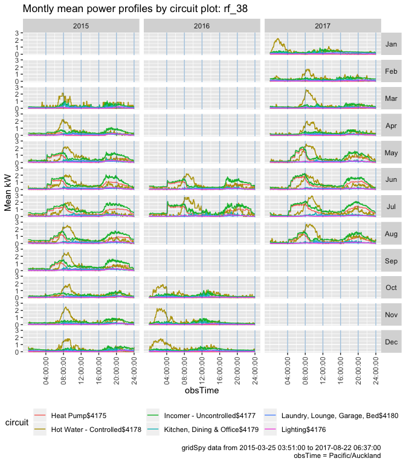
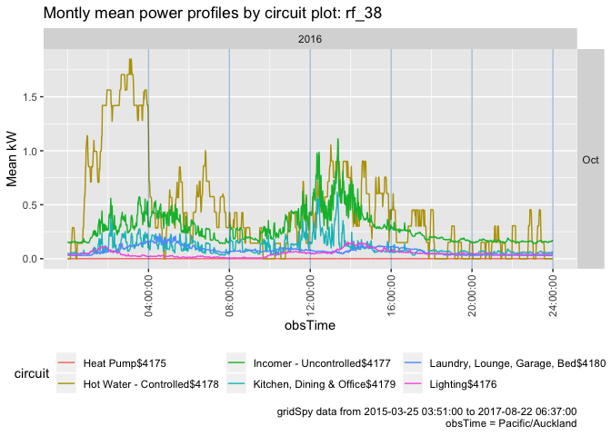

---
params:
  hhID: "rf_38" # <- change this to switch household. That's it :-)
  title: 'NZ GREEN Grid project example:'
  subtitle: 'Testing power demand: '
title: 'NZ GREEN Grid project example:'
subtitle: 'Testing power demand: rf_38'
author: "Ben Anderson (b.anderson@soton.ac.uk, `@dataknut`)"
date: 'Last run at: 2018-07-31 14:39:55'
output:
  bookdown::html_document2:
    code_folding: hide
    fig_caption: yes
    keep_md: yes
    number_sections: yes
    self_contained: no
    toc: yes
    toc_depth: 2
    toc_float: TRUE
  bookdown::pdf_document2:
    fig_caption: yes
    number_sections: yes
    toc: yes
    toc_depth: 2
bibliography: '/Users/ben/bibliography.bib'
---


\newpage

# About

## Report circulation:

 * Public - this report is intended to accompany the data release.
 
## License


 
## Citation

If you wish to use any of the material from this report please cite as:

 * Anderson, B. (2018) NZ GREEN Grid project example: Testing power demand: rf_38 [Centre for Sustainability](http://www.otago.ac.nz/centre-sustainability/), University of Otago: Dunedin.

This work is (c) 2018 the University of Southampton.

## History

Code history is generally tracked via our git.soton [repo](https://git.soton.ac.uk/ba1e12/nzGREENGrid/):

 * [Report history](https://git.soton.ac.uk/ba1e12/nzGREENGrid/commits/master/dataProcessing/gridSpy/testHouseholdPower_rf_38.Rmd)
 * [General issues](https://git.soton.ac.uk/ba1e12/nzGREENGrid/issues)
 
## Requirements:

This report uses the safe version of the grid spy 1 minute data which has been processed using https://github.com/dataknut/nzGREENGridDataR/blob/master/dataProcessing/gridSpy/processGridSpy1mData.R.

## Support


This work was supported by:

 * The [University of Otago](https://www.otago.ac.nz/);
 * The [University of Southampton](https://www.southampton.ac.uk/);
 * The New Zealand [Ministry of Business, Innovation and Employment (MBIE)](http://www.mbie.govt.nz/) through the [NZ GREEN Grid](https://www.otago.ac.nz/centre-sustainability/research/energy/otago050285.html) project;
 * [SPATIALEC](http://www.energy.soton.ac.uk/tag/spatialec/) - a [Marie Skłodowska-Curie Global Fellowship](http://ec.europa.eu/research/mariecurieactions/about-msca/actions/if/index_en.htm) based at the University of Otago’s [Centre for Sustainability](http://www.otago.ac.nz/centre-sustainability/staff/otago673896.html) (2017-2019) & the University of Southampton's Sustainable Energy Research Group (2019-202).

We do not 'support' the code but if you have a problem check the [issues](https://git.soton.ac.uk/ba1e12/nzGREENGrid/issues) on our [repo](https://git.soton.ac.uk/ba1e12/nzGREENGrid) and if it doesn't already exist, open one. We might be able to fix it :-)
 
\newpage

# Introduction


 
This report provides summary analysis of one household as an example.

# Load rf_38 data

The data used to generate this report is:

 * /Volumes/hum-csafe/Research Projects/GREEN Grid/Clean_data/safe/gridSpy/1min/data/rf_38_all_1min_data.csv.gz
 * /Volumes/hum-csafe/Research Projects/GREEN Grid/Clean_data/safe/survey/ggHouseholdAttributes.csv


```
## Parsed with column specification:
## cols(
##   sample = col_character(),
##   hhID = col_character(),
##   newID = col_character(),
##   Location = col_character(),
##   nAdults = col_integer(),
##   nChildren0_12 = col_integer(),
##   nTeenagers13_18 = col_integer(),
##   notes = col_character(),
##   r_stopDate = col_date(format = "")
## )
```


Table: (\#tab:hhData)Summary of household data forrf_38

sample   hhID    newID   Location      nAdults   nChildren0_12   nTeenagers13_18  notes   r_stopDate 
-------  ------  ------  -----------  --------  --------------  ----------------  ------  -----------
Unison   rf_38   rf_38   Hawkes Bay          2               2                 0  NA      NA         

Table \@ref(tab:hhData) shows household attributes such as how many people live in this household.


Table: (\#tab:gsData)Summary of grid spy data forrf_38

         hhID           dateTime_orig        TZ_orig            r_dateTime                    circuit              powerW     
---  -----------------  -----------------  -----------------  ----------------------------  -----------------  ---------------
     Length:5319113     Length:5319113     Length:5319113     Min.   :2015-03-25 03:51:00   Length:5319113     Min.   :-179.0 
     Class :character   Class :character   Class :character   1st Qu.:2015-08-28 14:06:00   Class :character   1st Qu.:   0.0 
     Mode  :character   Mode  :character   Mode  :character   Median :2016-10-18 01:51:00   Mode  :character   Median :  50.8 
     NA                 NA                 NA                 Mean   :2016-06-21 10:31:25   NA                 Mean   : 263.7 
     NA                 NA                 NA                 3rd Qu.:2017-03-21 06:54:00   NA                 3rd Qu.: 170.2 
     NA                 NA                 NA                 Max.   :2017-08-22 06:37:00   NA                 Max.   :6678.4 

Table \@ref(tab:gsData) shows a summary of the grid spy 1 minute power data. 

Note that:

 * the original dataTime (`dateTime_orig`) and TZ (`TZ_orig`) have been retained so that the user can check for parsing errors (see https://github.com/dataknut/nzGREENGridDataR/issues/2) if required;
 * r_datetime is the correct dateTime of each observation in UTC and will have loaded as your local timezone. If you are conducting this analysis outside NZ then you will get strange results until you use [lubridate](https://lubridate.tidyverse.org/) to tell R to use tz = "Pacific/Auckland" with this variable;

# Plot monthly power profiles

Figure \@ref(tab:plotProfiles) shows plots overall mean power (W) per minute per month for each circuit to show:

 * patterns of missing data (no lines)
 * patterns of consumption
 * possible dateTime issues (where consumption patterns seem to be stangely shifted in time)
 * possible PV installation

<!-- -->

Figure \@ref(tab:plotProfiles) seems to indicate some potential time of day mis-alignments in late 2016.

Figure \@ref(tab:checkMonth) repeats the analysis but just for October 2016 so that we can check and also compare with another household where we do not see this (e.g. rf_06).


```
##      hhID    dateTime_orig  TZ_orig          r_dateTime
##  1: rf_38 2016-10-11 13:01 date UTC 2016-10-11 13:01:00
##  2: rf_38 2016-10-11 13:01 date UTC 2016-10-11 13:01:00
##  3: rf_38 2016-10-11 13:01 date UTC 2016-10-11 13:01:00
##  4: rf_38 2016-10-11 13:01 date UTC 2016-10-11 13:01:00
##  5: rf_38 2016-10-11 13:01 date UTC 2016-10-11 13:01:00
##  6: rf_38 2016-10-11 13:01 date UTC 2016-10-11 13:01:00
##  7: rf_38 2016-10-11 13:02 date UTC 2016-10-11 13:02:00
##  8: rf_38 2016-10-11 13:02 date UTC 2016-10-11 13:02:00
##  9: rf_38 2016-10-11 13:02 date UTC 2016-10-11 13:02:00
## 10: rf_38 2016-10-11 13:02 date UTC 2016-10-11 13:02:00
##                               circuit powerW month year obsHour    obsDate
##  1:                    Heat Pump$4175   0.00   Oct 2016      13 2016-10-11
##  2:                     Lighting$4176 123.39   Oct 2016      13 2016-10-11
##  3:       Incomer - Uncontrolled$4177 198.64   Oct 2016      13 2016-10-11
##  4:       Hot Water - Controlled$4178   0.00   Oct 2016      13 2016-10-11
##  5:     Kitchen, Dining & Office$4179   0.00   Oct 2016      13 2016-10-11
##  6: Laundry, Lounge, Garage, Bed$4180  39.88   Oct 2016      13 2016-10-11
##  7:                    Heat Pump$4175   0.00   Oct 2016      13 2016-10-11
##  8:                     Lighting$4176 123.39   Oct 2016      13 2016-10-11
##  9:       Incomer - Uncontrolled$4177 196.27   Oct 2016      13 2016-10-11
## 10:       Hot Water - Controlled$4178   0.00   Oct 2016      13 2016-10-11
##      obsTime
##  1: 02:01:00
##  2: 02:01:00
##  3: 02:01:00
##  4: 02:01:00
##  5: 02:01:00
##  6: 02:01:00
##  7: 02:02:00
##  8: 02:02:00
##  9: 02:02:00
## 10: 02:02:00
```

<!-- -->

Figure \@ref(tab:checkMonthPlotly) uses plotly (only in html output) to show an interactive version.

<!--html_preserve--><div id="htmlwidget-fc5abd49f21d2c0f5d8f" style="width:672px;height:480px;" class="plotly html-widget"></div>
<script type="application/json" data-for="htmlwidget-fc5abd49f21d2c0f5d8f">{"x":{"data":[{"x":[0,60,120,180,240,300,360,420,480,540,600,660,720,780,840,900,960,1020,1080,1140,1200,1260,1320,1380,1440,1500,1560,1620,1680,1740,1800,1860,1920,1980,2040,2100,2160,2220,2280,2340,2400,2460,2520,2580,2640,2700,2760,2820,2880,2940,3000,3060,3120,3180,3240,3300,3360,3420,3480,3540,3600,3660,3720,3780,3840,3900,3960,4020,4080,4140,4200,4260,4320,4380,4440,4500,4560,4620,4680,4740,4800,4860,4920,4980,5040,5100,5160,5220,5280,5340,5400,5460,5520,5580,5640,5700,5760,5820,5880,5940,6000,6060,6120,6180,6240,6300,6360,6420,6480,6540,6600,6660,6720,6780,6840,6900,6960,7020,7080,7140,7200,7260,7320,7380,7440,7500,7560,7620,7680,7740,7800,7860,7920,7980,8040,8100,8160,8220,8280,8340,8400,8460,8520,8580,8640,8700,8760,8820,8880,8940,9000,9060,9120,9180,9240,9300,9360,9420,9480,9540,9600,9660,9720,9780,9840,9900,9960,10020,10080,10140,10200,10260,10320,10380,10440,10500,10560,10620,10680,10740,10800,10860,10920,10980,11040,11100,11160,11220,11280,11340,11400,11460,11520,11580,11640,11700,11760,11820,11880,11940,12000,12060,12120,12180,12240,12300,12360,12420,12480,12540,12600,12660,12720,12780,12840,12900,12960,13020,13080,13140,13200,13260,13320,13380,13440,13500,13560,13620,13680,13740,13800,13860,13920,13980,14040,14100,14160,14220,14280,14340,14400,14460,14520,14580,14640,14700,14760,14820,14880,14940,15000,15060,15120,15180,15240,15300,15360,15420,15480,15540,15600,15660,15720,15780,15840,15900,15960,16020,16080,16140,16200,16260,16320,16380,16440,16500,16560,16620,16680,16740,16800,16860,16920,16980,17040,17100,17160,17220,17280,17340,17400,17460,17520,17580,17640,17700,17760,17820,17880,17940,18000,18060,18120,18180,18240,18300,18360,18420,18480,18540,18600,18660,18720,18780,18840,18900,18960,19020,19080,19140,19200,19260,19320,19380,19440,19500,19560,19620,19680,19740,19800,19860,19920,19980,20040,20100,20160,20220,20280,20340,20400,20460,20520,20580,20640,20700,20760,20820,20880,20940,21000,21060,21120,21180,21240,21300,21360,21420,21480,21540,21600,21660,21720,21780,21840,21900,21960,22020,22080,22140,22200,22260,22320,22380,22440,22500,22560,22620,22680,22740,22800,22860,22920,22980,23040,23100,23160,23220,23280,23340,23400,23460,23520,23580,23640,23700,23760,23820,23880,23940,24000,24060,24120,24180,24240,24300,24360,24420,24480,24540,24600,24660,24720,24780,24840,24900,24960,25020,25080,25140,25200,25260,25320,25380,25440,25500,25560,25620,25680,25740,25800,25860,25920,25980,26040,26100,26160,26220,26280,26340,26400,26460,26520,26580,26640,26700,26760,26820,26880,26940,27000,27060,27120,27180,27240,27300,27360,27420,27480,27540,27600,27660,27720,27780,27840,27900,27960,28020,28080,28140,28200,28260,28320,28380,28440,28500,28560,28620,28680,28740,28800,28860,28920,28980,29040,29100,29160,29220,29280,29340,29400,29460,29520,29580,29640,29700,29760,29820,29880,29940,30000,30060,30120,30180,30240,30300,30360,30420,30480,30540,30600,30660,30720,30780,30840,30900,30960,31020,31080,31140,31200,31260,31320,31380,31440,31500,31560,31620,31680,31740,31800,31860,31920,31980,32040,32100,32160,32220,32280,32340,32400,32460,32520,32580,32640,32700,32760,32820,32880,32940,33000,33060,33120,33180,33240,33300,33360,33420,33480,33540,33600,33660,33720,33780,33840,33900,33960,34020,34080,34140,34200,34260,34320,34380,34440,34500,34560,34620,34680,34740,34800,34860,34920,34980,35040,35100,35160,35220,35280,35340,35400,35460,35520,35580,35640,35700,35760,35820,35880,35940,36000,36060,36120,36180,36240,36300,36360,36420,36480,36540,36600,36660,36720,36780,36840,36900,36960,37020,37080,37140,37200,37260,37320,37380,37440,37500,37560,37620,37680,37740,37800,37860,37920,37980,38040,38100,38160,38220,38280,38340,38400,38460,38520,38580,38640,38700,38760,38820,38880,38940,39000,39060,39120,39180,39240,39300,39360,39420,39480,39540,39600,39660,39720,39780,39840,39900,39960,40020,40080,40140,40200,40260,40320,40380,40440,40500,40560,40620,40680,40740,40800,40860,40920,40980,41040,41100,41160,41220,41280,41340,41400,41460,41520,41580,41640,41700,41760,41820,41880,41940,42000,42060,42120,42180,42240,42300,42360,42420,42480,42540,42600,42660,42720,42780,42840,42900,42960,43020,43080,43140,43200,43260,43320,43380,43440,43500,43560,43620,43680,43740,43800,43860,43920,43980,44040,44100,44160,44220,44280,44340,44400,44460,44520,44580,44640,44700,44760,44820,44880,44940,45000,45060,45120,45180,45240,45300,45360,45420,45480,45540,45600,45660,45720,45780,45840,45900,45960,46020,46080,46140,46200,46260,46320,46380,46440,46500,46560,46620,46680,46740,46800,46860,46920,46980,47040,47100,47160,47220,47280,47340,47400,47460,47520,47580,47640,47700,47760,47820,47880,47940,48000,48060,48120,48180,48240,48300,48360,48420,48480,48540,48600,48660,48720,48780,48840,48900,48960,49020,49080,49140,49200,49260,49320,49380,49440,49500,49560,49620,49680,49740,49800,49860,49920,49980,50040,50100,50160,50220,50280,50340,50400,50460,50520,50580,50640,50700,50760,50820,50880,50940,51000,51060,51120,51180,51240,51300,51360,51420,51480,51540,51600,51660,51720,51780,51840,51900,51960,52020,52080,52140,52200,52260,52320,52380,52440,52500,52560,52620,52680,52740,52800,52860,52920,52980,53040,53100,53160,53220,53280,53340,53400,53460,53520,53580,53640,53700,53760,53820,53880,53940,54000,54060,54120,54180,54240,54300,54360,54420,54480,54540,54600,54660,54720,54780,54840,54900,54960,55020,55080,55140,55200,55260,55320,55380,55440,55500,55560,55620,55680,55740,55800,55860,55920,55980,56040,56100,56160,56220,56280,56340,56400,56460,56520,56580,56640,56700,56760,56820,56880,56940,57000,57060,57120,57180,57240,57300,57360,57420,57480,57540,57600,57660,57720,57780,57840,57900,57960,58020,58080,58140,58200,58260,58320,58380,58440,58500,58560,58620,58680,58740,58800,58860,58920,58980,59040,59100,59160,59220,59280,59340,59400,59460,59520,59580,59640,59700,59760,59820,59880,59940,60000,60060,60120,60180,60240,60300,60360,60420,60480,60540,60600,60660,60720,60780,60840,60900,60960,61020,61080,61140,61200,61260,61320,61380,61440,61500,61560,61620,61680,61740,61800,61860,61920,61980,62040,62100,62160,62220,62280,62340,62400,62460,62520,62580,62640,62700,62760,62820,62880,62940,63000,63060,63120,63180,63240,63300,63360,63420,63480,63540,63600,63660,63720,63780,63840,63900,63960,64020,64080,64140,64200,64260,64320,64380,64440,64500,64560,64620,64680,64740,64800,64860,64920,64980,65040,65100,65160,65220,65280,65340,65400,65460,65520,65580,65640,65700,65760,65820,65880,65940,66000,66060,66120,66180,66240,66300,66360,66420,66480,66540,66600,66660,66720,66780,66840,66900,66960,67020,67080,67140,67200,67260,67320,67380,67440,67500,67560,67620,67680,67740,67800,67860,67920,67980,68040,68100,68160,68220,68280,68340,68400,68460,68520,68580,68640,68700,68760,68820,68880,68940,69000,69060,69120,69180,69240,69300,69360,69420,69480,69540,69600,69660,69720,69780,69840,69900,69960,70020,70080,70140,70200,70260,70320,70380,70440,70500,70560,70620,70680,70740,70800,70860,70920,70980,71040,71100,71160,71220,71280,71340,71400,71460,71520,71580,71640,71700,71760,71820,71880,71940,72000,72060,72120,72180,72240,72300,72360,72420,72480,72540,72600,72660,72720,72780,72840,72900,72960,73020,73080,73140,73200,73260,73320,73380,73440,73500,73560,73620,73680,73740,73800,73860,73920,73980,74040,74100,74160,74220,74280,74340,74400,74460,74520,74580,74640,74700,74760,74820,74880,74940,75000,75060,75120,75180,75240,75300,75360,75420,75480,75540,75600,75660,75720,75780,75840,75900,75960,76020,76080,76140,76200,76260,76320,76380,76440,76500,76560,76620,76680,76740,76800,76860,76920,76980,77040,77100,77160,77220,77280,77340,77400,77460,77520,77580,77640,77700,77760,77820,77880,77940,78000,78060,78120,78180,78240,78300,78360,78420,78480,78540,78600,78660,78720,78780,78840,78900,78960,79020,79080,79140,79200,79260,79320,79380,79440,79500,79560,79620,79680,79740,79800,79860,79920,79980,80040,80100,80160,80220,80280,80340,80400,80460,80520,80580,80640,80700,80760,80820,80880,80940,81000,81060,81120,81180,81240,81300,81360,81420,81480,81540,81600,81660,81720,81780,81840,81900,81960,82020,82080,82140,82200,82260,82320,82380,82440,82500,82560,82620,82680,82740,82800,82860,82920,82980,83040,83100,83160,83220,83280,83340,83400,83460,83520,83580,83640,83700,83760,83820,83880,83940,84000,84060,84120,84180,84240,84300,84360,84420,84480,84540,84600,84660,84720,84780,84840,84900,84960,85020,85080,85140,85200,85260,85320,85380,85440,85500,85560,85620,85680,85740,85800,85860,85920,85980,86040,86100,86160,86220,86280,86340],"y":[0,0,0,0,0,0,0,0,0,0,0,0,0.000993809523809524,0,0,0,0,0,0,0,0,0,0,0,0,0,0,0,0,0,0.000925238095238095,0,0,0,0,0,0,0,0,0,0,0,0,0,0,0,0,0,0,0,0,0,0,0,0,0,0,0,0,0,0,0,0,0,0,0,0,0,0,0,0,0,0,0,0,0,0,0,0,0,0,0,0,0,0,0,0,0,0,0,0,0,0,0,0,0,0,0,0,0,0.000745238095238095,0,0,0,0,0,0,0,0,0,0,0,0,0,0,0,0,0,0,0,0,0,0,0.000813809523809524,0,0,0,0,0,0,0,0,0,0,0,0,0,0,0,0,0,0.00101666666666667,0,0,0,0,0,0,0,0,0.000835238095238095,0,0,0.000948095238095238,0,0,0,0,0,0,0,0,0,0,0,0,0,0,0,0,0,0,0,0,0,0,0,0,0,0,0,0,0,0,0,0,0,0,0,0,0,0,0,0,0,0,0,0,0,0,0,0,0,0,0,0,0,0,0,0,0,0,0,0,0,0,0,0,0,0,0,0,0,0,0,0,0,0,0,0.000699523809523809,0,0,0,0,0,0,0,0,0,0,0,0.00119666666666667,0,0,0,0,0,0,0,0,0,0,0,0,0,0,0,0,0,0,0,0,0,0,0,0,0,0,0,0,0,0,0,0,0,0,0,0,0,0,0,0,0,0,0,0,0,0,0,0,0,0,0,0,0,0,0,0,0,0,0,0,0,0,0,0,0,0,0,0,0,0,0,0,0,0,0,0,0,0,0,0,0,0,0,0,0,0,0,0,0,0,0,0,0,0,0,0,0,0,0,0,0,0,0,0,0,0,0,0,0,0,0,0,0,0.000880952380952381,0,0,0,0,0,0,0,0,0,0,0,0,0,0,0,0,0,0,0,0,0,0,0,0,0,0,0,0,0,0,0,0,0,0,0,0,0,0,0,0,0,0,0,0,0,0,0,0,0,0,0,0,0,0,0,0,0,0,0,0,0,0,0,0,0,0,0,0,0,0,0,0,0,0,0,0,0,0,0,0,0,0,0,0,0,0,0,0,0,0,0,0,0,0,0,0,0,0,0,0,0,0,0,0,0,0,0,0,0,0,0,0,0,0,0,0,0,0,0,0,0,0,0,0,0,0,0,0,0,0,0,0,0,0,0,0,0,0,0,0,0,0,0,0,0,0,0,0,0,0,0,0,0.000766666666666667,0,0,0,0,0,0,0,0,0,0,0,0,0,0,0,0,0,0,0,0,0,0,0,0,0,0,0,0,0,0,0,0,0,0,0,0,0,0,0,0,0,0,0,0,0,0,0,0,0,0,0,0,0,0,0,0,0,0,0,0,0,0,0,0,0,0,0,0,0,0.000722380952380952,0,0,0.000722380952380952,0,0,0,0,0,0,0,0,0,0,0,0,0,0,0,0,0,0,0,0,0,0,0,0,0,0.000813809523809524,0,0,0,0,0,0,0,0,0.000880952380952381,0,0,0,0,0,0,0,0,0,0,0,0,0,0,0,0,0,0,0,0,0,0,0,0,0,0,0,0,0,0,0,0,0,0,0,0,0,0,0,0,0,0,0,0,0,0,0,0,0,0,0,0,0,0,0,0,0,0,0,0,0,0,0,0,0,0,0,0,0,0,0,0,0,0,0,0,0,0,0,0,0,0.00135666666666667,0,0,0,0,0,0,0,0,0,0,0,0.000993809523809524,0,0,0,0,0,0,0,0,0,0,0,0,0,0,0,0,0,0,0,0,0,0,0.00094952380952381,0,0,0,0,0,0.00094952380952381,0,0,0,0,-0.000700952380952381,-0.000700952380952381,0,0,0,0,0,0.000722380952380952,0,0,0,0,0,0.00108380952380952,0,0,0,0,0,0,0,0,0,0,0,0,0,0,0,0,0,0,0,0,0,0,0,0,0,0,0,-0.000736,-0.000736,0,0,0,0,0,0,0,0,0,0,0,0,0,0,0,0,0,0,0,0,0,0,0,0,0,0,0,0,0,0,0,0,0,0,0,0,0,0,0,0,0,0,0,0,0,0,0,0,0,0,0,0,0,0,0,0,0,0,0,0,0,0,0,0,0,0,0,0,0,0,0,0,0,0,0,0,0,0,0,0,0,0.0008545,0,0,0,0,0,0,0,0,0,0,0,0,0,0,0,0,0,0,0,0,0,0,0,0,0,0,0,0,0,0,0,0,0,0,0,0,0,0,0,0,0,0,0,0,0,0,0,0,0,0,0,0,0,0,0,0,0,0,0,0,0,0,0,0,0,0,0,0,0,0,0,0,0,0,0,0,0,0,0,0,0,0,0,0,0,0,0,0,0,0,0,0,0,0,0,0,0.0007825,0,0,0,0,0,0,0,0,0.000853,0,0,0,0,0,0,0,0,0,0,0,0,0,0,0,0,0,0,0,0.000997,0,0,0,0,0,0,0,0,0,0,0,0,0,0,0,0,0,0,0,0,0,0,0,0,0,0,0,0,0,0,0,0,0,0,0,0,0,0,0,0,0,0,0,0,0,0,0,0,0,0,0,0,0,0,0,0,0,0,0,0,0,0,0,0,0,0,0,0,0,0,0,0,0,0.000829,0,0,0,0,0,0,0,0,0,0,0,0,0,0,0,0,0,0,0,0,0,0,0,0,0,0,0,0,0,0,0,0,0,0,0,0,0,0,0,0,0,0,0,0,0,0,0.0009475,0,0,0,0,0,0,0,0,0,0,0,0,0,0,0,0,0,0,0,0,0,0,0,0,0,0,0,0,0,0,0,0,0,0,0,0,0,0,0,0,0,0,0,0,0,0,0,0,0,0,0,0,0,0,0,0,0,0,0,0,0,0,0,0.0008545,0,0,0,0,0,0,0,0,0,0,0,0,0,0,0,0,0,0,0,0,0,0,0,0,0,0,0,0,0,0,0,0,0,0,0,0,0,0,0,0,0,0,0,0,0,0,0,0,0,0,0,0,0,0,0,0.0010195,0,0,0,0,0,0,0,0,0,0,0,0,0,0,0,0,0,0,0,0,0,0,0,0,0,0,0,0,0,0,0,0,0,0,0,0,0,0,0,0,0,0,0,0,0,0,0,0,0,0,0,0,0,0,0,0,0,0,0,0,0,0,0,0,0,0,0,0,0,0,0,0,0,0,0,0,0,0,0,0,0,0,0,0,0.0007345,0,0,0,0,0,0,0,0,0,0,0,0.0009715,0,0,0,0,0,0,0,0,0,0,0,0,0,0,0,0,0,0,0,0,0,0,0,0,0,0,0,0,0,0,0,0,0,0,0,0,0,0,0,0,0,0,0,0,0,0,0,0,0,0,0,0,0,0,0,0,0,0,0,0,0,0,0,0,0,0,0,0,0,0,0,0,0,0,0,0,0,0,0,0,0,0,0,0,0,0,0,0,0,0,0,0,0,0.0009475,0,0,0,0,0,0,0,0,0,0,0,0,0],"text":["obsTime: 00:00:00<br />meanW/1000:  0.0000000000<br />circuit: Heat Pump$4175","obsTime: 00:01:00<br />meanW/1000:  0.0000000000<br />circuit: Heat Pump$4175","obsTime: 00:02:00<br />meanW/1000:  0.0000000000<br />circuit: Heat Pump$4175","obsTime: 00:03:00<br />meanW/1000:  0.0000000000<br />circuit: Heat Pump$4175","obsTime: 00:04:00<br />meanW/1000:  0.0000000000<br />circuit: Heat Pump$4175","obsTime: 00:05:00<br />meanW/1000:  0.0000000000<br />circuit: Heat Pump$4175","obsTime: 00:06:00<br />meanW/1000:  0.0000000000<br />circuit: Heat Pump$4175","obsTime: 00:07:00<br />meanW/1000:  0.0000000000<br />circuit: Heat Pump$4175","obsTime: 00:08:00<br />meanW/1000:  0.0000000000<br />circuit: Heat Pump$4175","obsTime: 00:09:00<br />meanW/1000:  0.0000000000<br />circuit: Heat Pump$4175","obsTime: 00:10:00<br />meanW/1000:  0.0000000000<br />circuit: Heat Pump$4175","obsTime: 00:11:00<br />meanW/1000:  0.0000000000<br />circuit: Heat Pump$4175","obsTime: 00:12:00<br />meanW/1000:  0.0009938095<br />circuit: Heat Pump$4175","obsTime: 00:13:00<br />meanW/1000:  0.0000000000<br />circuit: Heat Pump$4175","obsTime: 00:14:00<br />meanW/1000:  0.0000000000<br />circuit: Heat Pump$4175","obsTime: 00:15:00<br />meanW/1000:  0.0000000000<br />circuit: Heat Pump$4175","obsTime: 00:16:00<br />meanW/1000:  0.0000000000<br />circuit: Heat Pump$4175","obsTime: 00:17:00<br />meanW/1000:  0.0000000000<br />circuit: Heat Pump$4175","obsTime: 00:18:00<br />meanW/1000:  0.0000000000<br />circuit: Heat Pump$4175","obsTime: 00:19:00<br />meanW/1000:  0.0000000000<br />circuit: Heat Pump$4175","obsTime: 00:20:00<br />meanW/1000:  0.0000000000<br />circuit: Heat Pump$4175","obsTime: 00:21:00<br />meanW/1000:  0.0000000000<br />circuit: Heat Pump$4175","obsTime: 00:22:00<br />meanW/1000:  0.0000000000<br />circuit: Heat Pump$4175","obsTime: 00:23:00<br />meanW/1000:  0.0000000000<br />circuit: Heat Pump$4175","obsTime: 00:24:00<br />meanW/1000:  0.0000000000<br />circuit: Heat Pump$4175","obsTime: 00:25:00<br />meanW/1000:  0.0000000000<br />circuit: Heat Pump$4175","obsTime: 00:26:00<br />meanW/1000:  0.0000000000<br />circuit: Heat Pump$4175","obsTime: 00:27:00<br />meanW/1000:  0.0000000000<br />circuit: Heat Pump$4175","obsTime: 00:28:00<br />meanW/1000:  0.0000000000<br />circuit: Heat Pump$4175","obsTime: 00:29:00<br />meanW/1000:  0.0000000000<br />circuit: Heat Pump$4175","obsTime: 00:30:00<br />meanW/1000:  0.0009252381<br />circuit: Heat Pump$4175","obsTime: 00:31:00<br />meanW/1000:  0.0000000000<br />circuit: Heat Pump$4175","obsTime: 00:32:00<br />meanW/1000:  0.0000000000<br />circuit: Heat Pump$4175","obsTime: 00:33:00<br />meanW/1000:  0.0000000000<br />circuit: Heat Pump$4175","obsTime: 00:34:00<br />meanW/1000:  0.0000000000<br />circuit: Heat Pump$4175","obsTime: 00:35:00<br />meanW/1000:  0.0000000000<br />circuit: Heat Pump$4175","obsTime: 00:36:00<br />meanW/1000:  0.0000000000<br />circuit: Heat Pump$4175","obsTime: 00:37:00<br />meanW/1000:  0.0000000000<br />circuit: Heat Pump$4175","obsTime: 00:38:00<br />meanW/1000:  0.0000000000<br />circuit: Heat Pump$4175","obsTime: 00:39:00<br />meanW/1000:  0.0000000000<br />circuit: Heat Pump$4175","obsTime: 00:40:00<br />meanW/1000:  0.0000000000<br />circuit: Heat Pump$4175","obsTime: 00:41:00<br />meanW/1000:  0.0000000000<br />circuit: Heat Pump$4175","obsTime: 00:42:00<br />meanW/1000:  0.0000000000<br />circuit: Heat Pump$4175","obsTime: 00:43:00<br />meanW/1000:  0.0000000000<br />circuit: Heat Pump$4175","obsTime: 00:44:00<br />meanW/1000:  0.0000000000<br />circuit: Heat Pump$4175","obsTime: 00:45:00<br />meanW/1000:  0.0000000000<br />circuit: Heat Pump$4175","obsTime: 00:46:00<br />meanW/1000:  0.0000000000<br />circuit: Heat Pump$4175","obsTime: 00:47:00<br />meanW/1000:  0.0000000000<br />circuit: Heat Pump$4175","obsTime: 00:48:00<br />meanW/1000:  0.0000000000<br />circuit: Heat Pump$4175","obsTime: 00:49:00<br />meanW/1000:  0.0000000000<br />circuit: Heat Pump$4175","obsTime: 00:50:00<br />meanW/1000:  0.0000000000<br />circuit: Heat Pump$4175","obsTime: 00:51:00<br />meanW/1000:  0.0000000000<br />circuit: Heat Pump$4175","obsTime: 00:52:00<br />meanW/1000:  0.0000000000<br />circuit: Heat Pump$4175","obsTime: 00:53:00<br />meanW/1000:  0.0000000000<br />circuit: Heat Pump$4175","obsTime: 00:54:00<br />meanW/1000:  0.0000000000<br />circuit: Heat Pump$4175","obsTime: 00:55:00<br />meanW/1000:  0.0000000000<br />circuit: Heat Pump$4175","obsTime: 00:56:00<br />meanW/1000:  0.0000000000<br />circuit: Heat Pump$4175","obsTime: 00:57:00<br />meanW/1000:  0.0000000000<br />circuit: Heat Pump$4175","obsTime: 00:58:00<br />meanW/1000:  0.0000000000<br />circuit: Heat Pump$4175","obsTime: 00:59:00<br />meanW/1000:  0.0000000000<br />circuit: Heat Pump$4175","obsTime: 01:00:00<br />meanW/1000:  0.0000000000<br />circuit: Heat Pump$4175","obsTime: 01:01:00<br />meanW/1000:  0.0000000000<br />circuit: Heat Pump$4175","obsTime: 01:02:00<br />meanW/1000:  0.0000000000<br />circuit: Heat Pump$4175","obsTime: 01:03:00<br />meanW/1000:  0.0000000000<br />circuit: Heat Pump$4175","obsTime: 01:04:00<br />meanW/1000:  0.0000000000<br />circuit: Heat Pump$4175","obsTime: 01:05:00<br />meanW/1000:  0.0000000000<br />circuit: Heat Pump$4175","obsTime: 01:06:00<br />meanW/1000:  0.0000000000<br />circuit: Heat Pump$4175","obsTime: 01:07:00<br />meanW/1000:  0.0000000000<br />circuit: Heat Pump$4175","obsTime: 01:08:00<br />meanW/1000:  0.0000000000<br />circuit: Heat Pump$4175","obsTime: 01:09:00<br />meanW/1000:  0.0000000000<br />circuit: Heat Pump$4175","obsTime: 01:10:00<br />meanW/1000:  0.0000000000<br />circuit: Heat Pump$4175","obsTime: 01:11:00<br />meanW/1000:  0.0000000000<br />circuit: Heat Pump$4175","obsTime: 01:12:00<br />meanW/1000:  0.0000000000<br />circuit: Heat Pump$4175","obsTime: 01:13:00<br />meanW/1000:  0.0000000000<br />circuit: Heat Pump$4175","obsTime: 01:14:00<br />meanW/1000:  0.0000000000<br />circuit: Heat Pump$4175","obsTime: 01:15:00<br />meanW/1000:  0.0000000000<br />circuit: Heat Pump$4175","obsTime: 01:16:00<br />meanW/1000:  0.0000000000<br />circuit: Heat Pump$4175","obsTime: 01:17:00<br />meanW/1000:  0.0000000000<br />circuit: Heat Pump$4175","obsTime: 01:18:00<br />meanW/1000:  0.0000000000<br />circuit: Heat Pump$4175","obsTime: 01:19:00<br />meanW/1000:  0.0000000000<br />circuit: Heat Pump$4175","obsTime: 01:20:00<br />meanW/1000:  0.0000000000<br />circuit: Heat Pump$4175","obsTime: 01:21:00<br />meanW/1000:  0.0000000000<br />circuit: Heat Pump$4175","obsTime: 01:22:00<br />meanW/1000:  0.0000000000<br />circuit: Heat Pump$4175","obsTime: 01:23:00<br />meanW/1000:  0.0000000000<br />circuit: Heat Pump$4175","obsTime: 01:24:00<br />meanW/1000:  0.0000000000<br />circuit: Heat Pump$4175","obsTime: 01:25:00<br />meanW/1000:  0.0000000000<br />circuit: Heat Pump$4175","obsTime: 01:26:00<br />meanW/1000:  0.0000000000<br />circuit: Heat Pump$4175","obsTime: 01:27:00<br />meanW/1000:  0.0000000000<br />circuit: Heat Pump$4175","obsTime: 01:28:00<br />meanW/1000:  0.0000000000<br />circuit: Heat Pump$4175","obsTime: 01:29:00<br />meanW/1000:  0.0000000000<br />circuit: Heat Pump$4175","obsTime: 01:30:00<br />meanW/1000:  0.0000000000<br />circuit: Heat Pump$4175","obsTime: 01:31:00<br />meanW/1000:  0.0000000000<br />circuit: Heat Pump$4175","obsTime: 01:32:00<br />meanW/1000:  0.0000000000<br />circuit: Heat Pump$4175","obsTime: 01:33:00<br />meanW/1000:  0.0000000000<br />circuit: Heat Pump$4175","obsTime: 01:34:00<br />meanW/1000:  0.0000000000<br />circuit: Heat Pump$4175","obsTime: 01:35:00<br />meanW/1000:  0.0000000000<br />circuit: Heat Pump$4175","obsTime: 01:36:00<br />meanW/1000:  0.0000000000<br />circuit: Heat Pump$4175","obsTime: 01:37:00<br />meanW/1000:  0.0000000000<br />circuit: Heat Pump$4175","obsTime: 01:38:00<br />meanW/1000:  0.0000000000<br />circuit: Heat Pump$4175","obsTime: 01:39:00<br />meanW/1000:  0.0000000000<br />circuit: Heat Pump$4175","obsTime: 01:40:00<br />meanW/1000:  0.0007452381<br />circuit: Heat Pump$4175","obsTime: 01:41:00<br />meanW/1000:  0.0000000000<br />circuit: Heat Pump$4175","obsTime: 01:42:00<br />meanW/1000:  0.0000000000<br />circuit: Heat Pump$4175","obsTime: 01:43:00<br />meanW/1000:  0.0000000000<br />circuit: Heat Pump$4175","obsTime: 01:44:00<br />meanW/1000:  0.0000000000<br />circuit: Heat Pump$4175","obsTime: 01:45:00<br />meanW/1000:  0.0000000000<br />circuit: Heat Pump$4175","obsTime: 01:46:00<br />meanW/1000:  0.0000000000<br />circuit: Heat Pump$4175","obsTime: 01:47:00<br />meanW/1000:  0.0000000000<br />circuit: Heat Pump$4175","obsTime: 01:48:00<br />meanW/1000:  0.0000000000<br />circuit: Heat Pump$4175","obsTime: 01:49:00<br />meanW/1000:  0.0000000000<br />circuit: Heat Pump$4175","obsTime: 01:50:00<br />meanW/1000:  0.0000000000<br />circuit: Heat Pump$4175","obsTime: 01:51:00<br />meanW/1000:  0.0000000000<br />circuit: Heat Pump$4175","obsTime: 01:52:00<br />meanW/1000:  0.0000000000<br />circuit: Heat Pump$4175","obsTime: 01:53:00<br />meanW/1000:  0.0000000000<br />circuit: Heat Pump$4175","obsTime: 01:54:00<br />meanW/1000:  0.0000000000<br />circuit: Heat Pump$4175","obsTime: 01:55:00<br />meanW/1000:  0.0000000000<br />circuit: Heat Pump$4175","obsTime: 01:56:00<br />meanW/1000:  0.0000000000<br />circuit: Heat Pump$4175","obsTime: 01:57:00<br />meanW/1000:  0.0000000000<br />circuit: Heat Pump$4175","obsTime: 01:58:00<br />meanW/1000:  0.0000000000<br />circuit: Heat Pump$4175","obsTime: 01:59:00<br />meanW/1000:  0.0000000000<br />circuit: Heat Pump$4175","obsTime: 02:00:00<br />meanW/1000:  0.0000000000<br />circuit: Heat Pump$4175","obsTime: 02:01:00<br />meanW/1000:  0.0000000000<br />circuit: Heat Pump$4175","obsTime: 02:02:00<br />meanW/1000:  0.0000000000<br />circuit: Heat Pump$4175","obsTime: 02:03:00<br />meanW/1000:  0.0008138095<br />circuit: Heat Pump$4175","obsTime: 02:04:00<br />meanW/1000:  0.0000000000<br />circuit: Heat Pump$4175","obsTime: 02:05:00<br />meanW/1000:  0.0000000000<br />circuit: Heat Pump$4175","obsTime: 02:06:00<br />meanW/1000:  0.0000000000<br />circuit: Heat Pump$4175","obsTime: 02:07:00<br />meanW/1000:  0.0000000000<br />circuit: Heat Pump$4175","obsTime: 02:08:00<br />meanW/1000:  0.0000000000<br />circuit: Heat Pump$4175","obsTime: 02:09:00<br />meanW/1000:  0.0000000000<br />circuit: Heat Pump$4175","obsTime: 02:10:00<br />meanW/1000:  0.0000000000<br />circuit: Heat Pump$4175","obsTime: 02:11:00<br />meanW/1000:  0.0000000000<br />circuit: Heat Pump$4175","obsTime: 02:12:00<br />meanW/1000:  0.0000000000<br />circuit: Heat Pump$4175","obsTime: 02:13:00<br />meanW/1000:  0.0000000000<br />circuit: Heat Pump$4175","obsTime: 02:14:00<br />meanW/1000:  0.0000000000<br />circuit: Heat Pump$4175","obsTime: 02:15:00<br />meanW/1000:  0.0000000000<br />circuit: Heat Pump$4175","obsTime: 02:16:00<br />meanW/1000:  0.0000000000<br />circuit: Heat Pump$4175","obsTime: 02:17:00<br />meanW/1000:  0.0000000000<br />circuit: Heat Pump$4175","obsTime: 02:18:00<br />meanW/1000:  0.0000000000<br />circuit: Heat Pump$4175","obsTime: 02:19:00<br />meanW/1000:  0.0000000000<br />circuit: Heat Pump$4175","obsTime: 02:20:00<br />meanW/1000:  0.0000000000<br />circuit: Heat Pump$4175","obsTime: 02:21:00<br />meanW/1000:  0.0010166667<br />circuit: Heat Pump$4175","obsTime: 02:22:00<br />meanW/1000:  0.0000000000<br />circuit: Heat Pump$4175","obsTime: 02:23:00<br />meanW/1000:  0.0000000000<br />circuit: Heat Pump$4175","obsTime: 02:24:00<br />meanW/1000:  0.0000000000<br />circuit: Heat Pump$4175","obsTime: 02:25:00<br />meanW/1000:  0.0000000000<br />circuit: Heat Pump$4175","obsTime: 02:26:00<br />meanW/1000:  0.0000000000<br />circuit: Heat Pump$4175","obsTime: 02:27:00<br />meanW/1000:  0.0000000000<br />circuit: Heat Pump$4175","obsTime: 02:28:00<br />meanW/1000:  0.0000000000<br />circuit: Heat Pump$4175","obsTime: 02:29:00<br />meanW/1000:  0.0000000000<br />circuit: Heat Pump$4175","obsTime: 02:30:00<br />meanW/1000:  0.0008352381<br />circuit: Heat Pump$4175","obsTime: 02:31:00<br />meanW/1000:  0.0000000000<br />circuit: Heat Pump$4175","obsTime: 02:32:00<br />meanW/1000:  0.0000000000<br />circuit: Heat Pump$4175","obsTime: 02:33:00<br />meanW/1000:  0.0009480952<br />circuit: Heat Pump$4175","obsTime: 02:34:00<br />meanW/1000:  0.0000000000<br />circuit: Heat Pump$4175","obsTime: 02:35:00<br />meanW/1000:  0.0000000000<br />circuit: Heat Pump$4175","obsTime: 02:36:00<br />meanW/1000:  0.0000000000<br />circuit: Heat Pump$4175","obsTime: 02:37:00<br />meanW/1000:  0.0000000000<br />circuit: Heat Pump$4175","obsTime: 02:38:00<br />meanW/1000:  0.0000000000<br />circuit: Heat Pump$4175","obsTime: 02:39:00<br />meanW/1000:  0.0000000000<br />circuit: Heat Pump$4175","obsTime: 02:40:00<br />meanW/1000:  0.0000000000<br />circuit: Heat Pump$4175","obsTime: 02:41:00<br />meanW/1000:  0.0000000000<br />circuit: Heat Pump$4175","obsTime: 02:42:00<br />meanW/1000:  0.0000000000<br />circuit: Heat Pump$4175","obsTime: 02:43:00<br />meanW/1000:  0.0000000000<br />circuit: Heat Pump$4175","obsTime: 02:44:00<br />meanW/1000:  0.0000000000<br />circuit: Heat Pump$4175","obsTime: 02:45:00<br />meanW/1000:  0.0000000000<br />circuit: Heat Pump$4175","obsTime: 02:46:00<br />meanW/1000:  0.0000000000<br />circuit: Heat Pump$4175","obsTime: 02:47:00<br />meanW/1000:  0.0000000000<br />circuit: Heat Pump$4175","obsTime: 02:48:00<br />meanW/1000:  0.0000000000<br />circuit: Heat Pump$4175","obsTime: 02:49:00<br />meanW/1000:  0.0000000000<br />circuit: Heat Pump$4175","obsTime: 02:50:00<br />meanW/1000:  0.0000000000<br />circuit: Heat Pump$4175","obsTime: 02:51:00<br />meanW/1000:  0.0000000000<br />circuit: Heat Pump$4175","obsTime: 02:52:00<br />meanW/1000:  0.0000000000<br />circuit: Heat Pump$4175","obsTime: 02:53:00<br />meanW/1000:  0.0000000000<br />circuit: Heat Pump$4175","obsTime: 02:54:00<br />meanW/1000:  0.0000000000<br />circuit: Heat Pump$4175","obsTime: 02:55:00<br />meanW/1000:  0.0000000000<br />circuit: Heat Pump$4175","obsTime: 02:56:00<br />meanW/1000:  0.0000000000<br />circuit: Heat Pump$4175","obsTime: 02:57:00<br />meanW/1000:  0.0000000000<br />circuit: Heat Pump$4175","obsTime: 02:58:00<br />meanW/1000:  0.0000000000<br />circuit: Heat Pump$4175","obsTime: 02:59:00<br />meanW/1000:  0.0000000000<br />circuit: Heat Pump$4175","obsTime: 03:00:00<br />meanW/1000:  0.0000000000<br />circuit: Heat Pump$4175","obsTime: 03:01:00<br />meanW/1000:  0.0000000000<br />circuit: Heat Pump$4175","obsTime: 03:02:00<br />meanW/1000:  0.0000000000<br />circuit: Heat Pump$4175","obsTime: 03:03:00<br />meanW/1000:  0.0000000000<br />circuit: Heat Pump$4175","obsTime: 03:04:00<br />meanW/1000:  0.0000000000<br />circuit: Heat Pump$4175","obsTime: 03:05:00<br />meanW/1000:  0.0000000000<br />circuit: Heat Pump$4175","obsTime: 03:06:00<br />meanW/1000:  0.0000000000<br />circuit: Heat Pump$4175","obsTime: 03:07:00<br />meanW/1000:  0.0000000000<br />circuit: Heat Pump$4175","obsTime: 03:08:00<br />meanW/1000:  0.0000000000<br />circuit: Heat Pump$4175","obsTime: 03:09:00<br />meanW/1000:  0.0000000000<br />circuit: Heat Pump$4175","obsTime: 03:10:00<br />meanW/1000:  0.0000000000<br />circuit: Heat Pump$4175","obsTime: 03:11:00<br />meanW/1000:  0.0000000000<br />circuit: Heat Pump$4175","obsTime: 03:12:00<br />meanW/1000:  0.0000000000<br />circuit: Heat Pump$4175","obsTime: 03:13:00<br />meanW/1000:  0.0000000000<br />circuit: Heat Pump$4175","obsTime: 03:14:00<br />meanW/1000:  0.0000000000<br />circuit: Heat Pump$4175","obsTime: 03:15:00<br />meanW/1000:  0.0000000000<br />circuit: Heat Pump$4175","obsTime: 03:16:00<br />meanW/1000:  0.0000000000<br />circuit: Heat Pump$4175","obsTime: 03:17:00<br />meanW/1000:  0.0000000000<br />circuit: Heat Pump$4175","obsTime: 03:18:00<br />meanW/1000:  0.0000000000<br />circuit: Heat Pump$4175","obsTime: 03:19:00<br />meanW/1000:  0.0000000000<br />circuit: Heat Pump$4175","obsTime: 03:20:00<br />meanW/1000:  0.0000000000<br />circuit: Heat Pump$4175","obsTime: 03:21:00<br />meanW/1000:  0.0000000000<br />circuit: Heat Pump$4175","obsTime: 03:22:00<br />meanW/1000:  0.0000000000<br />circuit: Heat Pump$4175","obsTime: 03:23:00<br />meanW/1000:  0.0000000000<br />circuit: Heat Pump$4175","obsTime: 03:24:00<br />meanW/1000:  0.0000000000<br />circuit: Heat Pump$4175","obsTime: 03:25:00<br />meanW/1000:  0.0000000000<br />circuit: Heat Pump$4175","obsTime: 03:26:00<br />meanW/1000:  0.0000000000<br />circuit: Heat Pump$4175","obsTime: 03:27:00<br />meanW/1000:  0.0000000000<br />circuit: Heat Pump$4175","obsTime: 03:28:00<br />meanW/1000:  0.0000000000<br />circuit: Heat Pump$4175","obsTime: 03:29:00<br />meanW/1000:  0.0000000000<br />circuit: Heat Pump$4175","obsTime: 03:30:00<br />meanW/1000:  0.0000000000<br />circuit: Heat Pump$4175","obsTime: 03:31:00<br />meanW/1000:  0.0000000000<br />circuit: Heat Pump$4175","obsTime: 03:32:00<br />meanW/1000:  0.0000000000<br />circuit: Heat Pump$4175","obsTime: 03:33:00<br />meanW/1000:  0.0000000000<br />circuit: Heat Pump$4175","obsTime: 03:34:00<br />meanW/1000:  0.0000000000<br />circuit: Heat Pump$4175","obsTime: 03:35:00<br />meanW/1000:  0.0000000000<br />circuit: Heat Pump$4175","obsTime: 03:36:00<br />meanW/1000:  0.0000000000<br />circuit: Heat Pump$4175","obsTime: 03:37:00<br />meanW/1000:  0.0000000000<br />circuit: Heat Pump$4175","obsTime: 03:38:00<br />meanW/1000:  0.0000000000<br />circuit: Heat Pump$4175","obsTime: 03:39:00<br />meanW/1000:  0.0000000000<br />circuit: Heat Pump$4175","obsTime: 03:40:00<br />meanW/1000:  0.0000000000<br />circuit: Heat Pump$4175","obsTime: 03:41:00<br />meanW/1000:  0.0000000000<br />circuit: Heat Pump$4175","obsTime: 03:42:00<br />meanW/1000:  0.0000000000<br />circuit: Heat Pump$4175","obsTime: 03:43:00<br />meanW/1000:  0.0000000000<br />circuit: Heat Pump$4175","obsTime: 03:44:00<br />meanW/1000:  0.0000000000<br />circuit: Heat Pump$4175","obsTime: 03:45:00<br />meanW/1000:  0.0000000000<br />circuit: Heat Pump$4175","obsTime: 03:46:00<br />meanW/1000:  0.0000000000<br />circuit: Heat Pump$4175","obsTime: 03:47:00<br />meanW/1000:  0.0000000000<br />circuit: Heat Pump$4175","obsTime: 03:48:00<br />meanW/1000:  0.0000000000<br />circuit: Heat Pump$4175","obsTime: 03:49:00<br />meanW/1000:  0.0006995238<br />circuit: Heat Pump$4175","obsTime: 03:50:00<br />meanW/1000:  0.0000000000<br />circuit: Heat Pump$4175","obsTime: 03:51:00<br />meanW/1000:  0.0000000000<br />circuit: Heat Pump$4175","obsTime: 03:52:00<br />meanW/1000:  0.0000000000<br />circuit: Heat Pump$4175","obsTime: 03:53:00<br />meanW/1000:  0.0000000000<br />circuit: Heat Pump$4175","obsTime: 03:54:00<br />meanW/1000:  0.0000000000<br />circuit: Heat Pump$4175","obsTime: 03:55:00<br />meanW/1000:  0.0000000000<br />circuit: Heat Pump$4175","obsTime: 03:56:00<br />meanW/1000:  0.0000000000<br />circuit: Heat Pump$4175","obsTime: 03:57:00<br />meanW/1000:  0.0000000000<br />circuit: Heat Pump$4175","obsTime: 03:58:00<br />meanW/1000:  0.0000000000<br />circuit: Heat Pump$4175","obsTime: 03:59:00<br />meanW/1000:  0.0000000000<br />circuit: Heat Pump$4175","obsTime: 04:00:00<br />meanW/1000:  0.0000000000<br />circuit: Heat Pump$4175","obsTime: 04:01:00<br />meanW/1000:  0.0011966667<br />circuit: Heat Pump$4175","obsTime: 04:02:00<br />meanW/1000:  0.0000000000<br />circuit: Heat Pump$4175","obsTime: 04:03:00<br />meanW/1000:  0.0000000000<br />circuit: Heat Pump$4175","obsTime: 04:04:00<br />meanW/1000:  0.0000000000<br />circuit: Heat Pump$4175","obsTime: 04:05:00<br />meanW/1000:  0.0000000000<br />circuit: Heat Pump$4175","obsTime: 04:06:00<br />meanW/1000:  0.0000000000<br />circuit: Heat Pump$4175","obsTime: 04:07:00<br />meanW/1000:  0.0000000000<br />circuit: Heat Pump$4175","obsTime: 04:08:00<br />meanW/1000:  0.0000000000<br />circuit: Heat Pump$4175","obsTime: 04:09:00<br />meanW/1000:  0.0000000000<br />circuit: Heat Pump$4175","obsTime: 04:10:00<br />meanW/1000:  0.0000000000<br />circuit: Heat Pump$4175","obsTime: 04:11:00<br />meanW/1000:  0.0000000000<br />circuit: Heat Pump$4175","obsTime: 04:12:00<br />meanW/1000:  0.0000000000<br />circuit: Heat Pump$4175","obsTime: 04:13:00<br />meanW/1000:  0.0000000000<br />circuit: Heat Pump$4175","obsTime: 04:14:00<br />meanW/1000:  0.0000000000<br />circuit: Heat Pump$4175","obsTime: 04:15:00<br />meanW/1000:  0.0000000000<br />circuit: Heat Pump$4175","obsTime: 04:16:00<br />meanW/1000:  0.0000000000<br />circuit: Heat Pump$4175","obsTime: 04:17:00<br />meanW/1000:  0.0000000000<br />circuit: Heat Pump$4175","obsTime: 04:18:00<br />meanW/1000:  0.0000000000<br />circuit: Heat Pump$4175","obsTime: 04:19:00<br />meanW/1000:  0.0000000000<br />circuit: Heat Pump$4175","obsTime: 04:20:00<br />meanW/1000:  0.0000000000<br />circuit: Heat Pump$4175","obsTime: 04:21:00<br />meanW/1000:  0.0000000000<br />circuit: Heat Pump$4175","obsTime: 04:22:00<br />meanW/1000:  0.0000000000<br />circuit: Heat Pump$4175","obsTime: 04:23:00<br />meanW/1000:  0.0000000000<br />circuit: Heat Pump$4175","obsTime: 04:24:00<br />meanW/1000:  0.0000000000<br />circuit: Heat Pump$4175","obsTime: 04:25:00<br />meanW/1000:  0.0000000000<br />circuit: Heat Pump$4175","obsTime: 04:26:00<br />meanW/1000:  0.0000000000<br />circuit: Heat Pump$4175","obsTime: 04:27:00<br />meanW/1000:  0.0000000000<br />circuit: Heat Pump$4175","obsTime: 04:28:00<br />meanW/1000:  0.0000000000<br />circuit: Heat Pump$4175","obsTime: 04:29:00<br />meanW/1000:  0.0000000000<br />circuit: Heat Pump$4175","obsTime: 04:30:00<br />meanW/1000:  0.0000000000<br />circuit: Heat Pump$4175","obsTime: 04:31:00<br />meanW/1000:  0.0000000000<br />circuit: Heat Pump$4175","obsTime: 04:32:00<br />meanW/1000:  0.0000000000<br />circuit: Heat Pump$4175","obsTime: 04:33:00<br />meanW/1000:  0.0000000000<br />circuit: Heat Pump$4175","obsTime: 04:34:00<br />meanW/1000:  0.0000000000<br />circuit: Heat Pump$4175","obsTime: 04:35:00<br />meanW/1000:  0.0000000000<br />circuit: Heat Pump$4175","obsTime: 04:36:00<br />meanW/1000:  0.0000000000<br />circuit: Heat Pump$4175","obsTime: 04:37:00<br />meanW/1000:  0.0000000000<br />circuit: Heat Pump$4175","obsTime: 04:38:00<br />meanW/1000:  0.0000000000<br />circuit: Heat Pump$4175","obsTime: 04:39:00<br />meanW/1000:  0.0000000000<br />circuit: Heat Pump$4175","obsTime: 04:40:00<br />meanW/1000:  0.0000000000<br />circuit: Heat Pump$4175","obsTime: 04:41:00<br />meanW/1000:  0.0000000000<br />circuit: Heat Pump$4175","obsTime: 04:42:00<br />meanW/1000:  0.0000000000<br />circuit: Heat Pump$4175","obsTime: 04:43:00<br />meanW/1000:  0.0000000000<br />circuit: Heat Pump$4175","obsTime: 04:44:00<br />meanW/1000:  0.0000000000<br />circuit: Heat Pump$4175","obsTime: 04:45:00<br />meanW/1000:  0.0000000000<br />circuit: Heat Pump$4175","obsTime: 04:46:00<br />meanW/1000:  0.0000000000<br />circuit: Heat Pump$4175","obsTime: 04:47:00<br />meanW/1000:  0.0000000000<br />circuit: Heat Pump$4175","obsTime: 04:48:00<br />meanW/1000:  0.0000000000<br />circuit: Heat Pump$4175","obsTime: 04:49:00<br />meanW/1000:  0.0000000000<br />circuit: Heat Pump$4175","obsTime: 04:50:00<br />meanW/1000:  0.0000000000<br />circuit: Heat Pump$4175","obsTime: 04:51:00<br />meanW/1000:  0.0000000000<br />circuit: Heat Pump$4175","obsTime: 04:52:00<br />meanW/1000:  0.0000000000<br />circuit: Heat Pump$4175","obsTime: 04:53:00<br />meanW/1000:  0.0000000000<br />circuit: Heat Pump$4175","obsTime: 04:54:00<br />meanW/1000:  0.0000000000<br />circuit: Heat Pump$4175","obsTime: 04:55:00<br />meanW/1000:  0.0000000000<br />circuit: Heat Pump$4175","obsTime: 04:56:00<br />meanW/1000:  0.0000000000<br />circuit: Heat Pump$4175","obsTime: 04:57:00<br />meanW/1000:  0.0000000000<br />circuit: Heat Pump$4175","obsTime: 04:58:00<br />meanW/1000:  0.0000000000<br />circuit: Heat Pump$4175","obsTime: 04:59:00<br />meanW/1000:  0.0000000000<br />circuit: Heat Pump$4175","obsTime: 05:00:00<br />meanW/1000:  0.0000000000<br />circuit: Heat Pump$4175","obsTime: 05:01:00<br />meanW/1000:  0.0000000000<br />circuit: Heat Pump$4175","obsTime: 05:02:00<br />meanW/1000:  0.0000000000<br />circuit: Heat Pump$4175","obsTime: 05:03:00<br />meanW/1000:  0.0000000000<br />circuit: Heat Pump$4175","obsTime: 05:04:00<br />meanW/1000:  0.0000000000<br />circuit: Heat Pump$4175","obsTime: 05:05:00<br />meanW/1000:  0.0000000000<br />circuit: Heat Pump$4175","obsTime: 05:06:00<br />meanW/1000:  0.0000000000<br />circuit: Heat Pump$4175","obsTime: 05:07:00<br />meanW/1000:  0.0000000000<br />circuit: Heat Pump$4175","obsTime: 05:08:00<br />meanW/1000:  0.0000000000<br />circuit: Heat Pump$4175","obsTime: 05:09:00<br />meanW/1000:  0.0000000000<br />circuit: Heat Pump$4175","obsTime: 05:10:00<br />meanW/1000:  0.0000000000<br />circuit: Heat Pump$4175","obsTime: 05:11:00<br />meanW/1000:  0.0000000000<br />circuit: Heat Pump$4175","obsTime: 05:12:00<br />meanW/1000:  0.0000000000<br />circuit: Heat Pump$4175","obsTime: 05:13:00<br />meanW/1000:  0.0000000000<br />circuit: Heat Pump$4175","obsTime: 05:14:00<br />meanW/1000:  0.0000000000<br />circuit: Heat Pump$4175","obsTime: 05:15:00<br />meanW/1000:  0.0000000000<br />circuit: Heat Pump$4175","obsTime: 05:16:00<br />meanW/1000:  0.0000000000<br />circuit: Heat Pump$4175","obsTime: 05:17:00<br />meanW/1000:  0.0000000000<br />circuit: Heat Pump$4175","obsTime: 05:18:00<br />meanW/1000:  0.0000000000<br />circuit: Heat Pump$4175","obsTime: 05:19:00<br />meanW/1000:  0.0000000000<br />circuit: Heat Pump$4175","obsTime: 05:20:00<br />meanW/1000:  0.0000000000<br />circuit: Heat Pump$4175","obsTime: 05:21:00<br />meanW/1000:  0.0000000000<br />circuit: Heat Pump$4175","obsTime: 05:22:00<br />meanW/1000:  0.0000000000<br />circuit: Heat Pump$4175","obsTime: 05:23:00<br />meanW/1000:  0.0000000000<br />circuit: Heat Pump$4175","obsTime: 05:24:00<br />meanW/1000:  0.0000000000<br />circuit: Heat Pump$4175","obsTime: 05:25:00<br />meanW/1000:  0.0000000000<br />circuit: Heat Pump$4175","obsTime: 05:26:00<br />meanW/1000:  0.0000000000<br />circuit: Heat Pump$4175","obsTime: 05:27:00<br />meanW/1000:  0.0000000000<br />circuit: Heat Pump$4175","obsTime: 05:28:00<br />meanW/1000:  0.0000000000<br />circuit: Heat Pump$4175","obsTime: 05:29:00<br />meanW/1000:  0.0000000000<br />circuit: Heat Pump$4175","obsTime: 05:30:00<br />meanW/1000:  0.0000000000<br />circuit: Heat Pump$4175","obsTime: 05:31:00<br />meanW/1000:  0.0000000000<br />circuit: Heat Pump$4175","obsTime: 05:32:00<br />meanW/1000:  0.0000000000<br />circuit: Heat Pump$4175","obsTime: 05:33:00<br />meanW/1000:  0.0000000000<br />circuit: Heat Pump$4175","obsTime: 05:34:00<br />meanW/1000:  0.0000000000<br />circuit: Heat Pump$4175","obsTime: 05:35:00<br />meanW/1000:  0.0000000000<br />circuit: Heat Pump$4175","obsTime: 05:36:00<br />meanW/1000:  0.0000000000<br />circuit: Heat Pump$4175","obsTime: 05:37:00<br />meanW/1000:  0.0000000000<br />circuit: Heat Pump$4175","obsTime: 05:38:00<br />meanW/1000:  0.0000000000<br />circuit: Heat Pump$4175","obsTime: 05:39:00<br />meanW/1000:  0.0000000000<br />circuit: Heat Pump$4175","obsTime: 05:40:00<br />meanW/1000:  0.0000000000<br />circuit: Heat Pump$4175","obsTime: 05:41:00<br />meanW/1000:  0.0000000000<br />circuit: Heat Pump$4175","obsTime: 05:42:00<br />meanW/1000:  0.0000000000<br />circuit: Heat Pump$4175","obsTime: 05:43:00<br />meanW/1000:  0.0000000000<br />circuit: Heat Pump$4175","obsTime: 05:44:00<br />meanW/1000:  0.0000000000<br />circuit: Heat Pump$4175","obsTime: 05:45:00<br />meanW/1000:  0.0000000000<br />circuit: Heat Pump$4175","obsTime: 05:46:00<br />meanW/1000:  0.0000000000<br />circuit: Heat Pump$4175","obsTime: 05:47:00<br />meanW/1000:  0.0000000000<br />circuit: Heat Pump$4175","obsTime: 05:48:00<br />meanW/1000:  0.0000000000<br />circuit: Heat Pump$4175","obsTime: 05:49:00<br />meanW/1000:  0.0000000000<br />circuit: Heat Pump$4175","obsTime: 05:50:00<br />meanW/1000:  0.0000000000<br />circuit: Heat Pump$4175","obsTime: 05:51:00<br />meanW/1000:  0.0000000000<br />circuit: Heat Pump$4175","obsTime: 05:52:00<br />meanW/1000:  0.0000000000<br />circuit: Heat Pump$4175","obsTime: 05:53:00<br />meanW/1000:  0.0000000000<br />circuit: Heat Pump$4175","obsTime: 05:54:00<br />meanW/1000:  0.0000000000<br />circuit: Heat Pump$4175","obsTime: 05:55:00<br />meanW/1000:  0.0008809524<br />circuit: Heat Pump$4175","obsTime: 05:56:00<br />meanW/1000:  0.0000000000<br />circuit: Heat Pump$4175","obsTime: 05:57:00<br />meanW/1000:  0.0000000000<br />circuit: Heat Pump$4175","obsTime: 05:58:00<br />meanW/1000:  0.0000000000<br />circuit: Heat Pump$4175","obsTime: 05:59:00<br />meanW/1000:  0.0000000000<br />circuit: Heat Pump$4175","obsTime: 06:00:00<br />meanW/1000:  0.0000000000<br />circuit: Heat Pump$4175","obsTime: 06:01:00<br />meanW/1000:  0.0000000000<br />circuit: Heat Pump$4175","obsTime: 06:02:00<br />meanW/1000:  0.0000000000<br />circuit: Heat Pump$4175","obsTime: 06:03:00<br />meanW/1000:  0.0000000000<br />circuit: Heat Pump$4175","obsTime: 06:04:00<br />meanW/1000:  0.0000000000<br />circuit: Heat Pump$4175","obsTime: 06:05:00<br />meanW/1000:  0.0000000000<br />circuit: Heat Pump$4175","obsTime: 06:06:00<br />meanW/1000:  0.0000000000<br />circuit: Heat Pump$4175","obsTime: 06:07:00<br />meanW/1000:  0.0000000000<br />circuit: Heat Pump$4175","obsTime: 06:08:00<br />meanW/1000:  0.0000000000<br />circuit: Heat Pump$4175","obsTime: 06:09:00<br />meanW/1000:  0.0000000000<br />circuit: Heat Pump$4175","obsTime: 06:10:00<br />meanW/1000:  0.0000000000<br />circuit: Heat Pump$4175","obsTime: 06:11:00<br />meanW/1000:  0.0000000000<br />circuit: Heat Pump$4175","obsTime: 06:12:00<br />meanW/1000:  0.0000000000<br />circuit: Heat Pump$4175","obsTime: 06:13:00<br />meanW/1000:  0.0000000000<br />circuit: Heat Pump$4175","obsTime: 06:14:00<br />meanW/1000:  0.0000000000<br />circuit: Heat Pump$4175","obsTime: 06:15:00<br />meanW/1000:  0.0000000000<br />circuit: Heat Pump$4175","obsTime: 06:16:00<br />meanW/1000:  0.0000000000<br />circuit: Heat Pump$4175","obsTime: 06:17:00<br />meanW/1000:  0.0000000000<br />circuit: Heat Pump$4175","obsTime: 06:18:00<br />meanW/1000:  0.0000000000<br />circuit: Heat Pump$4175","obsTime: 06:19:00<br />meanW/1000:  0.0000000000<br />circuit: Heat Pump$4175","obsTime: 06:20:00<br />meanW/1000:  0.0000000000<br />circuit: Heat Pump$4175","obsTime: 06:21:00<br />meanW/1000:  0.0000000000<br />circuit: Heat Pump$4175","obsTime: 06:22:00<br />meanW/1000:  0.0000000000<br />circuit: Heat Pump$4175","obsTime: 06:23:00<br />meanW/1000:  0.0000000000<br />circuit: Heat Pump$4175","obsTime: 06:24:00<br />meanW/1000:  0.0000000000<br />circuit: Heat Pump$4175","obsTime: 06:25:00<br />meanW/1000:  0.0000000000<br />circuit: Heat Pump$4175","obsTime: 06:26:00<br />meanW/1000:  0.0000000000<br />circuit: Heat Pump$4175","obsTime: 06:27:00<br />meanW/1000:  0.0000000000<br />circuit: Heat Pump$4175","obsTime: 06:28:00<br />meanW/1000:  0.0000000000<br />circuit: Heat Pump$4175","obsTime: 06:29:00<br />meanW/1000:  0.0000000000<br />circuit: Heat Pump$4175","obsTime: 06:30:00<br />meanW/1000:  0.0000000000<br />circuit: Heat Pump$4175","obsTime: 06:31:00<br />meanW/1000:  0.0000000000<br />circuit: Heat Pump$4175","obsTime: 06:32:00<br />meanW/1000:  0.0000000000<br />circuit: Heat Pump$4175","obsTime: 06:33:00<br />meanW/1000:  0.0000000000<br />circuit: Heat Pump$4175","obsTime: 06:34:00<br />meanW/1000:  0.0000000000<br />circuit: Heat Pump$4175","obsTime: 06:35:00<br />meanW/1000:  0.0000000000<br />circuit: Heat Pump$4175","obsTime: 06:36:00<br />meanW/1000:  0.0000000000<br />circuit: Heat Pump$4175","obsTime: 06:37:00<br />meanW/1000:  0.0000000000<br />circuit: Heat Pump$4175","obsTime: 06:38:00<br />meanW/1000:  0.0000000000<br />circuit: Heat Pump$4175","obsTime: 06:39:00<br />meanW/1000:  0.0000000000<br />circuit: Heat Pump$4175","obsTime: 06:40:00<br />meanW/1000:  0.0000000000<br />circuit: Heat Pump$4175","obsTime: 06:41:00<br />meanW/1000:  0.0000000000<br />circuit: Heat Pump$4175","obsTime: 06:42:00<br />meanW/1000:  0.0000000000<br />circuit: Heat Pump$4175","obsTime: 06:43:00<br />meanW/1000:  0.0000000000<br />circuit: Heat Pump$4175","obsTime: 06:44:00<br />meanW/1000:  0.0000000000<br />circuit: Heat Pump$4175","obsTime: 06:45:00<br />meanW/1000:  0.0000000000<br />circuit: Heat Pump$4175","obsTime: 06:46:00<br />meanW/1000:  0.0000000000<br />circuit: Heat Pump$4175","obsTime: 06:47:00<br />meanW/1000:  0.0000000000<br />circuit: Heat Pump$4175","obsTime: 06:48:00<br />meanW/1000:  0.0000000000<br />circuit: Heat Pump$4175","obsTime: 06:49:00<br />meanW/1000:  0.0000000000<br />circuit: Heat Pump$4175","obsTime: 06:50:00<br />meanW/1000:  0.0000000000<br />circuit: Heat Pump$4175","obsTime: 06:51:00<br />meanW/1000:  0.0000000000<br />circuit: Heat Pump$4175","obsTime: 06:52:00<br />meanW/1000:  0.0000000000<br />circuit: Heat Pump$4175","obsTime: 06:53:00<br />meanW/1000:  0.0000000000<br />circuit: Heat Pump$4175","obsTime: 06:54:00<br />meanW/1000:  0.0000000000<br />circuit: Heat Pump$4175","obsTime: 06:55:00<br />meanW/1000:  0.0000000000<br />circuit: Heat Pump$4175","obsTime: 06:56:00<br />meanW/1000:  0.0000000000<br />circuit: Heat Pump$4175","obsTime: 06:57:00<br />meanW/1000:  0.0000000000<br />circuit: Heat Pump$4175","obsTime: 06:58:00<br />meanW/1000:  0.0000000000<br />circuit: Heat Pump$4175","obsTime: 06:59:00<br />meanW/1000:  0.0000000000<br />circuit: Heat Pump$4175","obsTime: 07:00:00<br />meanW/1000:  0.0000000000<br />circuit: Heat Pump$4175","obsTime: 07:01:00<br />meanW/1000:  0.0000000000<br />circuit: Heat Pump$4175","obsTime: 07:02:00<br />meanW/1000:  0.0000000000<br />circuit: Heat Pump$4175","obsTime: 07:03:00<br />meanW/1000:  0.0000000000<br />circuit: Heat Pump$4175","obsTime: 07:04:00<br />meanW/1000:  0.0000000000<br />circuit: Heat Pump$4175","obsTime: 07:05:00<br />meanW/1000:  0.0000000000<br />circuit: Heat Pump$4175","obsTime: 07:06:00<br />meanW/1000:  0.0000000000<br />circuit: Heat Pump$4175","obsTime: 07:07:00<br />meanW/1000:  0.0000000000<br />circuit: Heat Pump$4175","obsTime: 07:08:00<br />meanW/1000:  0.0000000000<br />circuit: Heat Pump$4175","obsTime: 07:09:00<br />meanW/1000:  0.0000000000<br />circuit: Heat Pump$4175","obsTime: 07:10:00<br />meanW/1000:  0.0000000000<br />circuit: Heat Pump$4175","obsTime: 07:11:00<br />meanW/1000:  0.0000000000<br />circuit: Heat Pump$4175","obsTime: 07:12:00<br />meanW/1000:  0.0000000000<br />circuit: Heat Pump$4175","obsTime: 07:13:00<br />meanW/1000:  0.0000000000<br />circuit: Heat Pump$4175","obsTime: 07:14:00<br />meanW/1000:  0.0000000000<br />circuit: Heat Pump$4175","obsTime: 07:15:00<br />meanW/1000:  0.0000000000<br />circuit: Heat Pump$4175","obsTime: 07:16:00<br />meanW/1000:  0.0000000000<br />circuit: Heat Pump$4175","obsTime: 07:17:00<br />meanW/1000:  0.0000000000<br />circuit: Heat Pump$4175","obsTime: 07:18:00<br />meanW/1000:  0.0000000000<br />circuit: Heat Pump$4175","obsTime: 07:19:00<br />meanW/1000:  0.0000000000<br />circuit: Heat Pump$4175","obsTime: 07:20:00<br />meanW/1000:  0.0000000000<br />circuit: Heat Pump$4175","obsTime: 07:21:00<br />meanW/1000:  0.0000000000<br />circuit: Heat Pump$4175","obsTime: 07:22:00<br />meanW/1000:  0.0000000000<br />circuit: Heat Pump$4175","obsTime: 07:23:00<br />meanW/1000:  0.0000000000<br />circuit: Heat Pump$4175","obsTime: 07:24:00<br />meanW/1000:  0.0000000000<br />circuit: Heat Pump$4175","obsTime: 07:25:00<br />meanW/1000:  0.0000000000<br />circuit: Heat Pump$4175","obsTime: 07:26:00<br />meanW/1000:  0.0000000000<br />circuit: Heat Pump$4175","obsTime: 07:27:00<br />meanW/1000:  0.0000000000<br />circuit: Heat Pump$4175","obsTime: 07:28:00<br />meanW/1000:  0.0000000000<br />circuit: Heat Pump$4175","obsTime: 07:29:00<br />meanW/1000:  0.0000000000<br />circuit: Heat Pump$4175","obsTime: 07:30:00<br />meanW/1000:  0.0000000000<br />circuit: Heat Pump$4175","obsTime: 07:31:00<br />meanW/1000:  0.0000000000<br />circuit: Heat Pump$4175","obsTime: 07:32:00<br />meanW/1000:  0.0000000000<br />circuit: Heat Pump$4175","obsTime: 07:33:00<br />meanW/1000:  0.0000000000<br />circuit: Heat Pump$4175","obsTime: 07:34:00<br />meanW/1000:  0.0000000000<br />circuit: Heat Pump$4175","obsTime: 07:35:00<br />meanW/1000:  0.0000000000<br />circuit: Heat Pump$4175","obsTime: 07:36:00<br />meanW/1000:  0.0000000000<br />circuit: Heat Pump$4175","obsTime: 07:37:00<br />meanW/1000:  0.0000000000<br />circuit: Heat Pump$4175","obsTime: 07:38:00<br />meanW/1000:  0.0000000000<br />circuit: Heat Pump$4175","obsTime: 07:39:00<br />meanW/1000:  0.0000000000<br />circuit: Heat Pump$4175","obsTime: 07:40:00<br />meanW/1000:  0.0000000000<br />circuit: Heat Pump$4175","obsTime: 07:41:00<br />meanW/1000:  0.0000000000<br />circuit: Heat Pump$4175","obsTime: 07:42:00<br />meanW/1000:  0.0000000000<br />circuit: Heat Pump$4175","obsTime: 07:43:00<br />meanW/1000:  0.0000000000<br />circuit: Heat Pump$4175","obsTime: 07:44:00<br />meanW/1000:  0.0000000000<br />circuit: Heat Pump$4175","obsTime: 07:45:00<br />meanW/1000:  0.0000000000<br />circuit: Heat Pump$4175","obsTime: 07:46:00<br />meanW/1000:  0.0000000000<br />circuit: Heat Pump$4175","obsTime: 07:47:00<br />meanW/1000:  0.0000000000<br />circuit: Heat Pump$4175","obsTime: 07:48:00<br />meanW/1000:  0.0000000000<br />circuit: Heat Pump$4175","obsTime: 07:49:00<br />meanW/1000:  0.0000000000<br />circuit: Heat Pump$4175","obsTime: 07:50:00<br />meanW/1000:  0.0000000000<br />circuit: Heat Pump$4175","obsTime: 07:51:00<br />meanW/1000:  0.0000000000<br />circuit: Heat Pump$4175","obsTime: 07:52:00<br />meanW/1000:  0.0000000000<br />circuit: Heat Pump$4175","obsTime: 07:53:00<br />meanW/1000:  0.0000000000<br />circuit: Heat Pump$4175","obsTime: 07:54:00<br />meanW/1000:  0.0000000000<br />circuit: Heat Pump$4175","obsTime: 07:55:00<br />meanW/1000:  0.0000000000<br />circuit: Heat Pump$4175","obsTime: 07:56:00<br />meanW/1000:  0.0000000000<br />circuit: Heat Pump$4175","obsTime: 07:57:00<br />meanW/1000:  0.0000000000<br />circuit: Heat Pump$4175","obsTime: 07:58:00<br />meanW/1000:  0.0000000000<br />circuit: Heat Pump$4175","obsTime: 07:59:00<br />meanW/1000:  0.0000000000<br />circuit: Heat Pump$4175","obsTime: 08:00:00<br />meanW/1000:  0.0000000000<br />circuit: Heat Pump$4175","obsTime: 08:01:00<br />meanW/1000:  0.0000000000<br />circuit: Heat Pump$4175","obsTime: 08:02:00<br />meanW/1000:  0.0000000000<br />circuit: Heat Pump$4175","obsTime: 08:03:00<br />meanW/1000:  0.0000000000<br />circuit: Heat Pump$4175","obsTime: 08:04:00<br />meanW/1000:  0.0000000000<br />circuit: Heat Pump$4175","obsTime: 08:05:00<br />meanW/1000:  0.0000000000<br />circuit: Heat Pump$4175","obsTime: 08:06:00<br />meanW/1000:  0.0000000000<br />circuit: Heat Pump$4175","obsTime: 08:07:00<br />meanW/1000:  0.0000000000<br />circuit: Heat Pump$4175","obsTime: 08:08:00<br />meanW/1000:  0.0000000000<br />circuit: Heat Pump$4175","obsTime: 08:09:00<br />meanW/1000:  0.0000000000<br />circuit: Heat Pump$4175","obsTime: 08:10:00<br />meanW/1000:  0.0000000000<br />circuit: Heat Pump$4175","obsTime: 08:11:00<br />meanW/1000:  0.0000000000<br />circuit: Heat Pump$4175","obsTime: 08:12:00<br />meanW/1000:  0.0000000000<br />circuit: Heat Pump$4175","obsTime: 08:13:00<br />meanW/1000:  0.0000000000<br />circuit: Heat Pump$4175","obsTime: 08:14:00<br />meanW/1000:  0.0000000000<br />circuit: Heat Pump$4175","obsTime: 08:15:00<br />meanW/1000:  0.0000000000<br />circuit: Heat Pump$4175","obsTime: 08:16:00<br />meanW/1000:  0.0000000000<br />circuit: Heat Pump$4175","obsTime: 08:17:00<br />meanW/1000:  0.0000000000<br />circuit: Heat Pump$4175","obsTime: 08:18:00<br />meanW/1000:  0.0000000000<br />circuit: Heat Pump$4175","obsTime: 08:19:00<br />meanW/1000:  0.0000000000<br />circuit: Heat Pump$4175","obsTime: 08:20:00<br />meanW/1000:  0.0000000000<br />circuit: Heat Pump$4175","obsTime: 08:21:00<br />meanW/1000:  0.0000000000<br />circuit: Heat Pump$4175","obsTime: 08:22:00<br />meanW/1000:  0.0000000000<br />circuit: Heat Pump$4175","obsTime: 08:23:00<br />meanW/1000:  0.0000000000<br />circuit: Heat Pump$4175","obsTime: 08:24:00<br />meanW/1000:  0.0000000000<br />circuit: Heat Pump$4175","obsTime: 08:25:00<br />meanW/1000:  0.0000000000<br />circuit: Heat Pump$4175","obsTime: 08:26:00<br />meanW/1000:  0.0000000000<br />circuit: Heat Pump$4175","obsTime: 08:27:00<br />meanW/1000:  0.0000000000<br />circuit: Heat Pump$4175","obsTime: 08:28:00<br />meanW/1000:  0.0007666667<br />circuit: Heat Pump$4175","obsTime: 08:29:00<br />meanW/1000:  0.0000000000<br />circuit: Heat Pump$4175","obsTime: 08:30:00<br />meanW/1000:  0.0000000000<br />circuit: Heat Pump$4175","obsTime: 08:31:00<br />meanW/1000:  0.0000000000<br />circuit: Heat Pump$4175","obsTime: 08:32:00<br />meanW/1000:  0.0000000000<br />circuit: Heat Pump$4175","obsTime: 08:33:00<br />meanW/1000:  0.0000000000<br />circuit: Heat Pump$4175","obsTime: 08:34:00<br />meanW/1000:  0.0000000000<br />circuit: Heat Pump$4175","obsTime: 08:35:00<br />meanW/1000:  0.0000000000<br />circuit: Heat Pump$4175","obsTime: 08:36:00<br />meanW/1000:  0.0000000000<br />circuit: Heat Pump$4175","obsTime: 08:37:00<br />meanW/1000:  0.0000000000<br />circuit: Heat Pump$4175","obsTime: 08:38:00<br />meanW/1000:  0.0000000000<br />circuit: Heat Pump$4175","obsTime: 08:39:00<br />meanW/1000:  0.0000000000<br />circuit: Heat Pump$4175","obsTime: 08:40:00<br />meanW/1000:  0.0000000000<br />circuit: Heat Pump$4175","obsTime: 08:41:00<br />meanW/1000:  0.0000000000<br />circuit: Heat Pump$4175","obsTime: 08:42:00<br />meanW/1000:  0.0000000000<br />circuit: Heat Pump$4175","obsTime: 08:43:00<br />meanW/1000:  0.0000000000<br />circuit: Heat Pump$4175","obsTime: 08:44:00<br />meanW/1000:  0.0000000000<br />circuit: Heat Pump$4175","obsTime: 08:45:00<br />meanW/1000:  0.0000000000<br />circuit: Heat Pump$4175","obsTime: 08:46:00<br />meanW/1000:  0.0000000000<br />circuit: Heat Pump$4175","obsTime: 08:47:00<br />meanW/1000:  0.0000000000<br />circuit: Heat Pump$4175","obsTime: 08:48:00<br />meanW/1000:  0.0000000000<br />circuit: Heat Pump$4175","obsTime: 08:49:00<br />meanW/1000:  0.0000000000<br />circuit: Heat Pump$4175","obsTime: 08:50:00<br />meanW/1000:  0.0000000000<br />circuit: Heat Pump$4175","obsTime: 08:51:00<br />meanW/1000:  0.0000000000<br />circuit: Heat Pump$4175","obsTime: 08:52:00<br />meanW/1000:  0.0000000000<br />circuit: Heat Pump$4175","obsTime: 08:53:00<br />meanW/1000:  0.0000000000<br />circuit: Heat Pump$4175","obsTime: 08:54:00<br />meanW/1000:  0.0000000000<br />circuit: Heat Pump$4175","obsTime: 08:55:00<br />meanW/1000:  0.0000000000<br />circuit: Heat Pump$4175","obsTime: 08:56:00<br />meanW/1000:  0.0000000000<br />circuit: Heat Pump$4175","obsTime: 08:57:00<br />meanW/1000:  0.0000000000<br />circuit: Heat Pump$4175","obsTime: 08:58:00<br />meanW/1000:  0.0000000000<br />circuit: Heat Pump$4175","obsTime: 08:59:00<br />meanW/1000:  0.0000000000<br />circuit: Heat Pump$4175","obsTime: 09:00:00<br />meanW/1000:  0.0000000000<br />circuit: Heat Pump$4175","obsTime: 09:01:00<br />meanW/1000:  0.0000000000<br />circuit: Heat Pump$4175","obsTime: 09:02:00<br />meanW/1000:  0.0000000000<br />circuit: Heat Pump$4175","obsTime: 09:03:00<br />meanW/1000:  0.0000000000<br />circuit: Heat Pump$4175","obsTime: 09:04:00<br />meanW/1000:  0.0000000000<br />circuit: Heat Pump$4175","obsTime: 09:05:00<br />meanW/1000:  0.0000000000<br />circuit: Heat Pump$4175","obsTime: 09:06:00<br />meanW/1000:  0.0000000000<br />circuit: Heat Pump$4175","obsTime: 09:07:00<br />meanW/1000:  0.0000000000<br />circuit: Heat Pump$4175","obsTime: 09:08:00<br />meanW/1000:  0.0000000000<br />circuit: Heat Pump$4175","obsTime: 09:09:00<br />meanW/1000:  0.0000000000<br />circuit: Heat Pump$4175","obsTime: 09:10:00<br />meanW/1000:  0.0000000000<br />circuit: Heat Pump$4175","obsTime: 09:11:00<br />meanW/1000:  0.0000000000<br />circuit: Heat Pump$4175","obsTime: 09:12:00<br />meanW/1000:  0.0000000000<br />circuit: Heat Pump$4175","obsTime: 09:13:00<br />meanW/1000:  0.0000000000<br />circuit: Heat Pump$4175","obsTime: 09:14:00<br />meanW/1000:  0.0000000000<br />circuit: Heat Pump$4175","obsTime: 09:15:00<br />meanW/1000:  0.0000000000<br />circuit: Heat Pump$4175","obsTime: 09:16:00<br />meanW/1000:  0.0000000000<br />circuit: Heat Pump$4175","obsTime: 09:17:00<br />meanW/1000:  0.0000000000<br />circuit: Heat Pump$4175","obsTime: 09:18:00<br />meanW/1000:  0.0000000000<br />circuit: Heat Pump$4175","obsTime: 09:19:00<br />meanW/1000:  0.0000000000<br />circuit: Heat Pump$4175","obsTime: 09:20:00<br />meanW/1000:  0.0000000000<br />circuit: Heat Pump$4175","obsTime: 09:21:00<br />meanW/1000:  0.0000000000<br />circuit: Heat Pump$4175","obsTime: 09:22:00<br />meanW/1000:  0.0000000000<br />circuit: Heat Pump$4175","obsTime: 09:23:00<br />meanW/1000:  0.0000000000<br />circuit: Heat Pump$4175","obsTime: 09:24:00<br />meanW/1000:  0.0000000000<br />circuit: Heat Pump$4175","obsTime: 09:25:00<br />meanW/1000:  0.0000000000<br />circuit: Heat Pump$4175","obsTime: 09:26:00<br />meanW/1000:  0.0000000000<br />circuit: Heat Pump$4175","obsTime: 09:27:00<br />meanW/1000:  0.0000000000<br />circuit: Heat Pump$4175","obsTime: 09:28:00<br />meanW/1000:  0.0000000000<br />circuit: Heat Pump$4175","obsTime: 09:29:00<br />meanW/1000:  0.0000000000<br />circuit: Heat Pump$4175","obsTime: 09:30:00<br />meanW/1000:  0.0000000000<br />circuit: Heat Pump$4175","obsTime: 09:31:00<br />meanW/1000:  0.0000000000<br />circuit: Heat Pump$4175","obsTime: 09:32:00<br />meanW/1000:  0.0000000000<br />circuit: Heat Pump$4175","obsTime: 09:33:00<br />meanW/1000:  0.0000000000<br />circuit: Heat Pump$4175","obsTime: 09:34:00<br />meanW/1000:  0.0000000000<br />circuit: Heat Pump$4175","obsTime: 09:35:00<br />meanW/1000:  0.0000000000<br />circuit: Heat Pump$4175","obsTime: 09:36:00<br />meanW/1000:  0.0000000000<br />circuit: Heat Pump$4175","obsTime: 09:37:00<br />meanW/1000:  0.0000000000<br />circuit: Heat Pump$4175","obsTime: 09:38:00<br />meanW/1000:  0.0007223810<br />circuit: Heat Pump$4175","obsTime: 09:39:00<br />meanW/1000:  0.0000000000<br />circuit: Heat Pump$4175","obsTime: 09:40:00<br />meanW/1000:  0.0000000000<br />circuit: Heat Pump$4175","obsTime: 09:41:00<br />meanW/1000:  0.0007223810<br />circuit: Heat Pump$4175","obsTime: 09:42:00<br />meanW/1000:  0.0000000000<br />circuit: Heat Pump$4175","obsTime: 09:43:00<br />meanW/1000:  0.0000000000<br />circuit: Heat Pump$4175","obsTime: 09:44:00<br />meanW/1000:  0.0000000000<br />circuit: Heat Pump$4175","obsTime: 09:45:00<br />meanW/1000:  0.0000000000<br />circuit: Heat Pump$4175","obsTime: 09:46:00<br />meanW/1000:  0.0000000000<br />circuit: Heat Pump$4175","obsTime: 09:47:00<br />meanW/1000:  0.0000000000<br />circuit: Heat Pump$4175","obsTime: 09:48:00<br />meanW/1000:  0.0000000000<br />circuit: Heat Pump$4175","obsTime: 09:49:00<br />meanW/1000:  0.0000000000<br />circuit: Heat Pump$4175","obsTime: 09:50:00<br />meanW/1000:  0.0000000000<br />circuit: Heat Pump$4175","obsTime: 09:51:00<br />meanW/1000:  0.0000000000<br />circuit: Heat Pump$4175","obsTime: 09:52:00<br />meanW/1000:  0.0000000000<br />circuit: Heat Pump$4175","obsTime: 09:53:00<br />meanW/1000:  0.0000000000<br />circuit: Heat Pump$4175","obsTime: 09:54:00<br />meanW/1000:  0.0000000000<br />circuit: Heat Pump$4175","obsTime: 09:55:00<br />meanW/1000:  0.0000000000<br />circuit: Heat Pump$4175","obsTime: 09:56:00<br />meanW/1000:  0.0000000000<br />circuit: Heat Pump$4175","obsTime: 09:57:00<br />meanW/1000:  0.0000000000<br />circuit: Heat Pump$4175","obsTime: 09:58:00<br />meanW/1000:  0.0000000000<br />circuit: Heat Pump$4175","obsTime: 09:59:00<br />meanW/1000:  0.0000000000<br />circuit: Heat Pump$4175","obsTime: 10:00:00<br />meanW/1000:  0.0000000000<br />circuit: Heat Pump$4175","obsTime: 10:01:00<br />meanW/1000:  0.0000000000<br />circuit: Heat Pump$4175","obsTime: 10:02:00<br />meanW/1000:  0.0000000000<br />circuit: Heat Pump$4175","obsTime: 10:03:00<br />meanW/1000:  0.0000000000<br />circuit: Heat Pump$4175","obsTime: 10:04:00<br />meanW/1000:  0.0000000000<br />circuit: Heat Pump$4175","obsTime: 10:05:00<br />meanW/1000:  0.0000000000<br />circuit: Heat Pump$4175","obsTime: 10:06:00<br />meanW/1000:  0.0000000000<br />circuit: Heat Pump$4175","obsTime: 10:07:00<br />meanW/1000:  0.0008138095<br />circuit: Heat Pump$4175","obsTime: 10:08:00<br />meanW/1000:  0.0000000000<br />circuit: Heat Pump$4175","obsTime: 10:09:00<br />meanW/1000:  0.0000000000<br />circuit: Heat Pump$4175","obsTime: 10:10:00<br />meanW/1000:  0.0000000000<br />circuit: Heat Pump$4175","obsTime: 10:11:00<br />meanW/1000:  0.0000000000<br />circuit: Heat Pump$4175","obsTime: 10:12:00<br />meanW/1000:  0.0000000000<br />circuit: Heat Pump$4175","obsTime: 10:13:00<br />meanW/1000:  0.0000000000<br />circuit: Heat Pump$4175","obsTime: 10:14:00<br />meanW/1000:  0.0000000000<br />circuit: Heat Pump$4175","obsTime: 10:15:00<br />meanW/1000:  0.0000000000<br />circuit: Heat Pump$4175","obsTime: 10:16:00<br />meanW/1000:  0.0008809524<br />circuit: Heat Pump$4175","obsTime: 10:17:00<br />meanW/1000:  0.0000000000<br />circuit: Heat Pump$4175","obsTime: 10:18:00<br />meanW/1000:  0.0000000000<br />circuit: Heat Pump$4175","obsTime: 10:19:00<br />meanW/1000:  0.0000000000<br />circuit: Heat Pump$4175","obsTime: 10:20:00<br />meanW/1000:  0.0000000000<br />circuit: Heat Pump$4175","obsTime: 10:21:00<br />meanW/1000:  0.0000000000<br />circuit: Heat Pump$4175","obsTime: 10:22:00<br />meanW/1000:  0.0000000000<br />circuit: Heat Pump$4175","obsTime: 10:23:00<br />meanW/1000:  0.0000000000<br />circuit: Heat Pump$4175","obsTime: 10:24:00<br />meanW/1000:  0.0000000000<br />circuit: Heat Pump$4175","obsTime: 10:25:00<br />meanW/1000:  0.0000000000<br />circuit: Heat Pump$4175","obsTime: 10:26:00<br />meanW/1000:  0.0000000000<br />circuit: Heat Pump$4175","obsTime: 10:27:00<br />meanW/1000:  0.0000000000<br />circuit: Heat Pump$4175","obsTime: 10:28:00<br />meanW/1000:  0.0000000000<br />circuit: Heat Pump$4175","obsTime: 10:29:00<br />meanW/1000:  0.0000000000<br />circuit: Heat Pump$4175","obsTime: 10:30:00<br />meanW/1000:  0.0000000000<br />circuit: Heat Pump$4175","obsTime: 10:31:00<br />meanW/1000:  0.0000000000<br />circuit: Heat Pump$4175","obsTime: 10:32:00<br />meanW/1000:  0.0000000000<br />circuit: Heat Pump$4175","obsTime: 10:33:00<br />meanW/1000:  0.0000000000<br />circuit: Heat Pump$4175","obsTime: 10:34:00<br />meanW/1000:  0.0000000000<br />circuit: Heat Pump$4175","obsTime: 10:35:00<br />meanW/1000:  0.0000000000<br />circuit: Heat Pump$4175","obsTime: 10:36:00<br />meanW/1000:  0.0000000000<br />circuit: Heat Pump$4175","obsTime: 10:37:00<br />meanW/1000:  0.0000000000<br />circuit: Heat Pump$4175","obsTime: 10:38:00<br />meanW/1000:  0.0000000000<br />circuit: Heat Pump$4175","obsTime: 10:39:00<br />meanW/1000:  0.0000000000<br />circuit: Heat Pump$4175","obsTime: 10:40:00<br />meanW/1000:  0.0000000000<br />circuit: Heat Pump$4175","obsTime: 10:41:00<br />meanW/1000:  0.0000000000<br />circuit: Heat Pump$4175","obsTime: 10:42:00<br />meanW/1000:  0.0000000000<br />circuit: Heat Pump$4175","obsTime: 10:43:00<br />meanW/1000:  0.0000000000<br />circuit: Heat Pump$4175","obsTime: 10:44:00<br />meanW/1000:  0.0000000000<br />circuit: Heat Pump$4175","obsTime: 10:45:00<br />meanW/1000:  0.0000000000<br />circuit: Heat Pump$4175","obsTime: 10:46:00<br />meanW/1000:  0.0000000000<br />circuit: Heat Pump$4175","obsTime: 10:47:00<br />meanW/1000:  0.0000000000<br />circuit: Heat Pump$4175","obsTime: 10:48:00<br />meanW/1000:  0.0000000000<br />circuit: Heat Pump$4175","obsTime: 10:49:00<br />meanW/1000:  0.0000000000<br />circuit: Heat Pump$4175","obsTime: 10:50:00<br />meanW/1000:  0.0000000000<br />circuit: Heat Pump$4175","obsTime: 10:51:00<br />meanW/1000:  0.0000000000<br />circuit: Heat Pump$4175","obsTime: 10:52:00<br />meanW/1000:  0.0000000000<br />circuit: Heat Pump$4175","obsTime: 10:53:00<br />meanW/1000:  0.0000000000<br />circuit: Heat Pump$4175","obsTime: 10:54:00<br />meanW/1000:  0.0000000000<br />circuit: Heat Pump$4175","obsTime: 10:55:00<br />meanW/1000:  0.0000000000<br />circuit: Heat Pump$4175","obsTime: 10:56:00<br />meanW/1000:  0.0000000000<br />circuit: Heat Pump$4175","obsTime: 10:57:00<br />meanW/1000:  0.0000000000<br />circuit: Heat Pump$4175","obsTime: 10:58:00<br />meanW/1000:  0.0000000000<br />circuit: Heat Pump$4175","obsTime: 10:59:00<br />meanW/1000:  0.0000000000<br />circuit: Heat Pump$4175","obsTime: 11:00:00<br />meanW/1000:  0.0000000000<br />circuit: Heat Pump$4175","obsTime: 11:01:00<br />meanW/1000:  0.0000000000<br />circuit: Heat Pump$4175","obsTime: 11:02:00<br />meanW/1000:  0.0000000000<br />circuit: Heat Pump$4175","obsTime: 11:03:00<br />meanW/1000:  0.0000000000<br />circuit: Heat Pump$4175","obsTime: 11:04:00<br />meanW/1000:  0.0000000000<br />circuit: Heat Pump$4175","obsTime: 11:05:00<br />meanW/1000:  0.0000000000<br />circuit: Heat Pump$4175","obsTime: 11:06:00<br />meanW/1000:  0.0000000000<br />circuit: Heat Pump$4175","obsTime: 11:07:00<br />meanW/1000:  0.0000000000<br />circuit: Heat Pump$4175","obsTime: 11:08:00<br />meanW/1000:  0.0000000000<br />circuit: Heat Pump$4175","obsTime: 11:09:00<br />meanW/1000:  0.0000000000<br />circuit: Heat Pump$4175","obsTime: 11:10:00<br />meanW/1000:  0.0000000000<br />circuit: Heat Pump$4175","obsTime: 11:11:00<br />meanW/1000:  0.0000000000<br />circuit: Heat Pump$4175","obsTime: 11:12:00<br />meanW/1000:  0.0000000000<br />circuit: Heat Pump$4175","obsTime: 11:13:00<br />meanW/1000:  0.0000000000<br />circuit: Heat Pump$4175","obsTime: 11:14:00<br />meanW/1000:  0.0000000000<br />circuit: Heat Pump$4175","obsTime: 11:15:00<br />meanW/1000:  0.0000000000<br />circuit: Heat Pump$4175","obsTime: 11:16:00<br />meanW/1000:  0.0000000000<br />circuit: Heat Pump$4175","obsTime: 11:17:00<br />meanW/1000:  0.0000000000<br />circuit: Heat Pump$4175","obsTime: 11:18:00<br />meanW/1000:  0.0000000000<br />circuit: Heat Pump$4175","obsTime: 11:19:00<br />meanW/1000:  0.0000000000<br />circuit: Heat Pump$4175","obsTime: 11:20:00<br />meanW/1000:  0.0000000000<br />circuit: Heat Pump$4175","obsTime: 11:21:00<br />meanW/1000:  0.0000000000<br />circuit: Heat Pump$4175","obsTime: 11:22:00<br />meanW/1000:  0.0000000000<br />circuit: Heat Pump$4175","obsTime: 11:23:00<br />meanW/1000:  0.0000000000<br />circuit: Heat Pump$4175","obsTime: 11:24:00<br />meanW/1000:  0.0000000000<br />circuit: Heat Pump$4175","obsTime: 11:25:00<br />meanW/1000:  0.0000000000<br />circuit: Heat Pump$4175","obsTime: 11:26:00<br />meanW/1000:  0.0000000000<br />circuit: Heat Pump$4175","obsTime: 11:27:00<br />meanW/1000:  0.0000000000<br />circuit: Heat Pump$4175","obsTime: 11:28:00<br />meanW/1000:  0.0000000000<br />circuit: Heat Pump$4175","obsTime: 11:29:00<br />meanW/1000:  0.0000000000<br />circuit: Heat Pump$4175","obsTime: 11:30:00<br />meanW/1000:  0.0000000000<br />circuit: Heat Pump$4175","obsTime: 11:31:00<br />meanW/1000:  0.0000000000<br />circuit: Heat Pump$4175","obsTime: 11:32:00<br />meanW/1000:  0.0000000000<br />circuit: Heat Pump$4175","obsTime: 11:33:00<br />meanW/1000:  0.0000000000<br />circuit: Heat Pump$4175","obsTime: 11:34:00<br />meanW/1000:  0.0000000000<br />circuit: Heat Pump$4175","obsTime: 11:35:00<br />meanW/1000:  0.0000000000<br />circuit: Heat Pump$4175","obsTime: 11:36:00<br />meanW/1000:  0.0000000000<br />circuit: Heat Pump$4175","obsTime: 11:37:00<br />meanW/1000:  0.0000000000<br />circuit: Heat Pump$4175","obsTime: 11:38:00<br />meanW/1000:  0.0013566667<br />circuit: Heat Pump$4175","obsTime: 11:39:00<br />meanW/1000:  0.0000000000<br />circuit: Heat Pump$4175","obsTime: 11:40:00<br />meanW/1000:  0.0000000000<br />circuit: Heat Pump$4175","obsTime: 11:41:00<br />meanW/1000:  0.0000000000<br />circuit: Heat Pump$4175","obsTime: 11:42:00<br />meanW/1000:  0.0000000000<br />circuit: Heat Pump$4175","obsTime: 11:43:00<br />meanW/1000:  0.0000000000<br />circuit: Heat Pump$4175","obsTime: 11:44:00<br />meanW/1000:  0.0000000000<br />circuit: Heat Pump$4175","obsTime: 11:45:00<br />meanW/1000:  0.0000000000<br />circuit: Heat Pump$4175","obsTime: 11:46:00<br />meanW/1000:  0.0000000000<br />circuit: Heat Pump$4175","obsTime: 11:47:00<br />meanW/1000:  0.0000000000<br />circuit: Heat Pump$4175","obsTime: 11:48:00<br />meanW/1000:  0.0000000000<br />circuit: Heat Pump$4175","obsTime: 11:49:00<br />meanW/1000:  0.0000000000<br />circuit: Heat Pump$4175","obsTime: 11:50:00<br />meanW/1000:  0.0009938095<br />circuit: Heat Pump$4175","obsTime: 11:51:00<br />meanW/1000:  0.0000000000<br />circuit: Heat Pump$4175","obsTime: 11:52:00<br />meanW/1000:  0.0000000000<br />circuit: Heat Pump$4175","obsTime: 11:53:00<br />meanW/1000:  0.0000000000<br />circuit: Heat Pump$4175","obsTime: 11:54:00<br />meanW/1000:  0.0000000000<br />circuit: Heat Pump$4175","obsTime: 11:55:00<br />meanW/1000:  0.0000000000<br />circuit: Heat Pump$4175","obsTime: 11:56:00<br />meanW/1000:  0.0000000000<br />circuit: Heat Pump$4175","obsTime: 11:57:00<br />meanW/1000:  0.0000000000<br />circuit: Heat Pump$4175","obsTime: 11:58:00<br />meanW/1000:  0.0000000000<br />circuit: Heat Pump$4175","obsTime: 11:59:00<br />meanW/1000:  0.0000000000<br />circuit: Heat Pump$4175","obsTime: 12:00:00<br />meanW/1000:  0.0000000000<br />circuit: Heat Pump$4175","obsTime: 12:01:00<br />meanW/1000:  0.0000000000<br />circuit: Heat Pump$4175","obsTime: 12:02:00<br />meanW/1000:  0.0000000000<br />circuit: Heat Pump$4175","obsTime: 12:03:00<br />meanW/1000:  0.0000000000<br />circuit: Heat Pump$4175","obsTime: 12:04:00<br />meanW/1000:  0.0000000000<br />circuit: Heat Pump$4175","obsTime: 12:05:00<br />meanW/1000:  0.0000000000<br />circuit: Heat Pump$4175","obsTime: 12:06:00<br />meanW/1000:  0.0000000000<br />circuit: Heat Pump$4175","obsTime: 12:07:00<br />meanW/1000:  0.0000000000<br />circuit: Heat Pump$4175","obsTime: 12:08:00<br />meanW/1000:  0.0000000000<br />circuit: Heat Pump$4175","obsTime: 12:09:00<br />meanW/1000:  0.0000000000<br />circuit: Heat Pump$4175","obsTime: 12:10:00<br />meanW/1000:  0.0000000000<br />circuit: Heat Pump$4175","obsTime: 12:11:00<br />meanW/1000:  0.0000000000<br />circuit: Heat Pump$4175","obsTime: 12:12:00<br />meanW/1000:  0.0000000000<br />circuit: Heat Pump$4175","obsTime: 12:13:00<br />meanW/1000:  0.0009495238<br />circuit: Heat Pump$4175","obsTime: 12:14:00<br />meanW/1000:  0.0000000000<br />circuit: Heat Pump$4175","obsTime: 12:15:00<br />meanW/1000:  0.0000000000<br />circuit: Heat Pump$4175","obsTime: 12:16:00<br />meanW/1000:  0.0000000000<br />circuit: Heat Pump$4175","obsTime: 12:17:00<br />meanW/1000:  0.0000000000<br />circuit: Heat Pump$4175","obsTime: 12:18:00<br />meanW/1000:  0.0000000000<br />circuit: Heat Pump$4175","obsTime: 12:19:00<br />meanW/1000:  0.0009495238<br />circuit: Heat Pump$4175","obsTime: 12:20:00<br />meanW/1000:  0.0000000000<br />circuit: Heat Pump$4175","obsTime: 12:21:00<br />meanW/1000:  0.0000000000<br />circuit: Heat Pump$4175","obsTime: 12:22:00<br />meanW/1000:  0.0000000000<br />circuit: Heat Pump$4175","obsTime: 12:23:00<br />meanW/1000:  0.0000000000<br />circuit: Heat Pump$4175","obsTime: 12:24:00<br />meanW/1000: -0.0007009524<br />circuit: Heat Pump$4175","obsTime: 12:25:00<br />meanW/1000: -0.0007009524<br />circuit: Heat Pump$4175","obsTime: 12:26:00<br />meanW/1000:  0.0000000000<br />circuit: Heat Pump$4175","obsTime: 12:27:00<br />meanW/1000:  0.0000000000<br />circuit: Heat Pump$4175","obsTime: 12:28:00<br />meanW/1000:  0.0000000000<br />circuit: Heat Pump$4175","obsTime: 12:29:00<br />meanW/1000:  0.0000000000<br />circuit: Heat Pump$4175","obsTime: 12:30:00<br />meanW/1000:  0.0000000000<br />circuit: Heat Pump$4175","obsTime: 12:31:00<br />meanW/1000:  0.0007223810<br />circuit: Heat Pump$4175","obsTime: 12:32:00<br />meanW/1000:  0.0000000000<br />circuit: Heat Pump$4175","obsTime: 12:33:00<br />meanW/1000:  0.0000000000<br />circuit: Heat Pump$4175","obsTime: 12:34:00<br />meanW/1000:  0.0000000000<br />circuit: Heat Pump$4175","obsTime: 12:35:00<br />meanW/1000:  0.0000000000<br />circuit: Heat Pump$4175","obsTime: 12:36:00<br />meanW/1000:  0.0000000000<br />circuit: Heat Pump$4175","obsTime: 12:37:00<br />meanW/1000:  0.0010838095<br />circuit: Heat Pump$4175","obsTime: 12:38:00<br />meanW/1000:  0.0000000000<br />circuit: Heat Pump$4175","obsTime: 12:39:00<br />meanW/1000:  0.0000000000<br />circuit: Heat Pump$4175","obsTime: 12:40:00<br />meanW/1000:  0.0000000000<br />circuit: Heat Pump$4175","obsTime: 12:41:00<br />meanW/1000:  0.0000000000<br />circuit: Heat Pump$4175","obsTime: 12:42:00<br />meanW/1000:  0.0000000000<br />circuit: Heat Pump$4175","obsTime: 12:43:00<br />meanW/1000:  0.0000000000<br />circuit: Heat Pump$4175","obsTime: 12:44:00<br />meanW/1000:  0.0000000000<br />circuit: Heat Pump$4175","obsTime: 12:45:00<br />meanW/1000:  0.0000000000<br />circuit: Heat Pump$4175","obsTime: 12:46:00<br />meanW/1000:  0.0000000000<br />circuit: Heat Pump$4175","obsTime: 12:47:00<br />meanW/1000:  0.0000000000<br />circuit: Heat Pump$4175","obsTime: 12:48:00<br />meanW/1000:  0.0000000000<br />circuit: Heat Pump$4175","obsTime: 12:49:00<br />meanW/1000:  0.0000000000<br />circuit: Heat Pump$4175","obsTime: 12:50:00<br />meanW/1000:  0.0000000000<br />circuit: Heat Pump$4175","obsTime: 12:51:00<br />meanW/1000:  0.0000000000<br />circuit: Heat Pump$4175","obsTime: 12:52:00<br />meanW/1000:  0.0000000000<br />circuit: Heat Pump$4175","obsTime: 12:53:00<br />meanW/1000:  0.0000000000<br />circuit: Heat Pump$4175","obsTime: 12:54:00<br />meanW/1000:  0.0000000000<br />circuit: Heat Pump$4175","obsTime: 12:55:00<br />meanW/1000:  0.0000000000<br />circuit: Heat Pump$4175","obsTime: 12:56:00<br />meanW/1000:  0.0000000000<br />circuit: Heat Pump$4175","obsTime: 12:57:00<br />meanW/1000:  0.0000000000<br />circuit: Heat Pump$4175","obsTime: 12:58:00<br />meanW/1000:  0.0000000000<br />circuit: Heat Pump$4175","obsTime: 12:59:00<br />meanW/1000:  0.0000000000<br />circuit: Heat Pump$4175","obsTime: 13:00:00<br />meanW/1000:  0.0000000000<br />circuit: Heat Pump$4175","obsTime: 13:01:00<br />meanW/1000:  0.0000000000<br />circuit: Heat Pump$4175","obsTime: 13:02:00<br />meanW/1000:  0.0000000000<br />circuit: Heat Pump$4175","obsTime: 13:03:00<br />meanW/1000:  0.0000000000<br />circuit: Heat Pump$4175","obsTime: 13:04:00<br />meanW/1000:  0.0000000000<br />circuit: Heat Pump$4175","obsTime: 13:05:00<br />meanW/1000: -0.0007360000<br />circuit: Heat Pump$4175","obsTime: 13:06:00<br />meanW/1000: -0.0007360000<br />circuit: Heat Pump$4175","obsTime: 13:07:00<br />meanW/1000:  0.0000000000<br />circuit: Heat Pump$4175","obsTime: 13:08:00<br />meanW/1000:  0.0000000000<br />circuit: Heat Pump$4175","obsTime: 13:09:00<br />meanW/1000:  0.0000000000<br />circuit: Heat Pump$4175","obsTime: 13:10:00<br />meanW/1000:  0.0000000000<br />circuit: Heat Pump$4175","obsTime: 13:11:00<br />meanW/1000:  0.0000000000<br />circuit: Heat Pump$4175","obsTime: 13:12:00<br />meanW/1000:  0.0000000000<br />circuit: Heat Pump$4175","obsTime: 13:13:00<br />meanW/1000:  0.0000000000<br />circuit: Heat Pump$4175","obsTime: 13:14:00<br />meanW/1000:  0.0000000000<br />circuit: Heat Pump$4175","obsTime: 13:15:00<br />meanW/1000:  0.0000000000<br />circuit: Heat Pump$4175","obsTime: 13:16:00<br />meanW/1000:  0.0000000000<br />circuit: Heat Pump$4175","obsTime: 13:17:00<br />meanW/1000:  0.0000000000<br />circuit: Heat Pump$4175","obsTime: 13:18:00<br />meanW/1000:  0.0000000000<br />circuit: Heat Pump$4175","obsTime: 13:19:00<br />meanW/1000:  0.0000000000<br />circuit: Heat Pump$4175","obsTime: 13:20:00<br />meanW/1000:  0.0000000000<br />circuit: Heat Pump$4175","obsTime: 13:21:00<br />meanW/1000:  0.0000000000<br />circuit: Heat Pump$4175","obsTime: 13:22:00<br />meanW/1000:  0.0000000000<br />circuit: Heat Pump$4175","obsTime: 13:23:00<br />meanW/1000:  0.0000000000<br />circuit: Heat Pump$4175","obsTime: 13:24:00<br />meanW/1000:  0.0000000000<br />circuit: Heat Pump$4175","obsTime: 13:25:00<br />meanW/1000:  0.0000000000<br />circuit: Heat Pump$4175","obsTime: 13:26:00<br />meanW/1000:  0.0000000000<br />circuit: Heat Pump$4175","obsTime: 13:27:00<br />meanW/1000:  0.0000000000<br />circuit: Heat Pump$4175","obsTime: 13:28:00<br />meanW/1000:  0.0000000000<br />circuit: Heat Pump$4175","obsTime: 13:29:00<br />meanW/1000:  0.0000000000<br />circuit: Heat Pump$4175","obsTime: 13:30:00<br />meanW/1000:  0.0000000000<br />circuit: Heat Pump$4175","obsTime: 13:31:00<br />meanW/1000:  0.0000000000<br />circuit: Heat Pump$4175","obsTime: 13:32:00<br />meanW/1000:  0.0000000000<br />circuit: Heat Pump$4175","obsTime: 13:33:00<br />meanW/1000:  0.0000000000<br />circuit: Heat Pump$4175","obsTime: 13:34:00<br />meanW/1000:  0.0000000000<br />circuit: Heat Pump$4175","obsTime: 13:35:00<br />meanW/1000:  0.0000000000<br />circuit: Heat Pump$4175","obsTime: 13:36:00<br />meanW/1000:  0.0000000000<br />circuit: Heat Pump$4175","obsTime: 13:37:00<br />meanW/1000:  0.0000000000<br />circuit: Heat Pump$4175","obsTime: 13:38:00<br />meanW/1000:  0.0000000000<br />circuit: Heat Pump$4175","obsTime: 13:39:00<br />meanW/1000:  0.0000000000<br />circuit: Heat Pump$4175","obsTime: 13:40:00<br />meanW/1000:  0.0000000000<br />circuit: Heat Pump$4175","obsTime: 13:41:00<br />meanW/1000:  0.0000000000<br />circuit: Heat Pump$4175","obsTime: 13:42:00<br />meanW/1000:  0.0000000000<br />circuit: Heat Pump$4175","obsTime: 13:43:00<br />meanW/1000:  0.0000000000<br />circuit: Heat Pump$4175","obsTime: 13:44:00<br />meanW/1000:  0.0000000000<br />circuit: Heat Pump$4175","obsTime: 13:45:00<br />meanW/1000:  0.0000000000<br />circuit: Heat Pump$4175","obsTime: 13:46:00<br />meanW/1000:  0.0000000000<br />circuit: Heat Pump$4175","obsTime: 13:47:00<br />meanW/1000:  0.0000000000<br />circuit: Heat Pump$4175","obsTime: 13:48:00<br />meanW/1000:  0.0000000000<br />circuit: Heat Pump$4175","obsTime: 13:49:00<br />meanW/1000:  0.0000000000<br />circuit: Heat Pump$4175","obsTime: 13:50:00<br />meanW/1000:  0.0000000000<br />circuit: Heat Pump$4175","obsTime: 13:51:00<br />meanW/1000:  0.0000000000<br />circuit: Heat Pump$4175","obsTime: 13:52:00<br />meanW/1000:  0.0000000000<br />circuit: Heat Pump$4175","obsTime: 13:53:00<br />meanW/1000:  0.0000000000<br />circuit: Heat Pump$4175","obsTime: 13:54:00<br />meanW/1000:  0.0000000000<br />circuit: Heat Pump$4175","obsTime: 13:55:00<br />meanW/1000:  0.0000000000<br />circuit: Heat Pump$4175","obsTime: 13:56:00<br />meanW/1000:  0.0000000000<br />circuit: Heat Pump$4175","obsTime: 13:57:00<br />meanW/1000:  0.0000000000<br />circuit: Heat Pump$4175","obsTime: 13:58:00<br />meanW/1000:  0.0000000000<br />circuit: Heat Pump$4175","obsTime: 13:59:00<br />meanW/1000:  0.0000000000<br />circuit: Heat Pump$4175","obsTime: 14:00:00<br />meanW/1000:  0.0000000000<br />circuit: Heat Pump$4175","obsTime: 14:01:00<br />meanW/1000:  0.0000000000<br />circuit: Heat Pump$4175","obsTime: 14:02:00<br />meanW/1000:  0.0000000000<br />circuit: Heat Pump$4175","obsTime: 14:03:00<br />meanW/1000:  0.0000000000<br />circuit: Heat Pump$4175","obsTime: 14:04:00<br />meanW/1000:  0.0000000000<br />circuit: Heat Pump$4175","obsTime: 14:05:00<br />meanW/1000:  0.0000000000<br />circuit: Heat Pump$4175","obsTime: 14:06:00<br />meanW/1000:  0.0000000000<br />circuit: Heat Pump$4175","obsTime: 14:07:00<br />meanW/1000:  0.0000000000<br />circuit: Heat Pump$4175","obsTime: 14:08:00<br />meanW/1000:  0.0000000000<br />circuit: Heat Pump$4175","obsTime: 14:09:00<br />meanW/1000:  0.0000000000<br />circuit: Heat Pump$4175","obsTime: 14:10:00<br />meanW/1000:  0.0000000000<br />circuit: Heat Pump$4175","obsTime: 14:11:00<br />meanW/1000:  0.0000000000<br />circuit: Heat Pump$4175","obsTime: 14:12:00<br />meanW/1000:  0.0000000000<br />circuit: Heat Pump$4175","obsTime: 14:13:00<br />meanW/1000:  0.0000000000<br />circuit: Heat Pump$4175","obsTime: 14:14:00<br />meanW/1000:  0.0000000000<br />circuit: Heat Pump$4175","obsTime: 14:15:00<br />meanW/1000:  0.0000000000<br />circuit: Heat Pump$4175","obsTime: 14:16:00<br />meanW/1000:  0.0000000000<br />circuit: Heat Pump$4175","obsTime: 14:17:00<br />meanW/1000:  0.0000000000<br />circuit: Heat Pump$4175","obsTime: 14:18:00<br />meanW/1000:  0.0000000000<br />circuit: Heat Pump$4175","obsTime: 14:19:00<br />meanW/1000:  0.0000000000<br />circuit: Heat Pump$4175","obsTime: 14:20:00<br />meanW/1000:  0.0000000000<br />circuit: Heat Pump$4175","obsTime: 14:21:00<br />meanW/1000:  0.0000000000<br />circuit: Heat Pump$4175","obsTime: 14:22:00<br />meanW/1000:  0.0000000000<br />circuit: Heat Pump$4175","obsTime: 14:23:00<br />meanW/1000:  0.0000000000<br />circuit: Heat Pump$4175","obsTime: 14:24:00<br />meanW/1000:  0.0000000000<br />circuit: Heat Pump$4175","obsTime: 14:25:00<br />meanW/1000:  0.0000000000<br />circuit: Heat Pump$4175","obsTime: 14:26:00<br />meanW/1000:  0.0000000000<br />circuit: Heat Pump$4175","obsTime: 14:27:00<br />meanW/1000:  0.0000000000<br />circuit: Heat Pump$4175","obsTime: 14:28:00<br />meanW/1000:  0.0008545000<br />circuit: Heat Pump$4175","obsTime: 14:29:00<br />meanW/1000:  0.0000000000<br />circuit: Heat Pump$4175","obsTime: 14:30:00<br />meanW/1000:  0.0000000000<br />circuit: Heat Pump$4175","obsTime: 14:31:00<br />meanW/1000:  0.0000000000<br />circuit: Heat Pump$4175","obsTime: 14:32:00<br />meanW/1000:  0.0000000000<br />circuit: Heat Pump$4175","obsTime: 14:33:00<br />meanW/1000:  0.0000000000<br />circuit: Heat Pump$4175","obsTime: 14:34:00<br />meanW/1000:  0.0000000000<br />circuit: Heat Pump$4175","obsTime: 14:35:00<br />meanW/1000:  0.0000000000<br />circuit: Heat Pump$4175","obsTime: 14:36:00<br />meanW/1000:  0.0000000000<br />circuit: Heat Pump$4175","obsTime: 14:37:00<br />meanW/1000:  0.0000000000<br />circuit: Heat Pump$4175","obsTime: 14:38:00<br />meanW/1000:  0.0000000000<br />circuit: Heat Pump$4175","obsTime: 14:39:00<br />meanW/1000:  0.0000000000<br />circuit: Heat Pump$4175","obsTime: 14:40:00<br />meanW/1000:  0.0000000000<br />circuit: Heat Pump$4175","obsTime: 14:41:00<br />meanW/1000:  0.0000000000<br />circuit: Heat Pump$4175","obsTime: 14:42:00<br />meanW/1000:  0.0000000000<br />circuit: Heat Pump$4175","obsTime: 14:43:00<br />meanW/1000:  0.0000000000<br />circuit: Heat Pump$4175","obsTime: 14:44:00<br />meanW/1000:  0.0000000000<br />circuit: Heat Pump$4175","obsTime: 14:45:00<br />meanW/1000:  0.0000000000<br />circuit: Heat Pump$4175","obsTime: 14:46:00<br />meanW/1000:  0.0000000000<br />circuit: Heat Pump$4175","obsTime: 14:47:00<br />meanW/1000:  0.0000000000<br />circuit: Heat Pump$4175","obsTime: 14:48:00<br />meanW/1000:  0.0000000000<br />circuit: Heat Pump$4175","obsTime: 14:49:00<br />meanW/1000:  0.0000000000<br />circuit: Heat Pump$4175","obsTime: 14:50:00<br />meanW/1000:  0.0000000000<br />circuit: Heat Pump$4175","obsTime: 14:51:00<br />meanW/1000:  0.0000000000<br />circuit: Heat Pump$4175","obsTime: 14:52:00<br />meanW/1000:  0.0000000000<br />circuit: Heat Pump$4175","obsTime: 14:53:00<br />meanW/1000:  0.0000000000<br />circuit: Heat Pump$4175","obsTime: 14:54:00<br />meanW/1000:  0.0000000000<br />circuit: Heat Pump$4175","obsTime: 14:55:00<br />meanW/1000:  0.0000000000<br />circuit: Heat Pump$4175","obsTime: 14:56:00<br />meanW/1000:  0.0000000000<br />circuit: Heat Pump$4175","obsTime: 14:57:00<br />meanW/1000:  0.0000000000<br />circuit: Heat Pump$4175","obsTime: 14:58:00<br />meanW/1000:  0.0000000000<br />circuit: Heat Pump$4175","obsTime: 14:59:00<br />meanW/1000:  0.0000000000<br />circuit: Heat Pump$4175","obsTime: 15:00:00<br />meanW/1000:  0.0000000000<br />circuit: Heat Pump$4175","obsTime: 15:01:00<br />meanW/1000:  0.0000000000<br />circuit: Heat Pump$4175","obsTime: 15:02:00<br />meanW/1000:  0.0000000000<br />circuit: Heat Pump$4175","obsTime: 15:03:00<br />meanW/1000:  0.0000000000<br />circuit: Heat Pump$4175","obsTime: 15:04:00<br />meanW/1000:  0.0000000000<br />circuit: Heat Pump$4175","obsTime: 15:05:00<br />meanW/1000:  0.0000000000<br />circuit: Heat Pump$4175","obsTime: 15:06:00<br />meanW/1000:  0.0000000000<br />circuit: Heat Pump$4175","obsTime: 15:07:00<br />meanW/1000:  0.0000000000<br />circuit: Heat Pump$4175","obsTime: 15:08:00<br />meanW/1000:  0.0000000000<br />circuit: Heat Pump$4175","obsTime: 15:09:00<br />meanW/1000:  0.0000000000<br />circuit: Heat Pump$4175","obsTime: 15:10:00<br />meanW/1000:  0.0000000000<br />circuit: Heat Pump$4175","obsTime: 15:11:00<br />meanW/1000:  0.0000000000<br />circuit: Heat Pump$4175","obsTime: 15:12:00<br />meanW/1000:  0.0000000000<br />circuit: Heat Pump$4175","obsTime: 15:13:00<br />meanW/1000:  0.0000000000<br />circuit: Heat Pump$4175","obsTime: 15:14:00<br />meanW/1000:  0.0000000000<br />circuit: Heat Pump$4175","obsTime: 15:15:00<br />meanW/1000:  0.0000000000<br />circuit: Heat Pump$4175","obsTime: 15:16:00<br />meanW/1000:  0.0000000000<br />circuit: Heat Pump$4175","obsTime: 15:17:00<br />meanW/1000:  0.0000000000<br />circuit: Heat Pump$4175","obsTime: 15:18:00<br />meanW/1000:  0.0000000000<br />circuit: Heat Pump$4175","obsTime: 15:19:00<br />meanW/1000:  0.0000000000<br />circuit: Heat Pump$4175","obsTime: 15:20:00<br />meanW/1000:  0.0000000000<br />circuit: Heat Pump$4175","obsTime: 15:21:00<br />meanW/1000:  0.0000000000<br />circuit: Heat Pump$4175","obsTime: 15:22:00<br />meanW/1000:  0.0000000000<br />circuit: Heat Pump$4175","obsTime: 15:23:00<br />meanW/1000:  0.0000000000<br />circuit: Heat Pump$4175","obsTime: 15:24:00<br />meanW/1000:  0.0000000000<br />circuit: Heat Pump$4175","obsTime: 15:25:00<br />meanW/1000:  0.0000000000<br />circuit: Heat Pump$4175","obsTime: 15:26:00<br />meanW/1000:  0.0000000000<br />circuit: Heat Pump$4175","obsTime: 15:27:00<br />meanW/1000:  0.0000000000<br />circuit: Heat Pump$4175","obsTime: 15:28:00<br />meanW/1000:  0.0000000000<br />circuit: Heat Pump$4175","obsTime: 15:29:00<br />meanW/1000:  0.0000000000<br />circuit: Heat Pump$4175","obsTime: 15:30:00<br />meanW/1000:  0.0000000000<br />circuit: Heat Pump$4175","obsTime: 15:31:00<br />meanW/1000:  0.0000000000<br />circuit: Heat Pump$4175","obsTime: 15:32:00<br />meanW/1000:  0.0000000000<br />circuit: Heat Pump$4175","obsTime: 15:33:00<br />meanW/1000:  0.0000000000<br />circuit: Heat Pump$4175","obsTime: 15:34:00<br />meanW/1000:  0.0000000000<br />circuit: Heat Pump$4175","obsTime: 15:35:00<br />meanW/1000:  0.0000000000<br />circuit: Heat Pump$4175","obsTime: 15:36:00<br />meanW/1000:  0.0000000000<br />circuit: Heat Pump$4175","obsTime: 15:37:00<br />meanW/1000:  0.0000000000<br />circuit: Heat Pump$4175","obsTime: 15:38:00<br />meanW/1000:  0.0000000000<br />circuit: Heat Pump$4175","obsTime: 15:39:00<br />meanW/1000:  0.0000000000<br />circuit: Heat Pump$4175","obsTime: 15:40:00<br />meanW/1000:  0.0000000000<br />circuit: Heat Pump$4175","obsTime: 15:41:00<br />meanW/1000:  0.0000000000<br />circuit: Heat Pump$4175","obsTime: 15:42:00<br />meanW/1000:  0.0000000000<br />circuit: Heat Pump$4175","obsTime: 15:43:00<br />meanW/1000:  0.0000000000<br />circuit: Heat Pump$4175","obsTime: 15:44:00<br />meanW/1000:  0.0000000000<br />circuit: Heat Pump$4175","obsTime: 15:45:00<br />meanW/1000:  0.0000000000<br />circuit: Heat Pump$4175","obsTime: 15:46:00<br />meanW/1000:  0.0000000000<br />circuit: Heat Pump$4175","obsTime: 15:47:00<br />meanW/1000:  0.0000000000<br />circuit: Heat Pump$4175","obsTime: 15:48:00<br />meanW/1000:  0.0000000000<br />circuit: Heat Pump$4175","obsTime: 15:49:00<br />meanW/1000:  0.0000000000<br />circuit: Heat Pump$4175","obsTime: 15:50:00<br />meanW/1000:  0.0000000000<br />circuit: Heat Pump$4175","obsTime: 15:51:00<br />meanW/1000:  0.0000000000<br />circuit: Heat Pump$4175","obsTime: 15:52:00<br />meanW/1000:  0.0000000000<br />circuit: Heat Pump$4175","obsTime: 15:53:00<br />meanW/1000:  0.0000000000<br />circuit: Heat Pump$4175","obsTime: 15:54:00<br />meanW/1000:  0.0000000000<br />circuit: Heat Pump$4175","obsTime: 15:55:00<br />meanW/1000:  0.0000000000<br />circuit: Heat Pump$4175","obsTime: 15:56:00<br />meanW/1000:  0.0000000000<br />circuit: Heat Pump$4175","obsTime: 15:57:00<br />meanW/1000:  0.0000000000<br />circuit: Heat Pump$4175","obsTime: 15:58:00<br />meanW/1000:  0.0000000000<br />circuit: Heat Pump$4175","obsTime: 15:59:00<br />meanW/1000:  0.0000000000<br />circuit: Heat Pump$4175","obsTime: 16:00:00<br />meanW/1000:  0.0000000000<br />circuit: Heat Pump$4175","obsTime: 16:01:00<br />meanW/1000:  0.0000000000<br />circuit: Heat Pump$4175","obsTime: 16:02:00<br />meanW/1000:  0.0000000000<br />circuit: Heat Pump$4175","obsTime: 16:03:00<br />meanW/1000:  0.0000000000<br />circuit: Heat Pump$4175","obsTime: 16:04:00<br />meanW/1000:  0.0000000000<br />circuit: Heat Pump$4175","obsTime: 16:05:00<br />meanW/1000:  0.0007825000<br />circuit: Heat Pump$4175","obsTime: 16:06:00<br />meanW/1000:  0.0000000000<br />circuit: Heat Pump$4175","obsTime: 16:07:00<br />meanW/1000:  0.0000000000<br />circuit: Heat Pump$4175","obsTime: 16:08:00<br />meanW/1000:  0.0000000000<br />circuit: Heat Pump$4175","obsTime: 16:09:00<br />meanW/1000:  0.0000000000<br />circuit: Heat Pump$4175","obsTime: 16:10:00<br />meanW/1000:  0.0000000000<br />circuit: Heat Pump$4175","obsTime: 16:11:00<br />meanW/1000:  0.0000000000<br />circuit: Heat Pump$4175","obsTime: 16:12:00<br />meanW/1000:  0.0000000000<br />circuit: Heat Pump$4175","obsTime: 16:13:00<br />meanW/1000:  0.0000000000<br />circuit: Heat Pump$4175","obsTime: 16:14:00<br />meanW/1000:  0.0008530000<br />circuit: Heat Pump$4175","obsTime: 16:15:00<br />meanW/1000:  0.0000000000<br />circuit: Heat Pump$4175","obsTime: 16:16:00<br />meanW/1000:  0.0000000000<br />circuit: Heat Pump$4175","obsTime: 16:17:00<br />meanW/1000:  0.0000000000<br />circuit: Heat Pump$4175","obsTime: 16:18:00<br />meanW/1000:  0.0000000000<br />circuit: Heat Pump$4175","obsTime: 16:19:00<br />meanW/1000:  0.0000000000<br />circuit: Heat Pump$4175","obsTime: 16:20:00<br />meanW/1000:  0.0000000000<br />circuit: Heat Pump$4175","obsTime: 16:21:00<br />meanW/1000:  0.0000000000<br />circuit: Heat Pump$4175","obsTime: 16:22:00<br />meanW/1000:  0.0000000000<br />circuit: Heat Pump$4175","obsTime: 16:23:00<br />meanW/1000:  0.0000000000<br />circuit: Heat Pump$4175","obsTime: 16:24:00<br />meanW/1000:  0.0000000000<br />circuit: Heat Pump$4175","obsTime: 16:25:00<br />meanW/1000:  0.0000000000<br />circuit: Heat Pump$4175","obsTime: 16:26:00<br />meanW/1000:  0.0000000000<br />circuit: Heat Pump$4175","obsTime: 16:27:00<br />meanW/1000:  0.0000000000<br />circuit: Heat Pump$4175","obsTime: 16:28:00<br />meanW/1000:  0.0000000000<br />circuit: Heat Pump$4175","obsTime: 16:29:00<br />meanW/1000:  0.0000000000<br />circuit: Heat Pump$4175","obsTime: 16:30:00<br />meanW/1000:  0.0000000000<br />circuit: Heat Pump$4175","obsTime: 16:31:00<br />meanW/1000:  0.0000000000<br />circuit: Heat Pump$4175","obsTime: 16:32:00<br />meanW/1000:  0.0000000000<br />circuit: Heat Pump$4175","obsTime: 16:33:00<br />meanW/1000:  0.0000000000<br />circuit: Heat Pump$4175","obsTime: 16:34:00<br />meanW/1000:  0.0009970000<br />circuit: Heat Pump$4175","obsTime: 16:35:00<br />meanW/1000:  0.0000000000<br />circuit: Heat Pump$4175","obsTime: 16:36:00<br />meanW/1000:  0.0000000000<br />circuit: Heat Pump$4175","obsTime: 16:37:00<br />meanW/1000:  0.0000000000<br />circuit: Heat Pump$4175","obsTime: 16:38:00<br />meanW/1000:  0.0000000000<br />circuit: Heat Pump$4175","obsTime: 16:39:00<br />meanW/1000:  0.0000000000<br />circuit: Heat Pump$4175","obsTime: 16:40:00<br />meanW/1000:  0.0000000000<br />circuit: Heat Pump$4175","obsTime: 16:41:00<br />meanW/1000:  0.0000000000<br />circuit: Heat Pump$4175","obsTime: 16:42:00<br />meanW/1000:  0.0000000000<br />circuit: Heat Pump$4175","obsTime: 16:43:00<br />meanW/1000:  0.0000000000<br />circuit: Heat Pump$4175","obsTime: 16:44:00<br />meanW/1000:  0.0000000000<br />circuit: Heat Pump$4175","obsTime: 16:45:00<br />meanW/1000:  0.0000000000<br />circuit: Heat Pump$4175","obsTime: 16:46:00<br />meanW/1000:  0.0000000000<br />circuit: Heat Pump$4175","obsTime: 16:47:00<br />meanW/1000:  0.0000000000<br />circuit: Heat Pump$4175","obsTime: 16:48:00<br />meanW/1000:  0.0000000000<br />circuit: Heat Pump$4175","obsTime: 16:49:00<br />meanW/1000:  0.0000000000<br />circuit: Heat Pump$4175","obsTime: 16:50:00<br />meanW/1000:  0.0000000000<br />circuit: Heat Pump$4175","obsTime: 16:51:00<br />meanW/1000:  0.0000000000<br />circuit: Heat Pump$4175","obsTime: 16:52:00<br />meanW/1000:  0.0000000000<br />circuit: Heat Pump$4175","obsTime: 16:53:00<br />meanW/1000:  0.0000000000<br />circuit: Heat Pump$4175","obsTime: 16:54:00<br />meanW/1000:  0.0000000000<br />circuit: Heat Pump$4175","obsTime: 16:55:00<br />meanW/1000:  0.0000000000<br />circuit: Heat Pump$4175","obsTime: 16:56:00<br />meanW/1000:  0.0000000000<br />circuit: Heat Pump$4175","obsTime: 16:57:00<br />meanW/1000:  0.0000000000<br />circuit: Heat Pump$4175","obsTime: 16:58:00<br />meanW/1000:  0.0000000000<br />circuit: Heat Pump$4175","obsTime: 16:59:00<br />meanW/1000:  0.0000000000<br />circuit: Heat Pump$4175","obsTime: 17:00:00<br />meanW/1000:  0.0000000000<br />circuit: Heat Pump$4175","obsTime: 17:01:00<br />meanW/1000:  0.0000000000<br />circuit: Heat Pump$4175","obsTime: 17:02:00<br />meanW/1000:  0.0000000000<br />circuit: Heat Pump$4175","obsTime: 17:03:00<br />meanW/1000:  0.0000000000<br />circuit: Heat Pump$4175","obsTime: 17:04:00<br />meanW/1000:  0.0000000000<br />circuit: Heat Pump$4175","obsTime: 17:05:00<br />meanW/1000:  0.0000000000<br />circuit: Heat Pump$4175","obsTime: 17:06:00<br />meanW/1000:  0.0000000000<br />circuit: Heat Pump$4175","obsTime: 17:07:00<br />meanW/1000:  0.0000000000<br />circuit: Heat Pump$4175","obsTime: 17:08:00<br />meanW/1000:  0.0000000000<br />circuit: Heat Pump$4175","obsTime: 17:09:00<br />meanW/1000:  0.0000000000<br />circuit: Heat Pump$4175","obsTime: 17:10:00<br />meanW/1000:  0.0000000000<br />circuit: Heat Pump$4175","obsTime: 17:11:00<br />meanW/1000:  0.0000000000<br />circuit: Heat Pump$4175","obsTime: 17:12:00<br />meanW/1000:  0.0000000000<br />circuit: Heat Pump$4175","obsTime: 17:13:00<br />meanW/1000:  0.0000000000<br />circuit: Heat Pump$4175","obsTime: 17:14:00<br />meanW/1000:  0.0000000000<br />circuit: Heat Pump$4175","obsTime: 17:15:00<br />meanW/1000:  0.0000000000<br />circuit: Heat Pump$4175","obsTime: 17:16:00<br />meanW/1000:  0.0000000000<br />circuit: Heat Pump$4175","obsTime: 17:17:00<br />meanW/1000:  0.0000000000<br />circuit: Heat Pump$4175","obsTime: 17:18:00<br />meanW/1000:  0.0000000000<br />circuit: Heat Pump$4175","obsTime: 17:19:00<br />meanW/1000:  0.0000000000<br />circuit: Heat Pump$4175","obsTime: 17:20:00<br />meanW/1000:  0.0000000000<br />circuit: Heat Pump$4175","obsTime: 17:21:00<br />meanW/1000:  0.0000000000<br />circuit: Heat Pump$4175","obsTime: 17:22:00<br />meanW/1000:  0.0000000000<br />circuit: Heat Pump$4175","obsTime: 17:23:00<br />meanW/1000:  0.0000000000<br />circuit: Heat Pump$4175","obsTime: 17:24:00<br />meanW/1000:  0.0000000000<br />circuit: Heat Pump$4175","obsTime: 17:25:00<br />meanW/1000:  0.0000000000<br />circuit: Heat Pump$4175","obsTime: 17:26:00<br />meanW/1000:  0.0000000000<br />circuit: Heat Pump$4175","obsTime: 17:27:00<br />meanW/1000:  0.0000000000<br />circuit: Heat Pump$4175","obsTime: 17:28:00<br />meanW/1000:  0.0000000000<br />circuit: Heat Pump$4175","obsTime: 17:29:00<br />meanW/1000:  0.0000000000<br />circuit: Heat Pump$4175","obsTime: 17:30:00<br />meanW/1000:  0.0000000000<br />circuit: Heat Pump$4175","obsTime: 17:31:00<br />meanW/1000:  0.0000000000<br />circuit: Heat Pump$4175","obsTime: 17:32:00<br />meanW/1000:  0.0000000000<br />circuit: Heat Pump$4175","obsTime: 17:33:00<br />meanW/1000:  0.0000000000<br />circuit: Heat Pump$4175","obsTime: 17:34:00<br />meanW/1000:  0.0000000000<br />circuit: Heat Pump$4175","obsTime: 17:35:00<br />meanW/1000:  0.0000000000<br />circuit: Heat Pump$4175","obsTime: 17:36:00<br />meanW/1000:  0.0000000000<br />circuit: Heat Pump$4175","obsTime: 17:37:00<br />meanW/1000:  0.0000000000<br />circuit: Heat Pump$4175","obsTime: 17:38:00<br />meanW/1000:  0.0000000000<br />circuit: Heat Pump$4175","obsTime: 17:39:00<br />meanW/1000:  0.0000000000<br />circuit: Heat Pump$4175","obsTime: 17:40:00<br />meanW/1000:  0.0000000000<br />circuit: Heat Pump$4175","obsTime: 17:41:00<br />meanW/1000:  0.0000000000<br />circuit: Heat Pump$4175","obsTime: 17:42:00<br />meanW/1000:  0.0000000000<br />circuit: Heat Pump$4175","obsTime: 17:43:00<br />meanW/1000:  0.0000000000<br />circuit: Heat Pump$4175","obsTime: 17:44:00<br />meanW/1000:  0.0000000000<br />circuit: Heat Pump$4175","obsTime: 17:45:00<br />meanW/1000:  0.0000000000<br />circuit: Heat Pump$4175","obsTime: 17:46:00<br />meanW/1000:  0.0000000000<br />circuit: Heat Pump$4175","obsTime: 17:47:00<br />meanW/1000:  0.0000000000<br />circuit: Heat Pump$4175","obsTime: 17:48:00<br />meanW/1000:  0.0008290000<br />circuit: Heat Pump$4175","obsTime: 17:49:00<br />meanW/1000:  0.0000000000<br />circuit: Heat Pump$4175","obsTime: 17:50:00<br />meanW/1000:  0.0000000000<br />circuit: Heat Pump$4175","obsTime: 17:51:00<br />meanW/1000:  0.0000000000<br />circuit: Heat Pump$4175","obsTime: 17:52:00<br />meanW/1000:  0.0000000000<br />circuit: Heat Pump$4175","obsTime: 17:53:00<br />meanW/1000:  0.0000000000<br />circuit: Heat Pump$4175","obsTime: 17:54:00<br />meanW/1000:  0.0000000000<br />circuit: Heat Pump$4175","obsTime: 17:55:00<br />meanW/1000:  0.0000000000<br />circuit: Heat Pump$4175","obsTime: 17:56:00<br />meanW/1000:  0.0000000000<br />circuit: Heat Pump$4175","obsTime: 17:57:00<br />meanW/1000:  0.0000000000<br />circuit: Heat Pump$4175","obsTime: 17:58:00<br />meanW/1000:  0.0000000000<br />circuit: Heat Pump$4175","obsTime: 17:59:00<br />meanW/1000:  0.0000000000<br />circuit: Heat Pump$4175","obsTime: 18:00:00<br />meanW/1000:  0.0000000000<br />circuit: Heat Pump$4175","obsTime: 18:01:00<br />meanW/1000:  0.0000000000<br />circuit: Heat Pump$4175","obsTime: 18:02:00<br />meanW/1000:  0.0000000000<br />circuit: Heat Pump$4175","obsTime: 18:03:00<br />meanW/1000:  0.0000000000<br />circuit: Heat Pump$4175","obsTime: 18:04:00<br />meanW/1000:  0.0000000000<br />circuit: Heat Pump$4175","obsTime: 18:05:00<br />meanW/1000:  0.0000000000<br />circuit: Heat Pump$4175","obsTime: 18:06:00<br />meanW/1000:  0.0000000000<br />circuit: Heat Pump$4175","obsTime: 18:07:00<br />meanW/1000:  0.0000000000<br />circuit: Heat Pump$4175","obsTime: 18:08:00<br />meanW/1000:  0.0000000000<br />circuit: Heat Pump$4175","obsTime: 18:09:00<br />meanW/1000:  0.0000000000<br />circuit: Heat Pump$4175","obsTime: 18:10:00<br />meanW/1000:  0.0000000000<br />circuit: Heat Pump$4175","obsTime: 18:11:00<br />meanW/1000:  0.0000000000<br />circuit: Heat Pump$4175","obsTime: 18:12:00<br />meanW/1000:  0.0000000000<br />circuit: Heat Pump$4175","obsTime: 18:13:00<br />meanW/1000:  0.0000000000<br />circuit: Heat Pump$4175","obsTime: 18:14:00<br />meanW/1000:  0.0000000000<br />circuit: Heat Pump$4175","obsTime: 18:15:00<br />meanW/1000:  0.0000000000<br />circuit: Heat Pump$4175","obsTime: 18:16:00<br />meanW/1000:  0.0000000000<br />circuit: Heat Pump$4175","obsTime: 18:17:00<br />meanW/1000:  0.0000000000<br />circuit: Heat Pump$4175","obsTime: 18:18:00<br />meanW/1000:  0.0000000000<br />circuit: Heat Pump$4175","obsTime: 18:19:00<br />meanW/1000:  0.0000000000<br />circuit: Heat Pump$4175","obsTime: 18:20:00<br />meanW/1000:  0.0000000000<br />circuit: Heat Pump$4175","obsTime: 18:21:00<br />meanW/1000:  0.0000000000<br />circuit: Heat Pump$4175","obsTime: 18:22:00<br />meanW/1000:  0.0000000000<br />circuit: Heat Pump$4175","obsTime: 18:23:00<br />meanW/1000:  0.0000000000<br />circuit: Heat Pump$4175","obsTime: 18:24:00<br />meanW/1000:  0.0000000000<br />circuit: Heat Pump$4175","obsTime: 18:25:00<br />meanW/1000:  0.0000000000<br />circuit: Heat Pump$4175","obsTime: 18:26:00<br />meanW/1000:  0.0000000000<br />circuit: Heat Pump$4175","obsTime: 18:27:00<br />meanW/1000:  0.0000000000<br />circuit: Heat Pump$4175","obsTime: 18:28:00<br />meanW/1000:  0.0000000000<br />circuit: Heat Pump$4175","obsTime: 18:29:00<br />meanW/1000:  0.0000000000<br />circuit: Heat Pump$4175","obsTime: 18:30:00<br />meanW/1000:  0.0000000000<br />circuit: Heat Pump$4175","obsTime: 18:31:00<br />meanW/1000:  0.0000000000<br />circuit: Heat Pump$4175","obsTime: 18:32:00<br />meanW/1000:  0.0000000000<br />circuit: Heat Pump$4175","obsTime: 18:33:00<br />meanW/1000:  0.0000000000<br />circuit: Heat Pump$4175","obsTime: 18:34:00<br />meanW/1000:  0.0000000000<br />circuit: Heat Pump$4175","obsTime: 18:35:00<br />meanW/1000:  0.0009475000<br />circuit: Heat Pump$4175","obsTime: 18:36:00<br />meanW/1000:  0.0000000000<br />circuit: Heat Pump$4175","obsTime: 18:37:00<br />meanW/1000:  0.0000000000<br />circuit: Heat Pump$4175","obsTime: 18:38:00<br />meanW/1000:  0.0000000000<br />circuit: Heat Pump$4175","obsTime: 18:39:00<br />meanW/1000:  0.0000000000<br />circuit: Heat Pump$4175","obsTime: 18:40:00<br />meanW/1000:  0.0000000000<br />circuit: Heat Pump$4175","obsTime: 18:41:00<br />meanW/1000:  0.0000000000<br />circuit: Heat Pump$4175","obsTime: 18:42:00<br />meanW/1000:  0.0000000000<br />circuit: Heat Pump$4175","obsTime: 18:43:00<br />meanW/1000:  0.0000000000<br />circuit: Heat Pump$4175","obsTime: 18:44:00<br />meanW/1000:  0.0000000000<br />circuit: Heat Pump$4175","obsTime: 18:45:00<br />meanW/1000:  0.0000000000<br />circuit: Heat Pump$4175","obsTime: 18:46:00<br />meanW/1000:  0.0000000000<br />circuit: Heat Pump$4175","obsTime: 18:47:00<br />meanW/1000:  0.0000000000<br />circuit: Heat Pump$4175","obsTime: 18:48:00<br />meanW/1000:  0.0000000000<br />circuit: Heat Pump$4175","obsTime: 18:49:00<br />meanW/1000:  0.0000000000<br />circuit: Heat Pump$4175","obsTime: 18:50:00<br />meanW/1000:  0.0000000000<br />circuit: Heat Pump$4175","obsTime: 18:51:00<br />meanW/1000:  0.0000000000<br />circuit: Heat Pump$4175","obsTime: 18:52:00<br />meanW/1000:  0.0000000000<br />circuit: Heat Pump$4175","obsTime: 18:53:00<br />meanW/1000:  0.0000000000<br />circuit: Heat Pump$4175","obsTime: 18:54:00<br />meanW/1000:  0.0000000000<br />circuit: Heat Pump$4175","obsTime: 18:55:00<br />meanW/1000:  0.0000000000<br />circuit: Heat Pump$4175","obsTime: 18:56:00<br />meanW/1000:  0.0000000000<br />circuit: Heat Pump$4175","obsTime: 18:57:00<br />meanW/1000:  0.0000000000<br />circuit: Heat Pump$4175","obsTime: 18:58:00<br />meanW/1000:  0.0000000000<br />circuit: Heat Pump$4175","obsTime: 18:59:00<br />meanW/1000:  0.0000000000<br />circuit: Heat Pump$4175","obsTime: 19:00:00<br />meanW/1000:  0.0000000000<br />circuit: Heat Pump$4175","obsTime: 19:01:00<br />meanW/1000:  0.0000000000<br />circuit: Heat Pump$4175","obsTime: 19:02:00<br />meanW/1000:  0.0000000000<br />circuit: Heat Pump$4175","obsTime: 19:03:00<br />meanW/1000:  0.0000000000<br />circuit: Heat Pump$4175","obsTime: 19:04:00<br />meanW/1000:  0.0000000000<br />circuit: Heat Pump$4175","obsTime: 19:05:00<br />meanW/1000:  0.0000000000<br />circuit: Heat Pump$4175","obsTime: 19:06:00<br />meanW/1000:  0.0000000000<br />circuit: Heat Pump$4175","obsTime: 19:07:00<br />meanW/1000:  0.0000000000<br />circuit: Heat Pump$4175","obsTime: 19:08:00<br />meanW/1000:  0.0000000000<br />circuit: Heat Pump$4175","obsTime: 19:09:00<br />meanW/1000:  0.0000000000<br />circuit: Heat Pump$4175","obsTime: 19:10:00<br />meanW/1000:  0.0000000000<br />circuit: Heat Pump$4175","obsTime: 19:11:00<br />meanW/1000:  0.0000000000<br />circuit: Heat Pump$4175","obsTime: 19:12:00<br />meanW/1000:  0.0000000000<br />circuit: Heat Pump$4175","obsTime: 19:13:00<br />meanW/1000:  0.0000000000<br />circuit: Heat Pump$4175","obsTime: 19:14:00<br />meanW/1000:  0.0000000000<br />circuit: Heat Pump$4175","obsTime: 19:15:00<br />meanW/1000:  0.0000000000<br />circuit: Heat Pump$4175","obsTime: 19:16:00<br />meanW/1000:  0.0000000000<br />circuit: Heat Pump$4175","obsTime: 19:17:00<br />meanW/1000:  0.0000000000<br />circuit: Heat Pump$4175","obsTime: 19:18:00<br />meanW/1000:  0.0000000000<br />circuit: Heat Pump$4175","obsTime: 19:19:00<br />meanW/1000:  0.0000000000<br />circuit: Heat Pump$4175","obsTime: 19:20:00<br />meanW/1000:  0.0000000000<br />circuit: Heat Pump$4175","obsTime: 19:21:00<br />meanW/1000:  0.0000000000<br />circuit: Heat Pump$4175","obsTime: 19:22:00<br />meanW/1000:  0.0000000000<br />circuit: Heat Pump$4175","obsTime: 19:23:00<br />meanW/1000:  0.0000000000<br />circuit: Heat Pump$4175","obsTime: 19:24:00<br />meanW/1000:  0.0000000000<br />circuit: Heat Pump$4175","obsTime: 19:25:00<br />meanW/1000:  0.0000000000<br />circuit: Heat Pump$4175","obsTime: 19:26:00<br />meanW/1000:  0.0000000000<br />circuit: Heat Pump$4175","obsTime: 19:27:00<br />meanW/1000:  0.0000000000<br />circuit: Heat Pump$4175","obsTime: 19:28:00<br />meanW/1000:  0.0000000000<br />circuit: Heat Pump$4175","obsTime: 19:29:00<br />meanW/1000:  0.0000000000<br />circuit: Heat Pump$4175","obsTime: 19:30:00<br />meanW/1000:  0.0000000000<br />circuit: Heat Pump$4175","obsTime: 19:31:00<br />meanW/1000:  0.0000000000<br />circuit: Heat Pump$4175","obsTime: 19:32:00<br />meanW/1000:  0.0000000000<br />circuit: Heat Pump$4175","obsTime: 19:33:00<br />meanW/1000:  0.0000000000<br />circuit: Heat Pump$4175","obsTime: 19:34:00<br />meanW/1000:  0.0000000000<br />circuit: Heat Pump$4175","obsTime: 19:35:00<br />meanW/1000:  0.0000000000<br />circuit: Heat Pump$4175","obsTime: 19:36:00<br />meanW/1000:  0.0000000000<br />circuit: Heat Pump$4175","obsTime: 19:37:00<br />meanW/1000:  0.0000000000<br />circuit: Heat Pump$4175","obsTime: 19:38:00<br />meanW/1000:  0.0000000000<br />circuit: Heat Pump$4175","obsTime: 19:39:00<br />meanW/1000:  0.0008545000<br />circuit: Heat Pump$4175","obsTime: 19:40:00<br />meanW/1000:  0.0000000000<br />circuit: Heat Pump$4175","obsTime: 19:41:00<br />meanW/1000:  0.0000000000<br />circuit: Heat Pump$4175","obsTime: 19:42:00<br />meanW/1000:  0.0000000000<br />circuit: Heat Pump$4175","obsTime: 19:43:00<br />meanW/1000:  0.0000000000<br />circuit: Heat Pump$4175","obsTime: 19:44:00<br />meanW/1000:  0.0000000000<br />circuit: Heat Pump$4175","obsTime: 19:45:00<br />meanW/1000:  0.0000000000<br />circuit: Heat Pump$4175","obsTime: 19:46:00<br />meanW/1000:  0.0000000000<br />circuit: Heat Pump$4175","obsTime: 19:47:00<br />meanW/1000:  0.0000000000<br />circuit: Heat Pump$4175","obsTime: 19:48:00<br />meanW/1000:  0.0000000000<br />circuit: Heat Pump$4175","obsTime: 19:49:00<br />meanW/1000:  0.0000000000<br />circuit: Heat Pump$4175","obsTime: 19:50:00<br />meanW/1000:  0.0000000000<br />circuit: Heat Pump$4175","obsTime: 19:51:00<br />meanW/1000:  0.0000000000<br />circuit: Heat Pump$4175","obsTime: 19:52:00<br />meanW/1000:  0.0000000000<br />circuit: Heat Pump$4175","obsTime: 19:53:00<br />meanW/1000:  0.0000000000<br />circuit: Heat Pump$4175","obsTime: 19:54:00<br />meanW/1000:  0.0000000000<br />circuit: Heat Pump$4175","obsTime: 19:55:00<br />meanW/1000:  0.0000000000<br />circuit: Heat Pump$4175","obsTime: 19:56:00<br />meanW/1000:  0.0000000000<br />circuit: Heat Pump$4175","obsTime: 19:57:00<br />meanW/1000:  0.0000000000<br />circuit: Heat Pump$4175","obsTime: 19:58:00<br />meanW/1000:  0.0000000000<br />circuit: Heat Pump$4175","obsTime: 19:59:00<br />meanW/1000:  0.0000000000<br />circuit: Heat Pump$4175","obsTime: 20:00:00<br />meanW/1000:  0.0000000000<br />circuit: Heat Pump$4175","obsTime: 20:01:00<br />meanW/1000:  0.0000000000<br />circuit: Heat Pump$4175","obsTime: 20:02:00<br />meanW/1000:  0.0000000000<br />circuit: Heat Pump$4175","obsTime: 20:03:00<br />meanW/1000:  0.0000000000<br />circuit: Heat Pump$4175","obsTime: 20:04:00<br />meanW/1000:  0.0000000000<br />circuit: Heat Pump$4175","obsTime: 20:05:00<br />meanW/1000:  0.0000000000<br />circuit: Heat Pump$4175","obsTime: 20:06:00<br />meanW/1000:  0.0000000000<br />circuit: Heat Pump$4175","obsTime: 20:07:00<br />meanW/1000:  0.0000000000<br />circuit: Heat Pump$4175","obsTime: 20:08:00<br />meanW/1000:  0.0000000000<br />circuit: Heat Pump$4175","obsTime: 20:09:00<br />meanW/1000:  0.0000000000<br />circuit: Heat Pump$4175","obsTime: 20:10:00<br />meanW/1000:  0.0000000000<br />circuit: Heat Pump$4175","obsTime: 20:11:00<br />meanW/1000:  0.0000000000<br />circuit: Heat Pump$4175","obsTime: 20:12:00<br />meanW/1000:  0.0000000000<br />circuit: Heat Pump$4175","obsTime: 20:13:00<br />meanW/1000:  0.0000000000<br />circuit: Heat Pump$4175","obsTime: 20:14:00<br />meanW/1000:  0.0000000000<br />circuit: Heat Pump$4175","obsTime: 20:15:00<br />meanW/1000:  0.0000000000<br />circuit: Heat Pump$4175","obsTime: 20:16:00<br />meanW/1000:  0.0000000000<br />circuit: Heat Pump$4175","obsTime: 20:17:00<br />meanW/1000:  0.0000000000<br />circuit: Heat Pump$4175","obsTime: 20:18:00<br />meanW/1000:  0.0000000000<br />circuit: Heat Pump$4175","obsTime: 20:19:00<br />meanW/1000:  0.0000000000<br />circuit: Heat Pump$4175","obsTime: 20:20:00<br />meanW/1000:  0.0000000000<br />circuit: Heat Pump$4175","obsTime: 20:21:00<br />meanW/1000:  0.0000000000<br />circuit: Heat Pump$4175","obsTime: 20:22:00<br />meanW/1000:  0.0000000000<br />circuit: Heat Pump$4175","obsTime: 20:23:00<br />meanW/1000:  0.0000000000<br />circuit: Heat Pump$4175","obsTime: 20:24:00<br />meanW/1000:  0.0000000000<br />circuit: Heat Pump$4175","obsTime: 20:25:00<br />meanW/1000:  0.0000000000<br />circuit: Heat Pump$4175","obsTime: 20:26:00<br />meanW/1000:  0.0000000000<br />circuit: Heat Pump$4175","obsTime: 20:27:00<br />meanW/1000:  0.0000000000<br />circuit: Heat Pump$4175","obsTime: 20:28:00<br />meanW/1000:  0.0000000000<br />circuit: Heat Pump$4175","obsTime: 20:29:00<br />meanW/1000:  0.0000000000<br />circuit: Heat Pump$4175","obsTime: 20:30:00<br />meanW/1000:  0.0000000000<br />circuit: Heat Pump$4175","obsTime: 20:31:00<br />meanW/1000:  0.0000000000<br />circuit: Heat Pump$4175","obsTime: 20:32:00<br />meanW/1000:  0.0000000000<br />circuit: Heat Pump$4175","obsTime: 20:33:00<br />meanW/1000:  0.0000000000<br />circuit: Heat Pump$4175","obsTime: 20:34:00<br />meanW/1000:  0.0000000000<br />circuit: Heat Pump$4175","obsTime: 20:35:00<br />meanW/1000:  0.0010195000<br />circuit: Heat Pump$4175","obsTime: 20:36:00<br />meanW/1000:  0.0000000000<br />circuit: Heat Pump$4175","obsTime: 20:37:00<br />meanW/1000:  0.0000000000<br />circuit: Heat Pump$4175","obsTime: 20:38:00<br />meanW/1000:  0.0000000000<br />circuit: Heat Pump$4175","obsTime: 20:39:00<br />meanW/1000:  0.0000000000<br />circuit: Heat Pump$4175","obsTime: 20:40:00<br />meanW/1000:  0.0000000000<br />circuit: Heat Pump$4175","obsTime: 20:41:00<br />meanW/1000:  0.0000000000<br />circuit: Heat Pump$4175","obsTime: 20:42:00<br />meanW/1000:  0.0000000000<br />circuit: Heat Pump$4175","obsTime: 20:43:00<br />meanW/1000:  0.0000000000<br />circuit: Heat Pump$4175","obsTime: 20:44:00<br />meanW/1000:  0.0000000000<br />circuit: Heat Pump$4175","obsTime: 20:45:00<br />meanW/1000:  0.0000000000<br />circuit: Heat Pump$4175","obsTime: 20:46:00<br />meanW/1000:  0.0000000000<br />circuit: Heat Pump$4175","obsTime: 20:47:00<br />meanW/1000:  0.0000000000<br />circuit: Heat Pump$4175","obsTime: 20:48:00<br />meanW/1000:  0.0000000000<br />circuit: Heat Pump$4175","obsTime: 20:49:00<br />meanW/1000:  0.0000000000<br />circuit: Heat Pump$4175","obsTime: 20:50:00<br />meanW/1000:  0.0000000000<br />circuit: Heat Pump$4175","obsTime: 20:51:00<br />meanW/1000:  0.0000000000<br />circuit: Heat Pump$4175","obsTime: 20:52:00<br />meanW/1000:  0.0000000000<br />circuit: Heat Pump$4175","obsTime: 20:53:00<br />meanW/1000:  0.0000000000<br />circuit: Heat Pump$4175","obsTime: 20:54:00<br />meanW/1000:  0.0000000000<br />circuit: Heat Pump$4175","obsTime: 20:55:00<br />meanW/1000:  0.0000000000<br />circuit: Heat Pump$4175","obsTime: 20:56:00<br />meanW/1000:  0.0000000000<br />circuit: Heat Pump$4175","obsTime: 20:57:00<br />meanW/1000:  0.0000000000<br />circuit: Heat Pump$4175","obsTime: 20:58:00<br />meanW/1000:  0.0000000000<br />circuit: Heat Pump$4175","obsTime: 20:59:00<br />meanW/1000:  0.0000000000<br />circuit: Heat Pump$4175","obsTime: 21:00:00<br />meanW/1000:  0.0000000000<br />circuit: Heat Pump$4175","obsTime: 21:01:00<br />meanW/1000:  0.0000000000<br />circuit: Heat Pump$4175","obsTime: 21:02:00<br />meanW/1000:  0.0000000000<br />circuit: Heat Pump$4175","obsTime: 21:03:00<br />meanW/1000:  0.0000000000<br />circuit: Heat Pump$4175","obsTime: 21:04:00<br />meanW/1000:  0.0000000000<br />circuit: Heat Pump$4175","obsTime: 21:05:00<br />meanW/1000:  0.0000000000<br />circuit: Heat Pump$4175","obsTime: 21:06:00<br />meanW/1000:  0.0000000000<br />circuit: Heat Pump$4175","obsTime: 21:07:00<br />meanW/1000:  0.0000000000<br />circuit: Heat Pump$4175","obsTime: 21:08:00<br />meanW/1000:  0.0000000000<br />circuit: Heat Pump$4175","obsTime: 21:09:00<br />meanW/1000:  0.0000000000<br />circuit: Heat Pump$4175","obsTime: 21:10:00<br />meanW/1000:  0.0000000000<br />circuit: Heat Pump$4175","obsTime: 21:11:00<br />meanW/1000:  0.0000000000<br />circuit: Heat Pump$4175","obsTime: 21:12:00<br />meanW/1000:  0.0000000000<br />circuit: Heat Pump$4175","obsTime: 21:13:00<br />meanW/1000:  0.0000000000<br />circuit: Heat Pump$4175","obsTime: 21:14:00<br />meanW/1000:  0.0000000000<br />circuit: Heat Pump$4175","obsTime: 21:15:00<br />meanW/1000:  0.0000000000<br />circuit: Heat Pump$4175","obsTime: 21:16:00<br />meanW/1000:  0.0000000000<br />circuit: Heat Pump$4175","obsTime: 21:17:00<br />meanW/1000:  0.0000000000<br />circuit: Heat Pump$4175","obsTime: 21:18:00<br />meanW/1000:  0.0000000000<br />circuit: Heat Pump$4175","obsTime: 21:19:00<br />meanW/1000:  0.0000000000<br />circuit: Heat Pump$4175","obsTime: 21:20:00<br />meanW/1000:  0.0000000000<br />circuit: Heat Pump$4175","obsTime: 21:21:00<br />meanW/1000:  0.0000000000<br />circuit: Heat Pump$4175","obsTime: 21:22:00<br />meanW/1000:  0.0000000000<br />circuit: Heat Pump$4175","obsTime: 21:23:00<br />meanW/1000:  0.0000000000<br />circuit: Heat Pump$4175","obsTime: 21:24:00<br />meanW/1000:  0.0000000000<br />circuit: Heat Pump$4175","obsTime: 21:25:00<br />meanW/1000:  0.0000000000<br />circuit: Heat Pump$4175","obsTime: 21:26:00<br />meanW/1000:  0.0000000000<br />circuit: Heat Pump$4175","obsTime: 21:27:00<br />meanW/1000:  0.0000000000<br />circuit: Heat Pump$4175","obsTime: 21:28:00<br />meanW/1000:  0.0000000000<br />circuit: Heat Pump$4175","obsTime: 21:29:00<br />meanW/1000:  0.0000000000<br />circuit: Heat Pump$4175","obsTime: 21:30:00<br />meanW/1000:  0.0000000000<br />circuit: Heat Pump$4175","obsTime: 21:31:00<br />meanW/1000:  0.0000000000<br />circuit: Heat Pump$4175","obsTime: 21:32:00<br />meanW/1000:  0.0000000000<br />circuit: Heat Pump$4175","obsTime: 21:33:00<br />meanW/1000:  0.0000000000<br />circuit: Heat Pump$4175","obsTime: 21:34:00<br />meanW/1000:  0.0000000000<br />circuit: Heat Pump$4175","obsTime: 21:35:00<br />meanW/1000:  0.0000000000<br />circuit: Heat Pump$4175","obsTime: 21:36:00<br />meanW/1000:  0.0000000000<br />circuit: Heat Pump$4175","obsTime: 21:37:00<br />meanW/1000:  0.0000000000<br />circuit: Heat Pump$4175","obsTime: 21:38:00<br />meanW/1000:  0.0000000000<br />circuit: Heat Pump$4175","obsTime: 21:39:00<br />meanW/1000:  0.0000000000<br />circuit: Heat Pump$4175","obsTime: 21:40:00<br />meanW/1000:  0.0000000000<br />circuit: Heat Pump$4175","obsTime: 21:41:00<br />meanW/1000:  0.0000000000<br />circuit: Heat Pump$4175","obsTime: 21:42:00<br />meanW/1000:  0.0000000000<br />circuit: Heat Pump$4175","obsTime: 21:43:00<br />meanW/1000:  0.0000000000<br />circuit: Heat Pump$4175","obsTime: 21:44:00<br />meanW/1000:  0.0000000000<br />circuit: Heat Pump$4175","obsTime: 21:45:00<br />meanW/1000:  0.0000000000<br />circuit: Heat Pump$4175","obsTime: 21:46:00<br />meanW/1000:  0.0000000000<br />circuit: Heat Pump$4175","obsTime: 21:47:00<br />meanW/1000:  0.0000000000<br />circuit: Heat Pump$4175","obsTime: 21:48:00<br />meanW/1000:  0.0000000000<br />circuit: Heat Pump$4175","obsTime: 21:49:00<br />meanW/1000:  0.0000000000<br />circuit: Heat Pump$4175","obsTime: 21:50:00<br />meanW/1000:  0.0000000000<br />circuit: Heat Pump$4175","obsTime: 21:51:00<br />meanW/1000:  0.0000000000<br />circuit: Heat Pump$4175","obsTime: 21:52:00<br />meanW/1000:  0.0000000000<br />circuit: Heat Pump$4175","obsTime: 21:53:00<br />meanW/1000:  0.0000000000<br />circuit: Heat Pump$4175","obsTime: 21:54:00<br />meanW/1000:  0.0000000000<br />circuit: Heat Pump$4175","obsTime: 21:55:00<br />meanW/1000:  0.0000000000<br />circuit: Heat Pump$4175","obsTime: 21:56:00<br />meanW/1000:  0.0000000000<br />circuit: Heat Pump$4175","obsTime: 21:57:00<br />meanW/1000:  0.0000000000<br />circuit: Heat Pump$4175","obsTime: 21:58:00<br />meanW/1000:  0.0000000000<br />circuit: Heat Pump$4175","obsTime: 21:59:00<br />meanW/1000:  0.0000000000<br />circuit: Heat Pump$4175","obsTime: 22:00:00<br />meanW/1000:  0.0007345000<br />circuit: Heat Pump$4175","obsTime: 22:01:00<br />meanW/1000:  0.0000000000<br />circuit: Heat Pump$4175","obsTime: 22:02:00<br />meanW/1000:  0.0000000000<br />circuit: Heat Pump$4175","obsTime: 22:03:00<br />meanW/1000:  0.0000000000<br />circuit: Heat Pump$4175","obsTime: 22:04:00<br />meanW/1000:  0.0000000000<br />circuit: Heat Pump$4175","obsTime: 22:05:00<br />meanW/1000:  0.0000000000<br />circuit: Heat Pump$4175","obsTime: 22:06:00<br />meanW/1000:  0.0000000000<br />circuit: Heat Pump$4175","obsTime: 22:07:00<br />meanW/1000:  0.0000000000<br />circuit: Heat Pump$4175","obsTime: 22:08:00<br />meanW/1000:  0.0000000000<br />circuit: Heat Pump$4175","obsTime: 22:09:00<br />meanW/1000:  0.0000000000<br />circuit: Heat Pump$4175","obsTime: 22:10:00<br />meanW/1000:  0.0000000000<br />circuit: Heat Pump$4175","obsTime: 22:11:00<br />meanW/1000:  0.0000000000<br />circuit: Heat Pump$4175","obsTime: 22:12:00<br />meanW/1000:  0.0009715000<br />circuit: Heat Pump$4175","obsTime: 22:13:00<br />meanW/1000:  0.0000000000<br />circuit: Heat Pump$4175","obsTime: 22:14:00<br />meanW/1000:  0.0000000000<br />circuit: Heat Pump$4175","obsTime: 22:15:00<br />meanW/1000:  0.0000000000<br />circuit: Heat Pump$4175","obsTime: 22:16:00<br />meanW/1000:  0.0000000000<br />circuit: Heat Pump$4175","obsTime: 22:17:00<br />meanW/1000:  0.0000000000<br />circuit: Heat Pump$4175","obsTime: 22:18:00<br />meanW/1000:  0.0000000000<br />circuit: Heat Pump$4175","obsTime: 22:19:00<br />meanW/1000:  0.0000000000<br />circuit: Heat Pump$4175","obsTime: 22:20:00<br />meanW/1000:  0.0000000000<br />circuit: Heat Pump$4175","obsTime: 22:21:00<br />meanW/1000:  0.0000000000<br />circuit: Heat Pump$4175","obsTime: 22:22:00<br />meanW/1000:  0.0000000000<br />circuit: Heat Pump$4175","obsTime: 22:23:00<br />meanW/1000:  0.0000000000<br />circuit: Heat Pump$4175","obsTime: 22:24:00<br />meanW/1000:  0.0000000000<br />circuit: Heat Pump$4175","obsTime: 22:25:00<br />meanW/1000:  0.0000000000<br />circuit: Heat Pump$4175","obsTime: 22:26:00<br />meanW/1000:  0.0000000000<br />circuit: Heat Pump$4175","obsTime: 22:27:00<br />meanW/1000:  0.0000000000<br />circuit: Heat Pump$4175","obsTime: 22:28:00<br />meanW/1000:  0.0000000000<br />circuit: Heat Pump$4175","obsTime: 22:29:00<br />meanW/1000:  0.0000000000<br />circuit: Heat Pump$4175","obsTime: 22:30:00<br />meanW/1000:  0.0000000000<br />circuit: Heat Pump$4175","obsTime: 22:31:00<br />meanW/1000:  0.0000000000<br />circuit: Heat Pump$4175","obsTime: 22:32:00<br />meanW/1000:  0.0000000000<br />circuit: Heat Pump$4175","obsTime: 22:33:00<br />meanW/1000:  0.0000000000<br />circuit: Heat Pump$4175","obsTime: 22:34:00<br />meanW/1000:  0.0000000000<br />circuit: Heat Pump$4175","obsTime: 22:35:00<br />meanW/1000:  0.0000000000<br />circuit: Heat Pump$4175","obsTime: 22:36:00<br />meanW/1000:  0.0000000000<br />circuit: Heat Pump$4175","obsTime: 22:37:00<br />meanW/1000:  0.0000000000<br />circuit: Heat Pump$4175","obsTime: 22:38:00<br />meanW/1000:  0.0000000000<br />circuit: Heat Pump$4175","obsTime: 22:39:00<br />meanW/1000:  0.0000000000<br />circuit: Heat Pump$4175","obsTime: 22:40:00<br />meanW/1000:  0.0000000000<br />circuit: Heat Pump$4175","obsTime: 22:41:00<br />meanW/1000:  0.0000000000<br />circuit: Heat Pump$4175","obsTime: 22:42:00<br />meanW/1000:  0.0000000000<br />circuit: Heat Pump$4175","obsTime: 22:43:00<br />meanW/1000:  0.0000000000<br />circuit: Heat Pump$4175","obsTime: 22:44:00<br />meanW/1000:  0.0000000000<br />circuit: Heat Pump$4175","obsTime: 22:45:00<br />meanW/1000:  0.0000000000<br />circuit: Heat Pump$4175","obsTime: 22:46:00<br />meanW/1000:  0.0000000000<br />circuit: Heat Pump$4175","obsTime: 22:47:00<br />meanW/1000:  0.0000000000<br />circuit: Heat Pump$4175","obsTime: 22:48:00<br />meanW/1000:  0.0000000000<br />circuit: Heat Pump$4175","obsTime: 22:49:00<br />meanW/1000:  0.0000000000<br />circuit: Heat Pump$4175","obsTime: 22:50:00<br />meanW/1000:  0.0000000000<br />circuit: Heat Pump$4175","obsTime: 22:51:00<br />meanW/1000:  0.0000000000<br />circuit: Heat Pump$4175","obsTime: 22:52:00<br />meanW/1000:  0.0000000000<br />circuit: Heat Pump$4175","obsTime: 22:53:00<br />meanW/1000:  0.0000000000<br />circuit: Heat Pump$4175","obsTime: 22:54:00<br />meanW/1000:  0.0000000000<br />circuit: Heat Pump$4175","obsTime: 22:55:00<br />meanW/1000:  0.0000000000<br />circuit: Heat Pump$4175","obsTime: 22:56:00<br />meanW/1000:  0.0000000000<br />circuit: Heat Pump$4175","obsTime: 22:57:00<br />meanW/1000:  0.0000000000<br />circuit: Heat Pump$4175","obsTime: 22:58:00<br />meanW/1000:  0.0000000000<br />circuit: Heat Pump$4175","obsTime: 22:59:00<br />meanW/1000:  0.0000000000<br />circuit: Heat Pump$4175","obsTime: 23:00:00<br />meanW/1000:  0.0000000000<br />circuit: Heat Pump$4175","obsTime: 23:01:00<br />meanW/1000:  0.0000000000<br />circuit: Heat Pump$4175","obsTime: 23:02:00<br />meanW/1000:  0.0000000000<br />circuit: Heat Pump$4175","obsTime: 23:03:00<br />meanW/1000:  0.0000000000<br />circuit: Heat Pump$4175","obsTime: 23:04:00<br />meanW/1000:  0.0000000000<br />circuit: Heat Pump$4175","obsTime: 23:05:00<br />meanW/1000:  0.0000000000<br />circuit: Heat Pump$4175","obsTime: 23:06:00<br />meanW/1000:  0.0000000000<br />circuit: Heat Pump$4175","obsTime: 23:07:00<br />meanW/1000:  0.0000000000<br />circuit: Heat Pump$4175","obsTime: 23:08:00<br />meanW/1000:  0.0000000000<br />circuit: Heat Pump$4175","obsTime: 23:09:00<br />meanW/1000:  0.0000000000<br />circuit: Heat Pump$4175","obsTime: 23:10:00<br />meanW/1000:  0.0000000000<br />circuit: Heat Pump$4175","obsTime: 23:11:00<br />meanW/1000:  0.0000000000<br />circuit: Heat Pump$4175","obsTime: 23:12:00<br />meanW/1000:  0.0000000000<br />circuit: Heat Pump$4175","obsTime: 23:13:00<br />meanW/1000:  0.0000000000<br />circuit: Heat Pump$4175","obsTime: 23:14:00<br />meanW/1000:  0.0000000000<br />circuit: Heat Pump$4175","obsTime: 23:15:00<br />meanW/1000:  0.0000000000<br />circuit: Heat Pump$4175","obsTime: 23:16:00<br />meanW/1000:  0.0000000000<br />circuit: Heat Pump$4175","obsTime: 23:17:00<br />meanW/1000:  0.0000000000<br />circuit: Heat Pump$4175","obsTime: 23:18:00<br />meanW/1000:  0.0000000000<br />circuit: Heat Pump$4175","obsTime: 23:19:00<br />meanW/1000:  0.0000000000<br />circuit: Heat Pump$4175","obsTime: 23:20:00<br />meanW/1000:  0.0000000000<br />circuit: Heat Pump$4175","obsTime: 23:21:00<br />meanW/1000:  0.0000000000<br />circuit: Heat Pump$4175","obsTime: 23:22:00<br />meanW/1000:  0.0000000000<br />circuit: Heat Pump$4175","obsTime: 23:23:00<br />meanW/1000:  0.0000000000<br />circuit: Heat Pump$4175","obsTime: 23:24:00<br />meanW/1000:  0.0000000000<br />circuit: Heat Pump$4175","obsTime: 23:25:00<br />meanW/1000:  0.0000000000<br />circuit: Heat Pump$4175","obsTime: 23:26:00<br />meanW/1000:  0.0000000000<br />circuit: Heat Pump$4175","obsTime: 23:27:00<br />meanW/1000:  0.0000000000<br />circuit: Heat Pump$4175","obsTime: 23:28:00<br />meanW/1000:  0.0000000000<br />circuit: Heat Pump$4175","obsTime: 23:29:00<br />meanW/1000:  0.0000000000<br />circuit: Heat Pump$4175","obsTime: 23:30:00<br />meanW/1000:  0.0000000000<br />circuit: Heat Pump$4175","obsTime: 23:31:00<br />meanW/1000:  0.0000000000<br />circuit: Heat Pump$4175","obsTime: 23:32:00<br />meanW/1000:  0.0000000000<br />circuit: Heat Pump$4175","obsTime: 23:33:00<br />meanW/1000:  0.0000000000<br />circuit: Heat Pump$4175","obsTime: 23:34:00<br />meanW/1000:  0.0000000000<br />circuit: Heat Pump$4175","obsTime: 23:35:00<br />meanW/1000:  0.0000000000<br />circuit: Heat Pump$4175","obsTime: 23:36:00<br />meanW/1000:  0.0000000000<br />circuit: Heat Pump$4175","obsTime: 23:37:00<br />meanW/1000:  0.0000000000<br />circuit: Heat Pump$4175","obsTime: 23:38:00<br />meanW/1000:  0.0000000000<br />circuit: Heat Pump$4175","obsTime: 23:39:00<br />meanW/1000:  0.0000000000<br />circuit: Heat Pump$4175","obsTime: 23:40:00<br />meanW/1000:  0.0000000000<br />circuit: Heat Pump$4175","obsTime: 23:41:00<br />meanW/1000:  0.0000000000<br />circuit: Heat Pump$4175","obsTime: 23:42:00<br />meanW/1000:  0.0000000000<br />circuit: Heat Pump$4175","obsTime: 23:43:00<br />meanW/1000:  0.0000000000<br />circuit: Heat Pump$4175","obsTime: 23:44:00<br />meanW/1000:  0.0000000000<br />circuit: Heat Pump$4175","obsTime: 23:45:00<br />meanW/1000:  0.0000000000<br />circuit: Heat Pump$4175","obsTime: 23:46:00<br />meanW/1000:  0.0009475000<br />circuit: Heat Pump$4175","obsTime: 23:47:00<br />meanW/1000:  0.0000000000<br />circuit: Heat Pump$4175","obsTime: 23:48:00<br />meanW/1000:  0.0000000000<br />circuit: Heat Pump$4175","obsTime: 23:49:00<br />meanW/1000:  0.0000000000<br />circuit: Heat Pump$4175","obsTime: 23:50:00<br />meanW/1000:  0.0000000000<br />circuit: Heat Pump$4175","obsTime: 23:51:00<br />meanW/1000:  0.0000000000<br />circuit: Heat Pump$4175","obsTime: 23:52:00<br />meanW/1000:  0.0000000000<br />circuit: Heat Pump$4175","obsTime: 23:53:00<br />meanW/1000:  0.0000000000<br />circuit: Heat Pump$4175","obsTime: 23:54:00<br />meanW/1000:  0.0000000000<br />circuit: Heat Pump$4175","obsTime: 23:55:00<br />meanW/1000:  0.0000000000<br />circuit: Heat Pump$4175","obsTime: 23:56:00<br />meanW/1000:  0.0000000000<br />circuit: Heat Pump$4175","obsTime: 23:57:00<br />meanW/1000:  0.0000000000<br />circuit: Heat Pump$4175","obsTime: 23:58:00<br />meanW/1000:  0.0000000000<br />circuit: Heat Pump$4175","obsTime: 23:59:00<br />meanW/1000:  0.0000000000<br />circuit: Heat Pump$4175"],"type":"scatter","mode":"lines","line":{"width":1.88976377952756,"color":"rgba(248,118,109,1)","dash":"solid"},"hoveron":"points","name":"Heat Pump$4175","legendgroup":"Heat Pump$4175","showlegend":true,"xaxis":"x","yaxis":"y","hoverinfo":"text","frame":null},{"x":[0,60,120,180,240,300,360,420,480,540,600,660,720,780,840,900,960,1020,1080,1140,1200,1260,1320,1380,1440,1500,1560,1620,1680,1740,1800,1860,1920,1980,2040,2100,2160,2220,2280,2340,2400,2460,2520,2580,2640,2700,2760,2820,2880,2940,3000,3060,3120,3180,3240,3300,3360,3420,3480,3540,3600,3660,3720,3780,3840,3900,3960,4020,4080,4140,4200,4260,4320,4380,4440,4500,4560,4620,4680,4740,4800,4860,4920,4980,5040,5100,5160,5220,5280,5340,5400,5460,5520,5580,5640,5700,5760,5820,5880,5940,6000,6060,6120,6180,6240,6300,6360,6420,6480,6540,6600,6660,6720,6780,6840,6900,6960,7020,7080,7140,7200,7260,7320,7380,7440,7500,7560,7620,7680,7740,7800,7860,7920,7980,8040,8100,8160,8220,8280,8340,8400,8460,8520,8580,8640,8700,8760,8820,8880,8940,9000,9060,9120,9180,9240,9300,9360,9420,9480,9540,9600,9660,9720,9780,9840,9900,9960,10020,10080,10140,10200,10260,10320,10380,10440,10500,10560,10620,10680,10740,10800,10860,10920,10980,11040,11100,11160,11220,11280,11340,11400,11460,11520,11580,11640,11700,11760,11820,11880,11940,12000,12060,12120,12180,12240,12300,12360,12420,12480,12540,12600,12660,12720,12780,12840,12900,12960,13020,13080,13140,13200,13260,13320,13380,13440,13500,13560,13620,13680,13740,13800,13860,13920,13980,14040,14100,14160,14220,14280,14340,14400,14460,14520,14580,14640,14700,14760,14820,14880,14940,15000,15060,15120,15180,15240,15300,15360,15420,15480,15540,15600,15660,15720,15780,15840,15900,15960,16020,16080,16140,16200,16260,16320,16380,16440,16500,16560,16620,16680,16740,16800,16860,16920,16980,17040,17100,17160,17220,17280,17340,17400,17460,17520,17580,17640,17700,17760,17820,17880,17940,18000,18060,18120,18180,18240,18300,18360,18420,18480,18540,18600,18660,18720,18780,18840,18900,18960,19020,19080,19140,19200,19260,19320,19380,19440,19500,19560,19620,19680,19740,19800,19860,19920,19980,20040,20100,20160,20220,20280,20340,20400,20460,20520,20580,20640,20700,20760,20820,20880,20940,21000,21060,21120,21180,21240,21300,21360,21420,21480,21540,21600,21660,21720,21780,21840,21900,21960,22020,22080,22140,22200,22260,22320,22380,22440,22500,22560,22620,22680,22740,22800,22860,22920,22980,23040,23100,23160,23220,23280,23340,23400,23460,23520,23580,23640,23700,23760,23820,23880,23940,24000,24060,24120,24180,24240,24300,24360,24420,24480,24540,24600,24660,24720,24780,24840,24900,24960,25020,25080,25140,25200,25260,25320,25380,25440,25500,25560,25620,25680,25740,25800,25860,25920,25980,26040,26100,26160,26220,26280,26340,26400,26460,26520,26580,26640,26700,26760,26820,26880,26940,27000,27060,27120,27180,27240,27300,27360,27420,27480,27540,27600,27660,27720,27780,27840,27900,27960,28020,28080,28140,28200,28260,28320,28380,28440,28500,28560,28620,28680,28740,28800,28860,28920,28980,29040,29100,29160,29220,29280,29340,29400,29460,29520,29580,29640,29700,29760,29820,29880,29940,30000,30060,30120,30180,30240,30300,30360,30420,30480,30540,30600,30660,30720,30780,30840,30900,30960,31020,31080,31140,31200,31260,31320,31380,31440,31500,31560,31620,31680,31740,31800,31860,31920,31980,32040,32100,32160,32220,32280,32340,32400,32460,32520,32580,32640,32700,32760,32820,32880,32940,33000,33060,33120,33180,33240,33300,33360,33420,33480,33540,33600,33660,33720,33780,33840,33900,33960,34020,34080,34140,34200,34260,34320,34380,34440,34500,34560,34620,34680,34740,34800,34860,34920,34980,35040,35100,35160,35220,35280,35340,35400,35460,35520,35580,35640,35700,35760,35820,35880,35940,36000,36060,36120,36180,36240,36300,36360,36420,36480,36540,36600,36660,36720,36780,36840,36900,36960,37020,37080,37140,37200,37260,37320,37380,37440,37500,37560,37620,37680,37740,37800,37860,37920,37980,38040,38100,38160,38220,38280,38340,38400,38460,38520,38580,38640,38700,38760,38820,38880,38940,39000,39060,39120,39180,39240,39300,39360,39420,39480,39540,39600,39660,39720,39780,39840,39900,39960,40020,40080,40140,40200,40260,40320,40380,40440,40500,40560,40620,40680,40740,40800,40860,40920,40980,41040,41100,41160,41220,41280,41340,41400,41460,41520,41580,41640,41700,41760,41820,41880,41940,42000,42060,42120,42180,42240,42300,42360,42420,42480,42540,42600,42660,42720,42780,42840,42900,42960,43020,43080,43140,43200,43260,43320,43380,43440,43500,43560,43620,43680,43740,43800,43860,43920,43980,44040,44100,44160,44220,44280,44340,44400,44460,44520,44580,44640,44700,44760,44820,44880,44940,45000,45060,45120,45180,45240,45300,45360,45420,45480,45540,45600,45660,45720,45780,45840,45900,45960,46020,46080,46140,46200,46260,46320,46380,46440,46500,46560,46620,46680,46740,46800,46860,46920,46980,47040,47100,47160,47220,47280,47340,47400,47460,47520,47580,47640,47700,47760,47820,47880,47940,48000,48060,48120,48180,48240,48300,48360,48420,48480,48540,48600,48660,48720,48780,48840,48900,48960,49020,49080,49140,49200,49260,49320,49380,49440,49500,49560,49620,49680,49740,49800,49860,49920,49980,50040,50100,50160,50220,50280,50340,50400,50460,50520,50580,50640,50700,50760,50820,50880,50940,51000,51060,51120,51180,51240,51300,51360,51420,51480,51540,51600,51660,51720,51780,51840,51900,51960,52020,52080,52140,52200,52260,52320,52380,52440,52500,52560,52620,52680,52740,52800,52860,52920,52980,53040,53100,53160,53220,53280,53340,53400,53460,53520,53580,53640,53700,53760,53820,53880,53940,54000,54060,54120,54180,54240,54300,54360,54420,54480,54540,54600,54660,54720,54780,54840,54900,54960,55020,55080,55140,55200,55260,55320,55380,55440,55500,55560,55620,55680,55740,55800,55860,55920,55980,56040,56100,56160,56220,56280,56340,56400,56460,56520,56580,56640,56700,56760,56820,56880,56940,57000,57060,57120,57180,57240,57300,57360,57420,57480,57540,57600,57660,57720,57780,57840,57900,57960,58020,58080,58140,58200,58260,58320,58380,58440,58500,58560,58620,58680,58740,58800,58860,58920,58980,59040,59100,59160,59220,59280,59340,59400,59460,59520,59580,59640,59700,59760,59820,59880,59940,60000,60060,60120,60180,60240,60300,60360,60420,60480,60540,60600,60660,60720,60780,60840,60900,60960,61020,61080,61140,61200,61260,61320,61380,61440,61500,61560,61620,61680,61740,61800,61860,61920,61980,62040,62100,62160,62220,62280,62340,62400,62460,62520,62580,62640,62700,62760,62820,62880,62940,63000,63060,63120,63180,63240,63300,63360,63420,63480,63540,63600,63660,63720,63780,63840,63900,63960,64020,64080,64140,64200,64260,64320,64380,64440,64500,64560,64620,64680,64740,64800,64860,64920,64980,65040,65100,65160,65220,65280,65340,65400,65460,65520,65580,65640,65700,65760,65820,65880,65940,66000,66060,66120,66180,66240,66300,66360,66420,66480,66540,66600,66660,66720,66780,66840,66900,66960,67020,67080,67140,67200,67260,67320,67380,67440,67500,67560,67620,67680,67740,67800,67860,67920,67980,68040,68100,68160,68220,68280,68340,68400,68460,68520,68580,68640,68700,68760,68820,68880,68940,69000,69060,69120,69180,69240,69300,69360,69420,69480,69540,69600,69660,69720,69780,69840,69900,69960,70020,70080,70140,70200,70260,70320,70380,70440,70500,70560,70620,70680,70740,70800,70860,70920,70980,71040,71100,71160,71220,71280,71340,71400,71460,71520,71580,71640,71700,71760,71820,71880,71940,72000,72060,72120,72180,72240,72300,72360,72420,72480,72540,72600,72660,72720,72780,72840,72900,72960,73020,73080,73140,73200,73260,73320,73380,73440,73500,73560,73620,73680,73740,73800,73860,73920,73980,74040,74100,74160,74220,74280,74340,74400,74460,74520,74580,74640,74700,74760,74820,74880,74940,75000,75060,75120,75180,75240,75300,75360,75420,75480,75540,75600,75660,75720,75780,75840,75900,75960,76020,76080,76140,76200,76260,76320,76380,76440,76500,76560,76620,76680,76740,76800,76860,76920,76980,77040,77100,77160,77220,77280,77340,77400,77460,77520,77580,77640,77700,77760,77820,77880,77940,78000,78060,78120,78180,78240,78300,78360,78420,78480,78540,78600,78660,78720,78780,78840,78900,78960,79020,79080,79140,79200,79260,79320,79380,79440,79500,79560,79620,79680,79740,79800,79860,79920,79980,80040,80100,80160,80220,80280,80340,80400,80460,80520,80580,80640,80700,80760,80820,80880,80940,81000,81060,81120,81180,81240,81300,81360,81420,81480,81540,81600,81660,81720,81780,81840,81900,81960,82020,82080,82140,82200,82260,82320,82380,82440,82500,82560,82620,82680,82740,82800,82860,82920,82980,83040,83100,83160,83220,83280,83340,83400,83460,83520,83580,83640,83700,83760,83820,83880,83940,84000,84060,84120,84180,84240,84300,84360,84420,84480,84540,84600,84660,84720,84780,84840,84900,84960,85020,85080,85140,85200,85260,85320,85380,85440,85500,85560,85620,85680,85740,85800,85860,85920,85980,86040,86100,86160,86220,86280,86340],"y":[0,0,0,0,0,0,0,0,0,0.0483533333333333,0.144135238095238,0.144269523809524,0.144406666666667,0.206828571428571,0.287363809523809,0.287319523809524,0.287250952380952,0.287046666666667,0.286820952380952,0.286322380952381,0.202167142857143,0.142505714285714,0.142481428571429,0.142414285714286,0.0784104761904762,0,0,0,0.0786361904761905,0.142617142857143,0.142707142857143,0.14273,0.142684285714286,0.142594285714286,0.14221,0.142051428571429,0.142232857142857,0.142232857142857,0.142074285714286,0.142165714285714,0.142074285714286,0.141938571428571,0.141892857142857,0.14182619047619,0.141667619047619,0.18018380952381,0.285667142857143,0.285644285714286,0.380767619047619,0.471391428571429,0.571628095238095,0.571559523809524,0.657162380952381,0.817670476190476,0.867515714285714,1.0291519047619,1.05961523809524,1.1008,1.13988,1.13861333333333,0.997083333333333,0.894061428571429,0.852247142857143,0.85222380952381,0.851928571428571,0.851565714285714,0.852426666666667,0.814456190476191,0.709947142857143,0.70963,0.711753333333333,0.853149523809524,0.852809523809524,0.85177,0.850233333333333,0.898111428571429,0.994299047619048,0.995360952380952,1.09573476190476,0.996699047619048,0.99604380952381,0.996107619047619,0.99491,0.993757142857143,0.993731428571429,0.99400380952381,0.994003333333333,0.953044761904762,0.850543333333333,0.747798571428571,0.706884761904762,0.708670952380952,0.707699047619048,0.709216666666667,0.834170952380952,0.817391904761905,0.880782857142857,0.993118571428572,0.99232619047619,0.991693809523809,1.01799476190476,1.13328952380952,1.13342571428571,1.41936190476191,1.41983428571429,1.42012857142857,1.41911333333333,1.42017571428571,1.42117,1.41999428571429,1.42008428571429,1.41784380952381,1.41865904761905,1.41768666666667,1.4197,1.42022,1.49933380952381,1.56363238095238,1.56329619047619,1.56279714285714,1.56316047619048,1.56250333333333,1.56234476190476,1.5626619047619,1.56374761904762,1.56320476190476,1.56277428571429,1.56200523809524,1.56105523809524,1.44738476190476,1.41701142857143,1.39240238095238,1.27314761904762,1.32027952380952,1.41741666666667,1.41676,1.41755095238095,1.41865904761905,1.41772904761905,1.41741571428571,1.41759428571429,1.41673428571429,1.41804666666667,1.41849952380952,1.42037904761905,1.42117047619048,1.42094428571429,1.42074095238095,1.42019666666667,1.41969952380952,1.42019523809524,1.41981238095238,1.41976666666667,1.41895047619048,1.48636952380952,1.5632,1.56392428571429,1.56381095238095,1.57726380952381,1.70378523809524,1.70455523809524,1.7048719047619,1.70464666666667,1.70500714285714,1.70537047619048,1.70559619047619,1.70457952380952,1.70482952380952,1.70423761904762,1.7046919047619,1.63711428571429,1.56082857142857,1.56143904761905,1.56173,1.56202619047619,1.5621619047619,1.56924,1.70489380952381,1.70568619047619,1.70577571428571,1.70575333333333,1.70575,1.70525285714286,1.71065761904762,1.84918523809524,1.84922952380952,1.73049523809524,1.70740333333333,1.81488047619048,1.84934666666667,1.77269857142857,1.70632285714286,1.70650285714286,1.70553238095238,1.7063880952381,1.64179761904762,1.51971523809524,1.41959047619048,1.42033571428571,1.42013428571429,1.42040571428571,1.4206319047619,1.42092571428571,1.42128761904762,1.42183285714286,1.42223523809524,1.42087666666667,1.33559380952381,1.27853238095238,1.27823857142857,1.3001319047619,1.42178380952381,1.42166761904762,1.42180476190476,1.42187142857143,1.42200904761905,1.42098904761905,1.4208980952381,1.42081,1.42189523809524,1.42207666666667,1.29764333333333,1.28124761904762,1.42198952380952,1.42126619047619,1.42099285714286,1.54728047619048,1.47538333333333,1.51125380952381,1.56223047619048,1.56200571428571,1.56320523809524,1.56318047619048,1.56431238095238,1.53973380952381,1.46670714285714,1.42412,1.42377857142857,1.42466238095238,1.34661523809524,1.17468428571429,0.91523,0.713741904761905,0.713291428571428,0.627530952380952,0.570447142857143,0.570334285714286,0.570221428571429,0.566987619047619,0.547331428571429,0.42599619047619,0.425793333333333,0.425407619047619,0.42608619047619,0.42633619047619,0.426131904761905,0.425363809523809,0.424956666666667,0.42475380952381,0.424369523809524,0.350842857142857,0.282020952380952,0.282227142857143,0.283017619047619,0.283221904761905,0.28899619047619,0.288430476190476,0.287389523809524,0.284608095238095,0.339111428571429,0.425707142857143,0.42568380952381,0.425888095238095,0.426294761904762,0.426136666666667,0.425638095238095,0.425729047619048,0.361338571428571,0.283469047619048,0.283627619047619,0.274197619047619,0.141553333333333,0.141755714285714,0.141801428571429,0.141801428571429,0.097022380952381,0,0,0,0,0,0.117559523809524,0.143455238095238,0.256783333333333,0.284399047619048,0.344490476190476,0.42697,0.426383333333333,0.426383333333333,0.427267142857143,0.427220476190476,0.472654761904762,0.568523333333333,0.637456190476191,0.591840952380952,0.56906619047619,0.568749047619048,0.567708095238095,0.567322380952381,0.56698380952381,0.505830476190476,0.42459380952381,0.42366619047619,0.423259047619048,0.423734285714286,0.424254285714286,0.424706666666667,0.393812857142857,0.283761904761905,0.283377619047619,0.425340952380952,0.543214285714286,0.566305238095238,0.566214285714286,0.642724285714286,0.708785238095238,0.613866190476191,0.566552380952381,0.566348095238095,0.565309047619048,0.660818095238095,0.779509523809524,0.851112857142857,0.850073333333333,0.850094761904762,0.796702380952381,0.709698571428571,0.710355714285714,0.71047,0.710420952380952,0.708567142857143,0.55864619047619,0.424415714285714,0.424415238095238,0.301861428571429,0.283068095238095,0.335945238095238,0.426456666666667,0.426548095238095,0.427363333333333,0.426728095238095,0.425009047619048,0.42519,0.426525238095238,0.426705238095238,0.322465714285714,0.284155238095238,0.284629047619048,0.284584761904762,0.284629047619048,0.284674761904762,0.284991904761905,0.284470476190476,0.283928095238095,0.156031904761905,0.144406666666667,0.14386380952381,0.143298571428571,0.143095714285714,0.143117142857143,0.143208571428571,0.143840952380952,0.225985714285714,0.423990476190476,0.431047619047619,0.430843333333333,0.430572380952381,0.43066380952381,0.430505238095238,0.430550952380952,0.430573333333333,0.460131904761905,0.573330952380952,0.573308095238095,0.680875238095238,0.621259047619048,0.573789523809524,0.574152380952381,0.573836666666667,0.574105238095238,0.633768095238095,0.716522380952381,0.716770952380952,0.716908095238095,0.582924285714286,0.507993333333333,0.43118619047619,0.473500952380952,0.574143333333333,0.573599047619048,0.600603333333333,0.716669047619048,0.761877619047619,0.858833333333333,0.858539047619048,0.858652857142857,0.858675714285714,0.85829,0.889932857142857,1.0012919047619,0.96969619047619,0.836555238095238,0.717390952380952,0.717436666666667,0.71775380952381,0.717573809523809,0.717595238095238,0.717323809523809,0.717302857142857,0.717235238095238,0.717415714285714,0.643504761904762,0.574479523809524,0.574749523809524,0.574500952380952,0.574229523809524,0.574139523809524,0.574478095238095,0.57486380952381,0.574298095238095,0.574502857142857,0.575520476190476,0.575814761904762,0.575295238095238,0.575136666666667,0.560619047619048,0.432338571428571,0.431954761904762,0.431907142857143,0.431905714285714,0.431951428571429,0.43193,0.371925714285714,0.287770476190476,0.288110476190476,0.288404761904762,0.288269047619048,0.288157619047619,0.287794761904762,0.287591904761905,0.423379047619048,0.429825238095238,0.429552380952381,0.566154761904762,0.572465238095238,0.572757619047619,0.573615714285714,0.573548571428571,0.573638571428571,0.573072857142857,0.582661904761905,0.59985,0.573548571428571,0.573481428571429,0.573480476190476,0.472929523809524,0.429934761904762,0.429823809523809,0.42930380952381,0.428849523809524,0.300593333333333,0.286732380952381,0.286642380952381,0.287320952380952,0.287320952380952,0.287116666666667,0.287070952380952,0.286958095238095,0.287386666666667,0.287522380952381,0.411862380952381,0.430271904761905,0.36253619047619,0.286229523809524,0.286659047619048,0.286614761904762,0.286140952380952,0.28625380952381,0.286479047619048,0.286026666666667,0.285890952380952,0.286704761904762,0.360932857142857,0.339024285714286,0.286851428571429,0.353454285714286,0.428674285714286,0.428515714285714,0.427972857142857,0.427633333333333,0.427611904761905,0.427951904761905,0.428017619047619,0.308962857142857,0.285622857142857,0.188554761904762,0.143662857142857,0.143821428571429,0.143844285714286,0.143481428571429,0.14364,0.162500476190476,0.285214285714286,0.28505619047619,0.284830476190476,0.28462619047619,0.351772857142857,0.427401904761905,0.42674619047619,0.427514285714286,0.427084285714286,0.288721428571429,0.286776666666667,0.286526666666667,0.28684380952381,0.286958095238095,0.146761428571429,0.14470380952381,0.144748095238095,0.235531904761905,0.287572380952381,0.288002380952381,0.288093333333333,0.288386190476191,0.28829619047619,0.288184761904762,0.288071904761905,0.287980476190476,0.288183333333333,0.288319047619048,0.28786619047619,0.227955238095238,0.144115238095238,0.144092380952381,0.144318095238095,0.143979523809524,0.144296666666667,0.14418380952381,0.143912857142857,0.143935714285714,0.144048571428571,0.14427380952381,0.14418380952381,0.1438,0.143844285714286,0.143708571428571,0.143708571428571,0.143527142857143,0.143572857142857,0.143414285714286,0.143391428571429,0.143437142857143,0.143414285714286,0.143255714285714,0.143391428571429,0.14355,0.143527142857143,0.14355,0.14364,0.144138095238095,0.267852380952381,0.287778095238095,0.286918095238095,0.286918095238095,0.286849523809524,0.286872380952381,0.28676,0.148639523809524,0.143979523809524,0.117472380952381,0,0,0,0,0,0,0,0,0,0,0,0,0,0,0,0,0,0,0,0,0,0,0,0,0,0,0,0,0,0,0,0,0,0,0,0,0.122285714285714,0.143478095238095,0.143432380952381,0.143545238095238,0.143590952380952,0.143071428571429,0.142211428571429,0.141984285714286,0.141938571428571,0.141849047619048,0.142074285714286,0.142051428571429,0.142097142857143,0.141938571428571,0.142030476190476,0.142618571428571,0.0903738095238095,0,0,0,0,0,0,0,0,0,0,0,0,0,0,0.0839738095238095,0.143409523809524,0.143228095238095,0.143000952380952,0.142775714285714,0.143000952380952,0.236296666666667,0.28605380952381,0.286122857142857,0.410711428571429,0.429731904761905,0.430388571428571,0.395830952380952,0.286210952380952,0.286436666666667,0.382939523809524,0.352065238095238,0.431181428571429,0.430504761904762,0.430729047619048,0.43052619047619,0.430887619047619,0.430684761904762,0.43066,0.43066,0.430885714285714,0.431292857142857,0.432062380952381,0.412340952380952,0.288149523809524,0.28767619047619,0.287517619047619,0.287653333333333,0.287450476190476,0.148883333333333,0.144179523809524,0.144110952380952,0.143998095238095,0.144223333333333,0.144223333333333,0.144042380952381,0.269722380952381,0.288561428571429,0.288607619047619,0.28863,0.288312857142857,0.287883333333333,0.287837619047619,0.288244285714286,0.426296666666667,0.46983380952381,0.582463809523809,0.719429047619048,0.689439047619048,0.574275238095238,0.560073333333333,0.428786666666667,0.429758095238095,0.429690952380952,0.429169523809524,0.30837619047619,0.143481428571429,0.142915714285714,0.14321,0.143391428571429,0.143074285714286,0.14321,0.143051428571429,0.142734285714286,0.142892857142857,0.312427142857143,0.43116619047619,0.431301904761905,0.430849523809524,0.43046380952381,0.430599047619048,0.430440952380952,0.430078095238095,0.430486666666667,0.444689047619048,0.572064285714286,0.454616190476191,0.28406380952381,0.283475238095238,0.285104285714286,0.286304285714286,0.285602857142857,0.397892857142857,0.428789047619048,0.310366666666667,0.283204285714286,0.284176666666667,0.48193619047619,0.57161,0.618178571428571,0.71679,0.717943809523809,0.625823809523809,0.573036666666667,0.573106666666667,0.573017142857143,0.573830952380952,0.573897619047619,0.573649047619048,0.496615238095238,0.42969380952381,0.430736666666667,0.483996666666667,0.430892380952381,0.430869523809524,0.430168095238095,0.430189523809524,0.430913333333333,0.431161904761905,0.431727142857143,0.509843333333333,0.571675238095238,0.572084285714286,0.573556190476191,0.573035238095238,0.571858095238095,0.571222380952381,0.57208380952381,0.572875238095238,0.572851904761905,0.705430476190476,0.716241904761905,0.716241904761905,0.716581904761905,0.717191904761905,0.8165,0.86134619047619,0.85965,0.907215,1.055827,0.97936,0.9066235,0.904508,0.904103,0.9034645,0.9041285,0.874302,0.7522175,0.7517915,0.7520525,0.753382,0.753216,0.75317,0.76663,0.901303,0.90254,0.901469,0.9013045,0.9007345,0.9012595,0.899619,0.8995945,0.900762,0.902162,0.9016645,0.8047985,0.7520555,0.732177,0.598907,0.5991435,0.5994285,0.6014965,0.6011875,0.6005935,0.6326975,0.76497,0.9008805,0.901091,0.9022795,0.9033485,0.9030185,0.90133,0.9017105,0.901594,0.9014755,0.902284,0.8677055,0.7543815,0.9019255,0.9023285,0.861956,0.7520315,0.751009,0.7501525,0.7506295,0.751389,0.7512925,0.7511495,0.6682255,0.749559,0.8544075,0.7077695,0.549874,0.4475445,0.447637,0.339874,0.2971305,0.4151315,0.4472865,0.3755695,0.326056,0.448927,0.448666,0.379487,0.3005745,0.300456,0.317838,0.450303,0.3627695,0.300647,0.300671,0.2998625,0.300671,0.3009315,0.3441535,0.4512575,0.4509005,0.4518255,0.452349,0.452515,0.7127865,0.7551525,0.8649845,0.905166,0.905211,0.90457,0.9045945,0.806514,0.75308,0.8384295,0.902569,0.903737,0.9034025,0.8906025,0.6629855,0.6030215,0.602855,0.6020005,0.6014085,0.6013845,0.601314,0.600815,0.6006725,0.6004355,0.4550975,0.300784,0.3006895,0.3003585,0.300216,0.300072,0.245572,0.183923,0.3015895,0.301162,0.300997,0.3010435,0.30109,0.3011845,0.301732,0.30185,0.4256205,0.453238,0.6995245,0.753431,0.6538135,0.6037545,0.6035405,0.603183,0.6028285,0.602542,0.605107,0.75481,0.7541205,0.6620045,0.604726,0.604846,0.6046795,0.6046795,0.6047035,0.6048685,0.6051775,0.6052965,0.6056775,0.4817625,0.5449815,0.6051085,0.605344,0.6053435,0.6258155,0.7559525,0.7559275,0.755713,0.7556665,0.755144,0.6870605,0.603899,0.603756,0.603349,0.603421,0.603255,0.588317,0.3542885,0.150726,0.2762325,0.361771,0.452675,0.4524385,0.3790805,0.3629105,0.4537235,0.4533905,0.4532945,0.453128,0.487729,0.602047,0.4960655,0.450894,0.4505135,0.450419,0.450441,0.4506795,0.326503,0.298648,0.2463805,0.149588,0.149684,0.149895,0.149777,0.149895,0.149801,0.1496585,0.1496105,0.1496105,0.149468,0.149468,0.1493015,0.1493015,0.14942,0.149372,0.14942,0.1494425,0.149775,0.149729,0.1498935,0.149871,0.149895,0.149847,0.149801,0.1496345,0.149753,0.149801,0.149919,0.1496805,0.149729,0.1500615,0.1500855,0.1500375,0.149945,0.2113075,0.3021655,0.302164,0.30226,0.3022355,0.3019505,0.3018085,0.3016665,0.3016885,0.301546,0.30157,0.344267,0.449756,0.432446,0.452299,0.452179,0.451798,0.451705,0.4513495,0.4512555,0.451588,0.396874,0.452182,0.358709,0.3005505,0.4350325,0.4520365,0.45187,0.4513485,0.45123,0.4512765,0.3006225,0.300266,0.300336,0.3310655,0.45237,0.304091,0.30174,0.301716,0.3005985,0.3590865,0.4536725,0.453293,0.453104,0.4531035,0.453603,0.43356,0.3023765,0.302495,0.448754,0.3262895,0.300858,0.3006915,0.3006195,0.2283085,0.1509385,0.151009,0.150985,0.151033,0.151033,0.1510555,0.042721,0,0.0280455,0.15203,0.151747,0.2125385,0.346023,0.454285,0.4542865,0.45412,0.4542145,0.454357,0.454048,0.454192,0.4314875,0.2442645,0.151294,0.151294,0.040346,0,0,0,0,0,0,0,0,0,0,0,0,0,0,0,0,0,0,0,0,0,0,0,0,0,0,0,0,0,0,0,0,0,0,0,0,0,0,0.094326,0.1524845,0.152627,0.1525085,0.1524385,0.152699,0.1527695,0.152651,0.1525085,0.1653085,0.185016,0.2203765,0.303113,0.302756,0.302471,0.3025915,0.302758,0.302828,0.30278,0.3027315,0.2045375,0,0,0,0,0,0,0,0,0,0,0.063643,0.15215,0.1522925,0.152126,0.152126,0.152102,0.1519355,0.1520075,0.1519835,0.152102,0.05317,0,0,0,0,0,0,0,0,0,0,0,0,0,0,0,0,0,0,0,0,0,0,0,0.130231,0.153005,0.1528865,0.153005,0.153147,0.152981,0.152768,0.1526495,0.152507,0.1092385,0,0,0,0,0,0,0,0,0,0,0,0,0,0,0,0,0,0,0,0,0,0,0,0.017787,0.1513915,0.1511065,0.1511065,0.1509645,0.1509165,0.150894,0.1510345,0.1509405,0.1509405,0.150846,0.150798,0.1509405,0.0601765,0,0,0.138851,0.1526705,0.152552,0.152552,0.1525055,0.152507,0.152411,0.152126,0.1522445,0.0573265,0,0,0,0,0,0,0.0769665,0.153269,0.153245,0.153221,0.1531265,0.152984,0.152912,0.1530305,0.152888,0.2921455,0.304233,0.3041385,0.227552,0.151227,0.151203,0.151393,0.151417,0.151393,0.296351,0.3034045,0.3032615,0.2603965,0.152011,0.1521295,0.1522015,0.152392,0.152392,0.119334,0,0,0,0.058965,0.152366,0.1529585,0.15284,0.15284,0.1526735,0.152768,0.152792,0.152744,0.1526495,0.106745,0,0,0,0,0,0,0,0,0,0,0,0,0,0,0,0,0,0,0,0.122797,0.305416,0.30532,0.3049165,0.304987,0.305011,0.3048685,0.305179,0.305462,0.305558,0.300192,0.140086,0.1528145,0.1528145,0.152696,0.152387,0.152387,0.1525295,0.1525295,0.152078,0.1519355,0.144313,0,0,0,0,0,0,0,0,0,0,0,0,0,0,0,0,0,0,0,0,0,0,0,0,0,0.0791735,0.1777485,0.3038235,0.3035385,0.3035385,0.323723,0.4547155,0.4546675,0.4546915,0.4550245,0.416767,0.302138,0.181026,0.1509385,0.151057,0.1512235,0.035241,0,0,0,0,0,0,0,0.043102,0.15151,0.1516765,0.1516285,0.2175265,0.3031595,0.3032315,0.30335,0.3032315,0.3892945,0.454362,0.454434,0.4541235,0.4438875,0.3021625,0.173596,0.15099,0.151225,0.1510585,0.151153,0.151321,0.151249,0.1513435,0.151249,0.115794,0,0,0,0,0,0,0,0,0,0,0,0,0,0,0,0,0,0,0,0,0,0,0,0,0],"text":["obsTime: 00:00:00<br />meanW/1000:  0.0000000000<br />circuit: Hot Water - Controlled$4178","obsTime: 00:01:00<br />meanW/1000:  0.0000000000<br />circuit: Hot Water - Controlled$4178","obsTime: 00:02:00<br />meanW/1000:  0.0000000000<br />circuit: Hot Water - Controlled$4178","obsTime: 00:03:00<br />meanW/1000:  0.0000000000<br />circuit: Hot Water - Controlled$4178","obsTime: 00:04:00<br />meanW/1000:  0.0000000000<br />circuit: Hot Water - Controlled$4178","obsTime: 00:05:00<br />meanW/1000:  0.0000000000<br />circuit: Hot Water - Controlled$4178","obsTime: 00:06:00<br />meanW/1000:  0.0000000000<br />circuit: Hot Water - Controlled$4178","obsTime: 00:07:00<br />meanW/1000:  0.0000000000<br />circuit: Hot Water - Controlled$4178","obsTime: 00:08:00<br />meanW/1000:  0.0000000000<br />circuit: Hot Water - Controlled$4178","obsTime: 00:09:00<br />meanW/1000:  0.0483533333<br />circuit: Hot Water - Controlled$4178","obsTime: 00:10:00<br />meanW/1000:  0.1441352381<br />circuit: Hot Water - Controlled$4178","obsTime: 00:11:00<br />meanW/1000:  0.1442695238<br />circuit: Hot Water - Controlled$4178","obsTime: 00:12:00<br />meanW/1000:  0.1444066667<br />circuit: Hot Water - Controlled$4178","obsTime: 00:13:00<br />meanW/1000:  0.2068285714<br />circuit: Hot Water - Controlled$4178","obsTime: 00:14:00<br />meanW/1000:  0.2873638095<br />circuit: Hot Water - Controlled$4178","obsTime: 00:15:00<br />meanW/1000:  0.2873195238<br />circuit: Hot Water - Controlled$4178","obsTime: 00:16:00<br />meanW/1000:  0.2872509524<br />circuit: Hot Water - Controlled$4178","obsTime: 00:17:00<br />meanW/1000:  0.2870466667<br />circuit: Hot Water - Controlled$4178","obsTime: 00:18:00<br />meanW/1000:  0.2868209524<br />circuit: Hot Water - Controlled$4178","obsTime: 00:19:00<br />meanW/1000:  0.2863223810<br />circuit: Hot Water - Controlled$4178","obsTime: 00:20:00<br />meanW/1000:  0.2021671429<br />circuit: Hot Water - Controlled$4178","obsTime: 00:21:00<br />meanW/1000:  0.1425057143<br />circuit: Hot Water - Controlled$4178","obsTime: 00:22:00<br />meanW/1000:  0.1424814286<br />circuit: Hot Water - Controlled$4178","obsTime: 00:23:00<br />meanW/1000:  0.1424142857<br />circuit: Hot Water - Controlled$4178","obsTime: 00:24:00<br />meanW/1000:  0.0784104762<br />circuit: Hot Water - Controlled$4178","obsTime: 00:25:00<br />meanW/1000:  0.0000000000<br />circuit: Hot Water - Controlled$4178","obsTime: 00:26:00<br />meanW/1000:  0.0000000000<br />circuit: Hot Water - Controlled$4178","obsTime: 00:27:00<br />meanW/1000:  0.0000000000<br />circuit: Hot Water - Controlled$4178","obsTime: 00:28:00<br />meanW/1000:  0.0786361905<br />circuit: Hot Water - Controlled$4178","obsTime: 00:29:00<br />meanW/1000:  0.1426171429<br />circuit: Hot Water - Controlled$4178","obsTime: 00:30:00<br />meanW/1000:  0.1427071429<br />circuit: Hot Water - Controlled$4178","obsTime: 00:31:00<br />meanW/1000:  0.1427300000<br />circuit: Hot Water - Controlled$4178","obsTime: 00:32:00<br />meanW/1000:  0.1426842857<br />circuit: Hot Water - Controlled$4178","obsTime: 00:33:00<br />meanW/1000:  0.1425942857<br />circuit: Hot Water - Controlled$4178","obsTime: 00:34:00<br />meanW/1000:  0.1422100000<br />circuit: Hot Water - Controlled$4178","obsTime: 00:35:00<br />meanW/1000:  0.1420514286<br />circuit: Hot Water - Controlled$4178","obsTime: 00:36:00<br />meanW/1000:  0.1422328571<br />circuit: Hot Water - Controlled$4178","obsTime: 00:37:00<br />meanW/1000:  0.1422328571<br />circuit: Hot Water - Controlled$4178","obsTime: 00:38:00<br />meanW/1000:  0.1420742857<br />circuit: Hot Water - Controlled$4178","obsTime: 00:39:00<br />meanW/1000:  0.1421657143<br />circuit: Hot Water - Controlled$4178","obsTime: 00:40:00<br />meanW/1000:  0.1420742857<br />circuit: Hot Water - Controlled$4178","obsTime: 00:41:00<br />meanW/1000:  0.1419385714<br />circuit: Hot Water - Controlled$4178","obsTime: 00:42:00<br />meanW/1000:  0.1418928571<br />circuit: Hot Water - Controlled$4178","obsTime: 00:43:00<br />meanW/1000:  0.1418261905<br />circuit: Hot Water - Controlled$4178","obsTime: 00:44:00<br />meanW/1000:  0.1416676190<br />circuit: Hot Water - Controlled$4178","obsTime: 00:45:00<br />meanW/1000:  0.1801838095<br />circuit: Hot Water - Controlled$4178","obsTime: 00:46:00<br />meanW/1000:  0.2856671429<br />circuit: Hot Water - Controlled$4178","obsTime: 00:47:00<br />meanW/1000:  0.2856442857<br />circuit: Hot Water - Controlled$4178","obsTime: 00:48:00<br />meanW/1000:  0.3807676190<br />circuit: Hot Water - Controlled$4178","obsTime: 00:49:00<br />meanW/1000:  0.4713914286<br />circuit: Hot Water - Controlled$4178","obsTime: 00:50:00<br />meanW/1000:  0.5716280952<br />circuit: Hot Water - Controlled$4178","obsTime: 00:51:00<br />meanW/1000:  0.5715595238<br />circuit: Hot Water - Controlled$4178","obsTime: 00:52:00<br />meanW/1000:  0.6571623810<br />circuit: Hot Water - Controlled$4178","obsTime: 00:53:00<br />meanW/1000:  0.8176704762<br />circuit: Hot Water - Controlled$4178","obsTime: 00:54:00<br />meanW/1000:  0.8675157143<br />circuit: Hot Water - Controlled$4178","obsTime: 00:55:00<br />meanW/1000:  1.0291519048<br />circuit: Hot Water - Controlled$4178","obsTime: 00:56:00<br />meanW/1000:  1.0596152381<br />circuit: Hot Water - Controlled$4178","obsTime: 00:57:00<br />meanW/1000:  1.1008000000<br />circuit: Hot Water - Controlled$4178","obsTime: 00:58:00<br />meanW/1000:  1.1398800000<br />circuit: Hot Water - Controlled$4178","obsTime: 00:59:00<br />meanW/1000:  1.1386133333<br />circuit: Hot Water - Controlled$4178","obsTime: 01:00:00<br />meanW/1000:  0.9970833333<br />circuit: Hot Water - Controlled$4178","obsTime: 01:01:00<br />meanW/1000:  0.8940614286<br />circuit: Hot Water - Controlled$4178","obsTime: 01:02:00<br />meanW/1000:  0.8522471429<br />circuit: Hot Water - Controlled$4178","obsTime: 01:03:00<br />meanW/1000:  0.8522238095<br />circuit: Hot Water - Controlled$4178","obsTime: 01:04:00<br />meanW/1000:  0.8519285714<br />circuit: Hot Water - Controlled$4178","obsTime: 01:05:00<br />meanW/1000:  0.8515657143<br />circuit: Hot Water - Controlled$4178","obsTime: 01:06:00<br />meanW/1000:  0.8524266667<br />circuit: Hot Water - Controlled$4178","obsTime: 01:07:00<br />meanW/1000:  0.8144561905<br />circuit: Hot Water - Controlled$4178","obsTime: 01:08:00<br />meanW/1000:  0.7099471429<br />circuit: Hot Water - Controlled$4178","obsTime: 01:09:00<br />meanW/1000:  0.7096300000<br />circuit: Hot Water - Controlled$4178","obsTime: 01:10:00<br />meanW/1000:  0.7117533333<br />circuit: Hot Water - Controlled$4178","obsTime: 01:11:00<br />meanW/1000:  0.8531495238<br />circuit: Hot Water - Controlled$4178","obsTime: 01:12:00<br />meanW/1000:  0.8528095238<br />circuit: Hot Water - Controlled$4178","obsTime: 01:13:00<br />meanW/1000:  0.8517700000<br />circuit: Hot Water - Controlled$4178","obsTime: 01:14:00<br />meanW/1000:  0.8502333333<br />circuit: Hot Water - Controlled$4178","obsTime: 01:15:00<br />meanW/1000:  0.8981114286<br />circuit: Hot Water - Controlled$4178","obsTime: 01:16:00<br />meanW/1000:  0.9942990476<br />circuit: Hot Water - Controlled$4178","obsTime: 01:17:00<br />meanW/1000:  0.9953609524<br />circuit: Hot Water - Controlled$4178","obsTime: 01:18:00<br />meanW/1000:  1.0957347619<br />circuit: Hot Water - Controlled$4178","obsTime: 01:19:00<br />meanW/1000:  0.9966990476<br />circuit: Hot Water - Controlled$4178","obsTime: 01:20:00<br />meanW/1000:  0.9960438095<br />circuit: Hot Water - Controlled$4178","obsTime: 01:21:00<br />meanW/1000:  0.9961076190<br />circuit: Hot Water - Controlled$4178","obsTime: 01:22:00<br />meanW/1000:  0.9949100000<br />circuit: Hot Water - Controlled$4178","obsTime: 01:23:00<br />meanW/1000:  0.9937571429<br />circuit: Hot Water - Controlled$4178","obsTime: 01:24:00<br />meanW/1000:  0.9937314286<br />circuit: Hot Water - Controlled$4178","obsTime: 01:25:00<br />meanW/1000:  0.9940038095<br />circuit: Hot Water - Controlled$4178","obsTime: 01:26:00<br />meanW/1000:  0.9940033333<br />circuit: Hot Water - Controlled$4178","obsTime: 01:27:00<br />meanW/1000:  0.9530447619<br />circuit: Hot Water - Controlled$4178","obsTime: 01:28:00<br />meanW/1000:  0.8505433333<br />circuit: Hot Water - Controlled$4178","obsTime: 01:29:00<br />meanW/1000:  0.7477985714<br />circuit: Hot Water - Controlled$4178","obsTime: 01:30:00<br />meanW/1000:  0.7068847619<br />circuit: Hot Water - Controlled$4178","obsTime: 01:31:00<br />meanW/1000:  0.7086709524<br />circuit: Hot Water - Controlled$4178","obsTime: 01:32:00<br />meanW/1000:  0.7076990476<br />circuit: Hot Water - Controlled$4178","obsTime: 01:33:00<br />meanW/1000:  0.7092166667<br />circuit: Hot Water - Controlled$4178","obsTime: 01:34:00<br />meanW/1000:  0.8341709524<br />circuit: Hot Water - Controlled$4178","obsTime: 01:35:00<br />meanW/1000:  0.8173919048<br />circuit: Hot Water - Controlled$4178","obsTime: 01:36:00<br />meanW/1000:  0.8807828571<br />circuit: Hot Water - Controlled$4178","obsTime: 01:37:00<br />meanW/1000:  0.9931185714<br />circuit: Hot Water - Controlled$4178","obsTime: 01:38:00<br />meanW/1000:  0.9923261905<br />circuit: Hot Water - Controlled$4178","obsTime: 01:39:00<br />meanW/1000:  0.9916938095<br />circuit: Hot Water - Controlled$4178","obsTime: 01:40:00<br />meanW/1000:  1.0179947619<br />circuit: Hot Water - Controlled$4178","obsTime: 01:41:00<br />meanW/1000:  1.1332895238<br />circuit: Hot Water - Controlled$4178","obsTime: 01:42:00<br />meanW/1000:  1.1334257143<br />circuit: Hot Water - Controlled$4178","obsTime: 01:43:00<br />meanW/1000:  1.4193619048<br />circuit: Hot Water - Controlled$4178","obsTime: 01:44:00<br />meanW/1000:  1.4198342857<br />circuit: Hot Water - Controlled$4178","obsTime: 01:45:00<br />meanW/1000:  1.4201285714<br />circuit: Hot Water - Controlled$4178","obsTime: 01:46:00<br />meanW/1000:  1.4191133333<br />circuit: Hot Water - Controlled$4178","obsTime: 01:47:00<br />meanW/1000:  1.4201757143<br />circuit: Hot Water - Controlled$4178","obsTime: 01:48:00<br />meanW/1000:  1.4211700000<br />circuit: Hot Water - Controlled$4178","obsTime: 01:49:00<br />meanW/1000:  1.4199942857<br />circuit: Hot Water - Controlled$4178","obsTime: 01:50:00<br />meanW/1000:  1.4200842857<br />circuit: Hot Water - Controlled$4178","obsTime: 01:51:00<br />meanW/1000:  1.4178438095<br />circuit: Hot Water - Controlled$4178","obsTime: 01:52:00<br />meanW/1000:  1.4186590476<br />circuit: Hot Water - Controlled$4178","obsTime: 01:53:00<br />meanW/1000:  1.4176866667<br />circuit: Hot Water - Controlled$4178","obsTime: 01:54:00<br />meanW/1000:  1.4197000000<br />circuit: Hot Water - Controlled$4178","obsTime: 01:55:00<br />meanW/1000:  1.4202200000<br />circuit: Hot Water - Controlled$4178","obsTime: 01:56:00<br />meanW/1000:  1.4993338095<br />circuit: Hot Water - Controlled$4178","obsTime: 01:57:00<br />meanW/1000:  1.5636323810<br />circuit: Hot Water - Controlled$4178","obsTime: 01:58:00<br />meanW/1000:  1.5632961905<br />circuit: Hot Water - Controlled$4178","obsTime: 01:59:00<br />meanW/1000:  1.5627971429<br />circuit: Hot Water - Controlled$4178","obsTime: 02:00:00<br />meanW/1000:  1.5631604762<br />circuit: Hot Water - Controlled$4178","obsTime: 02:01:00<br />meanW/1000:  1.5625033333<br />circuit: Hot Water - Controlled$4178","obsTime: 02:02:00<br />meanW/1000:  1.5623447619<br />circuit: Hot Water - Controlled$4178","obsTime: 02:03:00<br />meanW/1000:  1.5626619048<br />circuit: Hot Water - Controlled$4178","obsTime: 02:04:00<br />meanW/1000:  1.5637476190<br />circuit: Hot Water - Controlled$4178","obsTime: 02:05:00<br />meanW/1000:  1.5632047619<br />circuit: Hot Water - Controlled$4178","obsTime: 02:06:00<br />meanW/1000:  1.5627742857<br />circuit: Hot Water - Controlled$4178","obsTime: 02:07:00<br />meanW/1000:  1.5620052381<br />circuit: Hot Water - Controlled$4178","obsTime: 02:08:00<br />meanW/1000:  1.5610552381<br />circuit: Hot Water - Controlled$4178","obsTime: 02:09:00<br />meanW/1000:  1.4473847619<br />circuit: Hot Water - Controlled$4178","obsTime: 02:10:00<br />meanW/1000:  1.4170114286<br />circuit: Hot Water - Controlled$4178","obsTime: 02:11:00<br />meanW/1000:  1.3924023810<br />circuit: Hot Water - Controlled$4178","obsTime: 02:12:00<br />meanW/1000:  1.2731476190<br />circuit: Hot Water - Controlled$4178","obsTime: 02:13:00<br />meanW/1000:  1.3202795238<br />circuit: Hot Water - Controlled$4178","obsTime: 02:14:00<br />meanW/1000:  1.4174166667<br />circuit: Hot Water - Controlled$4178","obsTime: 02:15:00<br />meanW/1000:  1.4167600000<br />circuit: Hot Water - Controlled$4178","obsTime: 02:16:00<br />meanW/1000:  1.4175509524<br />circuit: Hot Water - Controlled$4178","obsTime: 02:17:00<br />meanW/1000:  1.4186590476<br />circuit: Hot Water - Controlled$4178","obsTime: 02:18:00<br />meanW/1000:  1.4177290476<br />circuit: Hot Water - Controlled$4178","obsTime: 02:19:00<br />meanW/1000:  1.4174157143<br />circuit: Hot Water - Controlled$4178","obsTime: 02:20:00<br />meanW/1000:  1.4175942857<br />circuit: Hot Water - Controlled$4178","obsTime: 02:21:00<br />meanW/1000:  1.4167342857<br />circuit: Hot Water - Controlled$4178","obsTime: 02:22:00<br />meanW/1000:  1.4180466667<br />circuit: Hot Water - Controlled$4178","obsTime: 02:23:00<br />meanW/1000:  1.4184995238<br />circuit: Hot Water - Controlled$4178","obsTime: 02:24:00<br />meanW/1000:  1.4203790476<br />circuit: Hot Water - Controlled$4178","obsTime: 02:25:00<br />meanW/1000:  1.4211704762<br />circuit: Hot Water - Controlled$4178","obsTime: 02:26:00<br />meanW/1000:  1.4209442857<br />circuit: Hot Water - Controlled$4178","obsTime: 02:27:00<br />meanW/1000:  1.4207409524<br />circuit: Hot Water - Controlled$4178","obsTime: 02:28:00<br />meanW/1000:  1.4201966667<br />circuit: Hot Water - Controlled$4178","obsTime: 02:29:00<br />meanW/1000:  1.4196995238<br />circuit: Hot Water - Controlled$4178","obsTime: 02:30:00<br />meanW/1000:  1.4201952381<br />circuit: Hot Water - Controlled$4178","obsTime: 02:31:00<br />meanW/1000:  1.4198123810<br />circuit: Hot Water - Controlled$4178","obsTime: 02:32:00<br />meanW/1000:  1.4197666667<br />circuit: Hot Water - Controlled$4178","obsTime: 02:33:00<br />meanW/1000:  1.4189504762<br />circuit: Hot Water - Controlled$4178","obsTime: 02:34:00<br />meanW/1000:  1.4863695238<br />circuit: Hot Water - Controlled$4178","obsTime: 02:35:00<br />meanW/1000:  1.5632000000<br />circuit: Hot Water - Controlled$4178","obsTime: 02:36:00<br />meanW/1000:  1.5639242857<br />circuit: Hot Water - Controlled$4178","obsTime: 02:37:00<br />meanW/1000:  1.5638109524<br />circuit: Hot Water - Controlled$4178","obsTime: 02:38:00<br />meanW/1000:  1.5772638095<br />circuit: Hot Water - Controlled$4178","obsTime: 02:39:00<br />meanW/1000:  1.7037852381<br />circuit: Hot Water - Controlled$4178","obsTime: 02:40:00<br />meanW/1000:  1.7045552381<br />circuit: Hot Water - Controlled$4178","obsTime: 02:41:00<br />meanW/1000:  1.7048719048<br />circuit: Hot Water - Controlled$4178","obsTime: 02:42:00<br />meanW/1000:  1.7046466667<br />circuit: Hot Water - Controlled$4178","obsTime: 02:43:00<br />meanW/1000:  1.7050071429<br />circuit: Hot Water - Controlled$4178","obsTime: 02:44:00<br />meanW/1000:  1.7053704762<br />circuit: Hot Water - Controlled$4178","obsTime: 02:45:00<br />meanW/1000:  1.7055961905<br />circuit: Hot Water - Controlled$4178","obsTime: 02:46:00<br />meanW/1000:  1.7045795238<br />circuit: Hot Water - Controlled$4178","obsTime: 02:47:00<br />meanW/1000:  1.7048295238<br />circuit: Hot Water - Controlled$4178","obsTime: 02:48:00<br />meanW/1000:  1.7042376190<br />circuit: Hot Water - Controlled$4178","obsTime: 02:49:00<br />meanW/1000:  1.7046919048<br />circuit: Hot Water - Controlled$4178","obsTime: 02:50:00<br />meanW/1000:  1.6371142857<br />circuit: Hot Water - Controlled$4178","obsTime: 02:51:00<br />meanW/1000:  1.5608285714<br />circuit: Hot Water - Controlled$4178","obsTime: 02:52:00<br />meanW/1000:  1.5614390476<br />circuit: Hot Water - Controlled$4178","obsTime: 02:53:00<br />meanW/1000:  1.5617300000<br />circuit: Hot Water - Controlled$4178","obsTime: 02:54:00<br />meanW/1000:  1.5620261905<br />circuit: Hot Water - Controlled$4178","obsTime: 02:55:00<br />meanW/1000:  1.5621619048<br />circuit: Hot Water - Controlled$4178","obsTime: 02:56:00<br />meanW/1000:  1.5692400000<br />circuit: Hot Water - Controlled$4178","obsTime: 02:57:00<br />meanW/1000:  1.7048938095<br />circuit: Hot Water - Controlled$4178","obsTime: 02:58:00<br />meanW/1000:  1.7056861905<br />circuit: Hot Water - Controlled$4178","obsTime: 02:59:00<br />meanW/1000:  1.7057757143<br />circuit: Hot Water - Controlled$4178","obsTime: 03:00:00<br />meanW/1000:  1.7057533333<br />circuit: Hot Water - Controlled$4178","obsTime: 03:01:00<br />meanW/1000:  1.7057500000<br />circuit: Hot Water - Controlled$4178","obsTime: 03:02:00<br />meanW/1000:  1.7052528571<br />circuit: Hot Water - Controlled$4178","obsTime: 03:03:00<br />meanW/1000:  1.7106576190<br />circuit: Hot Water - Controlled$4178","obsTime: 03:04:00<br />meanW/1000:  1.8491852381<br />circuit: Hot Water - Controlled$4178","obsTime: 03:05:00<br />meanW/1000:  1.8492295238<br />circuit: Hot Water - Controlled$4178","obsTime: 03:06:00<br />meanW/1000:  1.7304952381<br />circuit: Hot Water - Controlled$4178","obsTime: 03:07:00<br />meanW/1000:  1.7074033333<br />circuit: Hot Water - Controlled$4178","obsTime: 03:08:00<br />meanW/1000:  1.8148804762<br />circuit: Hot Water - Controlled$4178","obsTime: 03:09:00<br />meanW/1000:  1.8493466667<br />circuit: Hot Water - Controlled$4178","obsTime: 03:10:00<br />meanW/1000:  1.7726985714<br />circuit: Hot Water - Controlled$4178","obsTime: 03:11:00<br />meanW/1000:  1.7063228571<br />circuit: Hot Water - Controlled$4178","obsTime: 03:12:00<br />meanW/1000:  1.7065028571<br />circuit: Hot Water - Controlled$4178","obsTime: 03:13:00<br />meanW/1000:  1.7055323810<br />circuit: Hot Water - Controlled$4178","obsTime: 03:14:00<br />meanW/1000:  1.7063880952<br />circuit: Hot Water - Controlled$4178","obsTime: 03:15:00<br />meanW/1000:  1.6417976190<br />circuit: Hot Water - Controlled$4178","obsTime: 03:16:00<br />meanW/1000:  1.5197152381<br />circuit: Hot Water - Controlled$4178","obsTime: 03:17:00<br />meanW/1000:  1.4195904762<br />circuit: Hot Water - Controlled$4178","obsTime: 03:18:00<br />meanW/1000:  1.4203357143<br />circuit: Hot Water - Controlled$4178","obsTime: 03:19:00<br />meanW/1000:  1.4201342857<br />circuit: Hot Water - Controlled$4178","obsTime: 03:20:00<br />meanW/1000:  1.4204057143<br />circuit: Hot Water - Controlled$4178","obsTime: 03:21:00<br />meanW/1000:  1.4206319048<br />circuit: Hot Water - Controlled$4178","obsTime: 03:22:00<br />meanW/1000:  1.4209257143<br />circuit: Hot Water - Controlled$4178","obsTime: 03:23:00<br />meanW/1000:  1.4212876190<br />circuit: Hot Water - Controlled$4178","obsTime: 03:24:00<br />meanW/1000:  1.4218328571<br />circuit: Hot Water - Controlled$4178","obsTime: 03:25:00<br />meanW/1000:  1.4222352381<br />circuit: Hot Water - Controlled$4178","obsTime: 03:26:00<br />meanW/1000:  1.4208766667<br />circuit: Hot Water - Controlled$4178","obsTime: 03:27:00<br />meanW/1000:  1.3355938095<br />circuit: Hot Water - Controlled$4178","obsTime: 03:28:00<br />meanW/1000:  1.2785323810<br />circuit: Hot Water - Controlled$4178","obsTime: 03:29:00<br />meanW/1000:  1.2782385714<br />circuit: Hot Water - Controlled$4178","obsTime: 03:30:00<br />meanW/1000:  1.3001319048<br />circuit: Hot Water - Controlled$4178","obsTime: 03:31:00<br />meanW/1000:  1.4217838095<br />circuit: Hot Water - Controlled$4178","obsTime: 03:32:00<br />meanW/1000:  1.4216676190<br />circuit: Hot Water - Controlled$4178","obsTime: 03:33:00<br />meanW/1000:  1.4218047619<br />circuit: Hot Water - Controlled$4178","obsTime: 03:34:00<br />meanW/1000:  1.4218714286<br />circuit: Hot Water - Controlled$4178","obsTime: 03:35:00<br />meanW/1000:  1.4220090476<br />circuit: Hot Water - Controlled$4178","obsTime: 03:36:00<br />meanW/1000:  1.4209890476<br />circuit: Hot Water - Controlled$4178","obsTime: 03:37:00<br />meanW/1000:  1.4208980952<br />circuit: Hot Water - Controlled$4178","obsTime: 03:38:00<br />meanW/1000:  1.4208100000<br />circuit: Hot Water - Controlled$4178","obsTime: 03:39:00<br />meanW/1000:  1.4218952381<br />circuit: Hot Water - Controlled$4178","obsTime: 03:40:00<br />meanW/1000:  1.4220766667<br />circuit: Hot Water - Controlled$4178","obsTime: 03:41:00<br />meanW/1000:  1.2976433333<br />circuit: Hot Water - Controlled$4178","obsTime: 03:42:00<br />meanW/1000:  1.2812476190<br />circuit: Hot Water - Controlled$4178","obsTime: 03:43:00<br />meanW/1000:  1.4219895238<br />circuit: Hot Water - Controlled$4178","obsTime: 03:44:00<br />meanW/1000:  1.4212661905<br />circuit: Hot Water - Controlled$4178","obsTime: 03:45:00<br />meanW/1000:  1.4209928571<br />circuit: Hot Water - Controlled$4178","obsTime: 03:46:00<br />meanW/1000:  1.5472804762<br />circuit: Hot Water - Controlled$4178","obsTime: 03:47:00<br />meanW/1000:  1.4753833333<br />circuit: Hot Water - Controlled$4178","obsTime: 03:48:00<br />meanW/1000:  1.5112538095<br />circuit: Hot Water - Controlled$4178","obsTime: 03:49:00<br />meanW/1000:  1.5622304762<br />circuit: Hot Water - Controlled$4178","obsTime: 03:50:00<br />meanW/1000:  1.5620057143<br />circuit: Hot Water - Controlled$4178","obsTime: 03:51:00<br />meanW/1000:  1.5632052381<br />circuit: Hot Water - Controlled$4178","obsTime: 03:52:00<br />meanW/1000:  1.5631804762<br />circuit: Hot Water - Controlled$4178","obsTime: 03:53:00<br />meanW/1000:  1.5643123810<br />circuit: Hot Water - Controlled$4178","obsTime: 03:54:00<br />meanW/1000:  1.5397338095<br />circuit: Hot Water - Controlled$4178","obsTime: 03:55:00<br />meanW/1000:  1.4667071429<br />circuit: Hot Water - Controlled$4178","obsTime: 03:56:00<br />meanW/1000:  1.4241200000<br />circuit: Hot Water - Controlled$4178","obsTime: 03:57:00<br />meanW/1000:  1.4237785714<br />circuit: Hot Water - Controlled$4178","obsTime: 03:58:00<br />meanW/1000:  1.4246623810<br />circuit: Hot Water - Controlled$4178","obsTime: 03:59:00<br />meanW/1000:  1.3466152381<br />circuit: Hot Water - Controlled$4178","obsTime: 04:00:00<br />meanW/1000:  1.1746842857<br />circuit: Hot Water - Controlled$4178","obsTime: 04:01:00<br />meanW/1000:  0.9152300000<br />circuit: Hot Water - Controlled$4178","obsTime: 04:02:00<br />meanW/1000:  0.7137419048<br />circuit: Hot Water - Controlled$4178","obsTime: 04:03:00<br />meanW/1000:  0.7132914286<br />circuit: Hot Water - Controlled$4178","obsTime: 04:04:00<br />meanW/1000:  0.6275309524<br />circuit: Hot Water - Controlled$4178","obsTime: 04:05:00<br />meanW/1000:  0.5704471429<br />circuit: Hot Water - Controlled$4178","obsTime: 04:06:00<br />meanW/1000:  0.5703342857<br />circuit: Hot Water - Controlled$4178","obsTime: 04:07:00<br />meanW/1000:  0.5702214286<br />circuit: Hot Water - Controlled$4178","obsTime: 04:08:00<br />meanW/1000:  0.5669876190<br />circuit: Hot Water - Controlled$4178","obsTime: 04:09:00<br />meanW/1000:  0.5473314286<br />circuit: Hot Water - Controlled$4178","obsTime: 04:10:00<br />meanW/1000:  0.4259961905<br />circuit: Hot Water - Controlled$4178","obsTime: 04:11:00<br />meanW/1000:  0.4257933333<br />circuit: Hot Water - Controlled$4178","obsTime: 04:12:00<br />meanW/1000:  0.4254076190<br />circuit: Hot Water - Controlled$4178","obsTime: 04:13:00<br />meanW/1000:  0.4260861905<br />circuit: Hot Water - Controlled$4178","obsTime: 04:14:00<br />meanW/1000:  0.4263361905<br />circuit: Hot Water - Controlled$4178","obsTime: 04:15:00<br />meanW/1000:  0.4261319048<br />circuit: Hot Water - Controlled$4178","obsTime: 04:16:00<br />meanW/1000:  0.4253638095<br />circuit: Hot Water - Controlled$4178","obsTime: 04:17:00<br />meanW/1000:  0.4249566667<br />circuit: Hot Water - Controlled$4178","obsTime: 04:18:00<br />meanW/1000:  0.4247538095<br />circuit: Hot Water - Controlled$4178","obsTime: 04:19:00<br />meanW/1000:  0.4243695238<br />circuit: Hot Water - Controlled$4178","obsTime: 04:20:00<br />meanW/1000:  0.3508428571<br />circuit: Hot Water - Controlled$4178","obsTime: 04:21:00<br />meanW/1000:  0.2820209524<br />circuit: Hot Water - Controlled$4178","obsTime: 04:22:00<br />meanW/1000:  0.2822271429<br />circuit: Hot Water - Controlled$4178","obsTime: 04:23:00<br />meanW/1000:  0.2830176190<br />circuit: Hot Water - Controlled$4178","obsTime: 04:24:00<br />meanW/1000:  0.2832219048<br />circuit: Hot Water - Controlled$4178","obsTime: 04:25:00<br />meanW/1000:  0.2889961905<br />circuit: Hot Water - Controlled$4178","obsTime: 04:26:00<br />meanW/1000:  0.2884304762<br />circuit: Hot Water - Controlled$4178","obsTime: 04:27:00<br />meanW/1000:  0.2873895238<br />circuit: Hot Water - Controlled$4178","obsTime: 04:28:00<br />meanW/1000:  0.2846080952<br />circuit: Hot Water - Controlled$4178","obsTime: 04:29:00<br />meanW/1000:  0.3391114286<br />circuit: Hot Water - Controlled$4178","obsTime: 04:30:00<br />meanW/1000:  0.4257071429<br />circuit: Hot Water - Controlled$4178","obsTime: 04:31:00<br />meanW/1000:  0.4256838095<br />circuit: Hot Water - Controlled$4178","obsTime: 04:32:00<br />meanW/1000:  0.4258880952<br />circuit: Hot Water - Controlled$4178","obsTime: 04:33:00<br />meanW/1000:  0.4262947619<br />circuit: Hot Water - Controlled$4178","obsTime: 04:34:00<br />meanW/1000:  0.4261366667<br />circuit: Hot Water - Controlled$4178","obsTime: 04:35:00<br />meanW/1000:  0.4256380952<br />circuit: Hot Water - Controlled$4178","obsTime: 04:36:00<br />meanW/1000:  0.4257290476<br />circuit: Hot Water - Controlled$4178","obsTime: 04:37:00<br />meanW/1000:  0.3613385714<br />circuit: Hot Water - Controlled$4178","obsTime: 04:38:00<br />meanW/1000:  0.2834690476<br />circuit: Hot Water - Controlled$4178","obsTime: 04:39:00<br />meanW/1000:  0.2836276190<br />circuit: Hot Water - Controlled$4178","obsTime: 04:40:00<br />meanW/1000:  0.2741976190<br />circuit: Hot Water - Controlled$4178","obsTime: 04:41:00<br />meanW/1000:  0.1415533333<br />circuit: Hot Water - Controlled$4178","obsTime: 04:42:00<br />meanW/1000:  0.1417557143<br />circuit: Hot Water - Controlled$4178","obsTime: 04:43:00<br />meanW/1000:  0.1418014286<br />circuit: Hot Water - Controlled$4178","obsTime: 04:44:00<br />meanW/1000:  0.1418014286<br />circuit: Hot Water - Controlled$4178","obsTime: 04:45:00<br />meanW/1000:  0.0970223810<br />circuit: Hot Water - Controlled$4178","obsTime: 04:46:00<br />meanW/1000:  0.0000000000<br />circuit: Hot Water - Controlled$4178","obsTime: 04:47:00<br />meanW/1000:  0.0000000000<br />circuit: Hot Water - Controlled$4178","obsTime: 04:48:00<br />meanW/1000:  0.0000000000<br />circuit: Hot Water - Controlled$4178","obsTime: 04:49:00<br />meanW/1000:  0.0000000000<br />circuit: Hot Water - Controlled$4178","obsTime: 04:50:00<br />meanW/1000:  0.0000000000<br />circuit: Hot Water - Controlled$4178","obsTime: 04:51:00<br />meanW/1000:  0.1175595238<br />circuit: Hot Water - Controlled$4178","obsTime: 04:52:00<br />meanW/1000:  0.1434552381<br />circuit: Hot Water - Controlled$4178","obsTime: 04:53:00<br />meanW/1000:  0.2567833333<br />circuit: Hot Water - Controlled$4178","obsTime: 04:54:00<br />meanW/1000:  0.2843990476<br />circuit: Hot Water - Controlled$4178","obsTime: 04:55:00<br />meanW/1000:  0.3444904762<br />circuit: Hot Water - Controlled$4178","obsTime: 04:56:00<br />meanW/1000:  0.4269700000<br />circuit: Hot Water - Controlled$4178","obsTime: 04:57:00<br />meanW/1000:  0.4263833333<br />circuit: Hot Water - Controlled$4178","obsTime: 04:58:00<br />meanW/1000:  0.4263833333<br />circuit: Hot Water - Controlled$4178","obsTime: 04:59:00<br />meanW/1000:  0.4272671429<br />circuit: Hot Water - Controlled$4178","obsTime: 05:00:00<br />meanW/1000:  0.4272204762<br />circuit: Hot Water - Controlled$4178","obsTime: 05:01:00<br />meanW/1000:  0.4726547619<br />circuit: Hot Water - Controlled$4178","obsTime: 05:02:00<br />meanW/1000:  0.5685233333<br />circuit: Hot Water - Controlled$4178","obsTime: 05:03:00<br />meanW/1000:  0.6374561905<br />circuit: Hot Water - Controlled$4178","obsTime: 05:04:00<br />meanW/1000:  0.5918409524<br />circuit: Hot Water - Controlled$4178","obsTime: 05:05:00<br />meanW/1000:  0.5690661905<br />circuit: Hot Water - Controlled$4178","obsTime: 05:06:00<br />meanW/1000:  0.5687490476<br />circuit: Hot Water - Controlled$4178","obsTime: 05:07:00<br />meanW/1000:  0.5677080952<br />circuit: Hot Water - Controlled$4178","obsTime: 05:08:00<br />meanW/1000:  0.5673223810<br />circuit: Hot Water - Controlled$4178","obsTime: 05:09:00<br />meanW/1000:  0.5669838095<br />circuit: Hot Water - Controlled$4178","obsTime: 05:10:00<br />meanW/1000:  0.5058304762<br />circuit: Hot Water - Controlled$4178","obsTime: 05:11:00<br />meanW/1000:  0.4245938095<br />circuit: Hot Water - Controlled$4178","obsTime: 05:12:00<br />meanW/1000:  0.4236661905<br />circuit: Hot Water - Controlled$4178","obsTime: 05:13:00<br />meanW/1000:  0.4232590476<br />circuit: Hot Water - Controlled$4178","obsTime: 05:14:00<br />meanW/1000:  0.4237342857<br />circuit: Hot Water - Controlled$4178","obsTime: 05:15:00<br />meanW/1000:  0.4242542857<br />circuit: Hot Water - Controlled$4178","obsTime: 05:16:00<br />meanW/1000:  0.4247066667<br />circuit: Hot Water - Controlled$4178","obsTime: 05:17:00<br />meanW/1000:  0.3938128571<br />circuit: Hot Water - Controlled$4178","obsTime: 05:18:00<br />meanW/1000:  0.2837619048<br />circuit: Hot Water - Controlled$4178","obsTime: 05:19:00<br />meanW/1000:  0.2833776190<br />circuit: Hot Water - Controlled$4178","obsTime: 05:20:00<br />meanW/1000:  0.4253409524<br />circuit: Hot Water - Controlled$4178","obsTime: 05:21:00<br />meanW/1000:  0.5432142857<br />circuit: Hot Water - Controlled$4178","obsTime: 05:22:00<br />meanW/1000:  0.5663052381<br />circuit: Hot Water - Controlled$4178","obsTime: 05:23:00<br />meanW/1000:  0.5662142857<br />circuit: Hot Water - Controlled$4178","obsTime: 05:24:00<br />meanW/1000:  0.6427242857<br />circuit: Hot Water - Controlled$4178","obsTime: 05:25:00<br />meanW/1000:  0.7087852381<br />circuit: Hot Water - Controlled$4178","obsTime: 05:26:00<br />meanW/1000:  0.6138661905<br />circuit: Hot Water - Controlled$4178","obsTime: 05:27:00<br />meanW/1000:  0.5665523810<br />circuit: Hot Water - Controlled$4178","obsTime: 05:28:00<br />meanW/1000:  0.5663480952<br />circuit: Hot Water - Controlled$4178","obsTime: 05:29:00<br />meanW/1000:  0.5653090476<br />circuit: Hot Water - Controlled$4178","obsTime: 05:30:00<br />meanW/1000:  0.6608180952<br />circuit: Hot Water - Controlled$4178","obsTime: 05:31:00<br />meanW/1000:  0.7795095238<br />circuit: Hot Water - Controlled$4178","obsTime: 05:32:00<br />meanW/1000:  0.8511128571<br />circuit: Hot Water - Controlled$4178","obsTime: 05:33:00<br />meanW/1000:  0.8500733333<br />circuit: Hot Water - Controlled$4178","obsTime: 05:34:00<br />meanW/1000:  0.8500947619<br />circuit: Hot Water - Controlled$4178","obsTime: 05:35:00<br />meanW/1000:  0.7967023810<br />circuit: Hot Water - Controlled$4178","obsTime: 05:36:00<br />meanW/1000:  0.7096985714<br />circuit: Hot Water - Controlled$4178","obsTime: 05:37:00<br />meanW/1000:  0.7103557143<br />circuit: Hot Water - Controlled$4178","obsTime: 05:38:00<br />meanW/1000:  0.7104700000<br />circuit: Hot Water - Controlled$4178","obsTime: 05:39:00<br />meanW/1000:  0.7104209524<br />circuit: Hot Water - Controlled$4178","obsTime: 05:40:00<br />meanW/1000:  0.7085671429<br />circuit: Hot Water - Controlled$4178","obsTime: 05:41:00<br />meanW/1000:  0.5586461905<br />circuit: Hot Water - Controlled$4178","obsTime: 05:42:00<br />meanW/1000:  0.4244157143<br />circuit: Hot Water - Controlled$4178","obsTime: 05:43:00<br />meanW/1000:  0.4244152381<br />circuit: Hot Water - Controlled$4178","obsTime: 05:44:00<br />meanW/1000:  0.3018614286<br />circuit: Hot Water - Controlled$4178","obsTime: 05:45:00<br />meanW/1000:  0.2830680952<br />circuit: Hot Water - Controlled$4178","obsTime: 05:46:00<br />meanW/1000:  0.3359452381<br />circuit: Hot Water - Controlled$4178","obsTime: 05:47:00<br />meanW/1000:  0.4264566667<br />circuit: Hot Water - Controlled$4178","obsTime: 05:48:00<br />meanW/1000:  0.4265480952<br />circuit: Hot Water - Controlled$4178","obsTime: 05:49:00<br />meanW/1000:  0.4273633333<br />circuit: Hot Water - Controlled$4178","obsTime: 05:50:00<br />meanW/1000:  0.4267280952<br />circuit: Hot Water - Controlled$4178","obsTime: 05:51:00<br />meanW/1000:  0.4250090476<br />circuit: Hot Water - Controlled$4178","obsTime: 05:52:00<br />meanW/1000:  0.4251900000<br />circuit: Hot Water - Controlled$4178","obsTime: 05:53:00<br />meanW/1000:  0.4265252381<br />circuit: Hot Water - Controlled$4178","obsTime: 05:54:00<br />meanW/1000:  0.4267052381<br />circuit: Hot Water - Controlled$4178","obsTime: 05:55:00<br />meanW/1000:  0.3224657143<br />circuit: Hot Water - Controlled$4178","obsTime: 05:56:00<br />meanW/1000:  0.2841552381<br />circuit: Hot Water - Controlled$4178","obsTime: 05:57:00<br />meanW/1000:  0.2846290476<br />circuit: Hot Water - Controlled$4178","obsTime: 05:58:00<br />meanW/1000:  0.2845847619<br />circuit: Hot Water - Controlled$4178","obsTime: 05:59:00<br />meanW/1000:  0.2846290476<br />circuit: Hot Water - Controlled$4178","obsTime: 06:00:00<br />meanW/1000:  0.2846747619<br />circuit: Hot Water - Controlled$4178","obsTime: 06:01:00<br />meanW/1000:  0.2849919048<br />circuit: Hot Water - Controlled$4178","obsTime: 06:02:00<br />meanW/1000:  0.2844704762<br />circuit: Hot Water - Controlled$4178","obsTime: 06:03:00<br />meanW/1000:  0.2839280952<br />circuit: Hot Water - Controlled$4178","obsTime: 06:04:00<br />meanW/1000:  0.1560319048<br />circuit: Hot Water - Controlled$4178","obsTime: 06:05:00<br />meanW/1000:  0.1444066667<br />circuit: Hot Water - Controlled$4178","obsTime: 06:06:00<br />meanW/1000:  0.1438638095<br />circuit: Hot Water - Controlled$4178","obsTime: 06:07:00<br />meanW/1000:  0.1432985714<br />circuit: Hot Water - Controlled$4178","obsTime: 06:08:00<br />meanW/1000:  0.1430957143<br />circuit: Hot Water - Controlled$4178","obsTime: 06:09:00<br />meanW/1000:  0.1431171429<br />circuit: Hot Water - Controlled$4178","obsTime: 06:10:00<br />meanW/1000:  0.1432085714<br />circuit: Hot Water - Controlled$4178","obsTime: 06:11:00<br />meanW/1000:  0.1438409524<br />circuit: Hot Water - Controlled$4178","obsTime: 06:12:00<br />meanW/1000:  0.2259857143<br />circuit: Hot Water - Controlled$4178","obsTime: 06:13:00<br />meanW/1000:  0.4239904762<br />circuit: Hot Water - Controlled$4178","obsTime: 06:14:00<br />meanW/1000:  0.4310476190<br />circuit: Hot Water - Controlled$4178","obsTime: 06:15:00<br />meanW/1000:  0.4308433333<br />circuit: Hot Water - Controlled$4178","obsTime: 06:16:00<br />meanW/1000:  0.4305723810<br />circuit: Hot Water - Controlled$4178","obsTime: 06:17:00<br />meanW/1000:  0.4306638095<br />circuit: Hot Water - Controlled$4178","obsTime: 06:18:00<br />meanW/1000:  0.4305052381<br />circuit: Hot Water - Controlled$4178","obsTime: 06:19:00<br />meanW/1000:  0.4305509524<br />circuit: Hot Water - Controlled$4178","obsTime: 06:20:00<br />meanW/1000:  0.4305733333<br />circuit: Hot Water - Controlled$4178","obsTime: 06:21:00<br />meanW/1000:  0.4601319048<br />circuit: Hot Water - Controlled$4178","obsTime: 06:22:00<br />meanW/1000:  0.5733309524<br />circuit: Hot Water - Controlled$4178","obsTime: 06:23:00<br />meanW/1000:  0.5733080952<br />circuit: Hot Water - Controlled$4178","obsTime: 06:24:00<br />meanW/1000:  0.6808752381<br />circuit: Hot Water - Controlled$4178","obsTime: 06:25:00<br />meanW/1000:  0.6212590476<br />circuit: Hot Water - Controlled$4178","obsTime: 06:26:00<br />meanW/1000:  0.5737895238<br />circuit: Hot Water - Controlled$4178","obsTime: 06:27:00<br />meanW/1000:  0.5741523810<br />circuit: Hot Water - Controlled$4178","obsTime: 06:28:00<br />meanW/1000:  0.5738366667<br />circuit: Hot Water - Controlled$4178","obsTime: 06:29:00<br />meanW/1000:  0.5741052381<br />circuit: Hot Water - Controlled$4178","obsTime: 06:30:00<br />meanW/1000:  0.6337680952<br />circuit: Hot Water - Controlled$4178","obsTime: 06:31:00<br />meanW/1000:  0.7165223810<br />circuit: Hot Water - Controlled$4178","obsTime: 06:32:00<br />meanW/1000:  0.7167709524<br />circuit: Hot Water - Controlled$4178","obsTime: 06:33:00<br />meanW/1000:  0.7169080952<br />circuit: Hot Water - Controlled$4178","obsTime: 06:34:00<br />meanW/1000:  0.5829242857<br />circuit: Hot Water - Controlled$4178","obsTime: 06:35:00<br />meanW/1000:  0.5079933333<br />circuit: Hot Water - Controlled$4178","obsTime: 06:36:00<br />meanW/1000:  0.4311861905<br />circuit: Hot Water - Controlled$4178","obsTime: 06:37:00<br />meanW/1000:  0.4735009524<br />circuit: Hot Water - Controlled$4178","obsTime: 06:38:00<br />meanW/1000:  0.5741433333<br />circuit: Hot Water - Controlled$4178","obsTime: 06:39:00<br />meanW/1000:  0.5735990476<br />circuit: Hot Water - Controlled$4178","obsTime: 06:40:00<br />meanW/1000:  0.6006033333<br />circuit: Hot Water - Controlled$4178","obsTime: 06:41:00<br />meanW/1000:  0.7166690476<br />circuit: Hot Water - Controlled$4178","obsTime: 06:42:00<br />meanW/1000:  0.7618776190<br />circuit: Hot Water - Controlled$4178","obsTime: 06:43:00<br />meanW/1000:  0.8588333333<br />circuit: Hot Water - Controlled$4178","obsTime: 06:44:00<br />meanW/1000:  0.8585390476<br />circuit: Hot Water - Controlled$4178","obsTime: 06:45:00<br />meanW/1000:  0.8586528571<br />circuit: Hot Water - Controlled$4178","obsTime: 06:46:00<br />meanW/1000:  0.8586757143<br />circuit: Hot Water - Controlled$4178","obsTime: 06:47:00<br />meanW/1000:  0.8582900000<br />circuit: Hot Water - Controlled$4178","obsTime: 06:48:00<br />meanW/1000:  0.8899328571<br />circuit: Hot Water - Controlled$4178","obsTime: 06:49:00<br />meanW/1000:  1.0012919048<br />circuit: Hot Water - Controlled$4178","obsTime: 06:50:00<br />meanW/1000:  0.9696961905<br />circuit: Hot Water - Controlled$4178","obsTime: 06:51:00<br />meanW/1000:  0.8365552381<br />circuit: Hot Water - Controlled$4178","obsTime: 06:52:00<br />meanW/1000:  0.7173909524<br />circuit: Hot Water - Controlled$4178","obsTime: 06:53:00<br />meanW/1000:  0.7174366667<br />circuit: Hot Water - Controlled$4178","obsTime: 06:54:00<br />meanW/1000:  0.7177538095<br />circuit: Hot Water - Controlled$4178","obsTime: 06:55:00<br />meanW/1000:  0.7175738095<br />circuit: Hot Water - Controlled$4178","obsTime: 06:56:00<br />meanW/1000:  0.7175952381<br />circuit: Hot Water - Controlled$4178","obsTime: 06:57:00<br />meanW/1000:  0.7173238095<br />circuit: Hot Water - Controlled$4178","obsTime: 06:58:00<br />meanW/1000:  0.7173028571<br />circuit: Hot Water - Controlled$4178","obsTime: 06:59:00<br />meanW/1000:  0.7172352381<br />circuit: Hot Water - Controlled$4178","obsTime: 07:00:00<br />meanW/1000:  0.7174157143<br />circuit: Hot Water - Controlled$4178","obsTime: 07:01:00<br />meanW/1000:  0.6435047619<br />circuit: Hot Water - Controlled$4178","obsTime: 07:02:00<br />meanW/1000:  0.5744795238<br />circuit: Hot Water - Controlled$4178","obsTime: 07:03:00<br />meanW/1000:  0.5747495238<br />circuit: Hot Water - Controlled$4178","obsTime: 07:04:00<br />meanW/1000:  0.5745009524<br />circuit: Hot Water - Controlled$4178","obsTime: 07:05:00<br />meanW/1000:  0.5742295238<br />circuit: Hot Water - Controlled$4178","obsTime: 07:06:00<br />meanW/1000:  0.5741395238<br />circuit: Hot Water - Controlled$4178","obsTime: 07:07:00<br />meanW/1000:  0.5744780952<br />circuit: Hot Water - Controlled$4178","obsTime: 07:08:00<br />meanW/1000:  0.5748638095<br />circuit: Hot Water - Controlled$4178","obsTime: 07:09:00<br />meanW/1000:  0.5742980952<br />circuit: Hot Water - Controlled$4178","obsTime: 07:10:00<br />meanW/1000:  0.5745028571<br />circuit: Hot Water - Controlled$4178","obsTime: 07:11:00<br />meanW/1000:  0.5755204762<br />circuit: Hot Water - Controlled$4178","obsTime: 07:12:00<br />meanW/1000:  0.5758147619<br />circuit: Hot Water - Controlled$4178","obsTime: 07:13:00<br />meanW/1000:  0.5752952381<br />circuit: Hot Water - Controlled$4178","obsTime: 07:14:00<br />meanW/1000:  0.5751366667<br />circuit: Hot Water - Controlled$4178","obsTime: 07:15:00<br />meanW/1000:  0.5606190476<br />circuit: Hot Water - Controlled$4178","obsTime: 07:16:00<br />meanW/1000:  0.4323385714<br />circuit: Hot Water - Controlled$4178","obsTime: 07:17:00<br />meanW/1000:  0.4319547619<br />circuit: Hot Water - Controlled$4178","obsTime: 07:18:00<br />meanW/1000:  0.4319071429<br />circuit: Hot Water - Controlled$4178","obsTime: 07:19:00<br />meanW/1000:  0.4319057143<br />circuit: Hot Water - Controlled$4178","obsTime: 07:20:00<br />meanW/1000:  0.4319514286<br />circuit: Hot Water - Controlled$4178","obsTime: 07:21:00<br />meanW/1000:  0.4319300000<br />circuit: Hot Water - Controlled$4178","obsTime: 07:22:00<br />meanW/1000:  0.3719257143<br />circuit: Hot Water - Controlled$4178","obsTime: 07:23:00<br />meanW/1000:  0.2877704762<br />circuit: Hot Water - Controlled$4178","obsTime: 07:24:00<br />meanW/1000:  0.2881104762<br />circuit: Hot Water - Controlled$4178","obsTime: 07:25:00<br />meanW/1000:  0.2884047619<br />circuit: Hot Water - Controlled$4178","obsTime: 07:26:00<br />meanW/1000:  0.2882690476<br />circuit: Hot Water - Controlled$4178","obsTime: 07:27:00<br />meanW/1000:  0.2881576190<br />circuit: Hot Water - Controlled$4178","obsTime: 07:28:00<br />meanW/1000:  0.2877947619<br />circuit: Hot Water - Controlled$4178","obsTime: 07:29:00<br />meanW/1000:  0.2875919048<br />circuit: Hot Water - Controlled$4178","obsTime: 07:30:00<br />meanW/1000:  0.4233790476<br />circuit: Hot Water - Controlled$4178","obsTime: 07:31:00<br />meanW/1000:  0.4298252381<br />circuit: Hot Water - Controlled$4178","obsTime: 07:32:00<br />meanW/1000:  0.4295523810<br />circuit: Hot Water - Controlled$4178","obsTime: 07:33:00<br />meanW/1000:  0.5661547619<br />circuit: Hot Water - Controlled$4178","obsTime: 07:34:00<br />meanW/1000:  0.5724652381<br />circuit: Hot Water - Controlled$4178","obsTime: 07:35:00<br />meanW/1000:  0.5727576190<br />circuit: Hot Water - Controlled$4178","obsTime: 07:36:00<br />meanW/1000:  0.5736157143<br />circuit: Hot Water - Controlled$4178","obsTime: 07:37:00<br />meanW/1000:  0.5735485714<br />circuit: Hot Water - Controlled$4178","obsTime: 07:38:00<br />meanW/1000:  0.5736385714<br />circuit: Hot Water - Controlled$4178","obsTime: 07:39:00<br />meanW/1000:  0.5730728571<br />circuit: Hot Water - Controlled$4178","obsTime: 07:40:00<br />meanW/1000:  0.5826619048<br />circuit: Hot Water - Controlled$4178","obsTime: 07:41:00<br />meanW/1000:  0.5998500000<br />circuit: Hot Water - Controlled$4178","obsTime: 07:42:00<br />meanW/1000:  0.5735485714<br />circuit: Hot Water - Controlled$4178","obsTime: 07:43:00<br />meanW/1000:  0.5734814286<br />circuit: Hot Water - Controlled$4178","obsTime: 07:44:00<br />meanW/1000:  0.5734804762<br />circuit: Hot Water - Controlled$4178","obsTime: 07:45:00<br />meanW/1000:  0.4729295238<br />circuit: Hot Water - Controlled$4178","obsTime: 07:46:00<br />meanW/1000:  0.4299347619<br />circuit: Hot Water - Controlled$4178","obsTime: 07:47:00<br />meanW/1000:  0.4298238095<br />circuit: Hot Water - Controlled$4178","obsTime: 07:48:00<br />meanW/1000:  0.4293038095<br />circuit: Hot Water - Controlled$4178","obsTime: 07:49:00<br />meanW/1000:  0.4288495238<br />circuit: Hot Water - Controlled$4178","obsTime: 07:50:00<br />meanW/1000:  0.3005933333<br />circuit: Hot Water - Controlled$4178","obsTime: 07:51:00<br />meanW/1000:  0.2867323810<br />circuit: Hot Water - Controlled$4178","obsTime: 07:52:00<br />meanW/1000:  0.2866423810<br />circuit: Hot Water - Controlled$4178","obsTime: 07:53:00<br />meanW/1000:  0.2873209524<br />circuit: Hot Water - Controlled$4178","obsTime: 07:54:00<br />meanW/1000:  0.2873209524<br />circuit: Hot Water - Controlled$4178","obsTime: 07:55:00<br />meanW/1000:  0.2871166667<br />circuit: Hot Water - Controlled$4178","obsTime: 07:56:00<br />meanW/1000:  0.2870709524<br />circuit: Hot Water - Controlled$4178","obsTime: 07:57:00<br />meanW/1000:  0.2869580952<br />circuit: Hot Water - Controlled$4178","obsTime: 07:58:00<br />meanW/1000:  0.2873866667<br />circuit: Hot Water - Controlled$4178","obsTime: 07:59:00<br />meanW/1000:  0.2875223810<br />circuit: Hot Water - Controlled$4178","obsTime: 08:00:00<br />meanW/1000:  0.4118623810<br />circuit: Hot Water - Controlled$4178","obsTime: 08:01:00<br />meanW/1000:  0.4302719048<br />circuit: Hot Water - Controlled$4178","obsTime: 08:02:00<br />meanW/1000:  0.3625361905<br />circuit: Hot Water - Controlled$4178","obsTime: 08:03:00<br />meanW/1000:  0.2862295238<br />circuit: Hot Water - Controlled$4178","obsTime: 08:04:00<br />meanW/1000:  0.2866590476<br />circuit: Hot Water - Controlled$4178","obsTime: 08:05:00<br />meanW/1000:  0.2866147619<br />circuit: Hot Water - Controlled$4178","obsTime: 08:06:00<br />meanW/1000:  0.2861409524<br />circuit: Hot Water - Controlled$4178","obsTime: 08:07:00<br />meanW/1000:  0.2862538095<br />circuit: Hot Water - Controlled$4178","obsTime: 08:08:00<br />meanW/1000:  0.2864790476<br />circuit: Hot Water - Controlled$4178","obsTime: 08:09:00<br />meanW/1000:  0.2860266667<br />circuit: Hot Water - Controlled$4178","obsTime: 08:10:00<br />meanW/1000:  0.2858909524<br />circuit: Hot Water - Controlled$4178","obsTime: 08:11:00<br />meanW/1000:  0.2867047619<br />circuit: Hot Water - Controlled$4178","obsTime: 08:12:00<br />meanW/1000:  0.3609328571<br />circuit: Hot Water - Controlled$4178","obsTime: 08:13:00<br />meanW/1000:  0.3390242857<br />circuit: Hot Water - Controlled$4178","obsTime: 08:14:00<br />meanW/1000:  0.2868514286<br />circuit: Hot Water - Controlled$4178","obsTime: 08:15:00<br />meanW/1000:  0.3534542857<br />circuit: Hot Water - Controlled$4178","obsTime: 08:16:00<br />meanW/1000:  0.4286742857<br />circuit: Hot Water - Controlled$4178","obsTime: 08:17:00<br />meanW/1000:  0.4285157143<br />circuit: Hot Water - Controlled$4178","obsTime: 08:18:00<br />meanW/1000:  0.4279728571<br />circuit: Hot Water - Controlled$4178","obsTime: 08:19:00<br />meanW/1000:  0.4276333333<br />circuit: Hot Water - Controlled$4178","obsTime: 08:20:00<br />meanW/1000:  0.4276119048<br />circuit: Hot Water - Controlled$4178","obsTime: 08:21:00<br />meanW/1000:  0.4279519048<br />circuit: Hot Water - Controlled$4178","obsTime: 08:22:00<br />meanW/1000:  0.4280176190<br />circuit: Hot Water - Controlled$4178","obsTime: 08:23:00<br />meanW/1000:  0.3089628571<br />circuit: Hot Water - Controlled$4178","obsTime: 08:24:00<br />meanW/1000:  0.2856228571<br />circuit: Hot Water - Controlled$4178","obsTime: 08:25:00<br />meanW/1000:  0.1885547619<br />circuit: Hot Water - Controlled$4178","obsTime: 08:26:00<br />meanW/1000:  0.1436628571<br />circuit: Hot Water - Controlled$4178","obsTime: 08:27:00<br />meanW/1000:  0.1438214286<br />circuit: Hot Water - Controlled$4178","obsTime: 08:28:00<br />meanW/1000:  0.1438442857<br />circuit: Hot Water - Controlled$4178","obsTime: 08:29:00<br />meanW/1000:  0.1434814286<br />circuit: Hot Water - Controlled$4178","obsTime: 08:30:00<br />meanW/1000:  0.1436400000<br />circuit: Hot Water - Controlled$4178","obsTime: 08:31:00<br />meanW/1000:  0.1625004762<br />circuit: Hot Water - Controlled$4178","obsTime: 08:32:00<br />meanW/1000:  0.2852142857<br />circuit: Hot Water - Controlled$4178","obsTime: 08:33:00<br />meanW/1000:  0.2850561905<br />circuit: Hot Water - Controlled$4178","obsTime: 08:34:00<br />meanW/1000:  0.2848304762<br />circuit: Hot Water - Controlled$4178","obsTime: 08:35:00<br />meanW/1000:  0.2846261905<br />circuit: Hot Water - Controlled$4178","obsTime: 08:36:00<br />meanW/1000:  0.3517728571<br />circuit: Hot Water - Controlled$4178","obsTime: 08:37:00<br />meanW/1000:  0.4274019048<br />circuit: Hot Water - Controlled$4178","obsTime: 08:38:00<br />meanW/1000:  0.4267461905<br />circuit: Hot Water - Controlled$4178","obsTime: 08:39:00<br />meanW/1000:  0.4275142857<br />circuit: Hot Water - Controlled$4178","obsTime: 08:40:00<br />meanW/1000:  0.4270842857<br />circuit: Hot Water - Controlled$4178","obsTime: 08:41:00<br />meanW/1000:  0.2887214286<br />circuit: Hot Water - Controlled$4178","obsTime: 08:42:00<br />meanW/1000:  0.2867766667<br />circuit: Hot Water - Controlled$4178","obsTime: 08:43:00<br />meanW/1000:  0.2865266667<br />circuit: Hot Water - Controlled$4178","obsTime: 08:44:00<br />meanW/1000:  0.2868438095<br />circuit: Hot Water - Controlled$4178","obsTime: 08:45:00<br />meanW/1000:  0.2869580952<br />circuit: Hot Water - Controlled$4178","obsTime: 08:46:00<br />meanW/1000:  0.1467614286<br />circuit: Hot Water - Controlled$4178","obsTime: 08:47:00<br />meanW/1000:  0.1447038095<br />circuit: Hot Water - Controlled$4178","obsTime: 08:48:00<br />meanW/1000:  0.1447480952<br />circuit: Hot Water - Controlled$4178","obsTime: 08:49:00<br />meanW/1000:  0.2355319048<br />circuit: Hot Water - Controlled$4178","obsTime: 08:50:00<br />meanW/1000:  0.2875723810<br />circuit: Hot Water - Controlled$4178","obsTime: 08:51:00<br />meanW/1000:  0.2880023810<br />circuit: Hot Water - Controlled$4178","obsTime: 08:52:00<br />meanW/1000:  0.2880933333<br />circuit: Hot Water - Controlled$4178","obsTime: 08:53:00<br />meanW/1000:  0.2883861905<br />circuit: Hot Water - Controlled$4178","obsTime: 08:54:00<br />meanW/1000:  0.2882961905<br />circuit: Hot Water - Controlled$4178","obsTime: 08:55:00<br />meanW/1000:  0.2881847619<br />circuit: Hot Water - Controlled$4178","obsTime: 08:56:00<br />meanW/1000:  0.2880719048<br />circuit: Hot Water - Controlled$4178","obsTime: 08:57:00<br />meanW/1000:  0.2879804762<br />circuit: Hot Water - Controlled$4178","obsTime: 08:58:00<br />meanW/1000:  0.2881833333<br />circuit: Hot Water - Controlled$4178","obsTime: 08:59:00<br />meanW/1000:  0.2883190476<br />circuit: Hot Water - Controlled$4178","obsTime: 09:00:00<br />meanW/1000:  0.2878661905<br />circuit: Hot Water - Controlled$4178","obsTime: 09:01:00<br />meanW/1000:  0.2279552381<br />circuit: Hot Water - Controlled$4178","obsTime: 09:02:00<br />meanW/1000:  0.1441152381<br />circuit: Hot Water - Controlled$4178","obsTime: 09:03:00<br />meanW/1000:  0.1440923810<br />circuit: Hot Water - Controlled$4178","obsTime: 09:04:00<br />meanW/1000:  0.1443180952<br />circuit: Hot Water - Controlled$4178","obsTime: 09:05:00<br />meanW/1000:  0.1439795238<br />circuit: Hot Water - Controlled$4178","obsTime: 09:06:00<br />meanW/1000:  0.1442966667<br />circuit: Hot Water - Controlled$4178","obsTime: 09:07:00<br />meanW/1000:  0.1441838095<br />circuit: Hot Water - Controlled$4178","obsTime: 09:08:00<br />meanW/1000:  0.1439128571<br />circuit: Hot Water - Controlled$4178","obsTime: 09:09:00<br />meanW/1000:  0.1439357143<br />circuit: Hot Water - Controlled$4178","obsTime: 09:10:00<br />meanW/1000:  0.1440485714<br />circuit: Hot Water - Controlled$4178","obsTime: 09:11:00<br />meanW/1000:  0.1442738095<br />circuit: Hot Water - Controlled$4178","obsTime: 09:12:00<br />meanW/1000:  0.1441838095<br />circuit: Hot Water - Controlled$4178","obsTime: 09:13:00<br />meanW/1000:  0.1438000000<br />circuit: Hot Water - Controlled$4178","obsTime: 09:14:00<br />meanW/1000:  0.1438442857<br />circuit: Hot Water - Controlled$4178","obsTime: 09:15:00<br />meanW/1000:  0.1437085714<br />circuit: Hot Water - Controlled$4178","obsTime: 09:16:00<br />meanW/1000:  0.1437085714<br />circuit: Hot Water - Controlled$4178","obsTime: 09:17:00<br />meanW/1000:  0.1435271429<br />circuit: Hot Water - Controlled$4178","obsTime: 09:18:00<br />meanW/1000:  0.1435728571<br />circuit: Hot Water - Controlled$4178","obsTime: 09:19:00<br />meanW/1000:  0.1434142857<br />circuit: Hot Water - Controlled$4178","obsTime: 09:20:00<br />meanW/1000:  0.1433914286<br />circuit: Hot Water - Controlled$4178","obsTime: 09:21:00<br />meanW/1000:  0.1434371429<br />circuit: Hot Water - Controlled$4178","obsTime: 09:22:00<br />meanW/1000:  0.1434142857<br />circuit: Hot Water - Controlled$4178","obsTime: 09:23:00<br />meanW/1000:  0.1432557143<br />circuit: Hot Water - Controlled$4178","obsTime: 09:24:00<br />meanW/1000:  0.1433914286<br />circuit: Hot Water - Controlled$4178","obsTime: 09:25:00<br />meanW/1000:  0.1435500000<br />circuit: Hot Water - Controlled$4178","obsTime: 09:26:00<br />meanW/1000:  0.1435271429<br />circuit: Hot Water - Controlled$4178","obsTime: 09:27:00<br />meanW/1000:  0.1435500000<br />circuit: Hot Water - Controlled$4178","obsTime: 09:28:00<br />meanW/1000:  0.1436400000<br />circuit: Hot Water - Controlled$4178","obsTime: 09:29:00<br />meanW/1000:  0.1441380952<br />circuit: Hot Water - Controlled$4178","obsTime: 09:30:00<br />meanW/1000:  0.2678523810<br />circuit: Hot Water - Controlled$4178","obsTime: 09:31:00<br />meanW/1000:  0.2877780952<br />circuit: Hot Water - Controlled$4178","obsTime: 09:32:00<br />meanW/1000:  0.2869180952<br />circuit: Hot Water - Controlled$4178","obsTime: 09:33:00<br />meanW/1000:  0.2869180952<br />circuit: Hot Water - Controlled$4178","obsTime: 09:34:00<br />meanW/1000:  0.2868495238<br />circuit: Hot Water - Controlled$4178","obsTime: 09:35:00<br />meanW/1000:  0.2868723810<br />circuit: Hot Water - Controlled$4178","obsTime: 09:36:00<br />meanW/1000:  0.2867600000<br />circuit: Hot Water - Controlled$4178","obsTime: 09:37:00<br />meanW/1000:  0.1486395238<br />circuit: Hot Water - Controlled$4178","obsTime: 09:38:00<br />meanW/1000:  0.1439795238<br />circuit: Hot Water - Controlled$4178","obsTime: 09:39:00<br />meanW/1000:  0.1174723810<br />circuit: Hot Water - Controlled$4178","obsTime: 09:40:00<br />meanW/1000:  0.0000000000<br />circuit: Hot Water - Controlled$4178","obsTime: 09:41:00<br />meanW/1000:  0.0000000000<br />circuit: Hot Water - Controlled$4178","obsTime: 09:42:00<br />meanW/1000:  0.0000000000<br />circuit: Hot Water - Controlled$4178","obsTime: 09:43:00<br />meanW/1000:  0.0000000000<br />circuit: Hot Water - Controlled$4178","obsTime: 09:44:00<br />meanW/1000:  0.0000000000<br />circuit: Hot Water - Controlled$4178","obsTime: 09:45:00<br />meanW/1000:  0.0000000000<br />circuit: Hot Water - Controlled$4178","obsTime: 09:46:00<br />meanW/1000:  0.0000000000<br />circuit: Hot Water - Controlled$4178","obsTime: 09:47:00<br />meanW/1000:  0.0000000000<br />circuit: Hot Water - Controlled$4178","obsTime: 09:48:00<br />meanW/1000:  0.0000000000<br />circuit: Hot Water - Controlled$4178","obsTime: 09:49:00<br />meanW/1000:  0.0000000000<br />circuit: Hot Water - Controlled$4178","obsTime: 09:50:00<br />meanW/1000:  0.0000000000<br />circuit: Hot Water - Controlled$4178","obsTime: 09:51:00<br />meanW/1000:  0.0000000000<br />circuit: Hot Water - Controlled$4178","obsTime: 09:52:00<br />meanW/1000:  0.0000000000<br />circuit: Hot Water - Controlled$4178","obsTime: 09:53:00<br />meanW/1000:  0.0000000000<br />circuit: Hot Water - Controlled$4178","obsTime: 09:54:00<br />meanW/1000:  0.0000000000<br />circuit: Hot Water - Controlled$4178","obsTime: 09:55:00<br />meanW/1000:  0.0000000000<br />circuit: Hot Water - Controlled$4178","obsTime: 09:56:00<br />meanW/1000:  0.0000000000<br />circuit: Hot Water - Controlled$4178","obsTime: 09:57:00<br />meanW/1000:  0.0000000000<br />circuit: Hot Water - Controlled$4178","obsTime: 09:58:00<br />meanW/1000:  0.0000000000<br />circuit: Hot Water - Controlled$4178","obsTime: 09:59:00<br />meanW/1000:  0.0000000000<br />circuit: Hot Water - Controlled$4178","obsTime: 10:00:00<br />meanW/1000:  0.0000000000<br />circuit: Hot Water - Controlled$4178","obsTime: 10:01:00<br />meanW/1000:  0.0000000000<br />circuit: Hot Water - Controlled$4178","obsTime: 10:02:00<br />meanW/1000:  0.0000000000<br />circuit: Hot Water - Controlled$4178","obsTime: 10:03:00<br />meanW/1000:  0.0000000000<br />circuit: Hot Water - Controlled$4178","obsTime: 10:04:00<br />meanW/1000:  0.0000000000<br />circuit: Hot Water - Controlled$4178","obsTime: 10:05:00<br />meanW/1000:  0.0000000000<br />circuit: Hot Water - Controlled$4178","obsTime: 10:06:00<br />meanW/1000:  0.0000000000<br />circuit: Hot Water - Controlled$4178","obsTime: 10:07:00<br />meanW/1000:  0.0000000000<br />circuit: Hot Water - Controlled$4178","obsTime: 10:08:00<br />meanW/1000:  0.0000000000<br />circuit: Hot Water - Controlled$4178","obsTime: 10:09:00<br />meanW/1000:  0.0000000000<br />circuit: Hot Water - Controlled$4178","obsTime: 10:10:00<br />meanW/1000:  0.0000000000<br />circuit: Hot Water - Controlled$4178","obsTime: 10:11:00<br />meanW/1000:  0.0000000000<br />circuit: Hot Water - Controlled$4178","obsTime: 10:12:00<br />meanW/1000:  0.0000000000<br />circuit: Hot Water - Controlled$4178","obsTime: 10:13:00<br />meanW/1000:  0.0000000000<br />circuit: Hot Water - Controlled$4178","obsTime: 10:14:00<br />meanW/1000:  0.0000000000<br />circuit: Hot Water - Controlled$4178","obsTime: 10:15:00<br />meanW/1000:  0.0000000000<br />circuit: Hot Water - Controlled$4178","obsTime: 10:16:00<br />meanW/1000:  0.1222857143<br />circuit: Hot Water - Controlled$4178","obsTime: 10:17:00<br />meanW/1000:  0.1434780952<br />circuit: Hot Water - Controlled$4178","obsTime: 10:18:00<br />meanW/1000:  0.1434323810<br />circuit: Hot Water - Controlled$4178","obsTime: 10:19:00<br />meanW/1000:  0.1435452381<br />circuit: Hot Water - Controlled$4178","obsTime: 10:20:00<br />meanW/1000:  0.1435909524<br />circuit: Hot Water - Controlled$4178","obsTime: 10:21:00<br />meanW/1000:  0.1430714286<br />circuit: Hot Water - Controlled$4178","obsTime: 10:22:00<br />meanW/1000:  0.1422114286<br />circuit: Hot Water - Controlled$4178","obsTime: 10:23:00<br />meanW/1000:  0.1419842857<br />circuit: Hot Water - Controlled$4178","obsTime: 10:24:00<br />meanW/1000:  0.1419385714<br />circuit: Hot Water - Controlled$4178","obsTime: 10:25:00<br />meanW/1000:  0.1418490476<br />circuit: Hot Water - Controlled$4178","obsTime: 10:26:00<br />meanW/1000:  0.1420742857<br />circuit: Hot Water - Controlled$4178","obsTime: 10:27:00<br />meanW/1000:  0.1420514286<br />circuit: Hot Water - Controlled$4178","obsTime: 10:28:00<br />meanW/1000:  0.1420971429<br />circuit: Hot Water - Controlled$4178","obsTime: 10:29:00<br />meanW/1000:  0.1419385714<br />circuit: Hot Water - Controlled$4178","obsTime: 10:30:00<br />meanW/1000:  0.1420304762<br />circuit: Hot Water - Controlled$4178","obsTime: 10:31:00<br />meanW/1000:  0.1426185714<br />circuit: Hot Water - Controlled$4178","obsTime: 10:32:00<br />meanW/1000:  0.0903738095<br />circuit: Hot Water - Controlled$4178","obsTime: 10:33:00<br />meanW/1000:  0.0000000000<br />circuit: Hot Water - Controlled$4178","obsTime: 10:34:00<br />meanW/1000:  0.0000000000<br />circuit: Hot Water - Controlled$4178","obsTime: 10:35:00<br />meanW/1000:  0.0000000000<br />circuit: Hot Water - Controlled$4178","obsTime: 10:36:00<br />meanW/1000:  0.0000000000<br />circuit: Hot Water - Controlled$4178","obsTime: 10:37:00<br />meanW/1000:  0.0000000000<br />circuit: Hot Water - Controlled$4178","obsTime: 10:38:00<br />meanW/1000:  0.0000000000<br />circuit: Hot Water - Controlled$4178","obsTime: 10:39:00<br />meanW/1000:  0.0000000000<br />circuit: Hot Water - Controlled$4178","obsTime: 10:40:00<br />meanW/1000:  0.0000000000<br />circuit: Hot Water - Controlled$4178","obsTime: 10:41:00<br />meanW/1000:  0.0000000000<br />circuit: Hot Water - Controlled$4178","obsTime: 10:42:00<br />meanW/1000:  0.0000000000<br />circuit: Hot Water - Controlled$4178","obsTime: 10:43:00<br />meanW/1000:  0.0000000000<br />circuit: Hot Water - Controlled$4178","obsTime: 10:44:00<br />meanW/1000:  0.0000000000<br />circuit: Hot Water - Controlled$4178","obsTime: 10:45:00<br />meanW/1000:  0.0000000000<br />circuit: Hot Water - Controlled$4178","obsTime: 10:46:00<br />meanW/1000:  0.0000000000<br />circuit: Hot Water - Controlled$4178","obsTime: 10:47:00<br />meanW/1000:  0.0839738095<br />circuit: Hot Water - Controlled$4178","obsTime: 10:48:00<br />meanW/1000:  0.1434095238<br />circuit: Hot Water - Controlled$4178","obsTime: 10:49:00<br />meanW/1000:  0.1432280952<br />circuit: Hot Water - Controlled$4178","obsTime: 10:50:00<br />meanW/1000:  0.1430009524<br />circuit: Hot Water - Controlled$4178","obsTime: 10:51:00<br />meanW/1000:  0.1427757143<br />circuit: Hot Water - Controlled$4178","obsTime: 10:52:00<br />meanW/1000:  0.1430009524<br />circuit: Hot Water - Controlled$4178","obsTime: 10:53:00<br />meanW/1000:  0.2362966667<br />circuit: Hot Water - Controlled$4178","obsTime: 10:54:00<br />meanW/1000:  0.2860538095<br />circuit: Hot Water - Controlled$4178","obsTime: 10:55:00<br />meanW/1000:  0.2861228571<br />circuit: Hot Water - Controlled$4178","obsTime: 10:56:00<br />meanW/1000:  0.4107114286<br />circuit: Hot Water - Controlled$4178","obsTime: 10:57:00<br />meanW/1000:  0.4297319048<br />circuit: Hot Water - Controlled$4178","obsTime: 10:58:00<br />meanW/1000:  0.4303885714<br />circuit: Hot Water - Controlled$4178","obsTime: 10:59:00<br />meanW/1000:  0.3958309524<br />circuit: Hot Water - Controlled$4178","obsTime: 11:00:00<br />meanW/1000:  0.2862109524<br />circuit: Hot Water - Controlled$4178","obsTime: 11:01:00<br />meanW/1000:  0.2864366667<br />circuit: Hot Water - Controlled$4178","obsTime: 11:02:00<br />meanW/1000:  0.3829395238<br />circuit: Hot Water - Controlled$4178","obsTime: 11:03:00<br />meanW/1000:  0.3520652381<br />circuit: Hot Water - Controlled$4178","obsTime: 11:04:00<br />meanW/1000:  0.4311814286<br />circuit: Hot Water - Controlled$4178","obsTime: 11:05:00<br />meanW/1000:  0.4305047619<br />circuit: Hot Water - Controlled$4178","obsTime: 11:06:00<br />meanW/1000:  0.4307290476<br />circuit: Hot Water - Controlled$4178","obsTime: 11:07:00<br />meanW/1000:  0.4305261905<br />circuit: Hot Water - Controlled$4178","obsTime: 11:08:00<br />meanW/1000:  0.4308876190<br />circuit: Hot Water - Controlled$4178","obsTime: 11:09:00<br />meanW/1000:  0.4306847619<br />circuit: Hot Water - Controlled$4178","obsTime: 11:10:00<br />meanW/1000:  0.4306600000<br />circuit: Hot Water - Controlled$4178","obsTime: 11:11:00<br />meanW/1000:  0.4306600000<br />circuit: Hot Water - Controlled$4178","obsTime: 11:12:00<br />meanW/1000:  0.4308857143<br />circuit: Hot Water - Controlled$4178","obsTime: 11:13:00<br />meanW/1000:  0.4312928571<br />circuit: Hot Water - Controlled$4178","obsTime: 11:14:00<br />meanW/1000:  0.4320623810<br />circuit: Hot Water - Controlled$4178","obsTime: 11:15:00<br />meanW/1000:  0.4123409524<br />circuit: Hot Water - Controlled$4178","obsTime: 11:16:00<br />meanW/1000:  0.2881495238<br />circuit: Hot Water - Controlled$4178","obsTime: 11:17:00<br />meanW/1000:  0.2876761905<br />circuit: Hot Water - Controlled$4178","obsTime: 11:18:00<br />meanW/1000:  0.2875176190<br />circuit: Hot Water - Controlled$4178","obsTime: 11:19:00<br />meanW/1000:  0.2876533333<br />circuit: Hot Water - Controlled$4178","obsTime: 11:20:00<br />meanW/1000:  0.2874504762<br />circuit: Hot Water - Controlled$4178","obsTime: 11:21:00<br />meanW/1000:  0.1488833333<br />circuit: Hot Water - Controlled$4178","obsTime: 11:22:00<br />meanW/1000:  0.1441795238<br />circuit: Hot Water - Controlled$4178","obsTime: 11:23:00<br />meanW/1000:  0.1441109524<br />circuit: Hot Water - Controlled$4178","obsTime: 11:24:00<br />meanW/1000:  0.1439980952<br />circuit: Hot Water - Controlled$4178","obsTime: 11:25:00<br />meanW/1000:  0.1442233333<br />circuit: Hot Water - Controlled$4178","obsTime: 11:26:00<br />meanW/1000:  0.1442233333<br />circuit: Hot Water - Controlled$4178","obsTime: 11:27:00<br />meanW/1000:  0.1440423810<br />circuit: Hot Water - Controlled$4178","obsTime: 11:28:00<br />meanW/1000:  0.2697223810<br />circuit: Hot Water - Controlled$4178","obsTime: 11:29:00<br />meanW/1000:  0.2885614286<br />circuit: Hot Water - Controlled$4178","obsTime: 11:30:00<br />meanW/1000:  0.2886076190<br />circuit: Hot Water - Controlled$4178","obsTime: 11:31:00<br />meanW/1000:  0.2886300000<br />circuit: Hot Water - Controlled$4178","obsTime: 11:32:00<br />meanW/1000:  0.2883128571<br />circuit: Hot Water - Controlled$4178","obsTime: 11:33:00<br />meanW/1000:  0.2878833333<br />circuit: Hot Water - Controlled$4178","obsTime: 11:34:00<br />meanW/1000:  0.2878376190<br />circuit: Hot Water - Controlled$4178","obsTime: 11:35:00<br />meanW/1000:  0.2882442857<br />circuit: Hot Water - Controlled$4178","obsTime: 11:36:00<br />meanW/1000:  0.4262966667<br />circuit: Hot Water - Controlled$4178","obsTime: 11:37:00<br />meanW/1000:  0.4698338095<br />circuit: Hot Water - Controlled$4178","obsTime: 11:38:00<br />meanW/1000:  0.5824638095<br />circuit: Hot Water - Controlled$4178","obsTime: 11:39:00<br />meanW/1000:  0.7194290476<br />circuit: Hot Water - Controlled$4178","obsTime: 11:40:00<br />meanW/1000:  0.6894390476<br />circuit: Hot Water - Controlled$4178","obsTime: 11:41:00<br />meanW/1000:  0.5742752381<br />circuit: Hot Water - Controlled$4178","obsTime: 11:42:00<br />meanW/1000:  0.5600733333<br />circuit: Hot Water - Controlled$4178","obsTime: 11:43:00<br />meanW/1000:  0.4287866667<br />circuit: Hot Water - Controlled$4178","obsTime: 11:44:00<br />meanW/1000:  0.4297580952<br />circuit: Hot Water - Controlled$4178","obsTime: 11:45:00<br />meanW/1000:  0.4296909524<br />circuit: Hot Water - Controlled$4178","obsTime: 11:46:00<br />meanW/1000:  0.4291695238<br />circuit: Hot Water - Controlled$4178","obsTime: 11:47:00<br />meanW/1000:  0.3083761905<br />circuit: Hot Water - Controlled$4178","obsTime: 11:48:00<br />meanW/1000:  0.1434814286<br />circuit: Hot Water - Controlled$4178","obsTime: 11:49:00<br />meanW/1000:  0.1429157143<br />circuit: Hot Water - Controlled$4178","obsTime: 11:50:00<br />meanW/1000:  0.1432100000<br />circuit: Hot Water - Controlled$4178","obsTime: 11:51:00<br />meanW/1000:  0.1433914286<br />circuit: Hot Water - Controlled$4178","obsTime: 11:52:00<br />meanW/1000:  0.1430742857<br />circuit: Hot Water - Controlled$4178","obsTime: 11:53:00<br />meanW/1000:  0.1432100000<br />circuit: Hot Water - Controlled$4178","obsTime: 11:54:00<br />meanW/1000:  0.1430514286<br />circuit: Hot Water - Controlled$4178","obsTime: 11:55:00<br />meanW/1000:  0.1427342857<br />circuit: Hot Water - Controlled$4178","obsTime: 11:56:00<br />meanW/1000:  0.1428928571<br />circuit: Hot Water - Controlled$4178","obsTime: 11:57:00<br />meanW/1000:  0.3124271429<br />circuit: Hot Water - Controlled$4178","obsTime: 11:58:00<br />meanW/1000:  0.4311661905<br />circuit: Hot Water - Controlled$4178","obsTime: 11:59:00<br />meanW/1000:  0.4313019048<br />circuit: Hot Water - Controlled$4178","obsTime: 12:00:00<br />meanW/1000:  0.4308495238<br />circuit: Hot Water - Controlled$4178","obsTime: 12:01:00<br />meanW/1000:  0.4304638095<br />circuit: Hot Water - Controlled$4178","obsTime: 12:02:00<br />meanW/1000:  0.4305990476<br />circuit: Hot Water - Controlled$4178","obsTime: 12:03:00<br />meanW/1000:  0.4304409524<br />circuit: Hot Water - Controlled$4178","obsTime: 12:04:00<br />meanW/1000:  0.4300780952<br />circuit: Hot Water - Controlled$4178","obsTime: 12:05:00<br />meanW/1000:  0.4304866667<br />circuit: Hot Water - Controlled$4178","obsTime: 12:06:00<br />meanW/1000:  0.4446890476<br />circuit: Hot Water - Controlled$4178","obsTime: 12:07:00<br />meanW/1000:  0.5720642857<br />circuit: Hot Water - Controlled$4178","obsTime: 12:08:00<br />meanW/1000:  0.4546161905<br />circuit: Hot Water - Controlled$4178","obsTime: 12:09:00<br />meanW/1000:  0.2840638095<br />circuit: Hot Water - Controlled$4178","obsTime: 12:10:00<br />meanW/1000:  0.2834752381<br />circuit: Hot Water - Controlled$4178","obsTime: 12:11:00<br />meanW/1000:  0.2851042857<br />circuit: Hot Water - Controlled$4178","obsTime: 12:12:00<br />meanW/1000:  0.2863042857<br />circuit: Hot Water - Controlled$4178","obsTime: 12:13:00<br />meanW/1000:  0.2856028571<br />circuit: Hot Water - Controlled$4178","obsTime: 12:14:00<br />meanW/1000:  0.3978928571<br />circuit: Hot Water - Controlled$4178","obsTime: 12:15:00<br />meanW/1000:  0.4287890476<br />circuit: Hot Water - Controlled$4178","obsTime: 12:16:00<br />meanW/1000:  0.3103666667<br />circuit: Hot Water - Controlled$4178","obsTime: 12:17:00<br />meanW/1000:  0.2832042857<br />circuit: Hot Water - Controlled$4178","obsTime: 12:18:00<br />meanW/1000:  0.2841766667<br />circuit: Hot Water - Controlled$4178","obsTime: 12:19:00<br />meanW/1000:  0.4819361905<br />circuit: Hot Water - Controlled$4178","obsTime: 12:20:00<br />meanW/1000:  0.5716100000<br />circuit: Hot Water - Controlled$4178","obsTime: 12:21:00<br />meanW/1000:  0.6181785714<br />circuit: Hot Water - Controlled$4178","obsTime: 12:22:00<br />meanW/1000:  0.7167900000<br />circuit: Hot Water - Controlled$4178","obsTime: 12:23:00<br />meanW/1000:  0.7179438095<br />circuit: Hot Water - Controlled$4178","obsTime: 12:24:00<br />meanW/1000:  0.6258238095<br />circuit: Hot Water - Controlled$4178","obsTime: 12:25:00<br />meanW/1000:  0.5730366667<br />circuit: Hot Water - Controlled$4178","obsTime: 12:26:00<br />meanW/1000:  0.5731066667<br />circuit: Hot Water - Controlled$4178","obsTime: 12:27:00<br />meanW/1000:  0.5730171429<br />circuit: Hot Water - Controlled$4178","obsTime: 12:28:00<br />meanW/1000:  0.5738309524<br />circuit: Hot Water - Controlled$4178","obsTime: 12:29:00<br />meanW/1000:  0.5738976190<br />circuit: Hot Water - Controlled$4178","obsTime: 12:30:00<br />meanW/1000:  0.5736490476<br />circuit: Hot Water - Controlled$4178","obsTime: 12:31:00<br />meanW/1000:  0.4966152381<br />circuit: Hot Water - Controlled$4178","obsTime: 12:32:00<br />meanW/1000:  0.4296938095<br />circuit: Hot Water - Controlled$4178","obsTime: 12:33:00<br />meanW/1000:  0.4307366667<br />circuit: Hot Water - Controlled$4178","obsTime: 12:34:00<br />meanW/1000:  0.4839966667<br />circuit: Hot Water - Controlled$4178","obsTime: 12:35:00<br />meanW/1000:  0.4308923810<br />circuit: Hot Water - Controlled$4178","obsTime: 12:36:00<br />meanW/1000:  0.4308695238<br />circuit: Hot Water - Controlled$4178","obsTime: 12:37:00<br />meanW/1000:  0.4301680952<br />circuit: Hot Water - Controlled$4178","obsTime: 12:38:00<br />meanW/1000:  0.4301895238<br />circuit: Hot Water - Controlled$4178","obsTime: 12:39:00<br />meanW/1000:  0.4309133333<br />circuit: Hot Water - Controlled$4178","obsTime: 12:40:00<br />meanW/1000:  0.4311619048<br />circuit: Hot Water - Controlled$4178","obsTime: 12:41:00<br />meanW/1000:  0.4317271429<br />circuit: Hot Water - Controlled$4178","obsTime: 12:42:00<br />meanW/1000:  0.5098433333<br />circuit: Hot Water - Controlled$4178","obsTime: 12:43:00<br />meanW/1000:  0.5716752381<br />circuit: Hot Water - Controlled$4178","obsTime: 12:44:00<br />meanW/1000:  0.5720842857<br />circuit: Hot Water - Controlled$4178","obsTime: 12:45:00<br />meanW/1000:  0.5735561905<br />circuit: Hot Water - Controlled$4178","obsTime: 12:46:00<br />meanW/1000:  0.5730352381<br />circuit: Hot Water - Controlled$4178","obsTime: 12:47:00<br />meanW/1000:  0.5718580952<br />circuit: Hot Water - Controlled$4178","obsTime: 12:48:00<br />meanW/1000:  0.5712223810<br />circuit: Hot Water - Controlled$4178","obsTime: 12:49:00<br />meanW/1000:  0.5720838095<br />circuit: Hot Water - Controlled$4178","obsTime: 12:50:00<br />meanW/1000:  0.5728752381<br />circuit: Hot Water - Controlled$4178","obsTime: 12:51:00<br />meanW/1000:  0.5728519048<br />circuit: Hot Water - Controlled$4178","obsTime: 12:52:00<br />meanW/1000:  0.7054304762<br />circuit: Hot Water - Controlled$4178","obsTime: 12:53:00<br />meanW/1000:  0.7162419048<br />circuit: Hot Water - Controlled$4178","obsTime: 12:54:00<br />meanW/1000:  0.7162419048<br />circuit: Hot Water - Controlled$4178","obsTime: 12:55:00<br />meanW/1000:  0.7165819048<br />circuit: Hot Water - Controlled$4178","obsTime: 12:56:00<br />meanW/1000:  0.7171919048<br />circuit: Hot Water - Controlled$4178","obsTime: 12:57:00<br />meanW/1000:  0.8165000000<br />circuit: Hot Water - Controlled$4178","obsTime: 12:58:00<br />meanW/1000:  0.8613461905<br />circuit: Hot Water - Controlled$4178","obsTime: 12:59:00<br />meanW/1000:  0.8596500000<br />circuit: Hot Water - Controlled$4178","obsTime: 13:00:00<br />meanW/1000:  0.9072150000<br />circuit: Hot Water - Controlled$4178","obsTime: 13:01:00<br />meanW/1000:  1.0558270000<br />circuit: Hot Water - Controlled$4178","obsTime: 13:02:00<br />meanW/1000:  0.9793600000<br />circuit: Hot Water - Controlled$4178","obsTime: 13:03:00<br />meanW/1000:  0.9066235000<br />circuit: Hot Water - Controlled$4178","obsTime: 13:04:00<br />meanW/1000:  0.9045080000<br />circuit: Hot Water - Controlled$4178","obsTime: 13:05:00<br />meanW/1000:  0.9041030000<br />circuit: Hot Water - Controlled$4178","obsTime: 13:06:00<br />meanW/1000:  0.9034645000<br />circuit: Hot Water - Controlled$4178","obsTime: 13:07:00<br />meanW/1000:  0.9041285000<br />circuit: Hot Water - Controlled$4178","obsTime: 13:08:00<br />meanW/1000:  0.8743020000<br />circuit: Hot Water - Controlled$4178","obsTime: 13:09:00<br />meanW/1000:  0.7522175000<br />circuit: Hot Water - Controlled$4178","obsTime: 13:10:00<br />meanW/1000:  0.7517915000<br />circuit: Hot Water - Controlled$4178","obsTime: 13:11:00<br />meanW/1000:  0.7520525000<br />circuit: Hot Water - Controlled$4178","obsTime: 13:12:00<br />meanW/1000:  0.7533820000<br />circuit: Hot Water - Controlled$4178","obsTime: 13:13:00<br />meanW/1000:  0.7532160000<br />circuit: Hot Water - Controlled$4178","obsTime: 13:14:00<br />meanW/1000:  0.7531700000<br />circuit: Hot Water - Controlled$4178","obsTime: 13:15:00<br />meanW/1000:  0.7666300000<br />circuit: Hot Water - Controlled$4178","obsTime: 13:16:00<br />meanW/1000:  0.9013030000<br />circuit: Hot Water - Controlled$4178","obsTime: 13:17:00<br />meanW/1000:  0.9025400000<br />circuit: Hot Water - Controlled$4178","obsTime: 13:18:00<br />meanW/1000:  0.9014690000<br />circuit: Hot Water - Controlled$4178","obsTime: 13:19:00<br />meanW/1000:  0.9013045000<br />circuit: Hot Water - Controlled$4178","obsTime: 13:20:00<br />meanW/1000:  0.9007345000<br />circuit: Hot Water - Controlled$4178","obsTime: 13:21:00<br />meanW/1000:  0.9012595000<br />circuit: Hot Water - Controlled$4178","obsTime: 13:22:00<br />meanW/1000:  0.8996190000<br />circuit: Hot Water - Controlled$4178","obsTime: 13:23:00<br />meanW/1000:  0.8995945000<br />circuit: Hot Water - Controlled$4178","obsTime: 13:24:00<br />meanW/1000:  0.9007620000<br />circuit: Hot Water - Controlled$4178","obsTime: 13:25:00<br />meanW/1000:  0.9021620000<br />circuit: Hot Water - Controlled$4178","obsTime: 13:26:00<br />meanW/1000:  0.9016645000<br />circuit: Hot Water - Controlled$4178","obsTime: 13:27:00<br />meanW/1000:  0.8047985000<br />circuit: Hot Water - Controlled$4178","obsTime: 13:28:00<br />meanW/1000:  0.7520555000<br />circuit: Hot Water - Controlled$4178","obsTime: 13:29:00<br />meanW/1000:  0.7321770000<br />circuit: Hot Water - Controlled$4178","obsTime: 13:30:00<br />meanW/1000:  0.5989070000<br />circuit: Hot Water - Controlled$4178","obsTime: 13:31:00<br />meanW/1000:  0.5991435000<br />circuit: Hot Water - Controlled$4178","obsTime: 13:32:00<br />meanW/1000:  0.5994285000<br />circuit: Hot Water - Controlled$4178","obsTime: 13:33:00<br />meanW/1000:  0.6014965000<br />circuit: Hot Water - Controlled$4178","obsTime: 13:34:00<br />meanW/1000:  0.6011875000<br />circuit: Hot Water - Controlled$4178","obsTime: 13:35:00<br />meanW/1000:  0.6005935000<br />circuit: Hot Water - Controlled$4178","obsTime: 13:36:00<br />meanW/1000:  0.6326975000<br />circuit: Hot Water - Controlled$4178","obsTime: 13:37:00<br />meanW/1000:  0.7649700000<br />circuit: Hot Water - Controlled$4178","obsTime: 13:38:00<br />meanW/1000:  0.9008805000<br />circuit: Hot Water - Controlled$4178","obsTime: 13:39:00<br />meanW/1000:  0.9010910000<br />circuit: Hot Water - Controlled$4178","obsTime: 13:40:00<br />meanW/1000:  0.9022795000<br />circuit: Hot Water - Controlled$4178","obsTime: 13:41:00<br />meanW/1000:  0.9033485000<br />circuit: Hot Water - Controlled$4178","obsTime: 13:42:00<br />meanW/1000:  0.9030185000<br />circuit: Hot Water - Controlled$4178","obsTime: 13:43:00<br />meanW/1000:  0.9013300000<br />circuit: Hot Water - Controlled$4178","obsTime: 13:44:00<br />meanW/1000:  0.9017105000<br />circuit: Hot Water - Controlled$4178","obsTime: 13:45:00<br />meanW/1000:  0.9015940000<br />circuit: Hot Water - Controlled$4178","obsTime: 13:46:00<br />meanW/1000:  0.9014755000<br />circuit: Hot Water - Controlled$4178","obsTime: 13:47:00<br />meanW/1000:  0.9022840000<br />circuit: Hot Water - Controlled$4178","obsTime: 13:48:00<br />meanW/1000:  0.8677055000<br />circuit: Hot Water - Controlled$4178","obsTime: 13:49:00<br />meanW/1000:  0.7543815000<br />circuit: Hot Water - Controlled$4178","obsTime: 13:50:00<br />meanW/1000:  0.9019255000<br />circuit: Hot Water - Controlled$4178","obsTime: 13:51:00<br />meanW/1000:  0.9023285000<br />circuit: Hot Water - Controlled$4178","obsTime: 13:52:00<br />meanW/1000:  0.8619560000<br />circuit: Hot Water - Controlled$4178","obsTime: 13:53:00<br />meanW/1000:  0.7520315000<br />circuit: Hot Water - Controlled$4178","obsTime: 13:54:00<br />meanW/1000:  0.7510090000<br />circuit: Hot Water - Controlled$4178","obsTime: 13:55:00<br />meanW/1000:  0.7501525000<br />circuit: Hot Water - Controlled$4178","obsTime: 13:56:00<br />meanW/1000:  0.7506295000<br />circuit: Hot Water - Controlled$4178","obsTime: 13:57:00<br />meanW/1000:  0.7513890000<br />circuit: Hot Water - Controlled$4178","obsTime: 13:58:00<br />meanW/1000:  0.7512925000<br />circuit: Hot Water - Controlled$4178","obsTime: 13:59:00<br />meanW/1000:  0.7511495000<br />circuit: Hot Water - Controlled$4178","obsTime: 14:00:00<br />meanW/1000:  0.6682255000<br />circuit: Hot Water - Controlled$4178","obsTime: 14:01:00<br />meanW/1000:  0.7495590000<br />circuit: Hot Water - Controlled$4178","obsTime: 14:02:00<br />meanW/1000:  0.8544075000<br />circuit: Hot Water - Controlled$4178","obsTime: 14:03:00<br />meanW/1000:  0.7077695000<br />circuit: Hot Water - Controlled$4178","obsTime: 14:04:00<br />meanW/1000:  0.5498740000<br />circuit: Hot Water - Controlled$4178","obsTime: 14:05:00<br />meanW/1000:  0.4475445000<br />circuit: Hot Water - Controlled$4178","obsTime: 14:06:00<br />meanW/1000:  0.4476370000<br />circuit: Hot Water - Controlled$4178","obsTime: 14:07:00<br />meanW/1000:  0.3398740000<br />circuit: Hot Water - Controlled$4178","obsTime: 14:08:00<br />meanW/1000:  0.2971305000<br />circuit: Hot Water - Controlled$4178","obsTime: 14:09:00<br />meanW/1000:  0.4151315000<br />circuit: Hot Water - Controlled$4178","obsTime: 14:10:00<br />meanW/1000:  0.4472865000<br />circuit: Hot Water - Controlled$4178","obsTime: 14:11:00<br />meanW/1000:  0.3755695000<br />circuit: Hot Water - Controlled$4178","obsTime: 14:12:00<br />meanW/1000:  0.3260560000<br />circuit: Hot Water - Controlled$4178","obsTime: 14:13:00<br />meanW/1000:  0.4489270000<br />circuit: Hot Water - Controlled$4178","obsTime: 14:14:00<br />meanW/1000:  0.4486660000<br />circuit: Hot Water - Controlled$4178","obsTime: 14:15:00<br />meanW/1000:  0.3794870000<br />circuit: Hot Water - Controlled$4178","obsTime: 14:16:00<br />meanW/1000:  0.3005745000<br />circuit: Hot Water - Controlled$4178","obsTime: 14:17:00<br />meanW/1000:  0.3004560000<br />circuit: Hot Water - Controlled$4178","obsTime: 14:18:00<br />meanW/1000:  0.3178380000<br />circuit: Hot Water - Controlled$4178","obsTime: 14:19:00<br />meanW/1000:  0.4503030000<br />circuit: Hot Water - Controlled$4178","obsTime: 14:20:00<br />meanW/1000:  0.3627695000<br />circuit: Hot Water - Controlled$4178","obsTime: 14:21:00<br />meanW/1000:  0.3006470000<br />circuit: Hot Water - Controlled$4178","obsTime: 14:22:00<br />meanW/1000:  0.3006710000<br />circuit: Hot Water - Controlled$4178","obsTime: 14:23:00<br />meanW/1000:  0.2998625000<br />circuit: Hot Water - Controlled$4178","obsTime: 14:24:00<br />meanW/1000:  0.3006710000<br />circuit: Hot Water - Controlled$4178","obsTime: 14:25:00<br />meanW/1000:  0.3009315000<br />circuit: Hot Water - Controlled$4178","obsTime: 14:26:00<br />meanW/1000:  0.3441535000<br />circuit: Hot Water - Controlled$4178","obsTime: 14:27:00<br />meanW/1000:  0.4512575000<br />circuit: Hot Water - Controlled$4178","obsTime: 14:28:00<br />meanW/1000:  0.4509005000<br />circuit: Hot Water - Controlled$4178","obsTime: 14:29:00<br />meanW/1000:  0.4518255000<br />circuit: Hot Water - Controlled$4178","obsTime: 14:30:00<br />meanW/1000:  0.4523490000<br />circuit: Hot Water - Controlled$4178","obsTime: 14:31:00<br />meanW/1000:  0.4525150000<br />circuit: Hot Water - Controlled$4178","obsTime: 14:32:00<br />meanW/1000:  0.7127865000<br />circuit: Hot Water - Controlled$4178","obsTime: 14:33:00<br />meanW/1000:  0.7551525000<br />circuit: Hot Water - Controlled$4178","obsTime: 14:34:00<br />meanW/1000:  0.8649845000<br />circuit: Hot Water - Controlled$4178","obsTime: 14:35:00<br />meanW/1000:  0.9051660000<br />circuit: Hot Water - Controlled$4178","obsTime: 14:36:00<br />meanW/1000:  0.9052110000<br />circuit: Hot Water - Controlled$4178","obsTime: 14:37:00<br />meanW/1000:  0.9045700000<br />circuit: Hot Water - Controlled$4178","obsTime: 14:38:00<br />meanW/1000:  0.9045945000<br />circuit: Hot Water - Controlled$4178","obsTime: 14:39:00<br />meanW/1000:  0.8065140000<br />circuit: Hot Water - Controlled$4178","obsTime: 14:40:00<br />meanW/1000:  0.7530800000<br />circuit: Hot Water - Controlled$4178","obsTime: 14:41:00<br />meanW/1000:  0.8384295000<br />circuit: Hot Water - Controlled$4178","obsTime: 14:42:00<br />meanW/1000:  0.9025690000<br />circuit: Hot Water - Controlled$4178","obsTime: 14:43:00<br />meanW/1000:  0.9037370000<br />circuit: Hot Water - Controlled$4178","obsTime: 14:44:00<br />meanW/1000:  0.9034025000<br />circuit: Hot Water - Controlled$4178","obsTime: 14:45:00<br />meanW/1000:  0.8906025000<br />circuit: Hot Water - Controlled$4178","obsTime: 14:46:00<br />meanW/1000:  0.6629855000<br />circuit: Hot Water - Controlled$4178","obsTime: 14:47:00<br />meanW/1000:  0.6030215000<br />circuit: Hot Water - Controlled$4178","obsTime: 14:48:00<br />meanW/1000:  0.6028550000<br />circuit: Hot Water - Controlled$4178","obsTime: 14:49:00<br />meanW/1000:  0.6020005000<br />circuit: Hot Water - Controlled$4178","obsTime: 14:50:00<br />meanW/1000:  0.6014085000<br />circuit: Hot Water - Controlled$4178","obsTime: 14:51:00<br />meanW/1000:  0.6013845000<br />circuit: Hot Water - Controlled$4178","obsTime: 14:52:00<br />meanW/1000:  0.6013140000<br />circuit: Hot Water - Controlled$4178","obsTime: 14:53:00<br />meanW/1000:  0.6008150000<br />circuit: Hot Water - Controlled$4178","obsTime: 14:54:00<br />meanW/1000:  0.6006725000<br />circuit: Hot Water - Controlled$4178","obsTime: 14:55:00<br />meanW/1000:  0.6004355000<br />circuit: Hot Water - Controlled$4178","obsTime: 14:56:00<br />meanW/1000:  0.4550975000<br />circuit: Hot Water - Controlled$4178","obsTime: 14:57:00<br />meanW/1000:  0.3007840000<br />circuit: Hot Water - Controlled$4178","obsTime: 14:58:00<br />meanW/1000:  0.3006895000<br />circuit: Hot Water - Controlled$4178","obsTime: 14:59:00<br />meanW/1000:  0.3003585000<br />circuit: Hot Water - Controlled$4178","obsTime: 15:00:00<br />meanW/1000:  0.3002160000<br />circuit: Hot Water - Controlled$4178","obsTime: 15:01:00<br />meanW/1000:  0.3000720000<br />circuit: Hot Water - Controlled$4178","obsTime: 15:02:00<br />meanW/1000:  0.2455720000<br />circuit: Hot Water - Controlled$4178","obsTime: 15:03:00<br />meanW/1000:  0.1839230000<br />circuit: Hot Water - Controlled$4178","obsTime: 15:04:00<br />meanW/1000:  0.3015895000<br />circuit: Hot Water - Controlled$4178","obsTime: 15:05:00<br />meanW/1000:  0.3011620000<br />circuit: Hot Water - Controlled$4178","obsTime: 15:06:00<br />meanW/1000:  0.3009970000<br />circuit: Hot Water - Controlled$4178","obsTime: 15:07:00<br />meanW/1000:  0.3010435000<br />circuit: Hot Water - Controlled$4178","obsTime: 15:08:00<br />meanW/1000:  0.3010900000<br />circuit: Hot Water - Controlled$4178","obsTime: 15:09:00<br />meanW/1000:  0.3011845000<br />circuit: Hot Water - Controlled$4178","obsTime: 15:10:00<br />meanW/1000:  0.3017320000<br />circuit: Hot Water - Controlled$4178","obsTime: 15:11:00<br />meanW/1000:  0.3018500000<br />circuit: Hot Water - Controlled$4178","obsTime: 15:12:00<br />meanW/1000:  0.4256205000<br />circuit: Hot Water - Controlled$4178","obsTime: 15:13:00<br />meanW/1000:  0.4532380000<br />circuit: Hot Water - Controlled$4178","obsTime: 15:14:00<br />meanW/1000:  0.6995245000<br />circuit: Hot Water - Controlled$4178","obsTime: 15:15:00<br />meanW/1000:  0.7534310000<br />circuit: Hot Water - Controlled$4178","obsTime: 15:16:00<br />meanW/1000:  0.6538135000<br />circuit: Hot Water - Controlled$4178","obsTime: 15:17:00<br />meanW/1000:  0.6037545000<br />circuit: Hot Water - Controlled$4178","obsTime: 15:18:00<br />meanW/1000:  0.6035405000<br />circuit: Hot Water - Controlled$4178","obsTime: 15:19:00<br />meanW/1000:  0.6031830000<br />circuit: Hot Water - Controlled$4178","obsTime: 15:20:00<br />meanW/1000:  0.6028285000<br />circuit: Hot Water - Controlled$4178","obsTime: 15:21:00<br />meanW/1000:  0.6025420000<br />circuit: Hot Water - Controlled$4178","obsTime: 15:22:00<br />meanW/1000:  0.6051070000<br />circuit: Hot Water - Controlled$4178","obsTime: 15:23:00<br />meanW/1000:  0.7548100000<br />circuit: Hot Water - Controlled$4178","obsTime: 15:24:00<br />meanW/1000:  0.7541205000<br />circuit: Hot Water - Controlled$4178","obsTime: 15:25:00<br />meanW/1000:  0.6620045000<br />circuit: Hot Water - Controlled$4178","obsTime: 15:26:00<br />meanW/1000:  0.6047260000<br />circuit: Hot Water - Controlled$4178","obsTime: 15:27:00<br />meanW/1000:  0.6048460000<br />circuit: Hot Water - Controlled$4178","obsTime: 15:28:00<br />meanW/1000:  0.6046795000<br />circuit: Hot Water - Controlled$4178","obsTime: 15:29:00<br />meanW/1000:  0.6046795000<br />circuit: Hot Water - Controlled$4178","obsTime: 15:30:00<br />meanW/1000:  0.6047035000<br />circuit: Hot Water - Controlled$4178","obsTime: 15:31:00<br />meanW/1000:  0.6048685000<br />circuit: Hot Water - Controlled$4178","obsTime: 15:32:00<br />meanW/1000:  0.6051775000<br />circuit: Hot Water - Controlled$4178","obsTime: 15:33:00<br />meanW/1000:  0.6052965000<br />circuit: Hot Water - Controlled$4178","obsTime: 15:34:00<br />meanW/1000:  0.6056775000<br />circuit: Hot Water - Controlled$4178","obsTime: 15:35:00<br />meanW/1000:  0.4817625000<br />circuit: Hot Water - Controlled$4178","obsTime: 15:36:00<br />meanW/1000:  0.5449815000<br />circuit: Hot Water - Controlled$4178","obsTime: 15:37:00<br />meanW/1000:  0.6051085000<br />circuit: Hot Water - Controlled$4178","obsTime: 15:38:00<br />meanW/1000:  0.6053440000<br />circuit: Hot Water - Controlled$4178","obsTime: 15:39:00<br />meanW/1000:  0.6053435000<br />circuit: Hot Water - Controlled$4178","obsTime: 15:40:00<br />meanW/1000:  0.6258155000<br />circuit: Hot Water - Controlled$4178","obsTime: 15:41:00<br />meanW/1000:  0.7559525000<br />circuit: Hot Water - Controlled$4178","obsTime: 15:42:00<br />meanW/1000:  0.7559275000<br />circuit: Hot Water - Controlled$4178","obsTime: 15:43:00<br />meanW/1000:  0.7557130000<br />circuit: Hot Water - Controlled$4178","obsTime: 15:44:00<br />meanW/1000:  0.7556665000<br />circuit: Hot Water - Controlled$4178","obsTime: 15:45:00<br />meanW/1000:  0.7551440000<br />circuit: Hot Water - Controlled$4178","obsTime: 15:46:00<br />meanW/1000:  0.6870605000<br />circuit: Hot Water - Controlled$4178","obsTime: 15:47:00<br />meanW/1000:  0.6038990000<br />circuit: Hot Water - Controlled$4178","obsTime: 15:48:00<br />meanW/1000:  0.6037560000<br />circuit: Hot Water - Controlled$4178","obsTime: 15:49:00<br />meanW/1000:  0.6033490000<br />circuit: Hot Water - Controlled$4178","obsTime: 15:50:00<br />meanW/1000:  0.6034210000<br />circuit: Hot Water - Controlled$4178","obsTime: 15:51:00<br />meanW/1000:  0.6032550000<br />circuit: Hot Water - Controlled$4178","obsTime: 15:52:00<br />meanW/1000:  0.5883170000<br />circuit: Hot Water - Controlled$4178","obsTime: 15:53:00<br />meanW/1000:  0.3542885000<br />circuit: Hot Water - Controlled$4178","obsTime: 15:54:00<br />meanW/1000:  0.1507260000<br />circuit: Hot Water - Controlled$4178","obsTime: 15:55:00<br />meanW/1000:  0.2762325000<br />circuit: Hot Water - Controlled$4178","obsTime: 15:56:00<br />meanW/1000:  0.3617710000<br />circuit: Hot Water - Controlled$4178","obsTime: 15:57:00<br />meanW/1000:  0.4526750000<br />circuit: Hot Water - Controlled$4178","obsTime: 15:58:00<br />meanW/1000:  0.4524385000<br />circuit: Hot Water - Controlled$4178","obsTime: 15:59:00<br />meanW/1000:  0.3790805000<br />circuit: Hot Water - Controlled$4178","obsTime: 16:00:00<br />meanW/1000:  0.3629105000<br />circuit: Hot Water - Controlled$4178","obsTime: 16:01:00<br />meanW/1000:  0.4537235000<br />circuit: Hot Water - Controlled$4178","obsTime: 16:02:00<br />meanW/1000:  0.4533905000<br />circuit: Hot Water - Controlled$4178","obsTime: 16:03:00<br />meanW/1000:  0.4532945000<br />circuit: Hot Water - Controlled$4178","obsTime: 16:04:00<br />meanW/1000:  0.4531280000<br />circuit: Hot Water - Controlled$4178","obsTime: 16:05:00<br />meanW/1000:  0.4877290000<br />circuit: Hot Water - Controlled$4178","obsTime: 16:06:00<br />meanW/1000:  0.6020470000<br />circuit: Hot Water - Controlled$4178","obsTime: 16:07:00<br />meanW/1000:  0.4960655000<br />circuit: Hot Water - Controlled$4178","obsTime: 16:08:00<br />meanW/1000:  0.4508940000<br />circuit: Hot Water - Controlled$4178","obsTime: 16:09:00<br />meanW/1000:  0.4505135000<br />circuit: Hot Water - Controlled$4178","obsTime: 16:10:00<br />meanW/1000:  0.4504190000<br />circuit: Hot Water - Controlled$4178","obsTime: 16:11:00<br />meanW/1000:  0.4504410000<br />circuit: Hot Water - Controlled$4178","obsTime: 16:12:00<br />meanW/1000:  0.4506795000<br />circuit: Hot Water - Controlled$4178","obsTime: 16:13:00<br />meanW/1000:  0.3265030000<br />circuit: Hot Water - Controlled$4178","obsTime: 16:14:00<br />meanW/1000:  0.2986480000<br />circuit: Hot Water - Controlled$4178","obsTime: 16:15:00<br />meanW/1000:  0.2463805000<br />circuit: Hot Water - Controlled$4178","obsTime: 16:16:00<br />meanW/1000:  0.1495880000<br />circuit: Hot Water - Controlled$4178","obsTime: 16:17:00<br />meanW/1000:  0.1496840000<br />circuit: Hot Water - Controlled$4178","obsTime: 16:18:00<br />meanW/1000:  0.1498950000<br />circuit: Hot Water - Controlled$4178","obsTime: 16:19:00<br />meanW/1000:  0.1497770000<br />circuit: Hot Water - Controlled$4178","obsTime: 16:20:00<br />meanW/1000:  0.1498950000<br />circuit: Hot Water - Controlled$4178","obsTime: 16:21:00<br />meanW/1000:  0.1498010000<br />circuit: Hot Water - Controlled$4178","obsTime: 16:22:00<br />meanW/1000:  0.1496585000<br />circuit: Hot Water - Controlled$4178","obsTime: 16:23:00<br />meanW/1000:  0.1496105000<br />circuit: Hot Water - Controlled$4178","obsTime: 16:24:00<br />meanW/1000:  0.1496105000<br />circuit: Hot Water - Controlled$4178","obsTime: 16:25:00<br />meanW/1000:  0.1494680000<br />circuit: Hot Water - Controlled$4178","obsTime: 16:26:00<br />meanW/1000:  0.1494680000<br />circuit: Hot Water - Controlled$4178","obsTime: 16:27:00<br />meanW/1000:  0.1493015000<br />circuit: Hot Water - Controlled$4178","obsTime: 16:28:00<br />meanW/1000:  0.1493015000<br />circuit: Hot Water - Controlled$4178","obsTime: 16:29:00<br />meanW/1000:  0.1494200000<br />circuit: Hot Water - Controlled$4178","obsTime: 16:30:00<br />meanW/1000:  0.1493720000<br />circuit: Hot Water - Controlled$4178","obsTime: 16:31:00<br />meanW/1000:  0.1494200000<br />circuit: Hot Water - Controlled$4178","obsTime: 16:32:00<br />meanW/1000:  0.1494425000<br />circuit: Hot Water - Controlled$4178","obsTime: 16:33:00<br />meanW/1000:  0.1497750000<br />circuit: Hot Water - Controlled$4178","obsTime: 16:34:00<br />meanW/1000:  0.1497290000<br />circuit: Hot Water - Controlled$4178","obsTime: 16:35:00<br />meanW/1000:  0.1498935000<br />circuit: Hot Water - Controlled$4178","obsTime: 16:36:00<br />meanW/1000:  0.1498710000<br />circuit: Hot Water - Controlled$4178","obsTime: 16:37:00<br />meanW/1000:  0.1498950000<br />circuit: Hot Water - Controlled$4178","obsTime: 16:38:00<br />meanW/1000:  0.1498470000<br />circuit: Hot Water - Controlled$4178","obsTime: 16:39:00<br />meanW/1000:  0.1498010000<br />circuit: Hot Water - Controlled$4178","obsTime: 16:40:00<br />meanW/1000:  0.1496345000<br />circuit: Hot Water - Controlled$4178","obsTime: 16:41:00<br />meanW/1000:  0.1497530000<br />circuit: Hot Water - Controlled$4178","obsTime: 16:42:00<br />meanW/1000:  0.1498010000<br />circuit: Hot Water - Controlled$4178","obsTime: 16:43:00<br />meanW/1000:  0.1499190000<br />circuit: Hot Water - Controlled$4178","obsTime: 16:44:00<br />meanW/1000:  0.1496805000<br />circuit: Hot Water - Controlled$4178","obsTime: 16:45:00<br />meanW/1000:  0.1497290000<br />circuit: Hot Water - Controlled$4178","obsTime: 16:46:00<br />meanW/1000:  0.1500615000<br />circuit: Hot Water - Controlled$4178","obsTime: 16:47:00<br />meanW/1000:  0.1500855000<br />circuit: Hot Water - Controlled$4178","obsTime: 16:48:00<br />meanW/1000:  0.1500375000<br />circuit: Hot Water - Controlled$4178","obsTime: 16:49:00<br />meanW/1000:  0.1499450000<br />circuit: Hot Water - Controlled$4178","obsTime: 16:50:00<br />meanW/1000:  0.2113075000<br />circuit: Hot Water - Controlled$4178","obsTime: 16:51:00<br />meanW/1000:  0.3021655000<br />circuit: Hot Water - Controlled$4178","obsTime: 16:52:00<br />meanW/1000:  0.3021640000<br />circuit: Hot Water - Controlled$4178","obsTime: 16:53:00<br />meanW/1000:  0.3022600000<br />circuit: Hot Water - Controlled$4178","obsTime: 16:54:00<br />meanW/1000:  0.3022355000<br />circuit: Hot Water - Controlled$4178","obsTime: 16:55:00<br />meanW/1000:  0.3019505000<br />circuit: Hot Water - Controlled$4178","obsTime: 16:56:00<br />meanW/1000:  0.3018085000<br />circuit: Hot Water - Controlled$4178","obsTime: 16:57:00<br />meanW/1000:  0.3016665000<br />circuit: Hot Water - Controlled$4178","obsTime: 16:58:00<br />meanW/1000:  0.3016885000<br />circuit: Hot Water - Controlled$4178","obsTime: 16:59:00<br />meanW/1000:  0.3015460000<br />circuit: Hot Water - Controlled$4178","obsTime: 17:00:00<br />meanW/1000:  0.3015700000<br />circuit: Hot Water - Controlled$4178","obsTime: 17:01:00<br />meanW/1000:  0.3442670000<br />circuit: Hot Water - Controlled$4178","obsTime: 17:02:00<br />meanW/1000:  0.4497560000<br />circuit: Hot Water - Controlled$4178","obsTime: 17:03:00<br />meanW/1000:  0.4324460000<br />circuit: Hot Water - Controlled$4178","obsTime: 17:04:00<br />meanW/1000:  0.4522990000<br />circuit: Hot Water - Controlled$4178","obsTime: 17:05:00<br />meanW/1000:  0.4521790000<br />circuit: Hot Water - Controlled$4178","obsTime: 17:06:00<br />meanW/1000:  0.4517980000<br />circuit: Hot Water - Controlled$4178","obsTime: 17:07:00<br />meanW/1000:  0.4517050000<br />circuit: Hot Water - Controlled$4178","obsTime: 17:08:00<br />meanW/1000:  0.4513495000<br />circuit: Hot Water - Controlled$4178","obsTime: 17:09:00<br />meanW/1000:  0.4512555000<br />circuit: Hot Water - Controlled$4178","obsTime: 17:10:00<br />meanW/1000:  0.4515880000<br />circuit: Hot Water - Controlled$4178","obsTime: 17:11:00<br />meanW/1000:  0.3968740000<br />circuit: Hot Water - Controlled$4178","obsTime: 17:12:00<br />meanW/1000:  0.4521820000<br />circuit: Hot Water - Controlled$4178","obsTime: 17:13:00<br />meanW/1000:  0.3587090000<br />circuit: Hot Water - Controlled$4178","obsTime: 17:14:00<br />meanW/1000:  0.3005505000<br />circuit: Hot Water - Controlled$4178","obsTime: 17:15:00<br />meanW/1000:  0.4350325000<br />circuit: Hot Water - Controlled$4178","obsTime: 17:16:00<br />meanW/1000:  0.4520365000<br />circuit: Hot Water - Controlled$4178","obsTime: 17:17:00<br />meanW/1000:  0.4518700000<br />circuit: Hot Water - Controlled$4178","obsTime: 17:18:00<br />meanW/1000:  0.4513485000<br />circuit: Hot Water - Controlled$4178","obsTime: 17:19:00<br />meanW/1000:  0.4512300000<br />circuit: Hot Water - Controlled$4178","obsTime: 17:20:00<br />meanW/1000:  0.4512765000<br />circuit: Hot Water - Controlled$4178","obsTime: 17:21:00<br />meanW/1000:  0.3006225000<br />circuit: Hot Water - Controlled$4178","obsTime: 17:22:00<br />meanW/1000:  0.3002660000<br />circuit: Hot Water - Controlled$4178","obsTime: 17:23:00<br />meanW/1000:  0.3003360000<br />circuit: Hot Water - Controlled$4178","obsTime: 17:24:00<br />meanW/1000:  0.3310655000<br />circuit: Hot Water - Controlled$4178","obsTime: 17:25:00<br />meanW/1000:  0.4523700000<br />circuit: Hot Water - Controlled$4178","obsTime: 17:26:00<br />meanW/1000:  0.3040910000<br />circuit: Hot Water - Controlled$4178","obsTime: 17:27:00<br />meanW/1000:  0.3017400000<br />circuit: Hot Water - Controlled$4178","obsTime: 17:28:00<br />meanW/1000:  0.3017160000<br />circuit: Hot Water - Controlled$4178","obsTime: 17:29:00<br />meanW/1000:  0.3005985000<br />circuit: Hot Water - Controlled$4178","obsTime: 17:30:00<br />meanW/1000:  0.3590865000<br />circuit: Hot Water - Controlled$4178","obsTime: 17:31:00<br />meanW/1000:  0.4536725000<br />circuit: Hot Water - Controlled$4178","obsTime: 17:32:00<br />meanW/1000:  0.4532930000<br />circuit: Hot Water - Controlled$4178","obsTime: 17:33:00<br />meanW/1000:  0.4531040000<br />circuit: Hot Water - Controlled$4178","obsTime: 17:34:00<br />meanW/1000:  0.4531035000<br />circuit: Hot Water - Controlled$4178","obsTime: 17:35:00<br />meanW/1000:  0.4536030000<br />circuit: Hot Water - Controlled$4178","obsTime: 17:36:00<br />meanW/1000:  0.4335600000<br />circuit: Hot Water - Controlled$4178","obsTime: 17:37:00<br />meanW/1000:  0.3023765000<br />circuit: Hot Water - Controlled$4178","obsTime: 17:38:00<br />meanW/1000:  0.3024950000<br />circuit: Hot Water - Controlled$4178","obsTime: 17:39:00<br />meanW/1000:  0.4487540000<br />circuit: Hot Water - Controlled$4178","obsTime: 17:40:00<br />meanW/1000:  0.3262895000<br />circuit: Hot Water - Controlled$4178","obsTime: 17:41:00<br />meanW/1000:  0.3008580000<br />circuit: Hot Water - Controlled$4178","obsTime: 17:42:00<br />meanW/1000:  0.3006915000<br />circuit: Hot Water - Controlled$4178","obsTime: 17:43:00<br />meanW/1000:  0.3006195000<br />circuit: Hot Water - Controlled$4178","obsTime: 17:44:00<br />meanW/1000:  0.2283085000<br />circuit: Hot Water - Controlled$4178","obsTime: 17:45:00<br />meanW/1000:  0.1509385000<br />circuit: Hot Water - Controlled$4178","obsTime: 17:46:00<br />meanW/1000:  0.1510090000<br />circuit: Hot Water - Controlled$4178","obsTime: 17:47:00<br />meanW/1000:  0.1509850000<br />circuit: Hot Water - Controlled$4178","obsTime: 17:48:00<br />meanW/1000:  0.1510330000<br />circuit: Hot Water - Controlled$4178","obsTime: 17:49:00<br />meanW/1000:  0.1510330000<br />circuit: Hot Water - Controlled$4178","obsTime: 17:50:00<br />meanW/1000:  0.1510555000<br />circuit: Hot Water - Controlled$4178","obsTime: 17:51:00<br />meanW/1000:  0.0427210000<br />circuit: Hot Water - Controlled$4178","obsTime: 17:52:00<br />meanW/1000:  0.0000000000<br />circuit: Hot Water - Controlled$4178","obsTime: 17:53:00<br />meanW/1000:  0.0280455000<br />circuit: Hot Water - Controlled$4178","obsTime: 17:54:00<br />meanW/1000:  0.1520300000<br />circuit: Hot Water - Controlled$4178","obsTime: 17:55:00<br />meanW/1000:  0.1517470000<br />circuit: Hot Water - Controlled$4178","obsTime: 17:56:00<br />meanW/1000:  0.2125385000<br />circuit: Hot Water - Controlled$4178","obsTime: 17:57:00<br />meanW/1000:  0.3460230000<br />circuit: Hot Water - Controlled$4178","obsTime: 17:58:00<br />meanW/1000:  0.4542850000<br />circuit: Hot Water - Controlled$4178","obsTime: 17:59:00<br />meanW/1000:  0.4542865000<br />circuit: Hot Water - Controlled$4178","obsTime: 18:00:00<br />meanW/1000:  0.4541200000<br />circuit: Hot Water - Controlled$4178","obsTime: 18:01:00<br />meanW/1000:  0.4542145000<br />circuit: Hot Water - Controlled$4178","obsTime: 18:02:00<br />meanW/1000:  0.4543570000<br />circuit: Hot Water - Controlled$4178","obsTime: 18:03:00<br />meanW/1000:  0.4540480000<br />circuit: Hot Water - Controlled$4178","obsTime: 18:04:00<br />meanW/1000:  0.4541920000<br />circuit: Hot Water - Controlled$4178","obsTime: 18:05:00<br />meanW/1000:  0.4314875000<br />circuit: Hot Water - Controlled$4178","obsTime: 18:06:00<br />meanW/1000:  0.2442645000<br />circuit: Hot Water - Controlled$4178","obsTime: 18:07:00<br />meanW/1000:  0.1512940000<br />circuit: Hot Water - Controlled$4178","obsTime: 18:08:00<br />meanW/1000:  0.1512940000<br />circuit: Hot Water - Controlled$4178","obsTime: 18:09:00<br />meanW/1000:  0.0403460000<br />circuit: Hot Water - Controlled$4178","obsTime: 18:10:00<br />meanW/1000:  0.0000000000<br />circuit: Hot Water - Controlled$4178","obsTime: 18:11:00<br />meanW/1000:  0.0000000000<br />circuit: Hot Water - Controlled$4178","obsTime: 18:12:00<br />meanW/1000:  0.0000000000<br />circuit: Hot Water - Controlled$4178","obsTime: 18:13:00<br />meanW/1000:  0.0000000000<br />circuit: Hot Water - Controlled$4178","obsTime: 18:14:00<br />meanW/1000:  0.0000000000<br />circuit: Hot Water - Controlled$4178","obsTime: 18:15:00<br />meanW/1000:  0.0000000000<br />circuit: Hot Water - Controlled$4178","obsTime: 18:16:00<br />meanW/1000:  0.0000000000<br />circuit: Hot Water - Controlled$4178","obsTime: 18:17:00<br />meanW/1000:  0.0000000000<br />circuit: Hot Water - Controlled$4178","obsTime: 18:18:00<br />meanW/1000:  0.0000000000<br />circuit: Hot Water - Controlled$4178","obsTime: 18:19:00<br />meanW/1000:  0.0000000000<br />circuit: Hot Water - Controlled$4178","obsTime: 18:20:00<br />meanW/1000:  0.0000000000<br />circuit: Hot Water - Controlled$4178","obsTime: 18:21:00<br />meanW/1000:  0.0000000000<br />circuit: Hot Water - Controlled$4178","obsTime: 18:22:00<br />meanW/1000:  0.0000000000<br />circuit: Hot Water - Controlled$4178","obsTime: 18:23:00<br />meanW/1000:  0.0000000000<br />circuit: Hot Water - Controlled$4178","obsTime: 18:24:00<br />meanW/1000:  0.0000000000<br />circuit: Hot Water - Controlled$4178","obsTime: 18:25:00<br />meanW/1000:  0.0000000000<br />circuit: Hot Water - Controlled$4178","obsTime: 18:26:00<br />meanW/1000:  0.0000000000<br />circuit: Hot Water - Controlled$4178","obsTime: 18:27:00<br />meanW/1000:  0.0000000000<br />circuit: Hot Water - Controlled$4178","obsTime: 18:28:00<br />meanW/1000:  0.0000000000<br />circuit: Hot Water - Controlled$4178","obsTime: 18:29:00<br />meanW/1000:  0.0000000000<br />circuit: Hot Water - Controlled$4178","obsTime: 18:30:00<br />meanW/1000:  0.0000000000<br />circuit: Hot Water - Controlled$4178","obsTime: 18:31:00<br />meanW/1000:  0.0000000000<br />circuit: Hot Water - Controlled$4178","obsTime: 18:32:00<br />meanW/1000:  0.0000000000<br />circuit: Hot Water - Controlled$4178","obsTime: 18:33:00<br />meanW/1000:  0.0000000000<br />circuit: Hot Water - Controlled$4178","obsTime: 18:34:00<br />meanW/1000:  0.0000000000<br />circuit: Hot Water - Controlled$4178","obsTime: 18:35:00<br />meanW/1000:  0.0000000000<br />circuit: Hot Water - Controlled$4178","obsTime: 18:36:00<br />meanW/1000:  0.0000000000<br />circuit: Hot Water - Controlled$4178","obsTime: 18:37:00<br />meanW/1000:  0.0000000000<br />circuit: Hot Water - Controlled$4178","obsTime: 18:38:00<br />meanW/1000:  0.0000000000<br />circuit: Hot Water - Controlled$4178","obsTime: 18:39:00<br />meanW/1000:  0.0000000000<br />circuit: Hot Water - Controlled$4178","obsTime: 18:40:00<br />meanW/1000:  0.0000000000<br />circuit: Hot Water - Controlled$4178","obsTime: 18:41:00<br />meanW/1000:  0.0000000000<br />circuit: Hot Water - Controlled$4178","obsTime: 18:42:00<br />meanW/1000:  0.0000000000<br />circuit: Hot Water - Controlled$4178","obsTime: 18:43:00<br />meanW/1000:  0.0000000000<br />circuit: Hot Water - Controlled$4178","obsTime: 18:44:00<br />meanW/1000:  0.0000000000<br />circuit: Hot Water - Controlled$4178","obsTime: 18:45:00<br />meanW/1000:  0.0000000000<br />circuit: Hot Water - Controlled$4178","obsTime: 18:46:00<br />meanW/1000:  0.0000000000<br />circuit: Hot Water - Controlled$4178","obsTime: 18:47:00<br />meanW/1000:  0.0000000000<br />circuit: Hot Water - Controlled$4178","obsTime: 18:48:00<br />meanW/1000:  0.0943260000<br />circuit: Hot Water - Controlled$4178","obsTime: 18:49:00<br />meanW/1000:  0.1524845000<br />circuit: Hot Water - Controlled$4178","obsTime: 18:50:00<br />meanW/1000:  0.1526270000<br />circuit: Hot Water - Controlled$4178","obsTime: 18:51:00<br />meanW/1000:  0.1525085000<br />circuit: Hot Water - Controlled$4178","obsTime: 18:52:00<br />meanW/1000:  0.1524385000<br />circuit: Hot Water - Controlled$4178","obsTime: 18:53:00<br />meanW/1000:  0.1526990000<br />circuit: Hot Water - Controlled$4178","obsTime: 18:54:00<br />meanW/1000:  0.1527695000<br />circuit: Hot Water - Controlled$4178","obsTime: 18:55:00<br />meanW/1000:  0.1526510000<br />circuit: Hot Water - Controlled$4178","obsTime: 18:56:00<br />meanW/1000:  0.1525085000<br />circuit: Hot Water - Controlled$4178","obsTime: 18:57:00<br />meanW/1000:  0.1653085000<br />circuit: Hot Water - Controlled$4178","obsTime: 18:58:00<br />meanW/1000:  0.1850160000<br />circuit: Hot Water - Controlled$4178","obsTime: 18:59:00<br />meanW/1000:  0.2203765000<br />circuit: Hot Water - Controlled$4178","obsTime: 19:00:00<br />meanW/1000:  0.3031130000<br />circuit: Hot Water - Controlled$4178","obsTime: 19:01:00<br />meanW/1000:  0.3027560000<br />circuit: Hot Water - Controlled$4178","obsTime: 19:02:00<br />meanW/1000:  0.3024710000<br />circuit: Hot Water - Controlled$4178","obsTime: 19:03:00<br />meanW/1000:  0.3025915000<br />circuit: Hot Water - Controlled$4178","obsTime: 19:04:00<br />meanW/1000:  0.3027580000<br />circuit: Hot Water - Controlled$4178","obsTime: 19:05:00<br />meanW/1000:  0.3028280000<br />circuit: Hot Water - Controlled$4178","obsTime: 19:06:00<br />meanW/1000:  0.3027800000<br />circuit: Hot Water - Controlled$4178","obsTime: 19:07:00<br />meanW/1000:  0.3027315000<br />circuit: Hot Water - Controlled$4178","obsTime: 19:08:00<br />meanW/1000:  0.2045375000<br />circuit: Hot Water - Controlled$4178","obsTime: 19:09:00<br />meanW/1000:  0.0000000000<br />circuit: Hot Water - Controlled$4178","obsTime: 19:10:00<br />meanW/1000:  0.0000000000<br />circuit: Hot Water - Controlled$4178","obsTime: 19:11:00<br />meanW/1000:  0.0000000000<br />circuit: Hot Water - Controlled$4178","obsTime: 19:12:00<br />meanW/1000:  0.0000000000<br />circuit: Hot Water - Controlled$4178","obsTime: 19:13:00<br />meanW/1000:  0.0000000000<br />circuit: Hot Water - Controlled$4178","obsTime: 19:14:00<br />meanW/1000:  0.0000000000<br />circuit: Hot Water - Controlled$4178","obsTime: 19:15:00<br />meanW/1000:  0.0000000000<br />circuit: Hot Water - Controlled$4178","obsTime: 19:16:00<br />meanW/1000:  0.0000000000<br />circuit: Hot Water - Controlled$4178","obsTime: 19:17:00<br />meanW/1000:  0.0000000000<br />circuit: Hot Water - Controlled$4178","obsTime: 19:18:00<br />meanW/1000:  0.0000000000<br />circuit: Hot Water - Controlled$4178","obsTime: 19:19:00<br />meanW/1000:  0.0636430000<br />circuit: Hot Water - Controlled$4178","obsTime: 19:20:00<br />meanW/1000:  0.1521500000<br />circuit: Hot Water - Controlled$4178","obsTime: 19:21:00<br />meanW/1000:  0.1522925000<br />circuit: Hot Water - Controlled$4178","obsTime: 19:22:00<br />meanW/1000:  0.1521260000<br />circuit: Hot Water - Controlled$4178","obsTime: 19:23:00<br />meanW/1000:  0.1521260000<br />circuit: Hot Water - Controlled$4178","obsTime: 19:24:00<br />meanW/1000:  0.1521020000<br />circuit: Hot Water - Controlled$4178","obsTime: 19:25:00<br />meanW/1000:  0.1519355000<br />circuit: Hot Water - Controlled$4178","obsTime: 19:26:00<br />meanW/1000:  0.1520075000<br />circuit: Hot Water - Controlled$4178","obsTime: 19:27:00<br />meanW/1000:  0.1519835000<br />circuit: Hot Water - Controlled$4178","obsTime: 19:28:00<br />meanW/1000:  0.1521020000<br />circuit: Hot Water - Controlled$4178","obsTime: 19:29:00<br />meanW/1000:  0.0531700000<br />circuit: Hot Water - Controlled$4178","obsTime: 19:30:00<br />meanW/1000:  0.0000000000<br />circuit: Hot Water - Controlled$4178","obsTime: 19:31:00<br />meanW/1000:  0.0000000000<br />circuit: Hot Water - Controlled$4178","obsTime: 19:32:00<br />meanW/1000:  0.0000000000<br />circuit: Hot Water - Controlled$4178","obsTime: 19:33:00<br />meanW/1000:  0.0000000000<br />circuit: Hot Water - Controlled$4178","obsTime: 19:34:00<br />meanW/1000:  0.0000000000<br />circuit: Hot Water - Controlled$4178","obsTime: 19:35:00<br />meanW/1000:  0.0000000000<br />circuit: Hot Water - Controlled$4178","obsTime: 19:36:00<br />meanW/1000:  0.0000000000<br />circuit: Hot Water - Controlled$4178","obsTime: 19:37:00<br />meanW/1000:  0.0000000000<br />circuit: Hot Water - Controlled$4178","obsTime: 19:38:00<br />meanW/1000:  0.0000000000<br />circuit: Hot Water - Controlled$4178","obsTime: 19:39:00<br />meanW/1000:  0.0000000000<br />circuit: Hot Water - Controlled$4178","obsTime: 19:40:00<br />meanW/1000:  0.0000000000<br />circuit: Hot Water - Controlled$4178","obsTime: 19:41:00<br />meanW/1000:  0.0000000000<br />circuit: Hot Water - Controlled$4178","obsTime: 19:42:00<br />meanW/1000:  0.0000000000<br />circuit: Hot Water - Controlled$4178","obsTime: 19:43:00<br />meanW/1000:  0.0000000000<br />circuit: Hot Water - Controlled$4178","obsTime: 19:44:00<br />meanW/1000:  0.0000000000<br />circuit: Hot Water - Controlled$4178","obsTime: 19:45:00<br />meanW/1000:  0.0000000000<br />circuit: Hot Water - Controlled$4178","obsTime: 19:46:00<br />meanW/1000:  0.0000000000<br />circuit: Hot Water - Controlled$4178","obsTime: 19:47:00<br />meanW/1000:  0.0000000000<br />circuit: Hot Water - Controlled$4178","obsTime: 19:48:00<br />meanW/1000:  0.0000000000<br />circuit: Hot Water - Controlled$4178","obsTime: 19:49:00<br />meanW/1000:  0.0000000000<br />circuit: Hot Water - Controlled$4178","obsTime: 19:50:00<br />meanW/1000:  0.0000000000<br />circuit: Hot Water - Controlled$4178","obsTime: 19:51:00<br />meanW/1000:  0.0000000000<br />circuit: Hot Water - Controlled$4178","obsTime: 19:52:00<br />meanW/1000:  0.0000000000<br />circuit: Hot Water - Controlled$4178","obsTime: 19:53:00<br />meanW/1000:  0.1302310000<br />circuit: Hot Water - Controlled$4178","obsTime: 19:54:00<br />meanW/1000:  0.1530050000<br />circuit: Hot Water - Controlled$4178","obsTime: 19:55:00<br />meanW/1000:  0.1528865000<br />circuit: Hot Water - Controlled$4178","obsTime: 19:56:00<br />meanW/1000:  0.1530050000<br />circuit: Hot Water - Controlled$4178","obsTime: 19:57:00<br />meanW/1000:  0.1531470000<br />circuit: Hot Water - Controlled$4178","obsTime: 19:58:00<br />meanW/1000:  0.1529810000<br />circuit: Hot Water - Controlled$4178","obsTime: 19:59:00<br />meanW/1000:  0.1527680000<br />circuit: Hot Water - Controlled$4178","obsTime: 20:00:00<br />meanW/1000:  0.1526495000<br />circuit: Hot Water - Controlled$4178","obsTime: 20:01:00<br />meanW/1000:  0.1525070000<br />circuit: Hot Water - Controlled$4178","obsTime: 20:02:00<br />meanW/1000:  0.1092385000<br />circuit: Hot Water - Controlled$4178","obsTime: 20:03:00<br />meanW/1000:  0.0000000000<br />circuit: Hot Water - Controlled$4178","obsTime: 20:04:00<br />meanW/1000:  0.0000000000<br />circuit: Hot Water - Controlled$4178","obsTime: 20:05:00<br />meanW/1000:  0.0000000000<br />circuit: Hot Water - Controlled$4178","obsTime: 20:06:00<br />meanW/1000:  0.0000000000<br />circuit: Hot Water - Controlled$4178","obsTime: 20:07:00<br />meanW/1000:  0.0000000000<br />circuit: Hot Water - Controlled$4178","obsTime: 20:08:00<br />meanW/1000:  0.0000000000<br />circuit: Hot Water - Controlled$4178","obsTime: 20:09:00<br />meanW/1000:  0.0000000000<br />circuit: Hot Water - Controlled$4178","obsTime: 20:10:00<br />meanW/1000:  0.0000000000<br />circuit: Hot Water - Controlled$4178","obsTime: 20:11:00<br />meanW/1000:  0.0000000000<br />circuit: Hot Water - Controlled$4178","obsTime: 20:12:00<br />meanW/1000:  0.0000000000<br />circuit: Hot Water - Controlled$4178","obsTime: 20:13:00<br />meanW/1000:  0.0000000000<br />circuit: Hot Water - Controlled$4178","obsTime: 20:14:00<br />meanW/1000:  0.0000000000<br />circuit: Hot Water - Controlled$4178","obsTime: 20:15:00<br />meanW/1000:  0.0000000000<br />circuit: Hot Water - Controlled$4178","obsTime: 20:16:00<br />meanW/1000:  0.0000000000<br />circuit: Hot Water - Controlled$4178","obsTime: 20:17:00<br />meanW/1000:  0.0000000000<br />circuit: Hot Water - Controlled$4178","obsTime: 20:18:00<br />meanW/1000:  0.0000000000<br />circuit: Hot Water - Controlled$4178","obsTime: 20:19:00<br />meanW/1000:  0.0000000000<br />circuit: Hot Water - Controlled$4178","obsTime: 20:20:00<br />meanW/1000:  0.0000000000<br />circuit: Hot Water - Controlled$4178","obsTime: 20:21:00<br />meanW/1000:  0.0000000000<br />circuit: Hot Water - Controlled$4178","obsTime: 20:22:00<br />meanW/1000:  0.0000000000<br />circuit: Hot Water - Controlled$4178","obsTime: 20:23:00<br />meanW/1000:  0.0000000000<br />circuit: Hot Water - Controlled$4178","obsTime: 20:24:00<br />meanW/1000:  0.0000000000<br />circuit: Hot Water - Controlled$4178","obsTime: 20:25:00<br />meanW/1000:  0.0000000000<br />circuit: Hot Water - Controlled$4178","obsTime: 20:26:00<br />meanW/1000:  0.0177870000<br />circuit: Hot Water - Controlled$4178","obsTime: 20:27:00<br />meanW/1000:  0.1513915000<br />circuit: Hot Water - Controlled$4178","obsTime: 20:28:00<br />meanW/1000:  0.1511065000<br />circuit: Hot Water - Controlled$4178","obsTime: 20:29:00<br />meanW/1000:  0.1511065000<br />circuit: Hot Water - Controlled$4178","obsTime: 20:30:00<br />meanW/1000:  0.1509645000<br />circuit: Hot Water - Controlled$4178","obsTime: 20:31:00<br />meanW/1000:  0.1509165000<br />circuit: Hot Water - Controlled$4178","obsTime: 20:32:00<br />meanW/1000:  0.1508940000<br />circuit: Hot Water - Controlled$4178","obsTime: 20:33:00<br />meanW/1000:  0.1510345000<br />circuit: Hot Water - Controlled$4178","obsTime: 20:34:00<br />meanW/1000:  0.1509405000<br />circuit: Hot Water - Controlled$4178","obsTime: 20:35:00<br />meanW/1000:  0.1509405000<br />circuit: Hot Water - Controlled$4178","obsTime: 20:36:00<br />meanW/1000:  0.1508460000<br />circuit: Hot Water - Controlled$4178","obsTime: 20:37:00<br />meanW/1000:  0.1507980000<br />circuit: Hot Water - Controlled$4178","obsTime: 20:38:00<br />meanW/1000:  0.1509405000<br />circuit: Hot Water - Controlled$4178","obsTime: 20:39:00<br />meanW/1000:  0.0601765000<br />circuit: Hot Water - Controlled$4178","obsTime: 20:40:00<br />meanW/1000:  0.0000000000<br />circuit: Hot Water - Controlled$4178","obsTime: 20:41:00<br />meanW/1000:  0.0000000000<br />circuit: Hot Water - Controlled$4178","obsTime: 20:42:00<br />meanW/1000:  0.1388510000<br />circuit: Hot Water - Controlled$4178","obsTime: 20:43:00<br />meanW/1000:  0.1526705000<br />circuit: Hot Water - Controlled$4178","obsTime: 20:44:00<br />meanW/1000:  0.1525520000<br />circuit: Hot Water - Controlled$4178","obsTime: 20:45:00<br />meanW/1000:  0.1525520000<br />circuit: Hot Water - Controlled$4178","obsTime: 20:46:00<br />meanW/1000:  0.1525055000<br />circuit: Hot Water - Controlled$4178","obsTime: 20:47:00<br />meanW/1000:  0.1525070000<br />circuit: Hot Water - Controlled$4178","obsTime: 20:48:00<br />meanW/1000:  0.1524110000<br />circuit: Hot Water - Controlled$4178","obsTime: 20:49:00<br />meanW/1000:  0.1521260000<br />circuit: Hot Water - Controlled$4178","obsTime: 20:50:00<br />meanW/1000:  0.1522445000<br />circuit: Hot Water - Controlled$4178","obsTime: 20:51:00<br />meanW/1000:  0.0573265000<br />circuit: Hot Water - Controlled$4178","obsTime: 20:52:00<br />meanW/1000:  0.0000000000<br />circuit: Hot Water - Controlled$4178","obsTime: 20:53:00<br />meanW/1000:  0.0000000000<br />circuit: Hot Water - Controlled$4178","obsTime: 20:54:00<br />meanW/1000:  0.0000000000<br />circuit: Hot Water - Controlled$4178","obsTime: 20:55:00<br />meanW/1000:  0.0000000000<br />circuit: Hot Water - Controlled$4178","obsTime: 20:56:00<br />meanW/1000:  0.0000000000<br />circuit: Hot Water - Controlled$4178","obsTime: 20:57:00<br />meanW/1000:  0.0000000000<br />circuit: Hot Water - Controlled$4178","obsTime: 20:58:00<br />meanW/1000:  0.0769665000<br />circuit: Hot Water - Controlled$4178","obsTime: 20:59:00<br />meanW/1000:  0.1532690000<br />circuit: Hot Water - Controlled$4178","obsTime: 21:00:00<br />meanW/1000:  0.1532450000<br />circuit: Hot Water - Controlled$4178","obsTime: 21:01:00<br />meanW/1000:  0.1532210000<br />circuit: Hot Water - Controlled$4178","obsTime: 21:02:00<br />meanW/1000:  0.1531265000<br />circuit: Hot Water - Controlled$4178","obsTime: 21:03:00<br />meanW/1000:  0.1529840000<br />circuit: Hot Water - Controlled$4178","obsTime: 21:04:00<br />meanW/1000:  0.1529120000<br />circuit: Hot Water - Controlled$4178","obsTime: 21:05:00<br />meanW/1000:  0.1530305000<br />circuit: Hot Water - Controlled$4178","obsTime: 21:06:00<br />meanW/1000:  0.1528880000<br />circuit: Hot Water - Controlled$4178","obsTime: 21:07:00<br />meanW/1000:  0.2921455000<br />circuit: Hot Water - Controlled$4178","obsTime: 21:08:00<br />meanW/1000:  0.3042330000<br />circuit: Hot Water - Controlled$4178","obsTime: 21:09:00<br />meanW/1000:  0.3041385000<br />circuit: Hot Water - Controlled$4178","obsTime: 21:10:00<br />meanW/1000:  0.2275520000<br />circuit: Hot Water - Controlled$4178","obsTime: 21:11:00<br />meanW/1000:  0.1512270000<br />circuit: Hot Water - Controlled$4178","obsTime: 21:12:00<br />meanW/1000:  0.1512030000<br />circuit: Hot Water - Controlled$4178","obsTime: 21:13:00<br />meanW/1000:  0.1513930000<br />circuit: Hot Water - Controlled$4178","obsTime: 21:14:00<br />meanW/1000:  0.1514170000<br />circuit: Hot Water - Controlled$4178","obsTime: 21:15:00<br />meanW/1000:  0.1513930000<br />circuit: Hot Water - Controlled$4178","obsTime: 21:16:00<br />meanW/1000:  0.2963510000<br />circuit: Hot Water - Controlled$4178","obsTime: 21:17:00<br />meanW/1000:  0.3034045000<br />circuit: Hot Water - Controlled$4178","obsTime: 21:18:00<br />meanW/1000:  0.3032615000<br />circuit: Hot Water - Controlled$4178","obsTime: 21:19:00<br />meanW/1000:  0.2603965000<br />circuit: Hot Water - Controlled$4178","obsTime: 21:20:00<br />meanW/1000:  0.1520110000<br />circuit: Hot Water - Controlled$4178","obsTime: 21:21:00<br />meanW/1000:  0.1521295000<br />circuit: Hot Water - Controlled$4178","obsTime: 21:22:00<br />meanW/1000:  0.1522015000<br />circuit: Hot Water - Controlled$4178","obsTime: 21:23:00<br />meanW/1000:  0.1523920000<br />circuit: Hot Water - Controlled$4178","obsTime: 21:24:00<br />meanW/1000:  0.1523920000<br />circuit: Hot Water - Controlled$4178","obsTime: 21:25:00<br />meanW/1000:  0.1193340000<br />circuit: Hot Water - Controlled$4178","obsTime: 21:26:00<br />meanW/1000:  0.0000000000<br />circuit: Hot Water - Controlled$4178","obsTime: 21:27:00<br />meanW/1000:  0.0000000000<br />circuit: Hot Water - Controlled$4178","obsTime: 21:28:00<br />meanW/1000:  0.0000000000<br />circuit: Hot Water - Controlled$4178","obsTime: 21:29:00<br />meanW/1000:  0.0589650000<br />circuit: Hot Water - Controlled$4178","obsTime: 21:30:00<br />meanW/1000:  0.1523660000<br />circuit: Hot Water - Controlled$4178","obsTime: 21:31:00<br />meanW/1000:  0.1529585000<br />circuit: Hot Water - Controlled$4178","obsTime: 21:32:00<br />meanW/1000:  0.1528400000<br />circuit: Hot Water - Controlled$4178","obsTime: 21:33:00<br />meanW/1000:  0.1528400000<br />circuit: Hot Water - Controlled$4178","obsTime: 21:34:00<br />meanW/1000:  0.1526735000<br />circuit: Hot Water - Controlled$4178","obsTime: 21:35:00<br />meanW/1000:  0.1527680000<br />circuit: Hot Water - Controlled$4178","obsTime: 21:36:00<br />meanW/1000:  0.1527920000<br />circuit: Hot Water - Controlled$4178","obsTime: 21:37:00<br />meanW/1000:  0.1527440000<br />circuit: Hot Water - Controlled$4178","obsTime: 21:38:00<br />meanW/1000:  0.1526495000<br />circuit: Hot Water - Controlled$4178","obsTime: 21:39:00<br />meanW/1000:  0.1067450000<br />circuit: Hot Water - Controlled$4178","obsTime: 21:40:00<br />meanW/1000:  0.0000000000<br />circuit: Hot Water - Controlled$4178","obsTime: 21:41:00<br />meanW/1000:  0.0000000000<br />circuit: Hot Water - Controlled$4178","obsTime: 21:42:00<br />meanW/1000:  0.0000000000<br />circuit: Hot Water - Controlled$4178","obsTime: 21:43:00<br />meanW/1000:  0.0000000000<br />circuit: Hot Water - Controlled$4178","obsTime: 21:44:00<br />meanW/1000:  0.0000000000<br />circuit: Hot Water - Controlled$4178","obsTime: 21:45:00<br />meanW/1000:  0.0000000000<br />circuit: Hot Water - Controlled$4178","obsTime: 21:46:00<br />meanW/1000:  0.0000000000<br />circuit: Hot Water - Controlled$4178","obsTime: 21:47:00<br />meanW/1000:  0.0000000000<br />circuit: Hot Water - Controlled$4178","obsTime: 21:48:00<br />meanW/1000:  0.0000000000<br />circuit: Hot Water - Controlled$4178","obsTime: 21:49:00<br />meanW/1000:  0.0000000000<br />circuit: Hot Water - Controlled$4178","obsTime: 21:50:00<br />meanW/1000:  0.0000000000<br />circuit: Hot Water - Controlled$4178","obsTime: 21:51:00<br />meanW/1000:  0.0000000000<br />circuit: Hot Water - Controlled$4178","obsTime: 21:52:00<br />meanW/1000:  0.0000000000<br />circuit: Hot Water - Controlled$4178","obsTime: 21:53:00<br />meanW/1000:  0.0000000000<br />circuit: Hot Water - Controlled$4178","obsTime: 21:54:00<br />meanW/1000:  0.0000000000<br />circuit: Hot Water - Controlled$4178","obsTime: 21:55:00<br />meanW/1000:  0.0000000000<br />circuit: Hot Water - Controlled$4178","obsTime: 21:56:00<br />meanW/1000:  0.0000000000<br />circuit: Hot Water - Controlled$4178","obsTime: 21:57:00<br />meanW/1000:  0.0000000000<br />circuit: Hot Water - Controlled$4178","obsTime: 21:58:00<br />meanW/1000:  0.0000000000<br />circuit: Hot Water - Controlled$4178","obsTime: 21:59:00<br />meanW/1000:  0.1227970000<br />circuit: Hot Water - Controlled$4178","obsTime: 22:00:00<br />meanW/1000:  0.3054160000<br />circuit: Hot Water - Controlled$4178","obsTime: 22:01:00<br />meanW/1000:  0.3053200000<br />circuit: Hot Water - Controlled$4178","obsTime: 22:02:00<br />meanW/1000:  0.3049165000<br />circuit: Hot Water - Controlled$4178","obsTime: 22:03:00<br />meanW/1000:  0.3049870000<br />circuit: Hot Water - Controlled$4178","obsTime: 22:04:00<br />meanW/1000:  0.3050110000<br />circuit: Hot Water - Controlled$4178","obsTime: 22:05:00<br />meanW/1000:  0.3048685000<br />circuit: Hot Water - Controlled$4178","obsTime: 22:06:00<br />meanW/1000:  0.3051790000<br />circuit: Hot Water - Controlled$4178","obsTime: 22:07:00<br />meanW/1000:  0.3054620000<br />circuit: Hot Water - Controlled$4178","obsTime: 22:08:00<br />meanW/1000:  0.3055580000<br />circuit: Hot Water - Controlled$4178","obsTime: 22:09:00<br />meanW/1000:  0.3001920000<br />circuit: Hot Water - Controlled$4178","obsTime: 22:10:00<br />meanW/1000:  0.1400860000<br />circuit: Hot Water - Controlled$4178","obsTime: 22:11:00<br />meanW/1000:  0.1528145000<br />circuit: Hot Water - Controlled$4178","obsTime: 22:12:00<br />meanW/1000:  0.1528145000<br />circuit: Hot Water - Controlled$4178","obsTime: 22:13:00<br />meanW/1000:  0.1526960000<br />circuit: Hot Water - Controlled$4178","obsTime: 22:14:00<br />meanW/1000:  0.1523870000<br />circuit: Hot Water - Controlled$4178","obsTime: 22:15:00<br />meanW/1000:  0.1523870000<br />circuit: Hot Water - Controlled$4178","obsTime: 22:16:00<br />meanW/1000:  0.1525295000<br />circuit: Hot Water - Controlled$4178","obsTime: 22:17:00<br />meanW/1000:  0.1525295000<br />circuit: Hot Water - Controlled$4178","obsTime: 22:18:00<br />meanW/1000:  0.1520780000<br />circuit: Hot Water - Controlled$4178","obsTime: 22:19:00<br />meanW/1000:  0.1519355000<br />circuit: Hot Water - Controlled$4178","obsTime: 22:20:00<br />meanW/1000:  0.1443130000<br />circuit: Hot Water - Controlled$4178","obsTime: 22:21:00<br />meanW/1000:  0.0000000000<br />circuit: Hot Water - Controlled$4178","obsTime: 22:22:00<br />meanW/1000:  0.0000000000<br />circuit: Hot Water - Controlled$4178","obsTime: 22:23:00<br />meanW/1000:  0.0000000000<br />circuit: Hot Water - Controlled$4178","obsTime: 22:24:00<br />meanW/1000:  0.0000000000<br />circuit: Hot Water - Controlled$4178","obsTime: 22:25:00<br />meanW/1000:  0.0000000000<br />circuit: Hot Water - Controlled$4178","obsTime: 22:26:00<br />meanW/1000:  0.0000000000<br />circuit: Hot Water - Controlled$4178","obsTime: 22:27:00<br />meanW/1000:  0.0000000000<br />circuit: Hot Water - Controlled$4178","obsTime: 22:28:00<br />meanW/1000:  0.0000000000<br />circuit: Hot Water - Controlled$4178","obsTime: 22:29:00<br />meanW/1000:  0.0000000000<br />circuit: Hot Water - Controlled$4178","obsTime: 22:30:00<br />meanW/1000:  0.0000000000<br />circuit: Hot Water - Controlled$4178","obsTime: 22:31:00<br />meanW/1000:  0.0000000000<br />circuit: Hot Water - Controlled$4178","obsTime: 22:32:00<br />meanW/1000:  0.0000000000<br />circuit: Hot Water - Controlled$4178","obsTime: 22:33:00<br />meanW/1000:  0.0000000000<br />circuit: Hot Water - Controlled$4178","obsTime: 22:34:00<br />meanW/1000:  0.0000000000<br />circuit: Hot Water - Controlled$4178","obsTime: 22:35:00<br />meanW/1000:  0.0000000000<br />circuit: Hot Water - Controlled$4178","obsTime: 22:36:00<br />meanW/1000:  0.0000000000<br />circuit: Hot Water - Controlled$4178","obsTime: 22:37:00<br />meanW/1000:  0.0000000000<br />circuit: Hot Water - Controlled$4178","obsTime: 22:38:00<br />meanW/1000:  0.0000000000<br />circuit: Hot Water - Controlled$4178","obsTime: 22:39:00<br />meanW/1000:  0.0000000000<br />circuit: Hot Water - Controlled$4178","obsTime: 22:40:00<br />meanW/1000:  0.0000000000<br />circuit: Hot Water - Controlled$4178","obsTime: 22:41:00<br />meanW/1000:  0.0000000000<br />circuit: Hot Water - Controlled$4178","obsTime: 22:42:00<br />meanW/1000:  0.0000000000<br />circuit: Hot Water - Controlled$4178","obsTime: 22:43:00<br />meanW/1000:  0.0000000000<br />circuit: Hot Water - Controlled$4178","obsTime: 22:44:00<br />meanW/1000:  0.0000000000<br />circuit: Hot Water - Controlled$4178","obsTime: 22:45:00<br />meanW/1000:  0.0000000000<br />circuit: Hot Water - Controlled$4178","obsTime: 22:46:00<br />meanW/1000:  0.0791735000<br />circuit: Hot Water - Controlled$4178","obsTime: 22:47:00<br />meanW/1000:  0.1777485000<br />circuit: Hot Water - Controlled$4178","obsTime: 22:48:00<br />meanW/1000:  0.3038235000<br />circuit: Hot Water - Controlled$4178","obsTime: 22:49:00<br />meanW/1000:  0.3035385000<br />circuit: Hot Water - Controlled$4178","obsTime: 22:50:00<br />meanW/1000:  0.3035385000<br />circuit: Hot Water - Controlled$4178","obsTime: 22:51:00<br />meanW/1000:  0.3237230000<br />circuit: Hot Water - Controlled$4178","obsTime: 22:52:00<br />meanW/1000:  0.4547155000<br />circuit: Hot Water - Controlled$4178","obsTime: 22:53:00<br />meanW/1000:  0.4546675000<br />circuit: Hot Water - Controlled$4178","obsTime: 22:54:00<br />meanW/1000:  0.4546915000<br />circuit: Hot Water - Controlled$4178","obsTime: 22:55:00<br />meanW/1000:  0.4550245000<br />circuit: Hot Water - Controlled$4178","obsTime: 22:56:00<br />meanW/1000:  0.4167670000<br />circuit: Hot Water - Controlled$4178","obsTime: 22:57:00<br />meanW/1000:  0.3021380000<br />circuit: Hot Water - Controlled$4178","obsTime: 22:58:00<br />meanW/1000:  0.1810260000<br />circuit: Hot Water - Controlled$4178","obsTime: 22:59:00<br />meanW/1000:  0.1509385000<br />circuit: Hot Water - Controlled$4178","obsTime: 23:00:00<br />meanW/1000:  0.1510570000<br />circuit: Hot Water - Controlled$4178","obsTime: 23:01:00<br />meanW/1000:  0.1512235000<br />circuit: Hot Water - Controlled$4178","obsTime: 23:02:00<br />meanW/1000:  0.0352410000<br />circuit: Hot Water - Controlled$4178","obsTime: 23:03:00<br />meanW/1000:  0.0000000000<br />circuit: Hot Water - Controlled$4178","obsTime: 23:04:00<br />meanW/1000:  0.0000000000<br />circuit: Hot Water - Controlled$4178","obsTime: 23:05:00<br />meanW/1000:  0.0000000000<br />circuit: Hot Water - Controlled$4178","obsTime: 23:06:00<br />meanW/1000:  0.0000000000<br />circuit: Hot Water - Controlled$4178","obsTime: 23:07:00<br />meanW/1000:  0.0000000000<br />circuit: Hot Water - Controlled$4178","obsTime: 23:08:00<br />meanW/1000:  0.0000000000<br />circuit: Hot Water - Controlled$4178","obsTime: 23:09:00<br />meanW/1000:  0.0000000000<br />circuit: Hot Water - Controlled$4178","obsTime: 23:10:00<br />meanW/1000:  0.0431020000<br />circuit: Hot Water - Controlled$4178","obsTime: 23:11:00<br />meanW/1000:  0.1515100000<br />circuit: Hot Water - Controlled$4178","obsTime: 23:12:00<br />meanW/1000:  0.1516765000<br />circuit: Hot Water - Controlled$4178","obsTime: 23:13:00<br />meanW/1000:  0.1516285000<br />circuit: Hot Water - Controlled$4178","obsTime: 23:14:00<br />meanW/1000:  0.2175265000<br />circuit: Hot Water - Controlled$4178","obsTime: 23:15:00<br />meanW/1000:  0.3031595000<br />circuit: Hot Water - Controlled$4178","obsTime: 23:16:00<br />meanW/1000:  0.3032315000<br />circuit: Hot Water - Controlled$4178","obsTime: 23:17:00<br />meanW/1000:  0.3033500000<br />circuit: Hot Water - Controlled$4178","obsTime: 23:18:00<br />meanW/1000:  0.3032315000<br />circuit: Hot Water - Controlled$4178","obsTime: 23:19:00<br />meanW/1000:  0.3892945000<br />circuit: Hot Water - Controlled$4178","obsTime: 23:20:00<br />meanW/1000:  0.4543620000<br />circuit: Hot Water - Controlled$4178","obsTime: 23:21:00<br />meanW/1000:  0.4544340000<br />circuit: Hot Water - Controlled$4178","obsTime: 23:22:00<br />meanW/1000:  0.4541235000<br />circuit: Hot Water - Controlled$4178","obsTime: 23:23:00<br />meanW/1000:  0.4438875000<br />circuit: Hot Water - Controlled$4178","obsTime: 23:24:00<br />meanW/1000:  0.3021625000<br />circuit: Hot Water - Controlled$4178","obsTime: 23:25:00<br />meanW/1000:  0.1735960000<br />circuit: Hot Water - Controlled$4178","obsTime: 23:26:00<br />meanW/1000:  0.1509900000<br />circuit: Hot Water - Controlled$4178","obsTime: 23:27:00<br />meanW/1000:  0.1512250000<br />circuit: Hot Water - Controlled$4178","obsTime: 23:28:00<br />meanW/1000:  0.1510585000<br />circuit: Hot Water - Controlled$4178","obsTime: 23:29:00<br />meanW/1000:  0.1511530000<br />circuit: Hot Water - Controlled$4178","obsTime: 23:30:00<br />meanW/1000:  0.1513210000<br />circuit: Hot Water - Controlled$4178","obsTime: 23:31:00<br />meanW/1000:  0.1512490000<br />circuit: Hot Water - Controlled$4178","obsTime: 23:32:00<br />meanW/1000:  0.1513435000<br />circuit: Hot Water - Controlled$4178","obsTime: 23:33:00<br />meanW/1000:  0.1512490000<br />circuit: Hot Water - Controlled$4178","obsTime: 23:34:00<br />meanW/1000:  0.1157940000<br />circuit: Hot Water - Controlled$4178","obsTime: 23:35:00<br />meanW/1000:  0.0000000000<br />circuit: Hot Water - Controlled$4178","obsTime: 23:36:00<br />meanW/1000:  0.0000000000<br />circuit: Hot Water - Controlled$4178","obsTime: 23:37:00<br />meanW/1000:  0.0000000000<br />circuit: Hot Water - Controlled$4178","obsTime: 23:38:00<br />meanW/1000:  0.0000000000<br />circuit: Hot Water - Controlled$4178","obsTime: 23:39:00<br />meanW/1000:  0.0000000000<br />circuit: Hot Water - Controlled$4178","obsTime: 23:40:00<br />meanW/1000:  0.0000000000<br />circuit: Hot Water - Controlled$4178","obsTime: 23:41:00<br />meanW/1000:  0.0000000000<br />circuit: Hot Water - Controlled$4178","obsTime: 23:42:00<br />meanW/1000:  0.0000000000<br />circuit: Hot Water - Controlled$4178","obsTime: 23:43:00<br />meanW/1000:  0.0000000000<br />circuit: Hot Water - Controlled$4178","obsTime: 23:44:00<br />meanW/1000:  0.0000000000<br />circuit: Hot Water - Controlled$4178","obsTime: 23:45:00<br />meanW/1000:  0.0000000000<br />circuit: Hot Water - Controlled$4178","obsTime: 23:46:00<br />meanW/1000:  0.0000000000<br />circuit: Hot Water - Controlled$4178","obsTime: 23:47:00<br />meanW/1000:  0.0000000000<br />circuit: Hot Water - Controlled$4178","obsTime: 23:48:00<br />meanW/1000:  0.0000000000<br />circuit: Hot Water - Controlled$4178","obsTime: 23:49:00<br />meanW/1000:  0.0000000000<br />circuit: Hot Water - Controlled$4178","obsTime: 23:50:00<br />meanW/1000:  0.0000000000<br />circuit: Hot Water - Controlled$4178","obsTime: 23:51:00<br />meanW/1000:  0.0000000000<br />circuit: Hot Water - Controlled$4178","obsTime: 23:52:00<br />meanW/1000:  0.0000000000<br />circuit: Hot Water - Controlled$4178","obsTime: 23:53:00<br />meanW/1000:  0.0000000000<br />circuit: Hot Water - Controlled$4178","obsTime: 23:54:00<br />meanW/1000:  0.0000000000<br />circuit: Hot Water - Controlled$4178","obsTime: 23:55:00<br />meanW/1000:  0.0000000000<br />circuit: Hot Water - Controlled$4178","obsTime: 23:56:00<br />meanW/1000:  0.0000000000<br />circuit: Hot Water - Controlled$4178","obsTime: 23:57:00<br />meanW/1000:  0.0000000000<br />circuit: Hot Water - Controlled$4178","obsTime: 23:58:00<br />meanW/1000:  0.0000000000<br />circuit: Hot Water - Controlled$4178","obsTime: 23:59:00<br />meanW/1000:  0.0000000000<br />circuit: Hot Water - Controlled$4178"],"type":"scatter","mode":"lines","line":{"width":1.88976377952756,"color":"rgba(183,159,0,1)","dash":"solid"},"hoveron":"points","name":"Hot Water - Controlled$4178","legendgroup":"Hot Water - Controlled$4178","showlegend":true,"xaxis":"x","yaxis":"y","hoverinfo":"text","frame":null},{"x":[0,60,120,180,240,300,360,420,480,540,600,660,720,780,840,900,960,1020,1080,1140,1200,1260,1320,1380,1440,1500,1560,1620,1680,1740,1800,1860,1920,1980,2040,2100,2160,2220,2280,2340,2400,2460,2520,2580,2640,2700,2760,2820,2880,2940,3000,3060,3120,3180,3240,3300,3360,3420,3480,3540,3600,3660,3720,3780,3840,3900,3960,4020,4080,4140,4200,4260,4320,4380,4440,4500,4560,4620,4680,4740,4800,4860,4920,4980,5040,5100,5160,5220,5280,5340,5400,5460,5520,5580,5640,5700,5760,5820,5880,5940,6000,6060,6120,6180,6240,6300,6360,6420,6480,6540,6600,6660,6720,6780,6840,6900,6960,7020,7080,7140,7200,7260,7320,7380,7440,7500,7560,7620,7680,7740,7800,7860,7920,7980,8040,8100,8160,8220,8280,8340,8400,8460,8520,8580,8640,8700,8760,8820,8880,8940,9000,9060,9120,9180,9240,9300,9360,9420,9480,9540,9600,9660,9720,9780,9840,9900,9960,10020,10080,10140,10200,10260,10320,10380,10440,10500,10560,10620,10680,10740,10800,10860,10920,10980,11040,11100,11160,11220,11280,11340,11400,11460,11520,11580,11640,11700,11760,11820,11880,11940,12000,12060,12120,12180,12240,12300,12360,12420,12480,12540,12600,12660,12720,12780,12840,12900,12960,13020,13080,13140,13200,13260,13320,13380,13440,13500,13560,13620,13680,13740,13800,13860,13920,13980,14040,14100,14160,14220,14280,14340,14400,14460,14520,14580,14640,14700,14760,14820,14880,14940,15000,15060,15120,15180,15240,15300,15360,15420,15480,15540,15600,15660,15720,15780,15840,15900,15960,16020,16080,16140,16200,16260,16320,16380,16440,16500,16560,16620,16680,16740,16800,16860,16920,16980,17040,17100,17160,17220,17280,17340,17400,17460,17520,17580,17640,17700,17760,17820,17880,17940,18000,18060,18120,18180,18240,18300,18360,18420,18480,18540,18600,18660,18720,18780,18840,18900,18960,19020,19080,19140,19200,19260,19320,19380,19440,19500,19560,19620,19680,19740,19800,19860,19920,19980,20040,20100,20160,20220,20280,20340,20400,20460,20520,20580,20640,20700,20760,20820,20880,20940,21000,21060,21120,21180,21240,21300,21360,21420,21480,21540,21600,21660,21720,21780,21840,21900,21960,22020,22080,22140,22200,22260,22320,22380,22440,22500,22560,22620,22680,22740,22800,22860,22920,22980,23040,23100,23160,23220,23280,23340,23400,23460,23520,23580,23640,23700,23760,23820,23880,23940,24000,24060,24120,24180,24240,24300,24360,24420,24480,24540,24600,24660,24720,24780,24840,24900,24960,25020,25080,25140,25200,25260,25320,25380,25440,25500,25560,25620,25680,25740,25800,25860,25920,25980,26040,26100,26160,26220,26280,26340,26400,26460,26520,26580,26640,26700,26760,26820,26880,26940,27000,27060,27120,27180,27240,27300,27360,27420,27480,27540,27600,27660,27720,27780,27840,27900,27960,28020,28080,28140,28200,28260,28320,28380,28440,28500,28560,28620,28680,28740,28800,28860,28920,28980,29040,29100,29160,29220,29280,29340,29400,29460,29520,29580,29640,29700,29760,29820,29880,29940,30000,30060,30120,30180,30240,30300,30360,30420,30480,30540,30600,30660,30720,30780,30840,30900,30960,31020,31080,31140,31200,31260,31320,31380,31440,31500,31560,31620,31680,31740,31800,31860,31920,31980,32040,32100,32160,32220,32280,32340,32400,32460,32520,32580,32640,32700,32760,32820,32880,32940,33000,33060,33120,33180,33240,33300,33360,33420,33480,33540,33600,33660,33720,33780,33840,33900,33960,34020,34080,34140,34200,34260,34320,34380,34440,34500,34560,34620,34680,34740,34800,34860,34920,34980,35040,35100,35160,35220,35280,35340,35400,35460,35520,35580,35640,35700,35760,35820,35880,35940,36000,36060,36120,36180,36240,36300,36360,36420,36480,36540,36600,36660,36720,36780,36840,36900,36960,37020,37080,37140,37200,37260,37320,37380,37440,37500,37560,37620,37680,37740,37800,37860,37920,37980,38040,38100,38160,38220,38280,38340,38400,38460,38520,38580,38640,38700,38760,38820,38880,38940,39000,39060,39120,39180,39240,39300,39360,39420,39480,39540,39600,39660,39720,39780,39840,39900,39960,40020,40080,40140,40200,40260,40320,40380,40440,40500,40560,40620,40680,40740,40800,40860,40920,40980,41040,41100,41160,41220,41280,41340,41400,41460,41520,41580,41640,41700,41760,41820,41880,41940,42000,42060,42120,42180,42240,42300,42360,42420,42480,42540,42600,42660,42720,42780,42840,42900,42960,43020,43080,43140,43200,43260,43320,43380,43440,43500,43560,43620,43680,43740,43800,43860,43920,43980,44040,44100,44160,44220,44280,44340,44400,44460,44520,44580,44640,44700,44760,44820,44880,44940,45000,45060,45120,45180,45240,45300,45360,45420,45480,45540,45600,45660,45720,45780,45840,45900,45960,46020,46080,46140,46200,46260,46320,46380,46440,46500,46560,46620,46680,46740,46800,46860,46920,46980,47040,47100,47160,47220,47280,47340,47400,47460,47520,47580,47640,47700,47760,47820,47880,47940,48000,48060,48120,48180,48240,48300,48360,48420,48480,48540,48600,48660,48720,48780,48840,48900,48960,49020,49080,49140,49200,49260,49320,49380,49440,49500,49560,49620,49680,49740,49800,49860,49920,49980,50040,50100,50160,50220,50280,50340,50400,50460,50520,50580,50640,50700,50760,50820,50880,50940,51000,51060,51120,51180,51240,51300,51360,51420,51480,51540,51600,51660,51720,51780,51840,51900,51960,52020,52080,52140,52200,52260,52320,52380,52440,52500,52560,52620,52680,52740,52800,52860,52920,52980,53040,53100,53160,53220,53280,53340,53400,53460,53520,53580,53640,53700,53760,53820,53880,53940,54000,54060,54120,54180,54240,54300,54360,54420,54480,54540,54600,54660,54720,54780,54840,54900,54960,55020,55080,55140,55200,55260,55320,55380,55440,55500,55560,55620,55680,55740,55800,55860,55920,55980,56040,56100,56160,56220,56280,56340,56400,56460,56520,56580,56640,56700,56760,56820,56880,56940,57000,57060,57120,57180,57240,57300,57360,57420,57480,57540,57600,57660,57720,57780,57840,57900,57960,58020,58080,58140,58200,58260,58320,58380,58440,58500,58560,58620,58680,58740,58800,58860,58920,58980,59040,59100,59160,59220,59280,59340,59400,59460,59520,59580,59640,59700,59760,59820,59880,59940,60000,60060,60120,60180,60240,60300,60360,60420,60480,60540,60600,60660,60720,60780,60840,60900,60960,61020,61080,61140,61200,61260,61320,61380,61440,61500,61560,61620,61680,61740,61800,61860,61920,61980,62040,62100,62160,62220,62280,62340,62400,62460,62520,62580,62640,62700,62760,62820,62880,62940,63000,63060,63120,63180,63240,63300,63360,63420,63480,63540,63600,63660,63720,63780,63840,63900,63960,64020,64080,64140,64200,64260,64320,64380,64440,64500,64560,64620,64680,64740,64800,64860,64920,64980,65040,65100,65160,65220,65280,65340,65400,65460,65520,65580,65640,65700,65760,65820,65880,65940,66000,66060,66120,66180,66240,66300,66360,66420,66480,66540,66600,66660,66720,66780,66840,66900,66960,67020,67080,67140,67200,67260,67320,67380,67440,67500,67560,67620,67680,67740,67800,67860,67920,67980,68040,68100,68160,68220,68280,68340,68400,68460,68520,68580,68640,68700,68760,68820,68880,68940,69000,69060,69120,69180,69240,69300,69360,69420,69480,69540,69600,69660,69720,69780,69840,69900,69960,70020,70080,70140,70200,70260,70320,70380,70440,70500,70560,70620,70680,70740,70800,70860,70920,70980,71040,71100,71160,71220,71280,71340,71400,71460,71520,71580,71640,71700,71760,71820,71880,71940,72000,72060,72120,72180,72240,72300,72360,72420,72480,72540,72600,72660,72720,72780,72840,72900,72960,73020,73080,73140,73200,73260,73320,73380,73440,73500,73560,73620,73680,73740,73800,73860,73920,73980,74040,74100,74160,74220,74280,74340,74400,74460,74520,74580,74640,74700,74760,74820,74880,74940,75000,75060,75120,75180,75240,75300,75360,75420,75480,75540,75600,75660,75720,75780,75840,75900,75960,76020,76080,76140,76200,76260,76320,76380,76440,76500,76560,76620,76680,76740,76800,76860,76920,76980,77040,77100,77160,77220,77280,77340,77400,77460,77520,77580,77640,77700,77760,77820,77880,77940,78000,78060,78120,78180,78240,78300,78360,78420,78480,78540,78600,78660,78720,78780,78840,78900,78960,79020,79080,79140,79200,79260,79320,79380,79440,79500,79560,79620,79680,79740,79800,79860,79920,79980,80040,80100,80160,80220,80280,80340,80400,80460,80520,80580,80640,80700,80760,80820,80880,80940,81000,81060,81120,81180,81240,81300,81360,81420,81480,81540,81600,81660,81720,81780,81840,81900,81960,82020,82080,82140,82200,82260,82320,82380,82440,82500,82560,82620,82680,82740,82800,82860,82920,82980,83040,83100,83160,83220,83280,83340,83400,83460,83520,83580,83640,83700,83760,83820,83880,83940,84000,84060,84120,84180,84240,84300,84360,84420,84480,84540,84600,84660,84720,84780,84840,84900,84960,85020,85080,85140,85200,85260,85320,85380,85440,85500,85560,85620,85680,85740,85800,85860,85920,85980,86040,86100,86160,86220,86280,86340],"y":[0.152600952380952,0.154478571428571,0.150838571428571,0.147512857142857,0.14776,0.147220476190476,0.15176619047619,0.152783333333333,0.146451428571429,0.152806666666667,0.156540476190476,0.15613380952381,0.155185238095238,0.151249047619048,0.156294285714286,0.156697619047619,0.156139047619048,0.155438571428571,0.15326619047619,0.155734285714286,0.155078571428571,0.157678095238095,0.16093619047619,0.159808095238095,0.159511428571429,0.155668095238095,0.153088571428571,0.147184285714286,0.148881428571429,0.149515714285714,0.152182857142857,0.153314761904762,0.151958571428571,0.150032380952381,0.148588095238095,0.149018571428571,0.147908571428571,0.150102857142857,0.152796666666667,0.150330952380952,0.148952857142857,0.153088571428571,0.155827619047619,0.154268095238095,0.16085,0.15849619047619,0.1563,0.170611904761905,0.185881904761905,0.15856380952381,0.154655238095238,0.158886666666667,0.160332857142857,0.15422619047619,0.154339523809524,0.154882857142857,0.148731904761905,0.149997142857143,0.147985238095238,0.146177619047619,0.1507,0.150584761904762,0.149093333333333,0.147665238095238,0.154762857142857,0.162019523809524,0.17027619047619,0.180885714285714,0.192372380952381,0.191450952380952,0.19176619047619,0.198091904761905,0.195300476190476,0.209209523809524,0.215747142857143,0.221239047619048,0.251206666666667,0.21831380952381,0.225238095238095,0.261938095238095,0.256505714285714,0.221367142857143,0.256380476190476,0.254913809523809,0.21947380952381,0.207193333333333,0.207938095238095,0.234533333333333,0.220491428571429,0.209613333333333,0.249643333333333,0.305570476190476,0.32011619047619,0.350854761904762,0.366172380952381,0.339828095238095,0.226111428571429,0.299468571428571,0.348340952380952,0.327924285714286,0.32860380952381,0.380995714285714,0.441906666666667,0.320334285714286,0.247128095238095,0.272352380952381,0.318619047619048,0.322193333333333,0.264022380952381,0.254004761904762,0.270355714285714,0.317078095238095,0.264150952380952,0.275148571428571,0.305179523809524,0.293962380952381,0.264095714285714,0.281054285714286,0.27315380952381,0.269477619047619,0.263537619047619,0.273822380952381,0.339661428571429,0.402314761904762,0.412271428571429,0.411123333333333,0.378039047619048,0.454665238095238,0.560196666666667,0.48252,0.372541904761905,0.468817619047619,0.490033809523809,0.38389380952381,0.265272380952381,0.295821428571429,0.302831428571429,0.273164285714286,0.36727,0.399541428571429,0.276598571428571,0.293439523809524,0.269849047619048,0.302712380952381,0.268582857142857,0.249406666666667,0.225355238095238,0.221661428571429,0.227540476190476,0.263162380952381,0.246993333333333,0.245477142857143,0.246884761904762,0.268799047619048,0.29542619047619,0.290066666666667,0.318969523809524,0.293302380952381,0.312906666666667,0.378519047619048,0.389964285714286,0.404365714285714,0.430461428571429,0.378762857142857,0.36035380952381,0.390797142857143,0.367111904761905,0.375730476190476,0.356666666666667,0.346647142857143,0.394501428571429,0.406831904761905,0.367461428571429,0.320014761904762,0.307419523809524,0.309317619047619,0.315039047619048,0.277205238095238,0.238303333333333,0.237172380952381,0.252736666666667,0.250385238095238,0.245022380952381,0.255832857142857,0.26444619047619,0.259222380952381,0.271522380952381,0.2794,0.365439047619048,0.395566666666667,0.402012857142857,0.370936666666667,0.377763333333333,0.298672380952381,0.284332857142857,0.295678095238095,0.303207142857143,0.293601428571429,0.269448571428571,0.279532857142857,0.300183809523809,0.288557619047619,0.313142380952381,0.331188571428571,0.322685714285714,0.301938095238095,0.402917619047619,0.402531428571429,0.421484285714286,0.52756,0.504516666666667,0.56163,0.572602380952381,0.572604285714286,0.56905619047619,0.545965238095238,0.489196666666667,0.492653333333333,0.489948095238095,0.443053333333333,0.413369047619048,0.41668380952381,0.418105714285714,0.31594619047619,0.343089047619048,0.40481380952381,0.436632857142857,0.380085238095238,0.345764285714286,0.452346190476191,0.552584285714286,0.422538571428571,0.420307619047619,0.42529,0.427499523809524,0.403868571428571,0.523667619047619,0.533168571428571,0.398275714285714,0.299101904761905,0.348472857142857,0.320113809523809,0.298700476190476,0.295173333333333,0.292115238095238,0.303359523809524,0.382041904761905,0.385999047619048,0.394305714285714,0.395098095238095,0.434054285714286,0.438983333333333,0.428555714285714,0.431675238095238,0.42423380952381,0.417737142857143,0.466797619047619,0.520289523809524,0.479474761904762,0.493682380952381,0.511438095238095,0.536480952380952,0.473941428571429,0.418920476190476,0.414131904761905,0.370458571428571,0.389573333333333,0.385069523809524,0.444951428571429,0.414278095238095,0.389143333333333,0.374773333333333,0.437216666666667,0.474443333333333,0.459267619047619,0.492919047619048,0.507730476190476,0.450152857142857,0.379007142857143,0.379456190476191,0.404450476190476,0.392774761904762,0.398724761904762,0.429099047619048,0.329308571428571,0.281113333333333,0.328902380952381,0.430703333333333,0.433417619047619,0.390465238095238,0.406522857142857,0.393611428571429,0.409304761904762,0.3246,0.320166666666667,0.306688571428571,0.34685619047619,0.429748571428571,0.42712380952381,0.348384761904762,0.316784285714286,0.304060476190476,0.414227142857143,0.452972857142857,0.413984285714286,0.401070476190476,0.426260952380952,0.485694285714286,0.490830476190476,0.424968571428571,0.33233380952381,0.338490476190476,0.363973333333333,0.428974761904762,0.42716619047619,0.328828571428571,0.315078571428571,0.333825714285714,0.403081904761905,0.500380476190476,0.420655714285714,0.374897619047619,0.360537142857143,0.396248095238095,0.464257142857143,0.4593,0.365218571428571,0.36789,0.367239047619048,0.365117619047619,0.347127619047619,0.344339523809524,0.338592857142857,0.408589047619048,0.393753333333333,0.320955714285714,0.32536619047619,0.259578095238095,0.24546380952381,0.250851428571429,0.254065238095238,0.261305714285714,0.24300619047619,0.26535380952381,0.242455714285714,0.24263619047619,0.310390476190476,0.29652619047619,0.295038571428571,0.23707380952381,0.259467619047619,0.392841428571429,0.357715714285714,0.241809523809524,0.239071904761905,0.271349523809524,0.267507619047619,0.235387142857143,0.253838571428571,0.294159047619048,0.286717142857143,0.260707142857143,0.260817142857143,0.295306666666667,0.298380952380952,0.298744761904762,0.307951428571429,0.359088095238095,0.354904285714286,0.356443333333333,0.345177619047619,0.318227142857143,0.328085238095238,0.337084761904762,0.337180476190476,0.329734761904762,0.326517619047619,0.318124761904762,0.316245238095238,0.287967619047619,0.221657619047619,0.226117619047619,0.23579380952381,0.236522380952381,0.235889047619048,0.246108095238095,0.304524285714286,0.276819047619048,0.29524619047619,0.268108571428571,0.216388095238095,0.209079523809524,0.243075238095238,0.211302380952381,0.255196666666667,0.217521428571429,0.213514285714286,0.204936666666667,0.27903,0.276189047619048,0.211258095238095,0.207165238095238,0.201872380952381,0.208545238095238,0.204339047619048,0.20599,0.198706666666667,0.213792857142857,0.181565238095238,0.184754285714286,0.270563333333333,0.282755714285714,0.279361904761905,0.274204761904762,0.274182380952381,0.276671428571429,0.278320952380952,0.278772380952381,0.272348095238095,0.275132380952381,0.275829523809524,0.271057142857143,0.261013333333333,0.191287619047619,0.172290952380952,0.174937142857143,0.175390476190476,0.169554761904762,0.172833333333333,0.172244285714286,0.171295238095238,0.173172380952381,0.183848095238095,0.193257619047619,0.233469047619048,0.239145238095238,0.199160952380952,0.186834285714286,0.174464285714286,0.176609047619048,0.172492857142857,0.168241428571429,0.168692857142857,0.169756666666667,0.170638571428571,0.170005714285714,0.167967619047619,0.165885238095238,0.159418095238095,0.155191428571429,0.15159619047619,0.141781904761905,0.143137142857143,0.141870952380952,0.145942857142857,0.148453333333333,0.145512857142857,0.145761428571429,0.146304285714286,0.141871428571429,0.140876666666667,0.141710952380952,0.145217142857143,0.143995238095238,0.143970952380952,0.142458095238095,0.140287619047619,0.142975714285714,0.142751904761905,0.166882857142857,0.18938380952381,0.16799380952381,0.174825714285714,0.155013333333333,0.153069523809524,0.153068095238095,0.151053333333333,0.144880952380952,0.153699047619048,0.162020952380952,0.165189523809524,0.170073333333333,0.246833333333333,0.311748095238095,0.276735238095238,0.273544285714286,0.275062857142857,0.274564761904762,0.273638571428571,0.272417619047619,0.27017619047619,0.207594285714286,0.182559523809524,0.185767142857143,0.187442857142857,0.184140952380952,0.18373380952381,0.194497142857143,0.213403333333333,0.277679047619048,0.275057142857143,0.281550476190476,0.282092380952381,0.283068571428571,0.270806666666667,0.26784,0.265287142857143,0.264427142857143,0.264969047619048,0.26354380952381,0.265493333333333,0.271842857142857,0.285235714285714,0.284332857142857,0.283245238095238,0.283292857142857,0.27266380952381,0.268431904761905,0.263479523809524,0.183685238095238,0.179678571428571,0.181624285714286,0.179928571428571,0.177980476190476,0.183476666666667,0.181736666666667,0.179679047619048,0.198179523809524,0.207093333333333,0.20056,0.195922857142857,0.197640476190476,0.20047,0.198817619047619,0.189884761904762,0.190360476190476,0.197168095238095,0.201260952380952,0.200107619047619,0.198772380952381,0.197550476190476,0.197731904761905,0.191421428571429,0.191715714285714,0.194002380952381,0.192327619047619,0.189906666666667,0.192373333333333,0.184228571428571,0.184367142857143,0.181086666666667,0.178462380952381,0.178145714285714,0.177241904761905,0.176947142857143,0.175296666666667,0.18452380952381,0.189025238095238,0.181632380952381,0.175934761904762,0.178059047619048,0.176700952380952,0.174303333333333,0.171204285714286,0.167766666666667,0.157725238095238,0.157951428571429,0.166251904761905,0.162497619047619,0.161208571428571,0.151531428571429,0.171884285714286,0.255319523809524,0.245232857142857,0.245078571428571,0.245285238095238,0.241702380952381,0.240254761904762,0.239686666666667,0.242831428571429,0.264163333333333,0.275332380952381,0.299206666666667,0.291924761904762,0.255489523809524,0.254089047619048,0.294552380952381,0.210891904761905,0.266139047619048,0.277607142857143,0.216137142857143,0.183549047619048,0.187571904761905,0.273868095238095,0.274451904761905,0.277670952380952,0.353552380952381,0.238021904761905,0.273454761904762,0.246989523809524,0.227993333333333,0.268613333333333,0.186039523809524,0.193500952380952,0.208647619047619,0.196412380952381,0.181531904761905,0.184629047619048,0.183407619047619,0.183589047619048,0.185510952380952,0.217850952380952,0.301689047619048,0.331538095238095,0.330428571428571,0.26654,0.214001904761905,0.217298095238095,0.191567619047619,0.21413619047619,0.241027619047619,0.228861428571429,0.21124380952381,0.22952,0.200931904761905,0.197444761904762,0.195092857142857,0.23832,0.263994285714286,0.253601428571429,0.27563380952381,0.27635380952381,0.245597619047619,0.230852380952381,0.227321904761905,0.233383333333333,0.24123,0.241975714285714,0.24930380952381,0.291798095238095,0.285218095238095,0.236457142857143,0.272080476190476,0.254010952380952,0.343502857142857,0.34375380952381,0.378440476190476,0.407962380952381,0.364133333333333,0.392700476190476,0.388452857142857,0.390145714285714,0.34763,0.337383333333333,0.325957142857143,0.253850952380952,0.269838571428571,0.2491,0.24849,0.248560476190476,0.250845238095238,0.34918,0.374294761904762,0.434355714285714,0.446561428571429,0.435758571428571,0.428836666666667,0.426815238095238,0.426565238095238,0.420953333333333,0.416049523809524,0.41632380952381,0.423426666666667,0.430571428571429,0.434849523809524,0.434710476190476,0.432834285714286,0.434330952380952,0.431412380952381,0.438133333333333,0.382607142857143,0.321179047619048,0.302180476190476,0.437361428571429,0.433130476190476,0.463889047619048,0.400700476190476,0.284744285714286,0.332310476190476,0.336292857142857,0.276653333333333,0.323332380952381,0.348112857142857,0.463805714285714,0.488133809523809,0.40086380952381,0.457451428571429,0.520215238095238,0.625332857142857,0.523199047619048,0.432278571428571,0.363205238095238,0.370014285714286,0.492051428571429,0.500622857142857,0.432501428571429,0.34346380952381,0.377300476190476,0.590572380952381,0.55705619047619,0.40665380952381,0.347011428571429,0.395521904761905,0.316473809523809,0.30576,0.265637142857143,0.269665238095238,0.42465619047619,0.425579047619048,0.424988571428571,0.422731428571429,0.419135714285714,0.413799047619048,0.399685238095238,0.404252380952381,0.407028571428571,0.453825714285714,0.507064761904762,0.50853380952381,0.61201,0.598867142857143,0.646721428571429,0.58884380952381,0.550464761904762,0.539068571428571,0.538254285714286,0.649978095238095,0.774219523809524,0.730602857142857,0.798495238095238,0.977705714285714,0.961066666666667,0.811655238095238,0.731334761904762,0.823611904761905,0.829579047619048,0.986950476190476,0.950226190476191,0.633386666666667,0.478254761904762,0.61764619047619,0.741681428571429,0.771740476190476,0.570791428571429,0.4333,0.507892380952381,0.558509047619048,0.62751,0.514529047619048,0.408502857142857,0.375637142857143,0.305975714285714,0.529289523809524,0.521011904761905,0.480377142857143,0.370741428571429,0.380735238095238,0.491107142857143,0.470452380952381,0.419738571428571,0.351955714285714,0.270441428571429,0.289139047619048,0.431014761904762,0.515153333333333,0.544011428571429,0.508747619047619,0.378863333333333,0.354611428571429,0.490096666666667,0.583457,0.4741725,0.3526345,0.4145185,0.6794465,0.680274,0.626556,0.5199275,0.453075,0.5758915,0.7267155,0.6402365,0.5977035,0.643932,0.6453785,0.7857045,0.808665,0.6990235,0.768655,0.7983535,0.91478,0.9673075,1.1115435,1.088815,0.8707165,0.6541875,0.5786665,0.6961725,0.7272355,0.5662415,0.51951,0.599274,0.638452,0.5125915,0.6506775,0.607676,0.736677,0.8115995,0.6869735,0.717579,0.639968,0.521369,0.507353,0.62401,0.558999,0.4958545,0.5832495,0.5187445,0.3991515,0.4658585,0.551181,0.5933825,0.51115,0.3775235,0.3970485,0.5869075,0.686337,0.634449,0.557791,0.4512575,0.5623895,0.6950365,0.66702,0.7257315,0.6100595,0.465625,0.6584075,0.687446,0.581294,0.592692,0.4796125,0.3402395,0.566604,0.5646375,0.419843,0.5143125,0.442219,0.4589955,0.4696745,0.388279,0.4643905,0.64594,0.4716545,0.5223955,0.411089,0.349644,0.459502,0.4808395,0.407904,0.370411,0.3625075,0.4253205,0.4998845,0.4209335,0.4188175,0.401263,0.396727,0.3842555,0.378219,0.360528,0.3720235,0.371827,0.3635625,0.36086,0.3575085,0.36423,0.375496,0.3700665,0.376419,0.428425,0.4239115,0.3603005,0.344319,0.3401975,0.341861,0.370759,0.3639405,0.3410015,0.340575,0.334639,0.395831,0.4027855,0.3438965,0.342385,0.3348885,0.322243,0.3123695,0.314651,0.311035,0.294341,0.2948895,0.314064,0.2891815,0.287376,0.2897545,0.2875905,0.281866,0.279637,0.2832005,0.2969745,0.291734,0.293157,0.2852255,0.2794125,0.28079,0.289244,0.296985,0.2842805,0.282976,0.281481,0.2797205,0.2771475,0.2782845,0.282675,0.2850285,0.286144,0.2860285,0.298636,0.303268,0.3130975,0.317969,0.3081145,0.291985,0.2973285,0.2963095,0.294761,0.2810645,0.2695215,0.3011515,0.363043,0.3539945,0.3562015,0.342313,0.263946,0.2632775,0.2657725,0.267814,0.268358,0.280921,0.310632,0.284862,0.2870215,0.291414,0.2908455,0.2826565,0.278332,0.2693815,0.2662675,0.296,0.335377,0.333118,0.265789,0.2629625,0.2638945,0.2665065,0.271496,0.272187,0.2714735,0.2728245,0.2672245,0.265916,0.2639935,0.2494605,0.2491235,0.2764825,0.242621,0.246326,0.257946,0.269893,0.268752,0.2627465,0.263506,0.2641435,0.2648355,0.259249,0.2670375,0.2620065,0.2635045,0.2647855,0.2664215,0.3323645,0.298335,0.258727,0.2599355,0.2592265,0.2588005,0.2659215,0.2651385,0.2625245,0.2551885,0.2508,0.249137,0.252604,0.2604395,0.2573045,0.2669235,0.2657605,0.252176,0.238379,0.2321795,0.228927,0.225769,0.217743,0.2098345,0.209836,0.2096005,0.209243,0.207245,0.2062715,0.2098115,0.2107845,0.210691,0.2277935,0.2328515,0.2318995,0.231804,0.2342285,0.23036,0.2336395,0.235538,0.240742,0.239386,0.2395995,0.235472,0.2366595,0.2433605,0.2452825,0.2407205,0.2308675,0.2273295,0.225048,0.2272295,0.226305,0.2150725,0.21277,0.2124595,0.212032,0.2127205,0.209015,0.2020835,0.1858635,0.1815925,0.1780795,0.177987,0.1755885,0.180931,0.183545,0.179842,0.174474,0.1735005,0.174474,0.1758275,0.1746155,0.1863895,0.204479,0.200037,0.202055,0.2025275,0.202032,0.1984435,0.2022905,0.1956905,0.196355,0.199633,0.1990185,0.2051695,0.206237,0.206121,0.2059285,0.198899,0.1972825,0.20032,0.1984695,0.20144,0.20018,0.1913705,0.1857895,0.1894215,0.1906135,0.188123,0.187837,0.19045,0.191779,0.1911605,0.18653,0.195202,0.1929665,0.1966245,0.194608,0.1955545,0.200094,0.196055,0.1975725,0.194415,0.188837,0.1822535,0.179619,0.1797165,0.1784325,0.176936,0.1767235,0.177721,0.17651,0.174373,0.1757265,0.178531,0.176414,0.176247,0.174917,0.1760355,0.175513,0.1754415,0.1797875,0.1808565,0.1766765,0.1723995,0.1692635,0.171497,0.1742035,0.167959,0.1613065,0.161664,0.159741,0.1636595,0.1610725,0.156346,0.1513815,0.155065,0.155682,0.161621,0.164401,0.162143,0.158629,0.158961,0.1551835,0.1558485,0.1539015,0.156988,0.158487,0.159864,0.16737,0.1667735,0.165088,0.1723555,0.171096,0.1708585,0.1813335,0.183851,0.186559,0.1874615,0.1846575,0.1781245,0.1793595,0.183778,0.1906405,0.189764,0.191023,0.18221,0.179219,0.177746,0.1700495,0.1717135,0.1706915,0.167769,0.1676765,0.174039,0.1738245,0.1735655,0.1692885,0.1665555,0.1650855,0.163564,0.167579,0.160478,0.155323,0.160479,0.1583645,0.1558695,0.15307,0.148911,0.151522,0.154471,0.15554,0.1538965,0.151525,0.1526635,0.148695,0.148532,0.1494115,0.1476985,0.146301,0.151384,0.159599,0.1588895,0.157749,0.156298,0.1537345,0.1542355,0.158248,0.160554,0.1630235,0.16865,0.175539,0.1744925,0.172069,0.1712385,0.175562,0.173139,0.1714065,0.1690545,0.168055,0.176466,0.1840175,0.180051,0.1785535,0.177008,0.1783155,0.177723,0.1720475,0.1690525,0.170595,0.1658455,0.1639455,0.1647035,0.1665095,0.160287,0.166817,0.1681935,0.166011,0.164063,0.161783,0.1634195,0.1600485,0.1584115,0.1616895,0.170906,0.1696235,0.1676755,0.1649425,0.161618,0.1586975,0.158722,0.161333,0.1619515,0.1628075,0.1642075,0.17689,0.168034,0.161175,0.160676,0.158371,0.1572305,0.15666,0.15963,0.162908,0.162552,0.1668285,0.168538,0.176424,0.1771825,0.172836,0.1675645,0.1630055,0.1614365,0.1635035,0.1599395,0.154525,0.152365,0.153077,0.1559035,0.154765,0.157898,0.1552145,0.1489665,0.144431,0.142886,0.148351,0.149325,0.1513695,0.1524595,0.152149,0.157993,0.1585155,0.1610085,0.1661155,0.179532,0.1903615,0.1900545,0.1841635,0.1785805,0.1762075,0.1745665,0.173283,0.173215,0.1664455,0.164283,0.161625,0.161885,0.1612185,0.1608395,0.163403,0.167038,0.1666815,0.16167,0.162456,0.157825,0.1535495,0.154381,0.154787,0.154975,0.152815,0.154431,0.1562575,0.155498,0.147924,0.154835,0.156002,0.153175,0.150536,0.155193,0.153887,0.152102,0.154671,0.154456,0.157257,0.1574025,0.1570685,0.160345,0.164764,0.165121,0.159941,0.15847,0.157663,0.1607705,0.1621755,0.1597755,0.158896,0.15778,0.1568535,0.1554515,0.155333,0.1564965,0.1574715,0.15721,0.156331,0.157352,0.15595,0.1567565,0.1546905,0.1612435,0.1637365,0.1611015,0.164974,0.164357,0.162766,0.1605805,0.1592245,0.1599375,0.160152,0.1597965,0.157326,0.1457835,0.142222,0.1422215,0.1420075,0.1411045,0.1419365,0.1421505,0.141295,0.144858,0.1452395,0.1472835,0.149731,0.1497555,0.1510615,0.1580455,0.1586165,0.1621795,0.1620845,0.16332,0.1642935,0.166023,0.164621,0.1645755,0.1691595,0.168374,0.16569,0.1625315,0.1599415,0.1526275,0.1554535,0.1556915,0.157118,0.159517,0.1605375,0.157285,0.156691,0.1551945,0.156168,0.160988,0.158232,0.156879,0.155193,0.154238,0.1508455,0.1498005,0.149655,0.15386,0.15949,0.159012,0.1557365,0.1583735,0.15811,0.157186,0.158063,0.159058,0.161552,0.167036,0.1688865,0.1587265],"text":["obsTime: 00:00:00<br />meanW/1000:  0.1526009524<br />circuit: Incomer - Uncontrolled$4177","obsTime: 00:01:00<br />meanW/1000:  0.1544785714<br />circuit: Incomer - Uncontrolled$4177","obsTime: 00:02:00<br />meanW/1000:  0.1508385714<br />circuit: Incomer - Uncontrolled$4177","obsTime: 00:03:00<br />meanW/1000:  0.1475128571<br />circuit: Incomer - Uncontrolled$4177","obsTime: 00:04:00<br />meanW/1000:  0.1477600000<br />circuit: Incomer - Uncontrolled$4177","obsTime: 00:05:00<br />meanW/1000:  0.1472204762<br />circuit: Incomer - Uncontrolled$4177","obsTime: 00:06:00<br />meanW/1000:  0.1517661905<br />circuit: Incomer - Uncontrolled$4177","obsTime: 00:07:00<br />meanW/1000:  0.1527833333<br />circuit: Incomer - Uncontrolled$4177","obsTime: 00:08:00<br />meanW/1000:  0.1464514286<br />circuit: Incomer - Uncontrolled$4177","obsTime: 00:09:00<br />meanW/1000:  0.1528066667<br />circuit: Incomer - Uncontrolled$4177","obsTime: 00:10:00<br />meanW/1000:  0.1565404762<br />circuit: Incomer - Uncontrolled$4177","obsTime: 00:11:00<br />meanW/1000:  0.1561338095<br />circuit: Incomer - Uncontrolled$4177","obsTime: 00:12:00<br />meanW/1000:  0.1551852381<br />circuit: Incomer - Uncontrolled$4177","obsTime: 00:13:00<br />meanW/1000:  0.1512490476<br />circuit: Incomer - Uncontrolled$4177","obsTime: 00:14:00<br />meanW/1000:  0.1562942857<br />circuit: Incomer - Uncontrolled$4177","obsTime: 00:15:00<br />meanW/1000:  0.1566976190<br />circuit: Incomer - Uncontrolled$4177","obsTime: 00:16:00<br />meanW/1000:  0.1561390476<br />circuit: Incomer - Uncontrolled$4177","obsTime: 00:17:00<br />meanW/1000:  0.1554385714<br />circuit: Incomer - Uncontrolled$4177","obsTime: 00:18:00<br />meanW/1000:  0.1532661905<br />circuit: Incomer - Uncontrolled$4177","obsTime: 00:19:00<br />meanW/1000:  0.1557342857<br />circuit: Incomer - Uncontrolled$4177","obsTime: 00:20:00<br />meanW/1000:  0.1550785714<br />circuit: Incomer - Uncontrolled$4177","obsTime: 00:21:00<br />meanW/1000:  0.1576780952<br />circuit: Incomer - Uncontrolled$4177","obsTime: 00:22:00<br />meanW/1000:  0.1609361905<br />circuit: Incomer - Uncontrolled$4177","obsTime: 00:23:00<br />meanW/1000:  0.1598080952<br />circuit: Incomer - Uncontrolled$4177","obsTime: 00:24:00<br />meanW/1000:  0.1595114286<br />circuit: Incomer - Uncontrolled$4177","obsTime: 00:25:00<br />meanW/1000:  0.1556680952<br />circuit: Incomer - Uncontrolled$4177","obsTime: 00:26:00<br />meanW/1000:  0.1530885714<br />circuit: Incomer - Uncontrolled$4177","obsTime: 00:27:00<br />meanW/1000:  0.1471842857<br />circuit: Incomer - Uncontrolled$4177","obsTime: 00:28:00<br />meanW/1000:  0.1488814286<br />circuit: Incomer - Uncontrolled$4177","obsTime: 00:29:00<br />meanW/1000:  0.1495157143<br />circuit: Incomer - Uncontrolled$4177","obsTime: 00:30:00<br />meanW/1000:  0.1521828571<br />circuit: Incomer - Uncontrolled$4177","obsTime: 00:31:00<br />meanW/1000:  0.1533147619<br />circuit: Incomer - Uncontrolled$4177","obsTime: 00:32:00<br />meanW/1000:  0.1519585714<br />circuit: Incomer - Uncontrolled$4177","obsTime: 00:33:00<br />meanW/1000:  0.1500323810<br />circuit: Incomer - Uncontrolled$4177","obsTime: 00:34:00<br />meanW/1000:  0.1485880952<br />circuit: Incomer - Uncontrolled$4177","obsTime: 00:35:00<br />meanW/1000:  0.1490185714<br />circuit: Incomer - Uncontrolled$4177","obsTime: 00:36:00<br />meanW/1000:  0.1479085714<br />circuit: Incomer - Uncontrolled$4177","obsTime: 00:37:00<br />meanW/1000:  0.1501028571<br />circuit: Incomer - Uncontrolled$4177","obsTime: 00:38:00<br />meanW/1000:  0.1527966667<br />circuit: Incomer - Uncontrolled$4177","obsTime: 00:39:00<br />meanW/1000:  0.1503309524<br />circuit: Incomer - Uncontrolled$4177","obsTime: 00:40:00<br />meanW/1000:  0.1489528571<br />circuit: Incomer - Uncontrolled$4177","obsTime: 00:41:00<br />meanW/1000:  0.1530885714<br />circuit: Incomer - Uncontrolled$4177","obsTime: 00:42:00<br />meanW/1000:  0.1558276190<br />circuit: Incomer - Uncontrolled$4177","obsTime: 00:43:00<br />meanW/1000:  0.1542680952<br />circuit: Incomer - Uncontrolled$4177","obsTime: 00:44:00<br />meanW/1000:  0.1608500000<br />circuit: Incomer - Uncontrolled$4177","obsTime: 00:45:00<br />meanW/1000:  0.1584961905<br />circuit: Incomer - Uncontrolled$4177","obsTime: 00:46:00<br />meanW/1000:  0.1563000000<br />circuit: Incomer - Uncontrolled$4177","obsTime: 00:47:00<br />meanW/1000:  0.1706119048<br />circuit: Incomer - Uncontrolled$4177","obsTime: 00:48:00<br />meanW/1000:  0.1858819048<br />circuit: Incomer - Uncontrolled$4177","obsTime: 00:49:00<br />meanW/1000:  0.1585638095<br />circuit: Incomer - Uncontrolled$4177","obsTime: 00:50:00<br />meanW/1000:  0.1546552381<br />circuit: Incomer - Uncontrolled$4177","obsTime: 00:51:00<br />meanW/1000:  0.1588866667<br />circuit: Incomer - Uncontrolled$4177","obsTime: 00:52:00<br />meanW/1000:  0.1603328571<br />circuit: Incomer - Uncontrolled$4177","obsTime: 00:53:00<br />meanW/1000:  0.1542261905<br />circuit: Incomer - Uncontrolled$4177","obsTime: 00:54:00<br />meanW/1000:  0.1543395238<br />circuit: Incomer - Uncontrolled$4177","obsTime: 00:55:00<br />meanW/1000:  0.1548828571<br />circuit: Incomer - Uncontrolled$4177","obsTime: 00:56:00<br />meanW/1000:  0.1487319048<br />circuit: Incomer - Uncontrolled$4177","obsTime: 00:57:00<br />meanW/1000:  0.1499971429<br />circuit: Incomer - Uncontrolled$4177","obsTime: 00:58:00<br />meanW/1000:  0.1479852381<br />circuit: Incomer - Uncontrolled$4177","obsTime: 00:59:00<br />meanW/1000:  0.1461776190<br />circuit: Incomer - Uncontrolled$4177","obsTime: 01:00:00<br />meanW/1000:  0.1507000000<br />circuit: Incomer - Uncontrolled$4177","obsTime: 01:01:00<br />meanW/1000:  0.1505847619<br />circuit: Incomer - Uncontrolled$4177","obsTime: 01:02:00<br />meanW/1000:  0.1490933333<br />circuit: Incomer - Uncontrolled$4177","obsTime: 01:03:00<br />meanW/1000:  0.1476652381<br />circuit: Incomer - Uncontrolled$4177","obsTime: 01:04:00<br />meanW/1000:  0.1547628571<br />circuit: Incomer - Uncontrolled$4177","obsTime: 01:05:00<br />meanW/1000:  0.1620195238<br />circuit: Incomer - Uncontrolled$4177","obsTime: 01:06:00<br />meanW/1000:  0.1702761905<br />circuit: Incomer - Uncontrolled$4177","obsTime: 01:07:00<br />meanW/1000:  0.1808857143<br />circuit: Incomer - Uncontrolled$4177","obsTime: 01:08:00<br />meanW/1000:  0.1923723810<br />circuit: Incomer - Uncontrolled$4177","obsTime: 01:09:00<br />meanW/1000:  0.1914509524<br />circuit: Incomer - Uncontrolled$4177","obsTime: 01:10:00<br />meanW/1000:  0.1917661905<br />circuit: Incomer - Uncontrolled$4177","obsTime: 01:11:00<br />meanW/1000:  0.1980919048<br />circuit: Incomer - Uncontrolled$4177","obsTime: 01:12:00<br />meanW/1000:  0.1953004762<br />circuit: Incomer - Uncontrolled$4177","obsTime: 01:13:00<br />meanW/1000:  0.2092095238<br />circuit: Incomer - Uncontrolled$4177","obsTime: 01:14:00<br />meanW/1000:  0.2157471429<br />circuit: Incomer - Uncontrolled$4177","obsTime: 01:15:00<br />meanW/1000:  0.2212390476<br />circuit: Incomer - Uncontrolled$4177","obsTime: 01:16:00<br />meanW/1000:  0.2512066667<br />circuit: Incomer - Uncontrolled$4177","obsTime: 01:17:00<br />meanW/1000:  0.2183138095<br />circuit: Incomer - Uncontrolled$4177","obsTime: 01:18:00<br />meanW/1000:  0.2252380952<br />circuit: Incomer - Uncontrolled$4177","obsTime: 01:19:00<br />meanW/1000:  0.2619380952<br />circuit: Incomer - Uncontrolled$4177","obsTime: 01:20:00<br />meanW/1000:  0.2565057143<br />circuit: Incomer - Uncontrolled$4177","obsTime: 01:21:00<br />meanW/1000:  0.2213671429<br />circuit: Incomer - Uncontrolled$4177","obsTime: 01:22:00<br />meanW/1000:  0.2563804762<br />circuit: Incomer - Uncontrolled$4177","obsTime: 01:23:00<br />meanW/1000:  0.2549138095<br />circuit: Incomer - Uncontrolled$4177","obsTime: 01:24:00<br />meanW/1000:  0.2194738095<br />circuit: Incomer - Uncontrolled$4177","obsTime: 01:25:00<br />meanW/1000:  0.2071933333<br />circuit: Incomer - Uncontrolled$4177","obsTime: 01:26:00<br />meanW/1000:  0.2079380952<br />circuit: Incomer - Uncontrolled$4177","obsTime: 01:27:00<br />meanW/1000:  0.2345333333<br />circuit: Incomer - Uncontrolled$4177","obsTime: 01:28:00<br />meanW/1000:  0.2204914286<br />circuit: Incomer - Uncontrolled$4177","obsTime: 01:29:00<br />meanW/1000:  0.2096133333<br />circuit: Incomer - Uncontrolled$4177","obsTime: 01:30:00<br />meanW/1000:  0.2496433333<br />circuit: Incomer - Uncontrolled$4177","obsTime: 01:31:00<br />meanW/1000:  0.3055704762<br />circuit: Incomer - Uncontrolled$4177","obsTime: 01:32:00<br />meanW/1000:  0.3201161905<br />circuit: Incomer - Uncontrolled$4177","obsTime: 01:33:00<br />meanW/1000:  0.3508547619<br />circuit: Incomer - Uncontrolled$4177","obsTime: 01:34:00<br />meanW/1000:  0.3661723810<br />circuit: Incomer - Uncontrolled$4177","obsTime: 01:35:00<br />meanW/1000:  0.3398280952<br />circuit: Incomer - Uncontrolled$4177","obsTime: 01:36:00<br />meanW/1000:  0.2261114286<br />circuit: Incomer - Uncontrolled$4177","obsTime: 01:37:00<br />meanW/1000:  0.2994685714<br />circuit: Incomer - Uncontrolled$4177","obsTime: 01:38:00<br />meanW/1000:  0.3483409524<br />circuit: Incomer - Uncontrolled$4177","obsTime: 01:39:00<br />meanW/1000:  0.3279242857<br />circuit: Incomer - Uncontrolled$4177","obsTime: 01:40:00<br />meanW/1000:  0.3286038095<br />circuit: Incomer - Uncontrolled$4177","obsTime: 01:41:00<br />meanW/1000:  0.3809957143<br />circuit: Incomer - Uncontrolled$4177","obsTime: 01:42:00<br />meanW/1000:  0.4419066667<br />circuit: Incomer - Uncontrolled$4177","obsTime: 01:43:00<br />meanW/1000:  0.3203342857<br />circuit: Incomer - Uncontrolled$4177","obsTime: 01:44:00<br />meanW/1000:  0.2471280952<br />circuit: Incomer - Uncontrolled$4177","obsTime: 01:45:00<br />meanW/1000:  0.2723523810<br />circuit: Incomer - Uncontrolled$4177","obsTime: 01:46:00<br />meanW/1000:  0.3186190476<br />circuit: Incomer - Uncontrolled$4177","obsTime: 01:47:00<br />meanW/1000:  0.3221933333<br />circuit: Incomer - Uncontrolled$4177","obsTime: 01:48:00<br />meanW/1000:  0.2640223810<br />circuit: Incomer - Uncontrolled$4177","obsTime: 01:49:00<br />meanW/1000:  0.2540047619<br />circuit: Incomer - Uncontrolled$4177","obsTime: 01:50:00<br />meanW/1000:  0.2703557143<br />circuit: Incomer - Uncontrolled$4177","obsTime: 01:51:00<br />meanW/1000:  0.3170780952<br />circuit: Incomer - Uncontrolled$4177","obsTime: 01:52:00<br />meanW/1000:  0.2641509524<br />circuit: Incomer - Uncontrolled$4177","obsTime: 01:53:00<br />meanW/1000:  0.2751485714<br />circuit: Incomer - Uncontrolled$4177","obsTime: 01:54:00<br />meanW/1000:  0.3051795238<br />circuit: Incomer - Uncontrolled$4177","obsTime: 01:55:00<br />meanW/1000:  0.2939623810<br />circuit: Incomer - Uncontrolled$4177","obsTime: 01:56:00<br />meanW/1000:  0.2640957143<br />circuit: Incomer - Uncontrolled$4177","obsTime: 01:57:00<br />meanW/1000:  0.2810542857<br />circuit: Incomer - Uncontrolled$4177","obsTime: 01:58:00<br />meanW/1000:  0.2731538095<br />circuit: Incomer - Uncontrolled$4177","obsTime: 01:59:00<br />meanW/1000:  0.2694776190<br />circuit: Incomer - Uncontrolled$4177","obsTime: 02:00:00<br />meanW/1000:  0.2635376190<br />circuit: Incomer - Uncontrolled$4177","obsTime: 02:01:00<br />meanW/1000:  0.2738223810<br />circuit: Incomer - Uncontrolled$4177","obsTime: 02:02:00<br />meanW/1000:  0.3396614286<br />circuit: Incomer - Uncontrolled$4177","obsTime: 02:03:00<br />meanW/1000:  0.4023147619<br />circuit: Incomer - Uncontrolled$4177","obsTime: 02:04:00<br />meanW/1000:  0.4122714286<br />circuit: Incomer - Uncontrolled$4177","obsTime: 02:05:00<br />meanW/1000:  0.4111233333<br />circuit: Incomer - Uncontrolled$4177","obsTime: 02:06:00<br />meanW/1000:  0.3780390476<br />circuit: Incomer - Uncontrolled$4177","obsTime: 02:07:00<br />meanW/1000:  0.4546652381<br />circuit: Incomer - Uncontrolled$4177","obsTime: 02:08:00<br />meanW/1000:  0.5601966667<br />circuit: Incomer - Uncontrolled$4177","obsTime: 02:09:00<br />meanW/1000:  0.4825200000<br />circuit: Incomer - Uncontrolled$4177","obsTime: 02:10:00<br />meanW/1000:  0.3725419048<br />circuit: Incomer - Uncontrolled$4177","obsTime: 02:11:00<br />meanW/1000:  0.4688176190<br />circuit: Incomer - Uncontrolled$4177","obsTime: 02:12:00<br />meanW/1000:  0.4900338095<br />circuit: Incomer - Uncontrolled$4177","obsTime: 02:13:00<br />meanW/1000:  0.3838938095<br />circuit: Incomer - Uncontrolled$4177","obsTime: 02:14:00<br />meanW/1000:  0.2652723810<br />circuit: Incomer - Uncontrolled$4177","obsTime: 02:15:00<br />meanW/1000:  0.2958214286<br />circuit: Incomer - Uncontrolled$4177","obsTime: 02:16:00<br />meanW/1000:  0.3028314286<br />circuit: Incomer - Uncontrolled$4177","obsTime: 02:17:00<br />meanW/1000:  0.2731642857<br />circuit: Incomer - Uncontrolled$4177","obsTime: 02:18:00<br />meanW/1000:  0.3672700000<br />circuit: Incomer - Uncontrolled$4177","obsTime: 02:19:00<br />meanW/1000:  0.3995414286<br />circuit: Incomer - Uncontrolled$4177","obsTime: 02:20:00<br />meanW/1000:  0.2765985714<br />circuit: Incomer - Uncontrolled$4177","obsTime: 02:21:00<br />meanW/1000:  0.2934395238<br />circuit: Incomer - Uncontrolled$4177","obsTime: 02:22:00<br />meanW/1000:  0.2698490476<br />circuit: Incomer - Uncontrolled$4177","obsTime: 02:23:00<br />meanW/1000:  0.3027123810<br />circuit: Incomer - Uncontrolled$4177","obsTime: 02:24:00<br />meanW/1000:  0.2685828571<br />circuit: Incomer - Uncontrolled$4177","obsTime: 02:25:00<br />meanW/1000:  0.2494066667<br />circuit: Incomer - Uncontrolled$4177","obsTime: 02:26:00<br />meanW/1000:  0.2253552381<br />circuit: Incomer - Uncontrolled$4177","obsTime: 02:27:00<br />meanW/1000:  0.2216614286<br />circuit: Incomer - Uncontrolled$4177","obsTime: 02:28:00<br />meanW/1000:  0.2275404762<br />circuit: Incomer - Uncontrolled$4177","obsTime: 02:29:00<br />meanW/1000:  0.2631623810<br />circuit: Incomer - Uncontrolled$4177","obsTime: 02:30:00<br />meanW/1000:  0.2469933333<br />circuit: Incomer - Uncontrolled$4177","obsTime: 02:31:00<br />meanW/1000:  0.2454771429<br />circuit: Incomer - Uncontrolled$4177","obsTime: 02:32:00<br />meanW/1000:  0.2468847619<br />circuit: Incomer - Uncontrolled$4177","obsTime: 02:33:00<br />meanW/1000:  0.2687990476<br />circuit: Incomer - Uncontrolled$4177","obsTime: 02:34:00<br />meanW/1000:  0.2954261905<br />circuit: Incomer - Uncontrolled$4177","obsTime: 02:35:00<br />meanW/1000:  0.2900666667<br />circuit: Incomer - Uncontrolled$4177","obsTime: 02:36:00<br />meanW/1000:  0.3189695238<br />circuit: Incomer - Uncontrolled$4177","obsTime: 02:37:00<br />meanW/1000:  0.2933023810<br />circuit: Incomer - Uncontrolled$4177","obsTime: 02:38:00<br />meanW/1000:  0.3129066667<br />circuit: Incomer - Uncontrolled$4177","obsTime: 02:39:00<br />meanW/1000:  0.3785190476<br />circuit: Incomer - Uncontrolled$4177","obsTime: 02:40:00<br />meanW/1000:  0.3899642857<br />circuit: Incomer - Uncontrolled$4177","obsTime: 02:41:00<br />meanW/1000:  0.4043657143<br />circuit: Incomer - Uncontrolled$4177","obsTime: 02:42:00<br />meanW/1000:  0.4304614286<br />circuit: Incomer - Uncontrolled$4177","obsTime: 02:43:00<br />meanW/1000:  0.3787628571<br />circuit: Incomer - Uncontrolled$4177","obsTime: 02:44:00<br />meanW/1000:  0.3603538095<br />circuit: Incomer - Uncontrolled$4177","obsTime: 02:45:00<br />meanW/1000:  0.3907971429<br />circuit: Incomer - Uncontrolled$4177","obsTime: 02:46:00<br />meanW/1000:  0.3671119048<br />circuit: Incomer - Uncontrolled$4177","obsTime: 02:47:00<br />meanW/1000:  0.3757304762<br />circuit: Incomer - Uncontrolled$4177","obsTime: 02:48:00<br />meanW/1000:  0.3566666667<br />circuit: Incomer - Uncontrolled$4177","obsTime: 02:49:00<br />meanW/1000:  0.3466471429<br />circuit: Incomer - Uncontrolled$4177","obsTime: 02:50:00<br />meanW/1000:  0.3945014286<br />circuit: Incomer - Uncontrolled$4177","obsTime: 02:51:00<br />meanW/1000:  0.4068319048<br />circuit: Incomer - Uncontrolled$4177","obsTime: 02:52:00<br />meanW/1000:  0.3674614286<br />circuit: Incomer - Uncontrolled$4177","obsTime: 02:53:00<br />meanW/1000:  0.3200147619<br />circuit: Incomer - Uncontrolled$4177","obsTime: 02:54:00<br />meanW/1000:  0.3074195238<br />circuit: Incomer - Uncontrolled$4177","obsTime: 02:55:00<br />meanW/1000:  0.3093176190<br />circuit: Incomer - Uncontrolled$4177","obsTime: 02:56:00<br />meanW/1000:  0.3150390476<br />circuit: Incomer - Uncontrolled$4177","obsTime: 02:57:00<br />meanW/1000:  0.2772052381<br />circuit: Incomer - Uncontrolled$4177","obsTime: 02:58:00<br />meanW/1000:  0.2383033333<br />circuit: Incomer - Uncontrolled$4177","obsTime: 02:59:00<br />meanW/1000:  0.2371723810<br />circuit: Incomer - Uncontrolled$4177","obsTime: 03:00:00<br />meanW/1000:  0.2527366667<br />circuit: Incomer - Uncontrolled$4177","obsTime: 03:01:00<br />meanW/1000:  0.2503852381<br />circuit: Incomer - Uncontrolled$4177","obsTime: 03:02:00<br />meanW/1000:  0.2450223810<br />circuit: Incomer - Uncontrolled$4177","obsTime: 03:03:00<br />meanW/1000:  0.2558328571<br />circuit: Incomer - Uncontrolled$4177","obsTime: 03:04:00<br />meanW/1000:  0.2644461905<br />circuit: Incomer - Uncontrolled$4177","obsTime: 03:05:00<br />meanW/1000:  0.2592223810<br />circuit: Incomer - Uncontrolled$4177","obsTime: 03:06:00<br />meanW/1000:  0.2715223810<br />circuit: Incomer - Uncontrolled$4177","obsTime: 03:07:00<br />meanW/1000:  0.2794000000<br />circuit: Incomer - Uncontrolled$4177","obsTime: 03:08:00<br />meanW/1000:  0.3654390476<br />circuit: Incomer - Uncontrolled$4177","obsTime: 03:09:00<br />meanW/1000:  0.3955666667<br />circuit: Incomer - Uncontrolled$4177","obsTime: 03:10:00<br />meanW/1000:  0.4020128571<br />circuit: Incomer - Uncontrolled$4177","obsTime: 03:11:00<br />meanW/1000:  0.3709366667<br />circuit: Incomer - Uncontrolled$4177","obsTime: 03:12:00<br />meanW/1000:  0.3777633333<br />circuit: Incomer - Uncontrolled$4177","obsTime: 03:13:00<br />meanW/1000:  0.2986723810<br />circuit: Incomer - Uncontrolled$4177","obsTime: 03:14:00<br />meanW/1000:  0.2843328571<br />circuit: Incomer - Uncontrolled$4177","obsTime: 03:15:00<br />meanW/1000:  0.2956780952<br />circuit: Incomer - Uncontrolled$4177","obsTime: 03:16:00<br />meanW/1000:  0.3032071429<br />circuit: Incomer - Uncontrolled$4177","obsTime: 03:17:00<br />meanW/1000:  0.2936014286<br />circuit: Incomer - Uncontrolled$4177","obsTime: 03:18:00<br />meanW/1000:  0.2694485714<br />circuit: Incomer - Uncontrolled$4177","obsTime: 03:19:00<br />meanW/1000:  0.2795328571<br />circuit: Incomer - Uncontrolled$4177","obsTime: 03:20:00<br />meanW/1000:  0.3001838095<br />circuit: Incomer - Uncontrolled$4177","obsTime: 03:21:00<br />meanW/1000:  0.2885576190<br />circuit: Incomer - Uncontrolled$4177","obsTime: 03:22:00<br />meanW/1000:  0.3131423810<br />circuit: Incomer - Uncontrolled$4177","obsTime: 03:23:00<br />meanW/1000:  0.3311885714<br />circuit: Incomer - Uncontrolled$4177","obsTime: 03:24:00<br />meanW/1000:  0.3226857143<br />circuit: Incomer - Uncontrolled$4177","obsTime: 03:25:00<br />meanW/1000:  0.3019380952<br />circuit: Incomer - Uncontrolled$4177","obsTime: 03:26:00<br />meanW/1000:  0.4029176190<br />circuit: Incomer - Uncontrolled$4177","obsTime: 03:27:00<br />meanW/1000:  0.4025314286<br />circuit: Incomer - Uncontrolled$4177","obsTime: 03:28:00<br />meanW/1000:  0.4214842857<br />circuit: Incomer - Uncontrolled$4177","obsTime: 03:29:00<br />meanW/1000:  0.5275600000<br />circuit: Incomer - Uncontrolled$4177","obsTime: 03:30:00<br />meanW/1000:  0.5045166667<br />circuit: Incomer - Uncontrolled$4177","obsTime: 03:31:00<br />meanW/1000:  0.5616300000<br />circuit: Incomer - Uncontrolled$4177","obsTime: 03:32:00<br />meanW/1000:  0.5726023810<br />circuit: Incomer - Uncontrolled$4177","obsTime: 03:33:00<br />meanW/1000:  0.5726042857<br />circuit: Incomer - Uncontrolled$4177","obsTime: 03:34:00<br />meanW/1000:  0.5690561905<br />circuit: Incomer - Uncontrolled$4177","obsTime: 03:35:00<br />meanW/1000:  0.5459652381<br />circuit: Incomer - Uncontrolled$4177","obsTime: 03:36:00<br />meanW/1000:  0.4891966667<br />circuit: Incomer - Uncontrolled$4177","obsTime: 03:37:00<br />meanW/1000:  0.4926533333<br />circuit: Incomer - Uncontrolled$4177","obsTime: 03:38:00<br />meanW/1000:  0.4899480952<br />circuit: Incomer - Uncontrolled$4177","obsTime: 03:39:00<br />meanW/1000:  0.4430533333<br />circuit: Incomer - Uncontrolled$4177","obsTime: 03:40:00<br />meanW/1000:  0.4133690476<br />circuit: Incomer - Uncontrolled$4177","obsTime: 03:41:00<br />meanW/1000:  0.4166838095<br />circuit: Incomer - Uncontrolled$4177","obsTime: 03:42:00<br />meanW/1000:  0.4181057143<br />circuit: Incomer - Uncontrolled$4177","obsTime: 03:43:00<br />meanW/1000:  0.3159461905<br />circuit: Incomer - Uncontrolled$4177","obsTime: 03:44:00<br />meanW/1000:  0.3430890476<br />circuit: Incomer - Uncontrolled$4177","obsTime: 03:45:00<br />meanW/1000:  0.4048138095<br />circuit: Incomer - Uncontrolled$4177","obsTime: 03:46:00<br />meanW/1000:  0.4366328571<br />circuit: Incomer - Uncontrolled$4177","obsTime: 03:47:00<br />meanW/1000:  0.3800852381<br />circuit: Incomer - Uncontrolled$4177","obsTime: 03:48:00<br />meanW/1000:  0.3457642857<br />circuit: Incomer - Uncontrolled$4177","obsTime: 03:49:00<br />meanW/1000:  0.4523461905<br />circuit: Incomer - Uncontrolled$4177","obsTime: 03:50:00<br />meanW/1000:  0.5525842857<br />circuit: Incomer - Uncontrolled$4177","obsTime: 03:51:00<br />meanW/1000:  0.4225385714<br />circuit: Incomer - Uncontrolled$4177","obsTime: 03:52:00<br />meanW/1000:  0.4203076190<br />circuit: Incomer - Uncontrolled$4177","obsTime: 03:53:00<br />meanW/1000:  0.4252900000<br />circuit: Incomer - Uncontrolled$4177","obsTime: 03:54:00<br />meanW/1000:  0.4274995238<br />circuit: Incomer - Uncontrolled$4177","obsTime: 03:55:00<br />meanW/1000:  0.4038685714<br />circuit: Incomer - Uncontrolled$4177","obsTime: 03:56:00<br />meanW/1000:  0.5236676190<br />circuit: Incomer - Uncontrolled$4177","obsTime: 03:57:00<br />meanW/1000:  0.5331685714<br />circuit: Incomer - Uncontrolled$4177","obsTime: 03:58:00<br />meanW/1000:  0.3982757143<br />circuit: Incomer - Uncontrolled$4177","obsTime: 03:59:00<br />meanW/1000:  0.2991019048<br />circuit: Incomer - Uncontrolled$4177","obsTime: 04:00:00<br />meanW/1000:  0.3484728571<br />circuit: Incomer - Uncontrolled$4177","obsTime: 04:01:00<br />meanW/1000:  0.3201138095<br />circuit: Incomer - Uncontrolled$4177","obsTime: 04:02:00<br />meanW/1000:  0.2987004762<br />circuit: Incomer - Uncontrolled$4177","obsTime: 04:03:00<br />meanW/1000:  0.2951733333<br />circuit: Incomer - Uncontrolled$4177","obsTime: 04:04:00<br />meanW/1000:  0.2921152381<br />circuit: Incomer - Uncontrolled$4177","obsTime: 04:05:00<br />meanW/1000:  0.3033595238<br />circuit: Incomer - Uncontrolled$4177","obsTime: 04:06:00<br />meanW/1000:  0.3820419048<br />circuit: Incomer - Uncontrolled$4177","obsTime: 04:07:00<br />meanW/1000:  0.3859990476<br />circuit: Incomer - Uncontrolled$4177","obsTime: 04:08:00<br />meanW/1000:  0.3943057143<br />circuit: Incomer - Uncontrolled$4177","obsTime: 04:09:00<br />meanW/1000:  0.3950980952<br />circuit: Incomer - Uncontrolled$4177","obsTime: 04:10:00<br />meanW/1000:  0.4340542857<br />circuit: Incomer - Uncontrolled$4177","obsTime: 04:11:00<br />meanW/1000:  0.4389833333<br />circuit: Incomer - Uncontrolled$4177","obsTime: 04:12:00<br />meanW/1000:  0.4285557143<br />circuit: Incomer - Uncontrolled$4177","obsTime: 04:13:00<br />meanW/1000:  0.4316752381<br />circuit: Incomer - Uncontrolled$4177","obsTime: 04:14:00<br />meanW/1000:  0.4242338095<br />circuit: Incomer - Uncontrolled$4177","obsTime: 04:15:00<br />meanW/1000:  0.4177371429<br />circuit: Incomer - Uncontrolled$4177","obsTime: 04:16:00<br />meanW/1000:  0.4667976190<br />circuit: Incomer - Uncontrolled$4177","obsTime: 04:17:00<br />meanW/1000:  0.5202895238<br />circuit: Incomer - Uncontrolled$4177","obsTime: 04:18:00<br />meanW/1000:  0.4794747619<br />circuit: Incomer - Uncontrolled$4177","obsTime: 04:19:00<br />meanW/1000:  0.4936823810<br />circuit: Incomer - Uncontrolled$4177","obsTime: 04:20:00<br />meanW/1000:  0.5114380952<br />circuit: Incomer - Uncontrolled$4177","obsTime: 04:21:00<br />meanW/1000:  0.5364809524<br />circuit: Incomer - Uncontrolled$4177","obsTime: 04:22:00<br />meanW/1000:  0.4739414286<br />circuit: Incomer - Uncontrolled$4177","obsTime: 04:23:00<br />meanW/1000:  0.4189204762<br />circuit: Incomer - Uncontrolled$4177","obsTime: 04:24:00<br />meanW/1000:  0.4141319048<br />circuit: Incomer - Uncontrolled$4177","obsTime: 04:25:00<br />meanW/1000:  0.3704585714<br />circuit: Incomer - Uncontrolled$4177","obsTime: 04:26:00<br />meanW/1000:  0.3895733333<br />circuit: Incomer - Uncontrolled$4177","obsTime: 04:27:00<br />meanW/1000:  0.3850695238<br />circuit: Incomer - Uncontrolled$4177","obsTime: 04:28:00<br />meanW/1000:  0.4449514286<br />circuit: Incomer - Uncontrolled$4177","obsTime: 04:29:00<br />meanW/1000:  0.4142780952<br />circuit: Incomer - Uncontrolled$4177","obsTime: 04:30:00<br />meanW/1000:  0.3891433333<br />circuit: Incomer - Uncontrolled$4177","obsTime: 04:31:00<br />meanW/1000:  0.3747733333<br />circuit: Incomer - Uncontrolled$4177","obsTime: 04:32:00<br />meanW/1000:  0.4372166667<br />circuit: Incomer - Uncontrolled$4177","obsTime: 04:33:00<br />meanW/1000:  0.4744433333<br />circuit: Incomer - Uncontrolled$4177","obsTime: 04:34:00<br />meanW/1000:  0.4592676190<br />circuit: Incomer - Uncontrolled$4177","obsTime: 04:35:00<br />meanW/1000:  0.4929190476<br />circuit: Incomer - Uncontrolled$4177","obsTime: 04:36:00<br />meanW/1000:  0.5077304762<br />circuit: Incomer - Uncontrolled$4177","obsTime: 04:37:00<br />meanW/1000:  0.4501528571<br />circuit: Incomer - Uncontrolled$4177","obsTime: 04:38:00<br />meanW/1000:  0.3790071429<br />circuit: Incomer - Uncontrolled$4177","obsTime: 04:39:00<br />meanW/1000:  0.3794561905<br />circuit: Incomer - Uncontrolled$4177","obsTime: 04:40:00<br />meanW/1000:  0.4044504762<br />circuit: Incomer - Uncontrolled$4177","obsTime: 04:41:00<br />meanW/1000:  0.3927747619<br />circuit: Incomer - Uncontrolled$4177","obsTime: 04:42:00<br />meanW/1000:  0.3987247619<br />circuit: Incomer - Uncontrolled$4177","obsTime: 04:43:00<br />meanW/1000:  0.4290990476<br />circuit: Incomer - Uncontrolled$4177","obsTime: 04:44:00<br />meanW/1000:  0.3293085714<br />circuit: Incomer - Uncontrolled$4177","obsTime: 04:45:00<br />meanW/1000:  0.2811133333<br />circuit: Incomer - Uncontrolled$4177","obsTime: 04:46:00<br />meanW/1000:  0.3289023810<br />circuit: Incomer - Uncontrolled$4177","obsTime: 04:47:00<br />meanW/1000:  0.4307033333<br />circuit: Incomer - Uncontrolled$4177","obsTime: 04:48:00<br />meanW/1000:  0.4334176190<br />circuit: Incomer - Uncontrolled$4177","obsTime: 04:49:00<br />meanW/1000:  0.3904652381<br />circuit: Incomer - Uncontrolled$4177","obsTime: 04:50:00<br />meanW/1000:  0.4065228571<br />circuit: Incomer - Uncontrolled$4177","obsTime: 04:51:00<br />meanW/1000:  0.3936114286<br />circuit: Incomer - Uncontrolled$4177","obsTime: 04:52:00<br />meanW/1000:  0.4093047619<br />circuit: Incomer - Uncontrolled$4177","obsTime: 04:53:00<br />meanW/1000:  0.3246000000<br />circuit: Incomer - Uncontrolled$4177","obsTime: 04:54:00<br />meanW/1000:  0.3201666667<br />circuit: Incomer - Uncontrolled$4177","obsTime: 04:55:00<br />meanW/1000:  0.3066885714<br />circuit: Incomer - Uncontrolled$4177","obsTime: 04:56:00<br />meanW/1000:  0.3468561905<br />circuit: Incomer - Uncontrolled$4177","obsTime: 04:57:00<br />meanW/1000:  0.4297485714<br />circuit: Incomer - Uncontrolled$4177","obsTime: 04:58:00<br />meanW/1000:  0.4271238095<br />circuit: Incomer - Uncontrolled$4177","obsTime: 04:59:00<br />meanW/1000:  0.3483847619<br />circuit: Incomer - Uncontrolled$4177","obsTime: 05:00:00<br />meanW/1000:  0.3167842857<br />circuit: Incomer - Uncontrolled$4177","obsTime: 05:01:00<br />meanW/1000:  0.3040604762<br />circuit: Incomer - Uncontrolled$4177","obsTime: 05:02:00<br />meanW/1000:  0.4142271429<br />circuit: Incomer - Uncontrolled$4177","obsTime: 05:03:00<br />meanW/1000:  0.4529728571<br />circuit: Incomer - Uncontrolled$4177","obsTime: 05:04:00<br />meanW/1000:  0.4139842857<br />circuit: Incomer - Uncontrolled$4177","obsTime: 05:05:00<br />meanW/1000:  0.4010704762<br />circuit: Incomer - Uncontrolled$4177","obsTime: 05:06:00<br />meanW/1000:  0.4262609524<br />circuit: Incomer - Uncontrolled$4177","obsTime: 05:07:00<br />meanW/1000:  0.4856942857<br />circuit: Incomer - Uncontrolled$4177","obsTime: 05:08:00<br />meanW/1000:  0.4908304762<br />circuit: Incomer - Uncontrolled$4177","obsTime: 05:09:00<br />meanW/1000:  0.4249685714<br />circuit: Incomer - Uncontrolled$4177","obsTime: 05:10:00<br />meanW/1000:  0.3323338095<br />circuit: Incomer - Uncontrolled$4177","obsTime: 05:11:00<br />meanW/1000:  0.3384904762<br />circuit: Incomer - Uncontrolled$4177","obsTime: 05:12:00<br />meanW/1000:  0.3639733333<br />circuit: Incomer - Uncontrolled$4177","obsTime: 05:13:00<br />meanW/1000:  0.4289747619<br />circuit: Incomer - Uncontrolled$4177","obsTime: 05:14:00<br />meanW/1000:  0.4271661905<br />circuit: Incomer - Uncontrolled$4177","obsTime: 05:15:00<br />meanW/1000:  0.3288285714<br />circuit: Incomer - Uncontrolled$4177","obsTime: 05:16:00<br />meanW/1000:  0.3150785714<br />circuit: Incomer - Uncontrolled$4177","obsTime: 05:17:00<br />meanW/1000:  0.3338257143<br />circuit: Incomer - Uncontrolled$4177","obsTime: 05:18:00<br />meanW/1000:  0.4030819048<br />circuit: Incomer - Uncontrolled$4177","obsTime: 05:19:00<br />meanW/1000:  0.5003804762<br />circuit: Incomer - Uncontrolled$4177","obsTime: 05:20:00<br />meanW/1000:  0.4206557143<br />circuit: Incomer - Uncontrolled$4177","obsTime: 05:21:00<br />meanW/1000:  0.3748976190<br />circuit: Incomer - Uncontrolled$4177","obsTime: 05:22:00<br />meanW/1000:  0.3605371429<br />circuit: Incomer - Uncontrolled$4177","obsTime: 05:23:00<br />meanW/1000:  0.3962480952<br />circuit: Incomer - Uncontrolled$4177","obsTime: 05:24:00<br />meanW/1000:  0.4642571429<br />circuit: Incomer - Uncontrolled$4177","obsTime: 05:25:00<br />meanW/1000:  0.4593000000<br />circuit: Incomer - Uncontrolled$4177","obsTime: 05:26:00<br />meanW/1000:  0.3652185714<br />circuit: Incomer - Uncontrolled$4177","obsTime: 05:27:00<br />meanW/1000:  0.3678900000<br />circuit: Incomer - Uncontrolled$4177","obsTime: 05:28:00<br />meanW/1000:  0.3672390476<br />circuit: Incomer - Uncontrolled$4177","obsTime: 05:29:00<br />meanW/1000:  0.3651176190<br />circuit: Incomer - Uncontrolled$4177","obsTime: 05:30:00<br />meanW/1000:  0.3471276190<br />circuit: Incomer - Uncontrolled$4177","obsTime: 05:31:00<br />meanW/1000:  0.3443395238<br />circuit: Incomer - Uncontrolled$4177","obsTime: 05:32:00<br />meanW/1000:  0.3385928571<br />circuit: Incomer - Uncontrolled$4177","obsTime: 05:33:00<br />meanW/1000:  0.4085890476<br />circuit: Incomer - Uncontrolled$4177","obsTime: 05:34:00<br />meanW/1000:  0.3937533333<br />circuit: Incomer - Uncontrolled$4177","obsTime: 05:35:00<br />meanW/1000:  0.3209557143<br />circuit: Incomer - Uncontrolled$4177","obsTime: 05:36:00<br />meanW/1000:  0.3253661905<br />circuit: Incomer - Uncontrolled$4177","obsTime: 05:37:00<br />meanW/1000:  0.2595780952<br />circuit: Incomer - Uncontrolled$4177","obsTime: 05:38:00<br />meanW/1000:  0.2454638095<br />circuit: Incomer - Uncontrolled$4177","obsTime: 05:39:00<br />meanW/1000:  0.2508514286<br />circuit: Incomer - Uncontrolled$4177","obsTime: 05:40:00<br />meanW/1000:  0.2540652381<br />circuit: Incomer - Uncontrolled$4177","obsTime: 05:41:00<br />meanW/1000:  0.2613057143<br />circuit: Incomer - Uncontrolled$4177","obsTime: 05:42:00<br />meanW/1000:  0.2430061905<br />circuit: Incomer - Uncontrolled$4177","obsTime: 05:43:00<br />meanW/1000:  0.2653538095<br />circuit: Incomer - Uncontrolled$4177","obsTime: 05:44:00<br />meanW/1000:  0.2424557143<br />circuit: Incomer - Uncontrolled$4177","obsTime: 05:45:00<br />meanW/1000:  0.2426361905<br />circuit: Incomer - Uncontrolled$4177","obsTime: 05:46:00<br />meanW/1000:  0.3103904762<br />circuit: Incomer - Uncontrolled$4177","obsTime: 05:47:00<br />meanW/1000:  0.2965261905<br />circuit: Incomer - Uncontrolled$4177","obsTime: 05:48:00<br />meanW/1000:  0.2950385714<br />circuit: Incomer - Uncontrolled$4177","obsTime: 05:49:00<br />meanW/1000:  0.2370738095<br />circuit: Incomer - Uncontrolled$4177","obsTime: 05:50:00<br />meanW/1000:  0.2594676190<br />circuit: Incomer - Uncontrolled$4177","obsTime: 05:51:00<br />meanW/1000:  0.3928414286<br />circuit: Incomer - Uncontrolled$4177","obsTime: 05:52:00<br />meanW/1000:  0.3577157143<br />circuit: Incomer - Uncontrolled$4177","obsTime: 05:53:00<br />meanW/1000:  0.2418095238<br />circuit: Incomer - Uncontrolled$4177","obsTime: 05:54:00<br />meanW/1000:  0.2390719048<br />circuit: Incomer - Uncontrolled$4177","obsTime: 05:55:00<br />meanW/1000:  0.2713495238<br />circuit: Incomer - Uncontrolled$4177","obsTime: 05:56:00<br />meanW/1000:  0.2675076190<br />circuit: Incomer - Uncontrolled$4177","obsTime: 05:57:00<br />meanW/1000:  0.2353871429<br />circuit: Incomer - Uncontrolled$4177","obsTime: 05:58:00<br />meanW/1000:  0.2538385714<br />circuit: Incomer - Uncontrolled$4177","obsTime: 05:59:00<br />meanW/1000:  0.2941590476<br />circuit: Incomer - Uncontrolled$4177","obsTime: 06:00:00<br />meanW/1000:  0.2867171429<br />circuit: Incomer - Uncontrolled$4177","obsTime: 06:01:00<br />meanW/1000:  0.2607071429<br />circuit: Incomer - Uncontrolled$4177","obsTime: 06:02:00<br />meanW/1000:  0.2608171429<br />circuit: Incomer - Uncontrolled$4177","obsTime: 06:03:00<br />meanW/1000:  0.2953066667<br />circuit: Incomer - Uncontrolled$4177","obsTime: 06:04:00<br />meanW/1000:  0.2983809524<br />circuit: Incomer - Uncontrolled$4177","obsTime: 06:05:00<br />meanW/1000:  0.2987447619<br />circuit: Incomer - Uncontrolled$4177","obsTime: 06:06:00<br />meanW/1000:  0.3079514286<br />circuit: Incomer - Uncontrolled$4177","obsTime: 06:07:00<br />meanW/1000:  0.3590880952<br />circuit: Incomer - Uncontrolled$4177","obsTime: 06:08:00<br />meanW/1000:  0.3549042857<br />circuit: Incomer - Uncontrolled$4177","obsTime: 06:09:00<br />meanW/1000:  0.3564433333<br />circuit: Incomer - Uncontrolled$4177","obsTime: 06:10:00<br />meanW/1000:  0.3451776190<br />circuit: Incomer - Uncontrolled$4177","obsTime: 06:11:00<br />meanW/1000:  0.3182271429<br />circuit: Incomer - Uncontrolled$4177","obsTime: 06:12:00<br />meanW/1000:  0.3280852381<br />circuit: Incomer - Uncontrolled$4177","obsTime: 06:13:00<br />meanW/1000:  0.3370847619<br />circuit: Incomer - Uncontrolled$4177","obsTime: 06:14:00<br />meanW/1000:  0.3371804762<br />circuit: Incomer - Uncontrolled$4177","obsTime: 06:15:00<br />meanW/1000:  0.3297347619<br />circuit: Incomer - Uncontrolled$4177","obsTime: 06:16:00<br />meanW/1000:  0.3265176190<br />circuit: Incomer - Uncontrolled$4177","obsTime: 06:17:00<br />meanW/1000:  0.3181247619<br />circuit: Incomer - Uncontrolled$4177","obsTime: 06:18:00<br />meanW/1000:  0.3162452381<br />circuit: Incomer - Uncontrolled$4177","obsTime: 06:19:00<br />meanW/1000:  0.2879676190<br />circuit: Incomer - Uncontrolled$4177","obsTime: 06:20:00<br />meanW/1000:  0.2216576190<br />circuit: Incomer - Uncontrolled$4177","obsTime: 06:21:00<br />meanW/1000:  0.2261176190<br />circuit: Incomer - Uncontrolled$4177","obsTime: 06:22:00<br />meanW/1000:  0.2357938095<br />circuit: Incomer - Uncontrolled$4177","obsTime: 06:23:00<br />meanW/1000:  0.2365223810<br />circuit: Incomer - Uncontrolled$4177","obsTime: 06:24:00<br />meanW/1000:  0.2358890476<br />circuit: Incomer - Uncontrolled$4177","obsTime: 06:25:00<br />meanW/1000:  0.2461080952<br />circuit: Incomer - Uncontrolled$4177","obsTime: 06:26:00<br />meanW/1000:  0.3045242857<br />circuit: Incomer - Uncontrolled$4177","obsTime: 06:27:00<br />meanW/1000:  0.2768190476<br />circuit: Incomer - Uncontrolled$4177","obsTime: 06:28:00<br />meanW/1000:  0.2952461905<br />circuit: Incomer - Uncontrolled$4177","obsTime: 06:29:00<br />meanW/1000:  0.2681085714<br />circuit: Incomer - Uncontrolled$4177","obsTime: 06:30:00<br />meanW/1000:  0.2163880952<br />circuit: Incomer - Uncontrolled$4177","obsTime: 06:31:00<br />meanW/1000:  0.2090795238<br />circuit: Incomer - Uncontrolled$4177","obsTime: 06:32:00<br />meanW/1000:  0.2430752381<br />circuit: Incomer - Uncontrolled$4177","obsTime: 06:33:00<br />meanW/1000:  0.2113023810<br />circuit: Incomer - Uncontrolled$4177","obsTime: 06:34:00<br />meanW/1000:  0.2551966667<br />circuit: Incomer - Uncontrolled$4177","obsTime: 06:35:00<br />meanW/1000:  0.2175214286<br />circuit: Incomer - Uncontrolled$4177","obsTime: 06:36:00<br />meanW/1000:  0.2135142857<br />circuit: Incomer - Uncontrolled$4177","obsTime: 06:37:00<br />meanW/1000:  0.2049366667<br />circuit: Incomer - Uncontrolled$4177","obsTime: 06:38:00<br />meanW/1000:  0.2790300000<br />circuit: Incomer - Uncontrolled$4177","obsTime: 06:39:00<br />meanW/1000:  0.2761890476<br />circuit: Incomer - Uncontrolled$4177","obsTime: 06:40:00<br />meanW/1000:  0.2112580952<br />circuit: Incomer - Uncontrolled$4177","obsTime: 06:41:00<br />meanW/1000:  0.2071652381<br />circuit: Incomer - Uncontrolled$4177","obsTime: 06:42:00<br />meanW/1000:  0.2018723810<br />circuit: Incomer - Uncontrolled$4177","obsTime: 06:43:00<br />meanW/1000:  0.2085452381<br />circuit: Incomer - Uncontrolled$4177","obsTime: 06:44:00<br />meanW/1000:  0.2043390476<br />circuit: Incomer - Uncontrolled$4177","obsTime: 06:45:00<br />meanW/1000:  0.2059900000<br />circuit: Incomer - Uncontrolled$4177","obsTime: 06:46:00<br />meanW/1000:  0.1987066667<br />circuit: Incomer - Uncontrolled$4177","obsTime: 06:47:00<br />meanW/1000:  0.2137928571<br />circuit: Incomer - Uncontrolled$4177","obsTime: 06:48:00<br />meanW/1000:  0.1815652381<br />circuit: Incomer - Uncontrolled$4177","obsTime: 06:49:00<br />meanW/1000:  0.1847542857<br />circuit: Incomer - Uncontrolled$4177","obsTime: 06:50:00<br />meanW/1000:  0.2705633333<br />circuit: Incomer - Uncontrolled$4177","obsTime: 06:51:00<br />meanW/1000:  0.2827557143<br />circuit: Incomer - Uncontrolled$4177","obsTime: 06:52:00<br />meanW/1000:  0.2793619048<br />circuit: Incomer - Uncontrolled$4177","obsTime: 06:53:00<br />meanW/1000:  0.2742047619<br />circuit: Incomer - Uncontrolled$4177","obsTime: 06:54:00<br />meanW/1000:  0.2741823810<br />circuit: Incomer - Uncontrolled$4177","obsTime: 06:55:00<br />meanW/1000:  0.2766714286<br />circuit: Incomer - Uncontrolled$4177","obsTime: 06:56:00<br />meanW/1000:  0.2783209524<br />circuit: Incomer - Uncontrolled$4177","obsTime: 06:57:00<br />meanW/1000:  0.2787723810<br />circuit: Incomer - Uncontrolled$4177","obsTime: 06:58:00<br />meanW/1000:  0.2723480952<br />circuit: Incomer - Uncontrolled$4177","obsTime: 06:59:00<br />meanW/1000:  0.2751323810<br />circuit: Incomer - Uncontrolled$4177","obsTime: 07:00:00<br />meanW/1000:  0.2758295238<br />circuit: Incomer - Uncontrolled$4177","obsTime: 07:01:00<br />meanW/1000:  0.2710571429<br />circuit: Incomer - Uncontrolled$4177","obsTime: 07:02:00<br />meanW/1000:  0.2610133333<br />circuit: Incomer - Uncontrolled$4177","obsTime: 07:03:00<br />meanW/1000:  0.1912876190<br />circuit: Incomer - Uncontrolled$4177","obsTime: 07:04:00<br />meanW/1000:  0.1722909524<br />circuit: Incomer - Uncontrolled$4177","obsTime: 07:05:00<br />meanW/1000:  0.1749371429<br />circuit: Incomer - Uncontrolled$4177","obsTime: 07:06:00<br />meanW/1000:  0.1753904762<br />circuit: Incomer - Uncontrolled$4177","obsTime: 07:07:00<br />meanW/1000:  0.1695547619<br />circuit: Incomer - Uncontrolled$4177","obsTime: 07:08:00<br />meanW/1000:  0.1728333333<br />circuit: Incomer - Uncontrolled$4177","obsTime: 07:09:00<br />meanW/1000:  0.1722442857<br />circuit: Incomer - Uncontrolled$4177","obsTime: 07:10:00<br />meanW/1000:  0.1712952381<br />circuit: Incomer - Uncontrolled$4177","obsTime: 07:11:00<br />meanW/1000:  0.1731723810<br />circuit: Incomer - Uncontrolled$4177","obsTime: 07:12:00<br />meanW/1000:  0.1838480952<br />circuit: Incomer - Uncontrolled$4177","obsTime: 07:13:00<br />meanW/1000:  0.1932576190<br />circuit: Incomer - Uncontrolled$4177","obsTime: 07:14:00<br />meanW/1000:  0.2334690476<br />circuit: Incomer - Uncontrolled$4177","obsTime: 07:15:00<br />meanW/1000:  0.2391452381<br />circuit: Incomer - Uncontrolled$4177","obsTime: 07:16:00<br />meanW/1000:  0.1991609524<br />circuit: Incomer - Uncontrolled$4177","obsTime: 07:17:00<br />meanW/1000:  0.1868342857<br />circuit: Incomer - Uncontrolled$4177","obsTime: 07:18:00<br />meanW/1000:  0.1744642857<br />circuit: Incomer - Uncontrolled$4177","obsTime: 07:19:00<br />meanW/1000:  0.1766090476<br />circuit: Incomer - Uncontrolled$4177","obsTime: 07:20:00<br />meanW/1000:  0.1724928571<br />circuit: Incomer - Uncontrolled$4177","obsTime: 07:21:00<br />meanW/1000:  0.1682414286<br />circuit: Incomer - Uncontrolled$4177","obsTime: 07:22:00<br />meanW/1000:  0.1686928571<br />circuit: Incomer - Uncontrolled$4177","obsTime: 07:23:00<br />meanW/1000:  0.1697566667<br />circuit: Incomer - Uncontrolled$4177","obsTime: 07:24:00<br />meanW/1000:  0.1706385714<br />circuit: Incomer - Uncontrolled$4177","obsTime: 07:25:00<br />meanW/1000:  0.1700057143<br />circuit: Incomer - Uncontrolled$4177","obsTime: 07:26:00<br />meanW/1000:  0.1679676190<br />circuit: Incomer - Uncontrolled$4177","obsTime: 07:27:00<br />meanW/1000:  0.1658852381<br />circuit: Incomer - Uncontrolled$4177","obsTime: 07:28:00<br />meanW/1000:  0.1594180952<br />circuit: Incomer - Uncontrolled$4177","obsTime: 07:29:00<br />meanW/1000:  0.1551914286<br />circuit: Incomer - Uncontrolled$4177","obsTime: 07:30:00<br />meanW/1000:  0.1515961905<br />circuit: Incomer - Uncontrolled$4177","obsTime: 07:31:00<br />meanW/1000:  0.1417819048<br />circuit: Incomer - Uncontrolled$4177","obsTime: 07:32:00<br />meanW/1000:  0.1431371429<br />circuit: Incomer - Uncontrolled$4177","obsTime: 07:33:00<br />meanW/1000:  0.1418709524<br />circuit: Incomer - Uncontrolled$4177","obsTime: 07:34:00<br />meanW/1000:  0.1459428571<br />circuit: Incomer - Uncontrolled$4177","obsTime: 07:35:00<br />meanW/1000:  0.1484533333<br />circuit: Incomer - Uncontrolled$4177","obsTime: 07:36:00<br />meanW/1000:  0.1455128571<br />circuit: Incomer - Uncontrolled$4177","obsTime: 07:37:00<br />meanW/1000:  0.1457614286<br />circuit: Incomer - Uncontrolled$4177","obsTime: 07:38:00<br />meanW/1000:  0.1463042857<br />circuit: Incomer - Uncontrolled$4177","obsTime: 07:39:00<br />meanW/1000:  0.1418714286<br />circuit: Incomer - Uncontrolled$4177","obsTime: 07:40:00<br />meanW/1000:  0.1408766667<br />circuit: Incomer - Uncontrolled$4177","obsTime: 07:41:00<br />meanW/1000:  0.1417109524<br />circuit: Incomer - Uncontrolled$4177","obsTime: 07:42:00<br />meanW/1000:  0.1452171429<br />circuit: Incomer - Uncontrolled$4177","obsTime: 07:43:00<br />meanW/1000:  0.1439952381<br />circuit: Incomer - Uncontrolled$4177","obsTime: 07:44:00<br />meanW/1000:  0.1439709524<br />circuit: Incomer - Uncontrolled$4177","obsTime: 07:45:00<br />meanW/1000:  0.1424580952<br />circuit: Incomer - Uncontrolled$4177","obsTime: 07:46:00<br />meanW/1000:  0.1402876190<br />circuit: Incomer - Uncontrolled$4177","obsTime: 07:47:00<br />meanW/1000:  0.1429757143<br />circuit: Incomer - Uncontrolled$4177","obsTime: 07:48:00<br />meanW/1000:  0.1427519048<br />circuit: Incomer - Uncontrolled$4177","obsTime: 07:49:00<br />meanW/1000:  0.1668828571<br />circuit: Incomer - Uncontrolled$4177","obsTime: 07:50:00<br />meanW/1000:  0.1893838095<br />circuit: Incomer - Uncontrolled$4177","obsTime: 07:51:00<br />meanW/1000:  0.1679938095<br />circuit: Incomer - Uncontrolled$4177","obsTime: 07:52:00<br />meanW/1000:  0.1748257143<br />circuit: Incomer - Uncontrolled$4177","obsTime: 07:53:00<br />meanW/1000:  0.1550133333<br />circuit: Incomer - Uncontrolled$4177","obsTime: 07:54:00<br />meanW/1000:  0.1530695238<br />circuit: Incomer - Uncontrolled$4177","obsTime: 07:55:00<br />meanW/1000:  0.1530680952<br />circuit: Incomer - Uncontrolled$4177","obsTime: 07:56:00<br />meanW/1000:  0.1510533333<br />circuit: Incomer - Uncontrolled$4177","obsTime: 07:57:00<br />meanW/1000:  0.1448809524<br />circuit: Incomer - Uncontrolled$4177","obsTime: 07:58:00<br />meanW/1000:  0.1536990476<br />circuit: Incomer - Uncontrolled$4177","obsTime: 07:59:00<br />meanW/1000:  0.1620209524<br />circuit: Incomer - Uncontrolled$4177","obsTime: 08:00:00<br />meanW/1000:  0.1651895238<br />circuit: Incomer - Uncontrolled$4177","obsTime: 08:01:00<br />meanW/1000:  0.1700733333<br />circuit: Incomer - Uncontrolled$4177","obsTime: 08:02:00<br />meanW/1000:  0.2468333333<br />circuit: Incomer - Uncontrolled$4177","obsTime: 08:03:00<br />meanW/1000:  0.3117480952<br />circuit: Incomer - Uncontrolled$4177","obsTime: 08:04:00<br />meanW/1000:  0.2767352381<br />circuit: Incomer - Uncontrolled$4177","obsTime: 08:05:00<br />meanW/1000:  0.2735442857<br />circuit: Incomer - Uncontrolled$4177","obsTime: 08:06:00<br />meanW/1000:  0.2750628571<br />circuit: Incomer - Uncontrolled$4177","obsTime: 08:07:00<br />meanW/1000:  0.2745647619<br />circuit: Incomer - Uncontrolled$4177","obsTime: 08:08:00<br />meanW/1000:  0.2736385714<br />circuit: Incomer - Uncontrolled$4177","obsTime: 08:09:00<br />meanW/1000:  0.2724176190<br />circuit: Incomer - Uncontrolled$4177","obsTime: 08:10:00<br />meanW/1000:  0.2701761905<br />circuit: Incomer - Uncontrolled$4177","obsTime: 08:11:00<br />meanW/1000:  0.2075942857<br />circuit: Incomer - Uncontrolled$4177","obsTime: 08:12:00<br />meanW/1000:  0.1825595238<br />circuit: Incomer - Uncontrolled$4177","obsTime: 08:13:00<br />meanW/1000:  0.1857671429<br />circuit: Incomer - Uncontrolled$4177","obsTime: 08:14:00<br />meanW/1000:  0.1874428571<br />circuit: Incomer - Uncontrolled$4177","obsTime: 08:15:00<br />meanW/1000:  0.1841409524<br />circuit: Incomer - Uncontrolled$4177","obsTime: 08:16:00<br />meanW/1000:  0.1837338095<br />circuit: Incomer - Uncontrolled$4177","obsTime: 08:17:00<br />meanW/1000:  0.1944971429<br />circuit: Incomer - Uncontrolled$4177","obsTime: 08:18:00<br />meanW/1000:  0.2134033333<br />circuit: Incomer - Uncontrolled$4177","obsTime: 08:19:00<br />meanW/1000:  0.2776790476<br />circuit: Incomer - Uncontrolled$4177","obsTime: 08:20:00<br />meanW/1000:  0.2750571429<br />circuit: Incomer - Uncontrolled$4177","obsTime: 08:21:00<br />meanW/1000:  0.2815504762<br />circuit: Incomer - Uncontrolled$4177","obsTime: 08:22:00<br />meanW/1000:  0.2820923810<br />circuit: Incomer - Uncontrolled$4177","obsTime: 08:23:00<br />meanW/1000:  0.2830685714<br />circuit: Incomer - Uncontrolled$4177","obsTime: 08:24:00<br />meanW/1000:  0.2708066667<br />circuit: Incomer - Uncontrolled$4177","obsTime: 08:25:00<br />meanW/1000:  0.2678400000<br />circuit: Incomer - Uncontrolled$4177","obsTime: 08:26:00<br />meanW/1000:  0.2652871429<br />circuit: Incomer - Uncontrolled$4177","obsTime: 08:27:00<br />meanW/1000:  0.2644271429<br />circuit: Incomer - Uncontrolled$4177","obsTime: 08:28:00<br />meanW/1000:  0.2649690476<br />circuit: Incomer - Uncontrolled$4177","obsTime: 08:29:00<br />meanW/1000:  0.2635438095<br />circuit: Incomer - Uncontrolled$4177","obsTime: 08:30:00<br />meanW/1000:  0.2654933333<br />circuit: Incomer - Uncontrolled$4177","obsTime: 08:31:00<br />meanW/1000:  0.2718428571<br />circuit: Incomer - Uncontrolled$4177","obsTime: 08:32:00<br />meanW/1000:  0.2852357143<br />circuit: Incomer - Uncontrolled$4177","obsTime: 08:33:00<br />meanW/1000:  0.2843328571<br />circuit: Incomer - Uncontrolled$4177","obsTime: 08:34:00<br />meanW/1000:  0.2832452381<br />circuit: Incomer - Uncontrolled$4177","obsTime: 08:35:00<br />meanW/1000:  0.2832928571<br />circuit: Incomer - Uncontrolled$4177","obsTime: 08:36:00<br />meanW/1000:  0.2726638095<br />circuit: Incomer - Uncontrolled$4177","obsTime: 08:37:00<br />meanW/1000:  0.2684319048<br />circuit: Incomer - Uncontrolled$4177","obsTime: 08:38:00<br />meanW/1000:  0.2634795238<br />circuit: Incomer - Uncontrolled$4177","obsTime: 08:39:00<br />meanW/1000:  0.1836852381<br />circuit: Incomer - Uncontrolled$4177","obsTime: 08:40:00<br />meanW/1000:  0.1796785714<br />circuit: Incomer - Uncontrolled$4177","obsTime: 08:41:00<br />meanW/1000:  0.1816242857<br />circuit: Incomer - Uncontrolled$4177","obsTime: 08:42:00<br />meanW/1000:  0.1799285714<br />circuit: Incomer - Uncontrolled$4177","obsTime: 08:43:00<br />meanW/1000:  0.1779804762<br />circuit: Incomer - Uncontrolled$4177","obsTime: 08:44:00<br />meanW/1000:  0.1834766667<br />circuit: Incomer - Uncontrolled$4177","obsTime: 08:45:00<br />meanW/1000:  0.1817366667<br />circuit: Incomer - Uncontrolled$4177","obsTime: 08:46:00<br />meanW/1000:  0.1796790476<br />circuit: Incomer - Uncontrolled$4177","obsTime: 08:47:00<br />meanW/1000:  0.1981795238<br />circuit: Incomer - Uncontrolled$4177","obsTime: 08:48:00<br />meanW/1000:  0.2070933333<br />circuit: Incomer - Uncontrolled$4177","obsTime: 08:49:00<br />meanW/1000:  0.2005600000<br />circuit: Incomer - Uncontrolled$4177","obsTime: 08:50:00<br />meanW/1000:  0.1959228571<br />circuit: Incomer - Uncontrolled$4177","obsTime: 08:51:00<br />meanW/1000:  0.1976404762<br />circuit: Incomer - Uncontrolled$4177","obsTime: 08:52:00<br />meanW/1000:  0.2004700000<br />circuit: Incomer - Uncontrolled$4177","obsTime: 08:53:00<br />meanW/1000:  0.1988176190<br />circuit: Incomer - Uncontrolled$4177","obsTime: 08:54:00<br />meanW/1000:  0.1898847619<br />circuit: Incomer - Uncontrolled$4177","obsTime: 08:55:00<br />meanW/1000:  0.1903604762<br />circuit: Incomer - Uncontrolled$4177","obsTime: 08:56:00<br />meanW/1000:  0.1971680952<br />circuit: Incomer - Uncontrolled$4177","obsTime: 08:57:00<br />meanW/1000:  0.2012609524<br />circuit: Incomer - Uncontrolled$4177","obsTime: 08:58:00<br />meanW/1000:  0.2001076190<br />circuit: Incomer - Uncontrolled$4177","obsTime: 08:59:00<br />meanW/1000:  0.1987723810<br />circuit: Incomer - Uncontrolled$4177","obsTime: 09:00:00<br />meanW/1000:  0.1975504762<br />circuit: Incomer - Uncontrolled$4177","obsTime: 09:01:00<br />meanW/1000:  0.1977319048<br />circuit: Incomer - Uncontrolled$4177","obsTime: 09:02:00<br />meanW/1000:  0.1914214286<br />circuit: Incomer - Uncontrolled$4177","obsTime: 09:03:00<br />meanW/1000:  0.1917157143<br />circuit: Incomer - Uncontrolled$4177","obsTime: 09:04:00<br />meanW/1000:  0.1940023810<br />circuit: Incomer - Uncontrolled$4177","obsTime: 09:05:00<br />meanW/1000:  0.1923276190<br />circuit: Incomer - Uncontrolled$4177","obsTime: 09:06:00<br />meanW/1000:  0.1899066667<br />circuit: Incomer - Uncontrolled$4177","obsTime: 09:07:00<br />meanW/1000:  0.1923733333<br />circuit: Incomer - Uncontrolled$4177","obsTime: 09:08:00<br />meanW/1000:  0.1842285714<br />circuit: Incomer - Uncontrolled$4177","obsTime: 09:09:00<br />meanW/1000:  0.1843671429<br />circuit: Incomer - Uncontrolled$4177","obsTime: 09:10:00<br />meanW/1000:  0.1810866667<br />circuit: Incomer - Uncontrolled$4177","obsTime: 09:11:00<br />meanW/1000:  0.1784623810<br />circuit: Incomer - Uncontrolled$4177","obsTime: 09:12:00<br />meanW/1000:  0.1781457143<br />circuit: Incomer - Uncontrolled$4177","obsTime: 09:13:00<br />meanW/1000:  0.1772419048<br />circuit: Incomer - Uncontrolled$4177","obsTime: 09:14:00<br />meanW/1000:  0.1769471429<br />circuit: Incomer - Uncontrolled$4177","obsTime: 09:15:00<br />meanW/1000:  0.1752966667<br />circuit: Incomer - Uncontrolled$4177","obsTime: 09:16:00<br />meanW/1000:  0.1845238095<br />circuit: Incomer - Uncontrolled$4177","obsTime: 09:17:00<br />meanW/1000:  0.1890252381<br />circuit: Incomer - Uncontrolled$4177","obsTime: 09:18:00<br />meanW/1000:  0.1816323810<br />circuit: Incomer - Uncontrolled$4177","obsTime: 09:19:00<br />meanW/1000:  0.1759347619<br />circuit: Incomer - Uncontrolled$4177","obsTime: 09:20:00<br />meanW/1000:  0.1780590476<br />circuit: Incomer - Uncontrolled$4177","obsTime: 09:21:00<br />meanW/1000:  0.1767009524<br />circuit: Incomer - Uncontrolled$4177","obsTime: 09:22:00<br />meanW/1000:  0.1743033333<br />circuit: Incomer - Uncontrolled$4177","obsTime: 09:23:00<br />meanW/1000:  0.1712042857<br />circuit: Incomer - Uncontrolled$4177","obsTime: 09:24:00<br />meanW/1000:  0.1677666667<br />circuit: Incomer - Uncontrolled$4177","obsTime: 09:25:00<br />meanW/1000:  0.1577252381<br />circuit: Incomer - Uncontrolled$4177","obsTime: 09:26:00<br />meanW/1000:  0.1579514286<br />circuit: Incomer - Uncontrolled$4177","obsTime: 09:27:00<br />meanW/1000:  0.1662519048<br />circuit: Incomer - Uncontrolled$4177","obsTime: 09:28:00<br />meanW/1000:  0.1624976190<br />circuit: Incomer - Uncontrolled$4177","obsTime: 09:29:00<br />meanW/1000:  0.1612085714<br />circuit: Incomer - Uncontrolled$4177","obsTime: 09:30:00<br />meanW/1000:  0.1515314286<br />circuit: Incomer - Uncontrolled$4177","obsTime: 09:31:00<br />meanW/1000:  0.1718842857<br />circuit: Incomer - Uncontrolled$4177","obsTime: 09:32:00<br />meanW/1000:  0.2553195238<br />circuit: Incomer - Uncontrolled$4177","obsTime: 09:33:00<br />meanW/1000:  0.2452328571<br />circuit: Incomer - Uncontrolled$4177","obsTime: 09:34:00<br />meanW/1000:  0.2450785714<br />circuit: Incomer - Uncontrolled$4177","obsTime: 09:35:00<br />meanW/1000:  0.2452852381<br />circuit: Incomer - Uncontrolled$4177","obsTime: 09:36:00<br />meanW/1000:  0.2417023810<br />circuit: Incomer - Uncontrolled$4177","obsTime: 09:37:00<br />meanW/1000:  0.2402547619<br />circuit: Incomer - Uncontrolled$4177","obsTime: 09:38:00<br />meanW/1000:  0.2396866667<br />circuit: Incomer - Uncontrolled$4177","obsTime: 09:39:00<br />meanW/1000:  0.2428314286<br />circuit: Incomer - Uncontrolled$4177","obsTime: 09:40:00<br />meanW/1000:  0.2641633333<br />circuit: Incomer - Uncontrolled$4177","obsTime: 09:41:00<br />meanW/1000:  0.2753323810<br />circuit: Incomer - Uncontrolled$4177","obsTime: 09:42:00<br />meanW/1000:  0.2992066667<br />circuit: Incomer - Uncontrolled$4177","obsTime: 09:43:00<br />meanW/1000:  0.2919247619<br />circuit: Incomer - Uncontrolled$4177","obsTime: 09:44:00<br />meanW/1000:  0.2554895238<br />circuit: Incomer - Uncontrolled$4177","obsTime: 09:45:00<br />meanW/1000:  0.2540890476<br />circuit: Incomer - Uncontrolled$4177","obsTime: 09:46:00<br />meanW/1000:  0.2945523810<br />circuit: Incomer - Uncontrolled$4177","obsTime: 09:47:00<br />meanW/1000:  0.2108919048<br />circuit: Incomer - Uncontrolled$4177","obsTime: 09:48:00<br />meanW/1000:  0.2661390476<br />circuit: Incomer - Uncontrolled$4177","obsTime: 09:49:00<br />meanW/1000:  0.2776071429<br />circuit: Incomer - Uncontrolled$4177","obsTime: 09:50:00<br />meanW/1000:  0.2161371429<br />circuit: Incomer - Uncontrolled$4177","obsTime: 09:51:00<br />meanW/1000:  0.1835490476<br />circuit: Incomer - Uncontrolled$4177","obsTime: 09:52:00<br />meanW/1000:  0.1875719048<br />circuit: Incomer - Uncontrolled$4177","obsTime: 09:53:00<br />meanW/1000:  0.2738680952<br />circuit: Incomer - Uncontrolled$4177","obsTime: 09:54:00<br />meanW/1000:  0.2744519048<br />circuit: Incomer - Uncontrolled$4177","obsTime: 09:55:00<br />meanW/1000:  0.2776709524<br />circuit: Incomer - Uncontrolled$4177","obsTime: 09:56:00<br />meanW/1000:  0.3535523810<br />circuit: Incomer - Uncontrolled$4177","obsTime: 09:57:00<br />meanW/1000:  0.2380219048<br />circuit: Incomer - Uncontrolled$4177","obsTime: 09:58:00<br />meanW/1000:  0.2734547619<br />circuit: Incomer - Uncontrolled$4177","obsTime: 09:59:00<br />meanW/1000:  0.2469895238<br />circuit: Incomer - Uncontrolled$4177","obsTime: 10:00:00<br />meanW/1000:  0.2279933333<br />circuit: Incomer - Uncontrolled$4177","obsTime: 10:01:00<br />meanW/1000:  0.2686133333<br />circuit: Incomer - Uncontrolled$4177","obsTime: 10:02:00<br />meanW/1000:  0.1860395238<br />circuit: Incomer - Uncontrolled$4177","obsTime: 10:03:00<br />meanW/1000:  0.1935009524<br />circuit: Incomer - Uncontrolled$4177","obsTime: 10:04:00<br />meanW/1000:  0.2086476190<br />circuit: Incomer - Uncontrolled$4177","obsTime: 10:05:00<br />meanW/1000:  0.1964123810<br />circuit: Incomer - Uncontrolled$4177","obsTime: 10:06:00<br />meanW/1000:  0.1815319048<br />circuit: Incomer - Uncontrolled$4177","obsTime: 10:07:00<br />meanW/1000:  0.1846290476<br />circuit: Incomer - Uncontrolled$4177","obsTime: 10:08:00<br />meanW/1000:  0.1834076190<br />circuit: Incomer - Uncontrolled$4177","obsTime: 10:09:00<br />meanW/1000:  0.1835890476<br />circuit: Incomer - Uncontrolled$4177","obsTime: 10:10:00<br />meanW/1000:  0.1855109524<br />circuit: Incomer - Uncontrolled$4177","obsTime: 10:11:00<br />meanW/1000:  0.2178509524<br />circuit: Incomer - Uncontrolled$4177","obsTime: 10:12:00<br />meanW/1000:  0.3016890476<br />circuit: Incomer - Uncontrolled$4177","obsTime: 10:13:00<br />meanW/1000:  0.3315380952<br />circuit: Incomer - Uncontrolled$4177","obsTime: 10:14:00<br />meanW/1000:  0.3304285714<br />circuit: Incomer - Uncontrolled$4177","obsTime: 10:15:00<br />meanW/1000:  0.2665400000<br />circuit: Incomer - Uncontrolled$4177","obsTime: 10:16:00<br />meanW/1000:  0.2140019048<br />circuit: Incomer - Uncontrolled$4177","obsTime: 10:17:00<br />meanW/1000:  0.2172980952<br />circuit: Incomer - Uncontrolled$4177","obsTime: 10:18:00<br />meanW/1000:  0.1915676190<br />circuit: Incomer - Uncontrolled$4177","obsTime: 10:19:00<br />meanW/1000:  0.2141361905<br />circuit: Incomer - Uncontrolled$4177","obsTime: 10:20:00<br />meanW/1000:  0.2410276190<br />circuit: Incomer - Uncontrolled$4177","obsTime: 10:21:00<br />meanW/1000:  0.2288614286<br />circuit: Incomer - Uncontrolled$4177","obsTime: 10:22:00<br />meanW/1000:  0.2112438095<br />circuit: Incomer - Uncontrolled$4177","obsTime: 10:23:00<br />meanW/1000:  0.2295200000<br />circuit: Incomer - Uncontrolled$4177","obsTime: 10:24:00<br />meanW/1000:  0.2009319048<br />circuit: Incomer - Uncontrolled$4177","obsTime: 10:25:00<br />meanW/1000:  0.1974447619<br />circuit: Incomer - Uncontrolled$4177","obsTime: 10:26:00<br />meanW/1000:  0.1950928571<br />circuit: Incomer - Uncontrolled$4177","obsTime: 10:27:00<br />meanW/1000:  0.2383200000<br />circuit: Incomer - Uncontrolled$4177","obsTime: 10:28:00<br />meanW/1000:  0.2639942857<br />circuit: Incomer - Uncontrolled$4177","obsTime: 10:29:00<br />meanW/1000:  0.2536014286<br />circuit: Incomer - Uncontrolled$4177","obsTime: 10:30:00<br />meanW/1000:  0.2756338095<br />circuit: Incomer - Uncontrolled$4177","obsTime: 10:31:00<br />meanW/1000:  0.2763538095<br />circuit: Incomer - Uncontrolled$4177","obsTime: 10:32:00<br />meanW/1000:  0.2455976190<br />circuit: Incomer - Uncontrolled$4177","obsTime: 10:33:00<br />meanW/1000:  0.2308523810<br />circuit: Incomer - Uncontrolled$4177","obsTime: 10:34:00<br />meanW/1000:  0.2273219048<br />circuit: Incomer - Uncontrolled$4177","obsTime: 10:35:00<br />meanW/1000:  0.2333833333<br />circuit: Incomer - Uncontrolled$4177","obsTime: 10:36:00<br />meanW/1000:  0.2412300000<br />circuit: Incomer - Uncontrolled$4177","obsTime: 10:37:00<br />meanW/1000:  0.2419757143<br />circuit: Incomer - Uncontrolled$4177","obsTime: 10:38:00<br />meanW/1000:  0.2493038095<br />circuit: Incomer - Uncontrolled$4177","obsTime: 10:39:00<br />meanW/1000:  0.2917980952<br />circuit: Incomer - Uncontrolled$4177","obsTime: 10:40:00<br />meanW/1000:  0.2852180952<br />circuit: Incomer - Uncontrolled$4177","obsTime: 10:41:00<br />meanW/1000:  0.2364571429<br />circuit: Incomer - Uncontrolled$4177","obsTime: 10:42:00<br />meanW/1000:  0.2720804762<br />circuit: Incomer - Uncontrolled$4177","obsTime: 10:43:00<br />meanW/1000:  0.2540109524<br />circuit: Incomer - Uncontrolled$4177","obsTime: 10:44:00<br />meanW/1000:  0.3435028571<br />circuit: Incomer - Uncontrolled$4177","obsTime: 10:45:00<br />meanW/1000:  0.3437538095<br />circuit: Incomer - Uncontrolled$4177","obsTime: 10:46:00<br />meanW/1000:  0.3784404762<br />circuit: Incomer - Uncontrolled$4177","obsTime: 10:47:00<br />meanW/1000:  0.4079623810<br />circuit: Incomer - Uncontrolled$4177","obsTime: 10:48:00<br />meanW/1000:  0.3641333333<br />circuit: Incomer - Uncontrolled$4177","obsTime: 10:49:00<br />meanW/1000:  0.3927004762<br />circuit: Incomer - Uncontrolled$4177","obsTime: 10:50:00<br />meanW/1000:  0.3884528571<br />circuit: Incomer - Uncontrolled$4177","obsTime: 10:51:00<br />meanW/1000:  0.3901457143<br />circuit: Incomer - Uncontrolled$4177","obsTime: 10:52:00<br />meanW/1000:  0.3476300000<br />circuit: Incomer - Uncontrolled$4177","obsTime: 10:53:00<br />meanW/1000:  0.3373833333<br />circuit: Incomer - Uncontrolled$4177","obsTime: 10:54:00<br />meanW/1000:  0.3259571429<br />circuit: Incomer - Uncontrolled$4177","obsTime: 10:55:00<br />meanW/1000:  0.2538509524<br />circuit: Incomer - Uncontrolled$4177","obsTime: 10:56:00<br />meanW/1000:  0.2698385714<br />circuit: Incomer - Uncontrolled$4177","obsTime: 10:57:00<br />meanW/1000:  0.2491000000<br />circuit: Incomer - Uncontrolled$4177","obsTime: 10:58:00<br />meanW/1000:  0.2484900000<br />circuit: Incomer - Uncontrolled$4177","obsTime: 10:59:00<br />meanW/1000:  0.2485604762<br />circuit: Incomer - Uncontrolled$4177","obsTime: 11:00:00<br />meanW/1000:  0.2508452381<br />circuit: Incomer - Uncontrolled$4177","obsTime: 11:01:00<br />meanW/1000:  0.3491800000<br />circuit: Incomer - Uncontrolled$4177","obsTime: 11:02:00<br />meanW/1000:  0.3742947619<br />circuit: Incomer - Uncontrolled$4177","obsTime: 11:03:00<br />meanW/1000:  0.4343557143<br />circuit: Incomer - Uncontrolled$4177","obsTime: 11:04:00<br />meanW/1000:  0.4465614286<br />circuit: Incomer - Uncontrolled$4177","obsTime: 11:05:00<br />meanW/1000:  0.4357585714<br />circuit: Incomer - Uncontrolled$4177","obsTime: 11:06:00<br />meanW/1000:  0.4288366667<br />circuit: Incomer - Uncontrolled$4177","obsTime: 11:07:00<br />meanW/1000:  0.4268152381<br />circuit: Incomer - Uncontrolled$4177","obsTime: 11:08:00<br />meanW/1000:  0.4265652381<br />circuit: Incomer - Uncontrolled$4177","obsTime: 11:09:00<br />meanW/1000:  0.4209533333<br />circuit: Incomer - Uncontrolled$4177","obsTime: 11:10:00<br />meanW/1000:  0.4160495238<br />circuit: Incomer - Uncontrolled$4177","obsTime: 11:11:00<br />meanW/1000:  0.4163238095<br />circuit: Incomer - Uncontrolled$4177","obsTime: 11:12:00<br />meanW/1000:  0.4234266667<br />circuit: Incomer - Uncontrolled$4177","obsTime: 11:13:00<br />meanW/1000:  0.4305714286<br />circuit: Incomer - Uncontrolled$4177","obsTime: 11:14:00<br />meanW/1000:  0.4348495238<br />circuit: Incomer - Uncontrolled$4177","obsTime: 11:15:00<br />meanW/1000:  0.4347104762<br />circuit: Incomer - Uncontrolled$4177","obsTime: 11:16:00<br />meanW/1000:  0.4328342857<br />circuit: Incomer - Uncontrolled$4177","obsTime: 11:17:00<br />meanW/1000:  0.4343309524<br />circuit: Incomer - Uncontrolled$4177","obsTime: 11:18:00<br />meanW/1000:  0.4314123810<br />circuit: Incomer - Uncontrolled$4177","obsTime: 11:19:00<br />meanW/1000:  0.4381333333<br />circuit: Incomer - Uncontrolled$4177","obsTime: 11:20:00<br />meanW/1000:  0.3826071429<br />circuit: Incomer - Uncontrolled$4177","obsTime: 11:21:00<br />meanW/1000:  0.3211790476<br />circuit: Incomer - Uncontrolled$4177","obsTime: 11:22:00<br />meanW/1000:  0.3021804762<br />circuit: Incomer - Uncontrolled$4177","obsTime: 11:23:00<br />meanW/1000:  0.4373614286<br />circuit: Incomer - Uncontrolled$4177","obsTime: 11:24:00<br />meanW/1000:  0.4331304762<br />circuit: Incomer - Uncontrolled$4177","obsTime: 11:25:00<br />meanW/1000:  0.4638890476<br />circuit: Incomer - Uncontrolled$4177","obsTime: 11:26:00<br />meanW/1000:  0.4007004762<br />circuit: Incomer - Uncontrolled$4177","obsTime: 11:27:00<br />meanW/1000:  0.2847442857<br />circuit: Incomer - Uncontrolled$4177","obsTime: 11:28:00<br />meanW/1000:  0.3323104762<br />circuit: Incomer - Uncontrolled$4177","obsTime: 11:29:00<br />meanW/1000:  0.3362928571<br />circuit: Incomer - Uncontrolled$4177","obsTime: 11:30:00<br />meanW/1000:  0.2766533333<br />circuit: Incomer - Uncontrolled$4177","obsTime: 11:31:00<br />meanW/1000:  0.3233323810<br />circuit: Incomer - Uncontrolled$4177","obsTime: 11:32:00<br />meanW/1000:  0.3481128571<br />circuit: Incomer - Uncontrolled$4177","obsTime: 11:33:00<br />meanW/1000:  0.4638057143<br />circuit: Incomer - Uncontrolled$4177","obsTime: 11:34:00<br />meanW/1000:  0.4881338095<br />circuit: Incomer - Uncontrolled$4177","obsTime: 11:35:00<br />meanW/1000:  0.4008638095<br />circuit: Incomer - Uncontrolled$4177","obsTime: 11:36:00<br />meanW/1000:  0.4574514286<br />circuit: Incomer - Uncontrolled$4177","obsTime: 11:37:00<br />meanW/1000:  0.5202152381<br />circuit: Incomer - Uncontrolled$4177","obsTime: 11:38:00<br />meanW/1000:  0.6253328571<br />circuit: Incomer - Uncontrolled$4177","obsTime: 11:39:00<br />meanW/1000:  0.5231990476<br />circuit: Incomer - Uncontrolled$4177","obsTime: 11:40:00<br />meanW/1000:  0.4322785714<br />circuit: Incomer - Uncontrolled$4177","obsTime: 11:41:00<br />meanW/1000:  0.3632052381<br />circuit: Incomer - Uncontrolled$4177","obsTime: 11:42:00<br />meanW/1000:  0.3700142857<br />circuit: Incomer - Uncontrolled$4177","obsTime: 11:43:00<br />meanW/1000:  0.4920514286<br />circuit: Incomer - Uncontrolled$4177","obsTime: 11:44:00<br />meanW/1000:  0.5006228571<br />circuit: Incomer - Uncontrolled$4177","obsTime: 11:45:00<br />meanW/1000:  0.4325014286<br />circuit: Incomer - Uncontrolled$4177","obsTime: 11:46:00<br />meanW/1000:  0.3434638095<br />circuit: Incomer - Uncontrolled$4177","obsTime: 11:47:00<br />meanW/1000:  0.3773004762<br />circuit: Incomer - Uncontrolled$4177","obsTime: 11:48:00<br />meanW/1000:  0.5905723810<br />circuit: Incomer - Uncontrolled$4177","obsTime: 11:49:00<br />meanW/1000:  0.5570561905<br />circuit: Incomer - Uncontrolled$4177","obsTime: 11:50:00<br />meanW/1000:  0.4066538095<br />circuit: Incomer - Uncontrolled$4177","obsTime: 11:51:00<br />meanW/1000:  0.3470114286<br />circuit: Incomer - Uncontrolled$4177","obsTime: 11:52:00<br />meanW/1000:  0.3955219048<br />circuit: Incomer - Uncontrolled$4177","obsTime: 11:53:00<br />meanW/1000:  0.3164738095<br />circuit: Incomer - Uncontrolled$4177","obsTime: 11:54:00<br />meanW/1000:  0.3057600000<br />circuit: Incomer - Uncontrolled$4177","obsTime: 11:55:00<br />meanW/1000:  0.2656371429<br />circuit: Incomer - Uncontrolled$4177","obsTime: 11:56:00<br />meanW/1000:  0.2696652381<br />circuit: Incomer - Uncontrolled$4177","obsTime: 11:57:00<br />meanW/1000:  0.4246561905<br />circuit: Incomer - Uncontrolled$4177","obsTime: 11:58:00<br />meanW/1000:  0.4255790476<br />circuit: Incomer - Uncontrolled$4177","obsTime: 11:59:00<br />meanW/1000:  0.4249885714<br />circuit: Incomer - Uncontrolled$4177","obsTime: 12:00:00<br />meanW/1000:  0.4227314286<br />circuit: Incomer - Uncontrolled$4177","obsTime: 12:01:00<br />meanW/1000:  0.4191357143<br />circuit: Incomer - Uncontrolled$4177","obsTime: 12:02:00<br />meanW/1000:  0.4137990476<br />circuit: Incomer - Uncontrolled$4177","obsTime: 12:03:00<br />meanW/1000:  0.3996852381<br />circuit: Incomer - Uncontrolled$4177","obsTime: 12:04:00<br />meanW/1000:  0.4042523810<br />circuit: Incomer - Uncontrolled$4177","obsTime: 12:05:00<br />meanW/1000:  0.4070285714<br />circuit: Incomer - Uncontrolled$4177","obsTime: 12:06:00<br />meanW/1000:  0.4538257143<br />circuit: Incomer - Uncontrolled$4177","obsTime: 12:07:00<br />meanW/1000:  0.5070647619<br />circuit: Incomer - Uncontrolled$4177","obsTime: 12:08:00<br />meanW/1000:  0.5085338095<br />circuit: Incomer - Uncontrolled$4177","obsTime: 12:09:00<br />meanW/1000:  0.6120100000<br />circuit: Incomer - Uncontrolled$4177","obsTime: 12:10:00<br />meanW/1000:  0.5988671429<br />circuit: Incomer - Uncontrolled$4177","obsTime: 12:11:00<br />meanW/1000:  0.6467214286<br />circuit: Incomer - Uncontrolled$4177","obsTime: 12:12:00<br />meanW/1000:  0.5888438095<br />circuit: Incomer - Uncontrolled$4177","obsTime: 12:13:00<br />meanW/1000:  0.5504647619<br />circuit: Incomer - Uncontrolled$4177","obsTime: 12:14:00<br />meanW/1000:  0.5390685714<br />circuit: Incomer - Uncontrolled$4177","obsTime: 12:15:00<br />meanW/1000:  0.5382542857<br />circuit: Incomer - Uncontrolled$4177","obsTime: 12:16:00<br />meanW/1000:  0.6499780952<br />circuit: Incomer - Uncontrolled$4177","obsTime: 12:17:00<br />meanW/1000:  0.7742195238<br />circuit: Incomer - Uncontrolled$4177","obsTime: 12:18:00<br />meanW/1000:  0.7306028571<br />circuit: Incomer - Uncontrolled$4177","obsTime: 12:19:00<br />meanW/1000:  0.7984952381<br />circuit: Incomer - Uncontrolled$4177","obsTime: 12:20:00<br />meanW/1000:  0.9777057143<br />circuit: Incomer - Uncontrolled$4177","obsTime: 12:21:00<br />meanW/1000:  0.9610666667<br />circuit: Incomer - Uncontrolled$4177","obsTime: 12:22:00<br />meanW/1000:  0.8116552381<br />circuit: Incomer - Uncontrolled$4177","obsTime: 12:23:00<br />meanW/1000:  0.7313347619<br />circuit: Incomer - Uncontrolled$4177","obsTime: 12:24:00<br />meanW/1000:  0.8236119048<br />circuit: Incomer - Uncontrolled$4177","obsTime: 12:25:00<br />meanW/1000:  0.8295790476<br />circuit: Incomer - Uncontrolled$4177","obsTime: 12:26:00<br />meanW/1000:  0.9869504762<br />circuit: Incomer - Uncontrolled$4177","obsTime: 12:27:00<br />meanW/1000:  0.9502261905<br />circuit: Incomer - Uncontrolled$4177","obsTime: 12:28:00<br />meanW/1000:  0.6333866667<br />circuit: Incomer - Uncontrolled$4177","obsTime: 12:29:00<br />meanW/1000:  0.4782547619<br />circuit: Incomer - Uncontrolled$4177","obsTime: 12:30:00<br />meanW/1000:  0.6176461905<br />circuit: Incomer - Uncontrolled$4177","obsTime: 12:31:00<br />meanW/1000:  0.7416814286<br />circuit: Incomer - Uncontrolled$4177","obsTime: 12:32:00<br />meanW/1000:  0.7717404762<br />circuit: Incomer - Uncontrolled$4177","obsTime: 12:33:00<br />meanW/1000:  0.5707914286<br />circuit: Incomer - Uncontrolled$4177","obsTime: 12:34:00<br />meanW/1000:  0.4333000000<br />circuit: Incomer - Uncontrolled$4177","obsTime: 12:35:00<br />meanW/1000:  0.5078923810<br />circuit: Incomer - Uncontrolled$4177","obsTime: 12:36:00<br />meanW/1000:  0.5585090476<br />circuit: Incomer - Uncontrolled$4177","obsTime: 12:37:00<br />meanW/1000:  0.6275100000<br />circuit: Incomer - Uncontrolled$4177","obsTime: 12:38:00<br />meanW/1000:  0.5145290476<br />circuit: Incomer - Uncontrolled$4177","obsTime: 12:39:00<br />meanW/1000:  0.4085028571<br />circuit: Incomer - Uncontrolled$4177","obsTime: 12:40:00<br />meanW/1000:  0.3756371429<br />circuit: Incomer - Uncontrolled$4177","obsTime: 12:41:00<br />meanW/1000:  0.3059757143<br />circuit: Incomer - Uncontrolled$4177","obsTime: 12:42:00<br />meanW/1000:  0.5292895238<br />circuit: Incomer - Uncontrolled$4177","obsTime: 12:43:00<br />meanW/1000:  0.5210119048<br />circuit: Incomer - Uncontrolled$4177","obsTime: 12:44:00<br />meanW/1000:  0.4803771429<br />circuit: Incomer - Uncontrolled$4177","obsTime: 12:45:00<br />meanW/1000:  0.3707414286<br />circuit: Incomer - Uncontrolled$4177","obsTime: 12:46:00<br />meanW/1000:  0.3807352381<br />circuit: Incomer - Uncontrolled$4177","obsTime: 12:47:00<br />meanW/1000:  0.4911071429<br />circuit: Incomer - Uncontrolled$4177","obsTime: 12:48:00<br />meanW/1000:  0.4704523810<br />circuit: Incomer - Uncontrolled$4177","obsTime: 12:49:00<br />meanW/1000:  0.4197385714<br />circuit: Incomer - Uncontrolled$4177","obsTime: 12:50:00<br />meanW/1000:  0.3519557143<br />circuit: Incomer - Uncontrolled$4177","obsTime: 12:51:00<br />meanW/1000:  0.2704414286<br />circuit: Incomer - Uncontrolled$4177","obsTime: 12:52:00<br />meanW/1000:  0.2891390476<br />circuit: Incomer - Uncontrolled$4177","obsTime: 12:53:00<br />meanW/1000:  0.4310147619<br />circuit: Incomer - Uncontrolled$4177","obsTime: 12:54:00<br />meanW/1000:  0.5151533333<br />circuit: Incomer - Uncontrolled$4177","obsTime: 12:55:00<br />meanW/1000:  0.5440114286<br />circuit: Incomer - Uncontrolled$4177","obsTime: 12:56:00<br />meanW/1000:  0.5087476190<br />circuit: Incomer - Uncontrolled$4177","obsTime: 12:57:00<br />meanW/1000:  0.3788633333<br />circuit: Incomer - Uncontrolled$4177","obsTime: 12:58:00<br />meanW/1000:  0.3546114286<br />circuit: Incomer - Uncontrolled$4177","obsTime: 12:59:00<br />meanW/1000:  0.4900966667<br />circuit: Incomer - Uncontrolled$4177","obsTime: 13:00:00<br />meanW/1000:  0.5834570000<br />circuit: Incomer - Uncontrolled$4177","obsTime: 13:01:00<br />meanW/1000:  0.4741725000<br />circuit: Incomer - Uncontrolled$4177","obsTime: 13:02:00<br />meanW/1000:  0.3526345000<br />circuit: Incomer - Uncontrolled$4177","obsTime: 13:03:00<br />meanW/1000:  0.4145185000<br />circuit: Incomer - Uncontrolled$4177","obsTime: 13:04:00<br />meanW/1000:  0.6794465000<br />circuit: Incomer - Uncontrolled$4177","obsTime: 13:05:00<br />meanW/1000:  0.6802740000<br />circuit: Incomer - Uncontrolled$4177","obsTime: 13:06:00<br />meanW/1000:  0.6265560000<br />circuit: Incomer - Uncontrolled$4177","obsTime: 13:07:00<br />meanW/1000:  0.5199275000<br />circuit: Incomer - Uncontrolled$4177","obsTime: 13:08:00<br />meanW/1000:  0.4530750000<br />circuit: Incomer - Uncontrolled$4177","obsTime: 13:09:00<br />meanW/1000:  0.5758915000<br />circuit: Incomer - Uncontrolled$4177","obsTime: 13:10:00<br />meanW/1000:  0.7267155000<br />circuit: Incomer - Uncontrolled$4177","obsTime: 13:11:00<br />meanW/1000:  0.6402365000<br />circuit: Incomer - Uncontrolled$4177","obsTime: 13:12:00<br />meanW/1000:  0.5977035000<br />circuit: Incomer - Uncontrolled$4177","obsTime: 13:13:00<br />meanW/1000:  0.6439320000<br />circuit: Incomer - Uncontrolled$4177","obsTime: 13:14:00<br />meanW/1000:  0.6453785000<br />circuit: Incomer - Uncontrolled$4177","obsTime: 13:15:00<br />meanW/1000:  0.7857045000<br />circuit: Incomer - Uncontrolled$4177","obsTime: 13:16:00<br />meanW/1000:  0.8086650000<br />circuit: Incomer - Uncontrolled$4177","obsTime: 13:17:00<br />meanW/1000:  0.6990235000<br />circuit: Incomer - Uncontrolled$4177","obsTime: 13:18:00<br />meanW/1000:  0.7686550000<br />circuit: Incomer - Uncontrolled$4177","obsTime: 13:19:00<br />meanW/1000:  0.7983535000<br />circuit: Incomer - Uncontrolled$4177","obsTime: 13:20:00<br />meanW/1000:  0.9147800000<br />circuit: Incomer - Uncontrolled$4177","obsTime: 13:21:00<br />meanW/1000:  0.9673075000<br />circuit: Incomer - Uncontrolled$4177","obsTime: 13:22:00<br />meanW/1000:  1.1115435000<br />circuit: Incomer - Uncontrolled$4177","obsTime: 13:23:00<br />meanW/1000:  1.0888150000<br />circuit: Incomer - Uncontrolled$4177","obsTime: 13:24:00<br />meanW/1000:  0.8707165000<br />circuit: Incomer - Uncontrolled$4177","obsTime: 13:25:00<br />meanW/1000:  0.6541875000<br />circuit: Incomer - Uncontrolled$4177","obsTime: 13:26:00<br />meanW/1000:  0.5786665000<br />circuit: Incomer - Uncontrolled$4177","obsTime: 13:27:00<br />meanW/1000:  0.6961725000<br />circuit: Incomer - Uncontrolled$4177","obsTime: 13:28:00<br />meanW/1000:  0.7272355000<br />circuit: Incomer - Uncontrolled$4177","obsTime: 13:29:00<br />meanW/1000:  0.5662415000<br />circuit: Incomer - Uncontrolled$4177","obsTime: 13:30:00<br />meanW/1000:  0.5195100000<br />circuit: Incomer - Uncontrolled$4177","obsTime: 13:31:00<br />meanW/1000:  0.5992740000<br />circuit: Incomer - Uncontrolled$4177","obsTime: 13:32:00<br />meanW/1000:  0.6384520000<br />circuit: Incomer - Uncontrolled$4177","obsTime: 13:33:00<br />meanW/1000:  0.5125915000<br />circuit: Incomer - Uncontrolled$4177","obsTime: 13:34:00<br />meanW/1000:  0.6506775000<br />circuit: Incomer - Uncontrolled$4177","obsTime: 13:35:00<br />meanW/1000:  0.6076760000<br />circuit: Incomer - Uncontrolled$4177","obsTime: 13:36:00<br />meanW/1000:  0.7366770000<br />circuit: Incomer - Uncontrolled$4177","obsTime: 13:37:00<br />meanW/1000:  0.8115995000<br />circuit: Incomer - Uncontrolled$4177","obsTime: 13:38:00<br />meanW/1000:  0.6869735000<br />circuit: Incomer - Uncontrolled$4177","obsTime: 13:39:00<br />meanW/1000:  0.7175790000<br />circuit: Incomer - Uncontrolled$4177","obsTime: 13:40:00<br />meanW/1000:  0.6399680000<br />circuit: Incomer - Uncontrolled$4177","obsTime: 13:41:00<br />meanW/1000:  0.5213690000<br />circuit: Incomer - Uncontrolled$4177","obsTime: 13:42:00<br />meanW/1000:  0.5073530000<br />circuit: Incomer - Uncontrolled$4177","obsTime: 13:43:00<br />meanW/1000:  0.6240100000<br />circuit: Incomer - Uncontrolled$4177","obsTime: 13:44:00<br />meanW/1000:  0.5589990000<br />circuit: Incomer - Uncontrolled$4177","obsTime: 13:45:00<br />meanW/1000:  0.4958545000<br />circuit: Incomer - Uncontrolled$4177","obsTime: 13:46:00<br />meanW/1000:  0.5832495000<br />circuit: Incomer - Uncontrolled$4177","obsTime: 13:47:00<br />meanW/1000:  0.5187445000<br />circuit: Incomer - Uncontrolled$4177","obsTime: 13:48:00<br />meanW/1000:  0.3991515000<br />circuit: Incomer - Uncontrolled$4177","obsTime: 13:49:00<br />meanW/1000:  0.4658585000<br />circuit: Incomer - Uncontrolled$4177","obsTime: 13:50:00<br />meanW/1000:  0.5511810000<br />circuit: Incomer - Uncontrolled$4177","obsTime: 13:51:00<br />meanW/1000:  0.5933825000<br />circuit: Incomer - Uncontrolled$4177","obsTime: 13:52:00<br />meanW/1000:  0.5111500000<br />circuit: Incomer - Uncontrolled$4177","obsTime: 13:53:00<br />meanW/1000:  0.3775235000<br />circuit: Incomer - Uncontrolled$4177","obsTime: 13:54:00<br />meanW/1000:  0.3970485000<br />circuit: Incomer - Uncontrolled$4177","obsTime: 13:55:00<br />meanW/1000:  0.5869075000<br />circuit: Incomer - Uncontrolled$4177","obsTime: 13:56:00<br />meanW/1000:  0.6863370000<br />circuit: Incomer - Uncontrolled$4177","obsTime: 13:57:00<br />meanW/1000:  0.6344490000<br />circuit: Incomer - Uncontrolled$4177","obsTime: 13:58:00<br />meanW/1000:  0.5577910000<br />circuit: Incomer - Uncontrolled$4177","obsTime: 13:59:00<br />meanW/1000:  0.4512575000<br />circuit: Incomer - Uncontrolled$4177","obsTime: 14:00:00<br />meanW/1000:  0.5623895000<br />circuit: Incomer - Uncontrolled$4177","obsTime: 14:01:00<br />meanW/1000:  0.6950365000<br />circuit: Incomer - Uncontrolled$4177","obsTime: 14:02:00<br />meanW/1000:  0.6670200000<br />circuit: Incomer - Uncontrolled$4177","obsTime: 14:03:00<br />meanW/1000:  0.7257315000<br />circuit: Incomer - Uncontrolled$4177","obsTime: 14:04:00<br />meanW/1000:  0.6100595000<br />circuit: Incomer - Uncontrolled$4177","obsTime: 14:05:00<br />meanW/1000:  0.4656250000<br />circuit: Incomer - Uncontrolled$4177","obsTime: 14:06:00<br />meanW/1000:  0.6584075000<br />circuit: Incomer - Uncontrolled$4177","obsTime: 14:07:00<br />meanW/1000:  0.6874460000<br />circuit: Incomer - Uncontrolled$4177","obsTime: 14:08:00<br />meanW/1000:  0.5812940000<br />circuit: Incomer - Uncontrolled$4177","obsTime: 14:09:00<br />meanW/1000:  0.5926920000<br />circuit: Incomer - Uncontrolled$4177","obsTime: 14:10:00<br />meanW/1000:  0.4796125000<br />circuit: Incomer - Uncontrolled$4177","obsTime: 14:11:00<br />meanW/1000:  0.3402395000<br />circuit: Incomer - Uncontrolled$4177","obsTime: 14:12:00<br />meanW/1000:  0.5666040000<br />circuit: Incomer - Uncontrolled$4177","obsTime: 14:13:00<br />meanW/1000:  0.5646375000<br />circuit: Incomer - Uncontrolled$4177","obsTime: 14:14:00<br />meanW/1000:  0.4198430000<br />circuit: Incomer - Uncontrolled$4177","obsTime: 14:15:00<br />meanW/1000:  0.5143125000<br />circuit: Incomer - Uncontrolled$4177","obsTime: 14:16:00<br />meanW/1000:  0.4422190000<br />circuit: Incomer - Uncontrolled$4177","obsTime: 14:17:00<br />meanW/1000:  0.4589955000<br />circuit: Incomer - Uncontrolled$4177","obsTime: 14:18:00<br />meanW/1000:  0.4696745000<br />circuit: Incomer - Uncontrolled$4177","obsTime: 14:19:00<br />meanW/1000:  0.3882790000<br />circuit: Incomer - Uncontrolled$4177","obsTime: 14:20:00<br />meanW/1000:  0.4643905000<br />circuit: Incomer - Uncontrolled$4177","obsTime: 14:21:00<br />meanW/1000:  0.6459400000<br />circuit: Incomer - Uncontrolled$4177","obsTime: 14:22:00<br />meanW/1000:  0.4716545000<br />circuit: Incomer - Uncontrolled$4177","obsTime: 14:23:00<br />meanW/1000:  0.5223955000<br />circuit: Incomer - Uncontrolled$4177","obsTime: 14:24:00<br />meanW/1000:  0.4110890000<br />circuit: Incomer - Uncontrolled$4177","obsTime: 14:25:00<br />meanW/1000:  0.3496440000<br />circuit: Incomer - Uncontrolled$4177","obsTime: 14:26:00<br />meanW/1000:  0.4595020000<br />circuit: Incomer - Uncontrolled$4177","obsTime: 14:27:00<br />meanW/1000:  0.4808395000<br />circuit: Incomer - Uncontrolled$4177","obsTime: 14:28:00<br />meanW/1000:  0.4079040000<br />circuit: Incomer - Uncontrolled$4177","obsTime: 14:29:00<br />meanW/1000:  0.3704110000<br />circuit: Incomer - Uncontrolled$4177","obsTime: 14:30:00<br />meanW/1000:  0.3625075000<br />circuit: Incomer - Uncontrolled$4177","obsTime: 14:31:00<br />meanW/1000:  0.4253205000<br />circuit: Incomer - Uncontrolled$4177","obsTime: 14:32:00<br />meanW/1000:  0.4998845000<br />circuit: Incomer - Uncontrolled$4177","obsTime: 14:33:00<br />meanW/1000:  0.4209335000<br />circuit: Incomer - Uncontrolled$4177","obsTime: 14:34:00<br />meanW/1000:  0.4188175000<br />circuit: Incomer - Uncontrolled$4177","obsTime: 14:35:00<br />meanW/1000:  0.4012630000<br />circuit: Incomer - Uncontrolled$4177","obsTime: 14:36:00<br />meanW/1000:  0.3967270000<br />circuit: Incomer - Uncontrolled$4177","obsTime: 14:37:00<br />meanW/1000:  0.3842555000<br />circuit: Incomer - Uncontrolled$4177","obsTime: 14:38:00<br />meanW/1000:  0.3782190000<br />circuit: Incomer - Uncontrolled$4177","obsTime: 14:39:00<br />meanW/1000:  0.3605280000<br />circuit: Incomer - Uncontrolled$4177","obsTime: 14:40:00<br />meanW/1000:  0.3720235000<br />circuit: Incomer - Uncontrolled$4177","obsTime: 14:41:00<br />meanW/1000:  0.3718270000<br />circuit: Incomer - Uncontrolled$4177","obsTime: 14:42:00<br />meanW/1000:  0.3635625000<br />circuit: Incomer - Uncontrolled$4177","obsTime: 14:43:00<br />meanW/1000:  0.3608600000<br />circuit: Incomer - Uncontrolled$4177","obsTime: 14:44:00<br />meanW/1000:  0.3575085000<br />circuit: Incomer - Uncontrolled$4177","obsTime: 14:45:00<br />meanW/1000:  0.3642300000<br />circuit: Incomer - Uncontrolled$4177","obsTime: 14:46:00<br />meanW/1000:  0.3754960000<br />circuit: Incomer - Uncontrolled$4177","obsTime: 14:47:00<br />meanW/1000:  0.3700665000<br />circuit: Incomer - Uncontrolled$4177","obsTime: 14:48:00<br />meanW/1000:  0.3764190000<br />circuit: Incomer - Uncontrolled$4177","obsTime: 14:49:00<br />meanW/1000:  0.4284250000<br />circuit: Incomer - Uncontrolled$4177","obsTime: 14:50:00<br />meanW/1000:  0.4239115000<br />circuit: Incomer - Uncontrolled$4177","obsTime: 14:51:00<br />meanW/1000:  0.3603005000<br />circuit: Incomer - Uncontrolled$4177","obsTime: 14:52:00<br />meanW/1000:  0.3443190000<br />circuit: Incomer - Uncontrolled$4177","obsTime: 14:53:00<br />meanW/1000:  0.3401975000<br />circuit: Incomer - Uncontrolled$4177","obsTime: 14:54:00<br />meanW/1000:  0.3418610000<br />circuit: Incomer - Uncontrolled$4177","obsTime: 14:55:00<br />meanW/1000:  0.3707590000<br />circuit: Incomer - Uncontrolled$4177","obsTime: 14:56:00<br />meanW/1000:  0.3639405000<br />circuit: Incomer - Uncontrolled$4177","obsTime: 14:57:00<br />meanW/1000:  0.3410015000<br />circuit: Incomer - Uncontrolled$4177","obsTime: 14:58:00<br />meanW/1000:  0.3405750000<br />circuit: Incomer - Uncontrolled$4177","obsTime: 14:59:00<br />meanW/1000:  0.3346390000<br />circuit: Incomer - Uncontrolled$4177","obsTime: 15:00:00<br />meanW/1000:  0.3958310000<br />circuit: Incomer - Uncontrolled$4177","obsTime: 15:01:00<br />meanW/1000:  0.4027855000<br />circuit: Incomer - Uncontrolled$4177","obsTime: 15:02:00<br />meanW/1000:  0.3438965000<br />circuit: Incomer - Uncontrolled$4177","obsTime: 15:03:00<br />meanW/1000:  0.3423850000<br />circuit: Incomer - Uncontrolled$4177","obsTime: 15:04:00<br />meanW/1000:  0.3348885000<br />circuit: Incomer - Uncontrolled$4177","obsTime: 15:05:00<br />meanW/1000:  0.3222430000<br />circuit: Incomer - Uncontrolled$4177","obsTime: 15:06:00<br />meanW/1000:  0.3123695000<br />circuit: Incomer - Uncontrolled$4177","obsTime: 15:07:00<br />meanW/1000:  0.3146510000<br />circuit: Incomer - Uncontrolled$4177","obsTime: 15:08:00<br />meanW/1000:  0.3110350000<br />circuit: Incomer - Uncontrolled$4177","obsTime: 15:09:00<br />meanW/1000:  0.2943410000<br />circuit: Incomer - Uncontrolled$4177","obsTime: 15:10:00<br />meanW/1000:  0.2948895000<br />circuit: Incomer - Uncontrolled$4177","obsTime: 15:11:00<br />meanW/1000:  0.3140640000<br />circuit: Incomer - Uncontrolled$4177","obsTime: 15:12:00<br />meanW/1000:  0.2891815000<br />circuit: Incomer - Uncontrolled$4177","obsTime: 15:13:00<br />meanW/1000:  0.2873760000<br />circuit: Incomer - Uncontrolled$4177","obsTime: 15:14:00<br />meanW/1000:  0.2897545000<br />circuit: Incomer - Uncontrolled$4177","obsTime: 15:15:00<br />meanW/1000:  0.2875905000<br />circuit: Incomer - Uncontrolled$4177","obsTime: 15:16:00<br />meanW/1000:  0.2818660000<br />circuit: Incomer - Uncontrolled$4177","obsTime: 15:17:00<br />meanW/1000:  0.2796370000<br />circuit: Incomer - Uncontrolled$4177","obsTime: 15:18:00<br />meanW/1000:  0.2832005000<br />circuit: Incomer - Uncontrolled$4177","obsTime: 15:19:00<br />meanW/1000:  0.2969745000<br />circuit: Incomer - Uncontrolled$4177","obsTime: 15:20:00<br />meanW/1000:  0.2917340000<br />circuit: Incomer - Uncontrolled$4177","obsTime: 15:21:00<br />meanW/1000:  0.2931570000<br />circuit: Incomer - Uncontrolled$4177","obsTime: 15:22:00<br />meanW/1000:  0.2852255000<br />circuit: Incomer - Uncontrolled$4177","obsTime: 15:23:00<br />meanW/1000:  0.2794125000<br />circuit: Incomer - Uncontrolled$4177","obsTime: 15:24:00<br />meanW/1000:  0.2807900000<br />circuit: Incomer - Uncontrolled$4177","obsTime: 15:25:00<br />meanW/1000:  0.2892440000<br />circuit: Incomer - Uncontrolled$4177","obsTime: 15:26:00<br />meanW/1000:  0.2969850000<br />circuit: Incomer - Uncontrolled$4177","obsTime: 15:27:00<br />meanW/1000:  0.2842805000<br />circuit: Incomer - Uncontrolled$4177","obsTime: 15:28:00<br />meanW/1000:  0.2829760000<br />circuit: Incomer - Uncontrolled$4177","obsTime: 15:29:00<br />meanW/1000:  0.2814810000<br />circuit: Incomer - Uncontrolled$4177","obsTime: 15:30:00<br />meanW/1000:  0.2797205000<br />circuit: Incomer - Uncontrolled$4177","obsTime: 15:31:00<br />meanW/1000:  0.2771475000<br />circuit: Incomer - Uncontrolled$4177","obsTime: 15:32:00<br />meanW/1000:  0.2782845000<br />circuit: Incomer - Uncontrolled$4177","obsTime: 15:33:00<br />meanW/1000:  0.2826750000<br />circuit: Incomer - Uncontrolled$4177","obsTime: 15:34:00<br />meanW/1000:  0.2850285000<br />circuit: Incomer - Uncontrolled$4177","obsTime: 15:35:00<br />meanW/1000:  0.2861440000<br />circuit: Incomer - Uncontrolled$4177","obsTime: 15:36:00<br />meanW/1000:  0.2860285000<br />circuit: Incomer - Uncontrolled$4177","obsTime: 15:37:00<br />meanW/1000:  0.2986360000<br />circuit: Incomer - Uncontrolled$4177","obsTime: 15:38:00<br />meanW/1000:  0.3032680000<br />circuit: Incomer - Uncontrolled$4177","obsTime: 15:39:00<br />meanW/1000:  0.3130975000<br />circuit: Incomer - Uncontrolled$4177","obsTime: 15:40:00<br />meanW/1000:  0.3179690000<br />circuit: Incomer - Uncontrolled$4177","obsTime: 15:41:00<br />meanW/1000:  0.3081145000<br />circuit: Incomer - Uncontrolled$4177","obsTime: 15:42:00<br />meanW/1000:  0.2919850000<br />circuit: Incomer - Uncontrolled$4177","obsTime: 15:43:00<br />meanW/1000:  0.2973285000<br />circuit: Incomer - Uncontrolled$4177","obsTime: 15:44:00<br />meanW/1000:  0.2963095000<br />circuit: Incomer - Uncontrolled$4177","obsTime: 15:45:00<br />meanW/1000:  0.2947610000<br />circuit: Incomer - Uncontrolled$4177","obsTime: 15:46:00<br />meanW/1000:  0.2810645000<br />circuit: Incomer - Uncontrolled$4177","obsTime: 15:47:00<br />meanW/1000:  0.2695215000<br />circuit: Incomer - Uncontrolled$4177","obsTime: 15:48:00<br />meanW/1000:  0.3011515000<br />circuit: Incomer - Uncontrolled$4177","obsTime: 15:49:00<br />meanW/1000:  0.3630430000<br />circuit: Incomer - Uncontrolled$4177","obsTime: 15:50:00<br />meanW/1000:  0.3539945000<br />circuit: Incomer - Uncontrolled$4177","obsTime: 15:51:00<br />meanW/1000:  0.3562015000<br />circuit: Incomer - Uncontrolled$4177","obsTime: 15:52:00<br />meanW/1000:  0.3423130000<br />circuit: Incomer - Uncontrolled$4177","obsTime: 15:53:00<br />meanW/1000:  0.2639460000<br />circuit: Incomer - Uncontrolled$4177","obsTime: 15:54:00<br />meanW/1000:  0.2632775000<br />circuit: Incomer - Uncontrolled$4177","obsTime: 15:55:00<br />meanW/1000:  0.2657725000<br />circuit: Incomer - Uncontrolled$4177","obsTime: 15:56:00<br />meanW/1000:  0.2678140000<br />circuit: Incomer - Uncontrolled$4177","obsTime: 15:57:00<br />meanW/1000:  0.2683580000<br />circuit: Incomer - Uncontrolled$4177","obsTime: 15:58:00<br />meanW/1000:  0.2809210000<br />circuit: Incomer - Uncontrolled$4177","obsTime: 15:59:00<br />meanW/1000:  0.3106320000<br />circuit: Incomer - Uncontrolled$4177","obsTime: 16:00:00<br />meanW/1000:  0.2848620000<br />circuit: Incomer - Uncontrolled$4177","obsTime: 16:01:00<br />meanW/1000:  0.2870215000<br />circuit: Incomer - Uncontrolled$4177","obsTime: 16:02:00<br />meanW/1000:  0.2914140000<br />circuit: Incomer - Uncontrolled$4177","obsTime: 16:03:00<br />meanW/1000:  0.2908455000<br />circuit: Incomer - Uncontrolled$4177","obsTime: 16:04:00<br />meanW/1000:  0.2826565000<br />circuit: Incomer - Uncontrolled$4177","obsTime: 16:05:00<br />meanW/1000:  0.2783320000<br />circuit: Incomer - Uncontrolled$4177","obsTime: 16:06:00<br />meanW/1000:  0.2693815000<br />circuit: Incomer - Uncontrolled$4177","obsTime: 16:07:00<br />meanW/1000:  0.2662675000<br />circuit: Incomer - Uncontrolled$4177","obsTime: 16:08:00<br />meanW/1000:  0.2960000000<br />circuit: Incomer - Uncontrolled$4177","obsTime: 16:09:00<br />meanW/1000:  0.3353770000<br />circuit: Incomer - Uncontrolled$4177","obsTime: 16:10:00<br />meanW/1000:  0.3331180000<br />circuit: Incomer - Uncontrolled$4177","obsTime: 16:11:00<br />meanW/1000:  0.2657890000<br />circuit: Incomer - Uncontrolled$4177","obsTime: 16:12:00<br />meanW/1000:  0.2629625000<br />circuit: Incomer - Uncontrolled$4177","obsTime: 16:13:00<br />meanW/1000:  0.2638945000<br />circuit: Incomer - Uncontrolled$4177","obsTime: 16:14:00<br />meanW/1000:  0.2665065000<br />circuit: Incomer - Uncontrolled$4177","obsTime: 16:15:00<br />meanW/1000:  0.2714960000<br />circuit: Incomer - Uncontrolled$4177","obsTime: 16:16:00<br />meanW/1000:  0.2721870000<br />circuit: Incomer - Uncontrolled$4177","obsTime: 16:17:00<br />meanW/1000:  0.2714735000<br />circuit: Incomer - Uncontrolled$4177","obsTime: 16:18:00<br />meanW/1000:  0.2728245000<br />circuit: Incomer - Uncontrolled$4177","obsTime: 16:19:00<br />meanW/1000:  0.2672245000<br />circuit: Incomer - Uncontrolled$4177","obsTime: 16:20:00<br />meanW/1000:  0.2659160000<br />circuit: Incomer - Uncontrolled$4177","obsTime: 16:21:00<br />meanW/1000:  0.2639935000<br />circuit: Incomer - Uncontrolled$4177","obsTime: 16:22:00<br />meanW/1000:  0.2494605000<br />circuit: Incomer - Uncontrolled$4177","obsTime: 16:23:00<br />meanW/1000:  0.2491235000<br />circuit: Incomer - Uncontrolled$4177","obsTime: 16:24:00<br />meanW/1000:  0.2764825000<br />circuit: Incomer - Uncontrolled$4177","obsTime: 16:25:00<br />meanW/1000:  0.2426210000<br />circuit: Incomer - Uncontrolled$4177","obsTime: 16:26:00<br />meanW/1000:  0.2463260000<br />circuit: Incomer - Uncontrolled$4177","obsTime: 16:27:00<br />meanW/1000:  0.2579460000<br />circuit: Incomer - Uncontrolled$4177","obsTime: 16:28:00<br />meanW/1000:  0.2698930000<br />circuit: Incomer - Uncontrolled$4177","obsTime: 16:29:00<br />meanW/1000:  0.2687520000<br />circuit: Incomer - Uncontrolled$4177","obsTime: 16:30:00<br />meanW/1000:  0.2627465000<br />circuit: Incomer - Uncontrolled$4177","obsTime: 16:31:00<br />meanW/1000:  0.2635060000<br />circuit: Incomer - Uncontrolled$4177","obsTime: 16:32:00<br />meanW/1000:  0.2641435000<br />circuit: Incomer - Uncontrolled$4177","obsTime: 16:33:00<br />meanW/1000:  0.2648355000<br />circuit: Incomer - Uncontrolled$4177","obsTime: 16:34:00<br />meanW/1000:  0.2592490000<br />circuit: Incomer - Uncontrolled$4177","obsTime: 16:35:00<br />meanW/1000:  0.2670375000<br />circuit: Incomer - Uncontrolled$4177","obsTime: 16:36:00<br />meanW/1000:  0.2620065000<br />circuit: Incomer - Uncontrolled$4177","obsTime: 16:37:00<br />meanW/1000:  0.2635045000<br />circuit: Incomer - Uncontrolled$4177","obsTime: 16:38:00<br />meanW/1000:  0.2647855000<br />circuit: Incomer - Uncontrolled$4177","obsTime: 16:39:00<br />meanW/1000:  0.2664215000<br />circuit: Incomer - Uncontrolled$4177","obsTime: 16:40:00<br />meanW/1000:  0.3323645000<br />circuit: Incomer - Uncontrolled$4177","obsTime: 16:41:00<br />meanW/1000:  0.2983350000<br />circuit: Incomer - Uncontrolled$4177","obsTime: 16:42:00<br />meanW/1000:  0.2587270000<br />circuit: Incomer - Uncontrolled$4177","obsTime: 16:43:00<br />meanW/1000:  0.2599355000<br />circuit: Incomer - Uncontrolled$4177","obsTime: 16:44:00<br />meanW/1000:  0.2592265000<br />circuit: Incomer - Uncontrolled$4177","obsTime: 16:45:00<br />meanW/1000:  0.2588005000<br />circuit: Incomer - Uncontrolled$4177","obsTime: 16:46:00<br />meanW/1000:  0.2659215000<br />circuit: Incomer - Uncontrolled$4177","obsTime: 16:47:00<br />meanW/1000:  0.2651385000<br />circuit: Incomer - Uncontrolled$4177","obsTime: 16:48:00<br />meanW/1000:  0.2625245000<br />circuit: Incomer - Uncontrolled$4177","obsTime: 16:49:00<br />meanW/1000:  0.2551885000<br />circuit: Incomer - Uncontrolled$4177","obsTime: 16:50:00<br />meanW/1000:  0.2508000000<br />circuit: Incomer - Uncontrolled$4177","obsTime: 16:51:00<br />meanW/1000:  0.2491370000<br />circuit: Incomer - Uncontrolled$4177","obsTime: 16:52:00<br />meanW/1000:  0.2526040000<br />circuit: Incomer - Uncontrolled$4177","obsTime: 16:53:00<br />meanW/1000:  0.2604395000<br />circuit: Incomer - Uncontrolled$4177","obsTime: 16:54:00<br />meanW/1000:  0.2573045000<br />circuit: Incomer - Uncontrolled$4177","obsTime: 16:55:00<br />meanW/1000:  0.2669235000<br />circuit: Incomer - Uncontrolled$4177","obsTime: 16:56:00<br />meanW/1000:  0.2657605000<br />circuit: Incomer - Uncontrolled$4177","obsTime: 16:57:00<br />meanW/1000:  0.2521760000<br />circuit: Incomer - Uncontrolled$4177","obsTime: 16:58:00<br />meanW/1000:  0.2383790000<br />circuit: Incomer - Uncontrolled$4177","obsTime: 16:59:00<br />meanW/1000:  0.2321795000<br />circuit: Incomer - Uncontrolled$4177","obsTime: 17:00:00<br />meanW/1000:  0.2289270000<br />circuit: Incomer - Uncontrolled$4177","obsTime: 17:01:00<br />meanW/1000:  0.2257690000<br />circuit: Incomer - Uncontrolled$4177","obsTime: 17:02:00<br />meanW/1000:  0.2177430000<br />circuit: Incomer - Uncontrolled$4177","obsTime: 17:03:00<br />meanW/1000:  0.2098345000<br />circuit: Incomer - Uncontrolled$4177","obsTime: 17:04:00<br />meanW/1000:  0.2098360000<br />circuit: Incomer - Uncontrolled$4177","obsTime: 17:05:00<br />meanW/1000:  0.2096005000<br />circuit: Incomer - Uncontrolled$4177","obsTime: 17:06:00<br />meanW/1000:  0.2092430000<br />circuit: Incomer - Uncontrolled$4177","obsTime: 17:07:00<br />meanW/1000:  0.2072450000<br />circuit: Incomer - Uncontrolled$4177","obsTime: 17:08:00<br />meanW/1000:  0.2062715000<br />circuit: Incomer - Uncontrolled$4177","obsTime: 17:09:00<br />meanW/1000:  0.2098115000<br />circuit: Incomer - Uncontrolled$4177","obsTime: 17:10:00<br />meanW/1000:  0.2107845000<br />circuit: Incomer - Uncontrolled$4177","obsTime: 17:11:00<br />meanW/1000:  0.2106910000<br />circuit: Incomer - Uncontrolled$4177","obsTime: 17:12:00<br />meanW/1000:  0.2277935000<br />circuit: Incomer - Uncontrolled$4177","obsTime: 17:13:00<br />meanW/1000:  0.2328515000<br />circuit: Incomer - Uncontrolled$4177","obsTime: 17:14:00<br />meanW/1000:  0.2318995000<br />circuit: Incomer - Uncontrolled$4177","obsTime: 17:15:00<br />meanW/1000:  0.2318040000<br />circuit: Incomer - Uncontrolled$4177","obsTime: 17:16:00<br />meanW/1000:  0.2342285000<br />circuit: Incomer - Uncontrolled$4177","obsTime: 17:17:00<br />meanW/1000:  0.2303600000<br />circuit: Incomer - Uncontrolled$4177","obsTime: 17:18:00<br />meanW/1000:  0.2336395000<br />circuit: Incomer - Uncontrolled$4177","obsTime: 17:19:00<br />meanW/1000:  0.2355380000<br />circuit: Incomer - Uncontrolled$4177","obsTime: 17:20:00<br />meanW/1000:  0.2407420000<br />circuit: Incomer - Uncontrolled$4177","obsTime: 17:21:00<br />meanW/1000:  0.2393860000<br />circuit: Incomer - Uncontrolled$4177","obsTime: 17:22:00<br />meanW/1000:  0.2395995000<br />circuit: Incomer - Uncontrolled$4177","obsTime: 17:23:00<br />meanW/1000:  0.2354720000<br />circuit: Incomer - Uncontrolled$4177","obsTime: 17:24:00<br />meanW/1000:  0.2366595000<br />circuit: Incomer - Uncontrolled$4177","obsTime: 17:25:00<br />meanW/1000:  0.2433605000<br />circuit: Incomer - Uncontrolled$4177","obsTime: 17:26:00<br />meanW/1000:  0.2452825000<br />circuit: Incomer - Uncontrolled$4177","obsTime: 17:27:00<br />meanW/1000:  0.2407205000<br />circuit: Incomer - Uncontrolled$4177","obsTime: 17:28:00<br />meanW/1000:  0.2308675000<br />circuit: Incomer - Uncontrolled$4177","obsTime: 17:29:00<br />meanW/1000:  0.2273295000<br />circuit: Incomer - Uncontrolled$4177","obsTime: 17:30:00<br />meanW/1000:  0.2250480000<br />circuit: Incomer - Uncontrolled$4177","obsTime: 17:31:00<br />meanW/1000:  0.2272295000<br />circuit: Incomer - Uncontrolled$4177","obsTime: 17:32:00<br />meanW/1000:  0.2263050000<br />circuit: Incomer - Uncontrolled$4177","obsTime: 17:33:00<br />meanW/1000:  0.2150725000<br />circuit: Incomer - Uncontrolled$4177","obsTime: 17:34:00<br />meanW/1000:  0.2127700000<br />circuit: Incomer - Uncontrolled$4177","obsTime: 17:35:00<br />meanW/1000:  0.2124595000<br />circuit: Incomer - Uncontrolled$4177","obsTime: 17:36:00<br />meanW/1000:  0.2120320000<br />circuit: Incomer - Uncontrolled$4177","obsTime: 17:37:00<br />meanW/1000:  0.2127205000<br />circuit: Incomer - Uncontrolled$4177","obsTime: 17:38:00<br />meanW/1000:  0.2090150000<br />circuit: Incomer - Uncontrolled$4177","obsTime: 17:39:00<br />meanW/1000:  0.2020835000<br />circuit: Incomer - Uncontrolled$4177","obsTime: 17:40:00<br />meanW/1000:  0.1858635000<br />circuit: Incomer - Uncontrolled$4177","obsTime: 17:41:00<br />meanW/1000:  0.1815925000<br />circuit: Incomer - Uncontrolled$4177","obsTime: 17:42:00<br />meanW/1000:  0.1780795000<br />circuit: Incomer - Uncontrolled$4177","obsTime: 17:43:00<br />meanW/1000:  0.1779870000<br />circuit: Incomer - Uncontrolled$4177","obsTime: 17:44:00<br />meanW/1000:  0.1755885000<br />circuit: Incomer - Uncontrolled$4177","obsTime: 17:45:00<br />meanW/1000:  0.1809310000<br />circuit: Incomer - Uncontrolled$4177","obsTime: 17:46:00<br />meanW/1000:  0.1835450000<br />circuit: Incomer - Uncontrolled$4177","obsTime: 17:47:00<br />meanW/1000:  0.1798420000<br />circuit: Incomer - Uncontrolled$4177","obsTime: 17:48:00<br />meanW/1000:  0.1744740000<br />circuit: Incomer - Uncontrolled$4177","obsTime: 17:49:00<br />meanW/1000:  0.1735005000<br />circuit: Incomer - Uncontrolled$4177","obsTime: 17:50:00<br />meanW/1000:  0.1744740000<br />circuit: Incomer - Uncontrolled$4177","obsTime: 17:51:00<br />meanW/1000:  0.1758275000<br />circuit: Incomer - Uncontrolled$4177","obsTime: 17:52:00<br />meanW/1000:  0.1746155000<br />circuit: Incomer - Uncontrolled$4177","obsTime: 17:53:00<br />meanW/1000:  0.1863895000<br />circuit: Incomer - Uncontrolled$4177","obsTime: 17:54:00<br />meanW/1000:  0.2044790000<br />circuit: Incomer - Uncontrolled$4177","obsTime: 17:55:00<br />meanW/1000:  0.2000370000<br />circuit: Incomer - Uncontrolled$4177","obsTime: 17:56:00<br />meanW/1000:  0.2020550000<br />circuit: Incomer - Uncontrolled$4177","obsTime: 17:57:00<br />meanW/1000:  0.2025275000<br />circuit: Incomer - Uncontrolled$4177","obsTime: 17:58:00<br />meanW/1000:  0.2020320000<br />circuit: Incomer - Uncontrolled$4177","obsTime: 17:59:00<br />meanW/1000:  0.1984435000<br />circuit: Incomer - Uncontrolled$4177","obsTime: 18:00:00<br />meanW/1000:  0.2022905000<br />circuit: Incomer - Uncontrolled$4177","obsTime: 18:01:00<br />meanW/1000:  0.1956905000<br />circuit: Incomer - Uncontrolled$4177","obsTime: 18:02:00<br />meanW/1000:  0.1963550000<br />circuit: Incomer - Uncontrolled$4177","obsTime: 18:03:00<br />meanW/1000:  0.1996330000<br />circuit: Incomer - Uncontrolled$4177","obsTime: 18:04:00<br />meanW/1000:  0.1990185000<br />circuit: Incomer - Uncontrolled$4177","obsTime: 18:05:00<br />meanW/1000:  0.2051695000<br />circuit: Incomer - Uncontrolled$4177","obsTime: 18:06:00<br />meanW/1000:  0.2062370000<br />circuit: Incomer - Uncontrolled$4177","obsTime: 18:07:00<br />meanW/1000:  0.2061210000<br />circuit: Incomer - Uncontrolled$4177","obsTime: 18:08:00<br />meanW/1000:  0.2059285000<br />circuit: Incomer - Uncontrolled$4177","obsTime: 18:09:00<br />meanW/1000:  0.1988990000<br />circuit: Incomer - Uncontrolled$4177","obsTime: 18:10:00<br />meanW/1000:  0.1972825000<br />circuit: Incomer - Uncontrolled$4177","obsTime: 18:11:00<br />meanW/1000:  0.2003200000<br />circuit: Incomer - Uncontrolled$4177","obsTime: 18:12:00<br />meanW/1000:  0.1984695000<br />circuit: Incomer - Uncontrolled$4177","obsTime: 18:13:00<br />meanW/1000:  0.2014400000<br />circuit: Incomer - Uncontrolled$4177","obsTime: 18:14:00<br />meanW/1000:  0.2001800000<br />circuit: Incomer - Uncontrolled$4177","obsTime: 18:15:00<br />meanW/1000:  0.1913705000<br />circuit: Incomer - Uncontrolled$4177","obsTime: 18:16:00<br />meanW/1000:  0.1857895000<br />circuit: Incomer - Uncontrolled$4177","obsTime: 18:17:00<br />meanW/1000:  0.1894215000<br />circuit: Incomer - Uncontrolled$4177","obsTime: 18:18:00<br />meanW/1000:  0.1906135000<br />circuit: Incomer - Uncontrolled$4177","obsTime: 18:19:00<br />meanW/1000:  0.1881230000<br />circuit: Incomer - Uncontrolled$4177","obsTime: 18:20:00<br />meanW/1000:  0.1878370000<br />circuit: Incomer - Uncontrolled$4177","obsTime: 18:21:00<br />meanW/1000:  0.1904500000<br />circuit: Incomer - Uncontrolled$4177","obsTime: 18:22:00<br />meanW/1000:  0.1917790000<br />circuit: Incomer - Uncontrolled$4177","obsTime: 18:23:00<br />meanW/1000:  0.1911605000<br />circuit: Incomer - Uncontrolled$4177","obsTime: 18:24:00<br />meanW/1000:  0.1865300000<br />circuit: Incomer - Uncontrolled$4177","obsTime: 18:25:00<br />meanW/1000:  0.1952020000<br />circuit: Incomer - Uncontrolled$4177","obsTime: 18:26:00<br />meanW/1000:  0.1929665000<br />circuit: Incomer - Uncontrolled$4177","obsTime: 18:27:00<br />meanW/1000:  0.1966245000<br />circuit: Incomer - Uncontrolled$4177","obsTime: 18:28:00<br />meanW/1000:  0.1946080000<br />circuit: Incomer - Uncontrolled$4177","obsTime: 18:29:00<br />meanW/1000:  0.1955545000<br />circuit: Incomer - Uncontrolled$4177","obsTime: 18:30:00<br />meanW/1000:  0.2000940000<br />circuit: Incomer - Uncontrolled$4177","obsTime: 18:31:00<br />meanW/1000:  0.1960550000<br />circuit: Incomer - Uncontrolled$4177","obsTime: 18:32:00<br />meanW/1000:  0.1975725000<br />circuit: Incomer - Uncontrolled$4177","obsTime: 18:33:00<br />meanW/1000:  0.1944150000<br />circuit: Incomer - Uncontrolled$4177","obsTime: 18:34:00<br />meanW/1000:  0.1888370000<br />circuit: Incomer - Uncontrolled$4177","obsTime: 18:35:00<br />meanW/1000:  0.1822535000<br />circuit: Incomer - Uncontrolled$4177","obsTime: 18:36:00<br />meanW/1000:  0.1796190000<br />circuit: Incomer - Uncontrolled$4177","obsTime: 18:37:00<br />meanW/1000:  0.1797165000<br />circuit: Incomer - Uncontrolled$4177","obsTime: 18:38:00<br />meanW/1000:  0.1784325000<br />circuit: Incomer - Uncontrolled$4177","obsTime: 18:39:00<br />meanW/1000:  0.1769360000<br />circuit: Incomer - Uncontrolled$4177","obsTime: 18:40:00<br />meanW/1000:  0.1767235000<br />circuit: Incomer - Uncontrolled$4177","obsTime: 18:41:00<br />meanW/1000:  0.1777210000<br />circuit: Incomer - Uncontrolled$4177","obsTime: 18:42:00<br />meanW/1000:  0.1765100000<br />circuit: Incomer - Uncontrolled$4177","obsTime: 18:43:00<br />meanW/1000:  0.1743730000<br />circuit: Incomer - Uncontrolled$4177","obsTime: 18:44:00<br />meanW/1000:  0.1757265000<br />circuit: Incomer - Uncontrolled$4177","obsTime: 18:45:00<br />meanW/1000:  0.1785310000<br />circuit: Incomer - Uncontrolled$4177","obsTime: 18:46:00<br />meanW/1000:  0.1764140000<br />circuit: Incomer - Uncontrolled$4177","obsTime: 18:47:00<br />meanW/1000:  0.1762470000<br />circuit: Incomer - Uncontrolled$4177","obsTime: 18:48:00<br />meanW/1000:  0.1749170000<br />circuit: Incomer - Uncontrolled$4177","obsTime: 18:49:00<br />meanW/1000:  0.1760355000<br />circuit: Incomer - Uncontrolled$4177","obsTime: 18:50:00<br />meanW/1000:  0.1755130000<br />circuit: Incomer - Uncontrolled$4177","obsTime: 18:51:00<br />meanW/1000:  0.1754415000<br />circuit: Incomer - Uncontrolled$4177","obsTime: 18:52:00<br />meanW/1000:  0.1797875000<br />circuit: Incomer - Uncontrolled$4177","obsTime: 18:53:00<br />meanW/1000:  0.1808565000<br />circuit: Incomer - Uncontrolled$4177","obsTime: 18:54:00<br />meanW/1000:  0.1766765000<br />circuit: Incomer - Uncontrolled$4177","obsTime: 18:55:00<br />meanW/1000:  0.1723995000<br />circuit: Incomer - Uncontrolled$4177","obsTime: 18:56:00<br />meanW/1000:  0.1692635000<br />circuit: Incomer - Uncontrolled$4177","obsTime: 18:57:00<br />meanW/1000:  0.1714970000<br />circuit: Incomer - Uncontrolled$4177","obsTime: 18:58:00<br />meanW/1000:  0.1742035000<br />circuit: Incomer - Uncontrolled$4177","obsTime: 18:59:00<br />meanW/1000:  0.1679590000<br />circuit: Incomer - Uncontrolled$4177","obsTime: 19:00:00<br />meanW/1000:  0.1613065000<br />circuit: Incomer - Uncontrolled$4177","obsTime: 19:01:00<br />meanW/1000:  0.1616640000<br />circuit: Incomer - Uncontrolled$4177","obsTime: 19:02:00<br />meanW/1000:  0.1597410000<br />circuit: Incomer - Uncontrolled$4177","obsTime: 19:03:00<br />meanW/1000:  0.1636595000<br />circuit: Incomer - Uncontrolled$4177","obsTime: 19:04:00<br />meanW/1000:  0.1610725000<br />circuit: Incomer - Uncontrolled$4177","obsTime: 19:05:00<br />meanW/1000:  0.1563460000<br />circuit: Incomer - Uncontrolled$4177","obsTime: 19:06:00<br />meanW/1000:  0.1513815000<br />circuit: Incomer - Uncontrolled$4177","obsTime: 19:07:00<br />meanW/1000:  0.1550650000<br />circuit: Incomer - Uncontrolled$4177","obsTime: 19:08:00<br />meanW/1000:  0.1556820000<br />circuit: Incomer - Uncontrolled$4177","obsTime: 19:09:00<br />meanW/1000:  0.1616210000<br />circuit: Incomer - Uncontrolled$4177","obsTime: 19:10:00<br />meanW/1000:  0.1644010000<br />circuit: Incomer - Uncontrolled$4177","obsTime: 19:11:00<br />meanW/1000:  0.1621430000<br />circuit: Incomer - Uncontrolled$4177","obsTime: 19:12:00<br />meanW/1000:  0.1586290000<br />circuit: Incomer - Uncontrolled$4177","obsTime: 19:13:00<br />meanW/1000:  0.1589610000<br />circuit: Incomer - Uncontrolled$4177","obsTime: 19:14:00<br />meanW/1000:  0.1551835000<br />circuit: Incomer - Uncontrolled$4177","obsTime: 19:15:00<br />meanW/1000:  0.1558485000<br />circuit: Incomer - Uncontrolled$4177","obsTime: 19:16:00<br />meanW/1000:  0.1539015000<br />circuit: Incomer - Uncontrolled$4177","obsTime: 19:17:00<br />meanW/1000:  0.1569880000<br />circuit: Incomer - Uncontrolled$4177","obsTime: 19:18:00<br />meanW/1000:  0.1584870000<br />circuit: Incomer - Uncontrolled$4177","obsTime: 19:19:00<br />meanW/1000:  0.1598640000<br />circuit: Incomer - Uncontrolled$4177","obsTime: 19:20:00<br />meanW/1000:  0.1673700000<br />circuit: Incomer - Uncontrolled$4177","obsTime: 19:21:00<br />meanW/1000:  0.1667735000<br />circuit: Incomer - Uncontrolled$4177","obsTime: 19:22:00<br />meanW/1000:  0.1650880000<br />circuit: Incomer - Uncontrolled$4177","obsTime: 19:23:00<br />meanW/1000:  0.1723555000<br />circuit: Incomer - Uncontrolled$4177","obsTime: 19:24:00<br />meanW/1000:  0.1710960000<br />circuit: Incomer - Uncontrolled$4177","obsTime: 19:25:00<br />meanW/1000:  0.1708585000<br />circuit: Incomer - Uncontrolled$4177","obsTime: 19:26:00<br />meanW/1000:  0.1813335000<br />circuit: Incomer - Uncontrolled$4177","obsTime: 19:27:00<br />meanW/1000:  0.1838510000<br />circuit: Incomer - Uncontrolled$4177","obsTime: 19:28:00<br />meanW/1000:  0.1865590000<br />circuit: Incomer - Uncontrolled$4177","obsTime: 19:29:00<br />meanW/1000:  0.1874615000<br />circuit: Incomer - Uncontrolled$4177","obsTime: 19:30:00<br />meanW/1000:  0.1846575000<br />circuit: Incomer - Uncontrolled$4177","obsTime: 19:31:00<br />meanW/1000:  0.1781245000<br />circuit: Incomer - Uncontrolled$4177","obsTime: 19:32:00<br />meanW/1000:  0.1793595000<br />circuit: Incomer - Uncontrolled$4177","obsTime: 19:33:00<br />meanW/1000:  0.1837780000<br />circuit: Incomer - Uncontrolled$4177","obsTime: 19:34:00<br />meanW/1000:  0.1906405000<br />circuit: Incomer - Uncontrolled$4177","obsTime: 19:35:00<br />meanW/1000:  0.1897640000<br />circuit: Incomer - Uncontrolled$4177","obsTime: 19:36:00<br />meanW/1000:  0.1910230000<br />circuit: Incomer - Uncontrolled$4177","obsTime: 19:37:00<br />meanW/1000:  0.1822100000<br />circuit: Incomer - Uncontrolled$4177","obsTime: 19:38:00<br />meanW/1000:  0.1792190000<br />circuit: Incomer - Uncontrolled$4177","obsTime: 19:39:00<br />meanW/1000:  0.1777460000<br />circuit: Incomer - Uncontrolled$4177","obsTime: 19:40:00<br />meanW/1000:  0.1700495000<br />circuit: Incomer - Uncontrolled$4177","obsTime: 19:41:00<br />meanW/1000:  0.1717135000<br />circuit: Incomer - Uncontrolled$4177","obsTime: 19:42:00<br />meanW/1000:  0.1706915000<br />circuit: Incomer - Uncontrolled$4177","obsTime: 19:43:00<br />meanW/1000:  0.1677690000<br />circuit: Incomer - Uncontrolled$4177","obsTime: 19:44:00<br />meanW/1000:  0.1676765000<br />circuit: Incomer - Uncontrolled$4177","obsTime: 19:45:00<br />meanW/1000:  0.1740390000<br />circuit: Incomer - Uncontrolled$4177","obsTime: 19:46:00<br />meanW/1000:  0.1738245000<br />circuit: Incomer - Uncontrolled$4177","obsTime: 19:47:00<br />meanW/1000:  0.1735655000<br />circuit: Incomer - Uncontrolled$4177","obsTime: 19:48:00<br />meanW/1000:  0.1692885000<br />circuit: Incomer - Uncontrolled$4177","obsTime: 19:49:00<br />meanW/1000:  0.1665555000<br />circuit: Incomer - Uncontrolled$4177","obsTime: 19:50:00<br />meanW/1000:  0.1650855000<br />circuit: Incomer - Uncontrolled$4177","obsTime: 19:51:00<br />meanW/1000:  0.1635640000<br />circuit: Incomer - Uncontrolled$4177","obsTime: 19:52:00<br />meanW/1000:  0.1675790000<br />circuit: Incomer - Uncontrolled$4177","obsTime: 19:53:00<br />meanW/1000:  0.1604780000<br />circuit: Incomer - Uncontrolled$4177","obsTime: 19:54:00<br />meanW/1000:  0.1553230000<br />circuit: Incomer - Uncontrolled$4177","obsTime: 19:55:00<br />meanW/1000:  0.1604790000<br />circuit: Incomer - Uncontrolled$4177","obsTime: 19:56:00<br />meanW/1000:  0.1583645000<br />circuit: Incomer - Uncontrolled$4177","obsTime: 19:57:00<br />meanW/1000:  0.1558695000<br />circuit: Incomer - Uncontrolled$4177","obsTime: 19:58:00<br />meanW/1000:  0.1530700000<br />circuit: Incomer - Uncontrolled$4177","obsTime: 19:59:00<br />meanW/1000:  0.1489110000<br />circuit: Incomer - Uncontrolled$4177","obsTime: 20:00:00<br />meanW/1000:  0.1515220000<br />circuit: Incomer - Uncontrolled$4177","obsTime: 20:01:00<br />meanW/1000:  0.1544710000<br />circuit: Incomer - Uncontrolled$4177","obsTime: 20:02:00<br />meanW/1000:  0.1555400000<br />circuit: Incomer - Uncontrolled$4177","obsTime: 20:03:00<br />meanW/1000:  0.1538965000<br />circuit: Incomer - Uncontrolled$4177","obsTime: 20:04:00<br />meanW/1000:  0.1515250000<br />circuit: Incomer - Uncontrolled$4177","obsTime: 20:05:00<br />meanW/1000:  0.1526635000<br />circuit: Incomer - Uncontrolled$4177","obsTime: 20:06:00<br />meanW/1000:  0.1486950000<br />circuit: Incomer - Uncontrolled$4177","obsTime: 20:07:00<br />meanW/1000:  0.1485320000<br />circuit: Incomer - Uncontrolled$4177","obsTime: 20:08:00<br />meanW/1000:  0.1494115000<br />circuit: Incomer - Uncontrolled$4177","obsTime: 20:09:00<br />meanW/1000:  0.1476985000<br />circuit: Incomer - Uncontrolled$4177","obsTime: 20:10:00<br />meanW/1000:  0.1463010000<br />circuit: Incomer - Uncontrolled$4177","obsTime: 20:11:00<br />meanW/1000:  0.1513840000<br />circuit: Incomer - Uncontrolled$4177","obsTime: 20:12:00<br />meanW/1000:  0.1595990000<br />circuit: Incomer - Uncontrolled$4177","obsTime: 20:13:00<br />meanW/1000:  0.1588895000<br />circuit: Incomer - Uncontrolled$4177","obsTime: 20:14:00<br />meanW/1000:  0.1577490000<br />circuit: Incomer - Uncontrolled$4177","obsTime: 20:15:00<br />meanW/1000:  0.1562980000<br />circuit: Incomer - Uncontrolled$4177","obsTime: 20:16:00<br />meanW/1000:  0.1537345000<br />circuit: Incomer - Uncontrolled$4177","obsTime: 20:17:00<br />meanW/1000:  0.1542355000<br />circuit: Incomer - Uncontrolled$4177","obsTime: 20:18:00<br />meanW/1000:  0.1582480000<br />circuit: Incomer - Uncontrolled$4177","obsTime: 20:19:00<br />meanW/1000:  0.1605540000<br />circuit: Incomer - Uncontrolled$4177","obsTime: 20:20:00<br />meanW/1000:  0.1630235000<br />circuit: Incomer - Uncontrolled$4177","obsTime: 20:21:00<br />meanW/1000:  0.1686500000<br />circuit: Incomer - Uncontrolled$4177","obsTime: 20:22:00<br />meanW/1000:  0.1755390000<br />circuit: Incomer - Uncontrolled$4177","obsTime: 20:23:00<br />meanW/1000:  0.1744925000<br />circuit: Incomer - Uncontrolled$4177","obsTime: 20:24:00<br />meanW/1000:  0.1720690000<br />circuit: Incomer - Uncontrolled$4177","obsTime: 20:25:00<br />meanW/1000:  0.1712385000<br />circuit: Incomer - Uncontrolled$4177","obsTime: 20:26:00<br />meanW/1000:  0.1755620000<br />circuit: Incomer - Uncontrolled$4177","obsTime: 20:27:00<br />meanW/1000:  0.1731390000<br />circuit: Incomer - Uncontrolled$4177","obsTime: 20:28:00<br />meanW/1000:  0.1714065000<br />circuit: Incomer - Uncontrolled$4177","obsTime: 20:29:00<br />meanW/1000:  0.1690545000<br />circuit: Incomer - Uncontrolled$4177","obsTime: 20:30:00<br />meanW/1000:  0.1680550000<br />circuit: Incomer - Uncontrolled$4177","obsTime: 20:31:00<br />meanW/1000:  0.1764660000<br />circuit: Incomer - Uncontrolled$4177","obsTime: 20:32:00<br />meanW/1000:  0.1840175000<br />circuit: Incomer - Uncontrolled$4177","obsTime: 20:33:00<br />meanW/1000:  0.1800510000<br />circuit: Incomer - Uncontrolled$4177","obsTime: 20:34:00<br />meanW/1000:  0.1785535000<br />circuit: Incomer - Uncontrolled$4177","obsTime: 20:35:00<br />meanW/1000:  0.1770080000<br />circuit: Incomer - Uncontrolled$4177","obsTime: 20:36:00<br />meanW/1000:  0.1783155000<br />circuit: Incomer - Uncontrolled$4177","obsTime: 20:37:00<br />meanW/1000:  0.1777230000<br />circuit: Incomer - Uncontrolled$4177","obsTime: 20:38:00<br />meanW/1000:  0.1720475000<br />circuit: Incomer - Uncontrolled$4177","obsTime: 20:39:00<br />meanW/1000:  0.1690525000<br />circuit: Incomer - Uncontrolled$4177","obsTime: 20:40:00<br />meanW/1000:  0.1705950000<br />circuit: Incomer - Uncontrolled$4177","obsTime: 20:41:00<br />meanW/1000:  0.1658455000<br />circuit: Incomer - Uncontrolled$4177","obsTime: 20:42:00<br />meanW/1000:  0.1639455000<br />circuit: Incomer - Uncontrolled$4177","obsTime: 20:43:00<br />meanW/1000:  0.1647035000<br />circuit: Incomer - Uncontrolled$4177","obsTime: 20:44:00<br />meanW/1000:  0.1665095000<br />circuit: Incomer - Uncontrolled$4177","obsTime: 20:45:00<br />meanW/1000:  0.1602870000<br />circuit: Incomer - Uncontrolled$4177","obsTime: 20:46:00<br />meanW/1000:  0.1668170000<br />circuit: Incomer - Uncontrolled$4177","obsTime: 20:47:00<br />meanW/1000:  0.1681935000<br />circuit: Incomer - Uncontrolled$4177","obsTime: 20:48:00<br />meanW/1000:  0.1660110000<br />circuit: Incomer - Uncontrolled$4177","obsTime: 20:49:00<br />meanW/1000:  0.1640630000<br />circuit: Incomer - Uncontrolled$4177","obsTime: 20:50:00<br />meanW/1000:  0.1617830000<br />circuit: Incomer - Uncontrolled$4177","obsTime: 20:51:00<br />meanW/1000:  0.1634195000<br />circuit: Incomer - Uncontrolled$4177","obsTime: 20:52:00<br />meanW/1000:  0.1600485000<br />circuit: Incomer - Uncontrolled$4177","obsTime: 20:53:00<br />meanW/1000:  0.1584115000<br />circuit: Incomer - Uncontrolled$4177","obsTime: 20:54:00<br />meanW/1000:  0.1616895000<br />circuit: Incomer - Uncontrolled$4177","obsTime: 20:55:00<br />meanW/1000:  0.1709060000<br />circuit: Incomer - Uncontrolled$4177","obsTime: 20:56:00<br />meanW/1000:  0.1696235000<br />circuit: Incomer - Uncontrolled$4177","obsTime: 20:57:00<br />meanW/1000:  0.1676755000<br />circuit: Incomer - Uncontrolled$4177","obsTime: 20:58:00<br />meanW/1000:  0.1649425000<br />circuit: Incomer - Uncontrolled$4177","obsTime: 20:59:00<br />meanW/1000:  0.1616180000<br />circuit: Incomer - Uncontrolled$4177","obsTime: 21:00:00<br />meanW/1000:  0.1586975000<br />circuit: Incomer - Uncontrolled$4177","obsTime: 21:01:00<br />meanW/1000:  0.1587220000<br />circuit: Incomer - Uncontrolled$4177","obsTime: 21:02:00<br />meanW/1000:  0.1613330000<br />circuit: Incomer - Uncontrolled$4177","obsTime: 21:03:00<br />meanW/1000:  0.1619515000<br />circuit: Incomer - Uncontrolled$4177","obsTime: 21:04:00<br />meanW/1000:  0.1628075000<br />circuit: Incomer - Uncontrolled$4177","obsTime: 21:05:00<br />meanW/1000:  0.1642075000<br />circuit: Incomer - Uncontrolled$4177","obsTime: 21:06:00<br />meanW/1000:  0.1768900000<br />circuit: Incomer - Uncontrolled$4177","obsTime: 21:07:00<br />meanW/1000:  0.1680340000<br />circuit: Incomer - Uncontrolled$4177","obsTime: 21:08:00<br />meanW/1000:  0.1611750000<br />circuit: Incomer - Uncontrolled$4177","obsTime: 21:09:00<br />meanW/1000:  0.1606760000<br />circuit: Incomer - Uncontrolled$4177","obsTime: 21:10:00<br />meanW/1000:  0.1583710000<br />circuit: Incomer - Uncontrolled$4177","obsTime: 21:11:00<br />meanW/1000:  0.1572305000<br />circuit: Incomer - Uncontrolled$4177","obsTime: 21:12:00<br />meanW/1000:  0.1566600000<br />circuit: Incomer - Uncontrolled$4177","obsTime: 21:13:00<br />meanW/1000:  0.1596300000<br />circuit: Incomer - Uncontrolled$4177","obsTime: 21:14:00<br />meanW/1000:  0.1629080000<br />circuit: Incomer - Uncontrolled$4177","obsTime: 21:15:00<br />meanW/1000:  0.1625520000<br />circuit: Incomer - Uncontrolled$4177","obsTime: 21:16:00<br />meanW/1000:  0.1668285000<br />circuit: Incomer - Uncontrolled$4177","obsTime: 21:17:00<br />meanW/1000:  0.1685380000<br />circuit: Incomer - Uncontrolled$4177","obsTime: 21:18:00<br />meanW/1000:  0.1764240000<br />circuit: Incomer - Uncontrolled$4177","obsTime: 21:19:00<br />meanW/1000:  0.1771825000<br />circuit: Incomer - Uncontrolled$4177","obsTime: 21:20:00<br />meanW/1000:  0.1728360000<br />circuit: Incomer - Uncontrolled$4177","obsTime: 21:21:00<br />meanW/1000:  0.1675645000<br />circuit: Incomer - Uncontrolled$4177","obsTime: 21:22:00<br />meanW/1000:  0.1630055000<br />circuit: Incomer - Uncontrolled$4177","obsTime: 21:23:00<br />meanW/1000:  0.1614365000<br />circuit: Incomer - Uncontrolled$4177","obsTime: 21:24:00<br />meanW/1000:  0.1635035000<br />circuit: Incomer - Uncontrolled$4177","obsTime: 21:25:00<br />meanW/1000:  0.1599395000<br />circuit: Incomer - Uncontrolled$4177","obsTime: 21:26:00<br />meanW/1000:  0.1545250000<br />circuit: Incomer - Uncontrolled$4177","obsTime: 21:27:00<br />meanW/1000:  0.1523650000<br />circuit: Incomer - Uncontrolled$4177","obsTime: 21:28:00<br />meanW/1000:  0.1530770000<br />circuit: Incomer - Uncontrolled$4177","obsTime: 21:29:00<br />meanW/1000:  0.1559035000<br />circuit: Incomer - Uncontrolled$4177","obsTime: 21:30:00<br />meanW/1000:  0.1547650000<br />circuit: Incomer - Uncontrolled$4177","obsTime: 21:31:00<br />meanW/1000:  0.1578980000<br />circuit: Incomer - Uncontrolled$4177","obsTime: 21:32:00<br />meanW/1000:  0.1552145000<br />circuit: Incomer - Uncontrolled$4177","obsTime: 21:33:00<br />meanW/1000:  0.1489665000<br />circuit: Incomer - Uncontrolled$4177","obsTime: 21:34:00<br />meanW/1000:  0.1444310000<br />circuit: Incomer - Uncontrolled$4177","obsTime: 21:35:00<br />meanW/1000:  0.1428860000<br />circuit: Incomer - Uncontrolled$4177","obsTime: 21:36:00<br />meanW/1000:  0.1483510000<br />circuit: Incomer - Uncontrolled$4177","obsTime: 21:37:00<br />meanW/1000:  0.1493250000<br />circuit: Incomer - Uncontrolled$4177","obsTime: 21:38:00<br />meanW/1000:  0.1513695000<br />circuit: Incomer - Uncontrolled$4177","obsTime: 21:39:00<br />meanW/1000:  0.1524595000<br />circuit: Incomer - Uncontrolled$4177","obsTime: 21:40:00<br />meanW/1000:  0.1521490000<br />circuit: Incomer - Uncontrolled$4177","obsTime: 21:41:00<br />meanW/1000:  0.1579930000<br />circuit: Incomer - Uncontrolled$4177","obsTime: 21:42:00<br />meanW/1000:  0.1585155000<br />circuit: Incomer - Uncontrolled$4177","obsTime: 21:43:00<br />meanW/1000:  0.1610085000<br />circuit: Incomer - Uncontrolled$4177","obsTime: 21:44:00<br />meanW/1000:  0.1661155000<br />circuit: Incomer - Uncontrolled$4177","obsTime: 21:45:00<br />meanW/1000:  0.1795320000<br />circuit: Incomer - Uncontrolled$4177","obsTime: 21:46:00<br />meanW/1000:  0.1903615000<br />circuit: Incomer - Uncontrolled$4177","obsTime: 21:47:00<br />meanW/1000:  0.1900545000<br />circuit: Incomer - Uncontrolled$4177","obsTime: 21:48:00<br />meanW/1000:  0.1841635000<br />circuit: Incomer - Uncontrolled$4177","obsTime: 21:49:00<br />meanW/1000:  0.1785805000<br />circuit: Incomer - Uncontrolled$4177","obsTime: 21:50:00<br />meanW/1000:  0.1762075000<br />circuit: Incomer - Uncontrolled$4177","obsTime: 21:51:00<br />meanW/1000:  0.1745665000<br />circuit: Incomer - Uncontrolled$4177","obsTime: 21:52:00<br />meanW/1000:  0.1732830000<br />circuit: Incomer - Uncontrolled$4177","obsTime: 21:53:00<br />meanW/1000:  0.1732150000<br />circuit: Incomer - Uncontrolled$4177","obsTime: 21:54:00<br />meanW/1000:  0.1664455000<br />circuit: Incomer - Uncontrolled$4177","obsTime: 21:55:00<br />meanW/1000:  0.1642830000<br />circuit: Incomer - Uncontrolled$4177","obsTime: 21:56:00<br />meanW/1000:  0.1616250000<br />circuit: Incomer - Uncontrolled$4177","obsTime: 21:57:00<br />meanW/1000:  0.1618850000<br />circuit: Incomer - Uncontrolled$4177","obsTime: 21:58:00<br />meanW/1000:  0.1612185000<br />circuit: Incomer - Uncontrolled$4177","obsTime: 21:59:00<br />meanW/1000:  0.1608395000<br />circuit: Incomer - Uncontrolled$4177","obsTime: 22:00:00<br />meanW/1000:  0.1634030000<br />circuit: Incomer - Uncontrolled$4177","obsTime: 22:01:00<br />meanW/1000:  0.1670380000<br />circuit: Incomer - Uncontrolled$4177","obsTime: 22:02:00<br />meanW/1000:  0.1666815000<br />circuit: Incomer - Uncontrolled$4177","obsTime: 22:03:00<br />meanW/1000:  0.1616700000<br />circuit: Incomer - Uncontrolled$4177","obsTime: 22:04:00<br />meanW/1000:  0.1624560000<br />circuit: Incomer - Uncontrolled$4177","obsTime: 22:05:00<br />meanW/1000:  0.1578250000<br />circuit: Incomer - Uncontrolled$4177","obsTime: 22:06:00<br />meanW/1000:  0.1535495000<br />circuit: Incomer - Uncontrolled$4177","obsTime: 22:07:00<br />meanW/1000:  0.1543810000<br />circuit: Incomer - Uncontrolled$4177","obsTime: 22:08:00<br />meanW/1000:  0.1547870000<br />circuit: Incomer - Uncontrolled$4177","obsTime: 22:09:00<br />meanW/1000:  0.1549750000<br />circuit: Incomer - Uncontrolled$4177","obsTime: 22:10:00<br />meanW/1000:  0.1528150000<br />circuit: Incomer - Uncontrolled$4177","obsTime: 22:11:00<br />meanW/1000:  0.1544310000<br />circuit: Incomer - Uncontrolled$4177","obsTime: 22:12:00<br />meanW/1000:  0.1562575000<br />circuit: Incomer - Uncontrolled$4177","obsTime: 22:13:00<br />meanW/1000:  0.1554980000<br />circuit: Incomer - Uncontrolled$4177","obsTime: 22:14:00<br />meanW/1000:  0.1479240000<br />circuit: Incomer - Uncontrolled$4177","obsTime: 22:15:00<br />meanW/1000:  0.1548350000<br />circuit: Incomer - Uncontrolled$4177","obsTime: 22:16:00<br />meanW/1000:  0.1560020000<br />circuit: Incomer - Uncontrolled$4177","obsTime: 22:17:00<br />meanW/1000:  0.1531750000<br />circuit: Incomer - Uncontrolled$4177","obsTime: 22:18:00<br />meanW/1000:  0.1505360000<br />circuit: Incomer - Uncontrolled$4177","obsTime: 22:19:00<br />meanW/1000:  0.1551930000<br />circuit: Incomer - Uncontrolled$4177","obsTime: 22:20:00<br />meanW/1000:  0.1538870000<br />circuit: Incomer - Uncontrolled$4177","obsTime: 22:21:00<br />meanW/1000:  0.1521020000<br />circuit: Incomer - Uncontrolled$4177","obsTime: 22:22:00<br />meanW/1000:  0.1546710000<br />circuit: Incomer - Uncontrolled$4177","obsTime: 22:23:00<br />meanW/1000:  0.1544560000<br />circuit: Incomer - Uncontrolled$4177","obsTime: 22:24:00<br />meanW/1000:  0.1572570000<br />circuit: Incomer - Uncontrolled$4177","obsTime: 22:25:00<br />meanW/1000:  0.1574025000<br />circuit: Incomer - Uncontrolled$4177","obsTime: 22:26:00<br />meanW/1000:  0.1570685000<br />circuit: Incomer - Uncontrolled$4177","obsTime: 22:27:00<br />meanW/1000:  0.1603450000<br />circuit: Incomer - Uncontrolled$4177","obsTime: 22:28:00<br />meanW/1000:  0.1647640000<br />circuit: Incomer - Uncontrolled$4177","obsTime: 22:29:00<br />meanW/1000:  0.1651210000<br />circuit: Incomer - Uncontrolled$4177","obsTime: 22:30:00<br />meanW/1000:  0.1599410000<br />circuit: Incomer - Uncontrolled$4177","obsTime: 22:31:00<br />meanW/1000:  0.1584700000<br />circuit: Incomer - Uncontrolled$4177","obsTime: 22:32:00<br />meanW/1000:  0.1576630000<br />circuit: Incomer - Uncontrolled$4177","obsTime: 22:33:00<br />meanW/1000:  0.1607705000<br />circuit: Incomer - Uncontrolled$4177","obsTime: 22:34:00<br />meanW/1000:  0.1621755000<br />circuit: Incomer - Uncontrolled$4177","obsTime: 22:35:00<br />meanW/1000:  0.1597755000<br />circuit: Incomer - Uncontrolled$4177","obsTime: 22:36:00<br />meanW/1000:  0.1588960000<br />circuit: Incomer - Uncontrolled$4177","obsTime: 22:37:00<br />meanW/1000:  0.1577800000<br />circuit: Incomer - Uncontrolled$4177","obsTime: 22:38:00<br />meanW/1000:  0.1568535000<br />circuit: Incomer - Uncontrolled$4177","obsTime: 22:39:00<br />meanW/1000:  0.1554515000<br />circuit: Incomer - Uncontrolled$4177","obsTime: 22:40:00<br />meanW/1000:  0.1553330000<br />circuit: Incomer - Uncontrolled$4177","obsTime: 22:41:00<br />meanW/1000:  0.1564965000<br />circuit: Incomer - Uncontrolled$4177","obsTime: 22:42:00<br />meanW/1000:  0.1574715000<br />circuit: Incomer - Uncontrolled$4177","obsTime: 22:43:00<br />meanW/1000:  0.1572100000<br />circuit: Incomer - Uncontrolled$4177","obsTime: 22:44:00<br />meanW/1000:  0.1563310000<br />circuit: Incomer - Uncontrolled$4177","obsTime: 22:45:00<br />meanW/1000:  0.1573520000<br />circuit: Incomer - Uncontrolled$4177","obsTime: 22:46:00<br />meanW/1000:  0.1559500000<br />circuit: Incomer - Uncontrolled$4177","obsTime: 22:47:00<br />meanW/1000:  0.1567565000<br />circuit: Incomer - Uncontrolled$4177","obsTime: 22:48:00<br />meanW/1000:  0.1546905000<br />circuit: Incomer - Uncontrolled$4177","obsTime: 22:49:00<br />meanW/1000:  0.1612435000<br />circuit: Incomer - Uncontrolled$4177","obsTime: 22:50:00<br />meanW/1000:  0.1637365000<br />circuit: Incomer - Uncontrolled$4177","obsTime: 22:51:00<br />meanW/1000:  0.1611015000<br />circuit: Incomer - Uncontrolled$4177","obsTime: 22:52:00<br />meanW/1000:  0.1649740000<br />circuit: Incomer - Uncontrolled$4177","obsTime: 22:53:00<br />meanW/1000:  0.1643570000<br />circuit: Incomer - Uncontrolled$4177","obsTime: 22:54:00<br />meanW/1000:  0.1627660000<br />circuit: Incomer - Uncontrolled$4177","obsTime: 22:55:00<br />meanW/1000:  0.1605805000<br />circuit: Incomer - Uncontrolled$4177","obsTime: 22:56:00<br />meanW/1000:  0.1592245000<br />circuit: Incomer - Uncontrolled$4177","obsTime: 22:57:00<br />meanW/1000:  0.1599375000<br />circuit: Incomer - Uncontrolled$4177","obsTime: 22:58:00<br />meanW/1000:  0.1601520000<br />circuit: Incomer - Uncontrolled$4177","obsTime: 22:59:00<br />meanW/1000:  0.1597965000<br />circuit: Incomer - Uncontrolled$4177","obsTime: 23:00:00<br />meanW/1000:  0.1573260000<br />circuit: Incomer - Uncontrolled$4177","obsTime: 23:01:00<br />meanW/1000:  0.1457835000<br />circuit: Incomer - Uncontrolled$4177","obsTime: 23:02:00<br />meanW/1000:  0.1422220000<br />circuit: Incomer - Uncontrolled$4177","obsTime: 23:03:00<br />meanW/1000:  0.1422215000<br />circuit: Incomer - Uncontrolled$4177","obsTime: 23:04:00<br />meanW/1000:  0.1420075000<br />circuit: Incomer - Uncontrolled$4177","obsTime: 23:05:00<br />meanW/1000:  0.1411045000<br />circuit: Incomer - Uncontrolled$4177","obsTime: 23:06:00<br />meanW/1000:  0.1419365000<br />circuit: Incomer - Uncontrolled$4177","obsTime: 23:07:00<br />meanW/1000:  0.1421505000<br />circuit: Incomer - Uncontrolled$4177","obsTime: 23:08:00<br />meanW/1000:  0.1412950000<br />circuit: Incomer - Uncontrolled$4177","obsTime: 23:09:00<br />meanW/1000:  0.1448580000<br />circuit: Incomer - Uncontrolled$4177","obsTime: 23:10:00<br />meanW/1000:  0.1452395000<br />circuit: Incomer - Uncontrolled$4177","obsTime: 23:11:00<br />meanW/1000:  0.1472835000<br />circuit: Incomer - Uncontrolled$4177","obsTime: 23:12:00<br />meanW/1000:  0.1497310000<br />circuit: Incomer - Uncontrolled$4177","obsTime: 23:13:00<br />meanW/1000:  0.1497555000<br />circuit: Incomer - Uncontrolled$4177","obsTime: 23:14:00<br />meanW/1000:  0.1510615000<br />circuit: Incomer - Uncontrolled$4177","obsTime: 23:15:00<br />meanW/1000:  0.1580455000<br />circuit: Incomer - Uncontrolled$4177","obsTime: 23:16:00<br />meanW/1000:  0.1586165000<br />circuit: Incomer - Uncontrolled$4177","obsTime: 23:17:00<br />meanW/1000:  0.1621795000<br />circuit: Incomer - Uncontrolled$4177","obsTime: 23:18:00<br />meanW/1000:  0.1620845000<br />circuit: Incomer - Uncontrolled$4177","obsTime: 23:19:00<br />meanW/1000:  0.1633200000<br />circuit: Incomer - Uncontrolled$4177","obsTime: 23:20:00<br />meanW/1000:  0.1642935000<br />circuit: Incomer - Uncontrolled$4177","obsTime: 23:21:00<br />meanW/1000:  0.1660230000<br />circuit: Incomer - Uncontrolled$4177","obsTime: 23:22:00<br />meanW/1000:  0.1646210000<br />circuit: Incomer - Uncontrolled$4177","obsTime: 23:23:00<br />meanW/1000:  0.1645755000<br />circuit: Incomer - Uncontrolled$4177","obsTime: 23:24:00<br />meanW/1000:  0.1691595000<br />circuit: Incomer - Uncontrolled$4177","obsTime: 23:25:00<br />meanW/1000:  0.1683740000<br />circuit: Incomer - Uncontrolled$4177","obsTime: 23:26:00<br />meanW/1000:  0.1656900000<br />circuit: Incomer - Uncontrolled$4177","obsTime: 23:27:00<br />meanW/1000:  0.1625315000<br />circuit: Incomer - Uncontrolled$4177","obsTime: 23:28:00<br />meanW/1000:  0.1599415000<br />circuit: Incomer - Uncontrolled$4177","obsTime: 23:29:00<br />meanW/1000:  0.1526275000<br />circuit: Incomer - Uncontrolled$4177","obsTime: 23:30:00<br />meanW/1000:  0.1554535000<br />circuit: Incomer - Uncontrolled$4177","obsTime: 23:31:00<br />meanW/1000:  0.1556915000<br />circuit: Incomer - Uncontrolled$4177","obsTime: 23:32:00<br />meanW/1000:  0.1571180000<br />circuit: Incomer - Uncontrolled$4177","obsTime: 23:33:00<br />meanW/1000:  0.1595170000<br />circuit: Incomer - Uncontrolled$4177","obsTime: 23:34:00<br />meanW/1000:  0.1605375000<br />circuit: Incomer - Uncontrolled$4177","obsTime: 23:35:00<br />meanW/1000:  0.1572850000<br />circuit: Incomer - Uncontrolled$4177","obsTime: 23:36:00<br />meanW/1000:  0.1566910000<br />circuit: Incomer - Uncontrolled$4177","obsTime: 23:37:00<br />meanW/1000:  0.1551945000<br />circuit: Incomer - Uncontrolled$4177","obsTime: 23:38:00<br />meanW/1000:  0.1561680000<br />circuit: Incomer - Uncontrolled$4177","obsTime: 23:39:00<br />meanW/1000:  0.1609880000<br />circuit: Incomer - Uncontrolled$4177","obsTime: 23:40:00<br />meanW/1000:  0.1582320000<br />circuit: Incomer - Uncontrolled$4177","obsTime: 23:41:00<br />meanW/1000:  0.1568790000<br />circuit: Incomer - Uncontrolled$4177","obsTime: 23:42:00<br />meanW/1000:  0.1551930000<br />circuit: Incomer - Uncontrolled$4177","obsTime: 23:43:00<br />meanW/1000:  0.1542380000<br />circuit: Incomer - Uncontrolled$4177","obsTime: 23:44:00<br />meanW/1000:  0.1508455000<br />circuit: Incomer - Uncontrolled$4177","obsTime: 23:45:00<br />meanW/1000:  0.1498005000<br />circuit: Incomer - Uncontrolled$4177","obsTime: 23:46:00<br />meanW/1000:  0.1496550000<br />circuit: Incomer - Uncontrolled$4177","obsTime: 23:47:00<br />meanW/1000:  0.1538600000<br />circuit: Incomer - Uncontrolled$4177","obsTime: 23:48:00<br />meanW/1000:  0.1594900000<br />circuit: Incomer - Uncontrolled$4177","obsTime: 23:49:00<br />meanW/1000:  0.1590120000<br />circuit: Incomer - Uncontrolled$4177","obsTime: 23:50:00<br />meanW/1000:  0.1557365000<br />circuit: Incomer - Uncontrolled$4177","obsTime: 23:51:00<br />meanW/1000:  0.1583735000<br />circuit: Incomer - Uncontrolled$4177","obsTime: 23:52:00<br />meanW/1000:  0.1581100000<br />circuit: Incomer - Uncontrolled$4177","obsTime: 23:53:00<br />meanW/1000:  0.1571860000<br />circuit: Incomer - Uncontrolled$4177","obsTime: 23:54:00<br />meanW/1000:  0.1580630000<br />circuit: Incomer - Uncontrolled$4177","obsTime: 23:55:00<br />meanW/1000:  0.1590580000<br />circuit: Incomer - Uncontrolled$4177","obsTime: 23:56:00<br />meanW/1000:  0.1615520000<br />circuit: Incomer - Uncontrolled$4177","obsTime: 23:57:00<br />meanW/1000:  0.1670360000<br />circuit: Incomer - Uncontrolled$4177","obsTime: 23:58:00<br />meanW/1000:  0.1688865000<br />circuit: Incomer - Uncontrolled$4177","obsTime: 23:59:00<br />meanW/1000:  0.1587265000<br />circuit: Incomer - Uncontrolled$4177"],"type":"scatter","mode":"lines","line":{"width":1.88976377952756,"color":"rgba(0,186,56,1)","dash":"solid"},"hoveron":"points","name":"Incomer - Uncontrolled$4177","legendgroup":"Incomer - Uncontrolled$4177","showlegend":true,"xaxis":"x","yaxis":"y","hoverinfo":"text","frame":null},{"x":[0,60,120,180,240,300,360,420,480,540,600,660,720,780,840,900,960,1020,1080,1140,1200,1260,1320,1380,1440,1500,1560,1620,1680,1740,1800,1860,1920,1980,2040,2100,2160,2220,2280,2340,2400,2460,2520,2580,2640,2700,2760,2820,2880,2940,3000,3060,3120,3180,3240,3300,3360,3420,3480,3540,3600,3660,3720,3780,3840,3900,3960,4020,4080,4140,4200,4260,4320,4380,4440,4500,4560,4620,4680,4740,4800,4860,4920,4980,5040,5100,5160,5220,5280,5340,5400,5460,5520,5580,5640,5700,5760,5820,5880,5940,6000,6060,6120,6180,6240,6300,6360,6420,6480,6540,6600,6660,6720,6780,6840,6900,6960,7020,7080,7140,7200,7260,7320,7380,7440,7500,7560,7620,7680,7740,7800,7860,7920,7980,8040,8100,8160,8220,8280,8340,8400,8460,8520,8580,8640,8700,8760,8820,8880,8940,9000,9060,9120,9180,9240,9300,9360,9420,9480,9540,9600,9660,9720,9780,9840,9900,9960,10020,10080,10140,10200,10260,10320,10380,10440,10500,10560,10620,10680,10740,10800,10860,10920,10980,11040,11100,11160,11220,11280,11340,11400,11460,11520,11580,11640,11700,11760,11820,11880,11940,12000,12060,12120,12180,12240,12300,12360,12420,12480,12540,12600,12660,12720,12780,12840,12900,12960,13020,13080,13140,13200,13260,13320,13380,13440,13500,13560,13620,13680,13740,13800,13860,13920,13980,14040,14100,14160,14220,14280,14340,14400,14460,14520,14580,14640,14700,14760,14820,14880,14940,15000,15060,15120,15180,15240,15300,15360,15420,15480,15540,15600,15660,15720,15780,15840,15900,15960,16020,16080,16140,16200,16260,16320,16380,16440,16500,16560,16620,16680,16740,16800,16860,16920,16980,17040,17100,17160,17220,17280,17340,17400,17460,17520,17580,17640,17700,17760,17820,17880,17940,18000,18060,18120,18180,18240,18300,18360,18420,18480,18540,18600,18660,18720,18780,18840,18900,18960,19020,19080,19140,19200,19260,19320,19380,19440,19500,19560,19620,19680,19740,19800,19860,19920,19980,20040,20100,20160,20220,20280,20340,20400,20460,20520,20580,20640,20700,20760,20820,20880,20940,21000,21060,21120,21180,21240,21300,21360,21420,21480,21540,21600,21660,21720,21780,21840,21900,21960,22020,22080,22140,22200,22260,22320,22380,22440,22500,22560,22620,22680,22740,22800,22860,22920,22980,23040,23100,23160,23220,23280,23340,23400,23460,23520,23580,23640,23700,23760,23820,23880,23940,24000,24060,24120,24180,24240,24300,24360,24420,24480,24540,24600,24660,24720,24780,24840,24900,24960,25020,25080,25140,25200,25260,25320,25380,25440,25500,25560,25620,25680,25740,25800,25860,25920,25980,26040,26100,26160,26220,26280,26340,26400,26460,26520,26580,26640,26700,26760,26820,26880,26940,27000,27060,27120,27180,27240,27300,27360,27420,27480,27540,27600,27660,27720,27780,27840,27900,27960,28020,28080,28140,28200,28260,28320,28380,28440,28500,28560,28620,28680,28740,28800,28860,28920,28980,29040,29100,29160,29220,29280,29340,29400,29460,29520,29580,29640,29700,29760,29820,29880,29940,30000,30060,30120,30180,30240,30300,30360,30420,30480,30540,30600,30660,30720,30780,30840,30900,30960,31020,31080,31140,31200,31260,31320,31380,31440,31500,31560,31620,31680,31740,31800,31860,31920,31980,32040,32100,32160,32220,32280,32340,32400,32460,32520,32580,32640,32700,32760,32820,32880,32940,33000,33060,33120,33180,33240,33300,33360,33420,33480,33540,33600,33660,33720,33780,33840,33900,33960,34020,34080,34140,34200,34260,34320,34380,34440,34500,34560,34620,34680,34740,34800,34860,34920,34980,35040,35100,35160,35220,35280,35340,35400,35460,35520,35580,35640,35700,35760,35820,35880,35940,36000,36060,36120,36180,36240,36300,36360,36420,36480,36540,36600,36660,36720,36780,36840,36900,36960,37020,37080,37140,37200,37260,37320,37380,37440,37500,37560,37620,37680,37740,37800,37860,37920,37980,38040,38100,38160,38220,38280,38340,38400,38460,38520,38580,38640,38700,38760,38820,38880,38940,39000,39060,39120,39180,39240,39300,39360,39420,39480,39540,39600,39660,39720,39780,39840,39900,39960,40020,40080,40140,40200,40260,40320,40380,40440,40500,40560,40620,40680,40740,40800,40860,40920,40980,41040,41100,41160,41220,41280,41340,41400,41460,41520,41580,41640,41700,41760,41820,41880,41940,42000,42060,42120,42180,42240,42300,42360,42420,42480,42540,42600,42660,42720,42780,42840,42900,42960,43020,43080,43140,43200,43260,43320,43380,43440,43500,43560,43620,43680,43740,43800,43860,43920,43980,44040,44100,44160,44220,44280,44340,44400,44460,44520,44580,44640,44700,44760,44820,44880,44940,45000,45060,45120,45180,45240,45300,45360,45420,45480,45540,45600,45660,45720,45780,45840,45900,45960,46020,46080,46140,46200,46260,46320,46380,46440,46500,46560,46620,46680,46740,46800,46860,46920,46980,47040,47100,47160,47220,47280,47340,47400,47460,47520,47580,47640,47700,47760,47820,47880,47940,48000,48060,48120,48180,48240,48300,48360,48420,48480,48540,48600,48660,48720,48780,48840,48900,48960,49020,49080,49140,49200,49260,49320,49380,49440,49500,49560,49620,49680,49740,49800,49860,49920,49980,50040,50100,50160,50220,50280,50340,50400,50460,50520,50580,50640,50700,50760,50820,50880,50940,51000,51060,51120,51180,51240,51300,51360,51420,51480,51540,51600,51660,51720,51780,51840,51900,51960,52020,52080,52140,52200,52260,52320,52380,52440,52500,52560,52620,52680,52740,52800,52860,52920,52980,53040,53100,53160,53220,53280,53340,53400,53460,53520,53580,53640,53700,53760,53820,53880,53940,54000,54060,54120,54180,54240,54300,54360,54420,54480,54540,54600,54660,54720,54780,54840,54900,54960,55020,55080,55140,55200,55260,55320,55380,55440,55500,55560,55620,55680,55740,55800,55860,55920,55980,56040,56100,56160,56220,56280,56340,56400,56460,56520,56580,56640,56700,56760,56820,56880,56940,57000,57060,57120,57180,57240,57300,57360,57420,57480,57540,57600,57660,57720,57780,57840,57900,57960,58020,58080,58140,58200,58260,58320,58380,58440,58500,58560,58620,58680,58740,58800,58860,58920,58980,59040,59100,59160,59220,59280,59340,59400,59460,59520,59580,59640,59700,59760,59820,59880,59940,60000,60060,60120,60180,60240,60300,60360,60420,60480,60540,60600,60660,60720,60780,60840,60900,60960,61020,61080,61140,61200,61260,61320,61380,61440,61500,61560,61620,61680,61740,61800,61860,61920,61980,62040,62100,62160,62220,62280,62340,62400,62460,62520,62580,62640,62700,62760,62820,62880,62940,63000,63060,63120,63180,63240,63300,63360,63420,63480,63540,63600,63660,63720,63780,63840,63900,63960,64020,64080,64140,64200,64260,64320,64380,64440,64500,64560,64620,64680,64740,64800,64860,64920,64980,65040,65100,65160,65220,65280,65340,65400,65460,65520,65580,65640,65700,65760,65820,65880,65940,66000,66060,66120,66180,66240,66300,66360,66420,66480,66540,66600,66660,66720,66780,66840,66900,66960,67020,67080,67140,67200,67260,67320,67380,67440,67500,67560,67620,67680,67740,67800,67860,67920,67980,68040,68100,68160,68220,68280,68340,68400,68460,68520,68580,68640,68700,68760,68820,68880,68940,69000,69060,69120,69180,69240,69300,69360,69420,69480,69540,69600,69660,69720,69780,69840,69900,69960,70020,70080,70140,70200,70260,70320,70380,70440,70500,70560,70620,70680,70740,70800,70860,70920,70980,71040,71100,71160,71220,71280,71340,71400,71460,71520,71580,71640,71700,71760,71820,71880,71940,72000,72060,72120,72180,72240,72300,72360,72420,72480,72540,72600,72660,72720,72780,72840,72900,72960,73020,73080,73140,73200,73260,73320,73380,73440,73500,73560,73620,73680,73740,73800,73860,73920,73980,74040,74100,74160,74220,74280,74340,74400,74460,74520,74580,74640,74700,74760,74820,74880,74940,75000,75060,75120,75180,75240,75300,75360,75420,75480,75540,75600,75660,75720,75780,75840,75900,75960,76020,76080,76140,76200,76260,76320,76380,76440,76500,76560,76620,76680,76740,76800,76860,76920,76980,77040,77100,77160,77220,77280,77340,77400,77460,77520,77580,77640,77700,77760,77820,77880,77940,78000,78060,78120,78180,78240,78300,78360,78420,78480,78540,78600,78660,78720,78780,78840,78900,78960,79020,79080,79140,79200,79260,79320,79380,79440,79500,79560,79620,79680,79740,79800,79860,79920,79980,80040,80100,80160,80220,80280,80340,80400,80460,80520,80580,80640,80700,80760,80820,80880,80940,81000,81060,81120,81180,81240,81300,81360,81420,81480,81540,81600,81660,81720,81780,81840,81900,81960,82020,82080,82140,82200,82260,82320,82380,82440,82500,82560,82620,82680,82740,82800,82860,82920,82980,83040,83100,83160,83220,83280,83340,83400,83460,83520,83580,83640,83700,83760,83820,83880,83940,84000,84060,84120,84180,84240,84300,84360,84420,84480,84540,84600,84660,84720,84780,84840,84900,84960,85020,85080,85140,85200,85260,85320,85380,85440,85500,85560,85620,85680,85740,85800,85860,85920,85980,86040,86100,86160,86220,86280,86340],"y":[0.0494157142857143,0.0502295238095238,0.0467590476190476,0.0425861904761905,0.0429133333333333,0.0420204761904762,0.0477085714285714,0.0487719047619048,0.0420433333333333,0.0495757142857143,0.0546538095238095,0.0548004761904762,0.0535676190476191,0.0511604761904762,0.0557961904761905,0.05627,0.0558742857142857,0.054912380952381,0.0518176190476191,0.0557290476190476,0.0535590476190476,0.0561714285714286,0.0605933333333333,0.0603447619047619,0.0589419047619048,0.055107619047619,0.0519066666666667,0.0451661904761905,0.048152380952381,0.0483104761904762,0.0479261904761905,0.0478133333333333,0.0468866666666667,0.04425,0.04382,0.0436842857142857,0.0433457142857143,0.0479942857142857,0.051737619047619,0.0482438095238095,0.0481642857142857,0.0506514285714286,0.0519757142857143,0.0473733333333333,0.0485604761904762,0.0497814285714286,0.0484685714285714,0.0591990476190476,0.0789657142857143,0.0498704761904762,0.0481514285714286,0.0495304761904762,0.0531495238095238,0.0471666666666667,0.0466933333333333,0.0478114285714286,0.0444871428571429,0.0424633333333333,0.041332380952381,0.0407895238095238,0.0407095238095238,0.0381428571428571,0.0392842857142857,0.042372380952381,0.0472023809523809,0.05012,0.0568380952380952,0.0632290476190476,0.0657857142857143,0.0667819047619048,0.0676409523809524,0.0689066666666667,0.0677738095238095,0.0698428571428571,0.0714728571428572,0.0701390476190476,0.0956023809523809,0.0609457142857143,0.0659547619047619,0.10673,0.100893333333333,0.0572133333333333,0.0970495238095238,0.0959952380952381,0.0593933333333333,0.0459819047619048,0.04579,0.0702052380952381,0.0616557142857143,0.0508690476190476,0.0909909523809524,0.135565238095238,0.139805714285714,0.170597619047619,0.187128571428571,0.154494285714286,0.0504038095238095,0.13027,0.177987619047619,0.142460952380952,0.135211428571429,0.181403333333333,0.236699523809524,0.136377142857143,0.0603880952380952,0.0865342857142857,0.0905247619047619,0.0738671428571429,0.0610438095238095,0.0553557142857143,0.0679319047619048,0.121857142857143,0.0735157142857143,0.0802338095238095,0.112503333333333,0.108116666666667,0.0784004761904762,0.0943557142857143,0.0860433333333333,0.0768819047619048,0.0772657142857143,0.0870771428571428,0.16052,0.223248095238095,0.237187619047619,0.229418095238095,0.208940476190476,0.292143333333333,0.391411904761905,0.314847142857143,0.207699523809524,0.30150619047619,0.324179047619048,0.211066666666667,0.0978628571428571,0.147777619047619,0.137245714285714,0.108154285714286,0.201623333333333,0.238454285714286,0.113964285714286,0.126199047619048,0.0979633333333333,0.128131904761905,0.0948652380952381,0.0810395238095238,0.0562166666666667,0.0523890476190476,0.0495952380952381,0.0896147619047619,0.0766328571428571,0.0708885714285714,0.0653128571428571,0.0703104761904762,0.0727657142857143,0.07513,0.107878571428571,0.0896947619047619,0.146412857142857,0.17746619047619,0.183392380952381,0.196462380952381,0.231121428571429,0.218117619047619,0.198170476190476,0.231710952380952,0.217971904761905,0.222369523809524,0.199832857142857,0.19113619047619,0.241,0.2531,0.211871428571429,0.158826666666667,0.148807619047619,0.149791428571429,0.154394285714286,0.115778095238095,0.075872380952381,0.0689885714285714,0.0718842857142857,0.0693614285714286,0.0702328571428571,0.0826609523809524,0.0858166666666667,0.0879971428571429,0.0999476190476191,0.104945238095238,0.193634761904762,0.228791428571429,0.234909523809524,0.202521904761905,0.20629619047619,0.133177142857143,0.114812380952381,0.120618095238095,0.12661,0.11736619047619,0.0943538095238095,0.0988423809523809,0.120046666666667,0.10941619047619,0.134327142857143,0.152465238095238,0.14487619047619,0.126462380952381,0.225290952380952,0.222700952380952,0.228506666666667,0.24443,0.22673619047619,0.273609523809524,0.274016190476191,0.275509523809524,0.276876666666667,0.254782380952381,0.18989619047619,0.189962380952381,0.188972857142857,0.145251428571429,0.111750476190476,0.110526666666667,0.108671428571429,0.107507619047619,0.137247142857143,0.195790476190476,0.22168380952381,0.171914285714286,0.139662857142857,0.171373333333333,0.245397619047619,0.191860952380952,0.213704285714286,0.220075238095238,0.211538571428571,0.193436666666667,0.232626666666667,0.220098095238095,0.15915380952381,0.102162857142857,0.150130952380952,0.119716666666667,0.0957933333333333,0.0867009523809524,0.0802661904761905,0.0913933333333333,0.17204,0.175136666666667,0.179231904761905,0.181314285714286,0.215536666666667,0.221678095238095,0.215627142857143,0.214427142857143,0.214087142857143,0.212232380952381,0.212622380952381,0.210702380952381,0.174333333333333,0.186344761904762,0.20371619047619,0.228822380952381,0.201860952380952,0.20008619047619,0.150263333333333,0.126871428571429,0.128953333333333,0.123513333333333,0.0883428571428571,0.0940204761904762,0.13488,0.125779523809524,0.166155238095238,0.179244761904762,0.174859047619048,0.169609523809524,0.174132857142857,0.207305714285714,0.129958095238095,0.130862380952381,0.158944761904762,0.168709523809524,0.131486666666667,0.119760952380952,0.084102380952381,0.0663595238095238,0.0975576190476191,0.196236666666667,0.198747619047619,0.110564761904762,0.110624285714286,0.100287619047619,0.0898595238095238,0.0828952380952381,0.131591428571429,0.118394761904762,0.0916490476190476,0.0931304761904762,0.0902128571428572,0.0914228571428571,0.0903004761904762,0.0856185714285714,0.0838528571428571,0.105994285714286,0.13432380952381,0.200048095238095,0.219383333333333,0.226437619047619,0.171164285714286,0.107858571428571,0.111909523809524,0.121964761904762,0.0742733333333333,0.0744409523809524,0.0769290476190476,0.076657619047619,0.0642419047619048,0.0559095238095238,0.0534661904761905,0.134699523809524,0.143950952380952,0.146767619047619,0.146315714285714,0.146302380952381,0.148385714285714,0.146609523809524,0.15352,0.158033333333333,0.15883619047619,0.160555238095238,0.158587142857143,0.15763619047619,0.155238571428571,0.231566666666667,0.226999523809524,0.156574285714286,0.158236666666667,0.0940085714285714,0.0774533333333333,0.0722847619047619,0.0741061904761905,0.0737685714285714,0.0720257142857143,0.0974742857142857,0.0775880952380952,0.0791385714285714,0.145425238095238,0.138267619047619,0.131088571428571,0.0783828571428571,0.0993138095238095,0.232215714285714,0.200335714285714,0.0767171428571429,0.0749052380952381,0.0960180952380952,0.0941638095238095,0.0685266666666667,0.0872642857142857,0.135683333333333,0.12926,0.106894285714286,0.116634761904762,0.146768571428571,0.147671904761905,0.148215714285714,0.161831428571429,0.215941428571429,0.212503333333333,0.202573333333333,0.187365238095238,0.144881428571429,0.157715238095238,0.16253619047619,0.165567619047619,0.163508571428571,0.161822857142857,0.161845714285714,0.161167619047619,0.14205619047619,0.0798285714285714,0.0851204761904762,0.0866357142857143,0.0893728571428571,0.088117619047619,0.0977290476190476,0.157001428571429,0.12979380952381,0.1486,0.118745714285714,0.0713004761904762,0.0695357142857143,0.104860952380952,0.0720252380952381,0.113950952380952,0.0770109523809524,0.0745128571428571,0.06827,0.12976,0.124565238095238,0.060517619047619,0.0591366666666667,0.0547709523809524,0.0619071428571429,0.0594380952380952,0.0603433333333333,0.0586004761904762,0.0792047619047619,0.0480980952380952,0.051997619047619,0.13724,0.148967142857143,0.14478380952381,0.139398571428571,0.139375714285714,0.141887142857143,0.144295238095238,0.144318095238095,0.136764285714286,0.140269523809524,0.13916,0.137801428571429,0.136399047619048,0.0702690476190476,0.0518814285714286,0.0550390476190476,0.055527619047619,0.049657619047619,0.049782380952381,0.04933,0.0490133333333333,0.0515257142857143,0.054557619047619,0.0579271428571429,0.0972766666666667,0.104219523809524,0.0655485714285714,0.05545,0.052227619047619,0.0510414285714286,0.0525566666666667,0.0516519047619048,0.0513804761904762,0.0508819047619048,0.0518895238095238,0.0479771428571429,0.0471171428571429,0.0453290476190476,0.0412919047619048,0.0392914285714286,0.038137619047619,0.0336490476190476,0.0356909523809524,0.0341657142857143,0.0385666666666667,0.0414942857142857,0.039707619047619,0.037377619047619,0.0404985714285714,0.0361438095238095,0.0339052380952381,0.0336214285714286,0.0367766666666667,0.0374323809523809,0.0368895238095238,0.0352495238095238,0.0327157142857143,0.0349547619047619,0.0350004761904762,0.0626928571428571,0.0850504761904762,0.0648780952380952,0.0722214285714286,0.0528290476190476,0.0501714285714286,0.0502157142857143,0.0485185714285714,0.0414057142857143,0.0418457142857143,0.0506766666666667,0.0529490476190476,0.0559347619047619,0.13315619047619,0.202137619047619,0.16715,0.163090476190476,0.164595238095238,0.163611428571429,0.163137142857143,0.162254285714286,0.159065714285714,0.09766,0.0728519047619048,0.0726480952380952,0.0748995238095238,0.0743795238095238,0.0740309523809524,0.0835842857142857,0.100237619047619,0.16297619047619,0.160860952380952,0.16782619047619,0.168573333333333,0.169978571428571,0.157310476190476,0.152718571428571,0.150704761904762,0.149721904761905,0.14947380952381,0.148975238095238,0.149110952380952,0.147922857142857,0.164704285714286,0.176510476190476,0.179067142857143,0.178525238095238,0.168281428571429,0.163281428571429,0.15839619047619,0.0772738095238095,0.07171,0.0729414285714286,0.0683266666666667,0.0658833333333333,0.068507619047619,0.0683728571428571,0.0682142857142857,0.0831419047619048,0.0917347619047619,0.0887052380952381,0.0839785714285714,0.0858438095238095,0.0873142857142857,0.085572380952381,0.0777933333333333,0.0773080952380952,0.0809847619047619,0.0815814285714286,0.0803142857142857,0.0777247619047619,0.0773619047619048,0.0762204761904762,0.0705528571428572,0.0686647619047619,0.0717980952380952,0.0706566666666667,0.0684404761904762,0.0709409523809524,0.0626066666666667,0.0626528571428571,0.059517619047619,0.0561580952380952,0.0553880952380952,0.0552980952380952,0.054822380952381,0.0524471428571429,0.0517804761904762,0.0559657142857143,0.0573457142857143,0.0612942857142857,0.0649571428571429,0.06412,0.0611333333333333,0.05868,0.0546876190476191,0.0443757142857143,0.0441376190476191,0.0496438095238095,0.0466704761904762,0.0462980952380952,0.0421395238095238,0.0543095238095238,0.141225238095238,0.138874285714286,0.139308095238095,0.139603809523809,0.135128571428571,0.13336380952381,0.131679523809524,0.133114761904762,0.153687619047619,0.162236666666667,0.181805714285714,0.175110952380952,0.135850952380952,0.134269523809524,0.168589523809524,0.0845609523809524,0.142410476190476,0.156612380952381,0.0988080952380952,0.0676890476190476,0.067777619047619,0.144965714285714,0.142894285714286,0.147491428571429,0.220861428571429,0.10601,0.140821428571429,0.107531904761905,0.083072380952381,0.121145238095238,0.0433357142857143,0.0499742857142857,0.0612914285714286,0.0483466666666667,0.0343680952380952,0.0369133333333333,0.0360328571428571,0.0364042857142857,0.0378528571428571,0.0706671428571429,0.154919047619048,0.178599523809524,0.176969523809524,0.110492857142857,0.0497242857142857,0.048772380952381,0.027097619047619,0.0480838095238095,0.0751319047619048,0.0605452380952381,0.0435761904761905,0.06167,0.0380252380952381,0.0343819047619048,0.03453,0.0783638095238095,0.10121,0.0891228571428571,0.10599619047619,0.0953985714285714,0.0701819047619048,0.053582380952381,0.0479514285714286,0.047567619047619,0.0514233333333333,0.0516942857142857,0.0631838095238095,0.102397619047619,0.101064285714286,0.058377619047619,0.0964285714285714,0.0793538095238095,0.168660952380952,0.167081428571429,0.197955238095238,0.226550476190476,0.183604761904762,0.211255714285714,0.209220952380952,0.209261428571429,0.163589523809524,0.156710952380952,0.138979047619048,0.0659976190476191,0.0835028571428571,0.0638938095238095,0.0658595238095238,0.0664266666666667,0.0586471428571429,0.0676233333333333,0.0785133333333333,0.138560476190476,0.138335714285714,0.130610952380952,0.133887142857143,0.135917142857143,0.13685619047619,0.132299047619048,0.12493,0.122864285714286,0.126835238095238,0.132378571428571,0.135410476190476,0.133758095238095,0.132345238095238,0.131462380952381,0.132060952380952,0.13788619047619,0.138022380952381,0.133702380952381,0.0996419047619048,0.144749047619048,0.143831428571429,0.25164,0.218577142857143,0.103100476190476,0.0643171428571429,0.0582004761904762,0.0618061904761905,0.152079047619048,0.173690952380952,0.215878095238095,0.20445,0.173040952380952,0.296817619047619,0.348811904761905,0.352408095238095,0.247905238095238,0.254310952380952,0.195045238095238,0.197852380952381,0.210152380952381,0.226615714285714,0.245774761904762,0.174070952380952,0.214246666666667,0.337445714285714,0.284276190476191,0.203447142857143,0.182217142857143,0.231539047619048,0.152790476190476,0.14344380952381,0.103501904761905,0.0834447619047619,0.153055238095238,0.148044285714286,0.148078095238095,0.152511904761905,0.152580476190476,0.14807,0.137517142857143,0.14247,0.145637619047619,0.18964619047619,0.240090476190476,0.241901428571429,0.288422857142857,0.338561904761905,0.313397619047619,0.223358095238095,0.186416666666667,0.180231904761905,0.17992380952381,0.189660476190476,0.306750476190476,0.36365619047619,0.433538571428571,0.550779523809524,0.488904285714286,0.414993809523809,0.458852380952381,0.562737142857143,0.533018095238095,0.538131428571429,0.514377142857143,0.370017619047619,0.318643333333333,0.281682380952381,0.212140476190476,0.27782,0.254489047619048,0.269019523809524,0.282251904761905,0.291703333333333,0.250859523809524,0.230325714285714,0.232212857142857,0.217250952380952,0.149989047619048,0.140174285714286,0.149028095238095,0.211001428571429,0.216421428571429,0.231810952380952,0.253714285714286,0.198022380952381,0.122520952380952,0.138555714285714,0.126113333333333,0.128642857142857,0.177730476190476,0.225351904761905,0.280150476190476,0.29306380952381,0.229921904761905,0.189729047619048,0.184772857142857,0.1419,0.1458645,0.0991345,0.141872,0.322347,0.279211,0.2458535,0.1832785,0.145157,0.1176665,0.2336145,0.3102045,0.3262095,0.372234,0.353119,0.3849665,0.406256,0.4488245,0.466435,0.494002,0.617827,0.565108,0.5920475,0.4839045,0.3887025,0.1706275,0.1260875,0.151688,0.101796,0.091829,0.089349,0.0868655,0.0947885,0.096763,0.241713,0.230132,0.284705,0.352078,0.3001585,0.31393,0.270687,0.163778,0.1212475,0.168963,0.1566975,0.1160785,0.1307915,0.132654,0.1181935,0.1179565,0.1174805,0.114821,0.115675,0.137984,0.1177795,0.1131455,0.1150235,0.1070455,0.1076135,0.0969875,0.0969635,0.1000615,0.1289855,0.2459875,0.1589315,0.087727,0.087155,0.085753,0.10456,0.161928,0.131061,0.093419,0.1237325,0.103146,0.1002935,0.0956075,0.085961,0.089233,0.1062845,0.106774,0.101319,0.1670975,0.122666,0.1553545,0.095997,0.088922,0.088021,0.0889345,0.08884,0.0857515,0.089848,0.1376165,0.1768965,0.1206705,0.116028,0.1063015,0.103583,0.1035105,0.102987,0.0938545,0.101691,0.0985495,0.098074,0.095011,0.0940015,0.0940015,0.0980755,0.1032645,0.1102215,0.1600045,0.156086,0.105574,0.097288,0.0943225,0.108143,0.1393095,0.118659,0.092609,0.0965755,0.0956245,0.1606665,0.1657475,0.0985455,0.094911,0.083806,0.0795665,0.078142,0.079033,0.0779515,0.064548,0.0581975,0.0803895,0.059969,0.0595515,0.0624495,0.063328,0.0613325,0.0609255,0.062709,0.07083,0.0728985,0.0718775,0.0683025,0.0719,0.07209,0.072208,0.072042,0.0719945,0.071389,0.070712,0.0685985,0.060418,0.065273,0.0650585,0.0678615,0.071272,0.0699775,0.0703235,0.0713095,0.0719135,0.069563,0.0670695,0.0640525,0.06315,0.0631025,0.062533,0.0619385,0.063992,0.0920145,0.157926,0.1498145,0.149672,0.140162,0.0607155,0.0600275,0.0596,0.0594335,0.0590175,0.0719,0.100577,0.0676155,0.0668575,0.06669,0.0665945,0.0621985,0.057615,0.057022,0.056713,0.0854815,0.128913,0.1294695,0.060069,0.05697,0.0603545,0.0632405,0.0693315,0.0697115,0.0690105,0.070305,0.067515,0.0652945,0.064368,0.062919,0.063037,0.091033,0.057444,0.0598075,0.068646,0.074038,0.073159,0.072826,0.072375,0.0721255,0.075687,0.071327,0.072076,0.0712215,0.074036,0.076837,0.0772635,0.1423055,0.1096305,0.0744245,0.074258,0.077216,0.079104,0.0820975,0.0804215,0.077014,0.072833,0.0702935,0.0702705,0.07344,0.0735815,0.0714565,0.0726815,0.0697725,0.0556865,0.054773,0.0524335,0.050059,0.047969,0.045179,0.036855,0.0348245,0.034255,0.0336855,0.031713,0.031665,0.035072,0.0357615,0.036783,0.057134,0.06046,0.059937,0.0588095,0.0627995,0.0667665,0.0711005,0.0731215,0.079546,0.0787725,0.07913,0.079914,0.082491,0.0843665,0.0852935,0.084461,0.077883,0.076981,0.0768505,0.0769215,0.0748195,0.0660085,0.062839,0.062506,0.061603,0.061509,0.061888,0.062613,0.0515925,0.050037,0.049895,0.0513325,0.0497175,0.052616,0.0503,0.047724,0.0486265,0.0479465,0.047614,0.047281,0.0468295,0.056007,0.076796,0.0767925,0.07651,0.077317,0.0759865,0.071319,0.0752985,0.069883,0.069717,0.0735995,0.074252,0.0815545,0.0855325,0.086221,0.08577,0.079761,0.0756535,0.0767585,0.0763425,0.077341,0.0767695,0.0677465,0.0626055,0.0635775,0.06308,0.0629605,0.066784,0.066618,0.0648365,0.0655835,0.064101,0.0723775,0.0730175,0.0715105,0.0706315,0.0700385,0.0741705,0.0740035,0.072983,0.069775,0.0688855,0.068314,0.066914,0.066296,0.0661295,0.0658925,0.066119,0.0669725,0.0660225,0.0647645,0.0652395,0.066463,0.0678295,0.066961,0.0644335,0.0632455,0.064553,0.066963,0.0699665,0.0699665,0.06649,0.0639705,0.0617005,0.0582715,0.0576295,0.052559,0.0447815,0.0433815,0.0449595,0.047253,0.044332,0.040307,0.039297,0.03837,0.0373145,0.044071,0.046339,0.0481085,0.046863,0.0482625,0.0463265,0.044082,0.046849,0.0510165,0.051539,0.0526675,0.0547335,0.0519535,0.0504805,0.0590315,0.060385,0.0625575,0.069862,0.0725565,0.0741475,0.072236,0.072093,0.0709535,0.071249,0.06942,0.067722,0.0718905,0.075536,0.0746815,0.0719495,0.0711565,0.064601,0.0666425,0.066382,0.063056,0.0618815,0.063519,0.06283,0.0618795,0.0569625,0.0556465,0.05548,0.054625,0.0528925,0.047311,0.0467185,0.0512785,0.0509455,0.046849,0.0371495,0.035973,0.0355,0.040997,0.0411635,0.0408545,0.0405215,0.039382,0.0367815,0.0385495,0.03633,0.037184,0.036687,0.0418405,0.0483605,0.047089,0.0455825,0.046281,0.0457595,0.046495,0.048502,0.0535715,0.0572645,0.0627495,0.0675815,0.0668785,0.0655615,0.067046,0.0677585,0.0665465,0.067983,0.066582,0.064695,0.07233,0.074254,0.071688,0.070749,0.065738,0.064325,0.062747,0.0629135,0.06296,0.062579,0.058804,0.057238,0.0568085,0.0560375,0.0517865,0.052118,0.0500755,0.0503365,0.050764,0.048865,0.0439135,0.04325,0.048392,0.0517155,0.060492,0.0582005,0.0561245,0.0540095,0.0501035,0.0478355,0.051682,0.054401,0.0551265,0.0548415,0.0572275,0.0688745,0.0596505,0.054499,0.0552215,0.054141,0.0530375,0.053381,0.054604,0.058569,0.059945,0.0656945,0.0673215,0.074825,0.074919,0.071571,0.0663235,0.0614785,0.0607885,0.0636735,0.058545,0.0514225,0.048609,0.048751,0.053157,0.0520635,0.0548415,0.0533465,0.046411,0.0423865,0.0404625,0.046413,0.045832,0.0484085,0.0498105,0.0485865,0.0547365,0.0566715,0.059412,0.064318,0.078577,0.0894425,0.0898565,0.082307,0.076381,0.0740895,0.0725095,0.071311,0.0701605,0.0633545,0.06015,0.0579285,0.057359,0.0569555,0.0564325,0.058071,0.0629045,0.063759,0.0590335,0.0593425,0.055091,0.0495585,0.051007,0.0516725,0.050141,0.0487875,0.0493105,0.0506165,0.0499285,0.0444765,0.0530495,0.0555915,0.0514355,0.046497,0.046022,0.0455705,0.04957,0.053549,0.053312,0.0552955,0.056518,0.055711,0.0606145,0.0592845,0.059355,0.060494,0.0590465,0.057182,0.061064,0.062299,0.0603995,0.058511,0.0584165,0.0578345,0.057335,0.0561365,0.0579875,0.0582855,0.058047,0.056967,0.056778,0.0570015,0.056241,0.054758,0.0597825,0.061955,0.058688,0.0650785,0.0639495,0.0618845,0.059985,0.0578825,0.057525,0.058984,0.057893,0.0549245,0.044059,0.0387155,0.038573,0.038146,0.038098,0.0369715,0.038146,0.036568,0.0404745,0.042494,0.046497,0.0484575,0.047982,0.047246,0.053907,0.0545485,0.059666,0.0599025,0.0610195,0.0628495,0.0651165,0.06552,0.0665285,0.070246,0.068868,0.066302,0.0634035,0.0602095,0.0524095,0.0545605,0.055748,0.0562095,0.058216,0.0598555,0.0566375,0.056186,0.056946,0.056673,0.0589535,0.0583355,0.057955,0.0550345,0.054369,0.050594,0.048907,0.046924,0.0532775,0.0586805,0.0570775,0.054928,0.0566025,0.0564605,0.0558905,0.0556275,0.056256,0.060235,0.06249,0.0604695,0.052871],"text":["obsTime: 00:00:00<br />meanW/1000:  0.0494157143<br />circuit: Kitchen, Dining & Office$4179","obsTime: 00:01:00<br />meanW/1000:  0.0502295238<br />circuit: Kitchen, Dining & Office$4179","obsTime: 00:02:00<br />meanW/1000:  0.0467590476<br />circuit: Kitchen, Dining & Office$4179","obsTime: 00:03:00<br />meanW/1000:  0.0425861905<br />circuit: Kitchen, Dining & Office$4179","obsTime: 00:04:00<br />meanW/1000:  0.0429133333<br />circuit: Kitchen, Dining & Office$4179","obsTime: 00:05:00<br />meanW/1000:  0.0420204762<br />circuit: Kitchen, Dining & Office$4179","obsTime: 00:06:00<br />meanW/1000:  0.0477085714<br />circuit: Kitchen, Dining & Office$4179","obsTime: 00:07:00<br />meanW/1000:  0.0487719048<br />circuit: Kitchen, Dining & Office$4179","obsTime: 00:08:00<br />meanW/1000:  0.0420433333<br />circuit: Kitchen, Dining & Office$4179","obsTime: 00:09:00<br />meanW/1000:  0.0495757143<br />circuit: Kitchen, Dining & Office$4179","obsTime: 00:10:00<br />meanW/1000:  0.0546538095<br />circuit: Kitchen, Dining & Office$4179","obsTime: 00:11:00<br />meanW/1000:  0.0548004762<br />circuit: Kitchen, Dining & Office$4179","obsTime: 00:12:00<br />meanW/1000:  0.0535676190<br />circuit: Kitchen, Dining & Office$4179","obsTime: 00:13:00<br />meanW/1000:  0.0511604762<br />circuit: Kitchen, Dining & Office$4179","obsTime: 00:14:00<br />meanW/1000:  0.0557961905<br />circuit: Kitchen, Dining & Office$4179","obsTime: 00:15:00<br />meanW/1000:  0.0562700000<br />circuit: Kitchen, Dining & Office$4179","obsTime: 00:16:00<br />meanW/1000:  0.0558742857<br />circuit: Kitchen, Dining & Office$4179","obsTime: 00:17:00<br />meanW/1000:  0.0549123810<br />circuit: Kitchen, Dining & Office$4179","obsTime: 00:18:00<br />meanW/1000:  0.0518176190<br />circuit: Kitchen, Dining & Office$4179","obsTime: 00:19:00<br />meanW/1000:  0.0557290476<br />circuit: Kitchen, Dining & Office$4179","obsTime: 00:20:00<br />meanW/1000:  0.0535590476<br />circuit: Kitchen, Dining & Office$4179","obsTime: 00:21:00<br />meanW/1000:  0.0561714286<br />circuit: Kitchen, Dining & Office$4179","obsTime: 00:22:00<br />meanW/1000:  0.0605933333<br />circuit: Kitchen, Dining & Office$4179","obsTime: 00:23:00<br />meanW/1000:  0.0603447619<br />circuit: Kitchen, Dining & Office$4179","obsTime: 00:24:00<br />meanW/1000:  0.0589419048<br />circuit: Kitchen, Dining & Office$4179","obsTime: 00:25:00<br />meanW/1000:  0.0551076190<br />circuit: Kitchen, Dining & Office$4179","obsTime: 00:26:00<br />meanW/1000:  0.0519066667<br />circuit: Kitchen, Dining & Office$4179","obsTime: 00:27:00<br />meanW/1000:  0.0451661905<br />circuit: Kitchen, Dining & Office$4179","obsTime: 00:28:00<br />meanW/1000:  0.0481523810<br />circuit: Kitchen, Dining & Office$4179","obsTime: 00:29:00<br />meanW/1000:  0.0483104762<br />circuit: Kitchen, Dining & Office$4179","obsTime: 00:30:00<br />meanW/1000:  0.0479261905<br />circuit: Kitchen, Dining & Office$4179","obsTime: 00:31:00<br />meanW/1000:  0.0478133333<br />circuit: Kitchen, Dining & Office$4179","obsTime: 00:32:00<br />meanW/1000:  0.0468866667<br />circuit: Kitchen, Dining & Office$4179","obsTime: 00:33:00<br />meanW/1000:  0.0442500000<br />circuit: Kitchen, Dining & Office$4179","obsTime: 00:34:00<br />meanW/1000:  0.0438200000<br />circuit: Kitchen, Dining & Office$4179","obsTime: 00:35:00<br />meanW/1000:  0.0436842857<br />circuit: Kitchen, Dining & Office$4179","obsTime: 00:36:00<br />meanW/1000:  0.0433457143<br />circuit: Kitchen, Dining & Office$4179","obsTime: 00:37:00<br />meanW/1000:  0.0479942857<br />circuit: Kitchen, Dining & Office$4179","obsTime: 00:38:00<br />meanW/1000:  0.0517376190<br />circuit: Kitchen, Dining & Office$4179","obsTime: 00:39:00<br />meanW/1000:  0.0482438095<br />circuit: Kitchen, Dining & Office$4179","obsTime: 00:40:00<br />meanW/1000:  0.0481642857<br />circuit: Kitchen, Dining & Office$4179","obsTime: 00:41:00<br />meanW/1000:  0.0506514286<br />circuit: Kitchen, Dining & Office$4179","obsTime: 00:42:00<br />meanW/1000:  0.0519757143<br />circuit: Kitchen, Dining & Office$4179","obsTime: 00:43:00<br />meanW/1000:  0.0473733333<br />circuit: Kitchen, Dining & Office$4179","obsTime: 00:44:00<br />meanW/1000:  0.0485604762<br />circuit: Kitchen, Dining & Office$4179","obsTime: 00:45:00<br />meanW/1000:  0.0497814286<br />circuit: Kitchen, Dining & Office$4179","obsTime: 00:46:00<br />meanW/1000:  0.0484685714<br />circuit: Kitchen, Dining & Office$4179","obsTime: 00:47:00<br />meanW/1000:  0.0591990476<br />circuit: Kitchen, Dining & Office$4179","obsTime: 00:48:00<br />meanW/1000:  0.0789657143<br />circuit: Kitchen, Dining & Office$4179","obsTime: 00:49:00<br />meanW/1000:  0.0498704762<br />circuit: Kitchen, Dining & Office$4179","obsTime: 00:50:00<br />meanW/1000:  0.0481514286<br />circuit: Kitchen, Dining & Office$4179","obsTime: 00:51:00<br />meanW/1000:  0.0495304762<br />circuit: Kitchen, Dining & Office$4179","obsTime: 00:52:00<br />meanW/1000:  0.0531495238<br />circuit: Kitchen, Dining & Office$4179","obsTime: 00:53:00<br />meanW/1000:  0.0471666667<br />circuit: Kitchen, Dining & Office$4179","obsTime: 00:54:00<br />meanW/1000:  0.0466933333<br />circuit: Kitchen, Dining & Office$4179","obsTime: 00:55:00<br />meanW/1000:  0.0478114286<br />circuit: Kitchen, Dining & Office$4179","obsTime: 00:56:00<br />meanW/1000:  0.0444871429<br />circuit: Kitchen, Dining & Office$4179","obsTime: 00:57:00<br />meanW/1000:  0.0424633333<br />circuit: Kitchen, Dining & Office$4179","obsTime: 00:58:00<br />meanW/1000:  0.0413323810<br />circuit: Kitchen, Dining & Office$4179","obsTime: 00:59:00<br />meanW/1000:  0.0407895238<br />circuit: Kitchen, Dining & Office$4179","obsTime: 01:00:00<br />meanW/1000:  0.0407095238<br />circuit: Kitchen, Dining & Office$4179","obsTime: 01:01:00<br />meanW/1000:  0.0381428571<br />circuit: Kitchen, Dining & Office$4179","obsTime: 01:02:00<br />meanW/1000:  0.0392842857<br />circuit: Kitchen, Dining & Office$4179","obsTime: 01:03:00<br />meanW/1000:  0.0423723810<br />circuit: Kitchen, Dining & Office$4179","obsTime: 01:04:00<br />meanW/1000:  0.0472023810<br />circuit: Kitchen, Dining & Office$4179","obsTime: 01:05:00<br />meanW/1000:  0.0501200000<br />circuit: Kitchen, Dining & Office$4179","obsTime: 01:06:00<br />meanW/1000:  0.0568380952<br />circuit: Kitchen, Dining & Office$4179","obsTime: 01:07:00<br />meanW/1000:  0.0632290476<br />circuit: Kitchen, Dining & Office$4179","obsTime: 01:08:00<br />meanW/1000:  0.0657857143<br />circuit: Kitchen, Dining & Office$4179","obsTime: 01:09:00<br />meanW/1000:  0.0667819048<br />circuit: Kitchen, Dining & Office$4179","obsTime: 01:10:00<br />meanW/1000:  0.0676409524<br />circuit: Kitchen, Dining & Office$4179","obsTime: 01:11:00<br />meanW/1000:  0.0689066667<br />circuit: Kitchen, Dining & Office$4179","obsTime: 01:12:00<br />meanW/1000:  0.0677738095<br />circuit: Kitchen, Dining & Office$4179","obsTime: 01:13:00<br />meanW/1000:  0.0698428571<br />circuit: Kitchen, Dining & Office$4179","obsTime: 01:14:00<br />meanW/1000:  0.0714728571<br />circuit: Kitchen, Dining & Office$4179","obsTime: 01:15:00<br />meanW/1000:  0.0701390476<br />circuit: Kitchen, Dining & Office$4179","obsTime: 01:16:00<br />meanW/1000:  0.0956023810<br />circuit: Kitchen, Dining & Office$4179","obsTime: 01:17:00<br />meanW/1000:  0.0609457143<br />circuit: Kitchen, Dining & Office$4179","obsTime: 01:18:00<br />meanW/1000:  0.0659547619<br />circuit: Kitchen, Dining & Office$4179","obsTime: 01:19:00<br />meanW/1000:  0.1067300000<br />circuit: Kitchen, Dining & Office$4179","obsTime: 01:20:00<br />meanW/1000:  0.1008933333<br />circuit: Kitchen, Dining & Office$4179","obsTime: 01:21:00<br />meanW/1000:  0.0572133333<br />circuit: Kitchen, Dining & Office$4179","obsTime: 01:22:00<br />meanW/1000:  0.0970495238<br />circuit: Kitchen, Dining & Office$4179","obsTime: 01:23:00<br />meanW/1000:  0.0959952381<br />circuit: Kitchen, Dining & Office$4179","obsTime: 01:24:00<br />meanW/1000:  0.0593933333<br />circuit: Kitchen, Dining & Office$4179","obsTime: 01:25:00<br />meanW/1000:  0.0459819048<br />circuit: Kitchen, Dining & Office$4179","obsTime: 01:26:00<br />meanW/1000:  0.0457900000<br />circuit: Kitchen, Dining & Office$4179","obsTime: 01:27:00<br />meanW/1000:  0.0702052381<br />circuit: Kitchen, Dining & Office$4179","obsTime: 01:28:00<br />meanW/1000:  0.0616557143<br />circuit: Kitchen, Dining & Office$4179","obsTime: 01:29:00<br />meanW/1000:  0.0508690476<br />circuit: Kitchen, Dining & Office$4179","obsTime: 01:30:00<br />meanW/1000:  0.0909909524<br />circuit: Kitchen, Dining & Office$4179","obsTime: 01:31:00<br />meanW/1000:  0.1355652381<br />circuit: Kitchen, Dining & Office$4179","obsTime: 01:32:00<br />meanW/1000:  0.1398057143<br />circuit: Kitchen, Dining & Office$4179","obsTime: 01:33:00<br />meanW/1000:  0.1705976190<br />circuit: Kitchen, Dining & Office$4179","obsTime: 01:34:00<br />meanW/1000:  0.1871285714<br />circuit: Kitchen, Dining & Office$4179","obsTime: 01:35:00<br />meanW/1000:  0.1544942857<br />circuit: Kitchen, Dining & Office$4179","obsTime: 01:36:00<br />meanW/1000:  0.0504038095<br />circuit: Kitchen, Dining & Office$4179","obsTime: 01:37:00<br />meanW/1000:  0.1302700000<br />circuit: Kitchen, Dining & Office$4179","obsTime: 01:38:00<br />meanW/1000:  0.1779876190<br />circuit: Kitchen, Dining & Office$4179","obsTime: 01:39:00<br />meanW/1000:  0.1424609524<br />circuit: Kitchen, Dining & Office$4179","obsTime: 01:40:00<br />meanW/1000:  0.1352114286<br />circuit: Kitchen, Dining & Office$4179","obsTime: 01:41:00<br />meanW/1000:  0.1814033333<br />circuit: Kitchen, Dining & Office$4179","obsTime: 01:42:00<br />meanW/1000:  0.2366995238<br />circuit: Kitchen, Dining & Office$4179","obsTime: 01:43:00<br />meanW/1000:  0.1363771429<br />circuit: Kitchen, Dining & Office$4179","obsTime: 01:44:00<br />meanW/1000:  0.0603880952<br />circuit: Kitchen, Dining & Office$4179","obsTime: 01:45:00<br />meanW/1000:  0.0865342857<br />circuit: Kitchen, Dining & Office$4179","obsTime: 01:46:00<br />meanW/1000:  0.0905247619<br />circuit: Kitchen, Dining & Office$4179","obsTime: 01:47:00<br />meanW/1000:  0.0738671429<br />circuit: Kitchen, Dining & Office$4179","obsTime: 01:48:00<br />meanW/1000:  0.0610438095<br />circuit: Kitchen, Dining & Office$4179","obsTime: 01:49:00<br />meanW/1000:  0.0553557143<br />circuit: Kitchen, Dining & Office$4179","obsTime: 01:50:00<br />meanW/1000:  0.0679319048<br />circuit: Kitchen, Dining & Office$4179","obsTime: 01:51:00<br />meanW/1000:  0.1218571429<br />circuit: Kitchen, Dining & Office$4179","obsTime: 01:52:00<br />meanW/1000:  0.0735157143<br />circuit: Kitchen, Dining & Office$4179","obsTime: 01:53:00<br />meanW/1000:  0.0802338095<br />circuit: Kitchen, Dining & Office$4179","obsTime: 01:54:00<br />meanW/1000:  0.1125033333<br />circuit: Kitchen, Dining & Office$4179","obsTime: 01:55:00<br />meanW/1000:  0.1081166667<br />circuit: Kitchen, Dining & Office$4179","obsTime: 01:56:00<br />meanW/1000:  0.0784004762<br />circuit: Kitchen, Dining & Office$4179","obsTime: 01:57:00<br />meanW/1000:  0.0943557143<br />circuit: Kitchen, Dining & Office$4179","obsTime: 01:58:00<br />meanW/1000:  0.0860433333<br />circuit: Kitchen, Dining & Office$4179","obsTime: 01:59:00<br />meanW/1000:  0.0768819048<br />circuit: Kitchen, Dining & Office$4179","obsTime: 02:00:00<br />meanW/1000:  0.0772657143<br />circuit: Kitchen, Dining & Office$4179","obsTime: 02:01:00<br />meanW/1000:  0.0870771429<br />circuit: Kitchen, Dining & Office$4179","obsTime: 02:02:00<br />meanW/1000:  0.1605200000<br />circuit: Kitchen, Dining & Office$4179","obsTime: 02:03:00<br />meanW/1000:  0.2232480952<br />circuit: Kitchen, Dining & Office$4179","obsTime: 02:04:00<br />meanW/1000:  0.2371876190<br />circuit: Kitchen, Dining & Office$4179","obsTime: 02:05:00<br />meanW/1000:  0.2294180952<br />circuit: Kitchen, Dining & Office$4179","obsTime: 02:06:00<br />meanW/1000:  0.2089404762<br />circuit: Kitchen, Dining & Office$4179","obsTime: 02:07:00<br />meanW/1000:  0.2921433333<br />circuit: Kitchen, Dining & Office$4179","obsTime: 02:08:00<br />meanW/1000:  0.3914119048<br />circuit: Kitchen, Dining & Office$4179","obsTime: 02:09:00<br />meanW/1000:  0.3148471429<br />circuit: Kitchen, Dining & Office$4179","obsTime: 02:10:00<br />meanW/1000:  0.2076995238<br />circuit: Kitchen, Dining & Office$4179","obsTime: 02:11:00<br />meanW/1000:  0.3015061905<br />circuit: Kitchen, Dining & Office$4179","obsTime: 02:12:00<br />meanW/1000:  0.3241790476<br />circuit: Kitchen, Dining & Office$4179","obsTime: 02:13:00<br />meanW/1000:  0.2110666667<br />circuit: Kitchen, Dining & Office$4179","obsTime: 02:14:00<br />meanW/1000:  0.0978628571<br />circuit: Kitchen, Dining & Office$4179","obsTime: 02:15:00<br />meanW/1000:  0.1477776190<br />circuit: Kitchen, Dining & Office$4179","obsTime: 02:16:00<br />meanW/1000:  0.1372457143<br />circuit: Kitchen, Dining & Office$4179","obsTime: 02:17:00<br />meanW/1000:  0.1081542857<br />circuit: Kitchen, Dining & Office$4179","obsTime: 02:18:00<br />meanW/1000:  0.2016233333<br />circuit: Kitchen, Dining & Office$4179","obsTime: 02:19:00<br />meanW/1000:  0.2384542857<br />circuit: Kitchen, Dining & Office$4179","obsTime: 02:20:00<br />meanW/1000:  0.1139642857<br />circuit: Kitchen, Dining & Office$4179","obsTime: 02:21:00<br />meanW/1000:  0.1261990476<br />circuit: Kitchen, Dining & Office$4179","obsTime: 02:22:00<br />meanW/1000:  0.0979633333<br />circuit: Kitchen, Dining & Office$4179","obsTime: 02:23:00<br />meanW/1000:  0.1281319048<br />circuit: Kitchen, Dining & Office$4179","obsTime: 02:24:00<br />meanW/1000:  0.0948652381<br />circuit: Kitchen, Dining & Office$4179","obsTime: 02:25:00<br />meanW/1000:  0.0810395238<br />circuit: Kitchen, Dining & Office$4179","obsTime: 02:26:00<br />meanW/1000:  0.0562166667<br />circuit: Kitchen, Dining & Office$4179","obsTime: 02:27:00<br />meanW/1000:  0.0523890476<br />circuit: Kitchen, Dining & Office$4179","obsTime: 02:28:00<br />meanW/1000:  0.0495952381<br />circuit: Kitchen, Dining & Office$4179","obsTime: 02:29:00<br />meanW/1000:  0.0896147619<br />circuit: Kitchen, Dining & Office$4179","obsTime: 02:30:00<br />meanW/1000:  0.0766328571<br />circuit: Kitchen, Dining & Office$4179","obsTime: 02:31:00<br />meanW/1000:  0.0708885714<br />circuit: Kitchen, Dining & Office$4179","obsTime: 02:32:00<br />meanW/1000:  0.0653128571<br />circuit: Kitchen, Dining & Office$4179","obsTime: 02:33:00<br />meanW/1000:  0.0703104762<br />circuit: Kitchen, Dining & Office$4179","obsTime: 02:34:00<br />meanW/1000:  0.0727657143<br />circuit: Kitchen, Dining & Office$4179","obsTime: 02:35:00<br />meanW/1000:  0.0751300000<br />circuit: Kitchen, Dining & Office$4179","obsTime: 02:36:00<br />meanW/1000:  0.1078785714<br />circuit: Kitchen, Dining & Office$4179","obsTime: 02:37:00<br />meanW/1000:  0.0896947619<br />circuit: Kitchen, Dining & Office$4179","obsTime: 02:38:00<br />meanW/1000:  0.1464128571<br />circuit: Kitchen, Dining & Office$4179","obsTime: 02:39:00<br />meanW/1000:  0.1774661905<br />circuit: Kitchen, Dining & Office$4179","obsTime: 02:40:00<br />meanW/1000:  0.1833923810<br />circuit: Kitchen, Dining & Office$4179","obsTime: 02:41:00<br />meanW/1000:  0.1964623810<br />circuit: Kitchen, Dining & Office$4179","obsTime: 02:42:00<br />meanW/1000:  0.2311214286<br />circuit: Kitchen, Dining & Office$4179","obsTime: 02:43:00<br />meanW/1000:  0.2181176190<br />circuit: Kitchen, Dining & Office$4179","obsTime: 02:44:00<br />meanW/1000:  0.1981704762<br />circuit: Kitchen, Dining & Office$4179","obsTime: 02:45:00<br />meanW/1000:  0.2317109524<br />circuit: Kitchen, Dining & Office$4179","obsTime: 02:46:00<br />meanW/1000:  0.2179719048<br />circuit: Kitchen, Dining & Office$4179","obsTime: 02:47:00<br />meanW/1000:  0.2223695238<br />circuit: Kitchen, Dining & Office$4179","obsTime: 02:48:00<br />meanW/1000:  0.1998328571<br />circuit: Kitchen, Dining & Office$4179","obsTime: 02:49:00<br />meanW/1000:  0.1911361905<br />circuit: Kitchen, Dining & Office$4179","obsTime: 02:50:00<br />meanW/1000:  0.2410000000<br />circuit: Kitchen, Dining & Office$4179","obsTime: 02:51:00<br />meanW/1000:  0.2531000000<br />circuit: Kitchen, Dining & Office$4179","obsTime: 02:52:00<br />meanW/1000:  0.2118714286<br />circuit: Kitchen, Dining & Office$4179","obsTime: 02:53:00<br />meanW/1000:  0.1588266667<br />circuit: Kitchen, Dining & Office$4179","obsTime: 02:54:00<br />meanW/1000:  0.1488076190<br />circuit: Kitchen, Dining & Office$4179","obsTime: 02:55:00<br />meanW/1000:  0.1497914286<br />circuit: Kitchen, Dining & Office$4179","obsTime: 02:56:00<br />meanW/1000:  0.1543942857<br />circuit: Kitchen, Dining & Office$4179","obsTime: 02:57:00<br />meanW/1000:  0.1157780952<br />circuit: Kitchen, Dining & Office$4179","obsTime: 02:58:00<br />meanW/1000:  0.0758723810<br />circuit: Kitchen, Dining & Office$4179","obsTime: 02:59:00<br />meanW/1000:  0.0689885714<br />circuit: Kitchen, Dining & Office$4179","obsTime: 03:00:00<br />meanW/1000:  0.0718842857<br />circuit: Kitchen, Dining & Office$4179","obsTime: 03:01:00<br />meanW/1000:  0.0693614286<br />circuit: Kitchen, Dining & Office$4179","obsTime: 03:02:00<br />meanW/1000:  0.0702328571<br />circuit: Kitchen, Dining & Office$4179","obsTime: 03:03:00<br />meanW/1000:  0.0826609524<br />circuit: Kitchen, Dining & Office$4179","obsTime: 03:04:00<br />meanW/1000:  0.0858166667<br />circuit: Kitchen, Dining & Office$4179","obsTime: 03:05:00<br />meanW/1000:  0.0879971429<br />circuit: Kitchen, Dining & Office$4179","obsTime: 03:06:00<br />meanW/1000:  0.0999476190<br />circuit: Kitchen, Dining & Office$4179","obsTime: 03:07:00<br />meanW/1000:  0.1049452381<br />circuit: Kitchen, Dining & Office$4179","obsTime: 03:08:00<br />meanW/1000:  0.1936347619<br />circuit: Kitchen, Dining & Office$4179","obsTime: 03:09:00<br />meanW/1000:  0.2287914286<br />circuit: Kitchen, Dining & Office$4179","obsTime: 03:10:00<br />meanW/1000:  0.2349095238<br />circuit: Kitchen, Dining & Office$4179","obsTime: 03:11:00<br />meanW/1000:  0.2025219048<br />circuit: Kitchen, Dining & Office$4179","obsTime: 03:12:00<br />meanW/1000:  0.2062961905<br />circuit: Kitchen, Dining & Office$4179","obsTime: 03:13:00<br />meanW/1000:  0.1331771429<br />circuit: Kitchen, Dining & Office$4179","obsTime: 03:14:00<br />meanW/1000:  0.1148123810<br />circuit: Kitchen, Dining & Office$4179","obsTime: 03:15:00<br />meanW/1000:  0.1206180952<br />circuit: Kitchen, Dining & Office$4179","obsTime: 03:16:00<br />meanW/1000:  0.1266100000<br />circuit: Kitchen, Dining & Office$4179","obsTime: 03:17:00<br />meanW/1000:  0.1173661905<br />circuit: Kitchen, Dining & Office$4179","obsTime: 03:18:00<br />meanW/1000:  0.0943538095<br />circuit: Kitchen, Dining & Office$4179","obsTime: 03:19:00<br />meanW/1000:  0.0988423810<br />circuit: Kitchen, Dining & Office$4179","obsTime: 03:20:00<br />meanW/1000:  0.1200466667<br />circuit: Kitchen, Dining & Office$4179","obsTime: 03:21:00<br />meanW/1000:  0.1094161905<br />circuit: Kitchen, Dining & Office$4179","obsTime: 03:22:00<br />meanW/1000:  0.1343271429<br />circuit: Kitchen, Dining & Office$4179","obsTime: 03:23:00<br />meanW/1000:  0.1524652381<br />circuit: Kitchen, Dining & Office$4179","obsTime: 03:24:00<br />meanW/1000:  0.1448761905<br />circuit: Kitchen, Dining & Office$4179","obsTime: 03:25:00<br />meanW/1000:  0.1264623810<br />circuit: Kitchen, Dining & Office$4179","obsTime: 03:26:00<br />meanW/1000:  0.2252909524<br />circuit: Kitchen, Dining & Office$4179","obsTime: 03:27:00<br />meanW/1000:  0.2227009524<br />circuit: Kitchen, Dining & Office$4179","obsTime: 03:28:00<br />meanW/1000:  0.2285066667<br />circuit: Kitchen, Dining & Office$4179","obsTime: 03:29:00<br />meanW/1000:  0.2444300000<br />circuit: Kitchen, Dining & Office$4179","obsTime: 03:30:00<br />meanW/1000:  0.2267361905<br />circuit: Kitchen, Dining & Office$4179","obsTime: 03:31:00<br />meanW/1000:  0.2736095238<br />circuit: Kitchen, Dining & Office$4179","obsTime: 03:32:00<br />meanW/1000:  0.2740161905<br />circuit: Kitchen, Dining & Office$4179","obsTime: 03:33:00<br />meanW/1000:  0.2755095238<br />circuit: Kitchen, Dining & Office$4179","obsTime: 03:34:00<br />meanW/1000:  0.2768766667<br />circuit: Kitchen, Dining & Office$4179","obsTime: 03:35:00<br />meanW/1000:  0.2547823810<br />circuit: Kitchen, Dining & Office$4179","obsTime: 03:36:00<br />meanW/1000:  0.1898961905<br />circuit: Kitchen, Dining & Office$4179","obsTime: 03:37:00<br />meanW/1000:  0.1899623810<br />circuit: Kitchen, Dining & Office$4179","obsTime: 03:38:00<br />meanW/1000:  0.1889728571<br />circuit: Kitchen, Dining & Office$4179","obsTime: 03:39:00<br />meanW/1000:  0.1452514286<br />circuit: Kitchen, Dining & Office$4179","obsTime: 03:40:00<br />meanW/1000:  0.1117504762<br />circuit: Kitchen, Dining & Office$4179","obsTime: 03:41:00<br />meanW/1000:  0.1105266667<br />circuit: Kitchen, Dining & Office$4179","obsTime: 03:42:00<br />meanW/1000:  0.1086714286<br />circuit: Kitchen, Dining & Office$4179","obsTime: 03:43:00<br />meanW/1000:  0.1075076190<br />circuit: Kitchen, Dining & Office$4179","obsTime: 03:44:00<br />meanW/1000:  0.1372471429<br />circuit: Kitchen, Dining & Office$4179","obsTime: 03:45:00<br />meanW/1000:  0.1957904762<br />circuit: Kitchen, Dining & Office$4179","obsTime: 03:46:00<br />meanW/1000:  0.2216838095<br />circuit: Kitchen, Dining & Office$4179","obsTime: 03:47:00<br />meanW/1000:  0.1719142857<br />circuit: Kitchen, Dining & Office$4179","obsTime: 03:48:00<br />meanW/1000:  0.1396628571<br />circuit: Kitchen, Dining & Office$4179","obsTime: 03:49:00<br />meanW/1000:  0.1713733333<br />circuit: Kitchen, Dining & Office$4179","obsTime: 03:50:00<br />meanW/1000:  0.2453976190<br />circuit: Kitchen, Dining & Office$4179","obsTime: 03:51:00<br />meanW/1000:  0.1918609524<br />circuit: Kitchen, Dining & Office$4179","obsTime: 03:52:00<br />meanW/1000:  0.2137042857<br />circuit: Kitchen, Dining & Office$4179","obsTime: 03:53:00<br />meanW/1000:  0.2200752381<br />circuit: Kitchen, Dining & Office$4179","obsTime: 03:54:00<br />meanW/1000:  0.2115385714<br />circuit: Kitchen, Dining & Office$4179","obsTime: 03:55:00<br />meanW/1000:  0.1934366667<br />circuit: Kitchen, Dining & Office$4179","obsTime: 03:56:00<br />meanW/1000:  0.2326266667<br />circuit: Kitchen, Dining & Office$4179","obsTime: 03:57:00<br />meanW/1000:  0.2200980952<br />circuit: Kitchen, Dining & Office$4179","obsTime: 03:58:00<br />meanW/1000:  0.1591538095<br />circuit: Kitchen, Dining & Office$4179","obsTime: 03:59:00<br />meanW/1000:  0.1021628571<br />circuit: Kitchen, Dining & Office$4179","obsTime: 04:00:00<br />meanW/1000:  0.1501309524<br />circuit: Kitchen, Dining & Office$4179","obsTime: 04:01:00<br />meanW/1000:  0.1197166667<br />circuit: Kitchen, Dining & Office$4179","obsTime: 04:02:00<br />meanW/1000:  0.0957933333<br />circuit: Kitchen, Dining & Office$4179","obsTime: 04:03:00<br />meanW/1000:  0.0867009524<br />circuit: Kitchen, Dining & Office$4179","obsTime: 04:04:00<br />meanW/1000:  0.0802661905<br />circuit: Kitchen, Dining & Office$4179","obsTime: 04:05:00<br />meanW/1000:  0.0913933333<br />circuit: Kitchen, Dining & Office$4179","obsTime: 04:06:00<br />meanW/1000:  0.1720400000<br />circuit: Kitchen, Dining & Office$4179","obsTime: 04:07:00<br />meanW/1000:  0.1751366667<br />circuit: Kitchen, Dining & Office$4179","obsTime: 04:08:00<br />meanW/1000:  0.1792319048<br />circuit: Kitchen, Dining & Office$4179","obsTime: 04:09:00<br />meanW/1000:  0.1813142857<br />circuit: Kitchen, Dining & Office$4179","obsTime: 04:10:00<br />meanW/1000:  0.2155366667<br />circuit: Kitchen, Dining & Office$4179","obsTime: 04:11:00<br />meanW/1000:  0.2216780952<br />circuit: Kitchen, Dining & Office$4179","obsTime: 04:12:00<br />meanW/1000:  0.2156271429<br />circuit: Kitchen, Dining & Office$4179","obsTime: 04:13:00<br />meanW/1000:  0.2144271429<br />circuit: Kitchen, Dining & Office$4179","obsTime: 04:14:00<br />meanW/1000:  0.2140871429<br />circuit: Kitchen, Dining & Office$4179","obsTime: 04:15:00<br />meanW/1000:  0.2122323810<br />circuit: Kitchen, Dining & Office$4179","obsTime: 04:16:00<br />meanW/1000:  0.2126223810<br />circuit: Kitchen, Dining & Office$4179","obsTime: 04:17:00<br />meanW/1000:  0.2107023810<br />circuit: Kitchen, Dining & Office$4179","obsTime: 04:18:00<br />meanW/1000:  0.1743333333<br />circuit: Kitchen, Dining & Office$4179","obsTime: 04:19:00<br />meanW/1000:  0.1863447619<br />circuit: Kitchen, Dining & Office$4179","obsTime: 04:20:00<br />meanW/1000:  0.2037161905<br />circuit: Kitchen, Dining & Office$4179","obsTime: 04:21:00<br />meanW/1000:  0.2288223810<br />circuit: Kitchen, Dining & Office$4179","obsTime: 04:22:00<br />meanW/1000:  0.2018609524<br />circuit: Kitchen, Dining & Office$4179","obsTime: 04:23:00<br />meanW/1000:  0.2000861905<br />circuit: Kitchen, Dining & Office$4179","obsTime: 04:24:00<br />meanW/1000:  0.1502633333<br />circuit: Kitchen, Dining & Office$4179","obsTime: 04:25:00<br />meanW/1000:  0.1268714286<br />circuit: Kitchen, Dining & Office$4179","obsTime: 04:26:00<br />meanW/1000:  0.1289533333<br />circuit: Kitchen, Dining & Office$4179","obsTime: 04:27:00<br />meanW/1000:  0.1235133333<br />circuit: Kitchen, Dining & Office$4179","obsTime: 04:28:00<br />meanW/1000:  0.0883428571<br />circuit: Kitchen, Dining & Office$4179","obsTime: 04:29:00<br />meanW/1000:  0.0940204762<br />circuit: Kitchen, Dining & Office$4179","obsTime: 04:30:00<br />meanW/1000:  0.1348800000<br />circuit: Kitchen, Dining & Office$4179","obsTime: 04:31:00<br />meanW/1000:  0.1257795238<br />circuit: Kitchen, Dining & Office$4179","obsTime: 04:32:00<br />meanW/1000:  0.1661552381<br />circuit: Kitchen, Dining & Office$4179","obsTime: 04:33:00<br />meanW/1000:  0.1792447619<br />circuit: Kitchen, Dining & Office$4179","obsTime: 04:34:00<br />meanW/1000:  0.1748590476<br />circuit: Kitchen, Dining & Office$4179","obsTime: 04:35:00<br />meanW/1000:  0.1696095238<br />circuit: Kitchen, Dining & Office$4179","obsTime: 04:36:00<br />meanW/1000:  0.1741328571<br />circuit: Kitchen, Dining & Office$4179","obsTime: 04:37:00<br />meanW/1000:  0.2073057143<br />circuit: Kitchen, Dining & Office$4179","obsTime: 04:38:00<br />meanW/1000:  0.1299580952<br />circuit: Kitchen, Dining & Office$4179","obsTime: 04:39:00<br />meanW/1000:  0.1308623810<br />circuit: Kitchen, Dining & Office$4179","obsTime: 04:40:00<br />meanW/1000:  0.1589447619<br />circuit: Kitchen, Dining & Office$4179","obsTime: 04:41:00<br />meanW/1000:  0.1687095238<br />circuit: Kitchen, Dining & Office$4179","obsTime: 04:42:00<br />meanW/1000:  0.1314866667<br />circuit: Kitchen, Dining & Office$4179","obsTime: 04:43:00<br />meanW/1000:  0.1197609524<br />circuit: Kitchen, Dining & Office$4179","obsTime: 04:44:00<br />meanW/1000:  0.0841023810<br />circuit: Kitchen, Dining & Office$4179","obsTime: 04:45:00<br />meanW/1000:  0.0663595238<br />circuit: Kitchen, Dining & Office$4179","obsTime: 04:46:00<br />meanW/1000:  0.0975576190<br />circuit: Kitchen, Dining & Office$4179","obsTime: 04:47:00<br />meanW/1000:  0.1962366667<br />circuit: Kitchen, Dining & Office$4179","obsTime: 04:48:00<br />meanW/1000:  0.1987476190<br />circuit: Kitchen, Dining & Office$4179","obsTime: 04:49:00<br />meanW/1000:  0.1105647619<br />circuit: Kitchen, Dining & Office$4179","obsTime: 04:50:00<br />meanW/1000:  0.1106242857<br />circuit: Kitchen, Dining & Office$4179","obsTime: 04:51:00<br />meanW/1000:  0.1002876190<br />circuit: Kitchen, Dining & Office$4179","obsTime: 04:52:00<br />meanW/1000:  0.0898595238<br />circuit: Kitchen, Dining & Office$4179","obsTime: 04:53:00<br />meanW/1000:  0.0828952381<br />circuit: Kitchen, Dining & Office$4179","obsTime: 04:54:00<br />meanW/1000:  0.1315914286<br />circuit: Kitchen, Dining & Office$4179","obsTime: 04:55:00<br />meanW/1000:  0.1183947619<br />circuit: Kitchen, Dining & Office$4179","obsTime: 04:56:00<br />meanW/1000:  0.0916490476<br />circuit: Kitchen, Dining & Office$4179","obsTime: 04:57:00<br />meanW/1000:  0.0931304762<br />circuit: Kitchen, Dining & Office$4179","obsTime: 04:58:00<br />meanW/1000:  0.0902128571<br />circuit: Kitchen, Dining & Office$4179","obsTime: 04:59:00<br />meanW/1000:  0.0914228571<br />circuit: Kitchen, Dining & Office$4179","obsTime: 05:00:00<br />meanW/1000:  0.0903004762<br />circuit: Kitchen, Dining & Office$4179","obsTime: 05:01:00<br />meanW/1000:  0.0856185714<br />circuit: Kitchen, Dining & Office$4179","obsTime: 05:02:00<br />meanW/1000:  0.0838528571<br />circuit: Kitchen, Dining & Office$4179","obsTime: 05:03:00<br />meanW/1000:  0.1059942857<br />circuit: Kitchen, Dining & Office$4179","obsTime: 05:04:00<br />meanW/1000:  0.1343238095<br />circuit: Kitchen, Dining & Office$4179","obsTime: 05:05:00<br />meanW/1000:  0.2000480952<br />circuit: Kitchen, Dining & Office$4179","obsTime: 05:06:00<br />meanW/1000:  0.2193833333<br />circuit: Kitchen, Dining & Office$4179","obsTime: 05:07:00<br />meanW/1000:  0.2264376190<br />circuit: Kitchen, Dining & Office$4179","obsTime: 05:08:00<br />meanW/1000:  0.1711642857<br />circuit: Kitchen, Dining & Office$4179","obsTime: 05:09:00<br />meanW/1000:  0.1078585714<br />circuit: Kitchen, Dining & Office$4179","obsTime: 05:10:00<br />meanW/1000:  0.1119095238<br />circuit: Kitchen, Dining & Office$4179","obsTime: 05:11:00<br />meanW/1000:  0.1219647619<br />circuit: Kitchen, Dining & Office$4179","obsTime: 05:12:00<br />meanW/1000:  0.0742733333<br />circuit: Kitchen, Dining & Office$4179","obsTime: 05:13:00<br />meanW/1000:  0.0744409524<br />circuit: Kitchen, Dining & Office$4179","obsTime: 05:14:00<br />meanW/1000:  0.0769290476<br />circuit: Kitchen, Dining & Office$4179","obsTime: 05:15:00<br />meanW/1000:  0.0766576190<br />circuit: Kitchen, Dining & Office$4179","obsTime: 05:16:00<br />meanW/1000:  0.0642419048<br />circuit: Kitchen, Dining & Office$4179","obsTime: 05:17:00<br />meanW/1000:  0.0559095238<br />circuit: Kitchen, Dining & Office$4179","obsTime: 05:18:00<br />meanW/1000:  0.0534661905<br />circuit: Kitchen, Dining & Office$4179","obsTime: 05:19:00<br />meanW/1000:  0.1346995238<br />circuit: Kitchen, Dining & Office$4179","obsTime: 05:20:00<br />meanW/1000:  0.1439509524<br />circuit: Kitchen, Dining & Office$4179","obsTime: 05:21:00<br />meanW/1000:  0.1467676190<br />circuit: Kitchen, Dining & Office$4179","obsTime: 05:22:00<br />meanW/1000:  0.1463157143<br />circuit: Kitchen, Dining & Office$4179","obsTime: 05:23:00<br />meanW/1000:  0.1463023810<br />circuit: Kitchen, Dining & Office$4179","obsTime: 05:24:00<br />meanW/1000:  0.1483857143<br />circuit: Kitchen, Dining & Office$4179","obsTime: 05:25:00<br />meanW/1000:  0.1466095238<br />circuit: Kitchen, Dining & Office$4179","obsTime: 05:26:00<br />meanW/1000:  0.1535200000<br />circuit: Kitchen, Dining & Office$4179","obsTime: 05:27:00<br />meanW/1000:  0.1580333333<br />circuit: Kitchen, Dining & Office$4179","obsTime: 05:28:00<br />meanW/1000:  0.1588361905<br />circuit: Kitchen, Dining & Office$4179","obsTime: 05:29:00<br />meanW/1000:  0.1605552381<br />circuit: Kitchen, Dining & Office$4179","obsTime: 05:30:00<br />meanW/1000:  0.1585871429<br />circuit: Kitchen, Dining & Office$4179","obsTime: 05:31:00<br />meanW/1000:  0.1576361905<br />circuit: Kitchen, Dining & Office$4179","obsTime: 05:32:00<br />meanW/1000:  0.1552385714<br />circuit: Kitchen, Dining & Office$4179","obsTime: 05:33:00<br />meanW/1000:  0.2315666667<br />circuit: Kitchen, Dining & Office$4179","obsTime: 05:34:00<br />meanW/1000:  0.2269995238<br />circuit: Kitchen, Dining & Office$4179","obsTime: 05:35:00<br />meanW/1000:  0.1565742857<br />circuit: Kitchen, Dining & Office$4179","obsTime: 05:36:00<br />meanW/1000:  0.1582366667<br />circuit: Kitchen, Dining & Office$4179","obsTime: 05:37:00<br />meanW/1000:  0.0940085714<br />circuit: Kitchen, Dining & Office$4179","obsTime: 05:38:00<br />meanW/1000:  0.0774533333<br />circuit: Kitchen, Dining & Office$4179","obsTime: 05:39:00<br />meanW/1000:  0.0722847619<br />circuit: Kitchen, Dining & Office$4179","obsTime: 05:40:00<br />meanW/1000:  0.0741061905<br />circuit: Kitchen, Dining & Office$4179","obsTime: 05:41:00<br />meanW/1000:  0.0737685714<br />circuit: Kitchen, Dining & Office$4179","obsTime: 05:42:00<br />meanW/1000:  0.0720257143<br />circuit: Kitchen, Dining & Office$4179","obsTime: 05:43:00<br />meanW/1000:  0.0974742857<br />circuit: Kitchen, Dining & Office$4179","obsTime: 05:44:00<br />meanW/1000:  0.0775880952<br />circuit: Kitchen, Dining & Office$4179","obsTime: 05:45:00<br />meanW/1000:  0.0791385714<br />circuit: Kitchen, Dining & Office$4179","obsTime: 05:46:00<br />meanW/1000:  0.1454252381<br />circuit: Kitchen, Dining & Office$4179","obsTime: 05:47:00<br />meanW/1000:  0.1382676190<br />circuit: Kitchen, Dining & Office$4179","obsTime: 05:48:00<br />meanW/1000:  0.1310885714<br />circuit: Kitchen, Dining & Office$4179","obsTime: 05:49:00<br />meanW/1000:  0.0783828571<br />circuit: Kitchen, Dining & Office$4179","obsTime: 05:50:00<br />meanW/1000:  0.0993138095<br />circuit: Kitchen, Dining & Office$4179","obsTime: 05:51:00<br />meanW/1000:  0.2322157143<br />circuit: Kitchen, Dining & Office$4179","obsTime: 05:52:00<br />meanW/1000:  0.2003357143<br />circuit: Kitchen, Dining & Office$4179","obsTime: 05:53:00<br />meanW/1000:  0.0767171429<br />circuit: Kitchen, Dining & Office$4179","obsTime: 05:54:00<br />meanW/1000:  0.0749052381<br />circuit: Kitchen, Dining & Office$4179","obsTime: 05:55:00<br />meanW/1000:  0.0960180952<br />circuit: Kitchen, Dining & Office$4179","obsTime: 05:56:00<br />meanW/1000:  0.0941638095<br />circuit: Kitchen, Dining & Office$4179","obsTime: 05:57:00<br />meanW/1000:  0.0685266667<br />circuit: Kitchen, Dining & Office$4179","obsTime: 05:58:00<br />meanW/1000:  0.0872642857<br />circuit: Kitchen, Dining & Office$4179","obsTime: 05:59:00<br />meanW/1000:  0.1356833333<br />circuit: Kitchen, Dining & Office$4179","obsTime: 06:00:00<br />meanW/1000:  0.1292600000<br />circuit: Kitchen, Dining & Office$4179","obsTime: 06:01:00<br />meanW/1000:  0.1068942857<br />circuit: Kitchen, Dining & Office$4179","obsTime: 06:02:00<br />meanW/1000:  0.1166347619<br />circuit: Kitchen, Dining & Office$4179","obsTime: 06:03:00<br />meanW/1000:  0.1467685714<br />circuit: Kitchen, Dining & Office$4179","obsTime: 06:04:00<br />meanW/1000:  0.1476719048<br />circuit: Kitchen, Dining & Office$4179","obsTime: 06:05:00<br />meanW/1000:  0.1482157143<br />circuit: Kitchen, Dining & Office$4179","obsTime: 06:06:00<br />meanW/1000:  0.1618314286<br />circuit: Kitchen, Dining & Office$4179","obsTime: 06:07:00<br />meanW/1000:  0.2159414286<br />circuit: Kitchen, Dining & Office$4179","obsTime: 06:08:00<br />meanW/1000:  0.2125033333<br />circuit: Kitchen, Dining & Office$4179","obsTime: 06:09:00<br />meanW/1000:  0.2025733333<br />circuit: Kitchen, Dining & Office$4179","obsTime: 06:10:00<br />meanW/1000:  0.1873652381<br />circuit: Kitchen, Dining & Office$4179","obsTime: 06:11:00<br />meanW/1000:  0.1448814286<br />circuit: Kitchen, Dining & Office$4179","obsTime: 06:12:00<br />meanW/1000:  0.1577152381<br />circuit: Kitchen, Dining & Office$4179","obsTime: 06:13:00<br />meanW/1000:  0.1625361905<br />circuit: Kitchen, Dining & Office$4179","obsTime: 06:14:00<br />meanW/1000:  0.1655676190<br />circuit: Kitchen, Dining & Office$4179","obsTime: 06:15:00<br />meanW/1000:  0.1635085714<br />circuit: Kitchen, Dining & Office$4179","obsTime: 06:16:00<br />meanW/1000:  0.1618228571<br />circuit: Kitchen, Dining & Office$4179","obsTime: 06:17:00<br />meanW/1000:  0.1618457143<br />circuit: Kitchen, Dining & Office$4179","obsTime: 06:18:00<br />meanW/1000:  0.1611676190<br />circuit: Kitchen, Dining & Office$4179","obsTime: 06:19:00<br />meanW/1000:  0.1420561905<br />circuit: Kitchen, Dining & Office$4179","obsTime: 06:20:00<br />meanW/1000:  0.0798285714<br />circuit: Kitchen, Dining & Office$4179","obsTime: 06:21:00<br />meanW/1000:  0.0851204762<br />circuit: Kitchen, Dining & Office$4179","obsTime: 06:22:00<br />meanW/1000:  0.0866357143<br />circuit: Kitchen, Dining & Office$4179","obsTime: 06:23:00<br />meanW/1000:  0.0893728571<br />circuit: Kitchen, Dining & Office$4179","obsTime: 06:24:00<br />meanW/1000:  0.0881176190<br />circuit: Kitchen, Dining & Office$4179","obsTime: 06:25:00<br />meanW/1000:  0.0977290476<br />circuit: Kitchen, Dining & Office$4179","obsTime: 06:26:00<br />meanW/1000:  0.1570014286<br />circuit: Kitchen, Dining & Office$4179","obsTime: 06:27:00<br />meanW/1000:  0.1297938095<br />circuit: Kitchen, Dining & Office$4179","obsTime: 06:28:00<br />meanW/1000:  0.1486000000<br />circuit: Kitchen, Dining & Office$4179","obsTime: 06:29:00<br />meanW/1000:  0.1187457143<br />circuit: Kitchen, Dining & Office$4179","obsTime: 06:30:00<br />meanW/1000:  0.0713004762<br />circuit: Kitchen, Dining & Office$4179","obsTime: 06:31:00<br />meanW/1000:  0.0695357143<br />circuit: Kitchen, Dining & Office$4179","obsTime: 06:32:00<br />meanW/1000:  0.1048609524<br />circuit: Kitchen, Dining & Office$4179","obsTime: 06:33:00<br />meanW/1000:  0.0720252381<br />circuit: Kitchen, Dining & Office$4179","obsTime: 06:34:00<br />meanW/1000:  0.1139509524<br />circuit: Kitchen, Dining & Office$4179","obsTime: 06:35:00<br />meanW/1000:  0.0770109524<br />circuit: Kitchen, Dining & Office$4179","obsTime: 06:36:00<br />meanW/1000:  0.0745128571<br />circuit: Kitchen, Dining & Office$4179","obsTime: 06:37:00<br />meanW/1000:  0.0682700000<br />circuit: Kitchen, Dining & Office$4179","obsTime: 06:38:00<br />meanW/1000:  0.1297600000<br />circuit: Kitchen, Dining & Office$4179","obsTime: 06:39:00<br />meanW/1000:  0.1245652381<br />circuit: Kitchen, Dining & Office$4179","obsTime: 06:40:00<br />meanW/1000:  0.0605176190<br />circuit: Kitchen, Dining & Office$4179","obsTime: 06:41:00<br />meanW/1000:  0.0591366667<br />circuit: Kitchen, Dining & Office$4179","obsTime: 06:42:00<br />meanW/1000:  0.0547709524<br />circuit: Kitchen, Dining & Office$4179","obsTime: 06:43:00<br />meanW/1000:  0.0619071429<br />circuit: Kitchen, Dining & Office$4179","obsTime: 06:44:00<br />meanW/1000:  0.0594380952<br />circuit: Kitchen, Dining & Office$4179","obsTime: 06:45:00<br />meanW/1000:  0.0603433333<br />circuit: Kitchen, Dining & Office$4179","obsTime: 06:46:00<br />meanW/1000:  0.0586004762<br />circuit: Kitchen, Dining & Office$4179","obsTime: 06:47:00<br />meanW/1000:  0.0792047619<br />circuit: Kitchen, Dining & Office$4179","obsTime: 06:48:00<br />meanW/1000:  0.0480980952<br />circuit: Kitchen, Dining & Office$4179","obsTime: 06:49:00<br />meanW/1000:  0.0519976190<br />circuit: Kitchen, Dining & Office$4179","obsTime: 06:50:00<br />meanW/1000:  0.1372400000<br />circuit: Kitchen, Dining & Office$4179","obsTime: 06:51:00<br />meanW/1000:  0.1489671429<br />circuit: Kitchen, Dining & Office$4179","obsTime: 06:52:00<br />meanW/1000:  0.1447838095<br />circuit: Kitchen, Dining & Office$4179","obsTime: 06:53:00<br />meanW/1000:  0.1393985714<br />circuit: Kitchen, Dining & Office$4179","obsTime: 06:54:00<br />meanW/1000:  0.1393757143<br />circuit: Kitchen, Dining & Office$4179","obsTime: 06:55:00<br />meanW/1000:  0.1418871429<br />circuit: Kitchen, Dining & Office$4179","obsTime: 06:56:00<br />meanW/1000:  0.1442952381<br />circuit: Kitchen, Dining & Office$4179","obsTime: 06:57:00<br />meanW/1000:  0.1443180952<br />circuit: Kitchen, Dining & Office$4179","obsTime: 06:58:00<br />meanW/1000:  0.1367642857<br />circuit: Kitchen, Dining & Office$4179","obsTime: 06:59:00<br />meanW/1000:  0.1402695238<br />circuit: Kitchen, Dining & Office$4179","obsTime: 07:00:00<br />meanW/1000:  0.1391600000<br />circuit: Kitchen, Dining & Office$4179","obsTime: 07:01:00<br />meanW/1000:  0.1378014286<br />circuit: Kitchen, Dining & Office$4179","obsTime: 07:02:00<br />meanW/1000:  0.1363990476<br />circuit: Kitchen, Dining & Office$4179","obsTime: 07:03:00<br />meanW/1000:  0.0702690476<br />circuit: Kitchen, Dining & Office$4179","obsTime: 07:04:00<br />meanW/1000:  0.0518814286<br />circuit: Kitchen, Dining & Office$4179","obsTime: 07:05:00<br />meanW/1000:  0.0550390476<br />circuit: Kitchen, Dining & Office$4179","obsTime: 07:06:00<br />meanW/1000:  0.0555276190<br />circuit: Kitchen, Dining & Office$4179","obsTime: 07:07:00<br />meanW/1000:  0.0496576190<br />circuit: Kitchen, Dining & Office$4179","obsTime: 07:08:00<br />meanW/1000:  0.0497823810<br />circuit: Kitchen, Dining & Office$4179","obsTime: 07:09:00<br />meanW/1000:  0.0493300000<br />circuit: Kitchen, Dining & Office$4179","obsTime: 07:10:00<br />meanW/1000:  0.0490133333<br />circuit: Kitchen, Dining & Office$4179","obsTime: 07:11:00<br />meanW/1000:  0.0515257143<br />circuit: Kitchen, Dining & Office$4179","obsTime: 07:12:00<br />meanW/1000:  0.0545576190<br />circuit: Kitchen, Dining & Office$4179","obsTime: 07:13:00<br />meanW/1000:  0.0579271429<br />circuit: Kitchen, Dining & Office$4179","obsTime: 07:14:00<br />meanW/1000:  0.0972766667<br />circuit: Kitchen, Dining & Office$4179","obsTime: 07:15:00<br />meanW/1000:  0.1042195238<br />circuit: Kitchen, Dining & Office$4179","obsTime: 07:16:00<br />meanW/1000:  0.0655485714<br />circuit: Kitchen, Dining & Office$4179","obsTime: 07:17:00<br />meanW/1000:  0.0554500000<br />circuit: Kitchen, Dining & Office$4179","obsTime: 07:18:00<br />meanW/1000:  0.0522276190<br />circuit: Kitchen, Dining & Office$4179","obsTime: 07:19:00<br />meanW/1000:  0.0510414286<br />circuit: Kitchen, Dining & Office$4179","obsTime: 07:20:00<br />meanW/1000:  0.0525566667<br />circuit: Kitchen, Dining & Office$4179","obsTime: 07:21:00<br />meanW/1000:  0.0516519048<br />circuit: Kitchen, Dining & Office$4179","obsTime: 07:22:00<br />meanW/1000:  0.0513804762<br />circuit: Kitchen, Dining & Office$4179","obsTime: 07:23:00<br />meanW/1000:  0.0508819048<br />circuit: Kitchen, Dining & Office$4179","obsTime: 07:24:00<br />meanW/1000:  0.0518895238<br />circuit: Kitchen, Dining & Office$4179","obsTime: 07:25:00<br />meanW/1000:  0.0479771429<br />circuit: Kitchen, Dining & Office$4179","obsTime: 07:26:00<br />meanW/1000:  0.0471171429<br />circuit: Kitchen, Dining & Office$4179","obsTime: 07:27:00<br />meanW/1000:  0.0453290476<br />circuit: Kitchen, Dining & Office$4179","obsTime: 07:28:00<br />meanW/1000:  0.0412919048<br />circuit: Kitchen, Dining & Office$4179","obsTime: 07:29:00<br />meanW/1000:  0.0392914286<br />circuit: Kitchen, Dining & Office$4179","obsTime: 07:30:00<br />meanW/1000:  0.0381376190<br />circuit: Kitchen, Dining & Office$4179","obsTime: 07:31:00<br />meanW/1000:  0.0336490476<br />circuit: Kitchen, Dining & Office$4179","obsTime: 07:32:00<br />meanW/1000:  0.0356909524<br />circuit: Kitchen, Dining & Office$4179","obsTime: 07:33:00<br />meanW/1000:  0.0341657143<br />circuit: Kitchen, Dining & Office$4179","obsTime: 07:34:00<br />meanW/1000:  0.0385666667<br />circuit: Kitchen, Dining & Office$4179","obsTime: 07:35:00<br />meanW/1000:  0.0414942857<br />circuit: Kitchen, Dining & Office$4179","obsTime: 07:36:00<br />meanW/1000:  0.0397076190<br />circuit: Kitchen, Dining & Office$4179","obsTime: 07:37:00<br />meanW/1000:  0.0373776190<br />circuit: Kitchen, Dining & Office$4179","obsTime: 07:38:00<br />meanW/1000:  0.0404985714<br />circuit: Kitchen, Dining & Office$4179","obsTime: 07:39:00<br />meanW/1000:  0.0361438095<br />circuit: Kitchen, Dining & Office$4179","obsTime: 07:40:00<br />meanW/1000:  0.0339052381<br />circuit: Kitchen, Dining & Office$4179","obsTime: 07:41:00<br />meanW/1000:  0.0336214286<br />circuit: Kitchen, Dining & Office$4179","obsTime: 07:42:00<br />meanW/1000:  0.0367766667<br />circuit: Kitchen, Dining & Office$4179","obsTime: 07:43:00<br />meanW/1000:  0.0374323810<br />circuit: Kitchen, Dining & Office$4179","obsTime: 07:44:00<br />meanW/1000:  0.0368895238<br />circuit: Kitchen, Dining & Office$4179","obsTime: 07:45:00<br />meanW/1000:  0.0352495238<br />circuit: Kitchen, Dining & Office$4179","obsTime: 07:46:00<br />meanW/1000:  0.0327157143<br />circuit: Kitchen, Dining & Office$4179","obsTime: 07:47:00<br />meanW/1000:  0.0349547619<br />circuit: Kitchen, Dining & Office$4179","obsTime: 07:48:00<br />meanW/1000:  0.0350004762<br />circuit: Kitchen, Dining & Office$4179","obsTime: 07:49:00<br />meanW/1000:  0.0626928571<br />circuit: Kitchen, Dining & Office$4179","obsTime: 07:50:00<br />meanW/1000:  0.0850504762<br />circuit: Kitchen, Dining & Office$4179","obsTime: 07:51:00<br />meanW/1000:  0.0648780952<br />circuit: Kitchen, Dining & Office$4179","obsTime: 07:52:00<br />meanW/1000:  0.0722214286<br />circuit: Kitchen, Dining & Office$4179","obsTime: 07:53:00<br />meanW/1000:  0.0528290476<br />circuit: Kitchen, Dining & Office$4179","obsTime: 07:54:00<br />meanW/1000:  0.0501714286<br />circuit: Kitchen, Dining & Office$4179","obsTime: 07:55:00<br />meanW/1000:  0.0502157143<br />circuit: Kitchen, Dining & Office$4179","obsTime: 07:56:00<br />meanW/1000:  0.0485185714<br />circuit: Kitchen, Dining & Office$4179","obsTime: 07:57:00<br />meanW/1000:  0.0414057143<br />circuit: Kitchen, Dining & Office$4179","obsTime: 07:58:00<br />meanW/1000:  0.0418457143<br />circuit: Kitchen, Dining & Office$4179","obsTime: 07:59:00<br />meanW/1000:  0.0506766667<br />circuit: Kitchen, Dining & Office$4179","obsTime: 08:00:00<br />meanW/1000:  0.0529490476<br />circuit: Kitchen, Dining & Office$4179","obsTime: 08:01:00<br />meanW/1000:  0.0559347619<br />circuit: Kitchen, Dining & Office$4179","obsTime: 08:02:00<br />meanW/1000:  0.1331561905<br />circuit: Kitchen, Dining & Office$4179","obsTime: 08:03:00<br />meanW/1000:  0.2021376190<br />circuit: Kitchen, Dining & Office$4179","obsTime: 08:04:00<br />meanW/1000:  0.1671500000<br />circuit: Kitchen, Dining & Office$4179","obsTime: 08:05:00<br />meanW/1000:  0.1630904762<br />circuit: Kitchen, Dining & Office$4179","obsTime: 08:06:00<br />meanW/1000:  0.1645952381<br />circuit: Kitchen, Dining & Office$4179","obsTime: 08:07:00<br />meanW/1000:  0.1636114286<br />circuit: Kitchen, Dining & Office$4179","obsTime: 08:08:00<br />meanW/1000:  0.1631371429<br />circuit: Kitchen, Dining & Office$4179","obsTime: 08:09:00<br />meanW/1000:  0.1622542857<br />circuit: Kitchen, Dining & Office$4179","obsTime: 08:10:00<br />meanW/1000:  0.1590657143<br />circuit: Kitchen, Dining & Office$4179","obsTime: 08:11:00<br />meanW/1000:  0.0976600000<br />circuit: Kitchen, Dining & Office$4179","obsTime: 08:12:00<br />meanW/1000:  0.0728519048<br />circuit: Kitchen, Dining & Office$4179","obsTime: 08:13:00<br />meanW/1000:  0.0726480952<br />circuit: Kitchen, Dining & Office$4179","obsTime: 08:14:00<br />meanW/1000:  0.0748995238<br />circuit: Kitchen, Dining & Office$4179","obsTime: 08:15:00<br />meanW/1000:  0.0743795238<br />circuit: Kitchen, Dining & Office$4179","obsTime: 08:16:00<br />meanW/1000:  0.0740309524<br />circuit: Kitchen, Dining & Office$4179","obsTime: 08:17:00<br />meanW/1000:  0.0835842857<br />circuit: Kitchen, Dining & Office$4179","obsTime: 08:18:00<br />meanW/1000:  0.1002376190<br />circuit: Kitchen, Dining & Office$4179","obsTime: 08:19:00<br />meanW/1000:  0.1629761905<br />circuit: Kitchen, Dining & Office$4179","obsTime: 08:20:00<br />meanW/1000:  0.1608609524<br />circuit: Kitchen, Dining & Office$4179","obsTime: 08:21:00<br />meanW/1000:  0.1678261905<br />circuit: Kitchen, Dining & Office$4179","obsTime: 08:22:00<br />meanW/1000:  0.1685733333<br />circuit: Kitchen, Dining & Office$4179","obsTime: 08:23:00<br />meanW/1000:  0.1699785714<br />circuit: Kitchen, Dining & Office$4179","obsTime: 08:24:00<br />meanW/1000:  0.1573104762<br />circuit: Kitchen, Dining & Office$4179","obsTime: 08:25:00<br />meanW/1000:  0.1527185714<br />circuit: Kitchen, Dining & Office$4179","obsTime: 08:26:00<br />meanW/1000:  0.1507047619<br />circuit: Kitchen, Dining & Office$4179","obsTime: 08:27:00<br />meanW/1000:  0.1497219048<br />circuit: Kitchen, Dining & Office$4179","obsTime: 08:28:00<br />meanW/1000:  0.1494738095<br />circuit: Kitchen, Dining & Office$4179","obsTime: 08:29:00<br />meanW/1000:  0.1489752381<br />circuit: Kitchen, Dining & Office$4179","obsTime: 08:30:00<br />meanW/1000:  0.1491109524<br />circuit: Kitchen, Dining & Office$4179","obsTime: 08:31:00<br />meanW/1000:  0.1479228571<br />circuit: Kitchen, Dining & Office$4179","obsTime: 08:32:00<br />meanW/1000:  0.1647042857<br />circuit: Kitchen, Dining & Office$4179","obsTime: 08:33:00<br />meanW/1000:  0.1765104762<br />circuit: Kitchen, Dining & Office$4179","obsTime: 08:34:00<br />meanW/1000:  0.1790671429<br />circuit: Kitchen, Dining & Office$4179","obsTime: 08:35:00<br />meanW/1000:  0.1785252381<br />circuit: Kitchen, Dining & Office$4179","obsTime: 08:36:00<br />meanW/1000:  0.1682814286<br />circuit: Kitchen, Dining & Office$4179","obsTime: 08:37:00<br />meanW/1000:  0.1632814286<br />circuit: Kitchen, Dining & Office$4179","obsTime: 08:38:00<br />meanW/1000:  0.1583961905<br />circuit: Kitchen, Dining & Office$4179","obsTime: 08:39:00<br />meanW/1000:  0.0772738095<br />circuit: Kitchen, Dining & Office$4179","obsTime: 08:40:00<br />meanW/1000:  0.0717100000<br />circuit: Kitchen, Dining & Office$4179","obsTime: 08:41:00<br />meanW/1000:  0.0729414286<br />circuit: Kitchen, Dining & Office$4179","obsTime: 08:42:00<br />meanW/1000:  0.0683266667<br />circuit: Kitchen, Dining & Office$4179","obsTime: 08:43:00<br />meanW/1000:  0.0658833333<br />circuit: Kitchen, Dining & Office$4179","obsTime: 08:44:00<br />meanW/1000:  0.0685076190<br />circuit: Kitchen, Dining & Office$4179","obsTime: 08:45:00<br />meanW/1000:  0.0683728571<br />circuit: Kitchen, Dining & Office$4179","obsTime: 08:46:00<br />meanW/1000:  0.0682142857<br />circuit: Kitchen, Dining & Office$4179","obsTime: 08:47:00<br />meanW/1000:  0.0831419048<br />circuit: Kitchen, Dining & Office$4179","obsTime: 08:48:00<br />meanW/1000:  0.0917347619<br />circuit: Kitchen, Dining & Office$4179","obsTime: 08:49:00<br />meanW/1000:  0.0887052381<br />circuit: Kitchen, Dining & Office$4179","obsTime: 08:50:00<br />meanW/1000:  0.0839785714<br />circuit: Kitchen, Dining & Office$4179","obsTime: 08:51:00<br />meanW/1000:  0.0858438095<br />circuit: Kitchen, Dining & Office$4179","obsTime: 08:52:00<br />meanW/1000:  0.0873142857<br />circuit: Kitchen, Dining & Office$4179","obsTime: 08:53:00<br />meanW/1000:  0.0855723810<br />circuit: Kitchen, Dining & Office$4179","obsTime: 08:54:00<br />meanW/1000:  0.0777933333<br />circuit: Kitchen, Dining & Office$4179","obsTime: 08:55:00<br />meanW/1000:  0.0773080952<br />circuit: Kitchen, Dining & Office$4179","obsTime: 08:56:00<br />meanW/1000:  0.0809847619<br />circuit: Kitchen, Dining & Office$4179","obsTime: 08:57:00<br />meanW/1000:  0.0815814286<br />circuit: Kitchen, Dining & Office$4179","obsTime: 08:58:00<br />meanW/1000:  0.0803142857<br />circuit: Kitchen, Dining & Office$4179","obsTime: 08:59:00<br />meanW/1000:  0.0777247619<br />circuit: Kitchen, Dining & Office$4179","obsTime: 09:00:00<br />meanW/1000:  0.0773619048<br />circuit: Kitchen, Dining & Office$4179","obsTime: 09:01:00<br />meanW/1000:  0.0762204762<br />circuit: Kitchen, Dining & Office$4179","obsTime: 09:02:00<br />meanW/1000:  0.0705528571<br />circuit: Kitchen, Dining & Office$4179","obsTime: 09:03:00<br />meanW/1000:  0.0686647619<br />circuit: Kitchen, Dining & Office$4179","obsTime: 09:04:00<br />meanW/1000:  0.0717980952<br />circuit: Kitchen, Dining & Office$4179","obsTime: 09:05:00<br />meanW/1000:  0.0706566667<br />circuit: Kitchen, Dining & Office$4179","obsTime: 09:06:00<br />meanW/1000:  0.0684404762<br />circuit: Kitchen, Dining & Office$4179","obsTime: 09:07:00<br />meanW/1000:  0.0709409524<br />circuit: Kitchen, Dining & Office$4179","obsTime: 09:08:00<br />meanW/1000:  0.0626066667<br />circuit: Kitchen, Dining & Office$4179","obsTime: 09:09:00<br />meanW/1000:  0.0626528571<br />circuit: Kitchen, Dining & Office$4179","obsTime: 09:10:00<br />meanW/1000:  0.0595176190<br />circuit: Kitchen, Dining & Office$4179","obsTime: 09:11:00<br />meanW/1000:  0.0561580952<br />circuit: Kitchen, Dining & Office$4179","obsTime: 09:12:00<br />meanW/1000:  0.0553880952<br />circuit: Kitchen, Dining & Office$4179","obsTime: 09:13:00<br />meanW/1000:  0.0552980952<br />circuit: Kitchen, Dining & Office$4179","obsTime: 09:14:00<br />meanW/1000:  0.0548223810<br />circuit: Kitchen, Dining & Office$4179","obsTime: 09:15:00<br />meanW/1000:  0.0524471429<br />circuit: Kitchen, Dining & Office$4179","obsTime: 09:16:00<br />meanW/1000:  0.0517804762<br />circuit: Kitchen, Dining & Office$4179","obsTime: 09:17:00<br />meanW/1000:  0.0559657143<br />circuit: Kitchen, Dining & Office$4179","obsTime: 09:18:00<br />meanW/1000:  0.0573457143<br />circuit: Kitchen, Dining & Office$4179","obsTime: 09:19:00<br />meanW/1000:  0.0612942857<br />circuit: Kitchen, Dining & Office$4179","obsTime: 09:20:00<br />meanW/1000:  0.0649571429<br />circuit: Kitchen, Dining & Office$4179","obsTime: 09:21:00<br />meanW/1000:  0.0641200000<br />circuit: Kitchen, Dining & Office$4179","obsTime: 09:22:00<br />meanW/1000:  0.0611333333<br />circuit: Kitchen, Dining & Office$4179","obsTime: 09:23:00<br />meanW/1000:  0.0586800000<br />circuit: Kitchen, Dining & Office$4179","obsTime: 09:24:00<br />meanW/1000:  0.0546876190<br />circuit: Kitchen, Dining & Office$4179","obsTime: 09:25:00<br />meanW/1000:  0.0443757143<br />circuit: Kitchen, Dining & Office$4179","obsTime: 09:26:00<br />meanW/1000:  0.0441376190<br />circuit: Kitchen, Dining & Office$4179","obsTime: 09:27:00<br />meanW/1000:  0.0496438095<br />circuit: Kitchen, Dining & Office$4179","obsTime: 09:28:00<br />meanW/1000:  0.0466704762<br />circuit: Kitchen, Dining & Office$4179","obsTime: 09:29:00<br />meanW/1000:  0.0462980952<br />circuit: Kitchen, Dining & Office$4179","obsTime: 09:30:00<br />meanW/1000:  0.0421395238<br />circuit: Kitchen, Dining & Office$4179","obsTime: 09:31:00<br />meanW/1000:  0.0543095238<br />circuit: Kitchen, Dining & Office$4179","obsTime: 09:32:00<br />meanW/1000:  0.1412252381<br />circuit: Kitchen, Dining & Office$4179","obsTime: 09:33:00<br />meanW/1000:  0.1388742857<br />circuit: Kitchen, Dining & Office$4179","obsTime: 09:34:00<br />meanW/1000:  0.1393080952<br />circuit: Kitchen, Dining & Office$4179","obsTime: 09:35:00<br />meanW/1000:  0.1396038095<br />circuit: Kitchen, Dining & Office$4179","obsTime: 09:36:00<br />meanW/1000:  0.1351285714<br />circuit: Kitchen, Dining & Office$4179","obsTime: 09:37:00<br />meanW/1000:  0.1333638095<br />circuit: Kitchen, Dining & Office$4179","obsTime: 09:38:00<br />meanW/1000:  0.1316795238<br />circuit: Kitchen, Dining & Office$4179","obsTime: 09:39:00<br />meanW/1000:  0.1331147619<br />circuit: Kitchen, Dining & Office$4179","obsTime: 09:40:00<br />meanW/1000:  0.1536876190<br />circuit: Kitchen, Dining & Office$4179","obsTime: 09:41:00<br />meanW/1000:  0.1622366667<br />circuit: Kitchen, Dining & Office$4179","obsTime: 09:42:00<br />meanW/1000:  0.1818057143<br />circuit: Kitchen, Dining & Office$4179","obsTime: 09:43:00<br />meanW/1000:  0.1751109524<br />circuit: Kitchen, Dining & Office$4179","obsTime: 09:44:00<br />meanW/1000:  0.1358509524<br />circuit: Kitchen, Dining & Office$4179","obsTime: 09:45:00<br />meanW/1000:  0.1342695238<br />circuit: Kitchen, Dining & Office$4179","obsTime: 09:46:00<br />meanW/1000:  0.1685895238<br />circuit: Kitchen, Dining & Office$4179","obsTime: 09:47:00<br />meanW/1000:  0.0845609524<br />circuit: Kitchen, Dining & Office$4179","obsTime: 09:48:00<br />meanW/1000:  0.1424104762<br />circuit: Kitchen, Dining & Office$4179","obsTime: 09:49:00<br />meanW/1000:  0.1566123810<br />circuit: Kitchen, Dining & Office$4179","obsTime: 09:50:00<br />meanW/1000:  0.0988080952<br />circuit: Kitchen, Dining & Office$4179","obsTime: 09:51:00<br />meanW/1000:  0.0676890476<br />circuit: Kitchen, Dining & Office$4179","obsTime: 09:52:00<br />meanW/1000:  0.0677776190<br />circuit: Kitchen, Dining & Office$4179","obsTime: 09:53:00<br />meanW/1000:  0.1449657143<br />circuit: Kitchen, Dining & Office$4179","obsTime: 09:54:00<br />meanW/1000:  0.1428942857<br />circuit: Kitchen, Dining & Office$4179","obsTime: 09:55:00<br />meanW/1000:  0.1474914286<br />circuit: Kitchen, Dining & Office$4179","obsTime: 09:56:00<br />meanW/1000:  0.2208614286<br />circuit: Kitchen, Dining & Office$4179","obsTime: 09:57:00<br />meanW/1000:  0.1060100000<br />circuit: Kitchen, Dining & Office$4179","obsTime: 09:58:00<br />meanW/1000:  0.1408214286<br />circuit: Kitchen, Dining & Office$4179","obsTime: 09:59:00<br />meanW/1000:  0.1075319048<br />circuit: Kitchen, Dining & Office$4179","obsTime: 10:00:00<br />meanW/1000:  0.0830723810<br />circuit: Kitchen, Dining & Office$4179","obsTime: 10:01:00<br />meanW/1000:  0.1211452381<br />circuit: Kitchen, Dining & Office$4179","obsTime: 10:02:00<br />meanW/1000:  0.0433357143<br />circuit: Kitchen, Dining & Office$4179","obsTime: 10:03:00<br />meanW/1000:  0.0499742857<br />circuit: Kitchen, Dining & Office$4179","obsTime: 10:04:00<br />meanW/1000:  0.0612914286<br />circuit: Kitchen, Dining & Office$4179","obsTime: 10:05:00<br />meanW/1000:  0.0483466667<br />circuit: Kitchen, Dining & Office$4179","obsTime: 10:06:00<br />meanW/1000:  0.0343680952<br />circuit: Kitchen, Dining & Office$4179","obsTime: 10:07:00<br />meanW/1000:  0.0369133333<br />circuit: Kitchen, Dining & Office$4179","obsTime: 10:08:00<br />meanW/1000:  0.0360328571<br />circuit: Kitchen, Dining & Office$4179","obsTime: 10:09:00<br />meanW/1000:  0.0364042857<br />circuit: Kitchen, Dining & Office$4179","obsTime: 10:10:00<br />meanW/1000:  0.0378528571<br />circuit: Kitchen, Dining & Office$4179","obsTime: 10:11:00<br />meanW/1000:  0.0706671429<br />circuit: Kitchen, Dining & Office$4179","obsTime: 10:12:00<br />meanW/1000:  0.1549190476<br />circuit: Kitchen, Dining & Office$4179","obsTime: 10:13:00<br />meanW/1000:  0.1785995238<br />circuit: Kitchen, Dining & Office$4179","obsTime: 10:14:00<br />meanW/1000:  0.1769695238<br />circuit: Kitchen, Dining & Office$4179","obsTime: 10:15:00<br />meanW/1000:  0.1104928571<br />circuit: Kitchen, Dining & Office$4179","obsTime: 10:16:00<br />meanW/1000:  0.0497242857<br />circuit: Kitchen, Dining & Office$4179","obsTime: 10:17:00<br />meanW/1000:  0.0487723810<br />circuit: Kitchen, Dining & Office$4179","obsTime: 10:18:00<br />meanW/1000:  0.0270976190<br />circuit: Kitchen, Dining & Office$4179","obsTime: 10:19:00<br />meanW/1000:  0.0480838095<br />circuit: Kitchen, Dining & Office$4179","obsTime: 10:20:00<br />meanW/1000:  0.0751319048<br />circuit: Kitchen, Dining & Office$4179","obsTime: 10:21:00<br />meanW/1000:  0.0605452381<br />circuit: Kitchen, Dining & Office$4179","obsTime: 10:22:00<br />meanW/1000:  0.0435761905<br />circuit: Kitchen, Dining & Office$4179","obsTime: 10:23:00<br />meanW/1000:  0.0616700000<br />circuit: Kitchen, Dining & Office$4179","obsTime: 10:24:00<br />meanW/1000:  0.0380252381<br />circuit: Kitchen, Dining & Office$4179","obsTime: 10:25:00<br />meanW/1000:  0.0343819048<br />circuit: Kitchen, Dining & Office$4179","obsTime: 10:26:00<br />meanW/1000:  0.0345300000<br />circuit: Kitchen, Dining & Office$4179","obsTime: 10:27:00<br />meanW/1000:  0.0783638095<br />circuit: Kitchen, Dining & Office$4179","obsTime: 10:28:00<br />meanW/1000:  0.1012100000<br />circuit: Kitchen, Dining & Office$4179","obsTime: 10:29:00<br />meanW/1000:  0.0891228571<br />circuit: Kitchen, Dining & Office$4179","obsTime: 10:30:00<br />meanW/1000:  0.1059961905<br />circuit: Kitchen, Dining & Office$4179","obsTime: 10:31:00<br />meanW/1000:  0.0953985714<br />circuit: Kitchen, Dining & Office$4179","obsTime: 10:32:00<br />meanW/1000:  0.0701819048<br />circuit: Kitchen, Dining & Office$4179","obsTime: 10:33:00<br />meanW/1000:  0.0535823810<br />circuit: Kitchen, Dining & Office$4179","obsTime: 10:34:00<br />meanW/1000:  0.0479514286<br />circuit: Kitchen, Dining & Office$4179","obsTime: 10:35:00<br />meanW/1000:  0.0475676190<br />circuit: Kitchen, Dining & Office$4179","obsTime: 10:36:00<br />meanW/1000:  0.0514233333<br />circuit: Kitchen, Dining & Office$4179","obsTime: 10:37:00<br />meanW/1000:  0.0516942857<br />circuit: Kitchen, Dining & Office$4179","obsTime: 10:38:00<br />meanW/1000:  0.0631838095<br />circuit: Kitchen, Dining & Office$4179","obsTime: 10:39:00<br />meanW/1000:  0.1023976190<br />circuit: Kitchen, Dining & Office$4179","obsTime: 10:40:00<br />meanW/1000:  0.1010642857<br />circuit: Kitchen, Dining & Office$4179","obsTime: 10:41:00<br />meanW/1000:  0.0583776190<br />circuit: Kitchen, Dining & Office$4179","obsTime: 10:42:00<br />meanW/1000:  0.0964285714<br />circuit: Kitchen, Dining & Office$4179","obsTime: 10:43:00<br />meanW/1000:  0.0793538095<br />circuit: Kitchen, Dining & Office$4179","obsTime: 10:44:00<br />meanW/1000:  0.1686609524<br />circuit: Kitchen, Dining & Office$4179","obsTime: 10:45:00<br />meanW/1000:  0.1670814286<br />circuit: Kitchen, Dining & Office$4179","obsTime: 10:46:00<br />meanW/1000:  0.1979552381<br />circuit: Kitchen, Dining & Office$4179","obsTime: 10:47:00<br />meanW/1000:  0.2265504762<br />circuit: Kitchen, Dining & Office$4179","obsTime: 10:48:00<br />meanW/1000:  0.1836047619<br />circuit: Kitchen, Dining & Office$4179","obsTime: 10:49:00<br />meanW/1000:  0.2112557143<br />circuit: Kitchen, Dining & Office$4179","obsTime: 10:50:00<br />meanW/1000:  0.2092209524<br />circuit: Kitchen, Dining & Office$4179","obsTime: 10:51:00<br />meanW/1000:  0.2092614286<br />circuit: Kitchen, Dining & Office$4179","obsTime: 10:52:00<br />meanW/1000:  0.1635895238<br />circuit: Kitchen, Dining & Office$4179","obsTime: 10:53:00<br />meanW/1000:  0.1567109524<br />circuit: Kitchen, Dining & Office$4179","obsTime: 10:54:00<br />meanW/1000:  0.1389790476<br />circuit: Kitchen, Dining & Office$4179","obsTime: 10:55:00<br />meanW/1000:  0.0659976190<br />circuit: Kitchen, Dining & Office$4179","obsTime: 10:56:00<br />meanW/1000:  0.0835028571<br />circuit: Kitchen, Dining & Office$4179","obsTime: 10:57:00<br />meanW/1000:  0.0638938095<br />circuit: Kitchen, Dining & Office$4179","obsTime: 10:58:00<br />meanW/1000:  0.0658595238<br />circuit: Kitchen, Dining & Office$4179","obsTime: 10:59:00<br />meanW/1000:  0.0664266667<br />circuit: Kitchen, Dining & Office$4179","obsTime: 11:00:00<br />meanW/1000:  0.0586471429<br />circuit: Kitchen, Dining & Office$4179","obsTime: 11:01:00<br />meanW/1000:  0.0676233333<br />circuit: Kitchen, Dining & Office$4179","obsTime: 11:02:00<br />meanW/1000:  0.0785133333<br />circuit: Kitchen, Dining & Office$4179","obsTime: 11:03:00<br />meanW/1000:  0.1385604762<br />circuit: Kitchen, Dining & Office$4179","obsTime: 11:04:00<br />meanW/1000:  0.1383357143<br />circuit: Kitchen, Dining & Office$4179","obsTime: 11:05:00<br />meanW/1000:  0.1306109524<br />circuit: Kitchen, Dining & Office$4179","obsTime: 11:06:00<br />meanW/1000:  0.1338871429<br />circuit: Kitchen, Dining & Office$4179","obsTime: 11:07:00<br />meanW/1000:  0.1359171429<br />circuit: Kitchen, Dining & Office$4179","obsTime: 11:08:00<br />meanW/1000:  0.1368561905<br />circuit: Kitchen, Dining & Office$4179","obsTime: 11:09:00<br />meanW/1000:  0.1322990476<br />circuit: Kitchen, Dining & Office$4179","obsTime: 11:10:00<br />meanW/1000:  0.1249300000<br />circuit: Kitchen, Dining & Office$4179","obsTime: 11:11:00<br />meanW/1000:  0.1228642857<br />circuit: Kitchen, Dining & Office$4179","obsTime: 11:12:00<br />meanW/1000:  0.1268352381<br />circuit: Kitchen, Dining & Office$4179","obsTime: 11:13:00<br />meanW/1000:  0.1323785714<br />circuit: Kitchen, Dining & Office$4179","obsTime: 11:14:00<br />meanW/1000:  0.1354104762<br />circuit: Kitchen, Dining & Office$4179","obsTime: 11:15:00<br />meanW/1000:  0.1337580952<br />circuit: Kitchen, Dining & Office$4179","obsTime: 11:16:00<br />meanW/1000:  0.1323452381<br />circuit: Kitchen, Dining & Office$4179","obsTime: 11:17:00<br />meanW/1000:  0.1314623810<br />circuit: Kitchen, Dining & Office$4179","obsTime: 11:18:00<br />meanW/1000:  0.1320609524<br />circuit: Kitchen, Dining & Office$4179","obsTime: 11:19:00<br />meanW/1000:  0.1378861905<br />circuit: Kitchen, Dining & Office$4179","obsTime: 11:20:00<br />meanW/1000:  0.1380223810<br />circuit: Kitchen, Dining & Office$4179","obsTime: 11:21:00<br />meanW/1000:  0.1337023810<br />circuit: Kitchen, Dining & Office$4179","obsTime: 11:22:00<br />meanW/1000:  0.0996419048<br />circuit: Kitchen, Dining & Office$4179","obsTime: 11:23:00<br />meanW/1000:  0.1447490476<br />circuit: Kitchen, Dining & Office$4179","obsTime: 11:24:00<br />meanW/1000:  0.1438314286<br />circuit: Kitchen, Dining & Office$4179","obsTime: 11:25:00<br />meanW/1000:  0.2516400000<br />circuit: Kitchen, Dining & Office$4179","obsTime: 11:26:00<br />meanW/1000:  0.2185771429<br />circuit: Kitchen, Dining & Office$4179","obsTime: 11:27:00<br />meanW/1000:  0.1031004762<br />circuit: Kitchen, Dining & Office$4179","obsTime: 11:28:00<br />meanW/1000:  0.0643171429<br />circuit: Kitchen, Dining & Office$4179","obsTime: 11:29:00<br />meanW/1000:  0.0582004762<br />circuit: Kitchen, Dining & Office$4179","obsTime: 11:30:00<br />meanW/1000:  0.0618061905<br />circuit: Kitchen, Dining & Office$4179","obsTime: 11:31:00<br />meanW/1000:  0.1520790476<br />circuit: Kitchen, Dining & Office$4179","obsTime: 11:32:00<br />meanW/1000:  0.1736909524<br />circuit: Kitchen, Dining & Office$4179","obsTime: 11:33:00<br />meanW/1000:  0.2158780952<br />circuit: Kitchen, Dining & Office$4179","obsTime: 11:34:00<br />meanW/1000:  0.2044500000<br />circuit: Kitchen, Dining & Office$4179","obsTime: 11:35:00<br />meanW/1000:  0.1730409524<br />circuit: Kitchen, Dining & Office$4179","obsTime: 11:36:00<br />meanW/1000:  0.2968176190<br />circuit: Kitchen, Dining & Office$4179","obsTime: 11:37:00<br />meanW/1000:  0.3488119048<br />circuit: Kitchen, Dining & Office$4179","obsTime: 11:38:00<br />meanW/1000:  0.3524080952<br />circuit: Kitchen, Dining & Office$4179","obsTime: 11:39:00<br />meanW/1000:  0.2479052381<br />circuit: Kitchen, Dining & Office$4179","obsTime: 11:40:00<br />meanW/1000:  0.2543109524<br />circuit: Kitchen, Dining & Office$4179","obsTime: 11:41:00<br />meanW/1000:  0.1950452381<br />circuit: Kitchen, Dining & Office$4179","obsTime: 11:42:00<br />meanW/1000:  0.1978523810<br />circuit: Kitchen, Dining & Office$4179","obsTime: 11:43:00<br />meanW/1000:  0.2101523810<br />circuit: Kitchen, Dining & Office$4179","obsTime: 11:44:00<br />meanW/1000:  0.2266157143<br />circuit: Kitchen, Dining & Office$4179","obsTime: 11:45:00<br />meanW/1000:  0.2457747619<br />circuit: Kitchen, Dining & Office$4179","obsTime: 11:46:00<br />meanW/1000:  0.1740709524<br />circuit: Kitchen, Dining & Office$4179","obsTime: 11:47:00<br />meanW/1000:  0.2142466667<br />circuit: Kitchen, Dining & Office$4179","obsTime: 11:48:00<br />meanW/1000:  0.3374457143<br />circuit: Kitchen, Dining & Office$4179","obsTime: 11:49:00<br />meanW/1000:  0.2842761905<br />circuit: Kitchen, Dining & Office$4179","obsTime: 11:50:00<br />meanW/1000:  0.2034471429<br />circuit: Kitchen, Dining & Office$4179","obsTime: 11:51:00<br />meanW/1000:  0.1822171429<br />circuit: Kitchen, Dining & Office$4179","obsTime: 11:52:00<br />meanW/1000:  0.2315390476<br />circuit: Kitchen, Dining & Office$4179","obsTime: 11:53:00<br />meanW/1000:  0.1527904762<br />circuit: Kitchen, Dining & Office$4179","obsTime: 11:54:00<br />meanW/1000:  0.1434438095<br />circuit: Kitchen, Dining & Office$4179","obsTime: 11:55:00<br />meanW/1000:  0.1035019048<br />circuit: Kitchen, Dining & Office$4179","obsTime: 11:56:00<br />meanW/1000:  0.0834447619<br />circuit: Kitchen, Dining & Office$4179","obsTime: 11:57:00<br />meanW/1000:  0.1530552381<br />circuit: Kitchen, Dining & Office$4179","obsTime: 11:58:00<br />meanW/1000:  0.1480442857<br />circuit: Kitchen, Dining & Office$4179","obsTime: 11:59:00<br />meanW/1000:  0.1480780952<br />circuit: Kitchen, Dining & Office$4179","obsTime: 12:00:00<br />meanW/1000:  0.1525119048<br />circuit: Kitchen, Dining & Office$4179","obsTime: 12:01:00<br />meanW/1000:  0.1525804762<br />circuit: Kitchen, Dining & Office$4179","obsTime: 12:02:00<br />meanW/1000:  0.1480700000<br />circuit: Kitchen, Dining & Office$4179","obsTime: 12:03:00<br />meanW/1000:  0.1375171429<br />circuit: Kitchen, Dining & Office$4179","obsTime: 12:04:00<br />meanW/1000:  0.1424700000<br />circuit: Kitchen, Dining & Office$4179","obsTime: 12:05:00<br />meanW/1000:  0.1456376190<br />circuit: Kitchen, Dining & Office$4179","obsTime: 12:06:00<br />meanW/1000:  0.1896461905<br />circuit: Kitchen, Dining & Office$4179","obsTime: 12:07:00<br />meanW/1000:  0.2400904762<br />circuit: Kitchen, Dining & Office$4179","obsTime: 12:08:00<br />meanW/1000:  0.2419014286<br />circuit: Kitchen, Dining & Office$4179","obsTime: 12:09:00<br />meanW/1000:  0.2884228571<br />circuit: Kitchen, Dining & Office$4179","obsTime: 12:10:00<br />meanW/1000:  0.3385619048<br />circuit: Kitchen, Dining & Office$4179","obsTime: 12:11:00<br />meanW/1000:  0.3133976190<br />circuit: Kitchen, Dining & Office$4179","obsTime: 12:12:00<br />meanW/1000:  0.2233580952<br />circuit: Kitchen, Dining & Office$4179","obsTime: 12:13:00<br />meanW/1000:  0.1864166667<br />circuit: Kitchen, Dining & Office$4179","obsTime: 12:14:00<br />meanW/1000:  0.1802319048<br />circuit: Kitchen, Dining & Office$4179","obsTime: 12:15:00<br />meanW/1000:  0.1799238095<br />circuit: Kitchen, Dining & Office$4179","obsTime: 12:16:00<br />meanW/1000:  0.1896604762<br />circuit: Kitchen, Dining & Office$4179","obsTime: 12:17:00<br />meanW/1000:  0.3067504762<br />circuit: Kitchen, Dining & Office$4179","obsTime: 12:18:00<br />meanW/1000:  0.3636561905<br />circuit: Kitchen, Dining & Office$4179","obsTime: 12:19:00<br />meanW/1000:  0.4335385714<br />circuit: Kitchen, Dining & Office$4179","obsTime: 12:20:00<br />meanW/1000:  0.5507795238<br />circuit: Kitchen, Dining & Office$4179","obsTime: 12:21:00<br />meanW/1000:  0.4889042857<br />circuit: Kitchen, Dining & Office$4179","obsTime: 12:22:00<br />meanW/1000:  0.4149938095<br />circuit: Kitchen, Dining & Office$4179","obsTime: 12:23:00<br />meanW/1000:  0.4588523810<br />circuit: Kitchen, Dining & Office$4179","obsTime: 12:24:00<br />meanW/1000:  0.5627371429<br />circuit: Kitchen, Dining & Office$4179","obsTime: 12:25:00<br />meanW/1000:  0.5330180952<br />circuit: Kitchen, Dining & Office$4179","obsTime: 12:26:00<br />meanW/1000:  0.5381314286<br />circuit: Kitchen, Dining & Office$4179","obsTime: 12:27:00<br />meanW/1000:  0.5143771429<br />circuit: Kitchen, Dining & Office$4179","obsTime: 12:28:00<br />meanW/1000:  0.3700176190<br />circuit: Kitchen, Dining & Office$4179","obsTime: 12:29:00<br />meanW/1000:  0.3186433333<br />circuit: Kitchen, Dining & Office$4179","obsTime: 12:30:00<br />meanW/1000:  0.2816823810<br />circuit: Kitchen, Dining & Office$4179","obsTime: 12:31:00<br />meanW/1000:  0.2121404762<br />circuit: Kitchen, Dining & Office$4179","obsTime: 12:32:00<br />meanW/1000:  0.2778200000<br />circuit: Kitchen, Dining & Office$4179","obsTime: 12:33:00<br />meanW/1000:  0.2544890476<br />circuit: Kitchen, Dining & Office$4179","obsTime: 12:34:00<br />meanW/1000:  0.2690195238<br />circuit: Kitchen, Dining & Office$4179","obsTime: 12:35:00<br />meanW/1000:  0.2822519048<br />circuit: Kitchen, Dining & Office$4179","obsTime: 12:36:00<br />meanW/1000:  0.2917033333<br />circuit: Kitchen, Dining & Office$4179","obsTime: 12:37:00<br />meanW/1000:  0.2508595238<br />circuit: Kitchen, Dining & Office$4179","obsTime: 12:38:00<br />meanW/1000:  0.2303257143<br />circuit: Kitchen, Dining & Office$4179","obsTime: 12:39:00<br />meanW/1000:  0.2322128571<br />circuit: Kitchen, Dining & Office$4179","obsTime: 12:40:00<br />meanW/1000:  0.2172509524<br />circuit: Kitchen, Dining & Office$4179","obsTime: 12:41:00<br />meanW/1000:  0.1499890476<br />circuit: Kitchen, Dining & Office$4179","obsTime: 12:42:00<br />meanW/1000:  0.1401742857<br />circuit: Kitchen, Dining & Office$4179","obsTime: 12:43:00<br />meanW/1000:  0.1490280952<br />circuit: Kitchen, Dining & Office$4179","obsTime: 12:44:00<br />meanW/1000:  0.2110014286<br />circuit: Kitchen, Dining & Office$4179","obsTime: 12:45:00<br />meanW/1000:  0.2164214286<br />circuit: Kitchen, Dining & Office$4179","obsTime: 12:46:00<br />meanW/1000:  0.2318109524<br />circuit: Kitchen, Dining & Office$4179","obsTime: 12:47:00<br />meanW/1000:  0.2537142857<br />circuit: Kitchen, Dining & Office$4179","obsTime: 12:48:00<br />meanW/1000:  0.1980223810<br />circuit: Kitchen, Dining & Office$4179","obsTime: 12:49:00<br />meanW/1000:  0.1225209524<br />circuit: Kitchen, Dining & Office$4179","obsTime: 12:50:00<br />meanW/1000:  0.1385557143<br />circuit: Kitchen, Dining & Office$4179","obsTime: 12:51:00<br />meanW/1000:  0.1261133333<br />circuit: Kitchen, Dining & Office$4179","obsTime: 12:52:00<br />meanW/1000:  0.1286428571<br />circuit: Kitchen, Dining & Office$4179","obsTime: 12:53:00<br />meanW/1000:  0.1777304762<br />circuit: Kitchen, Dining & Office$4179","obsTime: 12:54:00<br />meanW/1000:  0.2253519048<br />circuit: Kitchen, Dining & Office$4179","obsTime: 12:55:00<br />meanW/1000:  0.2801504762<br />circuit: Kitchen, Dining & Office$4179","obsTime: 12:56:00<br />meanW/1000:  0.2930638095<br />circuit: Kitchen, Dining & Office$4179","obsTime: 12:57:00<br />meanW/1000:  0.2299219048<br />circuit: Kitchen, Dining & Office$4179","obsTime: 12:58:00<br />meanW/1000:  0.1897290476<br />circuit: Kitchen, Dining & Office$4179","obsTime: 12:59:00<br />meanW/1000:  0.1847728571<br />circuit: Kitchen, Dining & Office$4179","obsTime: 13:00:00<br />meanW/1000:  0.1419000000<br />circuit: Kitchen, Dining & Office$4179","obsTime: 13:01:00<br />meanW/1000:  0.1458645000<br />circuit: Kitchen, Dining & Office$4179","obsTime: 13:02:00<br />meanW/1000:  0.0991345000<br />circuit: Kitchen, Dining & Office$4179","obsTime: 13:03:00<br />meanW/1000:  0.1418720000<br />circuit: Kitchen, Dining & Office$4179","obsTime: 13:04:00<br />meanW/1000:  0.3223470000<br />circuit: Kitchen, Dining & Office$4179","obsTime: 13:05:00<br />meanW/1000:  0.2792110000<br />circuit: Kitchen, Dining & Office$4179","obsTime: 13:06:00<br />meanW/1000:  0.2458535000<br />circuit: Kitchen, Dining & Office$4179","obsTime: 13:07:00<br />meanW/1000:  0.1832785000<br />circuit: Kitchen, Dining & Office$4179","obsTime: 13:08:00<br />meanW/1000:  0.1451570000<br />circuit: Kitchen, Dining & Office$4179","obsTime: 13:09:00<br />meanW/1000:  0.1176665000<br />circuit: Kitchen, Dining & Office$4179","obsTime: 13:10:00<br />meanW/1000:  0.2336145000<br />circuit: Kitchen, Dining & Office$4179","obsTime: 13:11:00<br />meanW/1000:  0.3102045000<br />circuit: Kitchen, Dining & Office$4179","obsTime: 13:12:00<br />meanW/1000:  0.3262095000<br />circuit: Kitchen, Dining & Office$4179","obsTime: 13:13:00<br />meanW/1000:  0.3722340000<br />circuit: Kitchen, Dining & Office$4179","obsTime: 13:14:00<br />meanW/1000:  0.3531190000<br />circuit: Kitchen, Dining & Office$4179","obsTime: 13:15:00<br />meanW/1000:  0.3849665000<br />circuit: Kitchen, Dining & Office$4179","obsTime: 13:16:00<br />meanW/1000:  0.4062560000<br />circuit: Kitchen, Dining & Office$4179","obsTime: 13:17:00<br />meanW/1000:  0.4488245000<br />circuit: Kitchen, Dining & Office$4179","obsTime: 13:18:00<br />meanW/1000:  0.4664350000<br />circuit: Kitchen, Dining & Office$4179","obsTime: 13:19:00<br />meanW/1000:  0.4940020000<br />circuit: Kitchen, Dining & Office$4179","obsTime: 13:20:00<br />meanW/1000:  0.6178270000<br />circuit: Kitchen, Dining & Office$4179","obsTime: 13:21:00<br />meanW/1000:  0.5651080000<br />circuit: Kitchen, Dining & Office$4179","obsTime: 13:22:00<br />meanW/1000:  0.5920475000<br />circuit: Kitchen, Dining & Office$4179","obsTime: 13:23:00<br />meanW/1000:  0.4839045000<br />circuit: Kitchen, Dining & Office$4179","obsTime: 13:24:00<br />meanW/1000:  0.3887025000<br />circuit: Kitchen, Dining & Office$4179","obsTime: 13:25:00<br />meanW/1000:  0.1706275000<br />circuit: Kitchen, Dining & Office$4179","obsTime: 13:26:00<br />meanW/1000:  0.1260875000<br />circuit: Kitchen, Dining & Office$4179","obsTime: 13:27:00<br />meanW/1000:  0.1516880000<br />circuit: Kitchen, Dining & Office$4179","obsTime: 13:28:00<br />meanW/1000:  0.1017960000<br />circuit: Kitchen, Dining & Office$4179","obsTime: 13:29:00<br />meanW/1000:  0.0918290000<br />circuit: Kitchen, Dining & Office$4179","obsTime: 13:30:00<br />meanW/1000:  0.0893490000<br />circuit: Kitchen, Dining & Office$4179","obsTime: 13:31:00<br />meanW/1000:  0.0868655000<br />circuit: Kitchen, Dining & Office$4179","obsTime: 13:32:00<br />meanW/1000:  0.0947885000<br />circuit: Kitchen, Dining & Office$4179","obsTime: 13:33:00<br />meanW/1000:  0.0967630000<br />circuit: Kitchen, Dining & Office$4179","obsTime: 13:34:00<br />meanW/1000:  0.2417130000<br />circuit: Kitchen, Dining & Office$4179","obsTime: 13:35:00<br />meanW/1000:  0.2301320000<br />circuit: Kitchen, Dining & Office$4179","obsTime: 13:36:00<br />meanW/1000:  0.2847050000<br />circuit: Kitchen, Dining & Office$4179","obsTime: 13:37:00<br />meanW/1000:  0.3520780000<br />circuit: Kitchen, Dining & Office$4179","obsTime: 13:38:00<br />meanW/1000:  0.3001585000<br />circuit: Kitchen, Dining & Office$4179","obsTime: 13:39:00<br />meanW/1000:  0.3139300000<br />circuit: Kitchen, Dining & Office$4179","obsTime: 13:40:00<br />meanW/1000:  0.2706870000<br />circuit: Kitchen, Dining & Office$4179","obsTime: 13:41:00<br />meanW/1000:  0.1637780000<br />circuit: Kitchen, Dining & Office$4179","obsTime: 13:42:00<br />meanW/1000:  0.1212475000<br />circuit: Kitchen, Dining & Office$4179","obsTime: 13:43:00<br />meanW/1000:  0.1689630000<br />circuit: Kitchen, Dining & Office$4179","obsTime: 13:44:00<br />meanW/1000:  0.1566975000<br />circuit: Kitchen, Dining & Office$4179","obsTime: 13:45:00<br />meanW/1000:  0.1160785000<br />circuit: Kitchen, Dining & Office$4179","obsTime: 13:46:00<br />meanW/1000:  0.1307915000<br />circuit: Kitchen, Dining & Office$4179","obsTime: 13:47:00<br />meanW/1000:  0.1326540000<br />circuit: Kitchen, Dining & Office$4179","obsTime: 13:48:00<br />meanW/1000:  0.1181935000<br />circuit: Kitchen, Dining & Office$4179","obsTime: 13:49:00<br />meanW/1000:  0.1179565000<br />circuit: Kitchen, Dining & Office$4179","obsTime: 13:50:00<br />meanW/1000:  0.1174805000<br />circuit: Kitchen, Dining & Office$4179","obsTime: 13:51:00<br />meanW/1000:  0.1148210000<br />circuit: Kitchen, Dining & Office$4179","obsTime: 13:52:00<br />meanW/1000:  0.1156750000<br />circuit: Kitchen, Dining & Office$4179","obsTime: 13:53:00<br />meanW/1000:  0.1379840000<br />circuit: Kitchen, Dining & Office$4179","obsTime: 13:54:00<br />meanW/1000:  0.1177795000<br />circuit: Kitchen, Dining & Office$4179","obsTime: 13:55:00<br />meanW/1000:  0.1131455000<br />circuit: Kitchen, Dining & Office$4179","obsTime: 13:56:00<br />meanW/1000:  0.1150235000<br />circuit: Kitchen, Dining & Office$4179","obsTime: 13:57:00<br />meanW/1000:  0.1070455000<br />circuit: Kitchen, Dining & Office$4179","obsTime: 13:58:00<br />meanW/1000:  0.1076135000<br />circuit: Kitchen, Dining & Office$4179","obsTime: 13:59:00<br />meanW/1000:  0.0969875000<br />circuit: Kitchen, Dining & Office$4179","obsTime: 14:00:00<br />meanW/1000:  0.0969635000<br />circuit: Kitchen, Dining & Office$4179","obsTime: 14:01:00<br />meanW/1000:  0.1000615000<br />circuit: Kitchen, Dining & Office$4179","obsTime: 14:02:00<br />meanW/1000:  0.1289855000<br />circuit: Kitchen, Dining & Office$4179","obsTime: 14:03:00<br />meanW/1000:  0.2459875000<br />circuit: Kitchen, Dining & Office$4179","obsTime: 14:04:00<br />meanW/1000:  0.1589315000<br />circuit: Kitchen, Dining & Office$4179","obsTime: 14:05:00<br />meanW/1000:  0.0877270000<br />circuit: Kitchen, Dining & Office$4179","obsTime: 14:06:00<br />meanW/1000:  0.0871550000<br />circuit: Kitchen, Dining & Office$4179","obsTime: 14:07:00<br />meanW/1000:  0.0857530000<br />circuit: Kitchen, Dining & Office$4179","obsTime: 14:08:00<br />meanW/1000:  0.1045600000<br />circuit: Kitchen, Dining & Office$4179","obsTime: 14:09:00<br />meanW/1000:  0.1619280000<br />circuit: Kitchen, Dining & Office$4179","obsTime: 14:10:00<br />meanW/1000:  0.1310610000<br />circuit: Kitchen, Dining & Office$4179","obsTime: 14:11:00<br />meanW/1000:  0.0934190000<br />circuit: Kitchen, Dining & Office$4179","obsTime: 14:12:00<br />meanW/1000:  0.1237325000<br />circuit: Kitchen, Dining & Office$4179","obsTime: 14:13:00<br />meanW/1000:  0.1031460000<br />circuit: Kitchen, Dining & Office$4179","obsTime: 14:14:00<br />meanW/1000:  0.1002935000<br />circuit: Kitchen, Dining & Office$4179","obsTime: 14:15:00<br />meanW/1000:  0.0956075000<br />circuit: Kitchen, Dining & Office$4179","obsTime: 14:16:00<br />meanW/1000:  0.0859610000<br />circuit: Kitchen, Dining & Office$4179","obsTime: 14:17:00<br />meanW/1000:  0.0892330000<br />circuit: Kitchen, Dining & Office$4179","obsTime: 14:18:00<br />meanW/1000:  0.1062845000<br />circuit: Kitchen, Dining & Office$4179","obsTime: 14:19:00<br />meanW/1000:  0.1067740000<br />circuit: Kitchen, Dining & Office$4179","obsTime: 14:20:00<br />meanW/1000:  0.1013190000<br />circuit: Kitchen, Dining & Office$4179","obsTime: 14:21:00<br />meanW/1000:  0.1670975000<br />circuit: Kitchen, Dining & Office$4179","obsTime: 14:22:00<br />meanW/1000:  0.1226660000<br />circuit: Kitchen, Dining & Office$4179","obsTime: 14:23:00<br />meanW/1000:  0.1553545000<br />circuit: Kitchen, Dining & Office$4179","obsTime: 14:24:00<br />meanW/1000:  0.0959970000<br />circuit: Kitchen, Dining & Office$4179","obsTime: 14:25:00<br />meanW/1000:  0.0889220000<br />circuit: Kitchen, Dining & Office$4179","obsTime: 14:26:00<br />meanW/1000:  0.0880210000<br />circuit: Kitchen, Dining & Office$4179","obsTime: 14:27:00<br />meanW/1000:  0.0889345000<br />circuit: Kitchen, Dining & Office$4179","obsTime: 14:28:00<br />meanW/1000:  0.0888400000<br />circuit: Kitchen, Dining & Office$4179","obsTime: 14:29:00<br />meanW/1000:  0.0857515000<br />circuit: Kitchen, Dining & Office$4179","obsTime: 14:30:00<br />meanW/1000:  0.0898480000<br />circuit: Kitchen, Dining & Office$4179","obsTime: 14:31:00<br />meanW/1000:  0.1376165000<br />circuit: Kitchen, Dining & Office$4179","obsTime: 14:32:00<br />meanW/1000:  0.1768965000<br />circuit: Kitchen, Dining & Office$4179","obsTime: 14:33:00<br />meanW/1000:  0.1206705000<br />circuit: Kitchen, Dining & Office$4179","obsTime: 14:34:00<br />meanW/1000:  0.1160280000<br />circuit: Kitchen, Dining & Office$4179","obsTime: 14:35:00<br />meanW/1000:  0.1063015000<br />circuit: Kitchen, Dining & Office$4179","obsTime: 14:36:00<br />meanW/1000:  0.1035830000<br />circuit: Kitchen, Dining & Office$4179","obsTime: 14:37:00<br />meanW/1000:  0.1035105000<br />circuit: Kitchen, Dining & Office$4179","obsTime: 14:38:00<br />meanW/1000:  0.1029870000<br />circuit: Kitchen, Dining & Office$4179","obsTime: 14:39:00<br />meanW/1000:  0.0938545000<br />circuit: Kitchen, Dining & Office$4179","obsTime: 14:40:00<br />meanW/1000:  0.1016910000<br />circuit: Kitchen, Dining & Office$4179","obsTime: 14:41:00<br />meanW/1000:  0.0985495000<br />circuit: Kitchen, Dining & Office$4179","obsTime: 14:42:00<br />meanW/1000:  0.0980740000<br />circuit: Kitchen, Dining & Office$4179","obsTime: 14:43:00<br />meanW/1000:  0.0950110000<br />circuit: Kitchen, Dining & Office$4179","obsTime: 14:44:00<br />meanW/1000:  0.0940015000<br />circuit: Kitchen, Dining & Office$4179","obsTime: 14:45:00<br />meanW/1000:  0.0940015000<br />circuit: Kitchen, Dining & Office$4179","obsTime: 14:46:00<br />meanW/1000:  0.0980755000<br />circuit: Kitchen, Dining & Office$4179","obsTime: 14:47:00<br />meanW/1000:  0.1032645000<br />circuit: Kitchen, Dining & Office$4179","obsTime: 14:48:00<br />meanW/1000:  0.1102215000<br />circuit: Kitchen, Dining & Office$4179","obsTime: 14:49:00<br />meanW/1000:  0.1600045000<br />circuit: Kitchen, Dining & Office$4179","obsTime: 14:50:00<br />meanW/1000:  0.1560860000<br />circuit: Kitchen, Dining & Office$4179","obsTime: 14:51:00<br />meanW/1000:  0.1055740000<br />circuit: Kitchen, Dining & Office$4179","obsTime: 14:52:00<br />meanW/1000:  0.0972880000<br />circuit: Kitchen, Dining & Office$4179","obsTime: 14:53:00<br />meanW/1000:  0.0943225000<br />circuit: Kitchen, Dining & Office$4179","obsTime: 14:54:00<br />meanW/1000:  0.1081430000<br />circuit: Kitchen, Dining & Office$4179","obsTime: 14:55:00<br />meanW/1000:  0.1393095000<br />circuit: Kitchen, Dining & Office$4179","obsTime: 14:56:00<br />meanW/1000:  0.1186590000<br />circuit: Kitchen, Dining & Office$4179","obsTime: 14:57:00<br />meanW/1000:  0.0926090000<br />circuit: Kitchen, Dining & Office$4179","obsTime: 14:58:00<br />meanW/1000:  0.0965755000<br />circuit: Kitchen, Dining & Office$4179","obsTime: 14:59:00<br />meanW/1000:  0.0956245000<br />circuit: Kitchen, Dining & Office$4179","obsTime: 15:00:00<br />meanW/1000:  0.1606665000<br />circuit: Kitchen, Dining & Office$4179","obsTime: 15:01:00<br />meanW/1000:  0.1657475000<br />circuit: Kitchen, Dining & Office$4179","obsTime: 15:02:00<br />meanW/1000:  0.0985455000<br />circuit: Kitchen, Dining & Office$4179","obsTime: 15:03:00<br />meanW/1000:  0.0949110000<br />circuit: Kitchen, Dining & Office$4179","obsTime: 15:04:00<br />meanW/1000:  0.0838060000<br />circuit: Kitchen, Dining & Office$4179","obsTime: 15:05:00<br />meanW/1000:  0.0795665000<br />circuit: Kitchen, Dining & Office$4179","obsTime: 15:06:00<br />meanW/1000:  0.0781420000<br />circuit: Kitchen, Dining & Office$4179","obsTime: 15:07:00<br />meanW/1000:  0.0790330000<br />circuit: Kitchen, Dining & Office$4179","obsTime: 15:08:00<br />meanW/1000:  0.0779515000<br />circuit: Kitchen, Dining & Office$4179","obsTime: 15:09:00<br />meanW/1000:  0.0645480000<br />circuit: Kitchen, Dining & Office$4179","obsTime: 15:10:00<br />meanW/1000:  0.0581975000<br />circuit: Kitchen, Dining & Office$4179","obsTime: 15:11:00<br />meanW/1000:  0.0803895000<br />circuit: Kitchen, Dining & Office$4179","obsTime: 15:12:00<br />meanW/1000:  0.0599690000<br />circuit: Kitchen, Dining & Office$4179","obsTime: 15:13:00<br />meanW/1000:  0.0595515000<br />circuit: Kitchen, Dining & Office$4179","obsTime: 15:14:00<br />meanW/1000:  0.0624495000<br />circuit: Kitchen, Dining & Office$4179","obsTime: 15:15:00<br />meanW/1000:  0.0633280000<br />circuit: Kitchen, Dining & Office$4179","obsTime: 15:16:00<br />meanW/1000:  0.0613325000<br />circuit: Kitchen, Dining & Office$4179","obsTime: 15:17:00<br />meanW/1000:  0.0609255000<br />circuit: Kitchen, Dining & Office$4179","obsTime: 15:18:00<br />meanW/1000:  0.0627090000<br />circuit: Kitchen, Dining & Office$4179","obsTime: 15:19:00<br />meanW/1000:  0.0708300000<br />circuit: Kitchen, Dining & Office$4179","obsTime: 15:20:00<br />meanW/1000:  0.0728985000<br />circuit: Kitchen, Dining & Office$4179","obsTime: 15:21:00<br />meanW/1000:  0.0718775000<br />circuit: Kitchen, Dining & Office$4179","obsTime: 15:22:00<br />meanW/1000:  0.0683025000<br />circuit: Kitchen, Dining & Office$4179","obsTime: 15:23:00<br />meanW/1000:  0.0719000000<br />circuit: Kitchen, Dining & Office$4179","obsTime: 15:24:00<br />meanW/1000:  0.0720900000<br />circuit: Kitchen, Dining & Office$4179","obsTime: 15:25:00<br />meanW/1000:  0.0722080000<br />circuit: Kitchen, Dining & Office$4179","obsTime: 15:26:00<br />meanW/1000:  0.0720420000<br />circuit: Kitchen, Dining & Office$4179","obsTime: 15:27:00<br />meanW/1000:  0.0719945000<br />circuit: Kitchen, Dining & Office$4179","obsTime: 15:28:00<br />meanW/1000:  0.0713890000<br />circuit: Kitchen, Dining & Office$4179","obsTime: 15:29:00<br />meanW/1000:  0.0707120000<br />circuit: Kitchen, Dining & Office$4179","obsTime: 15:30:00<br />meanW/1000:  0.0685985000<br />circuit: Kitchen, Dining & Office$4179","obsTime: 15:31:00<br />meanW/1000:  0.0604180000<br />circuit: Kitchen, Dining & Office$4179","obsTime: 15:32:00<br />meanW/1000:  0.0652730000<br />circuit: Kitchen, Dining & Office$4179","obsTime: 15:33:00<br />meanW/1000:  0.0650585000<br />circuit: Kitchen, Dining & Office$4179","obsTime: 15:34:00<br />meanW/1000:  0.0678615000<br />circuit: Kitchen, Dining & Office$4179","obsTime: 15:35:00<br />meanW/1000:  0.0712720000<br />circuit: Kitchen, Dining & Office$4179","obsTime: 15:36:00<br />meanW/1000:  0.0699775000<br />circuit: Kitchen, Dining & Office$4179","obsTime: 15:37:00<br />meanW/1000:  0.0703235000<br />circuit: Kitchen, Dining & Office$4179","obsTime: 15:38:00<br />meanW/1000:  0.0713095000<br />circuit: Kitchen, Dining & Office$4179","obsTime: 15:39:00<br />meanW/1000:  0.0719135000<br />circuit: Kitchen, Dining & Office$4179","obsTime: 15:40:00<br />meanW/1000:  0.0695630000<br />circuit: Kitchen, Dining & Office$4179","obsTime: 15:41:00<br />meanW/1000:  0.0670695000<br />circuit: Kitchen, Dining & Office$4179","obsTime: 15:42:00<br />meanW/1000:  0.0640525000<br />circuit: Kitchen, Dining & Office$4179","obsTime: 15:43:00<br />meanW/1000:  0.0631500000<br />circuit: Kitchen, Dining & Office$4179","obsTime: 15:44:00<br />meanW/1000:  0.0631025000<br />circuit: Kitchen, Dining & Office$4179","obsTime: 15:45:00<br />meanW/1000:  0.0625330000<br />circuit: Kitchen, Dining & Office$4179","obsTime: 15:46:00<br />meanW/1000:  0.0619385000<br />circuit: Kitchen, Dining & Office$4179","obsTime: 15:47:00<br />meanW/1000:  0.0639920000<br />circuit: Kitchen, Dining & Office$4179","obsTime: 15:48:00<br />meanW/1000:  0.0920145000<br />circuit: Kitchen, Dining & Office$4179","obsTime: 15:49:00<br />meanW/1000:  0.1579260000<br />circuit: Kitchen, Dining & Office$4179","obsTime: 15:50:00<br />meanW/1000:  0.1498145000<br />circuit: Kitchen, Dining & Office$4179","obsTime: 15:51:00<br />meanW/1000:  0.1496720000<br />circuit: Kitchen, Dining & Office$4179","obsTime: 15:52:00<br />meanW/1000:  0.1401620000<br />circuit: Kitchen, Dining & Office$4179","obsTime: 15:53:00<br />meanW/1000:  0.0607155000<br />circuit: Kitchen, Dining & Office$4179","obsTime: 15:54:00<br />meanW/1000:  0.0600275000<br />circuit: Kitchen, Dining & Office$4179","obsTime: 15:55:00<br />meanW/1000:  0.0596000000<br />circuit: Kitchen, Dining & Office$4179","obsTime: 15:56:00<br />meanW/1000:  0.0594335000<br />circuit: Kitchen, Dining & Office$4179","obsTime: 15:57:00<br />meanW/1000:  0.0590175000<br />circuit: Kitchen, Dining & Office$4179","obsTime: 15:58:00<br />meanW/1000:  0.0719000000<br />circuit: Kitchen, Dining & Office$4179","obsTime: 15:59:00<br />meanW/1000:  0.1005770000<br />circuit: Kitchen, Dining & Office$4179","obsTime: 16:00:00<br />meanW/1000:  0.0676155000<br />circuit: Kitchen, Dining & Office$4179","obsTime: 16:01:00<br />meanW/1000:  0.0668575000<br />circuit: Kitchen, Dining & Office$4179","obsTime: 16:02:00<br />meanW/1000:  0.0666900000<br />circuit: Kitchen, Dining & Office$4179","obsTime: 16:03:00<br />meanW/1000:  0.0665945000<br />circuit: Kitchen, Dining & Office$4179","obsTime: 16:04:00<br />meanW/1000:  0.0621985000<br />circuit: Kitchen, Dining & Office$4179","obsTime: 16:05:00<br />meanW/1000:  0.0576150000<br />circuit: Kitchen, Dining & Office$4179","obsTime: 16:06:00<br />meanW/1000:  0.0570220000<br />circuit: Kitchen, Dining & Office$4179","obsTime: 16:07:00<br />meanW/1000:  0.0567130000<br />circuit: Kitchen, Dining & Office$4179","obsTime: 16:08:00<br />meanW/1000:  0.0854815000<br />circuit: Kitchen, Dining & Office$4179","obsTime: 16:09:00<br />meanW/1000:  0.1289130000<br />circuit: Kitchen, Dining & Office$4179","obsTime: 16:10:00<br />meanW/1000:  0.1294695000<br />circuit: Kitchen, Dining & Office$4179","obsTime: 16:11:00<br />meanW/1000:  0.0600690000<br />circuit: Kitchen, Dining & Office$4179","obsTime: 16:12:00<br />meanW/1000:  0.0569700000<br />circuit: Kitchen, Dining & Office$4179","obsTime: 16:13:00<br />meanW/1000:  0.0603545000<br />circuit: Kitchen, Dining & Office$4179","obsTime: 16:14:00<br />meanW/1000:  0.0632405000<br />circuit: Kitchen, Dining & Office$4179","obsTime: 16:15:00<br />meanW/1000:  0.0693315000<br />circuit: Kitchen, Dining & Office$4179","obsTime: 16:16:00<br />meanW/1000:  0.0697115000<br />circuit: Kitchen, Dining & Office$4179","obsTime: 16:17:00<br />meanW/1000:  0.0690105000<br />circuit: Kitchen, Dining & Office$4179","obsTime: 16:18:00<br />meanW/1000:  0.0703050000<br />circuit: Kitchen, Dining & Office$4179","obsTime: 16:19:00<br />meanW/1000:  0.0675150000<br />circuit: Kitchen, Dining & Office$4179","obsTime: 16:20:00<br />meanW/1000:  0.0652945000<br />circuit: Kitchen, Dining & Office$4179","obsTime: 16:21:00<br />meanW/1000:  0.0643680000<br />circuit: Kitchen, Dining & Office$4179","obsTime: 16:22:00<br />meanW/1000:  0.0629190000<br />circuit: Kitchen, Dining & Office$4179","obsTime: 16:23:00<br />meanW/1000:  0.0630370000<br />circuit: Kitchen, Dining & Office$4179","obsTime: 16:24:00<br />meanW/1000:  0.0910330000<br />circuit: Kitchen, Dining & Office$4179","obsTime: 16:25:00<br />meanW/1000:  0.0574440000<br />circuit: Kitchen, Dining & Office$4179","obsTime: 16:26:00<br />meanW/1000:  0.0598075000<br />circuit: Kitchen, Dining & Office$4179","obsTime: 16:27:00<br />meanW/1000:  0.0686460000<br />circuit: Kitchen, Dining & Office$4179","obsTime: 16:28:00<br />meanW/1000:  0.0740380000<br />circuit: Kitchen, Dining & Office$4179","obsTime: 16:29:00<br />meanW/1000:  0.0731590000<br />circuit: Kitchen, Dining & Office$4179","obsTime: 16:30:00<br />meanW/1000:  0.0728260000<br />circuit: Kitchen, Dining & Office$4179","obsTime: 16:31:00<br />meanW/1000:  0.0723750000<br />circuit: Kitchen, Dining & Office$4179","obsTime: 16:32:00<br />meanW/1000:  0.0721255000<br />circuit: Kitchen, Dining & Office$4179","obsTime: 16:33:00<br />meanW/1000:  0.0756870000<br />circuit: Kitchen, Dining & Office$4179","obsTime: 16:34:00<br />meanW/1000:  0.0713270000<br />circuit: Kitchen, Dining & Office$4179","obsTime: 16:35:00<br />meanW/1000:  0.0720760000<br />circuit: Kitchen, Dining & Office$4179","obsTime: 16:36:00<br />meanW/1000:  0.0712215000<br />circuit: Kitchen, Dining & Office$4179","obsTime: 16:37:00<br />meanW/1000:  0.0740360000<br />circuit: Kitchen, Dining & Office$4179","obsTime: 16:38:00<br />meanW/1000:  0.0768370000<br />circuit: Kitchen, Dining & Office$4179","obsTime: 16:39:00<br />meanW/1000:  0.0772635000<br />circuit: Kitchen, Dining & Office$4179","obsTime: 16:40:00<br />meanW/1000:  0.1423055000<br />circuit: Kitchen, Dining & Office$4179","obsTime: 16:41:00<br />meanW/1000:  0.1096305000<br />circuit: Kitchen, Dining & Office$4179","obsTime: 16:42:00<br />meanW/1000:  0.0744245000<br />circuit: Kitchen, Dining & Office$4179","obsTime: 16:43:00<br />meanW/1000:  0.0742580000<br />circuit: Kitchen, Dining & Office$4179","obsTime: 16:44:00<br />meanW/1000:  0.0772160000<br />circuit: Kitchen, Dining & Office$4179","obsTime: 16:45:00<br />meanW/1000:  0.0791040000<br />circuit: Kitchen, Dining & Office$4179","obsTime: 16:46:00<br />meanW/1000:  0.0820975000<br />circuit: Kitchen, Dining & Office$4179","obsTime: 16:47:00<br />meanW/1000:  0.0804215000<br />circuit: Kitchen, Dining & Office$4179","obsTime: 16:48:00<br />meanW/1000:  0.0770140000<br />circuit: Kitchen, Dining & Office$4179","obsTime: 16:49:00<br />meanW/1000:  0.0728330000<br />circuit: Kitchen, Dining & Office$4179","obsTime: 16:50:00<br />meanW/1000:  0.0702935000<br />circuit: Kitchen, Dining & Office$4179","obsTime: 16:51:00<br />meanW/1000:  0.0702705000<br />circuit: Kitchen, Dining & Office$4179","obsTime: 16:52:00<br />meanW/1000:  0.0734400000<br />circuit: Kitchen, Dining & Office$4179","obsTime: 16:53:00<br />meanW/1000:  0.0735815000<br />circuit: Kitchen, Dining & Office$4179","obsTime: 16:54:00<br />meanW/1000:  0.0714565000<br />circuit: Kitchen, Dining & Office$4179","obsTime: 16:55:00<br />meanW/1000:  0.0726815000<br />circuit: Kitchen, Dining & Office$4179","obsTime: 16:56:00<br />meanW/1000:  0.0697725000<br />circuit: Kitchen, Dining & Office$4179","obsTime: 16:57:00<br />meanW/1000:  0.0556865000<br />circuit: Kitchen, Dining & Office$4179","obsTime: 16:58:00<br />meanW/1000:  0.0547730000<br />circuit: Kitchen, Dining & Office$4179","obsTime: 16:59:00<br />meanW/1000:  0.0524335000<br />circuit: Kitchen, Dining & Office$4179","obsTime: 17:00:00<br />meanW/1000:  0.0500590000<br />circuit: Kitchen, Dining & Office$4179","obsTime: 17:01:00<br />meanW/1000:  0.0479690000<br />circuit: Kitchen, Dining & Office$4179","obsTime: 17:02:00<br />meanW/1000:  0.0451790000<br />circuit: Kitchen, Dining & Office$4179","obsTime: 17:03:00<br />meanW/1000:  0.0368550000<br />circuit: Kitchen, Dining & Office$4179","obsTime: 17:04:00<br />meanW/1000:  0.0348245000<br />circuit: Kitchen, Dining & Office$4179","obsTime: 17:05:00<br />meanW/1000:  0.0342550000<br />circuit: Kitchen, Dining & Office$4179","obsTime: 17:06:00<br />meanW/1000:  0.0336855000<br />circuit: Kitchen, Dining & Office$4179","obsTime: 17:07:00<br />meanW/1000:  0.0317130000<br />circuit: Kitchen, Dining & Office$4179","obsTime: 17:08:00<br />meanW/1000:  0.0316650000<br />circuit: Kitchen, Dining & Office$4179","obsTime: 17:09:00<br />meanW/1000:  0.0350720000<br />circuit: Kitchen, Dining & Office$4179","obsTime: 17:10:00<br />meanW/1000:  0.0357615000<br />circuit: Kitchen, Dining & Office$4179","obsTime: 17:11:00<br />meanW/1000:  0.0367830000<br />circuit: Kitchen, Dining & Office$4179","obsTime: 17:12:00<br />meanW/1000:  0.0571340000<br />circuit: Kitchen, Dining & Office$4179","obsTime: 17:13:00<br />meanW/1000:  0.0604600000<br />circuit: Kitchen, Dining & Office$4179","obsTime: 17:14:00<br />meanW/1000:  0.0599370000<br />circuit: Kitchen, Dining & Office$4179","obsTime: 17:15:00<br />meanW/1000:  0.0588095000<br />circuit: Kitchen, Dining & Office$4179","obsTime: 17:16:00<br />meanW/1000:  0.0627995000<br />circuit: Kitchen, Dining & Office$4179","obsTime: 17:17:00<br />meanW/1000:  0.0667665000<br />circuit: Kitchen, Dining & Office$4179","obsTime: 17:18:00<br />meanW/1000:  0.0711005000<br />circuit: Kitchen, Dining & Office$4179","obsTime: 17:19:00<br />meanW/1000:  0.0731215000<br />circuit: Kitchen, Dining & Office$4179","obsTime: 17:20:00<br />meanW/1000:  0.0795460000<br />circuit: Kitchen, Dining & Office$4179","obsTime: 17:21:00<br />meanW/1000:  0.0787725000<br />circuit: Kitchen, Dining & Office$4179","obsTime: 17:22:00<br />meanW/1000:  0.0791300000<br />circuit: Kitchen, Dining & Office$4179","obsTime: 17:23:00<br />meanW/1000:  0.0799140000<br />circuit: Kitchen, Dining & Office$4179","obsTime: 17:24:00<br />meanW/1000:  0.0824910000<br />circuit: Kitchen, Dining & Office$4179","obsTime: 17:25:00<br />meanW/1000:  0.0843665000<br />circuit: Kitchen, Dining & Office$4179","obsTime: 17:26:00<br />meanW/1000:  0.0852935000<br />circuit: Kitchen, Dining & Office$4179","obsTime: 17:27:00<br />meanW/1000:  0.0844610000<br />circuit: Kitchen, Dining & Office$4179","obsTime: 17:28:00<br />meanW/1000:  0.0778830000<br />circuit: Kitchen, Dining & Office$4179","obsTime: 17:29:00<br />meanW/1000:  0.0769810000<br />circuit: Kitchen, Dining & Office$4179","obsTime: 17:30:00<br />meanW/1000:  0.0768505000<br />circuit: Kitchen, Dining & Office$4179","obsTime: 17:31:00<br />meanW/1000:  0.0769215000<br />circuit: Kitchen, Dining & Office$4179","obsTime: 17:32:00<br />meanW/1000:  0.0748195000<br />circuit: Kitchen, Dining & Office$4179","obsTime: 17:33:00<br />meanW/1000:  0.0660085000<br />circuit: Kitchen, Dining & Office$4179","obsTime: 17:34:00<br />meanW/1000:  0.0628390000<br />circuit: Kitchen, Dining & Office$4179","obsTime: 17:35:00<br />meanW/1000:  0.0625060000<br />circuit: Kitchen, Dining & Office$4179","obsTime: 17:36:00<br />meanW/1000:  0.0616030000<br />circuit: Kitchen, Dining & Office$4179","obsTime: 17:37:00<br />meanW/1000:  0.0615090000<br />circuit: Kitchen, Dining & Office$4179","obsTime: 17:38:00<br />meanW/1000:  0.0618880000<br />circuit: Kitchen, Dining & Office$4179","obsTime: 17:39:00<br />meanW/1000:  0.0626130000<br />circuit: Kitchen, Dining & Office$4179","obsTime: 17:40:00<br />meanW/1000:  0.0515925000<br />circuit: Kitchen, Dining & Office$4179","obsTime: 17:41:00<br />meanW/1000:  0.0500370000<br />circuit: Kitchen, Dining & Office$4179","obsTime: 17:42:00<br />meanW/1000:  0.0498950000<br />circuit: Kitchen, Dining & Office$4179","obsTime: 17:43:00<br />meanW/1000:  0.0513325000<br />circuit: Kitchen, Dining & Office$4179","obsTime: 17:44:00<br />meanW/1000:  0.0497175000<br />circuit: Kitchen, Dining & Office$4179","obsTime: 17:45:00<br />meanW/1000:  0.0526160000<br />circuit: Kitchen, Dining & Office$4179","obsTime: 17:46:00<br />meanW/1000:  0.0503000000<br />circuit: Kitchen, Dining & Office$4179","obsTime: 17:47:00<br />meanW/1000:  0.0477240000<br />circuit: Kitchen, Dining & Office$4179","obsTime: 17:48:00<br />meanW/1000:  0.0486265000<br />circuit: Kitchen, Dining & Office$4179","obsTime: 17:49:00<br />meanW/1000:  0.0479465000<br />circuit: Kitchen, Dining & Office$4179","obsTime: 17:50:00<br />meanW/1000:  0.0476140000<br />circuit: Kitchen, Dining & Office$4179","obsTime: 17:51:00<br />meanW/1000:  0.0472810000<br />circuit: Kitchen, Dining & Office$4179","obsTime: 17:52:00<br />meanW/1000:  0.0468295000<br />circuit: Kitchen, Dining & Office$4179","obsTime: 17:53:00<br />meanW/1000:  0.0560070000<br />circuit: Kitchen, Dining & Office$4179","obsTime: 17:54:00<br />meanW/1000:  0.0767960000<br />circuit: Kitchen, Dining & Office$4179","obsTime: 17:55:00<br />meanW/1000:  0.0767925000<br />circuit: Kitchen, Dining & Office$4179","obsTime: 17:56:00<br />meanW/1000:  0.0765100000<br />circuit: Kitchen, Dining & Office$4179","obsTime: 17:57:00<br />meanW/1000:  0.0773170000<br />circuit: Kitchen, Dining & Office$4179","obsTime: 17:58:00<br />meanW/1000:  0.0759865000<br />circuit: Kitchen, Dining & Office$4179","obsTime: 17:59:00<br />meanW/1000:  0.0713190000<br />circuit: Kitchen, Dining & Office$4179","obsTime: 18:00:00<br />meanW/1000:  0.0752985000<br />circuit: Kitchen, Dining & Office$4179","obsTime: 18:01:00<br />meanW/1000:  0.0698830000<br />circuit: Kitchen, Dining & Office$4179","obsTime: 18:02:00<br />meanW/1000:  0.0697170000<br />circuit: Kitchen, Dining & Office$4179","obsTime: 18:03:00<br />meanW/1000:  0.0735995000<br />circuit: Kitchen, Dining & Office$4179","obsTime: 18:04:00<br />meanW/1000:  0.0742520000<br />circuit: Kitchen, Dining & Office$4179","obsTime: 18:05:00<br />meanW/1000:  0.0815545000<br />circuit: Kitchen, Dining & Office$4179","obsTime: 18:06:00<br />meanW/1000:  0.0855325000<br />circuit: Kitchen, Dining & Office$4179","obsTime: 18:07:00<br />meanW/1000:  0.0862210000<br />circuit: Kitchen, Dining & Office$4179","obsTime: 18:08:00<br />meanW/1000:  0.0857700000<br />circuit: Kitchen, Dining & Office$4179","obsTime: 18:09:00<br />meanW/1000:  0.0797610000<br />circuit: Kitchen, Dining & Office$4179","obsTime: 18:10:00<br />meanW/1000:  0.0756535000<br />circuit: Kitchen, Dining & Office$4179","obsTime: 18:11:00<br />meanW/1000:  0.0767585000<br />circuit: Kitchen, Dining & Office$4179","obsTime: 18:12:00<br />meanW/1000:  0.0763425000<br />circuit: Kitchen, Dining & Office$4179","obsTime: 18:13:00<br />meanW/1000:  0.0773410000<br />circuit: Kitchen, Dining & Office$4179","obsTime: 18:14:00<br />meanW/1000:  0.0767695000<br />circuit: Kitchen, Dining & Office$4179","obsTime: 18:15:00<br />meanW/1000:  0.0677465000<br />circuit: Kitchen, Dining & Office$4179","obsTime: 18:16:00<br />meanW/1000:  0.0626055000<br />circuit: Kitchen, Dining & Office$4179","obsTime: 18:17:00<br />meanW/1000:  0.0635775000<br />circuit: Kitchen, Dining & Office$4179","obsTime: 18:18:00<br />meanW/1000:  0.0630800000<br />circuit: Kitchen, Dining & Office$4179","obsTime: 18:19:00<br />meanW/1000:  0.0629605000<br />circuit: Kitchen, Dining & Office$4179","obsTime: 18:20:00<br />meanW/1000:  0.0667840000<br />circuit: Kitchen, Dining & Office$4179","obsTime: 18:21:00<br />meanW/1000:  0.0666180000<br />circuit: Kitchen, Dining & Office$4179","obsTime: 18:22:00<br />meanW/1000:  0.0648365000<br />circuit: Kitchen, Dining & Office$4179","obsTime: 18:23:00<br />meanW/1000:  0.0655835000<br />circuit: Kitchen, Dining & Office$4179","obsTime: 18:24:00<br />meanW/1000:  0.0641010000<br />circuit: Kitchen, Dining & Office$4179","obsTime: 18:25:00<br />meanW/1000:  0.0723775000<br />circuit: Kitchen, Dining & Office$4179","obsTime: 18:26:00<br />meanW/1000:  0.0730175000<br />circuit: Kitchen, Dining & Office$4179","obsTime: 18:27:00<br />meanW/1000:  0.0715105000<br />circuit: Kitchen, Dining & Office$4179","obsTime: 18:28:00<br />meanW/1000:  0.0706315000<br />circuit: Kitchen, Dining & Office$4179","obsTime: 18:29:00<br />meanW/1000:  0.0700385000<br />circuit: Kitchen, Dining & Office$4179","obsTime: 18:30:00<br />meanW/1000:  0.0741705000<br />circuit: Kitchen, Dining & Office$4179","obsTime: 18:31:00<br />meanW/1000:  0.0740035000<br />circuit: Kitchen, Dining & Office$4179","obsTime: 18:32:00<br />meanW/1000:  0.0729830000<br />circuit: Kitchen, Dining & Office$4179","obsTime: 18:33:00<br />meanW/1000:  0.0697750000<br />circuit: Kitchen, Dining & Office$4179","obsTime: 18:34:00<br />meanW/1000:  0.0688855000<br />circuit: Kitchen, Dining & Office$4179","obsTime: 18:35:00<br />meanW/1000:  0.0683140000<br />circuit: Kitchen, Dining & Office$4179","obsTime: 18:36:00<br />meanW/1000:  0.0669140000<br />circuit: Kitchen, Dining & Office$4179","obsTime: 18:37:00<br />meanW/1000:  0.0662960000<br />circuit: Kitchen, Dining & Office$4179","obsTime: 18:38:00<br />meanW/1000:  0.0661295000<br />circuit: Kitchen, Dining & Office$4179","obsTime: 18:39:00<br />meanW/1000:  0.0658925000<br />circuit: Kitchen, Dining & Office$4179","obsTime: 18:40:00<br />meanW/1000:  0.0661190000<br />circuit: Kitchen, Dining & Office$4179","obsTime: 18:41:00<br />meanW/1000:  0.0669725000<br />circuit: Kitchen, Dining & Office$4179","obsTime: 18:42:00<br />meanW/1000:  0.0660225000<br />circuit: Kitchen, Dining & Office$4179","obsTime: 18:43:00<br />meanW/1000:  0.0647645000<br />circuit: Kitchen, Dining & Office$4179","obsTime: 18:44:00<br />meanW/1000:  0.0652395000<br />circuit: Kitchen, Dining & Office$4179","obsTime: 18:45:00<br />meanW/1000:  0.0664630000<br />circuit: Kitchen, Dining & Office$4179","obsTime: 18:46:00<br />meanW/1000:  0.0678295000<br />circuit: Kitchen, Dining & Office$4179","obsTime: 18:47:00<br />meanW/1000:  0.0669610000<br />circuit: Kitchen, Dining & Office$4179","obsTime: 18:48:00<br />meanW/1000:  0.0644335000<br />circuit: Kitchen, Dining & Office$4179","obsTime: 18:49:00<br />meanW/1000:  0.0632455000<br />circuit: Kitchen, Dining & Office$4179","obsTime: 18:50:00<br />meanW/1000:  0.0645530000<br />circuit: Kitchen, Dining & Office$4179","obsTime: 18:51:00<br />meanW/1000:  0.0669630000<br />circuit: Kitchen, Dining & Office$4179","obsTime: 18:52:00<br />meanW/1000:  0.0699665000<br />circuit: Kitchen, Dining & Office$4179","obsTime: 18:53:00<br />meanW/1000:  0.0699665000<br />circuit: Kitchen, Dining & Office$4179","obsTime: 18:54:00<br />meanW/1000:  0.0664900000<br />circuit: Kitchen, Dining & Office$4179","obsTime: 18:55:00<br />meanW/1000:  0.0639705000<br />circuit: Kitchen, Dining & Office$4179","obsTime: 18:56:00<br />meanW/1000:  0.0617005000<br />circuit: Kitchen, Dining & Office$4179","obsTime: 18:57:00<br />meanW/1000:  0.0582715000<br />circuit: Kitchen, Dining & Office$4179","obsTime: 18:58:00<br />meanW/1000:  0.0576295000<br />circuit: Kitchen, Dining & Office$4179","obsTime: 18:59:00<br />meanW/1000:  0.0525590000<br />circuit: Kitchen, Dining & Office$4179","obsTime: 19:00:00<br />meanW/1000:  0.0447815000<br />circuit: Kitchen, Dining & Office$4179","obsTime: 19:01:00<br />meanW/1000:  0.0433815000<br />circuit: Kitchen, Dining & Office$4179","obsTime: 19:02:00<br />meanW/1000:  0.0449595000<br />circuit: Kitchen, Dining & Office$4179","obsTime: 19:03:00<br />meanW/1000:  0.0472530000<br />circuit: Kitchen, Dining & Office$4179","obsTime: 19:04:00<br />meanW/1000:  0.0443320000<br />circuit: Kitchen, Dining & Office$4179","obsTime: 19:05:00<br />meanW/1000:  0.0403070000<br />circuit: Kitchen, Dining & Office$4179","obsTime: 19:06:00<br />meanW/1000:  0.0392970000<br />circuit: Kitchen, Dining & Office$4179","obsTime: 19:07:00<br />meanW/1000:  0.0383700000<br />circuit: Kitchen, Dining & Office$4179","obsTime: 19:08:00<br />meanW/1000:  0.0373145000<br />circuit: Kitchen, Dining & Office$4179","obsTime: 19:09:00<br />meanW/1000:  0.0440710000<br />circuit: Kitchen, Dining & Office$4179","obsTime: 19:10:00<br />meanW/1000:  0.0463390000<br />circuit: Kitchen, Dining & Office$4179","obsTime: 19:11:00<br />meanW/1000:  0.0481085000<br />circuit: Kitchen, Dining & Office$4179","obsTime: 19:12:00<br />meanW/1000:  0.0468630000<br />circuit: Kitchen, Dining & Office$4179","obsTime: 19:13:00<br />meanW/1000:  0.0482625000<br />circuit: Kitchen, Dining & Office$4179","obsTime: 19:14:00<br />meanW/1000:  0.0463265000<br />circuit: Kitchen, Dining & Office$4179","obsTime: 19:15:00<br />meanW/1000:  0.0440820000<br />circuit: Kitchen, Dining & Office$4179","obsTime: 19:16:00<br />meanW/1000:  0.0468490000<br />circuit: Kitchen, Dining & Office$4179","obsTime: 19:17:00<br />meanW/1000:  0.0510165000<br />circuit: Kitchen, Dining & Office$4179","obsTime: 19:18:00<br />meanW/1000:  0.0515390000<br />circuit: Kitchen, Dining & Office$4179","obsTime: 19:19:00<br />meanW/1000:  0.0526675000<br />circuit: Kitchen, Dining & Office$4179","obsTime: 19:20:00<br />meanW/1000:  0.0547335000<br />circuit: Kitchen, Dining & Office$4179","obsTime: 19:21:00<br />meanW/1000:  0.0519535000<br />circuit: Kitchen, Dining & Office$4179","obsTime: 19:22:00<br />meanW/1000:  0.0504805000<br />circuit: Kitchen, Dining & Office$4179","obsTime: 19:23:00<br />meanW/1000:  0.0590315000<br />circuit: Kitchen, Dining & Office$4179","obsTime: 19:24:00<br />meanW/1000:  0.0603850000<br />circuit: Kitchen, Dining & Office$4179","obsTime: 19:25:00<br />meanW/1000:  0.0625575000<br />circuit: Kitchen, Dining & Office$4179","obsTime: 19:26:00<br />meanW/1000:  0.0698620000<br />circuit: Kitchen, Dining & Office$4179","obsTime: 19:27:00<br />meanW/1000:  0.0725565000<br />circuit: Kitchen, Dining & Office$4179","obsTime: 19:28:00<br />meanW/1000:  0.0741475000<br />circuit: Kitchen, Dining & Office$4179","obsTime: 19:29:00<br />meanW/1000:  0.0722360000<br />circuit: Kitchen, Dining & Office$4179","obsTime: 19:30:00<br />meanW/1000:  0.0720930000<br />circuit: Kitchen, Dining & Office$4179","obsTime: 19:31:00<br />meanW/1000:  0.0709535000<br />circuit: Kitchen, Dining & Office$4179","obsTime: 19:32:00<br />meanW/1000:  0.0712490000<br />circuit: Kitchen, Dining & Office$4179","obsTime: 19:33:00<br />meanW/1000:  0.0694200000<br />circuit: Kitchen, Dining & Office$4179","obsTime: 19:34:00<br />meanW/1000:  0.0677220000<br />circuit: Kitchen, Dining & Office$4179","obsTime: 19:35:00<br />meanW/1000:  0.0718905000<br />circuit: Kitchen, Dining & Office$4179","obsTime: 19:36:00<br />meanW/1000:  0.0755360000<br />circuit: Kitchen, Dining & Office$4179","obsTime: 19:37:00<br />meanW/1000:  0.0746815000<br />circuit: Kitchen, Dining & Office$4179","obsTime: 19:38:00<br />meanW/1000:  0.0719495000<br />circuit: Kitchen, Dining & Office$4179","obsTime: 19:39:00<br />meanW/1000:  0.0711565000<br />circuit: Kitchen, Dining & Office$4179","obsTime: 19:40:00<br />meanW/1000:  0.0646010000<br />circuit: Kitchen, Dining & Office$4179","obsTime: 19:41:00<br />meanW/1000:  0.0666425000<br />circuit: Kitchen, Dining & Office$4179","obsTime: 19:42:00<br />meanW/1000:  0.0663820000<br />circuit: Kitchen, Dining & Office$4179","obsTime: 19:43:00<br />meanW/1000:  0.0630560000<br />circuit: Kitchen, Dining & Office$4179","obsTime: 19:44:00<br />meanW/1000:  0.0618815000<br />circuit: Kitchen, Dining & Office$4179","obsTime: 19:45:00<br />meanW/1000:  0.0635190000<br />circuit: Kitchen, Dining & Office$4179","obsTime: 19:46:00<br />meanW/1000:  0.0628300000<br />circuit: Kitchen, Dining & Office$4179","obsTime: 19:47:00<br />meanW/1000:  0.0618795000<br />circuit: Kitchen, Dining & Office$4179","obsTime: 19:48:00<br />meanW/1000:  0.0569625000<br />circuit: Kitchen, Dining & Office$4179","obsTime: 19:49:00<br />meanW/1000:  0.0556465000<br />circuit: Kitchen, Dining & Office$4179","obsTime: 19:50:00<br />meanW/1000:  0.0554800000<br />circuit: Kitchen, Dining & Office$4179","obsTime: 19:51:00<br />meanW/1000:  0.0546250000<br />circuit: Kitchen, Dining & Office$4179","obsTime: 19:52:00<br />meanW/1000:  0.0528925000<br />circuit: Kitchen, Dining & Office$4179","obsTime: 19:53:00<br />meanW/1000:  0.0473110000<br />circuit: Kitchen, Dining & Office$4179","obsTime: 19:54:00<br />meanW/1000:  0.0467185000<br />circuit: Kitchen, Dining & Office$4179","obsTime: 19:55:00<br />meanW/1000:  0.0512785000<br />circuit: Kitchen, Dining & Office$4179","obsTime: 19:56:00<br />meanW/1000:  0.0509455000<br />circuit: Kitchen, Dining & Office$4179","obsTime: 19:57:00<br />meanW/1000:  0.0468490000<br />circuit: Kitchen, Dining & Office$4179","obsTime: 19:58:00<br />meanW/1000:  0.0371495000<br />circuit: Kitchen, Dining & Office$4179","obsTime: 19:59:00<br />meanW/1000:  0.0359730000<br />circuit: Kitchen, Dining & Office$4179","obsTime: 20:00:00<br />meanW/1000:  0.0355000000<br />circuit: Kitchen, Dining & Office$4179","obsTime: 20:01:00<br />meanW/1000:  0.0409970000<br />circuit: Kitchen, Dining & Office$4179","obsTime: 20:02:00<br />meanW/1000:  0.0411635000<br />circuit: Kitchen, Dining & Office$4179","obsTime: 20:03:00<br />meanW/1000:  0.0408545000<br />circuit: Kitchen, Dining & Office$4179","obsTime: 20:04:00<br />meanW/1000:  0.0405215000<br />circuit: Kitchen, Dining & Office$4179","obsTime: 20:05:00<br />meanW/1000:  0.0393820000<br />circuit: Kitchen, Dining & Office$4179","obsTime: 20:06:00<br />meanW/1000:  0.0367815000<br />circuit: Kitchen, Dining & Office$4179","obsTime: 20:07:00<br />meanW/1000:  0.0385495000<br />circuit: Kitchen, Dining & Office$4179","obsTime: 20:08:00<br />meanW/1000:  0.0363300000<br />circuit: Kitchen, Dining & Office$4179","obsTime: 20:09:00<br />meanW/1000:  0.0371840000<br />circuit: Kitchen, Dining & Office$4179","obsTime: 20:10:00<br />meanW/1000:  0.0366870000<br />circuit: Kitchen, Dining & Office$4179","obsTime: 20:11:00<br />meanW/1000:  0.0418405000<br />circuit: Kitchen, Dining & Office$4179","obsTime: 20:12:00<br />meanW/1000:  0.0483605000<br />circuit: Kitchen, Dining & Office$4179","obsTime: 20:13:00<br />meanW/1000:  0.0470890000<br />circuit: Kitchen, Dining & Office$4179","obsTime: 20:14:00<br />meanW/1000:  0.0455825000<br />circuit: Kitchen, Dining & Office$4179","obsTime: 20:15:00<br />meanW/1000:  0.0462810000<br />circuit: Kitchen, Dining & Office$4179","obsTime: 20:16:00<br />meanW/1000:  0.0457595000<br />circuit: Kitchen, Dining & Office$4179","obsTime: 20:17:00<br />meanW/1000:  0.0464950000<br />circuit: Kitchen, Dining & Office$4179","obsTime: 20:18:00<br />meanW/1000:  0.0485020000<br />circuit: Kitchen, Dining & Office$4179","obsTime: 20:19:00<br />meanW/1000:  0.0535715000<br />circuit: Kitchen, Dining & Office$4179","obsTime: 20:20:00<br />meanW/1000:  0.0572645000<br />circuit: Kitchen, Dining & Office$4179","obsTime: 20:21:00<br />meanW/1000:  0.0627495000<br />circuit: Kitchen, Dining & Office$4179","obsTime: 20:22:00<br />meanW/1000:  0.0675815000<br />circuit: Kitchen, Dining & Office$4179","obsTime: 20:23:00<br />meanW/1000:  0.0668785000<br />circuit: Kitchen, Dining & Office$4179","obsTime: 20:24:00<br />meanW/1000:  0.0655615000<br />circuit: Kitchen, Dining & Office$4179","obsTime: 20:25:00<br />meanW/1000:  0.0670460000<br />circuit: Kitchen, Dining & Office$4179","obsTime: 20:26:00<br />meanW/1000:  0.0677585000<br />circuit: Kitchen, Dining & Office$4179","obsTime: 20:27:00<br />meanW/1000:  0.0665465000<br />circuit: Kitchen, Dining & Office$4179","obsTime: 20:28:00<br />meanW/1000:  0.0679830000<br />circuit: Kitchen, Dining & Office$4179","obsTime: 20:29:00<br />meanW/1000:  0.0665820000<br />circuit: Kitchen, Dining & Office$4179","obsTime: 20:30:00<br />meanW/1000:  0.0646950000<br />circuit: Kitchen, Dining & Office$4179","obsTime: 20:31:00<br />meanW/1000:  0.0723300000<br />circuit: Kitchen, Dining & Office$4179","obsTime: 20:32:00<br />meanW/1000:  0.0742540000<br />circuit: Kitchen, Dining & Office$4179","obsTime: 20:33:00<br />meanW/1000:  0.0716880000<br />circuit: Kitchen, Dining & Office$4179","obsTime: 20:34:00<br />meanW/1000:  0.0707490000<br />circuit: Kitchen, Dining & Office$4179","obsTime: 20:35:00<br />meanW/1000:  0.0657380000<br />circuit: Kitchen, Dining & Office$4179","obsTime: 20:36:00<br />meanW/1000:  0.0643250000<br />circuit: Kitchen, Dining & Office$4179","obsTime: 20:37:00<br />meanW/1000:  0.0627470000<br />circuit: Kitchen, Dining & Office$4179","obsTime: 20:38:00<br />meanW/1000:  0.0629135000<br />circuit: Kitchen, Dining & Office$4179","obsTime: 20:39:00<br />meanW/1000:  0.0629600000<br />circuit: Kitchen, Dining & Office$4179","obsTime: 20:40:00<br />meanW/1000:  0.0625790000<br />circuit: Kitchen, Dining & Office$4179","obsTime: 20:41:00<br />meanW/1000:  0.0588040000<br />circuit: Kitchen, Dining & Office$4179","obsTime: 20:42:00<br />meanW/1000:  0.0572380000<br />circuit: Kitchen, Dining & Office$4179","obsTime: 20:43:00<br />meanW/1000:  0.0568085000<br />circuit: Kitchen, Dining & Office$4179","obsTime: 20:44:00<br />meanW/1000:  0.0560375000<br />circuit: Kitchen, Dining & Office$4179","obsTime: 20:45:00<br />meanW/1000:  0.0517865000<br />circuit: Kitchen, Dining & Office$4179","obsTime: 20:46:00<br />meanW/1000:  0.0521180000<br />circuit: Kitchen, Dining & Office$4179","obsTime: 20:47:00<br />meanW/1000:  0.0500755000<br />circuit: Kitchen, Dining & Office$4179","obsTime: 20:48:00<br />meanW/1000:  0.0503365000<br />circuit: Kitchen, Dining & Office$4179","obsTime: 20:49:00<br />meanW/1000:  0.0507640000<br />circuit: Kitchen, Dining & Office$4179","obsTime: 20:50:00<br />meanW/1000:  0.0488650000<br />circuit: Kitchen, Dining & Office$4179","obsTime: 20:51:00<br />meanW/1000:  0.0439135000<br />circuit: Kitchen, Dining & Office$4179","obsTime: 20:52:00<br />meanW/1000:  0.0432500000<br />circuit: Kitchen, Dining & Office$4179","obsTime: 20:53:00<br />meanW/1000:  0.0483920000<br />circuit: Kitchen, Dining & Office$4179","obsTime: 20:54:00<br />meanW/1000:  0.0517155000<br />circuit: Kitchen, Dining & Office$4179","obsTime: 20:55:00<br />meanW/1000:  0.0604920000<br />circuit: Kitchen, Dining & Office$4179","obsTime: 20:56:00<br />meanW/1000:  0.0582005000<br />circuit: Kitchen, Dining & Office$4179","obsTime: 20:57:00<br />meanW/1000:  0.0561245000<br />circuit: Kitchen, Dining & Office$4179","obsTime: 20:58:00<br />meanW/1000:  0.0540095000<br />circuit: Kitchen, Dining & Office$4179","obsTime: 20:59:00<br />meanW/1000:  0.0501035000<br />circuit: Kitchen, Dining & Office$4179","obsTime: 21:00:00<br />meanW/1000:  0.0478355000<br />circuit: Kitchen, Dining & Office$4179","obsTime: 21:01:00<br />meanW/1000:  0.0516820000<br />circuit: Kitchen, Dining & Office$4179","obsTime: 21:02:00<br />meanW/1000:  0.0544010000<br />circuit: Kitchen, Dining & Office$4179","obsTime: 21:03:00<br />meanW/1000:  0.0551265000<br />circuit: Kitchen, Dining & Office$4179","obsTime: 21:04:00<br />meanW/1000:  0.0548415000<br />circuit: Kitchen, Dining & Office$4179","obsTime: 21:05:00<br />meanW/1000:  0.0572275000<br />circuit: Kitchen, Dining & Office$4179","obsTime: 21:06:00<br />meanW/1000:  0.0688745000<br />circuit: Kitchen, Dining & Office$4179","obsTime: 21:07:00<br />meanW/1000:  0.0596505000<br />circuit: Kitchen, Dining & Office$4179","obsTime: 21:08:00<br />meanW/1000:  0.0544990000<br />circuit: Kitchen, Dining & Office$4179","obsTime: 21:09:00<br />meanW/1000:  0.0552215000<br />circuit: Kitchen, Dining & Office$4179","obsTime: 21:10:00<br />meanW/1000:  0.0541410000<br />circuit: Kitchen, Dining & Office$4179","obsTime: 21:11:00<br />meanW/1000:  0.0530375000<br />circuit: Kitchen, Dining & Office$4179","obsTime: 21:12:00<br />meanW/1000:  0.0533810000<br />circuit: Kitchen, Dining & Office$4179","obsTime: 21:13:00<br />meanW/1000:  0.0546040000<br />circuit: Kitchen, Dining & Office$4179","obsTime: 21:14:00<br />meanW/1000:  0.0585690000<br />circuit: Kitchen, Dining & Office$4179","obsTime: 21:15:00<br />meanW/1000:  0.0599450000<br />circuit: Kitchen, Dining & Office$4179","obsTime: 21:16:00<br />meanW/1000:  0.0656945000<br />circuit: Kitchen, Dining & Office$4179","obsTime: 21:17:00<br />meanW/1000:  0.0673215000<br />circuit: Kitchen, Dining & Office$4179","obsTime: 21:18:00<br />meanW/1000:  0.0748250000<br />circuit: Kitchen, Dining & Office$4179","obsTime: 21:19:00<br />meanW/1000:  0.0749190000<br />circuit: Kitchen, Dining & Office$4179","obsTime: 21:20:00<br />meanW/1000:  0.0715710000<br />circuit: Kitchen, Dining & Office$4179","obsTime: 21:21:00<br />meanW/1000:  0.0663235000<br />circuit: Kitchen, Dining & Office$4179","obsTime: 21:22:00<br />meanW/1000:  0.0614785000<br />circuit: Kitchen, Dining & Office$4179","obsTime: 21:23:00<br />meanW/1000:  0.0607885000<br />circuit: Kitchen, Dining & Office$4179","obsTime: 21:24:00<br />meanW/1000:  0.0636735000<br />circuit: Kitchen, Dining & Office$4179","obsTime: 21:25:00<br />meanW/1000:  0.0585450000<br />circuit: Kitchen, Dining & Office$4179","obsTime: 21:26:00<br />meanW/1000:  0.0514225000<br />circuit: Kitchen, Dining & Office$4179","obsTime: 21:27:00<br />meanW/1000:  0.0486090000<br />circuit: Kitchen, Dining & Office$4179","obsTime: 21:28:00<br />meanW/1000:  0.0487510000<br />circuit: Kitchen, Dining & Office$4179","obsTime: 21:29:00<br />meanW/1000:  0.0531570000<br />circuit: Kitchen, Dining & Office$4179","obsTime: 21:30:00<br />meanW/1000:  0.0520635000<br />circuit: Kitchen, Dining & Office$4179","obsTime: 21:31:00<br />meanW/1000:  0.0548415000<br />circuit: Kitchen, Dining & Office$4179","obsTime: 21:32:00<br />meanW/1000:  0.0533465000<br />circuit: Kitchen, Dining & Office$4179","obsTime: 21:33:00<br />meanW/1000:  0.0464110000<br />circuit: Kitchen, Dining & Office$4179","obsTime: 21:34:00<br />meanW/1000:  0.0423865000<br />circuit: Kitchen, Dining & Office$4179","obsTime: 21:35:00<br />meanW/1000:  0.0404625000<br />circuit: Kitchen, Dining & Office$4179","obsTime: 21:36:00<br />meanW/1000:  0.0464130000<br />circuit: Kitchen, Dining & Office$4179","obsTime: 21:37:00<br />meanW/1000:  0.0458320000<br />circuit: Kitchen, Dining & Office$4179","obsTime: 21:38:00<br />meanW/1000:  0.0484085000<br />circuit: Kitchen, Dining & Office$4179","obsTime: 21:39:00<br />meanW/1000:  0.0498105000<br />circuit: Kitchen, Dining & Office$4179","obsTime: 21:40:00<br />meanW/1000:  0.0485865000<br />circuit: Kitchen, Dining & Office$4179","obsTime: 21:41:00<br />meanW/1000:  0.0547365000<br />circuit: Kitchen, Dining & Office$4179","obsTime: 21:42:00<br />meanW/1000:  0.0566715000<br />circuit: Kitchen, Dining & Office$4179","obsTime: 21:43:00<br />meanW/1000:  0.0594120000<br />circuit: Kitchen, Dining & Office$4179","obsTime: 21:44:00<br />meanW/1000:  0.0643180000<br />circuit: Kitchen, Dining & Office$4179","obsTime: 21:45:00<br />meanW/1000:  0.0785770000<br />circuit: Kitchen, Dining & Office$4179","obsTime: 21:46:00<br />meanW/1000:  0.0894425000<br />circuit: Kitchen, Dining & Office$4179","obsTime: 21:47:00<br />meanW/1000:  0.0898565000<br />circuit: Kitchen, Dining & Office$4179","obsTime: 21:48:00<br />meanW/1000:  0.0823070000<br />circuit: Kitchen, Dining & Office$4179","obsTime: 21:49:00<br />meanW/1000:  0.0763810000<br />circuit: Kitchen, Dining & Office$4179","obsTime: 21:50:00<br />meanW/1000:  0.0740895000<br />circuit: Kitchen, Dining & Office$4179","obsTime: 21:51:00<br />meanW/1000:  0.0725095000<br />circuit: Kitchen, Dining & Office$4179","obsTime: 21:52:00<br />meanW/1000:  0.0713110000<br />circuit: Kitchen, Dining & Office$4179","obsTime: 21:53:00<br />meanW/1000:  0.0701605000<br />circuit: Kitchen, Dining & Office$4179","obsTime: 21:54:00<br />meanW/1000:  0.0633545000<br />circuit: Kitchen, Dining & Office$4179","obsTime: 21:55:00<br />meanW/1000:  0.0601500000<br />circuit: Kitchen, Dining & Office$4179","obsTime: 21:56:00<br />meanW/1000:  0.0579285000<br />circuit: Kitchen, Dining & Office$4179","obsTime: 21:57:00<br />meanW/1000:  0.0573590000<br />circuit: Kitchen, Dining & Office$4179","obsTime: 21:58:00<br />meanW/1000:  0.0569555000<br />circuit: Kitchen, Dining & Office$4179","obsTime: 21:59:00<br />meanW/1000:  0.0564325000<br />circuit: Kitchen, Dining & Office$4179","obsTime: 22:00:00<br />meanW/1000:  0.0580710000<br />circuit: Kitchen, Dining & Office$4179","obsTime: 22:01:00<br />meanW/1000:  0.0629045000<br />circuit: Kitchen, Dining & Office$4179","obsTime: 22:02:00<br />meanW/1000:  0.0637590000<br />circuit: Kitchen, Dining & Office$4179","obsTime: 22:03:00<br />meanW/1000:  0.0590335000<br />circuit: Kitchen, Dining & Office$4179","obsTime: 22:04:00<br />meanW/1000:  0.0593425000<br />circuit: Kitchen, Dining & Office$4179","obsTime: 22:05:00<br />meanW/1000:  0.0550910000<br />circuit: Kitchen, Dining & Office$4179","obsTime: 22:06:00<br />meanW/1000:  0.0495585000<br />circuit: Kitchen, Dining & Office$4179","obsTime: 22:07:00<br />meanW/1000:  0.0510070000<br />circuit: Kitchen, Dining & Office$4179","obsTime: 22:08:00<br />meanW/1000:  0.0516725000<br />circuit: Kitchen, Dining & Office$4179","obsTime: 22:09:00<br />meanW/1000:  0.0501410000<br />circuit: Kitchen, Dining & Office$4179","obsTime: 22:10:00<br />meanW/1000:  0.0487875000<br />circuit: Kitchen, Dining & Office$4179","obsTime: 22:11:00<br />meanW/1000:  0.0493105000<br />circuit: Kitchen, Dining & Office$4179","obsTime: 22:12:00<br />meanW/1000:  0.0506165000<br />circuit: Kitchen, Dining & Office$4179","obsTime: 22:13:00<br />meanW/1000:  0.0499285000<br />circuit: Kitchen, Dining & Office$4179","obsTime: 22:14:00<br />meanW/1000:  0.0444765000<br />circuit: Kitchen, Dining & Office$4179","obsTime: 22:15:00<br />meanW/1000:  0.0530495000<br />circuit: Kitchen, Dining & Office$4179","obsTime: 22:16:00<br />meanW/1000:  0.0555915000<br />circuit: Kitchen, Dining & Office$4179","obsTime: 22:17:00<br />meanW/1000:  0.0514355000<br />circuit: Kitchen, Dining & Office$4179","obsTime: 22:18:00<br />meanW/1000:  0.0464970000<br />circuit: Kitchen, Dining & Office$4179","obsTime: 22:19:00<br />meanW/1000:  0.0460220000<br />circuit: Kitchen, Dining & Office$4179","obsTime: 22:20:00<br />meanW/1000:  0.0455705000<br />circuit: Kitchen, Dining & Office$4179","obsTime: 22:21:00<br />meanW/1000:  0.0495700000<br />circuit: Kitchen, Dining & Office$4179","obsTime: 22:22:00<br />meanW/1000:  0.0535490000<br />circuit: Kitchen, Dining & Office$4179","obsTime: 22:23:00<br />meanW/1000:  0.0533120000<br />circuit: Kitchen, Dining & Office$4179","obsTime: 22:24:00<br />meanW/1000:  0.0552955000<br />circuit: Kitchen, Dining & Office$4179","obsTime: 22:25:00<br />meanW/1000:  0.0565180000<br />circuit: Kitchen, Dining & Office$4179","obsTime: 22:26:00<br />meanW/1000:  0.0557110000<br />circuit: Kitchen, Dining & Office$4179","obsTime: 22:27:00<br />meanW/1000:  0.0606145000<br />circuit: Kitchen, Dining & Office$4179","obsTime: 22:28:00<br />meanW/1000:  0.0592845000<br />circuit: Kitchen, Dining & Office$4179","obsTime: 22:29:00<br />meanW/1000:  0.0593550000<br />circuit: Kitchen, Dining & Office$4179","obsTime: 22:30:00<br />meanW/1000:  0.0604940000<br />circuit: Kitchen, Dining & Office$4179","obsTime: 22:31:00<br />meanW/1000:  0.0590465000<br />circuit: Kitchen, Dining & Office$4179","obsTime: 22:32:00<br />meanW/1000:  0.0571820000<br />circuit: Kitchen, Dining & Office$4179","obsTime: 22:33:00<br />meanW/1000:  0.0610640000<br />circuit: Kitchen, Dining & Office$4179","obsTime: 22:34:00<br />meanW/1000:  0.0622990000<br />circuit: Kitchen, Dining & Office$4179","obsTime: 22:35:00<br />meanW/1000:  0.0603995000<br />circuit: Kitchen, Dining & Office$4179","obsTime: 22:36:00<br />meanW/1000:  0.0585110000<br />circuit: Kitchen, Dining & Office$4179","obsTime: 22:37:00<br />meanW/1000:  0.0584165000<br />circuit: Kitchen, Dining & Office$4179","obsTime: 22:38:00<br />meanW/1000:  0.0578345000<br />circuit: Kitchen, Dining & Office$4179","obsTime: 22:39:00<br />meanW/1000:  0.0573350000<br />circuit: Kitchen, Dining & Office$4179","obsTime: 22:40:00<br />meanW/1000:  0.0561365000<br />circuit: Kitchen, Dining & Office$4179","obsTime: 22:41:00<br />meanW/1000:  0.0579875000<br />circuit: Kitchen, Dining & Office$4179","obsTime: 22:42:00<br />meanW/1000:  0.0582855000<br />circuit: Kitchen, Dining & Office$4179","obsTime: 22:43:00<br />meanW/1000:  0.0580470000<br />circuit: Kitchen, Dining & Office$4179","obsTime: 22:44:00<br />meanW/1000:  0.0569670000<br />circuit: Kitchen, Dining & Office$4179","obsTime: 22:45:00<br />meanW/1000:  0.0567780000<br />circuit: Kitchen, Dining & Office$4179","obsTime: 22:46:00<br />meanW/1000:  0.0570015000<br />circuit: Kitchen, Dining & Office$4179","obsTime: 22:47:00<br />meanW/1000:  0.0562410000<br />circuit: Kitchen, Dining & Office$4179","obsTime: 22:48:00<br />meanW/1000:  0.0547580000<br />circuit: Kitchen, Dining & Office$4179","obsTime: 22:49:00<br />meanW/1000:  0.0597825000<br />circuit: Kitchen, Dining & Office$4179","obsTime: 22:50:00<br />meanW/1000:  0.0619550000<br />circuit: Kitchen, Dining & Office$4179","obsTime: 22:51:00<br />meanW/1000:  0.0586880000<br />circuit: Kitchen, Dining & Office$4179","obsTime: 22:52:00<br />meanW/1000:  0.0650785000<br />circuit: Kitchen, Dining & Office$4179","obsTime: 22:53:00<br />meanW/1000:  0.0639495000<br />circuit: Kitchen, Dining & Office$4179","obsTime: 22:54:00<br />meanW/1000:  0.0618845000<br />circuit: Kitchen, Dining & Office$4179","obsTime: 22:55:00<br />meanW/1000:  0.0599850000<br />circuit: Kitchen, Dining & Office$4179","obsTime: 22:56:00<br />meanW/1000:  0.0578825000<br />circuit: Kitchen, Dining & Office$4179","obsTime: 22:57:00<br />meanW/1000:  0.0575250000<br />circuit: Kitchen, Dining & Office$4179","obsTime: 22:58:00<br />meanW/1000:  0.0589840000<br />circuit: Kitchen, Dining & Office$4179","obsTime: 22:59:00<br />meanW/1000:  0.0578930000<br />circuit: Kitchen, Dining & Office$4179","obsTime: 23:00:00<br />meanW/1000:  0.0549245000<br />circuit: Kitchen, Dining & Office$4179","obsTime: 23:01:00<br />meanW/1000:  0.0440590000<br />circuit: Kitchen, Dining & Office$4179","obsTime: 23:02:00<br />meanW/1000:  0.0387155000<br />circuit: Kitchen, Dining & Office$4179","obsTime: 23:03:00<br />meanW/1000:  0.0385730000<br />circuit: Kitchen, Dining & Office$4179","obsTime: 23:04:00<br />meanW/1000:  0.0381460000<br />circuit: Kitchen, Dining & Office$4179","obsTime: 23:05:00<br />meanW/1000:  0.0380980000<br />circuit: Kitchen, Dining & Office$4179","obsTime: 23:06:00<br />meanW/1000:  0.0369715000<br />circuit: Kitchen, Dining & Office$4179","obsTime: 23:07:00<br />meanW/1000:  0.0381460000<br />circuit: Kitchen, Dining & Office$4179","obsTime: 23:08:00<br />meanW/1000:  0.0365680000<br />circuit: Kitchen, Dining & Office$4179","obsTime: 23:09:00<br />meanW/1000:  0.0404745000<br />circuit: Kitchen, Dining & Office$4179","obsTime: 23:10:00<br />meanW/1000:  0.0424940000<br />circuit: Kitchen, Dining & Office$4179","obsTime: 23:11:00<br />meanW/1000:  0.0464970000<br />circuit: Kitchen, Dining & Office$4179","obsTime: 23:12:00<br />meanW/1000:  0.0484575000<br />circuit: Kitchen, Dining & Office$4179","obsTime: 23:13:00<br />meanW/1000:  0.0479820000<br />circuit: Kitchen, Dining & Office$4179","obsTime: 23:14:00<br />meanW/1000:  0.0472460000<br />circuit: Kitchen, Dining & Office$4179","obsTime: 23:15:00<br />meanW/1000:  0.0539070000<br />circuit: Kitchen, Dining & Office$4179","obsTime: 23:16:00<br />meanW/1000:  0.0545485000<br />circuit: Kitchen, Dining & Office$4179","obsTime: 23:17:00<br />meanW/1000:  0.0596660000<br />circuit: Kitchen, Dining & Office$4179","obsTime: 23:18:00<br />meanW/1000:  0.0599025000<br />circuit: Kitchen, Dining & Office$4179","obsTime: 23:19:00<br />meanW/1000:  0.0610195000<br />circuit: Kitchen, Dining & Office$4179","obsTime: 23:20:00<br />meanW/1000:  0.0628495000<br />circuit: Kitchen, Dining & Office$4179","obsTime: 23:21:00<br />meanW/1000:  0.0651165000<br />circuit: Kitchen, Dining & Office$4179","obsTime: 23:22:00<br />meanW/1000:  0.0655200000<br />circuit: Kitchen, Dining & Office$4179","obsTime: 23:23:00<br />meanW/1000:  0.0665285000<br />circuit: Kitchen, Dining & Office$4179","obsTime: 23:24:00<br />meanW/1000:  0.0702460000<br />circuit: Kitchen, Dining & Office$4179","obsTime: 23:25:00<br />meanW/1000:  0.0688680000<br />circuit: Kitchen, Dining & Office$4179","obsTime: 23:26:00<br />meanW/1000:  0.0663020000<br />circuit: Kitchen, Dining & Office$4179","obsTime: 23:27:00<br />meanW/1000:  0.0634035000<br />circuit: Kitchen, Dining & Office$4179","obsTime: 23:28:00<br />meanW/1000:  0.0602095000<br />circuit: Kitchen, Dining & Office$4179","obsTime: 23:29:00<br />meanW/1000:  0.0524095000<br />circuit: Kitchen, Dining & Office$4179","obsTime: 23:30:00<br />meanW/1000:  0.0545605000<br />circuit: Kitchen, Dining & Office$4179","obsTime: 23:31:00<br />meanW/1000:  0.0557480000<br />circuit: Kitchen, Dining & Office$4179","obsTime: 23:32:00<br />meanW/1000:  0.0562095000<br />circuit: Kitchen, Dining & Office$4179","obsTime: 23:33:00<br />meanW/1000:  0.0582160000<br />circuit: Kitchen, Dining & Office$4179","obsTime: 23:34:00<br />meanW/1000:  0.0598555000<br />circuit: Kitchen, Dining & Office$4179","obsTime: 23:35:00<br />meanW/1000:  0.0566375000<br />circuit: Kitchen, Dining & Office$4179","obsTime: 23:36:00<br />meanW/1000:  0.0561860000<br />circuit: Kitchen, Dining & Office$4179","obsTime: 23:37:00<br />meanW/1000:  0.0569460000<br />circuit: Kitchen, Dining & Office$4179","obsTime: 23:38:00<br />meanW/1000:  0.0566730000<br />circuit: Kitchen, Dining & Office$4179","obsTime: 23:39:00<br />meanW/1000:  0.0589535000<br />circuit: Kitchen, Dining & Office$4179","obsTime: 23:40:00<br />meanW/1000:  0.0583355000<br />circuit: Kitchen, Dining & Office$4179","obsTime: 23:41:00<br />meanW/1000:  0.0579550000<br />circuit: Kitchen, Dining & Office$4179","obsTime: 23:42:00<br />meanW/1000:  0.0550345000<br />circuit: Kitchen, Dining & Office$4179","obsTime: 23:43:00<br />meanW/1000:  0.0543690000<br />circuit: Kitchen, Dining & Office$4179","obsTime: 23:44:00<br />meanW/1000:  0.0505940000<br />circuit: Kitchen, Dining & Office$4179","obsTime: 23:45:00<br />meanW/1000:  0.0489070000<br />circuit: Kitchen, Dining & Office$4179","obsTime: 23:46:00<br />meanW/1000:  0.0469240000<br />circuit: Kitchen, Dining & Office$4179","obsTime: 23:47:00<br />meanW/1000:  0.0532775000<br />circuit: Kitchen, Dining & Office$4179","obsTime: 23:48:00<br />meanW/1000:  0.0586805000<br />circuit: Kitchen, Dining & Office$4179","obsTime: 23:49:00<br />meanW/1000:  0.0570775000<br />circuit: Kitchen, Dining & Office$4179","obsTime: 23:50:00<br />meanW/1000:  0.0549280000<br />circuit: Kitchen, Dining & Office$4179","obsTime: 23:51:00<br />meanW/1000:  0.0566025000<br />circuit: Kitchen, Dining & Office$4179","obsTime: 23:52:00<br />meanW/1000:  0.0564605000<br />circuit: Kitchen, Dining & Office$4179","obsTime: 23:53:00<br />meanW/1000:  0.0558905000<br />circuit: Kitchen, Dining & Office$4179","obsTime: 23:54:00<br />meanW/1000:  0.0556275000<br />circuit: Kitchen, Dining & Office$4179","obsTime: 23:55:00<br />meanW/1000:  0.0562560000<br />circuit: Kitchen, Dining & Office$4179","obsTime: 23:56:00<br />meanW/1000:  0.0602350000<br />circuit: Kitchen, Dining & Office$4179","obsTime: 23:57:00<br />meanW/1000:  0.0624900000<br />circuit: Kitchen, Dining & Office$4179","obsTime: 23:58:00<br />meanW/1000:  0.0604695000<br />circuit: Kitchen, Dining & Office$4179","obsTime: 23:59:00<br />meanW/1000:  0.0528710000<br />circuit: Kitchen, Dining & Office$4179"],"type":"scatter","mode":"lines","line":{"width":1.88976377952756,"color":"rgba(0,191,196,1)","dash":"solid"},"hoveron":"points","name":"Kitchen, Dining & Office$4179","legendgroup":"Kitchen, Dining & Office$4179","showlegend":true,"xaxis":"x","yaxis":"y","hoverinfo":"text","frame":null},{"x":[0,60,120,180,240,300,360,420,480,540,600,660,720,780,840,900,960,1020,1080,1140,1200,1260,1320,1380,1440,1500,1560,1620,1680,1740,1800,1860,1920,1980,2040,2100,2160,2220,2280,2340,2400,2460,2520,2580,2640,2700,2760,2820,2880,2940,3000,3060,3120,3180,3240,3300,3360,3420,3480,3540,3600,3660,3720,3780,3840,3900,3960,4020,4080,4140,4200,4260,4320,4380,4440,4500,4560,4620,4680,4740,4800,4860,4920,4980,5040,5100,5160,5220,5280,5340,5400,5460,5520,5580,5640,5700,5760,5820,5880,5940,6000,6060,6120,6180,6240,6300,6360,6420,6480,6540,6600,6660,6720,6780,6840,6900,6960,7020,7080,7140,7200,7260,7320,7380,7440,7500,7560,7620,7680,7740,7800,7860,7920,7980,8040,8100,8160,8220,8280,8340,8400,8460,8520,8580,8640,8700,8760,8820,8880,8940,9000,9060,9120,9180,9240,9300,9360,9420,9480,9540,9600,9660,9720,9780,9840,9900,9960,10020,10080,10140,10200,10260,10320,10380,10440,10500,10560,10620,10680,10740,10800,10860,10920,10980,11040,11100,11160,11220,11280,11340,11400,11460,11520,11580,11640,11700,11760,11820,11880,11940,12000,12060,12120,12180,12240,12300,12360,12420,12480,12540,12600,12660,12720,12780,12840,12900,12960,13020,13080,13140,13200,13260,13320,13380,13440,13500,13560,13620,13680,13740,13800,13860,13920,13980,14040,14100,14160,14220,14280,14340,14400,14460,14520,14580,14640,14700,14760,14820,14880,14940,15000,15060,15120,15180,15240,15300,15360,15420,15480,15540,15600,15660,15720,15780,15840,15900,15960,16020,16080,16140,16200,16260,16320,16380,16440,16500,16560,16620,16680,16740,16800,16860,16920,16980,17040,17100,17160,17220,17280,17340,17400,17460,17520,17580,17640,17700,17760,17820,17880,17940,18000,18060,18120,18180,18240,18300,18360,18420,18480,18540,18600,18660,18720,18780,18840,18900,18960,19020,19080,19140,19200,19260,19320,19380,19440,19500,19560,19620,19680,19740,19800,19860,19920,19980,20040,20100,20160,20220,20280,20340,20400,20460,20520,20580,20640,20700,20760,20820,20880,20940,21000,21060,21120,21180,21240,21300,21360,21420,21480,21540,21600,21660,21720,21780,21840,21900,21960,22020,22080,22140,22200,22260,22320,22380,22440,22500,22560,22620,22680,22740,22800,22860,22920,22980,23040,23100,23160,23220,23280,23340,23400,23460,23520,23580,23640,23700,23760,23820,23880,23940,24000,24060,24120,24180,24240,24300,24360,24420,24480,24540,24600,24660,24720,24780,24840,24900,24960,25020,25080,25140,25200,25260,25320,25380,25440,25500,25560,25620,25680,25740,25800,25860,25920,25980,26040,26100,26160,26220,26280,26340,26400,26460,26520,26580,26640,26700,26760,26820,26880,26940,27000,27060,27120,27180,27240,27300,27360,27420,27480,27540,27600,27660,27720,27780,27840,27900,27960,28020,28080,28140,28200,28260,28320,28380,28440,28500,28560,28620,28680,28740,28800,28860,28920,28980,29040,29100,29160,29220,29280,29340,29400,29460,29520,29580,29640,29700,29760,29820,29880,29940,30000,30060,30120,30180,30240,30300,30360,30420,30480,30540,30600,30660,30720,30780,30840,30900,30960,31020,31080,31140,31200,31260,31320,31380,31440,31500,31560,31620,31680,31740,31800,31860,31920,31980,32040,32100,32160,32220,32280,32340,32400,32460,32520,32580,32640,32700,32760,32820,32880,32940,33000,33060,33120,33180,33240,33300,33360,33420,33480,33540,33600,33660,33720,33780,33840,33900,33960,34020,34080,34140,34200,34260,34320,34380,34440,34500,34560,34620,34680,34740,34800,34860,34920,34980,35040,35100,35160,35220,35280,35340,35400,35460,35520,35580,35640,35700,35760,35820,35880,35940,36000,36060,36120,36180,36240,36300,36360,36420,36480,36540,36600,36660,36720,36780,36840,36900,36960,37020,37080,37140,37200,37260,37320,37380,37440,37500,37560,37620,37680,37740,37800,37860,37920,37980,38040,38100,38160,38220,38280,38340,38400,38460,38520,38580,38640,38700,38760,38820,38880,38940,39000,39060,39120,39180,39240,39300,39360,39420,39480,39540,39600,39660,39720,39780,39840,39900,39960,40020,40080,40140,40200,40260,40320,40380,40440,40500,40560,40620,40680,40740,40800,40860,40920,40980,41040,41100,41160,41220,41280,41340,41400,41460,41520,41580,41640,41700,41760,41820,41880,41940,42000,42060,42120,42180,42240,42300,42360,42420,42480,42540,42600,42660,42720,42780,42840,42900,42960,43020,43080,43140,43200,43260,43320,43380,43440,43500,43560,43620,43680,43740,43800,43860,43920,43980,44040,44100,44160,44220,44280,44340,44400,44460,44520,44580,44640,44700,44760,44820,44880,44940,45000,45060,45120,45180,45240,45300,45360,45420,45480,45540,45600,45660,45720,45780,45840,45900,45960,46020,46080,46140,46200,46260,46320,46380,46440,46500,46560,46620,46680,46740,46800,46860,46920,46980,47040,47100,47160,47220,47280,47340,47400,47460,47520,47580,47640,47700,47760,47820,47880,47940,48000,48060,48120,48180,48240,48300,48360,48420,48480,48540,48600,48660,48720,48780,48840,48900,48960,49020,49080,49140,49200,49260,49320,49380,49440,49500,49560,49620,49680,49740,49800,49860,49920,49980,50040,50100,50160,50220,50280,50340,50400,50460,50520,50580,50640,50700,50760,50820,50880,50940,51000,51060,51120,51180,51240,51300,51360,51420,51480,51540,51600,51660,51720,51780,51840,51900,51960,52020,52080,52140,52200,52260,52320,52380,52440,52500,52560,52620,52680,52740,52800,52860,52920,52980,53040,53100,53160,53220,53280,53340,53400,53460,53520,53580,53640,53700,53760,53820,53880,53940,54000,54060,54120,54180,54240,54300,54360,54420,54480,54540,54600,54660,54720,54780,54840,54900,54960,55020,55080,55140,55200,55260,55320,55380,55440,55500,55560,55620,55680,55740,55800,55860,55920,55980,56040,56100,56160,56220,56280,56340,56400,56460,56520,56580,56640,56700,56760,56820,56880,56940,57000,57060,57120,57180,57240,57300,57360,57420,57480,57540,57600,57660,57720,57780,57840,57900,57960,58020,58080,58140,58200,58260,58320,58380,58440,58500,58560,58620,58680,58740,58800,58860,58920,58980,59040,59100,59160,59220,59280,59340,59400,59460,59520,59580,59640,59700,59760,59820,59880,59940,60000,60060,60120,60180,60240,60300,60360,60420,60480,60540,60600,60660,60720,60780,60840,60900,60960,61020,61080,61140,61200,61260,61320,61380,61440,61500,61560,61620,61680,61740,61800,61860,61920,61980,62040,62100,62160,62220,62280,62340,62400,62460,62520,62580,62640,62700,62760,62820,62880,62940,63000,63060,63120,63180,63240,63300,63360,63420,63480,63540,63600,63660,63720,63780,63840,63900,63960,64020,64080,64140,64200,64260,64320,64380,64440,64500,64560,64620,64680,64740,64800,64860,64920,64980,65040,65100,65160,65220,65280,65340,65400,65460,65520,65580,65640,65700,65760,65820,65880,65940,66000,66060,66120,66180,66240,66300,66360,66420,66480,66540,66600,66660,66720,66780,66840,66900,66960,67020,67080,67140,67200,67260,67320,67380,67440,67500,67560,67620,67680,67740,67800,67860,67920,67980,68040,68100,68160,68220,68280,68340,68400,68460,68520,68580,68640,68700,68760,68820,68880,68940,69000,69060,69120,69180,69240,69300,69360,69420,69480,69540,69600,69660,69720,69780,69840,69900,69960,70020,70080,70140,70200,70260,70320,70380,70440,70500,70560,70620,70680,70740,70800,70860,70920,70980,71040,71100,71160,71220,71280,71340,71400,71460,71520,71580,71640,71700,71760,71820,71880,71940,72000,72060,72120,72180,72240,72300,72360,72420,72480,72540,72600,72660,72720,72780,72840,72900,72960,73020,73080,73140,73200,73260,73320,73380,73440,73500,73560,73620,73680,73740,73800,73860,73920,73980,74040,74100,74160,74220,74280,74340,74400,74460,74520,74580,74640,74700,74760,74820,74880,74940,75000,75060,75120,75180,75240,75300,75360,75420,75480,75540,75600,75660,75720,75780,75840,75900,75960,76020,76080,76140,76200,76260,76320,76380,76440,76500,76560,76620,76680,76740,76800,76860,76920,76980,77040,77100,77160,77220,77280,77340,77400,77460,77520,77580,77640,77700,77760,77820,77880,77940,78000,78060,78120,78180,78240,78300,78360,78420,78480,78540,78600,78660,78720,78780,78840,78900,78960,79020,79080,79140,79200,79260,79320,79380,79440,79500,79560,79620,79680,79740,79800,79860,79920,79980,80040,80100,80160,80220,80280,80340,80400,80460,80520,80580,80640,80700,80760,80820,80880,80940,81000,81060,81120,81180,81240,81300,81360,81420,81480,81540,81600,81660,81720,81780,81840,81900,81960,82020,82080,82140,82200,82260,82320,82380,82440,82500,82560,82620,82680,82740,82800,82860,82920,82980,83040,83100,83160,83220,83280,83340,83400,83460,83520,83580,83640,83700,83760,83820,83880,83940,84000,84060,84120,84180,84240,84300,84360,84420,84480,84540,84600,84660,84720,84780,84840,84900,84960,85020,85080,85140,85200,85260,85320,85380,85440,85500,85560,85620,85680,85740,85800,85860,85920,85980,86040,86100,86160,86220,86280,86340],"y":[0.0298009523809524,0.0303433333333333,0.0300733333333333,0.0307738095238095,0.0314966666666667,0.0309771428571429,0.0303661904761905,0.0303890476190476,0.030502380952381,0.03075,0.0305919047619048,0.030072380952381,0.0306142857142857,0.0292585714285714,0.0305247619047619,0.0293042857142857,0.0302538095238095,0.0303885714285714,0.0292585714285714,0.0295533333333333,0.0299361904761905,0.0297557142857143,0.0298238095238095,0.030072380952381,0.03005,0.0299371428571429,0.0294161904761905,0.0301857142857143,0.0301614285714286,0.0296428571428571,0.0310447619047619,0.0303433333333333,0.0302080952380952,0.03066,0.0305919047619048,0.0307504761904762,0.0298680952380952,0.030162380952381,0.029642380952381,0.0305019047619048,0.0301852380952381,0.0298233333333333,0.030207619047619,0.0318352380952381,0.0308866666666667,0.0305014285714286,0.0301619047619048,0.0304333333333333,0.031247619047619,0.0311347619047619,0.0309761904761905,0.0318571428571429,0.0304342857142857,0.0315180952380952,0.0304328571428571,0.0307052380952381,0.0305690476190476,0.0316780952380952,0.0314052380952381,0.0304566666666667,0.0311809523809524,0.0317447619047619,0.0314738095238095,0.0312933333333333,0.0311580952380952,0.0307052380952381,0.0316090476190476,0.0310219047619048,0.0314742857142857,0.0309547619047619,0.0335109523809524,0.0368133333333333,0.0338933333333333,0.0396371428571429,0.0429847619047619,0.0460380952380952,0.0485038095238095,0.0444766666666667,0.0458338095238095,0.0461719047619048,0.0482980952380952,0.0556052380952381,0.0551290476190476,0.0554219047619048,0.0565761904761905,0.0565985714285714,0.0549923809523809,0.055897619047619,0.0512395238095238,0.0497242857142857,0.0498814285714286,0.05099,0.0574147619047619,0.0559904761904762,0.0595885714285714,0.0560390476190476,0.045972380952381,0.0444995238095238,0.0458766666666667,0.0539085714285714,0.0572571428571429,0.061262380952381,0.0692490476190476,0.0506085714285714,0.0505838095238095,0.0514657142857143,0.0909733333333333,0.108864761904762,0.0708042857142857,0.06775,0.0681833333333333,0.0611933333333333,0.0577304761904762,0.0651028571428571,0.0660757142857143,0.0595414285714286,0.0617619047619048,0.0612614285714286,0.0614147619047619,0.0683157142857143,0.0627733333333333,0.0663709523809524,0.0667790476190476,0.0740395238095238,0.0714580952380952,0.0745833333333333,0.0700833333333333,0.06979,0.0819390476190476,0.0748747619047619,0.07137,0.0718238095238095,0.0704885714285714,0.0705357142857143,0.0669385714285714,0.0552428571428571,0.0687495238095238,0.0735419047619048,0.0691947619047619,0.0661166666666667,0.0688961904761905,0.0705452380952381,0.073822380952381,0.0793871428571429,0.080087619047619,0.0744576190476191,0.0776023809523809,0.0794566666666667,0.0812652380952381,0.0855890476190476,0.0834376190476191,0.0857476190476191,0.0911085714285714,0.111190952380952,0.135752857142857,0.130750476190476,0.13160619047619,0.133574761904762,0.0988590476190476,0.13622,0.134635238095238,0.140239047619048,0.134154285714286,0.0979471428571428,0.0993961904761905,0.0961414285714286,0.0868461904761905,0.0908480952380952,0.0920938095238095,0.0899228571428572,0.0881128571428571,0.0959161904761905,0.0963233333333333,0.102902857142857,0.103177619047619,0.104779047619048,0.105230952380952,0.104350476190476,0.102042857142857,0.103871904761905,0.113078095238095,0.115249047619048,0.116358571428571,0.116403333333333,0.125014285714286,0.118978095238095,0.120629047619048,0.12135380952381,0.119612857142857,0.116311904761905,0.11651380952381,0.113460952380952,0.113912857142857,0.110588571428571,0.116514761904762,0.122190476190476,0.124204285714286,0.123141428571429,0.12097,0.124270952380952,0.125084761904762,0.123954761904762,0.122959047619048,0.122665238095238,0.125108571428571,0.123251904761905,0.125603333333333,0.127797619047619,0.125559523809524,0.123591428571429,0.118977619047619,0.130171428571429,0.137048095238095,0.138519047619048,0.137048571428571,0.135601904761905,0.142974761904762,0.145779523809524,0.144174761904762,0.135265714285714,0.13397619047619,0.13865380952381,0.142585714285714,0.146069047619048,0.142294285714286,0.144533333333333,0.149552857142857,0.144666666666667,0.14317619047619,0.141909523809524,0.143423333333333,0.14150380952381,0.148065714285714,0.15053,0.161161428571429,0.15919380952381,0.157135714285714,0.159218095238095,0.149557619047619,0.14876380952381,0.148899523809524,0.150774285714286,0.155590476190476,0.160771428571429,0.157015714285714,0.154575238095238,0.15584380952381,0.157067619047619,0.162678571428571,0.16102619047619,0.167318095238095,0.165190476190476,0.159691428571429,0.162927142857143,0.157450476190476,0.151725714285714,0.157852380952381,0.150571904761905,0.143810476190476,0.146843333333333,0.147002380952381,0.147933333333333,0.148634285714286,0.163335714285714,0.206854761904762,0.186566666666667,0.204387619047619,0.200204285714286,0.191084761904762,0.153760476190476,0.186465238095238,0.188071428571429,0.208902857142857,0.230280952380952,0.224536666666667,0.182875714285714,0.169101428571429,0.15082619047619,0.187039523809524,0.184867619047619,0.182334761904762,0.160012857142857,0.144294285714286,0.142031428571429,0.139701904761905,0.157365714285714,0.174756666666667,0.178035714285714,0.178621904761905,0.17622619047619,0.136032857142857,0.17383,0.175501904761905,0.148289523809524,0.134537619047619,0.134672857142857,0.163059523809524,0.178802857142857,0.179074285714286,0.180701904761905,0.172941904761905,0.166110952380952,0.186038095238095,0.18506619047619,0.167084285714286,0.143762857142857,0.146091904761905,0.152310952380952,0.156157619047619,0.154574761904762,0.153194761904762,0.153873333333333,0.153761428571429,0.194272857142857,0.198184761904762,0.197166666666667,0.197370952380952,0.164390952380952,0.192710952380952,0.205920952380952,0.209518571428571,0.174774761904762,0.16154380952381,0.160323333333333,0.158468571428571,0.152862857142857,0.159242857142857,0.158857142857143,0.15852,0.156577142857143,0.141758571428571,0.142479523809524,0.141484285714286,0.136893333333333,0.125384285714286,0.122831428571429,0.125975714285714,0.125524761904762,0.128376666666667,0.134417619047619,0.132882380952381,0.140009047619048,0.123066666666667,0.120214285714286,0.116818571428571,0.116202857142857,0.117895714285714,0.113170476190476,0.119119523809524,0.120229523809524,0.120660476190476,0.117338095238095,0.112928571428571,0.116844761904762,0.119060952380952,0.128539523809524,0.128250952380952,0.119789523809524,0.11748380952381,0.109790476190476,0.109065238095238,0.105377142857143,0.0947195238095238,0.0990604761904762,0.101186666666667,0.0999442857142857,0.0968457142857143,0.0936357142857143,0.0928909523809524,0.105988095238095,0.108065238095238,0.121232857142857,0.119331428571429,0.12614,0.123314285714286,0.119307142857143,0.114510952380952,0.106455238095238,0.104417142857143,0.0964566666666667,0.0931785714285714,0.0916857142857143,0.0913457142857143,0.0918885714285714,0.0925895238095238,0.0914357142857143,0.0908261904761905,0.0898766666666667,0.0906004761904762,0.0914585714285714,0.0858509523809524,0.0832052380952381,0.0823457142857143,0.0816461904761905,0.0818947619047619,0.0816233333333333,0.0813752380952381,0.0839295238095238,0.0914147619047619,0.0920028571428571,0.0924766666666667,0.0915042857142857,0.0934038095238095,0.0927252380952381,0.0916628571428571,0.0926352380952381,0.08861,0.0844947619047619,0.0837266666666667,0.0853542857142857,0.0837038095238095,0.0835452380952381,0.0826185714285714,0.0837038095238095,0.0833195238095238,0.0837038095238095,0.0843819047619048,0.0840209523809524,0.0844504761904762,0.0833195238095238,0.0832966666666667,0.0790690476190476,0.0742752380952381,0.074682380952381,0.0752247619047619,0.0753833333333333,0.07622,0.0770109523809524,0.07622,0.07631,0.0762428571428572,0.07622,0.081217619047619,0.084112380952381,0.0868480952380952,0.0867795238095238,0.08592,0.0869819047619048,0.0783671428571429,0.0754747619047619,0.0696404761904762,0.065977619047619,0.0667914285714286,0.0689161904761905,0.0680123809523809,0.0705666666666667,0.0699780952380952,0.0696171428571428,0.0694814285714286,0.0696171428571428,0.0679438095238095,0.0613638095238095,0.0606857142857143,0.06098,0.0614995238095238,0.0623133333333333,0.0607985714285714,0.0605957142857143,0.059487619047619,0.0579728571428571,0.05786,0.0593290476190476,0.059487619047619,0.0588095238095238,0.0601428571428571,0.0583795238095238,0.0577014285714286,0.0569104761904762,0.0584023809523809,0.0586509523809524,0.0587866666666667,0.0593290476190476,0.0585380952380952,0.0586966666666667,0.0585380952380952,0.0589452380952381,0.0585152380952381,0.0577242857142857,0.0671314285714286,0.0670185714285714,0.0682395238095238,0.0703661904761905,0.0708628571428572,0.0671757142857143,0.06704,0.0685319047619048,0.06704,0.0686447619047619,0.0678766666666667,0.0670171428571429,0.0678309523809524,0.0671757142857143,0.0678538095238095,0.0677180952380952,0.0684190476190476,0.0690971428571429,0.0690742857142857,0.0701595238095238,0.0702052380952381,0.0700238095238095,0.0701595238095238,0.0712219047619048,0.0716519047619048,0.0718771428571429,0.0718771428571429,0.0712219047619048,0.0702495238095238,0.0704309523809524,0.0687804761904762,0.0694585714285714,0.0720814285714286,0.080222380952381,0.0754285714285714,0.0654557142857143,0.0613176190476191,0.0617019047619048,0.0624257142857143,0.0624028571428571,0.06238,0.0617247619047619,0.0619961904761905,0.0615890476190476,0.0624028571428571,0.06281,0.0610466666666667,0.0598485714285714,0.06306,0.0642352380952381,0.0705438095238095,0.071267619047619,0.0704080952380952,0.0719,0.0715385714285714,0.0717414285714286,0.0702495238095238,0.0720357142857143,0.073912380952381,0.0803561904761905,0.0803333333333333,0.0802438095238095,0.0802433333333333,0.0803790476190476,0.079452380952381,0.0816228571428571,0.0795885714285714,0.0771466666666667,0.0778247619047619,0.0778247619047619,0.0792938095238095,0.0793166666666667,0.0792709523809524,0.0796552380952381,0.0782319047619048,0.0776661904761905,0.0769880952380952,0.079,0.0885885714285714,0.0898552380952381,0.0822552380952381,0.0725328571428571,0.0706795238095238,0.0709280952380952,0.0701828571428571,0.0724657142857143,0.0714261904761905,0.0712447619047619,0.0712676190476191,0.0713804761904762,0.0707028571428571,0.0700014285714286,0.0654104761904762,0.0723533333333333,0.0706571428571429,0.0618838095238095,0.0635342857142857,0.0619966666666667,0.0636471428571428,0.0645066666666667,0.0646195238095238,0.0681238095238095,0.0689833333333333,0.0674914285714286,0.0680338095238095,0.0674457142857143,0.0666547619047619,0.06722,0.0751123809523809,0.0773280952380952,0.0710866666666667,0.0694128571428572,0.0688704761904762,0.0687347619047619,0.0685990476190476,0.0685761904761905,0.0680109523809524,0.068507619047619,0.0694347619047619,0.0710395238095238,0.0699309523809524,0.0689147619047619,0.0768071428571429,0.0828442857142857,0.0744309523809524,0.0730509523809524,0.0723728571428571,0.0714004761904762,0.07235,0.0715361904761905,0.0723271428571429,0.0723728571428571,0.0735938095238095,0.0724857142857143,0.0724857142857143,0.0766680952380952,0.0777990476190476,0.0789971428571429,0.0863238095238095,0.0882685714285714,0.0863695238095238,0.0869347619047619,0.0869347619047619,0.0872961904761905,0.0861880952380952,0.0867766666666667,0.0846271428571429,0.0828866666666667,0.0802180952380952,0.0821171428571428,0.0861423809523809,0.0874090476190476,0.0953242857142857,0.10507,0.0995523809523809,0.0979242857142857,0.10061619047619,0.0973590476190476,0.0944857142857143,0.0961595238095238,0.0928352380952381,0.0952328571428571,0.0955271428571429,0.0938304761904762,0.0929038095238095,0.0923609523809524,0.0927014285714286,0.0949404761904762,0.0948490476190476,0.095097619047619,0.0942623809523809,0.0935857142857143,0.0905766666666667,0.0917538095238095,0.0983366666666667,0.0939485714285714,0.09422,0.0887452380952381,0.08976,0.0896247619047619,0.0877709523809524,0.0910514285714286,0.0977209523809524,0.0962519047619048,0.0894238095238095,0.0916628571428571,0.104939523809524,0.099987619047619,0.0909871428571428,0.0875485714285714,0.0865957142857143,0.0847409523809524,0.0848095238095238,0.0912761904761905,0.0924990476190476,0.08983,0.0909857142857143,0.0913242857142857,0.0903514285714286,0.0908076190476191,0.0876171428571429,0.0916447619047619,0.0885652380952381,0.0878390476190476,0.0888771428571429,0.0882219047619048,0.0879961904761905,0.0852390476190476,0.0841976190476191,0.0859847619047619,0.07963,0.0785219047619048,0.0823885714285714,0.0781376190476191,0.0777076190476191,0.07642,0.0837685714285714,0.0797428571428571,0.0746071428571429,0.0760995238095238,0.0766428571428571,0.0786561904761905,0.0770057142857143,0.0782038095238095,0.077842380952381,0.077412380952381,0.0773895238095238,0.0775480952380952,0.08553,0.0854614285714286,0.0851447619047619,0.0848957142857143,0.0806009523809524,0.0792885714285714,0.0778857142857143,0.0769804761904762,0.07775,0.0794238095238095,0.077727619047619,0.0769576190476191,0.0813004761904762,0.0813233333333333,0.0803280952380952,0.0758957142857143,0.0768,0.0761880952380952,0.0781790476190476,0.0750590476190476,0.0746066666666667,0.0749466666666667,0.0749004761904762,0.0729814285714286,0.0733214285714286,0.0718961904761905,0.0702457142857143,0.0688428571428571,0.0658819047619048,0.0633961904761905,0.0624004761904762,0.0652052380952381,0.0690509523809524,0.0672861904761905,0.0685528571428572,0.0690728571428571,0.0683028571428571,0.0693204761904762,0.0703595238095238,0.0708128571428571,0.0700195238095238,0.0683914285714286,0.0684152380952381,0.0685738095238095,0.0687995238095238,0.0682795238095238,0.0650680952380952,0.0658838095238095,0.0716266666666667,0.0685514285714286,0.0659966666666667,0.0695476190476191,0.0690947619047619,0.0717409523809524,0.0639152380952381,0.0625590476190476,0.0631014285714286,0.0688680952380952,0.0671728571428572,0.0643009523809524,0.0615419047619048,0.0596871428571429,0.0609757142857143,0.0612009523809524,0.0564066666666667,0.0607733333333333,0.0666495238095238,0.0613352380952381,0.0589838095238095,0.0596385714285714,0.0599333333333333,0.0603395238095238,0.0601809523809524,0.0596171428571429,0.0589435,0.0581365,0.060939,0.062317,0.0555005,0.062127,0.066306,0.0706025,0.0665405,0.068179,0.065424,0.061507,0.0601065,0.061246,0.0643335,0.067064,0.0684415,0.063479,0.070244,0.0698905,0.055,0.059607,0.059987,0.052863,0.0530995,0.05792,0.0651375,0.061671,0.0539555,0.047996,0.049302,0.053294,0.056594,0.049352,0.0462645,0.0454095,0.0463105,0.0461685,0.0457875,0.04707,0.0613165,0.0605555,0.0575625,0.0637115,0.060339,0.062809,0.0669395,0.0646125,0.0718545,0.0733985,0.064991,0.070215,0.0682695,0.0571565,0.06333,0.068982,0.078622,0.067012,0.0696025,0.0734025,0.081809,0.0886485,0.0886015,0.0804575,0.0844935,0.083521,0.079862,0.0796245,0.079886,0.079553,0.0899045,0.0874825,0.081736,0.0795525,0.0764185,0.0738315,0.0811695,0.0890315,0.101189,0.114966,0.0968905,0.1017585,0.0927315,0.0881925,0.0880705,0.0944835,0.111915,0.108946,0.110065,0.1098015,0.1012785,0.118615,0.1208245,0.1316335,0.1338645,0.127567,0.1247905,0.111893,0.1073535,0.1029835,0.1087795,0.111557,0.1014435,0.1027745,0.09767,0.102089,0.107906,0.110947,0.1209485,0.120925,0.1188845,0.114445,0.1113065,0.1096905,0.102753,0.1026555,0.1129105,0.108256,0.1018215,0.0970265,0.0970735,0.100517,0.109681,0.1115335,0.116521,0.105408,0.102346,0.10484,0.104603,0.096791,0.10078,0.107784,0.1058375,0.104033,0.1054335,0.1049585,0.1051955,0.107284,0.1092775,0.115617,0.1140015,0.117232,0.114692,0.1120785,0.11367,0.116542,0.122859,0.1169485,0.1113215,0.1139075,0.1143835,0.114953,0.111699,0.113978,0.116686,0.113553,0.115238,0.109682,0.108566,0.1106075,0.111296,0.1123895,0.111154,0.1102285,0.1135755,0.111248,0.110915,0.1080435,0.108494,0.1086605,0.1062635,0.107284,0.106547,0.106999,0.1068815,0.1091605,0.110181,0.1088755,0.107902,0.109707,0.110062,0.1112025,0.110798,0.110323,0.1138145,0.116686,0.1136715,0.1070225,0.1066675,0.107167,0.106739,0.1062875,0.1060515,0.1060025,0.105742,0.106145,0.1061695,0.1067385,0.1068585,0.105741,0.1056475,0.1049115,0.090712,0.089336,0.0898335,0.091401,0.0947245,0.098263,0.099093,0.099214,0.1007565,0.1008755,0.099451,0.0999975,0.099973,0.1067385,0.101872,0.1023255,0.10059,0.100757,0.0995925,0.0996875,0.097194,0.0963385,0.096364,0.0942515,0.09513,0.0949395,0.0955085,0.0937045,0.0942745,0.092044,0.0915445,0.089503,0.090642,0.0909985,0.0893375,0.089052,0.0888865,0.087177,0.0882215,0.087343,0.084519,0.085017,0.0877,0.0869645,0.087321,0.08751,0.0880795,0.089265,0.089883,0.089456,0.088553,0.0895745,0.089099,0.08986,0.090002,0.083069,0.0823565,0.082285,0.0823565,0.0822145,0.0812175,0.07768,0.075853,0.07571,0.0764705,0.0769225,0.076186,0.0743795,0.0721955,0.07248,0.073408,0.0711045,0.0702745,0.0705345,0.0705345,0.0705825,0.067092,0.0607065,0.055247,0.054274,0.050783,0.0523285,0.050737,0.052921,0.0522565,0.051522,0.050666,0.050097,0.050785,0.052234,0.0505725,0.051712,0.0495975,0.044635,0.044968,0.044705,0.0451805,0.0446345,0.0452525,0.0439465,0.0446585,0.046464,0.0486245,0.047246,0.045038,0.0438035,0.0440405,0.0425925,0.0427115,0.0432795,0.0414775,0.043306,0.044256,0.0438275,0.0424735,0.0453245,0.048696,0.049051,0.04359,0.0473425,0.0505245,0.0490055,0.04599,0.0469395,0.043519,0.0481265,0.0473895,0.049527,0.0501915,0.046487,0.0479115,0.0483635,0.0432115,0.037489,0.0364435,0.0382,0.0348525,0.0348525,0.0344255,0.0343065,0.033974,0.034234,0.034592,0.0372515,0.03357,0.03395,0.033641,0.0362065,0.0343765,0.0329765,0.0354215,0.037346,0.035185,0.033428,0.033237,0.0360875,0.038557,0.0385105,0.038866,0.0403625,0.038581,0.03946,0.040124,0.0377025,0.0349705,0.039483,0.040552,0.040601,0.038962,0.0356605,0.033167,0.0327635,0.030862,0.0328825,0.0298895,0.028512,0.0291535,0.0300095,0.037775,0.0391055,0.038678,0.0371565,0.035043,0.03198,0.035067,0.036183,0.037466,0.0393905,0.037418,0.031789,0.032574,0.0360875,0.0350425,0.0330005,0.0348055,0.0329765,0.0330495,0.0311255,0.0307215,0.030198,0.02932,0.0296525,0.0295585,0.0357085,0.036064,0.037514,0.03787,0.0347575,0.0349245,0.0339035,0.037584,0.0367995,0.031362,0.030175,0.02932,0.030626,0.0363735,0.033903,0.0355185,0.0343305,0.0356605,0.0338095,0.031932,0.0336425,0.0308165,0.0306735,0.0338335,0.03274,0.0306745,0.0316955,0.0337855,0.0339035,0.0323615,0.0316955,0.0302475,0.0303405,0.0329545,0.0319795,0.0311255,0.0321465,0.0335705,0.034355,0.0326925,0.0308175,0.0339285,0.032741,0.0315535,0.03065,0.0309115,0.0323135,0.0373235,0.0365875,0.0358765,0.0370635,0.034404,0.0358525,0.035661,0.0325495,0.0340705,0.0330015,0.0316715,0.0325745,0.034807,0.03255,0.0339045,0.035352,0.037893,0.036897,0.0367295,0.0359705,0.0331435,0.032192,0.032835,0.03445,0.0339985,0.034308,0.0340705,0.03388,0.033453,0.031196,0.0311005,0.030651,0.0316475,0.031529,0.032408,0.034356,0.0352335,0.0347125,0.0330735,0.0321225,0.031862,0.0332395,0.032765,0.0331915,0.0322175,0.03255,0.032074,0.032692,0.031719,0.031553,0.032028,0.031956,0.03115,0.0319805,0.0312925,0.0320045,0.032313,0.031956,0.032668,0.032029,0.03096,0.031862,0.0305085,0.0312685,0.031529,0.031838,0.0323115,0.0319565,0.0309355,0.032526,0.031315,0.0313385,0.0310785,0.0318375,0.031529,0.031933,0.031789,0.0317895,0.0314815,0.0310535,0.0305785,0.031339,0.031196,0.031173,0.0311485,0.031315,0.030721,0.031433,0.031742,0.031624,0.031434,0.0316235,0.032075,0.032193,0.0313385,0.0316235,0.0311495,0.031695,0.031719,0.0327165,0.0316015,0.032361,0.0311265,0.030651,0.030082,0.0317435,0.031175,0.03122,0.031268,0.0318855,0.031671,0.0317655,0.0313385,0.0316235,0.031506,0.0300805,0.0304855,0.030793,0.0311015,0.0311025,0.031149,0.030034,0.030485,0.030437,0.0316465,0.030675,0.03077,0.0303655,0.030413,0.03077,0.030627,0.031173,0.0296765,0.03084,0.0302455,0.0315045,0.0302,0.0314335,0.0306275,0.0310535,0.030556,0.030721,0.030982,0.0305305,0.0306735,0.0304365,0.0301515,0.0310535,0.030294,0.030602,0.0307685,0.031006,0.030651,0.0299625,0.0309115,0.030152,0.0305785,0.030864,0.0298665,0.030177,0.029891,0.030034,0.0301765,0.0298435,0.0310065,0.0306515,0.0298195,0.0310775,0.0302705,0.029867,0.029701,0.0313145,0.0305795,0.0312215,0.0301995,0.029488,0.030318,0.02989,0.030863,0.0301515,0.029725,0.0298665,0.0294885,0.028846,0.029558,0.029725,0.0298915,0.0292975,0.0292975,0.0288225,0.0295825,0.029416,0.0295825,0.029701,0.0287275,0.028728,0.029488,0.0297245,0.030009,0.0293675,0.029131,0.029037,0.029392,0.029843,0.029464,0.0302705,0.029749,0.0291315],"text":["obsTime: 00:00:00<br />meanW/1000:  0.0298009524<br />circuit: Laundry, Lounge, Garage, Bed$4180","obsTime: 00:01:00<br />meanW/1000:  0.0303433333<br />circuit: Laundry, Lounge, Garage, Bed$4180","obsTime: 00:02:00<br />meanW/1000:  0.0300733333<br />circuit: Laundry, Lounge, Garage, Bed$4180","obsTime: 00:03:00<br />meanW/1000:  0.0307738095<br />circuit: Laundry, Lounge, Garage, Bed$4180","obsTime: 00:04:00<br />meanW/1000:  0.0314966667<br />circuit: Laundry, Lounge, Garage, Bed$4180","obsTime: 00:05:00<br />meanW/1000:  0.0309771429<br />circuit: Laundry, Lounge, Garage, Bed$4180","obsTime: 00:06:00<br />meanW/1000:  0.0303661905<br />circuit: Laundry, Lounge, Garage, Bed$4180","obsTime: 00:07:00<br />meanW/1000:  0.0303890476<br />circuit: Laundry, Lounge, Garage, Bed$4180","obsTime: 00:08:00<br />meanW/1000:  0.0305023810<br />circuit: Laundry, Lounge, Garage, Bed$4180","obsTime: 00:09:00<br />meanW/1000:  0.0307500000<br />circuit: Laundry, Lounge, Garage, Bed$4180","obsTime: 00:10:00<br />meanW/1000:  0.0305919048<br />circuit: Laundry, Lounge, Garage, Bed$4180","obsTime: 00:11:00<br />meanW/1000:  0.0300723810<br />circuit: Laundry, Lounge, Garage, Bed$4180","obsTime: 00:12:00<br />meanW/1000:  0.0306142857<br />circuit: Laundry, Lounge, Garage, Bed$4180","obsTime: 00:13:00<br />meanW/1000:  0.0292585714<br />circuit: Laundry, Lounge, Garage, Bed$4180","obsTime: 00:14:00<br />meanW/1000:  0.0305247619<br />circuit: Laundry, Lounge, Garage, Bed$4180","obsTime: 00:15:00<br />meanW/1000:  0.0293042857<br />circuit: Laundry, Lounge, Garage, Bed$4180","obsTime: 00:16:00<br />meanW/1000:  0.0302538095<br />circuit: Laundry, Lounge, Garage, Bed$4180","obsTime: 00:17:00<br />meanW/1000:  0.0303885714<br />circuit: Laundry, Lounge, Garage, Bed$4180","obsTime: 00:18:00<br />meanW/1000:  0.0292585714<br />circuit: Laundry, Lounge, Garage, Bed$4180","obsTime: 00:19:00<br />meanW/1000:  0.0295533333<br />circuit: Laundry, Lounge, Garage, Bed$4180","obsTime: 00:20:00<br />meanW/1000:  0.0299361905<br />circuit: Laundry, Lounge, Garage, Bed$4180","obsTime: 00:21:00<br />meanW/1000:  0.0297557143<br />circuit: Laundry, Lounge, Garage, Bed$4180","obsTime: 00:22:00<br />meanW/1000:  0.0298238095<br />circuit: Laundry, Lounge, Garage, Bed$4180","obsTime: 00:23:00<br />meanW/1000:  0.0300723810<br />circuit: Laundry, Lounge, Garage, Bed$4180","obsTime: 00:24:00<br />meanW/1000:  0.0300500000<br />circuit: Laundry, Lounge, Garage, Bed$4180","obsTime: 00:25:00<br />meanW/1000:  0.0299371429<br />circuit: Laundry, Lounge, Garage, Bed$4180","obsTime: 00:26:00<br />meanW/1000:  0.0294161905<br />circuit: Laundry, Lounge, Garage, Bed$4180","obsTime: 00:27:00<br />meanW/1000:  0.0301857143<br />circuit: Laundry, Lounge, Garage, Bed$4180","obsTime: 00:28:00<br />meanW/1000:  0.0301614286<br />circuit: Laundry, Lounge, Garage, Bed$4180","obsTime: 00:29:00<br />meanW/1000:  0.0296428571<br />circuit: Laundry, Lounge, Garage, Bed$4180","obsTime: 00:30:00<br />meanW/1000:  0.0310447619<br />circuit: Laundry, Lounge, Garage, Bed$4180","obsTime: 00:31:00<br />meanW/1000:  0.0303433333<br />circuit: Laundry, Lounge, Garage, Bed$4180","obsTime: 00:32:00<br />meanW/1000:  0.0302080952<br />circuit: Laundry, Lounge, Garage, Bed$4180","obsTime: 00:33:00<br />meanW/1000:  0.0306600000<br />circuit: Laundry, Lounge, Garage, Bed$4180","obsTime: 00:34:00<br />meanW/1000:  0.0305919048<br />circuit: Laundry, Lounge, Garage, Bed$4180","obsTime: 00:35:00<br />meanW/1000:  0.0307504762<br />circuit: Laundry, Lounge, Garage, Bed$4180","obsTime: 00:36:00<br />meanW/1000:  0.0298680952<br />circuit: Laundry, Lounge, Garage, Bed$4180","obsTime: 00:37:00<br />meanW/1000:  0.0301623810<br />circuit: Laundry, Lounge, Garage, Bed$4180","obsTime: 00:38:00<br />meanW/1000:  0.0296423810<br />circuit: Laundry, Lounge, Garage, Bed$4180","obsTime: 00:39:00<br />meanW/1000:  0.0305019048<br />circuit: Laundry, Lounge, Garage, Bed$4180","obsTime: 00:40:00<br />meanW/1000:  0.0301852381<br />circuit: Laundry, Lounge, Garage, Bed$4180","obsTime: 00:41:00<br />meanW/1000:  0.0298233333<br />circuit: Laundry, Lounge, Garage, Bed$4180","obsTime: 00:42:00<br />meanW/1000:  0.0302076190<br />circuit: Laundry, Lounge, Garage, Bed$4180","obsTime: 00:43:00<br />meanW/1000:  0.0318352381<br />circuit: Laundry, Lounge, Garage, Bed$4180","obsTime: 00:44:00<br />meanW/1000:  0.0308866667<br />circuit: Laundry, Lounge, Garage, Bed$4180","obsTime: 00:45:00<br />meanW/1000:  0.0305014286<br />circuit: Laundry, Lounge, Garage, Bed$4180","obsTime: 00:46:00<br />meanW/1000:  0.0301619048<br />circuit: Laundry, Lounge, Garage, Bed$4180","obsTime: 00:47:00<br />meanW/1000:  0.0304333333<br />circuit: Laundry, Lounge, Garage, Bed$4180","obsTime: 00:48:00<br />meanW/1000:  0.0312476190<br />circuit: Laundry, Lounge, Garage, Bed$4180","obsTime: 00:49:00<br />meanW/1000:  0.0311347619<br />circuit: Laundry, Lounge, Garage, Bed$4180","obsTime: 00:50:00<br />meanW/1000:  0.0309761905<br />circuit: Laundry, Lounge, Garage, Bed$4180","obsTime: 00:51:00<br />meanW/1000:  0.0318571429<br />circuit: Laundry, Lounge, Garage, Bed$4180","obsTime: 00:52:00<br />meanW/1000:  0.0304342857<br />circuit: Laundry, Lounge, Garage, Bed$4180","obsTime: 00:53:00<br />meanW/1000:  0.0315180952<br />circuit: Laundry, Lounge, Garage, Bed$4180","obsTime: 00:54:00<br />meanW/1000:  0.0304328571<br />circuit: Laundry, Lounge, Garage, Bed$4180","obsTime: 00:55:00<br />meanW/1000:  0.0307052381<br />circuit: Laundry, Lounge, Garage, Bed$4180","obsTime: 00:56:00<br />meanW/1000:  0.0305690476<br />circuit: Laundry, Lounge, Garage, Bed$4180","obsTime: 00:57:00<br />meanW/1000:  0.0316780952<br />circuit: Laundry, Lounge, Garage, Bed$4180","obsTime: 00:58:00<br />meanW/1000:  0.0314052381<br />circuit: Laundry, Lounge, Garage, Bed$4180","obsTime: 00:59:00<br />meanW/1000:  0.0304566667<br />circuit: Laundry, Lounge, Garage, Bed$4180","obsTime: 01:00:00<br />meanW/1000:  0.0311809524<br />circuit: Laundry, Lounge, Garage, Bed$4180","obsTime: 01:01:00<br />meanW/1000:  0.0317447619<br />circuit: Laundry, Lounge, Garage, Bed$4180","obsTime: 01:02:00<br />meanW/1000:  0.0314738095<br />circuit: Laundry, Lounge, Garage, Bed$4180","obsTime: 01:03:00<br />meanW/1000:  0.0312933333<br />circuit: Laundry, Lounge, Garage, Bed$4180","obsTime: 01:04:00<br />meanW/1000:  0.0311580952<br />circuit: Laundry, Lounge, Garage, Bed$4180","obsTime: 01:05:00<br />meanW/1000:  0.0307052381<br />circuit: Laundry, Lounge, Garage, Bed$4180","obsTime: 01:06:00<br />meanW/1000:  0.0316090476<br />circuit: Laundry, Lounge, Garage, Bed$4180","obsTime: 01:07:00<br />meanW/1000:  0.0310219048<br />circuit: Laundry, Lounge, Garage, Bed$4180","obsTime: 01:08:00<br />meanW/1000:  0.0314742857<br />circuit: Laundry, Lounge, Garage, Bed$4180","obsTime: 01:09:00<br />meanW/1000:  0.0309547619<br />circuit: Laundry, Lounge, Garage, Bed$4180","obsTime: 01:10:00<br />meanW/1000:  0.0335109524<br />circuit: Laundry, Lounge, Garage, Bed$4180","obsTime: 01:11:00<br />meanW/1000:  0.0368133333<br />circuit: Laundry, Lounge, Garage, Bed$4180","obsTime: 01:12:00<br />meanW/1000:  0.0338933333<br />circuit: Laundry, Lounge, Garage, Bed$4180","obsTime: 01:13:00<br />meanW/1000:  0.0396371429<br />circuit: Laundry, Lounge, Garage, Bed$4180","obsTime: 01:14:00<br />meanW/1000:  0.0429847619<br />circuit: Laundry, Lounge, Garage, Bed$4180","obsTime: 01:15:00<br />meanW/1000:  0.0460380952<br />circuit: Laundry, Lounge, Garage, Bed$4180","obsTime: 01:16:00<br />meanW/1000:  0.0485038095<br />circuit: Laundry, Lounge, Garage, Bed$4180","obsTime: 01:17:00<br />meanW/1000:  0.0444766667<br />circuit: Laundry, Lounge, Garage, Bed$4180","obsTime: 01:18:00<br />meanW/1000:  0.0458338095<br />circuit: Laundry, Lounge, Garage, Bed$4180","obsTime: 01:19:00<br />meanW/1000:  0.0461719048<br />circuit: Laundry, Lounge, Garage, Bed$4180","obsTime: 01:20:00<br />meanW/1000:  0.0482980952<br />circuit: Laundry, Lounge, Garage, Bed$4180","obsTime: 01:21:00<br />meanW/1000:  0.0556052381<br />circuit: Laundry, Lounge, Garage, Bed$4180","obsTime: 01:22:00<br />meanW/1000:  0.0551290476<br />circuit: Laundry, Lounge, Garage, Bed$4180","obsTime: 01:23:00<br />meanW/1000:  0.0554219048<br />circuit: Laundry, Lounge, Garage, Bed$4180","obsTime: 01:24:00<br />meanW/1000:  0.0565761905<br />circuit: Laundry, Lounge, Garage, Bed$4180","obsTime: 01:25:00<br />meanW/1000:  0.0565985714<br />circuit: Laundry, Lounge, Garage, Bed$4180","obsTime: 01:26:00<br />meanW/1000:  0.0549923810<br />circuit: Laundry, Lounge, Garage, Bed$4180","obsTime: 01:27:00<br />meanW/1000:  0.0558976190<br />circuit: Laundry, Lounge, Garage, Bed$4180","obsTime: 01:28:00<br />meanW/1000:  0.0512395238<br />circuit: Laundry, Lounge, Garage, Bed$4180","obsTime: 01:29:00<br />meanW/1000:  0.0497242857<br />circuit: Laundry, Lounge, Garage, Bed$4180","obsTime: 01:30:00<br />meanW/1000:  0.0498814286<br />circuit: Laundry, Lounge, Garage, Bed$4180","obsTime: 01:31:00<br />meanW/1000:  0.0509900000<br />circuit: Laundry, Lounge, Garage, Bed$4180","obsTime: 01:32:00<br />meanW/1000:  0.0574147619<br />circuit: Laundry, Lounge, Garage, Bed$4180","obsTime: 01:33:00<br />meanW/1000:  0.0559904762<br />circuit: Laundry, Lounge, Garage, Bed$4180","obsTime: 01:34:00<br />meanW/1000:  0.0595885714<br />circuit: Laundry, Lounge, Garage, Bed$4180","obsTime: 01:35:00<br />meanW/1000:  0.0560390476<br />circuit: Laundry, Lounge, Garage, Bed$4180","obsTime: 01:36:00<br />meanW/1000:  0.0459723810<br />circuit: Laundry, Lounge, Garage, Bed$4180","obsTime: 01:37:00<br />meanW/1000:  0.0444995238<br />circuit: Laundry, Lounge, Garage, Bed$4180","obsTime: 01:38:00<br />meanW/1000:  0.0458766667<br />circuit: Laundry, Lounge, Garage, Bed$4180","obsTime: 01:39:00<br />meanW/1000:  0.0539085714<br />circuit: Laundry, Lounge, Garage, Bed$4180","obsTime: 01:40:00<br />meanW/1000:  0.0572571429<br />circuit: Laundry, Lounge, Garage, Bed$4180","obsTime: 01:41:00<br />meanW/1000:  0.0612623810<br />circuit: Laundry, Lounge, Garage, Bed$4180","obsTime: 01:42:00<br />meanW/1000:  0.0692490476<br />circuit: Laundry, Lounge, Garage, Bed$4180","obsTime: 01:43:00<br />meanW/1000:  0.0506085714<br />circuit: Laundry, Lounge, Garage, Bed$4180","obsTime: 01:44:00<br />meanW/1000:  0.0505838095<br />circuit: Laundry, Lounge, Garage, Bed$4180","obsTime: 01:45:00<br />meanW/1000:  0.0514657143<br />circuit: Laundry, Lounge, Garage, Bed$4180","obsTime: 01:46:00<br />meanW/1000:  0.0909733333<br />circuit: Laundry, Lounge, Garage, Bed$4180","obsTime: 01:47:00<br />meanW/1000:  0.1088647619<br />circuit: Laundry, Lounge, Garage, Bed$4180","obsTime: 01:48:00<br />meanW/1000:  0.0708042857<br />circuit: Laundry, Lounge, Garage, Bed$4180","obsTime: 01:49:00<br />meanW/1000:  0.0677500000<br />circuit: Laundry, Lounge, Garage, Bed$4180","obsTime: 01:50:00<br />meanW/1000:  0.0681833333<br />circuit: Laundry, Lounge, Garage, Bed$4180","obsTime: 01:51:00<br />meanW/1000:  0.0611933333<br />circuit: Laundry, Lounge, Garage, Bed$4180","obsTime: 01:52:00<br />meanW/1000:  0.0577304762<br />circuit: Laundry, Lounge, Garage, Bed$4180","obsTime: 01:53:00<br />meanW/1000:  0.0651028571<br />circuit: Laundry, Lounge, Garage, Bed$4180","obsTime: 01:54:00<br />meanW/1000:  0.0660757143<br />circuit: Laundry, Lounge, Garage, Bed$4180","obsTime: 01:55:00<br />meanW/1000:  0.0595414286<br />circuit: Laundry, Lounge, Garage, Bed$4180","obsTime: 01:56:00<br />meanW/1000:  0.0617619048<br />circuit: Laundry, Lounge, Garage, Bed$4180","obsTime: 01:57:00<br />meanW/1000:  0.0612614286<br />circuit: Laundry, Lounge, Garage, Bed$4180","obsTime: 01:58:00<br />meanW/1000:  0.0614147619<br />circuit: Laundry, Lounge, Garage, Bed$4180","obsTime: 01:59:00<br />meanW/1000:  0.0683157143<br />circuit: Laundry, Lounge, Garage, Bed$4180","obsTime: 02:00:00<br />meanW/1000:  0.0627733333<br />circuit: Laundry, Lounge, Garage, Bed$4180","obsTime: 02:01:00<br />meanW/1000:  0.0663709524<br />circuit: Laundry, Lounge, Garage, Bed$4180","obsTime: 02:02:00<br />meanW/1000:  0.0667790476<br />circuit: Laundry, Lounge, Garage, Bed$4180","obsTime: 02:03:00<br />meanW/1000:  0.0740395238<br />circuit: Laundry, Lounge, Garage, Bed$4180","obsTime: 02:04:00<br />meanW/1000:  0.0714580952<br />circuit: Laundry, Lounge, Garage, Bed$4180","obsTime: 02:05:00<br />meanW/1000:  0.0745833333<br />circuit: Laundry, Lounge, Garage, Bed$4180","obsTime: 02:06:00<br />meanW/1000:  0.0700833333<br />circuit: Laundry, Lounge, Garage, Bed$4180","obsTime: 02:07:00<br />meanW/1000:  0.0697900000<br />circuit: Laundry, Lounge, Garage, Bed$4180","obsTime: 02:08:00<br />meanW/1000:  0.0819390476<br />circuit: Laundry, Lounge, Garage, Bed$4180","obsTime: 02:09:00<br />meanW/1000:  0.0748747619<br />circuit: Laundry, Lounge, Garage, Bed$4180","obsTime: 02:10:00<br />meanW/1000:  0.0713700000<br />circuit: Laundry, Lounge, Garage, Bed$4180","obsTime: 02:11:00<br />meanW/1000:  0.0718238095<br />circuit: Laundry, Lounge, Garage, Bed$4180","obsTime: 02:12:00<br />meanW/1000:  0.0704885714<br />circuit: Laundry, Lounge, Garage, Bed$4180","obsTime: 02:13:00<br />meanW/1000:  0.0705357143<br />circuit: Laundry, Lounge, Garage, Bed$4180","obsTime: 02:14:00<br />meanW/1000:  0.0669385714<br />circuit: Laundry, Lounge, Garage, Bed$4180","obsTime: 02:15:00<br />meanW/1000:  0.0552428571<br />circuit: Laundry, Lounge, Garage, Bed$4180","obsTime: 02:16:00<br />meanW/1000:  0.0687495238<br />circuit: Laundry, Lounge, Garage, Bed$4180","obsTime: 02:17:00<br />meanW/1000:  0.0735419048<br />circuit: Laundry, Lounge, Garage, Bed$4180","obsTime: 02:18:00<br />meanW/1000:  0.0691947619<br />circuit: Laundry, Lounge, Garage, Bed$4180","obsTime: 02:19:00<br />meanW/1000:  0.0661166667<br />circuit: Laundry, Lounge, Garage, Bed$4180","obsTime: 02:20:00<br />meanW/1000:  0.0688961905<br />circuit: Laundry, Lounge, Garage, Bed$4180","obsTime: 02:21:00<br />meanW/1000:  0.0705452381<br />circuit: Laundry, Lounge, Garage, Bed$4180","obsTime: 02:22:00<br />meanW/1000:  0.0738223810<br />circuit: Laundry, Lounge, Garage, Bed$4180","obsTime: 02:23:00<br />meanW/1000:  0.0793871429<br />circuit: Laundry, Lounge, Garage, Bed$4180","obsTime: 02:24:00<br />meanW/1000:  0.0800876190<br />circuit: Laundry, Lounge, Garage, Bed$4180","obsTime: 02:25:00<br />meanW/1000:  0.0744576190<br />circuit: Laundry, Lounge, Garage, Bed$4180","obsTime: 02:26:00<br />meanW/1000:  0.0776023810<br />circuit: Laundry, Lounge, Garage, Bed$4180","obsTime: 02:27:00<br />meanW/1000:  0.0794566667<br />circuit: Laundry, Lounge, Garage, Bed$4180","obsTime: 02:28:00<br />meanW/1000:  0.0812652381<br />circuit: Laundry, Lounge, Garage, Bed$4180","obsTime: 02:29:00<br />meanW/1000:  0.0855890476<br />circuit: Laundry, Lounge, Garage, Bed$4180","obsTime: 02:30:00<br />meanW/1000:  0.0834376190<br />circuit: Laundry, Lounge, Garage, Bed$4180","obsTime: 02:31:00<br />meanW/1000:  0.0857476190<br />circuit: Laundry, Lounge, Garage, Bed$4180","obsTime: 02:32:00<br />meanW/1000:  0.0911085714<br />circuit: Laundry, Lounge, Garage, Bed$4180","obsTime: 02:33:00<br />meanW/1000:  0.1111909524<br />circuit: Laundry, Lounge, Garage, Bed$4180","obsTime: 02:34:00<br />meanW/1000:  0.1357528571<br />circuit: Laundry, Lounge, Garage, Bed$4180","obsTime: 02:35:00<br />meanW/1000:  0.1307504762<br />circuit: Laundry, Lounge, Garage, Bed$4180","obsTime: 02:36:00<br />meanW/1000:  0.1316061905<br />circuit: Laundry, Lounge, Garage, Bed$4180","obsTime: 02:37:00<br />meanW/1000:  0.1335747619<br />circuit: Laundry, Lounge, Garage, Bed$4180","obsTime: 02:38:00<br />meanW/1000:  0.0988590476<br />circuit: Laundry, Lounge, Garage, Bed$4180","obsTime: 02:39:00<br />meanW/1000:  0.1362200000<br />circuit: Laundry, Lounge, Garage, Bed$4180","obsTime: 02:40:00<br />meanW/1000:  0.1346352381<br />circuit: Laundry, Lounge, Garage, Bed$4180","obsTime: 02:41:00<br />meanW/1000:  0.1402390476<br />circuit: Laundry, Lounge, Garage, Bed$4180","obsTime: 02:42:00<br />meanW/1000:  0.1341542857<br />circuit: Laundry, Lounge, Garage, Bed$4180","obsTime: 02:43:00<br />meanW/1000:  0.0979471429<br />circuit: Laundry, Lounge, Garage, Bed$4180","obsTime: 02:44:00<br />meanW/1000:  0.0993961905<br />circuit: Laundry, Lounge, Garage, Bed$4180","obsTime: 02:45:00<br />meanW/1000:  0.0961414286<br />circuit: Laundry, Lounge, Garage, Bed$4180","obsTime: 02:46:00<br />meanW/1000:  0.0868461905<br />circuit: Laundry, Lounge, Garage, Bed$4180","obsTime: 02:47:00<br />meanW/1000:  0.0908480952<br />circuit: Laundry, Lounge, Garage, Bed$4180","obsTime: 02:48:00<br />meanW/1000:  0.0920938095<br />circuit: Laundry, Lounge, Garage, Bed$4180","obsTime: 02:49:00<br />meanW/1000:  0.0899228571<br />circuit: Laundry, Lounge, Garage, Bed$4180","obsTime: 02:50:00<br />meanW/1000:  0.0881128571<br />circuit: Laundry, Lounge, Garage, Bed$4180","obsTime: 02:51:00<br />meanW/1000:  0.0959161905<br />circuit: Laundry, Lounge, Garage, Bed$4180","obsTime: 02:52:00<br />meanW/1000:  0.0963233333<br />circuit: Laundry, Lounge, Garage, Bed$4180","obsTime: 02:53:00<br />meanW/1000:  0.1029028571<br />circuit: Laundry, Lounge, Garage, Bed$4180","obsTime: 02:54:00<br />meanW/1000:  0.1031776190<br />circuit: Laundry, Lounge, Garage, Bed$4180","obsTime: 02:55:00<br />meanW/1000:  0.1047790476<br />circuit: Laundry, Lounge, Garage, Bed$4180","obsTime: 02:56:00<br />meanW/1000:  0.1052309524<br />circuit: Laundry, Lounge, Garage, Bed$4180","obsTime: 02:57:00<br />meanW/1000:  0.1043504762<br />circuit: Laundry, Lounge, Garage, Bed$4180","obsTime: 02:58:00<br />meanW/1000:  0.1020428571<br />circuit: Laundry, Lounge, Garage, Bed$4180","obsTime: 02:59:00<br />meanW/1000:  0.1038719048<br />circuit: Laundry, Lounge, Garage, Bed$4180","obsTime: 03:00:00<br />meanW/1000:  0.1130780952<br />circuit: Laundry, Lounge, Garage, Bed$4180","obsTime: 03:01:00<br />meanW/1000:  0.1152490476<br />circuit: Laundry, Lounge, Garage, Bed$4180","obsTime: 03:02:00<br />meanW/1000:  0.1163585714<br />circuit: Laundry, Lounge, Garage, Bed$4180","obsTime: 03:03:00<br />meanW/1000:  0.1164033333<br />circuit: Laundry, Lounge, Garage, Bed$4180","obsTime: 03:04:00<br />meanW/1000:  0.1250142857<br />circuit: Laundry, Lounge, Garage, Bed$4180","obsTime: 03:05:00<br />meanW/1000:  0.1189780952<br />circuit: Laundry, Lounge, Garage, Bed$4180","obsTime: 03:06:00<br />meanW/1000:  0.1206290476<br />circuit: Laundry, Lounge, Garage, Bed$4180","obsTime: 03:07:00<br />meanW/1000:  0.1213538095<br />circuit: Laundry, Lounge, Garage, Bed$4180","obsTime: 03:08:00<br />meanW/1000:  0.1196128571<br />circuit: Laundry, Lounge, Garage, Bed$4180","obsTime: 03:09:00<br />meanW/1000:  0.1163119048<br />circuit: Laundry, Lounge, Garage, Bed$4180","obsTime: 03:10:00<br />meanW/1000:  0.1165138095<br />circuit: Laundry, Lounge, Garage, Bed$4180","obsTime: 03:11:00<br />meanW/1000:  0.1134609524<br />circuit: Laundry, Lounge, Garage, Bed$4180","obsTime: 03:12:00<br />meanW/1000:  0.1139128571<br />circuit: Laundry, Lounge, Garage, Bed$4180","obsTime: 03:13:00<br />meanW/1000:  0.1105885714<br />circuit: Laundry, Lounge, Garage, Bed$4180","obsTime: 03:14:00<br />meanW/1000:  0.1165147619<br />circuit: Laundry, Lounge, Garage, Bed$4180","obsTime: 03:15:00<br />meanW/1000:  0.1221904762<br />circuit: Laundry, Lounge, Garage, Bed$4180","obsTime: 03:16:00<br />meanW/1000:  0.1242042857<br />circuit: Laundry, Lounge, Garage, Bed$4180","obsTime: 03:17:00<br />meanW/1000:  0.1231414286<br />circuit: Laundry, Lounge, Garage, Bed$4180","obsTime: 03:18:00<br />meanW/1000:  0.1209700000<br />circuit: Laundry, Lounge, Garage, Bed$4180","obsTime: 03:19:00<br />meanW/1000:  0.1242709524<br />circuit: Laundry, Lounge, Garage, Bed$4180","obsTime: 03:20:00<br />meanW/1000:  0.1250847619<br />circuit: Laundry, Lounge, Garage, Bed$4180","obsTime: 03:21:00<br />meanW/1000:  0.1239547619<br />circuit: Laundry, Lounge, Garage, Bed$4180","obsTime: 03:22:00<br />meanW/1000:  0.1229590476<br />circuit: Laundry, Lounge, Garage, Bed$4180","obsTime: 03:23:00<br />meanW/1000:  0.1226652381<br />circuit: Laundry, Lounge, Garage, Bed$4180","obsTime: 03:24:00<br />meanW/1000:  0.1251085714<br />circuit: Laundry, Lounge, Garage, Bed$4180","obsTime: 03:25:00<br />meanW/1000:  0.1232519048<br />circuit: Laundry, Lounge, Garage, Bed$4180","obsTime: 03:26:00<br />meanW/1000:  0.1256033333<br />circuit: Laundry, Lounge, Garage, Bed$4180","obsTime: 03:27:00<br />meanW/1000:  0.1277976190<br />circuit: Laundry, Lounge, Garage, Bed$4180","obsTime: 03:28:00<br />meanW/1000:  0.1255595238<br />circuit: Laundry, Lounge, Garage, Bed$4180","obsTime: 03:29:00<br />meanW/1000:  0.1235914286<br />circuit: Laundry, Lounge, Garage, Bed$4180","obsTime: 03:30:00<br />meanW/1000:  0.1189776190<br />circuit: Laundry, Lounge, Garage, Bed$4180","obsTime: 03:31:00<br />meanW/1000:  0.1301714286<br />circuit: Laundry, Lounge, Garage, Bed$4180","obsTime: 03:32:00<br />meanW/1000:  0.1370480952<br />circuit: Laundry, Lounge, Garage, Bed$4180","obsTime: 03:33:00<br />meanW/1000:  0.1385190476<br />circuit: Laundry, Lounge, Garage, Bed$4180","obsTime: 03:34:00<br />meanW/1000:  0.1370485714<br />circuit: Laundry, Lounge, Garage, Bed$4180","obsTime: 03:35:00<br />meanW/1000:  0.1356019048<br />circuit: Laundry, Lounge, Garage, Bed$4180","obsTime: 03:36:00<br />meanW/1000:  0.1429747619<br />circuit: Laundry, Lounge, Garage, Bed$4180","obsTime: 03:37:00<br />meanW/1000:  0.1457795238<br />circuit: Laundry, Lounge, Garage, Bed$4180","obsTime: 03:38:00<br />meanW/1000:  0.1441747619<br />circuit: Laundry, Lounge, Garage, Bed$4180","obsTime: 03:39:00<br />meanW/1000:  0.1352657143<br />circuit: Laundry, Lounge, Garage, Bed$4180","obsTime: 03:40:00<br />meanW/1000:  0.1339761905<br />circuit: Laundry, Lounge, Garage, Bed$4180","obsTime: 03:41:00<br />meanW/1000:  0.1386538095<br />circuit: Laundry, Lounge, Garage, Bed$4180","obsTime: 03:42:00<br />meanW/1000:  0.1425857143<br />circuit: Laundry, Lounge, Garage, Bed$4180","obsTime: 03:43:00<br />meanW/1000:  0.1460690476<br />circuit: Laundry, Lounge, Garage, Bed$4180","obsTime: 03:44:00<br />meanW/1000:  0.1422942857<br />circuit: Laundry, Lounge, Garage, Bed$4180","obsTime: 03:45:00<br />meanW/1000:  0.1445333333<br />circuit: Laundry, Lounge, Garage, Bed$4180","obsTime: 03:46:00<br />meanW/1000:  0.1495528571<br />circuit: Laundry, Lounge, Garage, Bed$4180","obsTime: 03:47:00<br />meanW/1000:  0.1446666667<br />circuit: Laundry, Lounge, Garage, Bed$4180","obsTime: 03:48:00<br />meanW/1000:  0.1431761905<br />circuit: Laundry, Lounge, Garage, Bed$4180","obsTime: 03:49:00<br />meanW/1000:  0.1419095238<br />circuit: Laundry, Lounge, Garage, Bed$4180","obsTime: 03:50:00<br />meanW/1000:  0.1434233333<br />circuit: Laundry, Lounge, Garage, Bed$4180","obsTime: 03:51:00<br />meanW/1000:  0.1415038095<br />circuit: Laundry, Lounge, Garage, Bed$4180","obsTime: 03:52:00<br />meanW/1000:  0.1480657143<br />circuit: Laundry, Lounge, Garage, Bed$4180","obsTime: 03:53:00<br />meanW/1000:  0.1505300000<br />circuit: Laundry, Lounge, Garage, Bed$4180","obsTime: 03:54:00<br />meanW/1000:  0.1611614286<br />circuit: Laundry, Lounge, Garage, Bed$4180","obsTime: 03:55:00<br />meanW/1000:  0.1591938095<br />circuit: Laundry, Lounge, Garage, Bed$4180","obsTime: 03:56:00<br />meanW/1000:  0.1571357143<br />circuit: Laundry, Lounge, Garage, Bed$4180","obsTime: 03:57:00<br />meanW/1000:  0.1592180952<br />circuit: Laundry, Lounge, Garage, Bed$4180","obsTime: 03:58:00<br />meanW/1000:  0.1495576190<br />circuit: Laundry, Lounge, Garage, Bed$4180","obsTime: 03:59:00<br />meanW/1000:  0.1487638095<br />circuit: Laundry, Lounge, Garage, Bed$4180","obsTime: 04:00:00<br />meanW/1000:  0.1488995238<br />circuit: Laundry, Lounge, Garage, Bed$4180","obsTime: 04:01:00<br />meanW/1000:  0.1507742857<br />circuit: Laundry, Lounge, Garage, Bed$4180","obsTime: 04:02:00<br />meanW/1000:  0.1555904762<br />circuit: Laundry, Lounge, Garage, Bed$4180","obsTime: 04:03:00<br />meanW/1000:  0.1607714286<br />circuit: Laundry, Lounge, Garage, Bed$4180","obsTime: 04:04:00<br />meanW/1000:  0.1570157143<br />circuit: Laundry, Lounge, Garage, Bed$4180","obsTime: 04:05:00<br />meanW/1000:  0.1545752381<br />circuit: Laundry, Lounge, Garage, Bed$4180","obsTime: 04:06:00<br />meanW/1000:  0.1558438095<br />circuit: Laundry, Lounge, Garage, Bed$4180","obsTime: 04:07:00<br />meanW/1000:  0.1570676190<br />circuit: Laundry, Lounge, Garage, Bed$4180","obsTime: 04:08:00<br />meanW/1000:  0.1626785714<br />circuit: Laundry, Lounge, Garage, Bed$4180","obsTime: 04:09:00<br />meanW/1000:  0.1610261905<br />circuit: Laundry, Lounge, Garage, Bed$4180","obsTime: 04:10:00<br />meanW/1000:  0.1673180952<br />circuit: Laundry, Lounge, Garage, Bed$4180","obsTime: 04:11:00<br />meanW/1000:  0.1651904762<br />circuit: Laundry, Lounge, Garage, Bed$4180","obsTime: 04:12:00<br />meanW/1000:  0.1596914286<br />circuit: Laundry, Lounge, Garage, Bed$4180","obsTime: 04:13:00<br />meanW/1000:  0.1629271429<br />circuit: Laundry, Lounge, Garage, Bed$4180","obsTime: 04:14:00<br />meanW/1000:  0.1574504762<br />circuit: Laundry, Lounge, Garage, Bed$4180","obsTime: 04:15:00<br />meanW/1000:  0.1517257143<br />circuit: Laundry, Lounge, Garage, Bed$4180","obsTime: 04:16:00<br />meanW/1000:  0.1578523810<br />circuit: Laundry, Lounge, Garage, Bed$4180","obsTime: 04:17:00<br />meanW/1000:  0.1505719048<br />circuit: Laundry, Lounge, Garage, Bed$4180","obsTime: 04:18:00<br />meanW/1000:  0.1438104762<br />circuit: Laundry, Lounge, Garage, Bed$4180","obsTime: 04:19:00<br />meanW/1000:  0.1468433333<br />circuit: Laundry, Lounge, Garage, Bed$4180","obsTime: 04:20:00<br />meanW/1000:  0.1470023810<br />circuit: Laundry, Lounge, Garage, Bed$4180","obsTime: 04:21:00<br />meanW/1000:  0.1479333333<br />circuit: Laundry, Lounge, Garage, Bed$4180","obsTime: 04:22:00<br />meanW/1000:  0.1486342857<br />circuit: Laundry, Lounge, Garage, Bed$4180","obsTime: 04:23:00<br />meanW/1000:  0.1633357143<br />circuit: Laundry, Lounge, Garage, Bed$4180","obsTime: 04:24:00<br />meanW/1000:  0.2068547619<br />circuit: Laundry, Lounge, Garage, Bed$4180","obsTime: 04:25:00<br />meanW/1000:  0.1865666667<br />circuit: Laundry, Lounge, Garage, Bed$4180","obsTime: 04:26:00<br />meanW/1000:  0.2043876190<br />circuit: Laundry, Lounge, Garage, Bed$4180","obsTime: 04:27:00<br />meanW/1000:  0.2002042857<br />circuit: Laundry, Lounge, Garage, Bed$4180","obsTime: 04:28:00<br />meanW/1000:  0.1910847619<br />circuit: Laundry, Lounge, Garage, Bed$4180","obsTime: 04:29:00<br />meanW/1000:  0.1537604762<br />circuit: Laundry, Lounge, Garage, Bed$4180","obsTime: 04:30:00<br />meanW/1000:  0.1864652381<br />circuit: Laundry, Lounge, Garage, Bed$4180","obsTime: 04:31:00<br />meanW/1000:  0.1880714286<br />circuit: Laundry, Lounge, Garage, Bed$4180","obsTime: 04:32:00<br />meanW/1000:  0.2089028571<br />circuit: Laundry, Lounge, Garage, Bed$4180","obsTime: 04:33:00<br />meanW/1000:  0.2302809524<br />circuit: Laundry, Lounge, Garage, Bed$4180","obsTime: 04:34:00<br />meanW/1000:  0.2245366667<br />circuit: Laundry, Lounge, Garage, Bed$4180","obsTime: 04:35:00<br />meanW/1000:  0.1828757143<br />circuit: Laundry, Lounge, Garage, Bed$4180","obsTime: 04:36:00<br />meanW/1000:  0.1691014286<br />circuit: Laundry, Lounge, Garage, Bed$4180","obsTime: 04:37:00<br />meanW/1000:  0.1508261905<br />circuit: Laundry, Lounge, Garage, Bed$4180","obsTime: 04:38:00<br />meanW/1000:  0.1870395238<br />circuit: Laundry, Lounge, Garage, Bed$4180","obsTime: 04:39:00<br />meanW/1000:  0.1848676190<br />circuit: Laundry, Lounge, Garage, Bed$4180","obsTime: 04:40:00<br />meanW/1000:  0.1823347619<br />circuit: Laundry, Lounge, Garage, Bed$4180","obsTime: 04:41:00<br />meanW/1000:  0.1600128571<br />circuit: Laundry, Lounge, Garage, Bed$4180","obsTime: 04:42:00<br />meanW/1000:  0.1442942857<br />circuit: Laundry, Lounge, Garage, Bed$4180","obsTime: 04:43:00<br />meanW/1000:  0.1420314286<br />circuit: Laundry, Lounge, Garage, Bed$4180","obsTime: 04:44:00<br />meanW/1000:  0.1397019048<br />circuit: Laundry, Lounge, Garage, Bed$4180","obsTime: 04:45:00<br />meanW/1000:  0.1573657143<br />circuit: Laundry, Lounge, Garage, Bed$4180","obsTime: 04:46:00<br />meanW/1000:  0.1747566667<br />circuit: Laundry, Lounge, Garage, Bed$4180","obsTime: 04:47:00<br />meanW/1000:  0.1780357143<br />circuit: Laundry, Lounge, Garage, Bed$4180","obsTime: 04:48:00<br />meanW/1000:  0.1786219048<br />circuit: Laundry, Lounge, Garage, Bed$4180","obsTime: 04:49:00<br />meanW/1000:  0.1762261905<br />circuit: Laundry, Lounge, Garage, Bed$4180","obsTime: 04:50:00<br />meanW/1000:  0.1360328571<br />circuit: Laundry, Lounge, Garage, Bed$4180","obsTime: 04:51:00<br />meanW/1000:  0.1738300000<br />circuit: Laundry, Lounge, Garage, Bed$4180","obsTime: 04:52:00<br />meanW/1000:  0.1755019048<br />circuit: Laundry, Lounge, Garage, Bed$4180","obsTime: 04:53:00<br />meanW/1000:  0.1482895238<br />circuit: Laundry, Lounge, Garage, Bed$4180","obsTime: 04:54:00<br />meanW/1000:  0.1345376190<br />circuit: Laundry, Lounge, Garage, Bed$4180","obsTime: 04:55:00<br />meanW/1000:  0.1346728571<br />circuit: Laundry, Lounge, Garage, Bed$4180","obsTime: 04:56:00<br />meanW/1000:  0.1630595238<br />circuit: Laundry, Lounge, Garage, Bed$4180","obsTime: 04:57:00<br />meanW/1000:  0.1788028571<br />circuit: Laundry, Lounge, Garage, Bed$4180","obsTime: 04:58:00<br />meanW/1000:  0.1790742857<br />circuit: Laundry, Lounge, Garage, Bed$4180","obsTime: 04:59:00<br />meanW/1000:  0.1807019048<br />circuit: Laundry, Lounge, Garage, Bed$4180","obsTime: 05:00:00<br />meanW/1000:  0.1729419048<br />circuit: Laundry, Lounge, Garage, Bed$4180","obsTime: 05:01:00<br />meanW/1000:  0.1661109524<br />circuit: Laundry, Lounge, Garage, Bed$4180","obsTime: 05:02:00<br />meanW/1000:  0.1860380952<br />circuit: Laundry, Lounge, Garage, Bed$4180","obsTime: 05:03:00<br />meanW/1000:  0.1850661905<br />circuit: Laundry, Lounge, Garage, Bed$4180","obsTime: 05:04:00<br />meanW/1000:  0.1670842857<br />circuit: Laundry, Lounge, Garage, Bed$4180","obsTime: 05:05:00<br />meanW/1000:  0.1437628571<br />circuit: Laundry, Lounge, Garage, Bed$4180","obsTime: 05:06:00<br />meanW/1000:  0.1460919048<br />circuit: Laundry, Lounge, Garage, Bed$4180","obsTime: 05:07:00<br />meanW/1000:  0.1523109524<br />circuit: Laundry, Lounge, Garage, Bed$4180","obsTime: 05:08:00<br />meanW/1000:  0.1561576190<br />circuit: Laundry, Lounge, Garage, Bed$4180","obsTime: 05:09:00<br />meanW/1000:  0.1545747619<br />circuit: Laundry, Lounge, Garage, Bed$4180","obsTime: 05:10:00<br />meanW/1000:  0.1531947619<br />circuit: Laundry, Lounge, Garage, Bed$4180","obsTime: 05:11:00<br />meanW/1000:  0.1538733333<br />circuit: Laundry, Lounge, Garage, Bed$4180","obsTime: 05:12:00<br />meanW/1000:  0.1537614286<br />circuit: Laundry, Lounge, Garage, Bed$4180","obsTime: 05:13:00<br />meanW/1000:  0.1942728571<br />circuit: Laundry, Lounge, Garage, Bed$4180","obsTime: 05:14:00<br />meanW/1000:  0.1981847619<br />circuit: Laundry, Lounge, Garage, Bed$4180","obsTime: 05:15:00<br />meanW/1000:  0.1971666667<br />circuit: Laundry, Lounge, Garage, Bed$4180","obsTime: 05:16:00<br />meanW/1000:  0.1973709524<br />circuit: Laundry, Lounge, Garage, Bed$4180","obsTime: 05:17:00<br />meanW/1000:  0.1643909524<br />circuit: Laundry, Lounge, Garage, Bed$4180","obsTime: 05:18:00<br />meanW/1000:  0.1927109524<br />circuit: Laundry, Lounge, Garage, Bed$4180","obsTime: 05:19:00<br />meanW/1000:  0.2059209524<br />circuit: Laundry, Lounge, Garage, Bed$4180","obsTime: 05:20:00<br />meanW/1000:  0.2095185714<br />circuit: Laundry, Lounge, Garage, Bed$4180","obsTime: 05:21:00<br />meanW/1000:  0.1747747619<br />circuit: Laundry, Lounge, Garage, Bed$4180","obsTime: 05:22:00<br />meanW/1000:  0.1615438095<br />circuit: Laundry, Lounge, Garage, Bed$4180","obsTime: 05:23:00<br />meanW/1000:  0.1603233333<br />circuit: Laundry, Lounge, Garage, Bed$4180","obsTime: 05:24:00<br />meanW/1000:  0.1584685714<br />circuit: Laundry, Lounge, Garage, Bed$4180","obsTime: 05:25:00<br />meanW/1000:  0.1528628571<br />circuit: Laundry, Lounge, Garage, Bed$4180","obsTime: 05:26:00<br />meanW/1000:  0.1592428571<br />circuit: Laundry, Lounge, Garage, Bed$4180","obsTime: 05:27:00<br />meanW/1000:  0.1588571429<br />circuit: Laundry, Lounge, Garage, Bed$4180","obsTime: 05:28:00<br />meanW/1000:  0.1585200000<br />circuit: Laundry, Lounge, Garage, Bed$4180","obsTime: 05:29:00<br />meanW/1000:  0.1565771429<br />circuit: Laundry, Lounge, Garage, Bed$4180","obsTime: 05:30:00<br />meanW/1000:  0.1417585714<br />circuit: Laundry, Lounge, Garage, Bed$4180","obsTime: 05:31:00<br />meanW/1000:  0.1424795238<br />circuit: Laundry, Lounge, Garage, Bed$4180","obsTime: 05:32:00<br />meanW/1000:  0.1414842857<br />circuit: Laundry, Lounge, Garage, Bed$4180","obsTime: 05:33:00<br />meanW/1000:  0.1368933333<br />circuit: Laundry, Lounge, Garage, Bed$4180","obsTime: 05:34:00<br />meanW/1000:  0.1253842857<br />circuit: Laundry, Lounge, Garage, Bed$4180","obsTime: 05:35:00<br />meanW/1000:  0.1228314286<br />circuit: Laundry, Lounge, Garage, Bed$4180","obsTime: 05:36:00<br />meanW/1000:  0.1259757143<br />circuit: Laundry, Lounge, Garage, Bed$4180","obsTime: 05:37:00<br />meanW/1000:  0.1255247619<br />circuit: Laundry, Lounge, Garage, Bed$4180","obsTime: 05:38:00<br />meanW/1000:  0.1283766667<br />circuit: Laundry, Lounge, Garage, Bed$4180","obsTime: 05:39:00<br />meanW/1000:  0.1344176190<br />circuit: Laundry, Lounge, Garage, Bed$4180","obsTime: 05:40:00<br />meanW/1000:  0.1328823810<br />circuit: Laundry, Lounge, Garage, Bed$4180","obsTime: 05:41:00<br />meanW/1000:  0.1400090476<br />circuit: Laundry, Lounge, Garage, Bed$4180","obsTime: 05:42:00<br />meanW/1000:  0.1230666667<br />circuit: Laundry, Lounge, Garage, Bed$4180","obsTime: 05:43:00<br />meanW/1000:  0.1202142857<br />circuit: Laundry, Lounge, Garage, Bed$4180","obsTime: 05:44:00<br />meanW/1000:  0.1168185714<br />circuit: Laundry, Lounge, Garage, Bed$4180","obsTime: 05:45:00<br />meanW/1000:  0.1162028571<br />circuit: Laundry, Lounge, Garage, Bed$4180","obsTime: 05:46:00<br />meanW/1000:  0.1178957143<br />circuit: Laundry, Lounge, Garage, Bed$4180","obsTime: 05:47:00<br />meanW/1000:  0.1131704762<br />circuit: Laundry, Lounge, Garage, Bed$4180","obsTime: 05:48:00<br />meanW/1000:  0.1191195238<br />circuit: Laundry, Lounge, Garage, Bed$4180","obsTime: 05:49:00<br />meanW/1000:  0.1202295238<br />circuit: Laundry, Lounge, Garage, Bed$4180","obsTime: 05:50:00<br />meanW/1000:  0.1206604762<br />circuit: Laundry, Lounge, Garage, Bed$4180","obsTime: 05:51:00<br />meanW/1000:  0.1173380952<br />circuit: Laundry, Lounge, Garage, Bed$4180","obsTime: 05:52:00<br />meanW/1000:  0.1129285714<br />circuit: Laundry, Lounge, Garage, Bed$4180","obsTime: 05:53:00<br />meanW/1000:  0.1168447619<br />circuit: Laundry, Lounge, Garage, Bed$4180","obsTime: 05:54:00<br />meanW/1000:  0.1190609524<br />circuit: Laundry, Lounge, Garage, Bed$4180","obsTime: 05:55:00<br />meanW/1000:  0.1285395238<br />circuit: Laundry, Lounge, Garage, Bed$4180","obsTime: 05:56:00<br />meanW/1000:  0.1282509524<br />circuit: Laundry, Lounge, Garage, Bed$4180","obsTime: 05:57:00<br />meanW/1000:  0.1197895238<br />circuit: Laundry, Lounge, Garage, Bed$4180","obsTime: 05:58:00<br />meanW/1000:  0.1174838095<br />circuit: Laundry, Lounge, Garage, Bed$4180","obsTime: 05:59:00<br />meanW/1000:  0.1097904762<br />circuit: Laundry, Lounge, Garage, Bed$4180","obsTime: 06:00:00<br />meanW/1000:  0.1090652381<br />circuit: Laundry, Lounge, Garage, Bed$4180","obsTime: 06:01:00<br />meanW/1000:  0.1053771429<br />circuit: Laundry, Lounge, Garage, Bed$4180","obsTime: 06:02:00<br />meanW/1000:  0.0947195238<br />circuit: Laundry, Lounge, Garage, Bed$4180","obsTime: 06:03:00<br />meanW/1000:  0.0990604762<br />circuit: Laundry, Lounge, Garage, Bed$4180","obsTime: 06:04:00<br />meanW/1000:  0.1011866667<br />circuit: Laundry, Lounge, Garage, Bed$4180","obsTime: 06:05:00<br />meanW/1000:  0.0999442857<br />circuit: Laundry, Lounge, Garage, Bed$4180","obsTime: 06:06:00<br />meanW/1000:  0.0968457143<br />circuit: Laundry, Lounge, Garage, Bed$4180","obsTime: 06:07:00<br />meanW/1000:  0.0936357143<br />circuit: Laundry, Lounge, Garage, Bed$4180","obsTime: 06:08:00<br />meanW/1000:  0.0928909524<br />circuit: Laundry, Lounge, Garage, Bed$4180","obsTime: 06:09:00<br />meanW/1000:  0.1059880952<br />circuit: Laundry, Lounge, Garage, Bed$4180","obsTime: 06:10:00<br />meanW/1000:  0.1080652381<br />circuit: Laundry, Lounge, Garage, Bed$4180","obsTime: 06:11:00<br />meanW/1000:  0.1212328571<br />circuit: Laundry, Lounge, Garage, Bed$4180","obsTime: 06:12:00<br />meanW/1000:  0.1193314286<br />circuit: Laundry, Lounge, Garage, Bed$4180","obsTime: 06:13:00<br />meanW/1000:  0.1261400000<br />circuit: Laundry, Lounge, Garage, Bed$4180","obsTime: 06:14:00<br />meanW/1000:  0.1233142857<br />circuit: Laundry, Lounge, Garage, Bed$4180","obsTime: 06:15:00<br />meanW/1000:  0.1193071429<br />circuit: Laundry, Lounge, Garage, Bed$4180","obsTime: 06:16:00<br />meanW/1000:  0.1145109524<br />circuit: Laundry, Lounge, Garage, Bed$4180","obsTime: 06:17:00<br />meanW/1000:  0.1064552381<br />circuit: Laundry, Lounge, Garage, Bed$4180","obsTime: 06:18:00<br />meanW/1000:  0.1044171429<br />circuit: Laundry, Lounge, Garage, Bed$4180","obsTime: 06:19:00<br />meanW/1000:  0.0964566667<br />circuit: Laundry, Lounge, Garage, Bed$4180","obsTime: 06:20:00<br />meanW/1000:  0.0931785714<br />circuit: Laundry, Lounge, Garage, Bed$4180","obsTime: 06:21:00<br />meanW/1000:  0.0916857143<br />circuit: Laundry, Lounge, Garage, Bed$4180","obsTime: 06:22:00<br />meanW/1000:  0.0913457143<br />circuit: Laundry, Lounge, Garage, Bed$4180","obsTime: 06:23:00<br />meanW/1000:  0.0918885714<br />circuit: Laundry, Lounge, Garage, Bed$4180","obsTime: 06:24:00<br />meanW/1000:  0.0925895238<br />circuit: Laundry, Lounge, Garage, Bed$4180","obsTime: 06:25:00<br />meanW/1000:  0.0914357143<br />circuit: Laundry, Lounge, Garage, Bed$4180","obsTime: 06:26:00<br />meanW/1000:  0.0908261905<br />circuit: Laundry, Lounge, Garage, Bed$4180","obsTime: 06:27:00<br />meanW/1000:  0.0898766667<br />circuit: Laundry, Lounge, Garage, Bed$4180","obsTime: 06:28:00<br />meanW/1000:  0.0906004762<br />circuit: Laundry, Lounge, Garage, Bed$4180","obsTime: 06:29:00<br />meanW/1000:  0.0914585714<br />circuit: Laundry, Lounge, Garage, Bed$4180","obsTime: 06:30:00<br />meanW/1000:  0.0858509524<br />circuit: Laundry, Lounge, Garage, Bed$4180","obsTime: 06:31:00<br />meanW/1000:  0.0832052381<br />circuit: Laundry, Lounge, Garage, Bed$4180","obsTime: 06:32:00<br />meanW/1000:  0.0823457143<br />circuit: Laundry, Lounge, Garage, Bed$4180","obsTime: 06:33:00<br />meanW/1000:  0.0816461905<br />circuit: Laundry, Lounge, Garage, Bed$4180","obsTime: 06:34:00<br />meanW/1000:  0.0818947619<br />circuit: Laundry, Lounge, Garage, Bed$4180","obsTime: 06:35:00<br />meanW/1000:  0.0816233333<br />circuit: Laundry, Lounge, Garage, Bed$4180","obsTime: 06:36:00<br />meanW/1000:  0.0813752381<br />circuit: Laundry, Lounge, Garage, Bed$4180","obsTime: 06:37:00<br />meanW/1000:  0.0839295238<br />circuit: Laundry, Lounge, Garage, Bed$4180","obsTime: 06:38:00<br />meanW/1000:  0.0914147619<br />circuit: Laundry, Lounge, Garage, Bed$4180","obsTime: 06:39:00<br />meanW/1000:  0.0920028571<br />circuit: Laundry, Lounge, Garage, Bed$4180","obsTime: 06:40:00<br />meanW/1000:  0.0924766667<br />circuit: Laundry, Lounge, Garage, Bed$4180","obsTime: 06:41:00<br />meanW/1000:  0.0915042857<br />circuit: Laundry, Lounge, Garage, Bed$4180","obsTime: 06:42:00<br />meanW/1000:  0.0934038095<br />circuit: Laundry, Lounge, Garage, Bed$4180","obsTime: 06:43:00<br />meanW/1000:  0.0927252381<br />circuit: Laundry, Lounge, Garage, Bed$4180","obsTime: 06:44:00<br />meanW/1000:  0.0916628571<br />circuit: Laundry, Lounge, Garage, Bed$4180","obsTime: 06:45:00<br />meanW/1000:  0.0926352381<br />circuit: Laundry, Lounge, Garage, Bed$4180","obsTime: 06:46:00<br />meanW/1000:  0.0886100000<br />circuit: Laundry, Lounge, Garage, Bed$4180","obsTime: 06:47:00<br />meanW/1000:  0.0844947619<br />circuit: Laundry, Lounge, Garage, Bed$4180","obsTime: 06:48:00<br />meanW/1000:  0.0837266667<br />circuit: Laundry, Lounge, Garage, Bed$4180","obsTime: 06:49:00<br />meanW/1000:  0.0853542857<br />circuit: Laundry, Lounge, Garage, Bed$4180","obsTime: 06:50:00<br />meanW/1000:  0.0837038095<br />circuit: Laundry, Lounge, Garage, Bed$4180","obsTime: 06:51:00<br />meanW/1000:  0.0835452381<br />circuit: Laundry, Lounge, Garage, Bed$4180","obsTime: 06:52:00<br />meanW/1000:  0.0826185714<br />circuit: Laundry, Lounge, Garage, Bed$4180","obsTime: 06:53:00<br />meanW/1000:  0.0837038095<br />circuit: Laundry, Lounge, Garage, Bed$4180","obsTime: 06:54:00<br />meanW/1000:  0.0833195238<br />circuit: Laundry, Lounge, Garage, Bed$4180","obsTime: 06:55:00<br />meanW/1000:  0.0837038095<br />circuit: Laundry, Lounge, Garage, Bed$4180","obsTime: 06:56:00<br />meanW/1000:  0.0843819048<br />circuit: Laundry, Lounge, Garage, Bed$4180","obsTime: 06:57:00<br />meanW/1000:  0.0840209524<br />circuit: Laundry, Lounge, Garage, Bed$4180","obsTime: 06:58:00<br />meanW/1000:  0.0844504762<br />circuit: Laundry, Lounge, Garage, Bed$4180","obsTime: 06:59:00<br />meanW/1000:  0.0833195238<br />circuit: Laundry, Lounge, Garage, Bed$4180","obsTime: 07:00:00<br />meanW/1000:  0.0832966667<br />circuit: Laundry, Lounge, Garage, Bed$4180","obsTime: 07:01:00<br />meanW/1000:  0.0790690476<br />circuit: Laundry, Lounge, Garage, Bed$4180","obsTime: 07:02:00<br />meanW/1000:  0.0742752381<br />circuit: Laundry, Lounge, Garage, Bed$4180","obsTime: 07:03:00<br />meanW/1000:  0.0746823810<br />circuit: Laundry, Lounge, Garage, Bed$4180","obsTime: 07:04:00<br />meanW/1000:  0.0752247619<br />circuit: Laundry, Lounge, Garage, Bed$4180","obsTime: 07:05:00<br />meanW/1000:  0.0753833333<br />circuit: Laundry, Lounge, Garage, Bed$4180","obsTime: 07:06:00<br />meanW/1000:  0.0762200000<br />circuit: Laundry, Lounge, Garage, Bed$4180","obsTime: 07:07:00<br />meanW/1000:  0.0770109524<br />circuit: Laundry, Lounge, Garage, Bed$4180","obsTime: 07:08:00<br />meanW/1000:  0.0762200000<br />circuit: Laundry, Lounge, Garage, Bed$4180","obsTime: 07:09:00<br />meanW/1000:  0.0763100000<br />circuit: Laundry, Lounge, Garage, Bed$4180","obsTime: 07:10:00<br />meanW/1000:  0.0762428571<br />circuit: Laundry, Lounge, Garage, Bed$4180","obsTime: 07:11:00<br />meanW/1000:  0.0762200000<br />circuit: Laundry, Lounge, Garage, Bed$4180","obsTime: 07:12:00<br />meanW/1000:  0.0812176190<br />circuit: Laundry, Lounge, Garage, Bed$4180","obsTime: 07:13:00<br />meanW/1000:  0.0841123810<br />circuit: Laundry, Lounge, Garage, Bed$4180","obsTime: 07:14:00<br />meanW/1000:  0.0868480952<br />circuit: Laundry, Lounge, Garage, Bed$4180","obsTime: 07:15:00<br />meanW/1000:  0.0867795238<br />circuit: Laundry, Lounge, Garage, Bed$4180","obsTime: 07:16:00<br />meanW/1000:  0.0859200000<br />circuit: Laundry, Lounge, Garage, Bed$4180","obsTime: 07:17:00<br />meanW/1000:  0.0869819048<br />circuit: Laundry, Lounge, Garage, Bed$4180","obsTime: 07:18:00<br />meanW/1000:  0.0783671429<br />circuit: Laundry, Lounge, Garage, Bed$4180","obsTime: 07:19:00<br />meanW/1000:  0.0754747619<br />circuit: Laundry, Lounge, Garage, Bed$4180","obsTime: 07:20:00<br />meanW/1000:  0.0696404762<br />circuit: Laundry, Lounge, Garage, Bed$4180","obsTime: 07:21:00<br />meanW/1000:  0.0659776190<br />circuit: Laundry, Lounge, Garage, Bed$4180","obsTime: 07:22:00<br />meanW/1000:  0.0667914286<br />circuit: Laundry, Lounge, Garage, Bed$4180","obsTime: 07:23:00<br />meanW/1000:  0.0689161905<br />circuit: Laundry, Lounge, Garage, Bed$4180","obsTime: 07:24:00<br />meanW/1000:  0.0680123810<br />circuit: Laundry, Lounge, Garage, Bed$4180","obsTime: 07:25:00<br />meanW/1000:  0.0705666667<br />circuit: Laundry, Lounge, Garage, Bed$4180","obsTime: 07:26:00<br />meanW/1000:  0.0699780952<br />circuit: Laundry, Lounge, Garage, Bed$4180","obsTime: 07:27:00<br />meanW/1000:  0.0696171429<br />circuit: Laundry, Lounge, Garage, Bed$4180","obsTime: 07:28:00<br />meanW/1000:  0.0694814286<br />circuit: Laundry, Lounge, Garage, Bed$4180","obsTime: 07:29:00<br />meanW/1000:  0.0696171429<br />circuit: Laundry, Lounge, Garage, Bed$4180","obsTime: 07:30:00<br />meanW/1000:  0.0679438095<br />circuit: Laundry, Lounge, Garage, Bed$4180","obsTime: 07:31:00<br />meanW/1000:  0.0613638095<br />circuit: Laundry, Lounge, Garage, Bed$4180","obsTime: 07:32:00<br />meanW/1000:  0.0606857143<br />circuit: Laundry, Lounge, Garage, Bed$4180","obsTime: 07:33:00<br />meanW/1000:  0.0609800000<br />circuit: Laundry, Lounge, Garage, Bed$4180","obsTime: 07:34:00<br />meanW/1000:  0.0614995238<br />circuit: Laundry, Lounge, Garage, Bed$4180","obsTime: 07:35:00<br />meanW/1000:  0.0623133333<br />circuit: Laundry, Lounge, Garage, Bed$4180","obsTime: 07:36:00<br />meanW/1000:  0.0607985714<br />circuit: Laundry, Lounge, Garage, Bed$4180","obsTime: 07:37:00<br />meanW/1000:  0.0605957143<br />circuit: Laundry, Lounge, Garage, Bed$4180","obsTime: 07:38:00<br />meanW/1000:  0.0594876190<br />circuit: Laundry, Lounge, Garage, Bed$4180","obsTime: 07:39:00<br />meanW/1000:  0.0579728571<br />circuit: Laundry, Lounge, Garage, Bed$4180","obsTime: 07:40:00<br />meanW/1000:  0.0578600000<br />circuit: Laundry, Lounge, Garage, Bed$4180","obsTime: 07:41:00<br />meanW/1000:  0.0593290476<br />circuit: Laundry, Lounge, Garage, Bed$4180","obsTime: 07:42:00<br />meanW/1000:  0.0594876190<br />circuit: Laundry, Lounge, Garage, Bed$4180","obsTime: 07:43:00<br />meanW/1000:  0.0588095238<br />circuit: Laundry, Lounge, Garage, Bed$4180","obsTime: 07:44:00<br />meanW/1000:  0.0601428571<br />circuit: Laundry, Lounge, Garage, Bed$4180","obsTime: 07:45:00<br />meanW/1000:  0.0583795238<br />circuit: Laundry, Lounge, Garage, Bed$4180","obsTime: 07:46:00<br />meanW/1000:  0.0577014286<br />circuit: Laundry, Lounge, Garage, Bed$4180","obsTime: 07:47:00<br />meanW/1000:  0.0569104762<br />circuit: Laundry, Lounge, Garage, Bed$4180","obsTime: 07:48:00<br />meanW/1000:  0.0584023810<br />circuit: Laundry, Lounge, Garage, Bed$4180","obsTime: 07:49:00<br />meanW/1000:  0.0586509524<br />circuit: Laundry, Lounge, Garage, Bed$4180","obsTime: 07:50:00<br />meanW/1000:  0.0587866667<br />circuit: Laundry, Lounge, Garage, Bed$4180","obsTime: 07:51:00<br />meanW/1000:  0.0593290476<br />circuit: Laundry, Lounge, Garage, Bed$4180","obsTime: 07:52:00<br />meanW/1000:  0.0585380952<br />circuit: Laundry, Lounge, Garage, Bed$4180","obsTime: 07:53:00<br />meanW/1000:  0.0586966667<br />circuit: Laundry, Lounge, Garage, Bed$4180","obsTime: 07:54:00<br />meanW/1000:  0.0585380952<br />circuit: Laundry, Lounge, Garage, Bed$4180","obsTime: 07:55:00<br />meanW/1000:  0.0589452381<br />circuit: Laundry, Lounge, Garage, Bed$4180","obsTime: 07:56:00<br />meanW/1000:  0.0585152381<br />circuit: Laundry, Lounge, Garage, Bed$4180","obsTime: 07:57:00<br />meanW/1000:  0.0577242857<br />circuit: Laundry, Lounge, Garage, Bed$4180","obsTime: 07:58:00<br />meanW/1000:  0.0671314286<br />circuit: Laundry, Lounge, Garage, Bed$4180","obsTime: 07:59:00<br />meanW/1000:  0.0670185714<br />circuit: Laundry, Lounge, Garage, Bed$4180","obsTime: 08:00:00<br />meanW/1000:  0.0682395238<br />circuit: Laundry, Lounge, Garage, Bed$4180","obsTime: 08:01:00<br />meanW/1000:  0.0703661905<br />circuit: Laundry, Lounge, Garage, Bed$4180","obsTime: 08:02:00<br />meanW/1000:  0.0708628571<br />circuit: Laundry, Lounge, Garage, Bed$4180","obsTime: 08:03:00<br />meanW/1000:  0.0671757143<br />circuit: Laundry, Lounge, Garage, Bed$4180","obsTime: 08:04:00<br />meanW/1000:  0.0670400000<br />circuit: Laundry, Lounge, Garage, Bed$4180","obsTime: 08:05:00<br />meanW/1000:  0.0685319048<br />circuit: Laundry, Lounge, Garage, Bed$4180","obsTime: 08:06:00<br />meanW/1000:  0.0670400000<br />circuit: Laundry, Lounge, Garage, Bed$4180","obsTime: 08:07:00<br />meanW/1000:  0.0686447619<br />circuit: Laundry, Lounge, Garage, Bed$4180","obsTime: 08:08:00<br />meanW/1000:  0.0678766667<br />circuit: Laundry, Lounge, Garage, Bed$4180","obsTime: 08:09:00<br />meanW/1000:  0.0670171429<br />circuit: Laundry, Lounge, Garage, Bed$4180","obsTime: 08:10:00<br />meanW/1000:  0.0678309524<br />circuit: Laundry, Lounge, Garage, Bed$4180","obsTime: 08:11:00<br />meanW/1000:  0.0671757143<br />circuit: Laundry, Lounge, Garage, Bed$4180","obsTime: 08:12:00<br />meanW/1000:  0.0678538095<br />circuit: Laundry, Lounge, Garage, Bed$4180","obsTime: 08:13:00<br />meanW/1000:  0.0677180952<br />circuit: Laundry, Lounge, Garage, Bed$4180","obsTime: 08:14:00<br />meanW/1000:  0.0684190476<br />circuit: Laundry, Lounge, Garage, Bed$4180","obsTime: 08:15:00<br />meanW/1000:  0.0690971429<br />circuit: Laundry, Lounge, Garage, Bed$4180","obsTime: 08:16:00<br />meanW/1000:  0.0690742857<br />circuit: Laundry, Lounge, Garage, Bed$4180","obsTime: 08:17:00<br />meanW/1000:  0.0701595238<br />circuit: Laundry, Lounge, Garage, Bed$4180","obsTime: 08:18:00<br />meanW/1000:  0.0702052381<br />circuit: Laundry, Lounge, Garage, Bed$4180","obsTime: 08:19:00<br />meanW/1000:  0.0700238095<br />circuit: Laundry, Lounge, Garage, Bed$4180","obsTime: 08:20:00<br />meanW/1000:  0.0701595238<br />circuit: Laundry, Lounge, Garage, Bed$4180","obsTime: 08:21:00<br />meanW/1000:  0.0712219048<br />circuit: Laundry, Lounge, Garage, Bed$4180","obsTime: 08:22:00<br />meanW/1000:  0.0716519048<br />circuit: Laundry, Lounge, Garage, Bed$4180","obsTime: 08:23:00<br />meanW/1000:  0.0718771429<br />circuit: Laundry, Lounge, Garage, Bed$4180","obsTime: 08:24:00<br />meanW/1000:  0.0718771429<br />circuit: Laundry, Lounge, Garage, Bed$4180","obsTime: 08:25:00<br />meanW/1000:  0.0712219048<br />circuit: Laundry, Lounge, Garage, Bed$4180","obsTime: 08:26:00<br />meanW/1000:  0.0702495238<br />circuit: Laundry, Lounge, Garage, Bed$4180","obsTime: 08:27:00<br />meanW/1000:  0.0704309524<br />circuit: Laundry, Lounge, Garage, Bed$4180","obsTime: 08:28:00<br />meanW/1000:  0.0687804762<br />circuit: Laundry, Lounge, Garage, Bed$4180","obsTime: 08:29:00<br />meanW/1000:  0.0694585714<br />circuit: Laundry, Lounge, Garage, Bed$4180","obsTime: 08:30:00<br />meanW/1000:  0.0720814286<br />circuit: Laundry, Lounge, Garage, Bed$4180","obsTime: 08:31:00<br />meanW/1000:  0.0802223810<br />circuit: Laundry, Lounge, Garage, Bed$4180","obsTime: 08:32:00<br />meanW/1000:  0.0754285714<br />circuit: Laundry, Lounge, Garage, Bed$4180","obsTime: 08:33:00<br />meanW/1000:  0.0654557143<br />circuit: Laundry, Lounge, Garage, Bed$4180","obsTime: 08:34:00<br />meanW/1000:  0.0613176190<br />circuit: Laundry, Lounge, Garage, Bed$4180","obsTime: 08:35:00<br />meanW/1000:  0.0617019048<br />circuit: Laundry, Lounge, Garage, Bed$4180","obsTime: 08:36:00<br />meanW/1000:  0.0624257143<br />circuit: Laundry, Lounge, Garage, Bed$4180","obsTime: 08:37:00<br />meanW/1000:  0.0624028571<br />circuit: Laundry, Lounge, Garage, Bed$4180","obsTime: 08:38:00<br />meanW/1000:  0.0623800000<br />circuit: Laundry, Lounge, Garage, Bed$4180","obsTime: 08:39:00<br />meanW/1000:  0.0617247619<br />circuit: Laundry, Lounge, Garage, Bed$4180","obsTime: 08:40:00<br />meanW/1000:  0.0619961905<br />circuit: Laundry, Lounge, Garage, Bed$4180","obsTime: 08:41:00<br />meanW/1000:  0.0615890476<br />circuit: Laundry, Lounge, Garage, Bed$4180","obsTime: 08:42:00<br />meanW/1000:  0.0624028571<br />circuit: Laundry, Lounge, Garage, Bed$4180","obsTime: 08:43:00<br />meanW/1000:  0.0628100000<br />circuit: Laundry, Lounge, Garage, Bed$4180","obsTime: 08:44:00<br />meanW/1000:  0.0610466667<br />circuit: Laundry, Lounge, Garage, Bed$4180","obsTime: 08:45:00<br />meanW/1000:  0.0598485714<br />circuit: Laundry, Lounge, Garage, Bed$4180","obsTime: 08:46:00<br />meanW/1000:  0.0630600000<br />circuit: Laundry, Lounge, Garage, Bed$4180","obsTime: 08:47:00<br />meanW/1000:  0.0642352381<br />circuit: Laundry, Lounge, Garage, Bed$4180","obsTime: 08:48:00<br />meanW/1000:  0.0705438095<br />circuit: Laundry, Lounge, Garage, Bed$4180","obsTime: 08:49:00<br />meanW/1000:  0.0712676190<br />circuit: Laundry, Lounge, Garage, Bed$4180","obsTime: 08:50:00<br />meanW/1000:  0.0704080952<br />circuit: Laundry, Lounge, Garage, Bed$4180","obsTime: 08:51:00<br />meanW/1000:  0.0719000000<br />circuit: Laundry, Lounge, Garage, Bed$4180","obsTime: 08:52:00<br />meanW/1000:  0.0715385714<br />circuit: Laundry, Lounge, Garage, Bed$4180","obsTime: 08:53:00<br />meanW/1000:  0.0717414286<br />circuit: Laundry, Lounge, Garage, Bed$4180","obsTime: 08:54:00<br />meanW/1000:  0.0702495238<br />circuit: Laundry, Lounge, Garage, Bed$4180","obsTime: 08:55:00<br />meanW/1000:  0.0720357143<br />circuit: Laundry, Lounge, Garage, Bed$4180","obsTime: 08:56:00<br />meanW/1000:  0.0739123810<br />circuit: Laundry, Lounge, Garage, Bed$4180","obsTime: 08:57:00<br />meanW/1000:  0.0803561905<br />circuit: Laundry, Lounge, Garage, Bed$4180","obsTime: 08:58:00<br />meanW/1000:  0.0803333333<br />circuit: Laundry, Lounge, Garage, Bed$4180","obsTime: 08:59:00<br />meanW/1000:  0.0802438095<br />circuit: Laundry, Lounge, Garage, Bed$4180","obsTime: 09:00:00<br />meanW/1000:  0.0802433333<br />circuit: Laundry, Lounge, Garage, Bed$4180","obsTime: 09:01:00<br />meanW/1000:  0.0803790476<br />circuit: Laundry, Lounge, Garage, Bed$4180","obsTime: 09:02:00<br />meanW/1000:  0.0794523810<br />circuit: Laundry, Lounge, Garage, Bed$4180","obsTime: 09:03:00<br />meanW/1000:  0.0816228571<br />circuit: Laundry, Lounge, Garage, Bed$4180","obsTime: 09:04:00<br />meanW/1000:  0.0795885714<br />circuit: Laundry, Lounge, Garage, Bed$4180","obsTime: 09:05:00<br />meanW/1000:  0.0771466667<br />circuit: Laundry, Lounge, Garage, Bed$4180","obsTime: 09:06:00<br />meanW/1000:  0.0778247619<br />circuit: Laundry, Lounge, Garage, Bed$4180","obsTime: 09:07:00<br />meanW/1000:  0.0778247619<br />circuit: Laundry, Lounge, Garage, Bed$4180","obsTime: 09:08:00<br />meanW/1000:  0.0792938095<br />circuit: Laundry, Lounge, Garage, Bed$4180","obsTime: 09:09:00<br />meanW/1000:  0.0793166667<br />circuit: Laundry, Lounge, Garage, Bed$4180","obsTime: 09:10:00<br />meanW/1000:  0.0792709524<br />circuit: Laundry, Lounge, Garage, Bed$4180","obsTime: 09:11:00<br />meanW/1000:  0.0796552381<br />circuit: Laundry, Lounge, Garage, Bed$4180","obsTime: 09:12:00<br />meanW/1000:  0.0782319048<br />circuit: Laundry, Lounge, Garage, Bed$4180","obsTime: 09:13:00<br />meanW/1000:  0.0776661905<br />circuit: Laundry, Lounge, Garage, Bed$4180","obsTime: 09:14:00<br />meanW/1000:  0.0769880952<br />circuit: Laundry, Lounge, Garage, Bed$4180","obsTime: 09:15:00<br />meanW/1000:  0.0790000000<br />circuit: Laundry, Lounge, Garage, Bed$4180","obsTime: 09:16:00<br />meanW/1000:  0.0885885714<br />circuit: Laundry, Lounge, Garage, Bed$4180","obsTime: 09:17:00<br />meanW/1000:  0.0898552381<br />circuit: Laundry, Lounge, Garage, Bed$4180","obsTime: 09:18:00<br />meanW/1000:  0.0822552381<br />circuit: Laundry, Lounge, Garage, Bed$4180","obsTime: 09:19:00<br />meanW/1000:  0.0725328571<br />circuit: Laundry, Lounge, Garage, Bed$4180","obsTime: 09:20:00<br />meanW/1000:  0.0706795238<br />circuit: Laundry, Lounge, Garage, Bed$4180","obsTime: 09:21:00<br />meanW/1000:  0.0709280952<br />circuit: Laundry, Lounge, Garage, Bed$4180","obsTime: 09:22:00<br />meanW/1000:  0.0701828571<br />circuit: Laundry, Lounge, Garage, Bed$4180","obsTime: 09:23:00<br />meanW/1000:  0.0724657143<br />circuit: Laundry, Lounge, Garage, Bed$4180","obsTime: 09:24:00<br />meanW/1000:  0.0714261905<br />circuit: Laundry, Lounge, Garage, Bed$4180","obsTime: 09:25:00<br />meanW/1000:  0.0712447619<br />circuit: Laundry, Lounge, Garage, Bed$4180","obsTime: 09:26:00<br />meanW/1000:  0.0712676190<br />circuit: Laundry, Lounge, Garage, Bed$4180","obsTime: 09:27:00<br />meanW/1000:  0.0713804762<br />circuit: Laundry, Lounge, Garage, Bed$4180","obsTime: 09:28:00<br />meanW/1000:  0.0707028571<br />circuit: Laundry, Lounge, Garage, Bed$4180","obsTime: 09:29:00<br />meanW/1000:  0.0700014286<br />circuit: Laundry, Lounge, Garage, Bed$4180","obsTime: 09:30:00<br />meanW/1000:  0.0654104762<br />circuit: Laundry, Lounge, Garage, Bed$4180","obsTime: 09:31:00<br />meanW/1000:  0.0723533333<br />circuit: Laundry, Lounge, Garage, Bed$4180","obsTime: 09:32:00<br />meanW/1000:  0.0706571429<br />circuit: Laundry, Lounge, Garage, Bed$4180","obsTime: 09:33:00<br />meanW/1000:  0.0618838095<br />circuit: Laundry, Lounge, Garage, Bed$4180","obsTime: 09:34:00<br />meanW/1000:  0.0635342857<br />circuit: Laundry, Lounge, Garage, Bed$4180","obsTime: 09:35:00<br />meanW/1000:  0.0619966667<br />circuit: Laundry, Lounge, Garage, Bed$4180","obsTime: 09:36:00<br />meanW/1000:  0.0636471429<br />circuit: Laundry, Lounge, Garage, Bed$4180","obsTime: 09:37:00<br />meanW/1000:  0.0645066667<br />circuit: Laundry, Lounge, Garage, Bed$4180","obsTime: 09:38:00<br />meanW/1000:  0.0646195238<br />circuit: Laundry, Lounge, Garage, Bed$4180","obsTime: 09:39:00<br />meanW/1000:  0.0681238095<br />circuit: Laundry, Lounge, Garage, Bed$4180","obsTime: 09:40:00<br />meanW/1000:  0.0689833333<br />circuit: Laundry, Lounge, Garage, Bed$4180","obsTime: 09:41:00<br />meanW/1000:  0.0674914286<br />circuit: Laundry, Lounge, Garage, Bed$4180","obsTime: 09:42:00<br />meanW/1000:  0.0680338095<br />circuit: Laundry, Lounge, Garage, Bed$4180","obsTime: 09:43:00<br />meanW/1000:  0.0674457143<br />circuit: Laundry, Lounge, Garage, Bed$4180","obsTime: 09:44:00<br />meanW/1000:  0.0666547619<br />circuit: Laundry, Lounge, Garage, Bed$4180","obsTime: 09:45:00<br />meanW/1000:  0.0672200000<br />circuit: Laundry, Lounge, Garage, Bed$4180","obsTime: 09:46:00<br />meanW/1000:  0.0751123810<br />circuit: Laundry, Lounge, Garage, Bed$4180","obsTime: 09:47:00<br />meanW/1000:  0.0773280952<br />circuit: Laundry, Lounge, Garage, Bed$4180","obsTime: 09:48:00<br />meanW/1000:  0.0710866667<br />circuit: Laundry, Lounge, Garage, Bed$4180","obsTime: 09:49:00<br />meanW/1000:  0.0694128571<br />circuit: Laundry, Lounge, Garage, Bed$4180","obsTime: 09:50:00<br />meanW/1000:  0.0688704762<br />circuit: Laundry, Lounge, Garage, Bed$4180","obsTime: 09:51:00<br />meanW/1000:  0.0687347619<br />circuit: Laundry, Lounge, Garage, Bed$4180","obsTime: 09:52:00<br />meanW/1000:  0.0685990476<br />circuit: Laundry, Lounge, Garage, Bed$4180","obsTime: 09:53:00<br />meanW/1000:  0.0685761905<br />circuit: Laundry, Lounge, Garage, Bed$4180","obsTime: 09:54:00<br />meanW/1000:  0.0680109524<br />circuit: Laundry, Lounge, Garage, Bed$4180","obsTime: 09:55:00<br />meanW/1000:  0.0685076190<br />circuit: Laundry, Lounge, Garage, Bed$4180","obsTime: 09:56:00<br />meanW/1000:  0.0694347619<br />circuit: Laundry, Lounge, Garage, Bed$4180","obsTime: 09:57:00<br />meanW/1000:  0.0710395238<br />circuit: Laundry, Lounge, Garage, Bed$4180","obsTime: 09:58:00<br />meanW/1000:  0.0699309524<br />circuit: Laundry, Lounge, Garage, Bed$4180","obsTime: 09:59:00<br />meanW/1000:  0.0689147619<br />circuit: Laundry, Lounge, Garage, Bed$4180","obsTime: 10:00:00<br />meanW/1000:  0.0768071429<br />circuit: Laundry, Lounge, Garage, Bed$4180","obsTime: 10:01:00<br />meanW/1000:  0.0828442857<br />circuit: Laundry, Lounge, Garage, Bed$4180","obsTime: 10:02:00<br />meanW/1000:  0.0744309524<br />circuit: Laundry, Lounge, Garage, Bed$4180","obsTime: 10:03:00<br />meanW/1000:  0.0730509524<br />circuit: Laundry, Lounge, Garage, Bed$4180","obsTime: 10:04:00<br />meanW/1000:  0.0723728571<br />circuit: Laundry, Lounge, Garage, Bed$4180","obsTime: 10:05:00<br />meanW/1000:  0.0714004762<br />circuit: Laundry, Lounge, Garage, Bed$4180","obsTime: 10:06:00<br />meanW/1000:  0.0723500000<br />circuit: Laundry, Lounge, Garage, Bed$4180","obsTime: 10:07:00<br />meanW/1000:  0.0715361905<br />circuit: Laundry, Lounge, Garage, Bed$4180","obsTime: 10:08:00<br />meanW/1000:  0.0723271429<br />circuit: Laundry, Lounge, Garage, Bed$4180","obsTime: 10:09:00<br />meanW/1000:  0.0723728571<br />circuit: Laundry, Lounge, Garage, Bed$4180","obsTime: 10:10:00<br />meanW/1000:  0.0735938095<br />circuit: Laundry, Lounge, Garage, Bed$4180","obsTime: 10:11:00<br />meanW/1000:  0.0724857143<br />circuit: Laundry, Lounge, Garage, Bed$4180","obsTime: 10:12:00<br />meanW/1000:  0.0724857143<br />circuit: Laundry, Lounge, Garage, Bed$4180","obsTime: 10:13:00<br />meanW/1000:  0.0766680952<br />circuit: Laundry, Lounge, Garage, Bed$4180","obsTime: 10:14:00<br />meanW/1000:  0.0777990476<br />circuit: Laundry, Lounge, Garage, Bed$4180","obsTime: 10:15:00<br />meanW/1000:  0.0789971429<br />circuit: Laundry, Lounge, Garage, Bed$4180","obsTime: 10:16:00<br />meanW/1000:  0.0863238095<br />circuit: Laundry, Lounge, Garage, Bed$4180","obsTime: 10:17:00<br />meanW/1000:  0.0882685714<br />circuit: Laundry, Lounge, Garage, Bed$4180","obsTime: 10:18:00<br />meanW/1000:  0.0863695238<br />circuit: Laundry, Lounge, Garage, Bed$4180","obsTime: 10:19:00<br />meanW/1000:  0.0869347619<br />circuit: Laundry, Lounge, Garage, Bed$4180","obsTime: 10:20:00<br />meanW/1000:  0.0869347619<br />circuit: Laundry, Lounge, Garage, Bed$4180","obsTime: 10:21:00<br />meanW/1000:  0.0872961905<br />circuit: Laundry, Lounge, Garage, Bed$4180","obsTime: 10:22:00<br />meanW/1000:  0.0861880952<br />circuit: Laundry, Lounge, Garage, Bed$4180","obsTime: 10:23:00<br />meanW/1000:  0.0867766667<br />circuit: Laundry, Lounge, Garage, Bed$4180","obsTime: 10:24:00<br />meanW/1000:  0.0846271429<br />circuit: Laundry, Lounge, Garage, Bed$4180","obsTime: 10:25:00<br />meanW/1000:  0.0828866667<br />circuit: Laundry, Lounge, Garage, Bed$4180","obsTime: 10:26:00<br />meanW/1000:  0.0802180952<br />circuit: Laundry, Lounge, Garage, Bed$4180","obsTime: 10:27:00<br />meanW/1000:  0.0821171429<br />circuit: Laundry, Lounge, Garage, Bed$4180","obsTime: 10:28:00<br />meanW/1000:  0.0861423810<br />circuit: Laundry, Lounge, Garage, Bed$4180","obsTime: 10:29:00<br />meanW/1000:  0.0874090476<br />circuit: Laundry, Lounge, Garage, Bed$4180","obsTime: 10:30:00<br />meanW/1000:  0.0953242857<br />circuit: Laundry, Lounge, Garage, Bed$4180","obsTime: 10:31:00<br />meanW/1000:  0.1050700000<br />circuit: Laundry, Lounge, Garage, Bed$4180","obsTime: 10:32:00<br />meanW/1000:  0.0995523810<br />circuit: Laundry, Lounge, Garage, Bed$4180","obsTime: 10:33:00<br />meanW/1000:  0.0979242857<br />circuit: Laundry, Lounge, Garage, Bed$4180","obsTime: 10:34:00<br />meanW/1000:  0.1006161905<br />circuit: Laundry, Lounge, Garage, Bed$4180","obsTime: 10:35:00<br />meanW/1000:  0.0973590476<br />circuit: Laundry, Lounge, Garage, Bed$4180","obsTime: 10:36:00<br />meanW/1000:  0.0944857143<br />circuit: Laundry, Lounge, Garage, Bed$4180","obsTime: 10:37:00<br />meanW/1000:  0.0961595238<br />circuit: Laundry, Lounge, Garage, Bed$4180","obsTime: 10:38:00<br />meanW/1000:  0.0928352381<br />circuit: Laundry, Lounge, Garage, Bed$4180","obsTime: 10:39:00<br />meanW/1000:  0.0952328571<br />circuit: Laundry, Lounge, Garage, Bed$4180","obsTime: 10:40:00<br />meanW/1000:  0.0955271429<br />circuit: Laundry, Lounge, Garage, Bed$4180","obsTime: 10:41:00<br />meanW/1000:  0.0938304762<br />circuit: Laundry, Lounge, Garage, Bed$4180","obsTime: 10:42:00<br />meanW/1000:  0.0929038095<br />circuit: Laundry, Lounge, Garage, Bed$4180","obsTime: 10:43:00<br />meanW/1000:  0.0923609524<br />circuit: Laundry, Lounge, Garage, Bed$4180","obsTime: 10:44:00<br />meanW/1000:  0.0927014286<br />circuit: Laundry, Lounge, Garage, Bed$4180","obsTime: 10:45:00<br />meanW/1000:  0.0949404762<br />circuit: Laundry, Lounge, Garage, Bed$4180","obsTime: 10:46:00<br />meanW/1000:  0.0948490476<br />circuit: Laundry, Lounge, Garage, Bed$4180","obsTime: 10:47:00<br />meanW/1000:  0.0950976190<br />circuit: Laundry, Lounge, Garage, Bed$4180","obsTime: 10:48:00<br />meanW/1000:  0.0942623810<br />circuit: Laundry, Lounge, Garage, Bed$4180","obsTime: 10:49:00<br />meanW/1000:  0.0935857143<br />circuit: Laundry, Lounge, Garage, Bed$4180","obsTime: 10:50:00<br />meanW/1000:  0.0905766667<br />circuit: Laundry, Lounge, Garage, Bed$4180","obsTime: 10:51:00<br />meanW/1000:  0.0917538095<br />circuit: Laundry, Lounge, Garage, Bed$4180","obsTime: 10:52:00<br />meanW/1000:  0.0983366667<br />circuit: Laundry, Lounge, Garage, Bed$4180","obsTime: 10:53:00<br />meanW/1000:  0.0939485714<br />circuit: Laundry, Lounge, Garage, Bed$4180","obsTime: 10:54:00<br />meanW/1000:  0.0942200000<br />circuit: Laundry, Lounge, Garage, Bed$4180","obsTime: 10:55:00<br />meanW/1000:  0.0887452381<br />circuit: Laundry, Lounge, Garage, Bed$4180","obsTime: 10:56:00<br />meanW/1000:  0.0897600000<br />circuit: Laundry, Lounge, Garage, Bed$4180","obsTime: 10:57:00<br />meanW/1000:  0.0896247619<br />circuit: Laundry, Lounge, Garage, Bed$4180","obsTime: 10:58:00<br />meanW/1000:  0.0877709524<br />circuit: Laundry, Lounge, Garage, Bed$4180","obsTime: 10:59:00<br />meanW/1000:  0.0910514286<br />circuit: Laundry, Lounge, Garage, Bed$4180","obsTime: 11:00:00<br />meanW/1000:  0.0977209524<br />circuit: Laundry, Lounge, Garage, Bed$4180","obsTime: 11:01:00<br />meanW/1000:  0.0962519048<br />circuit: Laundry, Lounge, Garage, Bed$4180","obsTime: 11:02:00<br />meanW/1000:  0.0894238095<br />circuit: Laundry, Lounge, Garage, Bed$4180","obsTime: 11:03:00<br />meanW/1000:  0.0916628571<br />circuit: Laundry, Lounge, Garage, Bed$4180","obsTime: 11:04:00<br />meanW/1000:  0.1049395238<br />circuit: Laundry, Lounge, Garage, Bed$4180","obsTime: 11:05:00<br />meanW/1000:  0.0999876190<br />circuit: Laundry, Lounge, Garage, Bed$4180","obsTime: 11:06:00<br />meanW/1000:  0.0909871429<br />circuit: Laundry, Lounge, Garage, Bed$4180","obsTime: 11:07:00<br />meanW/1000:  0.0875485714<br />circuit: Laundry, Lounge, Garage, Bed$4180","obsTime: 11:08:00<br />meanW/1000:  0.0865957143<br />circuit: Laundry, Lounge, Garage, Bed$4180","obsTime: 11:09:00<br />meanW/1000:  0.0847409524<br />circuit: Laundry, Lounge, Garage, Bed$4180","obsTime: 11:10:00<br />meanW/1000:  0.0848095238<br />circuit: Laundry, Lounge, Garage, Bed$4180","obsTime: 11:11:00<br />meanW/1000:  0.0912761905<br />circuit: Laundry, Lounge, Garage, Bed$4180","obsTime: 11:12:00<br />meanW/1000:  0.0924990476<br />circuit: Laundry, Lounge, Garage, Bed$4180","obsTime: 11:13:00<br />meanW/1000:  0.0898300000<br />circuit: Laundry, Lounge, Garage, Bed$4180","obsTime: 11:14:00<br />meanW/1000:  0.0909857143<br />circuit: Laundry, Lounge, Garage, Bed$4180","obsTime: 11:15:00<br />meanW/1000:  0.0913242857<br />circuit: Laundry, Lounge, Garage, Bed$4180","obsTime: 11:16:00<br />meanW/1000:  0.0903514286<br />circuit: Laundry, Lounge, Garage, Bed$4180","obsTime: 11:17:00<br />meanW/1000:  0.0908076190<br />circuit: Laundry, Lounge, Garage, Bed$4180","obsTime: 11:18:00<br />meanW/1000:  0.0876171429<br />circuit: Laundry, Lounge, Garage, Bed$4180","obsTime: 11:19:00<br />meanW/1000:  0.0916447619<br />circuit: Laundry, Lounge, Garage, Bed$4180","obsTime: 11:20:00<br />meanW/1000:  0.0885652381<br />circuit: Laundry, Lounge, Garage, Bed$4180","obsTime: 11:21:00<br />meanW/1000:  0.0878390476<br />circuit: Laundry, Lounge, Garage, Bed$4180","obsTime: 11:22:00<br />meanW/1000:  0.0888771429<br />circuit: Laundry, Lounge, Garage, Bed$4180","obsTime: 11:23:00<br />meanW/1000:  0.0882219048<br />circuit: Laundry, Lounge, Garage, Bed$4180","obsTime: 11:24:00<br />meanW/1000:  0.0879961905<br />circuit: Laundry, Lounge, Garage, Bed$4180","obsTime: 11:25:00<br />meanW/1000:  0.0852390476<br />circuit: Laundry, Lounge, Garage, Bed$4180","obsTime: 11:26:00<br />meanW/1000:  0.0841976190<br />circuit: Laundry, Lounge, Garage, Bed$4180","obsTime: 11:27:00<br />meanW/1000:  0.0859847619<br />circuit: Laundry, Lounge, Garage, Bed$4180","obsTime: 11:28:00<br />meanW/1000:  0.0796300000<br />circuit: Laundry, Lounge, Garage, Bed$4180","obsTime: 11:29:00<br />meanW/1000:  0.0785219048<br />circuit: Laundry, Lounge, Garage, Bed$4180","obsTime: 11:30:00<br />meanW/1000:  0.0823885714<br />circuit: Laundry, Lounge, Garage, Bed$4180","obsTime: 11:31:00<br />meanW/1000:  0.0781376190<br />circuit: Laundry, Lounge, Garage, Bed$4180","obsTime: 11:32:00<br />meanW/1000:  0.0777076190<br />circuit: Laundry, Lounge, Garage, Bed$4180","obsTime: 11:33:00<br />meanW/1000:  0.0764200000<br />circuit: Laundry, Lounge, Garage, Bed$4180","obsTime: 11:34:00<br />meanW/1000:  0.0837685714<br />circuit: Laundry, Lounge, Garage, Bed$4180","obsTime: 11:35:00<br />meanW/1000:  0.0797428571<br />circuit: Laundry, Lounge, Garage, Bed$4180","obsTime: 11:36:00<br />meanW/1000:  0.0746071429<br />circuit: Laundry, Lounge, Garage, Bed$4180","obsTime: 11:37:00<br />meanW/1000:  0.0760995238<br />circuit: Laundry, Lounge, Garage, Bed$4180","obsTime: 11:38:00<br />meanW/1000:  0.0766428571<br />circuit: Laundry, Lounge, Garage, Bed$4180","obsTime: 11:39:00<br />meanW/1000:  0.0786561905<br />circuit: Laundry, Lounge, Garage, Bed$4180","obsTime: 11:40:00<br />meanW/1000:  0.0770057143<br />circuit: Laundry, Lounge, Garage, Bed$4180","obsTime: 11:41:00<br />meanW/1000:  0.0782038095<br />circuit: Laundry, Lounge, Garage, Bed$4180","obsTime: 11:42:00<br />meanW/1000:  0.0778423810<br />circuit: Laundry, Lounge, Garage, Bed$4180","obsTime: 11:43:00<br />meanW/1000:  0.0774123810<br />circuit: Laundry, Lounge, Garage, Bed$4180","obsTime: 11:44:00<br />meanW/1000:  0.0773895238<br />circuit: Laundry, Lounge, Garage, Bed$4180","obsTime: 11:45:00<br />meanW/1000:  0.0775480952<br />circuit: Laundry, Lounge, Garage, Bed$4180","obsTime: 11:46:00<br />meanW/1000:  0.0855300000<br />circuit: Laundry, Lounge, Garage, Bed$4180","obsTime: 11:47:00<br />meanW/1000:  0.0854614286<br />circuit: Laundry, Lounge, Garage, Bed$4180","obsTime: 11:48:00<br />meanW/1000:  0.0851447619<br />circuit: Laundry, Lounge, Garage, Bed$4180","obsTime: 11:49:00<br />meanW/1000:  0.0848957143<br />circuit: Laundry, Lounge, Garage, Bed$4180","obsTime: 11:50:00<br />meanW/1000:  0.0806009524<br />circuit: Laundry, Lounge, Garage, Bed$4180","obsTime: 11:51:00<br />meanW/1000:  0.0792885714<br />circuit: Laundry, Lounge, Garage, Bed$4180","obsTime: 11:52:00<br />meanW/1000:  0.0778857143<br />circuit: Laundry, Lounge, Garage, Bed$4180","obsTime: 11:53:00<br />meanW/1000:  0.0769804762<br />circuit: Laundry, Lounge, Garage, Bed$4180","obsTime: 11:54:00<br />meanW/1000:  0.0777500000<br />circuit: Laundry, Lounge, Garage, Bed$4180","obsTime: 11:55:00<br />meanW/1000:  0.0794238095<br />circuit: Laundry, Lounge, Garage, Bed$4180","obsTime: 11:56:00<br />meanW/1000:  0.0777276190<br />circuit: Laundry, Lounge, Garage, Bed$4180","obsTime: 11:57:00<br />meanW/1000:  0.0769576190<br />circuit: Laundry, Lounge, Garage, Bed$4180","obsTime: 11:58:00<br />meanW/1000:  0.0813004762<br />circuit: Laundry, Lounge, Garage, Bed$4180","obsTime: 11:59:00<br />meanW/1000:  0.0813233333<br />circuit: Laundry, Lounge, Garage, Bed$4180","obsTime: 12:00:00<br />meanW/1000:  0.0803280952<br />circuit: Laundry, Lounge, Garage, Bed$4180","obsTime: 12:01:00<br />meanW/1000:  0.0758957143<br />circuit: Laundry, Lounge, Garage, Bed$4180","obsTime: 12:02:00<br />meanW/1000:  0.0768000000<br />circuit: Laundry, Lounge, Garage, Bed$4180","obsTime: 12:03:00<br />meanW/1000:  0.0761880952<br />circuit: Laundry, Lounge, Garage, Bed$4180","obsTime: 12:04:00<br />meanW/1000:  0.0781790476<br />circuit: Laundry, Lounge, Garage, Bed$4180","obsTime: 12:05:00<br />meanW/1000:  0.0750590476<br />circuit: Laundry, Lounge, Garage, Bed$4180","obsTime: 12:06:00<br />meanW/1000:  0.0746066667<br />circuit: Laundry, Lounge, Garage, Bed$4180","obsTime: 12:07:00<br />meanW/1000:  0.0749466667<br />circuit: Laundry, Lounge, Garage, Bed$4180","obsTime: 12:08:00<br />meanW/1000:  0.0749004762<br />circuit: Laundry, Lounge, Garage, Bed$4180","obsTime: 12:09:00<br />meanW/1000:  0.0729814286<br />circuit: Laundry, Lounge, Garage, Bed$4180","obsTime: 12:10:00<br />meanW/1000:  0.0733214286<br />circuit: Laundry, Lounge, Garage, Bed$4180","obsTime: 12:11:00<br />meanW/1000:  0.0718961905<br />circuit: Laundry, Lounge, Garage, Bed$4180","obsTime: 12:12:00<br />meanW/1000:  0.0702457143<br />circuit: Laundry, Lounge, Garage, Bed$4180","obsTime: 12:13:00<br />meanW/1000:  0.0688428571<br />circuit: Laundry, Lounge, Garage, Bed$4180","obsTime: 12:14:00<br />meanW/1000:  0.0658819048<br />circuit: Laundry, Lounge, Garage, Bed$4180","obsTime: 12:15:00<br />meanW/1000:  0.0633961905<br />circuit: Laundry, Lounge, Garage, Bed$4180","obsTime: 12:16:00<br />meanW/1000:  0.0624004762<br />circuit: Laundry, Lounge, Garage, Bed$4180","obsTime: 12:17:00<br />meanW/1000:  0.0652052381<br />circuit: Laundry, Lounge, Garage, Bed$4180","obsTime: 12:18:00<br />meanW/1000:  0.0690509524<br />circuit: Laundry, Lounge, Garage, Bed$4180","obsTime: 12:19:00<br />meanW/1000:  0.0672861905<br />circuit: Laundry, Lounge, Garage, Bed$4180","obsTime: 12:20:00<br />meanW/1000:  0.0685528571<br />circuit: Laundry, Lounge, Garage, Bed$4180","obsTime: 12:21:00<br />meanW/1000:  0.0690728571<br />circuit: Laundry, Lounge, Garage, Bed$4180","obsTime: 12:22:00<br />meanW/1000:  0.0683028571<br />circuit: Laundry, Lounge, Garage, Bed$4180","obsTime: 12:23:00<br />meanW/1000:  0.0693204762<br />circuit: Laundry, Lounge, Garage, Bed$4180","obsTime: 12:24:00<br />meanW/1000:  0.0703595238<br />circuit: Laundry, Lounge, Garage, Bed$4180","obsTime: 12:25:00<br />meanW/1000:  0.0708128571<br />circuit: Laundry, Lounge, Garage, Bed$4180","obsTime: 12:26:00<br />meanW/1000:  0.0700195238<br />circuit: Laundry, Lounge, Garage, Bed$4180","obsTime: 12:27:00<br />meanW/1000:  0.0683914286<br />circuit: Laundry, Lounge, Garage, Bed$4180","obsTime: 12:28:00<br />meanW/1000:  0.0684152381<br />circuit: Laundry, Lounge, Garage, Bed$4180","obsTime: 12:29:00<br />meanW/1000:  0.0685738095<br />circuit: Laundry, Lounge, Garage, Bed$4180","obsTime: 12:30:00<br />meanW/1000:  0.0687995238<br />circuit: Laundry, Lounge, Garage, Bed$4180","obsTime: 12:31:00<br />meanW/1000:  0.0682795238<br />circuit: Laundry, Lounge, Garage, Bed$4180","obsTime: 12:32:00<br />meanW/1000:  0.0650680952<br />circuit: Laundry, Lounge, Garage, Bed$4180","obsTime: 12:33:00<br />meanW/1000:  0.0658838095<br />circuit: Laundry, Lounge, Garage, Bed$4180","obsTime: 12:34:00<br />meanW/1000:  0.0716266667<br />circuit: Laundry, Lounge, Garage, Bed$4180","obsTime: 12:35:00<br />meanW/1000:  0.0685514286<br />circuit: Laundry, Lounge, Garage, Bed$4180","obsTime: 12:36:00<br />meanW/1000:  0.0659966667<br />circuit: Laundry, Lounge, Garage, Bed$4180","obsTime: 12:37:00<br />meanW/1000:  0.0695476190<br />circuit: Laundry, Lounge, Garage, Bed$4180","obsTime: 12:38:00<br />meanW/1000:  0.0690947619<br />circuit: Laundry, Lounge, Garage, Bed$4180","obsTime: 12:39:00<br />meanW/1000:  0.0717409524<br />circuit: Laundry, Lounge, Garage, Bed$4180","obsTime: 12:40:00<br />meanW/1000:  0.0639152381<br />circuit: Laundry, Lounge, Garage, Bed$4180","obsTime: 12:41:00<br />meanW/1000:  0.0625590476<br />circuit: Laundry, Lounge, Garage, Bed$4180","obsTime: 12:42:00<br />meanW/1000:  0.0631014286<br />circuit: Laundry, Lounge, Garage, Bed$4180","obsTime: 12:43:00<br />meanW/1000:  0.0688680952<br />circuit: Laundry, Lounge, Garage, Bed$4180","obsTime: 12:44:00<br />meanW/1000:  0.0671728571<br />circuit: Laundry, Lounge, Garage, Bed$4180","obsTime: 12:45:00<br />meanW/1000:  0.0643009524<br />circuit: Laundry, Lounge, Garage, Bed$4180","obsTime: 12:46:00<br />meanW/1000:  0.0615419048<br />circuit: Laundry, Lounge, Garage, Bed$4180","obsTime: 12:47:00<br />meanW/1000:  0.0596871429<br />circuit: Laundry, Lounge, Garage, Bed$4180","obsTime: 12:48:00<br />meanW/1000:  0.0609757143<br />circuit: Laundry, Lounge, Garage, Bed$4180","obsTime: 12:49:00<br />meanW/1000:  0.0612009524<br />circuit: Laundry, Lounge, Garage, Bed$4180","obsTime: 12:50:00<br />meanW/1000:  0.0564066667<br />circuit: Laundry, Lounge, Garage, Bed$4180","obsTime: 12:51:00<br />meanW/1000:  0.0607733333<br />circuit: Laundry, Lounge, Garage, Bed$4180","obsTime: 12:52:00<br />meanW/1000:  0.0666495238<br />circuit: Laundry, Lounge, Garage, Bed$4180","obsTime: 12:53:00<br />meanW/1000:  0.0613352381<br />circuit: Laundry, Lounge, Garage, Bed$4180","obsTime: 12:54:00<br />meanW/1000:  0.0589838095<br />circuit: Laundry, Lounge, Garage, Bed$4180","obsTime: 12:55:00<br />meanW/1000:  0.0596385714<br />circuit: Laundry, Lounge, Garage, Bed$4180","obsTime: 12:56:00<br />meanW/1000:  0.0599333333<br />circuit: Laundry, Lounge, Garage, Bed$4180","obsTime: 12:57:00<br />meanW/1000:  0.0603395238<br />circuit: Laundry, Lounge, Garage, Bed$4180","obsTime: 12:58:00<br />meanW/1000:  0.0601809524<br />circuit: Laundry, Lounge, Garage, Bed$4180","obsTime: 12:59:00<br />meanW/1000:  0.0596171429<br />circuit: Laundry, Lounge, Garage, Bed$4180","obsTime: 13:00:00<br />meanW/1000:  0.0589435000<br />circuit: Laundry, Lounge, Garage, Bed$4180","obsTime: 13:01:00<br />meanW/1000:  0.0581365000<br />circuit: Laundry, Lounge, Garage, Bed$4180","obsTime: 13:02:00<br />meanW/1000:  0.0609390000<br />circuit: Laundry, Lounge, Garage, Bed$4180","obsTime: 13:03:00<br />meanW/1000:  0.0623170000<br />circuit: Laundry, Lounge, Garage, Bed$4180","obsTime: 13:04:00<br />meanW/1000:  0.0555005000<br />circuit: Laundry, Lounge, Garage, Bed$4180","obsTime: 13:05:00<br />meanW/1000:  0.0621270000<br />circuit: Laundry, Lounge, Garage, Bed$4180","obsTime: 13:06:00<br />meanW/1000:  0.0663060000<br />circuit: Laundry, Lounge, Garage, Bed$4180","obsTime: 13:07:00<br />meanW/1000:  0.0706025000<br />circuit: Laundry, Lounge, Garage, Bed$4180","obsTime: 13:08:00<br />meanW/1000:  0.0665405000<br />circuit: Laundry, Lounge, Garage, Bed$4180","obsTime: 13:09:00<br />meanW/1000:  0.0681790000<br />circuit: Laundry, Lounge, Garage, Bed$4180","obsTime: 13:10:00<br />meanW/1000:  0.0654240000<br />circuit: Laundry, Lounge, Garage, Bed$4180","obsTime: 13:11:00<br />meanW/1000:  0.0615070000<br />circuit: Laundry, Lounge, Garage, Bed$4180","obsTime: 13:12:00<br />meanW/1000:  0.0601065000<br />circuit: Laundry, Lounge, Garage, Bed$4180","obsTime: 13:13:00<br />meanW/1000:  0.0612460000<br />circuit: Laundry, Lounge, Garage, Bed$4180","obsTime: 13:14:00<br />meanW/1000:  0.0643335000<br />circuit: Laundry, Lounge, Garage, Bed$4180","obsTime: 13:15:00<br />meanW/1000:  0.0670640000<br />circuit: Laundry, Lounge, Garage, Bed$4180","obsTime: 13:16:00<br />meanW/1000:  0.0684415000<br />circuit: Laundry, Lounge, Garage, Bed$4180","obsTime: 13:17:00<br />meanW/1000:  0.0634790000<br />circuit: Laundry, Lounge, Garage, Bed$4180","obsTime: 13:18:00<br />meanW/1000:  0.0702440000<br />circuit: Laundry, Lounge, Garage, Bed$4180","obsTime: 13:19:00<br />meanW/1000:  0.0698905000<br />circuit: Laundry, Lounge, Garage, Bed$4180","obsTime: 13:20:00<br />meanW/1000:  0.0550000000<br />circuit: Laundry, Lounge, Garage, Bed$4180","obsTime: 13:21:00<br />meanW/1000:  0.0596070000<br />circuit: Laundry, Lounge, Garage, Bed$4180","obsTime: 13:22:00<br />meanW/1000:  0.0599870000<br />circuit: Laundry, Lounge, Garage, Bed$4180","obsTime: 13:23:00<br />meanW/1000:  0.0528630000<br />circuit: Laundry, Lounge, Garage, Bed$4180","obsTime: 13:24:00<br />meanW/1000:  0.0530995000<br />circuit: Laundry, Lounge, Garage, Bed$4180","obsTime: 13:25:00<br />meanW/1000:  0.0579200000<br />circuit: Laundry, Lounge, Garage, Bed$4180","obsTime: 13:26:00<br />meanW/1000:  0.0651375000<br />circuit: Laundry, Lounge, Garage, Bed$4180","obsTime: 13:27:00<br />meanW/1000:  0.0616710000<br />circuit: Laundry, Lounge, Garage, Bed$4180","obsTime: 13:28:00<br />meanW/1000:  0.0539555000<br />circuit: Laundry, Lounge, Garage, Bed$4180","obsTime: 13:29:00<br />meanW/1000:  0.0479960000<br />circuit: Laundry, Lounge, Garage, Bed$4180","obsTime: 13:30:00<br />meanW/1000:  0.0493020000<br />circuit: Laundry, Lounge, Garage, Bed$4180","obsTime: 13:31:00<br />meanW/1000:  0.0532940000<br />circuit: Laundry, Lounge, Garage, Bed$4180","obsTime: 13:32:00<br />meanW/1000:  0.0565940000<br />circuit: Laundry, Lounge, Garage, Bed$4180","obsTime: 13:33:00<br />meanW/1000:  0.0493520000<br />circuit: Laundry, Lounge, Garage, Bed$4180","obsTime: 13:34:00<br />meanW/1000:  0.0462645000<br />circuit: Laundry, Lounge, Garage, Bed$4180","obsTime: 13:35:00<br />meanW/1000:  0.0454095000<br />circuit: Laundry, Lounge, Garage, Bed$4180","obsTime: 13:36:00<br />meanW/1000:  0.0463105000<br />circuit: Laundry, Lounge, Garage, Bed$4180","obsTime: 13:37:00<br />meanW/1000:  0.0461685000<br />circuit: Laundry, Lounge, Garage, Bed$4180","obsTime: 13:38:00<br />meanW/1000:  0.0457875000<br />circuit: Laundry, Lounge, Garage, Bed$4180","obsTime: 13:39:00<br />meanW/1000:  0.0470700000<br />circuit: Laundry, Lounge, Garage, Bed$4180","obsTime: 13:40:00<br />meanW/1000:  0.0613165000<br />circuit: Laundry, Lounge, Garage, Bed$4180","obsTime: 13:41:00<br />meanW/1000:  0.0605555000<br />circuit: Laundry, Lounge, Garage, Bed$4180","obsTime: 13:42:00<br />meanW/1000:  0.0575625000<br />circuit: Laundry, Lounge, Garage, Bed$4180","obsTime: 13:43:00<br />meanW/1000:  0.0637115000<br />circuit: Laundry, Lounge, Garage, Bed$4180","obsTime: 13:44:00<br />meanW/1000:  0.0603390000<br />circuit: Laundry, Lounge, Garage, Bed$4180","obsTime: 13:45:00<br />meanW/1000:  0.0628090000<br />circuit: Laundry, Lounge, Garage, Bed$4180","obsTime: 13:46:00<br />meanW/1000:  0.0669395000<br />circuit: Laundry, Lounge, Garage, Bed$4180","obsTime: 13:47:00<br />meanW/1000:  0.0646125000<br />circuit: Laundry, Lounge, Garage, Bed$4180","obsTime: 13:48:00<br />meanW/1000:  0.0718545000<br />circuit: Laundry, Lounge, Garage, Bed$4180","obsTime: 13:49:00<br />meanW/1000:  0.0733985000<br />circuit: Laundry, Lounge, Garage, Bed$4180","obsTime: 13:50:00<br />meanW/1000:  0.0649910000<br />circuit: Laundry, Lounge, Garage, Bed$4180","obsTime: 13:51:00<br />meanW/1000:  0.0702150000<br />circuit: Laundry, Lounge, Garage, Bed$4180","obsTime: 13:52:00<br />meanW/1000:  0.0682695000<br />circuit: Laundry, Lounge, Garage, Bed$4180","obsTime: 13:53:00<br />meanW/1000:  0.0571565000<br />circuit: Laundry, Lounge, Garage, Bed$4180","obsTime: 13:54:00<br />meanW/1000:  0.0633300000<br />circuit: Laundry, Lounge, Garage, Bed$4180","obsTime: 13:55:00<br />meanW/1000:  0.0689820000<br />circuit: Laundry, Lounge, Garage, Bed$4180","obsTime: 13:56:00<br />meanW/1000:  0.0786220000<br />circuit: Laundry, Lounge, Garage, Bed$4180","obsTime: 13:57:00<br />meanW/1000:  0.0670120000<br />circuit: Laundry, Lounge, Garage, Bed$4180","obsTime: 13:58:00<br />meanW/1000:  0.0696025000<br />circuit: Laundry, Lounge, Garage, Bed$4180","obsTime: 13:59:00<br />meanW/1000:  0.0734025000<br />circuit: Laundry, Lounge, Garage, Bed$4180","obsTime: 14:00:00<br />meanW/1000:  0.0818090000<br />circuit: Laundry, Lounge, Garage, Bed$4180","obsTime: 14:01:00<br />meanW/1000:  0.0886485000<br />circuit: Laundry, Lounge, Garage, Bed$4180","obsTime: 14:02:00<br />meanW/1000:  0.0886015000<br />circuit: Laundry, Lounge, Garage, Bed$4180","obsTime: 14:03:00<br />meanW/1000:  0.0804575000<br />circuit: Laundry, Lounge, Garage, Bed$4180","obsTime: 14:04:00<br />meanW/1000:  0.0844935000<br />circuit: Laundry, Lounge, Garage, Bed$4180","obsTime: 14:05:00<br />meanW/1000:  0.0835210000<br />circuit: Laundry, Lounge, Garage, Bed$4180","obsTime: 14:06:00<br />meanW/1000:  0.0798620000<br />circuit: Laundry, Lounge, Garage, Bed$4180","obsTime: 14:07:00<br />meanW/1000:  0.0796245000<br />circuit: Laundry, Lounge, Garage, Bed$4180","obsTime: 14:08:00<br />meanW/1000:  0.0798860000<br />circuit: Laundry, Lounge, Garage, Bed$4180","obsTime: 14:09:00<br />meanW/1000:  0.0795530000<br />circuit: Laundry, Lounge, Garage, Bed$4180","obsTime: 14:10:00<br />meanW/1000:  0.0899045000<br />circuit: Laundry, Lounge, Garage, Bed$4180","obsTime: 14:11:00<br />meanW/1000:  0.0874825000<br />circuit: Laundry, Lounge, Garage, Bed$4180","obsTime: 14:12:00<br />meanW/1000:  0.0817360000<br />circuit: Laundry, Lounge, Garage, Bed$4180","obsTime: 14:13:00<br />meanW/1000:  0.0795525000<br />circuit: Laundry, Lounge, Garage, Bed$4180","obsTime: 14:14:00<br />meanW/1000:  0.0764185000<br />circuit: Laundry, Lounge, Garage, Bed$4180","obsTime: 14:15:00<br />meanW/1000:  0.0738315000<br />circuit: Laundry, Lounge, Garage, Bed$4180","obsTime: 14:16:00<br />meanW/1000:  0.0811695000<br />circuit: Laundry, Lounge, Garage, Bed$4180","obsTime: 14:17:00<br />meanW/1000:  0.0890315000<br />circuit: Laundry, Lounge, Garage, Bed$4180","obsTime: 14:18:00<br />meanW/1000:  0.1011890000<br />circuit: Laundry, Lounge, Garage, Bed$4180","obsTime: 14:19:00<br />meanW/1000:  0.1149660000<br />circuit: Laundry, Lounge, Garage, Bed$4180","obsTime: 14:20:00<br />meanW/1000:  0.0968905000<br />circuit: Laundry, Lounge, Garage, Bed$4180","obsTime: 14:21:00<br />meanW/1000:  0.1017585000<br />circuit: Laundry, Lounge, Garage, Bed$4180","obsTime: 14:22:00<br />meanW/1000:  0.0927315000<br />circuit: Laundry, Lounge, Garage, Bed$4180","obsTime: 14:23:00<br />meanW/1000:  0.0881925000<br />circuit: Laundry, Lounge, Garage, Bed$4180","obsTime: 14:24:00<br />meanW/1000:  0.0880705000<br />circuit: Laundry, Lounge, Garage, Bed$4180","obsTime: 14:25:00<br />meanW/1000:  0.0944835000<br />circuit: Laundry, Lounge, Garage, Bed$4180","obsTime: 14:26:00<br />meanW/1000:  0.1119150000<br />circuit: Laundry, Lounge, Garage, Bed$4180","obsTime: 14:27:00<br />meanW/1000:  0.1089460000<br />circuit: Laundry, Lounge, Garage, Bed$4180","obsTime: 14:28:00<br />meanW/1000:  0.1100650000<br />circuit: Laundry, Lounge, Garage, Bed$4180","obsTime: 14:29:00<br />meanW/1000:  0.1098015000<br />circuit: Laundry, Lounge, Garage, Bed$4180","obsTime: 14:30:00<br />meanW/1000:  0.1012785000<br />circuit: Laundry, Lounge, Garage, Bed$4180","obsTime: 14:31:00<br />meanW/1000:  0.1186150000<br />circuit: Laundry, Lounge, Garage, Bed$4180","obsTime: 14:32:00<br />meanW/1000:  0.1208245000<br />circuit: Laundry, Lounge, Garage, Bed$4180","obsTime: 14:33:00<br />meanW/1000:  0.1316335000<br />circuit: Laundry, Lounge, Garage, Bed$4180","obsTime: 14:34:00<br />meanW/1000:  0.1338645000<br />circuit: Laundry, Lounge, Garage, Bed$4180","obsTime: 14:35:00<br />meanW/1000:  0.1275670000<br />circuit: Laundry, Lounge, Garage, Bed$4180","obsTime: 14:36:00<br />meanW/1000:  0.1247905000<br />circuit: Laundry, Lounge, Garage, Bed$4180","obsTime: 14:37:00<br />meanW/1000:  0.1118930000<br />circuit: Laundry, Lounge, Garage, Bed$4180","obsTime: 14:38:00<br />meanW/1000:  0.1073535000<br />circuit: Laundry, Lounge, Garage, Bed$4180","obsTime: 14:39:00<br />meanW/1000:  0.1029835000<br />circuit: Laundry, Lounge, Garage, Bed$4180","obsTime: 14:40:00<br />meanW/1000:  0.1087795000<br />circuit: Laundry, Lounge, Garage, Bed$4180","obsTime: 14:41:00<br />meanW/1000:  0.1115570000<br />circuit: Laundry, Lounge, Garage, Bed$4180","obsTime: 14:42:00<br />meanW/1000:  0.1014435000<br />circuit: Laundry, Lounge, Garage, Bed$4180","obsTime: 14:43:00<br />meanW/1000:  0.1027745000<br />circuit: Laundry, Lounge, Garage, Bed$4180","obsTime: 14:44:00<br />meanW/1000:  0.0976700000<br />circuit: Laundry, Lounge, Garage, Bed$4180","obsTime: 14:45:00<br />meanW/1000:  0.1020890000<br />circuit: Laundry, Lounge, Garage, Bed$4180","obsTime: 14:46:00<br />meanW/1000:  0.1079060000<br />circuit: Laundry, Lounge, Garage, Bed$4180","obsTime: 14:47:00<br />meanW/1000:  0.1109470000<br />circuit: Laundry, Lounge, Garage, Bed$4180","obsTime: 14:48:00<br />meanW/1000:  0.1209485000<br />circuit: Laundry, Lounge, Garage, Bed$4180","obsTime: 14:49:00<br />meanW/1000:  0.1209250000<br />circuit: Laundry, Lounge, Garage, Bed$4180","obsTime: 14:50:00<br />meanW/1000:  0.1188845000<br />circuit: Laundry, Lounge, Garage, Bed$4180","obsTime: 14:51:00<br />meanW/1000:  0.1144450000<br />circuit: Laundry, Lounge, Garage, Bed$4180","obsTime: 14:52:00<br />meanW/1000:  0.1113065000<br />circuit: Laundry, Lounge, Garage, Bed$4180","obsTime: 14:53:00<br />meanW/1000:  0.1096905000<br />circuit: Laundry, Lounge, Garage, Bed$4180","obsTime: 14:54:00<br />meanW/1000:  0.1027530000<br />circuit: Laundry, Lounge, Garage, Bed$4180","obsTime: 14:55:00<br />meanW/1000:  0.1026555000<br />circuit: Laundry, Lounge, Garage, Bed$4180","obsTime: 14:56:00<br />meanW/1000:  0.1129105000<br />circuit: Laundry, Lounge, Garage, Bed$4180","obsTime: 14:57:00<br />meanW/1000:  0.1082560000<br />circuit: Laundry, Lounge, Garage, Bed$4180","obsTime: 14:58:00<br />meanW/1000:  0.1018215000<br />circuit: Laundry, Lounge, Garage, Bed$4180","obsTime: 14:59:00<br />meanW/1000:  0.0970265000<br />circuit: Laundry, Lounge, Garage, Bed$4180","obsTime: 15:00:00<br />meanW/1000:  0.0970735000<br />circuit: Laundry, Lounge, Garage, Bed$4180","obsTime: 15:01:00<br />meanW/1000:  0.1005170000<br />circuit: Laundry, Lounge, Garage, Bed$4180","obsTime: 15:02:00<br />meanW/1000:  0.1096810000<br />circuit: Laundry, Lounge, Garage, Bed$4180","obsTime: 15:03:00<br />meanW/1000:  0.1115335000<br />circuit: Laundry, Lounge, Garage, Bed$4180","obsTime: 15:04:00<br />meanW/1000:  0.1165210000<br />circuit: Laundry, Lounge, Garage, Bed$4180","obsTime: 15:05:00<br />meanW/1000:  0.1054080000<br />circuit: Laundry, Lounge, Garage, Bed$4180","obsTime: 15:06:00<br />meanW/1000:  0.1023460000<br />circuit: Laundry, Lounge, Garage, Bed$4180","obsTime: 15:07:00<br />meanW/1000:  0.1048400000<br />circuit: Laundry, Lounge, Garage, Bed$4180","obsTime: 15:08:00<br />meanW/1000:  0.1046030000<br />circuit: Laundry, Lounge, Garage, Bed$4180","obsTime: 15:09:00<br />meanW/1000:  0.0967910000<br />circuit: Laundry, Lounge, Garage, Bed$4180","obsTime: 15:10:00<br />meanW/1000:  0.1007800000<br />circuit: Laundry, Lounge, Garage, Bed$4180","obsTime: 15:11:00<br />meanW/1000:  0.1077840000<br />circuit: Laundry, Lounge, Garage, Bed$4180","obsTime: 15:12:00<br />meanW/1000:  0.1058375000<br />circuit: Laundry, Lounge, Garage, Bed$4180","obsTime: 15:13:00<br />meanW/1000:  0.1040330000<br />circuit: Laundry, Lounge, Garage, Bed$4180","obsTime: 15:14:00<br />meanW/1000:  0.1054335000<br />circuit: Laundry, Lounge, Garage, Bed$4180","obsTime: 15:15:00<br />meanW/1000:  0.1049585000<br />circuit: Laundry, Lounge, Garage, Bed$4180","obsTime: 15:16:00<br />meanW/1000:  0.1051955000<br />circuit: Laundry, Lounge, Garage, Bed$4180","obsTime: 15:17:00<br />meanW/1000:  0.1072840000<br />circuit: Laundry, Lounge, Garage, Bed$4180","obsTime: 15:18:00<br />meanW/1000:  0.1092775000<br />circuit: Laundry, Lounge, Garage, Bed$4180","obsTime: 15:19:00<br />meanW/1000:  0.1156170000<br />circuit: Laundry, Lounge, Garage, Bed$4180","obsTime: 15:20:00<br />meanW/1000:  0.1140015000<br />circuit: Laundry, Lounge, Garage, Bed$4180","obsTime: 15:21:00<br />meanW/1000:  0.1172320000<br />circuit: Laundry, Lounge, Garage, Bed$4180","obsTime: 15:22:00<br />meanW/1000:  0.1146920000<br />circuit: Laundry, Lounge, Garage, Bed$4180","obsTime: 15:23:00<br />meanW/1000:  0.1120785000<br />circuit: Laundry, Lounge, Garage, Bed$4180","obsTime: 15:24:00<br />meanW/1000:  0.1136700000<br />circuit: Laundry, Lounge, Garage, Bed$4180","obsTime: 15:25:00<br />meanW/1000:  0.1165420000<br />circuit: Laundry, Lounge, Garage, Bed$4180","obsTime: 15:26:00<br />meanW/1000:  0.1228590000<br />circuit: Laundry, Lounge, Garage, Bed$4180","obsTime: 15:27:00<br />meanW/1000:  0.1169485000<br />circuit: Laundry, Lounge, Garage, Bed$4180","obsTime: 15:28:00<br />meanW/1000:  0.1113215000<br />circuit: Laundry, Lounge, Garage, Bed$4180","obsTime: 15:29:00<br />meanW/1000:  0.1139075000<br />circuit: Laundry, Lounge, Garage, Bed$4180","obsTime: 15:30:00<br />meanW/1000:  0.1143835000<br />circuit: Laundry, Lounge, Garage, Bed$4180","obsTime: 15:31:00<br />meanW/1000:  0.1149530000<br />circuit: Laundry, Lounge, Garage, Bed$4180","obsTime: 15:32:00<br />meanW/1000:  0.1116990000<br />circuit: Laundry, Lounge, Garage, Bed$4180","obsTime: 15:33:00<br />meanW/1000:  0.1139780000<br />circuit: Laundry, Lounge, Garage, Bed$4180","obsTime: 15:34:00<br />meanW/1000:  0.1166860000<br />circuit: Laundry, Lounge, Garage, Bed$4180","obsTime: 15:35:00<br />meanW/1000:  0.1135530000<br />circuit: Laundry, Lounge, Garage, Bed$4180","obsTime: 15:36:00<br />meanW/1000:  0.1152380000<br />circuit: Laundry, Lounge, Garage, Bed$4180","obsTime: 15:37:00<br />meanW/1000:  0.1096820000<br />circuit: Laundry, Lounge, Garage, Bed$4180","obsTime: 15:38:00<br />meanW/1000:  0.1085660000<br />circuit: Laundry, Lounge, Garage, Bed$4180","obsTime: 15:39:00<br />meanW/1000:  0.1106075000<br />circuit: Laundry, Lounge, Garage, Bed$4180","obsTime: 15:40:00<br />meanW/1000:  0.1112960000<br />circuit: Laundry, Lounge, Garage, Bed$4180","obsTime: 15:41:00<br />meanW/1000:  0.1123895000<br />circuit: Laundry, Lounge, Garage, Bed$4180","obsTime: 15:42:00<br />meanW/1000:  0.1111540000<br />circuit: Laundry, Lounge, Garage, Bed$4180","obsTime: 15:43:00<br />meanW/1000:  0.1102285000<br />circuit: Laundry, Lounge, Garage, Bed$4180","obsTime: 15:44:00<br />meanW/1000:  0.1135755000<br />circuit: Laundry, Lounge, Garage, Bed$4180","obsTime: 15:45:00<br />meanW/1000:  0.1112480000<br />circuit: Laundry, Lounge, Garage, Bed$4180","obsTime: 15:46:00<br />meanW/1000:  0.1109150000<br />circuit: Laundry, Lounge, Garage, Bed$4180","obsTime: 15:47:00<br />meanW/1000:  0.1080435000<br />circuit: Laundry, Lounge, Garage, Bed$4180","obsTime: 15:48:00<br />meanW/1000:  0.1084940000<br />circuit: Laundry, Lounge, Garage, Bed$4180","obsTime: 15:49:00<br />meanW/1000:  0.1086605000<br />circuit: Laundry, Lounge, Garage, Bed$4180","obsTime: 15:50:00<br />meanW/1000:  0.1062635000<br />circuit: Laundry, Lounge, Garage, Bed$4180","obsTime: 15:51:00<br />meanW/1000:  0.1072840000<br />circuit: Laundry, Lounge, Garage, Bed$4180","obsTime: 15:52:00<br />meanW/1000:  0.1065470000<br />circuit: Laundry, Lounge, Garage, Bed$4180","obsTime: 15:53:00<br />meanW/1000:  0.1069990000<br />circuit: Laundry, Lounge, Garage, Bed$4180","obsTime: 15:54:00<br />meanW/1000:  0.1068815000<br />circuit: Laundry, Lounge, Garage, Bed$4180","obsTime: 15:55:00<br />meanW/1000:  0.1091605000<br />circuit: Laundry, Lounge, Garage, Bed$4180","obsTime: 15:56:00<br />meanW/1000:  0.1101810000<br />circuit: Laundry, Lounge, Garage, Bed$4180","obsTime: 15:57:00<br />meanW/1000:  0.1088755000<br />circuit: Laundry, Lounge, Garage, Bed$4180","obsTime: 15:58:00<br />meanW/1000:  0.1079020000<br />circuit: Laundry, Lounge, Garage, Bed$4180","obsTime: 15:59:00<br />meanW/1000:  0.1097070000<br />circuit: Laundry, Lounge, Garage, Bed$4180","obsTime: 16:00:00<br />meanW/1000:  0.1100620000<br />circuit: Laundry, Lounge, Garage, Bed$4180","obsTime: 16:01:00<br />meanW/1000:  0.1112025000<br />circuit: Laundry, Lounge, Garage, Bed$4180","obsTime: 16:02:00<br />meanW/1000:  0.1107980000<br />circuit: Laundry, Lounge, Garage, Bed$4180","obsTime: 16:03:00<br />meanW/1000:  0.1103230000<br />circuit: Laundry, Lounge, Garage, Bed$4180","obsTime: 16:04:00<br />meanW/1000:  0.1138145000<br />circuit: Laundry, Lounge, Garage, Bed$4180","obsTime: 16:05:00<br />meanW/1000:  0.1166860000<br />circuit: Laundry, Lounge, Garage, Bed$4180","obsTime: 16:06:00<br />meanW/1000:  0.1136715000<br />circuit: Laundry, Lounge, Garage, Bed$4180","obsTime: 16:07:00<br />meanW/1000:  0.1070225000<br />circuit: Laundry, Lounge, Garage, Bed$4180","obsTime: 16:08:00<br />meanW/1000:  0.1066675000<br />circuit: Laundry, Lounge, Garage, Bed$4180","obsTime: 16:09:00<br />meanW/1000:  0.1071670000<br />circuit: Laundry, Lounge, Garage, Bed$4180","obsTime: 16:10:00<br />meanW/1000:  0.1067390000<br />circuit: Laundry, Lounge, Garage, Bed$4180","obsTime: 16:11:00<br />meanW/1000:  0.1062875000<br />circuit: Laundry, Lounge, Garage, Bed$4180","obsTime: 16:12:00<br />meanW/1000:  0.1060515000<br />circuit: Laundry, Lounge, Garage, Bed$4180","obsTime: 16:13:00<br />meanW/1000:  0.1060025000<br />circuit: Laundry, Lounge, Garage, Bed$4180","obsTime: 16:14:00<br />meanW/1000:  0.1057420000<br />circuit: Laundry, Lounge, Garage, Bed$4180","obsTime: 16:15:00<br />meanW/1000:  0.1061450000<br />circuit: Laundry, Lounge, Garage, Bed$4180","obsTime: 16:16:00<br />meanW/1000:  0.1061695000<br />circuit: Laundry, Lounge, Garage, Bed$4180","obsTime: 16:17:00<br />meanW/1000:  0.1067385000<br />circuit: Laundry, Lounge, Garage, Bed$4180","obsTime: 16:18:00<br />meanW/1000:  0.1068585000<br />circuit: Laundry, Lounge, Garage, Bed$4180","obsTime: 16:19:00<br />meanW/1000:  0.1057410000<br />circuit: Laundry, Lounge, Garage, Bed$4180","obsTime: 16:20:00<br />meanW/1000:  0.1056475000<br />circuit: Laundry, Lounge, Garage, Bed$4180","obsTime: 16:21:00<br />meanW/1000:  0.1049115000<br />circuit: Laundry, Lounge, Garage, Bed$4180","obsTime: 16:22:00<br />meanW/1000:  0.0907120000<br />circuit: Laundry, Lounge, Garage, Bed$4180","obsTime: 16:23:00<br />meanW/1000:  0.0893360000<br />circuit: Laundry, Lounge, Garage, Bed$4180","obsTime: 16:24:00<br />meanW/1000:  0.0898335000<br />circuit: Laundry, Lounge, Garage, Bed$4180","obsTime: 16:25:00<br />meanW/1000:  0.0914010000<br />circuit: Laundry, Lounge, Garage, Bed$4180","obsTime: 16:26:00<br />meanW/1000:  0.0947245000<br />circuit: Laundry, Lounge, Garage, Bed$4180","obsTime: 16:27:00<br />meanW/1000:  0.0982630000<br />circuit: Laundry, Lounge, Garage, Bed$4180","obsTime: 16:28:00<br />meanW/1000:  0.0990930000<br />circuit: Laundry, Lounge, Garage, Bed$4180","obsTime: 16:29:00<br />meanW/1000:  0.0992140000<br />circuit: Laundry, Lounge, Garage, Bed$4180","obsTime: 16:30:00<br />meanW/1000:  0.1007565000<br />circuit: Laundry, Lounge, Garage, Bed$4180","obsTime: 16:31:00<br />meanW/1000:  0.1008755000<br />circuit: Laundry, Lounge, Garage, Bed$4180","obsTime: 16:32:00<br />meanW/1000:  0.0994510000<br />circuit: Laundry, Lounge, Garage, Bed$4180","obsTime: 16:33:00<br />meanW/1000:  0.0999975000<br />circuit: Laundry, Lounge, Garage, Bed$4180","obsTime: 16:34:00<br />meanW/1000:  0.0999730000<br />circuit: Laundry, Lounge, Garage, Bed$4180","obsTime: 16:35:00<br />meanW/1000:  0.1067385000<br />circuit: Laundry, Lounge, Garage, Bed$4180","obsTime: 16:36:00<br />meanW/1000:  0.1018720000<br />circuit: Laundry, Lounge, Garage, Bed$4180","obsTime: 16:37:00<br />meanW/1000:  0.1023255000<br />circuit: Laundry, Lounge, Garage, Bed$4180","obsTime: 16:38:00<br />meanW/1000:  0.1005900000<br />circuit: Laundry, Lounge, Garage, Bed$4180","obsTime: 16:39:00<br />meanW/1000:  0.1007570000<br />circuit: Laundry, Lounge, Garage, Bed$4180","obsTime: 16:40:00<br />meanW/1000:  0.0995925000<br />circuit: Laundry, Lounge, Garage, Bed$4180","obsTime: 16:41:00<br />meanW/1000:  0.0996875000<br />circuit: Laundry, Lounge, Garage, Bed$4180","obsTime: 16:42:00<br />meanW/1000:  0.0971940000<br />circuit: Laundry, Lounge, Garage, Bed$4180","obsTime: 16:43:00<br />meanW/1000:  0.0963385000<br />circuit: Laundry, Lounge, Garage, Bed$4180","obsTime: 16:44:00<br />meanW/1000:  0.0963640000<br />circuit: Laundry, Lounge, Garage, Bed$4180","obsTime: 16:45:00<br />meanW/1000:  0.0942515000<br />circuit: Laundry, Lounge, Garage, Bed$4180","obsTime: 16:46:00<br />meanW/1000:  0.0951300000<br />circuit: Laundry, Lounge, Garage, Bed$4180","obsTime: 16:47:00<br />meanW/1000:  0.0949395000<br />circuit: Laundry, Lounge, Garage, Bed$4180","obsTime: 16:48:00<br />meanW/1000:  0.0955085000<br />circuit: Laundry, Lounge, Garage, Bed$4180","obsTime: 16:49:00<br />meanW/1000:  0.0937045000<br />circuit: Laundry, Lounge, Garage, Bed$4180","obsTime: 16:50:00<br />meanW/1000:  0.0942745000<br />circuit: Laundry, Lounge, Garage, Bed$4180","obsTime: 16:51:00<br />meanW/1000:  0.0920440000<br />circuit: Laundry, Lounge, Garage, Bed$4180","obsTime: 16:52:00<br />meanW/1000:  0.0915445000<br />circuit: Laundry, Lounge, Garage, Bed$4180","obsTime: 16:53:00<br />meanW/1000:  0.0895030000<br />circuit: Laundry, Lounge, Garage, Bed$4180","obsTime: 16:54:00<br />meanW/1000:  0.0906420000<br />circuit: Laundry, Lounge, Garage, Bed$4180","obsTime: 16:55:00<br />meanW/1000:  0.0909985000<br />circuit: Laundry, Lounge, Garage, Bed$4180","obsTime: 16:56:00<br />meanW/1000:  0.0893375000<br />circuit: Laundry, Lounge, Garage, Bed$4180","obsTime: 16:57:00<br />meanW/1000:  0.0890520000<br />circuit: Laundry, Lounge, Garage, Bed$4180","obsTime: 16:58:00<br />meanW/1000:  0.0888865000<br />circuit: Laundry, Lounge, Garage, Bed$4180","obsTime: 16:59:00<br />meanW/1000:  0.0871770000<br />circuit: Laundry, Lounge, Garage, Bed$4180","obsTime: 17:00:00<br />meanW/1000:  0.0882215000<br />circuit: Laundry, Lounge, Garage, Bed$4180","obsTime: 17:01:00<br />meanW/1000:  0.0873430000<br />circuit: Laundry, Lounge, Garage, Bed$4180","obsTime: 17:02:00<br />meanW/1000:  0.0845190000<br />circuit: Laundry, Lounge, Garage, Bed$4180","obsTime: 17:03:00<br />meanW/1000:  0.0850170000<br />circuit: Laundry, Lounge, Garage, Bed$4180","obsTime: 17:04:00<br />meanW/1000:  0.0877000000<br />circuit: Laundry, Lounge, Garage, Bed$4180","obsTime: 17:05:00<br />meanW/1000:  0.0869645000<br />circuit: Laundry, Lounge, Garage, Bed$4180","obsTime: 17:06:00<br />meanW/1000:  0.0873210000<br />circuit: Laundry, Lounge, Garage, Bed$4180","obsTime: 17:07:00<br />meanW/1000:  0.0875100000<br />circuit: Laundry, Lounge, Garage, Bed$4180","obsTime: 17:08:00<br />meanW/1000:  0.0880795000<br />circuit: Laundry, Lounge, Garage, Bed$4180","obsTime: 17:09:00<br />meanW/1000:  0.0892650000<br />circuit: Laundry, Lounge, Garage, Bed$4180","obsTime: 17:10:00<br />meanW/1000:  0.0898830000<br />circuit: Laundry, Lounge, Garage, Bed$4180","obsTime: 17:11:00<br />meanW/1000:  0.0894560000<br />circuit: Laundry, Lounge, Garage, Bed$4180","obsTime: 17:12:00<br />meanW/1000:  0.0885530000<br />circuit: Laundry, Lounge, Garage, Bed$4180","obsTime: 17:13:00<br />meanW/1000:  0.0895745000<br />circuit: Laundry, Lounge, Garage, Bed$4180","obsTime: 17:14:00<br />meanW/1000:  0.0890990000<br />circuit: Laundry, Lounge, Garage, Bed$4180","obsTime: 17:15:00<br />meanW/1000:  0.0898600000<br />circuit: Laundry, Lounge, Garage, Bed$4180","obsTime: 17:16:00<br />meanW/1000:  0.0900020000<br />circuit: Laundry, Lounge, Garage, Bed$4180","obsTime: 17:17:00<br />meanW/1000:  0.0830690000<br />circuit: Laundry, Lounge, Garage, Bed$4180","obsTime: 17:18:00<br />meanW/1000:  0.0823565000<br />circuit: Laundry, Lounge, Garage, Bed$4180","obsTime: 17:19:00<br />meanW/1000:  0.0822850000<br />circuit: Laundry, Lounge, Garage, Bed$4180","obsTime: 17:20:00<br />meanW/1000:  0.0823565000<br />circuit: Laundry, Lounge, Garage, Bed$4180","obsTime: 17:21:00<br />meanW/1000:  0.0822145000<br />circuit: Laundry, Lounge, Garage, Bed$4180","obsTime: 17:22:00<br />meanW/1000:  0.0812175000<br />circuit: Laundry, Lounge, Garage, Bed$4180","obsTime: 17:23:00<br />meanW/1000:  0.0776800000<br />circuit: Laundry, Lounge, Garage, Bed$4180","obsTime: 17:24:00<br />meanW/1000:  0.0758530000<br />circuit: Laundry, Lounge, Garage, Bed$4180","obsTime: 17:25:00<br />meanW/1000:  0.0757100000<br />circuit: Laundry, Lounge, Garage, Bed$4180","obsTime: 17:26:00<br />meanW/1000:  0.0764705000<br />circuit: Laundry, Lounge, Garage, Bed$4180","obsTime: 17:27:00<br />meanW/1000:  0.0769225000<br />circuit: Laundry, Lounge, Garage, Bed$4180","obsTime: 17:28:00<br />meanW/1000:  0.0761860000<br />circuit: Laundry, Lounge, Garage, Bed$4180","obsTime: 17:29:00<br />meanW/1000:  0.0743795000<br />circuit: Laundry, Lounge, Garage, Bed$4180","obsTime: 17:30:00<br />meanW/1000:  0.0721955000<br />circuit: Laundry, Lounge, Garage, Bed$4180","obsTime: 17:31:00<br />meanW/1000:  0.0724800000<br />circuit: Laundry, Lounge, Garage, Bed$4180","obsTime: 17:32:00<br />meanW/1000:  0.0734080000<br />circuit: Laundry, Lounge, Garage, Bed$4180","obsTime: 17:33:00<br />meanW/1000:  0.0711045000<br />circuit: Laundry, Lounge, Garage, Bed$4180","obsTime: 17:34:00<br />meanW/1000:  0.0702745000<br />circuit: Laundry, Lounge, Garage, Bed$4180","obsTime: 17:35:00<br />meanW/1000:  0.0705345000<br />circuit: Laundry, Lounge, Garage, Bed$4180","obsTime: 17:36:00<br />meanW/1000:  0.0705345000<br />circuit: Laundry, Lounge, Garage, Bed$4180","obsTime: 17:37:00<br />meanW/1000:  0.0705825000<br />circuit: Laundry, Lounge, Garage, Bed$4180","obsTime: 17:38:00<br />meanW/1000:  0.0670920000<br />circuit: Laundry, Lounge, Garage, Bed$4180","obsTime: 17:39:00<br />meanW/1000:  0.0607065000<br />circuit: Laundry, Lounge, Garage, Bed$4180","obsTime: 17:40:00<br />meanW/1000:  0.0552470000<br />circuit: Laundry, Lounge, Garage, Bed$4180","obsTime: 17:41:00<br />meanW/1000:  0.0542740000<br />circuit: Laundry, Lounge, Garage, Bed$4180","obsTime: 17:42:00<br />meanW/1000:  0.0507830000<br />circuit: Laundry, Lounge, Garage, Bed$4180","obsTime: 17:43:00<br />meanW/1000:  0.0523285000<br />circuit: Laundry, Lounge, Garage, Bed$4180","obsTime: 17:44:00<br />meanW/1000:  0.0507370000<br />circuit: Laundry, Lounge, Garage, Bed$4180","obsTime: 17:45:00<br />meanW/1000:  0.0529210000<br />circuit: Laundry, Lounge, Garage, Bed$4180","obsTime: 17:46:00<br />meanW/1000:  0.0522565000<br />circuit: Laundry, Lounge, Garage, Bed$4180","obsTime: 17:47:00<br />meanW/1000:  0.0515220000<br />circuit: Laundry, Lounge, Garage, Bed$4180","obsTime: 17:48:00<br />meanW/1000:  0.0506660000<br />circuit: Laundry, Lounge, Garage, Bed$4180","obsTime: 17:49:00<br />meanW/1000:  0.0500970000<br />circuit: Laundry, Lounge, Garage, Bed$4180","obsTime: 17:50:00<br />meanW/1000:  0.0507850000<br />circuit: Laundry, Lounge, Garage, Bed$4180","obsTime: 17:51:00<br />meanW/1000:  0.0522340000<br />circuit: Laundry, Lounge, Garage, Bed$4180","obsTime: 17:52:00<br />meanW/1000:  0.0505725000<br />circuit: Laundry, Lounge, Garage, Bed$4180","obsTime: 17:53:00<br />meanW/1000:  0.0517120000<br />circuit: Laundry, Lounge, Garage, Bed$4180","obsTime: 17:54:00<br />meanW/1000:  0.0495975000<br />circuit: Laundry, Lounge, Garage, Bed$4180","obsTime: 17:55:00<br />meanW/1000:  0.0446350000<br />circuit: Laundry, Lounge, Garage, Bed$4180","obsTime: 17:56:00<br />meanW/1000:  0.0449680000<br />circuit: Laundry, Lounge, Garage, Bed$4180","obsTime: 17:57:00<br />meanW/1000:  0.0447050000<br />circuit: Laundry, Lounge, Garage, Bed$4180","obsTime: 17:58:00<br />meanW/1000:  0.0451805000<br />circuit: Laundry, Lounge, Garage, Bed$4180","obsTime: 17:59:00<br />meanW/1000:  0.0446345000<br />circuit: Laundry, Lounge, Garage, Bed$4180","obsTime: 18:00:00<br />meanW/1000:  0.0452525000<br />circuit: Laundry, Lounge, Garage, Bed$4180","obsTime: 18:01:00<br />meanW/1000:  0.0439465000<br />circuit: Laundry, Lounge, Garage, Bed$4180","obsTime: 18:02:00<br />meanW/1000:  0.0446585000<br />circuit: Laundry, Lounge, Garage, Bed$4180","obsTime: 18:03:00<br />meanW/1000:  0.0464640000<br />circuit: Laundry, Lounge, Garage, Bed$4180","obsTime: 18:04:00<br />meanW/1000:  0.0486245000<br />circuit: Laundry, Lounge, Garage, Bed$4180","obsTime: 18:05:00<br />meanW/1000:  0.0472460000<br />circuit: Laundry, Lounge, Garage, Bed$4180","obsTime: 18:06:00<br />meanW/1000:  0.0450380000<br />circuit: Laundry, Lounge, Garage, Bed$4180","obsTime: 18:07:00<br />meanW/1000:  0.0438035000<br />circuit: Laundry, Lounge, Garage, Bed$4180","obsTime: 18:08:00<br />meanW/1000:  0.0440405000<br />circuit: Laundry, Lounge, Garage, Bed$4180","obsTime: 18:09:00<br />meanW/1000:  0.0425925000<br />circuit: Laundry, Lounge, Garage, Bed$4180","obsTime: 18:10:00<br />meanW/1000:  0.0427115000<br />circuit: Laundry, Lounge, Garage, Bed$4180","obsTime: 18:11:00<br />meanW/1000:  0.0432795000<br />circuit: Laundry, Lounge, Garage, Bed$4180","obsTime: 18:12:00<br />meanW/1000:  0.0414775000<br />circuit: Laundry, Lounge, Garage, Bed$4180","obsTime: 18:13:00<br />meanW/1000:  0.0433060000<br />circuit: Laundry, Lounge, Garage, Bed$4180","obsTime: 18:14:00<br />meanW/1000:  0.0442560000<br />circuit: Laundry, Lounge, Garage, Bed$4180","obsTime: 18:15:00<br />meanW/1000:  0.0438275000<br />circuit: Laundry, Lounge, Garage, Bed$4180","obsTime: 18:16:00<br />meanW/1000:  0.0424735000<br />circuit: Laundry, Lounge, Garage, Bed$4180","obsTime: 18:17:00<br />meanW/1000:  0.0453245000<br />circuit: Laundry, Lounge, Garage, Bed$4180","obsTime: 18:18:00<br />meanW/1000:  0.0486960000<br />circuit: Laundry, Lounge, Garage, Bed$4180","obsTime: 18:19:00<br />meanW/1000:  0.0490510000<br />circuit: Laundry, Lounge, Garage, Bed$4180","obsTime: 18:20:00<br />meanW/1000:  0.0435900000<br />circuit: Laundry, Lounge, Garage, Bed$4180","obsTime: 18:21:00<br />meanW/1000:  0.0473425000<br />circuit: Laundry, Lounge, Garage, Bed$4180","obsTime: 18:22:00<br />meanW/1000:  0.0505245000<br />circuit: Laundry, Lounge, Garage, Bed$4180","obsTime: 18:23:00<br />meanW/1000:  0.0490055000<br />circuit: Laundry, Lounge, Garage, Bed$4180","obsTime: 18:24:00<br />meanW/1000:  0.0459900000<br />circuit: Laundry, Lounge, Garage, Bed$4180","obsTime: 18:25:00<br />meanW/1000:  0.0469395000<br />circuit: Laundry, Lounge, Garage, Bed$4180","obsTime: 18:26:00<br />meanW/1000:  0.0435190000<br />circuit: Laundry, Lounge, Garage, Bed$4180","obsTime: 18:27:00<br />meanW/1000:  0.0481265000<br />circuit: Laundry, Lounge, Garage, Bed$4180","obsTime: 18:28:00<br />meanW/1000:  0.0473895000<br />circuit: Laundry, Lounge, Garage, Bed$4180","obsTime: 18:29:00<br />meanW/1000:  0.0495270000<br />circuit: Laundry, Lounge, Garage, Bed$4180","obsTime: 18:30:00<br />meanW/1000:  0.0501915000<br />circuit: Laundry, Lounge, Garage, Bed$4180","obsTime: 18:31:00<br />meanW/1000:  0.0464870000<br />circuit: Laundry, Lounge, Garage, Bed$4180","obsTime: 18:32:00<br />meanW/1000:  0.0479115000<br />circuit: Laundry, Lounge, Garage, Bed$4180","obsTime: 18:33:00<br />meanW/1000:  0.0483635000<br />circuit: Laundry, Lounge, Garage, Bed$4180","obsTime: 18:34:00<br />meanW/1000:  0.0432115000<br />circuit: Laundry, Lounge, Garage, Bed$4180","obsTime: 18:35:00<br />meanW/1000:  0.0374890000<br />circuit: Laundry, Lounge, Garage, Bed$4180","obsTime: 18:36:00<br />meanW/1000:  0.0364435000<br />circuit: Laundry, Lounge, Garage, Bed$4180","obsTime: 18:37:00<br />meanW/1000:  0.0382000000<br />circuit: Laundry, Lounge, Garage, Bed$4180","obsTime: 18:38:00<br />meanW/1000:  0.0348525000<br />circuit: Laundry, Lounge, Garage, Bed$4180","obsTime: 18:39:00<br />meanW/1000:  0.0348525000<br />circuit: Laundry, Lounge, Garage, Bed$4180","obsTime: 18:40:00<br />meanW/1000:  0.0344255000<br />circuit: Laundry, Lounge, Garage, Bed$4180","obsTime: 18:41:00<br />meanW/1000:  0.0343065000<br />circuit: Laundry, Lounge, Garage, Bed$4180","obsTime: 18:42:00<br />meanW/1000:  0.0339740000<br />circuit: Laundry, Lounge, Garage, Bed$4180","obsTime: 18:43:00<br />meanW/1000:  0.0342340000<br />circuit: Laundry, Lounge, Garage, Bed$4180","obsTime: 18:44:00<br />meanW/1000:  0.0345920000<br />circuit: Laundry, Lounge, Garage, Bed$4180","obsTime: 18:45:00<br />meanW/1000:  0.0372515000<br />circuit: Laundry, Lounge, Garage, Bed$4180","obsTime: 18:46:00<br />meanW/1000:  0.0335700000<br />circuit: Laundry, Lounge, Garage, Bed$4180","obsTime: 18:47:00<br />meanW/1000:  0.0339500000<br />circuit: Laundry, Lounge, Garage, Bed$4180","obsTime: 18:48:00<br />meanW/1000:  0.0336410000<br />circuit: Laundry, Lounge, Garage, Bed$4180","obsTime: 18:49:00<br />meanW/1000:  0.0362065000<br />circuit: Laundry, Lounge, Garage, Bed$4180","obsTime: 18:50:00<br />meanW/1000:  0.0343765000<br />circuit: Laundry, Lounge, Garage, Bed$4180","obsTime: 18:51:00<br />meanW/1000:  0.0329765000<br />circuit: Laundry, Lounge, Garage, Bed$4180","obsTime: 18:52:00<br />meanW/1000:  0.0354215000<br />circuit: Laundry, Lounge, Garage, Bed$4180","obsTime: 18:53:00<br />meanW/1000:  0.0373460000<br />circuit: Laundry, Lounge, Garage, Bed$4180","obsTime: 18:54:00<br />meanW/1000:  0.0351850000<br />circuit: Laundry, Lounge, Garage, Bed$4180","obsTime: 18:55:00<br />meanW/1000:  0.0334280000<br />circuit: Laundry, Lounge, Garage, Bed$4180","obsTime: 18:56:00<br />meanW/1000:  0.0332370000<br />circuit: Laundry, Lounge, Garage, Bed$4180","obsTime: 18:57:00<br />meanW/1000:  0.0360875000<br />circuit: Laundry, Lounge, Garage, Bed$4180","obsTime: 18:58:00<br />meanW/1000:  0.0385570000<br />circuit: Laundry, Lounge, Garage, Bed$4180","obsTime: 18:59:00<br />meanW/1000:  0.0385105000<br />circuit: Laundry, Lounge, Garage, Bed$4180","obsTime: 19:00:00<br />meanW/1000:  0.0388660000<br />circuit: Laundry, Lounge, Garage, Bed$4180","obsTime: 19:01:00<br />meanW/1000:  0.0403625000<br />circuit: Laundry, Lounge, Garage, Bed$4180","obsTime: 19:02:00<br />meanW/1000:  0.0385810000<br />circuit: Laundry, Lounge, Garage, Bed$4180","obsTime: 19:03:00<br />meanW/1000:  0.0394600000<br />circuit: Laundry, Lounge, Garage, Bed$4180","obsTime: 19:04:00<br />meanW/1000:  0.0401240000<br />circuit: Laundry, Lounge, Garage, Bed$4180","obsTime: 19:05:00<br />meanW/1000:  0.0377025000<br />circuit: Laundry, Lounge, Garage, Bed$4180","obsTime: 19:06:00<br />meanW/1000:  0.0349705000<br />circuit: Laundry, Lounge, Garage, Bed$4180","obsTime: 19:07:00<br />meanW/1000:  0.0394830000<br />circuit: Laundry, Lounge, Garage, Bed$4180","obsTime: 19:08:00<br />meanW/1000:  0.0405520000<br />circuit: Laundry, Lounge, Garage, Bed$4180","obsTime: 19:09:00<br />meanW/1000:  0.0406010000<br />circuit: Laundry, Lounge, Garage, Bed$4180","obsTime: 19:10:00<br />meanW/1000:  0.0389620000<br />circuit: Laundry, Lounge, Garage, Bed$4180","obsTime: 19:11:00<br />meanW/1000:  0.0356605000<br />circuit: Laundry, Lounge, Garage, Bed$4180","obsTime: 19:12:00<br />meanW/1000:  0.0331670000<br />circuit: Laundry, Lounge, Garage, Bed$4180","obsTime: 19:13:00<br />meanW/1000:  0.0327635000<br />circuit: Laundry, Lounge, Garage, Bed$4180","obsTime: 19:14:00<br />meanW/1000:  0.0308620000<br />circuit: Laundry, Lounge, Garage, Bed$4180","obsTime: 19:15:00<br />meanW/1000:  0.0328825000<br />circuit: Laundry, Lounge, Garage, Bed$4180","obsTime: 19:16:00<br />meanW/1000:  0.0298895000<br />circuit: Laundry, Lounge, Garage, Bed$4180","obsTime: 19:17:00<br />meanW/1000:  0.0285120000<br />circuit: Laundry, Lounge, Garage, Bed$4180","obsTime: 19:18:00<br />meanW/1000:  0.0291535000<br />circuit: Laundry, Lounge, Garage, Bed$4180","obsTime: 19:19:00<br />meanW/1000:  0.0300095000<br />circuit: Laundry, Lounge, Garage, Bed$4180","obsTime: 19:20:00<br />meanW/1000:  0.0377750000<br />circuit: Laundry, Lounge, Garage, Bed$4180","obsTime: 19:21:00<br />meanW/1000:  0.0391055000<br />circuit: Laundry, Lounge, Garage, Bed$4180","obsTime: 19:22:00<br />meanW/1000:  0.0386780000<br />circuit: Laundry, Lounge, Garage, Bed$4180","obsTime: 19:23:00<br />meanW/1000:  0.0371565000<br />circuit: Laundry, Lounge, Garage, Bed$4180","obsTime: 19:24:00<br />meanW/1000:  0.0350430000<br />circuit: Laundry, Lounge, Garage, Bed$4180","obsTime: 19:25:00<br />meanW/1000:  0.0319800000<br />circuit: Laundry, Lounge, Garage, Bed$4180","obsTime: 19:26:00<br />meanW/1000:  0.0350670000<br />circuit: Laundry, Lounge, Garage, Bed$4180","obsTime: 19:27:00<br />meanW/1000:  0.0361830000<br />circuit: Laundry, Lounge, Garage, Bed$4180","obsTime: 19:28:00<br />meanW/1000:  0.0374660000<br />circuit: Laundry, Lounge, Garage, Bed$4180","obsTime: 19:29:00<br />meanW/1000:  0.0393905000<br />circuit: Laundry, Lounge, Garage, Bed$4180","obsTime: 19:30:00<br />meanW/1000:  0.0374180000<br />circuit: Laundry, Lounge, Garage, Bed$4180","obsTime: 19:31:00<br />meanW/1000:  0.0317890000<br />circuit: Laundry, Lounge, Garage, Bed$4180","obsTime: 19:32:00<br />meanW/1000:  0.0325740000<br />circuit: Laundry, Lounge, Garage, Bed$4180","obsTime: 19:33:00<br />meanW/1000:  0.0360875000<br />circuit: Laundry, Lounge, Garage, Bed$4180","obsTime: 19:34:00<br />meanW/1000:  0.0350425000<br />circuit: Laundry, Lounge, Garage, Bed$4180","obsTime: 19:35:00<br />meanW/1000:  0.0330005000<br />circuit: Laundry, Lounge, Garage, Bed$4180","obsTime: 19:36:00<br />meanW/1000:  0.0348055000<br />circuit: Laundry, Lounge, Garage, Bed$4180","obsTime: 19:37:00<br />meanW/1000:  0.0329765000<br />circuit: Laundry, Lounge, Garage, Bed$4180","obsTime: 19:38:00<br />meanW/1000:  0.0330495000<br />circuit: Laundry, Lounge, Garage, Bed$4180","obsTime: 19:39:00<br />meanW/1000:  0.0311255000<br />circuit: Laundry, Lounge, Garage, Bed$4180","obsTime: 19:40:00<br />meanW/1000:  0.0307215000<br />circuit: Laundry, Lounge, Garage, Bed$4180","obsTime: 19:41:00<br />meanW/1000:  0.0301980000<br />circuit: Laundry, Lounge, Garage, Bed$4180","obsTime: 19:42:00<br />meanW/1000:  0.0293200000<br />circuit: Laundry, Lounge, Garage, Bed$4180","obsTime: 19:43:00<br />meanW/1000:  0.0296525000<br />circuit: Laundry, Lounge, Garage, Bed$4180","obsTime: 19:44:00<br />meanW/1000:  0.0295585000<br />circuit: Laundry, Lounge, Garage, Bed$4180","obsTime: 19:45:00<br />meanW/1000:  0.0357085000<br />circuit: Laundry, Lounge, Garage, Bed$4180","obsTime: 19:46:00<br />meanW/1000:  0.0360640000<br />circuit: Laundry, Lounge, Garage, Bed$4180","obsTime: 19:47:00<br />meanW/1000:  0.0375140000<br />circuit: Laundry, Lounge, Garage, Bed$4180","obsTime: 19:48:00<br />meanW/1000:  0.0378700000<br />circuit: Laundry, Lounge, Garage, Bed$4180","obsTime: 19:49:00<br />meanW/1000:  0.0347575000<br />circuit: Laundry, Lounge, Garage, Bed$4180","obsTime: 19:50:00<br />meanW/1000:  0.0349245000<br />circuit: Laundry, Lounge, Garage, Bed$4180","obsTime: 19:51:00<br />meanW/1000:  0.0339035000<br />circuit: Laundry, Lounge, Garage, Bed$4180","obsTime: 19:52:00<br />meanW/1000:  0.0375840000<br />circuit: Laundry, Lounge, Garage, Bed$4180","obsTime: 19:53:00<br />meanW/1000:  0.0367995000<br />circuit: Laundry, Lounge, Garage, Bed$4180","obsTime: 19:54:00<br />meanW/1000:  0.0313620000<br />circuit: Laundry, Lounge, Garage, Bed$4180","obsTime: 19:55:00<br />meanW/1000:  0.0301750000<br />circuit: Laundry, Lounge, Garage, Bed$4180","obsTime: 19:56:00<br />meanW/1000:  0.0293200000<br />circuit: Laundry, Lounge, Garage, Bed$4180","obsTime: 19:57:00<br />meanW/1000:  0.0306260000<br />circuit: Laundry, Lounge, Garage, Bed$4180","obsTime: 19:58:00<br />meanW/1000:  0.0363735000<br />circuit: Laundry, Lounge, Garage, Bed$4180","obsTime: 19:59:00<br />meanW/1000:  0.0339030000<br />circuit: Laundry, Lounge, Garage, Bed$4180","obsTime: 20:00:00<br />meanW/1000:  0.0355185000<br />circuit: Laundry, Lounge, Garage, Bed$4180","obsTime: 20:01:00<br />meanW/1000:  0.0343305000<br />circuit: Laundry, Lounge, Garage, Bed$4180","obsTime: 20:02:00<br />meanW/1000:  0.0356605000<br />circuit: Laundry, Lounge, Garage, Bed$4180","obsTime: 20:03:00<br />meanW/1000:  0.0338095000<br />circuit: Laundry, Lounge, Garage, Bed$4180","obsTime: 20:04:00<br />meanW/1000:  0.0319320000<br />circuit: Laundry, Lounge, Garage, Bed$4180","obsTime: 20:05:00<br />meanW/1000:  0.0336425000<br />circuit: Laundry, Lounge, Garage, Bed$4180","obsTime: 20:06:00<br />meanW/1000:  0.0308165000<br />circuit: Laundry, Lounge, Garage, Bed$4180","obsTime: 20:07:00<br />meanW/1000:  0.0306735000<br />circuit: Laundry, Lounge, Garage, Bed$4180","obsTime: 20:08:00<br />meanW/1000:  0.0338335000<br />circuit: Laundry, Lounge, Garage, Bed$4180","obsTime: 20:09:00<br />meanW/1000:  0.0327400000<br />circuit: Laundry, Lounge, Garage, Bed$4180","obsTime: 20:10:00<br />meanW/1000:  0.0306745000<br />circuit: Laundry, Lounge, Garage, Bed$4180","obsTime: 20:11:00<br />meanW/1000:  0.0316955000<br />circuit: Laundry, Lounge, Garage, Bed$4180","obsTime: 20:12:00<br />meanW/1000:  0.0337855000<br />circuit: Laundry, Lounge, Garage, Bed$4180","obsTime: 20:13:00<br />meanW/1000:  0.0339035000<br />circuit: Laundry, Lounge, Garage, Bed$4180","obsTime: 20:14:00<br />meanW/1000:  0.0323615000<br />circuit: Laundry, Lounge, Garage, Bed$4180","obsTime: 20:15:00<br />meanW/1000:  0.0316955000<br />circuit: Laundry, Lounge, Garage, Bed$4180","obsTime: 20:16:00<br />meanW/1000:  0.0302475000<br />circuit: Laundry, Lounge, Garage, Bed$4180","obsTime: 20:17:00<br />meanW/1000:  0.0303405000<br />circuit: Laundry, Lounge, Garage, Bed$4180","obsTime: 20:18:00<br />meanW/1000:  0.0329545000<br />circuit: Laundry, Lounge, Garage, Bed$4180","obsTime: 20:19:00<br />meanW/1000:  0.0319795000<br />circuit: Laundry, Lounge, Garage, Bed$4180","obsTime: 20:20:00<br />meanW/1000:  0.0311255000<br />circuit: Laundry, Lounge, Garage, Bed$4180","obsTime: 20:21:00<br />meanW/1000:  0.0321465000<br />circuit: Laundry, Lounge, Garage, Bed$4180","obsTime: 20:22:00<br />meanW/1000:  0.0335705000<br />circuit: Laundry, Lounge, Garage, Bed$4180","obsTime: 20:23:00<br />meanW/1000:  0.0343550000<br />circuit: Laundry, Lounge, Garage, Bed$4180","obsTime: 20:24:00<br />meanW/1000:  0.0326925000<br />circuit: Laundry, Lounge, Garage, Bed$4180","obsTime: 20:25:00<br />meanW/1000:  0.0308175000<br />circuit: Laundry, Lounge, Garage, Bed$4180","obsTime: 20:26:00<br />meanW/1000:  0.0339285000<br />circuit: Laundry, Lounge, Garage, Bed$4180","obsTime: 20:27:00<br />meanW/1000:  0.0327410000<br />circuit: Laundry, Lounge, Garage, Bed$4180","obsTime: 20:28:00<br />meanW/1000:  0.0315535000<br />circuit: Laundry, Lounge, Garage, Bed$4180","obsTime: 20:29:00<br />meanW/1000:  0.0306500000<br />circuit: Laundry, Lounge, Garage, Bed$4180","obsTime: 20:30:00<br />meanW/1000:  0.0309115000<br />circuit: Laundry, Lounge, Garage, Bed$4180","obsTime: 20:31:00<br />meanW/1000:  0.0323135000<br />circuit: Laundry, Lounge, Garage, Bed$4180","obsTime: 20:32:00<br />meanW/1000:  0.0373235000<br />circuit: Laundry, Lounge, Garage, Bed$4180","obsTime: 20:33:00<br />meanW/1000:  0.0365875000<br />circuit: Laundry, Lounge, Garage, Bed$4180","obsTime: 20:34:00<br />meanW/1000:  0.0358765000<br />circuit: Laundry, Lounge, Garage, Bed$4180","obsTime: 20:35:00<br />meanW/1000:  0.0370635000<br />circuit: Laundry, Lounge, Garage, Bed$4180","obsTime: 20:36:00<br />meanW/1000:  0.0344040000<br />circuit: Laundry, Lounge, Garage, Bed$4180","obsTime: 20:37:00<br />meanW/1000:  0.0358525000<br />circuit: Laundry, Lounge, Garage, Bed$4180","obsTime: 20:38:00<br />meanW/1000:  0.0356610000<br />circuit: Laundry, Lounge, Garage, Bed$4180","obsTime: 20:39:00<br />meanW/1000:  0.0325495000<br />circuit: Laundry, Lounge, Garage, Bed$4180","obsTime: 20:40:00<br />meanW/1000:  0.0340705000<br />circuit: Laundry, Lounge, Garage, Bed$4180","obsTime: 20:41:00<br />meanW/1000:  0.0330015000<br />circuit: Laundry, Lounge, Garage, Bed$4180","obsTime: 20:42:00<br />meanW/1000:  0.0316715000<br />circuit: Laundry, Lounge, Garage, Bed$4180","obsTime: 20:43:00<br />meanW/1000:  0.0325745000<br />circuit: Laundry, Lounge, Garage, Bed$4180","obsTime: 20:44:00<br />meanW/1000:  0.0348070000<br />circuit: Laundry, Lounge, Garage, Bed$4180","obsTime: 20:45:00<br />meanW/1000:  0.0325500000<br />circuit: Laundry, Lounge, Garage, Bed$4180","obsTime: 20:46:00<br />meanW/1000:  0.0339045000<br />circuit: Laundry, Lounge, Garage, Bed$4180","obsTime: 20:47:00<br />meanW/1000:  0.0353520000<br />circuit: Laundry, Lounge, Garage, Bed$4180","obsTime: 20:48:00<br />meanW/1000:  0.0378930000<br />circuit: Laundry, Lounge, Garage, Bed$4180","obsTime: 20:49:00<br />meanW/1000:  0.0368970000<br />circuit: Laundry, Lounge, Garage, Bed$4180","obsTime: 20:50:00<br />meanW/1000:  0.0367295000<br />circuit: Laundry, Lounge, Garage, Bed$4180","obsTime: 20:51:00<br />meanW/1000:  0.0359705000<br />circuit: Laundry, Lounge, Garage, Bed$4180","obsTime: 20:52:00<br />meanW/1000:  0.0331435000<br />circuit: Laundry, Lounge, Garage, Bed$4180","obsTime: 20:53:00<br />meanW/1000:  0.0321920000<br />circuit: Laundry, Lounge, Garage, Bed$4180","obsTime: 20:54:00<br />meanW/1000:  0.0328350000<br />circuit: Laundry, Lounge, Garage, Bed$4180","obsTime: 20:55:00<br />meanW/1000:  0.0344500000<br />circuit: Laundry, Lounge, Garage, Bed$4180","obsTime: 20:56:00<br />meanW/1000:  0.0339985000<br />circuit: Laundry, Lounge, Garage, Bed$4180","obsTime: 20:57:00<br />meanW/1000:  0.0343080000<br />circuit: Laundry, Lounge, Garage, Bed$4180","obsTime: 20:58:00<br />meanW/1000:  0.0340705000<br />circuit: Laundry, Lounge, Garage, Bed$4180","obsTime: 20:59:00<br />meanW/1000:  0.0338800000<br />circuit: Laundry, Lounge, Garage, Bed$4180","obsTime: 21:00:00<br />meanW/1000:  0.0334530000<br />circuit: Laundry, Lounge, Garage, Bed$4180","obsTime: 21:01:00<br />meanW/1000:  0.0311960000<br />circuit: Laundry, Lounge, Garage, Bed$4180","obsTime: 21:02:00<br />meanW/1000:  0.0311005000<br />circuit: Laundry, Lounge, Garage, Bed$4180","obsTime: 21:03:00<br />meanW/1000:  0.0306510000<br />circuit: Laundry, Lounge, Garage, Bed$4180","obsTime: 21:04:00<br />meanW/1000:  0.0316475000<br />circuit: Laundry, Lounge, Garage, Bed$4180","obsTime: 21:05:00<br />meanW/1000:  0.0315290000<br />circuit: Laundry, Lounge, Garage, Bed$4180","obsTime: 21:06:00<br />meanW/1000:  0.0324080000<br />circuit: Laundry, Lounge, Garage, Bed$4180","obsTime: 21:07:00<br />meanW/1000:  0.0343560000<br />circuit: Laundry, Lounge, Garage, Bed$4180","obsTime: 21:08:00<br />meanW/1000:  0.0352335000<br />circuit: Laundry, Lounge, Garage, Bed$4180","obsTime: 21:09:00<br />meanW/1000:  0.0347125000<br />circuit: Laundry, Lounge, Garage, Bed$4180","obsTime: 21:10:00<br />meanW/1000:  0.0330735000<br />circuit: Laundry, Lounge, Garage, Bed$4180","obsTime: 21:11:00<br />meanW/1000:  0.0321225000<br />circuit: Laundry, Lounge, Garage, Bed$4180","obsTime: 21:12:00<br />meanW/1000:  0.0318620000<br />circuit: Laundry, Lounge, Garage, Bed$4180","obsTime: 21:13:00<br />meanW/1000:  0.0332395000<br />circuit: Laundry, Lounge, Garage, Bed$4180","obsTime: 21:14:00<br />meanW/1000:  0.0327650000<br />circuit: Laundry, Lounge, Garage, Bed$4180","obsTime: 21:15:00<br />meanW/1000:  0.0331915000<br />circuit: Laundry, Lounge, Garage, Bed$4180","obsTime: 21:16:00<br />meanW/1000:  0.0322175000<br />circuit: Laundry, Lounge, Garage, Bed$4180","obsTime: 21:17:00<br />meanW/1000:  0.0325500000<br />circuit: Laundry, Lounge, Garage, Bed$4180","obsTime: 21:18:00<br />meanW/1000:  0.0320740000<br />circuit: Laundry, Lounge, Garage, Bed$4180","obsTime: 21:19:00<br />meanW/1000:  0.0326920000<br />circuit: Laundry, Lounge, Garage, Bed$4180","obsTime: 21:20:00<br />meanW/1000:  0.0317190000<br />circuit: Laundry, Lounge, Garage, Bed$4180","obsTime: 21:21:00<br />meanW/1000:  0.0315530000<br />circuit: Laundry, Lounge, Garage, Bed$4180","obsTime: 21:22:00<br />meanW/1000:  0.0320280000<br />circuit: Laundry, Lounge, Garage, Bed$4180","obsTime: 21:23:00<br />meanW/1000:  0.0319560000<br />circuit: Laundry, Lounge, Garage, Bed$4180","obsTime: 21:24:00<br />meanW/1000:  0.0311500000<br />circuit: Laundry, Lounge, Garage, Bed$4180","obsTime: 21:25:00<br />meanW/1000:  0.0319805000<br />circuit: Laundry, Lounge, Garage, Bed$4180","obsTime: 21:26:00<br />meanW/1000:  0.0312925000<br />circuit: Laundry, Lounge, Garage, Bed$4180","obsTime: 21:27:00<br />meanW/1000:  0.0320045000<br />circuit: Laundry, Lounge, Garage, Bed$4180","obsTime: 21:28:00<br />meanW/1000:  0.0323130000<br />circuit: Laundry, Lounge, Garage, Bed$4180","obsTime: 21:29:00<br />meanW/1000:  0.0319560000<br />circuit: Laundry, Lounge, Garage, Bed$4180","obsTime: 21:30:00<br />meanW/1000:  0.0326680000<br />circuit: Laundry, Lounge, Garage, Bed$4180","obsTime: 21:31:00<br />meanW/1000:  0.0320290000<br />circuit: Laundry, Lounge, Garage, Bed$4180","obsTime: 21:32:00<br />meanW/1000:  0.0309600000<br />circuit: Laundry, Lounge, Garage, Bed$4180","obsTime: 21:33:00<br />meanW/1000:  0.0318620000<br />circuit: Laundry, Lounge, Garage, Bed$4180","obsTime: 21:34:00<br />meanW/1000:  0.0305085000<br />circuit: Laundry, Lounge, Garage, Bed$4180","obsTime: 21:35:00<br />meanW/1000:  0.0312685000<br />circuit: Laundry, Lounge, Garage, Bed$4180","obsTime: 21:36:00<br />meanW/1000:  0.0315290000<br />circuit: Laundry, Lounge, Garage, Bed$4180","obsTime: 21:37:00<br />meanW/1000:  0.0318380000<br />circuit: Laundry, Lounge, Garage, Bed$4180","obsTime: 21:38:00<br />meanW/1000:  0.0323115000<br />circuit: Laundry, Lounge, Garage, Bed$4180","obsTime: 21:39:00<br />meanW/1000:  0.0319565000<br />circuit: Laundry, Lounge, Garage, Bed$4180","obsTime: 21:40:00<br />meanW/1000:  0.0309355000<br />circuit: Laundry, Lounge, Garage, Bed$4180","obsTime: 21:41:00<br />meanW/1000:  0.0325260000<br />circuit: Laundry, Lounge, Garage, Bed$4180","obsTime: 21:42:00<br />meanW/1000:  0.0313150000<br />circuit: Laundry, Lounge, Garage, Bed$4180","obsTime: 21:43:00<br />meanW/1000:  0.0313385000<br />circuit: Laundry, Lounge, Garage, Bed$4180","obsTime: 21:44:00<br />meanW/1000:  0.0310785000<br />circuit: Laundry, Lounge, Garage, Bed$4180","obsTime: 21:45:00<br />meanW/1000:  0.0318375000<br />circuit: Laundry, Lounge, Garage, Bed$4180","obsTime: 21:46:00<br />meanW/1000:  0.0315290000<br />circuit: Laundry, Lounge, Garage, Bed$4180","obsTime: 21:47:00<br />meanW/1000:  0.0319330000<br />circuit: Laundry, Lounge, Garage, Bed$4180","obsTime: 21:48:00<br />meanW/1000:  0.0317890000<br />circuit: Laundry, Lounge, Garage, Bed$4180","obsTime: 21:49:00<br />meanW/1000:  0.0317895000<br />circuit: Laundry, Lounge, Garage, Bed$4180","obsTime: 21:50:00<br />meanW/1000:  0.0314815000<br />circuit: Laundry, Lounge, Garage, Bed$4180","obsTime: 21:51:00<br />meanW/1000:  0.0310535000<br />circuit: Laundry, Lounge, Garage, Bed$4180","obsTime: 21:52:00<br />meanW/1000:  0.0305785000<br />circuit: Laundry, Lounge, Garage, Bed$4180","obsTime: 21:53:00<br />meanW/1000:  0.0313390000<br />circuit: Laundry, Lounge, Garage, Bed$4180","obsTime: 21:54:00<br />meanW/1000:  0.0311960000<br />circuit: Laundry, Lounge, Garage, Bed$4180","obsTime: 21:55:00<br />meanW/1000:  0.0311730000<br />circuit: Laundry, Lounge, Garage, Bed$4180","obsTime: 21:56:00<br />meanW/1000:  0.0311485000<br />circuit: Laundry, Lounge, Garage, Bed$4180","obsTime: 21:57:00<br />meanW/1000:  0.0313150000<br />circuit: Laundry, Lounge, Garage, Bed$4180","obsTime: 21:58:00<br />meanW/1000:  0.0307210000<br />circuit: Laundry, Lounge, Garage, Bed$4180","obsTime: 21:59:00<br />meanW/1000:  0.0314330000<br />circuit: Laundry, Lounge, Garage, Bed$4180","obsTime: 22:00:00<br />meanW/1000:  0.0317420000<br />circuit: Laundry, Lounge, Garage, Bed$4180","obsTime: 22:01:00<br />meanW/1000:  0.0316240000<br />circuit: Laundry, Lounge, Garage, Bed$4180","obsTime: 22:02:00<br />meanW/1000:  0.0314340000<br />circuit: Laundry, Lounge, Garage, Bed$4180","obsTime: 22:03:00<br />meanW/1000:  0.0316235000<br />circuit: Laundry, Lounge, Garage, Bed$4180","obsTime: 22:04:00<br />meanW/1000:  0.0320750000<br />circuit: Laundry, Lounge, Garage, Bed$4180","obsTime: 22:05:00<br />meanW/1000:  0.0321930000<br />circuit: Laundry, Lounge, Garage, Bed$4180","obsTime: 22:06:00<br />meanW/1000:  0.0313385000<br />circuit: Laundry, Lounge, Garage, Bed$4180","obsTime: 22:07:00<br />meanW/1000:  0.0316235000<br />circuit: Laundry, Lounge, Garage, Bed$4180","obsTime: 22:08:00<br />meanW/1000:  0.0311495000<br />circuit: Laundry, Lounge, Garage, Bed$4180","obsTime: 22:09:00<br />meanW/1000:  0.0316950000<br />circuit: Laundry, Lounge, Garage, Bed$4180","obsTime: 22:10:00<br />meanW/1000:  0.0317190000<br />circuit: Laundry, Lounge, Garage, Bed$4180","obsTime: 22:11:00<br />meanW/1000:  0.0327165000<br />circuit: Laundry, Lounge, Garage, Bed$4180","obsTime: 22:12:00<br />meanW/1000:  0.0316015000<br />circuit: Laundry, Lounge, Garage, Bed$4180","obsTime: 22:13:00<br />meanW/1000:  0.0323610000<br />circuit: Laundry, Lounge, Garage, Bed$4180","obsTime: 22:14:00<br />meanW/1000:  0.0311265000<br />circuit: Laundry, Lounge, Garage, Bed$4180","obsTime: 22:15:00<br />meanW/1000:  0.0306510000<br />circuit: Laundry, Lounge, Garage, Bed$4180","obsTime: 22:16:00<br />meanW/1000:  0.0300820000<br />circuit: Laundry, Lounge, Garage, Bed$4180","obsTime: 22:17:00<br />meanW/1000:  0.0317435000<br />circuit: Laundry, Lounge, Garage, Bed$4180","obsTime: 22:18:00<br />meanW/1000:  0.0311750000<br />circuit: Laundry, Lounge, Garage, Bed$4180","obsTime: 22:19:00<br />meanW/1000:  0.0312200000<br />circuit: Laundry, Lounge, Garage, Bed$4180","obsTime: 22:20:00<br />meanW/1000:  0.0312680000<br />circuit: Laundry, Lounge, Garage, Bed$4180","obsTime: 22:21:00<br />meanW/1000:  0.0318855000<br />circuit: Laundry, Lounge, Garage, Bed$4180","obsTime: 22:22:00<br />meanW/1000:  0.0316710000<br />circuit: Laundry, Lounge, Garage, Bed$4180","obsTime: 22:23:00<br />meanW/1000:  0.0317655000<br />circuit: Laundry, Lounge, Garage, Bed$4180","obsTime: 22:24:00<br />meanW/1000:  0.0313385000<br />circuit: Laundry, Lounge, Garage, Bed$4180","obsTime: 22:25:00<br />meanW/1000:  0.0316235000<br />circuit: Laundry, Lounge, Garage, Bed$4180","obsTime: 22:26:00<br />meanW/1000:  0.0315060000<br />circuit: Laundry, Lounge, Garage, Bed$4180","obsTime: 22:27:00<br />meanW/1000:  0.0300805000<br />circuit: Laundry, Lounge, Garage, Bed$4180","obsTime: 22:28:00<br />meanW/1000:  0.0304855000<br />circuit: Laundry, Lounge, Garage, Bed$4180","obsTime: 22:29:00<br />meanW/1000:  0.0307930000<br />circuit: Laundry, Lounge, Garage, Bed$4180","obsTime: 22:30:00<br />meanW/1000:  0.0311015000<br />circuit: Laundry, Lounge, Garage, Bed$4180","obsTime: 22:31:00<br />meanW/1000:  0.0311025000<br />circuit: Laundry, Lounge, Garage, Bed$4180","obsTime: 22:32:00<br />meanW/1000:  0.0311490000<br />circuit: Laundry, Lounge, Garage, Bed$4180","obsTime: 22:33:00<br />meanW/1000:  0.0300340000<br />circuit: Laundry, Lounge, Garage, Bed$4180","obsTime: 22:34:00<br />meanW/1000:  0.0304850000<br />circuit: Laundry, Lounge, Garage, Bed$4180","obsTime: 22:35:00<br />meanW/1000:  0.0304370000<br />circuit: Laundry, Lounge, Garage, Bed$4180","obsTime: 22:36:00<br />meanW/1000:  0.0316465000<br />circuit: Laundry, Lounge, Garage, Bed$4180","obsTime: 22:37:00<br />meanW/1000:  0.0306750000<br />circuit: Laundry, Lounge, Garage, Bed$4180","obsTime: 22:38:00<br />meanW/1000:  0.0307700000<br />circuit: Laundry, Lounge, Garage, Bed$4180","obsTime: 22:39:00<br />meanW/1000:  0.0303655000<br />circuit: Laundry, Lounge, Garage, Bed$4180","obsTime: 22:40:00<br />meanW/1000:  0.0304130000<br />circuit: Laundry, Lounge, Garage, Bed$4180","obsTime: 22:41:00<br />meanW/1000:  0.0307700000<br />circuit: Laundry, Lounge, Garage, Bed$4180","obsTime: 22:42:00<br />meanW/1000:  0.0306270000<br />circuit: Laundry, Lounge, Garage, Bed$4180","obsTime: 22:43:00<br />meanW/1000:  0.0311730000<br />circuit: Laundry, Lounge, Garage, Bed$4180","obsTime: 22:44:00<br />meanW/1000:  0.0296765000<br />circuit: Laundry, Lounge, Garage, Bed$4180","obsTime: 22:45:00<br />meanW/1000:  0.0308400000<br />circuit: Laundry, Lounge, Garage, Bed$4180","obsTime: 22:46:00<br />meanW/1000:  0.0302455000<br />circuit: Laundry, Lounge, Garage, Bed$4180","obsTime: 22:47:00<br />meanW/1000:  0.0315045000<br />circuit: Laundry, Lounge, Garage, Bed$4180","obsTime: 22:48:00<br />meanW/1000:  0.0302000000<br />circuit: Laundry, Lounge, Garage, Bed$4180","obsTime: 22:49:00<br />meanW/1000:  0.0314335000<br />circuit: Laundry, Lounge, Garage, Bed$4180","obsTime: 22:50:00<br />meanW/1000:  0.0306275000<br />circuit: Laundry, Lounge, Garage, Bed$4180","obsTime: 22:51:00<br />meanW/1000:  0.0310535000<br />circuit: Laundry, Lounge, Garage, Bed$4180","obsTime: 22:52:00<br />meanW/1000:  0.0305560000<br />circuit: Laundry, Lounge, Garage, Bed$4180","obsTime: 22:53:00<br />meanW/1000:  0.0307210000<br />circuit: Laundry, Lounge, Garage, Bed$4180","obsTime: 22:54:00<br />meanW/1000:  0.0309820000<br />circuit: Laundry, Lounge, Garage, Bed$4180","obsTime: 22:55:00<br />meanW/1000:  0.0305305000<br />circuit: Laundry, Lounge, Garage, Bed$4180","obsTime: 22:56:00<br />meanW/1000:  0.0306735000<br />circuit: Laundry, Lounge, Garage, Bed$4180","obsTime: 22:57:00<br />meanW/1000:  0.0304365000<br />circuit: Laundry, Lounge, Garage, Bed$4180","obsTime: 22:58:00<br />meanW/1000:  0.0301515000<br />circuit: Laundry, Lounge, Garage, Bed$4180","obsTime: 22:59:00<br />meanW/1000:  0.0310535000<br />circuit: Laundry, Lounge, Garage, Bed$4180","obsTime: 23:00:00<br />meanW/1000:  0.0302940000<br />circuit: Laundry, Lounge, Garage, Bed$4180","obsTime: 23:01:00<br />meanW/1000:  0.0306020000<br />circuit: Laundry, Lounge, Garage, Bed$4180","obsTime: 23:02:00<br />meanW/1000:  0.0307685000<br />circuit: Laundry, Lounge, Garage, Bed$4180","obsTime: 23:03:00<br />meanW/1000:  0.0310060000<br />circuit: Laundry, Lounge, Garage, Bed$4180","obsTime: 23:04:00<br />meanW/1000:  0.0306510000<br />circuit: Laundry, Lounge, Garage, Bed$4180","obsTime: 23:05:00<br />meanW/1000:  0.0299625000<br />circuit: Laundry, Lounge, Garage, Bed$4180","obsTime: 23:06:00<br />meanW/1000:  0.0309115000<br />circuit: Laundry, Lounge, Garage, Bed$4180","obsTime: 23:07:00<br />meanW/1000:  0.0301520000<br />circuit: Laundry, Lounge, Garage, Bed$4180","obsTime: 23:08:00<br />meanW/1000:  0.0305785000<br />circuit: Laundry, Lounge, Garage, Bed$4180","obsTime: 23:09:00<br />meanW/1000:  0.0308640000<br />circuit: Laundry, Lounge, Garage, Bed$4180","obsTime: 23:10:00<br />meanW/1000:  0.0298665000<br />circuit: Laundry, Lounge, Garage, Bed$4180","obsTime: 23:11:00<br />meanW/1000:  0.0301770000<br />circuit: Laundry, Lounge, Garage, Bed$4180","obsTime: 23:12:00<br />meanW/1000:  0.0298910000<br />circuit: Laundry, Lounge, Garage, Bed$4180","obsTime: 23:13:00<br />meanW/1000:  0.0300340000<br />circuit: Laundry, Lounge, Garage, Bed$4180","obsTime: 23:14:00<br />meanW/1000:  0.0301765000<br />circuit: Laundry, Lounge, Garage, Bed$4180","obsTime: 23:15:00<br />meanW/1000:  0.0298435000<br />circuit: Laundry, Lounge, Garage, Bed$4180","obsTime: 23:16:00<br />meanW/1000:  0.0310065000<br />circuit: Laundry, Lounge, Garage, Bed$4180","obsTime: 23:17:00<br />meanW/1000:  0.0306515000<br />circuit: Laundry, Lounge, Garage, Bed$4180","obsTime: 23:18:00<br />meanW/1000:  0.0298195000<br />circuit: Laundry, Lounge, Garage, Bed$4180","obsTime: 23:19:00<br />meanW/1000:  0.0310775000<br />circuit: Laundry, Lounge, Garage, Bed$4180","obsTime: 23:20:00<br />meanW/1000:  0.0302705000<br />circuit: Laundry, Lounge, Garage, Bed$4180","obsTime: 23:21:00<br />meanW/1000:  0.0298670000<br />circuit: Laundry, Lounge, Garage, Bed$4180","obsTime: 23:22:00<br />meanW/1000:  0.0297010000<br />circuit: Laundry, Lounge, Garage, Bed$4180","obsTime: 23:23:00<br />meanW/1000:  0.0313145000<br />circuit: Laundry, Lounge, Garage, Bed$4180","obsTime: 23:24:00<br />meanW/1000:  0.0305795000<br />circuit: Laundry, Lounge, Garage, Bed$4180","obsTime: 23:25:00<br />meanW/1000:  0.0312215000<br />circuit: Laundry, Lounge, Garage, Bed$4180","obsTime: 23:26:00<br />meanW/1000:  0.0301995000<br />circuit: Laundry, Lounge, Garage, Bed$4180","obsTime: 23:27:00<br />meanW/1000:  0.0294880000<br />circuit: Laundry, Lounge, Garage, Bed$4180","obsTime: 23:28:00<br />meanW/1000:  0.0303180000<br />circuit: Laundry, Lounge, Garage, Bed$4180","obsTime: 23:29:00<br />meanW/1000:  0.0298900000<br />circuit: Laundry, Lounge, Garage, Bed$4180","obsTime: 23:30:00<br />meanW/1000:  0.0308630000<br />circuit: Laundry, Lounge, Garage, Bed$4180","obsTime: 23:31:00<br />meanW/1000:  0.0301515000<br />circuit: Laundry, Lounge, Garage, Bed$4180","obsTime: 23:32:00<br />meanW/1000:  0.0297250000<br />circuit: Laundry, Lounge, Garage, Bed$4180","obsTime: 23:33:00<br />meanW/1000:  0.0298665000<br />circuit: Laundry, Lounge, Garage, Bed$4180","obsTime: 23:34:00<br />meanW/1000:  0.0294885000<br />circuit: Laundry, Lounge, Garage, Bed$4180","obsTime: 23:35:00<br />meanW/1000:  0.0288460000<br />circuit: Laundry, Lounge, Garage, Bed$4180","obsTime: 23:36:00<br />meanW/1000:  0.0295580000<br />circuit: Laundry, Lounge, Garage, Bed$4180","obsTime: 23:37:00<br />meanW/1000:  0.0297250000<br />circuit: Laundry, Lounge, Garage, Bed$4180","obsTime: 23:38:00<br />meanW/1000:  0.0298915000<br />circuit: Laundry, Lounge, Garage, Bed$4180","obsTime: 23:39:00<br />meanW/1000:  0.0292975000<br />circuit: Laundry, Lounge, Garage, Bed$4180","obsTime: 23:40:00<br />meanW/1000:  0.0292975000<br />circuit: Laundry, Lounge, Garage, Bed$4180","obsTime: 23:41:00<br />meanW/1000:  0.0288225000<br />circuit: Laundry, Lounge, Garage, Bed$4180","obsTime: 23:42:00<br />meanW/1000:  0.0295825000<br />circuit: Laundry, Lounge, Garage, Bed$4180","obsTime: 23:43:00<br />meanW/1000:  0.0294160000<br />circuit: Laundry, Lounge, Garage, Bed$4180","obsTime: 23:44:00<br />meanW/1000:  0.0295825000<br />circuit: Laundry, Lounge, Garage, Bed$4180","obsTime: 23:45:00<br />meanW/1000:  0.0297010000<br />circuit: Laundry, Lounge, Garage, Bed$4180","obsTime: 23:46:00<br />meanW/1000:  0.0287275000<br />circuit: Laundry, Lounge, Garage, Bed$4180","obsTime: 23:47:00<br />meanW/1000:  0.0287280000<br />circuit: Laundry, Lounge, Garage, Bed$4180","obsTime: 23:48:00<br />meanW/1000:  0.0294880000<br />circuit: Laundry, Lounge, Garage, Bed$4180","obsTime: 23:49:00<br />meanW/1000:  0.0297245000<br />circuit: Laundry, Lounge, Garage, Bed$4180","obsTime: 23:50:00<br />meanW/1000:  0.0300090000<br />circuit: Laundry, Lounge, Garage, Bed$4180","obsTime: 23:51:00<br />meanW/1000:  0.0293675000<br />circuit: Laundry, Lounge, Garage, Bed$4180","obsTime: 23:52:00<br />meanW/1000:  0.0291310000<br />circuit: Laundry, Lounge, Garage, Bed$4180","obsTime: 23:53:00<br />meanW/1000:  0.0290370000<br />circuit: Laundry, Lounge, Garage, Bed$4180","obsTime: 23:54:00<br />meanW/1000:  0.0293920000<br />circuit: Laundry, Lounge, Garage, Bed$4180","obsTime: 23:55:00<br />meanW/1000:  0.0298430000<br />circuit: Laundry, Lounge, Garage, Bed$4180","obsTime: 23:56:00<br />meanW/1000:  0.0294640000<br />circuit: Laundry, Lounge, Garage, Bed$4180","obsTime: 23:57:00<br />meanW/1000:  0.0302705000<br />circuit: Laundry, Lounge, Garage, Bed$4180","obsTime: 23:58:00<br />meanW/1000:  0.0297490000<br />circuit: Laundry, Lounge, Garage, Bed$4180","obsTime: 23:59:00<br />meanW/1000:  0.0291315000<br />circuit: Laundry, Lounge, Garage, Bed$4180"],"type":"scatter","mode":"lines","line":{"width":1.88976377952756,"color":"rgba(97,156,255,1)","dash":"solid"},"hoveron":"points","name":"Laundry, Lounge, Garage, Bed$4180","legendgroup":"Laundry, Lounge, Garage, Bed$4180","showlegend":true,"xaxis":"x","yaxis":"y","hoverinfo":"text","frame":null},{"x":[0,60,120,180,240,300,360,420,480,540,600,660,720,780,840,900,960,1020,1080,1140,1200,1260,1320,1380,1440,1500,1560,1620,1680,1740,1800,1860,1920,1980,2040,2100,2160,2220,2280,2340,2400,2460,2520,2580,2640,2700,2760,2820,2880,2940,3000,3060,3120,3180,3240,3300,3360,3420,3480,3540,3600,3660,3720,3780,3840,3900,3960,4020,4080,4140,4200,4260,4320,4380,4440,4500,4560,4620,4680,4740,4800,4860,4920,4980,5040,5100,5160,5220,5280,5340,5400,5460,5520,5580,5640,5700,5760,5820,5880,5940,6000,6060,6120,6180,6240,6300,6360,6420,6480,6540,6600,6660,6720,6780,6840,6900,6960,7020,7080,7140,7200,7260,7320,7380,7440,7500,7560,7620,7680,7740,7800,7860,7920,7980,8040,8100,8160,8220,8280,8340,8400,8460,8520,8580,8640,8700,8760,8820,8880,8940,9000,9060,9120,9180,9240,9300,9360,9420,9480,9540,9600,9660,9720,9780,9840,9900,9960,10020,10080,10140,10200,10260,10320,10380,10440,10500,10560,10620,10680,10740,10800,10860,10920,10980,11040,11100,11160,11220,11280,11340,11400,11460,11520,11580,11640,11700,11760,11820,11880,11940,12000,12060,12120,12180,12240,12300,12360,12420,12480,12540,12600,12660,12720,12780,12840,12900,12960,13020,13080,13140,13200,13260,13320,13380,13440,13500,13560,13620,13680,13740,13800,13860,13920,13980,14040,14100,14160,14220,14280,14340,14400,14460,14520,14580,14640,14700,14760,14820,14880,14940,15000,15060,15120,15180,15240,15300,15360,15420,15480,15540,15600,15660,15720,15780,15840,15900,15960,16020,16080,16140,16200,16260,16320,16380,16440,16500,16560,16620,16680,16740,16800,16860,16920,16980,17040,17100,17160,17220,17280,17340,17400,17460,17520,17580,17640,17700,17760,17820,17880,17940,18000,18060,18120,18180,18240,18300,18360,18420,18480,18540,18600,18660,18720,18780,18840,18900,18960,19020,19080,19140,19200,19260,19320,19380,19440,19500,19560,19620,19680,19740,19800,19860,19920,19980,20040,20100,20160,20220,20280,20340,20400,20460,20520,20580,20640,20700,20760,20820,20880,20940,21000,21060,21120,21180,21240,21300,21360,21420,21480,21540,21600,21660,21720,21780,21840,21900,21960,22020,22080,22140,22200,22260,22320,22380,22440,22500,22560,22620,22680,22740,22800,22860,22920,22980,23040,23100,23160,23220,23280,23340,23400,23460,23520,23580,23640,23700,23760,23820,23880,23940,24000,24060,24120,24180,24240,24300,24360,24420,24480,24540,24600,24660,24720,24780,24840,24900,24960,25020,25080,25140,25200,25260,25320,25380,25440,25500,25560,25620,25680,25740,25800,25860,25920,25980,26040,26100,26160,26220,26280,26340,26400,26460,26520,26580,26640,26700,26760,26820,26880,26940,27000,27060,27120,27180,27240,27300,27360,27420,27480,27540,27600,27660,27720,27780,27840,27900,27960,28020,28080,28140,28200,28260,28320,28380,28440,28500,28560,28620,28680,28740,28800,28860,28920,28980,29040,29100,29160,29220,29280,29340,29400,29460,29520,29580,29640,29700,29760,29820,29880,29940,30000,30060,30120,30180,30240,30300,30360,30420,30480,30540,30600,30660,30720,30780,30840,30900,30960,31020,31080,31140,31200,31260,31320,31380,31440,31500,31560,31620,31680,31740,31800,31860,31920,31980,32040,32100,32160,32220,32280,32340,32400,32460,32520,32580,32640,32700,32760,32820,32880,32940,33000,33060,33120,33180,33240,33300,33360,33420,33480,33540,33600,33660,33720,33780,33840,33900,33960,34020,34080,34140,34200,34260,34320,34380,34440,34500,34560,34620,34680,34740,34800,34860,34920,34980,35040,35100,35160,35220,35280,35340,35400,35460,35520,35580,35640,35700,35760,35820,35880,35940,36000,36060,36120,36180,36240,36300,36360,36420,36480,36540,36600,36660,36720,36780,36840,36900,36960,37020,37080,37140,37200,37260,37320,37380,37440,37500,37560,37620,37680,37740,37800,37860,37920,37980,38040,38100,38160,38220,38280,38340,38400,38460,38520,38580,38640,38700,38760,38820,38880,38940,39000,39060,39120,39180,39240,39300,39360,39420,39480,39540,39600,39660,39720,39780,39840,39900,39960,40020,40080,40140,40200,40260,40320,40380,40440,40500,40560,40620,40680,40740,40800,40860,40920,40980,41040,41100,41160,41220,41280,41340,41400,41460,41520,41580,41640,41700,41760,41820,41880,41940,42000,42060,42120,42180,42240,42300,42360,42420,42480,42540,42600,42660,42720,42780,42840,42900,42960,43020,43080,43140,43200,43260,43320,43380,43440,43500,43560,43620,43680,43740,43800,43860,43920,43980,44040,44100,44160,44220,44280,44340,44400,44460,44520,44580,44640,44700,44760,44820,44880,44940,45000,45060,45120,45180,45240,45300,45360,45420,45480,45540,45600,45660,45720,45780,45840,45900,45960,46020,46080,46140,46200,46260,46320,46380,46440,46500,46560,46620,46680,46740,46800,46860,46920,46980,47040,47100,47160,47220,47280,47340,47400,47460,47520,47580,47640,47700,47760,47820,47880,47940,48000,48060,48120,48180,48240,48300,48360,48420,48480,48540,48600,48660,48720,48780,48840,48900,48960,49020,49080,49140,49200,49260,49320,49380,49440,49500,49560,49620,49680,49740,49800,49860,49920,49980,50040,50100,50160,50220,50280,50340,50400,50460,50520,50580,50640,50700,50760,50820,50880,50940,51000,51060,51120,51180,51240,51300,51360,51420,51480,51540,51600,51660,51720,51780,51840,51900,51960,52020,52080,52140,52200,52260,52320,52380,52440,52500,52560,52620,52680,52740,52800,52860,52920,52980,53040,53100,53160,53220,53280,53340,53400,53460,53520,53580,53640,53700,53760,53820,53880,53940,54000,54060,54120,54180,54240,54300,54360,54420,54480,54540,54600,54660,54720,54780,54840,54900,54960,55020,55080,55140,55200,55260,55320,55380,55440,55500,55560,55620,55680,55740,55800,55860,55920,55980,56040,56100,56160,56220,56280,56340,56400,56460,56520,56580,56640,56700,56760,56820,56880,56940,57000,57060,57120,57180,57240,57300,57360,57420,57480,57540,57600,57660,57720,57780,57840,57900,57960,58020,58080,58140,58200,58260,58320,58380,58440,58500,58560,58620,58680,58740,58800,58860,58920,58980,59040,59100,59160,59220,59280,59340,59400,59460,59520,59580,59640,59700,59760,59820,59880,59940,60000,60060,60120,60180,60240,60300,60360,60420,60480,60540,60600,60660,60720,60780,60840,60900,60960,61020,61080,61140,61200,61260,61320,61380,61440,61500,61560,61620,61680,61740,61800,61860,61920,61980,62040,62100,62160,62220,62280,62340,62400,62460,62520,62580,62640,62700,62760,62820,62880,62940,63000,63060,63120,63180,63240,63300,63360,63420,63480,63540,63600,63660,63720,63780,63840,63900,63960,64020,64080,64140,64200,64260,64320,64380,64440,64500,64560,64620,64680,64740,64800,64860,64920,64980,65040,65100,65160,65220,65280,65340,65400,65460,65520,65580,65640,65700,65760,65820,65880,65940,66000,66060,66120,66180,66240,66300,66360,66420,66480,66540,66600,66660,66720,66780,66840,66900,66960,67020,67080,67140,67200,67260,67320,67380,67440,67500,67560,67620,67680,67740,67800,67860,67920,67980,68040,68100,68160,68220,68280,68340,68400,68460,68520,68580,68640,68700,68760,68820,68880,68940,69000,69060,69120,69180,69240,69300,69360,69420,69480,69540,69600,69660,69720,69780,69840,69900,69960,70020,70080,70140,70200,70260,70320,70380,70440,70500,70560,70620,70680,70740,70800,70860,70920,70980,71040,71100,71160,71220,71280,71340,71400,71460,71520,71580,71640,71700,71760,71820,71880,71940,72000,72060,72120,72180,72240,72300,72360,72420,72480,72540,72600,72660,72720,72780,72840,72900,72960,73020,73080,73140,73200,73260,73320,73380,73440,73500,73560,73620,73680,73740,73800,73860,73920,73980,74040,74100,74160,74220,74280,74340,74400,74460,74520,74580,74640,74700,74760,74820,74880,74940,75000,75060,75120,75180,75240,75300,75360,75420,75480,75540,75600,75660,75720,75780,75840,75900,75960,76020,76080,76140,76200,76260,76320,76380,76440,76500,76560,76620,76680,76740,76800,76860,76920,76980,77040,77100,77160,77220,77280,77340,77400,77460,77520,77580,77640,77700,77760,77820,77880,77940,78000,78060,78120,78180,78240,78300,78360,78420,78480,78540,78600,78660,78720,78780,78840,78900,78960,79020,79080,79140,79200,79260,79320,79380,79440,79500,79560,79620,79680,79740,79800,79860,79920,79980,80040,80100,80160,80220,80280,80340,80400,80460,80520,80580,80640,80700,80760,80820,80880,80940,81000,81060,81120,81180,81240,81300,81360,81420,81480,81540,81600,81660,81720,81780,81840,81900,81960,82020,82080,82140,82200,82260,82320,82380,82440,82500,82560,82620,82680,82740,82800,82860,82920,82980,83040,83100,83160,83220,83280,83340,83400,83460,83520,83580,83640,83700,83760,83820,83880,83940,84000,84060,84120,84180,84240,84300,84360,84420,84480,84540,84600,84660,84720,84780,84840,84900,84960,85020,85080,85140,85200,85260,85320,85380,85440,85500,85560,85620,85680,85740,85800,85860,85920,85980,86040,86100,86160,86220,86280,86340],"y":[0.0410709523809524,0.0411833333333333,0.0407985714285714,0.0411161904761905,0.0410704761904762,0.0409119047619048,0.0408214285714286,0.0403457142857143,0.0407528571428571,0.0400080952380952,0.0396466666666667,0.0399180952380952,0.039557619047619,0.0398733333333333,0.0405285714285714,0.0401890476190476,0.0403080952380952,0.0407609523809524,0.0412804761904762,0.04128,0.0410090476190476,0.0410085714285714,0.0410085714285714,0.0404666666666667,0.0404895238095238,0.04067,0.04076,0.0404428571428571,0.0407142857142857,0.0411209523809524,0.0423419047619048,0.0453266666666667,0.0445814285714286,0.0443323809523809,0.0439028571428571,0.0441071428571429,0.0439252380952381,0.0421604761904762,0.0418661904761905,0.042002380952381,0.0413919047619048,0.0427919047619048,0.043022380952381,0.0453538095238095,0.0498319047619048,0.0465304761904762,0.0468680952380952,0.0491061904761905,0.0466166666666667,0.0476838095238095,0.0462390476190476,0.0476214285714286,0.04744,0.047122380952381,0.0474842857142857,0.0477323809523809,0.0462852380952381,0.0477547619047619,0.0470995238095238,0.0461061904761905,0.0511019047619048,0.0521871428571429,0.0466928571428571,0.0445161904761905,0.0486509523809524,0.0510666666666667,0.054232380952381,0.0586661904761905,0.0682752380952381,0.0638685714285714,0.0631890476190476,0.0656714285714286,0.067182380952381,0.0726328571428572,0.0757057142857143,0.0790514285714286,0.0806342857142857,0.0868261904761905,0.0858342857142857,0.0821671428571429,0.0802876190476191,0.0812623809523809,0.0759980952380952,0.0757990476190476,0.0760466666666667,0.0764080952380952,0.0779219047619048,0.0801142857142857,0.0795723809523809,0.0808161904761905,0.0800923809523809,0.0889995238095238,0.0943590476190476,0.0949304761904762,0.0898652380952381,0.100994761904762,0.101220952380952,0.0951580952380952,0.0958128571428571,0.102668571428571,0.106832857142857,0.109804285714286,0.108106666666667,0.104418095238095,0.10679619047619,0.107117142857143,0.108652380952381,0.110732857142857,0.106501904761905,0.104738571428571,0.106947142857143,0.106584285714286,0.106155714285714,0.105121428571429,0.101795714285714,0.101071428571429,0.0994219047619048,0.0994890476190476,0.09985,0.0983533333333333,0.0974057142857143,0.091587619047619,0.0847361904761905,0.0779552380952381,0.07721,0.0787685714285714,0.0708104761904762,0.0670142857142857,0.0604080952380952,0.0644761904761905,0.0661042857142857,0.0682328571428571,0.0673971428571428,0.0722347619047619,0.0706980952380953,0.062417619047619,0.0672785714285714,0.0612880952380952,0.0632152380952381,0.0654104761904762,0.0654771428571428,0.0666047619047619,0.064547619047619,0.0627838095238095,0.0601819047619048,0.0596838095238095,0.0595480952380952,0.0590038095238095,0.0645238095238095,0.0557671428571429,0.0559733333333333,0.0576680952380952,0.0610628571428571,0.0551604761904762,0.0567909523809524,0.0523385714285714,0.0504647619047619,0.03961,0.0373676190476191,0.0367352380952381,0.03988,0.0387042857142857,0.0382514285714286,0.0351314285714286,0.0361942857142857,0.0353561904761905,0.0336119047619048,0.0342919047619048,0.0376161904761905,0.0368038095238095,0.035062380952381,0.0290028571428571,0.0283509523809524,0.0301161904761905,0.0257747619047619,0.0248485714285714,0.0252338095238095,0.028672380952381,0.0305709523809524,0.0369042857142857,0.03998,0.0349366666666667,0.026657619047619,0.0273580952380952,0.0251880952380952,0.0234914285714286,0.0230852380952381,0.0251047619047619,0.0256738095238095,0.0248138095238095,0.0236157142857143,0.0271657142857143,0.0277309523809524,0.0252647619047619,0.0263728571428571,0.0266438095238095,0.0261019047619048,0.0261919047619048,0.0260790476190476,0.0260561904761905,0.0261919047619048,0.0261919047619048,0.0260790476190476,0.026327619047619,0.02255,0.0220295238095238,0.0221647619047619,0.0221157142857143,0.0208704761904762,0.0197180952380952,0.0210319047619048,0.0226428571428571,0.0252904761904762,0.0241595238095238,0.01984,0.01984,0.0201571428571429,0.0210380952380952,0.021742380952381,0.0268347619047619,0.0331180952380952,0.0326428571428571,0.0326419047619048,0.0333885714285714,0.03323,0.033207619047619,0.0329590476190476,0.031012380952381,0.0309,0.0264885714285714,0.0277552380952381,0.026217619047619,0.0247709523809524,0.0251552380952381,0.0248604761904762,0.0215166666666667,0.0213142857142857,0.0203414285714286,0.0195733333333333,0.0175614285714286,0.0178328571428571,0.0176971428571429,0.0175614285714286,0.0186238095238095,0.0222866666666667,0.0255880952380952,0.0212233333333333,0.0221266666666667,0.0222619047619048,0.0225338095238095,0.0203419047619048,0.0202061904761905,0.0215195238095238,0.0220190476190476,0.0217704761904762,0.0216119047619048,0.0214766666666667,0.0217471428571429,0.0216119047619048,0.0216347619047619,0.0207504761904762,0.0197766666666667,0.0196180952380952,0.0214061904761905,0.0224014285714286,0.0222885714285714,0.0228080952380952,0.0283485714285714,0.0280542857142857,0.0280538095238095,0.0278952380952381,0.0284609523809524,0.028302380952381,0.028302380952381,0.0232147619047619,0.0223319047619048,0.0224690476190476,0.0271961904761905,0.0273090476190476,0.0291395238095238,0.0290938095238095,0.0290042857142857,0.0289814285714286,0.0291171428571429,0.0266747619047619,0.0219466666666667,0.0207938095238095,0.0209290476190476,0.0208166666666667,0.0210647619047619,0.0210647619047619,0.0227385714285714,0.02224,0.0218104761904762,0.0214452380952381,0.0209695238095238,0.0211952380952381,0.0210828571428571,0.0212180952380952,0.0216452380952381,0.0211466666666667,0.0212595238095238,0.0258733333333333,0.0270533333333333,0.0264204761904762,0.0260366666666667,0.0266447619047619,0.0282038095238095,0.026757619047619,0.0264857142857143,0.0302433333333333,0.0287295238095238,0.0248380952380952,0.0212409523809524,0.0211285714285714,0.0211285714285714,0.0169442857142857,0.0154290476190476,0.0154519047619048,0.0154538095238095,0.0159066666666667,0.0167885714285714,0.0167890476190476,0.0169014285714286,0.0170604761904762,0.0214438095238095,0.0164447619047619,0.0168085714285714,0.0172628571428571,0.0150252380952381,0.013167619047619,0.0121033333333333,0.00922904761904762,0.00755380952380952,0.00741857142857143,0.00739571428571429,0.00755380952380952,0.00741809523809524,0.00771190476190476,0.0114433333333333,0.01513,0.0161938095238095,0.0163295238095238,0.0163066666666667,0.0163066666666667,0.01642,0.0161485714285714,0.0139533333333333,0.0121214285714286,0.00771190476190476,0.00966047619047619,0.01043,0.0123057142857143,0.0117628571428571,0.0117628571428571,0.0118757142857143,0.0117171428571429,0.0131404761904762,0.0139085714285714,0.0136152380952381,0.0139085714285714,0.0137504761904762,0.0137504761904762,0.0140214285714286,0.0138857142857143,0.0138857142857143,0.0119842857142857,0.0110338095238095,0.0110338095238095,0.0110338095238095,0.0132738095238095,0.0154466666666667,0.0153109523809524,0.0149490476190476,0.0148138095238095,0.0148138095238095,0.0149490476190476,0.0155371428571429,0.014677619047619,0.0123238095238095,0.0123471428571429,0.0151990476190476,0.019112380952381,0.0207619047619048,0.0224390476190476,0.023432380952381,0.0222085714285714,0.0224795238095238,0.0223671428571429,0.0223438095238095,0.0218014285714286,0.0220957142857143,0.02307,0.0243609523809524,0.0245190476190476,0.0240209523809524,0.0201261904761905,0.0188790476190476,0.0237657142857143,0.024762380952381,0.0246042857142857,0.0234514285714286,0.022412380952381,0.0217109523809524,0.0161714285714286,0.0161938095238095,0.0161709523809524,0.0163061904761905,0.0164419047619048,0.016442380952381,0.0164419047619048,0.0163061904761905,0.0163061904761905,0.0161933333333333,0.0161933333333333,0.015922380952381,0.0162161904761905,0.0161038095238095,0.0163519047619048,0.0163519047619048,0.0182495238095238,0.0184980952380952,0.013317619047619,0.00992857142857143,0.00995142857142857,0.00995095238095238,0.00992809523809524,0.00995142857142857,0.00995142857142857,0.00995095238095238,0.0100638095238095,0.0103347619047619,0.0132519047619048,0.0157171428571429,0.0158752380952381,0.0129580952380952,0.0100866666666667,0.00992857142857143,0.0100642857142857,0.0150128571428571,0.0150357142857143,0.0147642857142857,0.0149228571428571,0.0149228571428571,0.0148104761904762,0.0172766666666667,0.0164380952380952,0.0165047619047619,0.0137704761904762,0.00981571428571429,0.00995142857142857,0.0101990476190476,0.0103347619047619,0.0101990476190476,0.0100633333333333,0.0100633333333333,0.0100633333333333,0.00992809523809524,0.00992809523809524,0.0101990476190476,0.0101761904761905,0.0113990476190476,0.0116704761904762,0.0101990476190476,0.0101761904761905,0.0100638095238095,0.0101761904761905,0.0101761904761905,0.0101761904761905,0.00777714285714286,0.00657809523809524,0.00660047619047619,0.00671333333333333,0.00671333333333333,0.00671333333333333,0.00644238095238095,0.00657761904761905,0.00657761904761905,0.00655476190476191,0.00669047619047619,0.00657761904761905,0.00655476190476191,0.00641904761904762,0.00655476190476191,0.00639619047619048,0.00655476190476191,0.00641904761904762,0.00641904761904762,0.00641952380952381,0.00655476190476191,0.00655476190476191,0.00655476190476191,0.00628380952380952,0.00641904761904762,0.00965333333333333,0.00644190476190476,0.00641904761904762,0.00750428571428571,0.00802428571428571,0.00791142857142857,0.00725619047619048,0.00630666666666667,0.00644190476190476,0.00639619047619048,0.00653190476190476,0.00653190476190476,0.00639619047619048,0.00639619047619048,0.00641904761904762,0.00641904761904762,0.00641904761904762,0.00657761904761905,0.00657761904761905,0.00653190476190476,0.00655476190476191,0.00655476190476191,0.00655476190476191,0.00788857142857143,0.00895095238095238,0.0102385714285714,0.0124533333333333,0.0132671428571429,0.0121609523809524,0.0128371428571429,0.0128833333333333,0.0127019047619048,0.0125661904761905,0.0122719047619048,0.0084752380952381,0.00680333333333333,0.00680333333333333,0.00666761904761905,0.00680333333333333,0.00666761904761905,0.00666761904761905,0.00655476190476191,0.00671333333333333,0.00657761904761905,0.00671333333333333,0.00669047619047619,0.00669047619047619,0.00669047619047619,0.00666761904761905,0.00639619047619048,0.00653190476190476,0.00666761904761905,0.0066447619047619,0.00653190476190476,0.00650904761904762,0.00639619047619048,0.00653190476190476,0.00653190476190476,0.00653190476190476,0.00653190476190476,0.00653190476190476,0.00666761904761905,0.00653238095238095,0.00775285714285714,0.00666761904761905,0.00666809523809524,0.00653190476190476,0.00639619047619048,0.00639619047619048,0.00639619047619048,0.00637333333333333,0.00639619047619048,0.00637333333333333,0.00653190476190476,0.00639619047619048,0.00639619047619048,0.0086352380952381,0.00949476190476191,0.00639619047619048,0.00639619047619048,0.00641904761904762,0.00655476190476191,0.00653190476190476,0.00657761904761905,0.00684904761904762,0.00657761904761905,0.00671333333333333,0.0096747619047619,0.0137195238095238,0.0129057142857143,0.0127471428571429,0.0136738095238095,0.0127242857142857,0.0136285714285714,0.0175833333333333,0.0171766666666667,0.014012380952381,0.013922380952381,0.0174709523809524,0.0272133333333333,0.0299704761904762,0.0290209523809524,0.0285009523809524,0.0283880952380952,0.0286371428571429,0.0311461904761905,0.0331580952380952,0.030242380952381,0.0324338095238095,0.0356209523809524,0.0389652380952381,0.039077619047619,0.0389647619047619,0.0388061904761905,0.0387838095238095,0.0386938095238095,0.0388066666666667,0.0388066666666667,0.0388071428571429,0.0406147619047619,0.0412933333333333,0.0414057142857143,0.0411347619047619,0.04231,0.041677619047619,0.0418128571428571,0.0424009523809524,0.0450947619047619,0.0453433333333333,0.0454552380952381,0.0438014285714286,0.0437328571428571,0.0433719047619048,0.0434390476190476,0.0425342857142857,0.0425571428571429,0.0428290476190476,0.0431,0.0432361904761905,0.0429880952380952,0.0432366666666667,0.0535033333333333,0.0593380952380952,0.0594733333333333,0.059857619047619,0.0618228571428571,0.0555590476190476,0.0506509523809524,0.0510580952380952,0.0507871428571429,0.0518723809523809,0.0510814285714286,0.0551971428571429,0.0570285714285714,0.0571871428571429,0.058092380952381,0.0585695238095238,0.0577561904761905,0.0531652380952381,0.0541585714285714,0.0591538095238095,0.0659157142857143,0.0655766666666667,0.0649214285714286,0.06465,0.0604661904761905,0.0634509523809524,0.0661419047619048,0.0658242857142857,0.0641071428571429,0.0639942857142857,0.0640171428571429,0.0614838095238095,0.0601042857142857,0.0589966666666667,0.0603080952380952,0.06137,0.0612109523809524,0.0639457142857143,0.0658895238095238,0.0660247619047619,0.0678785714285714,0.0680138095238095,0.0681495238095238,0.0693247619047619,0.0682623809523809,0.0652552380952381,0.0635376190476191,0.0615266666666667,0.0601033333333333,0.060487619047619,0.0588614285714286,0.0634752380952381,0.0595847619047619,0.0603761904761905,0.0593361904761905,0.0586809523809524,0.0593585714285714,0.0594485714285714,0.0588157142857143,0.0601952380952381,0.0573919047619048,0.0546804761904762,0.0533023809523809,0.0566038095238095,0.0560380952380952,0.0549742857142857,0.0581404761904762,0.0614647619047619,0.0608542857142857,0.0565809523809524,0.0552,0.0514457142857143,0.0468595238095238,0.0467238095238095,0.0464528571428571,0.0520366666666667,0.0545047619047619,0.0552080952380952,0.0555919047619048,0.0545290476190476,0.0520895238095238,0.0529261904761905,0.0520890476190476,0.0572185714285714,0.0531261904761905,0.0506842857142857,0.0528304761904762,0.0496652380952381,0.0451428571428571,0.0444609523809524,0.0476261904761905,0.0516314285714286,0.0523328571428571,0.0475604761904762,0.0471314285714286,0.0448014285714286,0.0437390476190476,0.0454804761904762,0.0456390476190476,0.0454571428571429,0.0474238095238095,0.0485752380952381,0.0491866666666667,0.048782380952381,0.0494385714285714,0.05344,0.0533042857142857,0.0529204761904762,0.0550676190476191,0.0521719047619048,0.0521723809523809,0.0523309523809524,0.0526242857142857,0.0524433333333333,0.0526009523809524,0.0519685714285714,0.0537328571428572,0.0535285714285714,0.05414,0.0550671428571429,0.054502380952381,0.0543442857142857,0.0559938095238095,0.0558580952380952,0.0564904761904762,0.0586819047619048,0.0588404761904762,0.064222380952381,0.0561509523809524,0.0562652380952381,0.0541219047619048,0.05258,0.0566728571428571,0.0537980952380952,0.0525561904761905,0.0490504761904762,0.0489585714285714,0.0499328571428571,0.0534190476190476,0.0512028571428571,0.0520380952380952,0.0577128571428571,0.0545014285714286,0.0569861904761905,0.0521942857142857,0.0503915,0.046449,0.048016,0.051428,0.046087,0.0505735,0.053305,0.0520475,0.0552975,0.0566505,0.0606865,0.059882,0.06601,0.0655825,0.0748415,0.076525,0.07783,0.078139,0.079443,0.086088,0.089741,0.086365,0.08268,0.0814675,0.0814215,0.0835335,0.0885405,0.0856195,0.088253,0.0880865,0.087801,0.091315,0.0889865,0.0921905,0.096961,0.100856,0.1004065,0.1022795,0.1081175,0.1079985,0.115948,0.122999,0.1298835,0.129338,0.1294325,0.129527,0.130618,0.141183,0.146976,0.1279315,0.134152,0.140162,0.156502,0.1428045,0.1321675,0.13701,0.1421135,0.1431785,0.1411605,0.135413,0.1357385,0.1387725,0.136804,0.1456185,0.146334,0.1484725,0.149018,0.1511285,0.136976,0.1393045,0.130286,0.1257805,0.124594,0.1236915,0.1210575,0.122437,0.125829,0.1285815,0.125471,0.131378,0.1319955,0.1370015,0.134393,0.134698,0.133631,0.1328145,0.1322215,0.1399,0.147064,0.143676,0.14021,0.1383535,0.1390885,0.142242,0.1411965,0.141339,0.1415275,0.1430945,0.1417885,0.136402,0.1347895,0.134384,0.1375395,0.13493,0.138158,0.140793,0.1419885,0.127606,0.1147655,0.1161425,0.1199865,0.112342,0.1074755,0.107688,0.1033225,0.099456,0.1022095,0.1091925,0.1120425,0.1117825,0.1073635,0.1059845,0.1042775,0.1036815,0.1031585,0.106292,0.1016655,0.1016655,0.100856,0.1044405,0.1056775,0.0975405,0.095738,0.0953585,0.09351,0.091226,0.0885455,0.083539,0.083823,0.083989,0.0787225,0.0775335,0.0758475,0.068704,0.068182,0.0740475,0.0741665,0.0680635,0.0741195,0.0715095,0.070913,0.073899,0.074539,0.076413,0.074514,0.075559,0.0743495,0.091683,0.094676,0.101943,0.106124,0.0990945,0.0871005,0.093676,0.090617,0.0911845,0.077463,0.068698,0.071738,0.0692695,0.0705035,0.07143,0.0697685,0.0686055,0.0674655,0.0690325,0.070077,0.0716665,0.0730185,0.071643,0.07741,0.0804235,0.0851035,0.086056,0.076866,0.07226,0.069174,0.071855,0.0725935,0.068845,0.068176,0.069031,0.0695525,0.067016,0.0666125,0.066803,0.06697,0.0662335,0.0664205,0.064286,0.0629805,0.0637165,0.0651155,0.065591,0.0646665,0.063314,0.061083,0.060373,0.066929,0.0660515,0.060494,0.0610635,0.062534,0.0606115,0.0593995,0.059376,0.060182,0.058924,0.058687,0.059518,0.061818,0.0599205,0.056694,0.058758,0.056338,0.055863,0.0591125,0.060111,0.0613925,0.0600875,0.055936,0.0565515,0.0576915,0.0668785,0.064576,0.071699,0.075547,0.077518,0.0641715,0.060942,0.058711,0.0586165,0.055485,0.0550815,0.0541805,0.05399,0.054014,0.0543225,0.053277,0.0529905,0.052421,0.051875,0.049479,0.049455,0.0498825,0.0500005,0.0496215,0.04808,0.0489335,0.048625,0.04898,0.049549,0.048719,0.0477705,0.048459,0.0536615,0.0549415,0.0492885,0.047581,0.0471305,0.048198,0.0495985,0.0493615,0.0491005,0.050501,0.0500485,0.0501665,0.0503805,0.050666,0.0496685,0.048126,0.0459435,0.0466815,0.043974,0.0436655,0.043593,0.049057,0.047943,0.0404865,0.0410305,0.042217,0.0422655,0.043666,0.046489,0.046467,0.0463,0.0468215,0.046846,0.04782,0.048935,0.048484,0.0488875,0.0488635,0.0473685,0.0450425,0.0450425,0.0444965,0.044496,0.043997,0.0443055,0.047034,0.048102,0.047462,0.0474865,0.0473195,0.047296,0.0476285,0.0474385,0.046134,0.0438565,0.0438805,0.044141,0.04369,0.043784,0.0440685,0.043975,0.0443775,0.044472,0.044259,0.0444015,0.044544,0.0442115,0.0443295,0.044472,0.04433,0.044497,0.044402,0.044236,0.044378,0.0443775,0.044472,0.0446385,0.044662,0.0442595,0.0444015,0.0439745,0.044093,0.0436895,0.044639,0.044615,0.0442835,0.0442605,0.0441395,0.043761,0.0441635,0.044187,0.0443055,0.044638,0.045872,0.045469,0.0459905,0.045564,0.044662,0.0442585,0.0441645,0.043832,0.043381,0.0433815,0.043358,0.043216,0.0434765,0.0436425,0.043476,0.0430735,0.042931,0.042931,0.042694,0.0428125,0.042836,0.0427875,0.0430965,0.042906,0.0429305,0.0429545,0.0435485,0.043572,0.0442355,0.043975,0.0443775,0.0439745,0.0440455,0.043903,0.0438325,0.0483925,0.0573935,0.0540915,0.050505,0.044211,0.0443775,0.04433,0.044211,0.04433,0.0440935,0.044045,0.043784,0.043951,0.044496,0.044093,0.0442595,0.0444255,0.044308,0.044284,0.043881,0.043833,0.043833,0.0437845,0.0440225,0.0443075,0.0443775,0.0442595,0.0440925,0.043665,0.043902,0.043784,0.04452,0.0444965,0.044378,0.044045,0.044093,0.0443785,0.044045,0.044117,0.0438325,0.0437845,0.0442115,0.044069,0.0435235,0.043809,0.0439755,0.043572,0.0432875,0.0434065,0.043952,0.043691,0.043572,0.0435725,0.0436905,0.043714,0.0439985,0.0438565,0.0436665,0.0438325,0.0439755,0.043856,0.043738,0.043856,0.050482,0.04958,0.043833,0.0444015,0.0439745,0.0441645,0.044283,0.043856,0.044022,0.043477,0.04806,0.050743,0.0456125,0.043904,0.044759,0.050602,0.0489635,0.043738,0.0440705,0.0440705,0.0440705,0.044046,0.043786,0.0435715,0.043335,0.0435255,0.043786,0.043762,0.043359,0.043668,0.0437625,0.0419825,0.0396815,0.0400605,0.039634,0.039634,0.0402025,0.0400605,0.0397755,0.039751,0.040202,0.039894,0.0402265,0.040345,0.0400845,0.0400615,0.0402025,0.040061,0.039515,0.0394905,0.039373,0.0395155,0.039088,0.0394905,0.0393725,0.0393485,0.038993,0.03942,0.0392775,0.03942,0.0395625,0.039587,0.0397055,0.0401325,0.0395625,0.0402505,0.0406775,0.0403925,0.040013,0.039753,0.0395865,0.0398955,0.039705,0.040156,0.040417,0.0401325,0.040038,0.0402985,0.0402505,0.0403935,0.039848,0.039705,0.03999,0.039966,0.040227,0.03999,0.0398715,0.039586,0.039871,0.0396805,0.0397045,0.0391355,0.0392775,0.039183,0.0384245,0.0386145,0.038875,0.038757,0.038875,0.038993,0.0391355,0.0392545,0.0405845,0.0460465,0.044741,0.039587,0.0397995,0.0398235,0.0399895,0.0401565,0.040393,0.0402505,0.046473,0.0459515,0.0401085,0.0400145,0.0397295,0.0398715,0.039872,0.040014,0.040133,0.0402505,0.040559,0.0402265,0.0398475,0.0404165,0.040109,0.0399655,0.0399655,0.040108,0.0407015,0.040417,0.0399655,0.040369,0.040108,0.039989,0.039871,0.0403465,0.0402035,0.039919,0.040346,0.0404645,0.0404645,0.040037,0.0397765,0.0402035,0.0404875,0.0402035,0.0406545,0.040488,0.0407975,0.040228,0.0406075,0.040583,0.040038,0.040608,0.0400385,0.0408205,0.0430785,0.0433655,0.043247,0.043484,0.0432465,0.0435075,0.04213,0.042459,0.041272,0.040323,0.0406315,0.041059,0.040489,0.040228,0.0403925,0.040583,0.0400125,0.040703,0.0425565,0.042414,0.0424385,0.0424385,0.0424145,0.0399675,0.0403235,0.0430535,0.039587,0.039754,0.040157,0.040014,0.0401565,0.040156,0.039896,0.0397295,0.0395875,0.039848,0.040322,0.0402765,0.0400615,0.03992,0.040584,0.0412485,0.040584,0.0426505,0.047186,0.044574],"text":["obsTime: 00:00:00<br />meanW/1000:  0.0410709524<br />circuit: Lighting$4176","obsTime: 00:01:00<br />meanW/1000:  0.0411833333<br />circuit: Lighting$4176","obsTime: 00:02:00<br />meanW/1000:  0.0407985714<br />circuit: Lighting$4176","obsTime: 00:03:00<br />meanW/1000:  0.0411161905<br />circuit: Lighting$4176","obsTime: 00:04:00<br />meanW/1000:  0.0410704762<br />circuit: Lighting$4176","obsTime: 00:05:00<br />meanW/1000:  0.0409119048<br />circuit: Lighting$4176","obsTime: 00:06:00<br />meanW/1000:  0.0408214286<br />circuit: Lighting$4176","obsTime: 00:07:00<br />meanW/1000:  0.0403457143<br />circuit: Lighting$4176","obsTime: 00:08:00<br />meanW/1000:  0.0407528571<br />circuit: Lighting$4176","obsTime: 00:09:00<br />meanW/1000:  0.0400080952<br />circuit: Lighting$4176","obsTime: 00:10:00<br />meanW/1000:  0.0396466667<br />circuit: Lighting$4176","obsTime: 00:11:00<br />meanW/1000:  0.0399180952<br />circuit: Lighting$4176","obsTime: 00:12:00<br />meanW/1000:  0.0395576190<br />circuit: Lighting$4176","obsTime: 00:13:00<br />meanW/1000:  0.0398733333<br />circuit: Lighting$4176","obsTime: 00:14:00<br />meanW/1000:  0.0405285714<br />circuit: Lighting$4176","obsTime: 00:15:00<br />meanW/1000:  0.0401890476<br />circuit: Lighting$4176","obsTime: 00:16:00<br />meanW/1000:  0.0403080952<br />circuit: Lighting$4176","obsTime: 00:17:00<br />meanW/1000:  0.0407609524<br />circuit: Lighting$4176","obsTime: 00:18:00<br />meanW/1000:  0.0412804762<br />circuit: Lighting$4176","obsTime: 00:19:00<br />meanW/1000:  0.0412800000<br />circuit: Lighting$4176","obsTime: 00:20:00<br />meanW/1000:  0.0410090476<br />circuit: Lighting$4176","obsTime: 00:21:00<br />meanW/1000:  0.0410085714<br />circuit: Lighting$4176","obsTime: 00:22:00<br />meanW/1000:  0.0410085714<br />circuit: Lighting$4176","obsTime: 00:23:00<br />meanW/1000:  0.0404666667<br />circuit: Lighting$4176","obsTime: 00:24:00<br />meanW/1000:  0.0404895238<br />circuit: Lighting$4176","obsTime: 00:25:00<br />meanW/1000:  0.0406700000<br />circuit: Lighting$4176","obsTime: 00:26:00<br />meanW/1000:  0.0407600000<br />circuit: Lighting$4176","obsTime: 00:27:00<br />meanW/1000:  0.0404428571<br />circuit: Lighting$4176","obsTime: 00:28:00<br />meanW/1000:  0.0407142857<br />circuit: Lighting$4176","obsTime: 00:29:00<br />meanW/1000:  0.0411209524<br />circuit: Lighting$4176","obsTime: 00:30:00<br />meanW/1000:  0.0423419048<br />circuit: Lighting$4176","obsTime: 00:31:00<br />meanW/1000:  0.0453266667<br />circuit: Lighting$4176","obsTime: 00:32:00<br />meanW/1000:  0.0445814286<br />circuit: Lighting$4176","obsTime: 00:33:00<br />meanW/1000:  0.0443323810<br />circuit: Lighting$4176","obsTime: 00:34:00<br />meanW/1000:  0.0439028571<br />circuit: Lighting$4176","obsTime: 00:35:00<br />meanW/1000:  0.0441071429<br />circuit: Lighting$4176","obsTime: 00:36:00<br />meanW/1000:  0.0439252381<br />circuit: Lighting$4176","obsTime: 00:37:00<br />meanW/1000:  0.0421604762<br />circuit: Lighting$4176","obsTime: 00:38:00<br />meanW/1000:  0.0418661905<br />circuit: Lighting$4176","obsTime: 00:39:00<br />meanW/1000:  0.0420023810<br />circuit: Lighting$4176","obsTime: 00:40:00<br />meanW/1000:  0.0413919048<br />circuit: Lighting$4176","obsTime: 00:41:00<br />meanW/1000:  0.0427919048<br />circuit: Lighting$4176","obsTime: 00:42:00<br />meanW/1000:  0.0430223810<br />circuit: Lighting$4176","obsTime: 00:43:00<br />meanW/1000:  0.0453538095<br />circuit: Lighting$4176","obsTime: 00:44:00<br />meanW/1000:  0.0498319048<br />circuit: Lighting$4176","obsTime: 00:45:00<br />meanW/1000:  0.0465304762<br />circuit: Lighting$4176","obsTime: 00:46:00<br />meanW/1000:  0.0468680952<br />circuit: Lighting$4176","obsTime: 00:47:00<br />meanW/1000:  0.0491061905<br />circuit: Lighting$4176","obsTime: 00:48:00<br />meanW/1000:  0.0466166667<br />circuit: Lighting$4176","obsTime: 00:49:00<br />meanW/1000:  0.0476838095<br />circuit: Lighting$4176","obsTime: 00:50:00<br />meanW/1000:  0.0462390476<br />circuit: Lighting$4176","obsTime: 00:51:00<br />meanW/1000:  0.0476214286<br />circuit: Lighting$4176","obsTime: 00:52:00<br />meanW/1000:  0.0474400000<br />circuit: Lighting$4176","obsTime: 00:53:00<br />meanW/1000:  0.0471223810<br />circuit: Lighting$4176","obsTime: 00:54:00<br />meanW/1000:  0.0474842857<br />circuit: Lighting$4176","obsTime: 00:55:00<br />meanW/1000:  0.0477323810<br />circuit: Lighting$4176","obsTime: 00:56:00<br />meanW/1000:  0.0462852381<br />circuit: Lighting$4176","obsTime: 00:57:00<br />meanW/1000:  0.0477547619<br />circuit: Lighting$4176","obsTime: 00:58:00<br />meanW/1000:  0.0470995238<br />circuit: Lighting$4176","obsTime: 00:59:00<br />meanW/1000:  0.0461061905<br />circuit: Lighting$4176","obsTime: 01:00:00<br />meanW/1000:  0.0511019048<br />circuit: Lighting$4176","obsTime: 01:01:00<br />meanW/1000:  0.0521871429<br />circuit: Lighting$4176","obsTime: 01:02:00<br />meanW/1000:  0.0466928571<br />circuit: Lighting$4176","obsTime: 01:03:00<br />meanW/1000:  0.0445161905<br />circuit: Lighting$4176","obsTime: 01:04:00<br />meanW/1000:  0.0486509524<br />circuit: Lighting$4176","obsTime: 01:05:00<br />meanW/1000:  0.0510666667<br />circuit: Lighting$4176","obsTime: 01:06:00<br />meanW/1000:  0.0542323810<br />circuit: Lighting$4176","obsTime: 01:07:00<br />meanW/1000:  0.0586661905<br />circuit: Lighting$4176","obsTime: 01:08:00<br />meanW/1000:  0.0682752381<br />circuit: Lighting$4176","obsTime: 01:09:00<br />meanW/1000:  0.0638685714<br />circuit: Lighting$4176","obsTime: 01:10:00<br />meanW/1000:  0.0631890476<br />circuit: Lighting$4176","obsTime: 01:11:00<br />meanW/1000:  0.0656714286<br />circuit: Lighting$4176","obsTime: 01:12:00<br />meanW/1000:  0.0671823810<br />circuit: Lighting$4176","obsTime: 01:13:00<br />meanW/1000:  0.0726328571<br />circuit: Lighting$4176","obsTime: 01:14:00<br />meanW/1000:  0.0757057143<br />circuit: Lighting$4176","obsTime: 01:15:00<br />meanW/1000:  0.0790514286<br />circuit: Lighting$4176","obsTime: 01:16:00<br />meanW/1000:  0.0806342857<br />circuit: Lighting$4176","obsTime: 01:17:00<br />meanW/1000:  0.0868261905<br />circuit: Lighting$4176","obsTime: 01:18:00<br />meanW/1000:  0.0858342857<br />circuit: Lighting$4176","obsTime: 01:19:00<br />meanW/1000:  0.0821671429<br />circuit: Lighting$4176","obsTime: 01:20:00<br />meanW/1000:  0.0802876190<br />circuit: Lighting$4176","obsTime: 01:21:00<br />meanW/1000:  0.0812623810<br />circuit: Lighting$4176","obsTime: 01:22:00<br />meanW/1000:  0.0759980952<br />circuit: Lighting$4176","obsTime: 01:23:00<br />meanW/1000:  0.0757990476<br />circuit: Lighting$4176","obsTime: 01:24:00<br />meanW/1000:  0.0760466667<br />circuit: Lighting$4176","obsTime: 01:25:00<br />meanW/1000:  0.0764080952<br />circuit: Lighting$4176","obsTime: 01:26:00<br />meanW/1000:  0.0779219048<br />circuit: Lighting$4176","obsTime: 01:27:00<br />meanW/1000:  0.0801142857<br />circuit: Lighting$4176","obsTime: 01:28:00<br />meanW/1000:  0.0795723810<br />circuit: Lighting$4176","obsTime: 01:29:00<br />meanW/1000:  0.0808161905<br />circuit: Lighting$4176","obsTime: 01:30:00<br />meanW/1000:  0.0800923810<br />circuit: Lighting$4176","obsTime: 01:31:00<br />meanW/1000:  0.0889995238<br />circuit: Lighting$4176","obsTime: 01:32:00<br />meanW/1000:  0.0943590476<br />circuit: Lighting$4176","obsTime: 01:33:00<br />meanW/1000:  0.0949304762<br />circuit: Lighting$4176","obsTime: 01:34:00<br />meanW/1000:  0.0898652381<br />circuit: Lighting$4176","obsTime: 01:35:00<br />meanW/1000:  0.1009947619<br />circuit: Lighting$4176","obsTime: 01:36:00<br />meanW/1000:  0.1012209524<br />circuit: Lighting$4176","obsTime: 01:37:00<br />meanW/1000:  0.0951580952<br />circuit: Lighting$4176","obsTime: 01:38:00<br />meanW/1000:  0.0958128571<br />circuit: Lighting$4176","obsTime: 01:39:00<br />meanW/1000:  0.1026685714<br />circuit: Lighting$4176","obsTime: 01:40:00<br />meanW/1000:  0.1068328571<br />circuit: Lighting$4176","obsTime: 01:41:00<br />meanW/1000:  0.1098042857<br />circuit: Lighting$4176","obsTime: 01:42:00<br />meanW/1000:  0.1081066667<br />circuit: Lighting$4176","obsTime: 01:43:00<br />meanW/1000:  0.1044180952<br />circuit: Lighting$4176","obsTime: 01:44:00<br />meanW/1000:  0.1067961905<br />circuit: Lighting$4176","obsTime: 01:45:00<br />meanW/1000:  0.1071171429<br />circuit: Lighting$4176","obsTime: 01:46:00<br />meanW/1000:  0.1086523810<br />circuit: Lighting$4176","obsTime: 01:47:00<br />meanW/1000:  0.1107328571<br />circuit: Lighting$4176","obsTime: 01:48:00<br />meanW/1000:  0.1065019048<br />circuit: Lighting$4176","obsTime: 01:49:00<br />meanW/1000:  0.1047385714<br />circuit: Lighting$4176","obsTime: 01:50:00<br />meanW/1000:  0.1069471429<br />circuit: Lighting$4176","obsTime: 01:51:00<br />meanW/1000:  0.1065842857<br />circuit: Lighting$4176","obsTime: 01:52:00<br />meanW/1000:  0.1061557143<br />circuit: Lighting$4176","obsTime: 01:53:00<br />meanW/1000:  0.1051214286<br />circuit: Lighting$4176","obsTime: 01:54:00<br />meanW/1000:  0.1017957143<br />circuit: Lighting$4176","obsTime: 01:55:00<br />meanW/1000:  0.1010714286<br />circuit: Lighting$4176","obsTime: 01:56:00<br />meanW/1000:  0.0994219048<br />circuit: Lighting$4176","obsTime: 01:57:00<br />meanW/1000:  0.0994890476<br />circuit: Lighting$4176","obsTime: 01:58:00<br />meanW/1000:  0.0998500000<br />circuit: Lighting$4176","obsTime: 01:59:00<br />meanW/1000:  0.0983533333<br />circuit: Lighting$4176","obsTime: 02:00:00<br />meanW/1000:  0.0974057143<br />circuit: Lighting$4176","obsTime: 02:01:00<br />meanW/1000:  0.0915876190<br />circuit: Lighting$4176","obsTime: 02:02:00<br />meanW/1000:  0.0847361905<br />circuit: Lighting$4176","obsTime: 02:03:00<br />meanW/1000:  0.0779552381<br />circuit: Lighting$4176","obsTime: 02:04:00<br />meanW/1000:  0.0772100000<br />circuit: Lighting$4176","obsTime: 02:05:00<br />meanW/1000:  0.0787685714<br />circuit: Lighting$4176","obsTime: 02:06:00<br />meanW/1000:  0.0708104762<br />circuit: Lighting$4176","obsTime: 02:07:00<br />meanW/1000:  0.0670142857<br />circuit: Lighting$4176","obsTime: 02:08:00<br />meanW/1000:  0.0604080952<br />circuit: Lighting$4176","obsTime: 02:09:00<br />meanW/1000:  0.0644761905<br />circuit: Lighting$4176","obsTime: 02:10:00<br />meanW/1000:  0.0661042857<br />circuit: Lighting$4176","obsTime: 02:11:00<br />meanW/1000:  0.0682328571<br />circuit: Lighting$4176","obsTime: 02:12:00<br />meanW/1000:  0.0673971429<br />circuit: Lighting$4176","obsTime: 02:13:00<br />meanW/1000:  0.0722347619<br />circuit: Lighting$4176","obsTime: 02:14:00<br />meanW/1000:  0.0706980952<br />circuit: Lighting$4176","obsTime: 02:15:00<br />meanW/1000:  0.0624176190<br />circuit: Lighting$4176","obsTime: 02:16:00<br />meanW/1000:  0.0672785714<br />circuit: Lighting$4176","obsTime: 02:17:00<br />meanW/1000:  0.0612880952<br />circuit: Lighting$4176","obsTime: 02:18:00<br />meanW/1000:  0.0632152381<br />circuit: Lighting$4176","obsTime: 02:19:00<br />meanW/1000:  0.0654104762<br />circuit: Lighting$4176","obsTime: 02:20:00<br />meanW/1000:  0.0654771429<br />circuit: Lighting$4176","obsTime: 02:21:00<br />meanW/1000:  0.0666047619<br />circuit: Lighting$4176","obsTime: 02:22:00<br />meanW/1000:  0.0645476190<br />circuit: Lighting$4176","obsTime: 02:23:00<br />meanW/1000:  0.0627838095<br />circuit: Lighting$4176","obsTime: 02:24:00<br />meanW/1000:  0.0601819048<br />circuit: Lighting$4176","obsTime: 02:25:00<br />meanW/1000:  0.0596838095<br />circuit: Lighting$4176","obsTime: 02:26:00<br />meanW/1000:  0.0595480952<br />circuit: Lighting$4176","obsTime: 02:27:00<br />meanW/1000:  0.0590038095<br />circuit: Lighting$4176","obsTime: 02:28:00<br />meanW/1000:  0.0645238095<br />circuit: Lighting$4176","obsTime: 02:29:00<br />meanW/1000:  0.0557671429<br />circuit: Lighting$4176","obsTime: 02:30:00<br />meanW/1000:  0.0559733333<br />circuit: Lighting$4176","obsTime: 02:31:00<br />meanW/1000:  0.0576680952<br />circuit: Lighting$4176","obsTime: 02:32:00<br />meanW/1000:  0.0610628571<br />circuit: Lighting$4176","obsTime: 02:33:00<br />meanW/1000:  0.0551604762<br />circuit: Lighting$4176","obsTime: 02:34:00<br />meanW/1000:  0.0567909524<br />circuit: Lighting$4176","obsTime: 02:35:00<br />meanW/1000:  0.0523385714<br />circuit: Lighting$4176","obsTime: 02:36:00<br />meanW/1000:  0.0504647619<br />circuit: Lighting$4176","obsTime: 02:37:00<br />meanW/1000:  0.0396100000<br />circuit: Lighting$4176","obsTime: 02:38:00<br />meanW/1000:  0.0373676190<br />circuit: Lighting$4176","obsTime: 02:39:00<br />meanW/1000:  0.0367352381<br />circuit: Lighting$4176","obsTime: 02:40:00<br />meanW/1000:  0.0398800000<br />circuit: Lighting$4176","obsTime: 02:41:00<br />meanW/1000:  0.0387042857<br />circuit: Lighting$4176","obsTime: 02:42:00<br />meanW/1000:  0.0382514286<br />circuit: Lighting$4176","obsTime: 02:43:00<br />meanW/1000:  0.0351314286<br />circuit: Lighting$4176","obsTime: 02:44:00<br />meanW/1000:  0.0361942857<br />circuit: Lighting$4176","obsTime: 02:45:00<br />meanW/1000:  0.0353561905<br />circuit: Lighting$4176","obsTime: 02:46:00<br />meanW/1000:  0.0336119048<br />circuit: Lighting$4176","obsTime: 02:47:00<br />meanW/1000:  0.0342919048<br />circuit: Lighting$4176","obsTime: 02:48:00<br />meanW/1000:  0.0376161905<br />circuit: Lighting$4176","obsTime: 02:49:00<br />meanW/1000:  0.0368038095<br />circuit: Lighting$4176","obsTime: 02:50:00<br />meanW/1000:  0.0350623810<br />circuit: Lighting$4176","obsTime: 02:51:00<br />meanW/1000:  0.0290028571<br />circuit: Lighting$4176","obsTime: 02:52:00<br />meanW/1000:  0.0283509524<br />circuit: Lighting$4176","obsTime: 02:53:00<br />meanW/1000:  0.0301161905<br />circuit: Lighting$4176","obsTime: 02:54:00<br />meanW/1000:  0.0257747619<br />circuit: Lighting$4176","obsTime: 02:55:00<br />meanW/1000:  0.0248485714<br />circuit: Lighting$4176","obsTime: 02:56:00<br />meanW/1000:  0.0252338095<br />circuit: Lighting$4176","obsTime: 02:57:00<br />meanW/1000:  0.0286723810<br />circuit: Lighting$4176","obsTime: 02:58:00<br />meanW/1000:  0.0305709524<br />circuit: Lighting$4176","obsTime: 02:59:00<br />meanW/1000:  0.0369042857<br />circuit: Lighting$4176","obsTime: 03:00:00<br />meanW/1000:  0.0399800000<br />circuit: Lighting$4176","obsTime: 03:01:00<br />meanW/1000:  0.0349366667<br />circuit: Lighting$4176","obsTime: 03:02:00<br />meanW/1000:  0.0266576190<br />circuit: Lighting$4176","obsTime: 03:03:00<br />meanW/1000:  0.0273580952<br />circuit: Lighting$4176","obsTime: 03:04:00<br />meanW/1000:  0.0251880952<br />circuit: Lighting$4176","obsTime: 03:05:00<br />meanW/1000:  0.0234914286<br />circuit: Lighting$4176","obsTime: 03:06:00<br />meanW/1000:  0.0230852381<br />circuit: Lighting$4176","obsTime: 03:07:00<br />meanW/1000:  0.0251047619<br />circuit: Lighting$4176","obsTime: 03:08:00<br />meanW/1000:  0.0256738095<br />circuit: Lighting$4176","obsTime: 03:09:00<br />meanW/1000:  0.0248138095<br />circuit: Lighting$4176","obsTime: 03:10:00<br />meanW/1000:  0.0236157143<br />circuit: Lighting$4176","obsTime: 03:11:00<br />meanW/1000:  0.0271657143<br />circuit: Lighting$4176","obsTime: 03:12:00<br />meanW/1000:  0.0277309524<br />circuit: Lighting$4176","obsTime: 03:13:00<br />meanW/1000:  0.0252647619<br />circuit: Lighting$4176","obsTime: 03:14:00<br />meanW/1000:  0.0263728571<br />circuit: Lighting$4176","obsTime: 03:15:00<br />meanW/1000:  0.0266438095<br />circuit: Lighting$4176","obsTime: 03:16:00<br />meanW/1000:  0.0261019048<br />circuit: Lighting$4176","obsTime: 03:17:00<br />meanW/1000:  0.0261919048<br />circuit: Lighting$4176","obsTime: 03:18:00<br />meanW/1000:  0.0260790476<br />circuit: Lighting$4176","obsTime: 03:19:00<br />meanW/1000:  0.0260561905<br />circuit: Lighting$4176","obsTime: 03:20:00<br />meanW/1000:  0.0261919048<br />circuit: Lighting$4176","obsTime: 03:21:00<br />meanW/1000:  0.0261919048<br />circuit: Lighting$4176","obsTime: 03:22:00<br />meanW/1000:  0.0260790476<br />circuit: Lighting$4176","obsTime: 03:23:00<br />meanW/1000:  0.0263276190<br />circuit: Lighting$4176","obsTime: 03:24:00<br />meanW/1000:  0.0225500000<br />circuit: Lighting$4176","obsTime: 03:25:00<br />meanW/1000:  0.0220295238<br />circuit: Lighting$4176","obsTime: 03:26:00<br />meanW/1000:  0.0221647619<br />circuit: Lighting$4176","obsTime: 03:27:00<br />meanW/1000:  0.0221157143<br />circuit: Lighting$4176","obsTime: 03:28:00<br />meanW/1000:  0.0208704762<br />circuit: Lighting$4176","obsTime: 03:29:00<br />meanW/1000:  0.0197180952<br />circuit: Lighting$4176","obsTime: 03:30:00<br />meanW/1000:  0.0210319048<br />circuit: Lighting$4176","obsTime: 03:31:00<br />meanW/1000:  0.0226428571<br />circuit: Lighting$4176","obsTime: 03:32:00<br />meanW/1000:  0.0252904762<br />circuit: Lighting$4176","obsTime: 03:33:00<br />meanW/1000:  0.0241595238<br />circuit: Lighting$4176","obsTime: 03:34:00<br />meanW/1000:  0.0198400000<br />circuit: Lighting$4176","obsTime: 03:35:00<br />meanW/1000:  0.0198400000<br />circuit: Lighting$4176","obsTime: 03:36:00<br />meanW/1000:  0.0201571429<br />circuit: Lighting$4176","obsTime: 03:37:00<br />meanW/1000:  0.0210380952<br />circuit: Lighting$4176","obsTime: 03:38:00<br />meanW/1000:  0.0217423810<br />circuit: Lighting$4176","obsTime: 03:39:00<br />meanW/1000:  0.0268347619<br />circuit: Lighting$4176","obsTime: 03:40:00<br />meanW/1000:  0.0331180952<br />circuit: Lighting$4176","obsTime: 03:41:00<br />meanW/1000:  0.0326428571<br />circuit: Lighting$4176","obsTime: 03:42:00<br />meanW/1000:  0.0326419048<br />circuit: Lighting$4176","obsTime: 03:43:00<br />meanW/1000:  0.0333885714<br />circuit: Lighting$4176","obsTime: 03:44:00<br />meanW/1000:  0.0332300000<br />circuit: Lighting$4176","obsTime: 03:45:00<br />meanW/1000:  0.0332076190<br />circuit: Lighting$4176","obsTime: 03:46:00<br />meanW/1000:  0.0329590476<br />circuit: Lighting$4176","obsTime: 03:47:00<br />meanW/1000:  0.0310123810<br />circuit: Lighting$4176","obsTime: 03:48:00<br />meanW/1000:  0.0309000000<br />circuit: Lighting$4176","obsTime: 03:49:00<br />meanW/1000:  0.0264885714<br />circuit: Lighting$4176","obsTime: 03:50:00<br />meanW/1000:  0.0277552381<br />circuit: Lighting$4176","obsTime: 03:51:00<br />meanW/1000:  0.0262176190<br />circuit: Lighting$4176","obsTime: 03:52:00<br />meanW/1000:  0.0247709524<br />circuit: Lighting$4176","obsTime: 03:53:00<br />meanW/1000:  0.0251552381<br />circuit: Lighting$4176","obsTime: 03:54:00<br />meanW/1000:  0.0248604762<br />circuit: Lighting$4176","obsTime: 03:55:00<br />meanW/1000:  0.0215166667<br />circuit: Lighting$4176","obsTime: 03:56:00<br />meanW/1000:  0.0213142857<br />circuit: Lighting$4176","obsTime: 03:57:00<br />meanW/1000:  0.0203414286<br />circuit: Lighting$4176","obsTime: 03:58:00<br />meanW/1000:  0.0195733333<br />circuit: Lighting$4176","obsTime: 03:59:00<br />meanW/1000:  0.0175614286<br />circuit: Lighting$4176","obsTime: 04:00:00<br />meanW/1000:  0.0178328571<br />circuit: Lighting$4176","obsTime: 04:01:00<br />meanW/1000:  0.0176971429<br />circuit: Lighting$4176","obsTime: 04:02:00<br />meanW/1000:  0.0175614286<br />circuit: Lighting$4176","obsTime: 04:03:00<br />meanW/1000:  0.0186238095<br />circuit: Lighting$4176","obsTime: 04:04:00<br />meanW/1000:  0.0222866667<br />circuit: Lighting$4176","obsTime: 04:05:00<br />meanW/1000:  0.0255880952<br />circuit: Lighting$4176","obsTime: 04:06:00<br />meanW/1000:  0.0212233333<br />circuit: Lighting$4176","obsTime: 04:07:00<br />meanW/1000:  0.0221266667<br />circuit: Lighting$4176","obsTime: 04:08:00<br />meanW/1000:  0.0222619048<br />circuit: Lighting$4176","obsTime: 04:09:00<br />meanW/1000:  0.0225338095<br />circuit: Lighting$4176","obsTime: 04:10:00<br />meanW/1000:  0.0203419048<br />circuit: Lighting$4176","obsTime: 04:11:00<br />meanW/1000:  0.0202061905<br />circuit: Lighting$4176","obsTime: 04:12:00<br />meanW/1000:  0.0215195238<br />circuit: Lighting$4176","obsTime: 04:13:00<br />meanW/1000:  0.0220190476<br />circuit: Lighting$4176","obsTime: 04:14:00<br />meanW/1000:  0.0217704762<br />circuit: Lighting$4176","obsTime: 04:15:00<br />meanW/1000:  0.0216119048<br />circuit: Lighting$4176","obsTime: 04:16:00<br />meanW/1000:  0.0214766667<br />circuit: Lighting$4176","obsTime: 04:17:00<br />meanW/1000:  0.0217471429<br />circuit: Lighting$4176","obsTime: 04:18:00<br />meanW/1000:  0.0216119048<br />circuit: Lighting$4176","obsTime: 04:19:00<br />meanW/1000:  0.0216347619<br />circuit: Lighting$4176","obsTime: 04:20:00<br />meanW/1000:  0.0207504762<br />circuit: Lighting$4176","obsTime: 04:21:00<br />meanW/1000:  0.0197766667<br />circuit: Lighting$4176","obsTime: 04:22:00<br />meanW/1000:  0.0196180952<br />circuit: Lighting$4176","obsTime: 04:23:00<br />meanW/1000:  0.0214061905<br />circuit: Lighting$4176","obsTime: 04:24:00<br />meanW/1000:  0.0224014286<br />circuit: Lighting$4176","obsTime: 04:25:00<br />meanW/1000:  0.0222885714<br />circuit: Lighting$4176","obsTime: 04:26:00<br />meanW/1000:  0.0228080952<br />circuit: Lighting$4176","obsTime: 04:27:00<br />meanW/1000:  0.0283485714<br />circuit: Lighting$4176","obsTime: 04:28:00<br />meanW/1000:  0.0280542857<br />circuit: Lighting$4176","obsTime: 04:29:00<br />meanW/1000:  0.0280538095<br />circuit: Lighting$4176","obsTime: 04:30:00<br />meanW/1000:  0.0278952381<br />circuit: Lighting$4176","obsTime: 04:31:00<br />meanW/1000:  0.0284609524<br />circuit: Lighting$4176","obsTime: 04:32:00<br />meanW/1000:  0.0283023810<br />circuit: Lighting$4176","obsTime: 04:33:00<br />meanW/1000:  0.0283023810<br />circuit: Lighting$4176","obsTime: 04:34:00<br />meanW/1000:  0.0232147619<br />circuit: Lighting$4176","obsTime: 04:35:00<br />meanW/1000:  0.0223319048<br />circuit: Lighting$4176","obsTime: 04:36:00<br />meanW/1000:  0.0224690476<br />circuit: Lighting$4176","obsTime: 04:37:00<br />meanW/1000:  0.0271961905<br />circuit: Lighting$4176","obsTime: 04:38:00<br />meanW/1000:  0.0273090476<br />circuit: Lighting$4176","obsTime: 04:39:00<br />meanW/1000:  0.0291395238<br />circuit: Lighting$4176","obsTime: 04:40:00<br />meanW/1000:  0.0290938095<br />circuit: Lighting$4176","obsTime: 04:41:00<br />meanW/1000:  0.0290042857<br />circuit: Lighting$4176","obsTime: 04:42:00<br />meanW/1000:  0.0289814286<br />circuit: Lighting$4176","obsTime: 04:43:00<br />meanW/1000:  0.0291171429<br />circuit: Lighting$4176","obsTime: 04:44:00<br />meanW/1000:  0.0266747619<br />circuit: Lighting$4176","obsTime: 04:45:00<br />meanW/1000:  0.0219466667<br />circuit: Lighting$4176","obsTime: 04:46:00<br />meanW/1000:  0.0207938095<br />circuit: Lighting$4176","obsTime: 04:47:00<br />meanW/1000:  0.0209290476<br />circuit: Lighting$4176","obsTime: 04:48:00<br />meanW/1000:  0.0208166667<br />circuit: Lighting$4176","obsTime: 04:49:00<br />meanW/1000:  0.0210647619<br />circuit: Lighting$4176","obsTime: 04:50:00<br />meanW/1000:  0.0210647619<br />circuit: Lighting$4176","obsTime: 04:51:00<br />meanW/1000:  0.0227385714<br />circuit: Lighting$4176","obsTime: 04:52:00<br />meanW/1000:  0.0222400000<br />circuit: Lighting$4176","obsTime: 04:53:00<br />meanW/1000:  0.0218104762<br />circuit: Lighting$4176","obsTime: 04:54:00<br />meanW/1000:  0.0214452381<br />circuit: Lighting$4176","obsTime: 04:55:00<br />meanW/1000:  0.0209695238<br />circuit: Lighting$4176","obsTime: 04:56:00<br />meanW/1000:  0.0211952381<br />circuit: Lighting$4176","obsTime: 04:57:00<br />meanW/1000:  0.0210828571<br />circuit: Lighting$4176","obsTime: 04:58:00<br />meanW/1000:  0.0212180952<br />circuit: Lighting$4176","obsTime: 04:59:00<br />meanW/1000:  0.0216452381<br />circuit: Lighting$4176","obsTime: 05:00:00<br />meanW/1000:  0.0211466667<br />circuit: Lighting$4176","obsTime: 05:01:00<br />meanW/1000:  0.0212595238<br />circuit: Lighting$4176","obsTime: 05:02:00<br />meanW/1000:  0.0258733333<br />circuit: Lighting$4176","obsTime: 05:03:00<br />meanW/1000:  0.0270533333<br />circuit: Lighting$4176","obsTime: 05:04:00<br />meanW/1000:  0.0264204762<br />circuit: Lighting$4176","obsTime: 05:05:00<br />meanW/1000:  0.0260366667<br />circuit: Lighting$4176","obsTime: 05:06:00<br />meanW/1000:  0.0266447619<br />circuit: Lighting$4176","obsTime: 05:07:00<br />meanW/1000:  0.0282038095<br />circuit: Lighting$4176","obsTime: 05:08:00<br />meanW/1000:  0.0267576190<br />circuit: Lighting$4176","obsTime: 05:09:00<br />meanW/1000:  0.0264857143<br />circuit: Lighting$4176","obsTime: 05:10:00<br />meanW/1000:  0.0302433333<br />circuit: Lighting$4176","obsTime: 05:11:00<br />meanW/1000:  0.0287295238<br />circuit: Lighting$4176","obsTime: 05:12:00<br />meanW/1000:  0.0248380952<br />circuit: Lighting$4176","obsTime: 05:13:00<br />meanW/1000:  0.0212409524<br />circuit: Lighting$4176","obsTime: 05:14:00<br />meanW/1000:  0.0211285714<br />circuit: Lighting$4176","obsTime: 05:15:00<br />meanW/1000:  0.0211285714<br />circuit: Lighting$4176","obsTime: 05:16:00<br />meanW/1000:  0.0169442857<br />circuit: Lighting$4176","obsTime: 05:17:00<br />meanW/1000:  0.0154290476<br />circuit: Lighting$4176","obsTime: 05:18:00<br />meanW/1000:  0.0154519048<br />circuit: Lighting$4176","obsTime: 05:19:00<br />meanW/1000:  0.0154538095<br />circuit: Lighting$4176","obsTime: 05:20:00<br />meanW/1000:  0.0159066667<br />circuit: Lighting$4176","obsTime: 05:21:00<br />meanW/1000:  0.0167885714<br />circuit: Lighting$4176","obsTime: 05:22:00<br />meanW/1000:  0.0167890476<br />circuit: Lighting$4176","obsTime: 05:23:00<br />meanW/1000:  0.0169014286<br />circuit: Lighting$4176","obsTime: 05:24:00<br />meanW/1000:  0.0170604762<br />circuit: Lighting$4176","obsTime: 05:25:00<br />meanW/1000:  0.0214438095<br />circuit: Lighting$4176","obsTime: 05:26:00<br />meanW/1000:  0.0164447619<br />circuit: Lighting$4176","obsTime: 05:27:00<br />meanW/1000:  0.0168085714<br />circuit: Lighting$4176","obsTime: 05:28:00<br />meanW/1000:  0.0172628571<br />circuit: Lighting$4176","obsTime: 05:29:00<br />meanW/1000:  0.0150252381<br />circuit: Lighting$4176","obsTime: 05:30:00<br />meanW/1000:  0.0131676190<br />circuit: Lighting$4176","obsTime: 05:31:00<br />meanW/1000:  0.0121033333<br />circuit: Lighting$4176","obsTime: 05:32:00<br />meanW/1000:  0.0092290476<br />circuit: Lighting$4176","obsTime: 05:33:00<br />meanW/1000:  0.0075538095<br />circuit: Lighting$4176","obsTime: 05:34:00<br />meanW/1000:  0.0074185714<br />circuit: Lighting$4176","obsTime: 05:35:00<br />meanW/1000:  0.0073957143<br />circuit: Lighting$4176","obsTime: 05:36:00<br />meanW/1000:  0.0075538095<br />circuit: Lighting$4176","obsTime: 05:37:00<br />meanW/1000:  0.0074180952<br />circuit: Lighting$4176","obsTime: 05:38:00<br />meanW/1000:  0.0077119048<br />circuit: Lighting$4176","obsTime: 05:39:00<br />meanW/1000:  0.0114433333<br />circuit: Lighting$4176","obsTime: 05:40:00<br />meanW/1000:  0.0151300000<br />circuit: Lighting$4176","obsTime: 05:41:00<br />meanW/1000:  0.0161938095<br />circuit: Lighting$4176","obsTime: 05:42:00<br />meanW/1000:  0.0163295238<br />circuit: Lighting$4176","obsTime: 05:43:00<br />meanW/1000:  0.0163066667<br />circuit: Lighting$4176","obsTime: 05:44:00<br />meanW/1000:  0.0163066667<br />circuit: Lighting$4176","obsTime: 05:45:00<br />meanW/1000:  0.0164200000<br />circuit: Lighting$4176","obsTime: 05:46:00<br />meanW/1000:  0.0161485714<br />circuit: Lighting$4176","obsTime: 05:47:00<br />meanW/1000:  0.0139533333<br />circuit: Lighting$4176","obsTime: 05:48:00<br />meanW/1000:  0.0121214286<br />circuit: Lighting$4176","obsTime: 05:49:00<br />meanW/1000:  0.0077119048<br />circuit: Lighting$4176","obsTime: 05:50:00<br />meanW/1000:  0.0096604762<br />circuit: Lighting$4176","obsTime: 05:51:00<br />meanW/1000:  0.0104300000<br />circuit: Lighting$4176","obsTime: 05:52:00<br />meanW/1000:  0.0123057143<br />circuit: Lighting$4176","obsTime: 05:53:00<br />meanW/1000:  0.0117628571<br />circuit: Lighting$4176","obsTime: 05:54:00<br />meanW/1000:  0.0117628571<br />circuit: Lighting$4176","obsTime: 05:55:00<br />meanW/1000:  0.0118757143<br />circuit: Lighting$4176","obsTime: 05:56:00<br />meanW/1000:  0.0117171429<br />circuit: Lighting$4176","obsTime: 05:57:00<br />meanW/1000:  0.0131404762<br />circuit: Lighting$4176","obsTime: 05:58:00<br />meanW/1000:  0.0139085714<br />circuit: Lighting$4176","obsTime: 05:59:00<br />meanW/1000:  0.0136152381<br />circuit: Lighting$4176","obsTime: 06:00:00<br />meanW/1000:  0.0139085714<br />circuit: Lighting$4176","obsTime: 06:01:00<br />meanW/1000:  0.0137504762<br />circuit: Lighting$4176","obsTime: 06:02:00<br />meanW/1000:  0.0137504762<br />circuit: Lighting$4176","obsTime: 06:03:00<br />meanW/1000:  0.0140214286<br />circuit: Lighting$4176","obsTime: 06:04:00<br />meanW/1000:  0.0138857143<br />circuit: Lighting$4176","obsTime: 06:05:00<br />meanW/1000:  0.0138857143<br />circuit: Lighting$4176","obsTime: 06:06:00<br />meanW/1000:  0.0119842857<br />circuit: Lighting$4176","obsTime: 06:07:00<br />meanW/1000:  0.0110338095<br />circuit: Lighting$4176","obsTime: 06:08:00<br />meanW/1000:  0.0110338095<br />circuit: Lighting$4176","obsTime: 06:09:00<br />meanW/1000:  0.0110338095<br />circuit: Lighting$4176","obsTime: 06:10:00<br />meanW/1000:  0.0132738095<br />circuit: Lighting$4176","obsTime: 06:11:00<br />meanW/1000:  0.0154466667<br />circuit: Lighting$4176","obsTime: 06:12:00<br />meanW/1000:  0.0153109524<br />circuit: Lighting$4176","obsTime: 06:13:00<br />meanW/1000:  0.0149490476<br />circuit: Lighting$4176","obsTime: 06:14:00<br />meanW/1000:  0.0148138095<br />circuit: Lighting$4176","obsTime: 06:15:00<br />meanW/1000:  0.0148138095<br />circuit: Lighting$4176","obsTime: 06:16:00<br />meanW/1000:  0.0149490476<br />circuit: Lighting$4176","obsTime: 06:17:00<br />meanW/1000:  0.0155371429<br />circuit: Lighting$4176","obsTime: 06:18:00<br />meanW/1000:  0.0146776190<br />circuit: Lighting$4176","obsTime: 06:19:00<br />meanW/1000:  0.0123238095<br />circuit: Lighting$4176","obsTime: 06:20:00<br />meanW/1000:  0.0123471429<br />circuit: Lighting$4176","obsTime: 06:21:00<br />meanW/1000:  0.0151990476<br />circuit: Lighting$4176","obsTime: 06:22:00<br />meanW/1000:  0.0191123810<br />circuit: Lighting$4176","obsTime: 06:23:00<br />meanW/1000:  0.0207619048<br />circuit: Lighting$4176","obsTime: 06:24:00<br />meanW/1000:  0.0224390476<br />circuit: Lighting$4176","obsTime: 06:25:00<br />meanW/1000:  0.0234323810<br />circuit: Lighting$4176","obsTime: 06:26:00<br />meanW/1000:  0.0222085714<br />circuit: Lighting$4176","obsTime: 06:27:00<br />meanW/1000:  0.0224795238<br />circuit: Lighting$4176","obsTime: 06:28:00<br />meanW/1000:  0.0223671429<br />circuit: Lighting$4176","obsTime: 06:29:00<br />meanW/1000:  0.0223438095<br />circuit: Lighting$4176","obsTime: 06:30:00<br />meanW/1000:  0.0218014286<br />circuit: Lighting$4176","obsTime: 06:31:00<br />meanW/1000:  0.0220957143<br />circuit: Lighting$4176","obsTime: 06:32:00<br />meanW/1000:  0.0230700000<br />circuit: Lighting$4176","obsTime: 06:33:00<br />meanW/1000:  0.0243609524<br />circuit: Lighting$4176","obsTime: 06:34:00<br />meanW/1000:  0.0245190476<br />circuit: Lighting$4176","obsTime: 06:35:00<br />meanW/1000:  0.0240209524<br />circuit: Lighting$4176","obsTime: 06:36:00<br />meanW/1000:  0.0201261905<br />circuit: Lighting$4176","obsTime: 06:37:00<br />meanW/1000:  0.0188790476<br />circuit: Lighting$4176","obsTime: 06:38:00<br />meanW/1000:  0.0237657143<br />circuit: Lighting$4176","obsTime: 06:39:00<br />meanW/1000:  0.0247623810<br />circuit: Lighting$4176","obsTime: 06:40:00<br />meanW/1000:  0.0246042857<br />circuit: Lighting$4176","obsTime: 06:41:00<br />meanW/1000:  0.0234514286<br />circuit: Lighting$4176","obsTime: 06:42:00<br />meanW/1000:  0.0224123810<br />circuit: Lighting$4176","obsTime: 06:43:00<br />meanW/1000:  0.0217109524<br />circuit: Lighting$4176","obsTime: 06:44:00<br />meanW/1000:  0.0161714286<br />circuit: Lighting$4176","obsTime: 06:45:00<br />meanW/1000:  0.0161938095<br />circuit: Lighting$4176","obsTime: 06:46:00<br />meanW/1000:  0.0161709524<br />circuit: Lighting$4176","obsTime: 06:47:00<br />meanW/1000:  0.0163061905<br />circuit: Lighting$4176","obsTime: 06:48:00<br />meanW/1000:  0.0164419048<br />circuit: Lighting$4176","obsTime: 06:49:00<br />meanW/1000:  0.0164423810<br />circuit: Lighting$4176","obsTime: 06:50:00<br />meanW/1000:  0.0164419048<br />circuit: Lighting$4176","obsTime: 06:51:00<br />meanW/1000:  0.0163061905<br />circuit: Lighting$4176","obsTime: 06:52:00<br />meanW/1000:  0.0163061905<br />circuit: Lighting$4176","obsTime: 06:53:00<br />meanW/1000:  0.0161933333<br />circuit: Lighting$4176","obsTime: 06:54:00<br />meanW/1000:  0.0161933333<br />circuit: Lighting$4176","obsTime: 06:55:00<br />meanW/1000:  0.0159223810<br />circuit: Lighting$4176","obsTime: 06:56:00<br />meanW/1000:  0.0162161905<br />circuit: Lighting$4176","obsTime: 06:57:00<br />meanW/1000:  0.0161038095<br />circuit: Lighting$4176","obsTime: 06:58:00<br />meanW/1000:  0.0163519048<br />circuit: Lighting$4176","obsTime: 06:59:00<br />meanW/1000:  0.0163519048<br />circuit: Lighting$4176","obsTime: 07:00:00<br />meanW/1000:  0.0182495238<br />circuit: Lighting$4176","obsTime: 07:01:00<br />meanW/1000:  0.0184980952<br />circuit: Lighting$4176","obsTime: 07:02:00<br />meanW/1000:  0.0133176190<br />circuit: Lighting$4176","obsTime: 07:03:00<br />meanW/1000:  0.0099285714<br />circuit: Lighting$4176","obsTime: 07:04:00<br />meanW/1000:  0.0099514286<br />circuit: Lighting$4176","obsTime: 07:05:00<br />meanW/1000:  0.0099509524<br />circuit: Lighting$4176","obsTime: 07:06:00<br />meanW/1000:  0.0099280952<br />circuit: Lighting$4176","obsTime: 07:07:00<br />meanW/1000:  0.0099514286<br />circuit: Lighting$4176","obsTime: 07:08:00<br />meanW/1000:  0.0099514286<br />circuit: Lighting$4176","obsTime: 07:09:00<br />meanW/1000:  0.0099509524<br />circuit: Lighting$4176","obsTime: 07:10:00<br />meanW/1000:  0.0100638095<br />circuit: Lighting$4176","obsTime: 07:11:00<br />meanW/1000:  0.0103347619<br />circuit: Lighting$4176","obsTime: 07:12:00<br />meanW/1000:  0.0132519048<br />circuit: Lighting$4176","obsTime: 07:13:00<br />meanW/1000:  0.0157171429<br />circuit: Lighting$4176","obsTime: 07:14:00<br />meanW/1000:  0.0158752381<br />circuit: Lighting$4176","obsTime: 07:15:00<br />meanW/1000:  0.0129580952<br />circuit: Lighting$4176","obsTime: 07:16:00<br />meanW/1000:  0.0100866667<br />circuit: Lighting$4176","obsTime: 07:17:00<br />meanW/1000:  0.0099285714<br />circuit: Lighting$4176","obsTime: 07:18:00<br />meanW/1000:  0.0100642857<br />circuit: Lighting$4176","obsTime: 07:19:00<br />meanW/1000:  0.0150128571<br />circuit: Lighting$4176","obsTime: 07:20:00<br />meanW/1000:  0.0150357143<br />circuit: Lighting$4176","obsTime: 07:21:00<br />meanW/1000:  0.0147642857<br />circuit: Lighting$4176","obsTime: 07:22:00<br />meanW/1000:  0.0149228571<br />circuit: Lighting$4176","obsTime: 07:23:00<br />meanW/1000:  0.0149228571<br />circuit: Lighting$4176","obsTime: 07:24:00<br />meanW/1000:  0.0148104762<br />circuit: Lighting$4176","obsTime: 07:25:00<br />meanW/1000:  0.0172766667<br />circuit: Lighting$4176","obsTime: 07:26:00<br />meanW/1000:  0.0164380952<br />circuit: Lighting$4176","obsTime: 07:27:00<br />meanW/1000:  0.0165047619<br />circuit: Lighting$4176","obsTime: 07:28:00<br />meanW/1000:  0.0137704762<br />circuit: Lighting$4176","obsTime: 07:29:00<br />meanW/1000:  0.0098157143<br />circuit: Lighting$4176","obsTime: 07:30:00<br />meanW/1000:  0.0099514286<br />circuit: Lighting$4176","obsTime: 07:31:00<br />meanW/1000:  0.0101990476<br />circuit: Lighting$4176","obsTime: 07:32:00<br />meanW/1000:  0.0103347619<br />circuit: Lighting$4176","obsTime: 07:33:00<br />meanW/1000:  0.0101990476<br />circuit: Lighting$4176","obsTime: 07:34:00<br />meanW/1000:  0.0100633333<br />circuit: Lighting$4176","obsTime: 07:35:00<br />meanW/1000:  0.0100633333<br />circuit: Lighting$4176","obsTime: 07:36:00<br />meanW/1000:  0.0100633333<br />circuit: Lighting$4176","obsTime: 07:37:00<br />meanW/1000:  0.0099280952<br />circuit: Lighting$4176","obsTime: 07:38:00<br />meanW/1000:  0.0099280952<br />circuit: Lighting$4176","obsTime: 07:39:00<br />meanW/1000:  0.0101990476<br />circuit: Lighting$4176","obsTime: 07:40:00<br />meanW/1000:  0.0101761905<br />circuit: Lighting$4176","obsTime: 07:41:00<br />meanW/1000:  0.0113990476<br />circuit: Lighting$4176","obsTime: 07:42:00<br />meanW/1000:  0.0116704762<br />circuit: Lighting$4176","obsTime: 07:43:00<br />meanW/1000:  0.0101990476<br />circuit: Lighting$4176","obsTime: 07:44:00<br />meanW/1000:  0.0101761905<br />circuit: Lighting$4176","obsTime: 07:45:00<br />meanW/1000:  0.0100638095<br />circuit: Lighting$4176","obsTime: 07:46:00<br />meanW/1000:  0.0101761905<br />circuit: Lighting$4176","obsTime: 07:47:00<br />meanW/1000:  0.0101761905<br />circuit: Lighting$4176","obsTime: 07:48:00<br />meanW/1000:  0.0101761905<br />circuit: Lighting$4176","obsTime: 07:49:00<br />meanW/1000:  0.0077771429<br />circuit: Lighting$4176","obsTime: 07:50:00<br />meanW/1000:  0.0065780952<br />circuit: Lighting$4176","obsTime: 07:51:00<br />meanW/1000:  0.0066004762<br />circuit: Lighting$4176","obsTime: 07:52:00<br />meanW/1000:  0.0067133333<br />circuit: Lighting$4176","obsTime: 07:53:00<br />meanW/1000:  0.0067133333<br />circuit: Lighting$4176","obsTime: 07:54:00<br />meanW/1000:  0.0067133333<br />circuit: Lighting$4176","obsTime: 07:55:00<br />meanW/1000:  0.0064423810<br />circuit: Lighting$4176","obsTime: 07:56:00<br />meanW/1000:  0.0065776190<br />circuit: Lighting$4176","obsTime: 07:57:00<br />meanW/1000:  0.0065776190<br />circuit: Lighting$4176","obsTime: 07:58:00<br />meanW/1000:  0.0065547619<br />circuit: Lighting$4176","obsTime: 07:59:00<br />meanW/1000:  0.0066904762<br />circuit: Lighting$4176","obsTime: 08:00:00<br />meanW/1000:  0.0065776190<br />circuit: Lighting$4176","obsTime: 08:01:00<br />meanW/1000:  0.0065547619<br />circuit: Lighting$4176","obsTime: 08:02:00<br />meanW/1000:  0.0064190476<br />circuit: Lighting$4176","obsTime: 08:03:00<br />meanW/1000:  0.0065547619<br />circuit: Lighting$4176","obsTime: 08:04:00<br />meanW/1000:  0.0063961905<br />circuit: Lighting$4176","obsTime: 08:05:00<br />meanW/1000:  0.0065547619<br />circuit: Lighting$4176","obsTime: 08:06:00<br />meanW/1000:  0.0064190476<br />circuit: Lighting$4176","obsTime: 08:07:00<br />meanW/1000:  0.0064190476<br />circuit: Lighting$4176","obsTime: 08:08:00<br />meanW/1000:  0.0064195238<br />circuit: Lighting$4176","obsTime: 08:09:00<br />meanW/1000:  0.0065547619<br />circuit: Lighting$4176","obsTime: 08:10:00<br />meanW/1000:  0.0065547619<br />circuit: Lighting$4176","obsTime: 08:11:00<br />meanW/1000:  0.0065547619<br />circuit: Lighting$4176","obsTime: 08:12:00<br />meanW/1000:  0.0062838095<br />circuit: Lighting$4176","obsTime: 08:13:00<br />meanW/1000:  0.0064190476<br />circuit: Lighting$4176","obsTime: 08:14:00<br />meanW/1000:  0.0096533333<br />circuit: Lighting$4176","obsTime: 08:15:00<br />meanW/1000:  0.0064419048<br />circuit: Lighting$4176","obsTime: 08:16:00<br />meanW/1000:  0.0064190476<br />circuit: Lighting$4176","obsTime: 08:17:00<br />meanW/1000:  0.0075042857<br />circuit: Lighting$4176","obsTime: 08:18:00<br />meanW/1000:  0.0080242857<br />circuit: Lighting$4176","obsTime: 08:19:00<br />meanW/1000:  0.0079114286<br />circuit: Lighting$4176","obsTime: 08:20:00<br />meanW/1000:  0.0072561905<br />circuit: Lighting$4176","obsTime: 08:21:00<br />meanW/1000:  0.0063066667<br />circuit: Lighting$4176","obsTime: 08:22:00<br />meanW/1000:  0.0064419048<br />circuit: Lighting$4176","obsTime: 08:23:00<br />meanW/1000:  0.0063961905<br />circuit: Lighting$4176","obsTime: 08:24:00<br />meanW/1000:  0.0065319048<br />circuit: Lighting$4176","obsTime: 08:25:00<br />meanW/1000:  0.0065319048<br />circuit: Lighting$4176","obsTime: 08:26:00<br />meanW/1000:  0.0063961905<br />circuit: Lighting$4176","obsTime: 08:27:00<br />meanW/1000:  0.0063961905<br />circuit: Lighting$4176","obsTime: 08:28:00<br />meanW/1000:  0.0064190476<br />circuit: Lighting$4176","obsTime: 08:29:00<br />meanW/1000:  0.0064190476<br />circuit: Lighting$4176","obsTime: 08:30:00<br />meanW/1000:  0.0064190476<br />circuit: Lighting$4176","obsTime: 08:31:00<br />meanW/1000:  0.0065776190<br />circuit: Lighting$4176","obsTime: 08:32:00<br />meanW/1000:  0.0065776190<br />circuit: Lighting$4176","obsTime: 08:33:00<br />meanW/1000:  0.0065319048<br />circuit: Lighting$4176","obsTime: 08:34:00<br />meanW/1000:  0.0065547619<br />circuit: Lighting$4176","obsTime: 08:35:00<br />meanW/1000:  0.0065547619<br />circuit: Lighting$4176","obsTime: 08:36:00<br />meanW/1000:  0.0065547619<br />circuit: Lighting$4176","obsTime: 08:37:00<br />meanW/1000:  0.0078885714<br />circuit: Lighting$4176","obsTime: 08:38:00<br />meanW/1000:  0.0089509524<br />circuit: Lighting$4176","obsTime: 08:39:00<br />meanW/1000:  0.0102385714<br />circuit: Lighting$4176","obsTime: 08:40:00<br />meanW/1000:  0.0124533333<br />circuit: Lighting$4176","obsTime: 08:41:00<br />meanW/1000:  0.0132671429<br />circuit: Lighting$4176","obsTime: 08:42:00<br />meanW/1000:  0.0121609524<br />circuit: Lighting$4176","obsTime: 08:43:00<br />meanW/1000:  0.0128371429<br />circuit: Lighting$4176","obsTime: 08:44:00<br />meanW/1000:  0.0128833333<br />circuit: Lighting$4176","obsTime: 08:45:00<br />meanW/1000:  0.0127019048<br />circuit: Lighting$4176","obsTime: 08:46:00<br />meanW/1000:  0.0125661905<br />circuit: Lighting$4176","obsTime: 08:47:00<br />meanW/1000:  0.0122719048<br />circuit: Lighting$4176","obsTime: 08:48:00<br />meanW/1000:  0.0084752381<br />circuit: Lighting$4176","obsTime: 08:49:00<br />meanW/1000:  0.0068033333<br />circuit: Lighting$4176","obsTime: 08:50:00<br />meanW/1000:  0.0068033333<br />circuit: Lighting$4176","obsTime: 08:51:00<br />meanW/1000:  0.0066676190<br />circuit: Lighting$4176","obsTime: 08:52:00<br />meanW/1000:  0.0068033333<br />circuit: Lighting$4176","obsTime: 08:53:00<br />meanW/1000:  0.0066676190<br />circuit: Lighting$4176","obsTime: 08:54:00<br />meanW/1000:  0.0066676190<br />circuit: Lighting$4176","obsTime: 08:55:00<br />meanW/1000:  0.0065547619<br />circuit: Lighting$4176","obsTime: 08:56:00<br />meanW/1000:  0.0067133333<br />circuit: Lighting$4176","obsTime: 08:57:00<br />meanW/1000:  0.0065776190<br />circuit: Lighting$4176","obsTime: 08:58:00<br />meanW/1000:  0.0067133333<br />circuit: Lighting$4176","obsTime: 08:59:00<br />meanW/1000:  0.0066904762<br />circuit: Lighting$4176","obsTime: 09:00:00<br />meanW/1000:  0.0066904762<br />circuit: Lighting$4176","obsTime: 09:01:00<br />meanW/1000:  0.0066904762<br />circuit: Lighting$4176","obsTime: 09:02:00<br />meanW/1000:  0.0066676190<br />circuit: Lighting$4176","obsTime: 09:03:00<br />meanW/1000:  0.0063961905<br />circuit: Lighting$4176","obsTime: 09:04:00<br />meanW/1000:  0.0065319048<br />circuit: Lighting$4176","obsTime: 09:05:00<br />meanW/1000:  0.0066676190<br />circuit: Lighting$4176","obsTime: 09:06:00<br />meanW/1000:  0.0066447619<br />circuit: Lighting$4176","obsTime: 09:07:00<br />meanW/1000:  0.0065319048<br />circuit: Lighting$4176","obsTime: 09:08:00<br />meanW/1000:  0.0065090476<br />circuit: Lighting$4176","obsTime: 09:09:00<br />meanW/1000:  0.0063961905<br />circuit: Lighting$4176","obsTime: 09:10:00<br />meanW/1000:  0.0065319048<br />circuit: Lighting$4176","obsTime: 09:11:00<br />meanW/1000:  0.0065319048<br />circuit: Lighting$4176","obsTime: 09:12:00<br />meanW/1000:  0.0065319048<br />circuit: Lighting$4176","obsTime: 09:13:00<br />meanW/1000:  0.0065319048<br />circuit: Lighting$4176","obsTime: 09:14:00<br />meanW/1000:  0.0065319048<br />circuit: Lighting$4176","obsTime: 09:15:00<br />meanW/1000:  0.0066676190<br />circuit: Lighting$4176","obsTime: 09:16:00<br />meanW/1000:  0.0065323810<br />circuit: Lighting$4176","obsTime: 09:17:00<br />meanW/1000:  0.0077528571<br />circuit: Lighting$4176","obsTime: 09:18:00<br />meanW/1000:  0.0066676190<br />circuit: Lighting$4176","obsTime: 09:19:00<br />meanW/1000:  0.0066680952<br />circuit: Lighting$4176","obsTime: 09:20:00<br />meanW/1000:  0.0065319048<br />circuit: Lighting$4176","obsTime: 09:21:00<br />meanW/1000:  0.0063961905<br />circuit: Lighting$4176","obsTime: 09:22:00<br />meanW/1000:  0.0063961905<br />circuit: Lighting$4176","obsTime: 09:23:00<br />meanW/1000:  0.0063961905<br />circuit: Lighting$4176","obsTime: 09:24:00<br />meanW/1000:  0.0063733333<br />circuit: Lighting$4176","obsTime: 09:25:00<br />meanW/1000:  0.0063961905<br />circuit: Lighting$4176","obsTime: 09:26:00<br />meanW/1000:  0.0063733333<br />circuit: Lighting$4176","obsTime: 09:27:00<br />meanW/1000:  0.0065319048<br />circuit: Lighting$4176","obsTime: 09:28:00<br />meanW/1000:  0.0063961905<br />circuit: Lighting$4176","obsTime: 09:29:00<br />meanW/1000:  0.0063961905<br />circuit: Lighting$4176","obsTime: 09:30:00<br />meanW/1000:  0.0086352381<br />circuit: Lighting$4176","obsTime: 09:31:00<br />meanW/1000:  0.0094947619<br />circuit: Lighting$4176","obsTime: 09:32:00<br />meanW/1000:  0.0063961905<br />circuit: Lighting$4176","obsTime: 09:33:00<br />meanW/1000:  0.0063961905<br />circuit: Lighting$4176","obsTime: 09:34:00<br />meanW/1000:  0.0064190476<br />circuit: Lighting$4176","obsTime: 09:35:00<br />meanW/1000:  0.0065547619<br />circuit: Lighting$4176","obsTime: 09:36:00<br />meanW/1000:  0.0065319048<br />circuit: Lighting$4176","obsTime: 09:37:00<br />meanW/1000:  0.0065776190<br />circuit: Lighting$4176","obsTime: 09:38:00<br />meanW/1000:  0.0068490476<br />circuit: Lighting$4176","obsTime: 09:39:00<br />meanW/1000:  0.0065776190<br />circuit: Lighting$4176","obsTime: 09:40:00<br />meanW/1000:  0.0067133333<br />circuit: Lighting$4176","obsTime: 09:41:00<br />meanW/1000:  0.0096747619<br />circuit: Lighting$4176","obsTime: 09:42:00<br />meanW/1000:  0.0137195238<br />circuit: Lighting$4176","obsTime: 09:43:00<br />meanW/1000:  0.0129057143<br />circuit: Lighting$4176","obsTime: 09:44:00<br />meanW/1000:  0.0127471429<br />circuit: Lighting$4176","obsTime: 09:45:00<br />meanW/1000:  0.0136738095<br />circuit: Lighting$4176","obsTime: 09:46:00<br />meanW/1000:  0.0127242857<br />circuit: Lighting$4176","obsTime: 09:47:00<br />meanW/1000:  0.0136285714<br />circuit: Lighting$4176","obsTime: 09:48:00<br />meanW/1000:  0.0175833333<br />circuit: Lighting$4176","obsTime: 09:49:00<br />meanW/1000:  0.0171766667<br />circuit: Lighting$4176","obsTime: 09:50:00<br />meanW/1000:  0.0140123810<br />circuit: Lighting$4176","obsTime: 09:51:00<br />meanW/1000:  0.0139223810<br />circuit: Lighting$4176","obsTime: 09:52:00<br />meanW/1000:  0.0174709524<br />circuit: Lighting$4176","obsTime: 09:53:00<br />meanW/1000:  0.0272133333<br />circuit: Lighting$4176","obsTime: 09:54:00<br />meanW/1000:  0.0299704762<br />circuit: Lighting$4176","obsTime: 09:55:00<br />meanW/1000:  0.0290209524<br />circuit: Lighting$4176","obsTime: 09:56:00<br />meanW/1000:  0.0285009524<br />circuit: Lighting$4176","obsTime: 09:57:00<br />meanW/1000:  0.0283880952<br />circuit: Lighting$4176","obsTime: 09:58:00<br />meanW/1000:  0.0286371429<br />circuit: Lighting$4176","obsTime: 09:59:00<br />meanW/1000:  0.0311461905<br />circuit: Lighting$4176","obsTime: 10:00:00<br />meanW/1000:  0.0331580952<br />circuit: Lighting$4176","obsTime: 10:01:00<br />meanW/1000:  0.0302423810<br />circuit: Lighting$4176","obsTime: 10:02:00<br />meanW/1000:  0.0324338095<br />circuit: Lighting$4176","obsTime: 10:03:00<br />meanW/1000:  0.0356209524<br />circuit: Lighting$4176","obsTime: 10:04:00<br />meanW/1000:  0.0389652381<br />circuit: Lighting$4176","obsTime: 10:05:00<br />meanW/1000:  0.0390776190<br />circuit: Lighting$4176","obsTime: 10:06:00<br />meanW/1000:  0.0389647619<br />circuit: Lighting$4176","obsTime: 10:07:00<br />meanW/1000:  0.0388061905<br />circuit: Lighting$4176","obsTime: 10:08:00<br />meanW/1000:  0.0387838095<br />circuit: Lighting$4176","obsTime: 10:09:00<br />meanW/1000:  0.0386938095<br />circuit: Lighting$4176","obsTime: 10:10:00<br />meanW/1000:  0.0388066667<br />circuit: Lighting$4176","obsTime: 10:11:00<br />meanW/1000:  0.0388066667<br />circuit: Lighting$4176","obsTime: 10:12:00<br />meanW/1000:  0.0388071429<br />circuit: Lighting$4176","obsTime: 10:13:00<br />meanW/1000:  0.0406147619<br />circuit: Lighting$4176","obsTime: 10:14:00<br />meanW/1000:  0.0412933333<br />circuit: Lighting$4176","obsTime: 10:15:00<br />meanW/1000:  0.0414057143<br />circuit: Lighting$4176","obsTime: 10:16:00<br />meanW/1000:  0.0411347619<br />circuit: Lighting$4176","obsTime: 10:17:00<br />meanW/1000:  0.0423100000<br />circuit: Lighting$4176","obsTime: 10:18:00<br />meanW/1000:  0.0416776190<br />circuit: Lighting$4176","obsTime: 10:19:00<br />meanW/1000:  0.0418128571<br />circuit: Lighting$4176","obsTime: 10:20:00<br />meanW/1000:  0.0424009524<br />circuit: Lighting$4176","obsTime: 10:21:00<br />meanW/1000:  0.0450947619<br />circuit: Lighting$4176","obsTime: 10:22:00<br />meanW/1000:  0.0453433333<br />circuit: Lighting$4176","obsTime: 10:23:00<br />meanW/1000:  0.0454552381<br />circuit: Lighting$4176","obsTime: 10:24:00<br />meanW/1000:  0.0438014286<br />circuit: Lighting$4176","obsTime: 10:25:00<br />meanW/1000:  0.0437328571<br />circuit: Lighting$4176","obsTime: 10:26:00<br />meanW/1000:  0.0433719048<br />circuit: Lighting$4176","obsTime: 10:27:00<br />meanW/1000:  0.0434390476<br />circuit: Lighting$4176","obsTime: 10:28:00<br />meanW/1000:  0.0425342857<br />circuit: Lighting$4176","obsTime: 10:29:00<br />meanW/1000:  0.0425571429<br />circuit: Lighting$4176","obsTime: 10:30:00<br />meanW/1000:  0.0428290476<br />circuit: Lighting$4176","obsTime: 10:31:00<br />meanW/1000:  0.0431000000<br />circuit: Lighting$4176","obsTime: 10:32:00<br />meanW/1000:  0.0432361905<br />circuit: Lighting$4176","obsTime: 10:33:00<br />meanW/1000:  0.0429880952<br />circuit: Lighting$4176","obsTime: 10:34:00<br />meanW/1000:  0.0432366667<br />circuit: Lighting$4176","obsTime: 10:35:00<br />meanW/1000:  0.0535033333<br />circuit: Lighting$4176","obsTime: 10:36:00<br />meanW/1000:  0.0593380952<br />circuit: Lighting$4176","obsTime: 10:37:00<br />meanW/1000:  0.0594733333<br />circuit: Lighting$4176","obsTime: 10:38:00<br />meanW/1000:  0.0598576190<br />circuit: Lighting$4176","obsTime: 10:39:00<br />meanW/1000:  0.0618228571<br />circuit: Lighting$4176","obsTime: 10:40:00<br />meanW/1000:  0.0555590476<br />circuit: Lighting$4176","obsTime: 10:41:00<br />meanW/1000:  0.0506509524<br />circuit: Lighting$4176","obsTime: 10:42:00<br />meanW/1000:  0.0510580952<br />circuit: Lighting$4176","obsTime: 10:43:00<br />meanW/1000:  0.0507871429<br />circuit: Lighting$4176","obsTime: 10:44:00<br />meanW/1000:  0.0518723810<br />circuit: Lighting$4176","obsTime: 10:45:00<br />meanW/1000:  0.0510814286<br />circuit: Lighting$4176","obsTime: 10:46:00<br />meanW/1000:  0.0551971429<br />circuit: Lighting$4176","obsTime: 10:47:00<br />meanW/1000:  0.0570285714<br />circuit: Lighting$4176","obsTime: 10:48:00<br />meanW/1000:  0.0571871429<br />circuit: Lighting$4176","obsTime: 10:49:00<br />meanW/1000:  0.0580923810<br />circuit: Lighting$4176","obsTime: 10:50:00<br />meanW/1000:  0.0585695238<br />circuit: Lighting$4176","obsTime: 10:51:00<br />meanW/1000:  0.0577561905<br />circuit: Lighting$4176","obsTime: 10:52:00<br />meanW/1000:  0.0531652381<br />circuit: Lighting$4176","obsTime: 10:53:00<br />meanW/1000:  0.0541585714<br />circuit: Lighting$4176","obsTime: 10:54:00<br />meanW/1000:  0.0591538095<br />circuit: Lighting$4176","obsTime: 10:55:00<br />meanW/1000:  0.0659157143<br />circuit: Lighting$4176","obsTime: 10:56:00<br />meanW/1000:  0.0655766667<br />circuit: Lighting$4176","obsTime: 10:57:00<br />meanW/1000:  0.0649214286<br />circuit: Lighting$4176","obsTime: 10:58:00<br />meanW/1000:  0.0646500000<br />circuit: Lighting$4176","obsTime: 10:59:00<br />meanW/1000:  0.0604661905<br />circuit: Lighting$4176","obsTime: 11:00:00<br />meanW/1000:  0.0634509524<br />circuit: Lighting$4176","obsTime: 11:01:00<br />meanW/1000:  0.0661419048<br />circuit: Lighting$4176","obsTime: 11:02:00<br />meanW/1000:  0.0658242857<br />circuit: Lighting$4176","obsTime: 11:03:00<br />meanW/1000:  0.0641071429<br />circuit: Lighting$4176","obsTime: 11:04:00<br />meanW/1000:  0.0639942857<br />circuit: Lighting$4176","obsTime: 11:05:00<br />meanW/1000:  0.0640171429<br />circuit: Lighting$4176","obsTime: 11:06:00<br />meanW/1000:  0.0614838095<br />circuit: Lighting$4176","obsTime: 11:07:00<br />meanW/1000:  0.0601042857<br />circuit: Lighting$4176","obsTime: 11:08:00<br />meanW/1000:  0.0589966667<br />circuit: Lighting$4176","obsTime: 11:09:00<br />meanW/1000:  0.0603080952<br />circuit: Lighting$4176","obsTime: 11:10:00<br />meanW/1000:  0.0613700000<br />circuit: Lighting$4176","obsTime: 11:11:00<br />meanW/1000:  0.0612109524<br />circuit: Lighting$4176","obsTime: 11:12:00<br />meanW/1000:  0.0639457143<br />circuit: Lighting$4176","obsTime: 11:13:00<br />meanW/1000:  0.0658895238<br />circuit: Lighting$4176","obsTime: 11:14:00<br />meanW/1000:  0.0660247619<br />circuit: Lighting$4176","obsTime: 11:15:00<br />meanW/1000:  0.0678785714<br />circuit: Lighting$4176","obsTime: 11:16:00<br />meanW/1000:  0.0680138095<br />circuit: Lighting$4176","obsTime: 11:17:00<br />meanW/1000:  0.0681495238<br />circuit: Lighting$4176","obsTime: 11:18:00<br />meanW/1000:  0.0693247619<br />circuit: Lighting$4176","obsTime: 11:19:00<br />meanW/1000:  0.0682623810<br />circuit: Lighting$4176","obsTime: 11:20:00<br />meanW/1000:  0.0652552381<br />circuit: Lighting$4176","obsTime: 11:21:00<br />meanW/1000:  0.0635376190<br />circuit: Lighting$4176","obsTime: 11:22:00<br />meanW/1000:  0.0615266667<br />circuit: Lighting$4176","obsTime: 11:23:00<br />meanW/1000:  0.0601033333<br />circuit: Lighting$4176","obsTime: 11:24:00<br />meanW/1000:  0.0604876190<br />circuit: Lighting$4176","obsTime: 11:25:00<br />meanW/1000:  0.0588614286<br />circuit: Lighting$4176","obsTime: 11:26:00<br />meanW/1000:  0.0634752381<br />circuit: Lighting$4176","obsTime: 11:27:00<br />meanW/1000:  0.0595847619<br />circuit: Lighting$4176","obsTime: 11:28:00<br />meanW/1000:  0.0603761905<br />circuit: Lighting$4176","obsTime: 11:29:00<br />meanW/1000:  0.0593361905<br />circuit: Lighting$4176","obsTime: 11:30:00<br />meanW/1000:  0.0586809524<br />circuit: Lighting$4176","obsTime: 11:31:00<br />meanW/1000:  0.0593585714<br />circuit: Lighting$4176","obsTime: 11:32:00<br />meanW/1000:  0.0594485714<br />circuit: Lighting$4176","obsTime: 11:33:00<br />meanW/1000:  0.0588157143<br />circuit: Lighting$4176","obsTime: 11:34:00<br />meanW/1000:  0.0601952381<br />circuit: Lighting$4176","obsTime: 11:35:00<br />meanW/1000:  0.0573919048<br />circuit: Lighting$4176","obsTime: 11:36:00<br />meanW/1000:  0.0546804762<br />circuit: Lighting$4176","obsTime: 11:37:00<br />meanW/1000:  0.0533023810<br />circuit: Lighting$4176","obsTime: 11:38:00<br />meanW/1000:  0.0566038095<br />circuit: Lighting$4176","obsTime: 11:39:00<br />meanW/1000:  0.0560380952<br />circuit: Lighting$4176","obsTime: 11:40:00<br />meanW/1000:  0.0549742857<br />circuit: Lighting$4176","obsTime: 11:41:00<br />meanW/1000:  0.0581404762<br />circuit: Lighting$4176","obsTime: 11:42:00<br />meanW/1000:  0.0614647619<br />circuit: Lighting$4176","obsTime: 11:43:00<br />meanW/1000:  0.0608542857<br />circuit: Lighting$4176","obsTime: 11:44:00<br />meanW/1000:  0.0565809524<br />circuit: Lighting$4176","obsTime: 11:45:00<br />meanW/1000:  0.0552000000<br />circuit: Lighting$4176","obsTime: 11:46:00<br />meanW/1000:  0.0514457143<br />circuit: Lighting$4176","obsTime: 11:47:00<br />meanW/1000:  0.0468595238<br />circuit: Lighting$4176","obsTime: 11:48:00<br />meanW/1000:  0.0467238095<br />circuit: Lighting$4176","obsTime: 11:49:00<br />meanW/1000:  0.0464528571<br />circuit: Lighting$4176","obsTime: 11:50:00<br />meanW/1000:  0.0520366667<br />circuit: Lighting$4176","obsTime: 11:51:00<br />meanW/1000:  0.0545047619<br />circuit: Lighting$4176","obsTime: 11:52:00<br />meanW/1000:  0.0552080952<br />circuit: Lighting$4176","obsTime: 11:53:00<br />meanW/1000:  0.0555919048<br />circuit: Lighting$4176","obsTime: 11:54:00<br />meanW/1000:  0.0545290476<br />circuit: Lighting$4176","obsTime: 11:55:00<br />meanW/1000:  0.0520895238<br />circuit: Lighting$4176","obsTime: 11:56:00<br />meanW/1000:  0.0529261905<br />circuit: Lighting$4176","obsTime: 11:57:00<br />meanW/1000:  0.0520890476<br />circuit: Lighting$4176","obsTime: 11:58:00<br />meanW/1000:  0.0572185714<br />circuit: Lighting$4176","obsTime: 11:59:00<br />meanW/1000:  0.0531261905<br />circuit: Lighting$4176","obsTime: 12:00:00<br />meanW/1000:  0.0506842857<br />circuit: Lighting$4176","obsTime: 12:01:00<br />meanW/1000:  0.0528304762<br />circuit: Lighting$4176","obsTime: 12:02:00<br />meanW/1000:  0.0496652381<br />circuit: Lighting$4176","obsTime: 12:03:00<br />meanW/1000:  0.0451428571<br />circuit: Lighting$4176","obsTime: 12:04:00<br />meanW/1000:  0.0444609524<br />circuit: Lighting$4176","obsTime: 12:05:00<br />meanW/1000:  0.0476261905<br />circuit: Lighting$4176","obsTime: 12:06:00<br />meanW/1000:  0.0516314286<br />circuit: Lighting$4176","obsTime: 12:07:00<br />meanW/1000:  0.0523328571<br />circuit: Lighting$4176","obsTime: 12:08:00<br />meanW/1000:  0.0475604762<br />circuit: Lighting$4176","obsTime: 12:09:00<br />meanW/1000:  0.0471314286<br />circuit: Lighting$4176","obsTime: 12:10:00<br />meanW/1000:  0.0448014286<br />circuit: Lighting$4176","obsTime: 12:11:00<br />meanW/1000:  0.0437390476<br />circuit: Lighting$4176","obsTime: 12:12:00<br />meanW/1000:  0.0454804762<br />circuit: Lighting$4176","obsTime: 12:13:00<br />meanW/1000:  0.0456390476<br />circuit: Lighting$4176","obsTime: 12:14:00<br />meanW/1000:  0.0454571429<br />circuit: Lighting$4176","obsTime: 12:15:00<br />meanW/1000:  0.0474238095<br />circuit: Lighting$4176","obsTime: 12:16:00<br />meanW/1000:  0.0485752381<br />circuit: Lighting$4176","obsTime: 12:17:00<br />meanW/1000:  0.0491866667<br />circuit: Lighting$4176","obsTime: 12:18:00<br />meanW/1000:  0.0487823810<br />circuit: Lighting$4176","obsTime: 12:19:00<br />meanW/1000:  0.0494385714<br />circuit: Lighting$4176","obsTime: 12:20:00<br />meanW/1000:  0.0534400000<br />circuit: Lighting$4176","obsTime: 12:21:00<br />meanW/1000:  0.0533042857<br />circuit: Lighting$4176","obsTime: 12:22:00<br />meanW/1000:  0.0529204762<br />circuit: Lighting$4176","obsTime: 12:23:00<br />meanW/1000:  0.0550676190<br />circuit: Lighting$4176","obsTime: 12:24:00<br />meanW/1000:  0.0521719048<br />circuit: Lighting$4176","obsTime: 12:25:00<br />meanW/1000:  0.0521723810<br />circuit: Lighting$4176","obsTime: 12:26:00<br />meanW/1000:  0.0523309524<br />circuit: Lighting$4176","obsTime: 12:27:00<br />meanW/1000:  0.0526242857<br />circuit: Lighting$4176","obsTime: 12:28:00<br />meanW/1000:  0.0524433333<br />circuit: Lighting$4176","obsTime: 12:29:00<br />meanW/1000:  0.0526009524<br />circuit: Lighting$4176","obsTime: 12:30:00<br />meanW/1000:  0.0519685714<br />circuit: Lighting$4176","obsTime: 12:31:00<br />meanW/1000:  0.0537328571<br />circuit: Lighting$4176","obsTime: 12:32:00<br />meanW/1000:  0.0535285714<br />circuit: Lighting$4176","obsTime: 12:33:00<br />meanW/1000:  0.0541400000<br />circuit: Lighting$4176","obsTime: 12:34:00<br />meanW/1000:  0.0550671429<br />circuit: Lighting$4176","obsTime: 12:35:00<br />meanW/1000:  0.0545023810<br />circuit: Lighting$4176","obsTime: 12:36:00<br />meanW/1000:  0.0543442857<br />circuit: Lighting$4176","obsTime: 12:37:00<br />meanW/1000:  0.0559938095<br />circuit: Lighting$4176","obsTime: 12:38:00<br />meanW/1000:  0.0558580952<br />circuit: Lighting$4176","obsTime: 12:39:00<br />meanW/1000:  0.0564904762<br />circuit: Lighting$4176","obsTime: 12:40:00<br />meanW/1000:  0.0586819048<br />circuit: Lighting$4176","obsTime: 12:41:00<br />meanW/1000:  0.0588404762<br />circuit: Lighting$4176","obsTime: 12:42:00<br />meanW/1000:  0.0642223810<br />circuit: Lighting$4176","obsTime: 12:43:00<br />meanW/1000:  0.0561509524<br />circuit: Lighting$4176","obsTime: 12:44:00<br />meanW/1000:  0.0562652381<br />circuit: Lighting$4176","obsTime: 12:45:00<br />meanW/1000:  0.0541219048<br />circuit: Lighting$4176","obsTime: 12:46:00<br />meanW/1000:  0.0525800000<br />circuit: Lighting$4176","obsTime: 12:47:00<br />meanW/1000:  0.0566728571<br />circuit: Lighting$4176","obsTime: 12:48:00<br />meanW/1000:  0.0537980952<br />circuit: Lighting$4176","obsTime: 12:49:00<br />meanW/1000:  0.0525561905<br />circuit: Lighting$4176","obsTime: 12:50:00<br />meanW/1000:  0.0490504762<br />circuit: Lighting$4176","obsTime: 12:51:00<br />meanW/1000:  0.0489585714<br />circuit: Lighting$4176","obsTime: 12:52:00<br />meanW/1000:  0.0499328571<br />circuit: Lighting$4176","obsTime: 12:53:00<br />meanW/1000:  0.0534190476<br />circuit: Lighting$4176","obsTime: 12:54:00<br />meanW/1000:  0.0512028571<br />circuit: Lighting$4176","obsTime: 12:55:00<br />meanW/1000:  0.0520380952<br />circuit: Lighting$4176","obsTime: 12:56:00<br />meanW/1000:  0.0577128571<br />circuit: Lighting$4176","obsTime: 12:57:00<br />meanW/1000:  0.0545014286<br />circuit: Lighting$4176","obsTime: 12:58:00<br />meanW/1000:  0.0569861905<br />circuit: Lighting$4176","obsTime: 12:59:00<br />meanW/1000:  0.0521942857<br />circuit: Lighting$4176","obsTime: 13:00:00<br />meanW/1000:  0.0503915000<br />circuit: Lighting$4176","obsTime: 13:01:00<br />meanW/1000:  0.0464490000<br />circuit: Lighting$4176","obsTime: 13:02:00<br />meanW/1000:  0.0480160000<br />circuit: Lighting$4176","obsTime: 13:03:00<br />meanW/1000:  0.0514280000<br />circuit: Lighting$4176","obsTime: 13:04:00<br />meanW/1000:  0.0460870000<br />circuit: Lighting$4176","obsTime: 13:05:00<br />meanW/1000:  0.0505735000<br />circuit: Lighting$4176","obsTime: 13:06:00<br />meanW/1000:  0.0533050000<br />circuit: Lighting$4176","obsTime: 13:07:00<br />meanW/1000:  0.0520475000<br />circuit: Lighting$4176","obsTime: 13:08:00<br />meanW/1000:  0.0552975000<br />circuit: Lighting$4176","obsTime: 13:09:00<br />meanW/1000:  0.0566505000<br />circuit: Lighting$4176","obsTime: 13:10:00<br />meanW/1000:  0.0606865000<br />circuit: Lighting$4176","obsTime: 13:11:00<br />meanW/1000:  0.0598820000<br />circuit: Lighting$4176","obsTime: 13:12:00<br />meanW/1000:  0.0660100000<br />circuit: Lighting$4176","obsTime: 13:13:00<br />meanW/1000:  0.0655825000<br />circuit: Lighting$4176","obsTime: 13:14:00<br />meanW/1000:  0.0748415000<br />circuit: Lighting$4176","obsTime: 13:15:00<br />meanW/1000:  0.0765250000<br />circuit: Lighting$4176","obsTime: 13:16:00<br />meanW/1000:  0.0778300000<br />circuit: Lighting$4176","obsTime: 13:17:00<br />meanW/1000:  0.0781390000<br />circuit: Lighting$4176","obsTime: 13:18:00<br />meanW/1000:  0.0794430000<br />circuit: Lighting$4176","obsTime: 13:19:00<br />meanW/1000:  0.0860880000<br />circuit: Lighting$4176","obsTime: 13:20:00<br />meanW/1000:  0.0897410000<br />circuit: Lighting$4176","obsTime: 13:21:00<br />meanW/1000:  0.0863650000<br />circuit: Lighting$4176","obsTime: 13:22:00<br />meanW/1000:  0.0826800000<br />circuit: Lighting$4176","obsTime: 13:23:00<br />meanW/1000:  0.0814675000<br />circuit: Lighting$4176","obsTime: 13:24:00<br />meanW/1000:  0.0814215000<br />circuit: Lighting$4176","obsTime: 13:25:00<br />meanW/1000:  0.0835335000<br />circuit: Lighting$4176","obsTime: 13:26:00<br />meanW/1000:  0.0885405000<br />circuit: Lighting$4176","obsTime: 13:27:00<br />meanW/1000:  0.0856195000<br />circuit: Lighting$4176","obsTime: 13:28:00<br />meanW/1000:  0.0882530000<br />circuit: Lighting$4176","obsTime: 13:29:00<br />meanW/1000:  0.0880865000<br />circuit: Lighting$4176","obsTime: 13:30:00<br />meanW/1000:  0.0878010000<br />circuit: Lighting$4176","obsTime: 13:31:00<br />meanW/1000:  0.0913150000<br />circuit: Lighting$4176","obsTime: 13:32:00<br />meanW/1000:  0.0889865000<br />circuit: Lighting$4176","obsTime: 13:33:00<br />meanW/1000:  0.0921905000<br />circuit: Lighting$4176","obsTime: 13:34:00<br />meanW/1000:  0.0969610000<br />circuit: Lighting$4176","obsTime: 13:35:00<br />meanW/1000:  0.1008560000<br />circuit: Lighting$4176","obsTime: 13:36:00<br />meanW/1000:  0.1004065000<br />circuit: Lighting$4176","obsTime: 13:37:00<br />meanW/1000:  0.1022795000<br />circuit: Lighting$4176","obsTime: 13:38:00<br />meanW/1000:  0.1081175000<br />circuit: Lighting$4176","obsTime: 13:39:00<br />meanW/1000:  0.1079985000<br />circuit: Lighting$4176","obsTime: 13:40:00<br />meanW/1000:  0.1159480000<br />circuit: Lighting$4176","obsTime: 13:41:00<br />meanW/1000:  0.1229990000<br />circuit: Lighting$4176","obsTime: 13:42:00<br />meanW/1000:  0.1298835000<br />circuit: Lighting$4176","obsTime: 13:43:00<br />meanW/1000:  0.1293380000<br />circuit: Lighting$4176","obsTime: 13:44:00<br />meanW/1000:  0.1294325000<br />circuit: Lighting$4176","obsTime: 13:45:00<br />meanW/1000:  0.1295270000<br />circuit: Lighting$4176","obsTime: 13:46:00<br />meanW/1000:  0.1306180000<br />circuit: Lighting$4176","obsTime: 13:47:00<br />meanW/1000:  0.1411830000<br />circuit: Lighting$4176","obsTime: 13:48:00<br />meanW/1000:  0.1469760000<br />circuit: Lighting$4176","obsTime: 13:49:00<br />meanW/1000:  0.1279315000<br />circuit: Lighting$4176","obsTime: 13:50:00<br />meanW/1000:  0.1341520000<br />circuit: Lighting$4176","obsTime: 13:51:00<br />meanW/1000:  0.1401620000<br />circuit: Lighting$4176","obsTime: 13:52:00<br />meanW/1000:  0.1565020000<br />circuit: Lighting$4176","obsTime: 13:53:00<br />meanW/1000:  0.1428045000<br />circuit: Lighting$4176","obsTime: 13:54:00<br />meanW/1000:  0.1321675000<br />circuit: Lighting$4176","obsTime: 13:55:00<br />meanW/1000:  0.1370100000<br />circuit: Lighting$4176","obsTime: 13:56:00<br />meanW/1000:  0.1421135000<br />circuit: Lighting$4176","obsTime: 13:57:00<br />meanW/1000:  0.1431785000<br />circuit: Lighting$4176","obsTime: 13:58:00<br />meanW/1000:  0.1411605000<br />circuit: Lighting$4176","obsTime: 13:59:00<br />meanW/1000:  0.1354130000<br />circuit: Lighting$4176","obsTime: 14:00:00<br />meanW/1000:  0.1357385000<br />circuit: Lighting$4176","obsTime: 14:01:00<br />meanW/1000:  0.1387725000<br />circuit: Lighting$4176","obsTime: 14:02:00<br />meanW/1000:  0.1368040000<br />circuit: Lighting$4176","obsTime: 14:03:00<br />meanW/1000:  0.1456185000<br />circuit: Lighting$4176","obsTime: 14:04:00<br />meanW/1000:  0.1463340000<br />circuit: Lighting$4176","obsTime: 14:05:00<br />meanW/1000:  0.1484725000<br />circuit: Lighting$4176","obsTime: 14:06:00<br />meanW/1000:  0.1490180000<br />circuit: Lighting$4176","obsTime: 14:07:00<br />meanW/1000:  0.1511285000<br />circuit: Lighting$4176","obsTime: 14:08:00<br />meanW/1000:  0.1369760000<br />circuit: Lighting$4176","obsTime: 14:09:00<br />meanW/1000:  0.1393045000<br />circuit: Lighting$4176","obsTime: 14:10:00<br />meanW/1000:  0.1302860000<br />circuit: Lighting$4176","obsTime: 14:11:00<br />meanW/1000:  0.1257805000<br />circuit: Lighting$4176","obsTime: 14:12:00<br />meanW/1000:  0.1245940000<br />circuit: Lighting$4176","obsTime: 14:13:00<br />meanW/1000:  0.1236915000<br />circuit: Lighting$4176","obsTime: 14:14:00<br />meanW/1000:  0.1210575000<br />circuit: Lighting$4176","obsTime: 14:15:00<br />meanW/1000:  0.1224370000<br />circuit: Lighting$4176","obsTime: 14:16:00<br />meanW/1000:  0.1258290000<br />circuit: Lighting$4176","obsTime: 14:17:00<br />meanW/1000:  0.1285815000<br />circuit: Lighting$4176","obsTime: 14:18:00<br />meanW/1000:  0.1254710000<br />circuit: Lighting$4176","obsTime: 14:19:00<br />meanW/1000:  0.1313780000<br />circuit: Lighting$4176","obsTime: 14:20:00<br />meanW/1000:  0.1319955000<br />circuit: Lighting$4176","obsTime: 14:21:00<br />meanW/1000:  0.1370015000<br />circuit: Lighting$4176","obsTime: 14:22:00<br />meanW/1000:  0.1343930000<br />circuit: Lighting$4176","obsTime: 14:23:00<br />meanW/1000:  0.1346980000<br />circuit: Lighting$4176","obsTime: 14:24:00<br />meanW/1000:  0.1336310000<br />circuit: Lighting$4176","obsTime: 14:25:00<br />meanW/1000:  0.1328145000<br />circuit: Lighting$4176","obsTime: 14:26:00<br />meanW/1000:  0.1322215000<br />circuit: Lighting$4176","obsTime: 14:27:00<br />meanW/1000:  0.1399000000<br />circuit: Lighting$4176","obsTime: 14:28:00<br />meanW/1000:  0.1470640000<br />circuit: Lighting$4176","obsTime: 14:29:00<br />meanW/1000:  0.1436760000<br />circuit: Lighting$4176","obsTime: 14:30:00<br />meanW/1000:  0.1402100000<br />circuit: Lighting$4176","obsTime: 14:31:00<br />meanW/1000:  0.1383535000<br />circuit: Lighting$4176","obsTime: 14:32:00<br />meanW/1000:  0.1390885000<br />circuit: Lighting$4176","obsTime: 14:33:00<br />meanW/1000:  0.1422420000<br />circuit: Lighting$4176","obsTime: 14:34:00<br />meanW/1000:  0.1411965000<br />circuit: Lighting$4176","obsTime: 14:35:00<br />meanW/1000:  0.1413390000<br />circuit: Lighting$4176","obsTime: 14:36:00<br />meanW/1000:  0.1415275000<br />circuit: Lighting$4176","obsTime: 14:37:00<br />meanW/1000:  0.1430945000<br />circuit: Lighting$4176","obsTime: 14:38:00<br />meanW/1000:  0.1417885000<br />circuit: Lighting$4176","obsTime: 14:39:00<br />meanW/1000:  0.1364020000<br />circuit: Lighting$4176","obsTime: 14:40:00<br />meanW/1000:  0.1347895000<br />circuit: Lighting$4176","obsTime: 14:41:00<br />meanW/1000:  0.1343840000<br />circuit: Lighting$4176","obsTime: 14:42:00<br />meanW/1000:  0.1375395000<br />circuit: Lighting$4176","obsTime: 14:43:00<br />meanW/1000:  0.1349300000<br />circuit: Lighting$4176","obsTime: 14:44:00<br />meanW/1000:  0.1381580000<br />circuit: Lighting$4176","obsTime: 14:45:00<br />meanW/1000:  0.1407930000<br />circuit: Lighting$4176","obsTime: 14:46:00<br />meanW/1000:  0.1419885000<br />circuit: Lighting$4176","obsTime: 14:47:00<br />meanW/1000:  0.1276060000<br />circuit: Lighting$4176","obsTime: 14:48:00<br />meanW/1000:  0.1147655000<br />circuit: Lighting$4176","obsTime: 14:49:00<br />meanW/1000:  0.1161425000<br />circuit: Lighting$4176","obsTime: 14:50:00<br />meanW/1000:  0.1199865000<br />circuit: Lighting$4176","obsTime: 14:51:00<br />meanW/1000:  0.1123420000<br />circuit: Lighting$4176","obsTime: 14:52:00<br />meanW/1000:  0.1074755000<br />circuit: Lighting$4176","obsTime: 14:53:00<br />meanW/1000:  0.1076880000<br />circuit: Lighting$4176","obsTime: 14:54:00<br />meanW/1000:  0.1033225000<br />circuit: Lighting$4176","obsTime: 14:55:00<br />meanW/1000:  0.0994560000<br />circuit: Lighting$4176","obsTime: 14:56:00<br />meanW/1000:  0.1022095000<br />circuit: Lighting$4176","obsTime: 14:57:00<br />meanW/1000:  0.1091925000<br />circuit: Lighting$4176","obsTime: 14:58:00<br />meanW/1000:  0.1120425000<br />circuit: Lighting$4176","obsTime: 14:59:00<br />meanW/1000:  0.1117825000<br />circuit: Lighting$4176","obsTime: 15:00:00<br />meanW/1000:  0.1073635000<br />circuit: Lighting$4176","obsTime: 15:01:00<br />meanW/1000:  0.1059845000<br />circuit: Lighting$4176","obsTime: 15:02:00<br />meanW/1000:  0.1042775000<br />circuit: Lighting$4176","obsTime: 15:03:00<br />meanW/1000:  0.1036815000<br />circuit: Lighting$4176","obsTime: 15:04:00<br />meanW/1000:  0.1031585000<br />circuit: Lighting$4176","obsTime: 15:05:00<br />meanW/1000:  0.1062920000<br />circuit: Lighting$4176","obsTime: 15:06:00<br />meanW/1000:  0.1016655000<br />circuit: Lighting$4176","obsTime: 15:07:00<br />meanW/1000:  0.1016655000<br />circuit: Lighting$4176","obsTime: 15:08:00<br />meanW/1000:  0.1008560000<br />circuit: Lighting$4176","obsTime: 15:09:00<br />meanW/1000:  0.1044405000<br />circuit: Lighting$4176","obsTime: 15:10:00<br />meanW/1000:  0.1056775000<br />circuit: Lighting$4176","obsTime: 15:11:00<br />meanW/1000:  0.0975405000<br />circuit: Lighting$4176","obsTime: 15:12:00<br />meanW/1000:  0.0957380000<br />circuit: Lighting$4176","obsTime: 15:13:00<br />meanW/1000:  0.0953585000<br />circuit: Lighting$4176","obsTime: 15:14:00<br />meanW/1000:  0.0935100000<br />circuit: Lighting$4176","obsTime: 15:15:00<br />meanW/1000:  0.0912260000<br />circuit: Lighting$4176","obsTime: 15:16:00<br />meanW/1000:  0.0885455000<br />circuit: Lighting$4176","obsTime: 15:17:00<br />meanW/1000:  0.0835390000<br />circuit: Lighting$4176","obsTime: 15:18:00<br />meanW/1000:  0.0838230000<br />circuit: Lighting$4176","obsTime: 15:19:00<br />meanW/1000:  0.0839890000<br />circuit: Lighting$4176","obsTime: 15:20:00<br />meanW/1000:  0.0787225000<br />circuit: Lighting$4176","obsTime: 15:21:00<br />meanW/1000:  0.0775335000<br />circuit: Lighting$4176","obsTime: 15:22:00<br />meanW/1000:  0.0758475000<br />circuit: Lighting$4176","obsTime: 15:23:00<br />meanW/1000:  0.0687040000<br />circuit: Lighting$4176","obsTime: 15:24:00<br />meanW/1000:  0.0681820000<br />circuit: Lighting$4176","obsTime: 15:25:00<br />meanW/1000:  0.0740475000<br />circuit: Lighting$4176","obsTime: 15:26:00<br />meanW/1000:  0.0741665000<br />circuit: Lighting$4176","obsTime: 15:27:00<br />meanW/1000:  0.0680635000<br />circuit: Lighting$4176","obsTime: 15:28:00<br />meanW/1000:  0.0741195000<br />circuit: Lighting$4176","obsTime: 15:29:00<br />meanW/1000:  0.0715095000<br />circuit: Lighting$4176","obsTime: 15:30:00<br />meanW/1000:  0.0709130000<br />circuit: Lighting$4176","obsTime: 15:31:00<br />meanW/1000:  0.0738990000<br />circuit: Lighting$4176","obsTime: 15:32:00<br />meanW/1000:  0.0745390000<br />circuit: Lighting$4176","obsTime: 15:33:00<br />meanW/1000:  0.0764130000<br />circuit: Lighting$4176","obsTime: 15:34:00<br />meanW/1000:  0.0745140000<br />circuit: Lighting$4176","obsTime: 15:35:00<br />meanW/1000:  0.0755590000<br />circuit: Lighting$4176","obsTime: 15:36:00<br />meanW/1000:  0.0743495000<br />circuit: Lighting$4176","obsTime: 15:37:00<br />meanW/1000:  0.0916830000<br />circuit: Lighting$4176","obsTime: 15:38:00<br />meanW/1000:  0.0946760000<br />circuit: Lighting$4176","obsTime: 15:39:00<br />meanW/1000:  0.1019430000<br />circuit: Lighting$4176","obsTime: 15:40:00<br />meanW/1000:  0.1061240000<br />circuit: Lighting$4176","obsTime: 15:41:00<br />meanW/1000:  0.0990945000<br />circuit: Lighting$4176","obsTime: 15:42:00<br />meanW/1000:  0.0871005000<br />circuit: Lighting$4176","obsTime: 15:43:00<br />meanW/1000:  0.0936760000<br />circuit: Lighting$4176","obsTime: 15:44:00<br />meanW/1000:  0.0906170000<br />circuit: Lighting$4176","obsTime: 15:45:00<br />meanW/1000:  0.0911845000<br />circuit: Lighting$4176","obsTime: 15:46:00<br />meanW/1000:  0.0774630000<br />circuit: Lighting$4176","obsTime: 15:47:00<br />meanW/1000:  0.0686980000<br />circuit: Lighting$4176","obsTime: 15:48:00<br />meanW/1000:  0.0717380000<br />circuit: Lighting$4176","obsTime: 15:49:00<br />meanW/1000:  0.0692695000<br />circuit: Lighting$4176","obsTime: 15:50:00<br />meanW/1000:  0.0705035000<br />circuit: Lighting$4176","obsTime: 15:51:00<br />meanW/1000:  0.0714300000<br />circuit: Lighting$4176","obsTime: 15:52:00<br />meanW/1000:  0.0697685000<br />circuit: Lighting$4176","obsTime: 15:53:00<br />meanW/1000:  0.0686055000<br />circuit: Lighting$4176","obsTime: 15:54:00<br />meanW/1000:  0.0674655000<br />circuit: Lighting$4176","obsTime: 15:55:00<br />meanW/1000:  0.0690325000<br />circuit: Lighting$4176","obsTime: 15:56:00<br />meanW/1000:  0.0700770000<br />circuit: Lighting$4176","obsTime: 15:57:00<br />meanW/1000:  0.0716665000<br />circuit: Lighting$4176","obsTime: 15:58:00<br />meanW/1000:  0.0730185000<br />circuit: Lighting$4176","obsTime: 15:59:00<br />meanW/1000:  0.0716430000<br />circuit: Lighting$4176","obsTime: 16:00:00<br />meanW/1000:  0.0774100000<br />circuit: Lighting$4176","obsTime: 16:01:00<br />meanW/1000:  0.0804235000<br />circuit: Lighting$4176","obsTime: 16:02:00<br />meanW/1000:  0.0851035000<br />circuit: Lighting$4176","obsTime: 16:03:00<br />meanW/1000:  0.0860560000<br />circuit: Lighting$4176","obsTime: 16:04:00<br />meanW/1000:  0.0768660000<br />circuit: Lighting$4176","obsTime: 16:05:00<br />meanW/1000:  0.0722600000<br />circuit: Lighting$4176","obsTime: 16:06:00<br />meanW/1000:  0.0691740000<br />circuit: Lighting$4176","obsTime: 16:07:00<br />meanW/1000:  0.0718550000<br />circuit: Lighting$4176","obsTime: 16:08:00<br />meanW/1000:  0.0725935000<br />circuit: Lighting$4176","obsTime: 16:09:00<br />meanW/1000:  0.0688450000<br />circuit: Lighting$4176","obsTime: 16:10:00<br />meanW/1000:  0.0681760000<br />circuit: Lighting$4176","obsTime: 16:11:00<br />meanW/1000:  0.0690310000<br />circuit: Lighting$4176","obsTime: 16:12:00<br />meanW/1000:  0.0695525000<br />circuit: Lighting$4176","obsTime: 16:13:00<br />meanW/1000:  0.0670160000<br />circuit: Lighting$4176","obsTime: 16:14:00<br />meanW/1000:  0.0666125000<br />circuit: Lighting$4176","obsTime: 16:15:00<br />meanW/1000:  0.0668030000<br />circuit: Lighting$4176","obsTime: 16:16:00<br />meanW/1000:  0.0669700000<br />circuit: Lighting$4176","obsTime: 16:17:00<br />meanW/1000:  0.0662335000<br />circuit: Lighting$4176","obsTime: 16:18:00<br />meanW/1000:  0.0664205000<br />circuit: Lighting$4176","obsTime: 16:19:00<br />meanW/1000:  0.0642860000<br />circuit: Lighting$4176","obsTime: 16:20:00<br />meanW/1000:  0.0629805000<br />circuit: Lighting$4176","obsTime: 16:21:00<br />meanW/1000:  0.0637165000<br />circuit: Lighting$4176","obsTime: 16:22:00<br />meanW/1000:  0.0651155000<br />circuit: Lighting$4176","obsTime: 16:23:00<br />meanW/1000:  0.0655910000<br />circuit: Lighting$4176","obsTime: 16:24:00<br />meanW/1000:  0.0646665000<br />circuit: Lighting$4176","obsTime: 16:25:00<br />meanW/1000:  0.0633140000<br />circuit: Lighting$4176","obsTime: 16:26:00<br />meanW/1000:  0.0610830000<br />circuit: Lighting$4176","obsTime: 16:27:00<br />meanW/1000:  0.0603730000<br />circuit: Lighting$4176","obsTime: 16:28:00<br />meanW/1000:  0.0669290000<br />circuit: Lighting$4176","obsTime: 16:29:00<br />meanW/1000:  0.0660515000<br />circuit: Lighting$4176","obsTime: 16:30:00<br />meanW/1000:  0.0604940000<br />circuit: Lighting$4176","obsTime: 16:31:00<br />meanW/1000:  0.0610635000<br />circuit: Lighting$4176","obsTime: 16:32:00<br />meanW/1000:  0.0625340000<br />circuit: Lighting$4176","obsTime: 16:33:00<br />meanW/1000:  0.0606115000<br />circuit: Lighting$4176","obsTime: 16:34:00<br />meanW/1000:  0.0593995000<br />circuit: Lighting$4176","obsTime: 16:35:00<br />meanW/1000:  0.0593760000<br />circuit: Lighting$4176","obsTime: 16:36:00<br />meanW/1000:  0.0601820000<br />circuit: Lighting$4176","obsTime: 16:37:00<br />meanW/1000:  0.0589240000<br />circuit: Lighting$4176","obsTime: 16:38:00<br />meanW/1000:  0.0586870000<br />circuit: Lighting$4176","obsTime: 16:39:00<br />meanW/1000:  0.0595180000<br />circuit: Lighting$4176","obsTime: 16:40:00<br />meanW/1000:  0.0618180000<br />circuit: Lighting$4176","obsTime: 16:41:00<br />meanW/1000:  0.0599205000<br />circuit: Lighting$4176","obsTime: 16:42:00<br />meanW/1000:  0.0566940000<br />circuit: Lighting$4176","obsTime: 16:43:00<br />meanW/1000:  0.0587580000<br />circuit: Lighting$4176","obsTime: 16:44:00<br />meanW/1000:  0.0563380000<br />circuit: Lighting$4176","obsTime: 16:45:00<br />meanW/1000:  0.0558630000<br />circuit: Lighting$4176","obsTime: 16:46:00<br />meanW/1000:  0.0591125000<br />circuit: Lighting$4176","obsTime: 16:47:00<br />meanW/1000:  0.0601110000<br />circuit: Lighting$4176","obsTime: 16:48:00<br />meanW/1000:  0.0613925000<br />circuit: Lighting$4176","obsTime: 16:49:00<br />meanW/1000:  0.0600875000<br />circuit: Lighting$4176","obsTime: 16:50:00<br />meanW/1000:  0.0559360000<br />circuit: Lighting$4176","obsTime: 16:51:00<br />meanW/1000:  0.0565515000<br />circuit: Lighting$4176","obsTime: 16:52:00<br />meanW/1000:  0.0576915000<br />circuit: Lighting$4176","obsTime: 16:53:00<br />meanW/1000:  0.0668785000<br />circuit: Lighting$4176","obsTime: 16:54:00<br />meanW/1000:  0.0645760000<br />circuit: Lighting$4176","obsTime: 16:55:00<br />meanW/1000:  0.0716990000<br />circuit: Lighting$4176","obsTime: 16:56:00<br />meanW/1000:  0.0755470000<br />circuit: Lighting$4176","obsTime: 16:57:00<br />meanW/1000:  0.0775180000<br />circuit: Lighting$4176","obsTime: 16:58:00<br />meanW/1000:  0.0641715000<br />circuit: Lighting$4176","obsTime: 16:59:00<br />meanW/1000:  0.0609420000<br />circuit: Lighting$4176","obsTime: 17:00:00<br />meanW/1000:  0.0587110000<br />circuit: Lighting$4176","obsTime: 17:01:00<br />meanW/1000:  0.0586165000<br />circuit: Lighting$4176","obsTime: 17:02:00<br />meanW/1000:  0.0554850000<br />circuit: Lighting$4176","obsTime: 17:03:00<br />meanW/1000:  0.0550815000<br />circuit: Lighting$4176","obsTime: 17:04:00<br />meanW/1000:  0.0541805000<br />circuit: Lighting$4176","obsTime: 17:05:00<br />meanW/1000:  0.0539900000<br />circuit: Lighting$4176","obsTime: 17:06:00<br />meanW/1000:  0.0540140000<br />circuit: Lighting$4176","obsTime: 17:07:00<br />meanW/1000:  0.0543225000<br />circuit: Lighting$4176","obsTime: 17:08:00<br />meanW/1000:  0.0532770000<br />circuit: Lighting$4176","obsTime: 17:09:00<br />meanW/1000:  0.0529905000<br />circuit: Lighting$4176","obsTime: 17:10:00<br />meanW/1000:  0.0524210000<br />circuit: Lighting$4176","obsTime: 17:11:00<br />meanW/1000:  0.0518750000<br />circuit: Lighting$4176","obsTime: 17:12:00<br />meanW/1000:  0.0494790000<br />circuit: Lighting$4176","obsTime: 17:13:00<br />meanW/1000:  0.0494550000<br />circuit: Lighting$4176","obsTime: 17:14:00<br />meanW/1000:  0.0498825000<br />circuit: Lighting$4176","obsTime: 17:15:00<br />meanW/1000:  0.0500005000<br />circuit: Lighting$4176","obsTime: 17:16:00<br />meanW/1000:  0.0496215000<br />circuit: Lighting$4176","obsTime: 17:17:00<br />meanW/1000:  0.0480800000<br />circuit: Lighting$4176","obsTime: 17:18:00<br />meanW/1000:  0.0489335000<br />circuit: Lighting$4176","obsTime: 17:19:00<br />meanW/1000:  0.0486250000<br />circuit: Lighting$4176","obsTime: 17:20:00<br />meanW/1000:  0.0489800000<br />circuit: Lighting$4176","obsTime: 17:21:00<br />meanW/1000:  0.0495490000<br />circuit: Lighting$4176","obsTime: 17:22:00<br />meanW/1000:  0.0487190000<br />circuit: Lighting$4176","obsTime: 17:23:00<br />meanW/1000:  0.0477705000<br />circuit: Lighting$4176","obsTime: 17:24:00<br />meanW/1000:  0.0484590000<br />circuit: Lighting$4176","obsTime: 17:25:00<br />meanW/1000:  0.0536615000<br />circuit: Lighting$4176","obsTime: 17:26:00<br />meanW/1000:  0.0549415000<br />circuit: Lighting$4176","obsTime: 17:27:00<br />meanW/1000:  0.0492885000<br />circuit: Lighting$4176","obsTime: 17:28:00<br />meanW/1000:  0.0475810000<br />circuit: Lighting$4176","obsTime: 17:29:00<br />meanW/1000:  0.0471305000<br />circuit: Lighting$4176","obsTime: 17:30:00<br />meanW/1000:  0.0481980000<br />circuit: Lighting$4176","obsTime: 17:31:00<br />meanW/1000:  0.0495985000<br />circuit: Lighting$4176","obsTime: 17:32:00<br />meanW/1000:  0.0493615000<br />circuit: Lighting$4176","obsTime: 17:33:00<br />meanW/1000:  0.0491005000<br />circuit: Lighting$4176","obsTime: 17:34:00<br />meanW/1000:  0.0505010000<br />circuit: Lighting$4176","obsTime: 17:35:00<br />meanW/1000:  0.0500485000<br />circuit: Lighting$4176","obsTime: 17:36:00<br />meanW/1000:  0.0501665000<br />circuit: Lighting$4176","obsTime: 17:37:00<br />meanW/1000:  0.0503805000<br />circuit: Lighting$4176","obsTime: 17:38:00<br />meanW/1000:  0.0506660000<br />circuit: Lighting$4176","obsTime: 17:39:00<br />meanW/1000:  0.0496685000<br />circuit: Lighting$4176","obsTime: 17:40:00<br />meanW/1000:  0.0481260000<br />circuit: Lighting$4176","obsTime: 17:41:00<br />meanW/1000:  0.0459435000<br />circuit: Lighting$4176","obsTime: 17:42:00<br />meanW/1000:  0.0466815000<br />circuit: Lighting$4176","obsTime: 17:43:00<br />meanW/1000:  0.0439740000<br />circuit: Lighting$4176","obsTime: 17:44:00<br />meanW/1000:  0.0436655000<br />circuit: Lighting$4176","obsTime: 17:45:00<br />meanW/1000:  0.0435930000<br />circuit: Lighting$4176","obsTime: 17:46:00<br />meanW/1000:  0.0490570000<br />circuit: Lighting$4176","obsTime: 17:47:00<br />meanW/1000:  0.0479430000<br />circuit: Lighting$4176","obsTime: 17:48:00<br />meanW/1000:  0.0404865000<br />circuit: Lighting$4176","obsTime: 17:49:00<br />meanW/1000:  0.0410305000<br />circuit: Lighting$4176","obsTime: 17:50:00<br />meanW/1000:  0.0422170000<br />circuit: Lighting$4176","obsTime: 17:51:00<br />meanW/1000:  0.0422655000<br />circuit: Lighting$4176","obsTime: 17:52:00<br />meanW/1000:  0.0436660000<br />circuit: Lighting$4176","obsTime: 17:53:00<br />meanW/1000:  0.0464890000<br />circuit: Lighting$4176","obsTime: 17:54:00<br />meanW/1000:  0.0464670000<br />circuit: Lighting$4176","obsTime: 17:55:00<br />meanW/1000:  0.0463000000<br />circuit: Lighting$4176","obsTime: 17:56:00<br />meanW/1000:  0.0468215000<br />circuit: Lighting$4176","obsTime: 17:57:00<br />meanW/1000:  0.0468460000<br />circuit: Lighting$4176","obsTime: 17:58:00<br />meanW/1000:  0.0478200000<br />circuit: Lighting$4176","obsTime: 17:59:00<br />meanW/1000:  0.0489350000<br />circuit: Lighting$4176","obsTime: 18:00:00<br />meanW/1000:  0.0484840000<br />circuit: Lighting$4176","obsTime: 18:01:00<br />meanW/1000:  0.0488875000<br />circuit: Lighting$4176","obsTime: 18:02:00<br />meanW/1000:  0.0488635000<br />circuit: Lighting$4176","obsTime: 18:03:00<br />meanW/1000:  0.0473685000<br />circuit: Lighting$4176","obsTime: 18:04:00<br />meanW/1000:  0.0450425000<br />circuit: Lighting$4176","obsTime: 18:05:00<br />meanW/1000:  0.0450425000<br />circuit: Lighting$4176","obsTime: 18:06:00<br />meanW/1000:  0.0444965000<br />circuit: Lighting$4176","obsTime: 18:07:00<br />meanW/1000:  0.0444960000<br />circuit: Lighting$4176","obsTime: 18:08:00<br />meanW/1000:  0.0439970000<br />circuit: Lighting$4176","obsTime: 18:09:00<br />meanW/1000:  0.0443055000<br />circuit: Lighting$4176","obsTime: 18:10:00<br />meanW/1000:  0.0470340000<br />circuit: Lighting$4176","obsTime: 18:11:00<br />meanW/1000:  0.0481020000<br />circuit: Lighting$4176","obsTime: 18:12:00<br />meanW/1000:  0.0474620000<br />circuit: Lighting$4176","obsTime: 18:13:00<br />meanW/1000:  0.0474865000<br />circuit: Lighting$4176","obsTime: 18:14:00<br />meanW/1000:  0.0473195000<br />circuit: Lighting$4176","obsTime: 18:15:00<br />meanW/1000:  0.0472960000<br />circuit: Lighting$4176","obsTime: 18:16:00<br />meanW/1000:  0.0476285000<br />circuit: Lighting$4176","obsTime: 18:17:00<br />meanW/1000:  0.0474385000<br />circuit: Lighting$4176","obsTime: 18:18:00<br />meanW/1000:  0.0461340000<br />circuit: Lighting$4176","obsTime: 18:19:00<br />meanW/1000:  0.0438565000<br />circuit: Lighting$4176","obsTime: 18:20:00<br />meanW/1000:  0.0438805000<br />circuit: Lighting$4176","obsTime: 18:21:00<br />meanW/1000:  0.0441410000<br />circuit: Lighting$4176","obsTime: 18:22:00<br />meanW/1000:  0.0436900000<br />circuit: Lighting$4176","obsTime: 18:23:00<br />meanW/1000:  0.0437840000<br />circuit: Lighting$4176","obsTime: 18:24:00<br />meanW/1000:  0.0440685000<br />circuit: Lighting$4176","obsTime: 18:25:00<br />meanW/1000:  0.0439750000<br />circuit: Lighting$4176","obsTime: 18:26:00<br />meanW/1000:  0.0443775000<br />circuit: Lighting$4176","obsTime: 18:27:00<br />meanW/1000:  0.0444720000<br />circuit: Lighting$4176","obsTime: 18:28:00<br />meanW/1000:  0.0442590000<br />circuit: Lighting$4176","obsTime: 18:29:00<br />meanW/1000:  0.0444015000<br />circuit: Lighting$4176","obsTime: 18:30:00<br />meanW/1000:  0.0445440000<br />circuit: Lighting$4176","obsTime: 18:31:00<br />meanW/1000:  0.0442115000<br />circuit: Lighting$4176","obsTime: 18:32:00<br />meanW/1000:  0.0443295000<br />circuit: Lighting$4176","obsTime: 18:33:00<br />meanW/1000:  0.0444720000<br />circuit: Lighting$4176","obsTime: 18:34:00<br />meanW/1000:  0.0443300000<br />circuit: Lighting$4176","obsTime: 18:35:00<br />meanW/1000:  0.0444970000<br />circuit: Lighting$4176","obsTime: 18:36:00<br />meanW/1000:  0.0444020000<br />circuit: Lighting$4176","obsTime: 18:37:00<br />meanW/1000:  0.0442360000<br />circuit: Lighting$4176","obsTime: 18:38:00<br />meanW/1000:  0.0443780000<br />circuit: Lighting$4176","obsTime: 18:39:00<br />meanW/1000:  0.0443775000<br />circuit: Lighting$4176","obsTime: 18:40:00<br />meanW/1000:  0.0444720000<br />circuit: Lighting$4176","obsTime: 18:41:00<br />meanW/1000:  0.0446385000<br />circuit: Lighting$4176","obsTime: 18:42:00<br />meanW/1000:  0.0446620000<br />circuit: Lighting$4176","obsTime: 18:43:00<br />meanW/1000:  0.0442595000<br />circuit: Lighting$4176","obsTime: 18:44:00<br />meanW/1000:  0.0444015000<br />circuit: Lighting$4176","obsTime: 18:45:00<br />meanW/1000:  0.0439745000<br />circuit: Lighting$4176","obsTime: 18:46:00<br />meanW/1000:  0.0440930000<br />circuit: Lighting$4176","obsTime: 18:47:00<br />meanW/1000:  0.0436895000<br />circuit: Lighting$4176","obsTime: 18:48:00<br />meanW/1000:  0.0446390000<br />circuit: Lighting$4176","obsTime: 18:49:00<br />meanW/1000:  0.0446150000<br />circuit: Lighting$4176","obsTime: 18:50:00<br />meanW/1000:  0.0442835000<br />circuit: Lighting$4176","obsTime: 18:51:00<br />meanW/1000:  0.0442605000<br />circuit: Lighting$4176","obsTime: 18:52:00<br />meanW/1000:  0.0441395000<br />circuit: Lighting$4176","obsTime: 18:53:00<br />meanW/1000:  0.0437610000<br />circuit: Lighting$4176","obsTime: 18:54:00<br />meanW/1000:  0.0441635000<br />circuit: Lighting$4176","obsTime: 18:55:00<br />meanW/1000:  0.0441870000<br />circuit: Lighting$4176","obsTime: 18:56:00<br />meanW/1000:  0.0443055000<br />circuit: Lighting$4176","obsTime: 18:57:00<br />meanW/1000:  0.0446380000<br />circuit: Lighting$4176","obsTime: 18:58:00<br />meanW/1000:  0.0458720000<br />circuit: Lighting$4176","obsTime: 18:59:00<br />meanW/1000:  0.0454690000<br />circuit: Lighting$4176","obsTime: 19:00:00<br />meanW/1000:  0.0459905000<br />circuit: Lighting$4176","obsTime: 19:01:00<br />meanW/1000:  0.0455640000<br />circuit: Lighting$4176","obsTime: 19:02:00<br />meanW/1000:  0.0446620000<br />circuit: Lighting$4176","obsTime: 19:03:00<br />meanW/1000:  0.0442585000<br />circuit: Lighting$4176","obsTime: 19:04:00<br />meanW/1000:  0.0441645000<br />circuit: Lighting$4176","obsTime: 19:05:00<br />meanW/1000:  0.0438320000<br />circuit: Lighting$4176","obsTime: 19:06:00<br />meanW/1000:  0.0433810000<br />circuit: Lighting$4176","obsTime: 19:07:00<br />meanW/1000:  0.0433815000<br />circuit: Lighting$4176","obsTime: 19:08:00<br />meanW/1000:  0.0433580000<br />circuit: Lighting$4176","obsTime: 19:09:00<br />meanW/1000:  0.0432160000<br />circuit: Lighting$4176","obsTime: 19:10:00<br />meanW/1000:  0.0434765000<br />circuit: Lighting$4176","obsTime: 19:11:00<br />meanW/1000:  0.0436425000<br />circuit: Lighting$4176","obsTime: 19:12:00<br />meanW/1000:  0.0434760000<br />circuit: Lighting$4176","obsTime: 19:13:00<br />meanW/1000:  0.0430735000<br />circuit: Lighting$4176","obsTime: 19:14:00<br />meanW/1000:  0.0429310000<br />circuit: Lighting$4176","obsTime: 19:15:00<br />meanW/1000:  0.0429310000<br />circuit: Lighting$4176","obsTime: 19:16:00<br />meanW/1000:  0.0426940000<br />circuit: Lighting$4176","obsTime: 19:17:00<br />meanW/1000:  0.0428125000<br />circuit: Lighting$4176","obsTime: 19:18:00<br />meanW/1000:  0.0428360000<br />circuit: Lighting$4176","obsTime: 19:19:00<br />meanW/1000:  0.0427875000<br />circuit: Lighting$4176","obsTime: 19:20:00<br />meanW/1000:  0.0430965000<br />circuit: Lighting$4176","obsTime: 19:21:00<br />meanW/1000:  0.0429060000<br />circuit: Lighting$4176","obsTime: 19:22:00<br />meanW/1000:  0.0429305000<br />circuit: Lighting$4176","obsTime: 19:23:00<br />meanW/1000:  0.0429545000<br />circuit: Lighting$4176","obsTime: 19:24:00<br />meanW/1000:  0.0435485000<br />circuit: Lighting$4176","obsTime: 19:25:00<br />meanW/1000:  0.0435720000<br />circuit: Lighting$4176","obsTime: 19:26:00<br />meanW/1000:  0.0442355000<br />circuit: Lighting$4176","obsTime: 19:27:00<br />meanW/1000:  0.0439750000<br />circuit: Lighting$4176","obsTime: 19:28:00<br />meanW/1000:  0.0443775000<br />circuit: Lighting$4176","obsTime: 19:29:00<br />meanW/1000:  0.0439745000<br />circuit: Lighting$4176","obsTime: 19:30:00<br />meanW/1000:  0.0440455000<br />circuit: Lighting$4176","obsTime: 19:31:00<br />meanW/1000:  0.0439030000<br />circuit: Lighting$4176","obsTime: 19:32:00<br />meanW/1000:  0.0438325000<br />circuit: Lighting$4176","obsTime: 19:33:00<br />meanW/1000:  0.0483925000<br />circuit: Lighting$4176","obsTime: 19:34:00<br />meanW/1000:  0.0573935000<br />circuit: Lighting$4176","obsTime: 19:35:00<br />meanW/1000:  0.0540915000<br />circuit: Lighting$4176","obsTime: 19:36:00<br />meanW/1000:  0.0505050000<br />circuit: Lighting$4176","obsTime: 19:37:00<br />meanW/1000:  0.0442110000<br />circuit: Lighting$4176","obsTime: 19:38:00<br />meanW/1000:  0.0443775000<br />circuit: Lighting$4176","obsTime: 19:39:00<br />meanW/1000:  0.0443300000<br />circuit: Lighting$4176","obsTime: 19:40:00<br />meanW/1000:  0.0442110000<br />circuit: Lighting$4176","obsTime: 19:41:00<br />meanW/1000:  0.0443300000<br />circuit: Lighting$4176","obsTime: 19:42:00<br />meanW/1000:  0.0440935000<br />circuit: Lighting$4176","obsTime: 19:43:00<br />meanW/1000:  0.0440450000<br />circuit: Lighting$4176","obsTime: 19:44:00<br />meanW/1000:  0.0437840000<br />circuit: Lighting$4176","obsTime: 19:45:00<br />meanW/1000:  0.0439510000<br />circuit: Lighting$4176","obsTime: 19:46:00<br />meanW/1000:  0.0444960000<br />circuit: Lighting$4176","obsTime: 19:47:00<br />meanW/1000:  0.0440930000<br />circuit: Lighting$4176","obsTime: 19:48:00<br />meanW/1000:  0.0442595000<br />circuit: Lighting$4176","obsTime: 19:49:00<br />meanW/1000:  0.0444255000<br />circuit: Lighting$4176","obsTime: 19:50:00<br />meanW/1000:  0.0443080000<br />circuit: Lighting$4176","obsTime: 19:51:00<br />meanW/1000:  0.0442840000<br />circuit: Lighting$4176","obsTime: 19:52:00<br />meanW/1000:  0.0438810000<br />circuit: Lighting$4176","obsTime: 19:53:00<br />meanW/1000:  0.0438330000<br />circuit: Lighting$4176","obsTime: 19:54:00<br />meanW/1000:  0.0438330000<br />circuit: Lighting$4176","obsTime: 19:55:00<br />meanW/1000:  0.0437845000<br />circuit: Lighting$4176","obsTime: 19:56:00<br />meanW/1000:  0.0440225000<br />circuit: Lighting$4176","obsTime: 19:57:00<br />meanW/1000:  0.0443075000<br />circuit: Lighting$4176","obsTime: 19:58:00<br />meanW/1000:  0.0443775000<br />circuit: Lighting$4176","obsTime: 19:59:00<br />meanW/1000:  0.0442595000<br />circuit: Lighting$4176","obsTime: 20:00:00<br />meanW/1000:  0.0440925000<br />circuit: Lighting$4176","obsTime: 20:01:00<br />meanW/1000:  0.0436650000<br />circuit: Lighting$4176","obsTime: 20:02:00<br />meanW/1000:  0.0439020000<br />circuit: Lighting$4176","obsTime: 20:03:00<br />meanW/1000:  0.0437840000<br />circuit: Lighting$4176","obsTime: 20:04:00<br />meanW/1000:  0.0445200000<br />circuit: Lighting$4176","obsTime: 20:05:00<br />meanW/1000:  0.0444965000<br />circuit: Lighting$4176","obsTime: 20:06:00<br />meanW/1000:  0.0443780000<br />circuit: Lighting$4176","obsTime: 20:07:00<br />meanW/1000:  0.0440450000<br />circuit: Lighting$4176","obsTime: 20:08:00<br />meanW/1000:  0.0440930000<br />circuit: Lighting$4176","obsTime: 20:09:00<br />meanW/1000:  0.0443785000<br />circuit: Lighting$4176","obsTime: 20:10:00<br />meanW/1000:  0.0440450000<br />circuit: Lighting$4176","obsTime: 20:11:00<br />meanW/1000:  0.0441170000<br />circuit: Lighting$4176","obsTime: 20:12:00<br />meanW/1000:  0.0438325000<br />circuit: Lighting$4176","obsTime: 20:13:00<br />meanW/1000:  0.0437845000<br />circuit: Lighting$4176","obsTime: 20:14:00<br />meanW/1000:  0.0442115000<br />circuit: Lighting$4176","obsTime: 20:15:00<br />meanW/1000:  0.0440690000<br />circuit: Lighting$4176","obsTime: 20:16:00<br />meanW/1000:  0.0435235000<br />circuit: Lighting$4176","obsTime: 20:17:00<br />meanW/1000:  0.0438090000<br />circuit: Lighting$4176","obsTime: 20:18:00<br />meanW/1000:  0.0439755000<br />circuit: Lighting$4176","obsTime: 20:19:00<br />meanW/1000:  0.0435720000<br />circuit: Lighting$4176","obsTime: 20:20:00<br />meanW/1000:  0.0432875000<br />circuit: Lighting$4176","obsTime: 20:21:00<br />meanW/1000:  0.0434065000<br />circuit: Lighting$4176","obsTime: 20:22:00<br />meanW/1000:  0.0439520000<br />circuit: Lighting$4176","obsTime: 20:23:00<br />meanW/1000:  0.0436910000<br />circuit: Lighting$4176","obsTime: 20:24:00<br />meanW/1000:  0.0435720000<br />circuit: Lighting$4176","obsTime: 20:25:00<br />meanW/1000:  0.0435725000<br />circuit: Lighting$4176","obsTime: 20:26:00<br />meanW/1000:  0.0436905000<br />circuit: Lighting$4176","obsTime: 20:27:00<br />meanW/1000:  0.0437140000<br />circuit: Lighting$4176","obsTime: 20:28:00<br />meanW/1000:  0.0439985000<br />circuit: Lighting$4176","obsTime: 20:29:00<br />meanW/1000:  0.0438565000<br />circuit: Lighting$4176","obsTime: 20:30:00<br />meanW/1000:  0.0436665000<br />circuit: Lighting$4176","obsTime: 20:31:00<br />meanW/1000:  0.0438325000<br />circuit: Lighting$4176","obsTime: 20:32:00<br />meanW/1000:  0.0439755000<br />circuit: Lighting$4176","obsTime: 20:33:00<br />meanW/1000:  0.0438560000<br />circuit: Lighting$4176","obsTime: 20:34:00<br />meanW/1000:  0.0437380000<br />circuit: Lighting$4176","obsTime: 20:35:00<br />meanW/1000:  0.0438560000<br />circuit: Lighting$4176","obsTime: 20:36:00<br />meanW/1000:  0.0504820000<br />circuit: Lighting$4176","obsTime: 20:37:00<br />meanW/1000:  0.0495800000<br />circuit: Lighting$4176","obsTime: 20:38:00<br />meanW/1000:  0.0438330000<br />circuit: Lighting$4176","obsTime: 20:39:00<br />meanW/1000:  0.0444015000<br />circuit: Lighting$4176","obsTime: 20:40:00<br />meanW/1000:  0.0439745000<br />circuit: Lighting$4176","obsTime: 20:41:00<br />meanW/1000:  0.0441645000<br />circuit: Lighting$4176","obsTime: 20:42:00<br />meanW/1000:  0.0442830000<br />circuit: Lighting$4176","obsTime: 20:43:00<br />meanW/1000:  0.0438560000<br />circuit: Lighting$4176","obsTime: 20:44:00<br />meanW/1000:  0.0440220000<br />circuit: Lighting$4176","obsTime: 20:45:00<br />meanW/1000:  0.0434770000<br />circuit: Lighting$4176","obsTime: 20:46:00<br />meanW/1000:  0.0480600000<br />circuit: Lighting$4176","obsTime: 20:47:00<br />meanW/1000:  0.0507430000<br />circuit: Lighting$4176","obsTime: 20:48:00<br />meanW/1000:  0.0456125000<br />circuit: Lighting$4176","obsTime: 20:49:00<br />meanW/1000:  0.0439040000<br />circuit: Lighting$4176","obsTime: 20:50:00<br />meanW/1000:  0.0447590000<br />circuit: Lighting$4176","obsTime: 20:51:00<br />meanW/1000:  0.0506020000<br />circuit: Lighting$4176","obsTime: 20:52:00<br />meanW/1000:  0.0489635000<br />circuit: Lighting$4176","obsTime: 20:53:00<br />meanW/1000:  0.0437380000<br />circuit: Lighting$4176","obsTime: 20:54:00<br />meanW/1000:  0.0440705000<br />circuit: Lighting$4176","obsTime: 20:55:00<br />meanW/1000:  0.0440705000<br />circuit: Lighting$4176","obsTime: 20:56:00<br />meanW/1000:  0.0440705000<br />circuit: Lighting$4176","obsTime: 20:57:00<br />meanW/1000:  0.0440460000<br />circuit: Lighting$4176","obsTime: 20:58:00<br />meanW/1000:  0.0437860000<br />circuit: Lighting$4176","obsTime: 20:59:00<br />meanW/1000:  0.0435715000<br />circuit: Lighting$4176","obsTime: 21:00:00<br />meanW/1000:  0.0433350000<br />circuit: Lighting$4176","obsTime: 21:01:00<br />meanW/1000:  0.0435255000<br />circuit: Lighting$4176","obsTime: 21:02:00<br />meanW/1000:  0.0437860000<br />circuit: Lighting$4176","obsTime: 21:03:00<br />meanW/1000:  0.0437620000<br />circuit: Lighting$4176","obsTime: 21:04:00<br />meanW/1000:  0.0433590000<br />circuit: Lighting$4176","obsTime: 21:05:00<br />meanW/1000:  0.0436680000<br />circuit: Lighting$4176","obsTime: 21:06:00<br />meanW/1000:  0.0437625000<br />circuit: Lighting$4176","obsTime: 21:07:00<br />meanW/1000:  0.0419825000<br />circuit: Lighting$4176","obsTime: 21:08:00<br />meanW/1000:  0.0396815000<br />circuit: Lighting$4176","obsTime: 21:09:00<br />meanW/1000:  0.0400605000<br />circuit: Lighting$4176","obsTime: 21:10:00<br />meanW/1000:  0.0396340000<br />circuit: Lighting$4176","obsTime: 21:11:00<br />meanW/1000:  0.0396340000<br />circuit: Lighting$4176","obsTime: 21:12:00<br />meanW/1000:  0.0402025000<br />circuit: Lighting$4176","obsTime: 21:13:00<br />meanW/1000:  0.0400605000<br />circuit: Lighting$4176","obsTime: 21:14:00<br />meanW/1000:  0.0397755000<br />circuit: Lighting$4176","obsTime: 21:15:00<br />meanW/1000:  0.0397510000<br />circuit: Lighting$4176","obsTime: 21:16:00<br />meanW/1000:  0.0402020000<br />circuit: Lighting$4176","obsTime: 21:17:00<br />meanW/1000:  0.0398940000<br />circuit: Lighting$4176","obsTime: 21:18:00<br />meanW/1000:  0.0402265000<br />circuit: Lighting$4176","obsTime: 21:19:00<br />meanW/1000:  0.0403450000<br />circuit: Lighting$4176","obsTime: 21:20:00<br />meanW/1000:  0.0400845000<br />circuit: Lighting$4176","obsTime: 21:21:00<br />meanW/1000:  0.0400615000<br />circuit: Lighting$4176","obsTime: 21:22:00<br />meanW/1000:  0.0402025000<br />circuit: Lighting$4176","obsTime: 21:23:00<br />meanW/1000:  0.0400610000<br />circuit: Lighting$4176","obsTime: 21:24:00<br />meanW/1000:  0.0395150000<br />circuit: Lighting$4176","obsTime: 21:25:00<br />meanW/1000:  0.0394905000<br />circuit: Lighting$4176","obsTime: 21:26:00<br />meanW/1000:  0.0393730000<br />circuit: Lighting$4176","obsTime: 21:27:00<br />meanW/1000:  0.0395155000<br />circuit: Lighting$4176","obsTime: 21:28:00<br />meanW/1000:  0.0390880000<br />circuit: Lighting$4176","obsTime: 21:29:00<br />meanW/1000:  0.0394905000<br />circuit: Lighting$4176","obsTime: 21:30:00<br />meanW/1000:  0.0393725000<br />circuit: Lighting$4176","obsTime: 21:31:00<br />meanW/1000:  0.0393485000<br />circuit: Lighting$4176","obsTime: 21:32:00<br />meanW/1000:  0.0389930000<br />circuit: Lighting$4176","obsTime: 21:33:00<br />meanW/1000:  0.0394200000<br />circuit: Lighting$4176","obsTime: 21:34:00<br />meanW/1000:  0.0392775000<br />circuit: Lighting$4176","obsTime: 21:35:00<br />meanW/1000:  0.0394200000<br />circuit: Lighting$4176","obsTime: 21:36:00<br />meanW/1000:  0.0395625000<br />circuit: Lighting$4176","obsTime: 21:37:00<br />meanW/1000:  0.0395870000<br />circuit: Lighting$4176","obsTime: 21:38:00<br />meanW/1000:  0.0397055000<br />circuit: Lighting$4176","obsTime: 21:39:00<br />meanW/1000:  0.0401325000<br />circuit: Lighting$4176","obsTime: 21:40:00<br />meanW/1000:  0.0395625000<br />circuit: Lighting$4176","obsTime: 21:41:00<br />meanW/1000:  0.0402505000<br />circuit: Lighting$4176","obsTime: 21:42:00<br />meanW/1000:  0.0406775000<br />circuit: Lighting$4176","obsTime: 21:43:00<br />meanW/1000:  0.0403925000<br />circuit: Lighting$4176","obsTime: 21:44:00<br />meanW/1000:  0.0400130000<br />circuit: Lighting$4176","obsTime: 21:45:00<br />meanW/1000:  0.0397530000<br />circuit: Lighting$4176","obsTime: 21:46:00<br />meanW/1000:  0.0395865000<br />circuit: Lighting$4176","obsTime: 21:47:00<br />meanW/1000:  0.0398955000<br />circuit: Lighting$4176","obsTime: 21:48:00<br />meanW/1000:  0.0397050000<br />circuit: Lighting$4176","obsTime: 21:49:00<br />meanW/1000:  0.0401560000<br />circuit: Lighting$4176","obsTime: 21:50:00<br />meanW/1000:  0.0404170000<br />circuit: Lighting$4176","obsTime: 21:51:00<br />meanW/1000:  0.0401325000<br />circuit: Lighting$4176","obsTime: 21:52:00<br />meanW/1000:  0.0400380000<br />circuit: Lighting$4176","obsTime: 21:53:00<br />meanW/1000:  0.0402985000<br />circuit: Lighting$4176","obsTime: 21:54:00<br />meanW/1000:  0.0402505000<br />circuit: Lighting$4176","obsTime: 21:55:00<br />meanW/1000:  0.0403935000<br />circuit: Lighting$4176","obsTime: 21:56:00<br />meanW/1000:  0.0398480000<br />circuit: Lighting$4176","obsTime: 21:57:00<br />meanW/1000:  0.0397050000<br />circuit: Lighting$4176","obsTime: 21:58:00<br />meanW/1000:  0.0399900000<br />circuit: Lighting$4176","obsTime: 21:59:00<br />meanW/1000:  0.0399660000<br />circuit: Lighting$4176","obsTime: 22:00:00<br />meanW/1000:  0.0402270000<br />circuit: Lighting$4176","obsTime: 22:01:00<br />meanW/1000:  0.0399900000<br />circuit: Lighting$4176","obsTime: 22:02:00<br />meanW/1000:  0.0398715000<br />circuit: Lighting$4176","obsTime: 22:03:00<br />meanW/1000:  0.0395860000<br />circuit: Lighting$4176","obsTime: 22:04:00<br />meanW/1000:  0.0398710000<br />circuit: Lighting$4176","obsTime: 22:05:00<br />meanW/1000:  0.0396805000<br />circuit: Lighting$4176","obsTime: 22:06:00<br />meanW/1000:  0.0397045000<br />circuit: Lighting$4176","obsTime: 22:07:00<br />meanW/1000:  0.0391355000<br />circuit: Lighting$4176","obsTime: 22:08:00<br />meanW/1000:  0.0392775000<br />circuit: Lighting$4176","obsTime: 22:09:00<br />meanW/1000:  0.0391830000<br />circuit: Lighting$4176","obsTime: 22:10:00<br />meanW/1000:  0.0384245000<br />circuit: Lighting$4176","obsTime: 22:11:00<br />meanW/1000:  0.0386145000<br />circuit: Lighting$4176","obsTime: 22:12:00<br />meanW/1000:  0.0388750000<br />circuit: Lighting$4176","obsTime: 22:13:00<br />meanW/1000:  0.0387570000<br />circuit: Lighting$4176","obsTime: 22:14:00<br />meanW/1000:  0.0388750000<br />circuit: Lighting$4176","obsTime: 22:15:00<br />meanW/1000:  0.0389930000<br />circuit: Lighting$4176","obsTime: 22:16:00<br />meanW/1000:  0.0391355000<br />circuit: Lighting$4176","obsTime: 22:17:00<br />meanW/1000:  0.0392545000<br />circuit: Lighting$4176","obsTime: 22:18:00<br />meanW/1000:  0.0405845000<br />circuit: Lighting$4176","obsTime: 22:19:00<br />meanW/1000:  0.0460465000<br />circuit: Lighting$4176","obsTime: 22:20:00<br />meanW/1000:  0.0447410000<br />circuit: Lighting$4176","obsTime: 22:21:00<br />meanW/1000:  0.0395870000<br />circuit: Lighting$4176","obsTime: 22:22:00<br />meanW/1000:  0.0397995000<br />circuit: Lighting$4176","obsTime: 22:23:00<br />meanW/1000:  0.0398235000<br />circuit: Lighting$4176","obsTime: 22:24:00<br />meanW/1000:  0.0399895000<br />circuit: Lighting$4176","obsTime: 22:25:00<br />meanW/1000:  0.0401565000<br />circuit: Lighting$4176","obsTime: 22:26:00<br />meanW/1000:  0.0403930000<br />circuit: Lighting$4176","obsTime: 22:27:00<br />meanW/1000:  0.0402505000<br />circuit: Lighting$4176","obsTime: 22:28:00<br />meanW/1000:  0.0464730000<br />circuit: Lighting$4176","obsTime: 22:29:00<br />meanW/1000:  0.0459515000<br />circuit: Lighting$4176","obsTime: 22:30:00<br />meanW/1000:  0.0401085000<br />circuit: Lighting$4176","obsTime: 22:31:00<br />meanW/1000:  0.0400145000<br />circuit: Lighting$4176","obsTime: 22:32:00<br />meanW/1000:  0.0397295000<br />circuit: Lighting$4176","obsTime: 22:33:00<br />meanW/1000:  0.0398715000<br />circuit: Lighting$4176","obsTime: 22:34:00<br />meanW/1000:  0.0398720000<br />circuit: Lighting$4176","obsTime: 22:35:00<br />meanW/1000:  0.0400140000<br />circuit: Lighting$4176","obsTime: 22:36:00<br />meanW/1000:  0.0401330000<br />circuit: Lighting$4176","obsTime: 22:37:00<br />meanW/1000:  0.0402505000<br />circuit: Lighting$4176","obsTime: 22:38:00<br />meanW/1000:  0.0405590000<br />circuit: Lighting$4176","obsTime: 22:39:00<br />meanW/1000:  0.0402265000<br />circuit: Lighting$4176","obsTime: 22:40:00<br />meanW/1000:  0.0398475000<br />circuit: Lighting$4176","obsTime: 22:41:00<br />meanW/1000:  0.0404165000<br />circuit: Lighting$4176","obsTime: 22:42:00<br />meanW/1000:  0.0401090000<br />circuit: Lighting$4176","obsTime: 22:43:00<br />meanW/1000:  0.0399655000<br />circuit: Lighting$4176","obsTime: 22:44:00<br />meanW/1000:  0.0399655000<br />circuit: Lighting$4176","obsTime: 22:45:00<br />meanW/1000:  0.0401080000<br />circuit: Lighting$4176","obsTime: 22:46:00<br />meanW/1000:  0.0407015000<br />circuit: Lighting$4176","obsTime: 22:47:00<br />meanW/1000:  0.0404170000<br />circuit: Lighting$4176","obsTime: 22:48:00<br />meanW/1000:  0.0399655000<br />circuit: Lighting$4176","obsTime: 22:49:00<br />meanW/1000:  0.0403690000<br />circuit: Lighting$4176","obsTime: 22:50:00<br />meanW/1000:  0.0401080000<br />circuit: Lighting$4176","obsTime: 22:51:00<br />meanW/1000:  0.0399890000<br />circuit: Lighting$4176","obsTime: 22:52:00<br />meanW/1000:  0.0398710000<br />circuit: Lighting$4176","obsTime: 22:53:00<br />meanW/1000:  0.0403465000<br />circuit: Lighting$4176","obsTime: 22:54:00<br />meanW/1000:  0.0402035000<br />circuit: Lighting$4176","obsTime: 22:55:00<br />meanW/1000:  0.0399190000<br />circuit: Lighting$4176","obsTime: 22:56:00<br />meanW/1000:  0.0403460000<br />circuit: Lighting$4176","obsTime: 22:57:00<br />meanW/1000:  0.0404645000<br />circuit: Lighting$4176","obsTime: 22:58:00<br />meanW/1000:  0.0404645000<br />circuit: Lighting$4176","obsTime: 22:59:00<br />meanW/1000:  0.0400370000<br />circuit: Lighting$4176","obsTime: 23:00:00<br />meanW/1000:  0.0397765000<br />circuit: Lighting$4176","obsTime: 23:01:00<br />meanW/1000:  0.0402035000<br />circuit: Lighting$4176","obsTime: 23:02:00<br />meanW/1000:  0.0404875000<br />circuit: Lighting$4176","obsTime: 23:03:00<br />meanW/1000:  0.0402035000<br />circuit: Lighting$4176","obsTime: 23:04:00<br />meanW/1000:  0.0406545000<br />circuit: Lighting$4176","obsTime: 23:05:00<br />meanW/1000:  0.0404880000<br />circuit: Lighting$4176","obsTime: 23:06:00<br />meanW/1000:  0.0407975000<br />circuit: Lighting$4176","obsTime: 23:07:00<br />meanW/1000:  0.0402280000<br />circuit: Lighting$4176","obsTime: 23:08:00<br />meanW/1000:  0.0406075000<br />circuit: Lighting$4176","obsTime: 23:09:00<br />meanW/1000:  0.0405830000<br />circuit: Lighting$4176","obsTime: 23:10:00<br />meanW/1000:  0.0400380000<br />circuit: Lighting$4176","obsTime: 23:11:00<br />meanW/1000:  0.0406080000<br />circuit: Lighting$4176","obsTime: 23:12:00<br />meanW/1000:  0.0400385000<br />circuit: Lighting$4176","obsTime: 23:13:00<br />meanW/1000:  0.0408205000<br />circuit: Lighting$4176","obsTime: 23:14:00<br />meanW/1000:  0.0430785000<br />circuit: Lighting$4176","obsTime: 23:15:00<br />meanW/1000:  0.0433655000<br />circuit: Lighting$4176","obsTime: 23:16:00<br />meanW/1000:  0.0432470000<br />circuit: Lighting$4176","obsTime: 23:17:00<br />meanW/1000:  0.0434840000<br />circuit: Lighting$4176","obsTime: 23:18:00<br />meanW/1000:  0.0432465000<br />circuit: Lighting$4176","obsTime: 23:19:00<br />meanW/1000:  0.0435075000<br />circuit: Lighting$4176","obsTime: 23:20:00<br />meanW/1000:  0.0421300000<br />circuit: Lighting$4176","obsTime: 23:21:00<br />meanW/1000:  0.0424590000<br />circuit: Lighting$4176","obsTime: 23:22:00<br />meanW/1000:  0.0412720000<br />circuit: Lighting$4176","obsTime: 23:23:00<br />meanW/1000:  0.0403230000<br />circuit: Lighting$4176","obsTime: 23:24:00<br />meanW/1000:  0.0406315000<br />circuit: Lighting$4176","obsTime: 23:25:00<br />meanW/1000:  0.0410590000<br />circuit: Lighting$4176","obsTime: 23:26:00<br />meanW/1000:  0.0404890000<br />circuit: Lighting$4176","obsTime: 23:27:00<br />meanW/1000:  0.0402280000<br />circuit: Lighting$4176","obsTime: 23:28:00<br />meanW/1000:  0.0403925000<br />circuit: Lighting$4176","obsTime: 23:29:00<br />meanW/1000:  0.0405830000<br />circuit: Lighting$4176","obsTime: 23:30:00<br />meanW/1000:  0.0400125000<br />circuit: Lighting$4176","obsTime: 23:31:00<br />meanW/1000:  0.0407030000<br />circuit: Lighting$4176","obsTime: 23:32:00<br />meanW/1000:  0.0425565000<br />circuit: Lighting$4176","obsTime: 23:33:00<br />meanW/1000:  0.0424140000<br />circuit: Lighting$4176","obsTime: 23:34:00<br />meanW/1000:  0.0424385000<br />circuit: Lighting$4176","obsTime: 23:35:00<br />meanW/1000:  0.0424385000<br />circuit: Lighting$4176","obsTime: 23:36:00<br />meanW/1000:  0.0424145000<br />circuit: Lighting$4176","obsTime: 23:37:00<br />meanW/1000:  0.0399675000<br />circuit: Lighting$4176","obsTime: 23:38:00<br />meanW/1000:  0.0403235000<br />circuit: Lighting$4176","obsTime: 23:39:00<br />meanW/1000:  0.0430535000<br />circuit: Lighting$4176","obsTime: 23:40:00<br />meanW/1000:  0.0395870000<br />circuit: Lighting$4176","obsTime: 23:41:00<br />meanW/1000:  0.0397540000<br />circuit: Lighting$4176","obsTime: 23:42:00<br />meanW/1000:  0.0401570000<br />circuit: Lighting$4176","obsTime: 23:43:00<br />meanW/1000:  0.0400140000<br />circuit: Lighting$4176","obsTime: 23:44:00<br />meanW/1000:  0.0401565000<br />circuit: Lighting$4176","obsTime: 23:45:00<br />meanW/1000:  0.0401560000<br />circuit: Lighting$4176","obsTime: 23:46:00<br />meanW/1000:  0.0398960000<br />circuit: Lighting$4176","obsTime: 23:47:00<br />meanW/1000:  0.0397295000<br />circuit: Lighting$4176","obsTime: 23:48:00<br />meanW/1000:  0.0395875000<br />circuit: Lighting$4176","obsTime: 23:49:00<br />meanW/1000:  0.0398480000<br />circuit: Lighting$4176","obsTime: 23:50:00<br />meanW/1000:  0.0403220000<br />circuit: Lighting$4176","obsTime: 23:51:00<br />meanW/1000:  0.0402765000<br />circuit: Lighting$4176","obsTime: 23:52:00<br />meanW/1000:  0.0400615000<br />circuit: Lighting$4176","obsTime: 23:53:00<br />meanW/1000:  0.0399200000<br />circuit: Lighting$4176","obsTime: 23:54:00<br />meanW/1000:  0.0405840000<br />circuit: Lighting$4176","obsTime: 23:55:00<br />meanW/1000:  0.0412485000<br />circuit: Lighting$4176","obsTime: 23:56:00<br />meanW/1000:  0.0405840000<br />circuit: Lighting$4176","obsTime: 23:57:00<br />meanW/1000:  0.0426505000<br />circuit: Lighting$4176","obsTime: 23:58:00<br />meanW/1000:  0.0471860000<br />circuit: Lighting$4176","obsTime: 23:59:00<br />meanW/1000:  0.0445740000<br />circuit: Lighting$4176"],"type":"scatter","mode":"lines","line":{"width":1.88976377952756,"color":"rgba(245,100,227,1)","dash":"solid"},"hoveron":"points","name":"Lighting$4176","legendgroup":"Lighting$4176","showlegend":true,"xaxis":"x","yaxis":"y","hoverinfo":"text","frame":null},{"x":[14400,14400,null,28800,28800,null,43200,43200,null,57600,57600,null,72000,72000,null,86400,86400],"y":[-0.0932401333333333,1.9418508,null,-0.0932401333333333,1.9418508,null,-0.0932401333333333,1.9418508,null,-0.0932401333333333,1.9418508,null,-0.0932401333333333,1.9418508,null,-0.0932401333333333,1.9418508],"text":["xintercept: 14400","xintercept: 14400",null,"xintercept: 28800","xintercept: 28800",null,"xintercept: 43200","xintercept: 43200",null,"xintercept: 57600","xintercept: 57600",null,"xintercept: 72000","xintercept: 72000",null,"xintercept: 86400","xintercept: 86400"],"type":"scatter","mode":"lines","line":{"width":1.88976377952756,"color":"rgba(0,114,178,0.4)","dash":"solid"},"hoveron":"points","showlegend":false,"xaxis":"x","yaxis":"y","hoverinfo":"text","frame":null}],"layout":{"margin":{"t":55.4520547945205,"r":18.9954337899543,"b":75.2511415525114,"l":43.1050228310502},"plot_bgcolor":"rgba(235,235,235,1)","paper_bgcolor":"rgba(255,255,255,1)","font":{"color":"rgba(0,0,0,1)","family":"","size":14.6118721461187},"title":"Montly mean power profiles by circuit plot: rf_38","titlefont":{"color":"rgba(0,0,0,1)","family":"","size":17.5342465753425},"xaxis":{"domain":[0,1],"automargin":true,"type":"linear","autorange":false,"range":[-4320,90720],"tickmode":"array","ticktext":["04:00:00","08:00:00","12:00:00","16:00:00","20:00:00","24:00:00"],"tickvals":[14400,28800,43200,57600,72000,86400],"categoryorder":"array","categoryarray":["04:00:00","08:00:00","12:00:00","16:00:00","20:00:00","24:00:00"],"nticks":null,"ticks":"outside","tickcolor":"rgba(51,51,51,1)","ticklen":3.65296803652968,"tickwidth":0.66417600664176,"showticklabels":true,"tickfont":{"color":"rgba(77,77,77,1)","family":"","size":11.689497716895},"tickangle":-90,"showline":false,"linecolor":null,"linewidth":0,"showgrid":true,"gridcolor":"rgba(255,255,255,1)","gridwidth":0.66417600664176,"zeroline":false,"anchor":"y","title":"","titlefont":{"color":"rgba(0,0,0,1)","family":"","size":14.6118721461187},"hoverformat":".2f"},"annotations":[{"text":"obsTime","x":0.5,"y":-0.120243531202435,"showarrow":false,"ax":0,"ay":0,"font":{"color":"rgba(0,0,0,1)","family":"","size":14.6118721461187},"xref":"paper","yref":"paper","textangle":-0,"xanchor":"center","yanchor":"top","annotationType":"axis"},{"text":"Mean kW","x":-0.0424005218525767,"y":0.5,"showarrow":false,"ax":0,"ay":0,"font":{"color":"rgba(0,0,0,1)","family":"","size":14.6118721461187},"xref":"paper","yref":"paper","textangle":-90,"xanchor":"right","yanchor":"center","annotationType":"axis"},{"text":"2016","x":0.5,"y":1,"showarrow":false,"ax":0,"ay":0,"font":{"color":"rgba(26,26,26,1)","family":"","size":11.689497716895},"xref":"paper","yref":"paper","textangle":-0,"xanchor":"center","yanchor":"bottom"},{"text":"Oct","x":1,"y":0.5,"showarrow":false,"ax":0,"ay":0,"font":{"color":"rgba(26,26,26,1)","family":"","size":11.689497716895},"xref":"paper","yref":"paper","textangle":-0,"xanchor":"left","yanchor":"middle"},{"text":"circuit","x":1.02,"y":1,"showarrow":false,"ax":0,"ay":0,"font":{"color":"rgba(0,0,0,1)","family":"","size":14.6118721461187},"xref":"paper","yref":"paper","textangle":-0,"xanchor":"left","yanchor":"bottom","legendTitle":true}],"yaxis":{"domain":[0,1],"automargin":true,"type":"linear","autorange":false,"range":[-0.0932401333333333,1.9418508],"tickmode":"array","ticktext":["0.0","0.5","1.0","1.5"],"tickvals":[0,0.5,1,1.5],"categoryorder":"array","categoryarray":["0.0","0.5","1.0","1.5"],"nticks":null,"ticks":"outside","tickcolor":"rgba(51,51,51,1)","ticklen":3.65296803652968,"tickwidth":0.66417600664176,"showticklabels":true,"tickfont":{"color":"rgba(77,77,77,1)","family":"","size":11.689497716895},"tickangle":-0,"showline":false,"linecolor":null,"linewidth":0,"showgrid":true,"gridcolor":"rgba(255,255,255,1)","gridwidth":0.66417600664176,"zeroline":false,"anchor":"x","title":"","titlefont":{"color":"rgba(0,0,0,1)","family":"","size":14.6118721461187},"hoverformat":".2f"},"shapes":[{"type":"rect","fillcolor":null,"line":{"color":null,"width":0,"linetype":[]},"yref":"paper","xref":"paper","x0":0,"x1":1,"y0":0,"y1":1},{"type":"rect","fillcolor":"rgba(217,217,217,1)","line":{"color":"transparent","width":0.66417600664176,"linetype":"solid"},"yref":"paper","xref":"paper","x0":0,"x1":1,"y0":0,"y1":23.37899543379,"yanchor":1,"ysizemode":"pixel"},{"type":"rect","fillcolor":"rgba(217,217,217,1)","line":{"color":"transparent","width":0.66417600664176,"linetype":"solid"},"yref":"paper","xref":"paper","y0":0,"y1":1,"x0":0,"x1":23.37899543379,"xanchor":1,"xsizemode":"pixel"}],"showlegend":true,"legend":{"bgcolor":"rgba(255,255,255,1)","bordercolor":"transparent","borderwidth":1.88976377952756,"font":{"color":"rgba(0,0,0,1)","family":"","size":11.689497716895},"y":0.913385826771654},"hovermode":"closest","barmode":"relative"},"config":{"doubleClick":"reset","modeBarButtonsToAdd":[{"name":"Collaborate","icon":{"width":1000,"ascent":500,"descent":-50,"path":"M487 375c7-10 9-23 5-36l-79-259c-3-12-11-23-22-31-11-8-22-12-35-12l-263 0c-15 0-29 5-43 15-13 10-23 23-28 37-5 13-5 25-1 37 0 0 0 3 1 7 1 5 1 8 1 11 0 2 0 4-1 6 0 3-1 5-1 6 1 2 2 4 3 6 1 2 2 4 4 6 2 3 4 5 5 7 5 7 9 16 13 26 4 10 7 19 9 26 0 2 0 5 0 9-1 4-1 6 0 8 0 2 2 5 4 8 3 3 5 5 5 7 4 6 8 15 12 26 4 11 7 19 7 26 1 1 0 4 0 9-1 4-1 7 0 8 1 2 3 5 6 8 4 4 6 6 6 7 4 5 8 13 13 24 4 11 7 20 7 28 1 1 0 4 0 7-1 3-1 6-1 7 0 2 1 4 3 6 1 1 3 4 5 6 2 3 3 5 5 6 1 2 3 5 4 9 2 3 3 7 5 10 1 3 2 6 4 10 2 4 4 7 6 9 2 3 4 5 7 7 3 2 7 3 11 3 3 0 8 0 13-1l0-1c7 2 12 2 14 2l218 0c14 0 25-5 32-16 8-10 10-23 6-37l-79-259c-7-22-13-37-20-43-7-7-19-10-37-10l-248 0c-5 0-9-2-11-5-2-3-2-7 0-12 4-13 18-20 41-20l264 0c5 0 10 2 16 5 5 3 8 6 10 11l85 282c2 5 2 10 2 17 7-3 13-7 17-13z m-304 0c-1-3-1-5 0-7 1-1 3-2 6-2l174 0c2 0 4 1 7 2 2 2 4 4 5 7l6 18c0 3 0 5-1 7-1 1-3 2-6 2l-173 0c-3 0-5-1-8-2-2-2-4-4-4-7z m-24-73c-1-3-1-5 0-7 2-2 3-2 6-2l174 0c2 0 5 0 7 2 3 2 4 4 5 7l6 18c1 2 0 5-1 6-1 2-3 3-5 3l-174 0c-3 0-5-1-7-3-3-1-4-4-5-6z"},"click":"function(gd) { \n        // is this being viewed in RStudio?\n        if (location.search == '?viewer_pane=1') {\n          alert('To learn about plotly for collaboration, visit:\\n https://cpsievert.github.io/plotly_book/plot-ly-for-collaboration.html');\n        } else {\n          window.open('https://cpsievert.github.io/plotly_book/plot-ly-for-collaboration.html', '_blank');\n        }\n      }"}],"cloud":false},"source":"A","attrs":{"e4bb6b758d00":{"x":{},"y":{},"colour":{},"type":"scatter"},"e4bb727c321d":{"xintercept":{}}},"cur_data":"e4bb6b758d00","visdat":{"e4bb6b758d00":["function (y) ","x"],"e4bb727c321d":["function (y) ","x"]},"highlight":{"on":"plotly_click","persistent":false,"dynamic":false,"selectize":false,"opacityDim":0.2,"selected":{"opacity":1},"debounce":0},"base_url":"https://plot.ly"},"evals":["config.modeBarButtonsToAdd.0.click"],"jsHooks":[]}</script><!--/html_preserve-->

# Runtime


Analysis completed in 38.36 seconds ( 0.64 minutes) using [knitr](https://cran.r-project.org/package=knitr) in [RStudio](http://www.rstudio.com) with R version 3.5.0 (2018-04-23) running on x86_64-apple-darwin15.6.0.

# R environment

R packages used:

 * base R - for the basics [@baseR]
 * data.table - for fast (big) data handling [@data.table]
 * lubridate - date manipulation [@lubridate]
 * ggplot2 - for slick graphics [@ggplot2]
 * readr - for csv reading/writing [@readr]
 * knitr - to create this document & neat tables [@knitr]
 * nzGREENGridDataR - for local NZ GREEN Grid project utilities

Session info:


```
## R version 3.5.0 (2018-04-23)
## Platform: x86_64-apple-darwin15.6.0 (64-bit)
## Running under: macOS High Sierra 10.13.6
## 
## Matrix products: default
## BLAS: /Library/Frameworks/R.framework/Versions/3.5/Resources/lib/libRblas.0.dylib
## LAPACK: /Library/Frameworks/R.framework/Versions/3.5/Resources/lib/libRlapack.dylib
## 
## locale:
## [1] en_GB.UTF-8/en_GB.UTF-8/en_GB.UTF-8/C/en_GB.UTF-8/en_GB.UTF-8
## 
## attached base packages:
## [1] stats     graphics  grDevices utils     datasets  methods   base     
## 
## other attached packages:
## [1] knitr_1.20        hms_0.4.2         readr_1.1.1       plotly_4.8.0     
## [5] ggplot2_3.0.0     lubridate_1.7.4   data.table_1.11.4 nzGREENGrid_0.1.0
## 
## loaded via a namespace (and not attached):
##  [1] tidyselect_0.2.4  xfun_0.3          purrr_0.2.5      
##  [4] reshape2_1.4.3    lattice_0.20-35   colorspace_1.3-2 
##  [7] viridisLite_0.3.0 htmltools_0.3.6   yaml_2.2.0       
## [10] rlang_0.2.1       later_0.7.3       pillar_1.3.0     
## [13] glue_1.3.0        withr_2.1.2       sp_1.3-1         
## [16] bindrcpp_0.2.2    jpeg_0.1-8        plyr_1.8.4       
## [19] bindr_0.1.1       stringr_1.3.1     munsell_0.5.0    
## [22] gtable_0.2.0      RgoogleMaps_1.4.2 htmlwidgets_1.2  
## [25] mapproj_1.2.6     evaluate_0.11     labeling_0.3     
## [28] httpuv_1.4.5      crosstalk_1.0.0   Cairo_1.5-9      
## [31] highr_0.7         proto_1.0.0       Rcpp_0.12.18     
## [34] xtable_1.8-2      geosphere_1.5-7   promises_1.0.1   
## [37] openssl_1.0.2     scales_0.5.0      backports_1.1.2  
## [40] jsonlite_1.5      mime_0.5          rjson_0.2.20     
## [43] png_0.1-7         digest_0.6.15     stringi_1.2.4    
## [46] shiny_1.1.0       bookdown_0.7      dplyr_0.7.6      
## [49] grid_3.5.0        rprojroot_1.3-2   tools_3.5.0      
## [52] magrittr_1.5      maps_3.3.0        lazyeval_0.2.1   
## [55] tibble_1.4.2      tidyr_0.8.1       crayon_1.3.4     
## [58] pkgconfig_2.0.1   httr_1.3.1        assertthat_0.2.0 
## [61] rmarkdown_1.10    R6_2.2.2          ggmap_2.6.1      
## [64] compiler_3.5.0
```

# References
