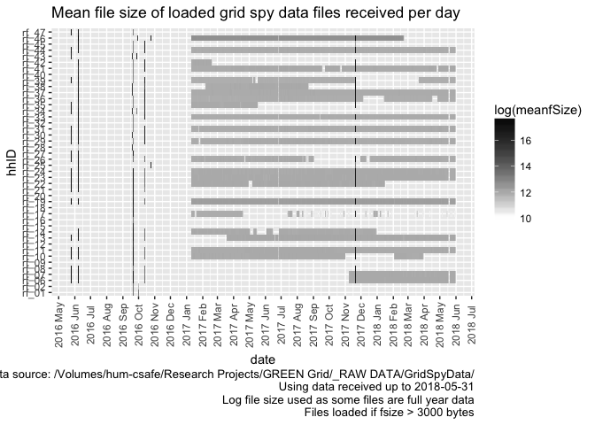
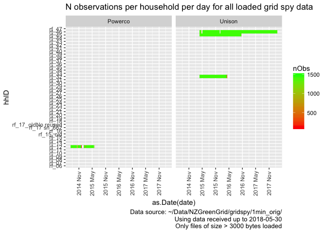

\newpage

# Status


Test run using reduced data from /Users/ben/Data/NZGreenGrid/gridspy/1min_orig/

# Citation

If you wish to use any of the material from this report please cite as:

 * Anderson, B. (2018) Processing, cleaning and saving NZ GREEN Grid project 1 minute electricity power data, University of Otago: Dunedin, NZ.

\newpage

# Introduction

Report circulation:

 * Restricted to: [NZ GREEN Grid](https://www.otago.ac.nz/centre-sustainability/research/energy/otago050285.html) project partners and contractors.

## Purpose

This report is intended to: 

 * load and clean the project electricity power data (Grid Spy)
 * save the cleaned data out as a single file per household
 * produce summary data quality statistics

The resulting cleaned data has _no_ identifying information such as names, addresses, email addresses, telephone numbers and is therefore safe to share across all partners.

The data contains a unique household id which can be used to link it to the NZ GREEN Grid time use diaries and dwelling/appliance surveys. With some additional non-disclosure checks it should also be safe to archive all of these linkable datasets for re-use via the UK [reshare](http://reshare.ukdataservice.ac.uk/) service.

## Requirements:

 * grid spy 1 minute data downloads

## History

Generally tracked via our git.soton [repo](https://git.soton.ac.uk/ba1e12/nzGREENGrid):

 * [history](https://git.soton.ac.uk/ba1e12/nzGREENGrid/commits/master)
 * [issues](https://git.soton.ac.uk/ba1e12/nzGREENGrid/issues)
 
## Support

This work was supported by:

 * The [University of Otago](https://www.otago.ac.nz/)
 * The New Zealand [Ministry of Business, Innovation and Employment (MBIE)](http://www.mbie.govt.nz/)
 * [SPATIALEC](http://www.energy.soton.ac.uk/tag/spatialec/) - a [Marie Skłodowska-Curie Global Fellowship](http://ec.europa.eu/research/mariecurieactions/about-msca/actions/if/index_en.htm) based at the University of Otago’s [Centre for Sustainability](http://www.otago.ac.nz/centre-sustainability/staff/otago673896.html) (2017-2019) & the University of Southampton's Sustainable Energy Research Group (2019-202).
 
This work is (c) 2018 the University of Southampton.

We do not 'support' the code but if you have a problem check the [issues](https://git.soton.ac.uk/ba1e12/nzGREENGrid/issues) on our [repo](https://git.soton.ac.uk/ba1e12/nzGREENGrid) and if it doesn't already exist, open one. We might be able to fix it :-)

# Obtain listing of files

In this section we generate a listing of all 1 minute data files that we have received. If we are running over the complete dataset then we will be using data from:

 * /hum-csafe/Research Projects/GREEN Grid/_RAW DATA/GridSpyData/
 
In this run we are using data from:

 * /Users/ben/Data/NZGreenGrid/gridspy/1min_orig/

If these do not match then this may be a test run.


```
## Loading required package: data.table
```

```
## Loading required package: lubridate
```

```
## 
## Attaching package: 'lubridate'
```

```
## The following objects are masked from 'package:data.table':
## 
##     hour, isoweek, mday, minute, month, quarter, second, wday,
##     week, yday, year
```

```
## The following object is masked from 'package:base':
## 
##     date
```

```
## Loading required package: readr
```

```
## Loading required package: dplyr
```

```
## 
## Attaching package: 'dplyr'
```

```
## The following objects are masked from 'package:lubridate':
## 
##     intersect, setdiff, union
```

```
## The following objects are masked from 'package:data.table':
## 
##     between, first, last
```

```
## The following objects are masked from 'package:stats':
## 
##     filter, lag
```

```
## The following objects are masked from 'package:base':
## 
##     intersect, setdiff, setequal, union
```

```
## Loading required package: progress
```

```
## [1] "Looking for 1 minute data using pattern = *at1.csv$ in /Users/ben/Data/NZGreenGrid/gridspy/1min_orig/ - could take a while..."
## [1] "Looking for data using pattern = *at1.csv$ in /Users/ben/Data/NZGreenGrid/gridspy/1min_orig/ - could take a while..."
## [1] "Found 2,477 files"
## [1] "Processing file list and getting file meta-data. Please be patient)"
## [1] "All files checked"
## [1] "Checking ambiguous date formats in /Users/ben/Data/NZGreenGrid/gridspy/1min_orig/rf_46/12Oct2016-20Nov2017at1.csv"
## [1] "Saving 1 minute data files interim metadata to /Users/ben/Data/NZGreenGrid/gridspy/consolidated/1min/fListCompleteDT_interim.csv"
## [1] "Done"
```

```
## [1] "Overall we have 2477 files from 5 households."
```

Overall we have 2,477 files from 5 households. Of the 2,477,  2,055 (82.96%) were _not_ loaded/checked as their file sizes indicated that they contained no data.

## Date format checks

We now need to check how many of the loaded files have an ambiguous or default date - these could introduce errors.

<table>
<caption>Number of files and min/max date (as char) with given date column names by inferred date format</caption>
 <thead>
  <tr>
   <th style="text-align:left;"> dateColName </th>
   <th style="text-align:left;"> dateFormat </th>
   <th style="text-align:right;"> nFiles </th>
   <th style="text-align:left;"> minDate </th>
   <th style="text-align:left;"> maxDate </th>
  </tr>
 </thead>
<tbody>
  <tr>
   <td style="text-align:left;"> date NZ </td>
   <td style="text-align:left;"> dmy - definite </td>
   <td style="text-align:right;"> 1 </td>
   <td style="text-align:left;"> 27/03/2015 </td>
   <td style="text-align:left;"> 27/03/2015 </td>
  </tr>
  <tr>
   <td style="text-align:left;"> date NZ </td>
   <td style="text-align:left;"> mdy - definite </td>
   <td style="text-align:right;"> 1 </td>
   <td style="text-align:left;"> 5/26/2016 </td>
   <td style="text-align:left;"> 5/26/2016 </td>
  </tr>
  <tr>
   <td style="text-align:left;"> date NZ </td>
   <td style="text-align:left;"> ymd - default (but day/month value &lt;= 12) </td>
   <td style="text-align:right;"> 2 </td>
   <td style="text-align:left;"> 2014-01-06 </td>
   <td style="text-align:left;"> 2014-07-09 </td>
  </tr>
  <tr>
   <td style="text-align:left;"> date NZ </td>
   <td style="text-align:left;"> ymd - definite </td>
   <td style="text-align:right;"> 6 </td>
   <td style="text-align:left;"> 2014-05-24 </td>
   <td style="text-align:left;"> 2016-05-26 </td>
  </tr>
  <tr>
   <td style="text-align:left;"> date UTC </td>
   <td style="text-align:left;"> ambiguous </td>
   <td style="text-align:right;"> 1 </td>
   <td style="text-align:left;"> 11-10-16 </td>
   <td style="text-align:left;"> 11-10-16 </td>
  </tr>
  <tr>
   <td style="text-align:left;"> date UTC </td>
   <td style="text-align:left;"> ymd - default (but day/month value &lt;= 12) </td>
   <td style="text-align:right;"> 162 </td>
   <td style="text-align:left;"> 2016-10-11 </td>
   <td style="text-align:left;"> 2018-02-12 </td>
  </tr>
  <tr>
   <td style="text-align:left;"> date UTC </td>
   <td style="text-align:left;"> ymd - definite </td>
   <td style="text-align:right;"> 249 </td>
   <td style="text-align:left;"> 2015-05-24 </td>
   <td style="text-align:left;"> 2018-02-19 </td>
  </tr>
  <tr>
   <td style="text-align:left;"> unknown - do not load (fsize = 2751) </td>
   <td style="text-align:left;"> NA </td>
   <td style="text-align:right;"> 302 </td>
   <td style="text-align:left;"> NA </td>
   <td style="text-align:left;"> NA </td>
  </tr>
  <tr>
   <td style="text-align:left;"> unknown - do not load (fsize = 43) </td>
   <td style="text-align:left;"> NA </td>
   <td style="text-align:right;"> 1753 </td>
   <td style="text-align:left;"> NA </td>
   <td style="text-align:left;"> NA </td>
  </tr>
</tbody>
</table>

Results to note:

 * There are 1 ambiguous files
 * The non-loaded files only have 2 distinct file sizes, confirming that they are unlikely to contain useful data. 
 
We now inspect the ambiguous and (some of) the default files.

To help with data cleaning the following table lists files that have ambiguous dates.


```r
# list ambigious files
aList <- fListCompleteDT[dateFormat == "ambiguous", 
                         .(file, dateColName, dateExample, dateFormat)]

cap <- paste0("All ", nrow(aList), 
              " files with an ambiguous dateFormat")

knitr::kable(caption = cap, aList)
```

<table>
<caption>All 1 files with an ambiguous dateFormat</caption>
 <thead>
  <tr>
   <th style="text-align:left;"> file </th>
   <th style="text-align:left;"> dateColName </th>
   <th style="text-align:left;"> dateExample </th>
   <th style="text-align:left;"> dateFormat </th>
  </tr>
 </thead>
<tbody>
  <tr>
   <td style="text-align:left;"> rf_46/12Oct2016-20Nov2017at1.csv </td>
   <td style="text-align:left;"> date UTC </td>
   <td style="text-align:left;"> 11-10-16 </td>
   <td style="text-align:left;"> ambiguous </td>
  </tr>
</tbody>
</table>

Check against file names to see what is reasonable and then fix them.


```r
# Setting to dmy seems OK
fListCompleteDT <- fListCompleteDT[dateFormat == "ambiguous", 
                                   dateFormat := "dmy - inferred"]

paste0("Fixed ", nrow(aList), " files with an ambiguous dateFormat")
```

```
## [1] "Fixed 1 files with an ambiguous dateFormat"
```


The following table lists up to 10 of the 'date NZ' files which are set by default - do they look OK to assume the default dateFormat? Compare the file names with the dateExample...


```r
# list default files with NZ time
aList <- fListCompleteDT[dateColName == "date NZ" & dateFormat %like% "default", 
                         .(file, fSize, dateColName, dateExample, dateFormat)]

cap <- paste0("First 10 (max) of ", nrow(aList), 
              " files with dateColName = 'date NZ' and default dateFormat")

knitr::kable(caption = cap, head(aList))
```

<table>
<caption>First 10 (max) of 2 files with dateColName = 'date NZ' and default dateFormat</caption>
 <thead>
  <tr>
   <th style="text-align:left;"> file </th>
   <th style="text-align:right;"> fSize </th>
   <th style="text-align:left;"> dateColName </th>
   <th style="text-align:left;"> dateExample </th>
   <th style="text-align:left;"> dateFormat </th>
  </tr>
 </thead>
<tbody>
  <tr>
   <td style="text-align:left;"> rf_01/1Jan2014-24May2014at1.csv </td>
   <td style="text-align:right;"> 6255737 </td>
   <td style="text-align:left;"> date NZ </td>
   <td style="text-align:left;"> 2014-01-06 </td>
   <td style="text-align:left;"> ymd - default (but day/month value &lt;= 12) </td>
  </tr>
  <tr>
   <td style="text-align:left;"> rf_12/24May2014-24May2015at1.csv </td>
   <td style="text-align:right;"> 21191785 </td>
   <td style="text-align:left;"> date NZ </td>
   <td style="text-align:left;"> 2014-07-09 </td>
   <td style="text-align:left;"> ymd - default (but day/month value &lt;= 12) </td>
  </tr>
</tbody>
</table>

The following table lists up to 10 of the 'date UTC' files which are set by default - do they look OK to assume the default dateFormat? Compare the file names with the dateExample...


```r
# list default files with UTC time
aList <- fListCompleteDT[dateColName == "date UTC" & dateFormat %like% "default", 
                         .(file, fSize, dateColName, dateExample, dateFormat)]

cap <- paste0("First 10 (max) of ", nrow(aList), 
              " files with dateColName = 'date UTC' and default dateFormat")

knitr::kable(caption = cap, head(aList, 10))
```

<table>
<caption>First 10 (max) of 162 files with dateColName = 'date UTC' and default dateFormat</caption>
 <thead>
  <tr>
   <th style="text-align:left;"> file </th>
   <th style="text-align:right;"> fSize </th>
   <th style="text-align:left;"> dateColName </th>
   <th style="text-align:left;"> dateExample </th>
   <th style="text-align:left;"> dateFormat </th>
  </tr>
 </thead>
<tbody>
  <tr>
   <td style="text-align:left;"> rf_45/12Oct2016-20Nov2017at1.csv </td>
   <td style="text-align:right;"> 266415 </td>
   <td style="text-align:left;"> date UTC </td>
   <td style="text-align:left;"> 2016-10-11 </td>
   <td style="text-align:left;"> ymd - default (but day/month value &lt;= 12) </td>
  </tr>
  <tr>
   <td style="text-align:left;"> rf_46/10Apr2017-11Apr2017at1.csv </td>
   <td style="text-align:right;"> 292721 </td>
   <td style="text-align:left;"> date UTC </td>
   <td style="text-align:left;"> 2017-04-09 </td>
   <td style="text-align:left;"> ymd - default (but day/month value &lt;= 12) </td>
  </tr>
  <tr>
   <td style="text-align:left;"> rf_46/10Aug2017-11Aug2017at1.csv </td>
   <td style="text-align:right;"> 292888 </td>
   <td style="text-align:left;"> date UTC </td>
   <td style="text-align:left;"> 2017-08-09 </td>
   <td style="text-align:left;"> ymd - default (but day/month value &lt;= 12) </td>
  </tr>
  <tr>
   <td style="text-align:left;"> rf_46/10Dec2017-11Dec2017at1.csv </td>
   <td style="text-align:right;"> 292823 </td>
   <td style="text-align:left;"> date UTC </td>
   <td style="text-align:left;"> 2017-12-09 </td>
   <td style="text-align:left;"> ymd - default (but day/month value &lt;= 12) </td>
  </tr>
  <tr>
   <td style="text-align:left;"> rf_46/10Feb2017-11Feb2017at1.csv </td>
   <td style="text-align:right;"> 286736 </td>
   <td style="text-align:left;"> date UTC </td>
   <td style="text-align:left;"> 2017-02-09 </td>
   <td style="text-align:left;"> ymd - default (but day/month value &lt;= 12) </td>
  </tr>
  <tr>
   <td style="text-align:left;"> rf_46/10Feb2018-11Feb2018at1.csv </td>
   <td style="text-align:right;"> 299084 </td>
   <td style="text-align:left;"> date UTC </td>
   <td style="text-align:left;"> 2018-02-09 </td>
   <td style="text-align:left;"> ymd - default (but day/month value &lt;= 12) </td>
  </tr>
  <tr>
   <td style="text-align:left;"> rf_46/10Jan2017-11Jan2017at1.csv </td>
   <td style="text-align:right;"> 297659 </td>
   <td style="text-align:left;"> date UTC </td>
   <td style="text-align:left;"> 2017-01-09 </td>
   <td style="text-align:left;"> ymd - default (but day/month value &lt;= 12) </td>
  </tr>
  <tr>
   <td style="text-align:left;"> rf_46/10Jan2018-11Jan2018at1.csv </td>
   <td style="text-align:right;"> 294418 </td>
   <td style="text-align:left;"> date UTC </td>
   <td style="text-align:left;"> 2018-01-09 </td>
   <td style="text-align:left;"> ymd - default (but day/month value &lt;= 12) </td>
  </tr>
  <tr>
   <td style="text-align:left;"> rf_46/10Jul2017-11Jul2017at1.csv </td>
   <td style="text-align:right;"> 291082 </td>
   <td style="text-align:left;"> date UTC </td>
   <td style="text-align:left;"> 2017-07-09 </td>
   <td style="text-align:left;"> ymd - default (but day/month value &lt;= 12) </td>
  </tr>
  <tr>
   <td style="text-align:left;"> rf_46/10Jun2017-11Jun2017at1.csv </td>
   <td style="text-align:right;"> 295979 </td>
   <td style="text-align:left;"> date UTC </td>
   <td style="text-align:left;"> 2017-06-09 </td>
   <td style="text-align:left;"> ymd - default (but day/month value &lt;= 12) </td>
  </tr>
</tbody>
</table>

Check final date formats:

<table>
<caption>Number of files & min/max dates (as char) with given date column names by final imputed date format</caption>
 <thead>
  <tr>
   <th style="text-align:left;"> dateColName </th>
   <th style="text-align:left;"> dateFormat </th>
   <th style="text-align:right;"> nFiles </th>
   <th style="text-align:left;"> minDate </th>
   <th style="text-align:left;"> maxDate </th>
  </tr>
 </thead>
<tbody>
  <tr>
   <td style="text-align:left;"> date NZ </td>
   <td style="text-align:left;"> dmy - definite </td>
   <td style="text-align:right;"> 1 </td>
   <td style="text-align:left;"> 27/03/2015 </td>
   <td style="text-align:left;"> 27/03/2015 </td>
  </tr>
  <tr>
   <td style="text-align:left;"> date NZ </td>
   <td style="text-align:left;"> mdy - definite </td>
   <td style="text-align:right;"> 1 </td>
   <td style="text-align:left;"> 5/26/2016 </td>
   <td style="text-align:left;"> 5/26/2016 </td>
  </tr>
  <tr>
   <td style="text-align:left;"> date NZ </td>
   <td style="text-align:left;"> ymd - default (but day/month value &lt;= 12) </td>
   <td style="text-align:right;"> 2 </td>
   <td style="text-align:left;"> 2014-01-06 </td>
   <td style="text-align:left;"> 2014-07-09 </td>
  </tr>
  <tr>
   <td style="text-align:left;"> date NZ </td>
   <td style="text-align:left;"> ymd - definite </td>
   <td style="text-align:right;"> 6 </td>
   <td style="text-align:left;"> 2014-05-24 </td>
   <td style="text-align:left;"> 2016-05-26 </td>
  </tr>
  <tr>
   <td style="text-align:left;"> date UTC </td>
   <td style="text-align:left;"> dmy - inferred </td>
   <td style="text-align:right;"> 1 </td>
   <td style="text-align:left;"> 11-10-16 </td>
   <td style="text-align:left;"> 11-10-16 </td>
  </tr>
  <tr>
   <td style="text-align:left;"> date UTC </td>
   <td style="text-align:left;"> ymd - default (but day/month value &lt;= 12) </td>
   <td style="text-align:right;"> 162 </td>
   <td style="text-align:left;"> 2016-10-11 </td>
   <td style="text-align:left;"> 2018-02-12 </td>
  </tr>
  <tr>
   <td style="text-align:left;"> date UTC </td>
   <td style="text-align:left;"> ymd - definite </td>
   <td style="text-align:right;"> 249 </td>
   <td style="text-align:left;"> 2015-05-24 </td>
   <td style="text-align:left;"> 2018-02-19 </td>
  </tr>
  <tr>
   <td style="text-align:left;"> unknown - do not load (fsize = 2751) </td>
   <td style="text-align:left;"> NA </td>
   <td style="text-align:right;"> 302 </td>
   <td style="text-align:left;"> NA </td>
   <td style="text-align:left;"> NA </td>
  </tr>
  <tr>
   <td style="text-align:left;"> unknown - do not load (fsize = 43) </td>
   <td style="text-align:left;"> NA </td>
   <td style="text-align:right;"> 1753 </td>
   <td style="text-align:left;"> NA </td>
   <td style="text-align:left;"> NA </td>
  </tr>
</tbody>
</table>

## Data file quality checks

The following chart shows the distribution of these files over time using their sizes. Note that white indicates the presence of small files which may not contain observations.

<!-- -->

```
## Saving 7 x 5 in image
```


The following chart shows the same chart but only for files which we think contain data.

<!-- -->

```
## Saving 7 x 5 in image
```

# Load data files

## Grid Spy metadata

In this section we load metadata from /Users/ben/Syncplicity Folders/Green Grid Project Management Folder/Gridspy/Master list of Gridspy units.xlsx to link to the power data.


```
##    sample  hhID          Adults Teenagers             Children removed
## 1: Unison rf_28               2      <NA>            3(12,8,4)    <NA>
## 2: Unison rf_29               2      <NA>     1 (7 months old)    live
## 3: Unison rf_30               2         0                    0    <NA>
## 4: Unison rf_31 2 (Plus cousin)      <NA>                 <NA>    live
## 5: Unison rf_32               2      <NA> 2 (7 and 4years old)    <NA>
## 6: Unison rf_33               2 1(14yold)            1 (6yold)    live
```

```
##     sample  hhID Adults Teenagers Children  removed
## 1: Powerco rf_12      1      <NA>     <NA> 3/6/1015
## 2: Powerco  <NA>      1      <NA>     <NA>     <NA>
## 3: Powerco rf_25      1      <NA>     <NA>     <NA>
## 4: Powerco  <NA>     NA      <NA>     <NA>     <NA>
## 5: Powerco  <NA>      1      <NA>   1(5mo)     <NA>
## 6: Powerco  <NA>     NA      <NA>     <NA>     <NA>
```

<table>
<caption>Meta data for sample</caption>
 <thead>
  <tr>
   <th style="text-align:left;"> sample </th>
   <th style="text-align:left;"> hhID </th>
   <th style="text-align:left;"> Adults </th>
   <th style="text-align:left;"> Teenagers </th>
   <th style="text-align:left;"> Children </th>
   <th style="text-align:left;"> removed </th>
  </tr>
 </thead>
<tbody>
  <tr>
   <td style="text-align:left;"> Powerco </td>
   <td style="text-align:left;"> rf_06 </td>
   <td style="text-align:left;"> 2 </td>
   <td style="text-align:left;"> NA </td>
   <td style="text-align:left;"> NA </td>
   <td style="text-align:left;"> NA </td>
  </tr>
  <tr>
   <td style="text-align:left;"> Powerco </td>
   <td style="text-align:left;"> rf_07 </td>
   <td style="text-align:left;"> 2 </td>
   <td style="text-align:left;"> NA </td>
   <td style="text-align:left;"> 2 </td>
   <td style="text-align:left;"> NA </td>
  </tr>
  <tr>
   <td style="text-align:left;"> Powerco </td>
   <td style="text-align:left;"> rf_08 </td>
   <td style="text-align:left;"> 2 </td>
   <td style="text-align:left;"> NA </td>
   <td style="text-align:left;"> NA </td>
   <td style="text-align:left;"> NA </td>
  </tr>
  <tr>
   <td style="text-align:left;"> Powerco </td>
   <td style="text-align:left;"> rf_09 </td>
   <td style="text-align:left;"> 2 </td>
   <td style="text-align:left;"> NA </td>
   <td style="text-align:left;"> 1 </td>
   <td style="text-align:left;"> 42171 </td>
  </tr>
  <tr>
   <td style="text-align:left;"> Powerco </td>
   <td style="text-align:left;"> rf_10 </td>
   <td style="text-align:left;"> 2 </td>
   <td style="text-align:left;"> NA </td>
   <td style="text-align:left;"> 1(3yo) </td>
   <td style="text-align:left;"> NA </td>
  </tr>
  <tr>
   <td style="text-align:left;"> Powerco </td>
   <td style="text-align:left;"> rf_11 </td>
   <td style="text-align:left;"> NA </td>
   <td style="text-align:left;"> NA </td>
   <td style="text-align:left;"> NA </td>
   <td style="text-align:left;"> NA </td>
  </tr>
  <tr>
   <td style="text-align:left;"> Powerco </td>
   <td style="text-align:left;"> rf_12 </td>
   <td style="text-align:left;"> 1 </td>
   <td style="text-align:left;"> NA </td>
   <td style="text-align:left;"> NA </td>
   <td style="text-align:left;"> 3/6/1015 </td>
  </tr>
  <tr>
   <td style="text-align:left;"> Powerco </td>
   <td style="text-align:left;"> rf_13 </td>
   <td style="text-align:left;"> 2 </td>
   <td style="text-align:left;"> 1(16yo) </td>
   <td style="text-align:left;"> 1(11) </td>
   <td style="text-align:left;"> NA </td>
  </tr>
  <tr>
   <td style="text-align:left;"> Powerco </td>
   <td style="text-align:left;"> rf_14 </td>
   <td style="text-align:left;"> 1 </td>
   <td style="text-align:left;"> NA </td>
   <td style="text-align:left;"> 1 (11 yo) </td>
   <td style="text-align:left;"> NA </td>
  </tr>
  <tr>
   <td style="text-align:left;"> Powerco </td>
   <td style="text-align:left;"> rf_15 </td>
   <td style="text-align:left;"> NA </td>
   <td style="text-align:left;"> NA </td>
   <td style="text-align:left;"> NA </td>
   <td style="text-align:left;"> 42462 </td>
  </tr>
  <tr>
   <td style="text-align:left;"> Powerco </td>
   <td style="text-align:left;"> rf_15_old </td>
   <td style="text-align:left;"> 1 </td>
   <td style="text-align:left;"> NA </td>
   <td style="text-align:left;"> NA </td>
   <td style="text-align:left;"> 42019 </td>
  </tr>
  <tr>
   <td style="text-align:left;"> Powerco </td>
   <td style="text-align:left;"> rf_16 </td>
   <td style="text-align:left;"> 2 </td>
   <td style="text-align:left;"> NA </td>
   <td style="text-align:left;"> NA </td>
   <td style="text-align:left;"> 42089 </td>
  </tr>
  <tr>
   <td style="text-align:left;"> Powerco </td>
   <td style="text-align:left;"> rf_17 sn_662 </td>
   <td style="text-align:left;"> NA </td>
   <td style="text-align:left;"> NA </td>
   <td style="text-align:left;"> NA </td>
   <td style="text-align:left;"> NA </td>
  </tr>
  <tr>
   <td style="text-align:left;"> Powerco </td>
   <td style="text-align:left;"> rf_17_oldNo reused </td>
   <td style="text-align:left;"> 2 </td>
   <td style="text-align:left;"> 1(13yo) </td>
   <td style="text-align:left;"> 1(11yo) </td>
   <td style="text-align:left;"> 42457 </td>
  </tr>
  <tr>
   <td style="text-align:left;"> Powerco </td>
   <td style="text-align:left;"> rf_18 </td>
   <td style="text-align:left;"> 2 </td>
   <td style="text-align:left;"> NA </td>
   <td style="text-align:left;"> 1(1yo) </td>
   <td style="text-align:left;"> 42532 </td>
  </tr>
  <tr>
   <td style="text-align:left;"> Powerco </td>
   <td style="text-align:left;"> rf_19 </td>
   <td style="text-align:left;"> 1 </td>
   <td style="text-align:left;"> NA </td>
   <td style="text-align:left;"> NA </td>
   <td style="text-align:left;"> NA </td>
  </tr>
  <tr>
   <td style="text-align:left;"> Powerco </td>
   <td style="text-align:left;"> rf_20 </td>
   <td style="text-align:left;"> 2 </td>
   <td style="text-align:left;"> NA </td>
   <td style="text-align:left;"> 2 </td>
   <td style="text-align:left;"> 42166 </td>
  </tr>
  <tr>
   <td style="text-align:left;"> Powerco </td>
   <td style="text-align:left;"> rf_21 </td>
   <td style="text-align:left;"> 2 </td>
   <td style="text-align:left;"> NA </td>
   <td style="text-align:left;"> NA </td>
   <td style="text-align:left;"> 42821 </td>
  </tr>
  <tr>
   <td style="text-align:left;"> Powerco </td>
   <td style="text-align:left;"> rf_22 </td>
   <td style="text-align:left;"> 2 </td>
   <td style="text-align:left;"> NA </td>
   <td style="text-align:left;"> NA </td>
   <td style="text-align:left;"> NA </td>
  </tr>
  <tr>
   <td style="text-align:left;"> Powerco </td>
   <td style="text-align:left;"> rf_23 </td>
   <td style="text-align:left;"> 1 </td>
   <td style="text-align:left;"> NA </td>
   <td style="text-align:left;"> NA </td>
   <td style="text-align:left;"> NA </td>
  </tr>
  <tr>
   <td style="text-align:left;"> Powerco </td>
   <td style="text-align:left;"> rf_24 </td>
   <td style="text-align:left;"> 2 </td>
   <td style="text-align:left;"> NA </td>
   <td style="text-align:left;"> 2 </td>
   <td style="text-align:left;"> NA </td>
  </tr>
  <tr>
   <td style="text-align:left;"> Powerco </td>
   <td style="text-align:left;"> rf_25 </td>
   <td style="text-align:left;"> 1 </td>
   <td style="text-align:left;"> NA </td>
   <td style="text-align:left;"> NA </td>
   <td style="text-align:left;"> NA </td>
  </tr>
  <tr>
   <td style="text-align:left;"> Powerco </td>
   <td style="text-align:left;"> rf_26 </td>
   <td style="text-align:left;"> 2 </td>
   <td style="text-align:left;"> NA </td>
   <td style="text-align:left;"> NA </td>
   <td style="text-align:left;"> NA </td>
  </tr>
  <tr>
   <td style="text-align:left;"> Powerco </td>
   <td style="text-align:left;"> rf_27 </td>
   <td style="text-align:left;"> 2 </td>
   <td style="text-align:left;"> 1 </td>
   <td style="text-align:left;"> 1 </td>
   <td style="text-align:left;"> NA </td>
  </tr>
  <tr>
   <td style="text-align:left;"> Unison </td>
   <td style="text-align:left;"> rf_28 </td>
   <td style="text-align:left;"> 2 </td>
   <td style="text-align:left;"> NA </td>
   <td style="text-align:left;"> 3(12,8,4) </td>
   <td style="text-align:left;"> NA </td>
  </tr>
  <tr>
   <td style="text-align:left;"> Unison </td>
   <td style="text-align:left;"> rf_29 </td>
   <td style="text-align:left;"> 2 </td>
   <td style="text-align:left;"> NA </td>
   <td style="text-align:left;"> 1 (7 months old) </td>
   <td style="text-align:left;"> live </td>
  </tr>
  <tr>
   <td style="text-align:left;"> Unison </td>
   <td style="text-align:left;"> rf_30 </td>
   <td style="text-align:left;"> 2 </td>
   <td style="text-align:left;"> 0 </td>
   <td style="text-align:left;"> 0 </td>
   <td style="text-align:left;"> NA </td>
  </tr>
  <tr>
   <td style="text-align:left;"> Unison </td>
   <td style="text-align:left;"> rf_31 </td>
   <td style="text-align:left;"> 2 (Plus cousin) </td>
   <td style="text-align:left;"> NA </td>
   <td style="text-align:left;"> NA </td>
   <td style="text-align:left;"> live </td>
  </tr>
  <tr>
   <td style="text-align:left;"> Unison </td>
   <td style="text-align:left;"> rf_32 </td>
   <td style="text-align:left;"> 2 </td>
   <td style="text-align:left;"> NA </td>
   <td style="text-align:left;"> 2 (7 and 4years old) </td>
   <td style="text-align:left;"> NA </td>
  </tr>
  <tr>
   <td style="text-align:left;"> Unison </td>
   <td style="text-align:left;"> rf_33 </td>
   <td style="text-align:left;"> 2 </td>
   <td style="text-align:left;"> 1(14yold) </td>
   <td style="text-align:left;"> 1 (6yold) </td>
   <td style="text-align:left;"> live </td>
  </tr>
  <tr>
   <td style="text-align:left;"> Unison </td>
   <td style="text-align:left;"> rf_34 </td>
   <td style="text-align:left;"> 3 </td>
   <td style="text-align:left;"> NA </td>
   <td style="text-align:left;"> NA </td>
   <td style="text-align:left;"> NA </td>
  </tr>
  <tr>
   <td style="text-align:left;"> Unison </td>
   <td style="text-align:left;"> rf_35 </td>
   <td style="text-align:left;"> 2 </td>
   <td style="text-align:left;"> NA </td>
   <td style="text-align:left;"> NA </td>
   <td style="text-align:left;"> 42322 </td>
  </tr>
  <tr>
   <td style="text-align:left;"> Unison </td>
   <td style="text-align:left;"> rf_36 </td>
   <td style="text-align:left;"> 1 </td>
   <td style="text-align:left;"> 2 (14 and 12) </td>
   <td style="text-align:left;"> NA </td>
   <td style="text-align:left;"> live </td>
  </tr>
  <tr>
   <td style="text-align:left;"> Unison </td>
   <td style="text-align:left;"> rf_37 </td>
   <td style="text-align:left;"> 2 </td>
   <td style="text-align:left;"> NA </td>
   <td style="text-align:left;"> NA </td>
   <td style="text-align:left;"> live </td>
  </tr>
  <tr>
   <td style="text-align:left;"> Unison </td>
   <td style="text-align:left;"> rf_38 </td>
   <td style="text-align:left;"> NA </td>
   <td style="text-align:left;"> NA </td>
   <td style="text-align:left;"> NA </td>
   <td style="text-align:left;"> NA </td>
  </tr>
  <tr>
   <td style="text-align:left;"> Unison </td>
   <td style="text-align:left;"> rf_38 </td>
   <td style="text-align:left;"> 2 </td>
   <td style="text-align:left;"> NA </td>
   <td style="text-align:left;"> 2 (&lt;12) </td>
   <td style="text-align:left;"> NA </td>
  </tr>
  <tr>
   <td style="text-align:left;"> Unison </td>
   <td style="text-align:left;"> rf_39 </td>
   <td style="text-align:left;"> 2 </td>
   <td style="text-align:left;"> 1 (16 YO) </td>
   <td style="text-align:left;"> NA </td>
   <td style="text-align:left;"> live </td>
  </tr>
  <tr>
   <td style="text-align:left;"> Unison </td>
   <td style="text-align:left;"> rf_40 </td>
   <td style="text-align:left;"> 2 </td>
   <td style="text-align:left;"> NA </td>
   <td style="text-align:left;"> NA </td>
   <td style="text-align:left;"> 42330 </td>
  </tr>
  <tr>
   <td style="text-align:left;"> Unison </td>
   <td style="text-align:left;"> rf_41 </td>
   <td style="text-align:left;"> 2 </td>
   <td style="text-align:left;"> NA </td>
   <td style="text-align:left;"> 2 (11 and 8) </td>
   <td style="text-align:left;"> live </td>
  </tr>
  <tr>
   <td style="text-align:left;"> Unison </td>
   <td style="text-align:left;"> rf_42 </td>
   <td style="text-align:left;"> 2 </td>
   <td style="text-align:left;"> NA </td>
   <td style="text-align:left;"> 3 (&lt;12 yold, 1 10 YO) </td>
   <td style="text-align:left;"> NA </td>
  </tr>
  <tr>
   <td style="text-align:left;"> Unison </td>
   <td style="text-align:left;"> rf_43 </td>
   <td style="text-align:left;"> 2 </td>
   <td style="text-align:left;"> NA </td>
   <td style="text-align:left;"> NA </td>
   <td style="text-align:left;"> 42296 </td>
  </tr>
  <tr>
   <td style="text-align:left;"> Unison </td>
   <td style="text-align:left;"> rf_44 </td>
   <td style="text-align:left;"> 2 </td>
   <td style="text-align:left;"> NA </td>
   <td style="text-align:left;"> 2 (10 and 7) </td>
   <td style="text-align:left;"> NA </td>
  </tr>
  <tr>
   <td style="text-align:left;"> Unison </td>
   <td style="text-align:left;"> rf_45 </td>
   <td style="text-align:left;"> 2 </td>
   <td style="text-align:left;"> NA </td>
   <td style="text-align:left;"> 3 (&lt;12 years old) </td>
   <td style="text-align:left;"> NA </td>
  </tr>
  <tr>
   <td style="text-align:left;"> Unison </td>
   <td style="text-align:left;"> rf_46 </td>
   <td style="text-align:left;"> 2 </td>
   <td style="text-align:left;"> NA </td>
   <td style="text-align:left;"> 1 (4yold-50%) </td>
   <td style="text-align:left;"> live </td>
  </tr>
  <tr>
   <td style="text-align:left;"> Unison </td>
   <td style="text-align:left;"> rf_47 </td>
   <td style="text-align:left;"> 3 </td>
   <td style="text-align:left;"> 2 </td>
   <td style="text-align:left;"> NA </td>
   <td style="text-align:left;"> NA </td>
  </tr>
</tbody>
</table>

## Grid Spy data

In this section we load the data files that have a file size > 3000 bytes. Things to note:

 * We assume that any files smaller than this value have no observations. This is based on:
     * Manual inspection of several small files
     * The identical (small) file sizes involved
     * _But_ we should probably test the first few lines to double check...
 * We have to deal with quite a lot of duplication some of which has caused the different date formats. See our [repo issues list](https://git.soton.ac.uk/ba1e12/nzGREENGrid/issues?scope=all&utf8=%E2%9C%93&state=all).
 
The following table shows the number of files per household that we willl load.


```r
# check files to load
t <- fListCompleteDT[dateColName %like% "do not load", .(nFiles = .N,
                       meanSize = mean(fSize),
                       minFileDate = min(fMDate),
                       maxFileDate = max(fMDate)), keyby = .(hhID)]

knitr::kable(caption = "Summary of household files to load", t)
```

<table>
<caption>Summary of household files to load</caption>
 <thead>
  <tr>
   <th style="text-align:left;"> hhID </th>
   <th style="text-align:right;"> nFiles </th>
   <th style="text-align:right;"> meanSize </th>
   <th style="text-align:left;"> minFileDate </th>
   <th style="text-align:left;"> maxFileDate </th>
  </tr>
 </thead>
<tbody>
  <tr>
   <td style="text-align:left;"> rf_01 </td>
   <td style="text-align:right;"> 475 </td>
   <td style="text-align:right;"> 1764.718 </td>
   <td style="text-align:left;"> 2017-01-11 </td>
   <td style="text-align:left;"> 2018-04-29 </td>
  </tr>
  <tr>
   <td style="text-align:left;"> rf_12 </td>
   <td style="text-align:right;"> 504 </td>
   <td style="text-align:right;"> 43.000 </td>
   <td style="text-align:left;"> 2017-01-11 </td>
   <td style="text-align:left;"> 2018-05-28 </td>
  </tr>
  <tr>
   <td style="text-align:left;"> rf_32 </td>
   <td style="text-align:right;"> 504 </td>
   <td style="text-align:right;"> 43.000 </td>
   <td style="text-align:left;"> 2017-01-11 </td>
   <td style="text-align:left;"> 2018-05-28 </td>
  </tr>
  <tr>
   <td style="text-align:left;"> rf_45 </td>
   <td style="text-align:right;"> 503 </td>
   <td style="text-align:right;"> 43.000 </td>
   <td style="text-align:left;"> 2017-01-11 </td>
   <td style="text-align:left;"> 2018-05-28 </td>
  </tr>
  <tr>
   <td style="text-align:left;"> rf_46 </td>
   <td style="text-align:right;"> 69 </td>
   <td style="text-align:right;"> 43.000 </td>
   <td style="text-align:left;"> 2018-02-22 </td>
   <td style="text-align:left;"> 2018-05-01 </td>
  </tr>
</tbody>
</table>


# Data quality analysis

Now produce some data quality plots & tables.

## Circuit label checks

The following table shows the number of data files with different circuit labels by household. In theory there should only be one unique list per household and it should be present in every data file. If this is not the case then this implies that:

 * some of the circuit labels for these households may have been changed during the data collection process;
 * some of the circuit labels may have character conversion errors which have changed the labels during the data collection process;
 * at least one file from one household has been saved to a folder containing data from a different household (unfortunately the raw data files do _not_ contain household IDs in the data or the file names which would enable checking/preventative filtering). This will be visible in the table if two households appear to share _exactly_ the same list of circuit labels.

Some or all of these may be true at any given time!

> NB: This table is only legible in the html version of this report because latex does a very bad job of wrapping table cell text. A version is saved in /Users/ben/Data/NZGreenGrid/gridspy/consolidated/1min/circuitLabelCheck.csv for viewing in e.g. xl.

<table>
<caption>Circuit labels list by household</caption>
 <thead>
  <tr>
   <th style="text-align:left;">   </th>
   <th style="text-align:right;"> rf_01 </th>
   <th style="text-align:right;"> rf_12 </th>
   <th style="text-align:right;"> rf_32 </th>
   <th style="text-align:right;"> rf_45 </th>
   <th style="text-align:right;"> rf_46 </th>
  </tr>
 </thead>
<tbody>
  <tr>
   <td style="text-align:left;"> Heat Pump$4160, Hot Water - Controlled$4158, Incomer - Uncontrolled$4157, Kitchen Appliances$4161, Laundry &amp; Garage Fridge$4162, Lighting$4159 </td>
   <td style="text-align:right;"> 0 </td>
   <td style="text-align:right;"> 0 </td>
   <td style="text-align:right;"> 0 </td>
   <td style="text-align:right;"> 4 </td>
   <td style="text-align:right;"> 0 </td>
  </tr>
  <tr>
   <td style="text-align:left;"> Heat Pump$4196, Hot Water - Controlled$4198, Incomer - All$4193, Kitchen Appliances$4195, Laundry$4194, Lighting$4197 </td>
   <td style="text-align:right;"> 0 </td>
   <td style="text-align:right;"> 0 </td>
   <td style="text-align:right;"> 2 </td>
   <td style="text-align:right;"> 0 </td>
   <td style="text-align:right;"> 0 </td>
  </tr>
  <tr>
   <td style="text-align:left;"> Heat Pumps (2x) &amp; Power$4232, Heat Pumps (2x) &amp; Power$4399, Hot Water - Controlled$4231, Hot Water - Controlled$4400, Incomer - Uncontrolled$4230, Incomer - Uncontrolled$4401, Incomer Voltage$4405, Kitchen &amp; Bedrooms$4229, Kitchen &amp; Bedrooms$4402, Laundry &amp; Bedrooms$4228, Laundry &amp; Bedrooms$4403, Lighting$4233, Lighting$4404 </td>
   <td style="text-align:right;"> 0 </td>
   <td style="text-align:right;"> 0 </td>
   <td style="text-align:right;"> 0 </td>
   <td style="text-align:right;"> 0 </td>
   <td style="text-align:right;"> 411 </td>
  </tr>
  <tr>
   <td style="text-align:left;"> Heating$1633, Hot water$1636, Kitchen power$1632, Lights$1635, Mains$1634, Range$1637 </td>
   <td style="text-align:right;"> 3 </td>
   <td style="text-align:right;"> 0 </td>
   <td style="text-align:right;"> 0 </td>
   <td style="text-align:right;"> 0 </td>
   <td style="text-align:right;"> 0 </td>
  </tr>
  <tr>
   <td style="text-align:left;"> Incomer 1 - Hot Water - Cont$2626, Incomer 2 - Uncontrolled$2625, Incomer 3 - Uncontrolled$2627, Kitchen Appliances &amp; Lounge$2630, Laundry, Fridge &amp; Microwave$2628, Oven$2629 </td>
   <td style="text-align:right;"> 0 </td>
   <td style="text-align:right;"> 2 </td>
   <td style="text-align:right;"> 0 </td>
   <td style="text-align:right;"> 0 </td>
   <td style="text-align:right;"> 0 </td>
  </tr>
</tbody>
</table>

Errors are easy to spot in the following plot where a hhID spans 2 or more circuit labels.

<!-- -->

```
## Saving 7 x 8 in image
```

The following table provides more detail to aid error checking. Check for:

 * 2+ adjacent rows which have exactly the same circuit labels but different hh_ids. This implies some data from one household has been saved in the wrong folder;
 * 2+ adjacent rows which have different circuit labels but identical hh_ids. This could imply the same thing but is more likely to be errors/changes to the circuit labelling. 
 
If the above plot and this table flag a lot of errors then some re-naming of the circuit labels (column names) may be necessary. 

> NB: As before, the table is only legible in the html version of this report because latex does a very bad job of wrapping table cell text. A version is saved in /Users/ben/Data/NZGreenGrid/gridspy/consolidated/1min/circuitLabelMetaDataCheckTable.csv for viewing in e.g. xl.

<table>
<caption>Circuit labels by household with addiitonal meta-data</caption>
 <thead>
  <tr>
   <th style="text-align:left;"> circuitLabels </th>
   <th style="text-align:left;"> hhID </th>
   <th style="text-align:left;"> sample </th>
   <th style="text-align:right;"> nFiles </th>
   <th style="text-align:left;"> minObsDate </th>
   <th style="text-align:left;"> maxObsDate </th>
   <th style="text-align:left;"> minFileDate </th>
   <th style="text-align:left;"> maxFileDate </th>
   <th style="text-align:right;"> nObs </th>
  </tr>
 </thead>
<tbody>
  <tr>
   <td style="text-align:left;"> Heat Pump$4160, Hot Water - Controlled$4158, Incomer - Uncontrolled$4157, Kitchen Appliances$4161, Laundry &amp; Garage Fridge$4162, Lighting$4159 </td>
   <td style="text-align:left;"> rf_45 </td>
   <td style="text-align:left;"> Unison </td>
   <td style="text-align:right;"> 4 </td>
   <td style="text-align:left;"> 2015-03-24 </td>
   <td style="text-align:left;"> 2016-10-15 </td>
   <td style="text-align:left;"> 2016-06-08 </td>
   <td style="text-align:left;"> 2017-11-21 </td>
   <td style="text-align:right;"> 821472 </td>
  </tr>
  <tr>
   <td style="text-align:left;"> Heat Pump$4196, Hot Water - Controlled$4198, Incomer - All$4193, Kitchen Appliances$4195, Laundry$4194, Lighting$4197 </td>
   <td style="text-align:left;"> rf_32 </td>
   <td style="text-align:left;"> Unison </td>
   <td style="text-align:right;"> 2 </td>
   <td style="text-align:left;"> 2015-03-25 </td>
   <td style="text-align:left;"> 2016-04-05 </td>
   <td style="text-align:left;"> 2016-06-08 </td>
   <td style="text-align:left;"> 2016-09-20 </td>
   <td style="text-align:right;"> 542484 </td>
  </tr>
  <tr>
   <td style="text-align:left;"> Heat Pumps (2x) &amp; Power$4232, Heat Pumps (2x) &amp; Power$4399, Hot Water - Controlled$4231, Hot Water - Controlled$4400, Incomer - Uncontrolled$4230, Incomer - Uncontrolled$4401, Incomer Voltage$4405, Kitchen &amp; Bedrooms$4229, Kitchen &amp; Bedrooms$4402, Laundry &amp; Bedrooms$4228, Laundry &amp; Bedrooms$4403, Lighting$4233, Lighting$4404 </td>
   <td style="text-align:left;"> rf_46 </td>
   <td style="text-align:left;"> Unison </td>
   <td style="text-align:right;"> 411 </td>
   <td style="text-align:left;"> 2015-03-26 </td>
   <td style="text-align:left;"> 2018-02-19 </td>
   <td style="text-align:left;"> 2016-06-08 </td>
   <td style="text-align:left;"> 2018-02-21 </td>
   <td style="text-align:right;"> 2529107 </td>
  </tr>
  <tr>
   <td style="text-align:left;"> Heating$1633, Hot water$1636, Kitchen power$1632, Lights$1635, Mains$1634, Range$1637 </td>
   <td style="text-align:left;"> rf_01 </td>
   <td style="text-align:left;"> NA </td>
   <td style="text-align:right;"> 3 </td>
   <td style="text-align:left;"> 2014-01-05 </td>
   <td style="text-align:left;"> 2015-10-20 </td>
   <td style="text-align:left;"> 2016-09-20 </td>
   <td style="text-align:left;"> 2016-09-30 </td>
   <td style="text-align:right;"> 855836 </td>
  </tr>
  <tr>
   <td style="text-align:left;"> Incomer 1 - Hot Water - Cont$2626, Incomer 2 - Uncontrolled$2625, Incomer 3 - Uncontrolled$2627, Kitchen Appliances &amp; Lounge$2630, Laundry, Fridge &amp; Microwave$2628, Oven$2629 </td>
   <td style="text-align:left;"> rf_12 </td>
   <td style="text-align:left;"> Powerco </td>
   <td style="text-align:right;"> 2 </td>
   <td style="text-align:left;"> 2014-07-08 </td>
   <td style="text-align:left;"> 2015-06-02 </td>
   <td style="text-align:left;"> 2016-09-21 </td>
   <td style="text-align:left;"> 2016-09-21 </td>
   <td style="text-align:right;"> 410063 </td>
  </tr>
</tbody>
</table>

Things to note:

 * rf_25 has an aditional unexpected "Incomer 1 - Uncontrolled$2757" circuit in some files but it's value is always NA so we have not 'corrected' this.
 
## Observations

The following plots show the number of observations per day per household. In theory we should not see:

 * dates before 2014 or in to the future. These may indicate:
    * date conversion errors;
 * more than 1440 observations per day. These may indicate:
    * duplicate time stamps - i.e. they have the same time stamps but different power (W) values or different circuit labels;
    * observations from files that are in the 'wrong' rf_XX folder and so are included in the 'wrong' household as 'duplicate' time stamps.

If present both of the latter may have been implied by the table above and would have evaded the de-duplication filter which simply checks each complete row against all others within it's consolidated household dataset (a _within household absolute duplicate_ check).


```
## Warning: Removed 41 rows containing missing values (geom_tile).
```

<!-- -->

```
## Saving 7 x 5 in image
```

```
## Warning: Removed 41 rows containing missing values (geom_tile).
```


```
## Warning: Removed 41 rows containing missing values (geom_point).
```

<!-- -->

```
## Saving 7 x 5 in image
```

```
## Warning: Removed 41 rows containing missing values (geom_point).
```

The following table shows the min/max observations per day and min/max dates for each household. As above, we should not see:

 * dates before 2014 or in to the future (indicates date conversion errors)
 * more than 1440 observations per day (indicates potentially duplicate observations)
 * non-integer counts of circuits as it suggests some column errors
 
 We should also not see NA in any row (indicates date conversion errors). 
 
 If we do see any of these then we still have data cleaning work to do!

<table>
<caption>Summary observation stats by hhID (sorted by date last heard from)</caption>
 <thead>
  <tr>
   <th style="text-align:left;"> hhID </th>
   <th style="text-align:left;"> sample </th>
   <th style="text-align:right;"> minObs </th>
   <th style="text-align:right;"> maxObs </th>
   <th style="text-align:right;"> meanNDataColumns </th>
   <th style="text-align:left;"> minDate </th>
   <th style="text-align:left;"> maxDate </th>
  </tr>
 </thead>
<tbody>
  <tr>
   <td style="text-align:left;"> rf_12 </td>
   <td style="text-align:left;"> Powerco </td>
   <td style="text-align:right;"> 85 </td>
   <td style="text-align:right;"> 1500 </td>
   <td style="text-align:right;"> 6 </td>
   <td style="text-align:left;"> 2014-07-08 </td>
   <td style="text-align:left;"> 2015-06-02 </td>
  </tr>
  <tr>
   <td style="text-align:left;"> rf_32 </td>
   <td style="text-align:left;"> Unison </td>
   <td style="text-align:right;"> 325 </td>
   <td style="text-align:right;"> 1500 </td>
   <td style="text-align:right;"> 6 </td>
   <td style="text-align:left;"> 2015-03-25 </td>
   <td style="text-align:left;"> 2016-04-05 </td>
  </tr>
  <tr>
   <td style="text-align:left;"> rf_45 </td>
   <td style="text-align:left;"> Unison </td>
   <td style="text-align:right;"> 69 </td>
   <td style="text-align:right;"> 1499 </td>
   <td style="text-align:right;"> 6 </td>
   <td style="text-align:left;"> 2015-03-24 </td>
   <td style="text-align:left;"> 2016-10-15 </td>
  </tr>
  <tr>
   <td style="text-align:left;"> rf_46 </td>
   <td style="text-align:left;"> Unison </td>
   <td style="text-align:right;"> 305 </td>
   <td style="text-align:right;"> 1500 </td>
   <td style="text-align:right;"> 13 </td>
   <td style="text-align:left;"> 2015-03-26 </td>
   <td style="text-align:left;"> 2018-02-19 </td>
  </tr>
  <tr>
   <td style="text-align:left;"> rf_06 </td>
   <td style="text-align:left;"> Powerco </td>
   <td style="text-align:right;"> NA </td>
   <td style="text-align:right;"> NA </td>
   <td style="text-align:right;"> NA </td>
   <td style="text-align:left;"> NA </td>
   <td style="text-align:left;"> NA </td>
  </tr>
  <tr>
   <td style="text-align:left;"> rf_07 </td>
   <td style="text-align:left;"> Powerco </td>
   <td style="text-align:right;"> NA </td>
   <td style="text-align:right;"> NA </td>
   <td style="text-align:right;"> NA </td>
   <td style="text-align:left;"> NA </td>
   <td style="text-align:left;"> NA </td>
  </tr>
  <tr>
   <td style="text-align:left;"> rf_08 </td>
   <td style="text-align:left;"> Powerco </td>
   <td style="text-align:right;"> NA </td>
   <td style="text-align:right;"> NA </td>
   <td style="text-align:right;"> NA </td>
   <td style="text-align:left;"> NA </td>
   <td style="text-align:left;"> NA </td>
  </tr>
  <tr>
   <td style="text-align:left;"> rf_09 </td>
   <td style="text-align:left;"> Powerco </td>
   <td style="text-align:right;"> NA </td>
   <td style="text-align:right;"> NA </td>
   <td style="text-align:right;"> NA </td>
   <td style="text-align:left;"> NA </td>
   <td style="text-align:left;"> NA </td>
  </tr>
  <tr>
   <td style="text-align:left;"> rf_10 </td>
   <td style="text-align:left;"> Powerco </td>
   <td style="text-align:right;"> NA </td>
   <td style="text-align:right;"> NA </td>
   <td style="text-align:right;"> NA </td>
   <td style="text-align:left;"> NA </td>
   <td style="text-align:left;"> NA </td>
  </tr>
  <tr>
   <td style="text-align:left;"> rf_11 </td>
   <td style="text-align:left;"> Powerco </td>
   <td style="text-align:right;"> NA </td>
   <td style="text-align:right;"> NA </td>
   <td style="text-align:right;"> NA </td>
   <td style="text-align:left;"> NA </td>
   <td style="text-align:left;"> NA </td>
  </tr>
  <tr>
   <td style="text-align:left;"> rf_13 </td>
   <td style="text-align:left;"> Powerco </td>
   <td style="text-align:right;"> NA </td>
   <td style="text-align:right;"> NA </td>
   <td style="text-align:right;"> NA </td>
   <td style="text-align:left;"> NA </td>
   <td style="text-align:left;"> NA </td>
  </tr>
  <tr>
   <td style="text-align:left;"> rf_14 </td>
   <td style="text-align:left;"> Powerco </td>
   <td style="text-align:right;"> NA </td>
   <td style="text-align:right;"> NA </td>
   <td style="text-align:right;"> NA </td>
   <td style="text-align:left;"> NA </td>
   <td style="text-align:left;"> NA </td>
  </tr>
  <tr>
   <td style="text-align:left;"> rf_15 </td>
   <td style="text-align:left;"> Powerco </td>
   <td style="text-align:right;"> NA </td>
   <td style="text-align:right;"> NA </td>
   <td style="text-align:right;"> NA </td>
   <td style="text-align:left;"> NA </td>
   <td style="text-align:left;"> NA </td>
  </tr>
  <tr>
   <td style="text-align:left;"> rf_15_old </td>
   <td style="text-align:left;"> Powerco </td>
   <td style="text-align:right;"> NA </td>
   <td style="text-align:right;"> NA </td>
   <td style="text-align:right;"> NA </td>
   <td style="text-align:left;"> NA </td>
   <td style="text-align:left;"> NA </td>
  </tr>
  <tr>
   <td style="text-align:left;"> rf_16 </td>
   <td style="text-align:left;"> Powerco </td>
   <td style="text-align:right;"> NA </td>
   <td style="text-align:right;"> NA </td>
   <td style="text-align:right;"> NA </td>
   <td style="text-align:left;"> NA </td>
   <td style="text-align:left;"> NA </td>
  </tr>
  <tr>
   <td style="text-align:left;"> rf_17 sn_662 </td>
   <td style="text-align:left;"> Powerco </td>
   <td style="text-align:right;"> NA </td>
   <td style="text-align:right;"> NA </td>
   <td style="text-align:right;"> NA </td>
   <td style="text-align:left;"> NA </td>
   <td style="text-align:left;"> NA </td>
  </tr>
  <tr>
   <td style="text-align:left;"> rf_17_oldNo reused </td>
   <td style="text-align:left;"> Powerco </td>
   <td style="text-align:right;"> NA </td>
   <td style="text-align:right;"> NA </td>
   <td style="text-align:right;"> NA </td>
   <td style="text-align:left;"> NA </td>
   <td style="text-align:left;"> NA </td>
  </tr>
  <tr>
   <td style="text-align:left;"> rf_18 </td>
   <td style="text-align:left;"> Powerco </td>
   <td style="text-align:right;"> NA </td>
   <td style="text-align:right;"> NA </td>
   <td style="text-align:right;"> NA </td>
   <td style="text-align:left;"> NA </td>
   <td style="text-align:left;"> NA </td>
  </tr>
  <tr>
   <td style="text-align:left;"> rf_19 </td>
   <td style="text-align:left;"> Powerco </td>
   <td style="text-align:right;"> NA </td>
   <td style="text-align:right;"> NA </td>
   <td style="text-align:right;"> NA </td>
   <td style="text-align:left;"> NA </td>
   <td style="text-align:left;"> NA </td>
  </tr>
  <tr>
   <td style="text-align:left;"> rf_20 </td>
   <td style="text-align:left;"> Powerco </td>
   <td style="text-align:right;"> NA </td>
   <td style="text-align:right;"> NA </td>
   <td style="text-align:right;"> NA </td>
   <td style="text-align:left;"> NA </td>
   <td style="text-align:left;"> NA </td>
  </tr>
  <tr>
   <td style="text-align:left;"> rf_21 </td>
   <td style="text-align:left;"> Powerco </td>
   <td style="text-align:right;"> NA </td>
   <td style="text-align:right;"> NA </td>
   <td style="text-align:right;"> NA </td>
   <td style="text-align:left;"> NA </td>
   <td style="text-align:left;"> NA </td>
  </tr>
  <tr>
   <td style="text-align:left;"> rf_22 </td>
   <td style="text-align:left;"> Powerco </td>
   <td style="text-align:right;"> NA </td>
   <td style="text-align:right;"> NA </td>
   <td style="text-align:right;"> NA </td>
   <td style="text-align:left;"> NA </td>
   <td style="text-align:left;"> NA </td>
  </tr>
  <tr>
   <td style="text-align:left;"> rf_23 </td>
   <td style="text-align:left;"> Powerco </td>
   <td style="text-align:right;"> NA </td>
   <td style="text-align:right;"> NA </td>
   <td style="text-align:right;"> NA </td>
   <td style="text-align:left;"> NA </td>
   <td style="text-align:left;"> NA </td>
  </tr>
  <tr>
   <td style="text-align:left;"> rf_24 </td>
   <td style="text-align:left;"> Powerco </td>
   <td style="text-align:right;"> NA </td>
   <td style="text-align:right;"> NA </td>
   <td style="text-align:right;"> NA </td>
   <td style="text-align:left;"> NA </td>
   <td style="text-align:left;"> NA </td>
  </tr>
  <tr>
   <td style="text-align:left;"> rf_25 </td>
   <td style="text-align:left;"> Powerco </td>
   <td style="text-align:right;"> NA </td>
   <td style="text-align:right;"> NA </td>
   <td style="text-align:right;"> NA </td>
   <td style="text-align:left;"> NA </td>
   <td style="text-align:left;"> NA </td>
  </tr>
  <tr>
   <td style="text-align:left;"> rf_26 </td>
   <td style="text-align:left;"> Powerco </td>
   <td style="text-align:right;"> NA </td>
   <td style="text-align:right;"> NA </td>
   <td style="text-align:right;"> NA </td>
   <td style="text-align:left;"> NA </td>
   <td style="text-align:left;"> NA </td>
  </tr>
  <tr>
   <td style="text-align:left;"> rf_27 </td>
   <td style="text-align:left;"> Powerco </td>
   <td style="text-align:right;"> NA </td>
   <td style="text-align:right;"> NA </td>
   <td style="text-align:right;"> NA </td>
   <td style="text-align:left;"> NA </td>
   <td style="text-align:left;"> NA </td>
  </tr>
  <tr>
   <td style="text-align:left;"> rf_28 </td>
   <td style="text-align:left;"> Unison </td>
   <td style="text-align:right;"> NA </td>
   <td style="text-align:right;"> NA </td>
   <td style="text-align:right;"> NA </td>
   <td style="text-align:left;"> NA </td>
   <td style="text-align:left;"> NA </td>
  </tr>
  <tr>
   <td style="text-align:left;"> rf_29 </td>
   <td style="text-align:left;"> Unison </td>
   <td style="text-align:right;"> NA </td>
   <td style="text-align:right;"> NA </td>
   <td style="text-align:right;"> NA </td>
   <td style="text-align:left;"> NA </td>
   <td style="text-align:left;"> NA </td>
  </tr>
  <tr>
   <td style="text-align:left;"> rf_30 </td>
   <td style="text-align:left;"> Unison </td>
   <td style="text-align:right;"> NA </td>
   <td style="text-align:right;"> NA </td>
   <td style="text-align:right;"> NA </td>
   <td style="text-align:left;"> NA </td>
   <td style="text-align:left;"> NA </td>
  </tr>
  <tr>
   <td style="text-align:left;"> rf_31 </td>
   <td style="text-align:left;"> Unison </td>
   <td style="text-align:right;"> NA </td>
   <td style="text-align:right;"> NA </td>
   <td style="text-align:right;"> NA </td>
   <td style="text-align:left;"> NA </td>
   <td style="text-align:left;"> NA </td>
  </tr>
  <tr>
   <td style="text-align:left;"> rf_33 </td>
   <td style="text-align:left;"> Unison </td>
   <td style="text-align:right;"> NA </td>
   <td style="text-align:right;"> NA </td>
   <td style="text-align:right;"> NA </td>
   <td style="text-align:left;"> NA </td>
   <td style="text-align:left;"> NA </td>
  </tr>
  <tr>
   <td style="text-align:left;"> rf_34 </td>
   <td style="text-align:left;"> Unison </td>
   <td style="text-align:right;"> NA </td>
   <td style="text-align:right;"> NA </td>
   <td style="text-align:right;"> NA </td>
   <td style="text-align:left;"> NA </td>
   <td style="text-align:left;"> NA </td>
  </tr>
  <tr>
   <td style="text-align:left;"> rf_35 </td>
   <td style="text-align:left;"> Unison </td>
   <td style="text-align:right;"> NA </td>
   <td style="text-align:right;"> NA </td>
   <td style="text-align:right;"> NA </td>
   <td style="text-align:left;"> NA </td>
   <td style="text-align:left;"> NA </td>
  </tr>
  <tr>
   <td style="text-align:left;"> rf_36 </td>
   <td style="text-align:left;"> Unison </td>
   <td style="text-align:right;"> NA </td>
   <td style="text-align:right;"> NA </td>
   <td style="text-align:right;"> NA </td>
   <td style="text-align:left;"> NA </td>
   <td style="text-align:left;"> NA </td>
  </tr>
  <tr>
   <td style="text-align:left;"> rf_37 </td>
   <td style="text-align:left;"> Unison </td>
   <td style="text-align:right;"> NA </td>
   <td style="text-align:right;"> NA </td>
   <td style="text-align:right;"> NA </td>
   <td style="text-align:left;"> NA </td>
   <td style="text-align:left;"> NA </td>
  </tr>
  <tr>
   <td style="text-align:left;"> rf_38 </td>
   <td style="text-align:left;"> Unison </td>
   <td style="text-align:right;"> NA </td>
   <td style="text-align:right;"> NA </td>
   <td style="text-align:right;"> NA </td>
   <td style="text-align:left;"> NA </td>
   <td style="text-align:left;"> NA </td>
  </tr>
  <tr>
   <td style="text-align:left;"> rf_39 </td>
   <td style="text-align:left;"> Unison </td>
   <td style="text-align:right;"> NA </td>
   <td style="text-align:right;"> NA </td>
   <td style="text-align:right;"> NA </td>
   <td style="text-align:left;"> NA </td>
   <td style="text-align:left;"> NA </td>
  </tr>
  <tr>
   <td style="text-align:left;"> rf_40 </td>
   <td style="text-align:left;"> Unison </td>
   <td style="text-align:right;"> NA </td>
   <td style="text-align:right;"> NA </td>
   <td style="text-align:right;"> NA </td>
   <td style="text-align:left;"> NA </td>
   <td style="text-align:left;"> NA </td>
  </tr>
  <tr>
   <td style="text-align:left;"> rf_41 </td>
   <td style="text-align:left;"> Unison </td>
   <td style="text-align:right;"> NA </td>
   <td style="text-align:right;"> NA </td>
   <td style="text-align:right;"> NA </td>
   <td style="text-align:left;"> NA </td>
   <td style="text-align:left;"> NA </td>
  </tr>
  <tr>
   <td style="text-align:left;"> rf_42 </td>
   <td style="text-align:left;"> Unison </td>
   <td style="text-align:right;"> NA </td>
   <td style="text-align:right;"> NA </td>
   <td style="text-align:right;"> NA </td>
   <td style="text-align:left;"> NA </td>
   <td style="text-align:left;"> NA </td>
  </tr>
  <tr>
   <td style="text-align:left;"> rf_43 </td>
   <td style="text-align:left;"> Unison </td>
   <td style="text-align:right;"> NA </td>
   <td style="text-align:right;"> NA </td>
   <td style="text-align:right;"> NA </td>
   <td style="text-align:left;"> NA </td>
   <td style="text-align:left;"> NA </td>
  </tr>
  <tr>
   <td style="text-align:left;"> rf_44 </td>
   <td style="text-align:left;"> Unison </td>
   <td style="text-align:right;"> NA </td>
   <td style="text-align:right;"> NA </td>
   <td style="text-align:right;"> NA </td>
   <td style="text-align:left;"> NA </td>
   <td style="text-align:left;"> NA </td>
  </tr>
  <tr>
   <td style="text-align:left;"> rf_47 </td>
   <td style="text-align:left;"> Unison </td>
   <td style="text-align:right;"> NA </td>
   <td style="text-align:right;"> NA </td>
   <td style="text-align:right;"> NA </td>
   <td style="text-align:left;"> NA </td>
   <td style="text-align:left;"> NA </td>
  </tr>
</tbody>
</table>


Finally we show the total number of households which we think are still sending data.


```
## Warning: Removed 2 rows containing missing values (position_stack).
```

<!-- -->

```
## Saving 7 x 5 in image
```

```
## Warning: Removed 2 rows containing missing values (position_stack).
```

# Runtime


Analysis completed in 392.99 seconds ( 6.55 minutes) using [knitr](https://cran.r-project.org/package=knitr) in [RStudio](http://www.rstudio.com) with R version 3.5.0 (2018-04-23) running on x86_64-apple-darwin15.6.0.

# R environment

R packages used:

 * base R - for the basics [@baseR]
 * data.table - for fast (big) data handling [@data.table]
 * lubridate - date manipulation [@lubridate]
 * ggplot2 - for slick graphics [@ggplot2]
 * readr - for csv reading/writing [@readr]
 * dplyr - for select and contains [@dplyr]
 * progress - for progress bars [@progress]
 * knitr - to create this document & neat tables [@knitr]
 * kableExtra - for extra neat tables [@kableExtra]
 * nzGREENGrid - for local NZ GREEN Grid project utilities

Session info:


```
## R version 3.5.0 (2018-04-23)
## Platform: x86_64-apple-darwin15.6.0 (64-bit)
## Running under: macOS High Sierra 10.13.4
## 
## Matrix products: default
## BLAS: /Library/Frameworks/R.framework/Versions/3.5/Resources/lib/libRblas.0.dylib
## LAPACK: /Library/Frameworks/R.framework/Versions/3.5/Resources/lib/libRlapack.dylib
## 
## locale:
## [1] en_GB.UTF-8/en_GB.UTF-8/en_GB.UTF-8/C/en_GB.UTF-8/en_GB.UTF-8
## 
## attached base packages:
## [1] stats     graphics  grDevices utils     datasets  methods   base     
## 
## other attached packages:
## [1] progress_1.1.2    dplyr_0.7.5       readr_1.1.1       lubridate_1.7.4  
## [5] data.table_1.11.2 kableExtra_0.9.0  knitr_1.20        ggplot2_2.2.1    
## [9] nzGREENGrid_0.1.0
## 
## loaded via a namespace (and not attached):
##  [1] Rcpp_0.12.17      cellranger_1.1.0  highr_0.6        
##  [4] bindr_0.1.1       pillar_1.2.2      compiler_3.5.0   
##  [7] plyr_1.8.4        prettyunits_1.0.2 tools_3.5.0      
## [10] digest_0.6.15     evaluate_0.10.1   tibble_1.4.2     
## [13] gtable_0.2.0      viridisLite_0.3.0 pkgconfig_2.0.1  
## [16] rlang_0.2.0       rstudioapi_0.7    yaml_2.1.19      
## [19] bindrcpp_0.2.2    stringr_1.3.1     httr_1.3.1       
## [22] xml2_1.2.0        hms_0.4.2         tidyselect_0.2.4 
## [25] rprojroot_1.3-2   grid_3.5.0        glue_1.2.0       
## [28] R6_2.2.2          readxl_1.1.0      rmarkdown_1.9    
## [31] reshape2_1.4.3    purrr_0.2.4       magrittr_1.5     
## [34] backports_1.1.2   scales_0.5.0      htmltools_0.3.6  
## [37] assertthat_0.2.0  rvest_0.3.2       colorspace_1.3-2 
## [40] labeling_0.3      stringi_1.2.2     lazyeval_0.2.1   
## [43] munsell_0.4.3
```

# References
