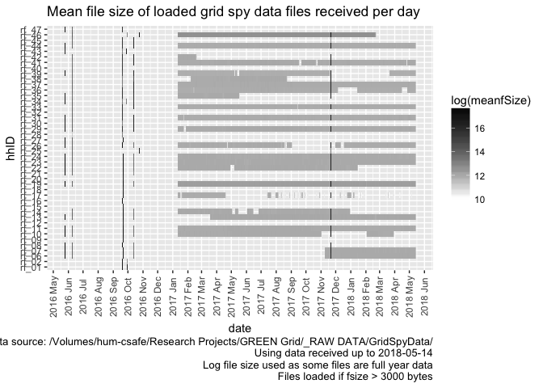
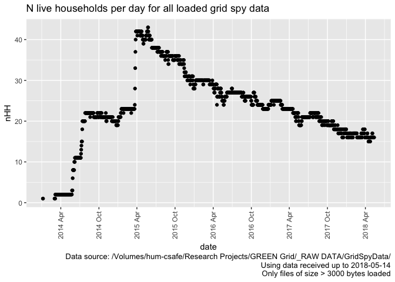

\newpage

# Citation

If you wish to use any of the material from this report please cite as:

 * Anderson, B. (2018) Processing, cleaning and saving NZ GREEN Grid project 1 minute electricity power data, University of Otago: Dunedin, NZ.

\newpage

# Introduction

Report circulation:

 * Restricted to: [NZ GREEn Grid](https://www.otago.ac.nz/centre-sustainability/research/energy/otago050285.html) project partners and contractors.

## Purpose

This report is intended to: 

 * load and clean the project electricity power data (Grid Spy)
 * save the cleaned data out as a single file per household
 * produce summary data quality statistics

## Requirements:

 * grid spy 1 minute data downloads

## History

Generally tracked via our git.soton [repo](https://git.soton.ac.uk/ba1e12/nzGREENGrid):

 * [history](https://git.soton.ac.uk/ba1e12/nzGREENGrid/commits/master)
 * [issues](https://git.soton.ac.uk/ba1e12/nzGREENGrid/issues)
 
## Support

This work was supported by:

 * The [University of Otago](https://www.otago.ac.nz/)
 * The New Zealand [Ministry of Business, Innovation and Employment (MBIE)](http://www.mbie.govt.nz/)
 * [SPATIALEC](http://www.energy.soton.ac.uk/tag/spatialec/) - a [Marie Skłodowska-Curie Global Fellowship](http://ec.europa.eu/research/mariecurieactions/about-msca/actions/if/index_en.htm) based at the University of Otago’s [Centre for Sustainability](http://www.otago.ac.nz/centre-sustainability/staff/otago673896.html) (2017-2019) & the University of Southampton's Sustainable Energy Research Group (2019-202).
 
This work is (c) 2018 the University of Southampton.

We do not 'support' the code but if you have a problem check the [issues](https://git.soton.ac.uk/ba1e12/nzGREENGrid/issues) on our [repo](https://git.soton.ac.uk/ba1e12/nzGREENGrid) and if it doesn't already exist, open one. We might be able to fix it :-)

# Obtain listing of files

In this section we generate a listing of all 1 minute data files that we have received. If we are running over the complete dataset then we will be using data from:

 * /hum-csafe/Research Projects/GREEN Grid/_RAW DATA/GridSpyData/
 
In this run we are using data from:

 * /Volumes/hum-csafe/Research Projects/GREEN Grid/_RAW DATA/GridSpyData/

If these do not match then this may be a test run.


```r
print(paste0("Looking for 1 minute data using pattern = ", pattern1Min, " in ", fpath, " - could take a while..."))
```

```
## [1] "Looking for 1 minute data using pattern = *at1.csv$ in /Volumes/hum-csafe/Research Projects/GREEN Grid/_RAW DATA/GridSpyData/ - could take a while..."
```

```r
system.time(fListCompleteDT <- data.table::as.data.table(list.files(path = fpath, pattern = pattern1Min, # use the default pattern to filter e.g. 1m from 30s files
                                            recursive = TRUE)))
```

```
##    user  system elapsed 
##   0.735   5.756 607.496
```

```r
nFiles <- nrow(fListCompleteDT)
print(paste0("Found ", tidyNum(nFiles), " files"))
```

```
## [1] "Found 21,440 files"
```


```r
if(nrow(fListCompleteDT) == 0){
  stop(paste0("No matching data files found, please check your path (", fpath, ") or your search pattern (", pattern1Min, ")"))
} else {
  print(paste0("Processing file list and getting file meta-data (please be patient)"))
  fListCompleteDT <- fListCompleteDT[, c("hhID","fileName") := data.table::tstrsplit(V1, "/")]
  fListCompleteDT <- fListCompleteDT[, fullPath := paste0(fpath, hhID,"/",fileName)]
  loopCount <- 1
  # now loop over the files and collect metadata
  for(f in fListCompleteDT[,fullPath]){
    rf <- path.expand(f) # just in case of ~ etc
    fsize <- file.size(rf)
    fmtime <- lubridate::ymd_hms(file.mtime(rf), tz = "Pacific/Auckland") # requires lubridate
    fListCompleteDT <- fListCompleteDT[fullPath == f, fSize := fsize]
    fListCompleteDT <- fListCompleteDT[fullPath == f, fMTime := fmtime]
    fListCompleteDT <- fListCompleteDT[fullPath == f, fMDate := as.Date(fmtime)]
    fListCompleteDT <- fListCompleteDT[fullPath == f, dateColName := paste0("unknown - file not loaded (fsize = ", fsize, ")")]
    # only try to read files where we think there might be data
    loadThis <- ifelse(fsize > dataThreshold, "Loading (fsize > threshold)", "Skipping (fsize < threshold)")
    if(fullFb){print(paste0("Checking file ", loopCount, " of ", nFiles ,
                            " (", round(100*(loopCount/nFiles),2), "% checked): ", loadThis))}
    if(fsize > dataThreshold){
      if(fullFb){print(paste0("fSize (", fsize, ") > threshold (", dataThreshold, ") -> loading ", f))}
      row1DT <- fread(f, nrows = 1)
      # what is the date column called?
      fListCompleteDT <- fListCompleteDT[fullPath == f, dateColName := "unknown - can't tell"]
      if(nrow(dplyr::select(row1DT, dplyr::contains("NZ"))) > 0){ # requires dplyr
        setnames(row1DT, 'date NZ', "dateTime_char")
        row1DT <- row1DT[, dateColName := "date NZ"]
        fListCompleteDT <- fListCompleteDT[fullPath == f, dateColName := "date NZ"]
      } 
      if(nrow(dplyr::select(row1DT, dplyr::contains("UTC"))) > 0){ # requires dplyr
        setnames(row1DT, 'date UTC', "dateTime_char")
        row1DT <- row1DT[, dateColName := "date UTC"]
        fListCompleteDT <- fListCompleteDT[fullPath == f, dateColName := "date UTC"]
      }
      # split dateTime
      row1DT <- row1DT[, c("date_char", "time_char") := data.table::tstrsplit(dateTime_char, " ")]
      # add example of date to metadata - presumably they are the same in each file?!
      fListCompleteDT <- fListCompleteDT[fullPath == f, dateExample := row1DT[1, date_char]]
      
      if(fullFb){print(paste0("Checking date formats in ", f))}
      dt <- gs_checkDates(row1DT)
      fListCompleteDT <- fListCompleteDT[fullPath == f, dateFormat := dt[1, dateFormat]]
      fListCompleteDT <- fListCompleteDT[fullPath == f, dateFormat := dt[1, dateFormat]]
      if(fullFb){print(paste0("Done ", f))}
    }
    loopCount <- loopCount + 1
  }
  print("All files checked")
  
  # any date formats are still ambiguous need a deeper inspection using the full file - could be slow
  fAmbig <- fListCompleteDT[dateFormat == "ambiguous", fullPath]
  
  for(fa in fAmbig){
    if(baTest | fullFb){print(paste0("Checking ambiguous date formats in ", fa))}
    ambDT <- fread(fa)
    if(nrow(dplyr::select(ambDT, dplyr::contains("NZ"))) > 0){ # requires dplyr
      setnames(ambDT, 'date NZ', "dateTime_char")
    } 
    if(nrow(dplyr::select(ambDT, dplyr::contains("UTC"))) > 0){ # requires dplyr
      setnames(ambDT, 'date UTC', "dateTime_char")
    }
    ambDT <- ambDT[, c("date_char", "time_char") := data.table::tstrsplit(dateTime_char, " ")]
    ambDT <- gs_checkDates(ambDT)
    # set what we now know (or guess!)
    fListCompleteDT <- fListCompleteDT[fullPath == fa, dateFormat := ambDT[1,dateFormat]]
  }
      
  ofile <- paste0(outPath, fListInterim)
  print(paste0("Saving 1 minute data files interim metadata to ", ofile))
  write.csv(fListCompleteDT, ofile)
  print("Done")
}
```

```
## [1] "Processing file list and getting file meta-data (please be patient)"
## [1] "All files checked"
## [1] "Saving 1 minute data files interim metadata to /Volumes/hum-csafe/Research Projects/GREEN Grid/Clean_data/gridSpy/1min/fListCompleteDT_interim.csv"
## [1] "Done"
```

```r
print(paste0("Overall we have ", nrow(fListCompleteDT), " files from ", uniqueN(fListCompleteDT$hhID), " households."))
```

```
## [1] "Overall we have 21440 files from 44 households."
```

```r
# for use below
nFiles <- nrow(fListCompleteDT)
nFilesNotLoaded <- nrow(fListCompleteDT[dateColName %like% "unknown"])
```

Overall we have 21,440 files from 44 households. Of the 21,440,  12,472 (58.17%) were _not_ loaded/checked as their file sizes indicated that they contained no data.

We now need to check how many of the loaded files have an ambiguous or default date - these could introduce errors.


```r
# short cut if file list already saved ----
#ifile <- paste0(outPath, fListInterim)
#print(paste0("Loading 1 minute data files interim metadata to ", ifile))
#fListCompleteDT <- fread(ifile)
  
  
t <- fListCompleteDT[, .(nFiles = .N), keyby = .(dateColName, dateFormat)]

knitr::kable(caption = "Number of files with given date column names by inferred date format", t)
```


Table: Number of files with given date column names by inferred date format

dateColName                                dateFormat                                   nFiles
-----------------------------------------  ------------------------------------------  -------
date NZ                                    dmy - definite                                    1
date NZ                                    mdy - definite                                    2
date NZ                                    ymd - default (but day/month value <= 12)        12
date NZ                                    ymd - definite                                   67
date UTC                                   ambiguous                                        28
date UTC                                   ymd - default (but day/month value <= 12)      3511
date UTC                                   ymd - definite                                 5347
unknown - file not loaded (fsize = 2751)   NA                                             1812
unknown - file not loaded (fsize = 43)     NA                                            10660

Results to note:

 * There are 28 ambiguous files
 * The non-loaded files only have 2 distinct file sizes, confirming that they are unlikely to contain useful data. 
 
We now inspect the ambiguous and (some of) the default files.

To help with data cleaning the following table lists files that are ambiguous.


```r
# list ambigious files
aList <- fListCompleteDT[dateFormat == "ambiguous", .(file = V1, dateColName, dateExample, dateFormat)]

knitr::kable(caption = "Files with ambigious date formats", aList)
```


Table: Files with ambigious date formats

file                               dateColName   dateExample   dateFormat 
---------------------------------  ------------  ------------  -----------
rf_06/15Jul2014-25May2016at1.csv   date UTC      14/07/14      ambiguous  
rf_07/15Jul2014-25May2016at1.csv   date UTC      14/07/14      ambiguous  
rf_08/15Jul2014-25May2016at1.csv   date UTC      14/07/14      ambiguous  
rf_10/15Jul2014-25May2016at1.csv   date UTC      14/07/14      ambiguous  
rf_11/15Jul2014-25May2016at1.csv   date UTC      14/07/14      ambiguous  
rf_13/15Jul2014-25May2016at1.csv   date UTC      14/07/14      ambiguous  
rf_19/15Jul2014-25May2016at1.csv   date UTC      14/07/14      ambiguous  
rf_21/15Jul2014-25May2016at1.csv   date UTC      14/07/14      ambiguous  
rf_22/15Jul2014-25May2016at1.csv   date UTC      14/07/14      ambiguous  
rf_23/15Jul2014-25May2016at1.csv   date UTC      14/07/14      ambiguous  
rf_24/15Jul2014-25May2016at1.csv   date UTC      27/07/14      ambiguous  
rf_25/12Oct2016-20Nov2017at1.csv   date UTC      11-10-16      ambiguous  
rf_26/15Jul2014-25May2016at1.csv   date UTC      14/07/14      ambiguous  
rf_27/15Jul2014-25May2016at1.csv   date UTC      27/07/14      ambiguous  
rf_29/24Mar2015-25May2016at1.csv   date UTC      25/03/15      ambiguous  
rf_30/15Feb2016-25May2016at1.csv   date UTC      14/02/16      ambiguous  
rf_30/24Mar2015-25May2016at1.csv   date UTC      27/03/15      ambiguous  
rf_31/24Mar2015-25May2016at1.csv   date UTC      25/03/15      ambiguous  
rf_34/18Jan2016-25May2016at1.csv   date UTC      17/01/16      ambiguous  
rf_34/20Jul2015-25May2016at1.csv   date UTC      19/07/15      ambiguous  
rf_34/24Mar2015-25May2016at1.csv   date UTC      26/03/15      ambiguous  
rf_35/24Mar2015-25May2016at1.csv   date UTC      23/03/15      ambiguous  
rf_39/24Mar2015-25May2016at1.csv   date UTC      27/03/15      ambiguous  
rf_43/24Mar2015-25May2016at1.csv   date UTC      26/03/15      ambiguous  
rf_43/27Mar2015-18Oct2015at1.csv   date UTC      26/03/15      ambiguous  
rf_44/24Mar2015-25May2016at1.csv   date UTC      24/03/15      ambiguous  
rf_46/12Oct2016-20Nov2017at1.csv   date UTC      11-10-16      ambiguous  
rf_47/24Mar2015-25May2016at1.csv   date UTC      24/03/15      ambiguous  

Looking at the file names we will assume they are dmy.


```r
fListCompleteDT <- fListCompleteDT[dateFormat == "ambiguous", dateFormat := "dmy - inferred"]
```


The following table lists 'date NZ' files which are set by default only - do they look OK to assume dateFormat?


```r
# list default files
aList <- fListCompleteDT[dateColName == "date NZ" & dateFormat %like% "default", .(file = V1, fSize, dateColName, dateExample, dateFormat)]

knitr::kable(caption = "Files with inferred default date formats", head(aList))
```


Table: Files with inferred default date formats

file                                   fSize  dateColName   dateExample   dateFormat                                
---------------------------------  ---------  ------------  ------------  ------------------------------------------
rf_01/1Jan2014-24May2014at1.csv      6255737  date NZ       2014-01-06    ymd - default (but day/month value <= 12) 
rf_02/1Jan2014-24May2014at1.csv      6131625  date NZ       2014-03-03    ymd - default (but day/month value <= 12) 
rf_06/24May2014-24May2015at1.csv    19398444  date NZ       2014-06-09    ymd - default (but day/month value <= 12) 
rf_10/24May2014-24May2015at1.csv    24386048  date NZ       2014-07-09    ymd - default (but day/month value <= 12) 
rf_11/24May2014-24May2015at1.csv    23693893  date NZ       2014-07-08    ymd - default (but day/month value <= 12) 
rf_12/24May2014-24May2015at1.csv    21191785  date NZ       2014-07-09    ymd - default (but day/month value <= 12) 

These look OK if we compare the file names with the dateExample.

The following table lists 'date NZ' files which are set by default only - do they look OK to assume dateFormat?


```r
# list default files
aList <- fListCompleteDT[dateColName == "date UTC" & dateFormat %like% "default", .(file = V1, fSize, dateColName, dateExample, dateFormat)]

knitr::kable(caption = "Files with inferred default date formats", head(aList))
```


Table: Files with inferred default date formats

file                                 fSize  dateColName   dateExample   dateFormat                                
---------------------------------  -------  ------------  ------------  ------------------------------------------
rf_06/10Apr2018-11Apr2018at1.csv    156944  date UTC      2018-04-09    ymd - default (but day/month value <= 12) 
rf_06/10Dec2017-11Dec2017at1.csv    156601  date UTC      2017-12-09    ymd - default (but day/month value <= 12) 
rf_06/10Feb2018-11Feb2018at1.csv    153353  date UTC      2018-02-09    ymd - default (but day/month value <= 12) 
rf_06/10Jan2018-11Jan2018at1.csv    153982  date UTC      2018-01-09    ymd - default (but day/month value <= 12) 
rf_06/10Mar2018-11Mar2018at1.csv    156471  date UTC      2018-03-09    ymd - default (but day/month value <= 12) 
rf_06/10Nov2017-11Nov2017at1.csv    155639  date UTC      2017-11-09    ymd - default (but day/month value <= 12) 

These also look OK so we will stick with the following derived date formats:


```r
t <- fListCompleteDT[, .(nFiles = .N), keyby = .(dateColName, dateFormat)]

knitr::kable(caption = "Number of files with given date column names by final imputed date format", t)
```


Table: Number of files with given date column names by final imputed date format

dateColName                                dateFormat                                   nFiles
-----------------------------------------  ------------------------------------------  -------
date NZ                                    dmy - definite                                    1
date NZ                                    mdy - definite                                    2
date NZ                                    ymd - default (but day/month value <= 12)        12
date NZ                                    ymd - definite                                   67
date UTC                                   dmy - inferred                                   28
date UTC                                   ymd - default (but day/month value <= 12)      3511
date UTC                                   ymd - definite                                 5347
unknown - file not loaded (fsize = 2751)   NA                                             1812
unknown - file not loaded (fsize = 43)     NA                                            10660

## Data file quality checks

The following chart shows the distribution of these files over time using their sizes. Note that white indicates the presence of small files which may not contain observations.


```r
myCaption <- paste0("Data source: ", fpath,
                    "\nUsing data received up to ", Sys.Date())

plotDT <- fListCompleteDT[, .(nFiles = .N,
                              meanfSize = mean(fSize)), 
                          keyby = .(hhID, date = as.Date(fMDate))]

ggplot2::ggplot(plotDT, aes( x = date, y = hhID, fill = log(meanfSize))) +
  geom_tile() +
  scale_fill_gradient(low = "white", high = "black") + 
  scale_x_date(date_labels = "%Y %b", date_breaks = "1 month") +
  theme(axis.text.x = element_text(angle = 90, vjust = 0.5, hjust = 0.5)) + 
  labs(title = "Mean file size of all grid spy data files received per day",
       caption = paste0(myCaption, 
                        "\nLog file size used as some files are full year data")
    
  )
```

<!-- -->

```r
ggplot2::ggsave(paste0(outPath, "gridSpyAllFileListSizeTilePlot.png"))
```

```
## Saving 7 x 5 in image
```


The following chart shows the same chart but only for files which we think contain data.


```r
myCaption <- paste0("Data source: ", fpath,
                    "\nUsing data received up to ", Sys.Date())

plotDT <- fListCompleteDT[!is.na(dateFormat), .(nFiles = .N,
                              meanfSize = mean(fSize)), 
                          keyby = .(hhID, date = as.Date(fMDate))]

ggplot2::ggplot(plotDT, aes( x = date, y = hhID, fill = log(meanfSize))) +
  geom_tile() +
  scale_fill_gradient(low = "white", high = "black") + 
  scale_x_date(date_labels = "%Y %b", date_breaks = "1 month") +
  theme(axis.text.x = element_text(angle = 90, vjust = 0.5, hjust = 0.5)) + 
  labs(title = "Mean file size of loaded grid spy data files received per day",
       caption = paste0(myCaption, 
                        "\nLog file size used as some files are full year data",
                        "\nFiles loaded if fsize > ", dataThreshold, " bytes")
    
  )
```

<!-- -->

```r
ggplot2::ggsave(paste0(outPath, "gridSpyLoadedFileListSizeTilePlot.png"))
```

```
## Saving 7 x 5 in image
```

# Load data files

In this section we load the data files that have a file size > 3000 bytes. Things to note:

 * We assume that any files smaller than this value have no observations. This is based on:
     * Manual inspection of several small files
     * The identical (small) file sizes involved
     * _But_ we should probably test the first few lines to double check...
 * We have to deal with quite a lot of duplication some of which has caused the different date formats. See our [repo issues list](https://git.soton.ac.uk/ba1e12/nzGREENGrid/issues?scope=all&utf8=%E2%9C%93&state=all).
 
The following table shows the number of files per household that we willl load.


```r
filesToLoadDT <- fListCompleteDT[!is.na(dateFormat)]

t <- filesToLoadDT[, .(nFiles = .N,
                       meanSize = mean(fSize),
                       minFileDate = min(fMDate),
                       maxFileDate = max(fMDate)), keyby = .(hhID)]

knitr::kable(caption = "Summary of household files to load", t)
```


Table: Summary of household files to load

hhID     nFiles     meanSize  minFileDate   maxFileDate 
------  -------  -----------  ------------  ------------
rf_01         3   15548174.7  2016-09-20    2016-09-30  
rf_02         3   10134268.3  2016-09-20    2016-09-30  
rf_06       186     790100.1  2016-05-25    2018-05-08  
rf_07       186     848869.8  2016-05-25    2018-05-08  
rf_08         5   23989121.0  2016-05-25    2017-11-21  
rf_09         2   14344605.0  2016-09-21    2016-09-21  
rf_10       358     525455.0  2016-05-25    2018-03-30  
rf_11       488     424393.7  2016-05-25    2018-05-08  
rf_12         2   10713096.0  2016-09-21    2016-09-21  
rf_13       420     490633.2  2016-05-25    2018-05-08  
rf_14       329     424262.0  2016-06-08    2017-12-31  
rf_15         2   10553143.0  2016-09-21    2016-09-21  
rf_16         1   20037376.0  2016-09-20    2016-09-20  
rf_17       204     411367.1  2016-09-21    2018-05-06  
rf_18         2   14374309.5  2016-09-21    2016-09-21  
rf_19       488     563435.2  2016-05-25    2018-05-08  
rf_20         2   14665810.0  2016-09-21    2016-09-21  
rf_21         4   23058797.8  2016-05-25    2016-10-12  
rf_22       371     533704.5  2016-05-25    2018-01-16  
rf_23       488     439969.2  2016-05-25    2018-05-08  
rf_24       488     428460.4  2016-05-25    2018-05-08  
rf_25         3   12341581.3  2016-06-08    2017-11-21  
rf_26       394     408342.5  2016-05-25    2018-05-08  
rf_27         3   22607698.7  2016-05-25    2016-09-21  
rf_28         2    2297483.0  2016-06-08    2016-09-19  
rf_29       485     341029.8  2016-05-25    2018-05-08  
rf_30         5   13695336.0  2016-05-25    2016-10-13  
rf_31       488     340236.4  2016-05-25    2018-05-08  
rf_32         2   13934454.0  2016-06-08    2016-09-20  
rf_33       487     287260.9  2016-06-08    2018-05-08  
rf_34         7   14106275.3  2016-05-25    2016-10-13  
rf_35       134     573648.6  2016-05-25    2017-11-21  
rf_36       438     299860.1  2016-06-08    2018-05-08  
rf_37       487     301055.7  2016-06-08    2018-05-08  
rf_38       201     385707.5  2016-06-08    2017-11-21  
rf_39       364     381264.0  2016-05-25    2018-05-08  
rf_40         2    9299902.0  2016-06-08    2016-09-20  
rf_41       479     264861.3  2016-06-08    2018-05-08  
rf_42        45    1315953.6  2016-06-08    2017-11-21  
rf_43         4    9442492.0  2016-05-25    2016-09-28  
rf_44       488     341818.6  2016-05-25    2018-05-08  
rf_45         4   10513812.0  2016-06-08    2017-11-21  
rf_46       411     605048.1  2016-06-08    2018-02-21  
rf_47         3   17544847.0  2016-05-25    2016-09-20  


```r
# > Load, process & save the ones which probably have data ----
fListCompleteDT <- fListCompleteDT[, fileLoaded := "No"] # set default
hhIDs <- unique(filesToLoadDT$hhID) # list of household ids
hhStatDT <- data.table::data.table() # stats collector

for(hh in hhIDs){
  tempHhDT <- data.table::data.table() # hh data collector
  print(paste0("Loading: ", hh))
  filesToLoad <- filesToLoadDT[hhID == hh, fullPath]
  for(f in filesToLoad){
    if(fullFb){print(paste0("File size (", f, ") = ", 
                            filesToLoadDT[fullPath == f, fSize], 
                            " so probably OK"))} # files under 3kb are probably empty
    # attempt to load the file
    tempDT <- data.table::fread(f)
    if(fullFb){print("File loaded")}
    # set some file stats
    fListCompleteDT <- fListCompleteDT[fullPath == f, fileLoaded := "Yes"]
    fListCompleteDT <- fListCompleteDT[fullPath == f, nObs := nrow(tempDT)] # could include duplicates
    
    # what is the date column called?
      if(nrow(dplyr::select(tempDT, dplyr::contains("NZ"))) > 0){ # requires dplyr
        setnames(tempDT, 'date NZ', "dateTime_char")
        tempDT <- tempDT[, dateColName := "date NZ"]
      } 
      if(nrow(dplyr::select(tempDT, dplyr::contains("UTC"))) > 0){ # requires dplyr
        setnames(tempDT, 'date UTC', "dateTime_char")
        tempDT <- tempDT[, dateColName := "date UTC"]
      }
      
      # Now use the pre-inferred dateFormat
      tempDT <- tempDT[, dateFormat := filesToLoadDT[fullPath == f, dateFormat]]
      tempDT <- tempDT[dateFormat %like% "mdy" & dateColName %like% "NZ", r_dateTime := lubridate::mdy_hm(dateTime_char, tz = "Pacific/Auckland")] # requires lubridate
      tempDT <- tempDT[dateFormat %like% "dmy" & dateColName %like% "NZ", r_dateTime := lubridate::dmy_hm(dateTime_char, tz = "Pacific/Auckland")] # requires lubridate
      tempDT <- tempDT[dateFormat %like% "ydm" & dateColName %like% "NZ", r_dateTime := lubridate::ymd_hm(dateTime_char, tz = "Pacific/Auckland")] # requires lubridate
      tempDT <- tempDT[dateFormat %like% "ymd" & dateColName %like% "NZ", r_dateTime := lubridate::ymd_hm(dateTime_char, tz = "Pacific/Auckland")] # requires lubridate
      tempDT <- tempDT[dateFormat %like% "mdy" & dateColName %like% "UTC", r_dateTime := lubridate::mdy_hm(dateTime_char, tz = "UTC")] # requires lubridate
      tempDT <- tempDT[dateFormat %like% "dmy" & dateColName %like% "UTC", r_dateTime := lubridate::dmy_hm(dateTime_char, tz = "UTC")] # requires lubridate
      tempDT <- tempDT[dateFormat %like% "ydm" & dateColName %like% "UTC", r_dateTime := lubridate::ymd_hm(dateTime_char, tz = "UTC")] # requires lubridate
      tempDT <- tempDT[dateFormat %like% "ymd" & dateColName %like% "UTC", r_dateTime := lubridate::ymd_hm(dateTime_char, tz = "UTC")] # requires lubridate
      if(fullFb){
        print(head(tempDT))
        print(summary(tempDT))
        #print(table(tempDT$dateFormat))
        }
    
    fListCompleteDT <- fListCompleteDT[fullPath == f, obsStartDate := min(as.Date(tempDT$r_dateTime))] # should be a sensible number and not NA
    fListCompleteDT <- fListCompleteDT[fullPath == f, obsEndDate := max(as.Date(tempDT$r_dateTime))] # should be a sensible number and not NA
    fListCompleteDT <- fListCompleteDT[fullPath == f, nObs := nrow(tempDT)]
    fListCompleteDT <- fListCompleteDT[fullPath == f, circuitLabels := toString(sort(colnames(dplyr::select(tempDT, 
                                                                                                            dplyr::contains("$")))))] # check the names of circuits - all seem to contain "$"; sort them to make it easier to compare them - this is the only way we have to check if data from different households has been placed in the wrong folder.
    fListCompleteDT <- fListCompleteDT[fullPath == f, nCircuits := ncol(dplyr::select(tempDT, 
                                                                                      dplyr::contains("$")))] # check for the number of circuits - all seem to contain "$"
    #tempDT <- tempDT[, sourceFile := f] # record for later checks - breaks de-duplication code
    # rbind to hh data collector
    tempHhDT <- rbind(tempHhDT, tempDT, fill = TRUE) # fill just in case there are different numbers of columns or columns with different names (quite likely - crcuit labels may vary!)
  }
  
  # > Remove duplicates caused by over-lapping files and dates etc ----
  # Need to remove all uneccessary vars for this to work
  # Any remaining duplicates will probably be due to over-lapping files which have different circuit labels - see table below
  try(tempHhDT$dateColName <- NULL)
  try(tempHhDT$dateFormat <- NULL)
  try(tempHhDT$dateTime_char <- NULL) # if we leave this one in then we get duplicates where we have date NZ & date UTC for the same timestamp due to overlapping file downloads
  
  nObs <- nrow(tempHhDT)
  if(fullFb){print(paste0("N rows before removal of duplicates: ", nObs))}
  tempHhDT <- unique(tempHhDT)
  nObs <- nrow(tempHhDT)
  if(fullFb){print(paste0("N rows after removal of duplicates: ", nObs))}
  
  hhStatTempDT <- tempHhDT[, .(nObs = .N,
                           nDataColumns = ncol(select(tempDT, contains("$")))), # the actual number of columns in the whole household file with "$" in them in case of rbind "errors" caused by files with different column names
                           keyby = (date = as.Date(r_dateTime))] # can't do sensible summary stats on W as some circuits are sub-sets of others!
  # add hhID
  hhStatTempDT <- hhStatTempDT[, hhID := hh]
  
  hhStatDT <- rbind(hhStatDT,hhStatTempDT) # add to the collector
  
  # > Save hh file ----
  
  ofile <- paste0(outPath, "data/", hh,"_all_1min_data.csv")
  print(paste0("Saving ", ofile, "..."))
  write_csv(tempHhDT, ofile)
  print(paste0("Saved ", ofile, ", gzipping..."))
  
  cmd <- paste0("gzip -f ", "'", path.expand(ofile), "'") # gzip it - use quotes in case of spaces in file name, expand path if needed
  try(system(cmd)) # in case it fails - if it does there will just be .csv files (not gzipped) - e.g. under windows
  print(paste0("Gzipped ", ofile))
  
    if(fullFb){
    print("Col names: ")
    print(names(tempHhDT))
    }
  
  tempHhDT <- NULL # just in case
}
```

```
## [1] "Loading: rf_01"
## [1] "Saving /Volumes/hum-csafe/Research Projects/GREEN Grid/Clean_data/gridSpy/1min/data/rf_01_all_1min_data.csv..."
## [1] "Saved /Volumes/hum-csafe/Research Projects/GREEN Grid/Clean_data/gridSpy/1min/data/rf_01_all_1min_data.csv, gzipping..."
## [1] "Gzipped /Volumes/hum-csafe/Research Projects/GREEN Grid/Clean_data/gridSpy/1min/data/rf_01_all_1min_data.csv"
## [1] "Loading: rf_02"
## [1] "Saving /Volumes/hum-csafe/Research Projects/GREEN Grid/Clean_data/gridSpy/1min/data/rf_02_all_1min_data.csv..."
## [1] "Saved /Volumes/hum-csafe/Research Projects/GREEN Grid/Clean_data/gridSpy/1min/data/rf_02_all_1min_data.csv, gzipping..."
## [1] "Gzipped /Volumes/hum-csafe/Research Projects/GREEN Grid/Clean_data/gridSpy/1min/data/rf_02_all_1min_data.csv"
## [1] "Loading: rf_06"
## [1] "Saving /Volumes/hum-csafe/Research Projects/GREEN Grid/Clean_data/gridSpy/1min/data/rf_06_all_1min_data.csv..."
## [1] "Saved /Volumes/hum-csafe/Research Projects/GREEN Grid/Clean_data/gridSpy/1min/data/rf_06_all_1min_data.csv, gzipping..."
## [1] "Gzipped /Volumes/hum-csafe/Research Projects/GREEN Grid/Clean_data/gridSpy/1min/data/rf_06_all_1min_data.csv"
## [1] "Loading: rf_07"
## [1] "Saving /Volumes/hum-csafe/Research Projects/GREEN Grid/Clean_data/gridSpy/1min/data/rf_07_all_1min_data.csv..."
## [1] "Saved /Volumes/hum-csafe/Research Projects/GREEN Grid/Clean_data/gridSpy/1min/data/rf_07_all_1min_data.csv, gzipping..."
## [1] "Gzipped /Volumes/hum-csafe/Research Projects/GREEN Grid/Clean_data/gridSpy/1min/data/rf_07_all_1min_data.csv"
## [1] "Loading: rf_08"
## [1] "Saving /Volumes/hum-csafe/Research Projects/GREEN Grid/Clean_data/gridSpy/1min/data/rf_08_all_1min_data.csv..."
## [1] "Saved /Volumes/hum-csafe/Research Projects/GREEN Grid/Clean_data/gridSpy/1min/data/rf_08_all_1min_data.csv, gzipping..."
## [1] "Gzipped /Volumes/hum-csafe/Research Projects/GREEN Grid/Clean_data/gridSpy/1min/data/rf_08_all_1min_data.csv"
## [1] "Loading: rf_09"
## [1] "Saving /Volumes/hum-csafe/Research Projects/GREEN Grid/Clean_data/gridSpy/1min/data/rf_09_all_1min_data.csv..."
## [1] "Saved /Volumes/hum-csafe/Research Projects/GREEN Grid/Clean_data/gridSpy/1min/data/rf_09_all_1min_data.csv, gzipping..."
## [1] "Gzipped /Volumes/hum-csafe/Research Projects/GREEN Grid/Clean_data/gridSpy/1min/data/rf_09_all_1min_data.csv"
## [1] "Loading: rf_10"
## [1] "Saving /Volumes/hum-csafe/Research Projects/GREEN Grid/Clean_data/gridSpy/1min/data/rf_10_all_1min_data.csv..."
## [1] "Saved /Volumes/hum-csafe/Research Projects/GREEN Grid/Clean_data/gridSpy/1min/data/rf_10_all_1min_data.csv, gzipping..."
## [1] "Gzipped /Volumes/hum-csafe/Research Projects/GREEN Grid/Clean_data/gridSpy/1min/data/rf_10_all_1min_data.csv"
## [1] "Loading: rf_11"
## [1] "Saving /Volumes/hum-csafe/Research Projects/GREEN Grid/Clean_data/gridSpy/1min/data/rf_11_all_1min_data.csv..."
## [1] "Saved /Volumes/hum-csafe/Research Projects/GREEN Grid/Clean_data/gridSpy/1min/data/rf_11_all_1min_data.csv, gzipping..."
## [1] "Gzipped /Volumes/hum-csafe/Research Projects/GREEN Grid/Clean_data/gridSpy/1min/data/rf_11_all_1min_data.csv"
## [1] "Loading: rf_12"
## [1] "Saving /Volumes/hum-csafe/Research Projects/GREEN Grid/Clean_data/gridSpy/1min/data/rf_12_all_1min_data.csv..."
## [1] "Saved /Volumes/hum-csafe/Research Projects/GREEN Grid/Clean_data/gridSpy/1min/data/rf_12_all_1min_data.csv, gzipping..."
## [1] "Gzipped /Volumes/hum-csafe/Research Projects/GREEN Grid/Clean_data/gridSpy/1min/data/rf_12_all_1min_data.csv"
## [1] "Loading: rf_13"
## [1] "Saving /Volumes/hum-csafe/Research Projects/GREEN Grid/Clean_data/gridSpy/1min/data/rf_13_all_1min_data.csv..."
## [1] "Saved /Volumes/hum-csafe/Research Projects/GREEN Grid/Clean_data/gridSpy/1min/data/rf_13_all_1min_data.csv, gzipping..."
## [1] "Gzipped /Volumes/hum-csafe/Research Projects/GREEN Grid/Clean_data/gridSpy/1min/data/rf_13_all_1min_data.csv"
## [1] "Loading: rf_14"
## [1] "Saving /Volumes/hum-csafe/Research Projects/GREEN Grid/Clean_data/gridSpy/1min/data/rf_14_all_1min_data.csv..."
## [1] "Saved /Volumes/hum-csafe/Research Projects/GREEN Grid/Clean_data/gridSpy/1min/data/rf_14_all_1min_data.csv, gzipping..."
## [1] "Gzipped /Volumes/hum-csafe/Research Projects/GREEN Grid/Clean_data/gridSpy/1min/data/rf_14_all_1min_data.csv"
## [1] "Loading: rf_15"
## [1] "Saving /Volumes/hum-csafe/Research Projects/GREEN Grid/Clean_data/gridSpy/1min/data/rf_15_all_1min_data.csv..."
## [1] "Saved /Volumes/hum-csafe/Research Projects/GREEN Grid/Clean_data/gridSpy/1min/data/rf_15_all_1min_data.csv, gzipping..."
## [1] "Gzipped /Volumes/hum-csafe/Research Projects/GREEN Grid/Clean_data/gridSpy/1min/data/rf_15_all_1min_data.csv"
## [1] "Loading: rf_16"
## [1] "Saving /Volumes/hum-csafe/Research Projects/GREEN Grid/Clean_data/gridSpy/1min/data/rf_16_all_1min_data.csv..."
## [1] "Saved /Volumes/hum-csafe/Research Projects/GREEN Grid/Clean_data/gridSpy/1min/data/rf_16_all_1min_data.csv, gzipping..."
## [1] "Gzipped /Volumes/hum-csafe/Research Projects/GREEN Grid/Clean_data/gridSpy/1min/data/rf_16_all_1min_data.csv"
## [1] "Loading: rf_17"
## [1] "Saving /Volumes/hum-csafe/Research Projects/GREEN Grid/Clean_data/gridSpy/1min/data/rf_17_all_1min_data.csv..."
## [1] "Saved /Volumes/hum-csafe/Research Projects/GREEN Grid/Clean_data/gridSpy/1min/data/rf_17_all_1min_data.csv, gzipping..."
## [1] "Gzipped /Volumes/hum-csafe/Research Projects/GREEN Grid/Clean_data/gridSpy/1min/data/rf_17_all_1min_data.csv"
## [1] "Loading: rf_18"
## [1] "Saving /Volumes/hum-csafe/Research Projects/GREEN Grid/Clean_data/gridSpy/1min/data/rf_18_all_1min_data.csv..."
## [1] "Saved /Volumes/hum-csafe/Research Projects/GREEN Grid/Clean_data/gridSpy/1min/data/rf_18_all_1min_data.csv, gzipping..."
## [1] "Gzipped /Volumes/hum-csafe/Research Projects/GREEN Grid/Clean_data/gridSpy/1min/data/rf_18_all_1min_data.csv"
## [1] "Loading: rf_19"
## [1] "Saving /Volumes/hum-csafe/Research Projects/GREEN Grid/Clean_data/gridSpy/1min/data/rf_19_all_1min_data.csv..."
## [1] "Saved /Volumes/hum-csafe/Research Projects/GREEN Grid/Clean_data/gridSpy/1min/data/rf_19_all_1min_data.csv, gzipping..."
## [1] "Gzipped /Volumes/hum-csafe/Research Projects/GREEN Grid/Clean_data/gridSpy/1min/data/rf_19_all_1min_data.csv"
## [1] "Loading: rf_20"
## [1] "Saving /Volumes/hum-csafe/Research Projects/GREEN Grid/Clean_data/gridSpy/1min/data/rf_20_all_1min_data.csv..."
## [1] "Saved /Volumes/hum-csafe/Research Projects/GREEN Grid/Clean_data/gridSpy/1min/data/rf_20_all_1min_data.csv, gzipping..."
## [1] "Gzipped /Volumes/hum-csafe/Research Projects/GREEN Grid/Clean_data/gridSpy/1min/data/rf_20_all_1min_data.csv"
## [1] "Loading: rf_21"
## [1] "Saving /Volumes/hum-csafe/Research Projects/GREEN Grid/Clean_data/gridSpy/1min/data/rf_21_all_1min_data.csv..."
## [1] "Saved /Volumes/hum-csafe/Research Projects/GREEN Grid/Clean_data/gridSpy/1min/data/rf_21_all_1min_data.csv, gzipping..."
## [1] "Gzipped /Volumes/hum-csafe/Research Projects/GREEN Grid/Clean_data/gridSpy/1min/data/rf_21_all_1min_data.csv"
## [1] "Loading: rf_22"
## [1] "Saving /Volumes/hum-csafe/Research Projects/GREEN Grid/Clean_data/gridSpy/1min/data/rf_22_all_1min_data.csv..."
## [1] "Saved /Volumes/hum-csafe/Research Projects/GREEN Grid/Clean_data/gridSpy/1min/data/rf_22_all_1min_data.csv, gzipping..."
## [1] "Gzipped /Volumes/hum-csafe/Research Projects/GREEN Grid/Clean_data/gridSpy/1min/data/rf_22_all_1min_data.csv"
## [1] "Loading: rf_23"
## [1] "Saving /Volumes/hum-csafe/Research Projects/GREEN Grid/Clean_data/gridSpy/1min/data/rf_23_all_1min_data.csv..."
## [1] "Saved /Volumes/hum-csafe/Research Projects/GREEN Grid/Clean_data/gridSpy/1min/data/rf_23_all_1min_data.csv, gzipping..."
## [1] "Gzipped /Volumes/hum-csafe/Research Projects/GREEN Grid/Clean_data/gridSpy/1min/data/rf_23_all_1min_data.csv"
## [1] "Loading: rf_24"
## [1] "Saving /Volumes/hum-csafe/Research Projects/GREEN Grid/Clean_data/gridSpy/1min/data/rf_24_all_1min_data.csv..."
## [1] "Saved /Volumes/hum-csafe/Research Projects/GREEN Grid/Clean_data/gridSpy/1min/data/rf_24_all_1min_data.csv, gzipping..."
## [1] "Gzipped /Volumes/hum-csafe/Research Projects/GREEN Grid/Clean_data/gridSpy/1min/data/rf_24_all_1min_data.csv"
## [1] "Loading: rf_25"
## [1] "Saving /Volumes/hum-csafe/Research Projects/GREEN Grid/Clean_data/gridSpy/1min/data/rf_25_all_1min_data.csv..."
## [1] "Saved /Volumes/hum-csafe/Research Projects/GREEN Grid/Clean_data/gridSpy/1min/data/rf_25_all_1min_data.csv, gzipping..."
## [1] "Gzipped /Volumes/hum-csafe/Research Projects/GREEN Grid/Clean_data/gridSpy/1min/data/rf_25_all_1min_data.csv"
## [1] "Loading: rf_26"
## [1] "Saving /Volumes/hum-csafe/Research Projects/GREEN Grid/Clean_data/gridSpy/1min/data/rf_26_all_1min_data.csv..."
## [1] "Saved /Volumes/hum-csafe/Research Projects/GREEN Grid/Clean_data/gridSpy/1min/data/rf_26_all_1min_data.csv, gzipping..."
## [1] "Gzipped /Volumes/hum-csafe/Research Projects/GREEN Grid/Clean_data/gridSpy/1min/data/rf_26_all_1min_data.csv"
## [1] "Loading: rf_27"
## [1] "Saving /Volumes/hum-csafe/Research Projects/GREEN Grid/Clean_data/gridSpy/1min/data/rf_27_all_1min_data.csv..."
## [1] "Saved /Volumes/hum-csafe/Research Projects/GREEN Grid/Clean_data/gridSpy/1min/data/rf_27_all_1min_data.csv, gzipping..."
## [1] "Gzipped /Volumes/hum-csafe/Research Projects/GREEN Grid/Clean_data/gridSpy/1min/data/rf_27_all_1min_data.csv"
## [1] "Loading: rf_28"
## [1] "Saving /Volumes/hum-csafe/Research Projects/GREEN Grid/Clean_data/gridSpy/1min/data/rf_28_all_1min_data.csv..."
## [1] "Saved /Volumes/hum-csafe/Research Projects/GREEN Grid/Clean_data/gridSpy/1min/data/rf_28_all_1min_data.csv, gzipping..."
## [1] "Gzipped /Volumes/hum-csafe/Research Projects/GREEN Grid/Clean_data/gridSpy/1min/data/rf_28_all_1min_data.csv"
## [1] "Loading: rf_29"
## [1] "Saving /Volumes/hum-csafe/Research Projects/GREEN Grid/Clean_data/gridSpy/1min/data/rf_29_all_1min_data.csv..."
## [1] "Saved /Volumes/hum-csafe/Research Projects/GREEN Grid/Clean_data/gridSpy/1min/data/rf_29_all_1min_data.csv, gzipping..."
## [1] "Gzipped /Volumes/hum-csafe/Research Projects/GREEN Grid/Clean_data/gridSpy/1min/data/rf_29_all_1min_data.csv"
## [1] "Loading: rf_30"
## [1] "Saving /Volumes/hum-csafe/Research Projects/GREEN Grid/Clean_data/gridSpy/1min/data/rf_30_all_1min_data.csv..."
## [1] "Saved /Volumes/hum-csafe/Research Projects/GREEN Grid/Clean_data/gridSpy/1min/data/rf_30_all_1min_data.csv, gzipping..."
## [1] "Gzipped /Volumes/hum-csafe/Research Projects/GREEN Grid/Clean_data/gridSpy/1min/data/rf_30_all_1min_data.csv"
## [1] "Loading: rf_31"
## [1] "Saving /Volumes/hum-csafe/Research Projects/GREEN Grid/Clean_data/gridSpy/1min/data/rf_31_all_1min_data.csv..."
## [1] "Saved /Volumes/hum-csafe/Research Projects/GREEN Grid/Clean_data/gridSpy/1min/data/rf_31_all_1min_data.csv, gzipping..."
## [1] "Gzipped /Volumes/hum-csafe/Research Projects/GREEN Grid/Clean_data/gridSpy/1min/data/rf_31_all_1min_data.csv"
## [1] "Loading: rf_32"
## [1] "Saving /Volumes/hum-csafe/Research Projects/GREEN Grid/Clean_data/gridSpy/1min/data/rf_32_all_1min_data.csv..."
## [1] "Saved /Volumes/hum-csafe/Research Projects/GREEN Grid/Clean_data/gridSpy/1min/data/rf_32_all_1min_data.csv, gzipping..."
## [1] "Gzipped /Volumes/hum-csafe/Research Projects/GREEN Grid/Clean_data/gridSpy/1min/data/rf_32_all_1min_data.csv"
## [1] "Loading: rf_33"
## [1] "Saving /Volumes/hum-csafe/Research Projects/GREEN Grid/Clean_data/gridSpy/1min/data/rf_33_all_1min_data.csv..."
## [1] "Saved /Volumes/hum-csafe/Research Projects/GREEN Grid/Clean_data/gridSpy/1min/data/rf_33_all_1min_data.csv, gzipping..."
## [1] "Gzipped /Volumes/hum-csafe/Research Projects/GREEN Grid/Clean_data/gridSpy/1min/data/rf_33_all_1min_data.csv"
## [1] "Loading: rf_34"
## [1] "Saving /Volumes/hum-csafe/Research Projects/GREEN Grid/Clean_data/gridSpy/1min/data/rf_34_all_1min_data.csv..."
## [1] "Saved /Volumes/hum-csafe/Research Projects/GREEN Grid/Clean_data/gridSpy/1min/data/rf_34_all_1min_data.csv, gzipping..."
## [1] "Gzipped /Volumes/hum-csafe/Research Projects/GREEN Grid/Clean_data/gridSpy/1min/data/rf_34_all_1min_data.csv"
## [1] "Loading: rf_35"
## [1] "Saving /Volumes/hum-csafe/Research Projects/GREEN Grid/Clean_data/gridSpy/1min/data/rf_35_all_1min_data.csv..."
## [1] "Saved /Volumes/hum-csafe/Research Projects/GREEN Grid/Clean_data/gridSpy/1min/data/rf_35_all_1min_data.csv, gzipping..."
## [1] "Gzipped /Volumes/hum-csafe/Research Projects/GREEN Grid/Clean_data/gridSpy/1min/data/rf_35_all_1min_data.csv"
## [1] "Loading: rf_36"
## [1] "Saving /Volumes/hum-csafe/Research Projects/GREEN Grid/Clean_data/gridSpy/1min/data/rf_36_all_1min_data.csv..."
## [1] "Saved /Volumes/hum-csafe/Research Projects/GREEN Grid/Clean_data/gridSpy/1min/data/rf_36_all_1min_data.csv, gzipping..."
## [1] "Gzipped /Volumes/hum-csafe/Research Projects/GREEN Grid/Clean_data/gridSpy/1min/data/rf_36_all_1min_data.csv"
## [1] "Loading: rf_37"
## [1] "Saving /Volumes/hum-csafe/Research Projects/GREEN Grid/Clean_data/gridSpy/1min/data/rf_37_all_1min_data.csv..."
## [1] "Saved /Volumes/hum-csafe/Research Projects/GREEN Grid/Clean_data/gridSpy/1min/data/rf_37_all_1min_data.csv, gzipping..."
## [1] "Gzipped /Volumes/hum-csafe/Research Projects/GREEN Grid/Clean_data/gridSpy/1min/data/rf_37_all_1min_data.csv"
## [1] "Loading: rf_38"
## [1] "Saving /Volumes/hum-csafe/Research Projects/GREEN Grid/Clean_data/gridSpy/1min/data/rf_38_all_1min_data.csv..."
## [1] "Saved /Volumes/hum-csafe/Research Projects/GREEN Grid/Clean_data/gridSpy/1min/data/rf_38_all_1min_data.csv, gzipping..."
## [1] "Gzipped /Volumes/hum-csafe/Research Projects/GREEN Grid/Clean_data/gridSpy/1min/data/rf_38_all_1min_data.csv"
## [1] "Loading: rf_39"
## [1] "Saving /Volumes/hum-csafe/Research Projects/GREEN Grid/Clean_data/gridSpy/1min/data/rf_39_all_1min_data.csv..."
## [1] "Saved /Volumes/hum-csafe/Research Projects/GREEN Grid/Clean_data/gridSpy/1min/data/rf_39_all_1min_data.csv, gzipping..."
## [1] "Gzipped /Volumes/hum-csafe/Research Projects/GREEN Grid/Clean_data/gridSpy/1min/data/rf_39_all_1min_data.csv"
## [1] "Loading: rf_40"
## [1] "Saving /Volumes/hum-csafe/Research Projects/GREEN Grid/Clean_data/gridSpy/1min/data/rf_40_all_1min_data.csv..."
## [1] "Saved /Volumes/hum-csafe/Research Projects/GREEN Grid/Clean_data/gridSpy/1min/data/rf_40_all_1min_data.csv, gzipping..."
## [1] "Gzipped /Volumes/hum-csafe/Research Projects/GREEN Grid/Clean_data/gridSpy/1min/data/rf_40_all_1min_data.csv"
## [1] "Loading: rf_41"
## [1] "Saving /Volumes/hum-csafe/Research Projects/GREEN Grid/Clean_data/gridSpy/1min/data/rf_41_all_1min_data.csv..."
## [1] "Saved /Volumes/hum-csafe/Research Projects/GREEN Grid/Clean_data/gridSpy/1min/data/rf_41_all_1min_data.csv, gzipping..."
## [1] "Gzipped /Volumes/hum-csafe/Research Projects/GREEN Grid/Clean_data/gridSpy/1min/data/rf_41_all_1min_data.csv"
## [1] "Loading: rf_42"
## [1] "Saving /Volumes/hum-csafe/Research Projects/GREEN Grid/Clean_data/gridSpy/1min/data/rf_42_all_1min_data.csv..."
## [1] "Saved /Volumes/hum-csafe/Research Projects/GREEN Grid/Clean_data/gridSpy/1min/data/rf_42_all_1min_data.csv, gzipping..."
## [1] "Gzipped /Volumes/hum-csafe/Research Projects/GREEN Grid/Clean_data/gridSpy/1min/data/rf_42_all_1min_data.csv"
## [1] "Loading: rf_43"
## [1] "Saving /Volumes/hum-csafe/Research Projects/GREEN Grid/Clean_data/gridSpy/1min/data/rf_43_all_1min_data.csv..."
## [1] "Saved /Volumes/hum-csafe/Research Projects/GREEN Grid/Clean_data/gridSpy/1min/data/rf_43_all_1min_data.csv, gzipping..."
## [1] "Gzipped /Volumes/hum-csafe/Research Projects/GREEN Grid/Clean_data/gridSpy/1min/data/rf_43_all_1min_data.csv"
## [1] "Loading: rf_44"
## [1] "Saving /Volumes/hum-csafe/Research Projects/GREEN Grid/Clean_data/gridSpy/1min/data/rf_44_all_1min_data.csv..."
## [1] "Saved /Volumes/hum-csafe/Research Projects/GREEN Grid/Clean_data/gridSpy/1min/data/rf_44_all_1min_data.csv, gzipping..."
## [1] "Gzipped /Volumes/hum-csafe/Research Projects/GREEN Grid/Clean_data/gridSpy/1min/data/rf_44_all_1min_data.csv"
## [1] "Loading: rf_45"
## [1] "Saving /Volumes/hum-csafe/Research Projects/GREEN Grid/Clean_data/gridSpy/1min/data/rf_45_all_1min_data.csv..."
## [1] "Saved /Volumes/hum-csafe/Research Projects/GREEN Grid/Clean_data/gridSpy/1min/data/rf_45_all_1min_data.csv, gzipping..."
## [1] "Gzipped /Volumes/hum-csafe/Research Projects/GREEN Grid/Clean_data/gridSpy/1min/data/rf_45_all_1min_data.csv"
## [1] "Loading: rf_46"
## [1] "Saving /Volumes/hum-csafe/Research Projects/GREEN Grid/Clean_data/gridSpy/1min/data/rf_46_all_1min_data.csv..."
## [1] "Saved /Volumes/hum-csafe/Research Projects/GREEN Grid/Clean_data/gridSpy/1min/data/rf_46_all_1min_data.csv, gzipping..."
## [1] "Gzipped /Volumes/hum-csafe/Research Projects/GREEN Grid/Clean_data/gridSpy/1min/data/rf_46_all_1min_data.csv"
## [1] "Loading: rf_47"
## [1] "Saving /Volumes/hum-csafe/Research Projects/GREEN Grid/Clean_data/gridSpy/1min/data/rf_47_all_1min_data.csv..."
## [1] "Saved /Volumes/hum-csafe/Research Projects/GREEN Grid/Clean_data/gridSpy/1min/data/rf_47_all_1min_data.csv, gzipping..."
## [1] "Gzipped /Volumes/hum-csafe/Research Projects/GREEN Grid/Clean_data/gridSpy/1min/data/rf_47_all_1min_data.csv"
```

```r
#> Save observed data stats for all files loaded ----
ofile <- paste0(outPath, "hhDailyObservationsStats.csv")
print(paste0("Saving daily observations stats by hhid to ", ofile)) # write out version with file stats
```

```
## [1] "Saving daily observations stats by hhid to /Volumes/hum-csafe/Research Projects/GREEN Grid/Clean_data/gridSpy/1min/hhDailyObservationsStats.csv"
```

```r
write.csv(hhStatDT, ofile)
print("Done")
```

```
## [1] "Done"
```

```r
ofile <- paste0(outPath, fListFinal)
print(paste0("Saving 1 minute data files final metadata to ", ofile))
```

```
## [1] "Saving 1 minute data files final metadata to /Volumes/hum-csafe/Research Projects/GREEN Grid/Clean_data/gridSpy/1min/fListCompleteDT_final.csv"
```

```r
write.csv(fListCompleteDT, ofile)
print("Done")
```

```
## [1] "Done"
```

# Data quality analysis

Now produce some data quality plots & tables.

The following table shows the number of data files with different circuit labels by household. In theory there should only be one unique list per household and it should be present in every data file. If this is not the case then this implies that:

 * some of the circuit labels for these households may have been changed during the data collection process;
 * some of the circuit labels may have character conversion errors which have changed the labels during the data collection process;
 * at least one file from one household has been saved to a folder containing data from a different household (unfortunately the raw data files do _not_ contain household IDs in the data or the file names which would enable checking/preventative filtering). This will be visible in the table if two households appear to share _exactly_ the same list of circuit labels.

Some or all of these may be true at any given time!

If this table flags a lot of errors then some re-naming of the circuit labels (column names) may be necessary.


```r
t <- fListCompleteDT[!is.na(circuitLabels), .(nFiles = .N,
                                              minObsDate = min(obsStartDate), # helps locate issues in data
                                              maxObsDate = max(obsEndDate),
                                              minFileDate = min(fMDate), # helps locate issues in files
                                              maxFileDate = max(fMDate),
                                              nObs = tidyNum(sum(nObs))),
                     keyby = .(circuitLabels,hhID)] # ignore NA - it is files not loaded due to size thresholds

knitr::kable(caption = "Circuit labels list by household", t)
```


Table: Circuit labels list by household

circuitLabels                                                                                                                                                                                                                                                                                                                                                          hhID     nFiles  minObsDate   maxObsDate   minFileDate   maxFileDate   nObs      
---------------------------------------------------------------------------------------------------------------------------------------------------------------------------------------------------------------------------------------------------------------------------------------------------------------------------------------------------------------------  ------  -------  -----------  -----------  ------------  ------------  ----------
Bed 2, 2nd Fridge$2828, Heat Pump$2826, Hot Water - Controlled$2825, Incomer - Uncontrolled$2824, Kitchen, Laundry & Beds 1&3$2829, Oven & Oven Wall Appliances$2827                                                                                                                                                                                                   rf_27         3  2014-07-27   2016-05-13   2016-05-25    2016-09-21    1,419,097 
Bedroom & Lounge Heat Pumps$2741, Incomer 1 - All$2738, Incomer 2 - All$2737, Kitchen Appliances$2735, Laundry$2734, Oven$2736, PV 1$2739, PV 2$2733, Theatre Heat Pump$2740                                                                                                                                                                                           rf_19       488  2014-07-14   2018-05-08   2016-05-25    2018-05-08    4,115,666 
Bedrooms & Lounge$2602, Heat Pump$2598, Incomer - All$2599, Kitchen Appliances$2601, Laundry & Garage$2597, Oven$2600                                                                                                                                                                                                                                                  rf_10       358  2014-07-08   2018-03-29   2016-05-25    2018-03-30    3,734,792 
Cooking Bath tile heat$1573, Fridge$1572, Heating$1576, Hot Water$1574, Lights$1577, Mains$1575                                                                                                                                                                                                                                                                        rf_02         3  2014-03-02   2015-05-28   2016-09-20    2016-09-30    592,592   
Downstairs (inc 1 Heat Pump)$2212, Hot Water - Controlled$2208, Incomer - Uncontrolled$2209, Kitchen & Laundry$2213, Oven & Hob$2210, Upstairs Heat Pumps$2211                                                                                                                                                                                                         rf_13       420  2014-06-05   2018-05-08   2016-05-25    2018-05-08    3,838,753 
Fridge$2752, Heat Pump & Washing Machine$2750, Incomer - All$2748, Kitchen Appliances & Garage$2753, Lower Bedrooms & Bathrooms$2751, Oven$2749                                                                                                                                                                                                                        rf_21         4  2014-07-14   2016-07-01   2016-05-25    2016-10-12    1,972,512 
Hallway & Washing Machine$2683, Hot Water - Controlled$2679, Incomer 1 - Uncont inc Oven$2681, Incomer 2 - Uncont inc Stove$2680, Kitchen Appliances & Bedrooms$2684, Microwave & Breadmaker$2682                                                                                                                                                                      rf_16         1  2014-07-09   2015-03-25   2016-09-20    2016-09-20    373,523   
Heat Pump & 2 x Bathroom Heat$4171, Incomer - All$4170, Kitchen Power & Heat, Lounge$4174, Laundry, Garage & 2 Bedrooms$4173, Lighting$4172, Wall Oven$4169                                                                                                                                                                                                            rf_47         3  2015-03-24   2016-05-08   2016-05-25    2016-09-20    1,180,942 
Heat Pump & Bedroom 2$2731, Incomer 1 - Uncont - Inc Hob$2729, Incomer 2 - Uncont - Inc Oven$2730, Kitchen Appliances$2727, Laundry$2732, Lounge, Dining & Bedrooms$2728                                                                                                                                                                                               rf_09         2  2014-07-13   2015-07-16   2016-09-21    2016-09-21    529,363   
Heat Pump & Kitchen Appliances$4186, Hot Water - Controlled$4184, Incomer - Uncontrolled$4181, Laundry$4185, Lighting$4183, Oven$4182                                                                                                                                                                                                                                  rf_29       485  2015-03-25   2018-05-08   2016-05-25    2018-05-08    3,230,551 
Heat Pump & Lounge$2590, Hob$2589, Hot Water Cpbd Heater- Cont$2586, Incomer - Uncontrolled$2585, Kitchen Appliances & Laundry$2588, Spa - Uncontrolled$2587                                                                                                                                                                                                           rf_11       488  2014-07-07   2018-05-08   2016-05-25    2018-05-08    4,132,333 
Heat Pump & Misc$2107, Hob$2109, Hot Water - Controlled$2110, Incomer 1 - Uncontrolled$2112, Incomer 2 - Uncontrolled$2111, Oven & Kitchen Appliances$2108                                                                                                                                                                                                             rf_20         2  2014-05-28   2015-06-11   2016-09-21    2016-09-21    545,138   
Heat Pump (x2) & Lounge Power$4166, Hot Water - Controlled$4167, Incomer - Uncontrolled$4168, Kitchen Appliances$4163, Laundry$4164, Lighting$4165                                                                                                                                                                                                                     rf_40         2  2015-03-24   2015-11-22   2016-06-08    2016-09-20    349,528   
Heat Pump$2092, Hot Water - Controlled$2094, Incomer - Uncontrolled$2093, Kitchen$2089, Laundry & 2nd Fridge Freezer$2090, Oven & Hob$2091                                                                                                                                                                                                                             rf_08         5  2014-05-28   2017-05-15   2016-05-25    2017-11-21    2,536,195 
Heat Pump$2148, Hot Water - Controlled$2150, Incomer 1 - Uncont - inc Hob$2152, Incomer 2 - Uncont - inc Oven$2151, Kitchen Appliances$2147, Laundry$2149                                                                                                                                                                                                              rf_17         2  2014-05-29   2016-03-28   2016-09-21    2016-09-21    962,873   
Heat Pump$2758, Hob & Kitchen Appliances$2759, Hot Water - Controlled$2761, Incomer 1 - Uncontrolled $2763, Incomer 1 - Uncontrolled$2757, Incomer 2 - Uncontrolled $2762, Oven$2760                                                                                                                                                                                   rf_25         1  2015-05-24   2016-05-25   2016-06-08    2016-06-08    507,847   
Heat Pump$2758, Hob & Kitchen Appliances$2759, Hot Water - Controlled$2761, Incomer 1 - Uncontrolled $2763, Incomer 2 - Uncontrolled $2762, Oven$2760                                                                                                                                                                                                                  rf_25         2  2016-05-25   2016-10-22   2016-10-25    2017-11-21    213,418   
Heat Pump$4124, Hot Water - Uncontrolled$4125, Incomer - Uncontrolled$4126, Kitchen Appliances$4121, Laundry, Garage Fridge Freezer$4122, Lighting$4123                                                                                                                                                                                                                rf_35       134  2015-03-22   2017-05-17   2016-05-25    2017-11-21    1,494,089 
Heat Pump$4130, Hot Water - Uncontrolled$4131, Incomer - All$4132, Kitchen Appliances$4127, Laundry & Freezer$4128, Lighting (inc heat lamps)$4129                                                                                                                                                                                                                     rf_42        45  2015-03-23   2017-02-18   2016-06-08    2017-11-21    1,099,072 
Heat Pump$4134, Hot Water - Controlled$4135, Incomer -Uncontrolled$4136, Kitchen Appliances$4137, Laundry & Fridge Freezer$4138, Lighting$4133                                                                                                                                                                                                                         rf_37       487  2015-03-23   2018-05-08   2016-06-08    2018-05-08    2,792,074 
Heat Pump$4150, Hot Water - Uncontrolled$4147, Incomer - All$4148, Kitchen Appliances$4145, Lighting$4149, Washing Machine$4146                                                                                                                                                                                                                                        rf_36       438  2015-03-23   2018-05-08   2016-06-08    2018-05-08    2,618,000 
Heat Pump$4154, Hot Water - Controlled$4155, Incomer - Uncontrolled$4156, Kitchen Appliances$4151, Laundry $4152, Lighting$4153                                                                                                                                                                                                                                        rf_44       488  2015-03-24   2018-05-08   2016-05-25    2018-05-08    3,406,521 
Heat Pump$4160, Hot Water - Controlled$4158, Incomer - Uncontrolled$4157, Kitchen Appliances$4161, Laundry & Garage Fridge$4162, Lighting$4159                                                                                                                                                                                                                         rf_45         4  2015-03-24   2016-10-15   2016-06-08    2017-11-21    821,472   
Heat Pump$4175, Hot Water - Controlled$4178, Incomer - Uncontrolled$4177, Kitchen, Dining & Office$4179, Laundry, Lounge, Garage, Bed$4180, Lighting$4176                                                                                                                                                                                                              rf_38       201  2015-03-24   2017-08-22   2016-06-08    2017-11-21    1,456,669 
Heat Pump$4190, Incomer - All$4192, Kitchen Appliances$4187, Laundry$4188, Lighting$4189, Oven$4191                                                                                                                                                                                                                                                                    rf_41       479  2015-03-25   2018-05-08   2016-06-08    2018-05-08    2,384,583 
Heat Pump$4196, Hot Water - Controlled$4198, Incomer - All$4193, Kitchen Appliances$4195, Laundry$4194, Lighting$4197                                                                                                                                                                                                                                                  rf_32         2  2015-03-25   2016-04-05   2016-06-08    2016-09-20    542,484   
Heat Pump$4204, Hot Water - Controlled$4200, Incomer - All$4199, Kitchen Appliances$4201, Laundry$4202, Lighting$4203                                                                                                                                                                                                                                                  rf_31       488  2015-03-25   2018-05-08   2016-05-25    2018-05-08    3,402,121 
Heat Pump$4211, Incomer - All$4213, Kitchen Appliances$4210, Laundry, Garage & Guest Bed$4215, Lighting$4212, Oven$4214                                                                                                                                                                                                                                                rf_43         4  2015-03-26   2015-10-18   2016-05-25    2016-09-28    890,700   
Heat Pump$4219, Incomer - All$4221, Kitchen Appliances$4216, Laundry$4217, Lighting$4218, PV & Garage$4220                                                                                                                                                                                                                                                             rf_28         2  2015-03-26   2015-05-26   2016-06-08    2016-09-19    87,417    
Heat Pump$4223, Hot Water - Uncontrolled$4224, Incomer - All$4225, Kitchen Appliances$4226, Laundry & Garage Freezer$4227, Lighting$4222                                                                                                                                                                                                                               rf_34         7  2014-11-03   2016-08-24   2016-05-25    2016-10-13    2,066,074 
Heat Pumps (2x) & Power$4232, Heat Pumps (2x) & Power$4399, Hot Water - Controlled$4231, Hot Water - Controlled$4400, Incomer - Uncontrolled$4230, Incomer - Uncontrolled$4401, Incomer Voltage$4405, Kitchen & Bedrooms$4229, Kitchen & Bedrooms$4402, Laundry & Bedrooms$4228, Laundry & Bedrooms$4403, Lighting$4233, Lighting$4404                                 rf_46       408  2015-05-24   2018-02-19   2016-06-08    2018-02-21    1,684,742 
Heat Pumps (2x) & Power1$4232, Heat Pumps (2x) & Power2$4399, Hot Water - Controlled1$4231, Hot Water - Controlled2$4400, Incomer - Uncontrolled1$4230, Incomer - Uncontrolled2$4401, Incomer Voltage$4405, Kitchen & Bedrooms1$4229, Kitchen & Bedrooms2$4402, Laundry & Bedrooms1$4228, Laundry & Bedrooms2$4403, Lighting1$4233, Lighting2$4404                     rf_46         1  2016-10-11   2017-11-20   2017-11-21    2017-11-21    582,988   
Heat Pumps (2x) & Power_Imag$4399, Heat Pumps (2x) & Power$4232, Hot Water - Controlled_Imag$4400, Hot Water - Controlled$4231, Incomer - Uncontrolled_Imag$4401, Incomer - Uncontrolled$4230, Incomer Voltage$4405, Kitchen & Bedrooms_Imag$4402, Kitchen & Bedrooms$4229, Laundry & Bedrooms_Imag$4403, Laundry & Bedrooms$4228, Lighting_Imag$4404, Lighting$4233   rf_46         2  2015-03-26   2016-10-11   2016-09-29    2016-10-25    261,377   
Heating$1633, Hot water$1636, Kitchen power$1632, Lights$1635, Mains$1634, Range$1637                                                                                                                                                                                                                                                                                  rf_01         3  2014-01-05   2015-10-20   2016-09-20    2016-09-30    855,836   
Hob$3954, Hot Water$3952, Incomer 1$3956, Incomer 2$3955, Laundry & Kitchen Appliances$3951, Oven$3953                                                                                                                                                                                                                                                                 rf_15         2  2015-01-14   2016-04-18   2016-09-21    2016-09-21    395,011   
Hot Water  (2 elements)$4247, Incomer - Uncontrolled$4248, Kitchen Appliances$4244, Lighting & 2 Towel Rail$4245, Oven$4246                                                                                                                                                                                                                                            rf_39       364  2015-03-27   2018-05-08   2016-05-25    2018-05-08    2,957,170 
Hot Water - Controlled (HEMS)$2081, Incomer - Uncontrolled$2082, Kitchen, Laundry & Ventilation$2084, Oven$2085, PV & Storage$2083, Spa (HEMS)$2080                                                                                                                                                                                                                    rf_23       488  2014-05-25   2018-05-08   2016-05-25    2018-05-08    4,195,622 
Hot Water - Controlled$2102, Incomer - Uncontrolled$2101, Kitchen$2104, Laundry, Fridge & Freezer$2105, Oven & Hob$2103, PV$2106                                                                                                                                                                                                                                       rf_24       488  2014-05-28   2018-05-08   2016-05-25    2018-05-08    4,146,391 
Hot Water - Controlled$2129, Incomer 1 - Uncontrolled$2128, Incomer 2 - Uncontrolled$2130, Kitchen Appliances & Ventilati$2131, Laundry & Hob$2133, Oven$2132                                                                                                                                                                                                          rf_18         2  2014-05-29   2015-06-11   2016-09-21    2016-09-21    543,098   
Hot Water - Controlled$2236, Incomer - Uncontrolled$2237, Kitchen & Laundry$2234, Lighting$2232, Oven$2235, Ventilation & Lounge Power$2233                                                                                                                                                                                                                            rf_22       371  2014-06-05   2018-01-14   2016-05-25    2018-01-16    3,837,181 
Hot Water - Controlled$2248, Incomer - Uncontrolled$2249, Kitchen$2246, Laundry, Downstairs & Lounge$2245, Lighting$2244, Oven & Hob$2247                                                                                                                                                                                                                              rf_06       186  2014-06-08   2018-05-08   2016-05-25    2018-05-08    2,907,116 
Hot Water - Controlled$2719, Incomer 1 - Uncont inc Stove$2718, Incomer 2 - Uncont inc Oven$2717, Kitchen Appliances$2715, Laundry & Microwave$2720, Power Outlets$2716                                                                                                                                                                                                rf_14       329  2014-07-13   2017-12-30   2016-06-08    2017-12-31    2,654,180 
Hot Water - Controlled$4144, Incomer - Uncontrolled$4143, Kitchen Appliances & Heat Pump$4140, Laundry & Teenagers Bedroom$4139, Lighting$4142, Oven, Hob & Microwave$4141                                                                                                                                                                                             rf_33       487  2015-03-23   2018-05-08   2016-06-08    2018-05-08    2,692,342 
Hot Water - Controlled$4238, Incomer - All$4239, Kitchen Appliances$4234, Laundry & Kitchen$4235, Lighting$4236, Oven & Hobb$4237                                                                                                                                                                                                                                      rf_30         5  2015-03-27   2016-09-29   2016-05-25    2016-10-13    1,454,037 
Incomer 1 - All$2703, Incomer 2 - All$2704, Kitchen Appliances$2706, Laundry, Sauna & 2nd Fridge$2707, Oven$2705, Spa$2708                                                                                                                                                                                                                                             rf_26       394  2014-07-10   2018-05-08   2016-05-25    2018-05-08    3,181,536 
Incomer 1 - Hot Water - Cont$2626, Incomer 2 - Uncontrolled$2625, Incomer 3 - Uncontrolled$2627, Kitchen Appliances & Lounge$2630, Laundry, Fridge & Microwave$2628, Oven$2629                                                                                                                                                                                         rf_12         2  2014-07-08   2015-06-02   2016-09-21    2016-09-21    410,063   
Incomer 1 - Uncontrolled$2726, Incomer 2 - Uncontrolled$2725, Kitchen Appliances & Laundry$2722, Microwave$2721, Oven$2724, Workshop$2723                                                                                                                                                                                                                              rf_07       186  2014-07-13   2018-05-08   2016-05-25    2018-05-08    3,158,849 
Incomer 1 - inc Top Oven$5620, Incomer 2 - inc Bottom Oven$5621, Kitchen Appliances$5625, Laundry & Garage$5624, Lighting 1/2$5623, Lighting 2/2$5622                                                                                                                                                                                                                  rf_17       202  2016-10-11   2018-05-05   2017-01-11    2018-05-06    753,820   


The following plots show the number of observations per day per household. In theory we should not see:

 * dates before 2014 or in to the future. These may indicate:
    * date conversion errors;
 * more than 1440 observations per day. These may indicate:
    * duplicate time stamps - i.e. they have the same time stamps but different power (W) values or different circuit labels;
    * observations from files that are in the 'wrong' rf_XX folder and so are included in the 'wrong' household as 'duplicate' time stamps.

If present both of the latter may have been implied by the table above and would have evaded the de-duplication filter which simply checks each complete row against all others within it's consolidated household dataset (a _within household absolute duplicate_ check).


```r
# short cut if already generated
# hhStatDT <- as.data.table(read_csv(ofile)) # parses dates

# tile plot ----
ggplot2::ggplot(hhStatDT, aes( x = date, y = hhID, fill = nObs)) +
  geom_tile() +
  scale_fill_gradient(low = "red", high = "green") +
  scale_x_date(date_labels = "%Y %b", date_breaks = "6 months") +
  theme(axis.text.x = element_text(angle = 90, vjust = 0.5, hjust = 0.5)) + 
  labs(title = "N observations per household per day for all loaded grid spy data",
       caption = paste0(myCaption,
                        "\nOnly files of size > ", dataThreshold, " bytes loaded")
       
  )
```

<!-- -->

```r
ggplot2::ggsave(paste0(outPath, "gridSpyLoadedFileNobsTilePlot.png"))
```

```
## Saving 7 x 5 in image
```

```r
# point plot ----
ggplot2::ggplot(hhStatDT, aes( x = date, y = nObs, colour = hhID)) +
  geom_point() +
  scale_x_date(date_labels = "%Y %b", date_breaks = "6 months") +
  theme(axis.text.x = element_text(angle = 90, vjust = 0.5, hjust = 0.5)) + 
  labs(title = "N observations per household per day for all loaded grid spy data",
       caption = paste0(myCaption,
                        "\nOnly files of size > ", dataThreshold, " bytes loaded")
       
  )
```

<!-- -->

```r
ggplot2::ggsave(paste0(outPath, "gridSpyLoadedFileNobsPointPlot.png"))
```

```
## Saving 7 x 5 in image
```

The following table shows the min/max observations per day and min/max dates for each household. As above, we should not see:

 * dates before 2014 or in to the future (indicates date conversion errors)
 * more than 1440 observations per day (indicates potentially duplicate observations)
 * non-integer counts of circuits as it suggests some column errors
 
 We should also not see NA in any row (indicates date conversion errors). 
 
 If we do see any of these then we still have data cleaning work to do!


```r
# Stats table (so we can pick out the dateTime errors)
t <- hhStatDT[, .(minObs = min(nObs),
             maxObs = max(nObs), # should not be more than 1440, if so suggests duplicates
             meanNDataColumns =mean(nDataColumns), #i.e. n circuits
             minDate = min(date),
             maxDate = max(date)),
         keyby = .(hhID)]

knitr::kable(caption = "Summary observation stats by hhID", t)
```


Table: Summary observation stats by hhID

hhID     minObs   maxObs   meanNDataColumns  minDate      maxDate    
------  -------  -------  -----------------  -----------  -----------
rf_01       171     1500                  6  2014-01-05   2015-10-20 
rf_02       215     1440                  6  2014-03-02   2015-05-28 
rf_06       243     1500                  6  2014-06-08   2018-05-08 
rf_07       105     1500                  6  2014-07-13   2018-05-08 
rf_08       123     1500                  6  2014-05-28   2017-05-15 
rf_09       163     1500                  6  2014-07-13   2015-07-16 
rf_10       389     1500                  6  2014-07-08   2018-03-29 
rf_11       278     1500                  6  2014-07-07   2018-05-08 
rf_12        85     1500                  6  2014-07-08   2015-06-02 
rf_13       456     1500                  6  2014-06-05   2018-05-08 
rf_14       120     1500                  6  2014-07-13   2017-12-30 
rf_15        62     1440                  6  2015-01-14   2016-04-18 
rf_16       720     1500                  6  2014-07-09   2015-03-25 
rf_17        22     1500                  6  2014-05-29   2018-05-05 
rf_18       157     1500                  6  2014-05-29   2015-06-11 
rf_19       387     1500                  9  2014-07-14   2018-05-08 
rf_20        98     1500                  6  2014-05-28   2015-06-11 
rf_21       195     1500                  6  2014-07-14   2016-07-01 
rf_22         6     1500                  6  2014-06-05   2018-01-14 
rf_23       171     1500                  6  2014-05-25   2018-05-08 
rf_24       571     1500                  6  2014-05-28   2018-05-08 
rf_25        45     1500                  6  2015-05-24   2016-10-22 
rf_26       362     2231                  6  2014-07-10   2018-05-08 
rf_27       567     1560                  6  2014-07-27   2016-05-13 
rf_28       297     1440                  6  2015-03-26   2015-05-26 
rf_29       720     1500                  6  2015-03-25   2018-05-08 
rf_30       205     1500                  6  2015-03-27   2016-09-29 
rf_31       720     1500                  6  2015-03-25   2018-05-08 
rf_32       325     1500                  6  2015-03-25   2016-04-05 
rf_33       369     1500                  6  2015-03-23   2018-05-08 
rf_34       317     1500                  6  2014-11-03   2016-08-24 
rf_35        50     1500                  6  2015-03-22   2017-05-17 
rf_36        29     1500                  6  2015-03-23   2018-05-08 
rf_37       720     1500                  6  2015-03-23   2018-05-08 
rf_38       398     1500                  6  2015-03-24   2017-08-22 
rf_39       163     1823                  5  2015-03-27   2018-05-08 
rf_40       268     1500                  6  2015-03-24   2015-11-22 
rf_41         1     1573                  6  2015-03-25   2018-05-08 
rf_42        79     1500                  6  2015-03-23   2017-02-18 
rf_43       780     1495                  6  2015-03-26   2015-10-18 
rf_44       720     1500                  6  2015-03-24   2018-05-08 
rf_45        69     1499                  6  2015-03-24   2016-10-15 
rf_46       305     3000                 13  2015-03-26   2018-02-19 
rf_47       159     1500                  6  2015-03-24   2016-05-08 


Finally we show the total number of households which we think are still sending data.


```r
plotDT <- hhStatDT[, .(nHH = uniqueN(hhID)), keyby = .(date)]

# point plot ----
ggplot2::ggplot(plotDT, aes( x = date, y = nHH)) +
  geom_point() +
  scale_x_date(date_labels = "%Y %b", date_breaks = "6 months") +
  theme(axis.text.x = element_text(angle = 90, vjust = 0.5, hjust = 0.5)) + 
  labs(title = "N live households per day for all loaded grid spy data",
       caption = paste0(myCaption,
                        "\nOnly files of size > ", dataThreshold, " bytes loaded")
       
  )
```

<!-- -->

```r
ggplot2::ggsave(paste0(outPath, "gridSpyLiveHouseholdsToDate.png"))
```

```
## Saving 7 x 5 in image
```

# Runtime


```r
t <- proc.time() - startTime

elapsed <- t[[3]]
```

Analysis completed in 1.0105607\times 10^{4} seconds ( 168.43 minutes) using [knitr](https://cran.r-project.org/package=knitr) in [RStudio](http://www.rstudio.com) with R version 3.4.4 (2018-03-15) running on x86_64-apple-darwin15.6.0.

# R environment

R packages used: data.table, lubridate, ggplot2, readr, dplyr, knitr

 * base R - for the basics [@baseR]
 * data.table - for fast (big) data handling [@data.table]
 * lubridate - date manipulation [@lubridate]
 * ggplot2 - for slick graphics [@ggplot2]
 * readr - for csv reading/writing [@readr]
 * dplyr - for select and contains [@dplyr]
 * knitr - to create this document [@knitr]
 * greenGridr - for local NZ GREEN Grid utilities
 

```r
sessionInfo()
```

```
## R version 3.4.4 (2018-03-15)
## Platform: x86_64-apple-darwin15.6.0 (64-bit)
## Running under: macOS High Sierra 10.13.4
## 
## Matrix products: default
## BLAS: /Library/Frameworks/R.framework/Versions/3.4/Resources/lib/libRblas.0.dylib
## LAPACK: /Library/Frameworks/R.framework/Versions/3.4/Resources/lib/libRlapack.dylib
## 
## locale:
## [1] en_GB.UTF-8/en_GB.UTF-8/en_GB.UTF-8/C/en_GB.UTF-8/en_GB.UTF-8
## 
## attached base packages:
## [1] stats     graphics  grDevices utils     datasets  methods   base     
## 
## other attached packages:
## [1] knitr_1.20          dplyr_0.7.4         readr_1.1.1        
## [4] ggplot2_2.2.1       lubridate_1.7.4     data.table_1.10.4-3
## [7] greenGridr_0.1.0   
## 
## loaded via a namespace (and not attached):
##  [1] Rcpp_0.12.16      bindr_0.1.1       magrittr_1.5     
##  [4] hms_0.4.2         munsell_0.4.3     colorspace_1.3-2 
##  [7] R6_2.2.2          rlang_0.2.0.9001  highr_0.6        
## [10] stringr_1.3.0     plyr_1.8.4        tools_3.4.4      
## [13] grid_3.4.4        gtable_0.2.0      htmltools_0.3.6  
## [16] assertthat_0.2.0  yaml_2.1.18       lazyeval_0.2.1   
## [19] rprojroot_1.3-2   digest_0.6.15     tibble_1.4.2     
## [22] bindrcpp_0.2.2    glue_1.2.0        evaluate_0.10.1  
## [25] rmarkdown_1.9     labeling_0.3      stringi_1.1.7    
## [28] compiler_3.4.4    pillar_1.2.2      scales_0.5.0.9000
## [31] backports_1.1.2   pkgconfig_2.0.1
```
