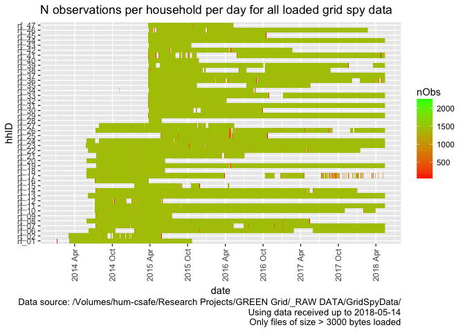

\newpage

# Citation

If you wish to use any of the material from this report please cite as:

 * Anderson, B. (2018) Processing, cleaning and saving NZ GREEN Grid project 1 minute electricity consumption data, University of Otago: Dunedin, NZ.

\newpage

# Introduction

Report circulation:

 * Restricted to: [NZ GREEn Grid](https://www.otago.ac.nz/centre-sustainability/research/energy/otago050285.html) project partners and contractors.

## Purpose

This report is intended to: 

 * load and clean the project electricity consumption data (Grid Spy)
 * save the cleaned data out as a single file per household
 * produce summary data quality statistics

## Requirements:

 * grid spy 1 minute data downloads

## History

Generally tracked via our git.soton [repo](https://git.soton.ac.uk/ba1e12/nzGREENGrid).
 
## Support

This work was supported by:

 * The [University of Otago](https://www.otago.ac.nz/)
 * The New Zealand [Ministry of Business, Innovation and Employment (MBIE)](http://www.mbie.govt.nz/)
 * [SPATIALEC](http://www.energy.soton.ac.uk/tag/spatialec/) - a [Marie Skłodowska-Curie Global Fellowship](http://ec.europa.eu/research/mariecurieactions/about-msca/actions/if/index_en.htm) based at the University of Otago’s [Centre for Sustainability](http://www.otago.ac.nz/centre-sustainability/staff/otago673896.html) (2017-2019) & the University of Southampton's Sustainable Energy Research Group (2019-202).
 
This work uis (c) 2018 the University of Southampton.

# Obtain listing of files

In this section we generate a listing of all 1 minute data files that we have received. If we are running over the complete dataset then we will be using data from:

 * /hum-csafe/Research Projects/GREEN Grid/_RAW DATA/GridSpyData/
 
In this run we are using data from:

 * /Volumes/hum-csafe/Research Projects/GREEN Grid/_RAW DATA/GridSpyData/

If these do not match then this may be a test run.


```r
print(paste0("Looking for 1 minute data using pattern = ", pattern1Min, " in ", fpath))
```

```
## [1] "Looking for 1 minute data using pattern = *at1.csv$ in /Volumes/hum-csafe/Research Projects/GREEN Grid/_RAW DATA/GridSpyData/"
```

```r
fListCompleteDT <- as.data.table(list.files(path = fpath, pattern = pattern1Min, # use the default pattern to filter e.g. 1m from 30s files
                                            recursive = TRUE))
if(nrow(fListCompleteDT) == 0){
  stop(paste0("No matching data files found, please check your path (", fpath, ") or your search pattern (", pattern1Min, ")"))
} else {
  print(paste0("Processing file list and getting file meta-data (please be patient)"))
  fListCompleteDT <- fListCompleteDT[, c("hhID","fileName") := tstrsplit(V1, "/")]
  fListCompleteDT <- fListCompleteDT[, fullPath := paste0(fpath, hhID,"/",fileName)]
  
  for(f in fListCompleteDT[,fullPath]){
    rf <- path.expand(f) # just in case of ~ etc
    fsize <- file.size(rf)
    fmtime <- ymd_hms(file.mtime(rf), tz = "Pacific/Auckland") # requires lubridate
    fListCompleteDT <- fListCompleteDT[fullPath == f, fSize := fsize]
    fListCompleteDT <- fListCompleteDT[fullPath == f, fMTime := fmtime]
    fListCompleteDT <- fListCompleteDT[fullPath == f, fMDate := as.Date(fmtime)]
  }
  ofile <- paste0(outPath, indexFile)
  print(paste0("Saving 1 minute data files metadata to ", ofile))
  write.csv(fListCompleteDT, ofile)
  print("Done")
}
```

```
## [1] "Processing file list and getting file meta-data (please be patient)"
## [1] "Saving 1 minute data files metadata to /Volumes/hum-csafe/Research Projects/GREEN Grid/Clean_data/gridSpy/fListCompleteDT.csv"
## [1] "Done"
```

Overall we have 21088 files from 44 households. The following chart shows the distribution of these files over time using their sizes. Note that white indicates the presence of small files which may not contain observations.


```r
myCaption <- paste0("Data source: ", fpath,
                    "\nUsing data received up to ", Sys.Date())

plotDT <- fListCompleteDT[, .(nFiles = .N,
                              meanfSize = mean(fSize)), 
                          keyby = .(hhID, date = as.Date(fMDate))]

#>> All files plots ----
ggplot(plotDT, aes( x = date, y = hhID, fill = log(meanfSize))) +
  geom_tile() +
  scale_fill_gradient(low = "white", high = "black") + 
  scale_x_date(date_labels = "%Y %b", date_breaks = "1 month") +
  theme(axis.text.x = element_text(angle = 90, vjust = 0.5, hjust = 0.5)) + 
  labs(title = "Mean file size of all grid spy data files received per day",
       caption = paste0(myCaption, 
                        "\nLog file size used as some files are full year data")
    
  )
```

<!-- -->

```r
ggsave(paste0(outPath, "gridSpyAllFileListSizeTilePlot.png"))
```

```
## Saving 7 x 5 in image
```

# Load data files

In this section we load the data files that have a file size > 3000 bytes. Things to note:

 * We assume that any files smaller than this value have no observations. This is based on:
     * Manual inspection of several small files
     * The identical (small) file sizes involved
     * _But_ we should probably test the first few lines to double check...
 * We have to deal with at least 2 different date formats and quite a lot of duplication some of which causes the differnt date formats. The code to fix these is included below but see also our [repo issues list](https://git.soton.ac.uk/ba1e12/nzGREENGrid/issues?scope=all&utf8=%E2%9C%93&state=all).
 


```r
# > Load, process & save the ones which probably have data ----

hhIDs <- unique(fListCompleteDT$hhID) # list of household ids
hhStatDT <- data.table() # stats collector
for(hh in hhIDs){
  print(paste0("Loading: ", hh))
  tempHhDT <- data.table() # create data.table to hold file contents
  fListCompleteDT <- fListCompleteDT[, fileLoaded := "No"]
  filesToLoad <- fListCompleteDT[hhID == hh & fSize > dataThreshold, fullPath] # select the files that meet our size threshold
  for(f in filesToLoad){
    #print(paste0("File size (", f, ") = ", fListCompleteDT[fullPath == f, fSize], " so probably OK")) # files under 3kb are probably empty
    # attempt to load the file
    tempDT <- fread(f)
    #print("File loaded")
    # set some file stats
    fListCompleteDT <- fListCompleteDT[fullPath == f, fileLoaded := "Yes"]
    fListCompleteDT <- fListCompleteDT[fullPath == f, nObs := nrow(tempDT)] # could include duplicates
    if(nrow(select(tempDT, contains("NZ"))) > 0){ # requires dplyr
      # => there is at least 1 column whose name contains NZ so we have NZ time
      #print("NZ time")
      setnames(tempDT, 'date NZ', "date_NZ")
      # Check the date format as it could be y-m-d or d/m/y :-(
      tempDT <- tempDT[, testDate := ifelse(substr(date_NZ,2,2) == "/" | # day is 1 digit
                                              substr(date_NZ,3,3) == "/" , # day is 2 digits
                                            "dmy", "ymd")] # if there is a "/" then it is d/m/y
      # Now use that to correctly parse dates
      tempDT <- tempDT[testDate == "ymd", r_dateTime := ymd_hm(date_NZ, tz = "Pacific/Auckland")] # requires lubridate
      tempDT <- tempDT[testDate == "dmy", r_dateTime := dmy_hm(date_NZ, tz = "Pacific/Auckland")]
    } else {
      # we have UTC
      #print("UTC")
      setnames(tempDT, 'date UTC', "date_UTC")
      tempDT <- tempDT[, testDate := ifelse(substr(date_UTC,2,2) == "/" | # day is 1 digit
                                              substr(date_UTC,3,3) == "/", # 2 digits
                                            "dmy", "ymd")]
      tempDT <- tempDT[testDate == "ymd", r_dateTime := ymd_hm(date_UTC, tz = "UTC")] # requires lubridate
      tempDT <- tempDT[testDate == "dmy", r_dateTime := dmy_hm(date_UTC, tz = "UTC")]
    }
    #print(head(tempDT)) # test
    fListCompleteDT <- fListCompleteDT[fullPath == f, obsStartDate := min(as.Date(tempDT$r_dateTime))]
    fListCompleteDT <- fListCompleteDT[fullPath == f, obsEndDate := max(as.Date(tempDT$r_dateTime))]
    tempHhDT <- rbind(tempHhDT, tempDT, fill = TRUE) # just in case there are different numbers of columns (quite likely!)
  }
  
  # > Remove duplicates caused by over-lapping files and dates etc ----
  # Need to remove all test vars for this
  try(tempHhDT$date_UTC <- NULL)
  try(tempHhDT$date_NZ <- NULL)
  try(tempHhDT$testDate <- NULL)
  
  #nObs <- nrow(tempHhDT)
  #print(paste0("N rows before removal of duplicates: ", nObs))
  tempHhDT <- unique(tempHhDT)
  #nObs <- nrow(tempHhDT)
  #print(paste0("N rows after removal of duplicates: ", nObs))
  
  # Add up all Wh cols
  #tempHhDT <- tempHhDT[, Sum := rowSums(.SD, na.rm = TRUE), .SDcols = grep("$", names(tempHhDT))] 
  
  hhStatTempDT <- tempHhDT[, .(nObs = .N),keyby = (date = as.Date(r_dateTime))] # can't do mean Wh as label varies
  hhStatTempDT <- hhStatTempDT[, hhID := hh]
  
  hhStatDT <- rbind(hhStatDT,hhStatTempDT) # add to the collector
  
  # > Save hh file ----
  ofile <- paste0(outPath, "1min/", hh,"_all_1min_data.csv")
  write_csv(tempHhDT, ofile)
  print(paste0("Saved ", ofile, ", gzipping..."))
  cmd <- paste0("gzip -f ", "'", path.expand(ofile), "'") # gzip it - use quotes in case of spaces in file name, expand path if needed
  try(system(cmd)) # in case it fails - if it does there will just be .csv files (not gzipped) - e.g. under windows
  print(paste0("Gzipped ", ofile))
}
```

```
## [1] "Loading: rf_01"
```

```
## Warning in `[<-.data.table`(x, j = name, value = value): Adding new column
## 'date_UTC' then assigning NULL (deleting it).
```

```
## [1] "Saved /Volumes/hum-csafe/Research Projects/GREEN Grid/Clean_data/gridSpy/1min/rf_01_all_1min_data.csv, gzipping..."
## [1] "Gzipped /Volumes/hum-csafe/Research Projects/GREEN Grid/Clean_data/gridSpy/1min/rf_01_all_1min_data.csv"
## [1] "Loading: rf_02"
```

```
## Warning in `[<-.data.table`(x, j = name, value = value): Adding new column
## 'date_UTC' then assigning NULL (deleting it).
```

```
## [1] "Saved /Volumes/hum-csafe/Research Projects/GREEN Grid/Clean_data/gridSpy/1min/rf_02_all_1min_data.csv, gzipping..."
## [1] "Gzipped /Volumes/hum-csafe/Research Projects/GREEN Grid/Clean_data/gridSpy/1min/rf_02_all_1min_data.csv"
## [1] "Loading: rf_06"
## [1] "Saved /Volumes/hum-csafe/Research Projects/GREEN Grid/Clean_data/gridSpy/1min/rf_06_all_1min_data.csv, gzipping..."
## [1] "Gzipped /Volumes/hum-csafe/Research Projects/GREEN Grid/Clean_data/gridSpy/1min/rf_06_all_1min_data.csv"
## [1] "Loading: rf_07"
## [1] "Saved /Volumes/hum-csafe/Research Projects/GREEN Grid/Clean_data/gridSpy/1min/rf_07_all_1min_data.csv, gzipping..."
## [1] "Gzipped /Volumes/hum-csafe/Research Projects/GREEN Grid/Clean_data/gridSpy/1min/rf_07_all_1min_data.csv"
## [1] "Loading: rf_08"
## [1] "Saved /Volumes/hum-csafe/Research Projects/GREEN Grid/Clean_data/gridSpy/1min/rf_08_all_1min_data.csv, gzipping..."
## [1] "Gzipped /Volumes/hum-csafe/Research Projects/GREEN Grid/Clean_data/gridSpy/1min/rf_08_all_1min_data.csv"
## [1] "Loading: rf_09"
```

```
## Warning in `[<-.data.table`(x, j = name, value = value): Adding new column
## 'date_UTC' then assigning NULL (deleting it).
```

```
## [1] "Saved /Volumes/hum-csafe/Research Projects/GREEN Grid/Clean_data/gridSpy/1min/rf_09_all_1min_data.csv, gzipping..."
## [1] "Gzipped /Volumes/hum-csafe/Research Projects/GREEN Grid/Clean_data/gridSpy/1min/rf_09_all_1min_data.csv"
## [1] "Loading: rf_10"
## [1] "Saved /Volumes/hum-csafe/Research Projects/GREEN Grid/Clean_data/gridSpy/1min/rf_10_all_1min_data.csv, gzipping..."
## [1] "Gzipped /Volumes/hum-csafe/Research Projects/GREEN Grid/Clean_data/gridSpy/1min/rf_10_all_1min_data.csv"
## [1] "Loading: rf_11"
## [1] "Saved /Volumes/hum-csafe/Research Projects/GREEN Grid/Clean_data/gridSpy/1min/rf_11_all_1min_data.csv, gzipping..."
## [1] "Gzipped /Volumes/hum-csafe/Research Projects/GREEN Grid/Clean_data/gridSpy/1min/rf_11_all_1min_data.csv"
## [1] "Loading: rf_12"
```

```
## Warning in `[<-.data.table`(x, j = name, value = value): Adding new column
## 'date_UTC' then assigning NULL (deleting it).
```

```
## [1] "Saved /Volumes/hum-csafe/Research Projects/GREEN Grid/Clean_data/gridSpy/1min/rf_12_all_1min_data.csv, gzipping..."
## [1] "Gzipped /Volumes/hum-csafe/Research Projects/GREEN Grid/Clean_data/gridSpy/1min/rf_12_all_1min_data.csv"
## [1] "Loading: rf_13"
## [1] "Saved /Volumes/hum-csafe/Research Projects/GREEN Grid/Clean_data/gridSpy/1min/rf_13_all_1min_data.csv, gzipping..."
## [1] "Gzipped /Volumes/hum-csafe/Research Projects/GREEN Grid/Clean_data/gridSpy/1min/rf_13_all_1min_data.csv"
## [1] "Loading: rf_14"
## [1] "Saved /Volumes/hum-csafe/Research Projects/GREEN Grid/Clean_data/gridSpy/1min/rf_14_all_1min_data.csv, gzipping..."
## [1] "Gzipped /Volumes/hum-csafe/Research Projects/GREEN Grid/Clean_data/gridSpy/1min/rf_14_all_1min_data.csv"
## [1] "Loading: rf_15"
```

```
## Warning in `[<-.data.table`(x, j = name, value = value): Adding new column
## 'date_UTC' then assigning NULL (deleting it).
```

```
## [1] "Saved /Volumes/hum-csafe/Research Projects/GREEN Grid/Clean_data/gridSpy/1min/rf_15_all_1min_data.csv, gzipping..."
## [1] "Gzipped /Volumes/hum-csafe/Research Projects/GREEN Grid/Clean_data/gridSpy/1min/rf_15_all_1min_data.csv"
## [1] "Loading: rf_16"
```

```
## Warning in `[<-.data.table`(x, j = name, value = value): Adding new column
## 'date_UTC' then assigning NULL (deleting it).
```

```
## [1] "Saved /Volumes/hum-csafe/Research Projects/GREEN Grid/Clean_data/gridSpy/1min/rf_16_all_1min_data.csv, gzipping..."
## [1] "Gzipped /Volumes/hum-csafe/Research Projects/GREEN Grid/Clean_data/gridSpy/1min/rf_16_all_1min_data.csv"
## [1] "Loading: rf_17"
## [1] "Saved /Volumes/hum-csafe/Research Projects/GREEN Grid/Clean_data/gridSpy/1min/rf_17_all_1min_data.csv, gzipping..."
## [1] "Gzipped /Volumes/hum-csafe/Research Projects/GREEN Grid/Clean_data/gridSpy/1min/rf_17_all_1min_data.csv"
## [1] "Loading: rf_18"
```

```
## Warning in `[<-.data.table`(x, j = name, value = value): Adding new column
## 'date_UTC' then assigning NULL (deleting it).
```

```
## [1] "Saved /Volumes/hum-csafe/Research Projects/GREEN Grid/Clean_data/gridSpy/1min/rf_18_all_1min_data.csv, gzipping..."
## [1] "Gzipped /Volumes/hum-csafe/Research Projects/GREEN Grid/Clean_data/gridSpy/1min/rf_18_all_1min_data.csv"
## [1] "Loading: rf_19"
## [1] "Saved /Volumes/hum-csafe/Research Projects/GREEN Grid/Clean_data/gridSpy/1min/rf_19_all_1min_data.csv, gzipping..."
## [1] "Gzipped /Volumes/hum-csafe/Research Projects/GREEN Grid/Clean_data/gridSpy/1min/rf_19_all_1min_data.csv"
## [1] "Loading: rf_20"
```

```
## Warning in `[<-.data.table`(x, j = name, value = value): Adding new column
## 'date_UTC' then assigning NULL (deleting it).
```

```
## [1] "Saved /Volumes/hum-csafe/Research Projects/GREEN Grid/Clean_data/gridSpy/1min/rf_20_all_1min_data.csv, gzipping..."
## [1] "Gzipped /Volumes/hum-csafe/Research Projects/GREEN Grid/Clean_data/gridSpy/1min/rf_20_all_1min_data.csv"
## [1] "Loading: rf_21"
## [1] "Saved /Volumes/hum-csafe/Research Projects/GREEN Grid/Clean_data/gridSpy/1min/rf_21_all_1min_data.csv, gzipping..."
## [1] "Gzipped /Volumes/hum-csafe/Research Projects/GREEN Grid/Clean_data/gridSpy/1min/rf_21_all_1min_data.csv"
## [1] "Loading: rf_22"
## [1] "Saved /Volumes/hum-csafe/Research Projects/GREEN Grid/Clean_data/gridSpy/1min/rf_22_all_1min_data.csv, gzipping..."
## [1] "Gzipped /Volumes/hum-csafe/Research Projects/GREEN Grid/Clean_data/gridSpy/1min/rf_22_all_1min_data.csv"
## [1] "Loading: rf_23"
## [1] "Saved /Volumes/hum-csafe/Research Projects/GREEN Grid/Clean_data/gridSpy/1min/rf_23_all_1min_data.csv, gzipping..."
## [1] "Gzipped /Volumes/hum-csafe/Research Projects/GREEN Grid/Clean_data/gridSpy/1min/rf_23_all_1min_data.csv"
## [1] "Loading: rf_24"
## [1] "Saved /Volumes/hum-csafe/Research Projects/GREEN Grid/Clean_data/gridSpy/1min/rf_24_all_1min_data.csv, gzipping..."
## [1] "Gzipped /Volumes/hum-csafe/Research Projects/GREEN Grid/Clean_data/gridSpy/1min/rf_24_all_1min_data.csv"
## [1] "Loading: rf_25"
```

```
## Warning: 115200 failed to parse.
```

```
## [1] "Saved /Volumes/hum-csafe/Research Projects/GREEN Grid/Clean_data/gridSpy/1min/rf_25_all_1min_data.csv, gzipping..."
## [1] "Gzipped /Volumes/hum-csafe/Research Projects/GREEN Grid/Clean_data/gridSpy/1min/rf_25_all_1min_data.csv"
## [1] "Loading: rf_26"
## [1] "Saved /Volumes/hum-csafe/Research Projects/GREEN Grid/Clean_data/gridSpy/1min/rf_26_all_1min_data.csv, gzipping..."
## [1] "Gzipped /Volumes/hum-csafe/Research Projects/GREEN Grid/Clean_data/gridSpy/1min/rf_26_all_1min_data.csv"
## [1] "Loading: rf_27"
## [1] "Saved /Volumes/hum-csafe/Research Projects/GREEN Grid/Clean_data/gridSpy/1min/rf_27_all_1min_data.csv, gzipping..."
## [1] "Gzipped /Volumes/hum-csafe/Research Projects/GREEN Grid/Clean_data/gridSpy/1min/rf_27_all_1min_data.csv"
## [1] "Loading: rf_28"
## [1] "Saved /Volumes/hum-csafe/Research Projects/GREEN Grid/Clean_data/gridSpy/1min/rf_28_all_1min_data.csv, gzipping..."
## [1] "Gzipped /Volumes/hum-csafe/Research Projects/GREEN Grid/Clean_data/gridSpy/1min/rf_28_all_1min_data.csv"
## [1] "Loading: rf_29"
## [1] "Saved /Volumes/hum-csafe/Research Projects/GREEN Grid/Clean_data/gridSpy/1min/rf_29_all_1min_data.csv, gzipping..."
## [1] "Gzipped /Volumes/hum-csafe/Research Projects/GREEN Grid/Clean_data/gridSpy/1min/rf_29_all_1min_data.csv"
## [1] "Loading: rf_30"
## [1] "Saved /Volumes/hum-csafe/Research Projects/GREEN Grid/Clean_data/gridSpy/1min/rf_30_all_1min_data.csv, gzipping..."
## [1] "Gzipped /Volumes/hum-csafe/Research Projects/GREEN Grid/Clean_data/gridSpy/1min/rf_30_all_1min_data.csv"
## [1] "Loading: rf_31"
## [1] "Saved /Volumes/hum-csafe/Research Projects/GREEN Grid/Clean_data/gridSpy/1min/rf_31_all_1min_data.csv, gzipping..."
## [1] "Gzipped /Volumes/hum-csafe/Research Projects/GREEN Grid/Clean_data/gridSpy/1min/rf_31_all_1min_data.csv"
## [1] "Loading: rf_32"
## [1] "Saved /Volumes/hum-csafe/Research Projects/GREEN Grid/Clean_data/gridSpy/1min/rf_32_all_1min_data.csv, gzipping..."
## [1] "Gzipped /Volumes/hum-csafe/Research Projects/GREEN Grid/Clean_data/gridSpy/1min/rf_32_all_1min_data.csv"
## [1] "Loading: rf_33"
## [1] "Saved /Volumes/hum-csafe/Research Projects/GREEN Grid/Clean_data/gridSpy/1min/rf_33_all_1min_data.csv, gzipping..."
## [1] "Gzipped /Volumes/hum-csafe/Research Projects/GREEN Grid/Clean_data/gridSpy/1min/rf_33_all_1min_data.csv"
## [1] "Loading: rf_34"
## [1] "Saved /Volumes/hum-csafe/Research Projects/GREEN Grid/Clean_data/gridSpy/1min/rf_34_all_1min_data.csv, gzipping..."
## [1] "Gzipped /Volumes/hum-csafe/Research Projects/GREEN Grid/Clean_data/gridSpy/1min/rf_34_all_1min_data.csv"
## [1] "Loading: rf_35"
## [1] "Saved /Volumes/hum-csafe/Research Projects/GREEN Grid/Clean_data/gridSpy/1min/rf_35_all_1min_data.csv, gzipping..."
## [1] "Gzipped /Volumes/hum-csafe/Research Projects/GREEN Grid/Clean_data/gridSpy/1min/rf_35_all_1min_data.csv"
## [1] "Loading: rf_36"
## [1] "Saved /Volumes/hum-csafe/Research Projects/GREEN Grid/Clean_data/gridSpy/1min/rf_36_all_1min_data.csv, gzipping..."
## [1] "Gzipped /Volumes/hum-csafe/Research Projects/GREEN Grid/Clean_data/gridSpy/1min/rf_36_all_1min_data.csv"
## [1] "Loading: rf_37"
## [1] "Saved /Volumes/hum-csafe/Research Projects/GREEN Grid/Clean_data/gridSpy/1min/rf_37_all_1min_data.csv, gzipping..."
## [1] "Gzipped /Volumes/hum-csafe/Research Projects/GREEN Grid/Clean_data/gridSpy/1min/rf_37_all_1min_data.csv"
## [1] "Loading: rf_38"
## [1] "Saved /Volumes/hum-csafe/Research Projects/GREEN Grid/Clean_data/gridSpy/1min/rf_38_all_1min_data.csv, gzipping..."
## [1] "Gzipped /Volumes/hum-csafe/Research Projects/GREEN Grid/Clean_data/gridSpy/1min/rf_38_all_1min_data.csv"
## [1] "Loading: rf_39"
## [1] "Saved /Volumes/hum-csafe/Research Projects/GREEN Grid/Clean_data/gridSpy/1min/rf_39_all_1min_data.csv, gzipping..."
## [1] "Gzipped /Volumes/hum-csafe/Research Projects/GREEN Grid/Clean_data/gridSpy/1min/rf_39_all_1min_data.csv"
## [1] "Loading: rf_40"
## [1] "Saved /Volumes/hum-csafe/Research Projects/GREEN Grid/Clean_data/gridSpy/1min/rf_40_all_1min_data.csv, gzipping..."
## [1] "Gzipped /Volumes/hum-csafe/Research Projects/GREEN Grid/Clean_data/gridSpy/1min/rf_40_all_1min_data.csv"
## [1] "Loading: rf_41"
## [1] "Saved /Volumes/hum-csafe/Research Projects/GREEN Grid/Clean_data/gridSpy/1min/rf_41_all_1min_data.csv, gzipping..."
## [1] "Gzipped /Volumes/hum-csafe/Research Projects/GREEN Grid/Clean_data/gridSpy/1min/rf_41_all_1min_data.csv"
## [1] "Loading: rf_42"
## [1] "Saved /Volumes/hum-csafe/Research Projects/GREEN Grid/Clean_data/gridSpy/1min/rf_42_all_1min_data.csv, gzipping..."
## [1] "Gzipped /Volumes/hum-csafe/Research Projects/GREEN Grid/Clean_data/gridSpy/1min/rf_42_all_1min_data.csv"
## [1] "Loading: rf_43"
## [1] "Saved /Volumes/hum-csafe/Research Projects/GREEN Grid/Clean_data/gridSpy/1min/rf_43_all_1min_data.csv, gzipping..."
## [1] "Gzipped /Volumes/hum-csafe/Research Projects/GREEN Grid/Clean_data/gridSpy/1min/rf_43_all_1min_data.csv"
## [1] "Loading: rf_44"
## [1] "Saved /Volumes/hum-csafe/Research Projects/GREEN Grid/Clean_data/gridSpy/1min/rf_44_all_1min_data.csv, gzipping..."
## [1] "Gzipped /Volumes/hum-csafe/Research Projects/GREEN Grid/Clean_data/gridSpy/1min/rf_44_all_1min_data.csv"
## [1] "Loading: rf_45"
## [1] "Saved /Volumes/hum-csafe/Research Projects/GREEN Grid/Clean_data/gridSpy/1min/rf_45_all_1min_data.csv, gzipping..."
## [1] "Gzipped /Volumes/hum-csafe/Research Projects/GREEN Grid/Clean_data/gridSpy/1min/rf_45_all_1min_data.csv"
## [1] "Loading: rf_46"
```

```
## Warning: 115200 failed to parse.
```

```
## [1] "Saved /Volumes/hum-csafe/Research Projects/GREEN Grid/Clean_data/gridSpy/1min/rf_46_all_1min_data.csv, gzipping..."
## [1] "Gzipped /Volumes/hum-csafe/Research Projects/GREEN Grid/Clean_data/gridSpy/1min/rf_46_all_1min_data.csv"
## [1] "Loading: rf_47"
## [1] "Saved /Volumes/hum-csafe/Research Projects/GREEN Grid/Clean_data/gridSpy/1min/rf_47_all_1min_data.csv, gzipping..."
## [1] "Gzipped /Volumes/hum-csafe/Research Projects/GREEN Grid/Clean_data/gridSpy/1min/rf_47_all_1min_data.csv"
```

```r
#> Save observed data stats for all files loaded ----
ofile <- paste0(outPath, "hhDailyObservationsStats.csv")
print(paste0("Saving daily observations stats by hhid to ", ofile)) # write out version with file stats
```

```
## [1] "Saving daily observations stats by hhid to /Volumes/hum-csafe/Research Projects/GREEN Grid/Clean_data/gridSpy/hhDailyObservationsStats.csv"
```

```r
write.csv(hhStatDT, ofile)
print("Done")
```

```
## [1] "Done"
```

# Data quality analysis

Now produce some data quality plots & tables.

The following plots show the number of observations per day per household. In theory we should not see:

 * dates before 2014 or in to the future (they indicate data conversion errors)
 * more than 1440 observations per day (they indicate potentially duplicate data)


```r
# tile plot ----
ggplot(hhStatDT, aes( x = date, y = hhID, fill = nObs)) +
  geom_tile() +
  scale_fill_gradient(low = "red", high = "green") +
  scale_x_date(date_labels = "%Y %b", date_breaks = "6 months") +
  theme(axis.text.x = element_text(angle = 90, vjust = 0.5, hjust = 0.5)) + 
  labs(title = "N observations per household per day for all loaded grid spy data",
       caption = paste0(myCaption,
                        "\nOnly files of size > ", dataThreshold, " bytes loaded")
       
  )
```

```
## Warning: Removed 2 rows containing missing values (geom_tile).
```

<!-- -->

```r
ggsave(paste0(outPath, "gridSpyLoadedFileNobsTilePlot.png"))
```

```
## Saving 7 x 5 in image
```

```
## Warning: Removed 2 rows containing missing values (geom_tile).
```

```r
# point plot ----
ggplot(hhStatDT, aes( x = date, y = nObs, colour = hhID)) +
  geom_point() +
  scale_x_date(date_labels = "%Y %b", date_breaks = "6 months") +
  theme(axis.text.x = element_text(angle = 90, vjust = 0.5, hjust = 0.5)) + 
  labs(title = "N observations per household per day for all loaded grid spy data",
       caption = paste0(myCaption,
                        "\nOnly files of size > ", dataThreshold, " bytes loaded")
       
  )
```

```
## Warning: Removed 2 rows containing missing values (geom_point).
```

<!-- -->

```r
ggsave(paste0(outPath, "gridSpyLoadedFileNobsPointPlot.png"))
```

```
## Saving 7 x 5 in image
```

```
## Warning: Removed 2 rows containing missing values (geom_point).
```

The following table shows the min/max observations per day and min/max dates for each household. As above, we should not see:

 * dates before 2014 or in to the future (indicates date conversion errors)
 * more than 1440 observations per day (indicates potentially duplicate observations)
 
 We should also not see NA in any row (indicates date conversion errors). 
 
 If we do see any of these then we still have data cleaning work to do!


```r
# Stats table (so we can pick out the dateTime errors)
t <- hhStatDT[, .(minObs = min(nObs),
             maxObs = max(nObs), # should not be more than 1440, if so suggests duplicates
             minDate = min(date),
             maxDate = max(date)),
         keyby = .(hhID)]

kable(caption = "Summary observation stats by hhID", t)
```


Table: Summary observation stats by hhID

hhID     minObs   maxObs  minDate      maxDate    
------  -------  -------  -----------  -----------
rf_01       171     1500  2014-01-05   2015-10-20 
rf_02       215     1440  2014-03-02   2015-05-28 
rf_06       243     1500  2014-06-08   2018-04-30 
rf_07       105     1500  2014-07-13   2018-04-30 
rf_08       123     1500  2014-05-28   2017-05-15 
rf_09       163     1500  2014-07-13   2015-07-16 
rf_10       389     1500  2014-07-08   2018-03-29 
rf_11       278     1500  2014-07-07   2018-04-30 
rf_12        85     1500  2014-07-08   2015-06-02 
rf_13       456     1500  2014-06-05   2018-04-30 
rf_14       120     1500  2014-07-13   2017-12-30 
rf_15        62     1440  2015-01-14   2016-04-18 
rf_16       720     1500  2014-07-09   2015-03-25 
rf_17        22     1500  2014-05-29   2018-04-11 
rf_18       157     1500  2014-05-29   2015-06-11 
rf_19       387     1500  2014-07-14   2018-04-30 
rf_20        98     1500  2014-05-28   2015-06-11 
rf_21       195     1500  2014-07-14   2016-07-01 
rf_22         6     1500  2014-06-05   2018-01-14 
rf_23       171     1500  2014-05-25   2018-04-30 
rf_24       571     1500  2014-05-28   2018-04-30 
rf_25        45    93816  NA           NA         
rf_26       362     2231  2014-07-10   2018-04-30 
rf_27       567     1560  2014-07-27   2016-05-13 
rf_28       297     1440  2015-03-26   2015-05-26 
rf_29       720     1500  2015-03-25   2018-04-30 
rf_30       205     1500  2015-03-27   2016-09-29 
rf_31       720     1500  2015-03-25   2018-04-30 
rf_32       325     1500  2015-03-25   2016-04-05 
rf_33       369     1500  2015-03-23   2018-04-30 
rf_34       317     1500  2014-11-03   2016-08-24 
rf_35        50     1500  2015-03-22   2017-05-17 
rf_36        29     1500  2015-03-23   2018-04-30 
rf_37       720     1500  2015-03-23   2018-04-30 
rf_38       398     1500  2015-03-24   2017-08-22 
rf_39       163     1823  2015-03-27   2018-04-30 
rf_40       268     1500  2015-03-24   2015-11-22 
rf_41         1     1573  2015-03-25   2018-04-30 
rf_42        79     1500  2015-03-23   2017-02-18 
rf_43       780     1495  2015-03-26   2015-10-18 
rf_44       720     1500  2015-03-24   2018-04-30 
rf_45        69     1499  2015-03-24   2016-10-15 
rf_46       305   114306  NA           NA         
rf_47       159     1500  2015-03-24   2016-05-08 

# Runtime


```r
t <- proc.time() - startTime

elapsed <- t[[3]]
```

Analysis completed in 7607.885 seconds ( 126.8 minutes) using [knitr](https://cran.r-project.org/package=knitr) in [RStudio](http://www.rstudio.com) with R version 3.4.4 (2018-03-15) running on x86_64-apple-darwin15.6.0.

# R environment

R packages used:

 * base R - for the basics [@baseR]
 * data.table - for fast (big) data handling [@data.table]
 * ggplot2 - for slick graphics [@ggplot2]
 * dplyr - for select and contains [@dplyr]
 * lubridate - date manipulation [@lubridate]
 * knitr - to create this document [@knitr]
 * greenGridr - for local NZ GREEN Grid utilities
 

```r
sessionInfo()
```

```
## R version 3.4.4 (2018-03-15)
## Platform: x86_64-apple-darwin15.6.0 (64-bit)
## Running under: macOS High Sierra 10.13.4
## 
## Matrix products: default
## BLAS: /Library/Frameworks/R.framework/Versions/3.4/Resources/lib/libRblas.0.dylib
## LAPACK: /Library/Frameworks/R.framework/Versions/3.4/Resources/lib/libRlapack.dylib
## 
## locale:
## [1] en_GB.UTF-8/en_GB.UTF-8/en_GB.UTF-8/C/en_GB.UTF-8/en_GB.UTF-8
## 
## attached base packages:
## [1] stats     graphics  grDevices utils     datasets  methods   base     
## 
## other attached packages:
## [1] knitr_1.20          dplyr_0.7.4         readr_1.1.1        
## [4] ggplot2_2.2.1       lubridate_1.7.4     data.table_1.10.4-3
## [7] greenGridr_0.1.0   
## 
## loaded via a namespace (and not attached):
##  [1] Rcpp_0.12.16      bindr_0.1.1       magrittr_1.5     
##  [4] hms_0.4.2         munsell_0.4.3     colorspace_1.3-2 
##  [7] R6_2.2.2          rlang_0.2.0.9001  highr_0.6        
## [10] stringr_1.3.0     plyr_1.8.4        tools_3.4.4      
## [13] grid_3.4.4        gtable_0.2.0      htmltools_0.3.6  
## [16] assertthat_0.2.0  yaml_2.1.18       lazyeval_0.2.1   
## [19] rprojroot_1.3-2   digest_0.6.15     tibble_1.4.2     
## [22] bindrcpp_0.2.2    glue_1.2.0        evaluate_0.10.1  
## [25] rmarkdown_1.9     labeling_0.3      stringi_1.1.7    
## [28] compiler_3.4.4    pillar_1.2.2      scales_0.5.0.9000
## [31] backports_1.1.2   pkgconfig_2.0.1
```
