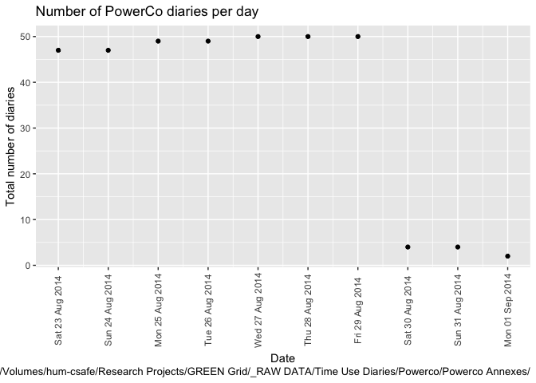
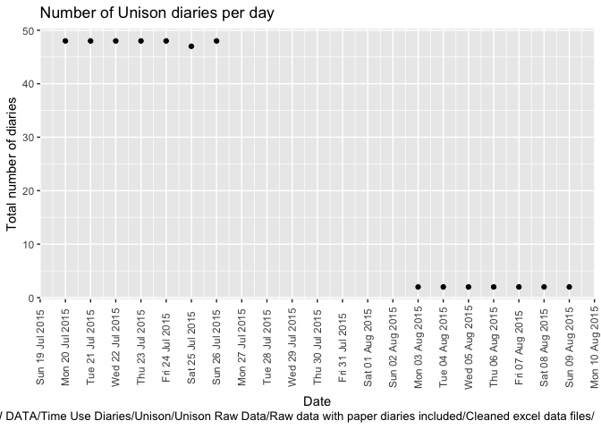

\newpage

# Citation

If you wish to use any of the material from this report please cite as:

 * Anderson, B. (2018) Processing, cleaning and saving NZ GREEN Grid project time use diary data, University of Otago: Dunedin, NZ.

\newpage

# Introduction

Report circulation:

 * Restricted to: [NZ GREEn Grid](https://www.otago.ac.nz/centre-sustainability/research/energy/otago050285.html) project partners and contractors.

## Purpose

This report is intended to: 

 * load and clean the two time use survey datasets
 * save the cleaned data out to /Volumes/hum-csafe/Research Projects/GREEN Grid/Clean_data/safe/TUD/ as two seperate files, one for each survey
 * produce summary data quality statistics

## Requirements:

Time use survey data held in /Volumes/hum-csafe/Research Projects/GREEN Grid/_RAW DATA/Time Use Diaries/:

 * PowerCo
 * Unison

A lookup table to correct mis-coding of household IDs (/Volumes/hum-csafe/Research Projects/GREEN Grid/_RAW DATA/TUD_2_GridSpyLookup.xlsx).

## History

Generally tracked via our git.soton [repo](https://git.soton.ac.uk/ba1e12/nzGREENGrid):

 * [history](https://git.soton.ac.uk/ba1e12/nzGREENGrid/commits/master)
 * [issues](https://git.soton.ac.uk/ba1e12/nzGREENGrid/issues)
 
## Support

This work was supported by:

 * The [University of Otago](https://www.otago.ac.nz/)
 * The New Zealand [Ministry of Business, Innovation and Employment (MBIE)](http://www.mbie.govt.nz/)
 * [SPATIALEC](http://www.energy.soton.ac.uk/tag/spatialec/) - a [Marie Skłodowska-Curie Global Fellowship](http://ec.europa.eu/research/mariecurieactions/about-msca/actions/if/index_en.htm) based at the University of Otago’s [Centre for Sustainability](http://www.otago.ac.nz/centre-sustainability/staff/otago673896.html) (2017-2019) & the University of Southampton's Sustainable Energy Research Group (2019-202).
 
This work is (c) 2018 the University of Southampton.

We do not 'support' the code but if you have a problem check the [issues](https://git.soton.ac.uk/ba1e12/nzGREENGrid/issues) on our [repo](https://git.soton.ac.uk/ba1e12/nzGREENGrid) and if it doesn't already exist, open one. We might be able to fix it :-)

# Load files

In this section we load and test the two time-use survey datasets.

## PowerCo

This consists of 1 file found in /Volumes/hum-csafe/Research Projects/GREEN Grid/_RAW DATA/Time Use Diaries/Powerco/Powerco Annexes/:

 * TUD (Merged data)_BA.csv

This is a version of TUD (Merged data).csv with:

 * small edits to correct dates
 * redundant rows removed from file header


```r
tudPowerCoDT <- fread(paste0(powerCoPath, "TUD (Merged data)_BA.csv"))

nRows <- nrow(tudPowerCoDT)
print(paste0("Found ", tidyNum(nRows), " rows of data"))
```

```
## [1] "Found 352 rows of data"
```


```r
# Remove identifying data ----
tudPowerCoDT <- tudPowerCoDT[, c("RowNum", "Name","EmailAddress") := NULL]

# Fix names of variables ----
tudPowerCoDT <- data.table::setnames(tudPowerCoDT, 
                                    c("Family size", "Choose the date of your diary / entry:"), 
                                    c("ba_nPeople", "diaryDate")
)

# Fix dates ----
tudPowerCoDT <- tudPowerCoDT[, r_diaryDate := lubridate::mdy(diaryDate)]

# Fix the hhid
tudPowerCoDT <- tudPowerCoDT[, hhID := paste0("rf_", HHCODE)]
tudPowerCoDT <- tudPowerCoDT[, hhID := ifelse(as.integer(HHCODE) < 10, 
                                              paste0("rf_0", HHCODE), # single digit so needs '0'
                                                     hhID)]

# Summary table ----
t <- tudPowerCoDT[, .(nDiaries = .N,
                      familySize = mean(ba_nPeople, na.rm = TRUE),
                      minDiaryDate = min(r_diaryDate),
                      maxDiaryDate = max(r_diaryDate)), keyby = .(hhID)]

knitr::kable(caption = "Summary of PowerCo diaries by household", t)
```


Table: Summary of PowerCo diaries by household

hhID     nDiaries   familySize  minDiaryDate   maxDiaryDate 
------  ---------  -----------  -------------  -------------
rf_06          14     2.000000  2014-08-23     2014-08-29   
rf_07          14     3.000000  2014-08-25     2014-08-31   
rf_08           7     1.000000  2014-08-23     2014-08-29   
rf_09          14     2.000000  2014-08-23     2014-08-29   
rf_10          14     2.000000  2014-08-23     2014-08-29   
rf_11           7     1.000000  2014-08-23     2014-08-29   
rf_12          14     3.000000  2014-08-23     2014-08-29   
rf_13          12     2.000000  2014-08-23     2014-08-29   
rf_14          43     5.906977  2014-08-23     2014-08-29   
rf_15          14     3.000000  2014-08-23     2014-08-29   
rf_16          14     3.000000  2014-08-23     2014-08-29   
rf_17          14     2.000000  2014-08-26     2014-09-01   
rf_18          14     2.000000  2014-08-23     2014-08-29   
rf_19          14     3.000000  2014-08-23     2014-08-29   
rf_20          35     6.000000  2014-08-23     2014-08-29   
rf_21          14     2.000000  2014-08-23     2014-08-29   
rf_22          14     2.000000  2014-08-23     2014-08-29   
rf_23          14     4.000000  2014-08-23     2014-08-29   
rf_24          28     4.000000  2014-08-23     2014-08-29   
rf_25          21     4.000000  2014-08-23     2014-08-29   
rf_26           7     1.000000  2014-08-23     2014-08-29   
rf_27          10     4.000000  2014-08-23     2014-08-29   

```r
# save out safe file ----
ofile <- paste0(outPath, "powerCoTUDsafe.csv")
print(paste0("Saving PowerCo cleaned time use diary to ", ofile))
```

```
## [1] "Saving PowerCo cleaned time use diary to /Volumes/hum-csafe/Research Projects/GREEN Grid/Clean_data/safe/TUD/powerCoTUDsafe.csv"
```

```r
write.csv(tudPowerCoDT, ofile)
print("Done")
```

```
## [1] "Done"
```

Should all be in August 2014...


```r
myCaption <- paste0("Data source: ", powerCoPath)

plotDT <- tudPowerCoDT[, .(nDiaries = .N), keyby = .(r_diaryDate)]
ggplot2::ggplot(plotDT, aes(x = r_diaryDate, y = nDiaries)) +
  geom_point() +
    scale_x_date(date_labels = "%a %d %b %Y", date_breaks = "1 day") +
  theme(axis.text.x = element_text(angle = 90, vjust = 0.5, hjust = 0.5)) + 
  labs(title = "Number of PowerCo diaries per day",
       caption = paste0(myCaption),
       x = "Date",
       y = "Total number of diaries"
    
  )
```

<!-- -->

```r
ggplot2::ggsave(paste0(outPath, "powerCoTUDdates.png"))
```

```
## Saving 7 x 5 in image
```

In total we have 352 diaries from 22 PowerCo households.

## Unison

This consists of 5 files found in /Volumes/hum-csafe/Research Projects/GREEN Grid/_RAW DATA/Time Use Diaries/Unison/Unison Raw Data/Raw data with paper diaries included/Cleaned excel data files/:

 * TUDAdult_ONE_Child_Unison_forSAS_BA.xlsx
 * TUDAdult_TWO_Children_Unison_forSAS_BA.xlsx
 * TUDAdult-THREE-Children-Unison_forSAS_BA.xlsx
 * TUDAdult-Unison-forSAS_BA.xlsx
 * TUDTeenagerorChild-Unison_forSAS_BA.xlsx
 
As before these are copies of the original versions with slight editing to correct dates and for ease of processing. The relationship between them is currently unclear!


```r
#fList <- c("TUDAdult_ONE_Child_Unison_forSAS_BA.xlsx", "TUDAdult_TWO_Children_Unison_forSAS_BA.xlsx",
#           "TUDAdult-THREE-Children-Unison_forSAS_BA.xlsx", "TUDAdult-Unison-forSAS_BA.xlsx", "TUDTeenagerorChild-Unison_forSAS_BA.xlsx")

# load and add sourceFile for easy tracking of errors
tudUnison1chDT <- data.table::as.data.table(read_xlsx(paste0(unisonPath, "TUDAdult_ONE_Child_Unison_forSAS_BA.xlsx")))
tudUnison1chDT$sourceFile <- "TUDAdult_ONE_Child_Unison_forSAS_BA.xlsx"
tudUnison2chDT <- data.table::as.data.table(read_xlsx(paste0(unisonPath, "TUDAdult_TWO_Children_Unison_forSAS_BA.xlsx")))
tudUnison2chDT$sourceFile <- "TUDAdult_TWO_Children_Unison_forSAS_BA.xlsx"
tudUnison3chDT <- data.table::as.data.table(read_xlsx(paste0(unisonPath, "TUDAdult-THREE-Children-Unison_forSAS_BA.xlsx")))
tudUnison3chDT$sourceFile <- "TUDAdult-THREE-Children-Unison_forSAS_BA.xlsx"
tudUnisonAdultDT <- data.table::as.data.table(read_xlsx(paste0(unisonPath, "TUDAdult-Unison-forSAS_BA.xlsx")))
tudUnisonAdultDT$sourceFile <- "TUDAdult-Unison-forSAS_BA.xlsx"
tudUnisonTeenChDT <- data.table::as.data.table(read_xlsx(paste0(unisonPath, "TUDTeenagerorChild-Unison_forSAS_BA.xlsx")))
tudUnisonTeenChDT$sourceFile <- "TUDTeenagerorChild-Unison_forSAS_BA.xlsx"

nRows <- nrow(tudUnison1chDT) + nrow(tudUnison2chDT) + nrow(tudUnison3chDT) + nrow(tudUnisonAdultDT) + nrow(tudUnisonTeenChDT)
print(paste0("Found ", tidyNum(nRows), " rows in total"))
```

```
## [1] "Found 352 rows in total"
```

Now process the Unison data.


```r
processUnison <- function(dt){
  # Fix names of variables ----
  # do not rename as it's then hard to trace errors
  dt <- dt[, r_diaryDate := `Choose the date of your diary / entry:`]
  dt <- dt[, code := `Please enter your designated / CODE`]

  # Fix dates ----
  #dt <- dt[, r_diaryDate := lubridate::dmy(diaryDate)] # not needed as read_xls gets it right :-)
  #dt <- dt[, r_surveyStart := lubridate::dmy_hms(StartDate)]
  #dt <- dt[, r_surveyEnd := lubridate::dmy_hms(EndDate)]
  
  # Fix hhID ----
  dt <- dt[, tudCode := substr(code, 0, 2)] # extracts char 1
}

tudUnison1chDT <- processUnison(tudUnison1chDT)
tudUnison2chDT <- processUnison(tudUnison2chDT)
tudUnison3chDT <- processUnison(tudUnison3chDT)
tudUnisonAdultDT <- processUnison(tudUnisonAdultDT)
tudUnisonTeenChDT <- processUnison(tudUnisonTeenChDT)


# join them together ----
# column name explosion
l <- list(tudUnison1chDT,tudUnison2chDT,tudUnison3chDT,tudUnisonAdultDT,tudUnisonTeenChDT)
tudUnisonAllDT <- data.table::rbindlist(l, fill = TRUE)

# Check for non-parsed diary dates
t <- head(tudUnisonAllDT[is.na(r_diaryDate),.(r_diaryDate, tudCode)])
knitr::kable(caption = "Test diaryDates that did not parse", t)
```


Table: Test diaryDates that did not parse

r_diaryDate   tudCode 
------------  --------
NA            NA      
NA            NA      
NA            NA      

```r
# report edited diary dates (done in .xlsx)
t <- tudUnisonAllDT[!is.na(dateNote),.(r_diaryDate, tudCode, dateNote, sourceFile)]
knitr::kable(caption = "Report diaries with edited diary dates (done in .xlsx before loading)", t)
```


Table: Report diaries with edited diary dates (done in .xlsx before loading)

r_diaryDate   tudCode   dateNote                        sourceFile                                  
------------  --------  ------------------------------  --------------------------------------------
2015-07-20    28        imputed                         TUDAdult_ONE_Child_Unison_forSAS_BA.xlsx    
2015-07-21    28        imputed                         TUDAdult_ONE_Child_Unison_forSAS_BA.xlsx    
2015-07-20    33        imputed                         TUDAdult_ONE_Child_Unison_forSAS_BA.xlsx    
2015-07-20    39        imputed                         TUDAdult_ONE_Child_Unison_forSAS_BA.xlsx    
2015-07-23    39        imputed                         TUDAdult_ONE_Child_Unison_forSAS_BA.xlsx    
2015-07-24    39        imputed                         TUDAdult_ONE_Child_Unison_forSAS_BA.xlsx    
2015-07-26    39        imputed                         TUDAdult_ONE_Child_Unison_forSAS_BA.xlsx    
2015-07-20    39        imputed                         TUDAdult_ONE_Child_Unison_forSAS_BA.xlsx    
2015-07-20    41        might actually be the 20th      TUDAdult_TWO_Children_Unison_forSAS_BA.xlsx 
2015-07-21    41        might actually be the 21st      TUDAdult_TWO_Children_Unison_forSAS_BA.xlsx 
2015-07-20    41        imputed from StartDate          TUDAdult_TWO_Children_Unison_forSAS_BA.xlsx 
2015-07-21    41        imputed from StartDate          TUDAdult_TWO_Children_Unison_forSAS_BA.xlsx 
2015-07-22    41        imputed from StartDate          TUDAdult_TWO_Children_Unison_forSAS_BA.xlsx 
2015-07-23    41        imputed from StartDate          TUDAdult_TWO_Children_Unison_forSAS_BA.xlsx 
2015-07-24    41        imputed from StartDate          TUDAdult_TWO_Children_Unison_forSAS_BA.xlsx 
2015-07-25    41        imputed from StartDate          TUDAdult_TWO_Children_Unison_forSAS_BA.xlsx 
2015-07-26    41        imputed from StartDate          TUDAdult_TWO_Children_Unison_forSAS_BA.xlsx 
2015-07-21    31        corrected to July from Feb      TUDTeenagerorChild-Unison_forSAS_BA.xlsx    
2015-07-26    45        25/7/2015 missing in original   TUDTeenagerorChild-Unison_forSAS_BA.xlsx    

```r
# Summary table ----
t <- tudUnisonAllDT[, .(nDiaries = .N,
                      minDiaryDate = min(r_diaryDate),
                      maxDiaryDate = max(r_diaryDate)), keyby = .(tudCode)]

knitr::kable(caption = "Summary of Unison diaries by household", t)
```


Table: Summary of Unison diaries by household

tudCode    nDiaries  minDiaryDate   maxDiaryDate 
--------  ---------  -------------  -------------
NA                3  NA             NA           
28               21  2015-07-20     2015-07-26   
29               14  2015-07-20     2015-07-26   
30               14  2015-07-20     2015-07-26   
31               21  2015-07-20     2015-07-26   
32               21  2015-07-20     2015-07-26   
33               14  2015-07-20     2015-07-26   
34               14  2015-07-20     2015-07-26   
35               14  2015-07-20     2015-07-26   
36               14  2015-07-20     2015-07-26   
37               14  2015-07-20     2015-07-26   
38               21  2015-07-20     2015-07-26   
39               21  2015-07-20     2015-07-26   
40               14  2015-07-20     2015-07-26   
41               21  2015-07-20     2015-07-26   
42               21  2015-07-20     2015-07-26   
43               14  2015-08-03     2015-08-09   
44               14  2015-07-20     2015-07-26   
45               37  2015-07-20     2015-07-26   
46               11  2015-07-20     2015-07-26   
47               14  2015-07-20     2015-07-26   

All of the diaries should be in July/August 2015...


```r
myCaption <- paste0("Data source: ", unisonPath)

plotDT <- tudUnisonAllDT[, .(nDiaries = .N), keyby = .(r_diaryDate)]
ggplot2::ggplot(plotDT, aes(x = as.Date(r_diaryDate), y = nDiaries)) +
  geom_point() +
    scale_x_date(date_labels = "%a %d %b %Y", date_breaks = "1 day") +
  theme(axis.text.x = element_text(angle = 90, vjust = 0.5, hjust = 0.5)) + 
  labs(title = "Number of Unison diaries per day",
       caption = paste0(myCaption),
       x = "Date",
       y = "Total number of diaries"
    
  )
```

```
## Warning: Removed 1 rows containing missing values (geom_point).
```

<!-- -->

```r
ggplot2::ggsave(paste0(outPath, "unisonTUDdates.png"))
```

```
## Saving 7 x 5 in image
```

```
## Warning: Removed 1 rows containing missing values (geom_point).
```

If any of them are earlier than July 2015 they are flagged below for ease of fixing.


```r
t <- tudUnisonAllDT[r_diaryDate < "2015-07-01", .(nDiaries = .N), keyby = .(r_diaryDate, tudCode, sourceFile)]
cap <- paste0("Households with potential diary date errors")
knitr::kable(caption = cap, t)
```


Table: Households with potential diary date errors

r_diaryDate   tudCode   sourceFile    nDiaries
------------  --------  -----------  ---------

The tudCodes are _not_ the gridSpy ids, we need to create these from the unison sheet in /Volumes/hum-csafe/Research Projects/GREEN Grid/_RAW DATA/TUD_2_GridSpyLookup.xlsx.


```r
unisonLinkLUTDT <- data.table::as.data.table(read_xlsx(paste0(linkLUT), sheet = "unison"))

knitr::kable(caption = "Linking table", unisonLinkLUTDT)
```


Table: Linking table

 CODE  tag_gridSpy_Hhid   source 
-----  -----------------  -------
   28  rf_33              unison 
   29  rf_46              unison 
   30  rf_37              unison 
   31  rf_28              unison 
   32  rf_39              unison 
   33  rf_29              unison 
   34  rf_30              unison 
   35  rf_31              unison 
   36  rf_43              unison 
   37  rf_35              unison 
   38  rf_44              unison 
   39  rf_41              unison 
   40  rf_36              unison 
   41  rf_42              unison 
   42  rf_34              unison 
   43  rf_38              unison 
   43  rf_38              unison 
   44  rf_32              unison 
   45  rf_47              unison 
   46  rf_45              unison 
   47  rf_40              unison 

```r
tudUnisonAllDT <- tudUnisonAllDT[, linkCode := as.character(tudCode)]
setkey(tudUnisonAllDT, linkCode)
unisonLinkLUTDT <- unisonLinkLUTDT[, linkCode := as.character(CODE)]
setkey(unisonLinkLUTDT, linkCode)

tudUnisonAllDT <- tudUnisonAllDT[unisonLinkLUTDT] # link them

tudUnisonAllDT <- tudUnisonAllDT[, hhID := tag_gridSpy_Hhid]

# check

t <- tudUnisonAllDT[, .(nDiaries = .N), keyby = .(linkCode, hhID)]
knitr::kable(caption = "Check linkage: there should be 1 or 2 diaries for each combination", t)
```


Table: Check linkage: there should be 1 or 2 diaries for each combination

linkCode   hhID     nDiaries
---------  ------  ---------
28         rf_33          21
29         rf_46          14
30         rf_37          14
31         rf_28          21
32         rf_39          21
33         rf_29          14
34         rf_30          14
35         rf_31          14
36         rf_43          14
37         rf_35          14
38         rf_44          21
39         rf_41          21
40         rf_36          14
41         rf_42          21
42         rf_34          21
43         rf_38          28
44         rf_32          14
45         rf_47          37
46         rf_45          11
47         rf_40          14

In total we have 363 diaries from 20 Unison households.


```r
# save out safe file ----
ofile <- paste0(outPath, "unisonTUDsafe.csv")
print(paste0("Saving Unison cleaned time use diary to ", ofile))
```

```
## [1] "Saving Unison cleaned time use diary to /Volumes/hum-csafe/Research Projects/GREEN Grid/Clean_data/safe/TUD/unisonTUDsafe.csv"
```

```r
write.csv(tudUnisonAllDT, ofile)
print("Done")
```

```
## [1] "Done"
```

# Runtime


```r
t <- proc.time() - startTime

elapsed <- t[[3]]
```

Analysis completed in 13.217 seconds ( 0.22 minutes) using [knitr](https://cran.r-project.org/package=knitr) in [RStudio](http://www.rstudio.com) with R version 3.4.4 (2018-03-15) running on x86_64-apple-darwin15.6.0.

# R environment

R packages used: data.table, lubridate, ggplot2, readr, dplyr, readxl, knitr

 * base R - for the basics [@baseR]
 * data.table - for fast (big) data handling [@data.table]
 * lubridate - date manipulation [@lubridate]
 * ggplot2 - for slick graphics [@ggplot2]
 * readr - for csv reading/writing [@readr]
 * dplyr - for select and contains [@dplyr]
 * knitr - to create this document [@knitr]
 * greenGridr - for local NZ GREEN Grid utilities
 

```r
sessionInfo()
```

```
## R version 3.4.4 (2018-03-15)
## Platform: x86_64-apple-darwin15.6.0 (64-bit)
## Running under: macOS High Sierra 10.13.4
## 
## Matrix products: default
## BLAS: /Library/Frameworks/R.framework/Versions/3.4/Resources/lib/libRblas.0.dylib
## LAPACK: /Library/Frameworks/R.framework/Versions/3.4/Resources/lib/libRlapack.dylib
## 
## locale:
## [1] en_GB.UTF-8/en_GB.UTF-8/en_GB.UTF-8/C/en_GB.UTF-8/en_GB.UTF-8
## 
## attached base packages:
## [1] stats     graphics  grDevices utils     datasets  methods   base     
## 
## other attached packages:
## [1] knitr_1.20          readxl_1.1.0        dplyr_0.7.4        
## [4] readr_1.1.1         ggplot2_2.2.1       lubridate_1.7.4    
## [7] data.table_1.10.4-3 greenGridr_0.1.0   
## 
## loaded via a namespace (and not attached):
##  [1] Rcpp_0.12.16      bindr_0.1.1       magrittr_1.5     
##  [4] hms_0.4.2         munsell_0.4.3     colorspace_1.3-2 
##  [7] R6_2.2.2          rlang_0.2.0.9001  highr_0.6        
## [10] stringr_1.3.0     plyr_1.8.4        tools_3.4.4      
## [13] grid_3.4.4        gtable_0.2.0      htmltools_0.3.6  
## [16] assertthat_0.2.0  yaml_2.1.18       lazyeval_0.2.1   
## [19] rprojroot_1.3-2   digest_0.6.15     tibble_1.4.2     
## [22] bindrcpp_0.2.2    glue_1.2.0        evaluate_0.10.1  
## [25] rmarkdown_1.9     labeling_0.3      stringi_1.1.7    
## [28] cellranger_1.1.0  compiler_3.4.4    pillar_1.2.2     
## [31] scales_0.5.0.9000 backports_1.1.2   pkgconfig_2.0.1
```
